**第79讲  圆锥曲线中的圆问题**

**知识梳理**

1、曲线的两条互相垂直的切线的交点的轨迹是圆：．

2、双曲线的两条互相垂直的切线的交点的轨迹是圆．

3、抛物线的两条互相垂直的切线的交点在该抛物线的准线上．

4、证明四点共圆的方法：

方法一：从被证共圆的四点中先选出三点作一圆，然后证另一点也在这个圆上，若能证明这一点，则可肯定这四点共圆．

方法二：把被证共圆的四个点连成共底边的两个三角形，且两三角形都在这底边的同侧，若能证明其顶角相等，则可肯定这四点共圆（根据圆的性质一一同弧所对的圆周角相等证）．

方法三：把被证共圆的四点连成四边形，若能证明其对角互补或能证明其中一个外角等于其内对角时，则可肯定这四点共圆（根据圆的性质一一圆内接四边形的对角和为，并且任何一个外角都等于它的内对角）．

方法四：证明被证共圆的四点到某一定点的距离都相等，或证明被证四点连成的四边形其中三边中垂线有交点），则可肯定这四点共圆（根据圆的定义：平面内到定点的距离等于定长的点的轨迹为圆）．

**必考题型全归纳**

**题型一：蒙日圆问题**

**例1．**（2024·全国·高三专题练习）在学习数学的过程中，我们通常运用类比猜想的方法研究问题．

(1)已知动点为圆外一点，过引圆的两条切线、，、为切点，若，求动点的轨迹方程；

(2)若动点为椭圆外一点，过引椭圆的两条切线、，、为切点，若，求出动点的轨迹方程；

(3)在（2）问中若椭圆方程为，其余条件都不变，那么动点的轨迹方程是什么（直接写出答案即可，无需过程）．

【解析】（1）由切线的性质及可知，四边形为正方形，

所以点在以为圆心，长为半径的圆上，且，

进而动点的轨迹方程为

（2）设两切线为，，

①当与轴不垂直且不平行时，设点的坐标为，则，

设的斜率为，则，的斜率为，

的方程为，联立，

得，

因为直线与椭圆相切，所以，得，

化简，，

进而，

所以

所以是方程的一个根，

同理是方程的另一个根，

，得，其中，

②当与轴垂直或平行时，与轴平行或垂直，

可知：点坐标为：，

点坐标也满足，

综上所述，点的轨迹方程为：．

（3）动点的轨迹方程是

以下是证明：

设两切线为，，

①当与轴不垂直且不平行时，设点的坐标为，则，

设的斜率为，则，的斜率为，

的方程为，联立，

得，

因为直线与椭圆相切，所以，

得，

化简，，

进而，

所以

所以是方程的一个根，

同理是方程的另一个根，

，得，其中，

②当与轴垂直或平行时，与轴平行或垂直，

可知：点坐标为：，

点坐标也满足，

综上所述，点的轨迹方程为：．

**例2．**（2022·全国·高三专题练习）在学习过程中，我们通常遇到相似的问题.

（1）已知动点为圆：外一点，过引圆的两条切线、，、为切点，若，求动点的轨迹方程；

（2）若动点为椭圆：外一点，过引椭圆的两条切线、，、为切点，若，猜想动点的轨迹是什么，请给出证明并求出动点的轨迹方程.

【解析】（1）因为、是圆的两条切线，所以，

由可得，所以四边形是矩形，

因为，所以四边形为正方形，

所以，即点在以为圆心，长为半径的圆上，

所以动点的轨迹方程为；

（2）动点的轨迹是一个圆，

设切线、为，，

①当与轴不垂直且不平行时，设点的坐标为，则，

设的斜率为，则，的斜率为，

的方程为，与联立可得，

因为直线与椭圆相切，所以，得，即，

所以

所以，

所以是方程的一个根，

同理是方程的另一个根，

所以，得，其中；

②当轴或轴时，对应轴或轴，可知，满足上式；

综上所述，点的轨迹方程为

**例3．**（2024·河南·校联考模拟预测）在椭圆：（）中，其所有外切矩形的顶点在一个定圆：上，称此圆为椭圆的蒙日圆.椭圆过，.

(1)求椭圆的方程；

(2)过椭圆的蒙日圆上一点，作椭圆的一条切线，与蒙日圆交于另一点，若，存在，证明：为定值.

【解析】（1）将，代入到，

可得，解得，，

所以椭圆的方程为：.

（2）由题意可知，蒙日圆方程为：.

（ⅰ）若直线斜率不存在，则直线的方程为：或.

不妨取，易得，，，，

.

（ⅱ）若直线斜率存在，设直线的方程为：.

联立，化简整理得：，

据题意有，于是有：.

设（），（）.

化简整理得：，

，

，.

则

，

，所以.

综上可知，为定值.

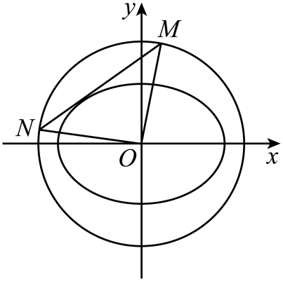

<strong>变式1．</strong>（2024秋·浙江宁波·高三期末）法国数学家加斯帕尔·蒙日被誉为画法几何之父.他在研究椭圆切线问题时发现了一个有趣的重要结论：一椭圆的任两条互相垂直的切线交点的轨迹是一个圆，尊称为蒙日圆，且蒙日圆的圆心是该椭圆的中心，半径为该椭圆的长半轴与短半轴平方和的算术平方根.已知在椭圆中，离心率，左、右焦点分别是、，上顶点为<em>Q</em>，且，<em>O</em>为坐标原点.

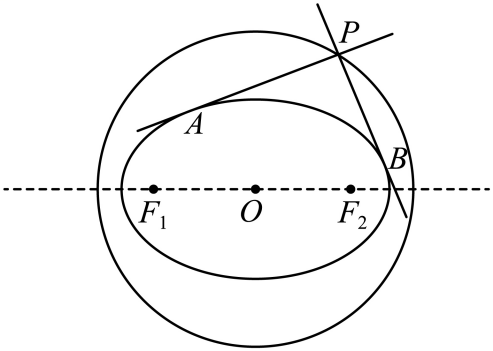

(1)求椭圆*C*的方程，并请直接写出椭圆*C*的蒙日圆的方程；

(2)设*P*是椭圆*C*外一动点（不在坐标轴上），过*P*作椭圆*C*的两条切线，过*P*作*x*轴的垂线，垂足*H*，若两切线斜率都存在且斜率之积为，求面积的最大值.

【解析】（1）设椭圆方程为，焦距为2*c*.

由题意可知，

所以，椭圆*C*的方程为，

且蒙日圆的方程为；

（2）设，设过点*P*的切线方程为，

由，消去*y*得①，

由于相切，所以方程①的，可得：，

整理成关于*k*的方程可得：，

由于*P*在椭圆外，故，

故，

设过点*P*的两切线斜率为，

据题意得，，，

又因为，所以可得，

即点的轨迹方程为：，

由不等式可知：，

即，当且仅当时取等号，此时，

所以，即的面积的最大值为.

<strong>变式2．</strong>（2024·吉林白山·统考二模）法国数学家加斯帕尔·蒙日创立的《画法几何学》对世界各国科学技术的发展影响深远<em>．</em>在双曲线<em>-=</em>1（<em>a&gt;b&gt;</em>0）中，任意两条互相垂直的切线的交点都在同一个圆上，它的圆心是双曲线的中心，半径等于实半轴长与虚半轴长的平方差的算术平方根，这个圆被称为蒙日圆<em>．</em>已知双曲线<em>C</em>：<em>-=</em>1（<em>a&gt;b&gt;</em>0）的实轴长为6，其蒙日圆方程为<em>x2+y2=</em>1<em>．</em>

(1)求双曲线*C*的标准方程；

(2)设*D*为双曲线*C*的左顶点，直线*l*与双曲线*C*交于不同于*D*的*E*，*F*两点，若以*EF*为直径的圆经过点*D*，且*DG*⊥*EF*于*G*，证明：存在定点*H*，使*|GH|* 为定值*．*

【解析】（1）由题意知<em>a=</em>3，因为双曲线<em>C</em>的蒙日圆方程为<em>x2+y2=</em>1，

所以<em>a2-b2=</em>1，所以<em>b=</em>2，

故双曲线*C*的标准方程为*-=* 1，

（2）证明：设<em>E</em>（<em>x1</em>，<em>y1</em>），<em>F</em>（<em>x2</em>，<em>y2</em>）<em>．</em>

当直线*l*的斜率存在时，设*l*的方程为*y=kx+m*，

联立方程组化简得（8<em>-</em>9<em>k2</em>）<em>x2-</em>18km<em>x-</em>（9<em>m2+</em>72）<em>=</em>0，

则Δ<em>=</em>（18km）2<em>+</em>4（9<em>m2+</em>72）（8<em>-</em>9<em>k2</em>）<em>&gt;</em>0，即<em>m2-</em>9<em>k2+</em>8<em>&gt;</em>0，

且

因为·<em>=</em>（<em>x1+</em>3）（<em>x2+</em>3）<em>+y1y2=</em>0，

所以（<em>k2+</em>1）·<em>x1x2+</em>（km<em>+</em>3）（<em>x1+x2</em>）<em>+m2+</em>9

<em>=</em>（<em>k2+</em>1）·<em>+</em>（km<em>+</em>3）·<em>+m2+</em>9<em>=</em>0，

化简得<em>m2-</em>54km<em>+</em>153<em>k2=</em>（<em>m-</em>3<em>k</em>）（<em>m-</em>51<em>k</em>）<em>=</em>0，

所以<em>m=</em>3<em>k</em>或<em>m=</em>51<em>k</em>，且均满足<em>m2-</em>9<em>k2+</em>8<em>&gt;</em>0

当*m=* 3*k*时，直线*l*的方程为*y=k*（*x+* 3），直线过定点（*-* 3，0），与已知矛盾，

当*m=* 51*k*时，直线*l*的方程为*y=k*（*x+* 51），过定点*M*（*-* 51，0）

当直线*l*的斜率不存在时，由对称性不妨设直线*DE*：*y=x+* 3，

联立方程组得*x=-* 3（舍去）或*x=-* 51，此时直线*l*过定点*M*（*-* 51，0）*．*

因为*DG*⊥*EF*，所以点*G*在以*DM*为直径的圆上，*H*为该圆圆心，*|GH|* 为该圆半径*．*

故存在定点*H*（*-* 27，0），使*|GH|* 为定值24.

**变式3．**（2022秋·江苏盐城·高三校联考阶段练习）定义椭圆的“蒙日圆”的方程为，已知椭圆的长轴长为4，离心率为.

(1)求椭圆的标准方程和它的“蒙日圆”*E*的方程；

(2)过“蒙日圆”*E*上的任意一点*M*作椭圆的一条切线，*A*为切点，延长*MA*与“蒙日圆”*E*交于点，*O*为坐标原点，若直线*OM*，*OD*的斜率存在，且分别设为，证明：为定值.

【解析】（1）由题意知

，

故椭圆的方程,

“蒙日圆”的方程为,即

（2）当切线的斜率存在且不为零时,设切线的方程为,则

由,消去得

,

由,消去得

设,则,

，

，

当切线的斜率不存在或为零时,易得成立,

为定值.

**变式4．**（2022·全国·高三专题练习）已知椭圆的左、右焦点分别为、，离心率为．

(1)求椭圆的标准方程；

(2)若动点为椭圆外一点，且点到椭圆的两条切线相互垂直，求点的轨迹方程；

(3)若过椭圆上任意一点的切线与（2）中所求点的轨迹方程交于、两点，求证：．

【解析】（1）由题意可得，，则，，

所以，椭圆的方程为.

（2）设点，若两切线分别与两坐标轴垂直，则，，

此时；

若两切线的斜率都存在，设两切线的斜率分别为、，

切线的方程设为，联立椭圆方程，

可得，

，

可得，

由题意可得，整理可得.

综上所述，点的轨迹方程为.

（3）设点，则，且，

，

，

所以，，

连接，设过点且垂直于的直线交圆于、两点，

由垂径定理可知为的中点，且，

所以，,

连接，易得，

所以，所以

所以.

**变式5．**（2019·云南昆明·高三云南师大附中校考阶段练习）已知椭圆：的一个焦点为,离心率为.

（1）求的标准方程；

（2）若动点为外一点,且到的两条切线相互垂直,求的轨迹的方程；

（3）设的另一个焦点为,过上一点的切线与（2）所求轨迹交于点,,求证：.

【解析】（1）设,

由题设,得,,所以,,

所以的标准方程为.

（2）如图,设,切点分别为,,

当时,设切线方程为,

联立方程,得,

消去,得,①

关于的方程①的判别式,

化简,得,②

关于的方程②的判别式,

因为在椭圆外,

所以,即,所以.

关于的方程②有两个实根,分别是切线,的斜率,

因为,所以,即,化简为,

当时,可得,满足,

所以的轨迹方程为.

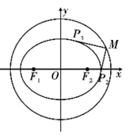

（3）证明：如图,设,先求.

方法一：由相交弦定理,得

.

方法二：切线的参数方程为（为参数）,

,

代入圆,整理得,

因为点在圆内,

所以上述方程必有两个不等实根,,,且,

所以,

当时,,仍有.

再求.

,

因为点在椭圆上,所以,即,

所以,

所以.

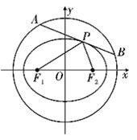

**变式6．**（2022·全国·高三专题练习）设椭圆的中心在原点，焦点在轴上，垂直轴的直线与椭圆相交于、两点，当的周长取最大值时，．

(1)求椭圆的方程；

(2)过圆上任意一点作椭圆的两条切线、，直线、与圆的另一交点分别为、,

①证明：；

②求面积的最大值．

【解析】（1）根据题意，设椭圆的标准方程为，

如图，不妨设焦点为椭圆的左焦点，为椭圆的右焦点，与的交点为，

所以，由椭圆定义，

因为在中，，且当点与点重合时，等号成立，

所以，，当点与点重合时，等号成立，

所以，

所以，的周长取最大值时，直线过椭圆的另一焦点，且最大值为，

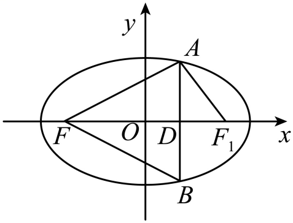

所以把代入椭圆的方程可得，

因为，所以，，

因为的周长最大值为，所以，解得，，

所以，椭圆的方程为．

（2）①设，，则．

当切线的斜率都存在时，设切线的方程为：，

代入椭圆的方程可得：，

所以，△，化为．

所以，当时，设直线、的斜率分别为，

所以，，故．

当时，有一条切线的斜率不存在，

点可以为或或或，

此时，两条切线为和，或和，或和或和，满足；

综上可得：．

②由①可得：，

所以，为的直径，因此过圆心即原点．

所以，当时，面积取得最大值．

**题型二：内圆与外圆问题**

**例4．**（2022·全国·高三专题练习）已知椭圆及圆，过点与椭圆相切的直线交圆于点，若，求椭圆的离心率．

【解析】由，可得为等边三角形，即，

设直线的方程为，则

圆心到直线的距离为，弦长，解得，

，消去，整理得，

因为直线和椭圆相切，

所以，化简可得，

由，可得，

即有．

**例5．**（2022·全国·高三专题练习）已知椭圆和圆，，分别是椭圆的左、右两焦点，过且倾斜角为的动直线交椭圆于，两点，交圆于，两点（如图所示，点在轴上方）．当时，弦的长为．

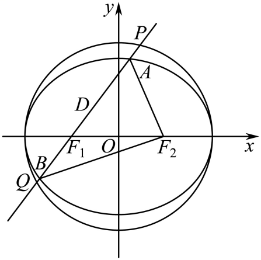

(1)求圆与椭圆的方程；

(2)若，求直线的方程．

【解析】（1）取的中点，连接，，如图所示：

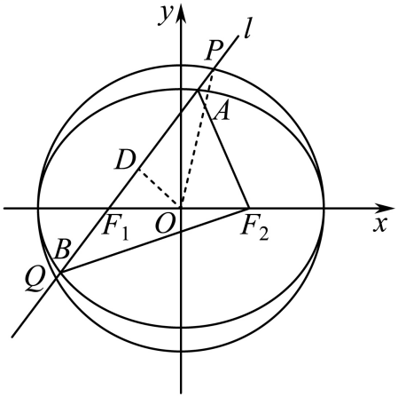

由，，，可得，

由弦的长为，∴，

，，

所以圆的方程为，椭圆的方程为；

（2）由（1）知，，离心率，

又，得，，

设，，则，，

代入，得，解得，

代入，得．，

则直线的方程为：，即．

**例6．**（2022·全国·高三专题练习）已知椭圆和圆分别是椭圆的左、右两焦点，过且倾斜角为的动直线交椭圆于两点，交圆于两点（如图所示），当时，弦的长为．

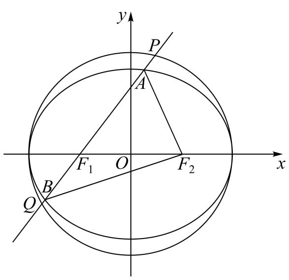

（1）求圆和椭圆的方程

（2）若点是圆上一点，求当成等差数列时，面积的最大值．

【解析】（1）取的中点，连接

由，可得，

∵，∴

∴

∴圆的方程为，椭圆的方程为

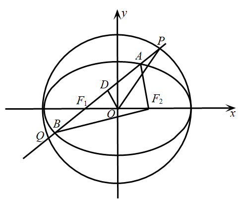

（2）∵成等差数列，所以,又因为，

∴

设，则，得，

∴

∴到的距离为，

又圆上一点到直线的距离的最大值为

∴的面积的最大值为．

<strong>变式7．</strong>（2017·上海嘉定·统考二模）如图，已知椭圆过点两个焦点为和.圆<em>O</em>的方程为.

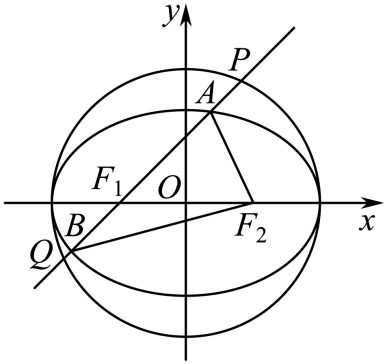

（1）求椭圆*C*的标准方程；

（2）过且斜率为的动直线*l*与椭圆*C*交于*A*、*B*两点，与圆*O*交于*P*、*Q*两点（点*A*、*P*在*x*轴上方），当成等差数列时，求弦*PQ*的长.

【解析】（1）由题意，，

设椭圆*C*的方程为，将点代入，

解得或（舍去），

所以，椭圆*C*的方程为.

（2）由椭圆定义，，两式相加，得

，因为成等差数列，

所以，

于是，即.

设，由解得，

所以，，直线*l*的方程为，

即，

圆*O*的方程为，圆心*O*到直线*l*的距离，

此时，弦*PQ*的长.

**变式8．**（2022·全国·高三专题练习）如图，已知椭圆和圆（其中圆心为原点），过椭圆上异于上、下顶点的一点引圆的两条切线，切点分别为．

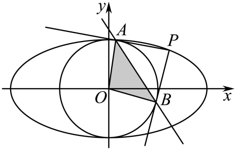

(1)求直线的方程；

(2)求三角形面积的最大值．

【解析】（1）因为，

所以以点为圆心，为半径的圆的方程为．

因为圆与圆两圆的公共弦所在的直线即为直线，

所以联立方程组，

由，得，

所以直线的方程为．

（2）由（1）知，直线的方程为，

所以点到直线的距离为．

因为，

所以三角形的面积．

因为点，在椭圆上，

所以，即．

设，

所以．

当且仅当时，等号成立；

当，即时，三角形的面积取得最大值；

当，即时，三角形的面积取得最大值.

**变式9．**（2022·全国·高三专题练习）如图，椭圆和圆，已知椭圆的离心率为，直线与圆相切．

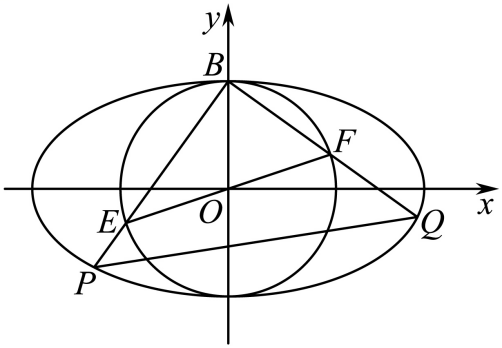

(1)求椭圆的标准方程；

(2)椭圆的上顶点为，是圆的一条直径，不与坐标轴重合，直线、与椭圆的另一个交点分别为、，求的面积的最大值及此时所在的直线方程．

【解析】（1）直线与圆相切，则，

由椭圆的离心率，解得：，

椭圆的标准方程：；

（2）由题意知直线，的斜率存在且不为0，，

不妨设直线的斜率为，则直线．

由，得，或，

所以.

用代替，

则，

，

，

设，则．

当且仅当即时取等号，

所以.

即，．

直线的斜率，

所在的直线方程：.

**变式10．**（2022·全国·高三专题练习）已知椭圆和圆，过椭圆上一点引圆的两条切线，切点分别为．

（Ⅰ）若圆过椭圆的两个焦点，求椭圆的离心率的值；

（Ⅱ）设直线与、轴分别交于点，问当点在椭圆上运动时，是否为定值？请证明你的结论．

【解析】（Ⅰ）∵ 圆过椭圆的焦点，圆：，

∴ ，

∴ ， ，∴．

（Ⅱ）设，

由得，则, 整理得

∴方程为：，

同理可得方程为：．

从而直线的方程为：．

令，得，令，得

∴，

∴为定值，定值是.

**题型三：直径为圆问题**

**例7．**（2024秋·湖南岳阳·高三校考阶段练习）已知椭圆经过点，左，右焦点分别为，，为坐标原点，且．

(1)求椭圆的标准方程；

(2)设*A*为椭圆的右顶点，直线与椭圆相交于，两点，以为直径的圆过点*A*，求的最大值．

【解析】（1）根据题意可得解得，，

所以椭圆的方程为．

（2）

由(1)得，设直线的方程为，，，，

联立，得，

所以，

，,

，

，

因为以为直径的圆过点*A*，故，所以，

所以，所以，

所以，所以，

解得或舍去，

当时，，且，点*A*到*MN*的距离为，

所以，

化简得，

令，则，

，

由对勾函数的单调性知，在上单调递增，

即时取得最小值，此时.

**例8．**（2024秋·湖南长沙·高三长沙一中校考阶段练习）已知椭圆过和两点.

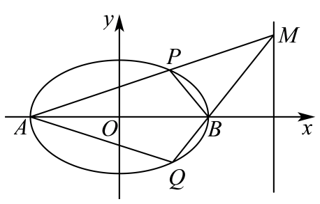

(1)求椭圆*C*的方程；

(2)如图所示，记椭圆的左、右顶点分别为*A*，*B*，当动点*M*在定直线上运动时，直线，分别交椭圆于两点*P*和*Q*.

（i）证明：点*B*在以为直径的圆内；

（ii）求四边形面积的最大值.

【解析】（1）依题意将和两点代入椭圆可得

，解得；

所以椭圆方程为

（2）（i）易知，由椭圆对称性可知，不妨设，；

根据题意可知直线斜率均存在，且；

所以直线的方程为，的方程为；

联立直线和椭圆方程，消去可得；

由韦达定理可得，解得，则；

联立直线和椭圆方程，消去可得；

由韦达定理可得，解得，则；

则，；

所以；

即可知为钝角，

所以点*B*在以为直径的圆内；

（ii）易知四边形的面积为，

设，则，当且仅当时等号成立；

由对勾函数性质可知在上单调递增，

所以，可得，

由对称性可知，即当点的坐标为或时，

四边形的面积最大，最大值为6.

**例9．**（2024·山西大同·统考模拟预测）已知椭圆的离心率为，且直线是抛物线的一条切线．

(1)求椭圆的方程；

(2)过点的动直线交椭圆于两点，试问：在直角坐标平面上是否存在一个定点，使得以为直径的圆恒过定点？若存在，求出的坐标；若不存在，请说明理由．

【解析】（1）由得

直线是抛物线的一条切线．所以

，所以椭圆

（2）

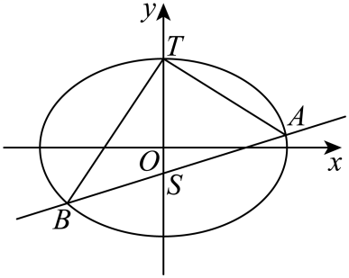

当直线与轴平行时，以为直径的圆方程为

当直线与轴重合时，以为直径的圆方程为

所以两圆的交点为点猜想：所求的点为点．

证明如下．当直线与轴垂直时，以为直径的圆过点

当直线与轴不垂直时，可设直线为：

由得，设，则

则

所以，即以为直径的圆过点

所以存在一个定点，使得以为直径的圆恒过定点．

**变式11．**（2024秋·福建福州·高三闽侯县第一中学校考阶段练习）已知椭圆的离心率是，上、下顶点分别为，.圆与轴正半轴的交点为，且.

(1)求的方程；

(2)直线与圆相切且与相交于，两点，证明：以为直径的圆恒过定点.

【解析】（1）由已知得，，.

则，，，所以.

因为，又，所以，.

故的方程为.

（2）当直线的斜率存在时，设的方程为，即.

因为直线与圆相切，所以，即.

设，，则，.

由化简，得，

由韦达定理，得

所以，

所以，

故，即以为直径的圆过原点.

当直线的斜率不存在时，的方程为或.

这时，或，.

显然，以为直径的圆也过原点.综上，以为直径的圆恒过原点.

**变式12．**（2024秋·广东广州·高三广州市第六十五中学校考阶段练习）已知椭圆的左顶点为，上顶点为，右焦点为，为坐标原点，线段的中点为，且．

(1)求方程；

(2)已知点、均在直线上，以为直径的圆经过点，圆心为点，直线、分别交椭圆于另一点、，证明直线与直线垂直．

【解析】（1）由题意知：，，则，而，

∴，即，又，

∴，解得或（舍去），故，

∴的方程.

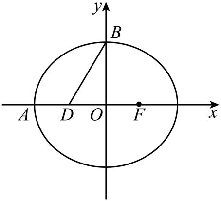

（2）令，，则，而，

∴，，

联立椭圆方程，整理得，显然，

若，则，得，则，即，

同理，整理得，显然，

若，可得，则，即.

∴，

又，则，所以，故，而，

∴，则直线与直线垂直，得证.

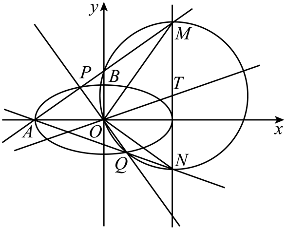

<strong>变式13．</strong>（2024·全国·高三专题练习）已知椭圆的左、右焦点分别为，，<em>A</em>，<em>B</em>分别是<em>C</em>的右、上顶点，且，<em>D</em>是<em>C</em>上一点，周长的最大值为8.

(1)求*C*的方程；

(2)*C*的弦过，直线，分别交直线于*M*，*N*两点，*P*是线段的中点，证明：以为直径的圆过定点.

【解析】（1）依题意，，

周长，当且仅当三点共线时等号成立，故，

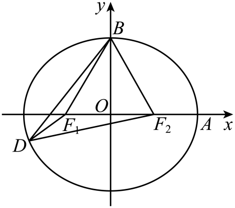

所以，所以的方程；

（2）设，直线，代入，整理得，

，，

易知，令，得，同得，

从而中点，

以为直径的圆为，

由对称性可知，定点必在轴上，

令得，，

，

所以，即，因为，

所以，即，

解得，所以圆过定点.

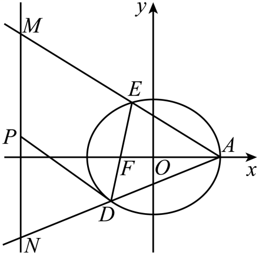

**变式14．**（2024秋·全国·高三校联考开学考试）在平面直角坐标系中，已知分别为椭圆的左、右焦点.为椭圆上的一个动点，的最大值为，且点到右焦点距离的最小值为，直线交椭圆于异于椭圆右顶点的两个点.

(1)求椭圆的标准方程；

(2)若以为直径的圆恒过点，求证：直线恒过定点，并求此定点的坐标.

【解析】（1）因为的最大值为，

所以为短轴的顶点时，，此时易得.

又点到右焦点距离的最小值为，即，

解得.

又由，可得.

所以椭圆的标准方程为；

（2）证明：当直线的斜率不存在时，

设，联立，

解得，

所以或.

又，

所以或，

因为以为直径的圆恒过点，

所以.

所以，

解得或（舍去），

此时直线的方程为.

当直线的斜率存在时，易知直线的斜率不为0，设，

联立，

消去得：.

由，得，

由根与系数的关系，知.

因为，

所以，

将代入上式，

整理得，

即，所以或.

当时，直线为，此时直线过点，不符合题意，舍去；

当时，直线为，此时直线过定点.

综上所述，直线恒过定点.

**变式15．**（2024秋·重庆·高三统考开学考试）已知、是椭圆的左、右焦点，点在椭圆上，且.

(1)求椭圆的方程；

(2)已知，两点的坐标分别是，，若过点的直线与椭圆交于，两点，且以为直径的圆过点，求出直线的所有方程.

【解析】（1）因为，

所以椭圆的左焦点的坐标是，

所以

解得

所以椭圆的方程为.

（2）若直线与轴垂直，则直线与椭圆的交点，的坐标分别是，，

以为直径的圆显然过点，此时直线的方程是；

若直线与轴不垂直，设直线的方程是，

与椭圆的方程联立，消去并整理，得.

设，，则，

，，

.

因为以为直径的圆过点，

所以，即，，

所以，，

，解得.

显然满足，

所以直线与轴不垂直时，直线的方程是，即.

综上所述，当以为直径的圆经过点时，直线的方程是或.

**变式16．**（2022秋·广东梅州·高三大埔县虎山中学校考阶段练习）如图，椭圆的左焦点为，右焦点为，离心率，过的直线交椭圆于、两点，且的周长为.

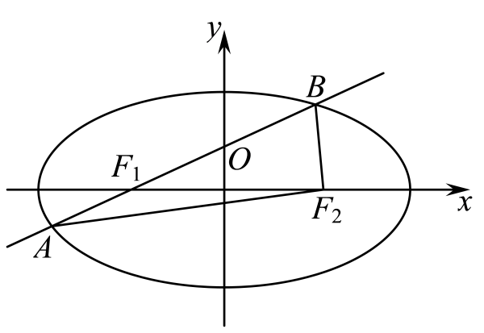

(1)求椭圆的方程；

(2)设动直线与椭圆有且只有一个公共点，且与直线相交于点，则在轴上一定存在定点，使得以为直径的圆恒过点，试求出点的坐标.

【解析】（1）由椭圆的定义可知的周长为，即，

因为，所以，，

又因为，所以，，

故椭圆的方程为：.

（2）联立可得，

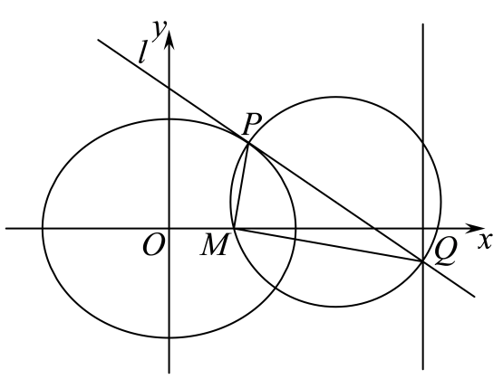

因为动直线与椭圆有且只有一个公共点，

所以，，

所以，，

此时，，

故点，

由可得，即点，

假设在轴上存在定点，使得以为直径的圆恒过点，

设，则，且，，

所以，，

整理得对任意实数、恒成立，则，

故在轴上存在定点，使得以为直径的圆恒过点.

**题型四：四点共圆问题**

<strong>例10．</strong>（2024·全国·高三专题练习）在平面直角坐标系中，已知，，动点<em>P</em>满足，且.设动点<em>P</em>形成的轨迹为曲线<em>C</em>.

(1)求曲线*C*的标准方程；

(2)过点的直线*l*与曲线*C*交于*M*，*N*两点，试判断是否存在直线*l*，使得*A*，*B*，*M*，*N*四点共圆.若存在，求出直线*l*的方程；若不存在，说明理由.

【解析】（1）设，则，，，

因为，所以，

所以，，所以，，

又，整理得，

即曲线*C*的标准方程为；

（2）易知当*l*的斜率不存在时，直线*l*与曲线*C*没有两个交点，所以直线*l*的斜率存在，

设*l*：，将直线*l*与曲线*C*联立，得，

消去*y*，整理得，

因为且，

所以且，

设，，

则，，

所以*MN*的中点，

且，

将，代入上式，

整理得，

当时，线段*MN*的中垂线方程为：，

令*y*＝0，解得，即与*x*轴的交点坐标为，

当*k*＝0时，线段*MN*的中垂线为*y*轴，与*x*轴交于原点，符合*Q*点坐标，

因为*AB*的中垂线为*x*轴，所以若*A*，*B*，*M*，*N*共圆，则圆心为，

所以，

所以，

整理得，即，

因为且，

所以上述方程无解，即不存在直线*l*符合题意.

**例11．**（2024秋·新疆乌鲁木齐·高三乌鲁木齐市十二中校考阶段练习）已知抛物线上的点到其焦点的距离为．

(1)求和的值；

(2)若直线交抛物线于、两点，线段的垂直平分线交抛物线于、两点，求证：、、、四点共圆．

【解析】（1）抛物线的焦点为，准线方程为，

点到其焦点的距离为，则，可得，故抛物线的方程为．

将点的坐标代入抛物线方程可得，解得.

（2）由中垂线的性质可得，，，，所以，，

设、，联立消去并整理，得，

则，，且，即，

则．

设线段的中点为，则点的纵坐标为，

所以，点的横坐标为，则．

直线为线段的垂直平分线，所以，直线的方程为．

设、，联立，

消去并整理得，，可得，

则，，

故．

设线段的中点为，则．

，

，，

故，所以，，，

故，故，

所以，点、都在以为直径的圆上，故、、、四点共圆．

**例12．**（2022·全国·高三专题练习）已知椭圆的左、右焦点分别为，，左顶点为，且离心率为．

(1)求*C*的方程；

(2)直线交*C*于*E*，*F*两点，直线*AE*，*AF*分别与*y*轴交于点*M*，*N*，求证：*M*，，*N*，四点共圆．

【解析】（1）由题意知，解得，，，所以*C*的方程为．

（2）证明：设点（不妨设，则点，

由，消去*y*得，所以，，

所以直线*AE*的方程为．

因为直线*AE*与*y*轴交于点*M*，令得，

即点，同理可得点．

所以，，

所以，所以，同理．

则以*MN*为直径的圆恒过焦点，，即*M*，，*N*，四点共圆．

综上所述，*M*，，*N*，四点共圆．

<strong>变式17．</strong>（2022·全国·高三专题练习）已知椭圆的右顶点为点<em>A</em>，直线<em>l</em>交<em>C</em>于<em>M</em>，<em>N</em>两点，<em>O</em>为坐标原点．当四边形<em>AMON</em>为菱形时，其面积为．

(1)求*C*的方程；

(2)若；是否存在直线*l*，使得*A*，*M*，*O*，*N*四点共圆？若存在，求出直线*l*的方程，若不存在，请说明理由．

【解析】（1）因为四边形*AMON*为菱形，所以*MN*垂直平分*OA*，

所以点*M*（*x*轴上方）的横坐标为，代入椭圆方程，

得*M*的纵坐标为，所以，菱形*AMON*的面积为，所以，

所以*C*的方程为．

（2）设直线，，

联立方程，得，

，

，，

因为*O*，*M*，*N*，*A*四点共圆，则∠*MON*＝∠*MAN*＝90°，

所以，即，

得，即

由（*i*）得，即，

由（*ii*）得，

即，

联立，解得，（此时直线*l*过点*A*，舍去），

将代入，解得，即，

所以直线*l*的方程为．

**变式18．**（2024·全国·高三专题练习）已知椭圆的左、右焦点分别为，，左顶点为，且过点．

(1)求*C*的方程；

(2)过原点*O*且与*x*轴不重合的直线交*C*于*E*，*F*两点，直线*AE*，*AF*分别与*y*轴交于点*M*，*N*，求证：*M*，，*N*，四点共圆．

【解析】（1）由题意知

解得，，

所以*C*的方程为．

（2）证明：当直线*EF*的斜率不存在时，*E*，*F*为短轴的两个端点，则，或，所以，，则以*MN*为直径的圆恒过焦点，即*M*、，*N*，四点共圆．

当*EF*的斜率存在且不为零时，设直线*EF*的方程为，

设点（不妨设，则点．

由消去*y*得，所以，，

所以直线*AE*的方程为．

因为直线*AE*与*y*轴交于点*M*，令得，

即点，

同理可得点．

所以，，

所以，所以，同理．

则以*MN*为直径的圆恒过焦点，，即*M*，，*N*，四点共圆．

综上所述，*M*，，*N*，四点共圆．

<strong>变式19．</strong>（2024·山东青岛·山东省青岛第五十八中学校考一模）椭圆的离心率为，右顶点为<em>A</em>，设点<em>O</em>为坐标原点，点<em>B</em>为椭圆<em>E</em>上异于左、右顶点的动点，面积的最大值为．

(1)求椭圆*E*的标准方程；

(2)设直线交*x*轴于点*P*，其中，直线*PB*交椭圆*E*于另一点*C*，直线*BA*和*CA*分别交直线*l*于点*M*和*N*，若*O、A、M、N*四点共圆，求*t*的值．

【解析】（1）由题意，设椭圆半焦距为*c*，则，即，得，

设，由，所以的最大值为，

将代入，有，解得，

所以椭圆的标准方程为；

（2）设，因为点*B*为椭圆*E*上异于左、右顶点的动点，则直线*BC*不与*x*轴重合，

设直线*BC*方程为，与椭圆方程联立得，

，可得，

由韦达定理可得，

直线*BA*的方程为，令得点*M*纵坐标，

同理可得点*N*纵坐标，

当*O、A、M、N*四点共圆，由相交弦定理可得，即，

，

由，故，解得．

<strong>变式20．</strong>（2024·全国·高三专题练习）已知椭圆<em>E</em>：的离心率为，且经过点(-1，).

(1)求椭圆*E*的标准方程；

(2)设椭圆*E*的右顶点为*A*，点*O*为坐标原点，点*B*为椭圆*E*上异于左､右顶点的动点，直线*l*：交*x*轴于点*P*，直线*PB*交椭圆*E*于另一点*C*，直线*BA*和*CA*分别交直线*l*于点*M*和*N*，若*O*､*A*､*M*､*N*四点共圆，求*t*的值.

【解析】（1）依题意：，解得：，，

故椭圆*C*的方程为；

（2）设*B*(，)，*C*(，)，∵点*B*为椭圆*E*上异于左､右顶点的动点，

则直线*BC*不与*x*轴重合，则可设*BC*为，

与椭圆方程联立得，

则，可得，

由韦达定理可得．

直线*BA*的方程为，令得点*M*纵坐标

同理可得，点*N*纵坐标

当*O*､*A*､*M*､*N*四点共圆时，由割线定理可得，即，

∵

．

由，故，解得．

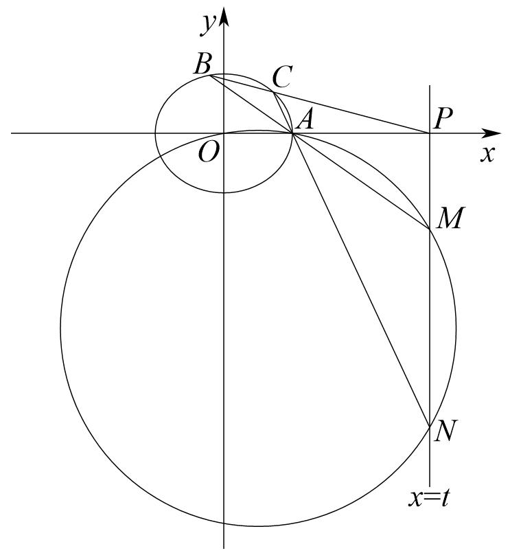

<strong>变式21．</strong>（2024·全国·高三专题练习）已知抛物线：，是上位于第一象限内的动点，它到点距离的最小值为，直线与交于另一点，线段<em>AD</em>的垂直平分线交于<em>E</em>，<em>F</em>两点.

(1)求的值；

(2)若，证明*A*，*D*，*E*，*F*四点共圆，并求该圆的方程.

【解析】（1）设，则，

令，则，

对于二次函数，其对称轴为，

当时，，在上单调递增，其最小值为9，即的最小值为3，不满足题意，

当时，，所以当时取得最小值，即

所以，解得或（舍）

所以

（2）由（1）可得，当时，，点，

所以，直线的方程为，

由可得，解得或，所以，

所以的中点为，所以直线的方程为，即，

设，由可得，所以

所以线段的中点为，

因为，所以*A*，*D*，*E*，*F*四点共圆，圆心为，半径为8，

所以该圆的方程为

