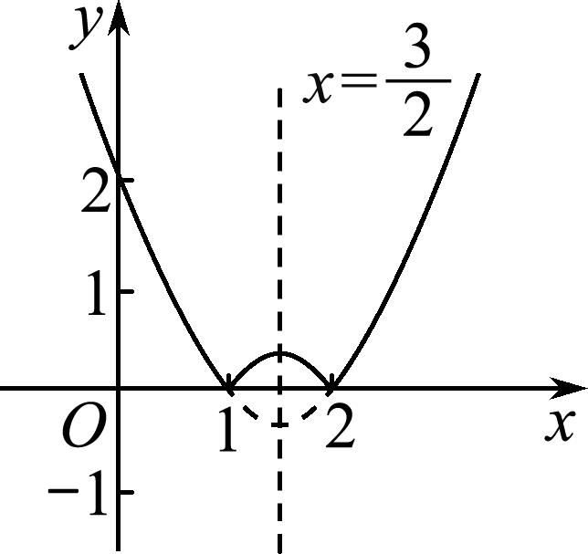
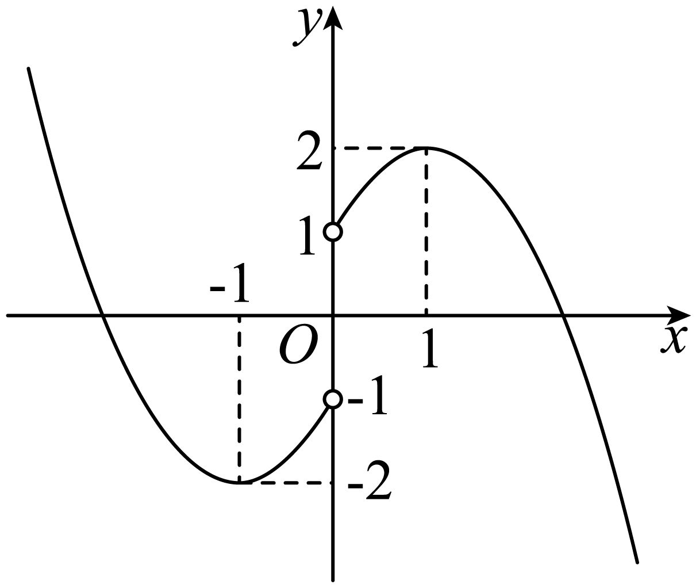
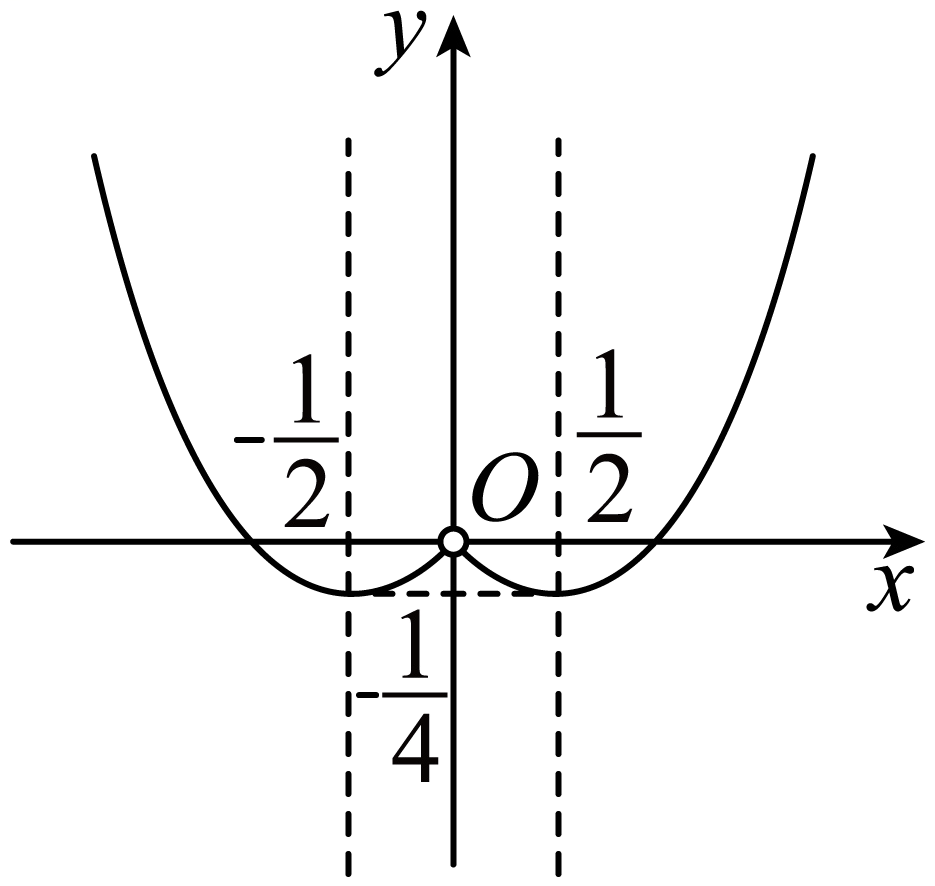
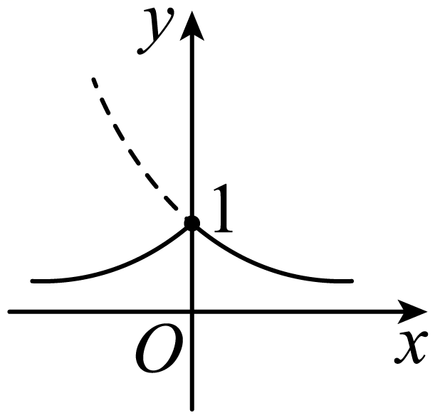
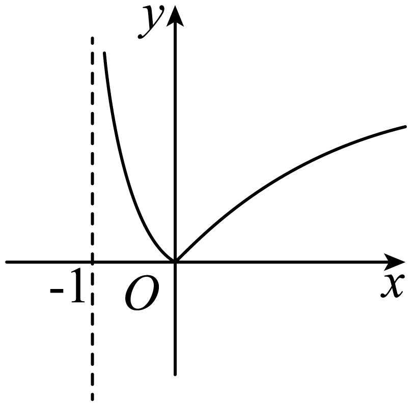
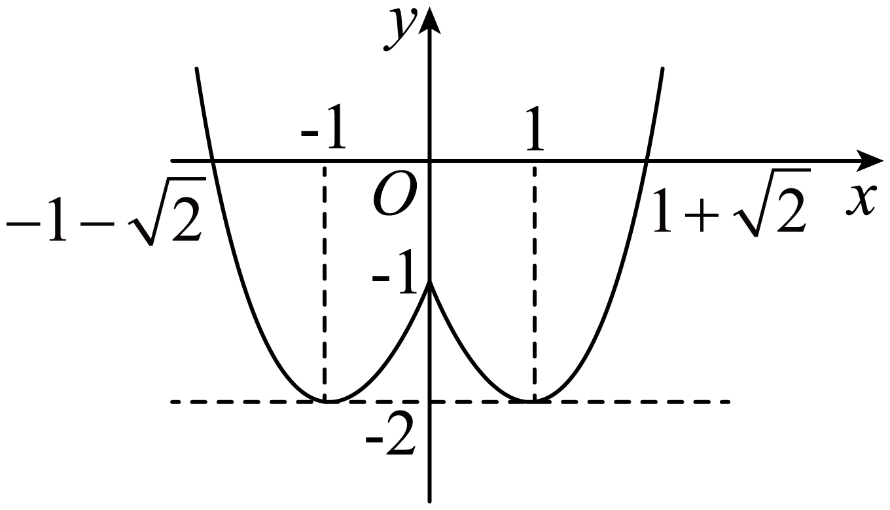
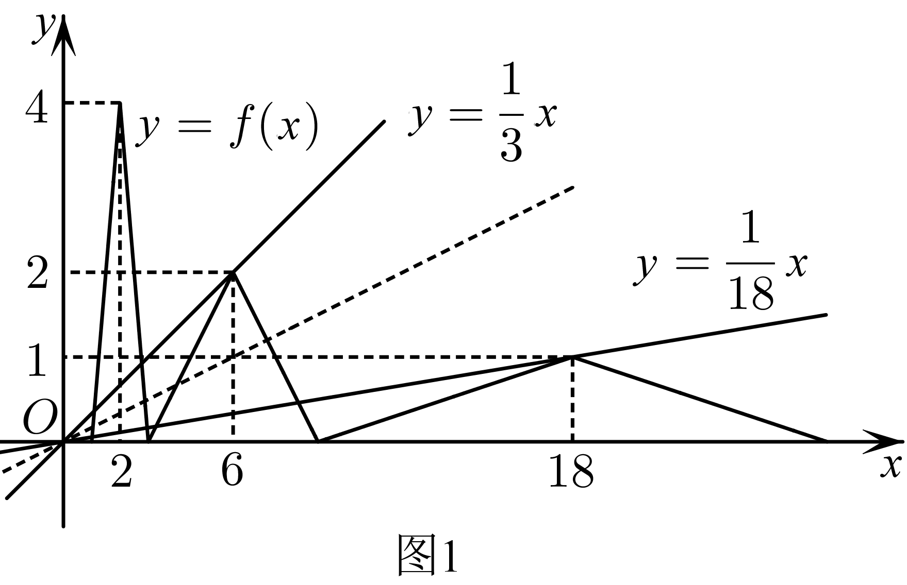
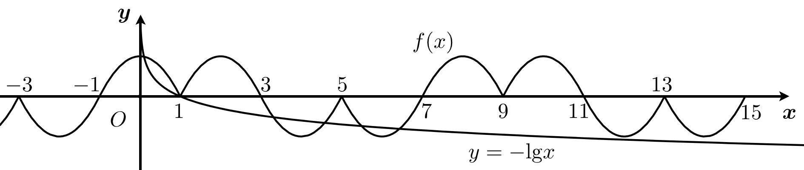

**第7讲  函数的性质**

**知识梳理**

**1、函数的单调性**

（1）单调函数的定义

一般地，设函数的定义域为，区间：

如果对于内的任意两个自变量的值，当时，都有，那么就说在区间上是增函数．

如果对于内的任意两个自变量的值，，当时，都有，那么就说在区间上是减函数．

①属于定义域内某个区间上；

②任意两个自变量，且；

③都有或；

④图象特征：在单调区间上增函数的图象从左向右是上升的，减函数的图象从左向右是下降的．

（2）单调性与单调区间

①单调区间的定义：如果函数在区间上是增函数或减函数，那么就说函数在区间上具有单调性，称为函数的单调区间．

②函数的单调性是函数在某个区间上的性质．

（3）复合函数的单调性

复合函数的单调性遵从“同增异减”，即在对应的取值区间上，外层函数是增（减）函数，内层函数是增（减）函数，复合函数是增函数；外层函数是增（减）函数，内层函数是减（增）函数，复合函数是减函数.

**2、函数的奇偶性**

函数奇偶性的定义及图象特点

<table><tr><td>
奇偶性
</td><td>
定义
</td><td>
图象特点
</td></tr><tr><td>
偶函数
</td><td>
如果对于函数的定义域内任意一个，都有，那么函数就叫做偶函数
</td><td>
关于轴对称
</td></tr><tr><td>
奇函数
</td><td>
如果对于函数的定义域内任意一个，都有，那么函数就叫做奇函数
</td><td>
关于原点对称
</td></tr></table>

判断与的关系时，也可以使用如下结论：如果或，则函数为偶函数；如果或，则函数为奇函数．

注意：由函数奇偶性的定义可知，函数具有奇偶性的一个前提条件是：对于定义域内的任意一个，也在定义域内(即定义域关于原点对称)．

**3、函数的对称性**

(1)若函数为偶函数，则函数关于对称．

(2)若函数为奇函数，则函数关于点对称．

(3)若，则函数关于对称．

(4)若，则函数关于点对称．

**4、函数的周期性**

（1）周期函数：

对于函数，如果存在一个非零常数，使得当取定义域内的任何值时，都有，那么就称函数为周期函数，称为这个函数的周期.

（2）最小正周期：

如果在周期函数的所有周期中存在一个最小的正数，那么称这个最小整数叫做的最小正周期.

**【解题方法总结】**

**1、单调性技巧**

（1）证明函数单调性的步骤

①取值：设，是定义域内一个区间上的任意两个量，且；

②变形：作差变形(变形方法：因式分解、配方、有理化等)或作商变形；

③定号：判断差的正负或商与的大小关系；

④得出结论．

（2）函数单调性的判断方法

①定义法：根据增函数、减函数的定义，按照“取值—变形—判断符号—下结论”进行判断．

②图象法：就是画出函数的图象，根据图象的上升或下降趋势，判断函数的单调性．

③直接法：就是对我们所熟悉的函数，如一次函数、二次函数、反比例函数等，直接写出它们的单调区间．

（3）记住几条常用的结论：

①若是增函数，则为减函数；若是减函数，则为增函数；

②若和均为增(或减)函数，则在和的公共定义域上为增(或减)函数；

③若且为增函数，则函数为增函数，为减函数；

④若且为减函数，则函数为减函数，为增函数．

**2、奇偶性技巧**

(1)函数具有奇偶性的必要条件是其定义域关于原点对称.

(2)奇偶函数的图象特征.

函数是偶函数函数的图象关于轴对称；

函数是奇函数函数的图象关于原点中心对称.

(3)若奇函数在处有意义，则有；

偶函数必满足.

(4)偶函数在其定义域内关于原点对称的两个区间上单调性相反；奇函数在其定义域内关于原点对称的两个区间上单调性相同.

(5)若函数的定义域关于原点对称，则函数能表示成一个偶函数与一个奇函数的和的形式.记，，则.

(6)运算函数的奇偶性规律：运算函数是指两个（或多个）函数式通过加、减、乘、除四则运算所得的函数，如.

对于运算函数有如下结论：奇奇=奇；偶偶=偶；奇偶=非奇非偶；

奇奇=偶；奇偶=奇；偶偶=偶.

(7)复合函数的奇偶性原来：内偶则偶，两奇为奇.

(8)常见奇偶性函数模型

奇函数：①函数或函数．

②函数．

③函数或函数

④函数或函数．

注意：关于①式，可以写成函数或函数．

偶函数：①函数．

②函数．

③函数类型的一切函数．

④常数函数

**3、周期性技巧**

**4、函数的的对称性与周期性的关系**

（1）若函数有两条对称轴，，则函数是周期函数，且；

（2）若函数的图象有两个对称中心，则函数是周期函数，且；

（3）若函数有一条对称轴和一个对称中心，则函数是周期函数，且.

**5、对称性技巧**

（1）若函数关于直线对称，则．

（2）若函数关于点对称，则．

（3）函数与关于轴对称，函数与关于原点对称．

**必考题型全归纳**

**题型一：函数的单调性及其应用**

**例1．** 已知函数的定义域是，若对于任意两个不相等的实数，，总有成立，则函数一定是（    ）

A．奇函数	B．偶函数	C．增函数	D．减函数

【答案】C

【解析】对于任意两个不相等的实数，，总有成立，

等价于对于任意两个不相等的实数，总有.

所以函数一定是增函数.

故选：C

<strong>例2．</strong>若定义在<em>R</em>上的函数<em>f</em>(<em>x</em>)对任意两个不相等的实数<em>a</em>，<em>b</em>，总有&gt;0成立，则必有（    ）

A．*f*(*x*)在*R*上是增函数	B．*f*(*x*)在*R*上是减函数

C．函数*f*(*x*)先增后减	D．函数*f*(*x*)先减后增

【答案】A

【解析】由>0知*f*(*a*)-*f*(*b*)与*a*-*b*同号，即当*a*<*b*时，*f*(*a*)<*f*(*b*)，或当*a*>*b*时，*f*(*a*)>*f*(*b*)，所以*f*(*x*)在*R*上是增函数.

故选：A.

**例3．** 下列函数中，满足“”的单调递增函数是

A．	B．

C．	D．

【答案】D

【解析】由于，所以指数函数满足，且当时单调递增，时单调递减，所以满足题意，故选D．

考点：幂函数、指数函数的单调性．

**变式1．** 函数的单调递增区间是（    ）

A． 	B． 和

C．和	D． 和

【答案】B

【解析】

如图所示：

函数的单调递增区间是和．

故选：B.

**变式2．**（江苏省泰州市海陵区2024学年高三上学期期中数学试题）已知函数．

(1)判断函数的单调性，并利用定义证明；

(2)若，求实数的取值范围．

【解析】（1）在上递减，理由如下：

任取，且，则

，

因为，且，

所以，，

所以，即，

所以在上递减；

（2）由（1）可知在上递减，

所以由，得

，解得，

所以实数的取值范围为.

<strong>变式3．</strong>（2024·全国·高三专题练习）设，，证明：函数是<em>x</em>的增函数．

【解析】证明：当，在伯努利不等式定理3中取，，

则有，即，

则有，从，

即.

所以当时，是*x*的增函数．

**变式4．**（2024·上海静安·高三校考期中）已知函数，且.

(1)求的值，并指出函数的奇偶性；

(2)在（1）的条件下，运用函数单调性的定义，证明函数在上是增函数.

【解析】（1）因为，又，所以，

所以，，

此时，所以为奇函数；

（2）任取，则

，

因为,所以,所以,

所以即，

所以函数在上是增函数.

**【解题总结】**

函数单调性的判断方法

①定义法：根据增函数、减函数的定义，按照“取值—变形—判断符号—下结论”进行判断．

②图象法：就是画出函数的图象，根据图象的上升或下降趋势，判断函数的单调性．

③直接法：就是对我们所熟悉的函数，如一次函数、二次函数、反比例函数等，直接写出它们的单调区间．

**题型二：复合函数单调性的判断**

**例4．** 函数的单调递减区间为（    ）

A．	B．

C．	D．

【答案】D

【解析】由题意，得，解得或，

所以函数的定义域为，

令，则开口向上，对称轴为，

所以在上单调递减，在上单调递增，

而在上单调递增，

所以函数的单调递减区间为.

故选：D.

**例5．**（陕西省宝鸡市金台区2024学年高三下学期期末数学试题）函数的单调递减区间为（    ）

A．	B．

C．	D．

【答案】A

【解析】由，得，

令，则，

在上递增，在上递减，

因为在定义域内为增函数，

所以的单调递减区间为，

故选：A

**例6．**（陕西省榆林市2024学年高三下学期阶段性测试）函数的单调递增区间为（    ）

A．	B．

C．	D．

【答案】C

【解析】根据题意，，解得，

又函数 在定义域内为单调增函数，

且函数在 内为单调增函数

根据复合函数的单调性可知：

的单调增区间为

选项C正确，选项ABD错误.

故选：C.

**【解题总结】**

讨论复合函数的单调性时要注意：既要把握复合过程，又要掌握基本函数的单调性．一般需要先求定义域，再把复杂的函数正确地分解为两个简单的初等函数的复合，然后分别判断它们的单调性，再用复合法则，复合法则如下：

1、若，在所讨论的区间上都是增函数或都是减函数，则为增函数；

2、若，在所讨论的区间上一个是增函数，另一个是减函数，则为减函数．列表如下：

<table><tr><td>

</td><td>

</td><td>

</td></tr><tr><td>
增
</td><td>
增
</td><td>
增
</td></tr><tr><td>
增
</td><td>
减
</td><td>
减
</td></tr><tr><td>
减
</td><td>
增
</td><td>
减
</td></tr><tr><td>
减
</td><td>
减
</td><td>
增
</td></tr></table>

复合函数单调性可简记为“同增异减”，即内外函数的单性相同时递增；单性相异时递减．

**题型三：利用函数单调性求函数最值**

**例7．**（河南省2024届高三下学期仿真模拟考试数学试题）已知函数为定义在**R**上的单调函数，且，则在上的值域为\_\_\_\_\_\_．

【答案】

【解析】因为为定义在**R**上的单调函数，

所以存在唯一的，使得，

则，，即，

因为函数为增函数，且，所以，

．

易知在上为增函数，且，，

则在上的值域为．

故答案为：.

**例8．**（上海市静安区2024届高三二模数学试题）已知函数为偶函数，则函数的值域为\_\_\_\_\_\_\_\_\_\_\_.

【答案】

【解析】函数（）是偶函数，

，

，易得，

设，

则，

当且仅当即时，等号成立，

所以，

所以函数的值域为．

故答案为：．

**例9．**（河南省部分学校大联考2024学年高三下学期3月质量检测）已知函数且，若曲线在点处的切线与直线垂直，则在上的最大值为\_\_\_\_\_\_\_\_\_\_.

【答案】

【解析】由题意得，所以，

因为切线与直线垂直，而的斜率为，

所以切线斜率为2，即，解得，

所以，且，

显然是增函数，

当时，，

所以在上单调递增，故.

故答案为：

**变式5．**（新疆乌鲁木齐市第八中学2024届高三上学期第一次月考）若函数在区间上的最大值为，则实数\_\_\_\_\_\_\_.

【答案】3

【解析】∵函数，

由复合函数的单调性知，

当时，在上单调递减，最大值为；

当时，在上单调递增，最大值为，

即，显然不合题意，

故实数.

故答案为：3

**【解题总结】**

利用函数单调性求函数最值时应先判断函数的单调性，再求最值．常用到下面的结论：

1、如果函数在区间上是增函数，在区间上是减函数，则函数在处有最大值．

2、如果函数在区间上是减函数，在区间上是增函数，则函数在处有最小值．

3、若函数在上是严格单调函数，则函数在上一定有最大、最小值．

4、若函数在区间上是单调递增函数，则的最大值是，最小值是．

5、若函数在区间上是单调递减函数，则的最大值是，最小值是．

**题型四：利用函数单调性求参数的范围**

<strong>例10．</strong>已知函数，满足对任意的实数，且，都有，则实数<em>a</em>的取值范围为（    ）

A．	B．	C．	D．

【答案】C

【解析】对任意的实数，都有,即成立，

可得函数图像上任意两点连线的斜率小于0，说明函数是减函数；

可得：，

解得，

故选：C

**例11．**（吉林省松原市2024学年高三上学期第一次月考）若函数（且）在区间内单调递增，则的取值范围是（    ）

A．	B．	C．	D．

【答案】B

【解析】函数在区间  内有意义，

则，

设则 ，

( 1 ) 当 时， 是增函数，

要使函数在区间内单调递增，

需使  在区间内内单调递增，

则需使，对任意恒成立 , 即对任意恒成立；

因为时，所以与矛盾，此时不成立.

( 2 ) 当时，是减函数，

要使函数在区间内单调递增，

需使在区间内内单调递减，

则需使 对任意恒成立，

即对任意恒成立，

因为，

所以，

又，所以.

综上，的取值范围是

故选：B

<strong>例12．</strong>（四川省广安市2024学年高三上学期期末数学试题）已知函数在上单调递增，则实数<em>a</em>的取值范围为（    ）

A．	B．

C．	D．

【答案】C

【解析】由题意，，

在中，函数单调递增，

∴，解得：，

故选：C.

**变式6．**（江西省临川第一中学2024届高三上学期期末考试数学（理）试题）已知函数在上是减函数，则实数的取值范围是（    ）

A．	B．

C．	D．

【答案】D

【解析】函数在上是减函数，

当时，恒成立，

而函数在区间上不单调，因此，不符合题意，

当时，函数在上单调递增，于是得函数在区间上单调递减，

因此，并且，解得，

所以实数的取值范围是.

故选：D

<strong>变式7．</strong>（天津市复兴中学2024学年高三上学期期末数学试题）已知函数在上具有单调性，则实数<em>k</em>的取值范围为（    ）．

A．	B．

C．或	D．或

【答案】C

【解析】函数的对称轴为，

因为函数在上具有单调性，

所以或，即或.

故选：C

**【解题总结】**

若已知函数的单调性，求参数的取值范围问题，可利用函数单调性，先列出关于参数的不等式，利用下面的结论求解．

1、若在上恒成立在上的最大值．

2、若在上恒成立在上的最小值．

**题型五：基本初等函数的单调性**

**例13．**（2024·天津河西·天津市新华中学校考模拟预测）已知函数是上的偶函数，对任意，，且都有成立．若，，，则，，的大小关系是（    ）

A．	B．	C．	D．

【答案】A

【解析】因为函数是**R**上的偶函数，

所以函数的对称轴为，

又因为对任意，，且都有成立．

所以函数在上单调递增，

而，，，

所以，

所以，

因为函数的对称轴为，

所以，

而，

因为，

所以，

所以，

所以．

故选：A．

**例14．（多选题）**（甘肃省庆阳市宁县第一中学2024学年高三上学期期中数学试题）已知函数在区间上是偶函数，在区间上是单调函数，且，则（　　）

A．	B．

C．	D．

【答案】BD

【解析】函数在区间上是单调函数，又，且，

故此函数在区间上是减函数．

由已知条件及偶函数性质，知函数在区间上是增函数．

对于A，，故，故A错误；

对于B，，故，故B正确；

对于C，，故C错误；

对于D，，故D正确．

故选:BD.

**例15．**（2024届北京市朝阳区高三第一次模拟考试数学试题）下列函数中，既是偶函数又在区间上单调递增的是（    ）

A．	B．	C．	D．

【答案】D

【解析】根据函数的奇偶性和单调性，对四个函数逐一判断可得答案.函数是奇函数，不符合；

函数是偶函数，但是在上单调递减，不符合；

函数不是偶函数，不符合；

函数既是偶函数又在区间上单调递增，符合.

故选：D

**【解题总结】**

1、比较函数值大小，应将自变量转化到同一个单调区间内，然后利用函数单调性解决.

2、求复合函数单调区间的一般步骤为：①求函数定义域；②求简单函数单调区间；③求复合函数单调区间(同增异减).

3、利用函数单调性求参数时，通常要把参数视为已知数，依据函数图像或单调性定义，确定函数单调区间，与已知单调区间比较，利用区间端点间关系求参数.同时注意函数定义域的限制，遇到分段函数注意分点左右端点函数值的大小关系.

**题型六：函数的奇偶性的判断与证明**

**例16．** 利用图象判断下列函数的奇偶性：

(1)

(2)

(3)；

(4)；

(5).

【解析】（1）函数的定义域为，

对于函数，

当，为二次函数，是一条抛物线，开口向下，对称轴为，

当，为二次函数，是一条抛物线，开口向上，对称轴为，

画出函数的图象，如图所示，

函数图象关于原点对称，所以函数为奇函数；

（2）函数的定义域为，

对于函数，

当，为二次函数，是一条抛物线，开口向上，对称轴为，

当，为二次函数，是一条抛物线，开口向上，对称轴为，

画出函数的图象，如图所示，

函数图象关于*y*轴对称，故为偶函数；

（3）先作出的图象，保留图象中*x*≥0的部分，

再作出的图象中*x*>0部分关于*y*轴的对称部分，

即得的图象，如图实线部分．

由图知的图象关于*y*轴对称，所以该函数为偶函数.

（4）将函数的图象向左平移一个单位长度，再将*x*轴下方的部分沿*x*轴翻折上去，

即可得到函数的图象，如图，

由图知的图象既不关于*y*轴对称，也不关于*x*轴对称，

所以该函数为非奇非偶函数；

（5）函数，

当，为二次函数，是一条抛物线，开口向上，对称轴为，

当，为二次函数，是一条抛物线，开口向上，对称轴为，

画出函数的图象，如图，

由图知的图象关于*y*轴对称，所以该函数为偶函数.

**例17．**（2024·北京·高三专题练习）下列函数中，既是偶函数又在区间上单调递增的是（    ）

A．	B．	C．	D．

【答案】B

【解析】对于A，函数的定义域为**R**，且满足，所以其为偶函数，

在上单调递减，在上单调递减，故A不符合题意；

对于B，设，函数的定义域为**R**，

且满足，所以函数为偶函数，

当时，为单调递增函数，故B符合题意；

对于C，函数的定义域为，不关于原点对称，

所以函数为非奇非偶函数，故C不符合题意；

对于D，设，函数的定义域为，关于原点对称，

且满足，所以函数为奇函数，

又函数在上单调递减，故D不符合题意.

故选：B.

**例18．（多选题）**（黑龙江省哈尔滨市第五中学校2024学年高三下学期开学检测数学试题）设函数的定义域都为**R**，且是奇函数，是偶函数，则下列结论正确的是（    ）

A．是偶函数	B．是奇函数

C．是奇函数	D．是偶函数

【答案】CD

【解析】因为函数的定义域都为**R**，

所以各选项中函数的定义域也为**R**，关于原点对称，

因为是奇函数，是偶函数，

所以，

对于A，因为，

所以函数是奇函数，故A错误；

对于B，因为，

所以函数是偶函数，故B错误；

对于C，因为，

所以函数是奇函数，故C正确；

对于D，因为，

所以函数是偶函数，故D正确.

故选：CD.

**变式8．**（北京市海淀区2024届高三二模数学试题）下列函数中，既是奇函数又在区间上单调递增的是（    ）

A．	B．	C．	D．

【答案】D

【解析】对于A, 的定义域为，定义域不关于原点对称，所以为非奇非偶函数，故A错误，

对于B，的定义域为，定义域关于原点对称，又，所以为奇函数，但在单调递减，故B错误，

对于C，的定义域为,关于原点对称，又，故 为偶函数，故C错误，

对于D， 由正切函数的性质可知为奇函数，且在单调递增，故D正确，

故选：D

**【解题总结】**

函数单调性与奇偶性结合时，注意函数单调性和奇偶性的定义，以及奇偶函数图像的对称性.

**题型七：已知函数的奇偶性求参数**

**例19．**（四川省成都市蓉城联盟2024学年高三下学期第二次联考）已知函数是偶函数，则\_\_\_\_\_\_．

【答案】-1

【解析】定义域为R，

由得：，

因为，所以，故.

故答案为：-1

**例20．**（江西省部分学校2024届高三下学期一轮复习验收考试）若函数是偶函数，则\_\_\_\_\_\_\_\_\_\_．

【答案】1

【解析】∵为偶函数，定义域为，

∴对任意的实数都有，

即，

∴，

由题意得上式对任意的实数恒成立，

∴，解得,所以

故答案为：1

**例21．**（湖南省部分学校2024届高三下学期5月联数学试题）已知函数，若是偶函数，则\_\_\_\_\_\_．

【答案】

【解析】因为是偶函数，

所以，

，

即，

解得.

故答案为：.

**变式9．** 若函数为偶函数，则\_\_\_\_\_\_\_\_\_\_.

【答案】2

【解析】∵函数为偶函数

∴

即

又∵∴

故答案为：

**【解题总结】**

利用函数的奇偶性的定义转化为，建立方程，使问题得到解决，但是在解决选择题、填空题时还显得比较麻烦，为了使解题更快，可采用特殊值法求解.

**题型八：已知函数的奇偶性求表达式、求值**

**例22．**（2024年高三数学押题卷五）已知函数是奇函数，函数是偶函数．若，则（    ）

A．	B．	C．0	D．

【答案】C

【解析】由函数是奇函数，函数是偶函数，，

故，即，

将该式和相减可得，

则，

故选：C

**例23．**（广东省湛江市2024届高三二模数学试题）已知奇函数则\_\_\_\_\_\_\_\_\_\_．

【答案】

【解析】当时，，，

则．

故答案为：.

**例24．** 已知函数是定义在上的奇函数，当时，，则函数的解析式为\_\_\_\_\_\_\_\_\_．

【答案】

【解析】由于函数是上的奇函数，则.

当时，，

设，则，则，

所以.

综上所述，.

故答案为：

**变式10．** 设函数与的定义域是，函数是一个偶函数，是一个奇函数，且，则等于（    ）

A．	B．	C．	D．

【答案】A

【解析】由函数是一个偶函数，是一个奇函数，

所以，，

因为①，

则②，

所以①+②得，

所以．

故选：A．

**【解题总结】**

抓住奇偶性讨论函数在各个分区间上的解析式，或充分利用奇偶性得出关于的方程，从而可得的解析式.

**题型九：已知奇函数+M**

**例25．**（宁夏银川一中、昆明一中2024届高三联合二模考试数学试题）已知函数，若，则（    ）

A．	B．0	C．1	D．

【答案】C

【解析】因为，

所以，

所以.

故选：C.

<strong>例26．</strong>（河南省济洛平许2024届高三第四次质量检测数学试题）已知在<strong>R</strong>上单调递增，且为奇函数.若正实数<em>a</em>，<em>b</em>满足，则的最小值为（    ）

A．	B．	C．	D．

【答案】A

【解析】由于为奇函数，所以，

由得 ，

由于 所以，

当且仅当时取等号，故的最小值为，

故选：A

<strong>例27．</strong>（重庆市巴蜀中学2024届高三高考适应性月考数学试题）已知函数在区间的最大值是<em>M</em>，最小值是<em>m</em>，则的值等于(    )

A．0	B．10	C．	D．

【答案】C

【解析】令，则，

∴*f*(*x*)和*g*(*x*)在上单调性相同，

∴设*g*(*x*)在上有最大值，有最小值.

∵，

∴，

∴*g*(*x*)在上为奇函数，∴，

∴，∴，

.

故选：C.

**变式11．**（福建省福州格致中学2024学年高三下学期期中考数学试题）已知函数，若，则（    ）

A．等于	B．等于	C．等于	D．无法确定

【答案】C

【解析】设，显然定义域为，

又，

则，所以是上的奇函数；

又也是上的奇函数，所以也是上的奇函数，

因此，则.

故选：C.

**【解题总结】**

已知奇函数+M，，则

（1）

（2）

**题型十：函数的对称性与周期性**

**例28．（多选题）**（2024·山东烟台·统考二模）定义在上的函数满足，是偶函数，，则（    ）

A．是奇函数	B．

C．的图象关于直线对称	D．

【答案】ABD

【解析】对于选项，∵是偶函数，∴，

∴函数关于直线对称，∴，

∵，∴，∴是奇函数，则正确；

对于选项，∵，∴，∴,

∴的周期为，∴，则正确；

对于选项，若的图象关于直线对称，则，

但是，，即，这与假设条件矛盾，则选项错误；

对于选项，将代入，得，

将，代入，得，

同理可知，

又∵的周期为，∴正奇数项的周期为，

∴

，则正确.

故选：ABD.

**例29．（多选题）**（2024·湖南·高三校联考阶段练习）已知定义在上的函数和的导函数分别是和，若，，且是奇函数，则下列结论正确的是（    ）

A．	B．的图像关于点对称

C．	D．

【答案】ABD

【解析】因为是奇函数，所以．因为，所以，所以，则正确；

因为，所以，所以，

因为，所以，则的图像关于点对称，则B正确；

因为，所以，

所以（为常数），所以（为常数）．

因为，所以．

令，得，所以，则．

因为是奇函数，所以，所以，

所以，所以，所以，

即是周期为4的周期函数．

因为，所以，所以，

所以，即是周期为4的周期函数．

因为，所以，，所以，，，则

，，

故，，即C错误，D正确.

故选：ABD.

**例30．（多选题）**（2024·河北·统考模拟预测）已知函数，的定义域均为，导函数分别为，，若，，且，则（    ）

A．4为函数的一个周期	B．函数的图象关于点对称

C．	D．

【答案】ABC

【解析】由得，

由求导得，

又得，所以，

所以，所以，

所以，

所以4为函数的一个周期，A正确；

，故，

因此，

故函数的图象关于点对称，B正确，

在中，令

由得 为常数，故，

由函数的图象关于点对称，

，

因此，

所以由于的周期为4，所以的周期也为4，

由于，所以， ，

所以，故C正确，

由于

,故D错误，

故选:ABC

**变式12．（多选题）**（2024·山东滨州·统考二模）函数在区间上的图象是一条连续不断的曲线，且满足，函数的图象关于点对称，则（    ）

A．的图象关于点对称	B．8是的一个周期

C．一定存在零点	D．

【答案】ACD

【解析】对于A,由于的图象关于点对称，所以，故，所以的图象关于点对称，故A正确，

由得，令所以，故为偶函数，又的图象关于点对称，所以，又，从而，

所以的图象关于对称，

对于C,在中,令，所以，由于在区间上的图象是一条连续不断的曲线，由零点存在性定理可得在有零点，故C正确

对于D,由于的图象关于对称以及得，又，所以，所以是周期为8的周期函数，，故D正确，

对于B，，所以8不是的周期，

故选：ACD

**【解题总结】**

（1）若函数有两条对称轴，，则函数是周期函数，且；

（2）若函数的图象有两个对称中心，则函数是周期函数，且；

（3）若函数有一条对称轴和一个对称中心，则函数是周期函数，且.

**题型十一：类周期函数**

**例31．**（2024·山西长治·高三山西省长治市第二中学校校考阶段练习）定义域为的函数满足，，若时，恒成立，则实数的取值范围是（    ）

A．	B．	C．	D．

【答案】D

【解析】若，则

∵，∴

即

∵时，恒成立，∴只需.

当时，最小值为（当时）；

当时，最小值为（当时），

∴

所以只需，解得：或

∴实数的取值范围是

故选：D

**例32．**（2024·江西南昌·高三校考期中）已知定义在上的函数满足，且当时，.设在上的最大值为（），且数列的前项的和为.若对于任意正整数不等式恒成立，则实数的取值范围为（    ）

A．	B．	C．	D．

【答案】C

【解析】由已知先求出，即，进一步可得，再将所求问题转化为对于任意正整数恒成立，设，只需找到数列的最大值即可.当时，则，，

所以，，显然当时，

，故，，若对于任意正整数不等式

恒成立，即对于任意正整数恒成立，即对于任

意正整数恒成立，设，，令，解得，

令，解得，考虑到，故有当时，单调递增，

当时，有单调递减，故数列的最大值为，

所以.

故选：C.

**例33．**（2024·全国·高三专题练习）定义域为的函数满足，当时，，若时，恒成立，则实数的取值范围是(　　 )

A．	B．

C．	D．

【答案】C

【解析】因为，所以，

因为时，，

所以,

因为函数满足，

所以，

所以，，

又因为，恒成立，

故，

解不等式可得或.

**变式13．（多选题）**（2024·全国·高三专题练习）已知函数，则下列说法正确的是（    ）

A．若函数有4个零点，则实数的取值范围为

B．关于的方程有个不同的解

C．对于实数，不等式恒成立

D．当时，函数的图象与轴围成的图形的面积为

【答案】ABD

【解析】∵，则在的图象是将的图象沿轴方向伸长为原来的3倍、沿轴方向缩短为原来的一半

∴

则在上单调递增，在上单调递减

∴在上的最大值为，最小值为，即在上的值域为

对于A，令，即，则与有四个交点

作出时的图象，如图1：分别与连线的斜率为

结合图象可得：实数的取值范围为，A正确；

对于B，令，则

∴方程的根的个数即为与的交点个数

当时，的最大值为

∴与有且仅有一个交点，

当时，则有：

①当时，在上的最大值为，则与在内有两个交点

∴当，与有交点

②当，则在上的最大值为

∴与有且仅有一个交点

③当时，在上的最大值为，则与在内没有交点

∴当，与没有交点

∴当，与的交点个数为

当时，也成立

∴关于的方程有个不同的解，B正确

对于，因为图象过点，令，则，C错误

对于D，由题意可得：当时，函数的图象与轴围成的图形为三角形，其底边长为，高为

∴当时，函数的图象与轴围成的图形的面积为

故选：ABD.

**【解题总结】**

1、类周期函数

若满足：或，则横坐标每增加个单位，则函数值扩大倍．此函数称为周期为的类周期函数．

类周期函数图象倍增函数图象

2、倍增函数

若函数满足或，则横坐标每扩大倍，则函数值扩大倍．此函数称为倍增函数．

注意当时，构成一系列平行的分段函数，．

**题型十二：抽象函数的单调性、奇偶性、周期性**

**例34．**（安徽省蚌埠市2024学年高三上学期期末数学试题）已知定义在上的函数，满足：①；②为奇函数；③，；④任意的，，.

（1）判断并证明函数的奇偶性；

（2）判断并证明函数在上的单调性.

【解析】（1）依题意，.

∴

∴，

又因为的定义域为，所以函数为偶函数.

（2）由④知，

，

∵，，，∴，

∴

即在上单调递增.

**例35．**（2024·河北石家庄·统考模拟预测）设函数定义域为，为奇函数，为偶函数，当时，，则下列结论错误的是（    ）

A．	B．为奇函数

C．在上是减函数	D．方程仅有6个实数解

【答案】C

【解析】由题设，则关于对称，即，

，则关于对称，即，

所以，则，故，

所以，即，故，

所以的周期为8，

，A正确；

由周期性知：，故为奇函数，B正确；

由题意，在与上单调性相同，而上递增，

关于对称知：上递增，故上递增，

所以在上是增函数，C错误；

的根等价于与交点横坐标，

根据、对数函数性质得：，，

所以如下图示函数图象：函数共有6个交点，D正确.

故选：C

**例36．**（2024·湖北·统考模拟预测）已知函数是定义在上的偶函数，对任意，且，有，若，则不等式的解集是（    ）

A．	B．	C．	D．

【答案】A

【解析】已知是定义在上的偶函数，则，

又对任意，且，都有，

所以函数在上单调递增，则函数在上单调递减，又，所以，

根据函数的单调性可知：等价为或，

即或，解得或，

即不等式的解集为.

故选：.

**变式14．**（四川省遂宁市2024学年高三上学期期末数学试题）定义在上的函数，对任意，满足下列条件：①   ②

（1）是否存在一次函数满足条件①②，若存在，求出的解析式；若不存在，说明理由.

（2）证明：为奇函数；

【解析】解析：假设存在一次函数，设

则，

，所以，.

，故满足条件的一次函数为：

（2）定义在上的函数对任意的，

都有成立，

令，则，得

令，则

所以，即，于是

∴为奇函数.

**变式15．**（安徽省蚌埠市2024学年高三上学期期末数学试题）已知定义在上的函数，满足：

①；

②任意的，，.

（1）求的值；

（2）判断并证明函数的奇偶性.

【解析】（1）依题意，.

（2）由（1）知，

∴，即，

∴，

又因为的定义域为，

所以函数为偶函数.

**变式16．（多选题）**（2024·辽宁沈阳·高三沈阳二中校考开学考试）已知函数对任意都有，若的图象关于直线对称，且对任意的，，且，都有，则下列结论正确的是（    ）．

A．是偶函数	B．的周期

C．	D．在单调递减

【答案】ABC

【解析】由的图象关于直线对称，则，

即，故是偶函数，A正确；

由，令，可得，则，

则的周期，B正确；

，故C正确；

又在递增，则递减，由周期，则在单调递增，

故D错误.

故答案为：ABC

**【解题总结】**

抽象函数的模特函数通常如下：

(1)若，则(正比例函数)

(2)若，则(指数函数)

(3)若，则(对数函数)

(4)若，则(幂函数)

(5)若，则(一次函数)

(6)对于抽象函数判断单调性要结合题目已知条件，在所给区间内比较大小，有时需要适当变形.

**题型十三：函数性质的综合**

**例37．**（广西2024届高三毕业班高考模拟测试数学试题）已知定义在上的函数在上单调递减，且为偶函数，则不等式的解集为（    ）

A．	B．

C．	D．

【答案】D

【解析】∵函数为偶函数，∴，即，

∴函数的图象关于直线对称，

又∵函数定义域为，在区间上单调递减，

∴函数在区间上单调递增，

∴由得，，解得.

故选：D.

**例38．**（北京市西城区第五十六中学2024届高三数学一模试题）已知函数，则不等式的解集为（    ）

A．	B．

C．	D．

【答案】D

【解析】由得，即函数的定义域为．

因为，

所以为上的偶函数，

当时，，

因为函数在上单调递减,所以在上单调递减，

又都是在上单调递减，

根据单调性的性质，可知函数在上单调递减，

又因为函数为偶函数，所以函数在上单调递增，

又，所以，可得，

所以，且，解得或，

所以不等式的解集为.

故选：D

**例39．**（2024·广东广州·统考二模）已知偶函数与其导函数的定义域均为，且也是偶函数，若，则实数的取值范围是（    ）

A．	B．

C．	D．

【答案】B

【解析】因为为偶函数，则，等式两边求导可得，①

因为函数为偶函数，则，②

联立①②可得，

令，则，且不恒为零，

所以，函数在上为增函数，即函数在上为增函数，

故当时，，所以，函数在上为增函数，

由可得，

所以，，整理可得，解得.

故选：B.

**变式17．**（2024·河南商丘·商丘市实验中学校联考模拟预测）已知是定义在上的奇函数，，且在上单调递增，则不等式的解集为（    ）

A．	B．

C．	D．

【答案】A

【解析】因为是定义在上的奇函数，，且在上单调递增，

所以在上单调递增，

由，得，

当时，由，得，

当时，由，得，

所以原不等式的解集为.

故选：A.

**变式18．**（2024·安徽黄山·统考二模）已知函数，则使不等式成立的的取值范围是（    ）

A．	B．

C．	D．

【答案】C

【解析】由题意可知：的定义域为或，关于原点对称，

由得，故 为偶函数，

当时，，由于函数，均为单调递增函数，在单调递增，因此 为上的单调递增函数，所以不等式等价于 ，解得,

故选：C

**变式19．**（2024·四川成都·校考三模）已知函数,则不等式的解集为（    ）

A．	B．

C．	D．

【答案】B

【解析】由函数，

所以，令，

可得

令且，

可得在上恒成立，所以，

所以在上单调递增，

又由，

所以函数为偶函数，则在上单调递减，

又由，即，即，

整理得，解得或，

即不等式的解集为.

故选：B.

**变式20．**（2024·宁夏银川·校联考二模）已知函数，则关于的不等式的解集为（    ）

A．	B．

C．∪	D．∪

【答案】A

【解析】函数的定义域为，定义域关于原点对称，

，

所以函数为奇函数，

因为，

当且仅当，即时，等号成立，

所以函数在上单调递增，

所以可化为，即，

所以，

即，解得，

所以不等式的解集为.

故选：A

**变式21．**（2024·黑龙江哈尔滨·哈九中校考模拟预测）已知函数，若，则实数范围是（    ）

A．	B．

C．	D．

【答案】C

【解析】根据题意，令，则，

又由，当且仅当，即时，等号成立，

所以，则，则在上单调递减，

又由，故函数为奇函数，

由可化为，故，即，

又在上单调递减，则，解得，即.

故选：C．

<strong>变式22．</strong>（2024·全国·高三专题练习）设是定义在<em>R</em>上的奇函数，且当时，，若对任意，不等式恒成立，则实数的取值范围是（    ）

A．	B．	C．	D．

【答案】A

【解析】∵当<em>x</em>≥0时，<em>f</em>（<em>x</em>）＝<em>x2</em>，

∴此时函数*f*（*x*）单调递增，

∵<em>f</em>（<em>x</em>）是定义在<strong>R</strong>上的奇函数，

∴函数<em>f</em>（<em>x</em>）在<strong>R</strong>上单调递增，

当当<em>x</em>&lt;0时，<em>f</em>（<em>x</em>）＝<em>x2</em>，

若对任意*x*∈[*a*，*a*+2]，不等式*f*（*x*+*a*）≥2*f*（*x*）恒成立，

∵2*f*（*x*）＝*f*（*x*），

∴*f*（*x*+*a*）≥*f*（*x*）恒成立，

则*x*+*a*恒成立，

即*a*≥﹣*x*恒成立，

∵*x*∈[*a*，*a*+2]，

∴（）*max*（*a*+2），

即*a*（*a*+2），

解得*a*，

即实数*a*的取值范围是故答案为．

故选：

**【解题总结】**

（1）奇偶性与单调性综合解题，尤其要重视利用偶函数（或轴对称函数）与单调性综合解不等式和比较大小.

（2）奇偶性、单调性、周期性综合解题，尤其要注意对称性与周期性之间的关系，周期是两条对称轴（或对称中心）之间距离的2倍，是对称中心与对称轴之间距离的4倍.

