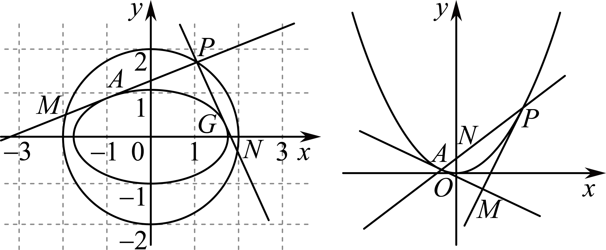
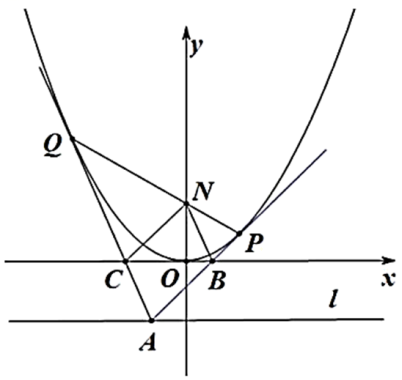
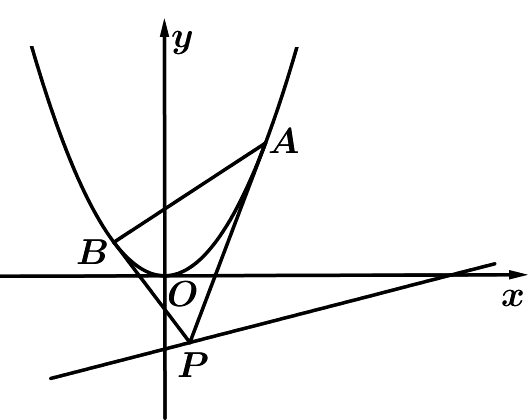
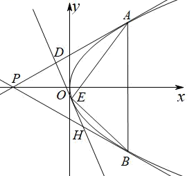
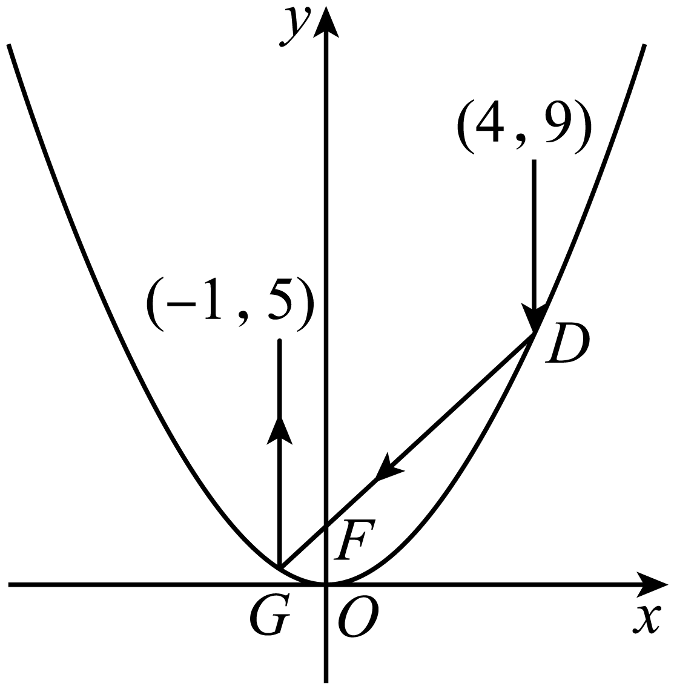

**第80讲  阿基米德三角形**

**知识梳理**

如图所示，为抛物线的弦，，，分别过作的抛物线的切线交于点，称为阿基米德三角形，弦为阿基米德三角形的底边．

1**、** 阿基米德三角形底边上的中线平行于抛物线的轴．

2、若阿基米德三角形的底边即弦过抛物线内定点，则另一顶点的轨迹为一条直线．

3、若直线与抛物线没有公共点，以上的点为顶点的阿基米德三角形的底边过定点．

4、底边长为的阿基米德三角形的面积的最大值为．

5、若阿基米德三角形的底边过焦点，则顶点的轨迹为准线，且阿基米德三角形的面积的最小值为．

6、点的坐标为；

7、底边所在的直线方程为

8、的面积为．

9、若点的坐标为，则底边的直线方程为．

10、如图1，若为抛物线弧上的动点，点处的切线与，分别交于点*C*，*D*，则.

11、若为抛物线弧上的动点，抛物线在点处的切线与阿基米德三角形的边，分别交于点*C*，*D*，则．

12、抛物线和它的一条弦所围成的面积，等于以此弦为底边的阿基米德三角形面积的．

  
图1

**必考题型全归纳**

**题型一：定点问题**

**例1．**（2024·山西太原·高二山西大附中校考期末）已知点，，动点满足．记点的轨迹为曲线．

（1）求的方程；

（2）设为直线上的动点，过作的两条切线，切点分别是，．证明：直线过定点．

**例2．**（2024·陕西西安·西安市大明宫中学校考模拟预测）已知动圆恒过定点，圆心到直线的距离为．

(1)求点的轨迹的方程；

(2)过直线上的动点作的两条切线，切点分别为，证明：直线恒过定点．

**例3．**（2024·全国·高二专题练习）已知平面曲线满足：它上面任意一定到的距离比到直线的距离小1.

(1)求曲线的方程；

(2)为直线上的动点，过点作曲线的两条切线，切点分别为，证明：直线过定点；

(3)在（2）的条件下，以为圆心的圆与直线相切，且切点为线段的中点，求四边形的面积.

<strong>变式1．</strong>（2024·陕西·校联考三模）已知直线<em>l</em>与抛物线交于<em>A</em>，<em>B</em>两点，且，，<em>D</em>为垂足，点<em>D</em>的坐标为．

(1)求*C*的方程；

(2)若点*E*是直线上的动点，过点*E*作抛物线*C*的两条切线，，其中*P*，*Q*为切点，试证明直线恒过一定点，并求出该定点的坐标．

<strong>变式2．</strong>（2024·安徽·高二合肥市第八中学校联考开学考试）抛物线的弦与在弦两端点处的切线所围成的三角形被称为“阿基米德三角形”．对于抛物线<em>C</em>：给出如下三个条件：①焦点为；②准线为；③与直线相交所得弦长为2．

(1)从以上三个条件中选择一个，求抛物线C的方程；

(2)已知是（1）中抛物线的“阿基米德三角形”，点*Q*是抛物线*C*在弦*AB*两端点处的两条切线的交点，若点*Q*恰在此抛物线的准线上，试判断直线*AB*是否过定点？如果是，求出定点坐标；如果不是，请说明理由．

<strong>变式3．</strong>（2024·湖北武汉·高二武汉市第四十九中学校考阶段练习）已知抛物线（<em>a</em>是常数）过点，动点，过<em>D</em>作<em>C</em>的两条切线，切点分别为<em>A</em>，<em>B</em>．

(1)求抛物线*C*的焦点坐标和准线方程；

(2)当时，求直线*AB*的方程；

(3)证明：直线*AB*过定点．

<strong>变式4．</strong>（2024·全国·高三专题练习）已知动点<em>P</em>在<em>x</em>轴及其上方，且点<em>P</em>到点的距离比到<em>x</em>轴的距离大1.

（1）求点*P*的轨迹*C*的方程；

（2）若点*Q*是直线上任意一点，过点*Q*作点*P*的轨迹*C*的两切线*QA*､*QB*，其中*A*､*B*为切点，试证明直线*AB*恒过一定点，并求出该点的坐标.

**题型二：交点的轨迹问题**

**例4．**（2024·全国·高三专题练习）已知抛物线的顶点为原点，其焦点到直线的距离为．

(1)求抛物线的方程；

(2)设点，为直线上一动点，过点作抛物线的两条切线，，其中，为切点，求直线的方程，并证明直线过定点；

(3)过（2）中的点的直线交抛物线于，两点，过点，分别作抛物线的切线，，求，交点满足的轨迹方程．

**例5．**（2024·全国·高三专题练习）已知抛物线的焦点为，过点作直线交抛物线于、两点；椭圆的中心在原点，焦点在轴上，点是它的一个顶点，且其离心率．

(1)求椭圆的方程；

(2)经过、两点分别作抛物线的切线、，切线与相交于点．证明：点定在直线上；

(3)椭圆上是否存在一点，经过点作抛物线的两条切线、、为切点），使得直线过点？若存在，求出切线、的方程；若不存在，试说明理由．

**例6．**（2024·全国·高三专题练习）已知动点在轴上方，且到定点距离比到轴的距离大.

（1）求动点的轨迹的方程；

（2）过点的直线与曲线交于，两点，点，分别异于原点，在曲线的，两点处的切线分别为，，且与交于点，求证：在定直线上.

<strong>变式5．</strong>（2024·全国·高三专题练习）已知动点<em>P</em>与定点的距离和它到定直线的距离之比为，记<em>P</em>的轨迹为曲线<em>C</em>．

(1)求曲线*C*的方程；

(2)过点的直线与曲线*C*交于两点，分别为曲线*C*与*x*轴的两个交点，直线交于点*N*，求证:点*N*在定直线上．

**变式6．**（2024·全国·高三专题练习）已知点为抛物线的焦点，点、在抛物线上，且、、三点共线.若圆的直径为.

（1）求抛物线的标准方程；

（2）过点的直线与抛物线交于点，，分别过、两点作抛物线的切线，，证明直线，的交点在定直线上，并求出该直线.

**变式7．**（2024·全国·高三专题练习）下面是某同学在学段总结中对圆锥曲线切线问题的总结和探索，现邀请你一起合作学习，请你思考后，将答案补充完整．

(1)圆上点处的切线方程为 <u>　　</u>．理由如下：<u>　　</u>．

(2)椭圆上一点处的切线方程为_；

(3)是椭圆外一点，过点作椭圆的两条切线，切点分别为<em>A</em>，<em>B</em>，如图，则直线的方程是 <u>　　</u>．这是因为在，两点处，椭圆的切线方程为和．两切线都过点，所以得到了和，由这两个“同构方程”得到了直线的方程；

(4)问题（3）中两切线，斜率都存在时，设它们方程的统一表达式为，由，得，化简得，得．若，则由这个方程可知点一定在一个圆上，这个圆的方程为 <u>　　</u>．

（5）抛物线上一点处的切线方程为；

（6）抛物线，过焦点的直线与抛物线相交于*A*，*B*两点，分别过点*A*，*B*作抛物线的两条切线和，设，，则直线的方程为．直线的方程为，设和相交于点．则①点在以线段为直径的圆上；②点在抛物线的准线上．

**题型三：切线垂直问题**

**例7．**（2024·全国·高三专题练习）已知抛物线的方程为，过点作抛物线的两条切线，切点分别为.

（1）若点坐标为，求切线的方程；

（2）若点是抛物线的准线上的任意一点，求证：切线和互相垂直.

**例8．**（2024·全国·高三专题练习）已知抛物线的方程为，点是抛物线的准线上的任意一点，过点作抛物线的两条切线，切点分别为，点是的中点.

（1）求证：切线和互相垂直；

（2）求证：直线与轴平行；

（3）求面积的最小值.

**例9．**（2024·全国·高三专题练习）已知中心在原点的椭圆和抛物线有相同的焦点，椭圆的离心率为，抛物线的顶点为原点.

(1)求椭圆和抛物线的方程；

(2)设点为抛物线准线上的任意一点，过点作抛物线的两条切线，，其中为切点.设直线，的斜率分别为，，求证：为定值.

**变式8．**（2024·全国·高三专题练习）已知中心在原点的椭圆和抛物线有相同的焦点，椭圆过点，抛物线的顶点为原点．

求椭圆和抛物线的方程；

设点*P*为抛物线准线上的任意一点，过点*P*作抛物线的两条切线*PA*，*PB*，其中*A*，*B*为切点．

设直线*PA*，*PB*的斜率分别为，，求证：为定值；

若直线*AB*交椭圆于*C*，*D*两点，，分别是，的面积，试问：是否有最小值？若有，求出最小值；若没有，请说明理由．

**变式9．**（2024·全国·高三专题练习）抛物级的焦点到直线的距离为2.

（1）求抛物线的方程；

（2）设直线交抛物线于，两点，分别过，两点作抛物线的两条切线，两切线的交点为，求证： .

**变式10．**（2024·河南驻马店·校考模拟预测）已知抛物线：的焦点为，点在上，直线：与相离．若到直线的距离为，且的最小值为．过上两点分别作的两条切线，若这两条切线的交点恰好在直线上．

（1）求的方程；

（2）设线段中点的纵坐标为，求证：当取得最小值时，．

**题型四：面积问题**

**例10．**（2024·全国·高三专题练习）已知抛物线的方程为，点是抛物线上的一点，且到抛物线焦点的距离为2．

（1）求抛物线的方程；

（2）点为直线上的动点，过点作抛物线的两条切线，切点分别为，，求面积的最小值．

**例11．**（2024·全国·高三专题练习）已知抛物线上一点到其焦点的距离为．

（1）求抛物线的方程；

（2）如图，过直线上一点作抛物线的两条切线，，切点分别为，，且直线与轴交于点．设直线，与轴的交点分别为，，求四边形面积的最小值．

**例12．**（2024·全国·高三专题练习）已知抛物线的焦点到原点的距离等于直线的斜率.

（1）求抛物线*C*的方程及准线方程；

（2）点*P*是直线*l*上的动点，过点*P*作抛物线*C*的两条切线，切点分别为*A*，*B*，求面积的最小值.

<strong>变式11．</strong>（2024·全国·高三专题练习）如图，已知抛物线上的点<em>R</em>的横坐标为1，焦点为<em>F</em>，且，过点作抛物线<em>C</em>的两条切线，切点分别为<em>A</em>、<em>B</em>，<em>D</em>为线段<em>PA</em>上的动点，过<em>D</em>作抛物线的切线，切点为<em>E</em>（异于点<em>A</em>，<em>B</em>），且直线<em>DE</em>交线段<em>PB</em>于点<em>H</em>.

(1)求抛物线*C*的方程；

(2)（i）求证：为定值；

（ii）设，的面积分别为，求的最小值.

**变式12．**（2024·全国·高三专题练习）已知点A（﹣4，4）、B（4，4），直线AM与BM相交于点M，且直线AM的斜率与直线BM的斜率之差为﹣2，点M的轨迹为曲线C．

（1）求曲线C 的轨迹方程；

（2）Q为直线y=﹣1上的动点，过Q作曲线C的切线，切点分别为D、E，求△QDE的面积S的最小值．

<strong>变式13．</strong>（2024·河南开封·河南省兰考县第一高级中学校考模拟预测）已知点，平面上的动点<em>S</em>到<em>F</em>的距离是<em>S</em>到直线的距离的倍，记点<em>S</em>的轨迹为曲线<em>C</em>．

(1)求曲线*C*的方程；

(2)过直线上的动点向曲线*C*作两条切线，，交*x*轴于*M*，交*y*轴于*N*，交*x*轴于*T*，交*y*轴于*Q*，记的面积为，的面积为，求的最小值．

**题型五：外接圆问题**

<strong>例13．</strong>（2024·全国·高三专题练习）已知<em>P</em>是抛物线<em>C</em>：的顶点，<em>A</em>，<em>B</em>是<em>C</em>上的两个动点，且．

（1）试判断直线是否经过某一个定点？若是，求这个定点的坐标；若不是，说明理由；

（2）设点*M*是的外接圆圆心，求点*M*的轨迹方程．

**例14．**（2024·高二单元测试）已知点是抛物线的顶点，，是上的两个动点，且.

（1）判断点是否在直线上？说明理由；

（2）设点是△的外接圆的圆心，点到轴的距离为，点，求的最大值.

**例15．**（2024·全国·高三专题练习）已知点是抛物线的顶点，，是上的两个动点，且.

（1）判断点是否在直线上？说明理由；

（2）设点是△的外接圆的圆心，求点的轨迹方程.

**题型六：最值问题**

**例16．**（2024·全国·高三专题练习）如图已知是直线上的动点，过点作抛物线的两条切线，切点分别为，与轴分别交于.

（1）求证：直线过定点，并求出该定点；

（2）设直线与轴相交于点，记两点到直线的距离分别为；求当取最大值时的面积.

**例17．**（2024·湖南·高三校联考阶段练习）在直角坐标系中，已知抛物线，为直线上的动点，过点作抛物线的两条切线，切点分别为，当在轴上时，.

(1)求抛物线的方程；

(2)求点到直线距离的最大值.

<strong>例18．</strong>（2024·辽宁沈阳·校联考二模）从抛物线的焦点发出的光经过抛物线反射后，光线都平行于抛物线的轴，根据光路的可逆性，平行于抛物线的轴射向抛物线后的反射光线都会汇聚到抛物线的焦点处，这一性质被广泛应用在生产生活中．如图，已知抛物线，从点发出的平行于<em>y</em>轴的光线照射到抛物线上的<em>D</em>点，经过抛物线两次反射后，反射光线由<em>G</em>点射出，经过点．

(1)求抛物线*C*的方程；

(2)已知圆，在抛物线*C*上任取一点*E*，过点*E*向圆*M*作两条切线*EA*和*EB*，切点分别为*A*、*B*，求的取值范围．

**变式14．**（2024·贵州·高三校联考阶段练习）已知抛物线上的点到其焦点的距离为.

(1)求抛物线的方程；

(2)已知点在直线：上，过点作抛物线的两条切线，切点分别为，直线与直线交于点，过抛物线的焦点作直线的垂线交直线于点，当最小时，求的值.

<strong>变式15．</strong>（2024·黑龙江大庆·高二大庆实验中学校考阶段练习）已知抛物线，点<em>P</em>为直线上的任意一点，过点<em>P</em>作抛物线<em>C</em>的两条切线，切点分别为<em>A</em>，<em>B</em>，则点到直线<em>AB</em>的距离的最大值为（    ）

A．1	B．4	C．5	D．

**题型七：角度相等问题**

**例19．** 设抛物线的焦点为F，动点P在直线上运动，过P作抛物线C的两条切线PA、PB，且与抛物线C分别相切于A、B两点.

（1）求△APB的重心G的轨迹方程.

（2）证明∠PFA=∠PFB．

**例20．**（2024·全国·高三专题练习）已知，分别是椭圆的上、下焦点，直线过点且垂直于椭圆长轴，动直线垂直于点，线段的垂直平分线交于点，点的轨迹为.

(1)求轨迹的方程；

(2)若动点在直线上运动，且过点作轨迹的两条切线、，切点为*A*、*B*，试猜想与的大小关系，并证明你的结论的正确性.

<strong>例21．</strong>（2024·江苏南通·高三统考阶段练习）在平面直角坐标系<em>xOy</em>中，已知圆与抛物线交于点<em>M</em>，<em>N</em>（异于原点<em>O</em>），<em>MN</em>恰为该圆的直径，过点<em>E</em>（0，2）作直线交抛物线于<em>A</em>，<em>B</em>两点，过<em>A</em>，<em>B</em>两点分别作抛物线<em>C</em>的切线交于点<em>P</em>．

(1)求证：点*P*的纵坐标为定值；

(2)若*F*是抛物线*C*的焦点，证明：．

<strong>变式16．</strong>（2024·全国·高三专题练习）如图所示，设抛物线<em>C</em>：的焦点为<em>F</em>，动点<em>P</em>在直线<em>l</em>：上运动，过<em>P</em>作抛物线<em>C</em>的两条切线，，切点分别为<em>A</em>，<em>B</em>，求证：.

<strong>变式17．</strong>（2024·全国·高三专题练习）在平面直角坐标系<em>xOy</em>中，已知点<em>E</em>(0，2)，以<em>OE</em>为直径的圆与抛物线<em>C</em>∶<em>x2</em>=2<em>py</em>(<em>p</em>&gt;0)交于点<em>M</em>，<em>N</em>(异于原点<em>O</em>)，<em>MN</em>恰为该圆的直径，过点<em>E</em>作直线交抛物线与<em>A</em>，<em>B</em>两点，过<em>A</em>，<em>B</em>两点分别作拋物线<em>C</em>的切线交于点<em>P</em>.

（1）求证∶点*P*的纵坐标为定值；

（2）若*F*是抛物线*C*的焦点，证明∶∠*PFA*=∠*PFB*

