**第80讲  阿基米德三角形**

**知识梳理**

如图所示，为抛物线的弦，，，分别过作的抛物线的切线交于点，称为阿基米德三角形，弦为阿基米德三角形的底边．

1**、** 阿基米德三角形底边上的中线平行于抛物线的轴．

2、若阿基米德三角形的底边即弦过抛物线内定点，则另一顶点的轨迹为一条直线．

3、若直线与抛物线没有公共点，以上的点为顶点的阿基米德三角形的底边过定点．

4、底边长为的阿基米德三角形的面积的最大值为．

5、若阿基米德三角形的底边过焦点，则顶点的轨迹为准线，且阿基米德三角形的面积的最小值为．

6、点的坐标为；

7、底边所在的直线方程为

8、的面积为．

9、若点的坐标为，则底边的直线方程为．

10、如图1，若为抛物线弧上的动点，点处的切线与，分别交于点*C*，*D*，则.

11、若为抛物线弧上的动点，抛物线在点处的切线与阿基米德三角形的边，分别交于点*C*，*D*，则．

12、抛物线和它的一条弦所围成的面积，等于以此弦为底边的阿基米德三角形面积的．

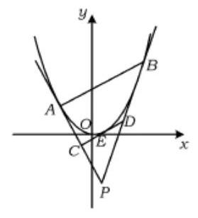  
图1

**必考题型全归纳**

**题型一：定点问题**

**例1．**（2024·山西太原·高二山西大附中校考期末）已知点，，动点满足．记点的轨迹为曲线．

（1）求的方程；

（2）设为直线上的动点，过作的两条切线，切点分别是，．证明：直线过定点．

【解析】（1）设，则，，

，，

所以，可以化为，

化简得．

所以，的方程为．

（2）由题设可设，，，

由题意知切线，的斜率都存在，

由，得，则，

所以，

直线的方程为，即，①

因为在上，所以，即，②

将②代入①得，

所以直线的方程为

同理可得直线的方程为．

因为在直线上，所以，

又在直线上，所以，

所以直线的方程为，

故直线过定点．

**例2．**（2024·陕西西安·西安市大明宫中学校考模拟预测）已知动圆恒过定点，圆心到直线的距离为．

(1)求点的轨迹的方程；

(2)过直线上的动点作的两条切线，切点分别为，证明：直线恒过定点．

【解析】（1）设，则，

因为，即，

当，即时，则，整理得；

当，即时，则，

整理得，不成立；

综上所述：点的轨迹的方程.

（2）由（1）可知：曲线：，即，则，

设，

可知切线的斜率为，所以切线：，

则，整理得，

同理由切线可得：，

可知：为方程的两根，则，

可得直线的斜率，

设的中点为，则，

即，

所以直线：，整理得，

所以直线恒过定点.

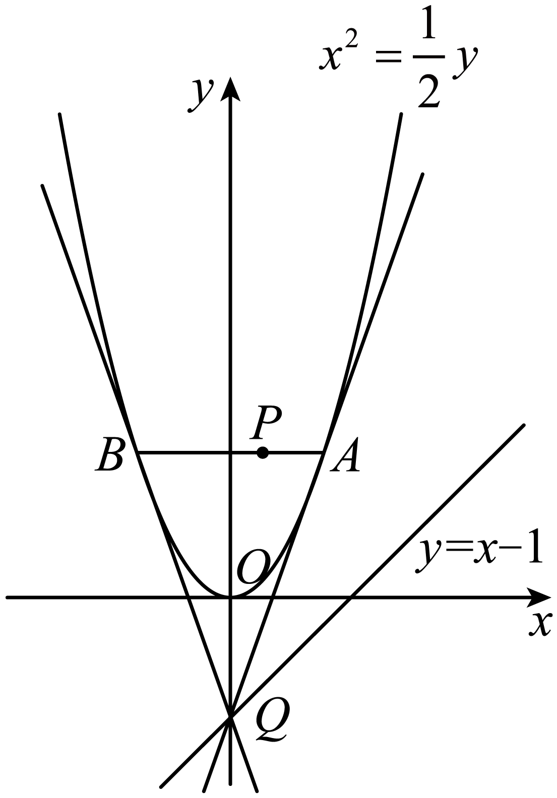

**例3．**（2024·全国·高二专题练习）已知平面曲线满足：它上面任意一定到的距离比到直线的距离小1.

(1)求曲线的方程；

(2)为直线上的动点，过点作曲线的两条切线，切点分别为，证明：直线过定点；

(3)在（2）的条件下，以为圆心的圆与直线相切，且切点为线段的中点，求四边形的面积.

【解析】（1）思路一：由题意知，曲线是一个以为焦点，以的抛物线，

故的方程为：.

思路二：设曲线上的点为，则，

由题意易知，，整理得，.

（2）设，则.

又因为，所以.则切线的斜率为，

故，整理得.

设，同理得.

都满足直线方程.

于是直线过点，而两个不同的点确定一条直线，

所以直线方程为，即，

当时等式恒成立.

所以直线恒过定点.

（3）思路一：利用公共边结合韦达定理求面积

设的中点为，则，.

由，得，

将代入上式并整理得，

因为，所以或.

由（1）知，所以轴，

则

（设）.

当时，，即；

当时，，

即.

综上，四边形的面积为3或.

思路二：利用弦长公式结合面积公式求面积

设，由（1）知抛物线的焦点的坐标为，准线方程为.

由抛物线的定义，得.

线段的中点为.

当时，轴，，

；

当时，，由，得，即.

所以，直线的方程为.

根据对称性考虑点和直线的方程即可.

到直线的距离为，

到直线的距离为.

所以.

综上，四边形的面积为3或.

思路三：结合抛物线的光学性质求面积

  
图5中，由抛物线的光学性质易得，又，所以.

因为，所以≌，

所以.

同理≌，所以，即点为中点.

  
图6中已去掉坐标系和抛物线，并延长于点.

因为，所以.

又因为分别为的中点，所以，

故为平行四边形，从而.

因为且，所以为的中点，

从而.

.

当直线平行于准线时，易得.

综上，四边形的面积为3或.

思路四：结合弦长公式和向量的运算求面积

由（1）得直线的方程为.

由，可得，

于是

设分别为点到直线的距离，则.

因此，四边形的面积.

设为线段的中点，则，

由于，而与向量平行，所以，解得或.

当时，；当时

因此，四边形的面积为3或.

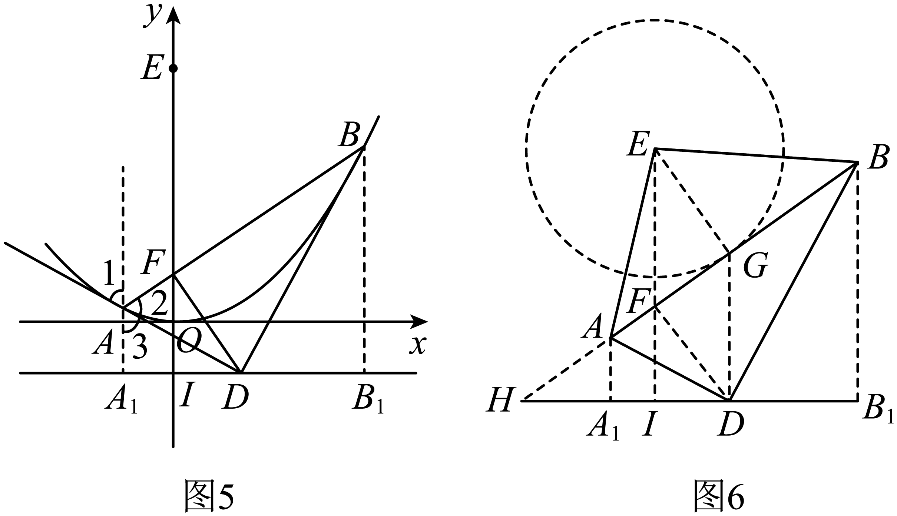

<strong>变式1．</strong>（2024·陕西·校联考三模）已知直线<em>l</em>与抛物线交于<em>A</em>，<em>B</em>两点，且，，<em>D</em>为垂足，点<em>D</em>的坐标为．

(1)求*C*的方程；

(2)若点*E*是直线上的动点，过点*E*作抛物线*C*的两条切线，，其中*P*，*Q*为切点，试证明直线恒过一定点，并求出该定点的坐标．

【解析】（1）设点*A*的坐标为，点*B*的坐标为，

因为，所以，则直线的方程为，

联立方程组，消去*y*，整理得，

所以有，，

又，得，

整理得，解得．

所以*C*的方程为．

（2）由，得，所以，

设过点*E*作抛物线*C*的切线的切点为，

则相应的切线方程为，即，

设点，由切线经过点*E*，得，即，

设，，则，是的两实数根，

可得，．

设*M*是的中点，则相应，

则，即，

又，

直线的方程为，即，

所以直线恒过定点．

<strong>变式2．</strong>（2024·安徽·高二合肥市第八中学校联考开学考试）抛物线的弦与在弦两端点处的切线所围成的三角形被称为“阿基米德三角形”．对于抛物线<em>C</em>：给出如下三个条件：①焦点为；②准线为；③与直线相交所得弦长为2．

(1)从以上三个条件中选择一个，求抛物线C的方程；

(2)已知是（1）中抛物线的“阿基米德三角形”，点*Q*是抛物线*C*在弦*AB*两端点处的两条切线的交点，若点*Q*恰在此抛物线的准线上，试判断直线*AB*是否过定点？如果是，求出定点坐标；如果不是，请说明理由．

【解析】（1）*C*：即*C*：，

其焦点坐标为，准线方程为，

若选①，焦点为，则，得，

所以抛物线的方程为；

若选②，准线为，则，得，

所以抛物线的方程为；

若选③，与直线相交所得的弦为2，

将代入方程中，得，

即抛物线与直线相交所得的弦长为，

解得，所以抛物线的方程为；

（2）设，，，切线：，

将其与*C*：联立得，

由得，

故切线：，即；

同理：

又点满足切线，的方程，

即有

故弦*AB*所在直线方程为，其过定点．

<strong>变式3．</strong>（2024·湖北武汉·高二武汉市第四十九中学校考阶段练习）已知抛物线（<em>a</em>是常数）过点，动点，过<em>D</em>作<em>C</em>的两条切线，切点分别为<em>A</em>，<em>B</em>．

(1)求抛物线*C*的焦点坐标和准线方程；

(2)当时，求直线*AB*的方程；

(3)证明：直线*AB*过定点．

【解析】（1）由点*P*代入得，所以*C*的焦点为，准线方程为；

（2）设，此时，则，

因为，所以切线*DA*的斜率，即，

所以（1）

同理可得（2）

所以由（1）、（2）可得直线*AB*的方程为；

法二：设其中一条切线的斜率为*k*（显然存在），则切线方程为，

由得，

所以由得，

不妨设，

可解得

所以*AB*的斜率，

得直线*AB*的方程为即

（3）由（2）知：，所以，

同理可得，

显然直线*AB*经过定点．

<strong>变式4．</strong>（2024·全国·高三专题练习）已知动点<em>P</em>在<em>x</em>轴及其上方，且点<em>P</em>到点的距离比到<em>x</em>轴的距离大1.

（1）求点*P*的轨迹*C*的方程；

（2）若点*Q*是直线上任意一点，过点*Q*作点*P*的轨迹*C*的两切线*QA*､*QB*，其中*A*､*B*为切点，试证明直线*AB*恒过一定点，并求出该点的坐标.

【解析】（1）设点，则，即

化简得

∵∴.

∴点的轨迹方程为.

（2）对函数求导数.

设切点，则过该切点的切线的斜率为，

∴切线方程为.

即，

设点，由于切线经过点*Q*，

∴

设，则两切线方程是，，

所以过两点的直线方程是，

即

∴当，时，方程恒成立.

∴对任意实数*t*，直线恒过定点.

**题型二：交点的轨迹问题**

**例4．**（2024·全国·高三专题练习）已知抛物线的顶点为原点，其焦点到直线的距离为．

(1)求抛物线的方程；

(2)设点，为直线上一动点，过点作抛物线的两条切线，，其中，为切点，求直线的方程，并证明直线过定点；

(3)过（2）中的点的直线交抛物线于，两点，过点，分别作抛物线的切线，，求，交点满足的轨迹方程．

【解析】（1）设抛物线的方程为，

∵抛物线的焦点到直线的距离为，

∴，解得或（舍去，

∴，，

∴抛物线的方程为．

（2）设，，设切点为，曲线，，

则切线的斜率为，化简得，

设，，，则，是以上方程的两根，

则，，

，

直线的方程为：，整理得，

∵切线的方程为，整理得，且点，在切线上，

∴，即直线的方程为：，化简得，

又∵，∴，

故直线过定点．

（3）设，，，

过的切线，过的切线，

则交点，

设过点的直线为，

联立，得，

∴，，

∴，

∴．

∴点满足的轨迹方程为．

**例5．**（2024·全国·高三专题练习）已知抛物线的焦点为，过点作直线交抛物线于、两点；椭圆的中心在原点，焦点在轴上，点是它的一个顶点，且其离心率．

(1)求椭圆的方程；

(2)经过、两点分别作抛物线的切线、，切线与相交于点．证明：点定在直线上；

(3)椭圆上是否存在一点，经过点作抛物线的两条切线、、为切点），使得直线过点？若存在，求出切线、的方程；若不存在，试说明理由．

【解析】（1）设椭圆的方程为，半焦距为．由已知有，

，，，解得，．

∴椭圆的方程为．

（2）显然直线的斜率存在，否则直线与抛物线只有一个交点，不合题意，

故可设直线的方程为，,,，

与抛物线方程联立，消去，并整理得，，则．

抛物线的方程为，求导得，

过抛物线上，两点的切线方程分别是，，即，

解得两条切线的交点的坐标为，，

点在直线上.

（3）假设存在点满足题意，

由（2）知：必在直线上，又直线与椭圆有唯一交点，故的坐标为,，

设过且与抛物线相切的切线方程为，其中,为切点．

令，得，，解得或，

故不妨取,,，即直线过．

综上，椭圆上存在，经过作抛物线的两条切线、、为切点），能使直线过．

此时，两切线的方程分别为和．

**例6．**（2024·全国·高三专题练习）已知动点在轴上方，且到定点距离比到轴的距离大.

（1）求动点的轨迹的方程；

（2）过点的直线与曲线交于，两点，点，分别异于原点，在曲线的，两点处的切线分别为，，且与交于点，求证：在定直线上.

【解析】（1）设，

则有，化简得，

故轨迹的方程为.

（2）由题意可知，直线的斜率存在且不为，

设直线的方程为与

联立得，

设，，

则，，

又，所以，

所以切线的方程为，

即，

同理切线的方程为

联立得，.

两式消去得，

当时，，，

所以交点的轨迹为直线，去掉点.

因而交点在定直线上.

<strong>变式5．</strong>（2024·全国·高三专题练习）已知动点<em>P</em>与定点的距离和它到定直线的距离之比为，记<em>P</em>的轨迹为曲线<em>C</em>．

(1)求曲线*C*的方程；

(2)过点的直线与曲线*C*交于两点，分别为曲线*C*与*x*轴的两个交点，直线交于点*N*，求证:点*N*在定直线上．

【解析】（1）设动点，

∵动点*P*与定点的距离和它到定直线的距离之比为，

∴，整理得，

∴曲线*C*的方程为；

（2）设，，，直线方程，

与椭圆方程联立，整理得：，

，

由韦达定理得：，化简得：，

由已知得,,

则直线的方程为，直线的方程为，

联立直线和： ，代入，、可得：，化简可得：，

所以*N*点在一条定直线上．

**变式6．**（2024·全国·高三专题练习）已知点为抛物线的焦点，点、在抛物线上，且、、三点共线.若圆的直径为.

（1）求抛物线的标准方程；

（2）过点的直线与抛物线交于点，，分别过、两点作抛物线的切线，，证明直线，的交点在定直线上，并求出该直线.

【解析】（1）由题可知中点为，设、到准线的距离分别为，.到准线的距离为，

则，由抛物线定义得，，所以，

所以，即.

所以抛物线的标准方程为.

（2）设，，由，得，则，

所以直线的方程为，直线的方程为，

联立，方程得，即，的点坐标为.

因为过焦点，

由题可知直线的斜率存在，所以设直线方程为，

与抛物线联立得，

所以，，

所以直线，的交点在定直线上.

**变式7．**（2024·全国·高三专题练习）下面是某同学在学段总结中对圆锥曲线切线问题的总结和探索，现邀请你一起合作学习，请你思考后，将答案补充完整．

(1)圆上点处的切线方程为 <u>　　</u>．理由如下：<u>　　</u>．

(2)椭圆上一点处的切线方程为_；

(3)是椭圆外一点，过点作椭圆的两条切线，切点分别为<em>A</em>，<em>B</em>，如图，则直线的方程是 <u>　　</u>．这是因为在，两点处，椭圆的切线方程为和．两切线都过点，所以得到了和，由这两个“同构方程”得到了直线的方程；

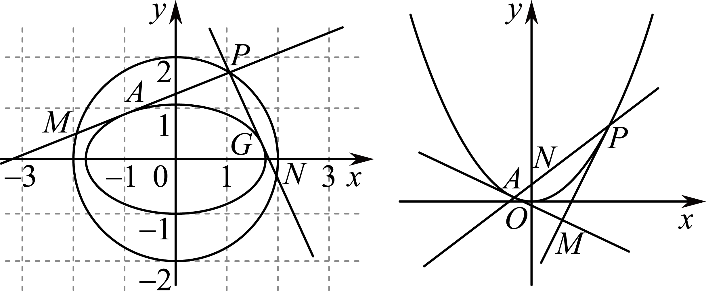

(4)问题（3）中两切线，斜率都存在时，设它们方程的统一表达式为，由，得，化简得，得．若，则由这个方程可知点一定在一个圆上，这个圆的方程为 <u>　　</u>．

（5）抛物线上一点处的切线方程为；

（6）抛物线，过焦点的直线与抛物线相交于*A*，*B*两点，分别过点*A*，*B*作抛物线的两条切线和，设，，则直线的方程为．直线的方程为，设和相交于点．则①点在以线段为直径的圆上；②点在抛物线的准线上．

【解析】（1）圆上点处的切线方程为．

理由如下：

①若切线的斜率存在，设切线的斜率为，则，

所以，

又过点，

由点斜式可得，，

化简可得，，

又，

所以切线的方程为；

②若切线的斜率不存在，则，

此时切线方程为．

综上所述，圆上点处的切线方程为．

（2）①当切线斜率存在时, 设过点的切线方程为，

联立方程，得，

，即，

，

又，

把代入中，得，

，

化简得.

②当切线斜率不存在时，过的切线方程为，满足上式.

综上，椭圆上一点的切线方程为：.

（3）在，两点处，椭圆的切线方程为和，

因为两切线都过点，

所以得到了和，

由这两个“同构方程”得到了直线的方程为；

（4）问题（3）中两切线，斜率都存在时，设它们方程的统一表达式为，

由，可得，

由，可得，

因为，

则，

所以式中关于的二次方程有两个解，且其乘积为，

则，

可得，

所以圆的半径为2，且过原点，其方程为．

**题型三：切线垂直问题**

**例7．**（2024·全国·高三专题练习）已知抛物线的方程为，过点作抛物线的两条切线，切点分别为.

（1）若点坐标为，求切线的方程；

（2）若点是抛物线的准线上的任意一点，求证：切线和互相垂直.

【解析】（1）由题意，开口向上的抛物线的切线斜率存在，设切线斜率为，

点坐标为，过点的切线方程为，

联立方程，消去，得，

由，解得，

所以切线的方程分别为和，

即切线方程分别为和；

（2）设点坐标为，切线斜率为，过点的切线方程为，

联立方程，消去，得，

由，得，记关于的一元二次方程的两根为，

则分别为切线的斜率，由根与系数的关系知，

所以切线和互相垂直.

**例8．**（2024·全国·高三专题练习）已知抛物线的方程为，点是抛物线的准线上的任意一点，过点作抛物线的两条切线，切点分别为，点是的中点.

（1）求证：切线和互相垂直；

（2）求证：直线与轴平行；

（3）求面积的最小值.

【解析】（1）由题意，开口向上的抛物线的切线斜率存在.

设点坐标为，切线斜率为，过点的切线方程为，

联立方程，，

消去，得，

由，得，

记关于的一元二次方程的两根为，

则分别为切线的斜率，由根与系数的关系知，

所以切线和互相垂直.

（2）设点，由，知，则，

所以过点的切线方程为，

将点代入，化简得，

同理可得，

所以是关于的方程的两个根，

由根与系数的关系知，

所以，即中点的横坐标为，

而点的横坐标也为，所以直线与轴平行.

（3）点，则，

则，

由（2）知，，

则，，

，

当时，面积的最小值为4.

**例9．**（2024·全国·高三专题练习）已知中心在原点的椭圆和抛物线有相同的焦点，椭圆的离心率为，抛物线的顶点为原点.

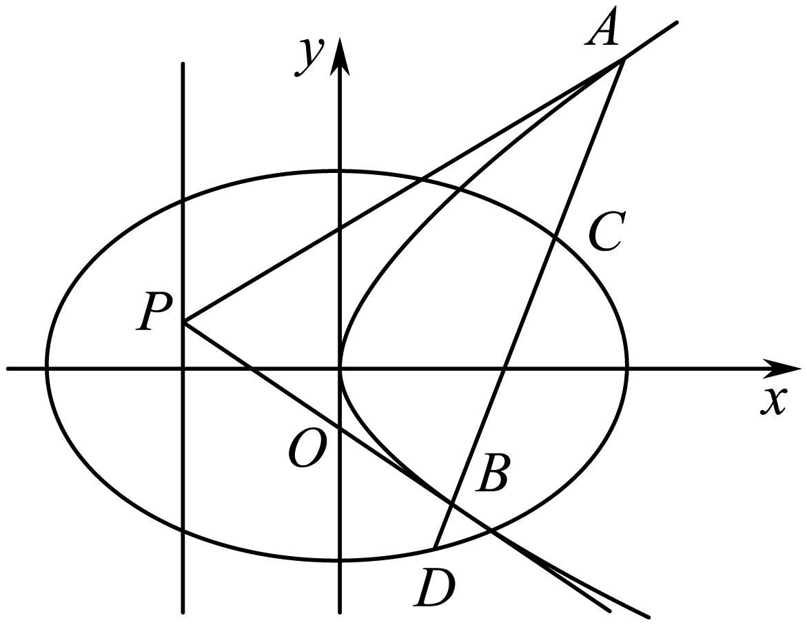

(1)求椭圆和抛物线的方程；

(2)设点为抛物线准线上的任意一点，过点作抛物线的两条切线，，其中为切点.设直线，的斜率分别为，，求证：为定值.

【解析】（1）设椭圆和抛物线的方程分别为，，，

椭圆和抛物线有相同的焦点，椭圆的离心率为，

，解得，，

椭圆的方程为，抛物线的方程为．

（2）由题意知过点与抛物线相切的直线斜率存在且不为0，设，则切线方程为，

联立，消去，得，

由，得，

直线，的斜率分别为，，，

为定值．

**变式8．**（2024·全国·高三专题练习）已知中心在原点的椭圆和抛物线有相同的焦点，椭圆过点，抛物线的顶点为原点．

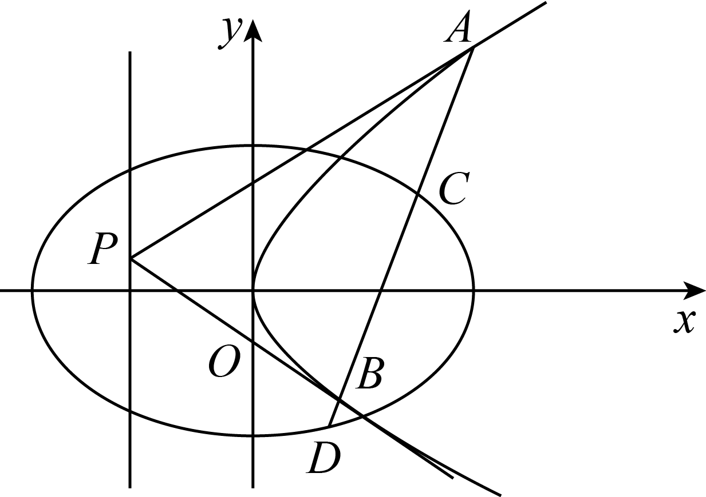

求椭圆和抛物线的方程；

设点*P*为抛物线准线上的任意一点，过点*P*作抛物线的两条切线*PA*，*PB*，其中*A*，*B*为切点．

设直线*PA*，*PB*的斜率分别为，，求证：为定值；

若直线*AB*交椭圆于*C*，*D*两点，，分别是，的面积，试问：是否有最小值？若有，求出最小值；若没有，请说明理由．

【解析】设椭圆和抛物线的方程分别为和，，

中心在原点的椭圆和抛物线有相同的焦点，椭圆过点，

抛物线的顶点为原点．

，解得，，，

椭圆的方程为，抛物线的方程为．

证明：设，过点*P*与抛物线相切的直线方程为，

由，消去*x*得，

由得，，即，

．

设，

由得，，则，，

直线*BA*的方程为，即，

直线*AB*过定点．

以*A*为切点的切线方程为，即，

同理以*B*为切点的切线方程为，

两条切线均过点，

，

则切点弦*AB*的方程为，即直线*AB*过定点

设*P*到直线*AB*的距离为*d*，

当直线*AB*的斜率存在时，设直线*AB*的方程为，

设，，，，

由，得，时恒成立．

．

由，得，恒成立．

．

．

当直线*AB*的斜率不存在时，直线*AB*的方程为，

此时，，，

．

综上，有最小值．

**变式9．**（2024·全国·高三专题练习）抛物级的焦点到直线的距离为2.

（1）求抛物线的方程；

（2）设直线交抛物线于，两点，分别过，两点作抛物线的两条切线，两切线的交点为，求证： .

【解析】（1）由题意知：，

则焦点到直线的距离为：，

所以抛物线的方程为：；

（2）证明：

把直线代入消得：，

又，

利用韦达定理得，

由题意设切线的斜率为，切线的斜率为，点坐标为，

由（1）可得：，

则，

所以，

则切线的方程为：，切线的方程为：，

则，

利用韦达定理化简整理得：，

把代入整理得：

，

则，

，

则

**变式10．**（2024·河南驻马店·校考模拟预测）已知抛物线：的焦点为，点在上，直线：与相离．若到直线的距离为，且的最小值为．过上两点分别作的两条切线，若这两条切线的交点恰好在直线上．

（1）求的方程；

（2）设线段中点的纵坐标为，求证：当取得最小值时，．

【解析】（1）由题意，得，且的最小值等于点到直线的距离，

即，解得（负值舍去），

∴抛物线的方程为．

（2）由，得，故，设，，

则切线方程分别为，，

设两切线的交点为，

代入切线方程并整理可得：，，

即，是方程的实数根．

则，，

则线段中点纵坐标为

，

∴当时，取最小值．

此时，，，，，

则

．

∴．

解法二：（同解法一）

∴当时，取最小值．

此时，，由得，

故，

∴．

**题型四：面积问题**

**例10．**（2024·全国·高三专题练习）已知抛物线的方程为，点是抛物线上的一点，且到抛物线焦点的距离为2．

（1）求抛物线的方程；

（2）点为直线上的动点，过点作抛物线的两条切线，切点分别为，，求面积的最小值．

【解析】本题考查直线与抛物线位置关系的应用．

（1）设抛物线焦点为，由题意可得，故，

∴抛物线的方程为．

（2）设，由题可知切线的斜率存在且不为0，

故可设切线方程为，．

联立，消去得．

由直线与抛物线相切可得，

∴，即．

∴，解得，

可得切点坐标为，故可设，．

由，可得，，

∴，∴为直角三角形，

∴的面积．

令切点到点的距离为，

则

，

∴，，

∴

，

当，即点的坐标为时，的面积取得最小值1．

**例11．**（2024·全国·高三专题练习）已知抛物线上一点到其焦点的距离为．

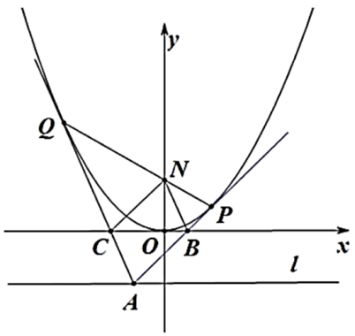

（1）求抛物线的方程；

（2）如图，过直线上一点作抛物线的两条切线，，切点分别为，，且直线与轴交于点．设直线，与轴的交点分别为，，求四边形面积的最小值．

【解析】（1）由，得，所以抛物线的方程为．

（2）设，，可知在点处的切线方程为：，即，

同理，在点处的切线方程为：，

可得，

又两切线均过点，所以，

于是的方程为，

所以点．

将与联立可得，

则，，

记四边形面积为，则

（当且仅当时，等号成立）

所以．

**例12．**（2024·全国·高三专题练习）已知抛物线的焦点到原点的距离等于直线的斜率.

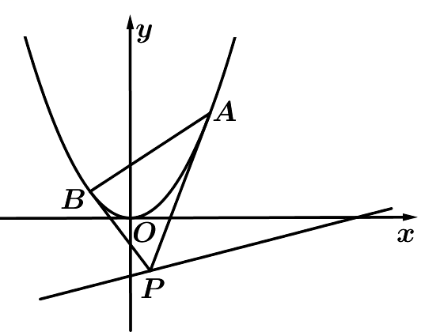

（1）求抛物线*C*的方程及准线方程；

（2）点*P*是直线*l*上的动点，过点*P*作抛物线*C*的两条切线，切点分别为*A*，*B*，求面积的最小值.

【解析】（1）由题意，，即，可知抛物线方程为，其准线方程为.

（2），则切线：，即；

同理：.

分别代入点可得，对比可知直线的方程为：.(即切点弦方程)

联解，可知，

点到直线的距离为，

因此，，

而，故.

当且仅当，即时，的最小值为.

<strong>变式11．</strong>（2024·全国·高三专题练习）如图，已知抛物线上的点<em>R</em>的横坐标为1，焦点为<em>F</em>，且，过点作抛物线<em>C</em>的两条切线，切点分别为<em>A</em>、<em>B</em>，<em>D</em>为线段<em>PA</em>上的动点，过<em>D</em>作抛物线的切线，切点为<em>E</em>（异于点<em>A</em>，<em>B</em>），且直线<em>DE</em>交线段<em>PB</em>于点<em>H</em>.

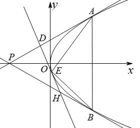

(1)求抛物线*C*的方程；

(2)（i）求证：为定值；

（ii）设，的面积分别为，求的最小值.

【解析】（1）抛物线的焦点，准线

则，则，抛物线*C*的方程为

（2）（i）设直线*AP*：

由，可得

则，解得

则，解得

不妨令直线*AP*：，直线*BP*：，则

设，设直线

由，可得

由，可得或（舍）

则，直线

由，可得

故，为定值.

（ii）由（i）得，

，

则，

故，令

则

当时，，单调递减；

当时，，单调递增

则，故的最小值为6.

**变式12．**（2024·全国·高三专题练习）已知点A（﹣4，4）、B（4，4），直线AM与BM相交于点M，且直线AM的斜率与直线BM的斜率之差为﹣2，点M的轨迹为曲线C．

（1）求曲线C 的轨迹方程；

（2）Q为直线y=﹣1上的动点，过Q作曲线C的切线，切点分别为D、E，求△QDE的面积S的最小值．

【解析】（Ⅰ）设，由题意得，化简可得曲线的方程为； （Ⅱ）设，切线方程为，与抛物线方程联立互为，由于直线与抛物线相切可得，解得，可切点，由

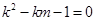

，利用韦达定理，得到，得到为直角三角形，得出三角形面积的表达式，即可求解三角形的最小值．

试题解析：（1）设M（x，y），由题意可得：，

化为x2=4y．

∴曲线C 的轨迹方程为x2=4y且（x≠±4）．

（2）联立，化为x2﹣4kx+4（km+1）=0，

由于直线与抛物线相切可得△=0，即k2﹣km﹣1=0．

∴x2﹣4kx+4k2=0，解得x=2k．可得切点（2k，k2），

由k2﹣km﹣1=0．∴k1+k2=m，k1•k2=﹣1．

∴切线QD⊥QE．

∴△QDE为直角三角形，|QD|•|QE|．

令切点（2k，k2）到Q的距离为d，

则d2=（2k﹣m）2+（k2+1）2=4（k2﹣km）+m2+（km+2）2=4（k2﹣km）+m2+k2m2+4km+4=（4+m2）（k2+1），

∴|QD|=，

|QE|=，

∴（4+m2）=≥4，

当m=0时，即Q（0，﹣1）时，△QDE的面积S取得最小值4．

<strong>变式13．</strong>（2024·河南开封·河南省兰考县第一高级中学校考模拟预测）已知点，平面上的动点<em>S</em>到<em>F</em>的距离是<em>S</em>到直线的距离的倍，记点<em>S</em>的轨迹为曲线<em>C</em>．

(1)求曲线*C*的方程；

(2)过直线上的动点向曲线*C*作两条切线，，交*x*轴于*M*，交*y*轴于*N*，交*x*轴于*T*，交*y*轴于*Q*，记的面积为，的面积为，求的最小值．

【解析】（1）设是所求轨迹上的任意一点，

由题意知动点到的距离是到直线的距离的倍，

可得，整理得，

即曲线*C*的方程为.

（2）设直线的方程分别为，

可得，

所以

，

联立方程组，整理得，

则，

整理得，所以，

所以，所以，

代入上式，可得，

令，

，

当且仅当时，即时，即时，的最小值为.

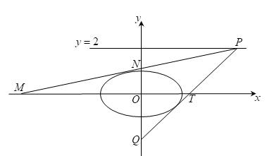

**题型五：外接圆问题**

<strong>例13．</strong>（2024·全国·高三专题练习）已知<em>P</em>是抛物线<em>C</em>：的顶点，<em>A</em>，<em>B</em>是<em>C</em>上的两个动点，且．

（1）试判断直线是否经过某一个定点？若是，求这个定点的坐标；若不是，说明理由；

（2）设点*M*是的外接圆圆心，求点*M*的轨迹方程．

【解析】（1）因为点是抛物线的顶点，所以点的坐标为，

由题意，直线的斜率存在，设直线的方程为：，，，，，

故，

因为，则，

又、是抛物线上的两个动点，所以，，故，

即，解得，

由，消去可得，则有，

所以，解得，

所以直线的方程为，

所以直线经过一个定点．

（2）线段的中点坐标为，又直线的斜率为，

所以线段的垂直平分线的方程为，①

同理，线段的垂直平分线的方程为，②

由①②解得，

设点，则有，消去，得到，

所以点的轨迹方程为．

**例14．**（2024·高二单元测试）已知点是抛物线的顶点，，是上的两个动点，且.

（1）判断点是否在直线上？说明理由；

（2）设点是△的外接圆的圆心，点到轴的距离为，点，求的最大值.

【解析】（1）设直线方程，

根据题意可知直线斜率一定存在，

则

则

由

所以

将代入上式

化简可得，所以

则直线方程为，

所以直线过定点，

所以可知点不在直线上.

（2）设

线段的中点为

线段的中点为

则直线的斜率为，

直线的斜率为

可知线段的中垂线的方程为

由，所以上式化简为

即线段的中垂线的方程为

同理可得：

线段的中垂线的方程为

则

由（1）可知：

所以

即，所以点轨迹方程为

焦点为，

所以

当三点共线时，有最大

所以

**例15．**（2024·全国·高三专题练习）已知点是抛物线的顶点，，是上的两个动点，且.

（1）判断点是否在直线上？说明理由；

（2）设点是△的外接圆的圆心，求点的轨迹方程.

【解析】(1) 点在直线上.理由如下，

由题意, 抛物线的顶点为

因为直线与抛物线有2个交点，

所以设直线AB的方程为

联立得到，

其中，

所以，

因为

所以

，

所以，

解得，

经检验，满足，

所以直线*AB*的方程为，恒过定点.

（2）因为点是的外接圆的圆心，所以点是三角形三条边的中垂线的交点，

设线段的中点为，线段的中点为为，

因为，设，，，

所以，，，，，，

所以线段的中垂线的方程为：，

因为在抛物线上，所以，

的中垂线的方程为：，即，

同理可得线段的中垂线的方程为：，

联立两个方程，解得，

由（1）可得，，

所以，，

即点，所以，

即点的轨迹方程为：．

**题型六：最值问题**

**例16．**（2024·全国·高三专题练习）如图已知是直线上的动点，过点作抛物线的两条切线，切点分别为，与轴分别交于.

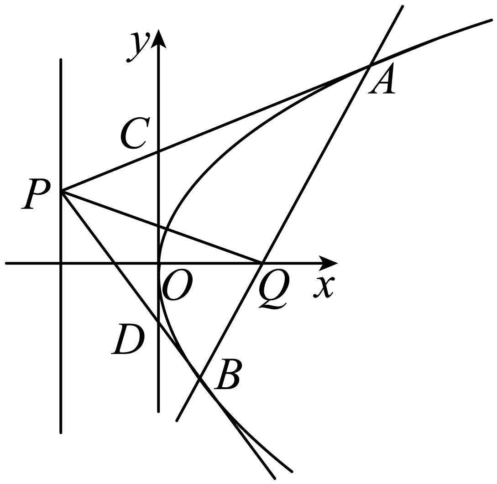

（1）求证：直线过定点，并求出该定点；

（2）设直线与轴相交于点，记两点到直线的距离分别为；求当取最大值时的面积.

【解析】（1）设过点与抛物线相切的直线方程为：，

由，得，

因为相切，所以，即得，

设是该方程的两根，由韦达定理得：，

分别表示切线斜率的倒数，且每条切线对应一个切点，所以切点，

所以，

所以直线为：，得，

直线方程为：，

所以过定点.

（2）由（1）知，

由（1）知点坐标为，，所以直线方程为：，

即：，所以，

分居直线两侧可得

，

所以

，

∴

∴当且仅当等号成立，

又由，令得：，

.

**例17．**（2024·湖南·高三校联考阶段练习）在直角坐标系中，已知抛物线，为直线上的动点，过点作抛物线的两条切线，切点分别为，当在轴上时，.

(1)求抛物线的方程；

(2)求点到直线距离的最大值.

【解析】（1）当在轴上时，即，由题意不妨设则，

设过点的切线方程为，与联立得，

由直线和抛物线相切可得，，所以

由得，∴，，

由可得，解得，

∴抛物线的方程为；

（2），∴，

设，，则，又，所以

即，同理可得，

又为直线上的动点，设，

则，，

由两点确定一条直线可得的方程为，

即，∴直线恒过定点，

∴点到直线距离的最大值为.

<strong>例18．</strong>（2024·辽宁沈阳·校联考二模）从抛物线的焦点发出的光经过抛物线反射后，光线都平行于抛物线的轴，根据光路的可逆性，平行于抛物线的轴射向抛物线后的反射光线都会汇聚到抛物线的焦点处，这一性质被广泛应用在生产生活中．如图，已知抛物线，从点发出的平行于<em>y</em>轴的光线照射到抛物线上的<em>D</em>点，经过抛物线两次反射后，反射光线由<em>G</em>点射出，经过点．

(1)求抛物线*C*的方程；

(2)已知圆，在抛物线*C*上任取一点*E*，过点*E*向圆*M*作两条切线*EA*和*EB*，切点分别为*A*、*B*，求的取值范围．

【解析】（1）由题设，令，，根据抛物线性质知：直线必过焦点，

所以，则，整理得，，则，

所以抛物线*C*的方程为.

（2）由题意，，且，，，

所以，

而，

令，则，

所以，，

综上，，

又，，若，则，

由，当，即时，无最大值，

所以，即，故，，

令，则，

令，在上恒成立，即递减，所以.

**变式14．**（2024·贵州·高三校联考阶段练习）已知抛物线上的点到其焦点的距离为.

(1)求抛物线的方程；

(2)已知点在直线：上，过点作抛物线的两条切线，切点分别为，直线与直线交于点，过抛物线的焦点作直线的垂线交直线于点，当最小时，求的值.

【解析】（1）因为点在抛物线上，可得，

又因为点到其焦点的距离为，

由抛物线的性质可得，解得，即抛物线的方程为.

（2）由题意可设，且，，

因为，所以，可得，所以，整理得，

设点，同理可得，

则直线方程为，

令，可得，即点，

因为直线与直线垂直，所以直线方程为，

令，可得，即点，

所以，当且仅当时，即时上式等号成立，

即的最小值为，

联立方程组，整理得，

所以，

则

所以.

<strong>变式15．</strong>（2024·黑龙江大庆·高二大庆实验中学校考阶段练习）已知抛物线，点<em>P</em>为直线上的任意一点，过点<em>P</em>作抛物线<em>C</em>的两条切线，切点分别为<em>A</em>，<em>B</em>，则点到直线<em>AB</em>的距离的最大值为（    ）

A．1	B．4	C．5	D．

【答案】D

【解析】设，切点，

由题意知在点*A*处的切线斜率存在且不为0，设在点*A*处切线斜率为

在点*A*处切线方程可设为

由，可得

由，可得

则在点*A*处切线方程可化为，即

由题意知在点*B*处的切线斜率存在且不为0，设在点*B*处切线斜率为

在点*B*处切线方程可设为

由，可得

由，可得

则在点*B*处切线方程可化为，即

又两条切线均过点*P*，则，

则直线*AB*的方程为，即

则直线*AB*恒过定点

点到直线*AB*的距离的最大值即为点到的距离

故点到直线*AB*的距离的最大值为.

故选：D

**题型七：角度相等问题**

**例19．** 设抛物线的焦点为F，动点P在直线上运动，过P作抛物线C的两条切线PA、PB，且与抛物线C分别相切于A、B两点.

（1）求△APB的重心G的轨迹方程.

（2）证明∠PFA=∠PFB．

【解析】（1）设切点，坐标分别为和，

切线的方程为：；切线的方程为：；

由于既在又在上，所以 解得，

所以的重心的坐标为，

，

所以，由点在直线上运动，从而得到重心的轨迹方程为：

，即．

（2）方法1：因为，，．

由于点在抛物线外，则．

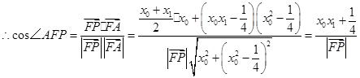

，

同理有

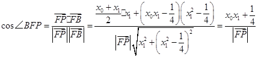

，

．

方法2：①当时，由于，不妨设，则，所以*P*点坐标为，则*P*点到直线*AF*的距离为：；而直线的方程：，

即．所以*P*点到直线*BF*的距离为： 所以，即得．

②当时，直线*AF*的方程：，即，

直线的方程：，即，

所以*P*点到直线*AF*的距离为：

，

同理可得到*P*点到直线*BF*的距离

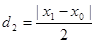

，因此由，可得到．

**例20．**（2024·全国·高三专题练习）已知，分别是椭圆的上、下焦点，直线过点且垂直于椭圆长轴，动直线垂直于点，线段的垂直平分线交于点，点的轨迹为.

(1)求轨迹的方程；

(2)若动点在直线上运动，且过点作轨迹的两条切线、，切点为*A*、*B*，试猜想与的大小关系，并证明你的结论的正确性.

【解析】（1），，

椭圆半焦距长为，，，

，

动点到定直线与定点的距离相等，

动点的轨迹是以定直线为准线，定点为焦点的抛物线，

轨迹的方程是；

（2）猜想

证明如下：由（1）可设，

，

，则，

切线的方程为：

同理，切线的方程为：

联立方程组可解得的坐标为，

在抛物线外，

，，

同理

<strong>例21．</strong>（2024·江苏南通·高三统考阶段练习）在平面直角坐标系<em>xOy</em>中，已知圆与抛物线交于点<em>M</em>，<em>N</em>（异于原点<em>O</em>），<em>MN</em>恰为该圆的直径，过点<em>E</em>（0，2）作直线交抛物线于<em>A</em>，<em>B</em>两点，过<em>A</em>，<em>B</em>两点分别作抛物线<em>C</em>的切线交于点<em>P</em>．

(1)求证：点*P*的纵坐标为定值；

(2)若*F*是抛物线*C*的焦点，证明：．

【解析】（1）由对称性可知交点坐标为(1，1)，(-1，1)，

代入抛物线方程可得2*p*=1，

所以抛物线的方程为<em>x2</em>=<em>y</em>，

设*A*，*B*，

所以，

所以直线*AB*的方程为，

即，

因为直线*AB*过点*C*(0，2)，

所以，所以①.

因为，所以直线*PA*的斜率为，直线*PB*的斜率为，

直线*PA*的方程为，

即，

同理直线*PB*的方程为，

联立两直线方程，可得*P*

由①可知点*P*的纵坐标为定值-2.

（2），，

注意到两角都在内，

可知要证， 即证，

，，

所以，

又，所以，

同理式得证.

<strong>变式16．</strong>（2024·全国·高三专题练习）如图所示，设抛物线<em>C</em>：的焦点为<em>F</em>，动点<em>P</em>在直线<em>l</em>：上运动，过<em>P</em>作抛物线<em>C</em>的两条切线，，切点分别为<em>A</em>，<em>B</em>，求证：.

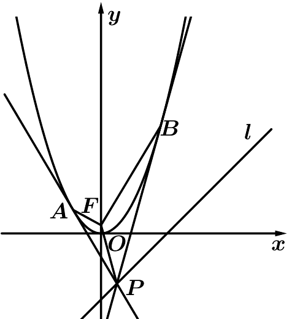

【解析】证明：设切*A*、*B*的坐标分别为和（）.

可得切线的方程为；切线的方程为，

解得点*P*的坐标为，.

则，，.

由于点*P*在抛物线外，即.

∴.

同理有，

所以

综上可知：.

<strong>变式17．</strong>（2024·全国·高三专题练习）在平面直角坐标系<em>xOy</em>中，已知点<em>E</em>(0，2)，以<em>OE</em>为直径的圆与抛物线<em>C</em>∶<em>x2</em>=2<em>py</em>(<em>p</em>&gt;0)交于点<em>M</em>，<em>N</em>(异于原点<em>O</em>)，<em>MN</em>恰为该圆的直径，过点<em>E</em>作直线交抛物线与<em>A</em>，<em>B</em>两点，过<em>A</em>，<em>B</em>两点分别作拋物线<em>C</em>的切线交于点<em>P</em>.

（1）求证∶点*P*的纵坐标为定值；

（2）若*F*是抛物线*C*的焦点，证明∶∠*PFA*=∠*PFB*.

【解析】（1）以<em>OC</em>为直径的圆为<em>x2</em>+(<em>y</em>-1)2=1.

由题意可知该圆与抛物线交于一条直径，

由对称性可知交点坐标为(1，1)，(-1，1)

代入抛物线方程可得2*p*=1.

所以抛物线的方程为<em>x2</em>=<em>y</em>.

设*A*，*B*，

所以

所以直线*AB*的方程为，

即

因为直线*AB*过点*C*(0，2)，

所以，所以①.

因为，所以直线*PA*的斜率为，直线*PB*的斜率为

直线*PA*的方程为，

即，

同理直线*PB*的方程为

联立两直线方程，可得*P*

由①可知点*P*的纵坐标为定值-2.

（2），，

注意到两角都在内，

可知要证， 即证，

，，

所以，

又，所以，

同理式得证

