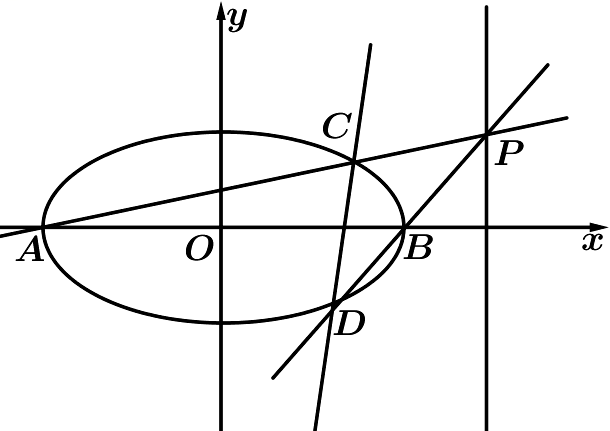
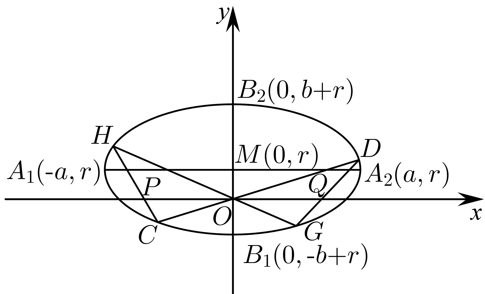
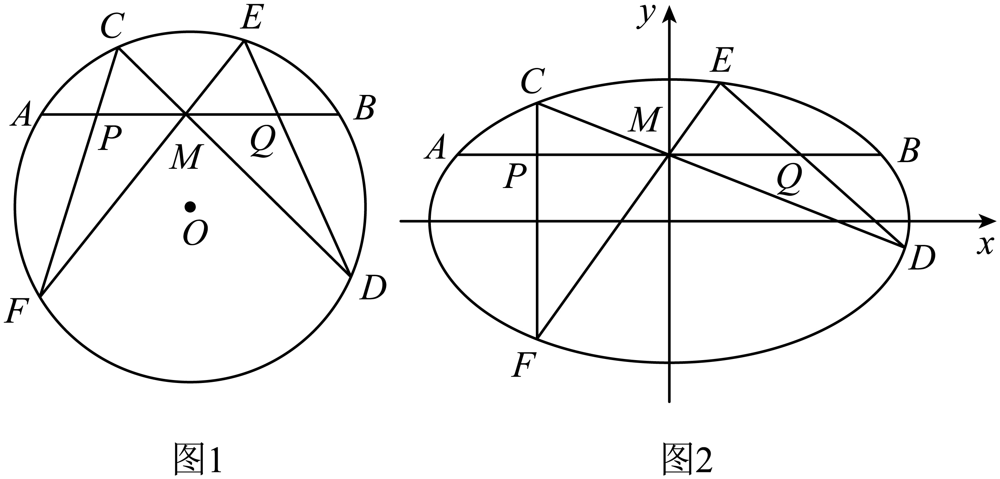
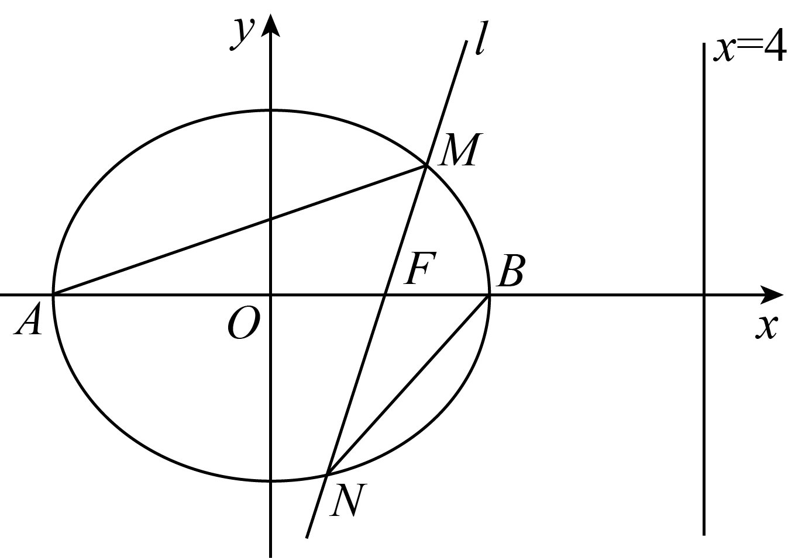
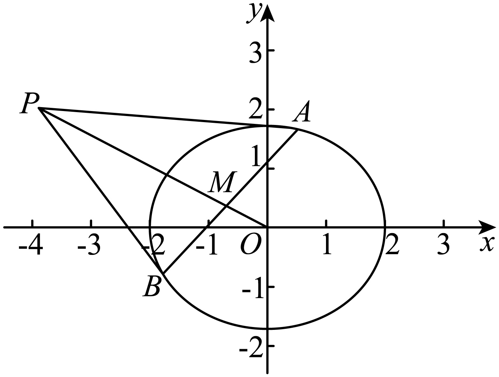

**第81讲  圆锥曲线拓展题型一**

**必考题型全归纳**

**题型一：定比点差法**

**例1．** 已知椭圆（）的离心率为，过右焦点且斜率为（）的直线与相交于，两点，若，求

**例2．** 已知，过点的直线交椭圆于，（可以重合），求取值范围．

**例3．** 已知椭圆的左右焦点分别为，，，，是椭圆上的三个动点，且，若，求的值．

**变式1．** 设，分别为椭圆的左、右焦点，点，在椭圆上，若，求点的坐标

**变式2．** 已知椭圆，设过点的直线与椭圆交于，，点是线段上的点，且，求点的轨迹方程．

**题型二：齐次化**

<strong>例4．</strong>已知抛物线，过点的直线与抛物线交于<em>P</em>，<em>Q</em>两点，为坐标原点．证明：．

<strong>例5．</strong>如图，椭圆，经过点，且斜率为的直线与椭圆交于不同的两点<em>P</em>，<em>Q</em>（均异于点，证明：直线<em>AP</em>与<em>AQ</em>的斜率之和为2．

<strong>例6．</strong>已知椭圆，设直线不经过点且与相交于<em>A</em>，<em>B</em>两点．若直线与直线的斜率的和为，证明：直线过定点．

**变式3．** 已知椭圆，，，为上的两个不同的动点，，求证：直线过定点．

**题型三：极点极线问题**

**例7．**（2024·全国·高三专题练习）椭圆方程，平面上有一点．定义直线方程是椭圆在点处的极线．已知椭圆方程．

(1)若在椭圆上，求椭圆在点处的极线方程；

(2)若在椭圆上，证明：椭圆在点处的极线就是过点的切线；

(3)若过点分别作椭圆的两条切线和一条割线，切点为，，割线交椭圆于，两点，过点，分别作椭圆的两条切线，且相交于点．证明：，，三点共线．

**例8．**（2024·全国·高三专题练习）阅读材料：

（一）极点与极线的代数定义；已知圆锥曲线*G*：，则称点*P*(，)和直线*l*：是圆锥曲线*G*的一对极点和极线.事实上，在圆锥曲线方程中，以替换，以替换*x*(另一变量*y*也是如此)，即可得到点*P*(，)对应的极线方程.特别地，对于椭圆，与点*P*(，)对应的极线方程为；对于双曲线，与点*P*(，)对应的极线方程为；对于抛物线，与点*P*(，)对应的极线方程为.即对于确定的圆锥曲线，每一对极点与极线是一一对应的关系.

（二）极点与极线的基本性质､定理

①当*P*在圆锥曲线*G*上时，其极线*l*是曲线*G*在点*P*处的切线；

②当*P*在*G*外时，其极线*l*是曲线*G*从点*P*所引两条切线的切点所确定的直线（即切点弦所在直线）；

③当*P*在*G*内时，其极线*l*是曲线*G*过点*P*的割线两端点处的切线交点的轨迹.

结合阅读材料回答下面的问题：

(1)已知椭圆*C*：经过点*P*(4，0)，离心率是，求椭圆*C*的方程并写出与点*P*对应的极线方程；

(2)已知*Q*是直线*l*：上的一个动点，过点*Q*向（1）中椭圆*C*引两条切线，切点分别为*M*，*N*，是否存在定点*T*恒在直线*MN*上，若存在，当时，求直线*MN*的方程；若不存在，请说明理由.

<strong>例9．</strong>（2024秋·北京·高三中关村中学校考开学考试）已知椭圆<em>M</em>：（<em>a</em>＞<em>b</em>＞0）过<em>A</em>（－2，0），<em>B</em>（0，1）两点．

（1）求椭圆*M*的离心率；

（2）设椭圆*M*的右顶点为*C*，点*P*在椭圆*M*上（*P*不与椭圆*M*的顶点重合），直线*AB*与直线*CP*交于点*Q*，直线*BP*交*x*轴于点*S*，求证：直线*SQ*过定点．

**变式4．**（2024·全国·高三专题练习）若双曲线与椭圆共顶点，且它们的离心率之积为．

（1）求椭圆*C*的标准方程；

（2）若椭圆*C*的左、右顶点分别为，，直线*l*与椭圆*C*交于*P、Q*两点，设直线与的斜率分别为，，且．试问，直线*l*是否过定点？若是，求出定点的坐标；若不是，请说明理由．

<strong>变式5．</strong>（2024·全国·高三专题练习）已知椭圆的离心率为，且过点，<em>A</em>，<em>B</em>分别为椭圆<em>E</em>的左，右顶点，<em>P</em>为直线上的动点（不在<em>x</em>轴上），与椭圆<em>E</em>的另一交点为<em>C</em>，与椭圆<em>E</em>的另一交点为<em>D</em>，记直线与的斜率分别为，．

（Ⅰ）求椭圆*E*的方程；

（Ⅱ）求的值；

（Ⅲ）证明：直线过一个定点，并求出此定点的坐标．

**题型四：蝴蝶问题**

<strong>例10．</strong>（2003·全国·高考真题）如图，椭圆的长轴与<em>x</em>轴平行，短轴在<em>y</em>轴上，中心为．

(1)写出椭圆的方程，求椭圆的焦点坐标及离心率；

(2)直线交椭圆于两点；直线交椭圆于两点，．求证：；

(3)对于（2）中的中的在，，，，设交轴于点，交轴于点，求证：（证明过程不考虑或垂直于轴的情形）

**例11．**（2024·全国·高三专题练习）已知椭圆（），四点，，，，中恰有三点在椭圆上.

（1）求椭圆的方程；

（2）蝴蝶定理：如图1，为圆的一条弦，是的中点，过作圆的两条弦，.若，分别与直线交于点，，则.

该结论可推广到椭圆.如图2所示，假定在椭圆中，弦的中点的坐标为，且两条弦，所在直线斜率存在，证明：.

<strong>例12．</strong>（2021·全国·高三专题练习）（蝴蝶定理）过圆弦的中点<em>M</em>，任意作两弦和，与交弦于<em>P</em>、<em>Q</em>，求证：.

**变式6．**（2024·全国·高三专题练习）蝴蝶定理因其美妙的构图，像是一只翩翩起舞的蝴蝶，一代代数学名家蜂拥而证，正所谓花若芬芳蜂蝶自来.如图，已知圆的方程为，直线与圆交于，，直线与圆交于，.原点在圆内.

（1）求证：.

（2）设交轴于点，交轴于点.求证：.

**变式7．**（2024·陕西西安·陕西师大附中校考模拟预测）已知椭圆的左､右顶点分别为点，，且，椭圆离心率为.

（1）求椭圆的方程；

（2）过椭圆的右焦点，且斜率不为的直线交椭圆于，两点，直线，的交于点，求证：点在直线上.

<strong>变式8．</strong>（2024·全国·高三专题练习）已知椭圆<em>C</em>：＋＝1(<em>a</em>&gt;<em>b</em>&gt;0)的左、右顶点分别为<em>A</em>，<em>B</em>，离心率为，点<em>P</em>为椭圆上一点．

（1）求椭圆*C*的标准方程；

（2）如图，过点<em>C</em>(0，1)且斜率大于1的直线<em>l</em>与椭圆交于<em>M</em>，<em>N</em>两点，记直线<em>AM</em>的斜率为<em>k1</em>，直线<em>BN</em>的斜率为<em>k2</em>，若<em>k1</em>＝2<em>k2</em>，求直线<em>l</em>斜率的值．

<strong>变式9．</strong>（2021秋·广东深圳·高二校考期中）已知椭圆的右焦点是，过点<em>F</em>的直线交椭圆<em>C</em>于<em>A</em>，<em>B</em>两点，若线段<em>AB</em>中点<em>Q</em>的坐标为．

(1)求椭圆*C*的方程；

(2)已知是椭圆*C*的下顶点，如果直线*y*=*kx*+1（*k*≠0）交椭圆*C*于不同的两点*M*，*N*，且*M*，*N*都在以*P*为圆心的圆上，求*k*的值；

(3)过点作一条非水平直线交椭圆<em>C</em>于<em>R</em>、<em>S</em>两点，若<em>A</em>，<em>B</em>为椭圆的左右顶点，记直线<em>AR</em>、<em>BS</em>的斜率分别为<em>k1</em>、<em>k2</em>，则是否为定值，若是，求出该定值，若不是，请说明理由．

**变式10．**（2024·全国·高三专题练习）如图，已知椭圆的离心率为，，分别是椭圆的左、右顶点，右焦点，，过且斜率为的直线与椭圆相交于，两点，在轴上方．

(1)求椭圆的标准方程；

(2)记，的面积分别为，，若，求的值；

(3)设线段的中点为，直线与直线相交于点，记直线，，的斜率分别为，，，求的值．

**变式11．**（2024秋·福建莆田·高二莆田华侨中学校考期末）已知点在椭圆：上，为坐标原点，直线：的斜率与直线的斜率乘积为

（1）求椭圆的方程；

（2）不经过点的直线：（且）与椭圆交于，两点，关于原点的对称点为（与点不重合），直线，与轴分别交于两点，，求证：.

<strong>变式12．</strong>（2022·全国·高三专题练习）极线是高等几何中的重要概念，它是圆锥曲线的一种基本特征.对于圆，与点对应的极线方程为，我们还知道如果点在圆上，极线方程即为切线方程；如果点在圆外，极线方程即为切点弦所在直线方程.同样，对于椭圆，与点对应的极线方程为.如上图，已知椭圆<em>C</em>：，，过点<em>P</em>作椭圆<em>C</em>的两条切线<em>PA</em>，<em>PB</em>，切点分别为<em>A</em>，<em>B</em>，则直线<em>AB</em>的方程为______；直线<em>AB</em>与<em>OP</em>交于点<em>M</em>，则的最小值是______.

