**第81讲  圆锥曲线拓展题型一**

**必考题型全归纳**

**题型一：定比点差法**

**例1．** 已知椭圆（）的离心率为，过右焦点且斜率为（）的直线与相交于，两点，若，求

【解析】由，可设椭圆为（），

设，，，由，

所以，．

又

由（1）-（3）得，

又．

又．

**例2．** 已知，过点的直线交椭圆于，（可以重合），求取值范围．

【解析】设，，，由，

所以．

由

由（1）-（3）得：

，又，

又，从而．

**例3．** 已知椭圆的左右焦点分别为，，，，是椭圆上的三个动点，且，若，求的值．

【解析】设，，，，由，得

①满足

满足

②由

③由（1）-（3）得：

，又

，同理可得

．

**变式1．** 设，分别为椭圆的左、右焦点，点，在椭圆上，若，求点的坐标

【解析】记直线反向延长交椭圆于，由及椭圆对称性得，

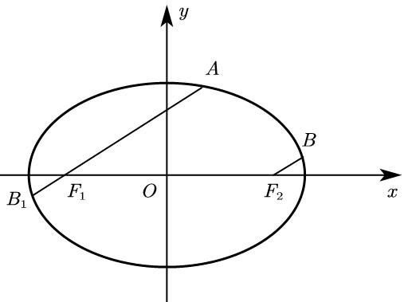

设，，．

①由定比分点公式得

．

②又

③由（1）-（3）得，

又．

**变式2．** 已知椭圆，设过点的直线与椭圆交于，，点是线段上的点，且，求点的轨迹方程．

【解析】设，，

由

，记，

即，．

①，由定比分点得：

，由定比分点得

②又

③由（1）-（3）得：

，即．

**题型二：齐次化**

<strong>例4．</strong>已知抛物线，过点的直线与抛物线交于<em>P</em>，<em>Q</em>两点，为坐标原点．证明：．

【解析】直线

由，得

则由，得：，

整理得：，即：．

所以，

则，即：．

<strong>例5．</strong>如图，椭圆，经过点，且斜率为的直线与椭圆交于不同的两点<em>P</em>，<em>Q</em>（均异于点，证明：直线<em>AP</em>与<em>AQ</em>的斜率之和为2．

【解析】设直线

则．

由，

得：．

则，

故．

所以．

即．

<strong>例6．</strong>已知椭圆，设直线不经过点且与相交于<em>A</em>，<em>B</em>两点．若直线与直线的斜率的和为，证明：直线过定点．

【解析】设直线．．．．．．（1）

由，得

即：．．．．．．（2）

由（1）（2）得：

整理得：

则，

则，代入直线，得：

显然，直线过定点．

**变式3．** 已知椭圆，，，为上的两个不同的动点，，求证：直线过定点．

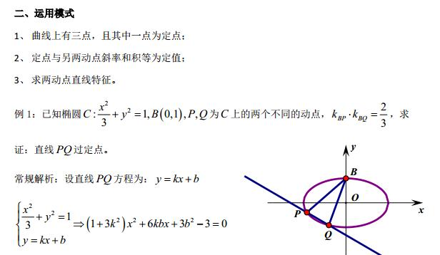

【解析】设直线方程为：

则

即，又因为

化简得或（舍去）．

即直线为，即直线过定点．

**题型三：极点极线问题**

**例7．**（2024·全国·高三专题练习）椭圆方程，平面上有一点．定义直线方程是椭圆在点处的极线．已知椭圆方程．

(1)若在椭圆上，求椭圆在点处的极线方程；

(2)若在椭圆上，证明：椭圆在点处的极线就是过点的切线；

(3)若过点分别作椭圆的两条切线和一条割线，切点为，，割线交椭圆于，两点，过点，分别作椭圆的两条切线，且相交于点．证明：，，三点共线．

【解析】（1）由题意知，当时，，所以或．

由定义可知椭圆在点处的极线方程为，

所以椭圆在点处的极线方程为，即

点处的极线方程为，即

（2）因为在椭圆上，所以，

由定义可知椭圆在点处的极线方程为，

当时，，此时极线方程为，所以处的极线就是过点的切线．

当时，极线方程为．

联立，得．

．

综上所述，椭圆在点处的极线就是过点的切线；

（3）设点，，，

由（2）可知，过点的切线方程为，

过点*N*的切线方程为．

因为，都过点，所以有，

则割线的方程为；

同理可得过点的两条切线的切点弦的方程为．

又因为割线过点，代入割线方程得．

所以，，三点共线，都在直线上．

**例8．**（2024·全国·高三专题练习）阅读材料：

（一）极点与极线的代数定义；已知圆锥曲线*G*：，则称点*P*(，)和直线*l*：是圆锥曲线*G*的一对极点和极线.事实上，在圆锥曲线方程中，以替换，以替换*x*(另一变量*y*也是如此)，即可得到点*P*(，)对应的极线方程.特别地，对于椭圆，与点*P*(，)对应的极线方程为；对于双曲线，与点*P*(，)对应的极线方程为；对于抛物线，与点*P*(，)对应的极线方程为.即对于确定的圆锥曲线，每一对极点与极线是一一对应的关系.

（二）极点与极线的基本性质､定理

①当*P*在圆锥曲线*G*上时，其极线*l*是曲线*G*在点*P*处的切线；

②当*P*在*G*外时，其极线*l*是曲线*G*从点*P*所引两条切线的切点所确定的直线（即切点弦所在直线）；

③当*P*在*G*内时，其极线*l*是曲线*G*过点*P*的割线两端点处的切线交点的轨迹.

结合阅读材料回答下面的问题：

(1)已知椭圆*C*：经过点*P*(4，0)，离心率是，求椭圆*C*的方程并写出与点*P*对应的极线方程；

(2)已知*Q*是直线*l*：上的一个动点，过点*Q*向（1）中椭圆*C*引两条切线，切点分别为*M*，*N*，是否存在定点*T*恒在直线*MN*上，若存在，当时，求直线*MN*的方程；若不存在，请说明理由.

【解析】（1）因为椭圆过点*P*(4,0)，

则，得，又，

所以，所以，

所以椭圆*C*的方程为.

根据阅读材料，与点*P*对应的极线方程为，即；

（2）由题意，设点*Q*的坐标为(,)，

因为点*Q*在直线上运动，所以，

联立，得，

，该方程无实数根，

所以直线与椭圆*C*相离，即点*Q*在椭圆*C*外，

又*QM*，*QN*都与椭圆*C*相切，

所以点*Q*和直线*MN*是椭圆*C*的一对极点和极线.

对于椭圆，与点*Q*(,)对应的极线方程为，

将代入，整理得，

又因为定点*T*的坐标与的取值无关，

所以，解得，

所以存在定点*T*(2,1)恒在直线*MN*上.

当时，*T*是线段*MN*的中点，

设，直线*MN*的斜率为，

则，两式相减，整理得，即，

所以当时，直线*MN*的方程为，即.

<strong>例9．</strong>（2024秋·北京·高三中关村中学校考开学考试）已知椭圆<em>M</em>：（<em>a</em>＞<em>b</em>＞0）过<em>A</em>（－2，0），<em>B</em>（0，1）两点．

（1）求椭圆*M*的离心率；

（2）设椭圆*M*的右顶点为*C*，点*P*在椭圆*M*上（*P*不与椭圆*M*的顶点重合），直线*AB*与直线*CP*交于点*Q*，直线*BP*交*x*轴于点*S*，求证：直线*SQ*过定点．

【解析】（1）因为点，都在椭圆上，

所以，．

所以．

所以椭圆的离心率．

（2）由（1）知椭圆的方程为，．

由题意知：直线的方程为．

设（，），，．

因为三点共线，所以有，，

所以．

所以．

所以．

因为三点共线，

所以，即．

所以．

所以直线的方程为，

即．

又因为点在椭圆上，所以．

所以直线的方程为．

所以直线过定点．

**变式4．**（2024·全国·高三专题练习）若双曲线与椭圆共顶点，且它们的离心率之积为．

（1）求椭圆*C*的标准方程；

（2）若椭圆*C*的左、右顶点分别为，，直线*l*与椭圆*C*交于*P、Q*两点，设直线与的斜率分别为，，且．试问，直线*l*是否过定点？若是，求出定点的坐标；若不是，请说明理由．

【解析】（1）由已知得双曲线的离心率为，又两曲线离心率之积为，所以椭圆的离心率为；

由题意知，所以，．

所以椭圆的标准万程为．

（2）当直线*l*的斜率为零时，由对称性可知：

，不满足，

故直线*l*的斜率不为零．设直线*l*的方程为，

由，得：，

因为直线*l*与椭圆*C*交于*P*、*Q*两点，

所以，

整理得：，

设、，则

，，，．

因为，

所以，

整理得：，

，

将，代入整理得：

要使上式恒成立，只需，此时满足，

因此，直线*l*恒过定点．

<strong>变式5．</strong>（2024·全国·高三专题练习）已知椭圆的离心率为，且过点，<em>A</em>，<em>B</em>分别为椭圆<em>E</em>的左，右顶点，<em>P</em>为直线上的动点（不在<em>x</em>轴上），与椭圆<em>E</em>的另一交点为<em>C</em>，与椭圆<em>E</em>的另一交点为<em>D</em>，记直线与的斜率分别为，．

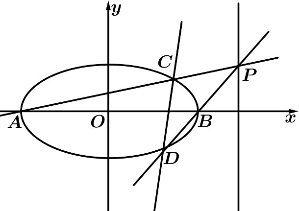

（Ⅰ）求椭圆*E*的方程；

（Ⅱ）求的值；

（Ⅲ）证明：直线过一个定点，并求出此定点的坐标．

【解析】（1）由条件可知：且，解得，所以椭圆的方程为；

（2）因为，设，

所以，所以；

（3）设，所以，

因为，所以，

所以，所以，所以，所以，

又因为，所以，

所以，所以，所以，所以，

所以，所以，

所以，所以，

所以直线过定点.

**题型四：蝴蝶问题**

<strong>例10．</strong>（2003·全国·高考真题）如图，椭圆的长轴与<em>x</em>轴平行，短轴在<em>y</em>轴上，中心为．

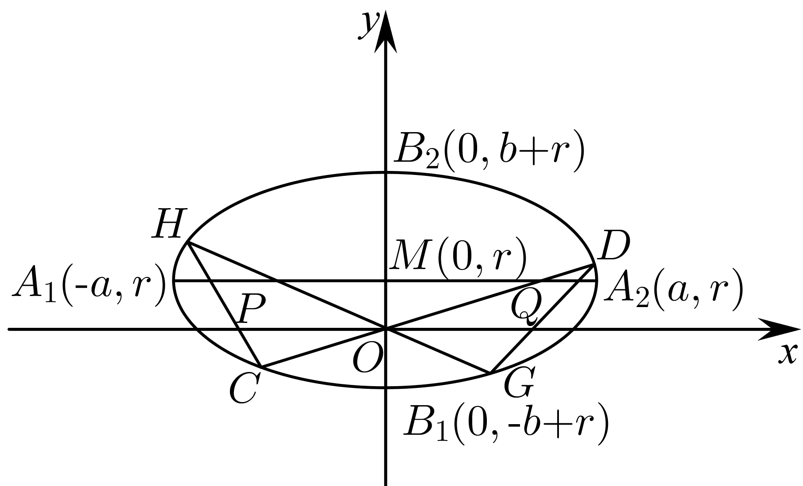

(1)写出椭圆的方程，求椭圆的焦点坐标及离心率；

(2)直线交椭圆于两点；直线交椭圆于两点，．求证：；

(3)对于（2）中的中的在，，，，设交轴于点，交轴于点，求证：（证明过程不考虑或垂直于轴的情形）

【解析】（1）椭圆的长轴与轴平行，短轴在轴上，中心，

椭圆方程为

焦点坐标为，

离心率

（2）证明：将直线的方程代入椭圆方程，得

整理得

根据韦达定理，得，，

所以①

将直线的方程代入椭圆方程，同理可得②

由 ①、②得

所以结论成立.

（3）证明：设点，点

由、、共线，得

解得

由、、共线，同理可得

由变形得

所以

即

**例11．**（2024·全国·高三专题练习）已知椭圆（），四点，，，，中恰有三点在椭圆上.

（1）求椭圆的方程；

（2）蝴蝶定理：如图1，为圆的一条弦，是的中点，过作圆的两条弦，.若，分别与直线交于点，，则.

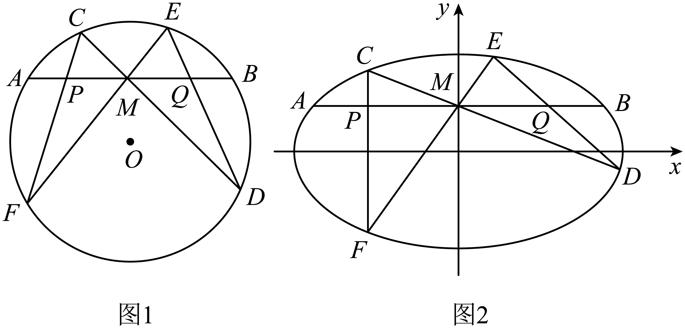

该结论可推广到椭圆.如图2所示，假定在椭圆中，弦的中点的坐标为，且两条弦，所在直线斜率存在，证明：.

【解析】（1）由于，两点关于轴对称，

故由题设知经过，两点，

又由知，不过点，所以点在上，

因此，解得，

故椭圆的方程为；

（2）因点的坐标在轴上，且为的中点，

所以直线平行于轴，

设，，，，

设直线的方程为，代入椭圆，

得：，

根据韦达定理得：，，①

同理，设直线的方程为，代入椭圆，

得：，

根据韦达定理得：，，②

由于、、三点共线，得，，

同理，由于、、三点共线，得：，结合①和②可得：

即，所以，即.

<strong>例12．</strong>（2021·全国·高三专题练习）（蝴蝶定理）过圆弦的中点<em>M</em>，任意作两弦和，与交弦于<em>P</em>、<em>Q</em>，求证：.

【解析】如图所示，以为原点，所在直线为*x*轴建立直角坐标系，设圆方程为

设直线、的方程分别为，.

将它们合并为，于是过点*C*、*D*、*E*、*F*的曲线系方程为

.

令，得，即过点*C*、*D*、*E*、*F*的曲线系与交于点*P*、*Q*的横坐标是方程的两根.

由韦达定理得，即是的中点，故.

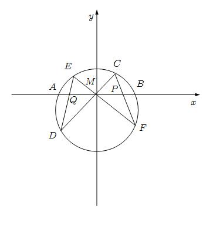

**变式6．**（2024·全国·高三专题练习）蝴蝶定理因其美妙的构图，像是一只翩翩起舞的蝴蝶，一代代数学名家蜂拥而证，正所谓花若芬芳蜂蝶自来.如图，已知圆的方程为，直线与圆交于，，直线与圆交于，.原点在圆内.

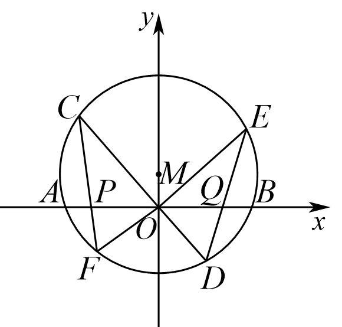

（1）求证：.

（2）设交轴于点，交轴于点.求证：.

【解析】（1）已知圆的方程为，

直线与圆交于，，联立，

化简得，

则，，所以，

同理线与圆交于，，

联立 化简得，

则，，所以，

故有，所以成立；

（2）不妨设点，点，

因为、、三点共线，所以，化简得，

因为点在直线上，所以，点在直线上，所以，

则，

同理因为、、三点共线，所以，化简得，

因为点在直线上，所以，点在直线上，所以，

则，

又由，可得，，

即，所以，则，

所以，所以成立.

**变式7．**（2024·陕西西安·陕西师大附中校考模拟预测）已知椭圆的左､右顶点分别为点，，且，椭圆离心率为.

（1）求椭圆的方程；

（2）过椭圆的右焦点，且斜率不为的直线交椭圆于，两点，直线，的交于点，求证：点在直线上.

【解析】（1）因为，椭圆离心率为，

所以，解得，.

所以椭圆的方程是.

（2）①若直线的斜率不存在时，如图，

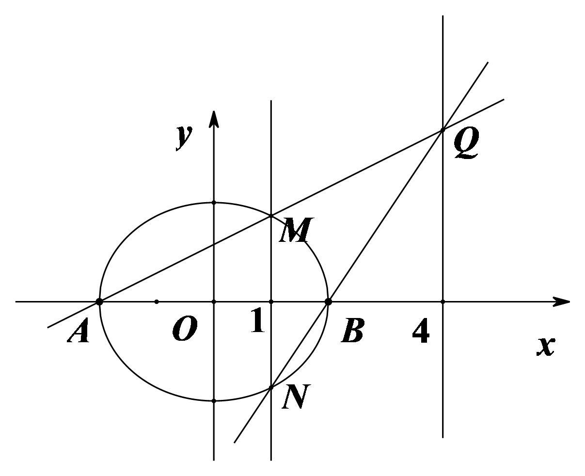

因为椭圆的右焦点为，所以直线的方程是.

所以点的坐标是，点的坐标是.

所以直线的方程是，

直线的方程是.

所以直线，的交点的坐标是.

所以点在直线上.

②若直线的斜率存在时，如图.

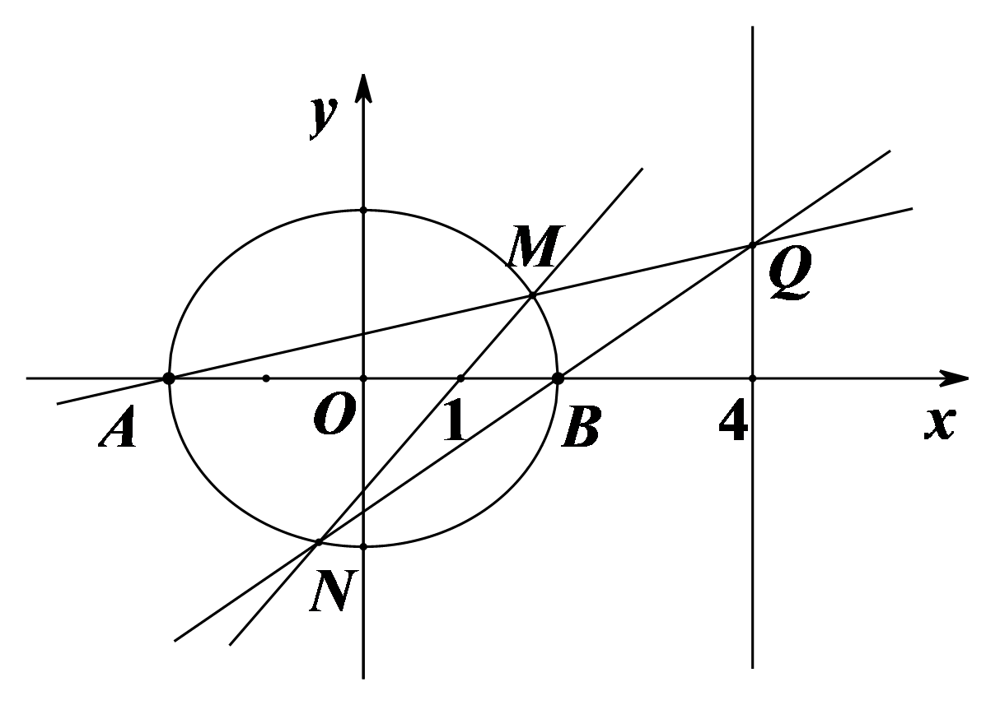

设斜率为.所以直线的方程为.

联立方程组

消去，整理得.

显然.不妨设，，

所以，.

所以直线的方程是.

令，得.

直线的方程是.

令，得.

所以

分子

.

.

所以点在直线上.

<strong>变式8．</strong>（2024·全国·高三专题练习）已知椭圆<em>C</em>：＋＝1(<em>a</em>&gt;<em>b</em>&gt;0)的左、右顶点分别为<em>A</em>，<em>B</em>，离心率为，点<em>P</em>为椭圆上一点．

（1）求椭圆*C*的标准方程；

（2）如图，过点<em>C</em>(0，1)且斜率大于1的直线<em>l</em>与椭圆交于<em>M</em>，<em>N</em>两点，记直线<em>AM</em>的斜率为<em>k1</em>，直线<em>BN</em>的斜率为<em>k2</em>，若<em>k1</em>＝2<em>k2</em>，求直线<em>l</em>斜率的值．

【解析】(1)因为椭圆的离心率为，所以*a*＝2*c*.

又因为<em>a2</em>＝<em>b2</em>＋<em>c2</em>，所以<em>b</em>＝<em>c</em>.

所以椭圆的标准方程为＋＝1.

又因为点*P*为椭圆上一点，所以＋＝1，解得*c*＝1.

所以椭圆的标准方程为＋＝1.

(2) 由椭圆的对称性可知直线*l*的斜率一定存在，设其方程为*y*＝*kx*＋1.

设<em>M</em>(<em>x1</em>，<em>y1</em>)，<em>N</em>(<em>x2</em>，<em>y2</em>)．

联立方程组

消去<em>y</em>可得(3＋4<em>k2</em>)<em>x2</em>＋8<em>kx</em>－8＝0.

所以由根与系数关系可知<em>x1</em>＋<em>x2</em>＝－，<em>x1x2</em>＝－.

因为<em>k1</em>＝，<em>k2</em>＝，且<em>k1</em>＝2<em>k2</em>，所以＝.

即＝.　①

又因为<em>M</em>(<em>x1</em>，<em>y1</em>)，<em>N</em>(<em>x2</em>，<em>y2</em>)在椭圆上，

所以＝ (4－)，＝ (4－)．　②

将②代入①可得：＝，即3<em>x1x2</em>＋10(<em>x1</em>＋<em>x2</em>)＋12＝0.

所以3＋10＋12＝0，即12<em>k2</em>－20<em>k</em>＋3＝0.

解得*k*＝或*k*＝，又因为*k*>1，所以*k*＝.

<strong>变式9．</strong>（2021秋·广东深圳·高二校考期中）已知椭圆的右焦点是，过点<em>F</em>的直线交椭圆<em>C</em>于<em>A</em>，<em>B</em>两点，若线段<em>AB</em>中点<em>Q</em>的坐标为．

(1)求椭圆*C*的方程；

(2)已知是椭圆*C*的下顶点，如果直线*y*=*kx*+1（*k*≠0）交椭圆*C*于不同的两点*M*，*N*，且*M*，*N*都在以*P*为圆心的圆上，求*k*的值；

(3)过点作一条非水平直线交椭圆<em>C</em>于<em>R</em>、<em>S</em>两点，若<em>A</em>，<em>B</em>为椭圆的左右顶点，记直线<em>AR</em>、<em>BS</em>的斜率分别为<em>k1</em>、<em>k2</em>，则是否为定值，若是，求出该定值，若不是，请说明理由．

【解析】（1）设，，直线*AB*的斜率显然存在，则，

因为线段*AB*中点*Q*的坐标为，所以，，

直线*AB*的斜率，

*A*，*B*两点在椭圆椭圆*C*上，

所以，，两式相减得

，

即，

所以，整理得，①

又且，②

由①②可解得，，

所以椭圆*C*的方程为.

（2）由得，

则，，，

设*M*，*N*中点为，

则，，

因为*M*，*N*都在以*P*为圆心的圆上，所以，则点*P*在线段*MN*的垂直平分线上，

依题意，所以线段*MN*的垂直平分线方程为，

*M*，*N*中点为在此直线上，

所以有，即，解得.

所以*k*的值为.

（3）依题意有，，，

设直线的方程为，

由得，

则，，

，

所以为定值.

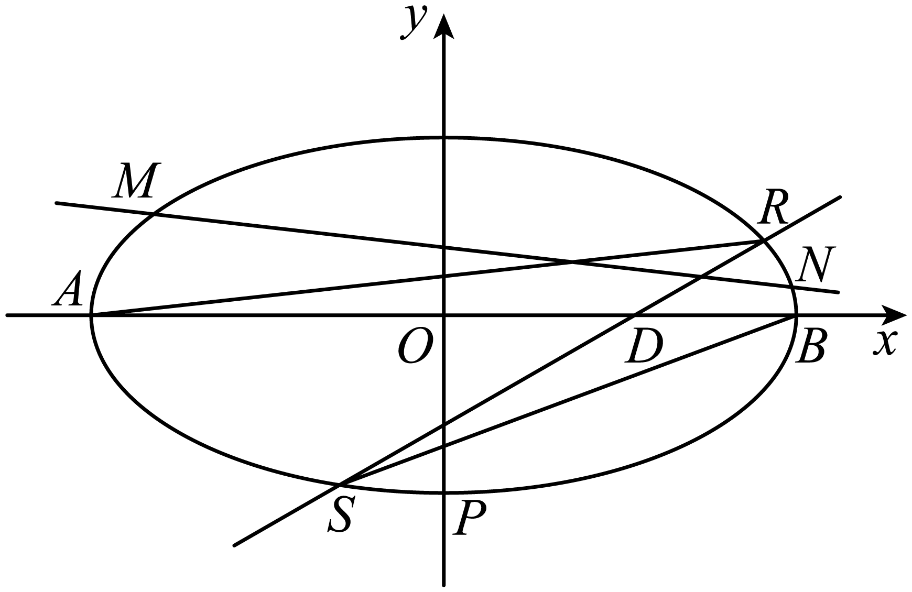

**变式10．**（2024·全国·高三专题练习）如图，已知椭圆的离心率为，，分别是椭圆的左、右顶点，右焦点，，过且斜率为的直线与椭圆相交于，两点，在轴上方．

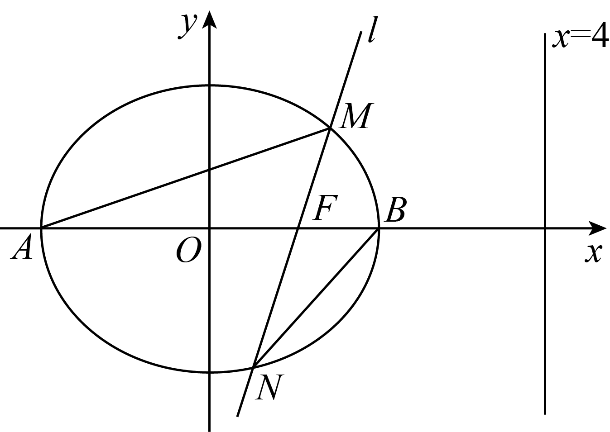

(1)求椭圆的标准方程；

(2)记，的面积分别为，，若，求的值；

(3)设线段的中点为，直线与直线相交于点，记直线，，的斜率分别为，，，求的值．

【解析】（1）设椭圆的焦距为．

依题意可得，，

解得，．

故．

所以椭圆的标准方程为．

（2）设点，，，．

若，则，即有，①

设直线的方程为，与椭圆方程，

可得，

则，，②

将①代入②可得，解得，

则；

（3）由（2）得

，，

所以直线的方程为，

令，得，即．

所以．

所以，

，

，

.

**变式11．**（2024秋·福建莆田·高二莆田华侨中学校考期末）已知点在椭圆：上，为坐标原点，直线：的斜率与直线的斜率乘积为

（1）求椭圆的方程；

（2）不经过点的直线：（且）与椭圆交于，两点，关于原点的对称点为（与点不重合），直线，与轴分别交于两点，，求证：.

【解析】（Ⅰ）由题意，，

即①    又②

联立①①解得

所以，椭圆的方程为：.

（Ⅱ）设，，，由，

得，

所以，即，

又因为，所以，，

，，

解法一：要证明，可转化为证明直线，的斜率互为相反数，只需证明，即证明.

∴

∴，∴.

解法二：要证明，可转化为证明直线，与轴交点、连线中点的纵坐标为，即垂直平分即可.

直线与的方程分别为：

，，

分别令，得，

而，同解法一，可得

，即垂直平分.

所以，.

<strong>变式12．</strong>（2022·全国·高三专题练习）极线是高等几何中的重要概念，它是圆锥曲线的一种基本特征.对于圆，与点对应的极线方程为，我们还知道如果点在圆上，极线方程即为切线方程；如果点在圆外，极线方程即为切点弦所在直线方程.同样，对于椭圆，与点对应的极线方程为.如上图，已知椭圆<em>C</em>：，，过点<em>P</em>作椭圆<em>C</em>的两条切线<em>PA</em>，<em>PB</em>，切点分别为<em>A</em>，<em>B</em>，则直线<em>AB</em>的方程为______；直线<em>AB</em>与<em>OP</em>交于点<em>M</em>，则的最小值是______.

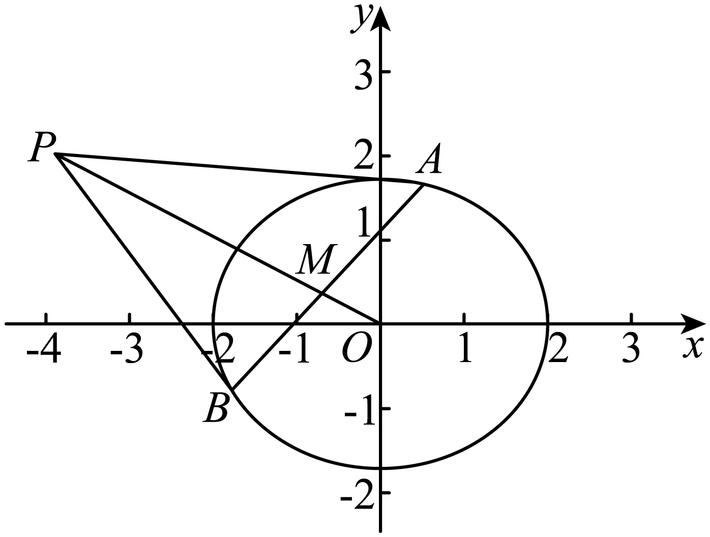

【答案】     （或）；     .

【解析】（1）由题得*AB*：，即，

（2），，∴的方向向量，

所以

，

即.

故答案为：；

