**第84讲  成对数据的统计分析**

**知识梳理**

**知识点一、变量间的相关关系**

1**、变量之间的相关关系**

当自变量取值一定时，因变量的取值带有一定的随机性，则这两个变量之间的关系叫相关关系．由于相关关系的不确定性，在寻找变量之间相关关系的过程中，统计发挥着非常重要的作用．我们可以通过收集大量的数据，在对数据进行统计分析的基础上，发现其中的规律，对它们的关系作出判断．

**注意：** 相关关系与函数关系是不同的，相关关系是一种非确定的关系，函数关系是一种确定的关系，而且函数关系是一种因果关系，但相关关系不一定是因果关系，也可能是伴随关系．

2**、散点图**

将样本中的个数据点描在平面直角坐标系中，所得图形叫做散点图．根据散点图中点的分布可以直观地判断两个变量之间的关系．

（1）如果散点图中的点散布在从左下角到右上角的区域内，对于两个变量的这种相关关系，我们将它称为正相关，如图（1）所示；

（2）如果散点图中的点散布在从左上角到右下角的区域内，对于两个变量的这种相关关系，我们将它称为负相关，如图（2）所示．

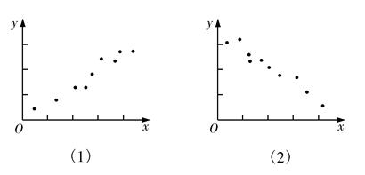

3**、相关系数**

若相应于变量的取值，变量的观测值为，则变量与的相关系数，通常用来衡量与之间的线性关系的强弱，的范围为．

（1）当时，表示两个变量正相关；当时，表示两个变量负相关．

（2）越接近，表示两个变量的线性相关性越强；越接近，表示两个变量间几乎不存在线性相关关系．当时，所有数据点都在一条直线上．

（3）通常当时，认为两个变量具有很强的线性相关关系．

**知识点二、线性回归**

1**、线性回归**

线性回归是研究不具备确定的函数关系的两个变量之间的关系（相关关系）的方法．

对于一组具有线性相关关系的数据（<em>x</em>1，<em>y</em>1），（<em>x</em>2，<em>y</em>2），…，（<em>xn</em>，<em>yn</em>），其回归方程的求法为

其中，，，（，）称为样本点的中心．

2**、残差分析**

对于预报变量，通过观测得到的数据称为观测值，通过回归方程得到的称为预测值，观测值减去预测值等于残差，称为相应于点的残差，即有．残差是随机误差的估计结果，通过对残差的分析可以判断模型刻画数据的效果以及判断原始数据中是否存在可疑数据等，这方面工作称为残差分析．

（1）残差图

通过残差分析，残差点比较均匀地落在水平的带状区域中，说明选用的模型比较合适，其中这样的带状区域的宽度越窄，说明模型拟合精确度越高；反之，不合适．

（2）通过残差平方和分析，如果残差平方和越小，则说明选用的模型的拟合效果越好；反之，不合适．

（3）相关指数

用相关指数来刻画回归的效果，其计算公式是：．

越接近于，说明残差的平方和越小，也表示回归的效果越好．

**知识点三、非线性回归**

解答非线性拟合问题，要先根据散点图选择合适的函数类型，设出回归方程，通过换元将陌生的非线性回归方程化归转化为我们熟悉的线性回归方程．

求出样本数据换元后的值，然后根据线性回归方程的计算方法计算变换后的线性回归方程系数，还原后即可求出非线性回归方程，再利用回归方程进行预报预测，注意计算要细心，避免计算错误．

1、建立非线性回归模型的基本步骤：

（1）确定研究对象，明确哪个是解释变量，哪个是预报变量；

（2）画出确定好的解释变量和预报变量的散点图，观察它们之间的关系（是否存在非线性关系）；

（3）由经验确定非线性回归方程的类型（如我们观察到数据呈非线性关系，一般选用反比例函数、二次函数、指数函数、对数函数、幂函数模型等）；

（4）通过换元，将非线性回归方程模型转化为线性回归方程模型；

（5）按照公式计算线性回归方程中的参数（如最小二乘法），得到线性回归方程；

（6）消去新元，得到非线性回归方程；

（7）得出结果后分析残差图是否有异常．若存在异常，则检查数据是否有误，或模型是否合适等．

**知识点四、独立性检验**

1**、分类变量和列联表**

（1）分类变量：

变量的不同“值”表示个体所属的不同类别，像这样的变量称为分类变量．

（2）列联表：

①定义：列出的两个分类变量的频数表称为列联表．

②2×2列联表．

一般地，假设有两个分类变量*X*和*Y*，它们的取值分别为{，}和{，}，其样本频数列联表（称为2×2列联表）为

<table><tr><td></td><td>

</td><td>

</td><td>
总计
</td></tr><tr><td>

</td><td>

</td><td>

</td><td>

</td></tr><tr><td>

</td><td>

</td><td>

</td><td>

</td></tr><tr><td>
总计
</td><td>

</td><td>

</td><td>

</td></tr></table>

从列表中，依据与的值可直观得出结论：两个变量是否有关系．

2**、等高条形图**

（1）等高条形图和表格相比，更能直观地反映出两个分类变量间是否相互影响，常用等高条形图表示列联表数据的频率特征．

（2）观察等高条形图发现与相差很大，就判断两个分类变量之间有关系．

3**、独立性检验**

计算随机变量利用的取值推断分类变量<em>X</em>和<em>Y</em>是否独立的方法称为<em>χ</em>2独立性检验．

<table><tr><td>
<em></em>
</td><td>
0．10
</td><td>
0．05
</td><td>
0．010
</td><td>
0．005
</td><td>
0．001
</td></tr><tr><td>
<em></em>
</td><td>
2．706
</td><td>
3．841
</td><td>
6．635
</td><td>
7．879
</td><td>
10．828
</td></tr></table>

**【解题方法总结】**

常见的非线性回归模型

（1）指数函数型（且，）

两边取自然对数，，即，

令，原方程变为，然后按线性回归模型求出，．

（2）对数函数型

令，原方程变为，然后按线性回归模型求出，．

（3）幂函数型

两边取常用对数，，即，

令，原方程变为，然后按线性回归模型求出，．

（4）二次函数型

令，原方程变为，然后按线性回归模型求出，．

（5）反比例函数型型

令，原方程变为，然后按线性回归模型求出，．

**必考题型全归纳**

**题型一：变量间的相关关系**

**例1．**（2024·河北·高三校联考期末）下列四幅残差分析图中，与一元线性回归模型拟合精度最高的是（    ）

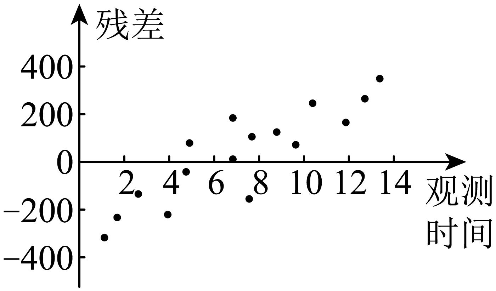

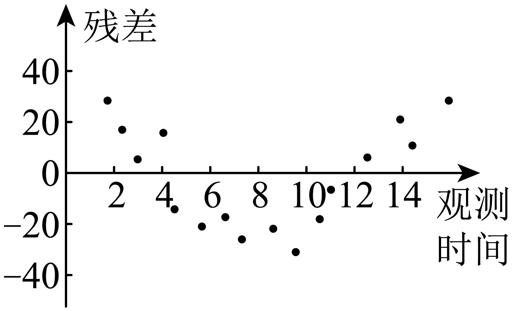

A．  	B．

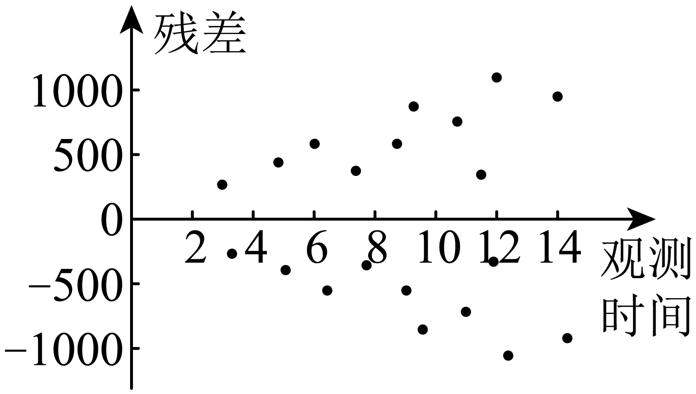

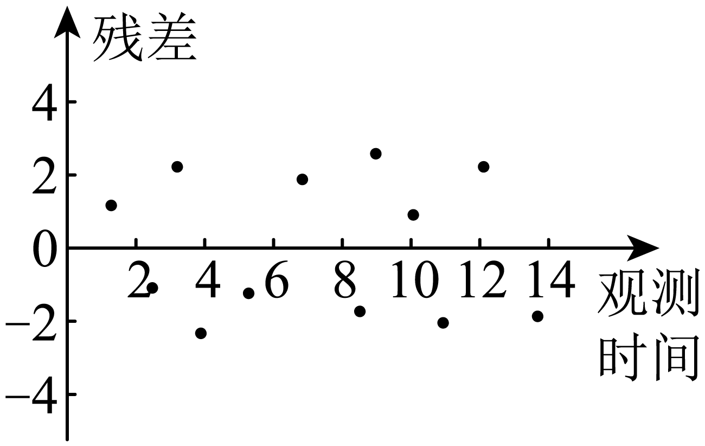

C．  	D．

**例2．**（2024·天津蓟州·高三校考开学考试）对两个变量，进行线性相关检验，得线性相关系数，对两个变量，进行线性相关检验，得线性相关系数，则下列判断正确的是（    ）

A．变量与正相关，变量与负相关，变量与的线性相关性较强

B．变量与负相关，变量与正相关，变量与的线性相关性较强

C．变量与正相关，变量与负相关，变量与的线性相关性较强

D．变量与负相关，变量与正相关，变量与的线性相关性较强

**例3．**（2024·宁夏吴忠·高三盐池高级中学校考阶段练习）在如图所示的散点图中，若去掉点，则下列说法正确的是（    ）

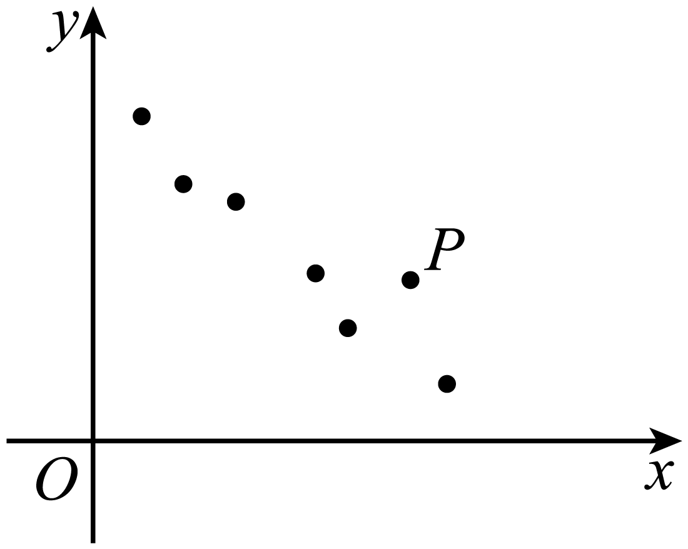

A．样本相关系数变大

B．变量与变量的相关程度变弱

C．变量与变量呈正相关

D．变量与变量的相关程度变强

**变式1．**（2024·四川成都·高三统考阶段练习）已知建筑地基沉降预测对于保证施工安全，实现信息化监控有着重要意义．某工程师建立了四个函数模型来模拟建筑地基沉降随时间的变化趋势，并用相关指数、误差平方和、均方根值三个指标来衡量拟合效果．相关指数越接近1表明模型的拟合效果越好，误差平方和越小表明误差越小，均方根值越小越好．依此判断下面指标对应的模型拟合效果最好的是（    ）

A．

<table><tr><td>
相关指数
</td><td>
误差平方和
</td><td>
均方根值
</td></tr><tr><td>
0.949 
</td><td>
8.491
</td><td>
0.499
</td></tr></table>

B．

<table><tr><td>
相关指数
</td><td>
误差平方和
</td><td>
均方根值
</td></tr><tr><td>
0.933
</td><td>
4.179
</td><td>
0.436
</td></tr></table>

C．

<table><tr><td>
相关指数
</td><td>
误差平方和
</td><td>
均方根值
</td></tr><tr><td>
0.997
</td><td>
1.701
</td><td>
0.141
</td></tr></table>

D．

<table><tr><td>
相关指数
</td><td>
误差平方和
</td><td>
均方根值
</td></tr><tr><td>
0.997
</td><td>
2.899
</td><td>
0.326
</td></tr></table>

<strong>变式2．</strong>（2024·高三课时练习）甲、乙、丙、丁四位同学各自对，<em>A</em>，<em>B</em>两变量的线性相关性做试验，并用回归分析方法分别求得相关系数<em>r</em>与残差平方和<em>m</em>如下表:

<table><tr><td></td><td>
甲
</td><td>
乙
</td><td>
丙
</td><td>
丁
</td></tr><tr><td>
<em>r</em>
</td><td>
0.82
</td><td>
0.78
</td><td>
0.69
</td><td>
0.85
</td></tr><tr><td>
<em>m</em>
</td><td>
106
</td><td>
115
</td><td>
124
</td><td>
103
</td></tr></table>

则能体现*A*，*B*两变量有更强的线性相关性的是（    ）

A．甲	B．乙	C．丙	D．丁

**变式3．**（2024·河北石家庄·统考三模）观察下列四幅残差图，满足一元线性回归模型中对随机误差的假定的是（    ）

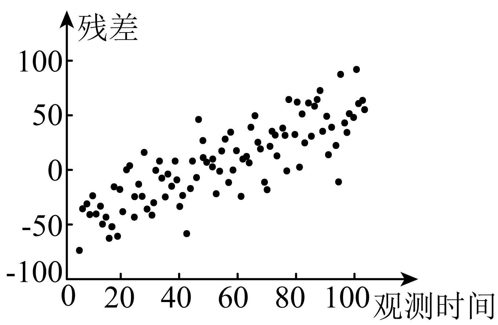

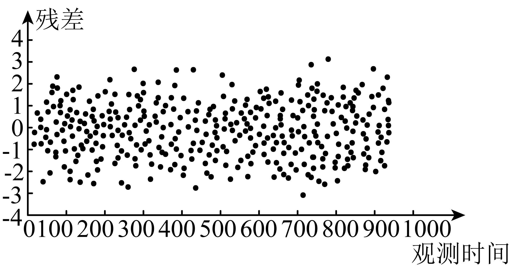

A．	B．

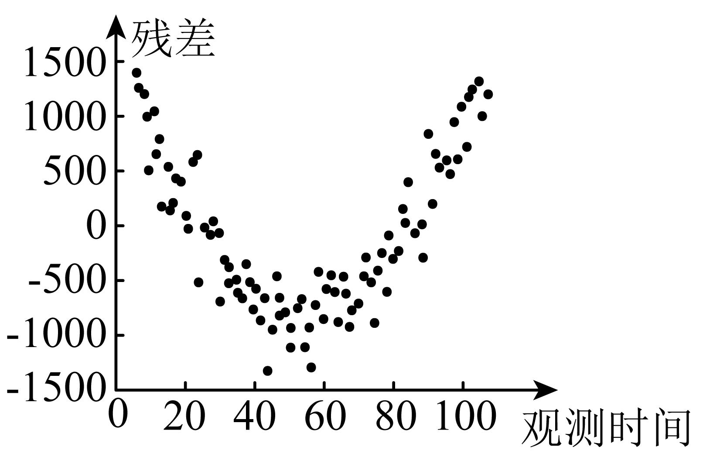

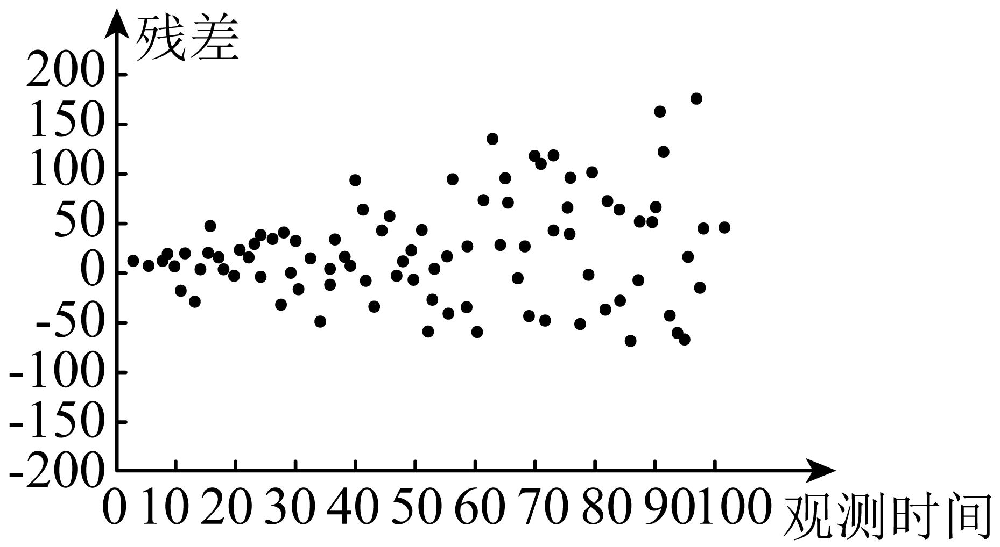

C．	D．

**变式4．**（2024·全国·高三专题练习）甲、乙、丙、丁四位同学分别对一组变量进行线性相关试验，并分别计算出相关系数，则线性相关程度最高的是（    ）

<table><tr><td></td><td>
甲
</td><td>
乙
</td><td>
丙
</td><td>
丁
</td></tr><tr><td>

</td><td>
0.87
</td><td>
0.91
</td><td>
0.58
</td><td>
0.83
</td></tr></table>

A．甲	B．乙	C．丙	D．丁

**变式5．**（2024·全国·高三专题练习）给出下列有关线性回归分析的四个命题：

①线性回归直线未必过样本数据点的中心；

②回归直线就是散点图中经过样本数据点最多的那条直线；

③当相关系数时，两个变量正相关；

④如果两个变量的相关性越强，则相关系数就越接近于.

其中真命题的个数为（    ）

A．	B．	C．	D．

**【解题方法总结】**

判定两个变量相关性的方法

（1）画散点图：点的分布从左下角到右上角，两个变量正相关；点的分布从左上角到右下角，两个变量负相关．

（2）样本相关系数：当*r*>0时，正相关；当*r*<0时，负相关；|*r*|越接近于1，相关性越强．

（3）经验回归方程：当时，正相关；当时，负相关．

**题型二：一元线性回归模型**

**例4．**（2024·天津蓟州·高三校考开学考试）为研究某种细菌在特定环境下，随时间变化的繁殖情况，得到如下实验数据：

<table><tr><td>
天数天
</td><td>
    
</td><td>
    
</td><td>
    
</td><td>
    
</td></tr><tr><td>
繁殖个数千个
</td><td>
    
</td><td>
    
</td><td>
    
</td><td>
    
</td></tr></table>

由最小二乘法得与的线性回归方程为，则当时，繁殖个数的预测值为（    ）

A．	B．	C．	D．

**例5．**（2024·湖南长沙·高三长郡中学校联考阶段练习）某社区为了丰富退休人员的业余文化生活，自2018年以来，始终坚持开展“悦读小屋读书活动”.下表是对2018年以来近5年该社区退休人员的年人均借阅量的数据统计：

<table><tr><td>
年份
</td><td>
2018
</td><td>
2019
</td><td>
2020
</td><td>
2021
</td><td>
2022
</td></tr><tr><td>
年份代码
</td><td>
1
</td><td>
2
</td><td>
3
</td><td>
4
</td><td>
5
</td></tr><tr><td>
年人均借阅量（册）
</td><td>

</td><td>

</td><td>
16
</td><td>
22
</td><td>
28
</td></tr></table>

（参考数据：）通过分析散点图的特征后，年人均借阅量关于年份代码的回归分析模型为，则2024年的年人均借阅量约为（    ）

A．31	B．32	C．33	D．34

<strong>例6．</strong>（2024·辽宁·辽宁实验中学校考模拟预测）已知<em>x</em>，<em>y</em>的对应值如下表所示：

<table><tr><td>
<em>x</em>
</td><td>
0
</td><td>
2
</td><td>
4
</td><td>
6
</td><td>
8
</td></tr><tr><td>
<em>y</em>
</td><td>
1
</td><td>
 
</td><td>
 
</td><td>

</td><td>
11
</td></tr></table>

若*y*与*x*线性相关，且回归直线方程为，则（    ）

A．2	B．3	C．4	D．5

<strong>变式6．</strong>（2024·广西南宁·南宁二中校联考模拟预测）某单位在当地定点帮扶某村种植一种草莓，并把这种原本露天种植的草莓搬到了大棚里，获得了很好的经济效益．根据资料显示，产出的草莓的箱数<em>x</em>（单位：箱）与成本<em>y</em>（单位：千元）的关系如下：

<table><tr><td>
<em>x</em>
</td><td>
10
</td><td>
20
</td><td>
30
</td><td>
40
</td><td>
60
</td><td>
80
</td></tr><tr><td>
<em>y</em>
</td><td>

</td><td>

</td><td>

</td><td>

</td><td>

</td><td>

</td></tr></table>

(1)根据散点图可以认为*x*与*y*之间存在线性相关关系，请用最小二乘法求出线性回归方程（，用分数表示）

(2)某农户种植的草莓主要以300元/箱的价格给当地大型商超供货，多余的草莓全部以200元/箱的价格销售给当地小商贩．据统计，往年1月份当地大型商超草莓的需求量为50箱、100箱、150箱、200箱的概率分别为，，，，根据回归方程以及往年商超草莓的需求情况进行预测，求今年1月份农户草莓的种植量为200箱时所获得的利润情况．（最后结果精确到个位）

附：，，在线性回归直线方程中，．

**变式7．**（2024·江西·高三统考开学考试）某新能源汽车销售部对今年1月至7月的销售量进行统计与分析，因不慎丢失一些数据，现整理出如下统计表与一些分析数据：

<table><tr><td>
月份
</td><td>
1月
</td><td>
2月
</td><td>
3月
</td><td>
4月
</td><td>
5月
</td><td>
6月
</td><td>
7月
</td></tr><tr><td>
月份代号
</td><td>
1
</td><td>
2
</td><td>
3
</td><td>
4
</td><td>
5
</td><td>
6
</td><td>
7
</td></tr><tr><td>
销售量（单位：万辆）
</td><td>
15.6
</td><td>

</td><td>

</td><td>

</td><td>
37.7
</td><td>
39.6
</td><td>
44.5
</td></tr></table>

其中.

(1)若，，成递增的等差数列，求从7个月的销售量中任取1个，月销售量不高于27万辆的概率；

(2)若，与的样本相关系数，求关于的线性回归方程，并预测今年8月份的销售量（精确到0.1）.

附：相关系数，线性回归方程中斜率和截距的最小二乘估计公式分别为，.

参考数据：，.

<strong>变式8．</strong>（2024·四川成都·高三石室中学校考开学考试）已知某绿豆新品种发芽的适宜温度在之间，一农学实验室研究人员为研究温度<em>x</em>（）与绿豆新品种发芽数<em>y</em>（颗）之间的关系，每组选取了成熟种子50颗，分别在对应的的温度环境下进行实验，得到如下散点图：

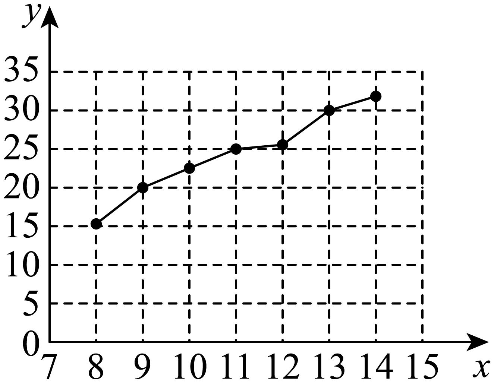

其中，，．

(1)运用相关系数进行分析说明，是否可以用线性回归模型拟合与的关系？

(2)求出关于的线性回归方程，并预测在的温度下，种子的发芽的颗数．

参考公式：相关系数，回归直线方程，其中，．参考数据：．

<strong>变式9．</strong>（2024·安徽亳州·蒙城第一中学校联考模拟预测）为调查某地区植被覆盖面积<em>x</em>（单位：公顷）和野生动物数量<em>y</em>的关系，某研究小组将该地区等面积花分为400个区块，从中随机抽取40个区块，得到样本数据（），部分数据如下：

<table><tr><td>
<em>x</em>
</td><td>
…
</td><td>
2.7
</td><td>
3.6
</td><td>
3.2
</td><td>
3.9
</td><td>
…
</td></tr><tr><td>
<em>y</em>
</td><td>
…
</td><td>
50.6
</td><td>
63.7
</td><td>
52.1
</td><td>
54.3
</td><td>
…
</td></tr></table>

经计算得：，，，.

(1)利用最小二乘估计建立*y*关于*x*的线性回归方程；

(2)该小组又利用这组数据建立了*x*关于*y*的线性回归方程，并把这两条拟合直线画在同一坐标系下，横坐标*x*，纵坐标*y*的意义与植被覆盖面积*x*和野生动物数量*y*一致.设前者与后者的斜率分别为，，比较，的大小关系，并证明.

附：*y*关于*x*的回归方程中，斜率和截距的最小二乘估计公式分别为： ，，

**【解题方法总结】**

求经验回归方程的步骤

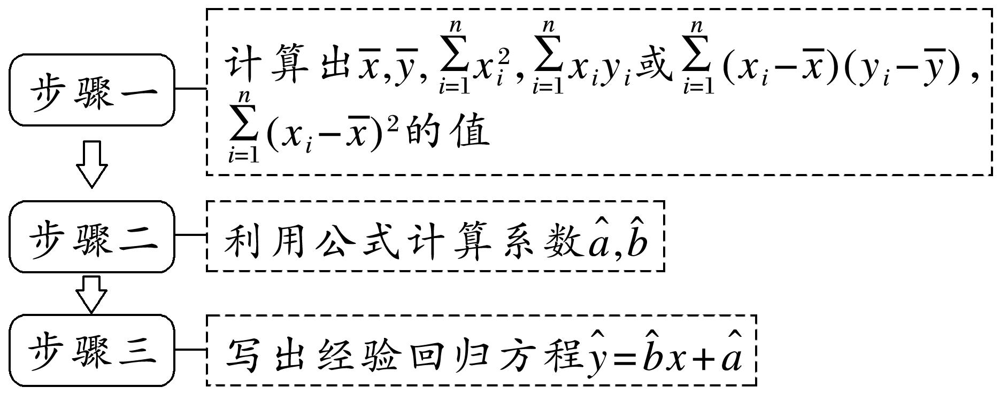

**题型三：非线性回归**

**例7．**（2024·湖南·校联考模拟预测）若需要刻画预报变量和解释变量的相关关系，且从已知数据中知道预报变量随着解释变量的增大而减小，并且随着解释变量的增大，预报变量大致趋于一个确定的值，为拟合和之间的关系，应使用以下回归方程中的（，为自然对数的底数）（    ）

A．	B．	C．	D．

<strong>例8．</strong>（2024·全国·高三专题练习）云计算是信息技术发展的集中体现，近年来，我国云计算市场规模持续增长.已知某科技公司2018年至2022年云计算市场规模数据，且市场规模<em>y</em>与年份代码<em>x</em>的关系可以用模型（其中e为自然对数的底数）拟合，设，得到数据统计表如下：

<table><tr><td>
年份
</td><td>
2018年
</td><td>
2019年
</td><td>
2020年
</td><td>
2021年
</td><td>
2022年
</td></tr><tr><td>
年份代码<em>x</em>
</td><td>
1
</td><td>
2
</td><td>
3
</td><td>
4
</td><td>
5
</td></tr><tr><td>
云计算市场规模<em>y</em>/千万元
</td><td>
7.4
</td><td>
11
</td><td>
20
</td><td>
36.6
</td><td>
66.7
</td></tr><tr><td>

</td><td>
2
</td><td>
2.4
</td><td>
3
</td><td>
3.6
</td><td>
4
</td></tr></table>

由上表可得经验回归方程，则2025年该科技公司云计算市场规模*y*的估计值为（    ）

A．	B．	C．	D．

**例9．（多选题）**（2024·福建厦门·厦门一中校考三模）在对具有相关关系的两个变量进行回归分析时，若两个变量不呈线性相关关系，可以建立含两个待定参数的非线性模型，并引入中间变量将其转化为线性关系，再利用最小二乘法进行线性回归分析.下列选项为四个同学根据自己所得数据的散点图建立的非线性模型，且散点图的样本点均位于第一象限，则其中可以根据上述方法进行回归分析的模型有（    ）

A．	B．

C．	D．

**变式10．**（2024·全国·高三专题练习）已知变量的关系可以用模型拟合，设，其变换后得到一组数据如下．由上表可得线性回归方程，则（    ）

<table><tr><td>
<em>x</em>
</td><td>
1
</td><td>
2
</td><td>
3
</td><td>
4
</td><td>
5
</td></tr><tr><td>
<em>z</em>
</td><td>
2
</td><td>
4
</td><td>
5
</td><td>
10
</td><td>
14
</td></tr></table>

A．	B．	C．	D．

**变式11．**（2024·全国·高三专题练习）某校课外学习小组研究某作物种子的发芽率和温度（单位：）的关系，由实验数据得到如图所示的散点图.由此散点图判断，最适宜作为发芽率和温度的回归方程类型的是（    ）

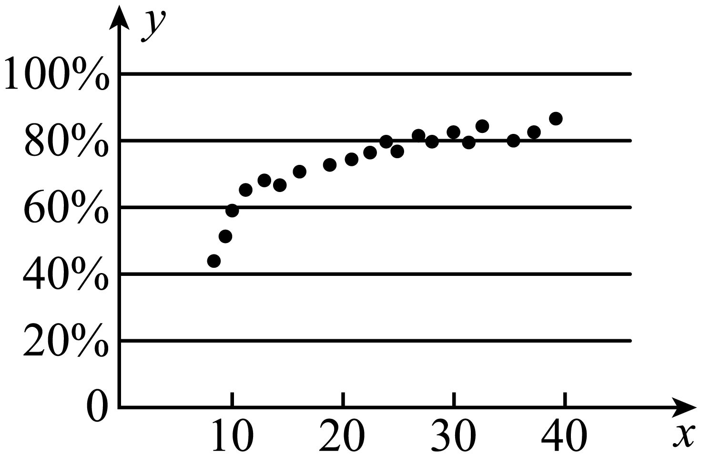

A．	B．

C．	D．

<strong>变式12．</strong>（2024·全国·高二专题练习）兰溪杨梅从5月15日起开始陆续上市，据调查统计，得到杨梅销售价格（单位：<em>Q</em>元/千克）与上市时间<em>t</em>（单位：天）的数据如下表所示：

<table><tr><td>
时间<em>t</em>/（单位：天）
</td><td>
10
</td><td>
20
</td><td>
70
</td></tr><tr><td>
销售价格<em>Q</em>（单位：元/千克）
</td><td>
100
</td><td>
50
</td><td>
100
</td></tr></table>

根据上表数据，从下列函数模型中选取一个描述杨梅销售价格*Q*与上市时间*t*的变化关系：.利用你选取的函数模型，在以下四个日期中，杨梅销售价格最低的日期为（    ）

A．6月5日	B．6月15日	C．6月25日	D．7月5日

<strong>变式13．</strong>（2024·四川泸州·高三四川省泸县第四中学校考开学考试）抗体药物的研发是生物技术制药领域的一个重要组成部分，抗体药物的摄入量与体内抗体数量的关系成为研究抗体药物的一个重要方面.某研究团队收集了10组抗体药物的摄入量与体内抗体数量的数据，并对这些数据作了初步处理，得到了如图所示的散点图及一些统计量的值，抗体药物摄入量为<em>x</em>（单位：），体内抗体数量为<em>y</em>（单位：）.

<table><tr><td>

</td><td>

</td><td>

</td><td>

</td></tr><tr><td>
29.2
</td><td>
12
</td><td>
16
</td><td>
34.4
</td></tr></table>

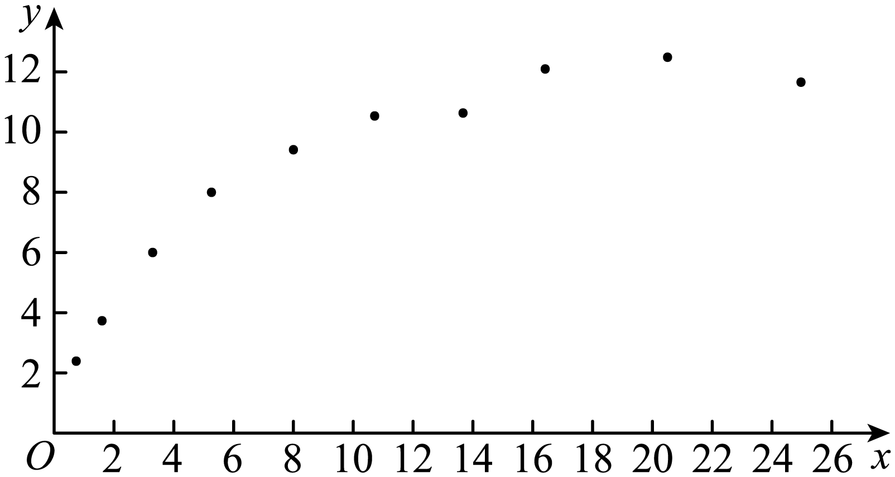

(1)根据经验，我们选择作为体内抗体数量*y*关于抗体药物摄入量*x*的回归方程，将两边取对数，得，可以看出与具有线性相关关系，试根据参考数据建立关于的回归方程，并预测抗体药物摄入量为时，体内抗体数量的值；

(2)经技术改造后，该抗体药物的有效率*z*大幅提高，经试验统计得*z*服从正态分布，那这种抗体药物的有效率超过0.54的概率约为多少？

附：①对于一组数据，其回归直线的斜率和截距的最小二乘估计分别为，；

②若随机变量，则有，，；

③取.

**变式14．**（2024·江西赣州·高三校考阶段练习）为了研究某种细菌随天数变化的繁殖个数，收集数据如下：

<table><tr><td>
天数
</td><td>
1
</td><td>
2
</td><td>
3
</td><td>
4
</td><td>
5
</td><td>
6
</td></tr><tr><td>
繁殖个数
</td><td>
6
</td><td>
12
</td><td>
25
</td><td>
49
</td><td>
95
</td><td>
190
</td></tr></table>

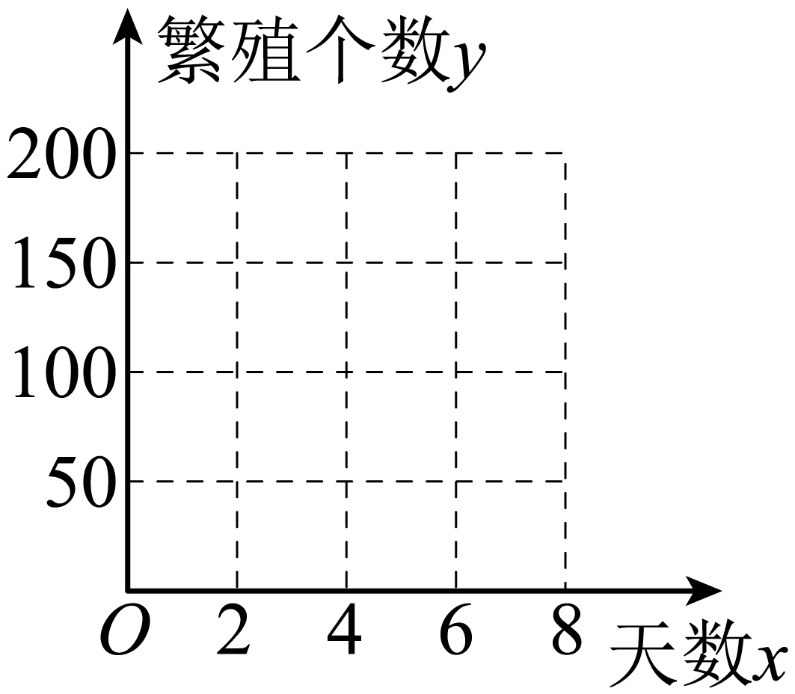

(1)在图中作出繁殖个数关于天数变化的散点图，并由散点图判断（为常数）与（为常数，且）哪一个适宜作为繁殖个数关于天数变化的回归方程类型？（给出判断即可，不必说明理由）

(2)对于非线性回归方程（为常数，且），令，可以得到繁殖个数的对数*z*关于天数*x*具有线性关系及一些统计量的值．

<table><tr><td>

</td><td>

</td><td>

</td><td>

</td><td>

</td><td>

</td></tr><tr><td>
3.50
</td><td>
62.83
</td><td>
3.53
</td><td>
17.50
</td><td>
596.57
</td><td>
12.09
</td></tr></table>

（ⅰ）证明：“对于非线性回归方程，令，可以得到繁殖个数的对数关于天数具有线性关系（即为常数）”；

（ⅱ）根据（ⅰ）的判断结果及表中数据，建立关于的回归方程（系数保留2位小数）．

附：对于一组数据，其回归直线方程的斜率和截距的最小二乘估计分别为．

**变式15．**（2024·重庆沙坪坝·高三重庆八中校考阶段练习）在正常生产条件下，根据经验，可以认为化肥的有效利用率近似服从正态分布，而化肥施肥量因农作物的种类不同每亩也存在差异.

(1)假设生产条件正常，记表示化肥的有效利用率，求；

(2)课题组为研究每亩化肥施用量与某农作物亩产量之间的关系，收集了10组数据，并对这些数据作了初步处理，得到了如图所示的散点图及一些统计量的值.其中每亩化肥施用量为（单位：公斤），粮食亩产量为（单位：百公斤）

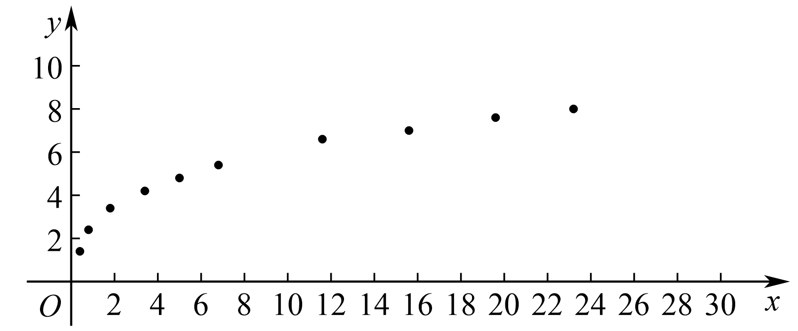

参考数据：

<table><tr><td>

</td><td>

</td><td>

</td><td>

</td><td>

</td><td>

</td><td>

</td><td>

</td></tr><tr><td>
650
</td><td>
91.5
</td><td>
52.5
</td><td>
1478.6
</td><td>
30.5
</td><td>
15
</td><td>
15
</td><td>
46.5
</td></tr></table>

，，2，，.

（i）根据散点图判断，与，哪一个适宜作为该农作物亩产量关于每亩化肥施用量的回归方程（给出判断即可，不必说明理由）；

（ii）根据（i）的判断结果及表中数据，建立关于的回归方程；并预测每亩化肥施用量为27公斤时，粮食亩产量的值.

附：①对于一组数据，2，3，，，其回归直线的斜率和截距的最小二乘估计分别为，；

②若随机变量，则，.

<strong>变式16．</strong>（2024·重庆·高三校联考开学考试）某公司为了解年研发资金投入量<em>x</em>（单位:亿元）对年销售额<em>y</em>（单位:亿元）的影响<em>.</em>对公司近12年的年研发资金投入量<em>xi</em>和年销售额<em>yi</em>的数据，进行了对比分析，建立了两个模型:①，②，其中<em>α</em>，<em>β</em>，<em>λ</em>，<em>t</em>均为常数，e为自然对数的底数，并得到一些统计量的值<em>.</em>令，经计算得如下数据:

<table><tr><td>

</td><td colspan="2">

</td><td>

</td><td>

</td><td colspan="2">

</td><td>

</td></tr><tr><td>
20
</td><td colspan="2">
66
</td><td>
77
</td><td>
2
</td><td colspan="2">
460
</td><td>
4<em>.</em>20
</td></tr><tr><td colspan="2">

</td><td colspan="2">

</td><td colspan="2">

</td><td colspan="2">

</td></tr><tr><td colspan="2">
31250
</td><td colspan="2">
215
</td><td colspan="2">
3<em>.</em>08
</td><td colspan="2">
14
</td></tr></table>

(1)请从相关系数的角度，分析哪一个模型拟合程度更好?

(2)（ⅰ）根据分析及表中数据，建立*y*关于*x*的回归方程;

（ⅱ）若下一年销售额*y*需达到90亿元，预测下一年的研发资金投入量*x*是多少亿元?

附:①相关系数，回归直中公式分别为;

②参考数据：*.*

**变式17．**（2024·江苏镇江·江苏省镇江中学校考三模）经观测，长江中某鱼类的产卵数与温度有关，现将收集到的温度和产卵数的10组观测数据作了初步处理，得到如图的散点图及一些统计量表.

<table><tr><td>

</td><td>

</td><td>

</td><td>

</td><td>

</td></tr><tr><td>
360
</td><td>

</td><td>

</td><td>

</td><td>

</td></tr><tr><td>

</td><td>

</td><td>

</td><td>

</td><td></td></tr><tr><td>

</td><td>

</td><td>

</td><td>

</td><td></td></tr></table>

表中

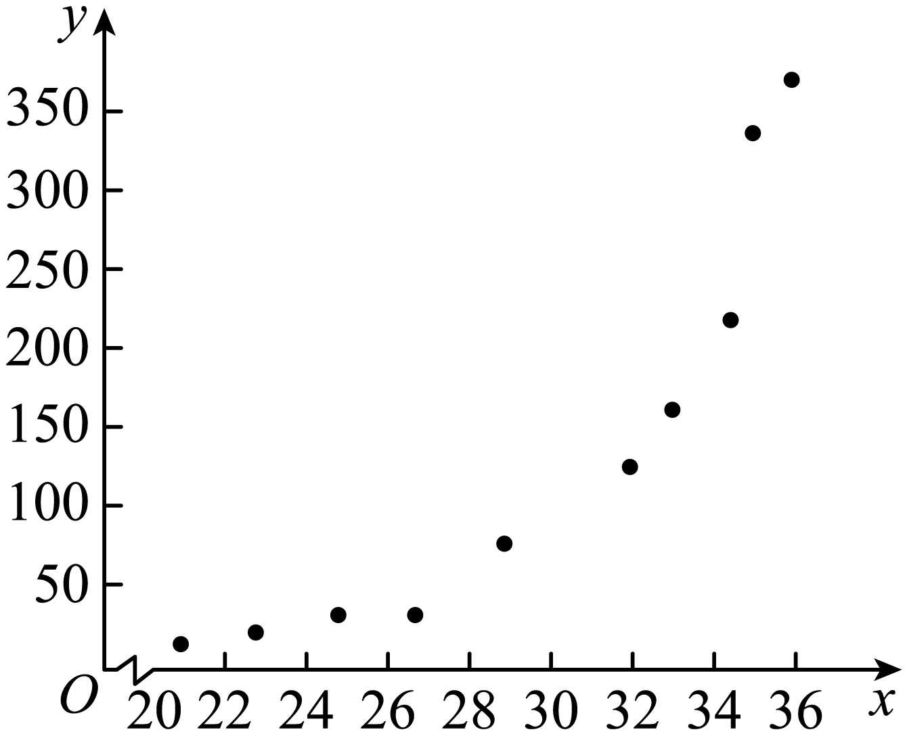

(1)根据散点图判断，与哪一个适宜作为与之间的回归方程模型并求出关于回归方程；（给出判断即可，不必说明理由）

(2)某兴趣小组抽取两批鱼卵，已知第一批中共有6个鱼卵，其中“死卵”有2个；第二批中共有8个鱼卵，其中“死卵”有3个．现随机挑选一批，然后从该批次中随机取出2个鱼卵，求取出“死卵”个数的分布列及数学期望.

附：对于一组数据，其回归直线的斜率和截距的最小二乘估计分别为.

**变式18．**（2024·广西南宁·南宁三中校考一模）数据显示中国车载音乐已步入快速发展期，随着车载音乐的商业化模式进一步完善，市场将持续扩大，下表为2018－2022年中国车载音乐市场规模（单位：十亿元），其中年份2018—2022对应的代码分别为1-5．

<table><tr><td>
年份代码
</td><td>
1
</td><td>
2
</td><td>
3
</td><td>
4
</td><td>
5
</td></tr><tr><td>
车载音乐市场规模
</td><td>
2.8
</td><td>
3.9
</td><td>
7.3
</td><td>
12.0
</td><td>
17.0
</td></tr></table>

(1)由上表数据知，可用指数函数模型拟合与的关系，请建立关于的回归方程；

(2)根据上述数据求得关于的回归方程后，预测2024年的中国车载音乐市场规模．

参考数据：

<table><tr><td>

</td><td>

</td><td>

</td><td>

</td><td>

</td></tr><tr><td>
1.94
</td><td>
33.82
</td><td>
1.7
</td><td>
1.6
</td><td>
26.84
</td></tr></table>

其中，．

参考公式：对于一组数据，，，其回归直线的斜率和截距的最小二乘法估计公式分别为，．

<strong>变式19．</strong>（2024·安徽合肥·合肥市第八中学校考模拟预测）当前移动网络已融入社会生活的方方面面，深刻改变了人们的沟通､交流乃至整个生活方式.4<em>G</em>网络虽然解决了人与人随时随地通信的问题，但随着移动互联网快速发展，其已难以满足未来移动数据流量暴涨的需求，而5<em>G</em>作为一种新型移动通信网络，不但可以解决人与人的通信问题，而且还可以为用户提供增强现实､虚拟现实､超高清（3<em>D</em>）视频等更加身临其境的极致业务体验，更重要的是还可以解决人与物､物与物的通信问题，从而满足移动医疗､车联网､智能家居､工业控制､环境监测等物联网应用需求，为更好的满足消费者对5<em>G</em>网络的需求，中国电信在某地区推出了六款不同价位的流量套餐，每款套餐的月资费<em>x</em>（单位：元）与购买人数<em>y</em>（单位：万人）的数据如下表：

<table><tr><td>
套餐
</td><td>
<em>A</em>
</td><td>
<em>B</em>
</td><td>
<em>C</em>
</td><td>
<em>D</em>
</td><td>
<em>E</em>
</td><td>
<em>F</em>
</td></tr><tr><td>
月资费<em>x</em>（元）
</td><td>
38
</td><td>
48
</td><td>
58
</td><td>
68
</td><td>
78
</td><td>
88
</td></tr><tr><td>
购买人数<em>y</em>（万人）
</td><td>
16.8
</td><td>
18.8
</td><td>
20.7
</td><td>
22.4
</td><td>
24.0
</td><td>
25.5
</td></tr></table>

对数据作初步的处理，相关统计量的值如下表：

<table><tr><td>

</td><td>

</td><td>

</td><td>

</td></tr><tr><td>
75.3
</td><td>
24.6
</td><td>
18.3
</td><td>
101.4
</td></tr></table>

其中，且绘图发现，散点集中在一条直线附近.

(1)根据所给数据，求出关于的回归方程；

(2)已知流量套餐受关注度通过指标来测定，当时相应的流量套餐受大众的欢迎程度更高，被指定为“主打套餐”.现有一家四口从这六款套餐中，购买不同的四款各自使用.记四人中使用“主打套督”的人数为，求随机变量的分布列和期望.

附：对于一组数据，其回归方程的斜率和截距的最小二乘估计值分别为.

**【解题方法总结】**

换元法变成一元线性回归模型

**题型四：列联表与独立性检验**

**例10．**（2024·广东佛山·华南师大附中南海实验高中校考模拟预测）四川省将从2022年秋季入学的高一年级学生开始实行高考综合改革，高考采用“3+1+2”模式，其中“1”为首选科目，即物理与历史二选一.某校为了解学生的首选意愿，对部分高一学生进行了抽样调查，制作出如下两个等高条形图，根据条形图信息，下列结论正确的是（    ）

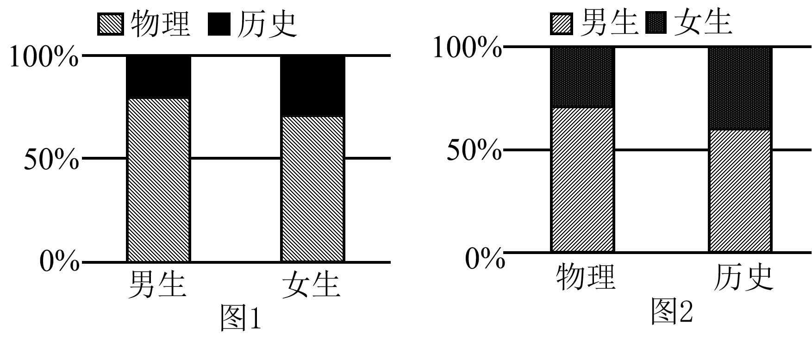

A．样本中选择物理意愿的男生人数少于选择历史意愿的女生人数

B．样本中女生选择历史意愿的人数多于男生选择历史意愿的人数

C．样本中选择物理学科的人数较多

D．样本中男生人数少于女生人数

**例11．**（2024·全国·高三专题练习）在新高考改革中，浙江省新高考实行的是7选3的模式，即语数外三门为必考科目，然后从物理、化学、生物、政治、历史、地理、技术（含信息技术和通用技术）7门课中选考3门.某校高二学生选课情况如下列联表一和列联表二（单位:人）

<table><tr><td></td><td>
选物理
</td><td>
不选物理
</td><td>
总计
</td></tr><tr><td>
男生
</td><td>
340
</td><td>
110
</td><td>
450
</td></tr><tr><td>
女生
</td><td>
140
</td><td>
210
</td><td>
350
</td></tr><tr><td>
总计
</td><td>
480
</td><td>
320
</td><td>
800
</td></tr><tr><td colspan="4">
表一
</td></tr><tr><td></td><td>
选生物
</td><td>
不选生物
</td><td>
总计
</td></tr><tr><td>
男生
</td><td>
150
</td><td>
300
</td><td>
450
</td></tr><tr><td>
女生
</td><td>
150
</td><td>
200
</td><td>
350
</td></tr><tr><td>
总计
</td><td>
300
</td><td>
500
</td><td>
800
</td></tr><tr><td colspan="4">
表二
</td></tr></table>

试根据小概率值的独立性检验，分析物理和生物选课与性别是否有关（    ）

附:

A．选物理与性别有关，选生物与性别有关

B．选物理与性别无关，选生物与性别有关

C．选物理与性别有关，选生物与性别无关

D．选物理与性别无关，选生物与性别无关

**例12．**（2024·全国·高三专题练习）通过随机询问相同数量的不同性别大学生在购买食物时是否看营养说明，得知有的男大学生“不看”，有的女大学生“不看”，若有99%的把握认为性别与是否看营养说明之间有关，则调查的总人数可能为（    ）

A．150	B．170	C．240	D．175

**变式20．**（2024·全国·高三专题练习）针对时下的“短视频热”，某高校团委对学生性别和喜欢短视频是否有关联进行了一次调查，其中被调查的男生､女生人数均为人，男生中喜欢短视频的人数占男生人数的，女生中喜欢短视频的人数占女生人数的.零假设为：喜欢短视频和性别相互独立.若依据的独立性检验认为喜欢短视频和性别不独立，则的最小值为（    ）

附：，附表：

<table><tr><td>

</td><td>
0.05
</td><td>
0.01
</td></tr><tr><td>

</td><td>
3.841
</td><td>
6.635
</td></tr></table>

A．7	B．8	C．9	D．10

**变式21．**（2024·全国·高三专题练习）在一次联考后，某校对甲、乙两个文科班的数学考试成绩进行分析，规定：大于或等于120分为优秀，120分以下为非优秀，统计成绩后，得到如下2×2列联表：

<table><tr><td></td><td>
优秀
</td><td>
非优秀
</td><td>
合计
</td></tr><tr><td>
甲班人数
</td><td></td><td>
50
</td><td></td></tr><tr><td>
乙班人数
</td><td>
20
</td><td></td><td></td></tr><tr><td>
合计
</td><td>
30
</td><td></td><td>
110
</td></tr></table>

附：，其中.

根据独立性检验，可以认为数学考试成绩与班级有关系的把握为（    ）

A．	B．	C．	D．

**变式22．**（2024·全国·高三专题练习）2020年2月，全国掀起了“停课不停学”的热潮，各地教师通过网络直播､微课推送等多种方式来指导学生线上学习.为了调查学生对网络课程的热爱程度，研究人员随机调查了相同数量的男､女学生，发现有80%的男生喜欢网络课程，有40%的女生不喜欢网络课程，且有99%的把握但没有99.9%的把握认为是否喜欢网络课程与性别有关，则被调查的男､女学生总数量可能为（    ）

附：，其中.

<table><tr><td>

</td><td>
0.1
</td><td>
0.05
</td><td>
0.01
</td><td>
0.001
</td></tr><tr><td>

</td><td>
2.706
</td><td>
3.841
</td><td>
6.635
</td><td>
10.828
</td></tr></table>

A．130	B．190	C．240	D．250

<strong>变式23．</strong>（2024·全国·高三专题练习）观察下列各图，其中两个分类变量<em>x</em>，<em>y</em>之间关系最强的是（    ）

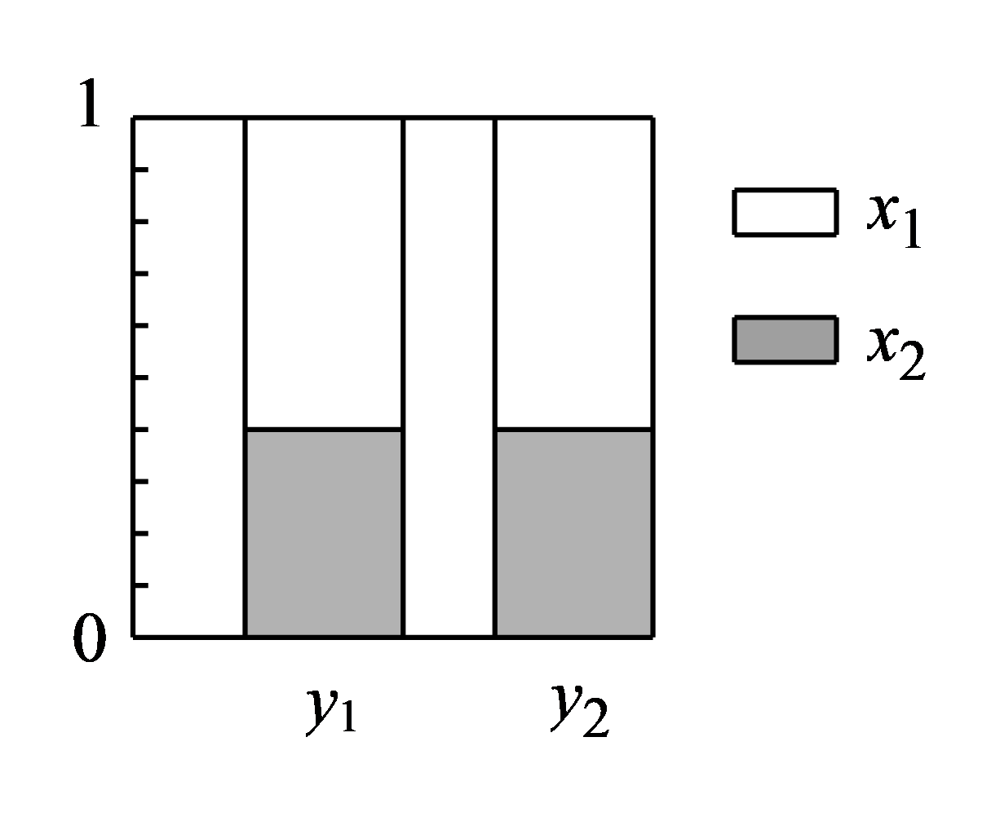

A．	B．

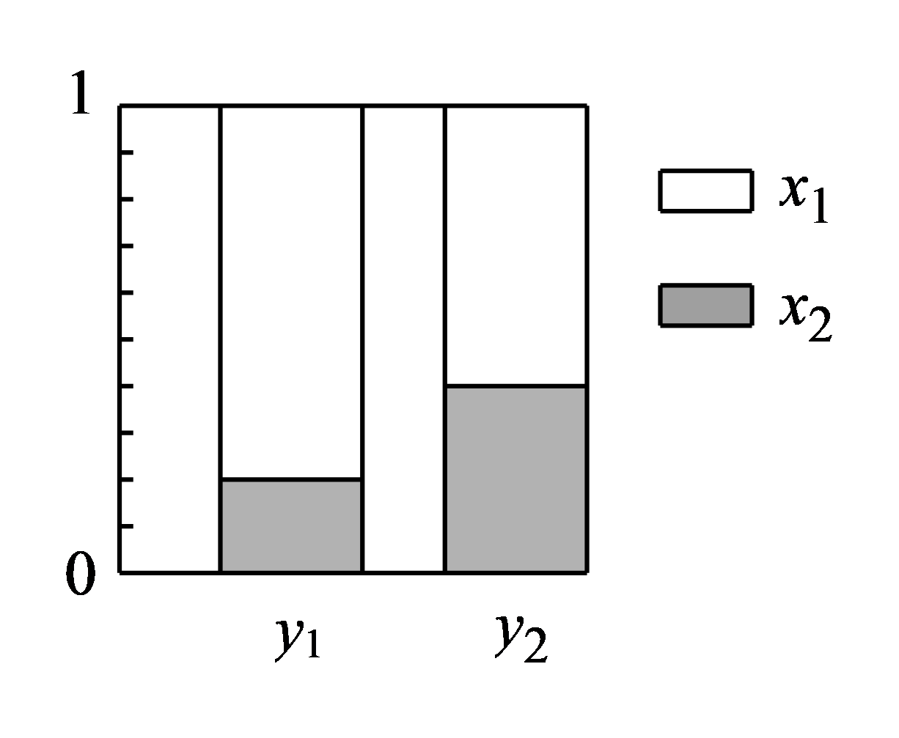

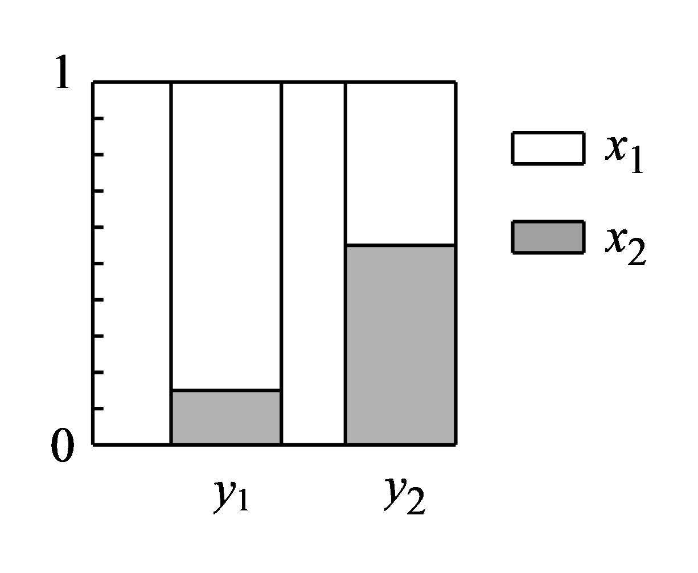

C．	D．

**变式24．**（2024·重庆沙坪坝·高三重庆八中校考开学考试）2022年卡塔尔世界杯决赛圈共有32支球队参加，欧洲球队有13支：其中有5支欧洲球队闯入8强.比赛进入淘汰赛阶段后，必须要分出胜负.淘汰赛规则如下：在比赛常规时间90分钟内分出胜负；比赛结束，若比分相同.则进入30分钟的加时赛.在加时赛分出胜负，比赛结束，若加时赛比分依然相同，就要通过点球大战来分出最后的胜负.点球大战分为2个阶段，第一阶段：共5轮，双方每轮各派1名球员，依次踢点球，以5轮的总进球数作为标准，5轮合计踢进点球数更多的球队获得比赛的胜利.如果第一阶段的5轮还是平局，则进入第二阶段：在该阶段双方每轮各派1名球员，依次踢点球，如果在一轮里，双方都进球或者双方都不进球，则继续下一轮，直到某一轮里，一方罚进点球，另一方没罚进，比赛结束，罚进点球的一方获得最终的胜利.

(1)根据题意填写下面的列联表，并根据小概率值的独立性检验，判断32支决赛圈球队“闯入8强”与“是欧洲球队”是否有关.

<table><tr><td></td><td>
欧洲球队
</td><td>
其他球队
</td><td>
合计
</td></tr><tr><td>
闯入强
</td><td></td><td></td><td></td></tr><tr><td>
未闯入强
</td><td></td><td></td><td></td></tr><tr><td>
合计
</td><td></td><td></td><td></td></tr></table>

(2)甲、乙两队在淘汰赛相遇，经过120分钟比赛未分出胜负，双方进入点球大战.已知甲队球员每轮踢进点球的概率为，乙队球员每轮踢进点球的概率为，每轮每队是否进球相互独立，在点球大战中，两队前3轮比分为，试求出甲队在第二阶段第一轮结束后获得最终胜利的概率.

参考公式：.

**变式25．**（2024·广东东莞·高三校联考阶段练习）在“双减”政策背景之下，某校就推进学校、家庭、社会体育教育的“一体化”，实现“教会、勤练、常赛”的核心任务．学校组织人员对在校学生“是否喜爱运动”做了一次随机调查．共随机调查了18名男生和12名女生，调查发现，男、女生中分别有12人和6人喜爱运动，其余不喜爱．

<table><tr><td></td><td>
喜欢运动
</td><td>
不喜欢运动
</td><td>
总计
</td></tr><tr><td>
男
</td><td></td><td></td><td></td></tr><tr><td>
女
</td><td></td><td></td><td></td></tr><tr><td>
总计
</td><td></td><td></td><td></td></tr></table>

(1)根据以上数据完成以下列联表：

<table><tr><td>

</td><td>
0.40
</td><td>
0.25
</td><td>
0.10
</td><td>
0.010
</td></tr><tr><td>

</td><td>
0.708
</td><td>
1.323
</td><td>
2.706
</td><td>
6.635
</td></tr></table>

根据小概率值的独立性检验，能否据此推断性别与喜爱运动有关？

(2)从被调查的女生中抽取3人，若其中喜爱运动的人数为，求的分布列及数学期望．

附参考公式及参考数据：

，其中．

**变式26．**（2024·辽宁·高三校联考开学考试）第31届世界大学生夏季运动会，是中国西部第一次举办世界性综合运动会，共设篮球、排球、田径、游泳等18个大项、269个小项.该届赛事约有来自170个国家和地区的1万余名运动员及官员赴蓉参加，该届赛事于2024年7月28日至8月8日在中国四川省成都市举行.为了了解关注该赛事是否与性别有关，某体育台随机抽取2000名观众进行统计，得到如下2×2列联表.

<table><tr><td></td><td>
男
</td><td>
女
</td><td>
合计
</td></tr><tr><td>
关注该赛事
</td><td>
600
</td><td>
300
</td><td>
900
</td></tr><tr><td>
不关注该赛事
</td><td>
400
</td><td>
700
</td><td>
1100
</td></tr><tr><td>
合计
</td><td>
1000
</td><td>
1000
</td><td>
2000
</td></tr></table>

(1)在所有女观众中，试估计她们关注该赛事的概率（结果用百分数表示）；

(2)根据小概率值的独立性检验，能否认为是否关注该赛事与性别有关联?

附：，其中.

<table><tr><td>

</td><td>
0.1
</td><td>
0.05
</td><td>
0.01
</td><td>
0.005
</td><td>
0.001
</td></tr><tr><td>

</td><td>
2.706
</td><td>
3.841
</td><td>
6.635
</td><td>
7.879
</td><td>
10.828
</td></tr></table>

**变式27．**（2024·安徽滁州·校考二模）为了研究学生每天整理数学错题情况，某课题组在某市中学生中随机抽取了100名学生调查了他们期中考试的数学成绩和平时整理数学错题情况，并绘制了下列两个统计图表，图1为学生期中考试数学成绩的频率分布直方图，图2为学生一个星期内整理数学错题天数的扇形图.若本次数学成绩在110分及以上视为优秀，将一个星期有4天及以上整理数学错题视为“经常整理”，少于4天视为“不经常整理”.已知数学成绩优秀的学生中，经常整理错题的学生占.

<table><tr><td></td><td>
数学成绩优秀
</td><td>
数学成绩不优秀
</td><td>
合计
</td></tr><tr><td>
经常整理
</td><td></td><td></td><td></td></tr><tr><td>
不经常整理
</td><td></td><td></td><td></td></tr><tr><td>
合计
</td><td></td><td></td><td></td></tr></table>

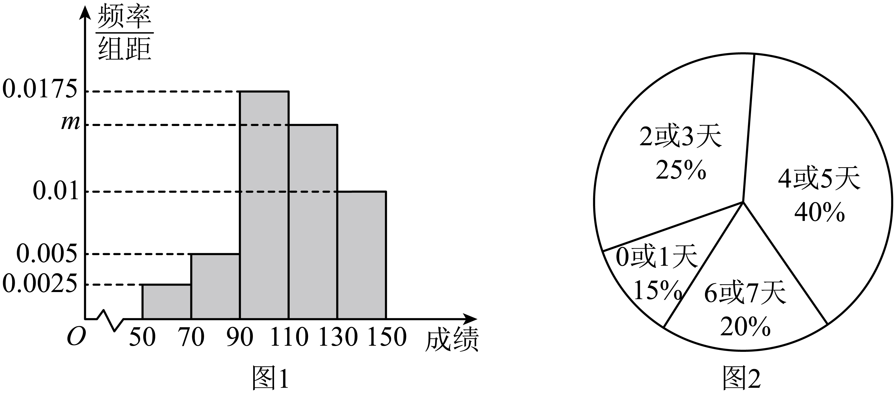

(1)求图1中的值以及学生期中考试数学成绩的上四分位数；

(2)根据图1、图2中的数据，补全上方列联表，并根据小概率值的独立性检验，分析数学成绩优秀与经常整理数学错题是否有关?

(3)用频率估计概率，在全市中学生中按“经常整理错题”与“不经常整理错题”进行分层抽样，随机抽取5名学生，再从这5名学生中随机抽取2人进行座谈.求这2名同学中经常整理错题且数学成绩优秀的人数*X*的分布列和数学期望.

附：

**变式28．**（2024·全国·高三专题练习）2022年11月20日，卡塔尔足球世界杯正式开幕，世界杯上的中国元素随处可见．从体育场建设到电力保障，从赛场内的裁判到赛场外的吉祥物都是中国制造，为卡塔尔世界杯提供了强有力的支持．国内也再次掀起足球热潮．某地足球协会组建球队参加业余比赛，该足球队教练组为了考查球员甲对球队的贡献，作出如下数据统计（甲参加过的比赛均分出了输赢）：

<table><tr><td></td><td>
球队输球
</td><td>
球队赢球
</td><td>
总计
</td></tr><tr><td>
甲参加
</td><td>
2
</td><td>
30
</td><td>
32
</td></tr><tr><td>
甲未参加
</td><td>
8
</td><td>
10
</td><td>
18
</td></tr><tr><td>
总计
</td><td>
10
</td><td>
40
</td><td>
50
</td></tr></table>

(1)根据小概率值的独立性检验，能否认为该球队赢球与甲球员参赛有关联；

(2)从该球队中任选一人，*A*表示事件“选中的球员参赛”，*B*表示事件“球队输球”．与的比值是选中的球员参赛对球队贡献程度的一项度量指标，记该指标为*R*．

①证明：；

②利用球员甲数据统计，给出，的估计值，并求出*R*的估计值．

附：．

参考数据：

<table><tr><td>
<em>a</em>
</td><td>
0.05
</td><td>
0.01
</td><td>
0.005
</td><td>
0.001
</td></tr><tr><td>

</td><td>
3.841
</td><td>
6.635
</td><td>
7.879
</td><td>
10.828
</td></tr></table>

**【解题方法总结】**

独立性检验的一般步骤

（1）根据样本数据制成2×2列联表．

（2）根据公式计算．

（3）比较与临界值的大小关系，作统计推断．

**题型五：误差分析**

**例13．**（2024·河北衡水·河北衡水中学校考一模）某新能源汽车生产公司，为了研究某生产环节中两个变量之间的相关关系，统计样本数据得到如下表格：

由表格中的数据可以得到与的经验回归方程为，据此计算，下列选项中残差的绝对值最小的样本数据是（    ）

A．	B．

C．	D．

**例14．**（2024·云南保山·高三统考期末）新冠肺炎疫情发生以来，中医药全面参与疫情防控救治，做出了重要贡献.某中医药企业根据市场调研与模拟，得到研发投入（亿元）与产品收益（亿元）的数据统计如下表：

<table><tr><td>
研发投入（亿元）
</td><td>
1
</td><td>
2
</td><td>
3
</td><td>
4
</td><td>
5
</td></tr><tr><td>
产品收益（亿元）
</td><td>
3
</td><td>
7
</td><td>
9
</td><td>
10
</td><td>
11
</td></tr></table>

用最小二乘法求得关于的经验回归直线方程是，相关系数（若，则线性相关程度一般，若，则线性相关程度较高），下列说法不正确的有（    ）

A．变量与正相关且相关性较强

B．

C．当时，的估计值为40.3

D．相应于点的残差为0.8

**例15．**（2024·山东青岛·高三山东省青岛第五十八中学校考开学考试）已知一组样本数据，，，，根据这组数据的散点图分析与之间的线性相关关系，若求得其线性回归方程为，则在样本点处的残差为（    ）

A．38.1	B．22.6	C．	D．91.1

**变式29．**（2024·陕西咸阳·统考模拟预测）年初，新型冠状病毒（）引起的肺炎疫情爆发以来，各地医疗机构采取了各种针对性的治疗方法，取得了不错的成效，某医疗机构开始使用中西医结合方法后，每周治愈的患者人数如下表所示：

<table><tr><td>
第周
</td><td>

</td><td>

</td><td>

</td><td>

</td><td>

</td></tr><tr><td>
治愈人数（单位：十人）
</td><td>

</td><td>

</td><td>

</td><td>

</td><td>

</td></tr></table>

由上表可得关于的线性回归方程为，若第6周实际治愈人数为18人，则此回归模型第6周的残差（实际值减去预报值）为（     ）

A．	B．	C．	D．

**变式30．**（2024·云南昆明·高三昆明一中校考阶段练习）小王经营了一家小型餐馆，自去年疫情管控宣布结束后的第1天开始，经营状况逐步有了好转，该店第一周的营业收入数据（单位：百元）统计如下：

<table><tr><td>
天数序号<em>x</em>
</td><td>
1
</td><td>
2
</td><td>
3
</td><td>
4
</td><td>
5
</td><td>
6
</td><td>
7
</td></tr><tr><td>
营业收入<em>y</em>
</td><td>
11
</td><td>
13
</td><td>
18
</td><td>
※
</td><td>
28
</td><td>
※
</td><td>
35
</td></tr></table>

其中第4天和第6天的数据由于某种原因造成模糊，但知道7天的营业收入平均值是23，已知营业收入*y*与天数序号*x*可以用经验回归直线方程拟合，且第7天的残差是，则的值是（    ）

A．10.4	B．6.2	C．4.2	D．2

**变式31．**（2024·全国·高三专题练习）已知建筑地基沉降预测对于保证施工安全，实现信息化监控有着重要意义．某工程师建立了四个函数模型来模拟建筑地基沉降随时间的变化趋势，并用相关指数、误差平方和、均方根值三个指标来衡量拟合效果．相关指数越接近1表明模型的拟合效果越好，误差平方和越小表明误差越小，均方根值越小越好．依此判断下面指标对应的模型拟合效果最好的是（    ）．

A．

<table><tr><td>
相关指数
</td><td>
误差平方和
</td><td>
均方根值
</td></tr><tr><td>
0.949
</td><td>
5.491
</td><td>
0.499
</td></tr></table>

B．

<table><tr><td>
相关指数
</td><td>
误差平方和
</td><td>
均方根值
</td></tr><tr><td>
0.933
</td><td>
4.179
</td><td>
0.436
</td></tr></table>

C．

<table><tr><td>
相关指数
</td><td>
误差平方和
</td><td>
均方根值
</td></tr><tr><td>
0.997
</td><td>
1.701
</td><td>
0.141
</td></tr></table>

D．

<table><tr><td>
相关指数
</td><td>
误差平方和
</td><td>
均方根值
</td></tr><tr><td>
0.997
</td><td>
2.899
</td><td>
0.326
</td></tr></table>

**变式32．（多选题）**（2024·湖北·荆门市龙泉中学校联考模拟预测）某学校一同学研究温差与本校当天新增感冒人数（人）的关系，该同学记录了5天的数据：

<table><tr><td>
<em>x</em>
</td><td>
5
</td><td>
6
</td><td>
8
</td><td>
9
</td><td>
12
</td></tr><tr><td>
<em>y</em>
</td><td>
17
</td><td>
20
</td><td>
25
</td><td>
28
</td><td>
35
</td></tr></table>

经过拟合，发现基本符合经验回归方程，则（    ）

A．样本中心点为	B．

C．，残差为	D．若去掉样本点，则样本的相关系数*r*增大

