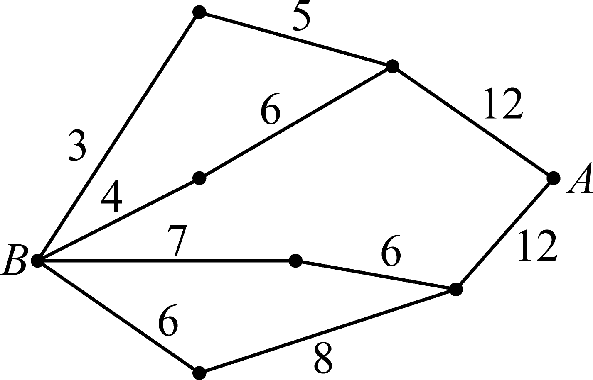
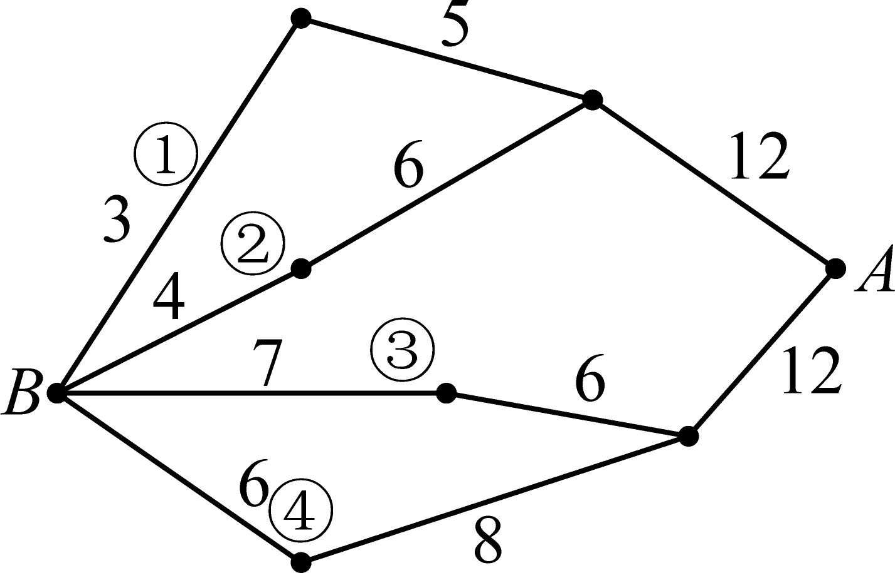
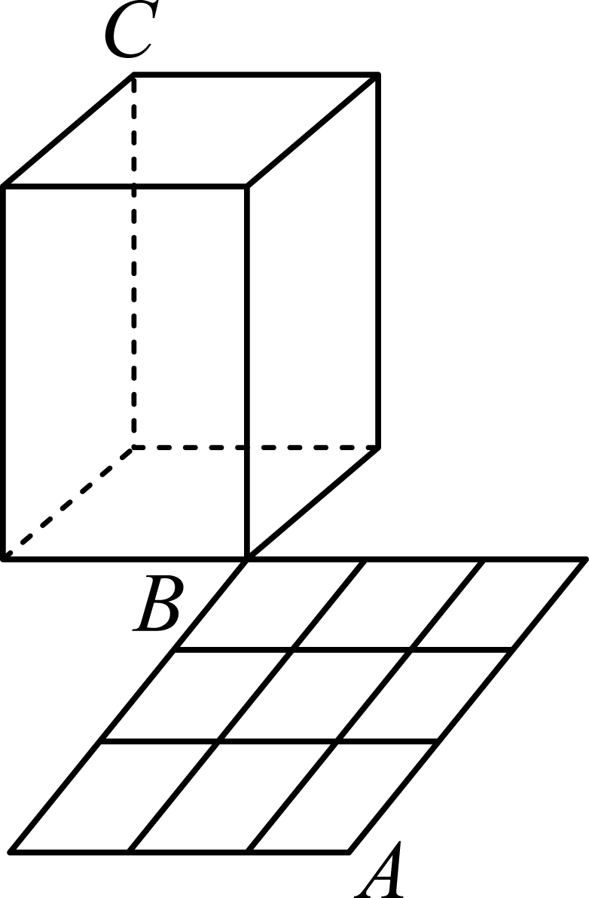
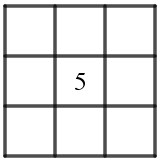
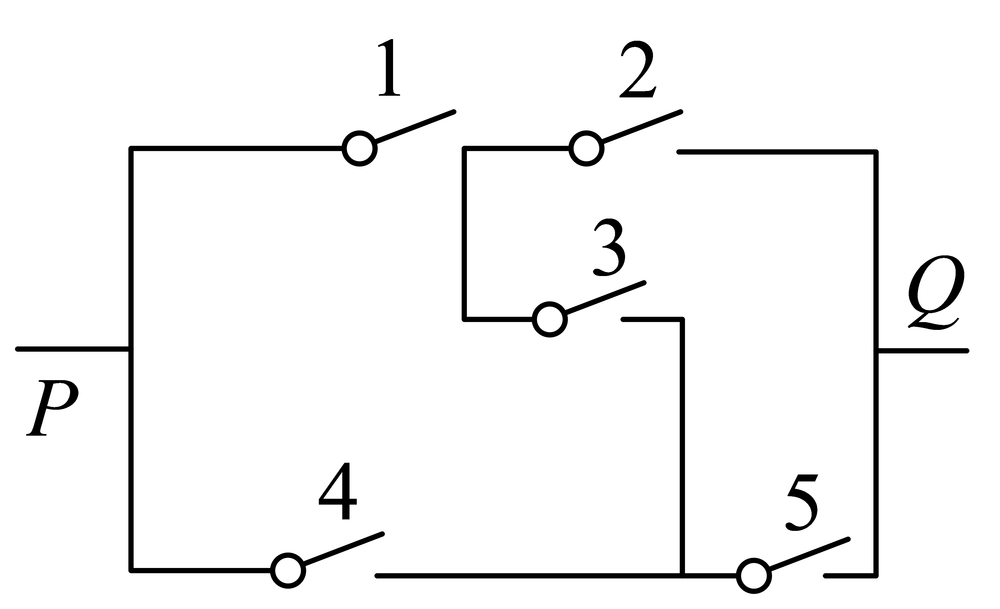
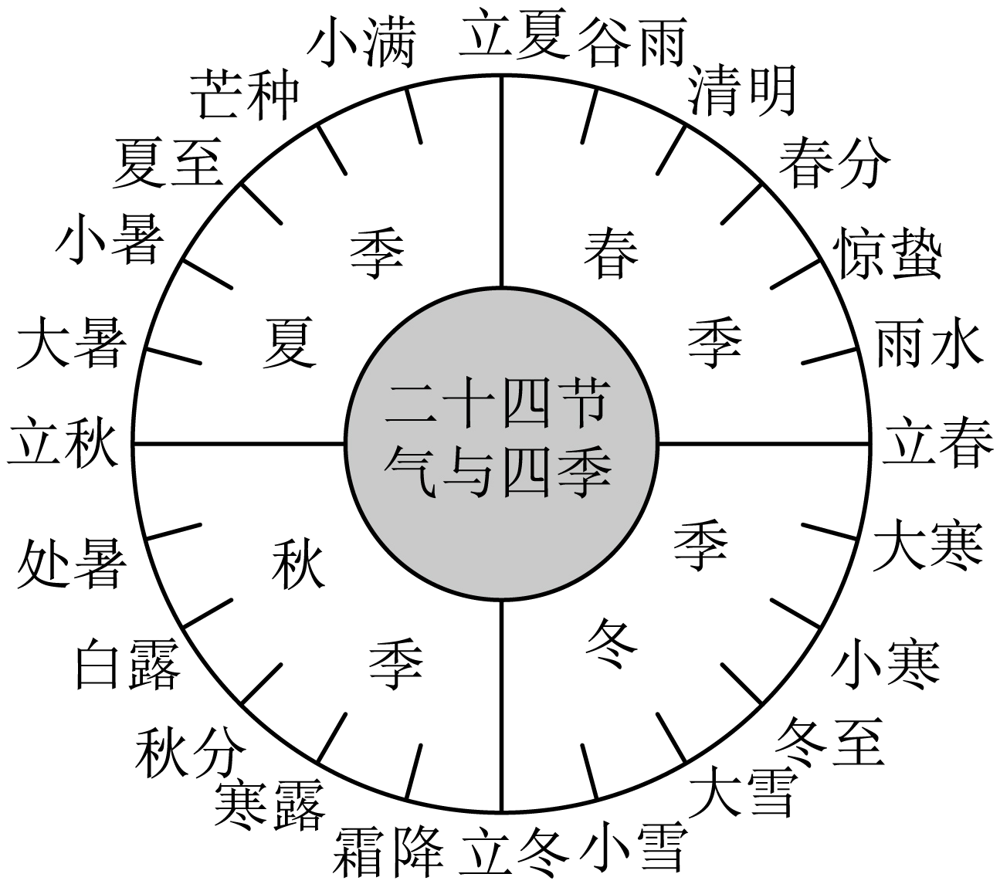

**第85讲  计数原理**

**知识梳理**

**知识点**1**、分类加法计数原理**

完成一件事，有类办法，在第1类办法中有种不同的办法，在第2类办法中有种不同的方法，…，在第类办法中有种不同的方法，那么完成这件事共有：种不同的方法．

**知识点**2**、分步乘法计数原理**

完成一件事，需要分成个步骤，做第1步有种不同的方法，做第2步有种不同的方法，…，做第步有种不同的方法，那么完成这件事共有：种不同的方法．

**注意：两个原理及其区别**

分类加法计数原理和“分类”有关，如果完成某件事情有类办法，这类办法之间是互斥的，那么求完成这件事情的方法总数时，就用分类加法计数原理．

分步乘法计数原理和“分步”有关，是针对“分步完成”的问题．如果完成某件事情有个步骤，而且这几个步骤缺一不可，且互不影响（独立），当且仅当依次完成这个步骤后，这件事情才算完成，那么求完成这件事情的方法总数时，就用分步乘法计数原理．

当然，在解决实际问题时，并不一定是单一应用分类计数原理或分步计数原理，有时可能同时用到两个计数原理．即分类时，每类的方法可能运用分步完成；而分步后，每步的方法数可能会采取分类的思想求方法数．对于同一问题，我们可以从不同的角度去处理，从而得到不同的解法（但方法数相同），这也是检验排列组合问题的很好方法．

**知识点**3**、两个计数原理的综合应用**

如果完成一件事的各种方法是相互独立的，那么计算完成这件事的方法数时，使用分类计数原理．如果完成一件事的各个步骤是相互联系的，即各个步骤都必须完成，这件事才告完成，那么计算完成这件事的方法数时，使用分步计数原理．

**必考题型全归纳**

**题型一：分类加法计数原理的应用**

**例1．**（2024·全国·高三专题练习）如果一条直线与一个平面垂直，那么称此直线与平面构成一个“正交线面对”.在一个正方体中，由两个顶点确定的直线与含有四个顶点的平面构成的“正交线面对”的个数是（　　）

A．48	B．18	C．24	D．36

【答案】D

【解析】正方体的两个顶点确定的直线有棱、面对角线、体对角线，

对于每一条棱，都可以与两个侧面构成“正交线面对”，这样的“正交线面对”有（个）；

对于每一条面对角线，都可以与一个对角面构成“正交线面对”，这样的“正交线面对”有12个，

不存在四个顶点确定的平面与体对角线垂直，

所以正方体中“正交线面对”共有（个）.

故选：D

<strong>例2．</strong>（2024·四川成都·双流中学校考模拟预测）如图，小黑圆表示网络的结点，结点之间的连线表示它们有网线相连．连线上标注的数字表示该段网线单位时间内可以通过的最大信息量．现从结点<em>A</em>向结点<em>B</em>传递信息（    ）

A．26	B．24	C．20	D．19

【答案】D

【解析】根据题意，结合图形知，

从*A*到*B*传播路径有4条，如图所示；

途径①传播的最大信息量为3，途径②传播的最大信息量为4；

途径③传播的最大信息量为6，途径④传播的最大信息量为6；

所以从*A*向*B*传递信息，单位时间内传递的最大信息量为，

故选：D．

**例3．**（2024·江苏镇江·高三扬中市第二高级中学校考阶段练习）定义：“各位数字之和为7的四位数叫好运数”，比如1006，2203，则所有好运数的个数为（     ）

A．82	B．83	C．84	D．85

【答案】C

【解析】因为各位数字之和为7的四位数叫好运数，所以按首位数字分别计算：

当首位数字为7，则剩余三位数分别为0，0，0，共有1个好运数；

当首位数字为6，则剩余三位数分别为1，0，0，共有3个好运数；

当首位数字为5，则剩余三位数分别为1，1，0或2，0，0，共有个好运数；

当首位数字为4，则剩余三位数分别为3，0，0或2，1，0或1，1，1，共有个好运数；

当首位数字为3，则剩余三位数分别为4，0，0或3，1，0或2，2，0或2，1，1，

共有个好运数；

当首位数字为2，则剩余三位数分别为5，0，0或4，1，0或3，2，0或3，1，1或2，2，1，

共有个好运数；

当首位数字为1，则剩余三位数分别为6，0，0或5，1，0或4，2，0或4，1，1或3，3，0或3，2，1或2，2，2，

共有个好运数；

所以共有个好运数，

故选：C

<strong>变式1．</strong>（2024·全国·高三专题练习）从1，2，3，4，5，6中选取4个数字，组成各个数位上的数字既不全相同，也不两两互异的四位数，记四位数中各个数位上的数字从左往右依次为<em>a</em>，<em>b</em>，<em>c</em>，<em>d</em>，且要求，则满足条件的四位数的个数为___________.

【答案】105

【解析】由题意可知，只用2个不同的数字时，有（种）选法，

按照位数要求，每种数字组合组成的符合要求的四位数有3个，比如数字1和2，可以构成的四位数有1222，1122，1112，所以共有（个）符合要求的四位数.

只用3个不同的数字时，有（种）选法，

按照位数要求，每种数字组合组成的符合要求的四位数有3个，比如数字1，2，3，可以构成的四位数有1123，1223，1233，所以共有（个）符合要求的四位数.

故符合要求的四位数总共有（个）.

故答案为：105

<strong>变式2．</strong>（2024·全国·高三专题练习）已知直线方程，若从0、1、2、3、5、7这六个数中每次取两个不同的数分别作为<em>A</em>、<em>B</em>的值，则可表示________条不同的直线．

【答案】22

【解析】当时，可表示1条直线；当时，可表示1条直线；

当时，*A*有5种选法，*B*有4种选法，可表示条不同的直线．

由分类加法计数原理，知共可表示条不同的直线．

故答案为：22

<strong>变式3．</strong>（2024·辽宁·高三校联考开学考试）某迷宫隧道猫爬架如图所示，，<em>C</em>为一个长方体的两个顶点，，是边长为3米的大正方形的两个顶点，且大正方形由完全相同的9小正方形拼成.若小猫从点沿着图中的线段爬到点，再从点沿着长方体的棱爬到点，则小猫从点爬到点可以选择的最短路径共有_______________条.

【答案】

【解析】小猫要从点爬到点，需要先从点爬到点，需要走3横3竖，则可选的路径共有条，

再从点爬到点的路径共6条，用分步乘法计数原理可得小猫可以选择的最短路径有20×6=120条.

故答案为：120.

**【解题方法总结】**

分类标准的选择

（1）应抓住题目中的关键词、关键元素、关键位置．根据题目特点恰当选择一个分类标准．

（2）分类时应注意完成这件事情的任何一种方法必须属于某一类，并且分别属于不同种类的两种方法是不同的方法，不能重复，但也不能有遗漏．

**题型二：分步乘法计数原理的应用**

<strong>例4．</strong>（2024·广东深圳·高三校考阶段练习）甲、乙、丙3个公司承包6项不同的工程，甲承包1项，乙承包2项，丙承包3项，则共有____________种承包方式（用数字作答）.

【答案】60

【解析】由题意得，不同的承包方案分步完成，先让甲承包1项，有种，再让乙承包2项，有，剩下的3项丙承包，

所以由分步乘法原理可得共有种方案，

故答案为：60

<strong>例5．</strong>（2024·全国·高三专题练习）若一个三位数同时满足：①各数位的数字互不相同；②任意两个数位的数字之和不等于9，则这样的三位数共有__________个．(结果用数字作答)

【答案】432

【解析】从百位开始讨论：

（1）百位数字为1，十位数字有0,2,3,4,5,6,7,9，（除1,8外所有数字）；

当十位数字为0时，个位数字为2,3,4,5,6,7,（除1,0，8，9外所有数字），所以对应的三位数有种；

（2）百位数字为2,3,4,5,6,7,8,9，情况同（1）；

综上这样的三位数共有：种；

故答案为：432.

**例6．**（2024·安徽亳州·高三蒙城第一中学校考阶段练习）将3名男生，2名女生排成一排，要求男生甲必须站在中间，2名女生必须相邻的排法种数有（    ）

A．4种	B．8种	C．12种	D．48种

【答案】B

【解析】先让甲站好中间位置，再让2名女生相邻有两种选法，最后再排剩余的2名男生，

根据分步乘法原理得，有种不同的排法.

故选：B

**变式4．**（2024·四川成都·高三统考开学考试）“数独九宫格”原创者是18世纪的瑞士数学家欧拉，它的游戏规则很简单，将1到9这九个自然数填到如图所示的小九宫格的9个空格里，每个空格填一个数，且9个空格的数字各不相同，若中间空格已填数字5，且只填第二行和第二列，并要求第二行从左至右及第二列从上至下所填的数字都是从小到大排列的，则不同的填法种数为（    ）

A．72	B．108

C．144	D．196

【答案】C

【解析】按题意，5的上方和左边只能从1，2，3，4中选取，5的下方和右边只能从6，7，8，9中选取．第一步，填上方空格，有4种方法；第二步，填左方空格，有3种方法；第三步，填下方空格，有4种方法；第四步，填右方空格，有3种方法.

由分步计数原理得， 填法总数为.

故选：C.

**变式5．**（2024·全国·高三专题练习）三棱柱各面所在平面将空间分成不同部分的个数为（    ）

A．18	B．21	C．24	D．27

【答案】B

【解析】三棱柱的三个侧面将空间分成7部分，三棱柱的两个底面将空间分成3部分．

故三棱柱各面所在平面将空间分成不同部分的个数为．

故选：B．

**变式6．**（2024·河北石家庄·高三校联考期中）临近春节，某校书法爱好小组书写了若干副春联，准备赠送给四户孤寡老人．春联分为长联和短联两种，无论是长联或短联，内容均不相同．经过调查，四户老人各户需要1副长联，其中乙户老人需要1副短联，其余三户各要2副短联．书法爱好小组按要求选出11副春联，则不同的赠送方法种数为（    ）

A．15120	B．7560	C．12520	D．12160

【答案】A

【解析】4副长联内容不同，赠送方法有种；

从剩余的7副短联中选出1副赠送给乙户老人，有种方法，

再将剩余的6副短联平均分为3组，最后将这3组赠送给三户老人，

方法种数为．

所以所求方法种数为．

故选：A

**变式7．**（2024·北京东城·高三北京市广渠门中学校考开学考试）鱼缸里有8条热带鱼和2条冷水鱼，为避免热带鱼咬死冷水鱼，现在把鱼缸出孔打开，让鱼随机游出，每次只能游出1条，直至2条冷水鱼全部游出就关闭出孔，若恰好第3条鱼游出后就关闭了出孔，则不同游出方案的种数为（    ）

A．16	B．32	C．36	D．48

【答案】B

【解析】由题意得，前2条鱼游出1条冷水鱼，1条热带鱼，第3条为另一条冷水鱼，

先选出一条热带鱼，有种，再选出一条冷水鱼，有种，

两条鱼可在第一条鱼和第二条鱼顺序上进行全排列，

则不同游出方案的种数为.

故选：B

**变式8．**（2024·湖南·高三临澧县第一中学校联考开学考试）在如图所示的表格中填写，，三个数字，要求每一行、每一列均有这个数字，则不同的填法种数为（    ）．

<table><tr><td></td><td></td><td></td></tr><tr><td></td><td></td><td></td></tr><tr><td></td><td></td><td></td></tr></table>

A．	B．	C．	D．

【答案】C

【解析】先填第一行，有种填法；再填第二行，有种填法；最后填第三行，只有种填法；

不同的填法种数为种.

故选：C.

**变式9．**（2024·黑龙江佳木斯·高三校考开学考试）甲、乙分别从门不同课程中选修门，且人选修的课程不同，则不同的选法有（    ）种．

A．	B．	C．	D．

【答案】C

【解析】甲从门课程中选择门，有种选法；乙再从甲未选的课程中选择门，有种选法；

根据分步乘法计数原理可得：不同的选法有种.

故选：C.

**变式10．**（2024·陕西西安·西安市第三十八中学校考模拟预测）从六人（含甲）中选四人完成四项不同的工作（含翻译），则甲被选且甲不参加翻译工作的不同选法共有（    ）

A．120种	B．150种	C．180种	D．210种

【答案】C

【解析】依题意可得，甲需从除翻译外的其他三项工作中任选一项，有3种选法，

再从其余五人中选三人参加剩下的三项工作，有种选法，

所以满足条件的不同选法共有种．

故选：C

**变式11．**（2024·贵州黔东南·凯里一中校考模拟预测）某足球比赛有，，，，，，，，共9支球队，其中，，为第一档球队，，，为第二档球队，，，为第三档球队，现将上述9支球队分成3个小组，每个小组3支球队，若同一档位的球队不能出现在同一个小组中，则不同的分组方法有（    ）

A．27种	B．36种	C．72种	D．144种

【答案】B

【解析】根据题意，先排，共有1种排法；

再排，共有种不同的排法；

最后排，共有种不同的排法，

由分步计数原理得，共有种不同的排法.

故选：B.

**【解题方法总结】**

利用分步乘法计数原理解题的策略

（1）明确题目中的“完成这件事”是什么，确定完成这件事需要几个步骤，且每步都是独立的．

（2）将这件事划分成几个步骤来完成，各步骤之间有一定的连续性，只有当所有步骤都完成了，整个事件才算完成．

**题型三：两个计数原理的综合应用**

**例7．**（2024·全国·高三专题练习）第届世界大学生夏季运动会于月日至月日在成都举办，现在从男女共名青年志愿者中，选出男女共名志愿者，安排到编号为、、、、的个赛场，每个赛场只有一名志愿者，其中女志愿者甲不能安排在编号为、的赛场，编号为的赛场必须安排女志愿者，那么不同安排方案有（    ）

A．种	B．种	C．种	D．种

【答案】D

【解析】分以下两种情况讨论：

①女志愿者甲被选中，则还需从剩余的人中选出男女，选法种数为，

则女志愿者甲可安排在号或号或号赛场，另一位女志愿者安排在号赛场，

余下个男志愿者随意安排，此时，不同的安排种数为；

②女志愿者甲没被选中，则还需从剩余人中选出男女，选法种数为，

编号为的赛场必须安排女志愿者，只需从名女志愿者中抽人安排在号赛场，

余下人可随意安排，此时，不同的安排方法种数为.

由分类加法计数原理可知，不同的安排方法种数为种.

故选：D.

**例8．**（2024·江苏南京·高三校联考阶段练习）从2位男生，3位女生中安排3人到三个场馆做志愿者，每个场馆各1人，且至少有1位男生入选，则不同安排方法有（    ）种

A．16	B．36	C．54	D．96

【答案】C

【解析】当选择一个男生，二个女生时，不同的安排方法有；

当选择二个男生，一个女生时，不同的安排方法有，

所以不同安排方法有种，

故选：C

<strong>例9．</strong>（2024·上海黄浦·高三上海市敬业中学校考开学考试）三位同学参加跳高、跳远、铅球项目的比赛，若每人只选择一个项目，则同一个项目最多只有2人参赛的情况共有______种．

【答案】24

【解析】三位同学参加跳高、跳远、铅球项目的比赛，若每人只选择一个项目，

同一个项目最多只有2人参赛有以下两种情况：①同一个项目有且仅有两人选择；②每个项目分别只有一人选择；

有且仅有两人选择的项目完全相同有种；

每个项目分别只有一人选择；种；

故同一个项目最多只有2人参赛的情况共有种.

故答案为：24.

<strong>变式12．</strong>（2024·广东·高三河源市河源中学校联考阶段练习）现有5名同学从北京、上海、深圳三个路线中选择一个路线进行研学活动，每个路线至少1人，至多2人，其中甲同学不选深圳路线，则不同的路线选择方法共有__________种．（用数字作答）

【答案】.

【解析】每个路线至少1人，至多2人，则一个路线1人，另外两个路线各2人，

若甲同学单独1人时，有种不同的选法；

若甲同学与另外一个同学一起，则有种不同的选法，

则不同的选择方法有60种．

故答案为：.

<strong>变式13．</strong>（2024·浙江·高三舟山中学校联考开学考试）杭州亚运会举办在即，主办方开始对志愿者进行分配．已知射箭场馆共需要6名志愿者，其中3名会说韩语，3名会说日语．目前可供选择的志愿者中有4人只会韩语，5人只会日语，另外还有1人既会韩语又会日语，则不同的选人方案共有_________种．（用数字作答）．

【答案】140

【解析】若从只会韩语中选3人，则种，

若从只会韩语中选2人，则种，

故不同的选人方案共有种.

故答案为：140.

<strong>变式14．</strong>（2024·江苏扬州·高三仪征中学校考阶段练习）已知如图所示的电路中，每个开关都有闭合、不闭合两种可能，因此5个开关共有种可能，在这种可能中，电路从<em>P</em>到<em>Q</em>接通的情况有________种．

【答案】16

【解析】若电路从到接通，共有三种情况：

（1）若1闭合，而4不闭合时，可得分为：

①若1、2闭合，而4不闭合，则3、5可以闭合也可以不闭合，共有种情况；

②若1、3、5闭合，而4不闭合，则2可以闭合也可以不闭合，有2种情况，

但①与②中都包含1、2、3、5都闭合，而4不闭合的情况，所以共有种情况；

（2）若4闭合，而1不闭合时，可分为：

③若4、5闭合，而1不闭合，则2、3可以闭合也可以不闭合，有种情况；

④若4、3、2闭合，而1不闭合，则5可以闭合也可以不闭合，有2种情况，

但③与④中，都包含4、2、3、5都闭合，而1不闭合的情况，所以共有种情况；

（3）若1、4都闭合，共有种情况，而其中电路不通有2、3、5都不闭合与2、5都不闭合2种情况，则此时电路接通的情况有种情况；

所以电路接通的情况有种情况.

故答案为：.

<strong>变式15．</strong>（2024·湖北·高三校联考开学考试）从5男3女共8名学生中选出组长1人，副组长1人，普通组员3人组成5人志愿组，要求志愿组中至少有3名男生，且组长和副组长性别不同，则共有___________种不同的选法.（用数字作答）

【答案】

【解析】由题意可知，当志愿组有3名男生，2名女生时，有种方法；

当志愿组有4名男生，1名女生时，有种方法，

由分类计数原理得，共有种不同的选法.

故答案为：.

<strong>变式16．</strong>（2024·湖北·高三校联考阶段练习）有两个家庭共8人暑假到新疆结伴旅游（每个家庭包括一对夫妻和两个孩子），他们在乌鲁木齐租了两辆不同的汽车进行自驾游，每辆汽车乘坐4人，要求每对夫妻乘坐同一辆汽车，且该车上至少有一个该夫妻自己的孩子，则满足条件的不同乘车方案种数为______.

【答案】10

【解析】由题意得当每个家庭各乘坐一辆车时，有2种乘车方案；

当每对夫妻乘坐的车上恰有一个自己的孩子时，乘车方案种数为，

故满足条件的不同乘车方案种数为，

故答案为：10

**变式17．**（2024·福建福州·高三统考开学考试）“二十四节气”是中国古代劳动人民伟大的智慧结晶，其划分如图所示．小明打算在网上搜集一些与二十四节气有关的古诗．他准备在春季的6个节气与夏季的6个节气中共选出3个节气，若春季的节气和夏季的节气各至少选出1个，则小明选取节气的不同情况的种数是（　　）

A．90	B．180	C．270	D．360

【答案】B

【解析】根据题意可知，小明可以选取1春2夏或2春1夏，

其中1春2夏的不同情况有：种；

2春1夏的不同情况有：种，

所以小明选取节气的不同情况有：种．

故选：B．

**【解题方法总结】**

利用两个计数原理解题时的三个注意点

（1）当题目无从下手时，可考虑要完成的这件事是什么，即怎样做才算完成这件事．

（2）分类时，标准要明确，做到不重不漏，有时要恰当画出示意图或树状图．

（3）对于复杂问题，一般是先分类再分步．

