**第86讲  排列与组合**

**知识梳理**

**知识点**1**、排列与排列数**

（1）定义：从个不同元素中取出个元素排成一列，叫做从个不同元素中取出个元素的一个排列．从个不同元素中取出个元素的所有排列的个数，叫做从个不同元素中取出个元素的排列数，用符号表示．

（2）排列数的公式：．

特例：当时，；规定：．

（3）排列数的性质：

①；②；③．

（4）解排列应用题的基本思路：

通过审题，找出问题中的元素是什么，是否与顺序有关，有无特殊限制条件（特殊位置，特殊元素）．

**注意：** 排列数公式的两种不同表达形式本质是一样的，但作用略有不同，常用于具体数字计算；而在进行含字母算式化简或证明时，多用．

**知识点**2**、组合与组合数**

（1）定义：从个不同元素中取出个元素并成一组，叫做从个不同元素中取出个元素的一个组合．从个不同元素中取出个元素的所有组合的个数，叫做从个不同元素中取出个元素的组合数，用符号表示．

（2）组合数公式及其推导

求从个不同元素中取出个元素的排列数，可以按以下两步来考虑：

第一步，先求出从这个不同元素中取出个元素的组合数；

第二步，求每一个组合中个元素的全排列数；

根据分步计数原理，得到；

因此．

这里，，且，这个公式叫做组合数公式．因为，所以组合数公式还可表示为：．特例：．

**注意：** 组合数公式的推导方法是一种重要的解题方法！在以后学习排列组合的混合问题时，一般都是按先取后排（先组合后排列）的顺序解决问题．公式常用于具体数字计算，常用于含字母算式的化简或证明．

（3）组合数的主要性质：①；②．

（4）组合应用题的常见题型：

①“含有”或“不含有”某些元素的组合题型

②“至少”或“最多”含有几个元素的题型

**知识点**3**、排列和组合的区别**

组合：取出的元素地位平等，没有不同去向和分工．

排列：取出的元素地位不同，去向、分工或职位不同．

**注意：** 排列、组合都是研究事物在某种给定的模式下所有可能的配置数目问题，它们之间的主要区别在于是否要考虑选出元素的先后顺序，不需要考虑顺序的是组合问题，需要考虑顺序的是排列问题．排列是在组合的基础上对入选的元素进行排队，因此，分析解决排列组合综合问题的基本思维是“先组合，后排列”．

**知识点**4**、** 解决排列组合综合问题的一般过程

1、认真审题，确定要做什么事；

2、确定怎样做才能完成这件事，即采取分步还是分类或是分步与分类同时进行，弄清楚分多少类及多少步；

3、确定每一步或每一类是排列（有序）问题还是组合（无序）问题，元素总数是多少及取出多少个元素；

4、解决排列组合综合性问题，往往类与步交叉，因此必须掌握一些常用的解题策略．

**【解题方法总结】**

1、如图，在圆中，将圆分等份得到个区域，，，，，现取种颜色对这个区域涂色，要求每相邻的两个区域涂不同的两种颜色，则涂色的方案有种．

2、错位排列公式

3、数字排列问题的解题原则、常用方法及注意事项

（1）解题原则：排列问题的本质是“元素”占“位子”问题，有限制条件的排列问题的限制条件主要表现在某元素不排在某个位子上，或某个位子不排某些元素，解决该类排列问题的方法主要是按“优先”原则，即优先排特殊元素或优先满足特殊位子，若一个位子安排的元素影响到另一个位子的元素个数时，应分类讨论．

4、定位、定元的排列问题，一般都是对某个或某些元素加以限制，被限制的元素通常称为特殊元素，被限制的位置称为特殊位置．这一类问题通常以三种途径考虑：

（1）以元素为主考虑，这时，一般先解决特殊元素的排法问题，即先满足特殊元素，再安排其他元素；

（2）以位置为主考虑，这时，一般先解决特殊位置的排法问题，即先满足特殊位置，再考虑其他位置；

（3）用间接法解题，先不考虑限制条件，计算出排列总数，再减去不符合要求的排列数．

5、解决相邻问题的方法是“捆绑法”，其模型为将*n*个不同元素排成一排，其中某*k*个元素排在相邻位置上，求不同排法种数的方法是：先将这*k*个元素“捆绑在一起”，看成一个整体，当作一个元素同其他元素一起排列，共有种排法；然后再将“捆绑”在一起的元素“内部”进行排列，共有种排法．根据分步乘法计数原理可知，符合条件的排法共有种．

6、解决不相邻问题的方法为“插空法”，其模型为将个不同元素排成一排，其中某个元素互不相邻（），求不同排法种数的方法是：先将（）个元素排成一排，共有种排法；然后把个元素插入个空隙中，共有种排法．根据分步乘法计数原理可知，符合条件的排法共有·种．

**必考题型全归纳**

**题型一：排列数与组合数的推导、化简和计算**

**例1．**（2024·全国·高三专题练习）若，则实数的值为（    ）

A．	B．	C．1或3	D．

【答案】C

【解析】因为，所以或，解得或，

故选：C

**例2．**（2024·全国·高三专题练习）（    ）

A．	B．	C．	D．

【答案】B

【解析】

.

故选：B.

<strong>例3．</strong>（2024·甘肃兰州·统考一模），则等于________．

【答案】10

【解析】因为，解得或，

且，所以.

故答案为：10.

<strong>变式1．</strong>（2024·全国·高三专题练习）___________

【答案】/

【解析】.

故答案为：.

<strong>变式2．</strong>（2024·全国·高三专题练习）_________．

【答案】0

【解析】.

故答案为：0.

<strong>变式3．</strong>（2024·高三课时练习）已知，则_________.

【答案】2或3

【解析】，

，又，

所以或.

故答案为：2或3.

<strong>变式4．</strong>（2024·河北衡水·高三衡水市第二中学期末）若，则__________

【答案】

【解析】由组合数的性质可得，解得，

又因为，所以或，

解得（舍去）或，

所以，

故答案为：

<strong>变式5．</strong>（2024·全国·高三对口高考）计算的值为_________.

【答案】466

【解析】依题意，，解得，而，于是得，

所以，原式.

故答案为：466

**题型二：直接法**

**例4．**（2024·江苏·高三校联考开学考试）甲、乙、丙等六人相约到电影院观看电影《封神榜》，恰好买到了六张连号的电影票．若甲、乙两人必须坐在丙的同一侧，则不同的坐法种数为（    ）

A．360	B．480	C．600	D．720

【答案】B

【解析】由题意，甲、乙、丙等六人的全排列，共有种不同的排法，

其中甲、乙、丙三人的全排列有种不同的排法，

其中甲、乙在丙的同侧有：甲乙丙、乙甲丙、丙甲乙，丙乙甲，共4种排法，

所以甲、乙两人必须坐在丙的同一侧，则不同的坐法种数为种.

故选：B.

**例5．**（2024·重庆·高三统考阶段练习）雅礼女篮一直是雅礼中学的一张靓丽的名片，在刚刚结束的2022到2024赛季中国高中篮球联赛女子组总决赛中，雅礼中学女篮队员们敢打敢拼，最终获得了冠军．在颁奖仪式上，女篮队员12人（其中1人为队长），教练组3人，站成一排照相，要求队长必须站中间，教练组三人要求相邻并站在边上，总共有多少种站法（    ）

A．	B．	C．	D．

【答案】B

【解析】选择左右两边其中一边将教练组3人捆绑看作一个整体安排共有种排法，

将剩余的11名队员全排列共有，

由分步乘法计数原理可得总的站法有，

故选:B.

**例6．**（2024·全国·高三专题练习）有五名志愿者参加社区服务，共服务星期六、星期天两天，每天从中任选两人参加服务，则恰有1人连续参加两天服务的选择种数为（    ）

A．120	B．60	C．40	D．30

【答案】B

【解析】不妨记五名志愿者为，假设连续参加了两天社区服务，再从剩余的4人抽取2人各参加星期六与星期天的社区服务，共有种方法，

同理：连续参加了两天社区服务，也各有种方法，

所以恰有1人连续参加了两天社区服务的选择种数有种.

故选：B.

**变式6．**（2024·全国·高三对口高考）要排出某班一天中语文，数学，政治，英语，体育，艺术6门课各一节的课程表，要求数学课排在前3节，英语课不排在第6节，则不同的排法种数为（    ）

A．24	B．72	C．144	D．288

【答案】D

【解析】数学课排在前3节，英语课不排在第6节，

∴先排数学课有种排法，再排最后一节有种排法，剩余的有种排法，

∴根据分步计数原理知，共有种排法．

故选：D．

**变式7．**（2024·全国·高三对口高考）运输公司从5名男司机，4名女司机中选派出3名男司机，2名女司机，到，，，，这五个不同地区执行任务，要求地只能派男司机，地只能派女司机，则不同的方案种数是（    ）

A．360	B．720	C．1080	D．2160

【答案】D

【解析】第一步，先从5名男司机，4名女司机中选派出3名男司机，2名女司机，共有种方法，

第二步，从抽取到的司机中，派1名男司机去地，派一名女司机去地，共有种方法，

第三步，剩下3名司机随机去，，三地，共有种方法，

故不同方案种数为，

故选：D

<strong>变式8．</strong>（2024·全国·高三对口高考）从编号为1，2，3，4，5的5个球中任取4个，放在编号为<em>A</em>，<em>B</em>，<em>C</em>，<em>D</em>的4个盒子里，每盒一球，且2号球不能放在<em>B</em>盒中的不同的方法数是（    ）

A．24	B．48	C．54	D．96

【答案】D

【解析】先在编号为1，3，4，5的4个球中任取1个放在*B*盒中，

再将余下的3个球与2号球放在一起，从中选3个球放在编号为

*A*，*C*，*D*的3个盒子中，每盒一球，即可完成题目要求.

则符合题给要求的不同的方法数为

故选：D

**变式9．**（2024·陕西·高三校联考阶段练习）甲、乙两个家庭周末到附近景区游玩，其中甲家庭有2个大人和2个小孩，乙家庭有2个大人和3个小孩，他们9人在景区门口站成一排照相，要求每个家庭的成员要站在一起，且同一家庭的大人不能相邻，则所有不同站法的种数为（    ）

A．144	B．864	C．1728	D．2880

【答案】C

【解析】甲家庭的站法有种，乙家庭的站法有种，

最后将两个家庭的整体全排列，有种站法，

则所有不同站法的种数为．

故选：C

**题型三：间接法**

**例7．**（2024·全国·高三专题练习）个点将半圆分成段弧，以个点（包括个端点）为顶点的三角形中钝角三角形有（　　）个

A．	B．	C．	D．

【答案】B

【解析】根据题意，如图：在10个点中，任意三点不共线，

在其中任取3个点，可以组成个三角形，

其中没有锐角三角形，直角三角形是包含点和余下的8点任意取一个构成的三角形，有8个，则钝角三角形有个．

故选：B．

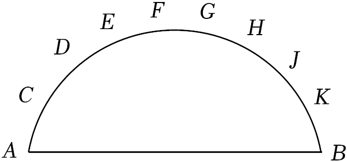

**例8．**（2024·湖北武汉·高二校联考期末）甲､乙､丙､丁四位同学决定去黄鹤楼､东湖､汉口江滩游玩，每人只能去一个地方，汉口江滩一定要有人去，则不同游览方案的种数为（    ）

A．65	B．73	C．70	D．60.

【答案】A

【解析】根据题意，甲、乙、丙、丁四位同学决定去黄鹤楼､东湖､汉口江滩游玩，且每人只能去一个地方，

则每人有3种选择，则4人一共有种情况，

若汉口江滩没人去，即四位同学选择了黄鹤楼､东湖，

每人有2种选择方法，则4人一共有种情况，

故汉口江滩一定要有人去有种情况，

故选：A．

**例9．**（2024·湖南长沙·雅礼中学校联考二模）从正360边形的顶点中取若干个，依次连接，构成的正多边形的个数为（    ）

A．360	B．630	C．1170	D．840

【答案】B

【解析】从360的约数中去掉1和2，其余的约数均可作为正多边形的边数，

设从360个顶点中选出个构成正多边形，这样的正多边形有个，

因此所求的正多边形的个数就是360的所有约数之和减去360和180，

考虑到，

因此所求正多边形的个数为.

故选：B.

**变式10．**（2024·全国·高三专题练习）将7个人从左到右排成一排，若甲、乙、丙3人中至多有2人相邻，且甲不站在最右端，则不同的站法有（    ）．

A．1860种	B．3696种	C．3600种	D．3648种

【答案】D

【解析】7个人从左到右排成一排，共有种不同的站法，其中甲、乙、丙3个都相邻有种不同的站法，甲站在最右端有种不同的站法，甲、乙、丙3个相邻且甲站最右端有种不同的站法，故甲、乙、丙3人中至多有2人相邻，且甲不站在最右端，不同的站法有种不同的站法.

故选：D

**题型四：捆绑法**

**例10．**（2024·四川内江·高三期末）甲、乙、丙、丁、戊5名同学站成一排参加文艺汇演，若甲和乙相邻，丙不站在两端，则不同的排列方式共有（    ）

A．12种	B．24种	C．36种	D．48种

【答案】B

【解析】将甲和乙看作一个整体，有种方法，

将丁、戊和甲乙的整体首先安排到两端，则有种方法，

再安排丙和剩余的人，有有种方法，

根据分步乘法计数原理可得不同的排列方式有：种．

故选：B．

**例11．**（2024·江西宜春·高三统考开学考试）“基础学科拔尖学生培养试验计划”简称“珠峰计划”，是国家为回应“钱学森之问”而推出的一项人才培养计划，旨在培养中国自己的学术大师.浙江大学､复旦大学､武汉大学､中山大学均有开设数学学科拔尖学生培养基地.已知某班级有共5位同学从中任选一所学校作为奋斗目标，每所学校至少有一位同学选择，则同学选择浙江大学的不同方法共有（    ）

A．24种	B．60种	C．96种	D．240种

【答案】B

【解析】5位同学选择4所学校，每所学校至少有一位同学选择，则有两位同学选择了同一所学校，已知同学选择浙江大学，

当有两位同学选择了浙江大学时，则这4 位同学在4所大学中分别选了一所，共种选法；

当只有*A*同学选择了浙江大学时，则这4 位同学在其余3所大学中选择，每所学校至少有一位同学选择，则有两位同学选择了同一所学校，共种选法；

所以同学选择浙江大学的不同方法共有种.

故选：B

**例12．**（2024·全国·高三专题练习）某个单位安排7位员工在“五·一”假期中1日至7日值班，每天安排1人值班，且每人值班1天，若7位员工中的甲、乙排在相邻的两天，丙不排在5月1日，丁不排在5月7日，则不同的安排方案共有（    ）

A．504种	B．960种	C．1008种	D．1200种

【答案】C

【解析】依题意，满足甲、乙两人值班安排在相邻两天的方法共有（种），

其中满足甲、乙两人值班安排在相邻两天且丙在5月1日值班的方法共有（种）；

满足甲、乙两人值班安排在相邻两天且丁在5月7日值班的方法共有(种)；

满足甲、乙两人值班安排在相邻两天且丙在5月1日值班，丁在5月7日值班的方法共有(种).

因此满足题意的方法共有(种).

故选：C.

**变式11．**（2024·全国·高三专题练习）2024年春节在北京工作的五个家庭，开车搭伴一起回老家过年，若五辆车分别为，五辆车随机排成一排，则车与车相邻，车与车不相邻的排法有（    ）

A．36种	B．42种	C．48种	D．60种

【答案】A

【解析】将车与车捆在一起当一个元素使用，有种捆法，

将除车外的个元素全排，有种排法，

将车插入，不与车相邻，又种插法，

故共有种排法.

故选：A

**变式12．**（2024·全国·高三专题练习）为庆祝广益中学建校130周年，高二年级派出甲､乙､丙､丁､戊5名老师参加“130周年办学成果展”活动，活动结束后5名老师排成一排合影留念，要求甲、乙两人不相邻且丙、丁两人必须相邻，则排法共有（    ）种.

A．40	B．24	C．20	D．12

【答案】B

【解析】由题意得，5名代表排成一排合影留念，要求甲、乙两人不相邻且丙、丁两人必须相邻，

先令丙、丁两人相邻用捆绑法，再把丙、丁与戊排列在一起，最后插空令甲、乙两人不相邻,则不同的排法共有种.

故选：.

**题型五：插空法**

**例13．**（2024·湖北·高三孝感高中校联考开学考试）已知来自甲、乙、丙三个学校的5名学生参加演讲比赛，其中三个学校的学生人数分别为1、2、2.现要求相同学校的学生的演讲顺序不相邻，则不同的演讲顺序的种数为（    ）

A．40	B．36	C．56	D．48

【答案】D

【解析】设这5个人分别为：*ABCDE*，则要求*B*与*C*和*D*与*E*的演讲顺序都不能相邻.

第一类：*A*在*BC*中间，此时再把*D*与*E*插空到这3人中间，

此时的不同的演讲顺序有

第二类：*A*不在*BC*中间，此时先考虑*B*与*C*和*D*与*E*，分别将他们看成两个人的整体，再将他们的顺序应相间排列，最后考虑*A*，此时的不同的演讲顺序有

综上可得：总共有48种不同的演讲顺序，

故选：D.

**例14．**（2024·黑龙江佳木斯·高三校考开学考试）甲、乙、丙、丁、戊五人排成一排，甲和乙不相邻，排法种数为（　　）

A．12	B．36	C．48	D．72

【答案】D

【解析】先排丙、丁、戊三人，共有种排法，

甲和乙不相邻，再将甲、乙插空，

共有种排法，故排法种数为．

故选：D

**例15．**（2024·辽宁沈阳·高三沈阳二十中校考开学考试）五声音阶是中国古乐基本音阶，故有成语“五音不全”，中国古乐中的五声音阶依次为：宫、商、角、徵、羽，若把这五个音阶全用上，排成一个五个音阶的音序，且要求宫、羽两音阶不相邻且在角音阶的同侧，则可排成不同的音序种数为（    ）

A．72	B．28	C．24	D．32

【答案】D

【解析】若角音阶排在两端，则宫、羽两音阶一定在角音阶的同侧，此时有种；

若角音阶排在正中间，则不可能出现宫、羽两音阶不相邻且在角音阶的同侧的情况；

若角音阶排在第二或第四个位置上，则有种排法.

根据分类加法计数原理可得共有种排法.

故选：D

**变式13．**（2024·全国·高三对口高考）2位男生和3位女生共5位同学站成一排．若男生甲不站两端，3位女生中有且只有两位女生相邻，则不同排法的种数为（    ）

A．36	B．42	C．48	D．60

【答案】C

【解析】女生任选两人捆绑看作，并与余下女生排成一排有种方法，所成排中有3个空，

若两男生不相邻，则男生甲排在之间的位置上，另一男生在两端任选一个位置有种；

若两男生相邻，则有种排法，再插入之间的位置上只有一种方法；

综上，不同排法共有种.

故选：C

**变式14．**（2024·陕西西安·西北工业大学附属中学校考模拟预测）某校举行文艺汇演，甲、乙、丙等6名同学站成一排演唱歌曲，若甲、乙不相邻，丙不在两端，则不同的排列方式共有（    ）

A．72种	B．144种	C．288种	D．432种

【答案】C

【解析】除甲乙丙外的三个人排一排有种排法，此时将甲乙插空有种排法，这时甲乙包括剩下三个人形成了6个空，去掉首尾的，则丙有4种排法，

共有，

故选：C

**变式15．**（2024·四川·校联考模拟预测）北京地处中国北部､华北平原北部，东与天津毗连，其余方向均与河北相邻，是世界著名古都，也是国务院批复确定的中国政治中心､文化中心､国际交往中心､科技创新中心.为了感受这座古今中外闻名的城市，某学生决定在高考后游览北京，计划6天游览故宫､八达岭长城､颐和园､“水立方”､“鸟巢”､798艺术区､首都博物馆7个景点，如果每天至少游览一个景点，且“水立方”和“鸟巢”在同一天游览，故宫和八达岭长城不在相邻两天游览，那么不同的游览顺序共有（    ）

A．120种	B．240种	C．480种	D．960种

【答案】D

【解析】顺序排列分2步进行，（1）将“水立方”和“鸟巢”看成一个整体，与颐和园､798艺术区､首都博物馆全排列，有种情况，

（2）排好后，有5个空位可用，在其中任选2个，安排故宫和八达岭长城，有种情况，则有种不同的游览顺序.

故选：D.

**变式16．**（2024·湖北襄阳·襄阳四中校考模拟预测）一排有8个座位，有3人各不相邻而坐，则不同的坐法共有（    ）

A．120种	B．60种	C．40种	D．20种

【答案】A

【解析】依题意，把3人连同他的座位一起插入另5个座位形成的6个空隙中，有种.

故选：A

**题型六：定序问题（先选后排）**

**例16．**（2024·全国·高三专题练习）满足，且的有序数组共有（    ）个.

A．	B．	C．	D．

【答案】A

【解析】∵数组中数字的大小确定，从1到9共9个数任取4个数得一个有序数组，所有个数为．

故选：A．

**例17．**（2024·高二课时练习）已知，则满足的有序数组共有（    ）个

A．	B．	C．	D．

【答案】A

【解析】所有有序数组  中,满足的

有序数组 中包含个0，另外两个数在或中选择，每个位置有2种选择，由乘法计数原理得不同的种数为

故选：A.

<strong>例18．</strong>（2024·山西朔州·高二怀仁市第一中学校校考期中）五人并排站在一排，如果<em>A</em>，<em>B</em>必须相邻且<em>B</em>在<em>A</em>的右边，那么不同的排法种数有（    ）

A．60种	B．48种	C．36种	D．24种

【答案】D

【解析】根据题意，分2步进行分析：

①，必须相邻且在的左边，将看成一个整体，有1种顺序，

②将整体与、、全排列，有种情况，

则有种排法；

故选：D．

<strong>变式17．</strong>（2024·全国·高三专题练习）<em>DNA</em>是形成所有生物体中染色体的一种双股螺旋线分子，由称为碱基的化学成分组成它看上去就像是两条长长的平行螺旋状链，两条链上的碱基之间由氢键相结合．在<em>DNA</em>中只有4种类型的碱基，分别用<em>A</em>、<em>C</em>、<em>G</em>和<em>T</em>表示，<em>DNA</em>中的碱基能够以任意顺序出现两条链之间能形成氢键的碱基或者是<em>A</em>-<em>T</em>，或者是<em>C</em>-<em>G</em>，不会出现其他的联系因此，如果我们知道了两条链中一条链上碱基的顺序，那么我们也就知道了另一条链上碱基的顺序．如图所示为一条<em>DNA</em>单链模型示意图，现在某同学想在碱基<em>T</em>和碱基<em>C</em>之间插入3个碱基<em>A</em>，2个碱基<em>C</em>和1个碱基<em>T</em>，则不同的插入方式的种数为（    ）

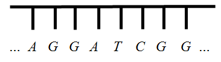

A．20	B．40	C．60	D．120

【答案】C

【解析】依题意可知，不同的插入方式的种数为.

故选：C

**变式18．**（2024·江苏扬州·高三校考期末）花灯，又名“彩灯”“灯笼”，是中国传统农业时代的文化产物，兼具生活功能与艺术特色.如图，现有悬挂着的6盏不同的花灯需要取下，每次取1盏，则不同取法总数为\_\_\_\_\_\_\_\_\_

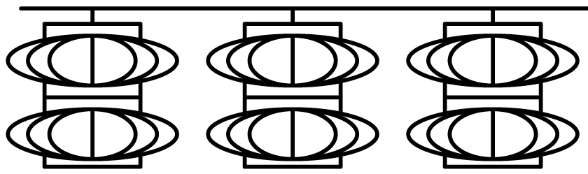

【答案】

【解析】由题意，对6盏不同的花灯进行取下，

先对6盏不同的花灯进行全排列，共有种方法，

因为取花灯每次只取一盏，而且只能从下往上取，

所以必须除去重复的排列顺序，即先取上方的顺序，

故共有取法总数为：.

故答案为：

**变式19．**（2024·全国·高三专题练习）某公司在元宵节组织了一次猜灯谜活动，主持人事先将10条不同灯谜分别装在了如图所示的10个灯笼中，猜灯谜的职员每次只能任选每列最下面的一个灯笼中的谜语来猜（无论猜中与否，选中的灯笼就拿掉），则这10条灯谜依次被选中的所有不同顺序方法数为\_\_\_\_\_\_\_\_\_\_\_\_.（用数字作答）

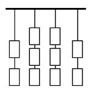

【答案】

【解析】一共有10条灯谜，共有种方法，由题意可知而其中按2，3，3，2组成的4列相对位置不变，所以结合倍缩法可知共有种，也即是这10条灯谜依次被选中的所有不同顺序方法有种

故答案为：.

**变式20．**（2024·高二课时练习）7人排队，其中甲、乙、丙3人顺序一定，共有\_\_不同的排法.

【答案】840

【解析】根据题意，假设有7个位置，对应7个人，

先在7个位置中任取4个，安排除甲、乙、丙之外的4人，有种情况，

由于甲、乙、丙3人顺序一定，在剩余3个位置安排3人即可，有1种情况，

则共有种不同的排法；

故答案为：840.

**题型七：列举法**

<strong>例19．</strong>（2024·全国·高三专题练习）数论领域的四平方和定理最早由欧拉提出，后被拉格朗日等数学家证明．四平方和定理的内容是：任意正整数都可以表示为不超过四个自然数的平方和，例如正整数．设，其中<em>a</em>，<em>b</em>，<em>c</em>，<em>d</em>均为自然数，则满足条件的有序数组的个数是（    ）

A．28	B．24	C．20	D．16

【答案】A

【解析】显然*a*，*b*，*c*，*d*均为不超过5的自然数，下面进行讨论．

最大数为5的情况：

①，此时共有种情况；

最大数为4的情况：

②，此时共有种情况；

③，此时共有种情况．

当最大数为3时，，故没有满足题意的情况．

综上，满足条件的有序数组的个数是．

故选：A

**例20．**（2024·浙江宁波·高二校联考期末）已知字母，，各有两个，现将这6个字母排成一排，若有且仅有一组字母相邻（如），则不同的排法共有（    ）种

A．36	B．30	C．24	D．16

【答案】A

【解析】有且仅有一组字母相邻，这组字母有三种情况：.

当相邻的这组字母为时，将6个位置编成1-6号，

若在1号和2号，则3号和5号字母相同，4号和6号字母相同，有2种排法；

若在2号和3号，则1号和5号字母相同，4号和6号字母相同，有2种排法；

若在3号和4号，则1号和2号字母不相同，5号和6号字母不相同，有种排法；

若在4号和5号，则2号和6号字母相同，1号和3号字母相同，有2种排法；

若在5号和6号，则1号和3号字母相同，2号和4号字母相同，有2种排法，

即相邻的字母为时，共有种排法.

同理，相邻的字母为时，也都有12种排法，故共有种排法.

故选：A.

**例21．**（2024·全国·高三专题练习）某人设计一项单人游戏，规则如下：先将一棋子放在如图所示正方形（边长为2个单位）的顶点处，然后通过掷骰子来确定棋子沿正方形的边按逆时针方向行走了几个单位，如果掷出的点数为，则棋子就按逆时针方向行走个单位，一直循环下去.则某人抛掷三次骰子后棋子恰好又回到起点处的所有不同走法共有（    ）

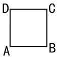

A．21种	B．22种	C．25种	D．27种

【答案】D

【解析】由题意，正方形的周长为8，抛掷三次骰子的点数之和为8或16，

①点数之和为8的情况有：；；；；，排列方法共有种；

②点数之和为16的情况有：；，排列方法共有种.

所以，抛掷三次骰子后棋子恰好又回到起点处的所有不同走法共有种.

故选：D.

**变式21．**（2024·海南海口·统考一模）形如45132这样的数称为“波浪数”，即十位上的数字，千位上的数字均比与它们各自相邻的数字大，则由1，2，3，4，5可组成数字不重复的五位“波浪数”的个数为

A．20	B．18	C．16	D．11

【答案】C

【解析】此“波浪数”中，十位数字，千位数字必有5、另一数是3或4；

是4时“波浪数”有；

另一数3时4、5必须相邻即45132；45231；13254；23154四种．

则由1，2，3，4，5可构成数字不重复的五位“波浪数”个数为16，

故选C．

<strong>变式22．</strong>（2024·全国·高三专题练习）工人在安装一个正六边形零件时，需要固定如图所示的六个位置的螺栓.若按一定顺序将每个螺栓固定紧，但不能连续固定相邻的2个螺栓.则不同的固定螺栓方式的种数是\_\_\_\_\_\_\_\_．

【答案】60

【解析】根据题意，第一个可以从6个钉里任意选一个，共有6种选择方法，并且是机会相等的，若第一个选1号钉的时候，第二个可以选3,4,5号钉，依次选下去，可以得到共有10种方法，所以总共有种方法，故答案是60.

**题型八：多面手问题**

**例22．**（2024·全国·高三专题练习）我校去年11月份，高二年级有10人参加了赴日本交流访问团，其中3人只会唱歌，2人只会跳舞，其余5人既能唱歌又能跳舞．现要从中选6人上台表演，3人唱歌，3人跳舞，有（   ）种不同的选法．

A．	B．	C．	D．

【答案】A

【解析】根据题意可按照只会跳舞的人中入选的人数分类处理．

第一类个只会跳舞的都不选，则从既能唱歌又能跳舞的5人中选择3人来跳舞，接着从剩余的5人中选择3人唱歌，故有种；

第二类个只会跳舞的有人入选，有种，再从从既能唱歌又能跳舞的5人中选择2人来跳舞，有种，再从剩余的6人中选择3人唱歌，有种，故有种；

第三类个只会跳舞的全入选，有种，再从从既能唱歌又能跳舞的5人中选择1人来跳舞，有种，再从剩余的7人中选择3人唱歌，有种，有种，

所以共有种不同的选法，

故选：A．

**例23．**（2024·全国·高三专题练习）某国际旅行社现有11名对外翻译人员，其中有5人只会英语，4人只会法语，2人既会英语又会法语，现从这11人中选出4人当英语翻译，4人当法语翻译，则共有（    ）种不同的选法

A．225	B．185	C．145	D．110

【答案】B

【解析】根据题意，按“2人既会英语又会法语”的参与情况分成三类．

①“2人既会英语又会法语”不参加，这时有种；

②“2人既会英语又会法语”中有一人入选，

这时又有该人参加英文或日文翻译两种可能，

因此有种；

③“2人既会英语又会法语”中两个均入选，

这时又分三种情况：两个都译英文、两个都译日文、两人各译一个语种，

因此有种．

综上分析，共可开出种．

故选：B．

**例24．**（2024·全国·高三专题练习）“赛龙舟”是端午节的习俗之一，也是端午节最重要的节日民俗活动之一，在我国南方普遍存在端午节临近，某单位龙舟队欲参加今年端午节龙舟赛，参加训练的8名队员中有3人只会划左桨，3人只会划右桨，2人既会划左桨又会划右桨．现要选派划左桨的3人、划右桨的3人共6人去参加比赛，则不同的选派方法共有（    ）

A．26种	B．30种	C．37种	D．42种

【答案】C

【解析】根据题意，设只会划左桨的3人，只会划右桨的3人，既会划左桨又会划右桨的2人，据此分3种情况讨论：

①从中选3人划左桨，划右桨的在（）中剩下的人中选取，有种选法，

②从中选2人划左桨，中选1人划左桨，划右桨的在（）中选取，有种选法，

③从中选1人划左桨，中2人划左桨，中3人划右桨，有种选法，

则有种不同的选法．

故选：C．

**变式23．**（2024·全国·高三专题练习）某龙舟队有9名队员，其中3人只会划左舷，4人只会划右舷，2人既会划左舷又会划右舷．现要选派划左舷的3人、右舷的3人共6人去参加比赛，则不同的选派方法共有（    ）

A．56种	B．68种

C．74种	D．92种

【答案】D

【解析】根据划左舷中有“多面手”人数的多少进行分类：划左舷中没有“多面手”的选派方法有 种，有一个“多面手”的选派方法有种，有两个“多面手”的选派方法有种，即共有(种)不同的选派方法．

故选：D

**题型九：错位排列**

**例25．**（2024·重庆沙坪坝·高二重庆八中校考期末）“数独九宫格”原创者是18世纪的瑞士数学家欧拉，它的游戏规则很简单，将1到9这九个自然数填到如图所示的小九宫格的9个空格里，每个空格填一个数，且9个空格的数字各不相间，若中间空格已填数字5，且只填第二行和第二列，并要求第二行从左至右及第二列从上至下所填的数字都是从大到小排列的，则不同的填法种数为（    ）

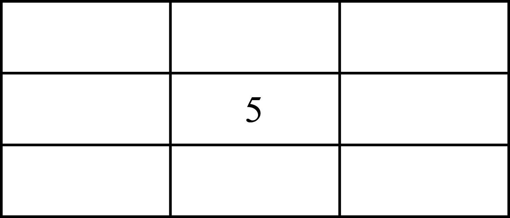

A．72	B．108	C．144	D．196

【答案】C

【解析】按题意5的上方和左边只能从1，2，3，4中选取，5的下方和右边只能从6，7，8，9中选取．因此填法总数为．

故选：C.

**例26．**（2024·全国·高三专题练习）编号为1、2、3、4、5的5个人分别去坐编号为1、2、3、4、5的五个座位，其中有且只有两个人的编号与座位号一致的坐法有（    ）

A．10种	B．20种	C．30种	D．60种

【答案】B

【解析】先选择两个编号与座位号一致的人，方法数有，

另外三个人编号与座位号不一致，方法数有，

所以不同的坐法有种.

故选：B

**例27．**（2024·全国·高三专题练习）将编号为、、、、、的小球放入编号为、、、、、的六个盒子中，每盒放一球，若有且只有两个盒子的编号与放入的小球的编号相同，则不同的放法种数为（    ）

A．	B．	C．	D．

【答案】B

【解析】根据题意，分以下两步进行：

（1）在个小球中任选个放入相同编号的盒子里，有种选法，假设选出的个小球的编号为、；

（2）剩下的个小球要放入与其编号不一致的盒子里，

对于编号为的小球，有个盒子可以放入，假设放入的是号盒子.

则对于编号为的小球，有个盒子可以放入，

对于编号为、的小球，只有种放法.

综上所述，由分步乘法计数原理可知，不同的放法种数为种.

故选：B.

**变式24．**（2024·广东广州·高二广州奥林匹克中学校考阶段练习）将编号为1､2､3､4､5､6的六个小球放入编号为1､2､3､4､5､6的六个盒子里，每个盒子放一个小球，若有且只有三个盒子的编号与放入的小球编号相同，则不同的方法总数是（    ）

A．20	B．40	C．120	D．240

【答案】B

【解析】第一步，先选取3个盒子，放入编号相同的3个球，方法数为，第二步剩下的3个盒子放入编号不同的小球，有2种方法，所以总方法数为．

故选：B．

**题型十：涂色问题**

<strong>例28．</strong>（2024·全国·高三专题练习）如图，一个地区分为5个行政区域，现给该地区的5个区域涂色，要求相邻区域不得使用同一种颜色，现有4种颜色可供选择，则不同的涂色方法共有_____种<em>.</em>

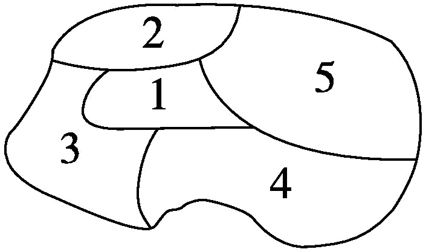

【答案】72

【解析】观察图形知，2区与4区不相邻，3区与5区不相邻，且不相邻的区域可用同1种颜色涂色，因此计算涂色方法可用3色和4色，

使用3种颜色，则2区与4区同色，3区与5区必同色，涂2区与4区有4种方法，

涂3区与5区有3种方法，涂1区有2种方法，则涂色方法有（种）；

使用4种颜色，选取同色的方案有2种，涂同色的两块有4种方法，涂另外3块依次有3，2，1种方法，

则涂色方法有（种），

所以不同的涂色方法共有（种）.

故答案为：72

<strong>例29．</strong>（2024·全国·高三专题练习）对正方体的6个面进行涂色，有5种不同的颜色可供选择.要求每个面只涂一种颜色，且有公共棱的两个面不同色，则总的涂色方法个数为___________（填写数字）

【答案】780

【解析】按上，前，右，后，下，左6个面的顺序涂色，

（1）前后同色时，

①上下同色有种涂色方法，

②上下不同色有种涂色方法；

（2）前后不同色时，

①上下同色有种涂色方法，

②上下不同色有种涂色方法.

总的涂色方法个数为

故答案为；780 .

<strong>例30．</strong>（2024·重庆·统考模拟预测）某城市休闲公园管理人员拟对一块圆环区域进行改造封闭式种植鲜花，该圆环区域被等分为5个部分，每个部分从红、黄、紫三种颜色的鲜花中选取一种进行栽植．要求相邻区域不能用同种颜色的鲜花，总的栽植方案有_________种．

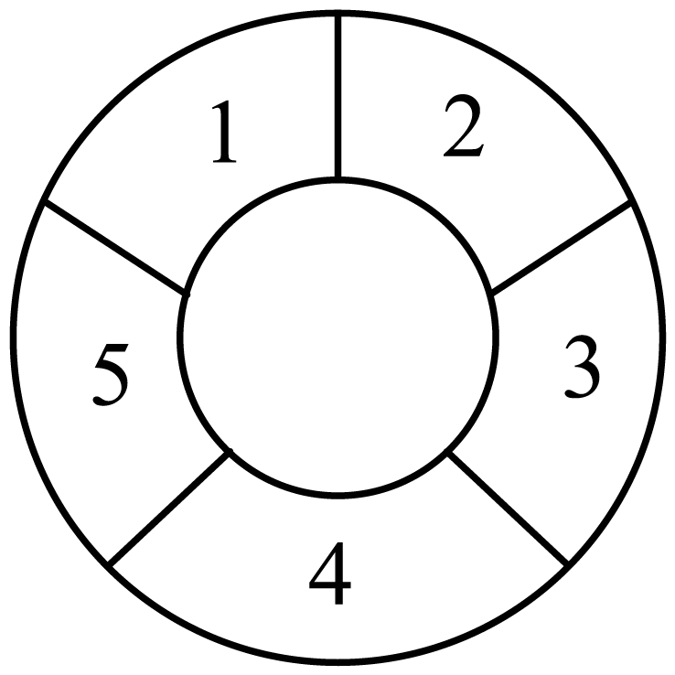

【答案】30

【解析】若只用两种颜色的鲜花，则1，3位置的颜色相同，2，4位置的颜色相同，

即可得1，4位置的颜色不同，则5位置无颜色可选，不合题意；

故必用3种颜色的鲜花，则1，2的栽植方案有种，已用两种颜色，第三种颜色可能在3，4，5，可得：

（i）若第三种颜色在3或5，有如下两种可能：

①3，5的颜色相同，则4的颜色有两种可能，栽植方案有种；

②3，5的颜色不相同，则4的颜色必和1的颜色相同，栽植方案有种；

栽植方案共有种；

（ⅱ）若第三种颜色在4，则3的颜色必和1的颜色相同，5的颜色必和2的颜色相同，栽植方案共有种；

综上所述：总的栽植方案有种.

故答案为：30.

<strong>变式25．</strong>（2024·安徽·校联考模拟预测）数学课上，老师出了一道智力游戏题.如图所示，平面直角坐标系中有一个3乘3方格图（小正方形边长为1），一共有十六个红色的格点，游戏规则是每一步可以改变其中一个点的颜色（只能由红变绿或绿变红），如将其中任何一个点由红色改成绿色，则这个点周围与之相邻的点也要从原来的颜色变成另外一种颜色，比如选择变成绿色，则与之相邻的，，，四个点也要变成绿色，那么最少需要______步，才能使得位于直线上的四个点变成绿色，而其他点都是红色.

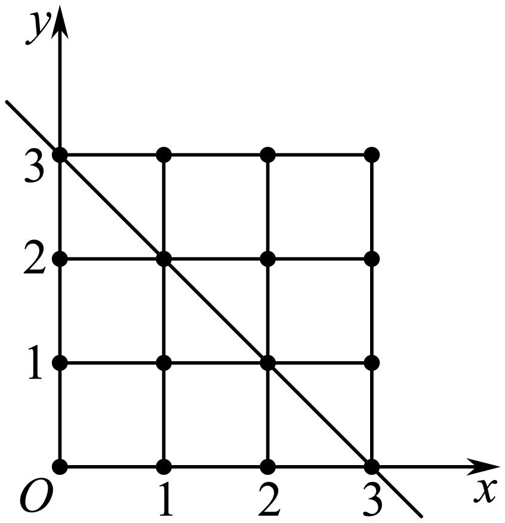

【答案】4

【解析】由题意可知，需要使，，，变成绿色，其他点都是红色，

第一步：变成绿色，则，也变成绿色；

第二步：变成绿色，则，变成红色，，变成绿色；

第三步：变成绿色，则，变成红色，，变成绿色；

第四步：变成绿色，则，变成红色.

故答案为：4.

<strong>变式26．</strong>（2024·全国·高三专题练习）如图，现要对某公园的4个区域进行绿化，有5种不同颜色的花卉可供选择，要求有公共边的两个区域不能用同一种颜色的花卉，共有________种不同的绿化方案（用数字作答）.

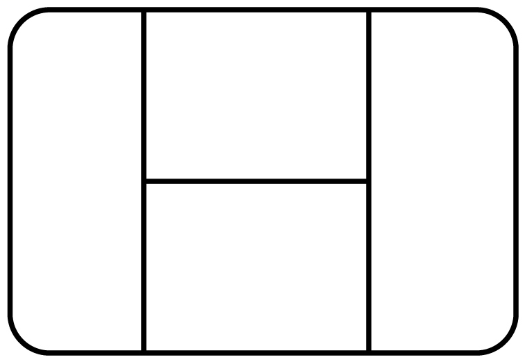

【答案】180

【解析】如图：

<table><tr><td rowspan="2">
<em>A</em>
</td><td>
<em>B</em>
</td><td rowspan="2">
<em>D</em>
</td></tr><tr><td>
<em>C</em>
</td></tr></table>

从*A*开始摆放花卉，*A*有5种颜色花卉摆放方法，

*B*有4种颜色花卉摆放方法，*C*有3种颜色花卉摆放方法；

由*D*区与*B*，*C*花卉颜色不一样，与*A*区花卉颜色可以同色也可以不同色，

则*D*有3种颜色花卉摆放方法.

故共有种涂色方法.

故答案为：180

<strong>变式27．</strong>（2024·全国·高三专题练习）七巧板是古代劳动人民智慧的结晶.如图是某同学用木板制作的七巧板，它包括5个等腰直角三角形､一个正方形和一个平行四边形.若用四种颜色给各板块涂色，要求正方形板块单独一色，其余板块两块一种颜色，而且有公共边的板块不同色，则不同的涂色方案有______种.

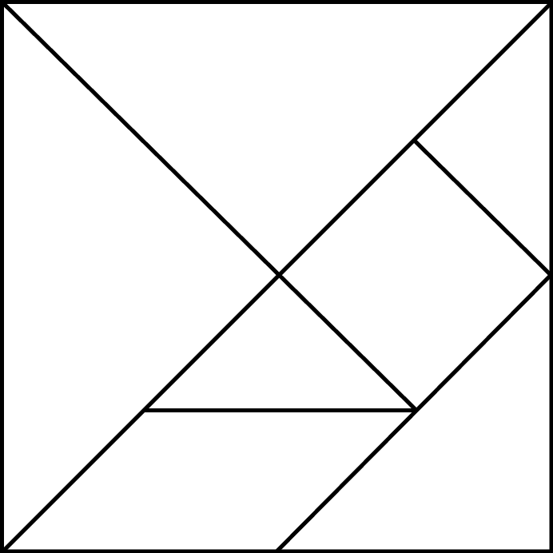

【答案】

【解析】由题意，一共4种颜色，板块需单独一色，剩下6个板块中每2个区域涂同一种颜色.

又板块两两有公共边不能同色，故板块必定涂不同颜色.

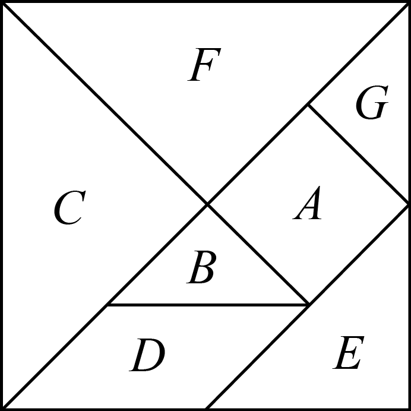

①当板块与板块同色时，则板块与板块或板块分别同色，共2种情况；

②当板块与板块同色时，则板块只能与同色，板块只能与同色，共1种情况.

又板块颜色可排列，故共种.

故答案为：

<strong>变式28．</strong>（2024·全国·高三专题练习）用四种不同的颜色为正六边形（如图）中的六块区域涂色，要求有公共边的区域涂不同颜色，一共有__________种不同的涂色方法．

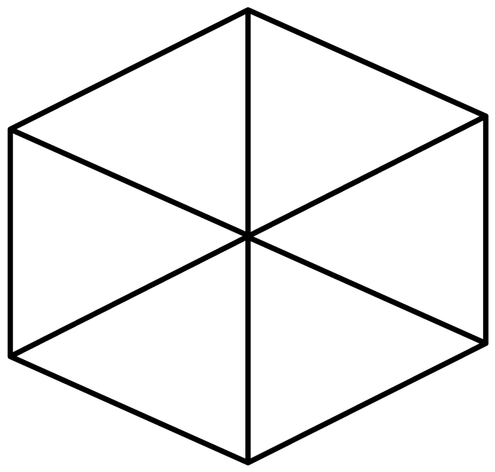

【答案】

【解析】如图，记六个区域的涂色数为，若涂色相同，则相当于5个区域涂色，记5个区域涂色数为，

同理只有4个区域时涂色数记为，易知，

．

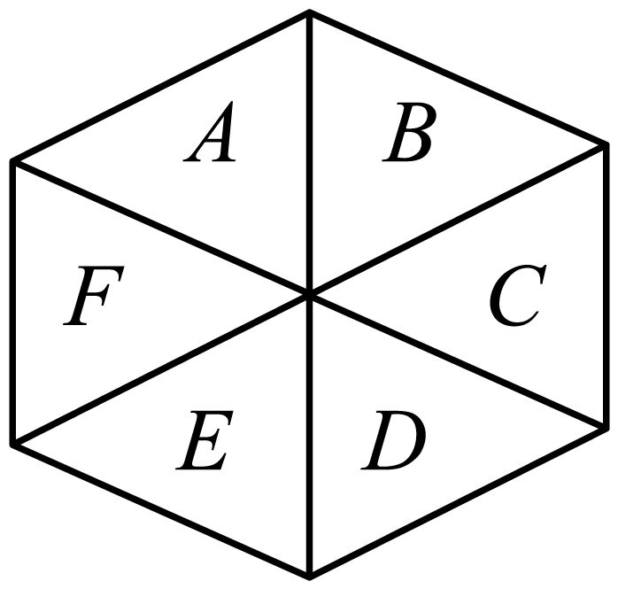

<strong>变式29．</strong>（2024·全国·高三专题练习）如图，用4种不同的颜色给图中的8个区域涂色，每种颜色至少使用一次，每个区域仅涂一种颜色，且相邻区域所涂颜色互不相同，则区域，，，和，，，分别各涂2种不同颜色的涂色方法共有_________种；区域，，，和，，，分别各涂4种不同颜色的涂色方法共有_________种.

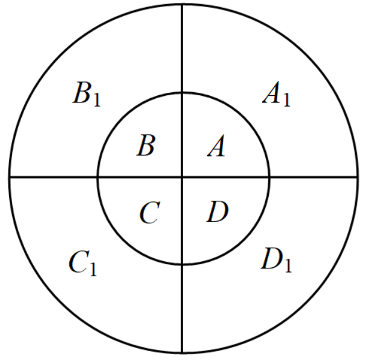

【答案】     24     216

【解析】，同色，所以先涂有：，再涂有种，所以共有：种.

先涂共有：种，设四种颜色为，假设涂的颜色分别为，则涂色情况如下：

，，，共9种，所以：种.

故答案为：24；216.

**题型十一：分组问题**

**例31．**（2024·全国·高三专题练习）贵阳一中体育节中，乒乓球球单打12强中有4个种子选手，将这12人平均分成3个组（每组4个人）、则4个种子选手恰好被分在同一组的分法有（    ）

A．21	B．42	C．35	D．70

【答案】C

【解析】4个种子选手分在同一组，即剩下的8人平均分成2组，方法有种，

故选:C*．*

**例32．**（2024·高二课时练习）把10个苹果分成三堆，要求每堆至少1个，至多5个，则不同的分法共有（　　）

A．4种	B．5种	C．6种	D．7种

【答案】A

【解析】分类：三堆中“最多”的一堆为5个，其他两堆总和为5，每堆最至少1个，只有2种分法．

三堆中“最多”的一堆为4个，其他两堆总和为6，每堆最至少1个，只有2种分法．

三堆中“最多”的一堆为3个，那是不可能的．

考点：本题主要考查分类计数原理的应用．

<strong>例33．</strong>（2024·福建泉州·高二校联考期中）在《爸爸去哪儿》第二季第四期中，村长给6位“萌娃”布置一项搜寻空投食物的任务．已知：①食物投掷地点有远、近两处；②由于<em>Grace</em>年纪尚小，所以要么不参与该项任务，但此时另需一位小孩在大本营陪同，要么参与搜寻近处投掷点的食物；③所有参与搜寻任务的小孩须被均分成两组，一组去远处，一组去近处，那么不同的搜寻方案有（    ）

A．25种	B．30种	C．40种	D．50种

【答案】C

【解析】就*Grace*的实际参与情况进行分类计数：

第一类，*Grace*不参与该项任务，则满足题意的不同搜寻方案有种：

第二类，*Grace*参与搜寻近处投掷点的食物，则满足题意的不同搜寻方案有种，

因此由加法计数原理得知，满足题意的不同搜寻方案有30+10=40(种)，

故选：C.

**变式30．**（2024·全国·高二专题练习）将12个不同的物体分成3组，每组4个，则不同的分法种数为（    ）.

A．34650	B．5940	C．495	D．5775

【答案】D

【解析】不同的分法种数为.

故选：D.

**变式31．**（2024·全国·高二专题练习）某中学要给三个班级补发8套教具，先将其分成3堆，其中一堆4套，另两堆每堆2套，则不同的分堆方法种数为（    ）

A．	B．	C．	D．

【答案】C

【解析】由条件可知，8套教具，分成4，2，2，共有种分法．

故选：C．

**变式32．**（2024·福建厦门·高三厦门双十中学校考阶段练习）将6名同学分成两个学习小组，每组至少两人，则不同的分组方法共有\_\_\_\_\_\_\_\_\_\_\_种.

【答案】25

【解析】由题知，6人分为两组共有两种分法：

（1）一组2人，一组4人：这种分法数为种；

（2）两组均为3人：这种分法数为种，

所以，由分类加法原理可得共有25种分法.

故答案为：25

**题型十二：分配问题**

**例34．**（2024·全国·高三专题练习）按下列要求分配6本不同的书.

（1）分成三份，1份1本，1份2本，1份3本，有___________种不同的分配方式；

（2）甲､乙､丙三人中，一人得1本，一人得2本，一人得3本，有___________种不同的分配方式；

（3）平均分成三份，每份2本，有___________种不同的分配方式；

（4）平均分配给甲､乙､丙三人，每人2本，有___________种不同的分配方式；

（5）分成三份，1份4本，另外两份每份1本，有___________种不同的分配方式；

（6）甲､乙､丙三人中，一人得4本，另外两人每人得1本，有___________种不同的分配方式；

（7）甲得1本，乙得1本，丙得4本，有___________种不同的分配方式.

【答案】     60     360     15     90     15     90     30

【解析】（1）先从6本书中选1本，有种分配方法，再从剩余5本书中选择2本，有种分配方法，剩余的是3本书，有种分配方法.所以总共有（种）分配方法.

（2）在（1）的结论下，将这三份书分给甲､乙､丙三人，有（种）分配方法.

（3）先从6本书中选2本，有种分配方法，再从剩余4本书中选择2本，有种分配方法，剩余的就是2本书，有种分配方法，所以共有种分配方法.但是，该过程有重复，设6本书分别为*A*，*B*，*C*，*D*，*E*，*F*，若三个步骤分别选出的是，，，则所有情况为，，，，，，则需去除重复的情况.

综上，不同的分配方式共有（种）.

（4）结合（3）可知，将这三份书分别分给甲､乙､丙三人，分配方法的种数为.

（5）先从6本书中选4本，有种分配方法，再从剩余的2本书中选1本，有种分配方法，最后还剩1本书，因为在最后2本书的选择中发生了重复，所以总共有（种）分配方法.

（6）结合（5）可知，将这三份书分别分给甲､乙､丙三人，则分配方法共有（种）.

（7）完成该事件，分三步，甲选1本，有种选法，乙从余下的5本书中选1本，有种选法，余下的4本书留给丙，有种选法.所以总共有（种）选法.

故答案为：60；360；15；90；15；90；30

<strong>例35．</strong>（2024·全国·高三专题练习）将9名大学生志愿者安排在星期五、星期六及星期日3天参加社区公益活动，每天分别安排3人，每人参加一次，则不同的安排方案共有________种．（用数字作答）

【答案】1680

【解析】先选出3人安排周五，有种选法，再从剩下的6人中选出3人安排在周六，有种选法，最后剩下的3人为一组安排在周日，有种选法．

可知不同的安排方案共有（种）．

故答案为：1680

<strong>例36．</strong>（2024·全国·高三专题练习）现计划安排<em>A</em>，<em>B</em>，<em>C</em>，<em>D</em>，<em>E</em>五名教师教这六门课程，每名教师至少教一门课程，每门课程只配一名教师，且教师<em>A</em>不教“围棋”，教师<em>B</em>只能教一门课程，则满足条件的课程安排的种数为______．

【答案】1140

【解析】当*A*只教1门时，先排*A*任教的科目，有种；

再从剩下5门中排*B*的任教科目，有种；

接下来剩余的4门中必有2门为同一名老师任教，分三组，然后全排列，共有种分法．

所以当*A*只教1门时，共有（种）排法．

当*A*教2门时，先选*A*任教的科目，有种，接下来剩余4科分别由*B*，*C*，*D*，*E*四名老师任教，有种．

所以当*A*教2门时，共有（种）排法．

综上，满足条件的课程安排的种数为．

故答案为：1140

<strong>变式33．</strong>（2024·四川泸州·高三四川省泸县第四中学校考开学考试）绵阳中学食堂，以其花样繁多的饭菜种类和令人难忘的色香味使大批学子醉倒在它的餐盘之下，学子们不约而同地将其命名为“远航大酒楼”．“远航大酒楼”共三层楼，5名高一新同学相约到食堂就餐，为看尽食堂所有美食种类，他们打算分为三组去往不同的楼层．其中甲同学不去二楼，则一共有______种不同的分配方式．

【答案】100

【解析】若甲1个人一组，其它两组人数为1、3或2、2，不同的分配方式有种；

若甲和另外1个人两人一组，其它两组人数为1、2，不同的分配方式有种；

若甲和另外2个人三人一组，其它两组人数为1、1，不同的分配方式有种；

共有种分配方式，

故答案为：100.

<strong>变式34．</strong>（2024·福建福州·高三福建省福州第一中学校考开学考试）为了贯彻落实中央新疆工作座谈会和全国对口支援新疆工作会议精神，促进边疆少数民族地区教育事业的发展，某市派出了包括甲、乙在内的5名专家型教师援疆，现将这5名教师分配到新疆的<em>A</em>、<em>B</em>、<em>C</em>、<em>D</em>四所学校，要求每所学校至少安排一位教师，则在甲志愿者被安排到<em>A</em>学校有______种安排方法．

【答案】60

【解析】将这5名教师分配到新疆的，，，共4所学校，每所学校至少1人，

则先分组后排列，5名教师分成四组，则为1，1，1，2.

若甲作为单独的一位被安排到学校，则有种情况；

若甲是一组两人中的一位且被安排到学校，则有种情况，

共有种情况.

故答案为：60.

<strong>变式35．</strong>（2024·重庆沙坪坝·高三重庆一中校考阶段练习）8个完全相同的球放入编号1，2，3的三个空盒中，要求放入后3个盒子不空且数量均不同，则有______种放法.

【答案】12

【解析】共两类分组方法：将8个完全相同的小球分为1，2，5三堆或1，3，4 三堆.

每类都将三堆不同个数的球放入编号1，2，3的三个空盒中，有种方法，

故共有种方法.

故答案为：12.

<strong>变式36．</strong>（2024·吉林长春·高三长春外国语学校校考开学考试）为了落实立德树人的根本任务，践行五育并举，某校开设三门德育校本课程，现有甲､乙､丙､丁四位同学参加校本课程的学习，每位同学仅报一门，每门至少有一位同学参加，则不同的报名方法有_____________.

【答案】36

【解析】根据题意，甲、乙、丙、丁四位同学选，，三门德育校本课程，

每位同学仅报一门，每门至少有一位同学参加，需要分三组，则三组人数为1、1、2，此时有种.

故答案为：．

**题型十三：隔板法**

**例37．**（2024·云南红河·统考三模）某校将个三好学生名额分配到高三年级的个班，每班至少个名额，则共有多少种不同的分配方案（    ）

A．15	B．20	C．10	D．30

【答案】C

【解析】采用“隔板法”，6个名额之间有5个空，隔2块板就可以分成3份，每份至少一个名额，故共有种方案.

故选：.

**例38．**（2024·全国·校联考模拟预测）学校决定把个参观航天博物馆的名额给三（1）､三（2）､三（3）､三（4）四个班级.要求每个班分别的名额不比班级序号少，即三（1）班至少个名额，三（2）班至少个名额，……，则分配方案有（    ）

A．种	B．种	C．种	D．种

【答案】B

【解析】根据题意，先在编号为､､的个班级中分别分配､､个名额，

编号为的班级里不分配；再将剩下的个名额分配个班级里，每个班级里至少一个，

由隔板法可得共种放法，即可得符合题目要求的方法共种.

故选：*B*.

**例39．**（2024·高二课时练习）现有9个相同的球要放到3个不同的盒子里，每个盒子至少一个球，各盒子中球的个数互不相同，则不同放法的种数是（    ）

A．28	B．24	C．18	D．16

【答案】C

【解析】把9个球分成3组，每组个数不相同，分法（按球的个数）为：126，135，234共三种，然后每组球放到3个盒子中有种方法，方法数为．

故选：C．

**变式37．**（2024·江苏苏州·高二吴县中学校考期中）学校有6个优秀学生名额，要求分配到高一、高二、高三，每个年级至少1个名额，则有（    ）种分配方案．

A．135	B．10	C．75	D．120

【答案】B

【解析】“学生名额”是相同元素，故相同元素分配分组问题，用“隔板法”，

故有，

故选：B.

**变式38．**（2024·全国·高二期末）方程的正整数解共有（    ）组

A．165	B．120	C．38	D．35

【答案】A

【解析】如图，将12个完全相同的球排成一列，

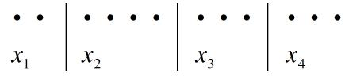

在它们之间形成的11个空隙中任选三个插入三块隔板，把球分成四组，每一种分法所得球的数目依次是、、、，显然满足，故是方程的一组解，

反之，方程的每一组解都对应着一种在12个球中插入隔板的方式，

故方程的正整数解的数目为：，

故选：A.

**题型十四：数字排列**

**例40．**（2024·全国·高三专题练习）用0，1，2，3，4可以组成没有重复数字的四位偶数的个数为（    ）

A．36	B．48	C．60	D．72

【答案】C

【解析】当个位数为0时，有个，

当个位数为2或4时，有个，

所以无重复数字的四位偶数有24+36=60个，

故选：C.

**例41．**（2024·全国·高二专题练习）用数字、、组成五位数，且数字、、至少都出现一次，这样的五位数共有（    ）个

A．	B．	C．	D．

【答案】B

【解析】首先考虑全部的情况，即每个数位均有种选择，共有个，

其中包含数字全部相同只有种情况，

还有只含有个数字的共有个，

因此，满足条件的五位数的个数为个.

故选：B.

**例42．**（2024·北京·高二北京八中校考期末）用三个数字组成一个四位数，要求每个数字至少出现一次，共可组成个不同的四位数\_\_\_\_\_\_\_\_\_\_（用数字作答）.

【答案】36

【解析】已知用三个数字组成一个四位数且每个数字至少出现一次，

所以包含一下三种形式：

①两个1，一个2，一个3；

②一个1，两个2，一个3；

③一个1，一个2，两个3.

其余情况①可以组成种情况.

同理情况②③均可以组成种情况.

因此一共可以组成个不同数字.

故答案为：

**变式39．**（2024·全国·高三专题练习）用数字0，1，2，3，4，5组成没有重复数字的四位数，其中个位､十位和百位上的数字之和为偶数的四位数共有\_\_\_\_\_\_\_\_\_\_\_.个（用数字作答）.

【答案】

【解析】当个位、十位和百位上的数字为3个偶数的有：种；

当个位、十位和百位上的数字为1个偶数2个奇数的有：种，

根据分类计数原理得到共有个．

故答案为：．

**变式40．**（2024·全国·高三专题练习）用数字1，2，3，4，5，6，7，8，9组成没有重复数字，且至多有一个数字是奇数的四位数，这样的四位数一共有\_\_\_\_\_\_\_\_\_\_\_个．（用数字作答）

【答案】504

【解析】当四个数字中没有奇数时，则这样的四位数有种，

当四个数字中有一个奇数时，则从5个奇数中选一个奇数，再从4个偶数中选3个数，然后对这4个数排列即可，所以有种，

所以由分类加法原理可得共有种，

故答案为：504

**题型十五：几何问题**

**例43．**（2024·全国·高三专题练习）从正方体的8个顶点中选取4个作为顶点，可得到四面体的个数为（    ）

A．	B．	C．	D．

【答案】A

【解析】从正方体的8个顶点中选取4个顶点有种，

正方体表面四点共面不能构成四面体有种，

正方体的六个对角面四点共面不能构成四面体有种，

所以可得到的四面体的个数为种，

故选：A

**例44．**（2024·高二课时练习）一只蚂蚁从正四面体的顶点出发，沿着正四面体的棱爬行，每秒爬一条棱，每次爬行的方向是随机的，则蚂蚁第1秒后到点，第4秒后又回到点的不同爬行路线有（    ）

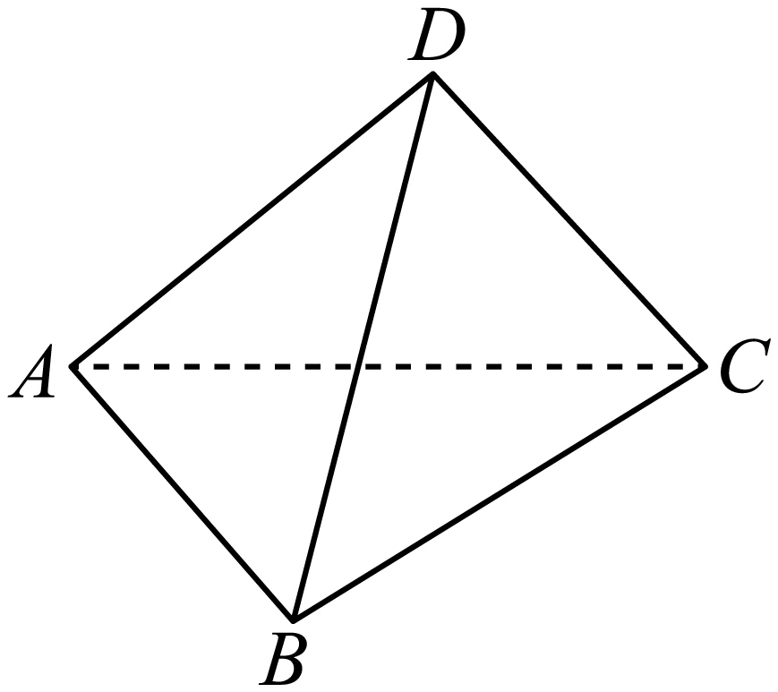

A．6条	B．7条	C．8条	D．9条

【答案】B

【解析】根据已知，可作出下图，由图知，不同的爬行路线有7条.

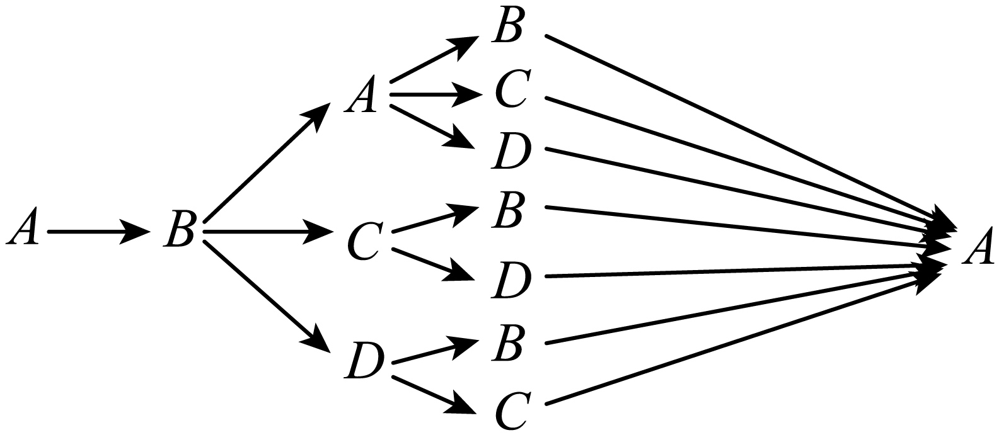

故选：B

**例45．**（2024·全国·高三专题练习）如图，一只蚂蚁从点出发沿着水平面的线条爬行到点，再由点沿着置于水平面的正方体的棱爬行至顶点，则它可以爬行的不同的最短路径有（   ）条

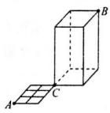

A．40	B．60	C．80	D．120

【答案】B

【解析】蚂蚁从到需要走五段路，其中三纵二竖，共有条路径，从到共有条路径，根据分步计数乘法原理可知，蚂蚁从到可以爬行的不同的最短路径有条，故选B.

考点：分步计数乘法原理.

**变式41．**（2024·全国·高二专题练习）凸八边形的对角线有（   ）条

A．20	B．28	C．48	D．56

【答案】A

【解析】凸八边形过每一个顶点有5条对角线，故共有条

故选：A

**变式42．**（2024·全国·高三专题练习）已知分子是一种由60个碳原子构成的分子，它形似足球，因此又名足球烯，是单纯由碳原子结合形成的稳定分子，它具有60个顶点和若干个面，.各个面的形状为正五边形或正六边形，结构如图.已知其中正六边形的面为20个，则正五边形的面为（    ）个.

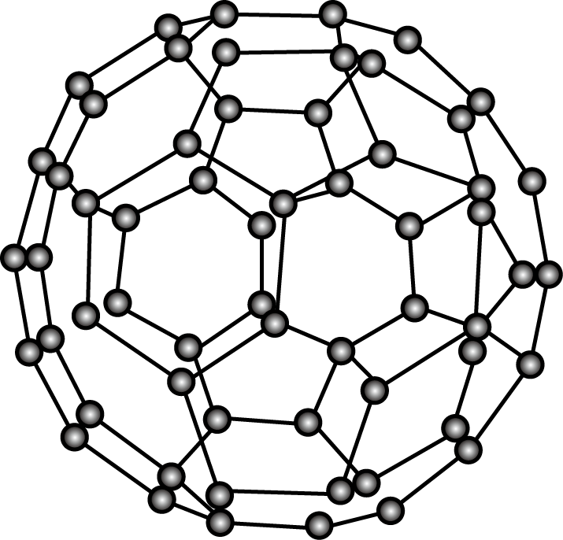

A．10	B．12

C．16	D．20

【答案】B

【解析】由结构图知：每个顶点同时在3个面内，

所以五边形面数为个，

故选*B*.

<strong>变式43．</strong>（2024·高二课时练习）设凸<em>n</em> (<em>n</em>≥3)棱锥中任意两个顶点的连线段的条数为<em>f</em>(<em>n</em>)，则<em>f</em>(<em>n</em>＋1)－<em>f</em>(<em>n</em>)＝(　　)

A．*n*－1	B．*n*

C．*n*＋1	D．*n*＋2

【答案】C

【解析】 ,故选C.

**题型十六：分解法模型与最短路径问题**

**例46．**（2024·全国·高三专题练习）有一种走“方格迷宫”游戏，游戏规则是每次水平或竖直走动一个方格，走过的方格不能重复，只要有一个方格不同即为不同走法．现有如图的方格迷宫，图中的实线不能穿过，则从入口走到出口共有多少种不同走法？

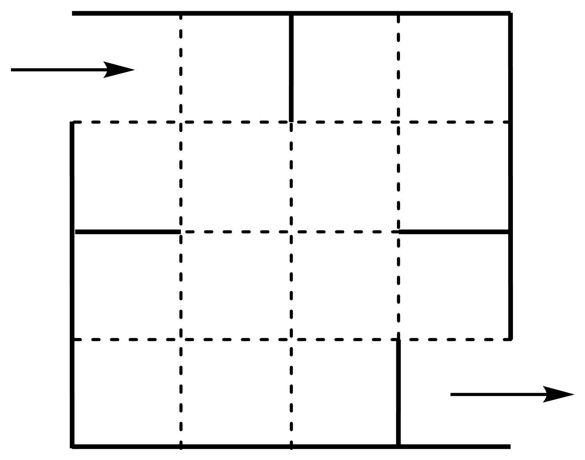

A．6	B．8	C．10	D．12

【答案】B

【解析】如图，①从入口﹣1﹣3﹣5﹣6﹣0﹣出口，

②从入口﹣1﹣3﹣4﹣6﹣0﹣出口，

③从入口﹣1﹣3﹣4﹣7﹣8﹣9﹣10﹣6﹣0﹣出口，

④从入口﹣1﹣3﹣4﹣9﹣10﹣6﹣0﹣出口，

⑤从入口﹣2﹣3﹣4﹣6﹣0﹣出口，

⑥从入口﹣2﹣3﹣5﹣6﹣0﹣出口，

⑦从入口﹣2﹣3﹣4﹣7﹣8﹣9﹣10﹣6﹣0﹣出口，

⑧从入口﹣2﹣3﹣4﹣9﹣10﹣6﹣0﹣出口，

共有8种，

故选：B．

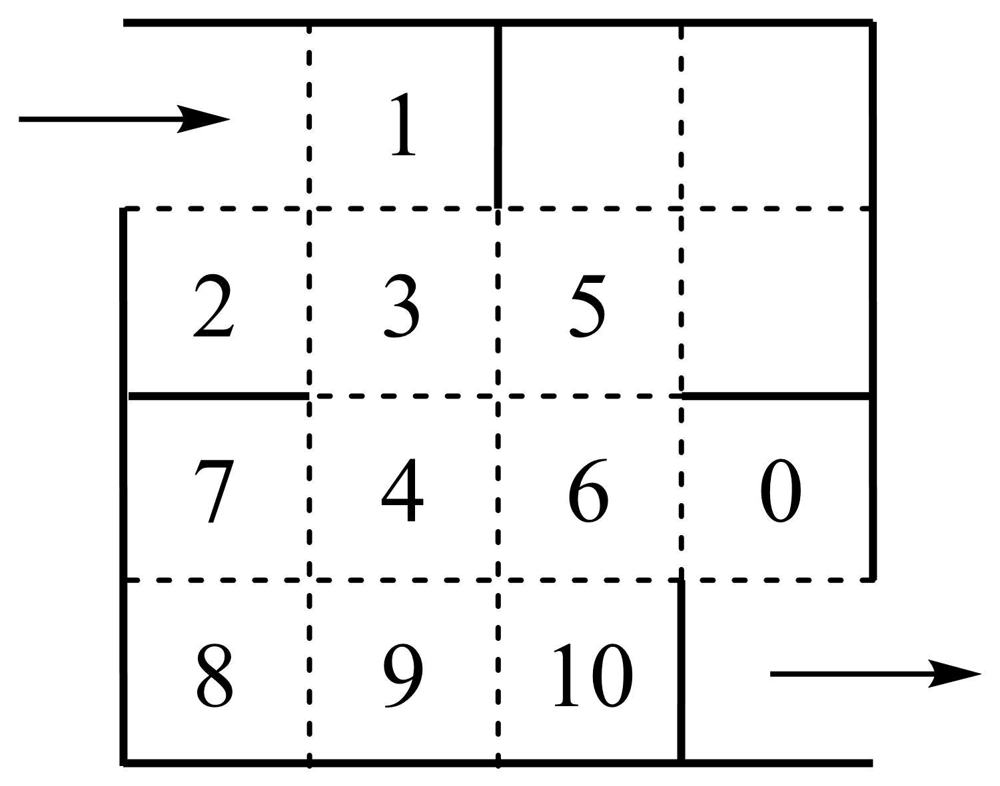

**例47．**（2024·全国·高三专题练习）夏老师从家到学校，可以选择走锦绣路、杨高路、张杨路或者浦东大道，由于夏老师不知道杨高路有一段在修路导致第一天上班就迟到了，所以夏老师决定以后要绕开那段维修的路，如图，假设夏老师家在处，学校在处，段正在修路要绕开，则夏老师从家到学校的最短路径有（    ）条．

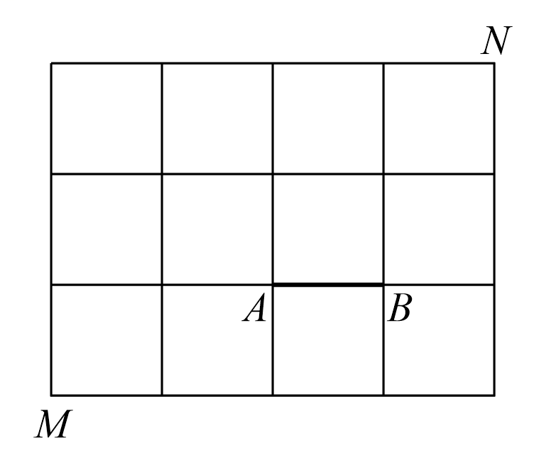

A．23	B．24	C．25	D．26

【答案】D

【解析】由到的最短路径需要向右走四段路，向上走三段路，所以有条路，

由到的最短路径需要向右走两段路，向上走一段路，所以有条路，

由到的最短路径需要向右走一段路，向上走两段路，所以有条路，

所以由到不经过的最短路径有.

故选：D.

<strong>例48．</strong>（2024·广东惠州·高三校考期末）如图，某城市的街区由12个全等的矩形组成（实线表示马路），<em>CD</em>段马路由于正在维修，暂时不通，则从<em>A</em>到<em>B</em>的最短路径有（    ）

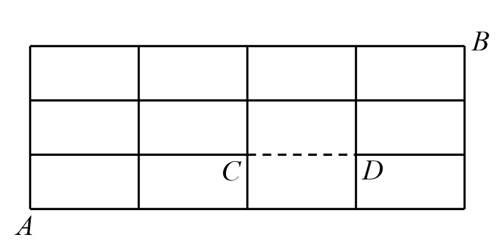

A．23 条	B．24 条	C．25条	D．26 条

【答案】D

【解析】先假设是实线，

则从到，向上次，向右次，最短路径有条，

其中经过的，即先从到，然后到，最后到的最短路径有条，

所以，当不通时，最短路径有条.

故选：D

**变式44．**（2024·全国·高三专题练习）方形是中国古代城市建筑最基本的形态，它体现的是中国文化中以纲常伦理为代表的社会生活规则，中国古代的建筑家善于使用木制品和竹制品制作各种方形建筑.如图，用大小相同的竹棍构造一个大正方体（由个大小相同的小正方体构成），若一只蚂蚁从点出发，沿着竹棍到达点，则蚂蚁选择的不同的最短路径共有（    ）

A．种	B．种

C．种	D．种

【答案】D

【解析】由题意可知，从到最少需要步完成，其中有步是横向的，步是纵向的，步是竖向的，

则蚂蚁选择的不同的最短路径共有种.

故选：D.

**变式45．**（2024·高二课时练习）一植物园的参观路径如图所示，若要全部参观并且路线不重复，则不同的参观路线共有（    ）

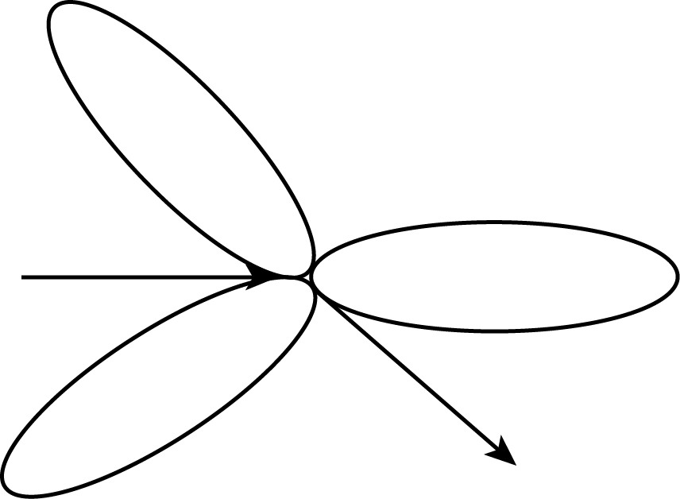

A．6种	B．8种

C．36种	D．48种

【答案】D

【解析】如图所示，由题意知在*A*点可先参观区域1，也可先参观区域2或3，选定一个区域后可以按逆时针参观，也可以按顺时针参观，所以第一步可以从6个路口任选一个，有6种结果，参观完第一个区域后，选择下一步走法，有4种结果，参观完第二个区域，只剩下最后一个区域，有2种走法，根据分步乘法计数原理，共有6×4×2＝48(种)不同的参观路线．

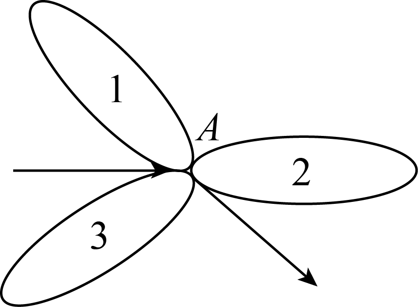

故选：D

**变式46．**（2024·广东惠州·高二校考期中）下图是某项工程的网络图(单位:天)，则从开始节点①到终止节点⑧的路径共有（ ）

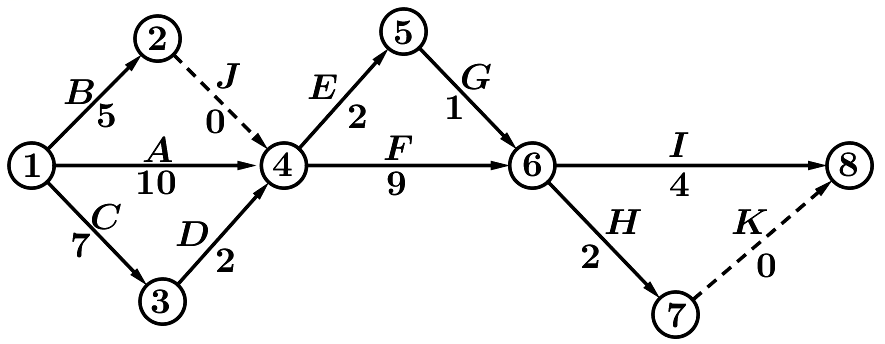

A．14条	B．12条	C．9条	D．7条

【答案】B

【解析】由图可知，由①④有3条路径，由④⑥有2条路径，由⑥⑧有2条路径，根据分步乘法计算原理可得从①⑧共有条路径.

故选：B

<strong>变式47．（多选题）（2024·全国·高三专题练习）</strong>如图，在某城市中，<em>M</em>，<em>N</em>两地之间有整齐的方格形道路网，其中是道路网中位于一条对角线上的5个交汇处，今在道路网<em>M</em>，<em>N</em>处的甲、乙两人分别要到<em>N</em>，<em>M</em>处，他们分别随机地选择一条沿街的最短路径，以相同的速度同时出发，直到到达<em>N</em>，<em>M</em>处为止，则（    ）

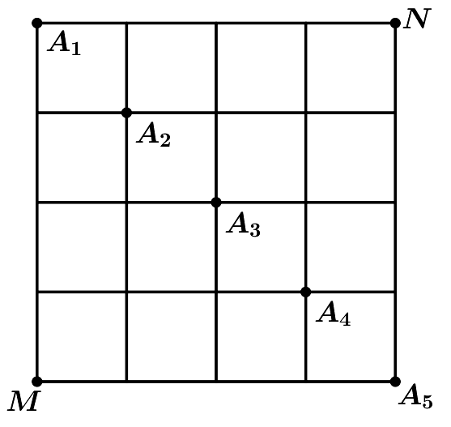

A．甲从*M*到达*N*处的走法有70种

B．甲从*M*必须经过到达*N*处的走法有12种

C．若甲、乙两人途中在处相遇，则共有144种走法

D．若甲、乙两人在行走途中会相遇，则共有1810种走法

【答案】AD

【解析】甲由道路网*M*处出发，随机地选择一条沿街的最短路径到达*N*处需走8步，共有种走法，故A正确；

甲由道路网*M*处出发，随机地选择一条沿街的最短路径到达处需走4步，有种走法，

从处沿街的最短路径到达*N*处需走4步，有种走法，所以共有种走法，故B错误；

由B可知，甲从*M*必须经过到达*N*处的走法有36种，同理乙从*N*必须经过到达*M*处的走法也有36种，

则甲、乙两人在处相遇，共有种走法，故C错误；

甲、乙两人沿最短路径行走，只可能在处相遇，他们在处相遇的走法有种，

则，故D正确．

故选：AD．

**变式48．**（2024·高二课时练习） 5400的正约数有\_\_\_\_\_\_个

【答案】48

【解析】由，所以5400的正约数一定是由2的幂与3的幂和5的幂相乘的结果，

设正约数为，其中取值为0，1，2，3共有4种；取值为0，1，2，3共有4种；取值为0，1，2共有3种；

所以正约数个数为．

故答案为：48

**变式49．**（2024·上海嘉定·高二校考期中）正整数2022有\_\_\_\_\_\_个不同的正约数．

【答案】

【解析】因为，

故所有的正约数有：个.

故答案为：.

**题型十七：排队问题**

**例49．**（2024·全国·高三专题练习）街头篮球比赛后，红、黄两队共名队员（红队人，黄队人）合照，要求人站成一排，红队人中有且只有名队员相邻，则不同排队的方法共有（    ）

A．种	B．种	C．种	D．种

【答案】A

【解析】由题意，分三步进行分析：

①将名红队队员分成组，有种分组方法，将人的一组看成一个元素，考虑人之间的顺序，有种情况；

②将黄队的人全排列，有种排法，排好后，有个空位；

③在个空位中任选个，安排名红队队员分成的两个组，有种方法，

则人站成一排照相，名红队队员中有且只有两人相邻的站法有种，

故选：A.

**例50．**（2024·全国·高三专题练习）七辆汽车排成一纵队，要求甲车、乙车、丙车均不排队头或队尾且各不相邻，则排法有（    ）

A．48种	B．72种	C．90种	D．144种

【答案】D

【解析】由题意得，甲车，乙车、丙车均不排队头或队尾，且各不相邻，所以甲、乙、丙只能在第二位、第四位、第六位，共有种排法，其他车辆任意排列，所以总排法有种．

故选：D*．*

**例51．**（2024·山西朔州·高二校考阶段练习）名成人带两个小孩排队上山，小孩不排在一起也不排在头尾，则不同的排法种数有（   ）

A．种	B．种	C．种	D．种

【答案】A

【解析】首先5名大人先排队，共有种，然后把两个小孩插进中间的4个空中，共有种排法，根据乘法原理，共有种，故选A.

**变式50．**（2024·全国·高二专题练习）3名男生，4名女生，按照不同的要求排队，求不同的排队方法数．

(1)选5名同学排成一排；

(2)全体站成一排，甲、乙不在两端；

(3)全体站成一排，甲不在最左端，乙不在最右端；

(4)全体站成一排，男生站在一起、女生站在一起；

(5)全体站成一排，男生排在一起；

(6)全体站成一排，男生彼此不相邻；

(7)全体站成一排，男生各不相邻、女生各不相邻；

(8)全体站成一排，甲、乙中间有2个人；

(9)排成前后两排，前排3人，后排4人；

(10)全体站成一排，乙不能站在甲左边，丙不能站在乙左边．

【解析】（1）无条件的排列问题，排法有种；

（2）先安排甲乙在中间有 种，再安排余下的5人有 种，共有排法有种；

（3）排法有种，其中是甲在左端或乙在右端的排法，是甲在左端且乙在右端的排法；

（4）把男生看成一个整体共有 种，再把女生看成一个整体有 种，再把这两个整体全排列，共有种排法；

（5）即把所有男生视为一个整体，与4名女生组成五个元素全排列，共有种排法；

（6）即不相邻问题（插空法）：先排女生共种排法，男生在五个空中安插，有种排法，故共有种排法；

（7）对比（6），让女生插空，共有种排法；

（8）（捆绑法）任取2人与甲、乙组成一个整体，与余下3个元素全排列，故共有种排法；

（9）分步完成共有种排法；

（10）由于乙不能站在甲左边，丙不能站在乙左边，故3人只能按甲、乙、丙这一种顺序排列，

7人的全排列共有种，甲、乙、丙3人全排列有种，而3人按甲、乙、丙顺序排列是全排列中的一种，所以共有种排法.

**题型十八：构造法模型和递推模型**

**例52．**（2024·天津河东·高二统考期末）九连环是一种流传于我国民间的传统智力玩具.它用九个圆环相连成串，以解开为胜.它在中国有近两千年的历史，《红楼梦》中有林黛玉巧解九连环的记载.周邦彦也留下关于九连环的名句“纵妙手、能解连环.”九连环有多种玩法，在某种玩法中:已知解下1个圆环最少需要移动圆环1次，解下2个圆环最少需要移动圆环 2 次，记 为解下个圆环需要移动圆环的最少次数，且，则解下 8 个圆环所需要移动圆环的最 少次数为（    ）

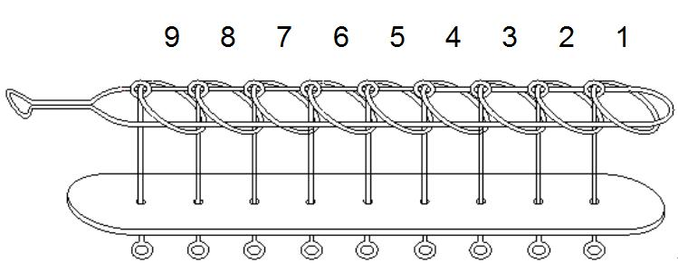

A．30	B．90	C．170	D．341

【答案】C

【解析】由题，，所以.

故选.：C

**例53．**（2024·福建福州·高三统考期中）三名篮球运动员甲、乙、丙进行传球训练，由丙开始传，经过次传递后，球又被传回给丙，则不同的传球方式共有（    ）

A．4种	B．10种

C．12种	D．22种

【答案】B

【解析】根据题意，设在第次传球后（），有种情况球在丙手中，

即经过次传递后，球又被传回给丙，而前次传球中，每次传球都有种方法，

则前次传球的不同的传球方法共有种，

那么在第次传球后，球不在丙手中的情况有种情况，即球在乙或甲手中，只有在这些情况时，在第次传球后，球才会被传回丙，即；

易得，则，，.

故选：B．

**例54．（多选题）（2024·河北沧州·高二沧县中学校考阶段练习）** 跳格游戏：如图，人从格子外只能进入第1个格子，在格子中每次可向前跳1格或2格，那么下面说法正确的是（    ）

A．进入第二个格子走法有2种

B．进入第二个格子走法有1种

C．进入第三个格子走法有2种

D．进入第八个格子走法有21种

【答案】BCD

【解析】设跳到第格的方法有，则达到第格的方法有两类，

第一种方法是从第个格子向右跳一格到达第格，方法数为，

第二种方法是从第向右跳两格到达第格，方法数是，则，

结合条件及数列的递推关系可得到数列的前8项分别是,

A错误，BCD正确.

故选：.

**变式51．**（2024·福建泉州·高二福建省永春第一中学校考阶段练习）马路上有编号为1，2，3，4，5，6，7，8，9的九盏路灯，现要关掉其中的3盏，但不能关掉相邻的2盏，也不能关掉两端的2盏，满足条件的关灯方法有\_\_\_\_\_\_种.

【答案】10

【解析】根据题意，因为关掉3盏路灯不能是两端2盏，也不能相邻，

则需要用插空法分析：

先将亮的6盏灯排成一列，除去2端，有5个符合条件的空位，

在5个空位中，任选3个，安排熄灭的灯，有种情况，

即有10种关灯方法.

故答案为：10．

**变式52．**（2024·浙江·高三竞赛）马路上有编号为1，2，，2011的2011只路灯.为节约用电，要求关闭其中的300只灯，但不能同时关闭相邻两只，也不能关闭两端的路灯.则满足条件的关灯方法共有\_\_\_\_\_\_.（用组合数符合表示）.

【答案】

【解析】问题等价于在1711只路灯中插入300只暗灯.所以，共有种关灯方法.

故答案为

**题型十九：环排问题**

**例55．**（2024·全国·高三专题练习）21个人按照以下规则表演节目：他们围坐成一圈，按顺序从1到3循环报数，报数字“3”的人出来表演节目，并且表演过的人不再参加报数．那么在仅剩两个人没有表演过节目的时候，共报数的次数为（     ）

A．19	B．38	C．51	D．57

【答案】D

【解析】当倒数第个人出来表演节目时，一共报数了次.

故选：D

<strong>例56．</strong>（2024·全国·高三专题练习）<em>A，B，C，D，E，F</em>六人围坐在一张圆桌周围开会，<em>A</em>是会议的中心发言人，必须坐最北面的椅子，<em>B，C</em>二人必须坐相邻的两把椅子，其余三人坐剩余的三把椅子，则不同的座次有（   ）

A．60种	B．48种	C．30种	D．24种

【答案】B

【解析】首先，*A*是会议的中心发言人，必须坐最北面的椅子，

考虑*B、C*两人的情况，只能选择相邻的两个座位，位置可以互换，

根据排列数的计算公式，得到，，接下来，考虑其余三人的情况，

其余位置可以互换，可得种，最后根据分步计数原理，得到种，

故选B.

**例57．**（2024·江苏苏州·高二昆山震川高级中学校考期中）现有8个人围成一圈玩游戏，其中甲、乙、丙三人不全相邻的排法种数为（    ）

A．	B．	C．	D．

【答案】D

【解析】8个人围成一圈,有种.

其中甲、乙、丙三人相邻，看做一个整体，由.

所以甲、乙、丙三人不全相邻的排法种数为.

故答案为：D

**变式53．**（2024·内蒙古赤峰·高二赤峰二中校考阶段练习）如图，某伞厂生产的太阳伞的伞篷是由太阳光的七种颜色组成，七种颜色分别涂在伞篷的八个区域内，且恰有一种颜色涂在相对区域内，则不同颜色图案的此类太阳伞最多有（    ）.

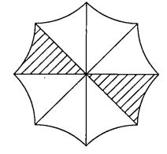

A．40320种	B．5040种	C．20160种	D．2520种

【答案】D

【解析】先从7种颜色中任意选择一种，涂在相对的区域内，有种方法，

再将剩余的6种颜色全部涂在剩余的6个区域内，共有种方法，

由于图形是轴对称图形，所以上述方法正好重复一次，

所以不同的涂色方法，共有种不同的涂法.

故选：D.

**变式54．**（2024·全国·高三专题练习）5个女孩与6个男孩围成一圈，任意2个女孩中间至少站1个男孩，则不同排法有\_\_\_\_\_\_种（填数字）．

【答案】86400

【解析】因为任意2个女孩中间至少站1个男孩，则有且仅有2个男孩站在一起，

先把5个女孩排成一个圈，这是个圆形排列，因此排法共有(种)，

把6个男孩按2，1，1，1，1分成5组有种分法，

最后把5组男孩放入5个女孩构成圆排列的5个间隔中有种方法，而站在一起的两个男孩有顺序性，有2种站法，

所以，由分步乘法计数原理得，不同的排法共有(种).

故答案为：86400

