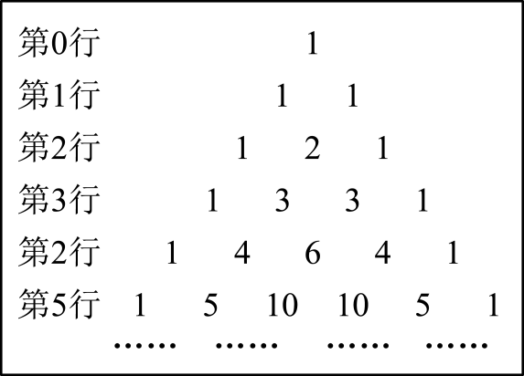
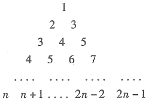

**第87讲  二项式定理**

**知识梳理**

**知识点**1**、二项式展开式的特定项、特定项的系数问题**

**（** 1**）二项式定理**

一般地，对于任意正整数，都有：，

这个公式所表示的定理叫做二项式定理，等号右边的多项式叫做的二项展开式．

式中的做二项展开式的通项，用表示，即通项为展开式的第项：，

其中的系数（*r*=0，1，2，…，*n*）叫做二项式系数，

**（** 2**）二项式的展开式的特点：**

①项数：共有项，比二项式的次数大1；

②二项式系数：第项的二项式系数为，最大二项式系数项居中；

③次数：各项的次数都等于二项式的幂指数．字母降幂排列，次数由到；字母升幂排列，次

数从到，每一项中，，次数和均为；

④项的系数：二项式系数依次是，项的系数是与的系数（包括二项式系

数）．

**（** 3**）两个常用的二项展开式：**

①（）

②

**（** 4**）二项展开式的通项公式**

二项展开式的通项：

公式特点：①它表示二项展开式的第项，该项的二项式系数是；

②字母的次数和组合数的上标相同；

③与的次数之和为．

<strong>注意：</strong>①二项式的二项展开式的第<em>r</em>+1项和的二项展开式的第<em>r</em>+1项是有区别的，应用二项式定理时，其中的和是不能随便交换位置的．

②通项是针对在这个标准形式下而言的，如的二项展开式的通项是（只需把看成代入二项式定理）．

2**、二项式展开式中的最值问题**

**（** 1**）二项式系数的性质**

①每一行两端都是，即；其余每个数都等于它“肩上”两个数的和，即．

②对称性每一行中，与首末两端“等距离”的两个二项式系数相等，即．

③二项式系数和令，则二项式系数的和为，变形式．

④奇数项的二项式系数和等于偶数项的二项式系数和在二项式定理中，令，

则，

从而得到：．

⑤最大值：

如果二项式的幂指数是偶数，则中间一项的二项式系数最大；

如果二项式的幂指数是奇数，则中间两项，的二项式系数，相等且最大．

**（** 2**）系数的最大项**

求展开式中最大的项，一般采用待定系数法．设展开式中各项系数分别为，设第项系数最大，应有，从而解出来．

**知识点**3**、二项式展开式中系数和有关问题**

**常用赋值举例：**

（1）设，

二项式定理是一个恒等式，即对，的一切值都成立，我们可以根据具体问题的需要灵活选取，的值．

①令，可得：

②令，可得：，即：

（假设为偶数），再结合①可得：

．

（2）若，则

①常数项：令，得．

②各项系数和：令，得．

③奇数项的系数和与偶数项的系数和

（*i*）当为偶数时，奇数项的系数和为；

偶数项的系数和为．

（可简记为：为偶数，奇数项的系数和用“中点公式”，奇偶交错搭配）

（*ii*）当为奇数时，奇数项的系数和为；

偶数项的系数和为．

（可简记为：为奇数，偶数项的系数和用“中点公式”，奇偶交错搭配）

若，同理可得．

**注意：** 常见的赋值为令，或，然后通过加减运算即可得到相应的结果．

**必考题型全归纳**

**题型一：求二项展开式中的参数**

**例1．**（2024·河南郑州·统考模拟预测）的展开式中的常数项与展开式中的常数项相等，则的值为（    ）

A．	B．	C．2	D．3

<strong>例2．</strong>（2024·四川成都·成都实外校考模拟预测）已知的展开式中存在常数项，则<em>n</em>的可能取值为（    ）

A．4	B．5	C．6	D．8

<strong>例3．</strong>（2024·全国·高三专题练习）展开式中的常数项为－160，则<em>a</em>＝（    ）

A．－1	B．1	C．±1	D．2

**变式1．**（2024·全国·高三专题练习）已知的展开式中的常数项为，则实数（    ）

A．2	B．-2	C．8	D．-8

**变式2．**（2024·全国·高三专题练习）已知的展开式中第3项是常数项，则（    ）

A．6	B．5	C．4	D．3

**【解题方法总结】**

在形如的展开式中求的系数，关键是利用通项求，则．

**题型二：求二项展开式中的常数项**

**例4．**（2024·重庆南岸·高三重庆第二外国语学校校考阶段练习）已知，二项式的展开式中所有项的系数和为64，则展开式中的常数项为（    ）

A．36	B．30	C．15	D．10

**例5．**（2024·山西朔州·高三怀仁市第一中学校校考阶段练习）二项式的展开式中的常数项为（    ）

A．1792	B．－1792	C．1120	D．－1120

**例6．**（2024·北京房山·高三统考开学考试）的展开式中的常数项是（    ）

A．	B．	C．	D．

**变式3．**（2024·贵州贵阳·高三贵阳一中校考开学考试）的展开式中的常数项为（    ）

A．20	B．20	C．－10	D．10

**变式4．**（2024·全国·高三专题练习）若的展开式中存在常数项，则（    ）

A．	B．	C．	D．

<strong>变式5．</strong>（2024·全国·高三对口高考）若展开式中含有常数项，则<em>n</em>的最小值是（    ）

A．2	B．3	C．12	D．10

**【解题方法总结】**

写出通项，令指数为零，确定，代入．

**题型三：求二项展开式中的有理项**

**例7．**（2024·全国·高三专题练习）在的展开式中，有理项的系数为（    ）

A．	B．	C．5	D．10

**例8．**（2024·全国·高考真题）二项式的展开式中系数为有理数的项共有（    ）

A．6项	B．7项	C．8项	D．9项

**例9．**（2024·江西南昌·高三统考阶段练习）的展开式中所有有理项的系数和为（    ）

A．85	B．29	C．	D．

**变式6．**（2024·四川泸州·高三四川省泸县第四中学校考阶段练习）二项式展开式中，有理项共有（    ）项．

A．3	B．4	C．5	D．7

**变式7．**（2024·安徽宣城·高三统考期末）在二项式的展开式中，有理项共有（    ）

A．项	B．项	C．项	D．项

**变式8．**（2024·全国·高三专题练习）若的展开式中有且仅有三个有理项，则正整数的取值为（    ）

A．	B．或	C．或	D．

**【解题方法总结】**

先写出通项，再根据数的整除性确定有理项．

**题型四：求二项展开式中的特定项系数**

**例10．**（2024·四川成都·校联考模拟预测）已知的展开式中第4项与第5项的二项式系数相等，则展开式中的项的系数为（    ）

A．―4	B．84	C．―280	D．560

**例11．**（2024·海南海口·海南华侨中学校考模拟预测）展开式中的系数为（    ）

A．270	B．240	C．210	D．180

**例12．**（2024·广东揭阳·高三校考阶段练习）的展开式中的系数是（    ）

A．20	B．	C．10	D．

**变式9．**（2024·河北邢台·高三邢台市第二中学校考阶段练习）已知的展开式中各项的二项式系数之和为64，则其展开式中的系数为（    ）

A．	B．240	C．	D．160

**变式10．**（2024·全国·高三专题练习）在二项式的展开式中，含的项的二项式系数为（    ）

A．28	B．56	C．70	D．112

**变式11．**（2024·北京·高三专题练习）在二项式的展开式中，含项的二项式系数为（    ）

A．5	B．	C．10	D．

**【解题方法总结】**

写出通项，确定*r*，代入．

**题型五：求三项展开式中的指定项**

<strong>例13．</strong>（2024·全国·高三专题练习）在的展开式中，的系数为______.

<strong>例14．</strong>（2024·山东·高三沂源县第一中学校联考开学考试）展开式中含项的系数为______________．

<strong>例15．</strong>（2024·辽宁·大连二十四中校联考模拟预测）的展开式中的系数为______（用数字作答）．

<strong>变式12．</strong>（2024·福建三明·高三统考期末）展开式中常数项是______.（答案用数字作答）

<strong>变式13．</strong>（2024·江苏·金陵中学校联考三模）展开式中的常数项为______.

<strong>变式14．</strong>（2024·湖南岳阳·统考模拟预测）的展开式中，的系数为______．

<strong>变式15．</strong>（2024·广东汕头·统考三模）展开式中的系数是_________.

**【解题方法总结】**

三项式的展开式：

若令，便得到三项式展开式通项公式：

，

其中叫三项式系数．

**题型六：求几个二（多）项式的和（积）的展开式中条件项系数**

<strong>例16．</strong>（2024·广西百色·高三贵港市高级中学校联考阶段练习）的展开式中的系数为________．

<strong>例17．</strong>（2024·河北保定·高三校联考开学考试）在的展开式中含项的系数是__________.

<strong>例18．</strong>（2024·江西南昌·高三统考开学考试）展开式中的系数是________.

<strong>变式16．</strong>（2024·江苏苏州·高三统考开学考试）的展开式常数项是______.（用数字作答）

<strong>变式17．</strong>（2024·浙江杭州·高三浙江省杭州第二中学校考阶段练习）已知多项式，则___________.

<strong>变式18．</strong>（2024·陕西商洛·镇安中学校考模拟预测）的展开式中含项的系数为________．（用数字作答）

<strong>变式19．</strong>（2024·河北唐山·高三开滦第二中学校考阶段练习）设展开式中的常数项为，则实数的值为______.

<strong>变式20．</strong>（2024·安徽亳州·安徽省亳州市第一中学校考模拟预测）展开式中的系数为__________.

**【解题方法总结】**

分配系数法

**题型七：求二项式系数最值**

<strong>例19．</strong>（2024·山东青岛·统考三模）若展开式的所有项的二项式系数和为256，则展开式中系数最大的项的二项式系数为______．（用数字作答）

<strong>例20．</strong>（2024·全国·高三专题练习）二项式的展开式中，只有第6项的二项式系数最大，则含的项是_____________．

<strong>例21．</strong>（2024·人大附中校考三模）已知二项式的展开式中只有第4项的二项式系数最大，且展开式中项的系数为20，则实数的值为__________.

<strong>变式21．</strong>（2024·浙江绍兴·统考模拟预测）二项式的展开式中当且仅当第4项的二项式系数最大，则________，展开式中含的项的系数为________．

<strong>变式22．</strong>（2024·陕西西安·西安中学校考模拟预测）已知的展开式中第4项与第8项的二项式系数相等，则展开式中二项式系数最大的项为___________.

<strong>变式23．</strong>（2024·湖北·校联考模拟预测）在的二项展开式中，只有第5项的二项式系数最大，则该二项展开式中的常数项等于________．

**【解题方法总结】**

利用二项式系数性质中的最大值求解即可．

**题型八：求项的系数最值**

<strong>例22．</strong>（2024·海南海口·海南华侨中学校考一模）在的展开式中，系数最大的项为____________.

<strong>例23．</strong>（2024·江西吉安·江西省万安中学校考一模）已知的展开式中，末三项的二项式系数的和等于121，则展开式中系数最大的项为______.（不用计算，写出表达式即可）

<strong>例24．</strong>（2024·广西南宁·南宁三中校考模拟预测）的二项式展开中，系数最大的项为______．

<strong>变式24．</strong>（2024·全国·高三专题练习）已知的展开式中各项系数之和为64，则该展开式中系数最大的项为___________．

<strong>变式25．</strong>（2024·全国·高三专题练习）若<em>n</em>展开式中前三项的系数和为163，则展开式中系数最大的项为_______．

<strong>变式26．</strong>（2024·全国·高三专题练习）展开式中只有第6项系数最大，则其常数项为______.

<strong>变式27．</strong>（2024·安徽蚌埠·高三统考开学考试）若二项式展开式中第4项的系数最大，则的所有可能取值的个数为___________.

**【解题方法总结】**

有两种类型问题，一是找是否与二项式系数有关，如有关系，则转化为二项式系数最值问题；如无关系，则转化为解不等式组：，注意：系数比较大小．

**题型九：求二项展开式中的二项式系数和、各项系数和**

**例25．（多选题）**（2024·全国·高三专题练习）已知，则下列结论正确的是（    ）

A．展开式中所有项的二项式系数的和为

B．展开式中所有奇次项的系数的和为

C．展开式中所有偶次项的系数的和为

D．

**例26．（多选题）**（2024·重庆南岸·高三重庆市第十一中学校校考阶段练习）已知，则（    ）

A．	B．

C．	D．

**例27．（多选题）**（2024·全国·高三专题练习）已知，则（    ）

A．

B．

C．

D．

**变式28．（多选题）**（2024·全国·高三专题练习）已知，则（    ）

A．	B．

C．	D．

**变式29．（多选题）**（2024·山东日照·三模）已知，则（    ）

A．	B．

C．	D．

**变式30．（多选题）**（2024·全国·高三专题练习）设，则下列选项正确的是（    ）

A．	B．

C．	D．

**变式31．（多选题）**（2024·河北·统考模拟预测）已知．则（    ）

A．	B．

C．	D．

**变式32．（多选题）**（2024·全国·校联考三模）若在中，，则（    ）

A．	B．

C．	D．

**变式33．（多选题）**（2024·全国·高三专题练习）已知，若，则有（    ）

A．

B．

C．

D．

**变式34．（多选题）**（2024·全国·高三专题练习）已知，则（    ）

A．	B．

C．	D．

**变式35．（多选题）**（2024·安徽芜湖·统考模拟预测）已知，下列说法正确的有（    ）

A．	B．

C．	D．

**变式36．（多选题）**（2024·福建宁德·统考模拟预测）若，则（    ）

A．	B．

C．	D．

**变式37．（多选题）**（2024·广西柳州·统考模拟预测）已知，则（    ）

A．	B．

C．	D．

**变式38．（多选题）**（2024·全国·高三专题练习）若，则（    ）

A．	B．

C．	D．

**【解题方法总结】**

二项展开式二项式系数和：；奇数项与偶数项二项式系数和相等：．

系数和：赋值法，二项展开式的系数表示式：（是系数），令得系数和：．

**题型十：求奇数项或偶数项系数和**

<strong>例28．</strong>（2024·北京东城·高三北京二中校考阶段练习）设，则__________．（用数字作答）

<strong>例29．</strong>（2024·湖南长沙·高三长沙一中校考阶段练习）设多项式， 则_____.

<strong>例30．</strong>（2024·新疆·高三八一中学校考开学考试）已知，若，则_____________．

<strong>变式39．</strong>（2024·全国·模拟预测）在的展开式中，的所有奇次幂的系数和为，则其展开式中的常数项为______．

<strong>变式40．</strong>（2024·全国·高三专题练习）已知，则的值为______________．

<strong>变式41．</strong>（2024·安徽·高考真题）已知(1－<em>x</em>)5＝<em>a0</em>＋<em>a1x</em>＋<em>a2x2</em>＋<em>a3x3</em>＋<em>a4x4</em>＋<em>a5x5</em>，则(<em>a0</em>＋<em>a2</em>＋<em>a4</em>)(<em>a1</em>＋<em>a3</em>＋<em>a5</em>)的值等于________．

<strong>变式42．</strong>（2024·全国·高三专题练习）已知的展开式中，奇次项系数的和比偶次项系数的和小，则______．

<strong>变式43．</strong>（2024·全国·高三专题练习）已知，则的值为________.

**【解题方法总结】**

，令得系数和：①；

令得奇数项系数和减去偶数项系数和：②，联立①②可求得奇数项系数和与偶数项系数和．

**题型十一：整数和余数问题**

<strong>例31．</strong>（2024·河北·高三校联考期末）除以1000的余数是________．

<strong>例32．</strong>（2024·全国·高三专题练习）若，则被5除所得的余数为________．

<strong>例33．</strong>（2024·浙江金华·模拟预测）除以100的余数是__________．

<strong>变式44．</strong>（2024·辽宁沈阳·统考一模）若，则被5除的余数是______．

<strong>变式45．</strong>（2024·全国·高三专题练习）写出一个可以使得被100整除的正整数______.

<strong>变式46．</strong>（2024·全国·高三专题练习）已知能够被15整除，其中，则___________.

**题型十二：近似计算问题**

<strong>例34．</strong>（2024·全国·高三专题练习）用二项式定理估算______.（精确到0.001）

<strong>例35．</strong>（2024·福建泉州·高三福建省南安国光中学校考阶段练习）_______（精确到0.01）

<strong>例36．</strong>（2024·全国·高三专题练习）某同学在一个物理问题计算过程中遇到了对数据的处理，经过思考，他决定采用精确到0.01的近似值，则这个近似值是________.

<strong>变式47．</strong>（2024·全国·高三专题练习）的计算结果精确到0.01的近似值是_________．

<strong>变式48．</strong>（2024·全国·高三专题练习）__________（小数点后保留三位小数）．

**题型十三：证明组合恒等式**

**例37．**（2024·全国·高三专题练习）求证：

**例38．**（2024·全国·高三专题练习）证明：．

**例39．**（2024·全国·高三专题练习）证明：．

**变式49．**（2024·全国·高三专题练习）求证：.

**变式50．**（2024·全国·高三专题练习）（1）设、，，求证：；

（2）请利用二项式定理证明：.

**变式51．**（2024·江苏·校联考模拟预测）对一个量用两种方法分别算一次，由结果相同而构造等式，这种方法称为“算两次”的思想方法.利用这种方法，结合二项式定理，可以得到很多有趣的组合恒等式.

（1）根据恒等式两边的系数相同直接写出一个恒等式，其中；

（2）设，利用上述恒等式证明：.

**题型十四：二项式定理与数列求和**

<strong>例40．</strong>（2024·北京·高三强基计划）设<em>n</em>为正整数，为组合数，则（    ）

A．	B．

C．	D．前三个答案都不对

**例41．**（2024·全国·高三专题练习）（    ）

A．	B．	C．	D．

**例42．**（2024·湖北·高三校联考阶段练习）伟大的数学家欧拉28岁时解决了困扰数学界近一世纪的“巴赛尔级数”难题．当时，，又根据泰勒展开式可以得到，根据以上两式可求得（    ）

A．	B．	C．	D．

**变式52．**（2024·重庆永川·重庆市永川北山中学校校考模拟预测）已知，则（    ）

A．	B．

C．	D．

**变式53．**（2024·湖南邵阳·高三统考期末）已知，展开式中的系数为，则等于（    ）

A．	B．	C．	D．

**变式54．**（2024·北京·高三强基计划）设，对于有序数组，记为中所包含的不同整数的个数，例如．当取遍所有的个有序数组时，的平均值为（    ）

A．	B．	C．	D．

**题型十五：杨辉三角**

**例43．（多选题）**（2024·海南·海南中学校考三模）“杨辉三角”是二项式系数在三角形中的一种几何排列，在中国南宋数学家杨辉年所著的《详解九章算法》一书中就有出现，比欧洲发现早年左右.如图所示，在“杨辉三角”中，除每行两边的数都是外，其余每个数都是其“肩上”的两个数之和，例如第行的为第行中两个的和.则下列命题中正确的是（    ）

A．在“杨辉三角”第行中，从左到右第个数是

B．由“第行所有数之和为”猜想：

C．

D．存在，使得为等差数列

**例44．（多选题）**（2024·黑龙江哈尔滨·哈尔滨三中校考模拟预测）“杨辉三角”是二项式系数在三角形中的一种几何排列，在中国南宋数学家杨辉1261年所著的《详解九章算法》一书中就有出现.如图所示，在“杨辉三角”中，除每行两边的数都是1外，其余每个数都是其“肩上”的两个数之和，例如第4行的6为第3行中两个3的和.则下列命题中正确的是（    ）

A．在第10行中第5个数最大

B．

C．第8行中第4个数与第5个数之比为

D．在杨辉三角中，第行的所有数字之和为

**例45．（多选题）**（2024·河北衡水·高三河北衡水中学校考阶段练习）“杨辉三角”是二项式系数在三角形中的一种几何排列，在中国南宋数学家杨辉1261年所著的《详解九章算法》一书中就有出现.如图所示，在“杨辉三角”中，除每行两边的数都是1外，其余每个数都是其“肩上”的两个数之和，例如第4行的6为第3行中两个3的和.则下列命题中正确的是（    ）

A．

B．在第2022行中第1011个数最大

C．记“杨辉三角”第行的第*i*个数为，则

D．第34行中第15个数与第16个数之比为

**变式55．（多选题）**（2024·全国·高三专题练习）如图给出下列一个由正整数组成的三角形数阵，该三角形数阵的两腰分别是一个公差为的等差数列和一个公差为的等差数列，每一行是一个公差为的等差数列．我们把这个数阵的所有数从上到下，从左到右依次构成一个数列：、、、、、、、、、、，其前项和为，则下列说法正确的有（    ）（参考公式：）

A．	B．第一次出现是

C．在中出现了次	D．

