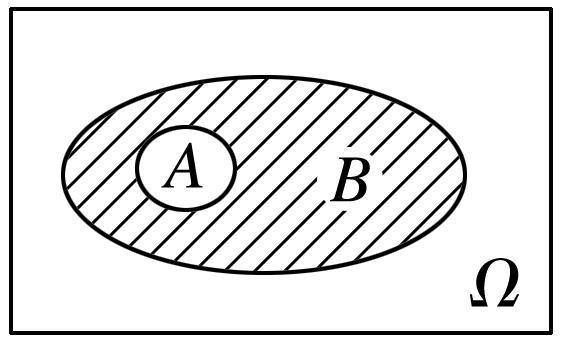
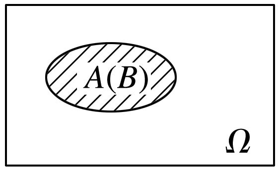
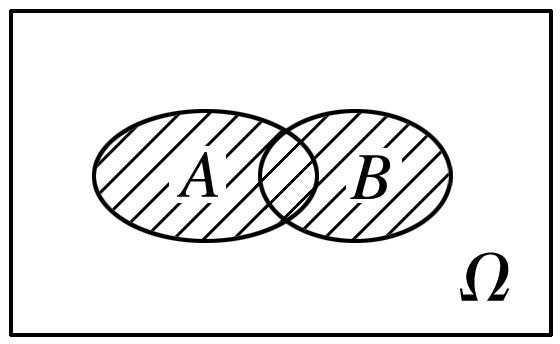
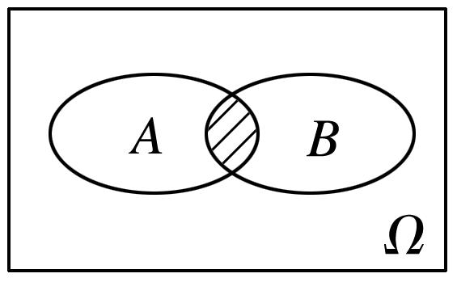
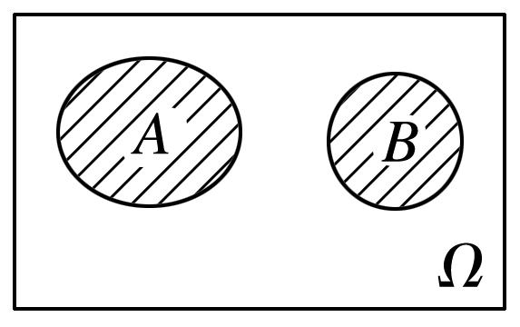
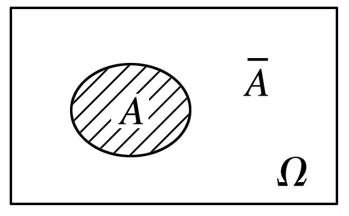
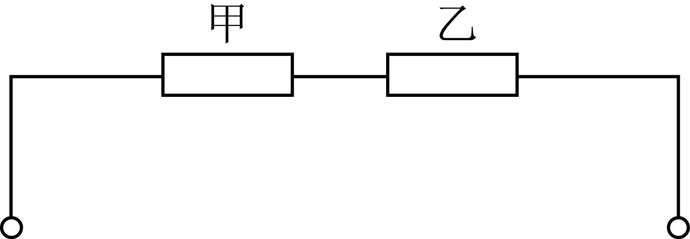
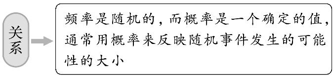
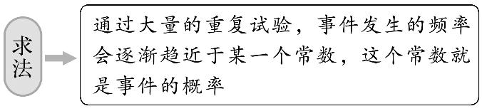
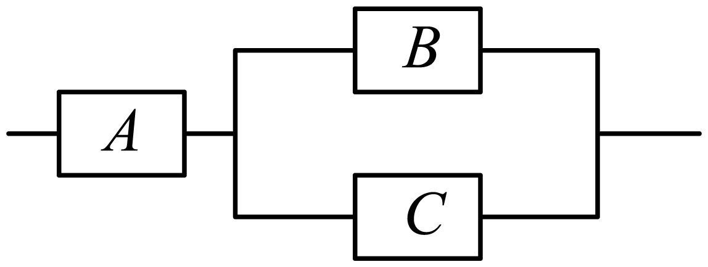

**第88讲  随机事件、频率与概率**

**知识梳理**

**知识点**1**、随机试验**

我们把对随机现象的实现和对它的观察称为随机试验，简称试验，常用字母表示．

我们感兴趣的是具有以下特点的随机试验：

（1）试验可以在相同条件下重复进行；

（2）试验的所有可能结果是明确可知的，并且不止一个；

（3）每次试验总是恰好出现这些可能结果中的一个，但事先不能确定出现哪一个结果．

**知识点**2**、样本空间**

我们把随机试验的每个可能的基本结果称为样本点，全体样本点的集合称为试验的样本空间，一般地，用．．表示样本空间，用表示样本点，如果一个随机试验有个可能结果，，…，，则称样本空间为有限样本空间．

**知识点**3**、随机事件、确定事件**

（1）一般地，随机试验中的每个随机事件都可以用这个试验的样本空间的子集来表示，为了叙述方便，我们将样本空间的子集称为随机事件，简称事件，并把只包含一个样本点的事件称为基本事件．当且仅当中某个样本点出现时，称为事件发生．

（2）作为自身的子集，包含了所有的样本点，在每次试验中总有一个样本点发生，所以总会发生，我们称为必然事件．

（3）空集不包含任何样本点，在每次试验中都不会发生，我们称为为不可能事件．

（4）确定事件：必然事件和不可能事件统称为相对随机事件的确定事件．

**知识点**4**、事件的关系与运算**

①包含关系：一般地，对于事件和事件，如果事件发生，则事件一定发生，这时称事件包含事件（或者称事件包含于事件），记作或者．与两个集合的包含关系类比，可用下图表示：

不可能事件记作，任何事件都包含不可能事件．

②相等关系：一般地，若且，称事件与事件相等．与两个集合的并集类比，可用下图表示：

③并事件（和事件）：若某事件发生当且仅当事件发生或事件发生，则称此事件为事件与事件的并事件（或和事件），记作（或）．与两个集合的并集类比，可用下图表示：

④交事件（积事件）：若某事件发生当且仅当事件发生且事件发生，则称此事件为事件*A*与事件*B*的交事件（或积事件），记作（或）．与两个集合的交集类比，可用下图表示：

**知识点**5**、互斥事件与对立事件**

（1）互斥事件：在一次试验中，事件和事件不能同时发生，即，则称事件与事件互斥，可用下图表示：

如果，，…，中任何两个都不可能同时发生，那么就说事件，．．，…，彼此互斥．

（2）对立事件：若事件和事件在任何一次实验中有且只有一个发生，即不发生，则称事件和事件互为对立事件，事件的对立事件记为．

（3）互斥事件与对立事件的关系

①互斥事件是不可能同时发生的两个事件，而对立事件除要求这两个事件不同时发生外，还要求二者之一必须有一个发生．

②对立事件是互斥事件的特殊情况，而互斥事件未必是对立事件，即“互斥”是“对立”的必要不充分条件，而“对立”则是“互斥”的充分不必要条件．

**知识点**6**、概率与频率**

（1）频率：在次重复试验中，事件发生的次数称为事件发生的频数，频数与总次数的比值，叫做事件发生的频率．

（2）概率：在大量重复尽心同一试验时，事件发生的频率总是接近于某个常数，并且在它附近摆动，这时，就把这个常数叫做事件的概率，记作．

（3）概率与频率的关系：对于给定的随机事件，由于事件发生的频率随着试验次数的增加稳定于概率，因此可以用频率来估计概率．

**必考题型全归纳**

**题型一：随机事件与样本空间**

<strong>例1．</strong>（2024·全国·高三专题练习）已知集合<em>A</em>是集合<em>B</em>的真子集，则下列关于非空集合<em>A</em>，<em>B</em>的四个命题：

①若任取，则是必然事件；

②若任取，则是不可能事件；

③若任取，则是随机事件；

④若任取，则是必然事件．

其中正确的命题有（　　）

A．1个	B．2个	C．3个	D．4个

**例2．**（2024·全国·高三专题练习）以下事件是随机事件的是（    ）

A．标准大气压下，水加热到，必会沸腾	B．走到十字路口，遇到红灯

C．长和宽分别为的矩形，其面积为	D．实系数一元一次方程必有一实根

<strong>例3．</strong>（2024·全国·高三专题练习）袋中装有形状与质地相同的个球，其中黑色球个，记为，白色球个，记为，从袋中任意取个球，请写出该随机试验一个不等可能的样本空间：_____.

<strong>变式1．</strong>（2024·全国·高一专题练习）将一枚硬币抛三次，观察其正面朝上的次数，该试验样本空间为______.

<strong>变式2．</strong>（2024·高一课时练习）设样本空间<em>Ω</em>＝{1，2，3}，则<em>Ω</em>的不同事件的总数是______.

<strong>变式3．</strong>（2024·全国·高一专题练习）从含有件次品的件产品中任取件，观察其中次品数，其样本空间为______．

**【解题方法总结】**

确定样本空间的方法

（1）必须明确事件发生的条件．

（2）根据题意，按一定的次序列出问题的答案．特别要注意结果出现的机会是均等的，按规律去写，要做到既不重复也不遗漏．

**题型二：随机事件的关系与运算**

**例4．**（2024·全国·高三专题练习）端午节是我国传统节日，记事件“甲端午节来宝鸡旅游”， 记事件“乙端午节来宝鸡旅游”，且，，假定两人的行动相互之间没有影响，则（    ）

A．	B．	C．	D．

**例5．**（2024·全国·高三专题练习）已知事件与事件互斥，记事件为事件对立事件.若，，则（    ）

A．	B．	C．	D．

<strong>例6．</strong>（2024·全国·高三专题练习）对空中飞行的飞机连续射击两次，每次发射一枚炮弹，设事件<em>A</em>表示随机事件“两枚炮弹都击中飞机”，事件<em>B</em>表示随机事件“两枚炮弹都未击中飞机”，事件<em>C</em>表示随机事件“恰有一枚炮弹击中飞机”，事件<em>D</em>表示随机事件“至少有一枚炮弹击中飞机”，则下列关系不正确的是（　　）

A．	B．

C．	D．

**变式4．**（2024·全国·高三专题练习）某家族有两种遗传性状，该家族某成员出现性状的概率为，出现性状的概率为，两种性状都不出现的概率为，则该成员两种性状都出现的概率为（    ）

A．	B．	C．	D．

<strong>变式5．</strong>（2024·上海长宁·统考一模）掷两颗骰子，观察掷得的点数；设事件<em>A</em>为：至少一个点数是奇数；事件<em>B</em>为：点数之和是偶数；事件<em>A</em>的概率为，事件<em>B</em>的概率为；则是下列哪个事件的概率（    ）

A．两个点数都是偶数	B．至多有一个点数是偶数

C．两个点数都是奇数	D．至多有一个点数是奇数

**变式6．**（2024·全国·高三专题练习）如图，甲、乙两个元件串联构成一段电路，设“甲元件故障”，“乙元件故障”，则表示该段电路没有故障的事件为（    ）

A．	B．	C．	D．

**变式7．**（2024·全国·高三专题练习）已知，，若，则（    ）

A．0.1	B．0.2	C．0.3	D．0.4

**【解题方法总结】**

事件的关系运算策略

（1）互斥事件是不可能同时发生的事件，但也可以同时不发生．

（2）进行事件的运算时，一是要紧扣运算的定义，二是要全面考虑同一条件下的试验可能出现的全部结果，必要时可列出全部的试验结果进行分析．也可类比集合的关系和运用*Venn*图分析事件．

**题型三：频率与概率**

<strong>例7．</strong>（2024·陕西西安·西安市大明宫中学校考模拟预测）在一个口袋中放有个白球和个红球，这些球除颜色外都相同，某班50名学生分别从口袋中每次摸一个球，记录颜色后放回，每人连续摸10次，其中摸到白球的次数共152次，以频率估计概率，若从口袋中随机摸1个球，则摸到红球概率的估计值为_________．（小数点后保留一位小数）

<strong>例8．</strong>（2024·全国·高三对口高考）下列说法：①设有一批产品，其次品率为0.05，则从中任取200件，必有10件次品；②做100次抛硬币的试验，有51次出现正面.因此出现正面的概率是0.51；③随机事件<em>A</em>的概率是频率的稳定值；④随机事件<em>A</em>的概率趋近于0，即趋近于0，则<em>A</em>是不可能事件；⑤抛掷骰子100次，得点数是1的结果是18次，则出现1点的频率是；⑥随机事件的频率就是这个事件发生的概率；其中正确的有______.

<strong>例9．</strong>（2024·全国·模拟预测）在对于一些敏感性问题调查时，被调查者往往不愿意给正确答复，因此需要特别的调查方法．调查人员设计了一个随机化装置，在其中装有形状、大小、质地完全相同的个黑球和个白球，每个被调查者随机从该装置中抽取一个球，若摸到黑球则需要如实回答问题一：你公历生日是奇数吗？若摸到白球则如实回答问题二：你是否在考试中做过弊．若人中有人回答了“是”，人回答了“否”．则问题二“考试是否做过弊”回答“是”的百分比为（以人的频率估计概率）______．

**变式8．**（2024·全国·高三对口高考）已知某运动员每次投篮命中的概率都为，现采用随机模拟的方法估计该运动员三次投篮恰有两次命中的概率：先由计算器产生到之间取整数值的随机数，指定、、、表示命中，、、、、9、0表示不命中，再以每三个随机数为一组，代表三次投篮的结果，经随机模拟产生了如下组随机数：

据此估计，该运动员三次投篮恰有两次命中的概率为________.

<strong>变式9．</strong>（2024·全国·高三专题练习）一家药物公司试验一种新药，在500个病人中试验，其中307人有明显疗效，120人有疗效但疗效一般，剩余的人无疗效，则没有明显疗效的频率是______．

<strong>变式10．</strong>（2024·全国·高三专题练习）若随机事件<em>A</em>在<em>n</em>次试验中发生了<em>m</em>次，则当试验次数<em>n</em>很大时，可以用事件<em>A</em>发生的频率来估计事件<em>A</em>的概率，即___________．

<strong>变式11．</strong>（2024·全国·高三专题练习）已知小张每次射击命中十环的概率都为40%，现采用随机模拟的方法估计小张三次射击恰有两次命中十环的概率，先由计算器产生0到9之间取整数值的随机数，指定2，4，6，8表示命中十环，0，1，3，5，7，9表示未命中十环，再以每三个随机数为一组，代表三次射击的结果，经随机模拟产生了如下20组随机数：据此估计，小张三次射击恰有两次命中十环的概率约为__________.

<strong>变式12．</strong>（2024·广东广州·高三铁一中学校考阶段练习）长时间玩手机可能影响视力．据调查，某校学生大约有40%的人近视，而该校大约有20%的学生每天玩手机超过1小时，这些人的近视率约为50%．现从每天玩手机不超过1小时的学生中任意调查一名学生，则他近视的概率约为___________．

<strong>变式13．</strong>（2024·上海浦东新·高三华师大二附中校考阶段练习）袋中有10个球，其中有<em>m</em>个红球，<em>n</em>个蓝球，有放回地随机抽取1000次，其中有597次取到红球，403 次取到蓝球，则其中红球最有可能有______个．

**【解题方法总结】**

（1）概率与频率的关系

（2）随机事件概率的求法

**题型四：生活中的概率**

<strong>例10．</strong>（2024·全国·高三专题练习）某购物网站开展一种商品的预约购买，规定每个手机号只能预约一次，预约后通过摇号的方式决定能否成功购买到该商品.规则如下：（ⅰ）摇号的初始中签率为；（ⅱ）当中签率不超过时，可借助“好友助力”活动增加中签率，每邀请到一位好友参与“好友助力”活动可使中签率增加.为了使中签率超过，则至少需要邀请________位好友参与到“好友助力”活动.

<strong>例11．</strong>（2024·江西吉安·江西省泰和中学校考一模）设有外形完全相同的两个箱子，甲箱中有99个白球，1个黑球，乙箱中有1个白球，99个黑球.随机地抽取一箱，再从取出的一箱中抽取一球，结果取得白球，我们可以认为这球是从_____箱中取出的.

**例12．**（2024·全国·高三专题练习）有以下说法:

①一年按365天计算,两名学生的生日相同的概率是;②买彩票中奖的概率为0*.* 001,那么买1 000张彩票就一定能中奖;③乒乓球赛前,决定谁先发球,抽签方法是从1*\~* 10共10个数字中各抽取1个,再比较大小,这种抽签方法是公平的;④昨天没有下雨,则说明“昨天气象局的天气预报降水概率是90%”是错误的*.*

根据我们所学的概率知识,其中说法正确的序号是___<em>.</em>

**【解题方法总结】**

概率和频率的关系：概率可看成频率在理论上的稳定值，它从数量上反映了随机事件发生的可能性的大小，它是频率的科学抽象，当试验次数越来越多时频率向概率靠近，只要次数足够多，所得频率就近似地当作随机事件的概率．

**题型五：互斥事件与对立事件**

**例13．**（2024·四川眉山·仁寿一中校考模拟预测）袋中装有红球3个、白球2个、黑球1个，从中任取2个，则互斥而不对立的两个事件是（    ）

A．至少有一个白球；都是白球	B．至少有一个白球；至少有一个红球

C．至少有一个白球；红､黑球各一个	D．恰有一个白球；一个白球一个黑球

**例14．**（2024·全国·高三专题练习）从装有2个红球和2个黑球的口袋内任取两个球，那么互斥而不对立的事件是（    ）

A．至少有一个黑球与都是黑球

B．至少有一个黑球与至少有一个红球

C．恰有一个黑球与恰有两个黑球

D．至少有一个黑球与都是红球

**例15．**（2024·四川宜宾·统考三模）抛掷一枚质地均匀的骰子一次，事件1表示“骰子向上的点数为奇数”，事件2表示“骰子向上的点数为偶数”，事件3表示“骰子向上的点数大于3”，事件4表示“骰子向上的点数小于3”则（    ）

A．事件1与事件3互斥	B．事件1与事件2互为对立事件

C．事件2与事件3互斥	D．事件3与事件4互为对立事件

**变式14．**（2024·广西柳州·柳州高级中学校联考模拟预测）从数学必修一、二和政治必修一、二共四本书中任取两本书，那么互斥而不对立的两个事件是（    ）

A．至少有一本政治与都是数学	B．至少有一本政治与都是政治

C．至少有一本政治与至少有一本数学	D．恰有1本政治与恰有2本政治

**变式15．**（2024·全国·高二）袋内分别有红､白､黑球个，从中任取2个，则互斥而不对立的两个事件是（    ）

A．至少有一个白球；都是白球	B．至少有一个白球；至少有一个红球

C．恰有一个白球；一个白球一个黑球	D．至少有一个白球；红､黑球各一个

**变式16．（多选题）（2024·全国·高三专题练习）** 从1，2，3，，9中任取三个不同的数，则在下述事件中，是互斥但不是对立事件的有（    ）

A．“三个都为偶数”和“三个都为奇数”	B．“至少有一个奇数”和“至多有一个奇数”

C．“至少有一个奇数”和“三个都为偶数”	D．“一个偶数两个奇数”和“两个偶数一个奇数”

**【解题方法总结】**

1、准确把握互斥事件与对立事件的概念：①互斥事件是不可能同时发生的事件，但也可以同时不发生；②对立事件是特殊的互斥事件，特殊在对立的两个事件不可能都不发生，既有且仅有一个发生．

2、判别互斥事件、对立事件一般用定义判断，不可能同时发生的两个事件为互斥事件；两个事件，若有且仅有一个发生，则这两个事件为对立事件，对立事件一定是互斥事件．

**题型六：利用互斥事件与对立事件计算概率**

<strong>例16．</strong>（2024·全国·高三专题练习）已知事件，，两两互斥，若，，，则_________．

<strong>例17．</strong>（2024·全国·高三专题练习）在一次运动会上，某单位派出了名主力队员和名替队员组成代表队参加比赛.如果随机抽派名队员上场，则主力队员多于替补队员的概率为____________.

<strong>例18．</strong>（2024·全国·模拟预测）甲、乙两人下棋，甲获胜的概率是，和棋的概率是，则甲不输的概率为______．

<strong>变式17．</strong>（2024·四川眉山·高三校考开学考试）一个盒子内装有若干个大小相同的红球、白球和黑球，从中摸出1个球，若摸出红球的概率是0.45，摸出白球的概率是0.25，那么从盒中摸出1个球，摸出黑球或红球的概率是______．

<strong>变式18．</strong>（2024·福建厦门·厦门一中校考模拟预测）某商场举行抽奖活动，箱子里有10个大小一样的小球，其中红色的5个，黄色的3个，蓝色的2个，现从中任意取出3个，则其中至少含有两种不同颜色的小球的概率为__________.

<strong>变式19．</strong>（2024·福建·校联考模拟预测）若一个点从三棱柱下底面顶点出发，一次运动中随机去向相邻的另一个顶点，则在5次运动后这个点仍停留在下底面的概率是______.

<strong>变式20．</strong>（2024·内蒙古赤峰·高三统考开学考试）位于数轴上的粒子<em>A</em>每次向左或向右移动一个单位长度，若前一次向左移动一个单位长度，则后一次向右移动一个单位长度的概率为，若前一次向右移动一个单位长度，则后一次向右移动一个单位长度的概率为，若粒子<em>A</em>第一次向右移动一个单位长度的概率为，则粒子<em>A</em>第二次向左移动的概率为______.

<strong>变式21．</strong>（2024·四川成都·石室中学校考模拟预测）若三个元件、、按照如图的方式连接成一个系统，每个元件是否正常工作不受其他元件的影响，当元件正常工作且、中至少有一个正常工作时，系统就正常工作，若元件、正常工作的概率依次为、，且这个系统正常工作的概率为，则元件正常工作的概率为______.

**【解题方法总结】**

求复杂的互斥事件的概率的两种方法

（1）直接法，将所求事件的概率分解为一些彼此互斥的事件的概率的和，运用互斥事件的概率求和公式计算．

（2）间接法，先求此事件的对立事件的概率，再用公式，即运用逆向思维（正难则反）．特别是“至多”“至少”型题目，用间接法求解就显得较简便

