**第89讲  古典概型与概率的基本性质**

**知识梳理**

**知识点**1**、随机事件的概率**

对随机事件发生可能性大小的度量（数值）称为事件的概率，事件的概率用表示．

**知识点**2**、古典概型**

**（** 1**）定义**

一般地，若试验具有以下特征：

①有限性：样本空间的样本点只有有限个；

②等可能性：每个样本点发生的可能性相等．

称试验*E*为古典概型试验，其数学模型称为古典概率模型，简称古典概型．

**（** 2**）古典概型的概率公式**

一般地，设试验是古典概型，样本空间包含个样本点，事件包含其中的个样本点，则定义事件的概率．

**知识点**3**、概率的基本性质**

（1）对于任意事件都有：．

（2）必然事件的概率为，即；不可能事概率为，即．

（3）概率的加法公式：若事件与事件互斥，则．

推广：一般地，若事件，，…，彼此互斥，则事件发生（即，，…，中有一个发生）的概率等于这个事件分别发生的概率之和，即：．

（4）对立事件的概率：若事件与事件互为对立事件，则，，且．

（5）概率的单调性：若，则．

（6）若，是一次随机实验中的两个事件，则．

**【解题方法总结】**

1、解决古典概型的问题的关键是：分清基本事件个数与事件中所包含的基本事件数．

因此要注意清楚以下三个方面：

（1）本试验是否具有等可能性；

（2）本试验的基本事件有多少个；

（3）事件是什么．

2、解题实现步骤：

（1）仔细阅读题目，弄清题目的背景材料，加深理解题意；

（2）判断本试验的结果是否为等可能事件，设出所求事件；

（3）分别求出基本事件的个数与所求事件中所包含的基本事件个数；

（4）利用公式求出事件的概率．

3、解题方法技巧：

（1）利用对立事件、加法公式求古典概型的概率

（2）利用分析法求解古典概型．

①任一随机事件的概率都等于构成它的每一个基本事件概率的和．

②求试验的基本事件数及事件*A*包含的基本事件数的方法有列举法、列表法和树状图法．

**必考题型全归纳**

**题型一：简单的古典概型问题**

**例1．**（2024·高一课时练习）下列概率模型中，是古典概型的个数为（    ）

①从区间内任取一个数，求取到1的概率；②从1，2，3，…，10中任取一个数，求取到1的概率；③在正方形*ABCD*内画一点*P*，求点*P*恰好为正方形中心的概率；④向上抛掷一枚不均匀的硬币，求出现反面朝上的概率.

A．1	B．2	C．3	D．4

【答案】A

【解析】古典概型的特征是样本空间中样本点的个数是有限的，并且每个样本点发生的可能性相等，故②是古典概型；

①和③中的样本空间中的样本点个数不是有限的，故不是古典概型；

④由于硬币质地不均匀，因此样本点发生的可能性不相等，故④不是古典概型.

故选：A.

**例2．**（2024·全国·高一专题练习）下列关于古典概型的说法正确的是（    ）

①试验中所有可能出现的样本点只有有限个；②每个事件出现的可能性相等；

③每个样本点出现的可能性相等；④样本点的总数为*n*，随机事件*A*若包含*k*个样本点，则.

A．②④	B．②③④	C．①②④	D．①③④

【答案】D

【解析】在①中，由古典概型的概念可知：试验中所有可能出现的基本事件只有有限个，故①正确；

在②中，由古典概型的概念可知：每个基本事件出现的可能性相等，故②错误；

在③中，由古典概型的概念可知：每个样本点出现的可能性相等，故③正确；

在④中，基本事件总数为*n*，随机事件*A*若包含*k*个基本事件，则由古典概型及其概率计算公式知，故④正确．

故选：D．

**例3．**（2024·全国·高三专题练习）下列有关古典概型的四种说法：

①试验中所有可能出现的样本点只有有限个；

②每个事件出现的可能性相等；

③每个样本点出现的可能性相等；

④已知样本点总数为，若随机事件包含个样本点，则事件发生的概率.

其中所正确说法的序号是（     ）

A．①②④	B．①③	C．③④	D．①③④

【答案】D

【解析】根据古典概型的基本概念及概率公式，即可得出结论②中所说的事件不一定是样本点，所以②不正确；

根据古典概型的特点及计算公式可知①③④正确.

故选:*D*.

**变式1．**（2024·重庆沙坪坝·高三重庆八中校考阶段练习）一项试验旨在研究臭氧效应，试验方案如下：选6只小白鼠，随机地将其中3只分配到试验组且饲养在高浓度臭氧环境，另外3只分配到对照组且饲养在正常环境，一段时间后统计每只小白鼠体重的增加量（单位：）.则指定的两只小鼠分配到不同组的概率为（    ）

A．	B．	C．	D．

【答案】D

【解析】指定的两只小鼠分配到相同组的概率为，

所以指定的两只小鼠分配到不同组的概率为.

故选：D

**变式2．**（2024·青海西宁·高三统考开学考试）乒乓球是中国的国球，拥有广泛的群众基础，老少皆宜，特别适合全民身体锻炼．某小学体育课上，老师让小李同学从7个乒乓球（其中3只黄色和4只白色）中随机选取2个，则他选取的乒乓球恰为1黄1白的概率是（    ）

A．	B．	C．	D．

【答案】A

【解析】根据古典概型，从7个乒乓球中随机选取2个，基本事件总数有个，其中恰为1黄1白的基本事件有个，所以概率．

故选：A．

**变式3．**（2024·河北保定·统考二模）三位同学参加某项体育测试，每人要从跑、引体向上、跳远、铅球四个项目中选出两个项目参加测试，则有且仅有两人选择的项目完全相同的概率是（    ）

A．	B．	C．	D．

【答案】C

【解析】三个同学选择两个项目的试验的基本事件数有个，它们等可能，

有且仅有两人选择的项目完全相同的事件含有的基本事件数有个，

所以有且仅有两人选择的项目完全相同的概率.

故选：C

**变式4．**（2024·湖北·高三校联考阶段练习）将2个不同的小球随机放入甲、乙、丙3个盒子，则2个小球在同一个盒子的概率为（    ）

A．	B．	C．	D．

【答案】D

【解析】将2个不同的小球随机放入甲、乙、丙3个盒子，共有：种方法，

2个小球在同一个盒子有种情况，

所以2个小球在同一个盒子的概率为.

故选：D.

**题型二：古典概型与向量的交汇问题**

**例4．**（2024·重庆·高三统考阶段练习）已知正九边形，从中任取两个向量，则它们的数量积是正数的概率为（    ）

A．	B．	C．	D．

【答案】A

【解析】

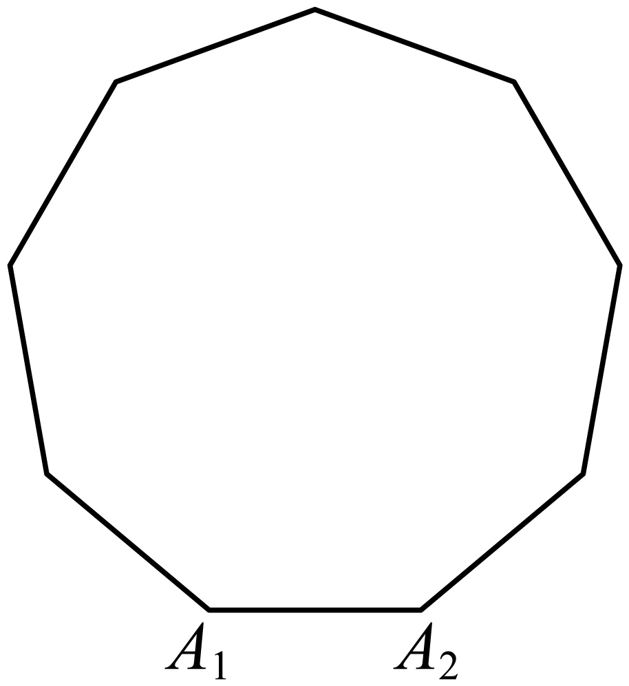

可以和向量构成数量积有 一共8个向量，

其中数量积为的正数的向量有： 一共4个，

由对称性可知，任取两个向量，它们的数量积是正数的概率为：.

故选：A

**例5．**（2024·全国·高三专题练习）已知，若向量，，则向量与所成的角为锐角的概率是（    ）

A．	B．	C．	D．

【答案】B

【解析】向量与所成的角为锐角等价于，且与的方向不同，

即，

则满足条件的向量有，

其中或时，与同向，故舍去，故共有4种情况满足条件，

又的取法共有种，

则向量与所成的角为锐角的概率是．

故选：B．

<strong>例6．</strong>（2024·甘肃武威·甘肃省武威第一中学校考模拟预测）连掷两次骰子分别得到点数<em>m</em>，<em>n</em>，则向量与向量的夹角的概率是（    ）

A．	B．	C．	D．

【答案】D

【解析】由题设，向量的可能组合有36种，

要使向量与向量的夹角，则，即，

满足条件的情况如下：

时，，

时，，

时，，

时，，

时，，

综上，共有15种，故向量与向量的夹角的概率是.

故选：D

<strong>变式5．</strong>（2024·四川成都·四川省成都市玉林中学校考模拟预测）从集合中随机抽取一个数<em>a</em>，从集合中随机抽取一个数<em>b</em>，则向量与向量垂直的概率为（    ）

A．	B．	C．	D．

【答案】B

【解析】求出组成向量的个数和与向量垂直的向量个数，计算所求的概率值．从集合中随机抽取一个数，从集合中随机抽取一个数，

可以组成向量的个数是（个；

其中与向量垂直的向量是和，共2个；

故所求的概率为．

故选：B．

**变式6．**（2024·云南楚雄·高三统考期末）从集合中随机地取一个数，从集合中随机地取一个数，则向量与向量垂直的概率为（    ）

A．	B．	C．	D．

【答案】D

【解析】计算出所有的基本事件数，记事件，列举出事件所包含的基本事件，然后利用古典概型的概率公式可计算出事件的概率.从集合中随机地取一个数，从集合中随机地取一个数，基本事件总数.

记事件，当向量与向量垂直时，，

则事件包含的基本事件有：、（形如），共个，

因此，.

故选：D.

**变式7．**（2024·湖北·高考真题）连掷两次骰子得到的点数分别为和，记向量与向量的夹角为，则的概率是（    ）

A．	B．	C．	D．

【答案】C

【解析】，，即，

事件“”所包含的基本事件有：、、、、、、、、、、、、、、、、、、、、，共个，

所有的基本事件数为，因此，事件“”的概率为.

故选：C.

**题型三：古典概型与几何的交汇问题**

**例7．**（2024·全国·高三专题练习）传说古希腊毕达哥拉斯学派的数学家在沙滩上面画点或用小石子表示数，他们将1，3，6，10，15，…，，称为三角形数；将1，4，9，16，25，…，，称为正方形数．现从200以内的正方形数中任取2个，则其中至少有1个也是三角形数的概率为（    ）

A．	B．	C．	D．

【答案】A

【解析】令，∵，

故200以内的正方形数有14个：1，4，9，16，25，36，49，64，81，100，121，144，169，196，

其中是三角形数的仅有1与36，

故所求概率.

故选：A．

**例8．**（2024·四川达州·统考二模）把腰底比为（比值约为，称为黄金比）的等腰三角形叫黄金三角形，长宽比为（比值约为，称为和美比）的矩形叫和美矩形.树叶、花瓣、向日葵、蝴蝶等都有黄金比.在中国唐、宋时期的单檐建筑中存在较多的的比例关系，常用的纸的长宽比为和美比.图一是正五角星（由正五边形的五条对角线构成的图形），.图二是长方体，，.在图一图二所有三角形和矩形中随机抽取两个图形，恰好一个是黄金三角形一个是和美矩形的概率为（    ）

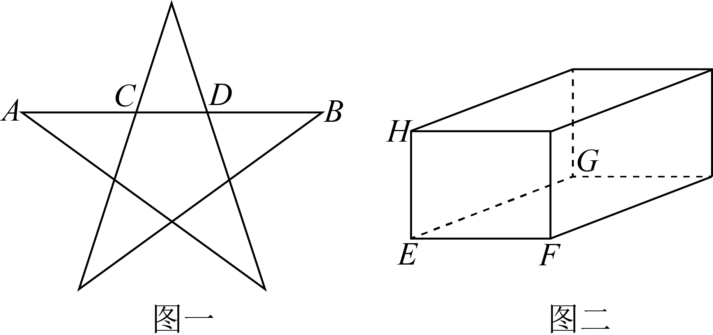

A．	B．	C．	D．

【答案】B

【解析】在如下图所示的正五角星中，

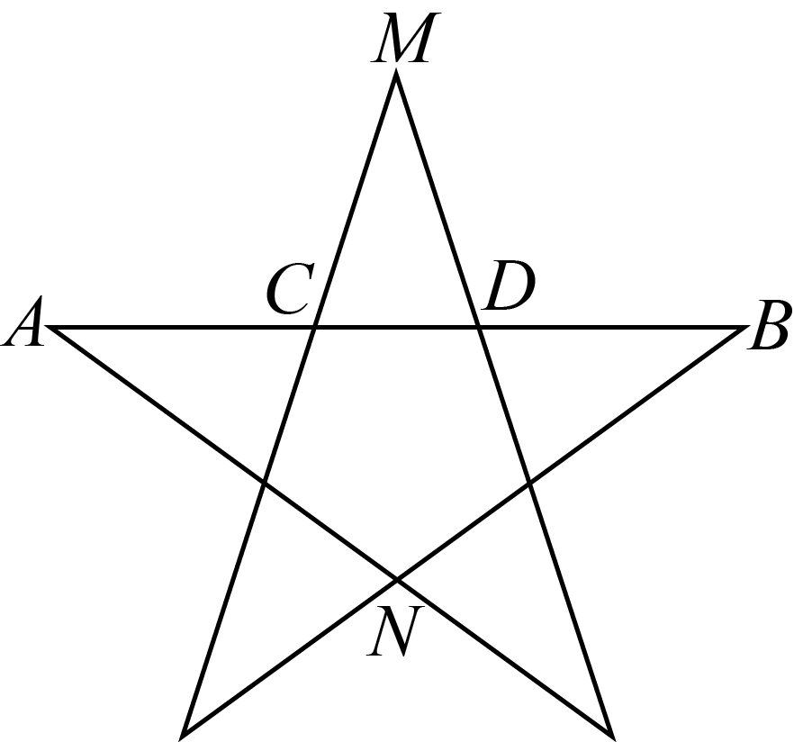

该图中共有个三角形，且等腰的腰底之比大于，等腰的腰底之比小于，

且，则等腰的腰底之比为，

则在该五角星中，黄金三角形的个数为，

在如下图所示的长方体中，

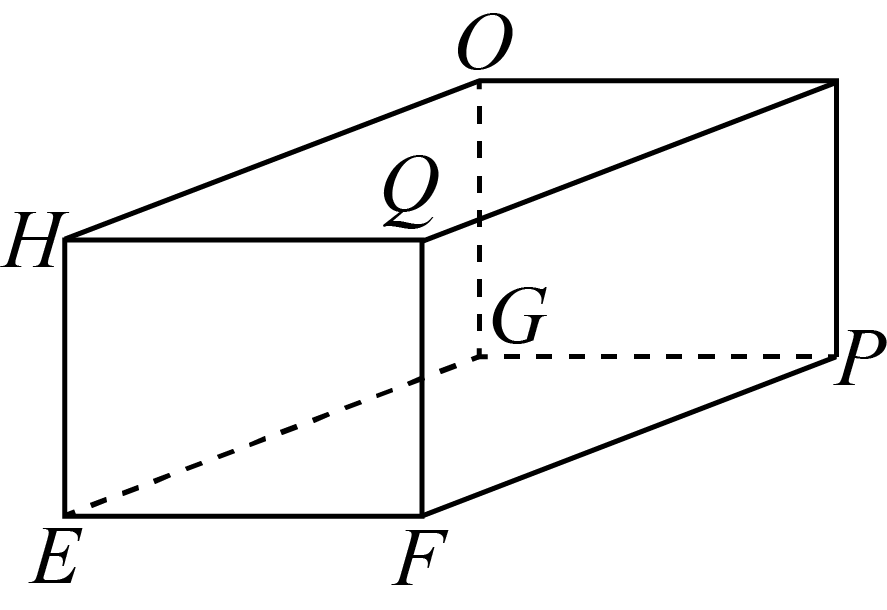

，，则，，，

所以，矩形、均为和美矩形，

所以，长方体中共个矩形，其中和美矩形的个数为，

所以，图一和图二中共个三角形，个矩形，

在图一图二所有三角形和矩形中随机抽取两个图形，

恰好一个是黄金三角形一个是和美矩形的概率为.

故选：B.

**例9．**（2024·江西·高三校联考阶段练习）如图，这是第24届国际数学家大会会标的大致图案，它是以我国古代数学家赵爽的弦图为基础设计的.现用红色和蓝色给这4个三角形区域涂色，每个区域只涂一种颜色，则相邻的区域所涂颜色不同的概率是（    ）

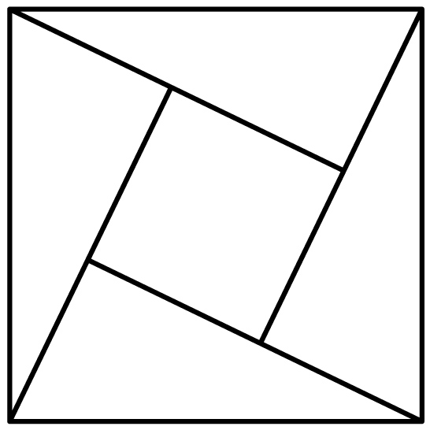

A．	B．	C．	D．

【答案】A

【解析】将四块三角形区域编号如下，

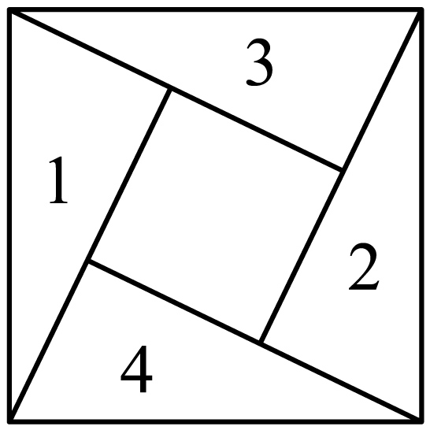

由题意可得总的涂色方法有种，

若相邻的区域所涂颜色不同，即12同色，34同色，故符合条件的涂色方法有2种，

故所求概率.

故选：A

**变式8．**（2024·江西·校联考二模）圆周上有8个等分点，任意选这8个点中的4个点构成一个四边形，则四边形为梯形的概率是（    ）

A．	B．	C．	D．

【答案】B

【解析】依题意，从8个点中任取4个点构成有个四边形，构成梯形就只有以下两种情况：

以某相邻两个点（如点*A*，*B*）构成的线段为边的梯形有2个，共有个，

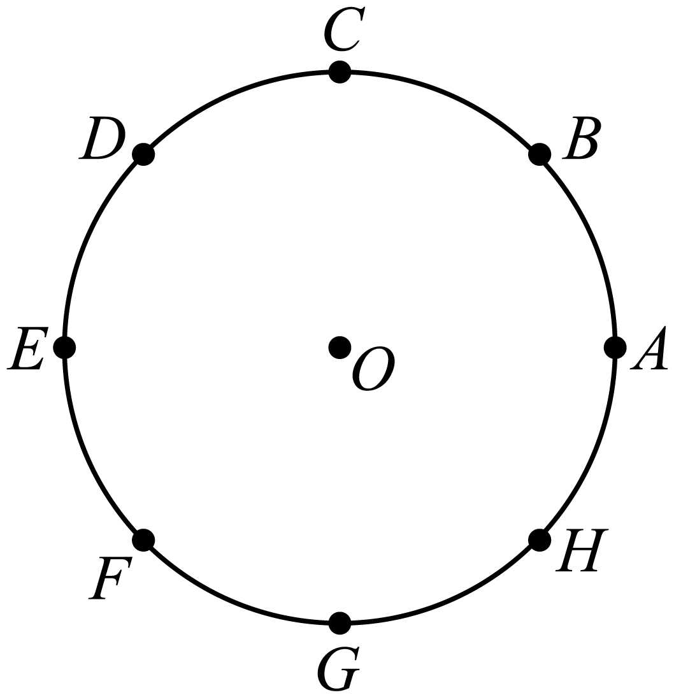

以某间隔一个点的两点（如点*A*，*C*）构成的线段为边的梯形有1个，共有个，

于是构成的四边形中梯形有个，

所以四边形为梯形的概率是.

故选：B

**变式9．**（2024·广东深圳·高三深圳市福田区福田中学校考阶段练习）《几何原本》是古希腊数学家欧几里得所著的一部数学巨著，大约成书于公元前300年．汉语的最早译本是由中国明代数学家、天文学家徐光启和意大利传教士利玛窦合译，成书于1607年.该书前6卷主要包括：基本概念、三角形、四边形、多边形、圆、比例线段、相似形这7章，几乎包含现今平面几何的所有内容．某高校要求数学专业的学生从这7章里任选4章进行选修，则学生李某所选的4章中，含有“基本概念”这一章的概率为（    ）

A．	B．	C．	D．

【答案】B

【解析】数学专业的学生从这7章里任选4章进行选修共有：种选法；

学生李某所选的4章中，含有“基本概念”这一章共有：种选法，

故学生李某所选的4章中，含有“基本概念”这一章的概率为：.

故选：B.

**变式10．**（2024·河北张家口·张家口市宣化第一中学校考三模）如图，将正方体沿交于同一顶点的三条棱的中点截去一个三棱锥，如此共可截去八个三棱锥，截取后的剩余部分称为“阿基米德多面体”，它是一个24等边半正多面体．从它的棱中任取两条，则这两条棱所在的直线为异面直线的概率为（    ）

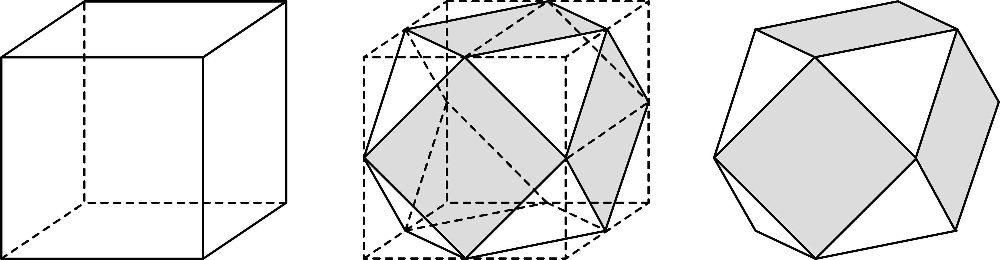

A．	B．	C．	D．

【答案】B

【解析】当一条直线位置于上（或下）底面，另一条不在底面时，共有对异面直线，

当两条直线都位于上下底面时，有对异面直线，

当两条直线都不在上下底面时，有对异面直线，

所以，两条棱所在的直线为异面直线的概率为

故选：B

**变式11．**（2024·全国·高三专题练习）《九章算术·商功》指出“斜解立方，得两壍堵.斜解壍堵，其一为阳马，一为鳖臑.阳马居二，鳖臑居一，不易之率也.合两鳖臑三而一，验之以棊，其形露矣.”意为将一个正方体斜切，可以得到两个壍堵，将壍堵斜切，可得到一个阳马，一个鳖臑（四个面都是直角三角形的三棱锥），如果从正方体的8个顶点中选4个顶点得到三棱锥，则得到的三棱锥是鳖臑的概率为（    ）

A．	B．	C．	D．

【答案】C

【解析】

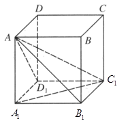

从正方体的8个顶点中任选4个顶点，共有（种）情况，

其中4点在同一平面的情况共有两种，

第一种是当取正方体的一个面上的4个点时，共有6种情况；

第二种是当取上下､左右､前后斜切面的4个点时，共有6种情况，

所以从正方体的8个顶点选4个顶点得到三棱锥共有（种）.

因为鳖臑是四个面都是直角三角形的三棱锥，

所以以为例，与下底面组成的鳖臑有和，

与上底面构成的鳖臑也有两个，鳖臑共有（个）.

又与侧面组成的4个鳖臑有两个与前面得到的重复，有2个不重合，

故有（个），所以一共有24个鳖臑，

所以得到的三棱锥是鳖臑的概率为，

故选：C.

**题型四：古典概型与函数的交汇问题**

<strong>例10．</strong>（2024·四川遂宁·统考三模）已知，从这四个数中任取一个数，使函数有两不相等的实数根的概率为__________.

【答案】/

【解析】函数有两不相等的实数根，则，解得或.

，，.

因为，所以.

即从这四个数中任取一个数，使函数有两不相等的实数根的概率为.

故答案为：

<strong>例11．</strong>（2024·全国·高三专题练习）已知四个函数：（1），（2），（3），（4），从中任选个，则事件“所选个函数的图象有且仅有一个公共点”的概率为___________.

【答案】

【解析】

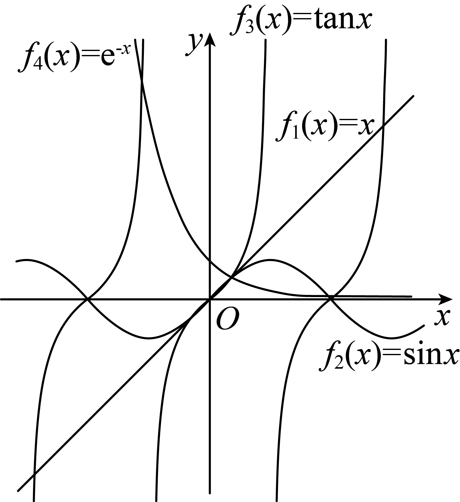

如图所示，与，与，与，与均有多个公共点，

令，则，∴在上单调递增，

又∵，∴有唯一零点，

∴与的图象有且仅有一个公共点；

令，则，∴在上单调递增，

又∵，

∴存在，使，且是的唯一零点，

∴与的图象有且仅有一个公共点.

∴从四个函数中任选个，共有种可能，

“所选个函数的图象有且仅有一个公共点的有与和与共种可能，

∴“所选个函数的图象有且仅有一个公共点”的概率为.

故答案为：.

<strong>例12．</strong>（2024·河南信阳·河南省信阳市第二高级中学校联考一模）在，，0，1，2的五个数字中，有放回地随机取两个数字分别作为函数中<em>a</em>，<em>b</em>的值，则该函数图像恰好经过第一、三、四象限的概率为______．

【答案】/0.2

【解析】五个数字任取一个作数字作系数*a*，放回后随机任取一个数作为*b*，有种不同取法.

当时，函数图像为一条直线，若图像恰好经过第一、三、四象限，则，即有，；，两组数满足；

时，二次函数经过第一、三、四象限则开口向下，又图像过点，顶点必在第一象限，即满足，，，有，；，；，三组数满足．故共有5组满足，

所求概率为．

故答案为：

<strong>变式12．</strong>（2024·四川遂宁·统考一模）若函数的定义域和值域分别为和，则满足的函数概率是______．

【答案】

【解析】因函数的定义域和值域分别为和，则函数有6个，它们是：

；；；

；；，

满足的函数有2个数，它们是或，

因此满足的函数有4个，所以满足的函数概率是.

故答案为：

<strong>变式13．</strong>（2024·全国·高三专题练习）一个盒子中装有六张卡片，上面分别写着如下六个定义域为<em>R</em>的函数：，，，，，．现从盒子中逐一抽取卡片并判函数的奇偶性，每次抽出后均不放回，若取到一张写有偶函数的卡片则停止抽取，否则继续进行，设抽取次数为<em>X</em>，则的概率为___________．

【答案】/0.8

【解析】易判断，，为偶函数，所以写有偶函数的卡片有3张，的取值范围是．

，，

所以．

故答案为：

<strong>变式14．</strong>（2024·全国·高三专题练习）对于定义域为<em>D</em>的函数，若对任意的，当时都有，则称函数为“不严格单调增函数”，若函数的定义域，值域为，则函数为“不严格单调增函数”的概率是______．

【答案】/0.04

【解析】基本事件总数为：把D中的5个数分成三堆：①1，1，3：，②1，2，2：,

则总共有种，

求函数是“不严格单调增函数”的情况，等价于在1，2，3，4，5中间有4个空，插入2块板分成3组，分别从小到大对应6,7,8共有种情况，

函数是“不严格单调增函数”的概率是

故答案为：.

<strong>变式15．</strong>（2024·上海·高三专题练习）从3个函数：和中任取2个，其积函数在区间内单调递增的概率是___________.

【答案】

【解析】从三个函数中任取两个函数共有3种取法，

若取，积函数为，所以，

因为当时，，所以函数在单调递增；

若取和，积函数，所以，

因为当时，，所以函数在单调递减；

若取和，积函数，所以，

因为当时，，所以函数在单调递增；

故满足题意的有2个积函数，所以概率值为，

故答案为：.

**题型五：古典概型与数列的交汇问题**

<strong>例13．</strong>（2024·江西鹰潭·统考一模）斐波那契数列因数学家莱昂纳多•斐波那契（LeonardodaFibonaci）以兔子繁殖为例而引入，故又称为“兔子数列”.因<em>n</em>趋向于无穷大时，无限趋近于黄金分割数，也被称为黄金分割数列.在数学上，斐波那契数列由以下递推方法定义：数列满足，，若从该数列前10项中随机抽取2项，则抽取的2项至少有1项是奇数的概率为（    ）

A．	B．	C．	D．

【答案】D

【解析】依题意可知，数列的前10项为：1，1，2，3，5，8，13，21，34，55，

其中偶数有3个，

所以从该数列前10项中随机抽取2项，则抽取的2项都是偶数的概率为，

所以至少有1项是奇数的概率为.

故选：D.

**例14．**（2024·全国·高三专题练习）斐波那契数列又称黄金分割数列，也叫“兔子数列”，在数学上，斐波那契数列被以下递推方法定义：数列满足，，先从该数列前12项中随机抽取1项，是质数的概率是（    ）

A．	B．	C．	D．

【答案】A

【解析】由斐波那契数列的递推关系可知，前12项分别为：1，1，2，3，5，8，13，21，34，55，89，144，所以基本事件数共有12，其中质数有2，3，5，13，89，共5种，故是质数的概率为.

故选：A*.*

**例15．**（2024·黑龙江·黑龙江实验中学校考三模）已知某抽奖活动的中奖率为，每次抽奖互不影响．构造数列，使得，记，则的概率为（    ）

A．	B．	C．	D．

【答案】A

【解析】由，可得，

抽奖5次，出现3次中奖2次未中奖或2次中奖3次未中奖，

故的概率为．

故选:A.

**变式16．**（2024·山东潍坊·高三统考阶段练习）数列共有10项，且满足：，，每一项与前一项的差为或，从满足上述条件的所有数列中任取一个数列，则取到的数列满足每一项与前一项的差为的项都相邻的概率为（    ）

A．	B．	C．	D．

【答案】A

【解析】由于，从至，“”或“”共次，

所以“”共次，“”共次，

基本事件的总数有种，

“每一项与前一项的差为的项都相邻”的事件有种，

故取到的数列满足每一项与前一项的差为的项都相邻的概率为.

故选：A

<strong>变式17．</strong>（2024·全国·高三专题练习）斐波那契数列因数学家莱昂纳多·斐波那契（LeonardodaFibonaci）以兔子繁殖为例而引入，故又称为“兔子数列”．因<em>n</em>趋向于无穷大时，无限趋近于黄金分割数，也被称为黄金分割数列．在数学上，斐波那契数列由以下递推方法定义：数列满足，，若从该数列前10项中随机抽取1项，则抽取项是奇数的概率为（    ）

A．	B．	C．	D．

【答案】D

【解析】依题意可知，数列的前项为：，

其中奇数有个，所以从该数列前10项中随机抽取1项，则抽取项是奇数的概率为.

故选：D

**变式18．**（2024·全国·高三专题练习）记数列的前项和为，已知，在数集中随机抽取一个数作为，在数集中随机抽取一个数作为.在这些不同数列中随机抽取一个数列，则是递增数列的概率为（    ）

A．	B．	C．	D．

【答案】B

【解析】由已知，当时，，

当时，，

因为数列为单调递增数列，则，即，即，

所有样本点有：、、、、、、、、，共个，

其中，满足是递增数列的样本点有：、，共个，

故所求概率为.

故选：B.

<strong>变式19．</strong>（2024·全国·高三专题练习）已知数列的前<em>n</em>项和为，且，若数列满足，从中任取两个数，则至少一个数满足的概率为（    ）

A．	B．	C．	D．

【答案】B

【解析】由于①，当时，得，解得；

当时，②，①-②化简可得，

所以数列是以1为首项，2为公比的等比数列，所以；

因为，所以，

令得，解得或，

从中任取两个数共有，，，，，，

，，，，，，，，15种，

其中至少一个6或7的有9种，

所以至少一个数满足的概率为，

故选：B.

**变式20．**（2024·全国·高三专题练习）已知等比数列的首项为1，公比为-2，在该数列的前六项中随机抽取两项，，则的概率为（    ）

A．	B．	C．	D．

【答案】C

【解析】由题意知：，，，，，，

由，则*m*，*n*奇偶相同，

若*m*，*n*都为偶数时，符合题意，情况数为种；

若*m*，*n*都为奇数时，仅有不符题意，情况数为种，

综上，符合题意的情况数为种，而总情况数为种，

∴概率．

故选：C.

**题型六：古典概率与统计的综合**

**例16．**（2024·四川宜宾·统考二模）2022年中国新能源汽车销量继续蝉联全球第一，以比亚迪为代表的中国汽车交出了一份漂亮的“成绩单”，比亚迪新能源汽车成为2022年全球新能源汽车市场销量冠军，为了解中国新能源车的销售价格情况，随机调查了10000辆新能源车的销售价格，得到如图的样本数据的频率分布直方图：

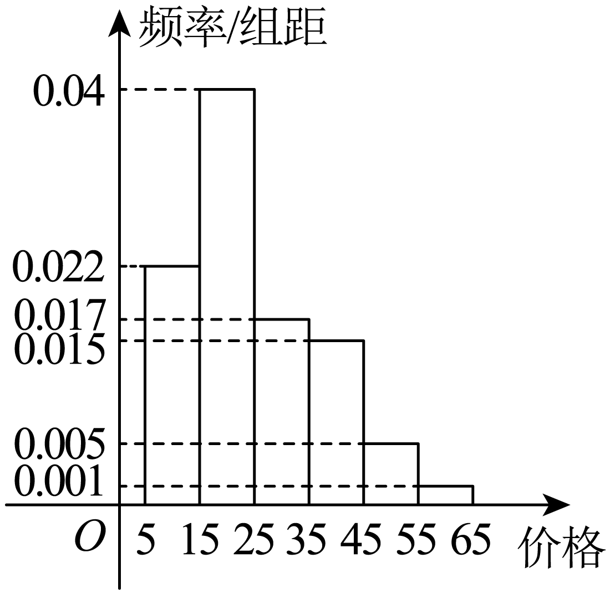

(1)估计一辆中国新能源车的销售价格位于区间（单位：万元）的概率，以及中国新能源车的销售价格的众数；

(2)现有6辆新能源车，其中2辆为比亚迪新能源车，从这6辆新能源车中随机抽取2辆，求至少有1辆比亚迪新能源车的概率.

【解析】（1）一辆中国新能源车的销售价格位于区间的概率

中国新能源车的销售价格的众数为

（2）记2辆比亚迪新能源车为，其余4辆车为，

从6辆新能源车中随机抽取2辆的情况有：，，共15种情况.

其中至少有1辆比亚迪新能源车的情况有：，，共有9种情况.

至少有1辆比亚迪新能源车的概率

**例17．**（2024·北京西城·高三北京市第三十五中学校考开学考试）为了解某中学高一年级学生身体素质情况，对高一年级的(1)班(8)班进行了抽测，采取如下方式抽样：每班随机各抽10名学生进行身体素质监测.经统计，每班10名学生中身体素质监测成绩达到优秀的人数散点图如下（轴表示对应的班号，轴表示对应的优秀人数）：

(1)若用散点图预测高一年级学生身体素质情况，从高一年级学生中任意抽测1人，求该生身体素质监测成绩达到优秀的概率；

(2)若从以上统计的高一（2）班和高一（4）班的学生中各抽出1人，设表示2人中身体素质监测成绩达到优秀的人数，求的分布列及其数学期望；

(3)假设每个班学生身体素质优秀的概率与该班随机抽到的10名学生的身体素质优秀率相等.现在从每班中分别随机抽取1名同学，用“”表示第班抽到的这名同学身体素质优秀，“”表示第班抽到的这名同学身体素质不是优秀（）．写出方差的大小关系（不必写出证明过程）．

【解析】（1）从高一年级（1）班\~（8）班学生中抽测了80人，

其中身体素质检测成绩优秀的人数有人，所以，优秀的概率是

因为是随机抽样，所以用样本估计总体，可知从高一年级学生中任意抽测一人，

该生身体素质检测成绩达到优秀的概率是

（2）因为高一（2）班抽出的10名同学中，身体素质监测成绩达到优秀的人数有6人，不优秀的有4人，

因为高一（4）班抽出的10名同学中，身体素质监测成绩达到优秀的人数有4人，不优秀的有6人，

所以从中抽出2人，的可能取值为

，，，

所以的分布列为

数学期望

（3），

理由：由于

且服从二点分布，所以，

由于在单调递减，

所以.

**例18．**（2024·四川成都·校联考模拟预测）某重点大学为了解准备保研或者考研的本科生每天课余学习时间，随机抽取了名这类大学生进行调查，将收集到的课余学习时间（单位：）整理后得到如下表格：

<table><tr><td>
课余学习时间
</td><td>

</td><td>

</td><td>

</td><td>

</td><td>

</td></tr><tr><td>
人数
</td><td>

</td><td>

</td><td>

</td><td>

</td><td>

</td></tr></table>

(1)估计这名大学生每天课余学习时间的中位数；

(2)根据分层抽样的方法从课余学习时间在和，这两组中抽取人，再从这人中随机抽取人，求抽到的人的课余学习时间都在的概率．

【解析】（1），，

这名大学生每天课余学习时间的中位数位于之间，

则中位数为.

（2）由题意知：从课余学习时间在这一组抽取人，分别记为，从课余学习时间在这一组抽取人，分别记为；

从这人中随机抽取人，所有的基本事件为：，共个基本事件；

其中“抽到的人的课余学习时间都在”包含的基本事件为：，共个基本事件；

抽到的人的课余学习时间都在的概率.

**变式21．**（2024·海南海口·高三统考期中）为促进全民健身更高水平发展，更好地满足人民群众的健身和健康需求，国家相关部门制定发布了《全民健身计划（2021—2025年）》.相关机构统计了我国2018年至2022年（2018年的年份序号为1，依此类推）健身人群数量（即有健身习惯的人数，单位：百万），所得数据如图所示：

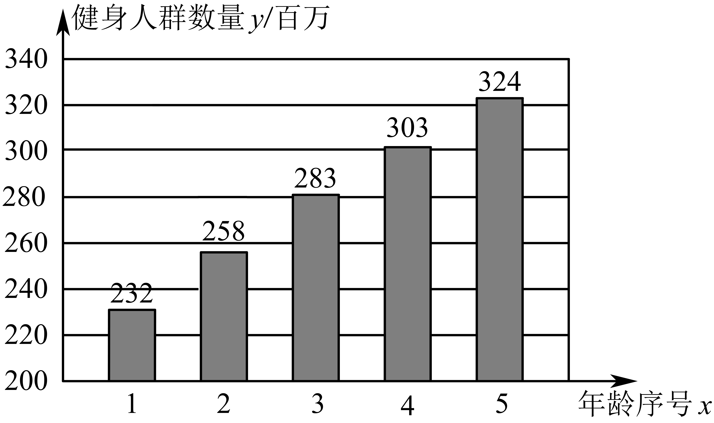

(1)若每年健身人群中放弃健身习惯的人数忽略不计，从2022年的健身人群中随机抽取5人，设其中从2018年开始就有健身习惯的人数为*X*，求；

(2)由图可知，我国健身人群数量与年份序号线性相关，请用相关系数加以说明.

附：相关系数.参考数据：，，，，.

【解析】（1）由图中数据可知从2018年开始就有健身习惯的人数有232百万，

2022年的健身人数为324百万，

故从2022年的健身人群中随机抽取1人，其中从2018年开始就有健身习惯的人被抽到的概率为，

则，故；

（2）由题意知，

，

故我国健身人群数量与年份序号正线性相关且相关性很强.

**变式22．**（2024·江西宜春·高三江西省丰城拖船中学校考开学考试）某市教师进城考试分笔试和面试两部分，现把参加笔试的40名教师的成绩分组：第1组[75，80），第2组[80，85），第3组[85，90），第4组[90，95），第5组[95，100].得到频率分布直方图如图所示.

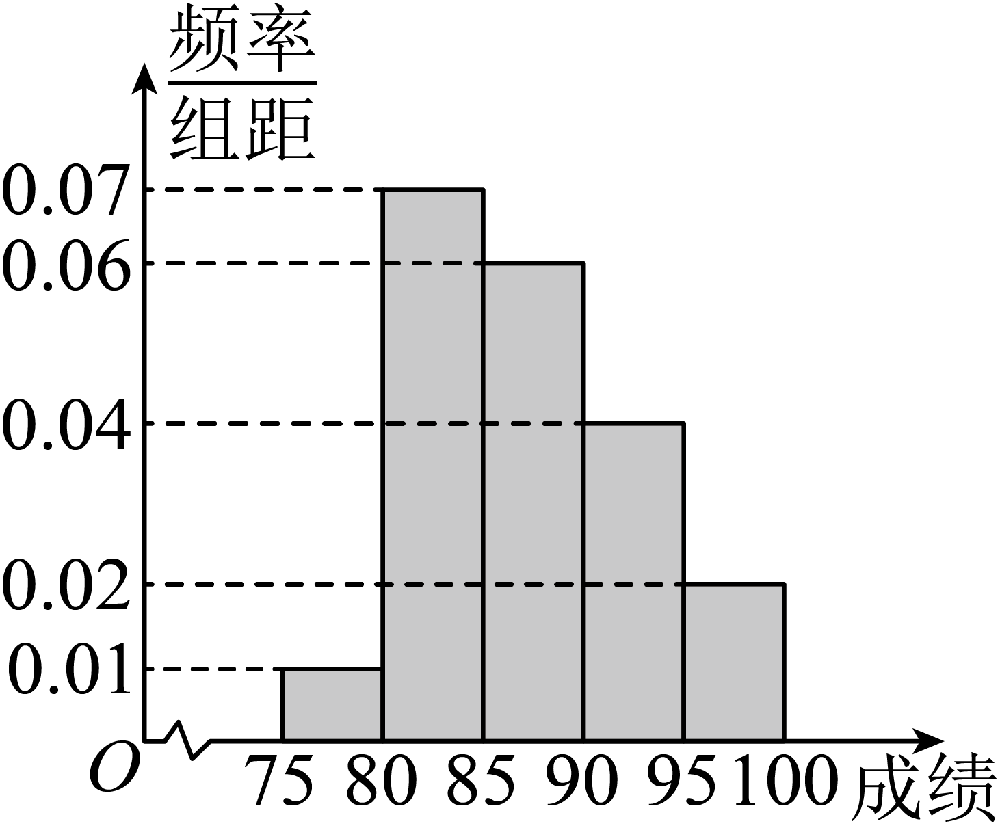

(1)分别求成绩在第4，5组的教师人数；

(2)若考官决定在笔试成绩较高的第3，4，5组中用分层抽样抽取6名进入面试，

①已知甲和乙的成绩均在第3组，求甲和乙同时进入面试的概率；

②若决定在这6名考生中随机抽取2名教师接受考官*D*的面试，设第4组中有*X*名教师被考官*D*面试，求*X*的分布列和数学期望.

【解析】（1）由题意，结合频率分布直方图，可得第4组的教师人数为人，

第5组的教师人数为人，所以第4，5组的教师人数分别为人和人.

（2）（2）①由频率分布直方图，可得第3组的教师人数为，

因为第3，4，5组中用分层抽样抽取6名进入面试，

所以第3，4，5组中抽取的人数分别是，

则甲，乙同时进入面试的概率为.

②由①知，随机变量的所有可能取值为，且服从超几何分布，

可得，

所以的分布列为

<table><tr><td>

</td><td>
0
</td><td>
1
</td><td>
2
</td></tr><tr><td>

</td><td>

</td><td>

</td><td>

</td></tr></table>

所以的数学期望.

**变式23．**（2024·全国·高三专题练习）插花是一种高雅的审美艺术，是表现植物自然美的一种造型艺术，与建筑、盆景等艺术形式相似，是最优美的空间造型艺术之一。为了通过插花艺术激发学生对美的追求，某校举办了以“魅力校园、花香溢校园”为主题的校园插花比赛。比赛按照百分制的评分标准进行评分，评委由10名专业教师、10名非专业教师以及20名学生会代表组成，各参赛小组的最后得分为评委所打分数的平均分.比赛结束后，得到甲组插花作品所得分数的频率分布直方图和乙组插花作品所得分数的频数分布表，如下所示：

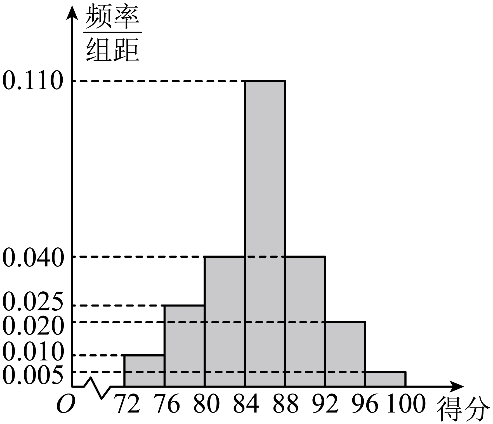

<table><tr><td>
分数区间
</td><td>
频数
</td></tr><tr><td>

</td><td>
1
</td></tr><tr><td>

</td><td>
5
</td></tr><tr><td>

</td><td>
12
</td></tr><tr><td>

</td><td>
14
</td></tr><tr><td>

</td><td>
4
</td></tr><tr><td>
 
</td><td>
3
</td></tr><tr><td>

</td><td>
1
</td></tr></table>

定义评委对插花作品的“观赏值”如下所示：

<table><tr><td>
分数区间
</td><td>

</td><td>

</td><td>

</td></tr><tr><td>
观赏值
</td><td>
1
</td><td>
2
</td><td>
3
</td></tr></table>

(1)估计甲组插花作品所得分数的中位数（结果保留两位小数）；

(2)若该校拟从甲、乙两组插花作品中选出1个用于展览，从这两组插花作品的最后得分来看该校会选哪一组，请说明理由（同一组中的数据用该组区间的中点值作代表）；

(3)从40名评委中随机抽取1人进行调查，试估计其对乙组插花作品的“观赏值”比对甲组插花作品的“观赏值”高的概率.

【解析】（1）设甲组插花作品所得分数的中位数为，

由频率分布直方图可得甲组得分在前三个分数区间的频率之和为0.3，在最后三个分数区间的频率之和为0.26，故，

所以，解得.

即估计甲组插花作品所得分数的中位数为85.82

（2）由频率分布直方图可知，甲组插花作品的最后得分约为

由乙组插花作品所得分数的频数分布表，得下表

<table><tr><td>
分数区间
</td><td>
频数
</td><td>
频率
</td></tr><tr><td>

</td><td>
1
</td><td>
0.025
</td></tr><tr><td>

</td><td>
5
</td><td>
0.125
</td></tr><tr><td>

</td><td>
12
</td><td>
0.300
</td></tr><tr><td>

</td><td>
14
</td><td>
0.350
</td></tr><tr><td>

</td><td>
4
</td><td>
0.100
</td></tr><tr><td>
 
</td><td>
3
</td><td>
0.075
</td></tr><tr><td>

</td><td>
1
</td><td>
0.025
</td></tr></table>

所以乙组插花作品的最后得分约为

.

因为，所以该校会选择甲组插花作品用于展览

（3）设“对乙组插花作品的‘观赏值’比对甲组插花作品的‘观赏值’高”为事件，

“对乙组插花作品的‘观赏值’为2”为事件，

“对乙组插花作品的‘观赏值’为3”为事件，

“对甲组插花作品的‘观赏值’为1”为事件，

“对甲组插花作品的‘观赏值’为2”为事件，

则.

，，

由频数分布表得，，.

因为事件与相互独立，其中，，所以

，

所以估计该评委对乙组插花作品的“观赏值”比对甲组插花作品的“观赏值”高的概率为0.225

**【解题方法总结】**

求解古典概型的交汇问题的步骤

（1）将题目条件中的相关知识转化为事件；

（2）判断事件是否为古典概型；

（3）选用合适的方法确定样本点个数；

（4）代入古典概型的概率公式求解．

**题型七：有放回与无放回问题的概率**

<strong>例19．</strong>（2024·辽宁鞍山·统考模拟预测）一个袋子中有大小和质地相同的5个球，其中有3个红色球，2个白色球，从袋中不放回地依次随机摸出2个球，则第2次摸到红色球的概率为__________.

【答案】

【解析】由题意，

袋子中有相同的5个球，3个红球，2个白球，

不放回地依次随机摸出2个球，

∴第1次可能摸到1白色球或1红色球

∴第2次摸到红色球的概率为：，

故答案为：.

<strong>例20．</strong>（2024·黑龙江哈尔滨·哈九中校考模拟预测）已知红箱内有3个红球、2个白球，白箱内有2个红球、3个白球，所有小球大小、形状完全相同．第一次从红箱内取出一球后再放回去，第二次从与第一次取出的球颜色相同的箱子内取出一球，然后再放回去，以此类推，第次从与第<em>k</em>次取出的球颜色相同的箱子内取出一球，然后再放回去．则第3次取出的球是红球的概率为______．

【答案】/0.504

【解析】3次取出的结果共有8种，分别为：（红，红，红）、（红，红，白）、（红，白，红）、

（红，白，白）、（白，红，红）（白，红，白）、（白，白，红）、（白，白，白），

其中第3次取出的球是红球的情况为（红，红，红）、（红，白，红）、（白，红，红）、（白，白，红）、共4种.

根据题意，，，

，

所以，第3次取出的球是红球的概率.

故答案为：

【答案】/0.75

则，

故答案为：．

<strong>例21．</strong>（2024·湖北·校联考三模）袋中有形状和大小相同的两个红球和三个白球，甲、乙两人依次不放回地从袋中摸出一球，后摸球的人不知前面摸球的结果，则乙摸出红球的概率是___________．

【答案】/0.4

【解析】有两种情况：

①甲摸到红球乙再摸到红球得概率为：

②甲摸到白球乙再摸到红球得概率为：，

故乙摸到红球的概率．

故答案为：

<strong>变式24．</strong>（2024·浙江·校联考二模）袋中有形状大小相同的球5个，其中红色3个，黄色2个，现从中随机连续摸球，每次摸1个，当有两种颜色的球被摸到时停止摸球，记随机变量为此时已摸球的次数，则__________.

【答案】

【解析】由题意可得

若两次摸到两种颜色的球，则；

若三次摸到两种颜色的球，则；

若四次摸到两种颜色的球，则；

故.

故答案为：

<strong>变式25．</strong>（2024·全国·模拟预测）小颖和小星在玩抽卡游戏，规则如下：桌面上放有5张背面完全相同的卡牌，卡牌正面印有两种颜色的图案，其中一张为紫色，其余为蓝色.现将这些卡牌背面朝上放置，小颖和小星轮流抽卡，每次抽一张卡，并且抽取后不放回，直至抽到印有紫色图案的卡牌停止抽卡.若小颖先抽卡，则小星抽到紫卡的概率为__________.

【答案】/

【解析】按照规则，两人依次抽卡的所有情形如下表所示，

<table><tr><td></td><td>
小颖
</td><td>
小星
</td><td>
小颖
</td><td>
小星
</td><td>
小颖
</td></tr><tr><td>
情形一
</td><td>
紫
</td><td></td><td></td><td></td><td></td></tr><tr><td>
情形二
</td><td>
蓝
</td><td>
紫
</td><td></td><td></td><td></td></tr><tr><td>
情形三
</td><td>
蓝
</td><td>
蓝
</td><td>
紫
</td><td></td><td></td></tr><tr><td>
情形四
</td><td>
蓝
</td><td>
蓝
</td><td>
蓝
</td><td>
紫
</td><td></td></tr><tr><td>
情形五
</td><td>
蓝
</td><td>
蓝
</td><td>
蓝
</td><td>
蓝
</td><td>
紫
</td></tr></table>

其中情形二和情形四为小星最终抽到紫卡，则小星抽到紫卡的概率为.

故答案为：.

<strong>变式26．</strong>（2024·浙江·模拟预测）袋中有大小质地均相同的1个黑球，2个白球，3个红球，现从袋中随机取球，每次取一个，不放回，直到某种颜色的球全部取出为止，则最后一个球是白球的概率是______．

【答案】

【解析】由题可知，要使直到某种颜色的球全部取出为止，最后一个球是白球，则摸球次数可能为2，3，4次.

设两次取球便结束，最后一个球是白球的概率为.

两次取球便结束，且最后一球为白球的情况为：两个球都是白球，情况数为2种.故

设三次取球便结束，最后一个球是白球的概率为.

三次取球便结束，且最后一球为白球的情况为：前两次为一白一红，情况数为：

.故.

设四次取球便结束，最后一个球是白球的概率为.

四次取球便结束，且最后一球为白球的情况为：前三次为两红一白，情况数为：

.故.

设直到某种颜色的球全部取出为止，最后一个球是白球的概率是，

则.

故答案为：

**题型八：概率的基本性质**

<strong>例22．</strong>（2024·全国·高三专题练习）某企业有甲、乙两个工厂共生产一精密仪器件，其中甲工厂生产了件，乙工厂生产了件，为了解这两个工厂各自的生产水平，质检人员决定采用分层抽样的方法从所生产的产品中随机抽取件样品，已知该精密仪器按照质量可分为四个等级．若从所抽取的样品中随机抽取一件进行检测，恰好抽到甲工厂生产的等级产品的概率为，则抽取的三个等级中甲工厂生产的产品共有______件．

【答案】

【解析】由分层抽样原则知：从甲工厂抽取了件样品，

设抽取甲工厂生产的等级产品有件，则，解得：，

抽取的三个等级中，甲工厂生产的产品共有件.

故答案为：.

<strong>例23．</strong>（2024·上海徐汇·高三上海民办南模中学校考阶段练习）已知袋中有（为正整数）个大小相同的编号球，其中黄球8个，红球个，从中任取两个球，取出的两球是一黄一红的概率为，则的最大值为__________.

【答案】

【解析】根据题意可得，黄球8个，红球个，从中任取两个球总共有种，

取出的两球是一黄一红总共有种；

所以从袋中任取两个球，取出的两球是一黄一红的概率；

令，利用基本不等式可得，

当且仅当时等号成立，

但为正整数，所以当时，；当时，；

即当或时，的最小值为，

所以，

即的最大值为

故答案为：

<strong>例24．</strong>（2024·全国·高三专题练习）一个口袋里有大小相同的白球个，黑球个，现从中随机一次性取出个球，若取出的两个球都是白球的概率为，则黑球的个数为______．

【答案】5

【解析】由题意得，所以，解得或（舍去），

即黑球的个数为．

故答案为：

<strong>变式27．</strong>（2024·四川遂宁·射洪中学校考模拟预测）为舒缓高考压力，射洪中学高三年级开展了“葵花心语”活动，每个同学选择一颗葵花种子亲自播种在花盆中，四个人为一互助组，每组四人的种子播种在同一花盆中，若盆中至少长出三株花苗，则可评为“阳光小组”．已知每颗种子发芽概率为0.8，全年级恰好共种了500盆，则大概有___________个小组能评为“阳光小组”．（结果四舍五入法保留整数）

【答案】410

【解析】由题意知，每一盆至少长出三株花苗包括“恰好长出三株花苗”和“长出四株花苗”两种情况，

其概率为，

即一盆花苗能被评为“阳光小组”的概率为，且被评为“阳光小组”的盆数服从二项分布，

所以500盆花苗中能被评为“阳光小组”的有.

故答案为：410

<strong>变式28．</strong>（2024·全国·高三专题练习）在某次考试中，要从20道题中随机地抽取6道题，若考生至少能答对其中的4道即可通过；若至少能答对其中的5道就获得“优秀”．已知某考生能答对其中10道题，并且知道他在这次考试中已经通过，则他获得“优秀”的概率为 __．

【答案】

【解析】设“他能答对其中的6道题”为事件*A*，“他能答对其中的5道题”为事件*B*，“他能答对其中的4道题”为事件*C*，

设“他考试通过”为事件*D*，“他考试获得优秀”为事件*E*．

则由题意可得*D*＝*A*∪*B*∪*C*，*E*＝*A*∪*B*，且*A*、*B*、*C*两两互斥．

．

又，，

∴．

故答案为：．

<strong>变式29．</strong>（2024·重庆·统考二模）饺子是我国的传统美食，不仅味道鲜美而且寓意美好.现锅中煮有白菜馅饺子4个，韭菜馅饺子3个，这两种饺子的外形完全相同.从中任意舀取3个饺子，则每种口味的饺子都至少舀取到1个的概率为___________.

【答案】

【解析】由条件可知，舀到的有1个白菜，2个韭菜，或是2个白菜，1个韭菜，

所以概率.

故答案为：

<strong>变式30．</strong>（2024·江西南昌·江西师大附中校考三模）城市地铁极大的方便了城市居民的出行，南昌地铁1号线是南昌市最早建成并成功运营的一条地铁线.已知1号地铁线的每辆列车有6节车厢，从5月1日起实行“夏季运行模式”，其中2节车厢开启强冷模式，2节车厢开启中冷模式，2节车厢开启弱冷模式.现在有甲、乙、丙3人同一时间同一地点乘坐同一趟地铁列车，由于个人原因，甲不选择强冷车厢，乙不选择弱冷车厢，丙没有限制，但他们都是独立而随机的选择一节车厢乘坐，则甲、乙、丙3人中恰有2人在同一车厢的概率为________．

【答案】

【解析】因为甲乙丙在同一车厢的概率为，甲乙在同一车厢的概率为，

甲丙在同一车厢的概率为，乙丙在同一车厢的概率为，

则甲乙丙恰有人在同一车厢的概率为.

故答案为：·

**【解题方法总结】**

求复杂互斥事件的概率的两种方法

（1）直接法

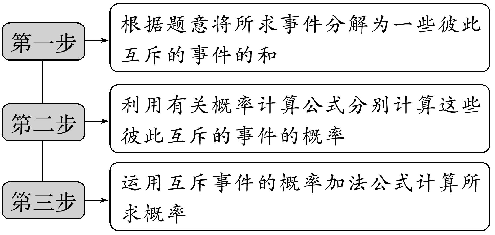

（2）间接法（正难则反，特别是“至多”“至少”型题目，用间接法求解简单）．

