**第8讲  幂函数与二次函数**

**知识梳理**

1、幂函数的定义

一般地，(为有理数)的函数，即以[底数](https://baike.baidu.com/item/%E5%BA%95%E6%95%B0/5416651)为[自变量](https://baike.baidu.com/item/%E8%87%AA%E5%8F%98%E9%87%8F/6895256)，幂为[因变量](https://baike.baidu.com/item/%E5%9B%A0%E5%8F%98%E9%87%8F)，[指数](https://baike.baidu.com/item/%E6%8C%87%E6%95%B0/3519666)为常数的函数称为幂函数.

2、幂函数的特征：同时满足一下三个条件才是幂函数

①的系数为1；		②的底数是自变量；	③指数为常数.

(3)幂函数的图象和性质

3、常见的幂函数图像及性质：

<table><tr><td>
函数
</td><td>

</td><td>

</td><td>

</td><td>

</td><td>

</td></tr><tr><td>
图象
</td><td>
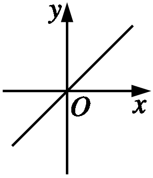
</td><td>
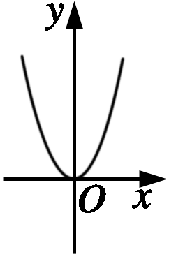
</td><td>
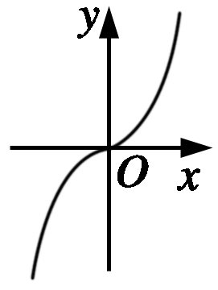
</td><td>
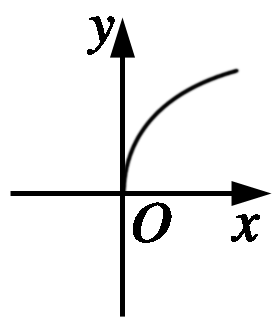
</td><td>
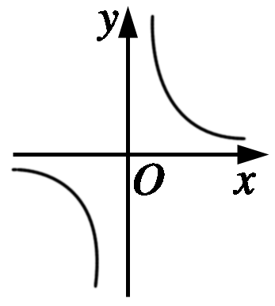
</td></tr><tr><td>
定义域
</td><td>

</td><td>

</td><td>

</td><td>

</td><td>

</td></tr><tr><td>
值域
</td><td>

</td><td>

</td><td>

</td><td>

</td><td>

</td></tr><tr><td>
奇偶性
</td><td>
奇
</td><td>
偶
</td><td>
奇
</td><td>
非奇非偶
</td><td>
奇
</td></tr><tr><td>
单调性
</td><td>
在上单调递增
</td><td>
在上单调递减，在上单调递增
</td><td>
在上单调递增
</td><td>
在上单调递增
</td><td>
在和上单调递减
</td></tr><tr><td>
公共点
</td><td colspan="5">

</td></tr></table>

4、二次函数解析式的三种形式

（1）一般式：；

（2）顶点式：；其中，为抛物线顶点坐标，为对称轴方程.

（3）零点式：，其中，是抛物线与轴交点的横坐标.

5、二次函数的图像

二次函数的图像是一条抛物线，对称轴方程为，顶点坐标为.

（1）单调性与最值

①当时，如图所示，抛物线开口向上，函数在上递减，在上递增，当时，；

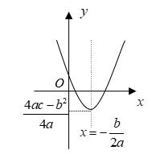

②当时，如图所示，抛物线开口向下，函数在上递增，在上递减，当时，

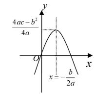

（2）与轴相交的弦长

当时，二次函数的图像与轴有两个交点和，.

6、二次函数在闭区间上的最值

闭区间上二次函数最值的取得一定是在区间端点或顶点处.

对二次函数，当时，在区间上的最大值是，最小值是，令：

（1）若，则；

（2）若，则；

（3）若，则；

（4）若，则.

**【解题方法总结】**

1、幂函数在第一象限内图象的画法如下：

①当时，其图象可类似画出；

②当时，其图象可类似画出；

③当时，其图象可类似画出．

2、实系数一元二次方程的实根符号与系数之间的关系

（1）方程有两个不等正根

（2）方程有两个不等负根

（3）方程有一正根和一负根，设两根为

3**、** 一元二次方程的根的分布问题

一般情况下需要从以下4个方面考虑：

（1）开口方向；（2）判别式；（3）对称轴与区间端点的关系；（4）区间端点函数值的正负.

设为实系数方程的两根，则一元二次的根的分布与其限定条件如表所示.

<table><tr><td>
根的分布
</td><td>
图像
</td><td>
限定条件
</td></tr><tr><td>

</td><td>
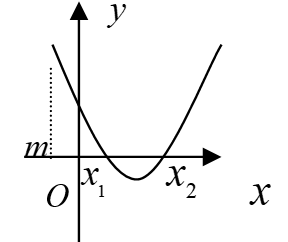
</td><td>

</td></tr><tr><td>

</td><td>
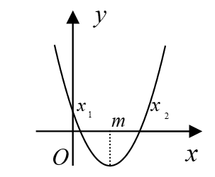
</td><td>

</td></tr><tr><td>

</td><td>
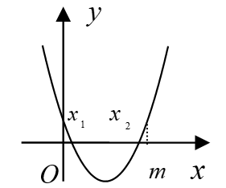
</td><td>

</td></tr><tr><td rowspan="5">
在区间内

没有实根
</td><td>

</td><td>

</td></tr><tr><td>

</td><td>

</td></tr><tr><td>

</td><td>

</td></tr><tr><td>

</td><td>

</td></tr><tr><td>

</td><td>

</td></tr><tr><td rowspan="2">
在区间内

有且只有一个实根
</td><td>

</td><td>

</td></tr><tr><td>

</td><td>

</td></tr><tr><td>
在区间内

有两个不等实根
</td><td>

</td><td>

</td></tr></table>

4、有关二次函数的问题，关键是利用图像.

（1）要熟练掌握二次函数在某区间上的最值或值域的求法，特别是含参数的两类问题——动轴定区间和定轴动区间，解法是抓住“三点一轴”，三点指的是区间两个端点和区间中点，一轴指对称轴.即注意对对称轴与区间的不同位置关系加以分类讨论，往往分成：①轴处在区间的左侧；②轴处在区间的右侧；③轴穿过区间内部（部分题目还需讨论轴与区间中点的位置关系），从而对参数值的范围进行讨论.

（2）对于二次方程实根分布问题，要抓住四点，即开口方向、判别式、对称轴位置及区间端点函数值正负.

**必考题型全归纳**

**题型一：幂函数的定义及其图像**

**【例1】**（2024·宁夏固原·高三隆德县中学校联考期中）已知函数是幂函数，且在上递减，则实数（    ）

A．	B．或	C．	D．

**【对点训练1】**（2024·海南·统考模拟预测）已知为幂函数，则（    ）．

A．在上单调递增	B．在上单调递减

C．在上单调递增	D．在上单调递减

**【对点训练2】**（2024·河北·高三学业考试）已知幂函数的图象过点，则的值为（    ）

A．2	B．3	C．4	D．9

<strong>【对点训练3】</strong>（2024·全国·高三专题练习）幂函数中<em>a</em>的取值集合<em>C</em>是的子集，当幂函数的值域与定义域相同时，集合<em>C</em>为（    ）

A．	B．	C．	D．

<strong>【对点训练4】</strong>（2024·全国·高三专题练习）已知幂函数（且互质）的图象关于<em>y</em>轴对称，如图所示，则（    ）

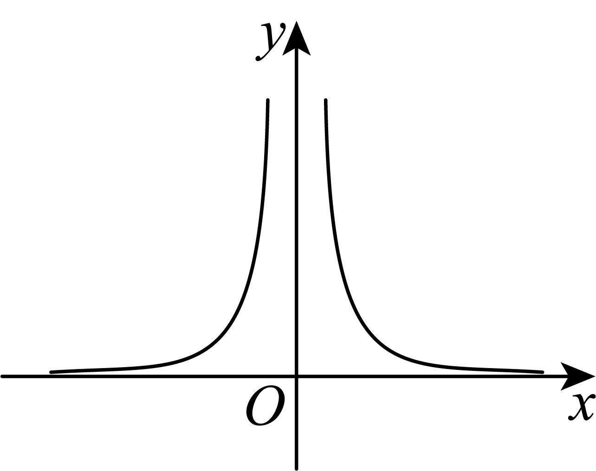

A．*p*，*q*均为奇数，且

B．*q*为偶数，*p*为奇数，且

C．*q*为奇数，*p*为偶数，且

D．*q*为奇数，*p*为偶数，且

**【解题方法总结】**

确定幂函数的定义域，当为分数时，可转化为根式考虑，是否为偶次根式，或为则被开方式非负.当时，底数是非零的.

**题型二：幂函数性质的综合应用**

<strong>【例2】</strong>（2024·吉林长春·高三校考期中）已知幂函数的图象关于原点对称，则满足成立的实数<em>a</em>的取值范围为\_\_\_\_\_\_\_\_\_\_\_.

**【对点训练5】**（2024·全国·高三专题练习）下面命题：①幂函数图象不过第四象限；②图象是一条直线；③若函数的定义域是，则它的值域是；④若函数的定义域是，则它的值域是；⑤若函数的值域是，则它的定义域一定是．其中不正确命题的序号是\_\_\_\_\_\_\_\_．

**【对点训练6】**（2024·河南·校联考模拟预测）已知，，若对，，，则实数的取值范围是\_\_\_\_\_\_\_\_\_.

**【对点训练7】**（2024·福建三明·高三校考期中）已知，则实数的取值范围是\_\_\_\_\_\_\_\_\_\_\_

**【对点训练8】**（2024·全国·高三专题练习）已知函数，若函数的值域为，则实数的取值范围为\_\_\_\_\_\_\_\_\_\_．

**【对点训练9】**（2024·全国·高三专题练习）不等式的解集为：\_\_\_\_\_\_\_\_\_．

<strong>【对点训练10】</strong>（2024·江苏淮安·江苏省盱眙中学校考模拟预测）已知幂函数，若，则<em>a</em>的取值范围是\_\_\_\_\_\_\_\_\_\_.

**【对点训练11】**（2024·全国·高三专题练习）已知，若幂函数奇函数，且在上为严格减函数，则\_\_\_\_\_\_\_\_\_\_.

**【解题方法总结】**

紧扣幂函数的定义、图像、性质，特别注意它的单调性在不等式中的作用，这里注意为奇数时，为奇函数，为偶数时，为偶函数.

**题型三：二次方程的实根分布及条件**

<strong>【例3】</strong>（2024·全国·高三专题练习）关于<em>x</em>的方程有两个实数根，，且，那么<em>m</em>的值为（    ）

A．	B．	C．或1	D．或4

<strong>【对点训练12】</strong>（2024·全国·高三专题练习）设<em>a</em>为实数，若方程在区间上有两个不相等的实数解，则<em>a</em>的取值范围是（    ）.

A．	B．

C．	D．

**【对点训练13】**（2024·全国·高三专题练习）方程的一根在区间内，另一根在区间内，则的取值范围是（    ）

A．	B．	C．	D．

**【对点训练14】**（2024·全国·高三专题练习）关于的方程有两个不相等的实数根，且，那么的取值范围是（    ）

A．	B．

C．	D．

**【解题方法总结】**

结合二次函数的图像分析实根分布，得到其限定条件，列出关于参数的不等式，从而解不等式求参数的范围.

**题型四：二次函数“动轴定区间”、“定轴动区间”问题**

**【例4】**（2024·上海·高三专题练习）已知.

(1)若，，解关于的不等式；

(2)若，在上的最大值为，最小值为，求证：.

**【对点训练15】**（2024·全国·高三专题练习）已知函数是定义在上的奇函数，且时，，.

(1)求在区间上的解析式；

(2)若对，则，使得成立，求的取值范围.

**【对点训练16】**（2024·全国·高三专题练习）已知函数．

(1)利用函数单调性的定义证明是单调递增函数；

(2)若对任意，恒成立，求实数的取值范围．

**【对点训练17】**（2024·全国·高三专题练习）已知函数．

(1)当时，解关于*x*的不等式；

(2)函数在上的最大值为0，最小值是，求实数*a*和*t*的值．

**【对点训练18】**（2024·全国·高三专题练习）已知值域为的二次函数满足，且方程的两个实根满足．

(1)求的表达式；

(2)函数在区间上的最大值为，最小值为，求实数的取值范围．

**【对点训练19】**（2024·全国·高三专题练习）已知函数为偶函数.

（1）求的值；

（2）设函数，是否存在实数，使得函数在区间上的最小值为？若存在，求出的值；若不存在，请说明理由.

**【解题方法总结】**

“动轴定区间 ”、“定轴动区间”型二次函数最值的方法：

（1）根据对称轴与区间的位置关系进行分类讨论；

（2）根据二次函数的单调性，分别讨论参数在不同取值下的最值，必要时需要结合区间端点对应的函数值进行分析；

（3）将分类讨论的结果整合得到最终结果.

**题型五：二次函数最大值的最小值问题**

**【例5】**（2024·湖南衡阳·高一统考期末）二次函数为偶函数，，且恒成立．

(1)求的解析式；

(2)，记函数在上的最大值为，求的最小值．

**【对点训练20】**（2024·全国·高三专题练习）已知函数，当时，设的最大值为，求的最小值．

**【对点训练21】**（2024·河北保定·高一河北省唐县第一中学校考期中）已知函数，

(1)当时，①求函数单调递增区间；②求函数在区间的值域；

(2)当时，记函数的最大值为，求的最小值．

**【对点训练22】**（2024·浙江·高一校联考阶段练习）已知函数．

(1)当时，解方程；

(2)当时，记函数在上的最大值为，求的最小值

