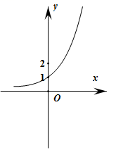
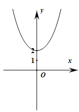
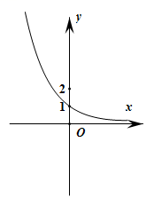
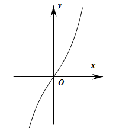
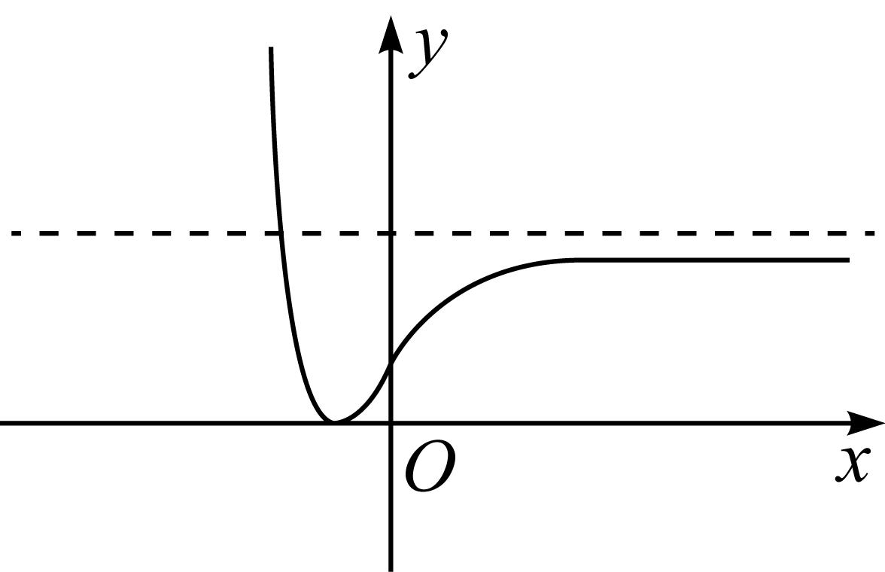

**第9讲  指数与指数函数**

**知识梳理**

**1、指数及指数运算**

(1)根式的定义：

一般地，如果，那么叫做的次方根，其中，，记为，称为根指数，称为根底数．

(2)根式的性质：

当为奇数时，正数的次方根是一个正数，负数的次方根是一个负数.

当为偶数时，正数的次方根有两个，它们互为相反数.

(3)指数的概念：指数是幂运算中的一个参数，为底数，为指数，指数位于底数的右上角，幂运算表示指数个底数相乘.

(4)有理数指数幂的分类

①正整数指数幂；②零指数幂；

③负整数指数幂，；④的正分数指数幂等于，的负分数指数幂没有意义．

(5)有理数指数幂的性质

①，，；②，，；

③，，；④，，．

**2、指数函数**

<table><tr><td colspan="3">

</td></tr><tr><td></td><td>

</td><td>

</td></tr><tr><td>
图象
</td><td>

</td><td>

</td></tr><tr><td rowspan="6">
性质
</td><td colspan="2">
①定义域，值域
</td></tr><tr><td colspan="2">
②，即时，，图象都经过点
</td></tr><tr><td colspan="2">
③，即时，等于底数
</td></tr><tr><td>
④在定义域上是单调减函数
</td><td>
在定义域上是单调增函数
</td></tr><tr><td>
⑤时，；时，
</td><td>
时，；时，
</td></tr><tr><td colspan="2">
⑥既不是奇函数，也不是偶函数
</td></tr></table>

**【解题方法总结】**

1、指数函数常用技巧

(1)当底数大小不定时，必须分“”和“”两种情形讨论．

(2)当时，，；的值越小，图象越靠近轴，递减的速度越快．

当时，；的值越大，图象越靠近轴，递增速度越快．

(3)指数函数与的图象关于轴对称．

**必考题型全归纳**

**题型一：指数运算及指数方程、指数不等式**

**【例1】**（2024·海南省直辖县级单位·统考模拟预测）（    ）

A．	B．	C．	D．

**【对点训练1】**（2024·全国·高三专题练习）下列结论中，正确的是（     ）

A．设则	B．若，则

C．若，则	D．

**【对点训练2】**（2024·全国·高三专题练习）（    ）

A．	B．	C．	D．

<strong>【对点训练3】</strong>（2024·全国·高三专题练习）甲､乙两人解关于<em>x</em>的方程，甲写错了常数<em>b</em>，得到的根为或<em>x</em>=，乙写错了常数<em>c</em>，得到的根为或，则原方程的根是（    ）

A．或	B．或

C．或	D．或

**【对点训练4】**（2024·全国·高三专题练习）若关于的方程有解，则实数的取值范围是（    ）

A．	B．	C．	D．

**【对点训练5】**（2024·上海青浦·统考一模）不等式的解集为\_\_\_\_\_\_．

**【对点训练6】**（2024·全国·高三专题练习）不等式的解集为\_\_\_\_\_\_\_\_\_\_\_.

**【解题总结】**

利用指数的运算性质解题.对于形如，，的形式常用“化同底”转化，再利用指数函数单调性解决；或用“取对数”的方法求解.形如或的形式，可借助换元法转化二次方程或二次不等式求解.

**题型二：指数函数的图像及性质**

**【例2】（多选题）**（2024·全国·高三专题练习）函数的图象可能为（    ）

A．B．C．	D．

**【对点训练7】**（2024·全国·高三专题练习）已知的定义域为R，则实数a的取值范围是\_\_\_\_\_\_．

**【对点训练8】**（2024·宁夏银川·校联考二模）已知函数，，则其值域为\_\_\_\_\_\_\_．

**【对点训练9】**（2024·全国·高三专题练习）已知函数在内的最大值是最小值的两倍，且，则\_\_\_\_\_\_

**【对点训练10】**（2024·全国·高三专题练习）函数是指数函数，则（    ）

A．或	B．	C．	D．且

<strong>【对点训练11】</strong>（2024·全国·高三专题练习）函数的大致图像如图，则实数<em>a</em>，<em>b</em>的取值只可能是（　　）

A．	B．

C．	D．

<strong>【对点训练12】</strong>（2024·全国·高三专题练习）已知函数（且）的图象恒过定点<em>A</em>，若点<em>A</em>的坐标满足关于<em>x</em>，<em>y</em>的方程，则的最小值为（    ）

A．8	B．24	C．4	D．6

**【对点训练13】（多选题）**（2024·浙江绍兴·统考模拟预测）预测人口的变化趋势有多种方法，“直接推算法”使用的公式是，其中为预测期人口数，为初期人口数，为预测期内人口年增长率，为预测期间隔年数，则（    ）

A．当，则这期间人口数呈下降趋势

B．当，则这期间人口数呈摆动变化

C．当时，的最小值为3

D．当时，的最小值为3

**【对点训练14】（多选题）**（2024·山东聊城·统考二模）已知函数，则（    ）

A．函数是增函数

B．曲线关于对称

C．函数的值域为

D．曲线有且仅有两条斜率为的切线

**【解题总结】**

解决指数函数有关问题，思路是从它们的图像与性质考虑，按照数形结合的思路分析，从图像与性质找到解题的突破口，但要注意底数对问题的影响.

**题型三：指数函数中的恒成立问题**

<strong>【例3】</strong>（2024·全国·高三专题练习）已知函数，若不等式在R上恒成立，则实数<em>m</em>的取值范围是\_\_\_\_\_\_\_\_.

<strong>【对点训练15】</strong>（2024·全国·高三专题练习）设，当时，恒成立，则实数<em>m</em>的取值范围是\_\_\_\_\_\_\_\_\_\_\_\_.

**【对点训练16】**（2024·全国·高三专题练习）已知不等式，对于恒成立，则实数的取值范围是\_\_\_\_\_\_\_\_\_．

**【对点训练17】**（2024·全国·高三专题练习）若，不等式恒成立，则实数的取值范围是\_\_\_\_\_\_．

**【对点训练18】**（2024·上海徐汇·高三位育中学校考开学考试）已知函数是定义域为的奇函数.

(1)求实数的值，并证明在上单调递增；

(2)已知且，若对于任意的、，都有恒成立，求实数的取值范围.

**【解题总结】**

已知不等式能恒成立求参数值(取值范围)问题常用的方法：

（1）函数法：讨论参数范围，借助函数单调性求解；

（2）分离参数法：先将参数分离，转化成求函数的值域或最值问题加以解决；

（3）数形结合法：先对解析式变形，进而构造两个函数，然后在同一平面直角坐标系中画出函数的图象，利用数形结合的方法求解．

**题型四：指数函数的综合问题**

**【例4】**（2024·全国·合肥一中校联考模拟预测）已知函数，则不等式的解集为（    ）

A．	B．

C．	D．

**【对点训练19】**（2024·上海浦东新·华师大二附中校考模拟预测）设.若函数的定义域为，则关于的不等式的解集为\_\_\_\_\_\_\_\_\_\_.

**【对点训练20】**（2024·河南安阳·统考三模）已知函数的图象关于坐标原点对称，则\_\_\_\_\_\_\_\_\_\_.

<strong>【对点训练21】</strong>（2024·江西景德镇·统考模拟预测）已知是定义在上的偶函数，且当时，，则满足的<em>x</em>的取值范围是\_\_\_\_\_\_\_\_\_\_\_\_\_\_．

**【对点训练22】**（2024·河南信阳·校联考模拟预测）已知实数，满足，，则\_\_\_\_\_\_\_\_\_\_．

**【对点训练23】（多选题）**（2024·黑龙江哈尔滨·哈尔滨三中校考二模）点在函数的图象上，当，则可能等于（    ）

A．-1	B．	C．	D．0

