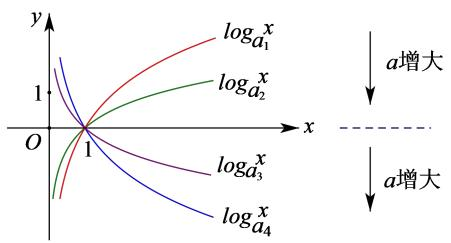
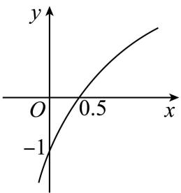

# 第10讲 对数与对数函数

# 知识梳理

# 1、对数式的运算

(1) 对数的定义: 一般地, 如果 $a^x = \mathrm{N}(a > 0$ 且 $a \neq 1$ ), 那么数 $x$ 叫做以 $a$ 为底 $\mathbf{N}$ 的对数, 记作 $x = \log_a \mathrm{N}$ , 读作以 $a$ 为底 $\mathbf{N}$ 的对数, 其中 $a$ 叫做对数的底数, $\mathbf{N}$ 叫做真数.

(2) 常见对数:

①一般对数：以 $a(a > 0$ 且 $a \neq 1)$ 为底，记为 $\log_a^N$ ，读作以 $a$ 为底 $N$ 的对数；

②常用对数:以10为底,记为lgN;

③自然对数:以 e 为底,记为 lnN;

(3) 对数的性质和运算法则：

① $\log_a^1 = 0; \log_a^a = 1$ ; 其中 $a > 0$ 且 $a \neq 1$ ;  
② $a^{\log_{a}^{N}}=N$ （其中a>0且 $a\neq1,N>0$ ）；  
③对数换底公式： $\log_a b = \frac{\log_c b}{\log_c a}$   
④ $\log_a(\mathrm{MN}) = \log_a\mathrm{M} + \log_a\mathrm{N}$ ;   
⑤ $\log_a\frac{\mathbf{M}}{\mathbf{N}} = \log_a\mathbf{M} - \log_a\mathbf{N};$   
⑥ $\log_{a^m} b^n = \frac{n}{m} \log_a b (m, n \in \mathbb{R})$ ;   
⑦ $a^{\log_{a}b}=b$ 和 $\log_{a}a^{b}=b;$   
⑧ $\log_a b = \frac{1}{\log_b a}$ ;

# 2、对数函数的定义及图像

(1) 对数函数的定义: 函数 $y = \log_{a} x (a > 0 \text{ 且 } a \neq 1)$ 叫做对数函数.

对数函数的图象

<table><tr><td></td><td>a&gt;1</td><td>0</td></tr><tr><td>图象</td><td></td><td></td></tr><tr><td rowspan="5">性质</td><td colspan="2">定义域:(0,+∞)</td></tr><tr><td colspan="2">值域:R</td></tr><tr><td colspan="2">过定点(1,0),即x=1时,y=0</td></tr><tr><td>在(0,+∞)上增函数</td><td>在(0,+∞)上是减函数</td></tr><tr><td>当00,当x≥1时,y≥0</td><td>当00,当x≥1时,y≤0</td></tr></table>

# 【解题方法总结】

# 1、对数函数常用技巧

在同一坐标系内，当 $a > 1$ 时，随 $a$ 的增大，对数函数的图象愈靠近 $x$ 轴；当 $0 < a < 1$ 时，对数函数的图象随 $a$ 的增大而远离 $x$ 轴。（见下图）

line

| x    | log_a1^x | log_a2^x | log_a3^x | log_a4^x |
|------|----------|----------|----------|----------|
| 0    | 1        | 1        | 1        | 1        |
| 1    | 1        | 1        | 1        | 1        |

# 必考题型全归纳

# 1 题型一: 对数运算及对数方程、对数不等式

271 (2024·四川成都·成都七中校考模拟预测) $e^{\ln 3} - 81^{\frac{1}{4}} + \log_{\sqrt{3} + 1}\frac{\sqrt{3} - 1}{2} =$ \_\_\_\_.

272 (2024·辽宁沈阳·沈阳二中校考模拟预测)已知 $\lg a + b = -2, a^{b} = 10$ ，则 a = \_\_\_\_.

273 (2024·上海徐汇·位育中学校考模拟预测)方程 $\lg (-2x) = \lg (3 - x^2)$ 的解集为

274 (2024·山东淄博·统考二模)设 p > 0, q > 0，满足 $\log_{4}p = \log_{6}q = \log_{9}(2p + q)$ ，则 $\frac{p}{q} =$ \_\_\_\_.

275 (2024·天津南开·统考二模)计算 $\log_{3}32 \cdot \log_{4}9 - \log_{2}\frac{3}{4} + \log_{2}6$ 的值为 \_\_\_\_.

276 (2024·全国·高三专题练习)若 $\log_{14}2 = a, 14^{b} = 5$ ，用 a, b 表示 $\log_{35}28 =$ \_\_\_\_

277 (2024·上海·高三校联考阶段练习)若 $12^{a}=3^{b}=m$ ，且 $\frac{1}{a}-\frac{1}{b}=2$ ，则 m= \_\_\_\_.

278 (2024·全国·高三专题练习) $(\log_63)^2 + (\log_62)^2 + \frac{2\lg 3 \cdot \lg 2}{(\lg 3 + \lg 2)^2} =$ \_\_\_\_；

279 (2024·全国·高三专题练习)解关于 x 的不等式 $\log_{2}(2-4^{x})<x$ 解集为 \_\_\_\_.

280 (2024·上海杨浦·高三上海市杨浦高级中学校考开学考试)已知函数 $f(x)$ 是定义在R上的奇函数,当x>0时, $f(x)=\log_{2}x$ ,则 $f(x)\geqslant-2$ 的解集是\_\_\_\_.

281 (2024·上海浦东新·高三华师大二附中校考阶段练习)方程 $2^{x} + \log_{4}x = 17$ 的解为 \_\_\_\_.

# 2 题型二: 对数函数的图像

282 (2024·全国·高三专题练习)已知函数 $y=\log_{a}(x+b)(a,b$ 为常数, 其中 a>0 且 $a\neq1)$ 的图象如图所示, 则下列结论正确的是 ()

line

| x | y |
|---|---|
| 0 | -1 |
| 0.5 | 0.5 |

A. $a = 0.5, b = 2$

B. $a = 2, b = 2$

C. $a = 0.5, b = 0.5$

D. a=2, b=0.5

283 (2024·全国·高三专题练习)函数 $f(x) = \log_a (x - 1) + 2$ 的图象恒过定点（）

A. $(2,2)$

B. $(2,1)$

C. $(3,2)$

D. $(2,0)$

284 (2024·北京·统考模拟预测)已知函数 $f(x)=\log_{2}x-(x-1)^{2}$ ，则不等式 $f(x)<0$ 的解集为（）

A. $(- \infty, 1) \cup (2, +\infty)$

B. $(0,1)\cup(2,+\infty)$

C. $(1,2)$

D. $(1,+\infty)$

285 (2024·北京·高三统考学业考试)将函数 $y=\log_{2}x$ 的图象向上平移 1 个单位长度, 得到函数 $y=f(x)$ 的图象, 则 $f(x)=$ ()

A. $\log_2(x + 1)$

B. $1 + \log_2x$

C. $\log_2(x - 1)$

D. $-1 + \log_2x$

286 (2024·北京海淀·清华附中校考模拟预测)不等式 $2\log_3 x - (x - 1)(x - 2) > 0$ 的解集为 \_\_\_\_.

287 (多选题)(2024·全国·高三专题练习)当 $0<x\leqslant\frac{1}{2}$ 时, $4^{x}\leqslant\log_{a}x$ ,则a的值可以为()

A. $\frac{\sqrt{2}}{2}$

B. $\frac{\sqrt{3}}{2}$

C. $\frac{\sqrt{6}}{3}$

D. $\sqrt{2}$

# 题型三: 对数函数的性质 (单调性、最值 (值域))

288 (2024·全国·高三专题练习)已知函数 $f(x)=\log_{3}(1-ax)$ ，若 $f(x)$ 在 $(-∞,1]$ 上为减函数，则 a 的取值范围为（）

A. $(0, +\infty)$

B. $(0,1)$

C. $(1,2)$

D. $(-∞,1)$

289 (2024·新疆阿勒泰·统考三模)正数 a, b 满足 $2^{a} - 4^{b} = \log_{2}b - \log_{2}a$ ，则 a 与 2b 大小关系为 \_\_\_\_.

290 (2024·全国·高三专题练习)已知函数 $f(x)=\log_{a}x(a>0,a\neq1)$ 在 [1,4] 上的最大值是 2，则 a 等于 \_\_\_\_

291 (2024·全国·高三专题练习)若函数 $f(x)=\log_{a}x(a>0 \text{ 且 } a\neq1)$ 在 $\left[\frac{1}{2},4\right]$ 上的最大值为2，最小值为m，函数 $g(x)=(3+2m)\sqrt{x}$ 在 $[0,+\infty)$ 上是增函数，则a-m的值是\_\_\_\_.

292 (2024·全国·高三专题练习)若函数 $f(x)=\log_{a}(x^{2}-ax+1)$ 有最小值，则 a 的取值范围是 \_\_\_\_.

293 (2024·河南·校联考模拟预测)写出一个同时具有下列性质①②③的函数: $f(x)=$ \_\_\_\_.
① $f(x_{1}x_{2})=f(x_{1})+f(x_{2})$ ; ②当 $x\in(0,+\infty)$ 时， $f(x)$ 单调递减；③ $f(x)$ 为偶函数.

294 (2024·重庆渝中·高三重庆巴蜀中学校考阶段练习)函数 $y=\log_{\frac{1}{4}}(x^{2}-x-2)$ 的单调递区间为

A. $\left(-\infty,\frac{1}{2}\right)$

B. $(-∞,-1)$

C. $\left(\frac{1}{2},+\infty\right)$

D. $(2,+\infty)$

295 (2024·陕西宝鸡·统考二模)已知函数 $f(x) = \lg x + \lg (2 - x)$ ，则（）

A. $f(x)$ 在 $(0,1)$ 单调递减，在 $(1,2)$ 单调递增  
B. $f(x)$ 在 $(0,2)$ 单调递减  
C. $f(x)$ 的图像关于直线 x=1 对称  
D. $f(x)$ 有最小值,但无最大值

296 (2024·全国·高三专题练习)若函数 $f(x)=\left\{\begin{aligned}&2+a^{x},x\leqslant1,\\ &2a+\log_{a}x,x>1\end{aligned}\right.$ 在 R 上单调，则 a 的取值范围是

A. $(0,1)$

B. $[2, +\infty)$

C. $\left(0,\frac{1}{2}\right)\cup(2,+\infty)$

D. $(0,1)\cup [2, + \infty)$

# 4 题型四:对数函数中的恒成立问题

297 (2024·全国·高三专题练习)已知函数 $f(x) = \frac{9 + x^2}{x}$ , $g(x) = \log_2 x + a$ ，若存在 $x_1 \in [3,4]$ ，任意 $x_2 \in [4,8]$ ，使得 $f(x_1) \geqslant g(x_2)$ ，则实数 $a$ 的取值范围是 \_\_\_\_.  
298 (2024·全国·高三专题练习)若 $\forall x\in\left[\frac{1}{2},2\right]$ ，不等式 $2x^{2}-x\log_{\frac{1}{2}}x+ax<0$ 恒成立，则实数 a 的取值范围为 \_\_\_\_.  
299 (2024·全国·高三专题练习)已知函数 $f(x) = x^2 - 2x + 3$ , $g(x) = \log_2 x + m$ , 对任意的 $x_1$ , $x_2 \in [1, 4]$ 有 $f(x_1) > g(x_2)$ 恒成立, 则实数 $m$ 的取值范围是 \_\_\_\_.  
300 (2024·全国·高三专题练习)已知函数 $f(x)=x^{2}-2x+3, g(x)=\log_{2}x+m$ ，若对 $\forall x_{1}\in[2,4]$ ， $\exists x_{2}\in[16,32]$ ，使得 $f(x_{1})\geqslant g(x_{2})$ ，则实数 m 的取值范围为 \_\_\_\_.  
301 (2024·全国·高三专题练习)已知函数 $f(x) = (\log_a x)^2 + 2\log_a x + 3 (a > 0, a \neq 1)$ .

(1) 若 $f(3)=2$ ，求 a 的值；  
(2) 若对任意的 $x \in [8,12]$ , $f(x) > 6$ 恒成立, 求 a 的取值范围.

302 (2024·全国·高三专题练习)已知 $f(x)=3-2\log_{2}x$ , $g(x)=\log_{2}x$ .

(1) 当 $x \in [1,4]$ 时，求函数 $y = [f(x) + 1] \cdot g(x)$ 的值域；  
(2) 对任意 $x \in [2^{n}, 2^{n+1}]$ ，其中常数 $n \in N$ ，不等式 $f(x^{2}) \cdot f(\sqrt{x}) > \text{kg}(x)$ 恒成立，求实数 k 的取值范围.

# 5 题型五:对数函数的综合问题

303 (多选题)(2024·湖北·黄冈中学校联考模拟预测)已知 a > 1, b > 1, $\frac{a}{a-1} = 2^{a}$ , $\frac{b}{b-1} = \log_{2}b$ , 则以下结论正确的是 ()

A. $a + 2^{a} = b + \log_{2}b$

B. $\frac{1}{2^a} +\frac{1}{\log_2b} = 1$

C. $a - b <   - 2$

D. $a + b > 4$

304 (2024·海南海口·统考模拟预测)已知正实数 m, n 满足: $n \ln n = e^{m} - n \ln m$ , 则 $\frac{n}{m}$ 的最小值为 \_\_\_\_.

305 (多选题)(2024·广东惠州·统考一模)若 $6^{a}=2,6^{b}=3$ ，则()

A. $\frac{b}{a} > 1$

B. $ab < \frac{1}{4}$

C. $a^2 + b^2 < \frac{1}{2}$

D. $b - a > \frac{1}{5}$

306 (2024·河南·高三信阳高中校联考阶段练习)已知 $x_{1}, x_{2}$ 分别是方程 $x + \mathrm{e}^{x} = 3$ 和 $x + \ln x = 3$ 的根，若 $x_{1} + x_{2} = a + b$ ，实数 $a, b > 0$ ，则 $\frac{7b^2 + 1}{ab}$ 的最小值为 （）

A. 1

B. $\frac{7}{3}$

C. $\frac{67}{9}$

D. 2

307 (2024·全国·高三专题练习)若 $x_{1}$ 满足 $2^{x}=5-x$ ， $x_{2}$ 满足 $x+\log_{2}x=5$ ，则 $x_{1}+x_{2}$ 等于（）

A. 2

B. 3

C. 4

D. 5

308 (2024·全国·高三专题练习)已知 $x_{1}$ 是方程 $x \cdot 3^{x} = 2$ 的根， $x_{2}$ 是方程 $x \cdot \log_{3} x = 2$ 的根，则 $x_{1} \cdot x_{2}$ 的值为 ()

A. 2

B. 3

C. 6

D. 10

