# 第11讲 函数的图像

# 知识梳理

# 一、掌握基本初等函数的图像

(1) 一次函数；(2) 二次函数；(3) 反比例函数；(4) 指数函数；(5) 对数函数；(6) 三角函数.

# 二、函数图像作法

# 1、直接画

①确定定义域；②化简解析式；③考察性质：奇偶性(或其他对称性)、单调性、周期性、凹凸性；④特殊点、极值点、与横/纵坐标交点；⑤特殊线(对称轴、渐近线等).

# 2、图像的变换

# (1) 平移变换

①函数 $y = f(x + a) (a > 0)$ 的图像是把函数 $y = f(x)$ 的图像沿 $x$ 轴向左平移 $a$ 个单位得到的；  
②函数 $y = f(x - a) (a > 0)$ 的图像是把函数 $y = f(x)$ 的图像沿 $x$ 轴向右平移 $a$ 个单位得到的；  
③函数 $y = f(x) + a (a > 0)$ 的图像是把函数 $y = f(x)$ 的图像沿 $y$ 轴向上平移 $a$ 个单位得到的；  
④函数 $y=f(x)+a(a>0)$ 的图像是把函数 $y=f(x)$ 的图像沿 y 轴向下平移 a 个单位得到的；

# (2) 对称变换

①函数 $y = f(x)$ 与函数 $y = f(-x)$ 的图像关于 $y$ 轴对称；

函数 $y=f(x)$ 与函数的图像关于 x 轴对称；

函数 $y=f(x)$ 与函数 $y=-f(-x)$ 的图像关于坐标原点 $(0,0)$ 对称；

②若函数 $f(x)$ 的图像关于直线 $x = a$ 对称，则对定义域内的任意 $x$ 都有

$f(a-x)=f(a+x)$ 或 $f(x)=f(2a-x)$ (实质上是图像上关于直线 x=a 对称的两点连线的中点横坐标为 a，即 $\frac{(a-x)+(a+x)}{2}=a$ 为常数);

若函数 $f(x)$ 的图像关于点 $(a,b)$ 对称，则对定义域内的任意 $x$ 都有 $f(x) = 2b - f(2a - x)$ 或 $f(a - x) = 2b - f(a + x)$

③ $y=|f(x)|$ 的图像是将函数 $f(x)$ 的图像保留x轴上方的部分不变，将x轴下方的部分关于x轴对称翻折上来得到的(如图(a)和图(b))所示  
④ $y=f(|x|)$ 的图像是将函数 $f(x)$ 的图像只保留y轴右边的部分不变，并将右边的图像关于y轴对称得到函数 $y=f(|x|)$ 左边的图像即函数 $y=f(|x|)$ 是一个偶函数(如图(c)所示).

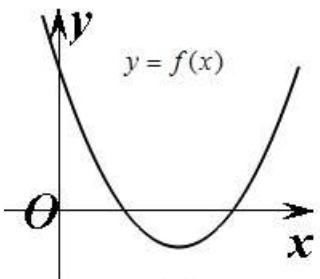

text_image

y = f(x)
O
x

(a)

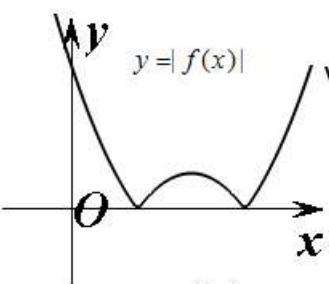

text_image

y=|f(x)|
O
x

(b)

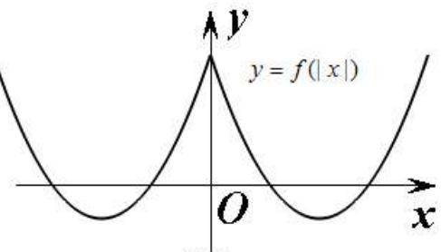

text_image

y
y = f(|x|)
O
x

(c)

注： $|f(x)|$ 的图像先保留 $f(x)$ 原来在 x 轴上方的图像，做出 x 轴下方的图像关于 x 轴对称图形，然后擦去 x 轴下方的图像得到；而 $f(|x|)$ 的图像是先保留 $f(x)$ 在 y 轴右方的图像，擦去 y 轴左方的图像，然后做出 y 轴右方的图像关于 y 轴的对称图形得到。这两变换又叫翻折变换。

⑤函数 $y=f^{-1}(x)$ 与 $y=f(x)$ 的图像关于 y=x 对称.

# (3) 伸缩变换

① $y = A f(x) (A > 0)$ 的图像, 可将 $y = f(x)$ 的图像上的每一点的纵坐标伸长 $(A > 1)$ 或缩短 $(0 < A < 1)$ 到原来的 A 倍得到.  
② $y=f(\omega x)(\omega>0)$ 的图像, 可将 $y=f(x)$ 的图像上的每一点的横坐标伸长 $(0<\omega<1)$ 或缩短 $(\omega>1)$ 到原来的 $\frac{1}{\omega}$ 倍得到.

# 【解题方法总结】

(1) 若 $f(m + x) = f(m - x)$ 恒成立，则 $y = f(x)$ 的图像关于直线 $x = m$ 对称.  
(2) 设函数 $y = f(x)$ 定义在实数集上，则函数 $y = f(x - m)$ 与 $y = f(m - x) (m > 0)$ 的图象关于直线 $x = m$ 对称.  
(3) 若 $f(a + x) = f(b - x)$ ，对任意 $x \in \mathbb{R}$ 恒成立，则 $y = f(x)$ 的图象关于直线 $x = \frac{a + b}{2}$ 对称.  
(4) 函数 $y = f(a + x)$ 与函数 $y = f(b - x)$ 的图象关于直线 $x = \frac{a + b}{2}$ 对称.  
(5) 函数 $y=f(x)$ .. 与函数 $y=f(2a-x)$ 的图象关于直线 x=a 对称.  
(6) 函数 $y = f(x)$ 与函数 $y = 2b - f(2a - x)$ 的图象关于点 $(a, b)$ 中心对称.  
(7) 函数平移遵循自变量“左加右减”，函数值“上加下减”。

# 必考题型全归纳

# 1 题型一:由解析式选图(识图)

309 (2024·山东烟台·统考二模)函数 $y = x(\sin x - \sin 2x)$ 的部分图象大致为 （）

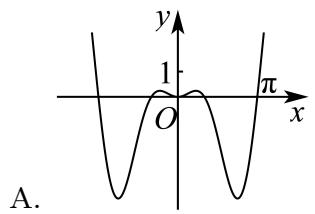

text_image

y
1
O
π
x
A.

text_image

y
1
O
π
x
B.

C.   
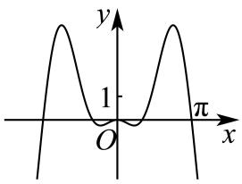

text_image

y
1
O
π
x

D.   
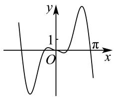

text_image

y
1
O
π
x

310 (2024·重庆·统考模拟预测)函数 $y=\frac{1}{2}(x-2)^{2}\ln x^{2}$ 的图像是 ()

A.   
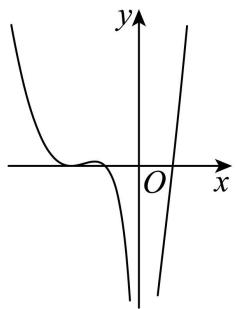

text_image

y
O x

B.   
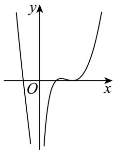

text_image

y
O
x

C.   
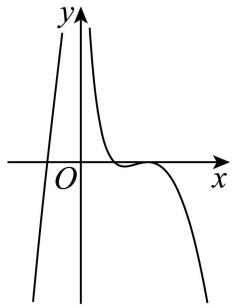

text_image

y
O
x

D.   
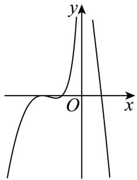

text_image

y
O
x

311 (2024·安徽安庆·安庆市第二中学校考二模)函数 $f(x)=\frac{1}{4x^{2}-1}+\sin2x$ 的部分图象大致是

A.   
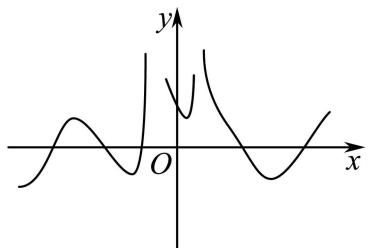

text_image

Graph of a function with y-axis and x-axis, showing a local minimum near x=0 and a peak above y=0 at the origin.

B.   
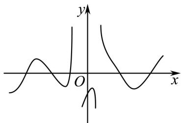

text_image

Mathematical graph showing a curve with x-axis and y-axis, featuring two distinct peaks and one trough.

C.   
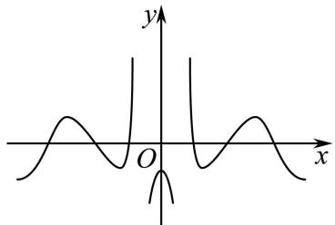

text_image

y
O
x

D.   
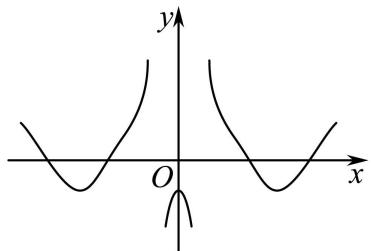

text_image

y
O
x

312 (2024·全国·模拟预测)函数 $f(x)=\frac{3x^{2}\cos2x}{2^{|x|}}$ 的大致图像为 ()

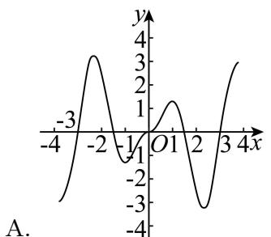

line

| x | y |
|---|---|
| -4 | -3 |
| -2 | 3 |
| -1 | -1 |
| 0 | 1 |
| 2 | -3 |
| 3 | 3 |
A.

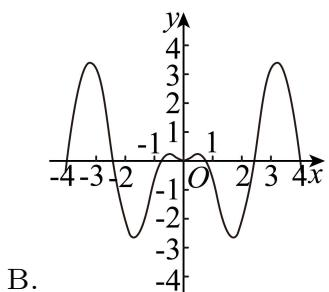

line

| x    | y     |
| ---- | ----- |
| -4   | 0     |
| -3   | 4     |
| -2   | 0     |
| -1   | -4    |
| 0    | 0     |
| 1    | -4    |
| 2    | 0     |
| 3    | 4     |
| 4    | 0     |

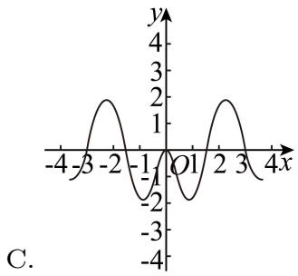

line

| x | y |
|---|---|
| -4 | 0 |
| -3 | 1 |
| -2 | 2 |
| -1 | 0 |
| 0 | -1 |
| 1 | 0 |
| 2 | 1 |
| 3 | 2 |
| 4 | 0 |

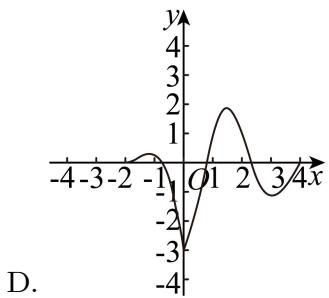

line

| x | y |
|---|---|
| -1 | -3 |
| -0.5 | -2 |
| 0 | 0 |
| 0.5 | 2 |
| 1 | 3 |
| 1.5 | 2 |
| 2 | 1 |
| 2.5 | 0 |
| 3 | -1 |
D.

# 2 题型二:由图象选表达式

313 (2024·四川遂宁·统考二模)数学与音乐有着紧密的关联,我们平时听到的乐音一般来说并不是纯音,而是由多种波叠加而成的复合音.如图为某段乐音的图像,则该段乐音对应的函数解析式可以为()

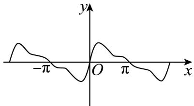

text_image

-π
O
π
x
y

A. $y = \sin x + \frac{1}{2}\sin 2x + \frac{1}{3}\sin 3x$

B. $y = \sin x - \frac{1}{2}\sin 2x - \frac{1}{3}\sin 3x$

C. $y=\sin x+\frac{1}{2}\cos2x+\frac{1}{3}\cos3x$

D. $y = \cos x + \frac{1}{2} \cos 2x + \frac{1}{3} \cos 3x$

314 (2024·全国·校联考模拟预测)已知函数 $f(x)$ 在 $[-2, 2]$ 上的图像如图所示，则 $f(x)$ 的解析式可能是 （）

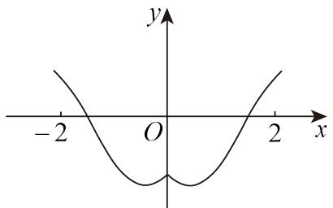

text_image

y
-2 O 2 x

A. $f(x) = 2 - \mathrm{e}^{2 - x}$

B. $f(x) = x^{2} - |x| - 2$

C. $f(x) = 2x^{2} - \mathrm{e}^{|x|}$

D. $f(x) = \ln (x^{2} - 2|x| + 2) - 1$

315 (2024·河北·统考模拟预测)已知函数 $f(x)$ 的部分图象如图所示,则 $f(x)$ 的解析式可能为()

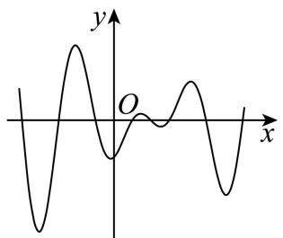

text_image

y
O
x

A. $f(x) = x\cos \pi (x + 1)$

B. $f(x) = (x - 1)\cos \pi x$

C. $f(x) = (x - 1)\sin \pi x$

D. $f(x) = x^{3} - 2x^{2} + x - 1$

316 (2024·贵州遵义·校考模拟预测)已知函数 $f(x)$ 在 $[-4, 4]$ 上的大致图象如下所示，则 $f(x)$ 的解析式可能为 （）

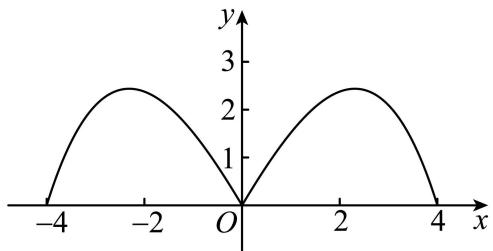

line

| x | y |
|---|---|
| -4 | 0 |
| -2 | 2.5 |
| 0 | 0 |
| 2 | 2.5 |
| 4 | 0 |

A. $f(x) = \frac{3|x|\cdot(1 + \cos\frac{\pi x}{4})}{2}$

B. $f(x) = \frac{|x|\cdot(16 - x^2)}{10}$

C. $f(x) = |x|\cdot (4 - |x|)$

D. $f(x) = |x|\cdot \sin \frac{\pi x}{4}$

# 题型三: 表达式含参数的图象问题

317 (2024·全国·高三专题练习)在同一直角坐标系中,函数 $y=\log_{a}(-x)$ , $y=\frac{a-1}{x}(a>0)$ ,
且 $a \neq 1$ 的图象可能是 ()

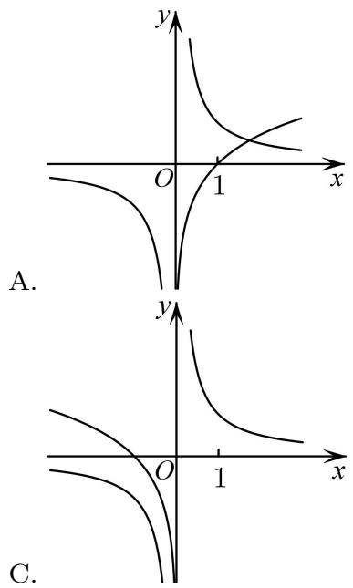

text_image

A.
C.

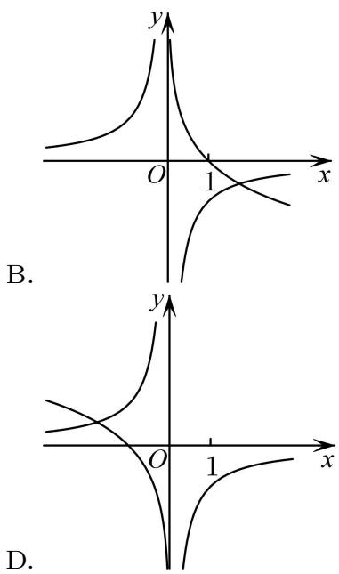

text_image

B.
D.

318 (2024·山东滨州·统考二模)函数 $f(x)=\frac{3+\cos x}{ax^{2}-bx+c}$ 的图象如图所示，则（）

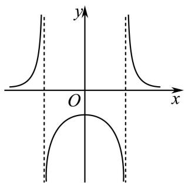

text_image

y
O
x

A. $a > 0, b = 0, c < 0$

B. $a <   0,b = 0,c <   0$

C. $a <   0,b <   0,c = 0$

D. $a > 0, b = 0, c > 0$

319 (2024·全国·高三专题练习)已知函数 $y=\log_{a}(x+b)(a,b$ 为常数, 其中 a>0 且 $a\neq1)$ 的图象如图所示, 则下列结论正确的是 ()

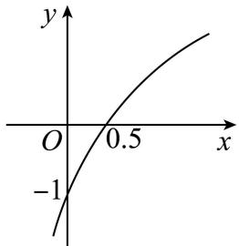

line

| x | y |
|---|---|
| 0 | -1 |
| 0.5 | 0.5 |

A. $a = 0.5, b = 2$

B. $a = 2, b = 2$

C. $a = 0.5, b = 0.5$

D. a=2, b=0.5

320 (2024·全国·高三专题练习)若函数 $f(x)=\frac{2}{ax^{2}+bx+c}$ 的部分图象如图所示, 则 $f(5)=$ ()

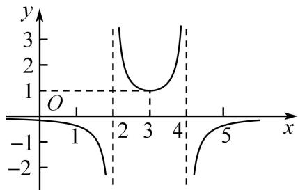

line

| x | y |
|---|---|
| 1 | 0 |
| 2 | 3 |
| 3 | 1 |
| 4 | 3 |
| 5 | 0 |

A. $-\frac{1}{3}$

B. $-\frac{2}{3}$

C. $-\frac{1}{6}$

D. $-\frac{1}{12}$

321 (2024·全国·高三专题练习)在同一直角坐标系中,函数 $y=\frac{1}{a^{x}},y=\log_{a}\left(x+\frac{1}{2}\right)(a>0$ 且 $a\neq1)$ 的图象可能是

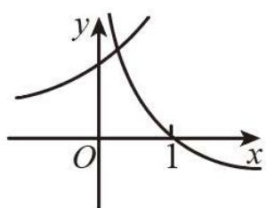

text_image

y
O 1 x

A.

B.

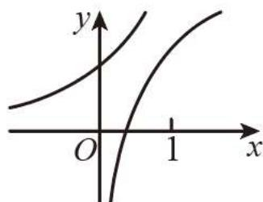

text_image

y
O
1
x

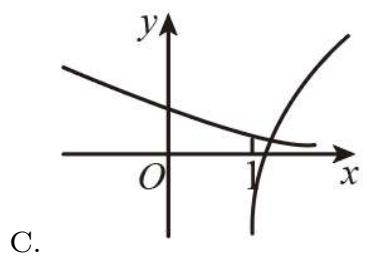

text_image

y
O
1
x
C.

D.   
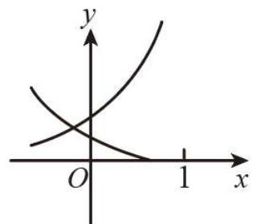

text_image

y
O
1 x

322 (多选题)(2024·全国·高三专题练习)函数 $f(x)=\frac{ax+\ln|x|}{\sin x}$ 。 $(a\leqslant0)$ 在 $[-2\pi,2\pi]$ 上的大致图像可能为()

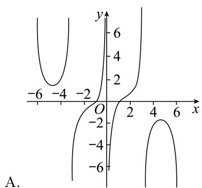

line

| x | y |
|---|---|
| -6 | 0 |
| -4 | 2 |
| -2 | 4 |
| 0 | 6 |
| 2 | 4 |
| 4 | 2 |
| 6 | 0 |
| 8 | -2 |
| 10 | -4 |
| 12 | -6 |
A. (Figure A)

B.   
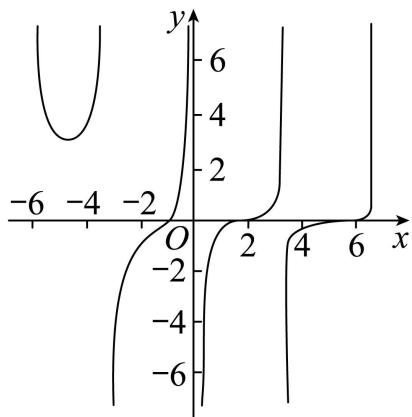

line

| x    | y     |
| ---- | ----- |
| -6   | 0     |
| -4   | 2     |
| -2   | 4     |
| 0    | 6     |
| 2    | 4     |
| 4    | 2     |
| 6    | 0     |

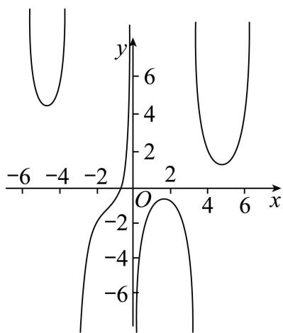

line

| x    | y1   | y2   |
| ---- | ---- | ---- |
| -6   | 0    | 0    |
| -4   | 4    | 0    |
| -2   | 6    | 0    |
| 0    | 0    | 0    |
| 2    | 4    | 0    |
| 4    | 6    | 0    |
| 6    | 0    | 0    |

D.   
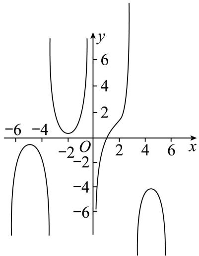

line

| x    | y     |
| ---- | ----- |
| -6   | 0     |
| -4   | 2     |
| -2   | 4     |
| 0    | 6     |
| 2    | 4     |
| 4    | 2     |
| 6    | 0     |

C.   

# 题型四: 函数图象应用题

323 (2024·北京·高三专题练习)高为 H、满缸水量为 V 的鱼缸的轴截面如图所示, 现底部有一个小洞, 满缸水从洞中流出, 若鱼缸水深为 h 时水的体积为 v, 则函数 $v = f(h)$ 的大致图像是

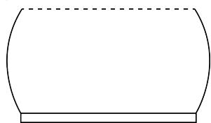

natural_image

Simple line drawing of a rounded rectangular shape with a horizontal base (no text or symbols)

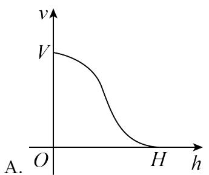

line

| h   | v   |
| --- | --- |
| 0   | V   |
| H   | 0   |

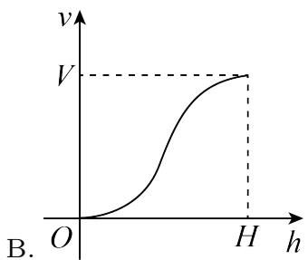

line

| h   | v   |
| --- | --- |
| 0   | 0   |
| H   | V   |

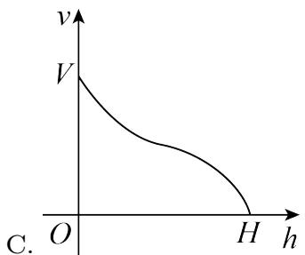

text_image

v
V
O
H
h
C.

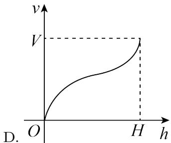

line

| h   | v   |
| --- | --- |
| 0   | 0   |
| H   | V   |

324 (2024·四川成都·高三四川省成都市玉林中学校考阶段练习)如图为某无人机飞行时,从某时刻开始15分钟内的速度 $V(x)$ (单位:米/分钟)与时间x(单位:分钟)的关系.若定义“速度差函数” $v(x)$ 为无人机在时间段 $[0,x]$ 内的最大速度与最小速度的差,则 $v(x)$ 的图像为()

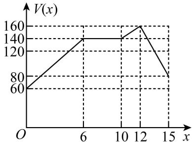

line

| x | V(x) |
|---|---|
| 0 | 60 |
| 6 | 140 |
| 12 | 160 |
| 15 | 80 |

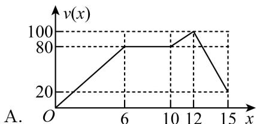

line

| x | v(x) |
|---|---|
| 0 | 0 |
| 6 | 80 |
| 12 | 100 |
| 15 | 20 |

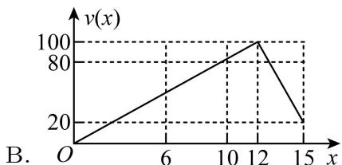

line

| x | v(x) |
|---|---|
| 0 | 0 |
| 6 | 20 |
| 12 | 100 |
| 15 | 20 |

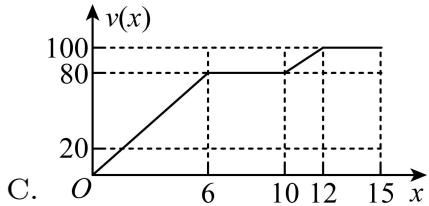

line

| x | v(x) |
|---|---|
| 0 | 0 |
| 6 | 80 |
| 12 | 100 |
| 15 | 100 |

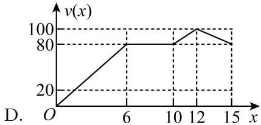

line

| x | v(x) |
|---|---|
| 0 | 0 |
| 6 | 80 |
| 12 | 100 |
| 15 | 80 |

325 (2024·湖南长沙·高三长沙一中校考阶段练习)青花瓷,又称白地青花瓷,常简称青花,是中国瓷器的主流品种之一.如图,这是景德镇青花瓷,现往该青花瓷中匀速注水,则水的高度y与时间x的函数图像大致是()

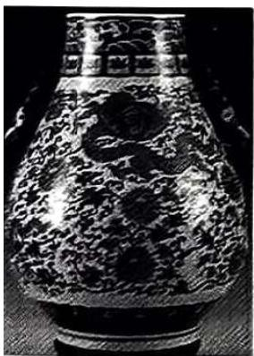

natural_image

Black-and-white photograph of an ornate vase with intricate carvings and a rose design (no visible text or symbols)

A.   

text_image

y
O
x

B.   
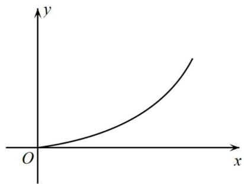

text_image

y
O
x

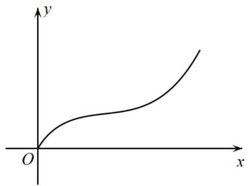

text_image

y
O
x

D.   
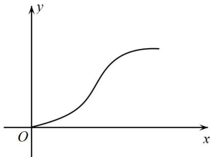

text_image

y
O
x

326 (2024·全国·高三专题练习)列车从A地出发直达500km外的B地,途中要经过离A地300km的C地,假设列车匀速前进,5h后从A地到达B地,则列车与C地距离y(单位:km)与行驶时间t(单位:h)的函数图象为()

A.   
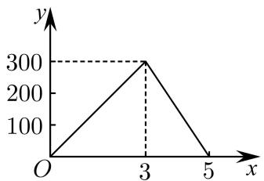

line

| x | y |
|---|---|
| 0 | 0 |
| 3 | 300 |
| 5 | 0 |

B.   

line

| x | y |
|---|---|
| 0 | 300 |
| 3 | 200 |
| 5 | 300 |

C.   

line

| x | y |
|---|---|
| 0 | 300 |
| 3 | 0 |
| 5 | 200 |

D.   

line

| x | y |
|---|---|
| 0 | 300 |
| 3 | 100 |
| 5 | 200 |

327 (2024·全国·高三专题练习)如图, 正 $\triangle ABC$ 的边长为 2 , 点 D 为边 AB 的中点, 点 P 沿着边 AC, CB 运动到点 B, 记 $\angle ADP = x$ . 函数 $f(x) = |PB|^2 - |PA|^2$ , 则 $y = f(x)$ 的图象大致为 ( )

text_image

C
P
B
D
A
x

line

| x | y |
|---|---|
| 0 | 4 |
| π | -2 |
| ∞ | -4 |

line

| x | y |
|---|---|
| 0 | -4 |
| π | 4 |

line

| x | y |
|---|---|
| 0 | 4 |
| π/2 | 2 |
| 3π/2 | 0 |
| ∞ | -2 |
| ∩ | 4 |

line

| x | y |
|---|---|
| -3.5 | 4 |
| -2.5 | 2 |
| -1.5 | 0 |
| 0 | -2 |
| 1.5 | -4 |
| 3.5 | -6 |

328 (2024·全国·高三专题练习)匀速地向一底面朝上的圆锥形容器注水,则该容器盛水的高度 h 关于注水时间 t 的函数图象大致是 ()

text_image

h
O
t
A.

line

| t    | h     |
| ---- | ----- |
| 0    | 0     |
| >0   | >0.5  |

text_image

h
O
t
B.

text_image

h
O
t
D.

# 5 题型五: 函数图象的变换

329 (2024·广西玉林·统考模拟预测)已知图1对应的函数为 $y=f(x)$ ，则图2对应的函数是()

  
图1

  
图2

A. $y = f(-|x|)$

B. $y = f(-x)$

C. $y = f(|x|)$

D. $y = -f(-x)$

330 (2024·全国·高三专题练习)已知函数 $f(x)$ 的图象的一部分如下左图,则如下右图的函数图象所对应的函数解析式()

text_image

-1
O
y
1
x

A. $y = f(2x - 1)$

text_image

y
O
x
1

B. $y=f\left(\frac{4x-1}{2}\right)$

C. $y = f(1 - 2x)$

D. $y=f\left(\frac{1-4x}{2}\right)$

331 (2024·全国·高三专题练习)已知函数 $f(x) = \begin{cases} -2x (-1 \leqslant x \leqslant 0), \\ \sqrt{x} (0 < x \leqslant 1), \end{cases}$ ，则下列图象错误的是（）

line

| x | y |
|---|---|
| 0 | 2 |
| 1 | 0 |
| 2 | 1 |

A. $y = f(x - 1)$ 的图象

line

| x | y |
|---|---|
| -1 | 1 |
| 0 | 0 |
| 1 | 2 |

B. $y = f(-x)$ 的图象

line

| x | y |
|---|---|
| -1 | 2 |
| 0 | 0 |
| 1 | 1 |

C. $y = |f(x)|$ 的图象

text_image

y
2
1
-1 O 1 x

D. $y = f(|x|)$ 的图象

332 (2024·全国·高三专题练习)函数 $f(x)=\ln(1-x)$ 向右平移 1 个单位, 再向上平移 2 个单位的大致图像为 ()

line

| x | y |
|---|---|
| 0 | 0 |
| 1 | 2 |

A.

text_image

y
-2
-1 O x

B.

text_image

y
2
O 1 2 x
C.

line

| x | y |
|---|---|
| 0 | 0 |
| 1 | 2 |
| 2 | 4 |
D.

# 6 题型六: 函数图像的综合应用

333 (2024·上海浦东新·华师大二附中校考模拟预测)若关于 x 的方程 $e^{x}=a|x|$ 恰有两个不同的实数解，则实数 a= \_\_\_\_.  
334 (2024·天津和平·统考三模)已知函数 $f(x) = \left|\frac{x + a}{x - a}\right|(x \neq a)$ ，若关于 $x$ 的方程 $f(f(x)) = 2$ 恰有三个不相等的实数解，则实数 $a$ 的取值集合为 \_\_\_\_.  
335 (2024·河南·校联考模拟预测)定义在 $\mathbf{R}$ 上的函数 $f(x)$ 满足 $f(x + 1) = 2f(x)$ , 且当 $x \in [0,1]$ 时, $f(x) = 1 - |2x - 1|$ . 若对任意 $x \in (-\infty, t]$ , 都有 $f(x) \leqslant 2$ , 则 $t$ 的取值范围是 \_\_\_\_.  
336 (2024·四川绵阳·统考二模)若函数 $f(x)=\left\{\begin{aligned}&2+\ln x,&x>0\\&x,&x\leqslant0\end{aligned}\right.$ ， $g(x)=f(x)+f(-x)$ ，则函数 $g(x)$ 的零点个数为 \_\_\_\_.

