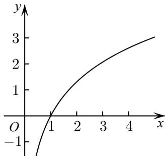
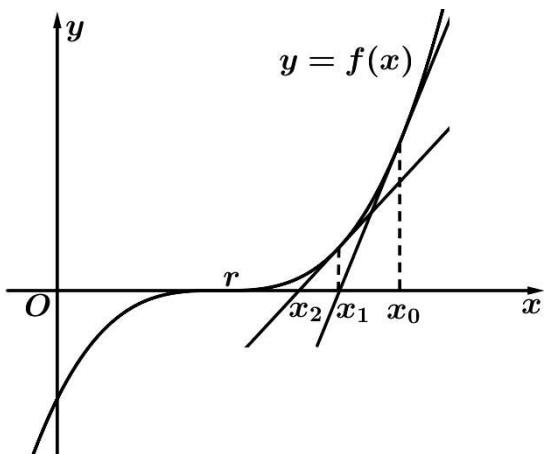
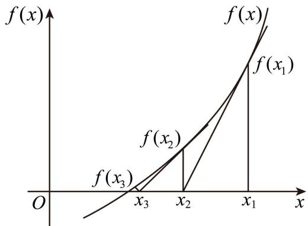

# 第14讲 导数的概念与运算

# 知识梳理

# 知识点一:导数的概念和几何性质

# 1、概念

函数 $f(x)$ 在 $x = x_0$ 处瞬时变化率是 $\lim_{\Delta x \to 0} \frac{\Delta y}{\Delta x} = \lim_{\Delta x \to 0} \frac{f(x_0 + \Delta x) - f(x_0)}{\Delta x}$ ，我们称它为函数 $y = f(x)$ 在 $x = x_0$ 处的导数，记作 $f'(x_0)$ 或 $y' | x = x_0$ .

知识点诠释：

①增量 $\Delta x$ 可以是正数，也可以是负，但是不可以等于0． $\Delta x\to 0$ 的意义： $\Delta x$ 与0之间距离要多近有  
多近，即 $|\Delta x - 0|$ 可以小于给定的任意小的正数；  
②当 $\Delta x \to 0$ 时, $\Delta y$ 在变化中都趋于 0 ,但它们的比值却趋于一个确定的常数, 即存在一个常数与

$$
\frac {\Delta y}{\Delta x} = \frac {f (x _ {0} + \Delta x) - f (x _ {0})}{\Delta x} \text {无限接近；}
$$

③导数的本质就是函数的平均变化率在某点处的极限,即瞬时变化率.如瞬时速度即是位移在这一时

刻的瞬间变化率，即 $f^{\prime}(x_0) = \lim_{\Delta x\to 0}\frac{\Delta y}{\Delta x} = \lim_{\Delta x\to 0}\frac{f(x_0 + \Delta x) - f(x_0)}{\Delta x}.$

# 2、几何意义

函数 $y = f(x)$ 在 $x = x_0$ 处的导数 $f'(x_0)$ 的几何意义即为函数 $y = f(x)$ 在点 $\mathrm{P}(x_0, y_0)$ 处的切线的斜率.

# 3、物理意义

函数 $s = s(t)$ 在点 $t_0$ 处的导数 $s'(t_0)$ 是物体在 $t_0$ 时刻的瞬时速度 $v$ , 即 $v = s'(t_0)$ ; $v = v(t)$ 在点 $t_0$ 的导数 $v'(t_0)$ 是物体在 $t_0$ 时刻的瞬时加速度 $a$ , 即 $a = v'(t_0)$ .

# 知识点二: 导数的运算

# 1、求导的基本公式

<table><tr><td>基本初等函数</td><td>导函数</td></tr><tr><td> $f(x)=c$ ( $c$ 为常数)</td><td> $f'(x)=0$ </td></tr><tr><td> $f(x)=x^{a}$ ( $a\in Q$ )</td><td> $f'(x)=ax^{a-1}$ </td></tr><tr><td> $f(x)=a^{x}$ ( $a>0$ ,  $a\neq 1$ )</td><td> $f'(x)=a^{x}\ln a$ </td></tr><tr><td> $f(x)=\log_{a}x$ ( $a>0$ ,  $a\neq 1$ )</td><td> $f'(x)=\frac{1}{x\ln a}$ </td></tr><tr><td> $f(x)=\mathrm{e}^{x}$ </td><td> $f'(x)=\mathrm{e}^{x}$ </td></tr><tr><td> $f(x)=\ln x$ </td><td> $f'(x)=\frac{1}{x}$ </td></tr><tr><td> $f(x)=\sin x$ </td><td> $f'(x)=\cos x$ </td></tr><tr><td> $f(x)=\cos x$ </td><td> $f'(x)=-\sin x$ </td></tr></table>

# 2、导数的四则运算法则

(1) 函数和差求导法则: $[f(x) \pm g(x)]' = f'(x) \pm g'(x)$ ;   
(2) 函数积的求导法则: $[f(x)g(x)]' = f'(x)g(x) + f(x)g'(x)$ ;   
(3) 函数商的求导法则: $g(x) \neq 0$ , 则 $\left[\frac{f(x)}{g(x)}\right] = \frac{f'(x)g(x) - f(x)g'(x)}{g^2(x)}$ .

# 3、复合函数求导数

复合函数 $y = f[g(x)]$ 的导数和函数 $y = f(u), u = g(x)$ 的导数间关系为 $y_x' = y_u'u_x'$ :

# 【解题方法总结】

# 1、在点的切线方程

切线方程 $y - f(x_0) = f'(x_0)(x - x_0)$ 的计算: 函数 $y = f(x)$ 在点 $A(x_0, f(x_0))$ 处的切线方程为 $y - f(x_0) = f'(x_0)(x - x_0)$ , 抓住关键 $\begin{cases} y_0 = f(x_0) \\ k = f'(x_0) \end{cases}$ .

# 2、过点的切线方程

设切点为 $\mathrm{P}(x_0,y_0)$ ，则斜率 $k = f^{\prime}(x_0)$ ，过切点的切线方程为： $y - y_{0} = f^{\prime}(x_0)(x - x_0)$

又因为切线方程过点 A(m, n)，所以 $n - y_{0} = f'(x_{0}) (m - x_{0})$ 然后解出 $x_{0}$ 的值．( $x_{0}$ 有几个值，就有几条切线)

注意:在做此类题目时要分清题目提供的点在曲线上还是在曲线外.

# 必考题型全归纳

# 1 题型一:导数的定义

406 (2024·全国·高三专题练习)已知函数 $y=f(x)$ 的图象如图所示, 函数 $y=f(x)$ 的导数为 $y=f'(x)$ , 则 ( )

line

| x | y |
|---|---|
| 0 | -1 |
| 1 | 0 |
| 2 | 1 |
| 3 | 2 |
| 4 | 3 |

A. $f'(2) < f'(3) < f(3) - f(2)$

B. $f^{\prime}(3) <   f^{\prime}(2) <   f(3) - f(2)$

C. $f'(2) < f(3) - f(2) < f'(3)$

D. $f'(3) < f(3) - f(2) < f'(2)$

407 (2024·云南楚雄·高三统考期末)已知某容器的高度为 20cm, 现在向容器内注入液体, 且容器内液体的高度 h(单位: cm) 与时间 t(单位: s) 的函数关系式为 $h = \frac{1}{3}t^{3} + t^{2}$ , 当 $t = t_{0}$ 时, 液体上升高度的瞬时变化率为 3cm/s, 则当 $t = t_{0} + 1$ 时, 液体上升高度的瞬时变化率为 ( )

A. 5cm/s

B. 6cm/s

C. 8cm/s

D. 10cm/s

408 (2024·河北衡水·高三衡水市第二中学期末)已知函数 $f(x)$ 的导函数是 $f'(x)$ ，若 $f'(x_0) = 2$ ，则 $\lim_{\Delta x \to 0} \frac{f(x_0 + \frac{1}{2}\Delta x) - f(x_0)}{\Delta x} =$ （）

A. $\frac{1}{2}$

B. 1

C. 2

D. 4

409 (2024·全国·高三专题练习)若函数 $f(x)$ 在 $x_0$ 处可导，且 $\lim_{\Delta x \to 0} \frac{f(x_0 + 2\Delta x) - f(x_0)}{2\Delta x} = 1$ ，则 $f'(x_0) =$ （）

A. 1

B.-1

C. 2

D. $\frac{1}{2}$

410 (2024·高三课时练习)若 $f(x)$ 在 $x_{0}$ 处可导，则 $f'(x_{0})$ 可以等于（）.

A. $\lim_{\Delta x\to 0}\frac{f(x_0) - f(x_0 - \Delta x)}{\Delta x}$

B. $\lim_{\Delta x\to 0}\frac{f(x_0 + \Delta x) - f(x_0 - \Delta x)}{\Delta x}$

C. $\lim_{\Delta x\to0}\frac{f(x_{0}+2\Delta x)-f(x_{0}-\Delta x)}{\Delta x}$

D. $\lim_{\Delta x\to0}\frac{f(x_{0}+\Delta x)-f(x_{0}-2\Delta x)}{\Delta x}$

# 题型二: 求函数的导数

411 (2024·全国·高三专题练习)求下列函数的导数.

(1) $f(x)=(-2x+1)^{2}$ ;   
(2) $f(x)=\ln(4x-1)$ ;   
(3) $f(x)=2^{3x+2}$   
(4) $f(x)=\sqrt{5x+4}$ ;

412 (2024·高三课时练习)求下列函数的导数：

(1) $y=(3x^{2}+2x+1)\cos x;$   
(2) $y=\frac{3x^{2}+x\sqrt{x}-5\sqrt{x}+1}{\sqrt{x}}$ ;   
(3) $y=x^{18}+\sin x-\ln x;$   
(4) $y=2^{x}\cos x-3x\log_{3}x;$   
(5) $y=3^{x}\sin x-3\log_{3}x;$   
(6) $y = \mathrm{e}^{x}\cos x + \tan x.$

413 (2024·海南·统考模拟预测)在等比数列 $\{a_{n}\}$ 中， $a_{3}=2$ ，函数 $f(x)=\frac{1}{2}x(x-a_{1})(x-a_{2})$ $\cdots(x-a_{5})$ ，则 $f'(0)=$ \_\_\_\_.  
414 (2024·辽宁大连·育明高中校考一模)已知可导函数 $f(x)$ , $g(x)$ 定义域均为R,对任意x满足 $f(x)+2x^{2}g\left(\frac{1}{2}x\right)=x-1$ ,且 $f(1)=1$ ,求 $f'(1)+g'\left(\frac{1}{2}\right)=$ \_\_\_\_.  
415 (2024·河南·高三校联考阶段练习)已知函数 $f(x)$ 的导函数为 $f'(x)$ ，且 $f(x) = x^2 f'(1) + x + 2$ ，则 $f'(1) =$ \_\_\_\_.  
416 (2024·全国·高三专题练习)已知函数 $f(x) = f'(0)\mathrm{e}^{2x} - \mathrm{e}^{-x}$ ，则 $f(0) =$ \_\_\_\_.

# 题型三: 导数的几何意义

# 方向1、在点P处切线

417 (2024·广东广州·统考模拟预测)曲线 $y=(2x-1)^{3}$ 在点 $(1,1)$ 处的切线方程为 \_\_\_\_.  
418 (2024·全国·高三专题练习)曲线 $f(x)=\ln(x+2)+\frac{3}{2}$ 在点 $(0,f(0))$ 处的切线方程为 \_\_\_\_.

419 (2024·全国·高三专题练习)已知函数 $f(x) = \frac{1}{3} x^3 + bx^2 + \cos\left(\frac{\pi}{2}x\right)$ , $f'(x)$ 为 $f(x)$ 的导函数. 若 $f'(x)$ 的图象关于直线 $x = 1$ 对称, 则曲线 $y = f(x)$ 在点 $(2, f(2))$ 处的切线方程为

420 (2024·湖南·校联考模拟预测)若函数 $f(x)=\lambda x^{3}+(\lambda-2)x^{2}(x\in\mathbb{R})$ 是奇函数, 则曲线 $y=f(x)$ 在点 $(\lambda,f(\lambda))$ 处的切线方程为 \_\_\_\_.

421 (2024·江西·校联考模拟预测)已知过原点的直线与曲线 $y = \ln x$ 相切, 则该直线的方程是 \_\_\_\_.

(2024·浙江金华·统考模拟预测)已知函数 $f(x)=x^{3}-ax+1$ ，过点P(2,0)存在3条直线与曲线 $y=f(x)$ 相切，则实数a的取值范围是\_\_\_\_.

423 (2024·浙江绍兴·统考模拟预测)过点 $\left(-\frac{2}{3},0\right)$ 作曲线 $y=x^{3}$ 的切线,写出一条切线方程: \_\_\_\_.

424 (2024·海南海口·校联考模拟预测)过 x 轴上一点 $\mathrm{P}(t,0)$ 作曲线 $\mathrm{C}:y=(x+3)\mathrm{e}^{x}$ 的切线，若这样的切线不存在，则整数 t 的一个可能值为 \_\_\_\_.

425 (2024·全国·模拟预测)过坐标原点作曲线 $y = (x + 2)e^{x}$ 的切线, 则切点的横坐标为 \_\_\_\_.

426 (2024·广西南宁·南宁三中校考模拟预测)若过点P(1,a)(a∈R)有n条直线与函数f(x)= $(x-2)\mathrm{e}^{x}$ 的图象相切,则当n取最大值时,a的取值范围为\_\_\_\_.

427 (2024·全国·模拟预测)已知函数 $f(x) = \frac{1}{3} x^3 + f'(1)x^2 + 1$ ，其导函数为 $f'(x)$ ，则曲线 $f(x)$ 过点 $P(3,1)$ 的切线方程为 \_\_\_\_.

428 (2024·云南保山·统考二模)若函数 $f(x) = 4\ln x + 1$ 与函数 $g(x) = \frac{1}{a} x^2 - 2x (a > 0)$ 的图象存在公切线，则实数 $a$ 的取值范围为 （）

A. $\left(0,\frac{1}{3}\right]$

B. $\left[\frac{1}{3},+\infty\right)$

C. $\left[\frac{2}{3},1\right)$

D. $\left[\frac{1}{3},\frac{2}{3}\right]$

429 (2024·宁夏银川·银川一中校考二模)若直线 $y = k_{1}(x + 1) - 1$ 与曲线 $y = e^{x}$ 相切, 直线 $y = k_{2}(x + 1) - 1$ 与曲线 $y = \ln x$ 相切, 则 $k_{1}k_{2}$ 的值为 \_\_\_\_.

430 (2024·河北邯郸·统考三模)若曲线 $y = e^{x}$ 与圆 $(x - a)^{2} + y^{2} = 2$ 有三条公切线，则 a 的取值范围是 \_\_\_\_.

431 (2024·湖南长沙·湖南师大附中校考模拟预测)若曲线 $C_{1}:f(x)=x^{2}+a$ 和曲线 $C_{2}:g(x)=2\ln x$ 恰好存在两条公切线，则实数 a 的取值范围为 \_\_\_\_.

432 (2024·江苏南京·南京师大附中校考模拟预测)已知曲线 $\mathrm{C}_{1}:f(x)=x^{2}$ 与曲线 $\mathrm{C}_{2}:g(x)=ae^{x+1}(a>0)$ 有且只有一条公切线，则 a= \_\_\_\_.

433 (2024·福建南平·统考模拟预测)已知曲线 $y = a \ln x$ 和曲线 $y = x^{2}$ 有唯一公共点，且这两条曲线在该公共点处有相同的切线 l，则 l 的方程为 \_\_\_\_.

434 (2024·江苏·校联考模拟预测)若曲线 $y = x \ln x$ 有两条过 $(e, a)$ 的切线，则 a 的范围是 \_\_\_\_.

435 (2024·山东聊城·统考三模)若直线 $y = x + b$ 与曲线 $y = e^{x} - ax$ 相切，则 b 的最大值为（）

A. 0

B. 1

C. 2

D. e

436 (2024·重庆·统考三模)已知直线 y=ax-a 与曲线 $y=x+\frac{a}{x}$ 相切，则实数 a= （）

A. 0

B. $\frac{1}{2}$

C. $\frac{4}{5}$

D. $\frac{3}{2}$

437 (2024·海南·校联考模拟预测)已知偶函数 $f(x) = (a - 1)x^2 - 3bx + c - d - 1$ 在点(1, $f(1)$ )处的切线方程为 $x + y + 1 = 0$ ，则 $\frac{a - b}{c - d} =$ （）

A.-1

B. 0

C. 1

D. 2

438 (2024·全国·高三专题练习)已知 M 是曲线 $y = \ln x + \frac{1}{2}x^{2} + ax$ 上的任一点, 若曲线在 M 点处的切线的倾斜角均是不小于 $\frac{\pi}{4}$ 的锐角, 则实数 a 的取值范围是 ( )

A. $[2, +\infty)$

B. $\left[-1,+\infty\right)$

C. $(-∞,2]$

D. $(-∞,-1]$

439 (2024·全国·高三专题练习)已知 m > 0, n > 0, 直线 $y = \frac{1}{e}x + m + 1$ 与曲线 $y = \ln x - n + 2$ 相切, 则 $\frac{1}{m} + \frac{1}{n}$ 的最小值是 ()

A. 16

B. 12

C. 8

D. 4

440 (2024·河北·高三校联考阶段练习)若过点 $(m,n)$ 可以作曲线 $y=\log_{2}x$ 的两条切线,则()

A. $m > \log_{2} n$

B. $n > \log_2m$

C. $m < \log_2 n$

D. $n < \log_2m$

441 (2024·全国·高三专题练习)若过点 $(a,b)$ 可以作曲线 $y = \ln x$ 的两条切线，则 （）

A. $a < \ln b$

B. $b < \ln a$

C. $\ln b < a$

D. $\ln a < b$

442 (2024·湖南·校联考二模)若经过点 $(a,b)$ 可以且仅可以作曲线 $y=\ln x$ 的一条切线，则下列选项正确的是()

A. $a \leqslant 0$

B. $b = \ln a$

C. $a = \ln b$

D. $a \leqslant 0$ 或 $b = \ln a$

443 (2024·全国·高三专题练习)若函数 $f(x)=\ln x+x$ 与 $g(x)=\frac{2x-m}{x-1}$ 的图象有一条公共切线，且该公共切线与直线 $y=2x+1$ 平行，则实数 m=

A. $\frac{17}{8}$

B. $\frac{17}{6}$

C. $\frac{17}{4}$

D. $\frac{17}{2}$

(2024·全国·高三专题练习)已知直线 x-9y-8=0 与曲线 $\{S_{n}\}$ 相交于 A,B,且曲线 C 在 A,B 处的切线平行,则实数 p 的值为 ( )

A. 4

B. 4或-3

C.-3或-1

D.-3

445 (2024·江西抚州·高三金溪一中校考开学考试)已知曲线 $f(x)=|e^{x}-1|(x>-1)$ 在点A $(x_{1},f(x_{1})),\mathrm{B}(x_{2},f(x_{2}))(x_{1}<x_{2})$ 处的切线 $l_{1},l_{2}$ 互相垂直，且切线 $l_{1},l_{2}$ 与y轴分别交于点D,E，记点E的纵坐标与点D的纵坐标之差为t，则()

A. $\frac{2}{\mathrm{e}} - 2 < t < 0$

B. $2 - 2\mathrm{e} <   t <   0$

C. $t < \frac{2}{e} - 2$

D. $t > 2e - 2$

446 (2024·全国·高三专题练习)若函数 $f(x)=ax+\sin x$ 的图象上存在两条相互垂直的切线，则实数 a 的值是（）

A. 2

B. 1

C. 0

D.-1

447 (2024·上海闵行·高三上海市七宝中学校考期末)若函数 $y = f(x)$ 的图像上存在两个不同的点 P, Q，使得在这两点处的切线重合，则称 $f(x)$ 为“切线重合函数”，下列函数中不是“切线重合函数”的为（）

A. $y = x^{4} - x^{2} + 1$

B. $y = \sin x$

C. $y = x + \cos x$

D. $y = x^{2} + \sin x$

448 (2024·全国·高三专题练习)已知 A, B 是函数 $f(x)=\left\{\begin{aligned}x^{2}+x+a,&x\leqslant0\\ x\ln x-a,&x>0\end{aligned}\right.$ ，图象上不同的两点，若函数 $y=f(x)$ 在点 A、B 处的切线重合，则实数 a 的取值范围是（）

A. $\left(-\infty,\frac{1}{2}\right)$

B. $\left[-\frac{1}{2},+\infty\right)$

C. $(0,+\infty)$

D. $\left[\frac{1}{2},+\infty\right)$

449 (2024·全国·高三专题练习)设点P在曲线 $y=e^{x+1}$ 上,点Q在曲线 $y=-1+\ln x$ 上,则|PQ|最小值为()

A. $\sqrt{2}$

B. $2 \sqrt{2}$

C. $\sqrt{2} (1 + \ln 2)$

D. $\sqrt{2} (1 - \ln 2)$

450 (2024·全国·高三专题练习)设点P在曲线 $y=e^{2x}$ 上,点Q在曲线 $y=\frac{1}{2}\ln x$ 上,则|PQ|的最小值为()

A. $\frac{\sqrt{2}}{2}(1-\ln2)$

B. $\sqrt{2} (1 - \ln 2)$

C. $\sqrt{2} (1 + \ln 2)$

D. $\frac{\sqrt{2}}{2} (1 + \ln 2)$

451 (2024·全国·高三专题练习)设点P在曲线 $y=2e^{x}$ 上, 点Q在曲线 $y=\ln x-\ln 2$ 上, 则|PQ|的最小值为()

A. $1 - \ln 2$

B. $\sqrt{2} (1 - \ln 2)$

C. $2(1 + \ln 2)$

D. $\sqrt{2} (1 + \ln 2)$

452 (2024·全国·高三专题练习)已知实数 a, b, c, d 满足 $\left|\ln(a-1)-b\right|+|c-d+2|=0$ ，则 $(a-c)^{2}+(b-d)^{2}$ 的最小值为 ()

A. $2\sqrt{2}$

B. 8

C. 4

D. 16

453 (2024·全国·高三专题练习)设函数 $f(x)=(x-a)^{2}+4(\ln x-a)^{2}$ ，其中 $x>0, a\in R$ 。若存在正数 $x_{0}$ ，使得 $f(x_{0})\leqslant\frac{4}{5}$ 成立，则实数 a 的值是（）

A. $\frac{1}{5}$

B. $\frac{2}{5}$

C. $\frac{1}{2}$

D. 1

454 (2024·宁夏银川·银川二中校考一模)已知实数 x, y 满足 $2x^{2}-5\ln x-y=0$ , $m \in R$ , 则 $\sqrt{x^{2}+y^{2}-2mx+2my+2m^{2}}$ 的最小值为 ()

A. $\frac{9}{2}$

B. $\frac{3\sqrt{2}}{2}$

C. $\frac{\sqrt{2}}{2}$

D. $\frac{1}{2}$

455 (2024·四川成都·川大附中校考二模)若点P是曲线 $y=\ln x-x^{2}$ 上任意一点,则点P到直线 $l:x+y-4=0$ 距离的最小值为()

A. $\frac{\sqrt{2}}{2}$

B. $\sqrt{2}$

C. $2\sqrt{2}$

D. $4 \sqrt{2}$

456 (2024·湖北咸宁·校考模拟预测)英国数学家牛顿在17世纪给出一种求方程近似根的方法一Newton-Raphson method译为牛顿-拉夫森法.做法如下:设r是 $f(x)=0$ 的根,选取 $x_{0}$ 作为r的初始近似值,过点 $(x_{0},f(x_{0}))$ 做曲线 $y=f(x)$ 的切线 $l:y-f(x_{0})=f'(x_{0})(x-x_{0})$ ,则l与x轴交点的横坐标为 $x_{1}=x_{0}-\frac{f(x_{0})}{f'(x_{0})}(f'(x_{0})\neq0)$ ,称 $x_{1}$ 是r的一次近似值;重复以上过程,得r的近似值序列,其中 $x_{n+1}=x_{n}-\frac{f(x_{n})}{f'(x_{n})}(f'(x_{n})\neq0)$ ,称 $x_{n+1}$ 是r的 $n+1$ 次近似值.运用上述方法,并规定初始近似值不得超过零点大小,则函数 $f(x)=\ln x+x-3$ 的零点一次近似值为( ) (精确到小数点后3位,参考数据: $\ln2=0.693$ )

A. 2.207

B. 2.208

C. 2.205

D. 2.204

457 (多选题)(2024·安徽芜湖·统考模拟预测)牛顿在《流数法》一书中,给出了高次代数方程根的一种解法.具体步骤如下:设 r 是函数 $y=f(x)$ 的一个零点,任意选取 $x_{0}$ 作为 r 的初始近似值,过点 $(x_{0}f(x_{0}))$ 作曲线 $y=f(x)$ 的切线 $l_{1}$ ,设 $l_{1}$ 与 x 轴交点的横坐标为 $x_{1}$ ,并称 $x_{1}$ 为 r 的 1 次近似值;过点 $(x_{1}f(x_{1}))$ 作曲线 $y=f(x)$ 的切线 $l_{2}$ ,设 $l_{2}$ 与 x 轴交点的横坐标为 $x_{2}$ ,称 $x_{2}$ 为 r 的 2 次近似值.一般地,过点 $(x_{n}f(x_{n}))(n\in\mathbb{N}^{*})$ 作曲线 $y=f(x)$ 的切线 $l_{n+1}$ ,记 $l_{n+1}$ 与 x 轴交点的横坐标为 $x_{n+1}$ ,并称 $x_{n+1}$ 为 r 的 $n+1$ 次近似值.对于方程 $x^{3}-x+1=0$ ,记方程的根为 r,取初始近似值为 $x_{0}=-1$ ,下列说法正确的是()

A. $r \in (-2, -1)$

B. 切线 $l_{2}: 23x - 4y + 31 = 0$

C. $|x_{3} - x_{2}| > \frac{1}{8}$

D. $x_{n + 1} = \frac{2x_n^3 - 1}{3x_n^2 - 1}$

458 (多选题)(2024·全国·模拟预测)牛顿在《流数法》一书中,给出了高次代数方程的一种数值解法一牛顿法.首先,设定一个起始点 $x_{0}$ ,如图,在 $x=x_{0}$ 处作 $f(x)$ 图象的切线,切线与x轴的交点横坐标记作 $x_{1}$ :用 $x_{1}$ 替代 $x_{0}$ 重复上面的过程可得 $x_{2}$ ;一直继续下去,可得到一系列的数 $x_{0},x_{1},x_{2},\cdots,x_{n},\cdots$ 在一定精确度下,用四舍五入法取值,当 $x_{n-1},x_{n}(n\in\mathbb{N}^{*})$ 近似值相等时,该值即作为函数 $f(x)$ 的一个零点r.若要求 $\sqrt[3]{6}$ 的近似值r(精确到0.1),我们可以先构造函数 $f(x)=x^{3}-6$ ,再用“牛顿法”求得零点的近似值r,即为 $\sqrt[3]{6}$ 的近似值,则下列说法正确的是()

text_image

y
y = f(x)
O
r
x₂
x₁
x₀
x

A. 对任意 $n \in N^{*}$ , $x_{n} < x_{n-1}$

B. 若 $x_0 \in \mathbb{Q}$ , 且 $x_0 \neq 0$ , 则对任意 $n \in \mathbb{N}^*$ , $x_n = \frac{2}{3} x_{n-1} + \frac{2}{x_{n-1}^2}$

C. 当 $x_{0}=2$ 时, 需要作 2 条切线即可确定 r 的值  
D. 无论 $x_0$ 在 (2,3) 上取任何有理数都有 $r = 1.8$

459 (2024·全国·高三专题练习)牛顿迭代法(Newton's method)又称牛顿-拉夫逊方法(Newton-Raphsonmethod)，是牛顿在17世纪提出的一种近似求方程根的方法。如图，设 $r$ 是 $f(x)=0$ 的根，选取 $x_{0}$ 作为r初始近似值，过点 $(x_{0},f(x_{0}))$ 作曲线 $y=f(x)$ 的切线l,l与x轴的交点的横坐标 $x_{1}=x_{0}-\frac{f(x_{0})}{f'(x_{0})}(f'(x_{0})\neq0)$ ，称 $x_{1}$ 是r的一次近似值，过点 $(x_{1},f(x_{1}))$ 作曲线 $y=f(x)$ 的切线，则该切线与x轴的交点的横坐标为 $x_{2}$ ，称 $x_{2}$ 是r的二次近似值。重复以上过程，直到r的近似值足够小，即把 $x_{n}$ 作为 $f(x)=0$ 的近似解。设 $x_{1},x_{2},x_{3},\cdots,x_{n}$ 构成数列 $\{x_{n}\}$ 。对于下列结论：

text_image

f(x)
f(x)
f(x₁)
f(x₂)
f(x₃)
O
x₃
x₂
x₁
x

① $x_{n} = x_{n - 1} - \frac{f(x_{n})}{f'(x_{n})} (n\geqslant 2);$   
② $x_{n} = x_{n - 1} - \frac{f(x_{n - 1})}{f'(x_{n - 1})} (n\geqslant 2);$   
③ $x_{n}=x_{1}-\frac{f(x_{1})}{f'(x_{1})}-\frac{f(x_{2})}{f'(x_{2})}-\cdots-\frac{f(x_{n})}{f'(x_{n})}$ ;   
④ $x_{n}=x_{1}-\frac{f(x_{1})}{f'(x_{1})}-\frac{f(x_{2})}{f'(x_{2})}-\cdots-\frac{f(x_{n-1})}{f'(x_{n-1})}(n\geqslant2).$

其中正确结论的序号为 \_\_\_\_.

