# 第15讲 单调性问题

# 知识梳理

# 知识点一:单调性基础问题

# 1、函数的单调性

函数单调性的判定方法: 设函数 $y = f(x)$ 在某个区间内可导, 如果 $f'(x) > 0$ , 则 $y = f(x)$ 为增函数; 如果 $f'(x) < 0$ , 则 $y = f(x)$ 为减函数.

# 2、已知函数的单调性问题

①若 $f(x)$ 在某个区间上单调递增，则在该区间上有 $f'(x) \geqslant 0$ 恒成立 (但不恒等于 0)；反之，要满足 $f'(x) > 0$ ，才能得出 $f(x)$ 在某个区间上单调递增；  
②若 $f(x)$ 在某个区间上单调递减，则在该区间上有 $f'(x) \leqslant 0$ 恒成立（但不恒等于0）；反之，要满足 $f'(x) < 0$ ，才能得出 $f(x)$ 在某个区间上单调递减.

知识点二: 讨论单调区间问题

类型一:不含参数单调性讨论

(1) 求导化简定义域 (化简应先通分, 尽可能因式分解; 定义域需要注意是否是连续的区间);  
(2) 变号保留定号去 (变号部分: 导函数中未知正负, 需要单独讨论的部分. 定号部分: 已知恒正或恒负, 无需单独讨论的部分);  
(3) 求根作图得结论 (如能直接求出导函数等于 0 的根, 并能做出导函数与 $x$ 轴位置关系图, 则导函数正负区间段已知, 可直接得出结论);  
(4) 未得结论断正负 (若不能通过第三步直接得出结论, 则先观察导函数整体的正负);  
(5) 正负未知看零点 (若导函数正负难判断, 则观察导函数零点);  
(6)一阶复杂求二阶(找到零点后仍难确定正负区间段,或一阶导函数无法观察出零点,则求二阶导);  
求二阶导往往需要构造新函数,令一阶导函数或一阶导函数中变号部分为新函数,对新函数再求导.  
(7) 借助二阶定区间 (通过二阶导正负判断一阶导函数的单调性, 进而判断一阶导函数正负区间段)

# 类型二: 含参数单调性讨论

(1) 求导化简定义域 (化简应先通分, 然后能因式分解要进行因式分解, 定义域需要注意是否是一个连续的区间);  
(2) 变号保留定号去 (变号部分: 导函数中未知正负, 需要单独讨论的部分. 定号部分: 已知恒正或恒负, 无需单独讨论的部分);  
(3) 恒正恒负先讨论 (变号部分因为参数的取值恒正恒负); 然后再求有效根;  
(4) 根的分布来定参 (此处需要从两方面考虑: 根是否在定义域内和多根之间的大小关系);  
(5) 导数图像定区间；

# 【解题方法总结】

# 1、求可导函数单调区间的一般步骤

(1) 确定函数 $f(x)$ 的定义域；  
(2) 求 $f'(x)$ ，令 $f'(x) = 0$ ，解此方程，求出它在定义域内的一切实数；  
(3) 把函数 $f(x)$ 的间断点 (即 $f(x)$ 的无定义点) 的横坐标和 $f'(x) = 0$ 的各实根按由小到大的顺序排列起来, 然后用这些点把函数 $f(x)$ 的定义域分成若干个小区间;  
(4) 确定 $f'(x)$ 在各小区间内的符号, 根据 $f'(x)$ 的符号判断函数 $f(x)$ 在每个相应小区间内的增减性.

注:①使 $f'(x)=0$ 的离散点不影响函数的单调性,即当 $f'(x)$ 在某个区间内离散点处为零,在其余点处均为正(或负)时, $f(x)$ 在这个区间上仍旧是单调递增(或递减)的.例如,在 $(-∞,+∞)$ 上, $f(x)=x^{3}$ ,当x=0时, $f'(x)=0$ ;当 $x≠0$ 时, $f'(x)>0$ ,而显然 $f(x)=x^{3}$ 在 $(-∞,+∞)$ 上是单调递增函数.

②若函数 $y = f(x)$ 在区间 $(a, b)$ 上单调递增，则 $f'(x) \geqslant 0 (f'(x) \text{不恒为 } 0)$ ，反之不成立。因为 $f'(x) \geqslant 0$ ，即 $f'(x) > 0$ 或 $f'(x) = 0$ ，当 $f'(x) > 0$ 时，函数 $y = f(x)$ 在区间 $(a, b)$ 上单调递增。当 $f'(x) = 0$ 时， $f(x)$ 在这个区间为常值函数；同理，若函数 $y = f(x)$ 在区间 $(a, b)$ 上单调递减，则 $f'(x) \leqslant 0 (f'(x) \text{不恒为 } 0)$ ，反之不成立。这说明在一个区间上函数的导数大于零，是这个函数在该区间上单调递增的充分不必要条件。于是有如下结论：

$$
f ^ {\prime} (x) > 0 \Rightarrow f (x) \text {单调递增}; f (x) \text {单调递增} \Rightarrow f ^ {\prime} (x) \geqslant 0;
$$

$$
f ^ {\prime} (x) <   0 \Rightarrow f (x) \text {单调递减}; f (x) \text {单调递减} \Rightarrow f ^ {\prime} (x) \leqslant 0.
$$

# 1 题型一:利用导函数与原函数的关系确定原函数图像

460 (2024·全国·高三专题练习)设 $f'(x)$ 是函数 $f(x)$ 的导函数， $y=f'(x)$ 的图象如图所示，则 $y=f(x)$ 的图象最有可能的是 ()

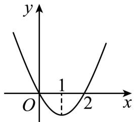

line

| x | y |
|---|---|
| 0 | 0 |
| 1 | 0 |
| 2 | 0 |

A.   
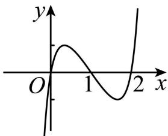

text_image

y
O
1
2 x

B.   
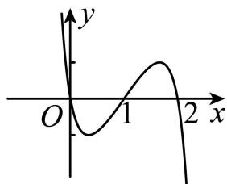

text_image

y
O
1
2 x

C.   
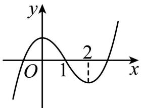

line

| x | y |
|---|---|
| 0 | -3 |
| 1 | 4 |
| 2 | -3 |

D.   
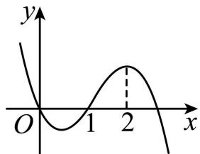

line

| x | y |
|---|---|
| 0 | 0 |
| 1 | -1 |
| 2 | 1 |

461 (多选题)(2024·全国·高三专题练习)已知函数 $f(x)$ 的定义域为R且导函数为 $f'(x)$ ，如图是函数 $y = xf'(x)$ 的图像，则下列说法正确的是

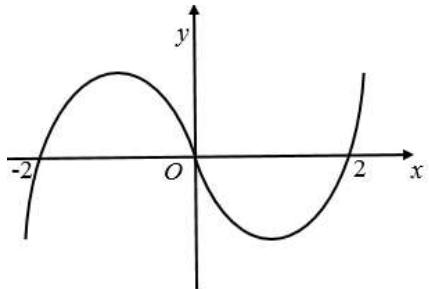

text_image

Graph of a periodic function with x-axis ranging from -2 to 2 and y-axis from -2 to 2, showing a sinusoidal curve intersecting the origin.

A. 函数 $f(x)$ 的增区间是 $(-2,0),(2,+\infty)$   
B. 函数 $f(x)$ 的增区间是 $(-∞, -2)$ , $(2, +∞)$   
C. $x = -2$ 是函数的极小值点  
D. $x = 2$ 是函数的极小值点

462 (2024·黑龙江齐齐哈尔·统考二模)已知函数 $y = xf'(x)$ 的图象如图所示 (其中 $f'(x)$ 是函数 $f(x)$ 的导函数), 下面四个图象中可能是 $y = f(x)$ 图象的是 ()

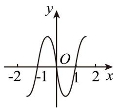

text_image

y
O
-2 -1 1 2 x

A.   
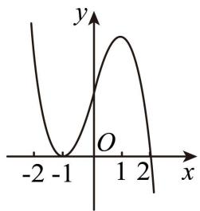

line

| x | y |
|---|---|
| -2 | 0 |
| -1 | 0 |
| 0 | 0 |
| 1 | 1 |
| 2 | 0 |

B.   
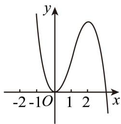

line

| x | y |
|---|---|
| -2 | 0 |
| -1 | 0 |
| 0 | 0 |
| 1 | 1 |
| 2 | 2 |
| >2 |

C.   
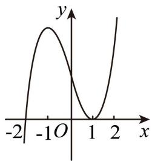

line

| x | y |
|---|---|
| -2 | 0 |
| -1 | Peak |
| 0 | 0 |
| 1 | 0 |
| 2 | High |

D.   
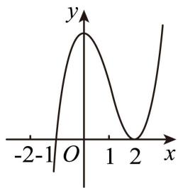

line

| x | y |
|---|---|
| -2 | 0 |
| 0 | Peak |
| 1 | 0 |
| 2 | 0 |
| 3 | 1 |

463 (2024·陕西西安·校联考一模)已知定义在 $[-3,4]$ 上的函数 $f(x)$ 的大致图像如图所示， $f'(x)$ 是 $f(x)$ 的导函数，则不等式 $xf'(x) > 0$ 的解集为 （）

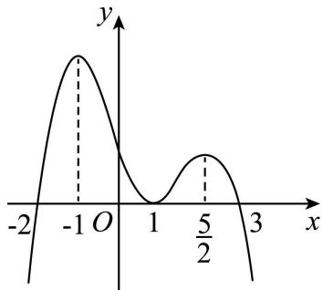

line

| x       | y     |
| ------- | ----- |
| -1      | 1.0   |
| 0       | 0.0   |
| 5/2     | 0.8   |

A. $(-2, -1) \cup \left(1, \frac{5}{2}\right)$

B. $(-3,-2)$

C. $(-1,0)\cup\left(1,\frac{5}{2}\right)$

D. $(3,4)$

# 题型二:求单调区间

464 (2024·江西鹰潭·高三贵溪市实验中学校考阶段练习)函数 $y=\frac{x^{2}+2}{x}+\ln x$ 的单调递增区间为

A. $(0,2)$

B. $(0,1)$

C. $(2, +\infty)$

D. $(1,+\infty)$

465 (2024·全国·高三专题练习)函数 $y = x \ln x$ ()

A. 严格增函数

B. 在 $\left(0, \frac{1}{\mathrm{e}}\right)$ 上是严格增函数，在 $\left(\frac{1}{\mathrm{e}}, +\infty\right)$ 上是严格减函数

C. 严格减函数

D. 在 $\left(0, \frac{1}{\mathrm{e}}\right)$ 上是严格减函数，在 $\left(\frac{1}{\mathrm{e}}, +\infty\right)$ 上是严格增函数

466 (2024·全国·高三专题练习)函数 $f(x) = \ln (4x^{2} - 1)$ 的单调递增区间 （）

A. $\left(\frac{1}{2},+\infty\right)$

B. $\left(-\infty,-\frac{1}{2}\right)$

C. $\left(-\frac{1}{2},\frac{1}{2}\right)$

D. $(0,+\infty)$

467 (2024·高三课时练习)函数 $f(x) = ax + \frac{b}{x} (a, b \text{为正数})$ 的严格减区间是（）.

A. $\left(-\infty,-\sqrt{\frac{b}{a}}\right)$

B. $\left(-\frac{b}{a},0\right)$ 与 $\left(0,\frac{b}{a}\right)$

C. $\left(-\sqrt{\frac{b}{a}}, 0\right)$ 与 $\left(0, \sqrt{\frac{b}{a}}\right)$

D. $\left(-\sqrt{\frac{b}{a}},0\right)\cup\left(0,\sqrt{\frac{b}{a}}\right)$

# 题型三: 已知含量参函数在区间上单调或不单调或存在单调区间, 求参数范围

468 (2024·宁夏银川·银川一中校考三模)若函数 $f(x) = \frac{x^2}{2} - \ln x$ 在区间 $\left(m, m + \frac{1}{3}\right)$ 上不单调，则实数 $m$ 的取值范围为 （）

A. $0 < m < \frac{2}{3}$

B. $\frac{2}{3}<m<1$

C. $\frac{2}{3} \leqslant m \leqslant 1$

D. $m > 1$

469 (2024·陕西西安·统考三模)若函数 $f(x)=x^{2}-ax+\ln x$ 在区间 $(1,\mathrm{e})$ 上单调递增，则 a 的取值范围是 ()

A. $[3, +\infty)$

B. $(-∞,3]$

C. $[3, \mathrm{e}^2 + 1]$

D. $[3,\mathrm{e}^2 -1]$

470 (2024·全国·高三专题练习)若函数 $f(x)=\log_{a}(ax-x^{3})(a>0$ 且 $a\neq1)$ 在区间 $(0,1)$ 内单调递增，则 a 的取值范围是 ()

A. $[3, +\infty)$

B. $(1,3]$

C. $\left(0,\frac{1}{3}\right)$

D. $\left[\frac{1}{3},1\right)$

471 (2024·全国·高三专题练习)已知函数 $f(x)=\sin x+a\cos x$ 在区间 $\left(\frac{\pi}{4},\frac{\pi}{2}\right)$ 上是减函数，则实数 a 的取值范围为（）

A. $a > \sqrt{2} - 1$

B. $a \geqslant 1$

C. $a > 1 - \sqrt{2}$

D. $a \geqslant -1$

472 (2024·全国·高三专题练习)三次函数 $f(x)=mx^{3}-x$ 在 $(-∞,+∞)$ 上是减函数，则 m 的取值范围是 ()

A. $m <   0$

B. $m < 1$

C. $m \leqslant 0$

D. $m \leqslant 1$

473 (2024·青海西宁·高三校考开学考试)已知函数 $f(x)=\frac{a}{x+1}+\ln x$ . 若对任意 $x_{1}, x_{2}\in(0,2]$ ，且 $x_{1}\neq x_{2}$ ，都有 $\frac{f(x_{2})-f(x_{1})}{x_{2}-x_{1}}> - 1$ ，则实数a的取值范围是()

A. $\left(-\infty,\frac{27}{4}\right]$

B. $(-∞,2]$

C. $\left(-\infty,\frac{27}{2}\right)$

D. $(-∞,8]$

474 (2024·全国·高三专题练习)若函数 $f(x)=\ln x+ax^{2}-2$ 在区间 $\left(\frac{1}{2},2\right)$ 内存在单调递增区间，则实数 a 的取值范围是 ()

A. $[-2, +\infty)$

B. $\left(-\frac{1}{8},+\infty\right)$

C. $\left[-2,-\frac{1}{8}\right)$

D. $(-2,+\infty)$

475 (2024·全国·高三专题练习)若函数 $f(x)=x^{2}+x-\ln x-2$ 在其定义域的一个子区间 $(2k-1,2k+1)$ 内不是单调函数，则实数 k 的取值范围是 ()

A. $\left(-\frac{3}{2},\frac{3}{4}\right)$

B. $\left[\frac{1}{2},3\right)$

C. $\left(-\frac{3}{2},3\right)$

D. $\left[\frac{1}{2},\frac{3}{4}\right)$

476 (2024·全国·高三专题练习)已知函数 $f(x) = \ln x + (x - b)^{2} (b \in \mathbb{R})$ 在区间 $\left[\frac{1}{2}, 2\right]$ 上存在单调递增区间，则实数 $b$ 的取值范围是

A. $\left(-\infty,\frac{3}{2}\right)$

B. $\left(-\infty,\frac{9}{4}\right)$

C. $(-\infty,3)$

D. $(-∞,√2)$

477 (2024·全国·高三专题练习)已知函数 $f(x)=\frac{1}{3}x^{3}+\frac{a}{2}x^{2}+x+1$ 在 $(-∞,0)$ ， $(3,+∞)$ 上单调递增，在 $(1,2)$ 上单调递减，则实数 a 的取值范围为（）

A. $\left[-\frac{10}{3},-\frac{5}{2}\right]$

B. $(-∞,-2]$

C. $\left(-\frac{10}{3},-2\right]$

D. $\left(-\frac{10}{3},-\frac{5}{2}\right)$

478 (2024·全国·高三专题练习)已知函数 $f(x)=mx^{3}+3(m-1)x^{2}-m^{2}+1(m>0)$ 的单调递减区间是 $(0,4)$ ，则 m=()

A. 3

B. $\frac{1}{3}$

C. 2

D. $\frac{1}{2}$

# 4 题型四:不含参数单调性讨论

479 (2024·全国·高三专题练习)已知函数 $f(x) = \frac{1 + \ln(x + 1)}{x} (x > 0)$ . 试判断函数 $f(x)$ 在 $(0, +\infty)$ 上单调性并证明你的结论；  
480 (2024·广东深圳·高三深圳外国语学校校考阶段练习)已知 $f(x)=\ln x+\frac{e^{x}+a}{x}$ 若 a=1，讨论 $f(x)$ 的单调性；  
481 (2024·贵州·校联考二模)已知函数 $f(x) = x\ln x - \mathrm{e}^{x} + 1$ .

(1) 求曲线 $y = f(x)$ 在点 $(1, f(1))$ 处的切线方程；  
(2) 讨论 $f(x)$ 在 $(0, +\infty)$ 上的单调性.

482 (2024·湖南长沙·高三长沙一中校考阶段练习)已知函数 $f(x)=\mathrm{e}^{x}-ax(a\in\mathrm{R})$ , $g(x)=\mathrm{e}^{x}+\cos\frac{\pi}{2}x.$

(1) 若 $f(x) \geqslant 0$ ，求 a 的取值范围；  
(2) 求函数 $g(x)$ 在 $(0, +\infty)$ 上的单调性；

483 (2024·全国·高三专题练习)已知函数 $f(x)=\ln(\mathrm{e}^{x}-1)-\ln x$ .

判断 $f(x)$ 的单调性,并说明理由;

# 5 题型五:含参数单调性讨论

# 情形一: 函数为一次函数

484 (2024·山东聊城·统考三模)已知函数 $f(x) = (m + 1)x - m\ln x - m$ .

讨论 $f(x)$ 的单调性；

485 (2024·湖北黄冈·黄冈中学校考二模)已知函数 $f(x) = \ln x - 2a^2 x^2 + 3ax - 1 (a \geqslant 0)$ .

讨论函数 $f(x)$ 的单调性；

486 (2024·全国·模拟预测)已知函数 $f(x)=\ln x+(1-a)x+1(a\in\mathbb{R})$ .

讨论函数 $f(x)$ 的单调性；

487 (2024·福建泉州·泉州五中校考模拟预测)已知函数 $f(x)=(x-a)\ln x$ .

讨论 $f'(x)$ 的单调性；

488 (2024·云南师大附中高三阶段练习)已知函数 $f(x) = x\ln x - ax$ .

讨论 $f(x)$ 的单调性;

489 (2024·北京·统考模拟预测)已知函数 $f(x) = ke^{x} - \frac{1}{2} x^{2}$ .

(1) 当 $k = 1$ 时, 求曲线 $y = f(x)$ 在 $x = 1$ 处的切线方程;  
(2) 设 $g(x)=f'(x)$ ，讨论函数 $g(x)$ 的单调性；

490 (2024·陕西安康·高三陕西省安康中学校考阶段练习)已知函数 $f(x)=\mathrm{e}^{x}-ax-1(a\in\mathbb{R})$ .

讨论 $f(x)$ 的单调性；

491 (2024·山东济宁·嘉祥县第一中学统考三模)已知函数 $f(x) = a\ln x + x^2 - (a + 2)x (a > 0)$ .

讨论函数 $f(x)$ 的单调性；

492 (2024·湖北咸宁·校考模拟预测)已知函数 $f(x) = \left(\frac{1}{x} - \frac{1}{2x^2}\right)(x - a) - \ln x - \frac{1}{2x} + b$ ，其中 $a, b \in \mathbb{R}$ .

讨论函数 $f(x)$ 的单调性；

493 (2024·北京海淀·高三专题练习)设函数 $f(x) = [ax^2 - (4a + 1)x + 4a + 3]\mathrm{e}^x$ .

(1) 若曲线 $y = f(x)$ 在点 $(1, f(1))$ 处的切线与 x 轴平行，求 a;  
(2) 求 $f(x)$ 的单调区间.

494 (2024·广西玉林·统考模拟预测)已知函数 $f(x) = \frac{1}{2} x^2 - 3ax + 2a^2\ln x, a \neq 0$ .

讨论 $f(x)$ 的单调区间；

495 (2024·河南郑州·统考模拟预测)已知 $f(x) = \ln x + \frac{2a^2 + 8}{a\sqrt{x}} - \frac{4}{x} - 2 (a \neq 0)$ .

讨论 $f(x)$ 的单调性；

496 (2024·河南驻马店·统考二模)已知函数 $f(x) = \ln (1 + x) - \frac{1}{2} ax^2$ , $g(x) = ax + \frac{1}{x + 1} - \frac{\sin x}{\mathrm{e}^x} (a \neq 0)$ .

讨论 $f(x)$ 的单调性；

497 (2024·重庆·统考模拟预测)已知函数 $f(x) = \ln x + \frac{-x^2 - 2ax + a}{2x} (a \in \mathbb{R})$ .

讨论函数 $f(x)$ 的单调性；

498 (2024·广东·统考模拟预测)已知函数 $f(x) = \frac{1 + x^2}{\mathrm{e}^{ax}}, a \in \mathbb{R}$ .

讨论 $f(x)$ 的单调性；

499 (2024·江苏·统考模拟预测)已知函数 $f(x) = \frac{1}{2} x^2 + 3ax + 2\ln x (a \in \mathbb{R})$ .

讨论函数 $f(x)$ 的单调性；

500 (2024·全国·高三专题练习)已知函数 $f(x) = xe^{\frac{a}{x}} + \ln x + \frac{a}{x}$ ， $x \in (0, +\infty)$ ，其中 $a \in \mathbb{R}$ .

讨论函数 $f(x)$ 的单调性；

501 (2024·河南郑州·统考模拟预测)已知 $f(x) = (x - a - 1)\mathrm{e}^x - \frac{1}{2} ax^2 + a^2 x - 1$ . $(a \in \mathbb{R})$ 讨论 $f(x)$ 的单调性；

502 (2024·陕西咸阳·武功县普集高级中学校考模拟预测)已知 $f(x)=(x-1)^{2}\mathrm{e}^{x}-\frac{a}{3}x^{3}+ax(x>0)(a\in\mathbb{R})$ .

讨论函数 $f(x)$ 的单调性；

503 (2024·重庆沙坪坝·重庆八中校考模拟预测)已知函数 $f(x) = [\ln^2 x - (a + 1)\ln x + 1] \cdot x, a \in \mathbb{R}$ ,

讨论函数 $f(x)$ 的单调性；

# 题型六:分段分析法讨论

504 (2024·陕西·西北工业大学附属中学模拟预测(理))已知函数 $f(x) = a^{-x + 1} + x^2 - 2x + 1 + (x - 1)\ln a (a > 0$ ，且 $a \neq 1$

求函数 $f(x)$ 的单调区间；

505 (2024·广东广州·统考模拟预测)设函数 $f(x) = \frac{x + 1}{\mathrm{e}^x} + ax^2$ ，其中 $a \in \mathbb{R}$ .

讨论 $f(x)$ 的单调性；

506 (2024·全国·高三专题练习)已知函数 $f(x) = x - \ln x - \frac{\mathrm{e}^x}{x}$ . 判断函数 $f(x)$ 的单调性.

507 (2024·全国·模拟预测)设 m>1，函数 $f(x)=\mathrm{e}^{2mx}-(2x+1)^{m}\left(x>-\frac{1}{2}\right), g(x)=\mathrm{e}^{2mx}-(x+1)^{2m}(x>-1)$ .

讨论 $f(x)$ 在 $\left(-\frac{1}{2m}, +\infty\right)$ 的单调性；

