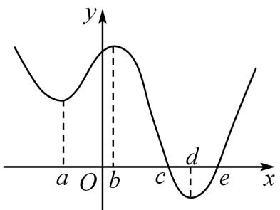

# 第16讲 极值与最值

# 知识梳理

# 知识点一:极值与最值

# 1、函数的极值

函数 $f(x)$ 在点 $x_0$ 附近有定义，如果对 $x_0$ 附近的所有点都有 $f(x) < f(x_0)$ ，则称 $f(x_0)$ 是函数的一个极大值，记作 $y_{\text{极大值}} = f(x_0)$ 。如果对 $x_0$ 附近的所有点都有 $f(x) > f(x_0)$ ，则称 $f(x_0)$ 是函数的一个极小值，记作 $y_{\text{极小值}} = f(x_0)$ 。极大值与极小值统称为极值，称 $x_0$ 为极值点。

求可导函数 $f(x)$ 极值的一般步骤

(1) 先确定函数 $f(x)$ 的定义域；  
(2) 求导数 $f'(x)$ ;  
(3) 求方程 $f'(x)=0$ 的根；  
(4) 检验 $f'(x)$ 在方程 $f'(x) = 0$ 的根的左右两侧的符号, 如果在根的左侧附近为正, 在右侧附近为负, 那么函数 $y = f(x)$ 在这个根处取得极大值; 如果在根的左侧附近为负, 在右侧附近为正, 那么函数 $y = f(x)$ 在这个根处取得极小值.

注：①可导函数 $f(x)$ 在点 $x_0$ 处取得极值的充要条件是： $x_0$ 是导函数的变号零点，即 $f'(x_0) = 0$ ，且在 $x_0$ 左侧与右侧， $f'(x)$ 的符号导号.

② $f'(x_0) = 0$ 是 $x_0$ 为极值点的既不充分也不必要条件，如 $f(x) = x^3$ ， $f'(0) = 0$ ，但 $x_0 = 0$ 不是极值点。另外，极值点也可以是不可导的，如函数 $f(x) = |x|$ ，在极小值点 $x_0 = 0$ 是不可导的，于是有如下结论： $x_0$ 为可导函数 $f(x)$ 的极值点 $\Rightarrow f'(x_0) = 0$ ；但 $f'(x_0) = 0 \Rightarrow x_0$ 为 $f(x)$ 的极值点。

# 2、函数的最值

函数 $y=f(x)$ 最大值为极大值与靠近极小值的端点之间的最大者；函数 $f(x)$ 最小值为极小值与靠近极大值的端点之间的最小者。

导函数为 $f(x) = ax^{2} + bx + c = a(x - x_{1})(x - x_{2})(m < x_{1} < x_{2} < n)$

(1) 当 $a > 0$ 时, 最大值是 $f(x_{1})$ 与 $f(n)$ 中的最大者; 最小值是 $f(x_{2})$ 与 $f(m)$ 中的最小者.  
(2) 当 $a < 0$ 时, 最大值是 $f(x_{2})$ 与 $f(m)$ 中的最大者; 最小值是 $f(x_{1})$ 与 $f(n)$ 中的最小者. 一般地, 设 $y = f(x)$ 是定义在 $[m, n]$ 上的函数, $y = f(x)$ 在 $(m, n)$ 内有导数, 求函数 $y = f(x)$ 在 $[m, n]$ 上的最大值与最小值可分为两步进行:

(1) 求 $y = f(x)$ 在 $(m, n)$ 内的极值 (极大值或极小值);

(2) 将 $y = f(x)$ 的各极值与 $f(m)$ 和 $f(n)$ 比较，其中最大的一个为最大值，最小的一个为最小值.

注:①函数的极值反映函数在一点附近情况,是局部函数值的比较,故极值不一定是最值;函数的最值是对函数在整个区间上函数值比较而言的,故函数的最值可能是极值,也可能是区间端点处的函数值;

②函数的极值点必是开区间的点,不能是区间的端点;   
③函数的最值必在极值点或区间端点处取得.

# 【解题方法总结】

(1) 若函数 $f(x)$ 在区间 D 上存在最小值 $f(x)_{\min}$ 和最大值 $f(x)_{\max}$ ，则

不等式 $f(x)>a$ 在区间D上恒成立 $\Leftrightarrow f(x)_{\min}>a;$

不等式 $f(x)\geqslant a$ 在区间D上恒成立 $\Leftrightarrow f(x)_{\min}\geqslant a;$

不等式 $f(x) < b$ 在区间D上恒成立 $\Leftrightarrow f(x)_{\max} < b$ ;

不等式 $f(x)\leqslant b$ 在区间D上恒成立 $\Leftrightarrow f(x)_{\mathrm{max}}\leqslant b;$

(2) 若函数 $f(x)$ 在区间 D 上不存在最大 (小) 值, 且值域为 $(m, n)$ , 则

不等式 $f(x)>a$ （或 $f(x)\geqslant a$ ）在区间D上恒成立 $\Leftrightarrow m\geqslant a$ .

不等式 $f(x) < b$ （或 $f(x) \leqslant b$ ）在区间D上恒成立 $\Leftrightarrow m \leqslant b$ .

(3) 若函数 $f(x)$ 在区间 D 上存在最小值 $f(x)_{\min}$ 和最大值 $f(x)_{\max}$ ，即 $f(x) \in [m, n]$ ，则对不等式有解问题有以下结论：

不等式 $a < f(x)$ 在区间D上有解 $\Leftrightarrow a < f(x)_{\max}$ ;

不等式 $a \leqslant f(x)$ 在区间D上有解 $\Leftrightarrow a \leqslant f(x)_{\max}$ ;

不等式 $a > f(x)$ 在区间D上有解 $\Leftrightarrow a > f(x)_{\min}$ ;

不等式 $a \geqslant f(x)$ 在区间D上有解 $\Leftrightarrow a \geqslant f(x)_{\min}$ ;

(4) 若函数 $f(x)$ 在区间 D 上不存在最大 (小) 值, 如值域为 $(m, n)$ , 则对不等式有解问题有以下结论:

不等式 $a < f(x)$ （或 $a \leqslant f(x)$ ）在区间D上有解 $\Leftrightarrow a < n$

不等式 $b > f(x)$ （或 $b \geqslant f(x)$ ）在区间D上有解 $\Leftrightarrow b > m$

(5)对于任意的 $x_{1}\in [a,b]$ ，总存在 $x_{2}\in [m,n]$ ，使得 $f(x_{1})\leqslant g(x_{2})\Leftrightarrow f(x_{1})_{\max}\leqslant g(x_{2})_{\max};$

(6)对于任意的 $x_{1}\in [a,b]$ ，总存在 $x_{2}\in [m,n]$ ，使得 $f(x_{1})\geqslant g(x_{2})\Leftrightarrow f(x_{1})_{\min}\geqslant g(x_{2})_{\min}$

(7) 若存在 $x_{1} \in [a, b]$ , 对于任意的 $x_{2} \in [m, n]$ , 使得 $f(x_{1}) \leqslant g(x_{2}) \Leftrightarrow f(x_{1})_{\min} \leqslant g(x_{2})_{\min}$ ;

(8) 若存在 $x_{1} \in [a, b]$ , 对于任意的 $x_{2} \in [m, n]$ , 使得 $f(x_{1}) \geqslant g(x_{2}) \Leftrightarrow f(x_{1})_{\max} \geqslant g(x_{2})_{\max}$ ;

(9)对于任意的 $x_{1}\in [a,b],x_{2}\in [m,n]$ 使得 $f(x_{1})\leqslant g(x_{2})\Leftrightarrow f(x_{1})_{\max}\leqslant g(x_{2})_{\min}$

(10)对于任意的 $x_{1}\in [a,b],x_{2}\in [m,n]$ 使得 $f(x_{1})\geqslant g(x_{2})\Leftrightarrow f(x_{1})_{\min}\geqslant g(x_{2})_{\max};$

(11) 若存在 $x_{1} \in [a, b]$ , 总存在 $x_{2} \in [m, n]$ , 使得 $f(x_{1}) \leqslant g(x_{2}) \Leftrightarrow f(x_{1})_{\min} \leqslant g(x_{2})_{\max}$

(12) 若存在 $x_{1} \in [a, b]$ , 总存在 $x_{2} \in [m, n]$ , 使得 $f(x_{1}) \geqslant g(x_{2}) \Leftrightarrow f(x_{1})_{\max} \geqslant g(x_{2})_{\min}$ .

# 必考题型全归纳

# 1 题型一: 求函数的极值与极值点

508 (2024·全国·高三专题练习)若函数 $f(x)$ 存在一个极大值 $f(x_{1})$ 与一个极小值 $f(x_{2})$ 满足 $f(x_{2}) > f(x_{1})$ ，则 $f(x)$ 至少有（）个单调区间.

A. 3

B. 4

C. 5

D. 6

509 (2024·全国·高三专题练习)已知定义在R上的函数 $f(x)$ ，其导函数 $f'(x)$ 的大致图象如图所示，则下列叙述正确的是()

text_image

y
a O b c d e x

A. $f(b) > f(a) > f(c)$   
B. 函数 $f(x)$ 在 x=c 处取得最大值，在 x=e 处取得最小值  
C. 函数 $f(x)$ 在 x=c 处取得极大值，在 x=e 处取得极小值  
D. 函数 $f(x)$ 的最小值为 $f(d)$

510 (2024·全国·模拟预测)已知函数 $f(x)$ 的导函数为 $f'(x)$ ，则“ $y = f'(x)$ 在(0,2)上有两个零点”是“ $f(x)$ 在(0,2)上有两个极值点”的()

A. 充分不必要条件

B. 必要不充分条件

C. 充要条件

D. 既不充分也不必要条件

511 (2024·广西南宁·南宁三中校考一模)设函数 $f(x) = (x - a)(x - b)(x - c)$ , $a, b, c \in \mathbb{R}$ , $f'(x)$ 为 $f(x)$ 的导函数.

(1) 当 $a = b = c = 0$ 时, 过点 $\mathrm{P}(1,0)$ 作曲线 $y = f(x)$ 的切线, 求切点坐标;  
(2) 若 $a \neq b, b = c$ ，且 $f(x)$ 和 $f'(x)$ 的零点均在集合 $\left\{2, -2, \frac{2}{3}\right\}$ 中，求 $f(x)$ 的极小值.

512 (2024·河北·统考模拟预测)已知函数 $f(x) = \sqrt{x} - a\ln (x + b)$ .

(1) 证明: 当 a > 0, b = 0 时, $f(x)$ 有唯一的极值点为 $x_{0}$ , 并求 $f(x_{0})$ 取最大值时 $x_{0}$ 的值;  
(2) 当 b > 0 时, 讨论 $f(x)$ 极值点的个数.

513 (2024·江苏无锡·校联考三模)已知函数 $f(x) = \tan x + \ln (1 - x), x \in \left(-\frac{\pi}{2}, 1\right)$ . 求 $f(x)$ 的极值；

# 2 题型二:根据极值、极值点求参数

514 (2024·贵州·校联考模拟预测)已知函数 $f(x)=ax^{3}+bx$ 在 x=1 处取得极大值 4，则 a-b
= （）

A. 8

B.-8

C. 2

D.-2

515 (2024·陕西商洛·统考三模)若函数 $f(x)=x^{3}+ax^{2}+(a+6)x$ 无极值，则 a 的取值范围为（）

A. $[-3,6]$

B. $(-3,6)$

C. $(-∞,-3]∪[6,+∞)$

D. $(- \infty, -3) \cup (6, +\infty)$

516 (2024·湖南长沙·高三长沙一中校考阶段练习)函数 $g(x)=\frac{\ln x}{x+1}$ 在区间 $[t,+\infty)(t\in\mathbb{N}^{*})$ 上存在极值，则 t 的最大值为 ()

A. 2

B. 3

C. 4

D. 5

517 (2024·全国·高三专题练习)已知函数 $f(x) = \frac{1}{2} x^2 - (1 + a)x + a\ln x$ 在 $x = a$ 处取得极小

值,则实数 a 的取值范围为 ( )

A. $[1, +\infty)$

B. $(1,+\infty)$

C. $(0,1]$

D. $(0,1)$

518 (2024·广东梅州·梅州市梅江区梅州中学校考模拟预测)已知函数 $f(x)=\mathrm{e}^{x}-\frac{1}{2}x^{2}-ax(a\in\mathrm{R})$ 有两个极值点,则实数a的取值范围()

A. $(-∞,1)$

B. $(0,1)$

C. $[0,1]$

D. $(1,+\infty)$

519 (2024·江苏扬州·高三扬州市新华中学校考开学考试)若 x=a 是函数 $f(x)=(x-a)^{2}(x-1)$ 的极大值点，则 a 的取值范围是 ()

A. $a <   1$

B. $a \leqslant 1$

C. $a > 1$

D. $a \geqslant 1$

# 题型三: 求函数的最值 (不含参)

520 (2024·山东淄博·山东省淄博实验中学校考三模)已知函数 $f(x) = \mathrm{e}^{x}\sin x - 2x$ .

(1) 求曲线 $y = f(x)$ 在点 $(0, f(0))$ 处的切线方程；  
(2) 求 $f(x)$ 在区间 $[-1,1]$ 上的最大值；

521 (2024·云南昆明·高三昆明一中校考阶段练习)已知函数 $f(x) = \ln x - \frac{x - 1}{x}$ 在区间[1,e]上最大值为M，最小值为m，则M-m的值是\_\_\_\_.  
522 (2024·辽宁葫芦岛·统考二模)已知函数 $f(x)=2\sin x(1+\cos x)$ ，则 $f(x)$ 的最大值是 \_\_\_\_.  
523 (2024·湖北武汉·统考模拟预测)已知函数 $f(x) = \frac{1 + \sin x}{2\cos x + \sin x}, x \in \left[0, \frac{\pi}{2}\right]$ ，则函数 $f(x)$ 的最小值为 \_\_\_\_.  
524 (2024·山西·高三校联考阶段练习)已知 x > 0, y > 0，且 $\ln(xy)^{y} = e^{x}$ ，则 $x^{2}y - \ln x - x$ 的最小值为 \_\_\_\_.  
525 (2024·海南海口·统考模拟预测)已知正实数 m, n 满足: $n \ln n = e^{m} - n \ln m$ , 则 $\frac{n}{m}$ 的最小值为 \_\_\_\_.

# 题型四:求函数的最值(含参)

526 (2024·天津和平·统考三模)已知函数 $f(x) = \sqrt{x} - a\ln x, g(x) = (\cos x - 1)\mathrm{e}^{-x}$ ，其中 $a \in \mathbb{R}$ .

(1) 若曲线 $y = f(x)$ 在 x = 1 处的切线 $l_{1}$ 与曲线 $y = g(x)$ 在 $x = \frac{\pi}{2}$ 处的切线 $l_{2}$ 平行，求 a 的值；  
(2) 若 $x \in (0, \pi)$ 时，求函数 $g(x)$ 的最小值；  
(3) 若 $f(x)$ 的最小值为 $h(a)$ ，证明：当 $a \in (0, +\infty)$ 时， $h(a) \leqslant 1$ .

527 (2024·全国·模拟预测)已知函数 $f(x) = a\ln x + \frac{1}{2} x - a, a \in \mathbb{R}$ . 讨论函数 $f(x)$ 的最值；

528 (2024·四川成都·成都七中校考模拟预测)已知函数 $f(x)=\frac{1}{3}x^{3}-\frac{1}{2}(6+a)x^{2}+(8+6a)x-8a\ln x-4a$ ，其中 $a\in R$ .

(1) 若 a=2，求 $f(x)$ 的单调区间；

(2) 已知 $f(2) = f(4)$ ，求 $f(x)$ 的最小值．（参考数据： $1 < \frac{1}{3(3 - 4\ln 2)} < 2$ ）

529 (2024·全国·高三专题练习)已知函数 $f(x) = \ln (1 + x) + axe^{-x}$ .

(1) 当 a = -1 时, 讨论函数 $f(x)$ 在 $(0, +\infty)$ 上的单调性;  
(2) 当 $a \geqslant 0$ 时, 求 $f(x)$ 在 $(-1,0]$ 内的最大值;

530 (2024·湖南长沙·湖南师大附中校考模拟预测)已知函数 $f(x) = 1 + k\left(\ln x - \frac{1 + \ln x}{x}\right)(k \neq 0)$ .

(1) 若 $f(x)$ 存在最大值 M, 证明: $M + k > 1$ ;  
(2) 在 (1) 的条件下, 设函数 $g(x) = xe^{\frac{x + \frac{M-1}{k}}{k}} - x$ , 求 $g(x)$ 的最小值 (用含 M, k 的代数式表示).

# 5 题型五:根据最值求参数

531 (2024·四川宜宾·统考三模)已知函数 $f(x) = mxe^{-x} + x - \ln x (m \in \mathbb{R})$ .

(1) 讨论函数 $f(x)$ 的极值点个数；  
(2) 若 $m > 0, f(x)$ 的最小值是 $1 + \ln m$ ，求实数 $m$ 的所有可能值.

532 (2024·山东·山东省实验中学校考一模)若函数 $f(x)=\frac{1}{3}x^{3}+x^{2}-2$ 在区间 $(a-4,a)$ 上存在最小值，则整数 a 的取值可以是 \_\_\_\_.  
533 (2024·全国·高三专题练习)若函数 $f(x)=12x-x^{3}$ 在区间 $(m-5,2m+1)$ 上有最小值，则实数 m 的取值范围为 \_\_\_\_.  
534 (2024·福建泉州·高三统考阶段练习)已知函数 $f(x)=|x-1|-a\ln x$ 的最小值为 0，则 a 的取值范围为 \_\_\_\_.  
535 (2024·江苏南通·高三校考开学考试)若函数 $f(x)=|e^{x}+a|-x$ 的最小值为 -1，则 a= \_\_\_\_.  
536 (2024·全国·高三专题练习)若函数 $f(x)=\mathrm{e}^{x}(-x^{2}+2x+a)$ 在区间 $(a,a+1)$ 上存在最大值，则实数 a 的取值范围为 \_\_\_\_  
537 (2024·全国·高三专题练习)已知函数 $f(x)=\frac{1}{3}x^{3}+\frac{1}{2}x^{2}-2x+1$ ，若函数 $f(x)$ 在 $(2a-2,2a+3)$ 上存在最小值.则实数a的取值范围是\_\_\_\_.

# 6 题型六: 函数单调性、极值、最值得综合应用

538 (2024·天津河北·统考二模)已知 a > 0，函数 $f(x) = x \ln a - a \ln x + (x - e)^{2}$ ，其中 e 是自然对数的底数.

(1) 当 $a = 1$ 时, 求曲线 $y = f(x)$ 在点 $(1, f(1))$ 处的切线方程;  
(2) 当 $a = \mathrm{e}$ 时, 求函数 $f(x)$ 的单调区间;  
(3) 求证: 函数 $f(x)$ 存在极值点, 并求极值点 $x_{0}$ 的最小值.

539 (2024·全国·高三专题练习)已知函数 $f(x) = 2x^{3} - 3(a + 1)x^{2} + 6ax + 1$ ，其中 $a \in \mathbb{R}$ .

(1) 当 a=3 时, 求函数 $f(x)$ 在 $(0,3)$ 内的极值;  
(2) 若函数 $f(x)$ 在 [1,2] 上的最小值为 5，求实数 a 的取值范围.

540 (2024·全国·高三专题练习)已知 $f(x)=\mathrm{e}^{x}\sin x$ .

(1) 求函数 $f(x)$ 在 $[0,2\pi]$ 内的极值点；  
(2) 求函数 $g(x) = f(x) - x$ 在 $\left[-\frac{\pi}{2}, \frac{\pi}{2}\right]$ 上的最值.

541 (2024·全国·高三专题练习)设函数 $f(x) = \ln (a - x)$ ，已知 $x = 0$ 是函数 $y = xf(x)$ 的极值点.

(1) 若函数 $g(x)=f(x)+mx^{2}$ 在 $(-1,1)$ 内单调递减，求实数 m 的取值范围；  
(2) 讨论函数 $h(x) = 4f(x) - x^2$ 的零点个数；  
(3) 求 $\varphi(x) = \frac{f(x)}{x}$ 在 $\left[-\frac{1}{2}, \frac{1}{2}\right]$ 内的最值.

# 题型七: 不等式恒成立与存在性问题

542 (2024·贵州黔东南·凯里一中校考模拟预测)若存在实数 $a, b (0 < b < 2)$ , 使得关于 $x$ 的不等式 $3x^{\frac{2}{3}} \leqslant ax + b \leqslant 2x^{2} + 2$ 对 $x \in (0, +\infty)$ 恒成立, 则 $b$ 的最大值是 \_\_\_\_.

543 (2024·陕西安康·高三陕西省安康中学校考阶段练习)若不等式 $\frac{x^{2}}{e^{x-2}} + 2\ln\frac{a}{x} + x - 2 \geqslant 0$ 对 $\forall x \in (0, +\infty)$ 恒成立，则 a 的取值范围是 \_\_\_\_.

544 (2024·全国·高三专题练习)若存在 $x \in \left(0, \frac{\pi}{2}\right]$ ，使得不等式 $2x - \sin x \geqslant mx$ 成立，则 m 的取值范围为 \_\_\_\_

545 (2024·浙江金华·统考模拟预测)对任意的 x > 1，不等式 $e^{x} - x^{4} + 3x^{3}\ln x - ax^{3} \geqslant 0$ 恒成立，则实数 a 的取值范围为 \_\_\_\_.

546 (2024·全国·高三专题练习)已知函数 $f(x)=2x^{2}+x-k$ , $g(x)=ax^{3}+bx^{2}+cx+d(a\neq0)$ 是 R 上的奇函数, 当 x=1 时, $g(x)$ 取得极值 -2.

(1) 求函数 $g(x)$ 的单调区间和极大值；  
(2) 若对任意 $x \in [-1,3]$ ，都有 $f(x) \leqslant g(x)$ 成立，求实数 k 的取值范围；  
(3) 若对任意 $x_{1} \in [-1, 3]$ , $x_{2} \in [-1, 3]$ , 都有 $f(x_{1}) \leqslant g(x_{2})$ 成立, 求实数 $k$ 的取值范围.

