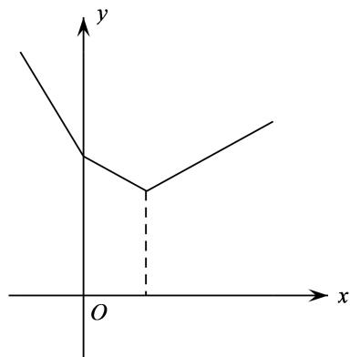

# 第18讲 函数的综合应用

# 知识梳理

1、高考中考查函数的内容主要是以综合题的形式出现，通常是函数与数列的综合、函数与不等式的综合、函数与导数的综合及函数的开放性试题和信息题，求解这些问题时，着重掌握函数的性质，把函数的性质与数列、不等式、导数等知识点融会贯通，从而找到解题的突破口，要求掌握二次函数图像、最值和根的分布等基本解法；掌握函数图像的各种变换形式（如对称变换、平移变换、伸缩变换和翻折变换等）；了解反函数的概念与性质；掌握指数、对数式大小比较的常见方法；掌握指数、对数方程和不等式的解法；掌握导数的定义、求导公式与求导法则、复合函数求导法则及导数的定义、求导公式与求导法则、复合函数求导法则及导数的几何意义，特别是应用导数研究函数的单调性、最值等.  
2、函数 $f(x) = \sum_{i=1}^{n}|x - a_i|$ 的图象与性质

分奇、偶两种情况考虑：

比如图(1)函数 $f(x)=|x|+|x-1|+|x-3|$ ，图(2)函数 $g(x)=|x|+|x-1|+|x-2|+|x+1|$

text_image

y
O
x

图（1）

text_image

y
O
x

图（2）

(1) 当 $n$ 为奇数时，函数 $f(x) = \sum_{i=1}^{n}|x - a_i|$ 的图象是一个“ $\vee$ ”型，且在“最中间的点”取最小值；  
(2) 当 $n$ 为偶数时，函数 $f(x) = \sum_{i=1}^{n}|x - a_i|$ 的图象是一个平底型，且在“最中间水平线段”取最小值；

若 $a_{i}(\mathbf{i}\in \mathbb{N}^{*})$ 为等差数列的项时，奇数的图象关于直线 $x = a_{\text{中}}$ 对称，偶数的图象关于直线 $x =$

$\frac{x_{左中}+x_{右中}}{2}$ 对称.

3、若 $f(x)$ 为 $[m, n]$ 上的连续单峰函数，且 $f(m) = f(n), x_0$ 为极值点，则当 $k, b$ 变化时， $g(x) = |f(x) - kx - b|$ 的最大值的最小值为 $\frac{|f(n) - f(x_0)|}{2}$ ，当且仅当 $k = 0, b = \frac{f(n) + f(x_0)}{2}$ 时取得.

# 必考题型全归纳

# 1 题型一: 函数与数列的综合

605 (2024·全国·高三专题练习)已知数列 $\{x_{n}\}$ ，满足 $x_{1}=1, 2x_{n+1}=\ln(1+x_{n}) (n\in\mathbb{N}^{*})$ ，设数列 $\{x_{n}\}$ 的前 n 项和为 $S_{n}$ ，则以下结论正确的是（）

A. $x_{n + 1} > x_n$

B. $x_{n} - 2x_{n + 1} <   x_{n}x_{n + 1}$

C. $2 \sqrt{x_{n + 2}} > x_{n + 1} + 1$

D. $S_{n + 5} > 2$

606 (2024·全国·高三专题练习)已知函数 $f(x)=\mathrm{e}^{x}-x-1$ ，数列 $\{a_{n}\}$ 的前 n 项和为 $S_{n}$ ，且满足 $a_{1}=\frac{1}{2}, a_{n+1}=f(a_{n})$ ，则下列有关数列 $\{a_{n}\}$ 的叙述正确的是（）

A. $a_5 < |4a_2 - 3a_1|$

B. $a_7 \leqslant a_8$

C. $a_{10} > 1$

D. $S_{100} > 26$

607 (2024·全国·高三专题练习)已知函数 $f(x)=\mathrm{e}^{x}-x-1$ ，数列 $\{a_{n}\}$ 的前 n 项和为 $S_{n}$ ，且满足 $a_{1}=\frac{1}{2}$ ， $a_{n+1}=f(a_{n})$ ，则下列有关数列 $\{a_{n}\}$ 的叙述正确的是（）

A. $a_{2} > \frac{1}{4}$

B. $a_6 < a_7$

C. $S_{100}<26$

D. $a_5 > |4a_2 - 3a_1|$

608 (2024·全国·高三专题练习)已知数列 $\{a_{n}\}$ 满足: $a_{n}>0$ , 且 $a_{n}^{2}=3a_{n+1}^{2}-2a_{n+1}(n\in\mathbb{N}^{*})$ , 下列说法正确的是 ()

A. 若 $a_1 = \frac{1}{2}$ , 则 $a_n > a_{n+1}$

B. 若 $a_1 = 2$ ，则 $a_n \geqslant 1 + \left(\frac{3}{7}\right)^{n-1}$

C. $a_1 + a_5 \leqslant 2a_3$

D. $|a_{n + 2} - a_{n + 1}|\geqslant \frac{\sqrt{3}}{3} |a_{n + 1} - a_n|$

609 (2024·陕西渭南·统考二模)已知函数 $f(x) = \sin x + \ln x$ ，将 $f(x)$ 的所有极值点按照由小到大的顺序排列，得到数列 $\{x_n\}$ ，对于 $\forall n \in \mathbb{N}_+$ ，则下列说法中正确的是（）

A. $n\pi < x_{n} < (n + 1)\pi$

B. $x_{n + 1} - x_n <   \pi$

C. 数列 $\left\{\left|x_{n}-\frac{(2n-1)\pi}{2}\right|\right\}$ 是递增数列

D. $f(x_{2n}) < -1 + \ln \frac{(4n - 1)\pi}{2}$

610 (2024·上海杨浦·高三复旦附中校考开学考试)无穷数列 $\{a_{n}\}$ 满足: $0 < a_{1} < 1$ , 且对任意的正整数 n, 均有 $\mathrm{e}^{a_{n+1}} = (3 - a_{n})\mathrm{e}^{a_{n}}$ , 则下列说法正确的是 ()

A. 数列 $\{a_{n}\}$ 为严格减数列

B. 存在正整数 $n$ ，使得 $a_{n} < 0$

C. 数列 $\{a_{n}\}$ 中存在某一项为最大项

D. 存在正整数 $n$ ，使得 $a_{n} > \frac{4}{3}$

# 2 题型二: 函数与不等式的综合

611 (2024·全国·高三专题练习)关于 x 的不等式 $(x-1)^{9999}-2^{9999}\cdot x^{9999}\leqslant x+1$ ，解集为 \_\_\_\_.

612 (2024·全国·高三专题练习)意大利数学家斐波那契(1175年\~1250年)以兔子繁殖数量为例,引人数列:1,1,2,3,5,8,…,该数列从第三项起,每一项都等于前两项之和,即 $a_{n+2}=a_{n+1}+a_{n}(n\in\mathbb{N}^{*})$ ,故此数列称为斐波那契数列,又称“兔子数列”,其通项公式为 $a_{n}=\frac{1}{\sqrt{5}}\left[\left(\frac{1+\sqrt{5}}{2}\right)^{n}-\left(\frac{1-\sqrt{5}}{2}\right)^{n}\right]$ . 设n是不等式 $\log_{2}[(1+\sqrt{5})^{n}-(1-\sqrt{5})^{n}]>n+5$ 的正整数解,则n的最小值为\_\_\_\_.

613 (2024·辽宁·高三校考阶段练习)已知函数 $f(x) = \frac{1}{2^x + 1} + x + 2$ ，若不等式 $f(m \cdot 4^x + 1) + f(m - 2^x) \geqslant 5$ 对任意的 $x > 0$ 恒成立，则实数 $m$ 的最小值为 \_\_\_\_.

614 (2024·全国·模拟预测)已知函数 $f(x)$ 是定义域为R的函数， $f(2 + x) + f(-x) = 0$ ，对任意 $x_{1}, x_{2} \in [1, +\infty)(x_{1} < x_{2})$ ，均有 $f(x_{2}) - f(x_{1}) > 0$ ，已知 $a, b (a \neq b)$ 为关于 $x$ 的方程 $x^{2} - 2x + t^{2} - 3 = 0$ 的两个解，则关于 $t$ 的不等式 $f(a) + f(b) + f(t) > 0$ 的解集为（）

A. $(-2,2)$

B. $(-2,0)$

C. $(0,1)$

D. $(1,2)$

# 3 题型三: 函数中的创新题

615 (2024·重庆渝中·高三重庆巴蜀中学校考阶段练习)帕德近似是法国数学家亨利·帕德发明的用有理多项式近似特定函数的方法．给定两个正整数 m, n，函数 $f(x)$ 在 x=0 处的 $[m,n]$ 阶帕德近似定义为： $\mathrm{R}(x)=\frac{a_{0}+a_{1}x+\cdots+a_{m}x^{m}}{1+b_{1}x+\cdots+b_{n}x^{n}}$ ，且满足： $f(0)=\mathrm{R}(0)$ ， $f'(0)=\mathrm{R}'(0)$ ， $f''(0)=\mathrm{R}''(0)\cdots$ ， $f^{(m+n)}(0)=\mathrm{R}^{(m+n)}(0)$ ．已知 $f(x)=\ln(x+1)$ 在 x=0 处的 $[1,1]$ 阶帕德近似为 $\mathrm{R}(x)=\frac{ax}{1+bx}$ ．注： $f''(x)=[f'(x)]',f'''(x)=[f''(x)]',f^{(4)}(x)=[f'''(x)]',f^{(5)}(x)=[f^{(4)}(x)]',\cdots$

(1) 求实数 $a, b$ 的值；  
(2) 求证: $(x + b)f\left(\frac{1}{x}\right) > 1$ ;   
(3) 求不等式 $\left(1+\frac{1}{x}\right)^{x}<\mathrm{e}<\left(1+\frac{1}{x}\right)^{x+\frac{1}{2}}$ 的解集, 其中 $e=2.71828\cdots$ .

616 (2024·上海黄浦·上海市敬业中学校考三模)定义:如果函数 $y=f(x)$ 和 $y=g(x)$ 的图像上分别存在点 M 和 N 关于 x 轴对称,则称函数 $y=f(x)$ 和 $y=g(x)$ 具有 C 关系.

(1) 判断函数 $f(x) = \log_2(8x^2)$ 和 $g(x) = \log_{\frac{1}{2}} x$ 是否具有 C 关系；  
(2) 若函数 $f(x)=a\sqrt{x-1}$ 和 $g(x)=-x-1$ 不具有 C 关系，求实数 a 的取值范围；  
(3) 若函数 $f(x) = xe^{x}$ 和 $g(x) = m\sin x (m < 0)$ 在区间 $(0, \pi)$ 上具有 C 关系，求实数 $m$ 的取值范围.

617 (2024·重庆·高三统考阶段练习)悬索桥(如图)的外观大漂亮,悬索的形状是平面几何中的悬链线.1691年莱布尼兹和伯努利推导出某链线的方程为 $y=\frac{c}{2}\left(\mathrm{e}^{\frac{x}{c}}+\mathrm{e}^{\frac{x}{c}}\right)$ ,其中c为参数.当c=1时,该方程就是双曲余弦函数 $\cosh(x)=\frac{\mathrm{e}^{x}+\mathrm{e}^{-x}}{2}$ ,类似的我们有双曲正弦函数 $\sinh(x)=\frac{\mathrm{e}^{x}-\mathrm{e}^{-x}}{2}$ .

natural_image

Exterior view of a large red suspension bridge spanning a coastal area with a cruise ship sailing nearby (no signage or text visible)

(1) 从下列三个结论中选择一个进行证明, 并求函数 $y = \cosh(2x) + \sinh(x)$ 的最小值;

① $\left[\cosh(x)\right]^{2}-\left[\sinh(x)\right]^{2}=1;$   
② $\sinh(2x)=2\sinh(x)\cosh(x)$ ;   
③ $\cosh(2x)=[\cosh(x)]^{2}+[ \sinh(x)]^{2}.$   
(2) 求证: $\forall x \in \left[-\pi, \frac{\pi}{4}\right]$ , $\cosh (\cos x) > \sinh (\sin x)$ .

618 (2024·广东深圳·高三深圳市南山区华侨城中学校考阶段练习)布劳威尔不动点定理是拓扑学里一个非常重要的不动点定理,它得名于荷兰数学家鲁伊兹·布劳威尔,简单地讲就是对于满足一定条件的连续实函数 $f(x)$ ,存在一个点 $x_{0}$ ,使得 $f(x_{0})=x_{0}$ ,那么我们称该函数为“不动点”函数,而称 $x_{0}$ 为该函数的一个不动点.现新定义:若 $x_{0}$ 满足 $f(x_{0})=-x_{0}$ ,则称 $x_{0}$ 为 $f(x)$ 的次不动点.

(1) 判断函数 $f(x)=x^{2}-2$ 是否是“不动点”函数, 若是, 求出其不动点; 若不是, 请说明理由  
(2) 已知函数 $g(x) = \left|\frac{1}{2} x + 1\right|$ ，若 $a$ 是 $g(x)$ 的次不动点，求实数 $a$ 的值：  
(3) 若函数 $h(x) = \log_{\frac{1}{2}} (4^x - b \cdot 2^x)$ 在 $[0,1]$ 上仅有一个不动点和一个次不动点，求实数 $b$ 的取值范围.

# 4 题型四: 最大值的最小值问题 (平口单峰函数、铅锤距离)

619 (2024·浙江绍兴·高三浙江省柯桥中学校考开学考试)已知函数 $f(x) = |x^3 - 6x^2 + ax + b|$ ，对于任意的实数 $a, b$ ，总存在 $x_0 \in [0,3]$ ，使得 $f(x_0) \geqslant m$ 成立，则当 $m$ 取最大值时， $a + b =$

A. 7

B. 4

C.-4

D.-7

620 (2024·湖北·高三校联考阶段练习)设函数 $f(x)=\left|x+\frac{4}{x}-ax-b\right|$ ，若对任意的实数 a, b，
总存在 $x_{0} \in [1,3]$ 使得 $f(x_{0}) \geqslant m$ 成立，则实数 m 的最大值为（）

A.-1

B. 0

C. $\frac{8-4\sqrt{3}}{3}$

D. 1

621 (2024·全国·高三专题练习)设函数 $f(x)=\left|\frac{4}{x}-ax\right|$ ，若对任意的正实数a，总存在 $x_{0}\in$ [1,4]，使得 $f(x_{0})\geqslant m$ ，则实数m的取值范围为()

A. $(-∞,0]$

B. $(-∞,1]$

C. $(-∞,2]$

D. $(-∞,3]$

622 (2024·全国·高三专题练习)已知函数 $f(x) = \left|\frac{x - 2}{x + 2} - ax - b\right|$ ，若对任意的实数 $a, b$ ，总存在 $x_0 \in [-1, 2]$ ，使得 $f(x_0) \geqslant m$ 成立，则实数 $m$ 的取值范围是（）

A. $\left(-\infty,\frac{1}{4}\right]$

B. $\left(-\infty,\frac{1}{2}\right]$

C. $\left(-\infty,\frac{2}{3}\right]$

D. $(-∞,1]$

623 (2024·高一课时练习)已知函数 $f(x) = \left|ax + \frac{1}{x} + b\right|(a, b \in \mathbb{R})$ ，当 $x \in \left[\frac{1}{2}, 2\right]$ 时，设 $f(x)$ 的最大值为 $\mathrm{M}(a, b)$ ，则 $\mathrm{M}(a, b)$ 的最小值为（）

A. $\frac{1}{8}$

B. $\frac{1}{4}$

C. $\frac{1}{2}$

D. 1

624 (2024·江西宜春·校联考模拟预测)已知函数 $f(x)=\left|\ln x+\frac{1}{x}-ax-b\right|(a,b\in\mathbb{R})$ ，且 $x_0\in[1,\mathrm{e}^2]$ ，满足 $\ln x_0+\frac{1}{x_0}=\mathrm{e}-1$ ，当 $x\in\left[\frac{1}{\mathrm{e}},x_0\right]$ 时，设函数 $f(x)$ 的最大值为 $\mathrm{M}(a,b)$ ，则 $\mathrm{M}(a,b)$ 的最小值为（）

A. $\frac{3-e}{2}$

B. $\frac{1}{2}$

C. $\frac{e-1}{2}$

D. $\frac{e-2}{2}$

625 (2024·上海虹口·高三上海市复兴高级中学校考期中)若 $a, b \in R$ ，且对于 $0 \leqslant x \leqslant 1$ 时，不等式 $\left|\sqrt{1-x^{2}}-ax-b\right| \leqslant \frac{\sqrt{2}-1}{2}$ 均成立，则实数对 $(a,b)=$ \_\_\_\_.

# 5 题型五:倍值函数

626 (2024·全国·高三专题练习)函数 $f(x)$ 的定义域为D,若满足:① $f(x)$ 在D内是单调函数;②存在 $[a,b]\subseteq D$ 使得 $f(x)$ 在 $[a,b]$ 上的值域为 $\left[\frac{a}{2},\frac{b}{2}\right]$ ,则称函数 $f(x)$ 为“成功函数”.若函数 $f(x)=\log_{m}(m^{x}+2t)$ (其中m>0,且 $m\neq1$ )是“成功函数”,则实数t的取值范围为()

A. $(0, +\infty)$

B. $\left(-\infty,\frac{1}{8}\right]$

C. $\left[\frac{1}{8},\frac{1}{4}\right)$

D. $\left(0,\frac{1}{8}\right)$

627 (2024·上海金山·高三上海市金山中学校考期末)设函数 $f(x)$ 的定义域为D,若存在闭区间 $[a,b]\subseteq D$ ,使得 $f(x)$ 函数满足:(1) $f(x)$ 在 $[a,b]$ 上是单调函数;(2) $f(x)$ 在 $[a,b]$ 上的值域是 $[2a,2b]$ ,则称区间 $[a,b]$ 是函数 $f(x)$ 的“和谐区间”,下列结论错误的是

A. 函数 $f(x)=x^{2}(x \geqslant 0)$ 存在“和谐区间”  
B. 函数 $f(x) = \mathrm{e}^{x}(x \in \mathbb{R})$ 不存在“和谐区间”  
C. 函数 $f(x)=\frac{4x}{x^{2}+1}(x\geqslant0)$ 存在“和谐区间”  
D. 函数 $f(x)=\log_{a}\left(a^{x}-\frac{1}{8}\right)(a>0,a\neq1)$ 不存在“和谐区间”

628 (2024·安徽·高三统考期末)函数 $f(x)$ 的定义域为 D，若存在闭区间 $[a,b] \subseteq D$ ，使得函数 $f(x)$ 满足：① $f(x)$ 在 $[a,b]$ 内是单调函数；② $f(x)$ 在 $[a,b]$ 上的值域为 $[2a,2b]$ ，则称区间 $[a,b]$ 为 $y = f(x)$ 的“倍值区间”。下列函数中存在“倍值区间”的有

① $f(x)=x^{2}(x\geq0)$ ; ② $f(x)=\mathrm{e}^{x}(x\in\mathrm{R})$ ;

$$
f (x) = \frac {4 x}{x ^ {2} + 1} (x \geq 0); \quad f (x) = \log_ {a} \left(a ^ {x} - \frac {1}{8}\right) (a > 0, a \neq 1)
$$

A. ①②③④

B.①②④

C. ①③④

D. ①③

629 (2024·全国·高三专题练习)函数 $f(x)$ 的定义域为D,对给定的正数k,若存在闭区间 $[a,b]\subseteq D$ ,使得函数 $f(x)$ 满足:① $f(x)$ 在 $[a,b]$ 内是单调函数;② $f(x)$ 在 $[a,b]$ 上的值域为 $[ka,kb]$ ,则称区间 $[a,b]$ 为 $y=f(x)$ 的k级“理想区间”.下列结论错误的是()

A. 函数 $f(x)=x^{2}(x\in\mathbb{R})$ 存在 1 级“理想区间”  
B. 函数 $f(x) = \mathrm{e}^{x}(x \in \mathbb{R})$ 不存在2级“理想区间”  
C. 函数 $f(x)=\frac{4x}{x^{2}+1}(x\geqslant0)$ 存在 3 级“理想区间”  
D. 函数 $f(x)=\tan x, x\in\left(-\frac{\pi}{2},\frac{\pi}{2}\right)$ 不存在 4 级“理想区间”

630 (2024·全国·高三专题练习)设函数的定义域为D,若满足条件:存在 $[a,b]\subseteq D$ ,使 $f(x)$ 在 $[a,b]$ 上的值域为 $\left[\frac{a}{2},\frac{b}{2}\right]$ ，则称 $f(x)$ 为“倍缩函数”.若函数 $f(x)=\mathrm{e}^{x}+t$ 为“倍缩函数”，则实数t的取值范围是

A. $\left(-\infty,-\frac{1+\ln2}{2}\right]$

B. $\left(-\infty,-\frac{1+\ln2}{2}\right)$

C. $\left[\frac{1+\ln2}{2},+\infty\right)$

D. $\left(\frac{1+\ln2}{2},+\infty\right)$

# 6 题型六: 函数不动点问题

631 (2024·广西柳州·统考模拟预测)设函数 $f(x)=\sqrt{\mathrm{e}^{x}+(\mathrm{e}-1)x-a}$ ( $a\in R$ , e为自然对数的底数), 若曲线 $y=\sin x$ 上存在点 $(x_{0},y_{0})$ 使 $f(y_{0})=y_{0}$ 成立, 则 a 的取值范围是 ( )

A. $[1,2\mathrm{e} - 2]$

B. $\left[\mathrm{e}^{-1}-\mathrm{e},1\right]$

C. $[1,\mathrm{e}]$

D. $\left[\mathrm{e}^{-1}-\mathrm{e},2\mathrm{e}-2\right]$

632 (2024·全国·高三专题练习)设函数 $f(x) = \frac{\ln x}{x} + x - a (a \in \mathbb{R})$ ，若曲线 $y = \frac{2\mathrm{e}^{x + 1}}{\mathrm{e}^{2x} + 1} (\mathrm{e}$ 是自然对数的底数)上存在点 $(x_0, y_0)$ 使得 $f(f(y_0)) = y_0$ ，则 $a$ 的取值范围是

A. $(- \infty, 0]$

B. $(0,e]$

C. $\left(-\infty,\frac{1}{\mathrm{e}}\right]$

D. $[0, +\infty)$

633 (2024·江苏·高二专题练习)若存在一个实数 t，使得 $F(t)=t$ 成立，则称 t 为函数 $F(x)$ 的一个不动点。设函数 $g(x)=\mathrm{e}^{x}+(1-\sqrt{\mathrm{e}})x-a(a\in\mathrm{R},\mathrm{e}$ 为自然对数的底数)，定义在 R 上的连续函数 $f(x)$ 满足 $f(-x)+f(x)=x^{2}$ ，且当 $x\leqslant0$ 时， $f'(x)<x$ 。若存在 $x_{0}\in\left\{x\left|f(x)+\frac{1}{2}\geqslant f(1-x)+x\right.\right\}$ ，且 $x_{0}$ 为函数 $g(x)$ 的一个不动点，则实数 a 的取值范围为（）

A. $\left(-\infty,\frac{e}{2}\right)$

B. $\left[\frac{\sqrt{e}}{2},+\infty\right)$

C. $\left(\frac{\sqrt{e}}{2},\sqrt{e}\right]$

D. $\left(\frac{\sqrt{e}}{2},+\infty\right)$

634 (2024·全国·高三专题练习)设函数 $f(x) = \sqrt{\mathrm{e}^x + x - a} (a \in \mathbb{R}, \mathrm{e}$ 为自然对数的底数)，若曲线 $y = \frac{3\sqrt{10}}{10}\sin x + \frac{\sqrt{10}}{10}\cos x$ 上存在点 $(x_0, y_0)$ 使得 $f(y_0) = y_0$ ，则 $a$ 的取值范围是

A. $\left[\frac{1-\mathrm{e}}{\mathrm{e}},1\right]$

B. $\left[\frac{1-\mathrm{e}}{\mathrm{e}},\mathrm{e}+1\right]$

C. $[1, e + 1]$

D. $[1,\mathrm{e}]$

635 (2024·全国·高三专题练习)设函数 $f(x)=\mathrm{e}^{x}+2x-a(a\in\mathbb{R})$ ，e 为自然对数的底数，若曲线 $y=\sin x$ 上存在点 $(x_{0},y_{0})$ ，使得 $f(f(y_{0}))=y_{0}$ ，则 a 的取值范围是（）

A. $[-1 + \mathrm{e}^{-1}, 1 + \mathrm{e}]$

B. $[1,1 + \mathrm{e}]$

C. $[\mathrm{e},\mathrm{e} + 1]$

D. [1,e]

# 题型七: 函数的旋转问题

636 (2024·江苏苏州·高三苏州中学校考阶段练习)将函数 $f(x)=\ln(x+1)(x\geqslant0)$ 的图象绕坐标原点逆时针方向旋转角 $\theta(\theta\in(0,\alpha])$ ，得到曲线 C，若对于每一个旋转角 $\theta$ ，曲线 C 都仍然是一个函数的图象，则 $\alpha$ 的最大值为（）

A. $\pi$

B. $\frac{\pi}{2}$

C. $\frac{\pi}{3}$

D. $\frac{\pi}{4}$

637 (2024·上海长宁·高三上海市延安中学校考期中)设 D 是含数 1 的有限实数集, $f(x)$ 是定义在 D 上的函数, 若 $f(x)$ 的图象绕原点逆时针旋转 $\frac{\pi}{6}$ 后与原图象重合, 则在以下各项中, $f(1)$ 的可能取值只能是 ( )

A. $\sqrt{3}$

B. $\frac{\sqrt{3}}{2}$

C. $\frac{\sqrt{3}}{3}$

D. 0

638 (2024·全国·高三专题练习)双曲线 $\frac{x^{2}}{3}-y^{2}=1$ 绕坐标原点 O 旋转适当角度可以成为函数 $f(x)$ 的图象, 关于此函数 $f(x)$ 有如下四个命题, 其中真命题的个数为 ( )

① $f(x)$ 是奇函数；  
② $f(x)$ 的图象过点 $\left(\frac{\sqrt{3}}{2},\frac{3}{2}\right)$ 或 $\left(\frac{\sqrt{3}}{2},-\frac{3}{2}\right)$ ;  
③ $f(x)$ 的值域是 $\left(-\infty, -\frac{3}{2}\right] \cup \left[\frac{3}{2}, +\infty\right)$ ;  
④函数 $y=f(x)-x$ 有两个零点.

A. 4 个

B. 3 个

C. 2 个

D. 1 个

639 (2024·全国·高三专题练习)将函数 $y = 2 \sin \frac{x}{2} \left( x \in \left[0, \frac{\pi}{2}\right] \right)$ 的图像绕着原点逆时针旋转角 $\alpha$ 得到曲线 T，当 $\alpha \in (0, \theta]$ 时都能使 T 成为某个函数的图像，则 $\theta$ 的最大值是（）

A. $\frac{\pi}{6}$

B. $\frac{\pi}{4}$

C. $\frac{3}{4}\pi$

D. $\frac{2}{3}\pi$

# 题型八:函数的伸缩变换问题

640 (2024·河北唐山·高三开滦第二中学校考期末)定义域为R的函数 $f(x)$ 满足 $f(x+2)=2f(x)-1$ ，当 $x\in(0,2]$ 时， $f(x)=\left\{\begin{aligned}&x^{2}-x,x\in(0,1)\\&\frac{1}{x},x\in[1,2]\end{aligned}\right.$ .若 $x\in(0,4]$ 时， $t^{2}-\frac{7t}{2}\leqslant f(x)\leqslant3-t$ 恒成立，则实数t的取值范围是()

A. $[1,2]$

B. $\left[1,\frac{5}{2}\right]$

C. $\left[\frac{1}{2},2\right]$

D. $\left[2,\frac{5}{2}\right]$

641 (2024·全国·高三专题练习)定义域为R的函数 $f(x)$ 满足 $f(x+2)=2f(x)$ ，当x[0,2]时， $f(x)=\left\{\begin{aligned}x^{2}-x,x&\in[0,1)\\ -\left(\frac{1}{2}\right)^{|x-\frac{3}{2}|},&x\in[1,2)\end{aligned}\right.$ ，若当 $x\in[-4,-2)$ 时，不等式 $f(x)\geqslant\frac{m^{2}}{4}-m+\frac{1}{2}$ 恒成立，
则实数m的取值范围是()

A. $[2,3]$

B. $[1,3]$

C. $[1,4]$

D. $[2,4]$

642 (2024·全国·高三专题练习)已知定义域为R的函数 $f(x)$ 满足 $f(x)=2f(x+2)$ ，当 $x\in$

$[0,2)$ 时， $f(x) = \begin{cases} -x^2 + x + 1, & x \in [0,1) \\ \left(\frac{1}{2}\right)^{|x - \frac{3}{2}|}, & x \in [1,2) \end{cases}$ ，设 $f(x)$ 在 $[2n - 2,2n)$ 上的最大值为 $a_n(n \in \mathbb{N}^*)$ 则数列 $\{a_n\}$ 的前 $n$ 项和 $S_n$ 的值为

A. $5 - 5\left(\frac{1}{2}\right)^{n}$

B. $\frac{5}{2}-5\left(\frac{1}{2}\right)^{n}$

C. $5 - 5\left(\frac{1}{2}\right)^{n+1}$

D. $\frac{5}{2} - 5\left(\frac{1}{2}\right)^{n + 1}$

643 (2024·甘肃·高三西北师大附中阶段练习)定义域为R的函数 $f(x)$ 满足 $f(x+2)=2f(x)-2$ ，当 $x\in(0,2]$ 时， $f(x)=\left\{\begin{aligned}&x^{2}-x,x\in(0,1)\\&\frac{1}{x},x\in[1,2]\end{aligned}\right.$ ，若 $x\in(0,4]$ 时， $t^{2}-\frac{7t}{2}\leqslant f(x)$ 恒成立，则实数t的取值范围是()

A. $[1,2]$

B. $\left[2,\frac{5}{2}\right]$

C. $[2, +\infty)$

D. $\left[1,\frac{5}{2}\right]$

# 9 题型九: V 型函数和平底函数

644 (2024·全国·高三专题练习)已知 $a_{1}, a_{2}, a_{3}$ 与 $b_{1}, b_{2}, b_{3}$ 是 6 个不同的实数, 若关于 x 的方程 $|x - a_{1}| + |x - a_{2}| + |x - a_{3}| = |x - b_{1}| + |x - b_{2}| + |x - b_{3}|$ 解集 A 是有限集, 则集合 A 中, 最多有 \_\_\_\_ 个元素.

645 (浙江省衢州市2024学年高三数学试题)已知等差数列 $\{a_{n}\}$ 满足: $|a_{1}| + |a_{2}| + \cdots + |a_{n}| = \left|a_{1} - \frac{1}{2}\right| + \left|a_{2} - \frac{1}{2}\right| + \cdots + \left|a_{n} - \frac{1}{2}\right| = \left|a_{1} + \frac{3}{2}\right| + \left|a_{2} + \frac{3}{2}\right| + \cdots + \left|a_{n} + \frac{3}{2}\right| = 72$ , 则 n 的最大值为

A. 18

B. 16

C. 12

D. 8

646 (上海市川沙中学2024学年高三第二学期数学试题)等差数列 $a_{1},a_{2},\cdots$ , $a_{n}(n\geqslant3,n\in\mathrm{N}^{*})$ ，满足 $|a_{1}|+|a_{2}|+\cdots+|a_{n}|=|a_{1}+1|+|a_{2}+1|+\cdots+|a_{n}+1|=|a_{1}-2|$ $+|a_{2}-2|+\cdots+|a_{n}-2|=2019$ ，则()

A. $n$ 的最大值为50

B. $n$ 的最小值为50

C. $n$ 的最大值为51

D. $n$ 的最小值为51

647 (上海市青浦区2024届高三二模数学试题)等差数列 $a_1, a_2 \cdots, a_n (n \in \mathbb{N}^*)$ ，满足 $|a_1| + |a_2|$ + $\cdots + |a_n| = |a_1 + 1| + |a_2 + 1| + \cdots + |a_n + 1| = |a_1 + 2| + |a_2 + 2| + \cdots + |a_n + 2| = |a_1 + 3| + |a_2 + 3| + \cdots + |a_n + 3| = 2010$ ，则 （）

A. $n$ 的最大值是50

B. $n$ 的最小值是50

C. $n$ 的最大值是51

D. n 的最小值是 51

648 (浙江省金丽衢十二校2024学年高三第一次联考数学试题)设等差数列 $a_{1}, a_{2}, \cdots, a_{n} (n \geqslant 3, n \in \mathbb{N}^{*})$ 的公差为 $d$ ，满足 $|a_{1}| + |a_{2}| + \cdots + |a_{n}| = |a_{1}-1| + |a_{2}-1| + \cdots + |a_{n}-1| = |a_{1}+2| + |a_{2}+2| + \cdots + |a_{n}+2| = m$ ，则下列说法正确的是

A. $|d|\geqslant 3$

B. $n$ 的值可能为奇数

C. 存在 $\mathrm{i} \in \mathbb{N}^*$ , 满足 $-2 < a_i < 1$

D. $m$ 的可能取值为11

