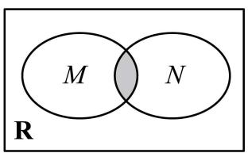
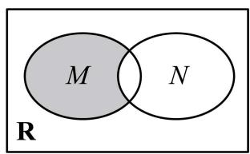
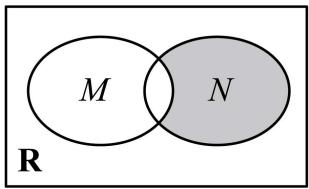
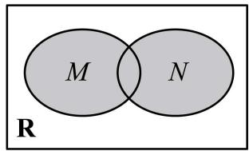

# 第1讲 集合

# 知识梳理

# 1、元素与集合

(1) 集合中元素的三个特性: 确定性、互异性、无序性.  
(2) 元素与集合的关系: 属于或不属于, 数学符号分别记为: $\in$ 和 $\notin$ .  
(3) 集合的表示方法: 列举法、描述法、韦恩图 (venn 图).

(4) 常见数集和数学符号

<table><tr><td>数集</td><td>自然数集</td><td>正整数集</td><td>整数集</td><td>有理数集</td><td>实数集</td></tr><tr><td>符号</td><td>N</td><td> $N^*$ 或 $N_+$ </td><td>Z</td><td>Q</td><td>R</td></tr></table>

说明：

①确定性:给定的集合,它的元素必须是确定的;也就是说,给定一个集合,那么任何一个元素在不在这个集合中就确定了.给定集合 $A=\{1,2,3,4,5\}$ ,可知 $1\in A$ ,在该集合中, $6\notin A$ ,不在该集合中;  
②互异性:一个给定集合中的元素是互不相同的;也就是说,集合中的元素是不重复出现的.

集合 $A=\{a,b,c\}$ 应满足 $a\neq b\neq c$ .

③无序性: 组成集合的元素间没有顺序之分。集合 $A = \{1, 2, 3, 4, 5\}$ 和 $B = \{1, 3, 5, 2, 4\}$ 是同一个集合.

# ④列举法

把集合的元素一一列举出来,并用花括号“{ }”括起来表示集合的方法叫做列举法.

# ⑤描述法

用集合所含元素的共同特征表示集合的方法称为描述法.

具体方法是:在花括号内先写上表示这个集合元素的一般符号及取值(或变化)范围,再画一条竖线,在竖线后写出这个集合中元素所具有的共同特征.

# 2、集合间的基本关系

(1) 子集 (subset): 一般地, 对于两个集合 A、B, 如果集合 A 中任意一个元素都是集合 B 中的元素, 我们就说这两个集合有包含关系, 称集合 A 为集合 B 的子集, 记作 $A \subseteq B$ (或 $B \supseteq A$ ), 读作“A 包含于 B” (或“B 包含 A”).  
(2) 真子集 (proper subset): 如果集合 A ⊆ B, 但存在元素 $x \in B$ , 且 $x \notin A$ , 我们称集合 A 是集合 B 的真子集, 记作 A ⊆ B (或 B ≌ A). 读作 “A 真包含于 B” 或 “B 真包含 A”.  
(3) 相等: 如果集合 A 是集合 B 的子集 $(A \subseteq B$ ，且集合 B 是集合 A 的子集 $(B \subseteq A)$ ，此时，集合 A 与集合 B 中的元素是一样的，因此，集合 A 与集合 B 相等，记作 A = B.  
(4) 空集的性质: 我们把不含任何元素的集合叫做空集, 记作 $\varnothing$ ; $\varnothing$ 是任何集合的子集, 是任何非空集合的真子集.

# 3、集合的基本运算

(1) 交集: 一般地, 由属于集合 A 且属于集合 B 的所有元素组成的集合, 称为 A 与 B 的交

集,记作 A∩B,即 A∩B= $\{x|x\in A,$ 且 $x\in B\}$ .

(2) 并集: 一般地, 由所有属于集合 A 或属于集合 B 的元素组成的集合, 称为 A 与 B 的并集, 记作 A ∪ B, 即 A ∪ B = {x | x ∈ A, 或 x ∈ B}.  
(3) 补集: 对于一个集合 A, 由全集 U 中不属于集合 A 的所有元素组成的集合称为集合 A 相对于全集 U 的补集, 简称为集合 A 的补集, 记作 $C_{U}A$ , 即 $C_{U}A = \{x \mid x \in U, \text{且 } x \notin A\}$ .

# 4、集合的运算性质

(1) $A \cap A = A, A \cap \varnothing = \varnothing, A \cap B = B \cap A.$   
(2) $A \cup A = A, A \cup \varnothing = A, A \cup B = B \cup A.$   
(3) $\mathrm{A} \cap (\mathrm{C_U A}) = \emptyset, \mathrm{A} \cup (\mathrm{C_U A}) = \mathrm{U}, \mathrm{C_U}(\mathrm{C_U A}) = \mathrm{A}$ .

# 【解题方法总结】

(1) 若有限集 A 中有 n 个元素, 则 A 的子集有 $2^{n}$ 个, 真子集有 $2^{n}-1$ 个, 非空子集有 $2^{n}-1$ 个, 非空真子集有 $2^{n}-2$ 个.  
(2) 空集是任何集合 A 的子集, 是任何非空集合 B 的真子集.  
(3) $\mathrm{A} \subseteq \mathrm{B} \Leftrightarrow \mathrm{A} \cap \mathrm{B} = \mathrm{A} \Leftrightarrow \mathrm{A} \cup \mathrm{B} = \mathrm{B} \Leftrightarrow \mathrm{C}_{\mathrm{U}} \mathrm{B} \subseteq \mathrm{C}_{\mathrm{U}} \mathrm{A}$ .   
(4) $C_{U}(A \cap B) = (C_{U}A) \cup (C_{U}B), C_{U}(A \cup B) = (C_{U}A) \cap (C_{U}B).$

# 必考题型全归纳

# 1 题型一:集合的表示:列举法、描述法

(2024·广东江门·统考一模)已知集合 A = {−1,0,1}, B = {m|m²−1∈A,m−1∉A}, 则集合 B 中所有元素之和为 ( )

A. 0

B. 1

C.-1

D. $\sqrt{2}$

(2024·江苏·高三统考学业考试)对于两个非空实数集合 A 和 B, 我们把集合 $\{x \mid x = a + b, a \in A, b \in B\}$ 记作 A\*B. 若集合 $A = \{0, 1\}, B = \{0, -1\}$ , 则 A\*B 中元素的个数为 ( )

A. 1

B. 2

C. 3

D. 4

3 (2024·全国·高三专题练习)定义集合 $\mathrm{A} + \mathrm{B} = \{x + y|x\in \mathrm{A}$ 且 $y\in \mathrm{B}\}$ .已知集合 $\mathrm{A} =$ $\{2,4,6\} ,\mathrm{B} = \{-1,1\}$ ，则 $\mathrm{A} + \mathrm{B}$ 中元素的个数为 （

A. 6

B. 5

C. 4

D. 7

# 2 题型二:集合元素的三大特征

4(2024·北京海淀·校考模拟预测)设集合 $M=\{2m-1,m-3\}$ ，若 $-3\in M$ ，则实数m=()

A. 0

B.-1

C. 0 或 -1

D. 0 或 1

5 (2024·江西·金溪一中校联考模拟预测)已知集合 $A=\{1,a,b\}$ ， $B=\{a^{2},a,ab\}$ ，若A=B，则 $a^{2023}+b^{2022}=$ （）

A.-1

B. 0

C. 1

D. 2

6 (2024·北京东城·统考一模)已知集合 $A = \{x \mid x^2 - 2 < 0\}$ ，且 $a \in A$ ，则 $a$ 可以为 （）

A.-2

B.-1

C. $\frac{3}{2}$

D. $\sqrt{2}$

# 3 题型三:元素与集合间的关系

(2024·河南·开封高中校考模拟预测)已知 $A=\left\{x \mid x^{2}-ax+1<0\right\}$ ，若 $2 \in A$ ，且 $3 \notin A$ ，则 a 的取值范围是（）

A. $\left(\frac{5}{2},+\infty\right)$

B. $\left(\frac{5}{2},\frac{10}{3}\right]$

C. $\left[\frac{5}{2},\frac{10}{3}\right)$

D. $\left(-\infty,\frac{10}{3}\right]$

8 (2024·吉林延边·统考二模)已知集合 $A=\left\{x\mid ax^{2}-3x+2=0\right\}$ 的元素只有一个，则实数 a 的值为 （）

A. $\frac{9}{8}$

B. 0

C. $\frac{9}{8}$ 或 0

D. 无解

(2024·全国·高三专题练习)已知集合 $A=\left\{(x,y)\mid\frac{x^{2}}{4}+\frac{y^{2}}{2}\leqslant1,x\in\mathbb{Z},y\in\mathbb{Z}\right\}$ ，则 A 中元素的个数为

A. 9

B. 10

C. 11

D. 12

# 4 题型四:集合与集合之间的关系

10 (多选题)(2024·山东潍坊·统考一模)若非空集合M,N,P满足： $M \cap N = N, M \cup P = P$ ，则()

A. $\mathrm{P}\subseteq \mathrm{M}$

B. $\mathrm{M} \cap \mathrm{P} = \mathrm{M}$

C. $N \cup P = P$

D. $\mathrm{M}\cap \complement_p\mathrm{N} = \emptyset$

(2024·江苏·统考一模)设 $M=\left\{x\mid x=\frac{k}{2},k\in Z\right\}$ ， $N=\left\{x\mid x=k+\frac{1}{2},k\in Z\right\}$ ，则（）

A. M ⊆ N

B. N ⊆ M

C. M=N

D. $\mathrm{M}\cap \mathrm{N} = \emptyset$

(2024·辽宁沈阳·东北育才学校校考模拟预测)已知集合 $A=\left\{x|x^{2}-x-12\leqslant0\right\}$ ， $B=\left\{x|x^{2}-3mx+2m^{2}+m-1<0\right\}$ ，若“ $x\in A$ ”是“ $x\in B$ ”的必要不充分条件，则实数 m 的取值范围为（）

A. $[-3, 2]$

B. $[-1,3]$

C. $\left[-1,\frac{5}{2}\right]$

D. $\left[2,\frac{5}{2}\right]$

13 (2024·广东茂名·统考二模)已知集合 $\mathrm{A} = \{x||x|\leqslant 1\}$ , $\mathrm{B} = \{x|2x - a < 0\}$ , 若 $\mathrm{A} \subseteq \mathrm{B}$ , 则实数 $a$ 的取值范围是

A. $(2, +\infty)$

B. $\left[2,+\infty\right)$

C. $(-∞,2)$

D. $(-∞,2]$

# 5 题型五:集合的交、并、补运算

14 (2024·广东广州·统考二模)已知集合 $\mathrm{A} = \{x|x = 3n - 2,n\in \mathbb{N}^*\}$ ， $\mathrm{B} = \{6,7,10,11\}$ ，则集合 $\mathrm{A}\cap \mathrm{B}$ 的元素个数为 （）

A. 1

B. 2

C. 3

D. 4

15 (2024·河北张家口·统考二模)已知集合 $A = \{x | (x - 2)(4 - x) > 0\}$ , $B = \left\{x \mid \frac{1}{3 - x} > 0\right\}$ , 则 $(\complement_{R} A) \cup (\complement_{R} B) =$

A. $(2,3)$

B. $[3,4]$

C. $(-∞,2]∪[3,+∞)$

D. $(- \infty, 3] \cup [4, +\infty)$

16 (2024·广东·统考一模)已知集合 $M=\{x \mid x(x-2)<0\}$ , $N=\{x \mid x-1<0\}$ ，则下列 Venn 图中阴影部分可以表示集合 $\{x \mid 1 \leqslant x < 2\}$ 的是（）

A.

text_image

M
N
R

B.

text_image

M
N
R

C.

text_image

M
N
R

D.

text_image

M
N
R

17 (2024·全国·高三专题练习) 2021 年是中国共产党成立 100 周年, 电影频道推出“经典频传:看电影,学党史”系列短视频,传扬中国共产党的伟大精神,为广大青年群体带来精神感召. 现有《青春之歌》《建党伟业》《开国大典》三支短视频,某大学社团有 50 人,观看了《青春之歌》的有 21 人,观看了《建党伟业》的有 23 人,观看了《开国大典》的有 26 人. 其中,只观看了《青春之歌》和《建党伟业》的有 4 人,只观看了《建党伟业》和《开国大典》的有 7 人,只观看了《青春之歌》和《开国大典》的有 6 人,三支短视频全观看了的有 3 人,则没有观看任何一支短视频的人数为 \_\_\_\_.

# 题型六:集合与排列组合的密切结合

18 (2024·全国·高三专题练习)设集合 $X=\{a_{1},a_{2},a_{3},a_{4}\}\subseteq N^{*}$ ，定义：集合Y=

$\left\{a_{i} + a_{j}\mid a_{i},a_{j}\in \mathrm{X},\mathrm{i},j\in \mathrm{N}^{*},\mathrm{i}\neq j\right\}$ ，集合 $\mathrm{S} = \{x\cdot y|x,y\in \mathrm{Y},x\neq y\}$ ，集合 $\mathrm{T} =$

$\left\{\frac{x}{y} |x,y\in \mathrm{Y},x\neq y\right\}$ ，分别用 $|\mathrm{S}|$ ， $|\mathrm{T}|$ 表示集合S，T中元素的个数，则下列结论可能成立的是 （）

A. $|\mathrm{S}| = 6$

B. $|\mathrm{S}| = 16$

C. $|\mathrm{T}| = 9$

D. $|\mathrm{T}| = 16$

19 (2024·全国·模拟预测)已知集合 A, B 满足 $A \cup B = \{1, 2, 3\}$ ，若 $A \neq B$ ，且 [A&B]，[B&A] 表示两个不同的“AB 互补对”，则满足题意的“AB 互补对”个数为（）

A. 9

B. 4

C. 27

D. 8

20 (2024·北京·中央民族大学附属中学校考模拟预测)已知集合 A 满足: ① A ⊆ N, ② ∀ x, y ∈ A, x ≠ y, 必有 |x - y| ≥ 2, ③ 集合 A 中所有元素之和为 100, 则集合 A 中元素个数最多为 ( )

A. 11

B. 10

C. 9

D. 8

# 题型七:集合的创新定义

21 (2024·全国·校联考模拟预测)对于集合 A, B, 定义 A - B = {x | x ∈ A, 且 x ∉ B}. 若 A = {x | x = 2k + 1, k ∈ N}, B = {x | x = 3k + 1, k ∈ N}, 将集合 A - B 中的元素从小到大排列得

到数列 $\{a_{n}\}$ ，则 $a_7 + a_{30} =$ （

A. 55

B. 76

C. 110

D. 113

22 (多选题)(2024·河南安阳·安阳一中校考模拟预测)由无理数引发的数学危机一直延续到19世纪.直到1872年,德国数学家戴德金从连续性的要求出发,用有理数的“分割”来定义无理数(史称戴德金分割),并把实数理论建立在严格的科学基础上,才结束了无理数被认为“无理”的时代,也结束了持续2000多年的数学史上的第一次大危机.所谓戴德金分割,是指将有理数集Q划分为两个非空的子集M与N,且满足 $M\cup N=Q,M\cap N=\varnothing,M$ 中的每一个元素都小于N中的每一个元素,则称(M,N)为戴德金分割.试判断下列选项中,可能成立的是()

A. $M=\{x|x<0\},N=\{x|x>0\}$ 是一个戴德金分割  
B. M没有最大元素, N有一个最小元素  
C. M有一个最大元素, N有一个最小元素  
D. M没有最大元素, N也没有最小元素

23 (2024·湖北·统考二模)已知 X 为包含 v 个元素的集合 $(v \in \mathbb{N}^{*}, v \geqslant 3)$ . 设 A 为由 X 的一些三元子集 (含有三个元素的子集) 组成的集合, 使得 X 中的任意两个不同的元素, 都恰好同时包含在唯一的一个三元子集中, 则称 (X, A) 组成一个 v 阶的 Steiner 三元系. 若 (X, A) 为一个 7 阶的 Steiner 三元系, 则集合 A 中元素的个数为 \_\_\_\_.

