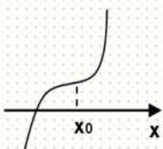
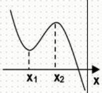
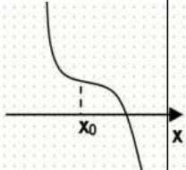

# 第20讲 三次函数的图象和性质

# 知识梳理

# 1、基本性质

设三次函数为： $f(x) = ax^{3} + bx^{2} + cx + d(a,b,c,d\in \mathbb{R}$ 且 $a\neq 0)$ ，其基本性质有：

性质1:①定义域为R. ②值域为R,函数在整个定义域上没有最大值、最小值. ③单调性和图像:

<table><tr><td></td><td colspan="2">a&gt;0</td><td colspan="2">a&lt;0</td></tr><tr><td rowspan="2">图像</td><td>Δ&gt;0</td><td>Δ≤0</td><td>Δ&gt;0</td><td>Δ≤0</td></tr><tr><td></td><td></td><td></td><td></td></tr></table>

性质 2: 三次方程 $f(x)=0$ 的实根个数

由于三次函数在高考中出现频率最高,且四次函数、分式函数等都可转化为三次函数来解决,故以三次函数为例来研究根的情况,设三次函数 $f(x)=ax^{3}+bx^{2}+cx+d(a\neq0)$

其导函数为二次函数: $f'(x)=3ax^{2}+2bx+c(a\neq0)$ ,

判别式为： $\triangle=4b^{2}-12ac=4(b^{2}-3ac)$ ，设 $f'(x)=0$ 的两根为 $x_{1}$ 、 $x_{2}$ ，结合函数草图易得：

(1) 若 $b^{2} - 3ac \leqslant 0$ ，则 $f(x) = 0$ 恰有一个实根；  
(2) 若 $b^{2} - 3ac > 0$ ，且 $f(x_{1}) \cdot f(x_{2}) > 0$ ，则 $f(x) = 0$ 恰有一个实根；  
(3) 若 $b^{2} - 3ac > 0$ ，且 $f(x_{1}) \cdot f(x_{2}) = 0$ ，则 $f(x) = 0$ 有两个不相等的实根；  
(4) 若 $b^{2} - 3ac > 0$ ，且 $f(x_{1}) \cdot f(x_{2}) < 0$ ，则 $f(x) = 0$ 有三个不相等的实根.

说明:(1)(2) $f(x)=0$ 含有一个实根的充要条件是曲线 $y=f(x)$ 与x轴只相交一次,即 $f(x)$ 在R上为单调函数(或两极值同号),所以 $b^{2}-3ac\leqslant0$ (或 $b^{2}-3ac>0$ ,且 $f(x_{1})\cdot f(x_{2})>0$ );

(5) $f(x)=0$ 有两个相异实根的充要条件是曲线 $y=f(x)$ 与x轴有两个公共点且其中之一为切点，所以 $b^{2}-3ac>0$ ，且 $f(x_{1})\cdot f(x_{2})=0;$   
(6) $f(x)=0$ 有三个不相等的实根的充要条件是曲线 $y=f(x)$ 与x轴有三个公共点，即 $f(x)$ 有一个极大值，一个极小值，且两极值异号.所以 $b^{2}-3ac>0$ 且 $f(x_{1})\cdot f(x_{2})<0$ .

性质 3: 对称性

(1)三次函数是中心对称曲线,且对称中心是; $\left(-\frac{b}{3a},f\left(-\frac{b}{3a}\right)\right)$ ;  
(2) 奇函数的导数是偶函数, 偶函数的导数是奇函数, 周期函数的导数还是周期函数.

# 2、常用技巧

(1) 其导函数为 $f'(x) = 3ax^2 + 2bx + c = 0$ 对称轴为 $x = -\frac{b}{3a}$ ，所以对称中心的横坐标也就是导函数的对称轴，可见， $y = f(x)$ 图象的对称中心在导函数 $y = f'(x)$ 的对称轴上，且又是两

个极值点的中点,同时也是二阶导为零的点;

(2) $y=f(x)$ 是可导函数, 若 $y=f(x)$ 的图象关于点 $(m,n)$ 对称, 则 $y=f'(x)$ 图象关于直线 x=m

对称.

(3) 若 $y = f(x)$ 图象关于直线 $x = m$ 对称，则 $y = f'(x)$ 图象关于点 $(m,0)$ 对称.

(4) 已知三次函数 $f(x) = ax^3 + bx^2 + cx + d$ 的对称中心横坐标为 $x_0$ ，若 $f(x)$ 存在两个极值点 $x_1, x_2$ ，则有 $\frac{f(x_1) - f(x_2)}{x_1 - x_2} = -\frac{a}{2}(x_1 - x_2)^2 = \frac{2}{3} f'(x_0)$ .

# 必考题型全归纳

# 1 题型一:三次函数的零点问题

(2024·全国·高三专题练习)函数 $f(x)=x^{3}+ax+2$ 存在 3 个零点，则 a 的取值范围是 ( )

A. $(- \infty, -2)$

B. $(-∞,-3)$

C. $(-4,-1)$

D. $(-3,0)$

718 (2024·江苏扬州·高三校考阶段练习)设 a 为实数, 函数 $f(x) = -x^{3} + 3x + a$ .

(1) 求 $f(x)$ 的极值;  
(2) 是否存在实数 $a$ , 使得方程 $f(x)=0$ 恰好有两个实数根? 若存在, 求出实数 $a$ 的值; 若不存在, 请说明理由.

719 (2024·四川绵阳·高三四川省绵阳南山中学校考阶段练习)已知函数 $f(x)=ax^{3}+bx^{2}-3x(a,b\in\mathbb{R})$ ，且 $f(x)$ 在x=1和x=3处取得极值.

(1) 求函数 $f(x)$ 的解析式;  
(2) 设函数 $g(x)=f(x)+t$ ，若 $g(x)=f(x)+t$ 有且仅有一个零点，求实数 t 的取值范围.

720 (2024·天津河西·高三天津实验中学校考阶段练习)已知 $f(x)=ax^{3}+bx^{2}-4a,a,b\in\mathbb{R}$ .

(1) 当 $a = b = 1$ ，求 $y = f(x)$ 的极值；  
(2) 当 a=0, b=2，设 $g(x)=x^{2}-\ln x+1$ ，求不等式 $f(x)<g(x)$ 的解集；  
(3) 当 a > 0 时, 若函数 $f(x)$ 恰有两个零点, 求 $\frac{b}{a}$ 的值.

721 (2024·河北保定·高三统考阶段练习)已知函数 $f(x) = x^{3} - 3x^{2} + 3x$ .

(1) 求函数 $f(x)$ 的图象在点 x=0 处的切线方程；  
(2) 若 $f(x) - 1 \leqslant x^3 + m$ 在 $x \in [0,2]$ 上有解，求 $m$ 的取值范围；  
(3) 设 $f'(x)$ 是函数 $f(x)$ 的导函数, $f''(x)$ 是函数 $f'(x)$ 的导函数, 若函数 $f''(x)$ 的零点为 $x_{0}$ , 则点 $(x_{0}, f(x_{0}))$ 恰好就是该函数 $f(x)$ 的对称中心. 试求 $f\left(\frac{1}{1010}\right) + f\left(\frac{2}{1010}\right) + \cdots + f\left(\frac{2018}{1010}\right) + f\left(\frac{2019}{1010}\right)$ 的值.

722 (2024·山西太原·高三太原市外国语学校校考阶段练习)已知三次函数 $f(x)=x^{3}+bx^{2}+cx+d(a,b,c\in\mathbb{R})$ 过点 $(3,0)$ ，且函数 $f(x)$ 在点 $(0,f(0))$ 处的切线恰好是直线 y=0.

(1) 求函数 $f(x)$ 的解析式;  
(2) 设函数 $g(x) = 9x + m - 1$ ，若函数 $y = f(x) - g(x)$ 在区间 $[-2, 1]$ 上有两个零点，求实数 $m$ 的取值范围.

723 (2024·全国·高三专题练习)已知函数 $f(x) = \frac{1}{3} x^3 + ax, g(x) = -x^2 - a (a \in \mathbb{R})$ .

(1) 若函数 $F(x) = f(x) - g(x)$ 在 $x \in [1, +\infty)$ 上单调递增，求 a 的最小值；

(2) 若函数 $G(x) = f(x) + g(x)$ 的图象与 x 轴有且只有一个交点，求 a 的取值范围.

# 2 题型二:三次函数的最值、极值问题

724 (2024·云南·高三统考期末)已知函数 $f(x) = -\frac{1}{3} x^3 + x^2 + 2ax$ , $g(x) = \frac{1}{2} x^2 - 4$ .

(1) 若函数 $f(x)$ 在 $(0, +\infty)$ 上存在单调递增区间，求实数 a 的取值范围；  
(2) 设 $G(x)=f(x)-g(x)$ . 若 0<a<2, $G(x)$ 在 [1,3] 上的最小值为 $h(a)$ , 求 $h(a)$ 的零点.

725 (2024·高三课时练习)已知函数 $f(x) = -\frac{1}{3} x^3 + x^2 + 2ax$ , $g(x) = \frac{1}{2} x^2 - 4$ .

(1) 若函数 $f(x)$ 在 $(0, +\infty)$ 上存在单调递增区间，求实数 a 的取值范围；  
(2) 设 $\mathrm{G}(x)=f(x)-g(x)$ . 若 0<a<2, $\mathrm{G}(x)$ 在 [1,3] 上的最小值为 $-\frac{1}{3}$ , 求 $\mathrm{G}(x)$ 在 [1,3] 上取得最大值时, 对应的 x 值.

726 (2024·江苏常州·高三常州市北郊高级中学校考期中)已知函数 $f(x)=x^{3}-ax^{2}-a^{2}x+1$ ，其中 a>0.

(1) 当 a=1 时, 求 $f(x)$ 的单调增区间;  
(2) 若曲线 $y = f(x)$ 在点 $(-a, f(-a))$ 处的切线与 y 轴的交点为 $(0, b)$ ，求 $b + \frac{1}{a}$ 的最小值.

727 (2024·广东珠海·高三校联考期中)已知函数 $f(x) = \frac{1}{3} x^3 - ax^2 + (a^2 - 1)x + b (a, b \in \mathbb{R})$ ，其图象在点 $(1, f(1))$ 处的切线方程为 $x + y - 3 = 0$ .

(1) 求 $a, b$ 的值；  
(2) 求函数 $f(x)$ 的单调区间和极值；  
(3) 求函数 $f(x)$ 在区间 $[-2,5]$ 上的最大值.

728 (2024·全国·高三专题练习)已知函数 $f(x) = x^{3} - ax^{2} - x, a \in \mathbb{R}$ ，且 $f'(1) = 0$ .

(1) 求曲线 $y = f(x)$ 在点 $(-1, f(-1))$ 处的切线方程；  
(2) 求函数 $f(x)$ 在区间 [0,3] 上的最大值.

729 (2024·全国·高三专题练习)已知函数 $f(x)=x^{3}+3bx^{2}+cx+d$ 在 $(-∞,0)$ 上是增函数，在 (0,2) 上是减函数，且 $f(x)=0$ 的一个根为 -b

(1) 求 $c$ 的值;  
(2) 求证: $f(x)=0$ 还有不同于 -b 的实根 $x_{1}$ 、 $x_{2}$ ，且 $x_{1}$ 、-b、 $x_{2}$ 成等差数列；  
(3) 若函数 $f(x)$ 的极大值小于 16，求 $f(1)$ 的取值范围

730 (2024·浙江宁波·高三效实中学校考期中)已知函数 $f(x)=\frac{1}{3}x^{3}-ax^{2}+(a+2)x+1$ (其中 a>0).

(1) 求函数 $f(x)$ 的单调区间；  
(2) 若 $f(x)$ 有两个不同的极值点 $x_{1}, x_{2}$ ，求 $f(x_{1}) + f(x_{2})$ 的取值范围.

# 3 题型三:三次函数的单调性问题

731 (2024·陕西商洛·高三校考阶段练习)已知三次函数 $f(x) = \frac{1}{3} x^3 - (4m - 1)x^2 + (15m^2 - 2m - 7)x + 2$ 在R上是增函数，则 $m$ 的取值范围是 （）

A. $m <   2$ 或 $m > 4$

B. $-4 < m < -2$

C. $2 < m < 4$

D. $2 \leqslant m \leqslant 4$

732 (2024·全国·高三专题练习)三次函数 $f(x)=mx^{3}-x$ 在 $(-∞,+∞)$ 上是减函数，则 m 的取值范围是 ()

A. $m <   0$

B. $m < 1$

C. $m \leqslant 0$

D. $m \leqslant 1$

733 (2024·江西宜春·高三校考阶段练习)已知函数 $f(x) = \frac{1}{3} x^3 - \frac{m + 1}{2} x^2$ , $g(x) = \frac{1}{3} - mx$ , $m$ 是实数.

(1) 若 $f(x)$ 在区间 $(2, +\infty)$ 为增函数，求 m 的取值范围；  
(2) 在 (1) 的条件下, 函数 $h(x)=f(x)-g(x)$ 有三个零点, 求 m 的取值范围.

734 (2024·陕西榆林·高三绥德中学校考阶段练习)已知三次函数 $f(x)=ax^{3}+bx-3$ 在 x=1 处取得极值，且在 $(0,-3)$ 点处的切线与直线 $3x+y=0$ 平行.

(1) 求 $f(x)$ 的解析式;  
(2) 若函数 $g(x)=f(x)+mx$ 在区间 $(1,2)$ 上单调递增，求 m 的取值范围.

735 (2024·全国·高三专题练习)已知函数 $f(x)=\frac{1}{3}x^{3}-|2ax+4|$ 在 [1,2] 上单调递增，则 a 的取值范围为 \_\_\_\_.

# 题型四:三次函数的切线问题

736 (2024·全国·高三专题练习)已知函数 $f(x)=x^{3}-x$ .

(1) 求曲线 $y = f(x)$ 在点 $\mathrm{M}(t, f(t))$ 处的切线方程；  
(2) 设常数 a > 0，如果过点 $P(a, m)$ 可作曲线 $y = f(x)$ 的三条切线，求 m 的取值范围.

737 (2024·江西·高三校联考阶段练习)已知函数 $f(x) = x^{3} - 3x^{2} + x - 1$ .

(1) 求曲线 $y = f(x)$ 在点 $P(t, f(t))$ 处的切线方程；  
(2) 设 m > 1，若过点 Q(m, n) 可作曲线 $y = f(x)$ 的三条切线，证明：-2m < n < f(m).

738 (2024·江苏·高三专题练习)已知函数 $f(x) = \frac{1}{3} x^3 - \frac{1}{2} ax^2 + (a - 1)x + 2 (a \in \mathbb{R})$ , $f(x)$ 满足 $f(x) + f(-x) = 4$ ，已知点M是曲线 $y = f(x)$ 上任意一点，曲线在M处的切线为 $l$ .

(1) 求切线 l 的倾斜角 $\alpha$ 的取值范围；  
(2) 若过点 $\mathrm{P}(1, m) \left(m \neq \frac{4}{3}\right)$ 可作曲线 $y = f(x)$ 的三条切线，求实数 $m$ 的取值范围.

739 (2024·安徽·高三校联考期末)已知函数 $f(x) = -\frac{1}{6} x^3 - x^2 + mx + 3$ ，在 $x = 0$ 处取得极值.

(1) 求 m 的值;  
(2) 若过 $(2, t)$ 可作曲线 $y = f(x)$ 的三条切线，求 t 的取值范围.

740 (2024·陕西西安·高三校考阶段练习)已知函数 $f(x) = ax^3 - bx^2$ 在点 $(1, f(1))$ 处的切线方程为 $3x + y - 1 = 0$ .

(1) 求实数 a, b 的值;  
(2) 若过点 $(-1, m) (m \neq -4)$ 可作曲线 $y = f(x)$ 的三条切线，求实数 m 的取值范围.

(2024·全国·高三专题练习)设函数 $f(x)=\frac{1}{3}x^{3}+ax^{2}+bx+c(a<0)$ 在x=0处取得极值-1.

(1) 设点 A(-a, f(-a))，求证：过点 A 的切线有且只有一条，并求出该切线方程；  
(2) 若过点 $(0,0)$ 可作曲线 $y=f(x)$ 的三条切线，求 a 的取值范围；

(3) 设曲线 $y = f(x)$ 在点 $(x_1, f(x_1))$ 、 $(x_2, f(x_2)) (x_1 \neq x_2)$ 处的切线都过点 (0,0)，证明： $f'(x_1) \neq f'(x_2)$ .

# 5 题型五:三次函数的对称问题

742 (2024·全国·高三专题练习)给出定义: 设 $f'(x)$ 是函数 $y = f(x)$ 的导函数, $f''(x)$ 是函数 $y = f'(x)$ 的导函数. 若方程 $f''(x) = 0$ 有实数解 $x = x_{0}$ , 则称 $(x_{0}, f(x_{0}))$ 为函数 $y = f(x)$ 的 “拐点”. 经研究发现所有的三次函数 $f(x) = ax^{3} + bx^{2} + cx + d (a \neq 0)$ 都有“拐点”, 且该 “拐点”也是函数 $y = f(x)$ 的图象的对称中心. 若函数 $f(x) = x^{3} - 3x^{2}$ , 则 $f\left(\frac{1}{2023}\right) +$

$$
f \left(\frac {2}{2 0 2 3}\right) + f \left(\frac {3}{2 0 2 3}\right) + \dots + f \left(\frac {4 0 4 4}{2 0 2 3}\right) + f \left(\frac {4 0 4 5}{2 0 2 3}\right) = \tag {（）}
$$

A.-8088

B.-8090

C. -8092

D. -8096

743 (2024·全国·高三专题练习)已知函数 $y = x^{3} + 3x^{2} + x$ 的图象 C 上存在一定点 P 满足: 若过点 P 的直线 l 与曲线 C 交于不同于 P 的两点 $\mathrm{M}(x_{1}, y_{1}), \mathrm{N}(x_{2}, y_{2})$ ，就恒有 $y_{1} + y_{2}$ 的定值为 $y_{0}$ ，则 $y_{0}$ 的值为 \_\_\_\_.

744 (2024·新疆·统考二模)对于三次函数 $f(x)=ax^{3}+bx^{2}+cx+d(a\neq0)$ ，给出定义：设 $f'(x)$ 是 $y=f(x)$ 的导数， $\varphi(x)$ 是 $y=f'(x)$ 的导数，若方程 $\varphi(x)=0$ 有实数解 $x_{0}$ ，则称点 $(x_{0},f(x_{0}))$ 为曲线 $y=f(x)$ 的“拐点”，可以发现，任何一个三次函数都有“拐点”。设函数 $g(x)=2x^{3}-3x^{2}+4x-3$ ，则 $g\left(\frac{1}{2023}\right)+g\left(\frac{2}{2023}\right)+\cdots+g\left(\frac{2022}{2023}\right)=$ \_\_\_\_.

745 (多选题)(2024·江苏南京·高三南京市江宁高级中学校联考期末)对于三次函数 $f(x)=ax^{3}+bx^{2}+cx+d(a\neq0)$ ，给出定义： $f'(x)$ 是函数 $y=f(x)$ 的导数， $f''(x)$ 是函数 $f'(x)$ 的导数，若方程 $f''(x)=0$ 有实数解 $x_{0}$ ，则称 $(x_{0},f(x_{0}))$ 为函数 $y=f(x)$ 的“拐点”。某同学经探究发现：任何一个三次函数都有“拐点”；任何一个三次函数都有对称中心，且“拐点”就是对称中心。若函数 $f(x)=\frac{2}{3}x^{3}-x^{2}-12x+\frac{49}{6}$ ，则下列说法正确的是（）

A. $f(x)$ 的极大值为 $\frac{137}{6}$   
B. $f(x)$ 有且仅有2个零点  
C. 点 $\left(\frac{1}{2},2\right)$ 是 $f(x)$ 的对称中心  
D. $f\left(\frac{1}{2024}\right)+f\left(\frac{2}{2024}\right)+f\left(\frac{3}{2024}\right)+\cdots f\left(\frac{2023}{2024}\right)=4046$

746 (多选题)(2024·广东佛山·高三南海中学校考期中)定义:设 $f'(x)$ 是 $f(x)$ 的导函数, $f''(x)$ 是函数 $f'(x)$ 的导数.若方程 $f''(x)=0$ 有实数解 $x_{0}$ ,则称点 $(x_{0},f(x_{0}))$ 为函数 $y=f(x)$ 的“拐点”.经过探究发现:任何一个三次函数都有“拐点”且“拐点”就是三次函数图像的对称中心,已知函数 $f(x)=ax^{3}+bx^{2}+\frac{5}{3}(ab\neq0)$ 的对称中心为(1,1),则下列说法中正确的有()

A. $a=\frac{1}{3}$ , b=-1   
B. 函数 $f(x)$ 有三个零点  
C. 过 $\left(3, \frac{5}{3}\right)$ 可以作两条直线与 $y = f(x)$ 图像相切  
D. 若函数 $f(x)$ 在区间 $(t - 6, t)$ 上有最大值，则 $0 < t \leqslant 3$

747 (多选题)(2024·安徽阜阳·高三安徽省太和中学校考竞赛)定义:设 $f'(x)$ 是 $f(x)$ 的导函数， $f''(x)$ 是函数 $f'(x)$ 的导数，若方程 $f''(x)=0$ 有实数解 $x_{0}$ ，则称点 $(x_{0},f(x_{0}))$ 为函数 $y=f(x)$ 的“拐点”。经过探究发现：任何一个三次函数都有“拐点”且“拐点”就是三次函数图像的对称中心。已知函数 $f(x)=ax^{3}+bx^{2}+\frac{5}{3}(ab\neq0)$ 的对称中心为 $(1,1)$ ，则下列说法中正确的有（）

A. $a = \frac{1}{3}, b = -1$   
B. $f\left(\frac{1}{100}\right)+f\left(\frac{2}{100}\right)+\cdots+f\left(\frac{198}{100}\right)+f\left(\frac{199}{100}\right)$ 的值是 199.  
C. 函数 $f(x)$ 有三个零点  
D. 过 $\left(-1, \frac{1}{3}\right)$ 可以作三条直线与 $y = f(x)$ 图像相切

# 6 题型六:三次函数的综合问题

748 (2024·全国·高三专题练习)已知函数 $f(x) = x^3 + bx^2 + cx + d$ 在 $\circ (-\infty, 0]$ 上是增函数，在[0,2]上是减函数，且方程 $f(x) = 0$ 有3个实数根，它们分别是 $\alpha, \beta, 2$ ，则 $a^2 + \beta^2$ 的最小值是 （）

A. 5

B. 6

C. 1

D. 8

749 (2024·陕西西安·高三西安中学校考期中)已知函数 $f(x) = ax^3 + bx^2 + cx + d (a \neq 0)$ , $f'(x) = g(x)$ , 给出下列四个结论, 分别是: ① $a > 0$ ; ② $f(x)$ 在 R 上单调; ③ $f(x)$ 有唯一零点; ④存在 $x_0$ , 使得 $g(x_0) < 0$ . 其中有且只有一个是错误的, 则错误的一定不可能是 ( )

A. ①

B. ②

C. ③

D. ④

750 (2024·全国·高三专题练习)已知 $f(x)=x^{3}-6x^{2}+9x-abc$ , a<b<c，且 $f(a)=f(b)=f(c)=0$ ，现给出如下结论：

① $f(x)\leqslant1$ ; ② $f(x)\geqslant3$ ; ③ $f(0)f(1)<0;$

④ $f(0)f(3)>0$ ; ⑤ abc<4.

其中正确结论的序号是 \_\_\_\_.

751 (2024·黑龙江大庆·高三大庆实验中学校考期末)已知 $f(x)=x^{3}-\frac{9}{2}x^{2}+6x-abc,a<b$ <c,且 $f(a)=f(b)=f(c)=0$ ,现给出如下结论：

① $f(0)f(1)>0$ ; ② $f(0)f(1)<0$ ; ③ $f(0)f(2)>0$ ; ④ $f(0)f(2)<0$ .

其中正确结论的序号为 （）

A. ②③

B.①④

C. ②④

D. ①③

752 (2024·湖北·高三校联考阶段练习)函数 $y=f(x)$ 的图象关于坐标原点成中心对称图形的充要条件是函数 $y=f(x)$ 为奇函数,有同学发现可以将其推广为:函数 $y=f(x)$ 的图象关于点 P(a,b) 成中心对称图形的充要条件是函数 $y=f(x+a)-b$ 为奇函数.已知函数 $f(x)=x^{3}+ax^{2}+bx+1$ .

(1) 若函数 $y = f(x)$ 的对称中心为 $(-1, 2)$ ，求函数 $y = f(x)$ 的解析式.  
(2)由代数基本定理可以得到:任何一元 $n(n\in\mathbb{N}^{*})$ 次复系数多项式 $f(x)$ 在复数集中可以分解为n个一次因式的乘积.进而,一元n次多项式方程有n个复数根(重根按重数计).如设实系数一元二次方程 $a_{2}x^{2}+a_{1}x+a_{0}=0(a_{2}\neq0)$ ,在复数集内的根为 $x_{1},x_{2}$ ,则方程 $a_{2}x^{2}+a_{1}x+a_{0}=0$ 可变形为 $a_{2}(x-x_{1})(x-x_{2})=0$ ,展开得： $a_{2}x^{2}-a_{2}(x_{1}x_{2})x+a_{2}x_{1}x_{2}=0$

则有 $\left\{ \begin{array}{l}a_{1} = -a_{2}(x_{1} + x_{2})\\ a_{0} = a_{2}x_{1}x_{2}\circ \circ \circ \circ \circ \circ \circ \circ \circ \end{array} \right.$ ，即 $\left\{ \begin{array}{l}x_1 + x_2 = -\frac{a_1}{a_2}\\ x_1x_2 = \frac{a_0}{a_2}\circ \circ \circ \circ \circ \circ \end{array} \right.,$

类比上述推理方法可得实系数一元三次方程根与系数的关系，

①若 a=0，方程 $f(x)=k$ 在复数集内的根为 $x_{1}$ 、 $x_{2}$ 、 $x_{3}$ ，当 $k\in[0,1]$ 时，求 $x_{1}^{3}+x_{2}^{3}+x_{3}^{3}$ 的最大值；  
②若 a=-3, b=-2，函数 $y=f(x)$ 的零点分别为 $x_{1}$ 、 $x_{2}$ 、 $x_{3}$ ，求 $\frac{1}{x_{1}^{2}}+\frac{1}{x_{2}^{2}}+\frac{1}{x_{3}^{2}}$ 的值.

753 (2024·全国·高三专题练习)已知函数 $f(x) = x^{3} + bx^{2} + cx + d$ 在 $(- \infty, 0]$ 上为增函数，在[0,6]上为减函数，且方程 $f(x) = 0$ 的三个根分别为 $1, x_{1}, x_{2}$ .

(1) 求实数 b 的取值范围;  
(2) 求 $x_{1}^{2}-4x_{1}x_{2}+x_{2}^{2}$ 的取值范围.

754 (2024·贵州贵阳·高三贵阳一中校考阶段练习)给出定义: 设 $f'(x)$ 是函数 $y = f(x)$ 的导函数, $f''(x)$ 是函数 $y = f'(x)$ 的导函数, 若方程 $f''(x) = 0$ 有实数解 $x_0$ , 则称 $(x_0, f(x_0))$ 为函数 $y = f(x)$ 的. “固点”. 经研究发现所有的三次函数 $f(x) = ax^3 + bx^2 + cx + d (a \neq 0)$ 都有 “固点”, 且该 “固点” 也是函数 $y = f(x)$ 的图象的对称中心. 根据以上信息和相关知识回答下列问题: 已知函数 $f(x) = x^3 + (3a - 3)x^2 + (6a - 9a^2)x - 5a (a \in \mathbb{R})$ .

(1) 当 a = -1 时, 试求 $y = f(x)$ 的对称中心.  
(2) 讨论 $f(x)$ 的单调性;  
(3) 当 $a = 2$ 时, $f(x) = m$ 有三个不相等的实数根 $x_{1} < x_{2} < x_{3}$ , 当 $|x_{1} - x_{3}|$ 取得最大值时, 求 $m$ 的值.

# 题型七:三次函数恒成立问题

755 (2024·全国·高三专题练习)已知三次函数 $f(x)$ 的导函数 $f'(x) = -3x^2 + 3$ 且 $f(0) = -1$ , $g(x) = x\ln x + \frac{a}{x} (a \geqslant 1)$ .

(1) 求 $f(x)$ 的极值;  
(2) 求证: 对任意 $x_{1}, x_{2} \in (0, +\infty)$ ，都有 $f(x_{1}) \leqslant g(x_{2})$ .

756 (2024·全国·高三专题练习)设 a 为实数, 函数 $f(x)=x^{3}-3x^{2}+a$ , $g(x)=x\ln x$ .

(1) 求 $f(x)$ 的极值;  
(2) 对于 $\forall x_{1} \in [1,3]$ , $\forall x_{2} \in \left[\frac{1}{\mathrm{e}}, \mathrm{e}\right]$ , 都有 $f(x_{1}) \geqslant g(x_{2})$ , 试求实数 $a$ 的取值范围.

757 (2024·四川泸州·高三泸州老窖天府中学校考阶段练习)已知三次函数 $f(x)=ax^{3}+bx^{2}-3x(a,b,c\in\mathbb{R})$ .

(1) 若函数 $f(x)$ 在点 $(1, f(1))$ 处的切线方程是 $y + 2 = 0$ ，求函数 $f(x)$ 的解析式；  
(2) 在 (1) 的条件下, 若对于区间 $[-2,3]$ 上任意两个自变量的值 $x_{1}, x_{2}$ , 都有 $|f(x_{1}) - f(x_{2})| \leqslant m$ , 求出实数 m 的取值范围.

758 (2024·全国·高三专题练习)已知函数 $f(x)=-\frac{1}{3}x^{3}+\frac{1}{2}ax^{2}+2a^{2}x+3(a\in\mathbb{R})$ , $f'(x)$ 为函数 $f(x)$ 的导函数

(1) 若 x = -1 为函数 $f(x)$ 的极值点, 求实数 a 的值;  
(2) $f(x)$ 的单调增区间内有且只有两个整数时,求实数a的取值范围;  
(3) 对任意 $0 < a \leqslant \frac{1}{2}$ 时，任意实数 $x_{1}, x_{2} \in [-1, 2]$ ，都有 $f(x_{1}) + f'(x_{2}) - 3 \geqslant M + 7a - \frac{20}{3}$

恒成立,求实数M的最大值.

759 (2024·全国·高三专题练习)已知函数 $f(x) = 2x^{3} + 3(1 - a)x^{2} - 6ax - 3a$ , $g(x) = 3x^{2} + kx$ .

(1) 对任意 $a \geqslant 1$ , 使得 $f(-1)$ 是函数 $f(x)$ 在区间 $[-1, b](b > -1)$ 上的最大值, 试求最大的实数 $b$ .  
(2) 若 $0 < a < 1$ , 对于区间 $[-1, 0]$ 的任意两个不相等的实数 $x_{1}, x_{2}$ , 且 $x_{1} < x_{2}$ , 都有 $|g(x_{1}) - g(x_{2})| < f(x_{1}) - f(x_{2})$ 成立, 求 $k$ 的取值范围.

760 (2024·辽宁沈阳·高三东北育才学校校考期中)已知函数 $f(x)=2x^{2}+x-k$ , $g(x)=ax^{3}+bx^{2}+cx+d(a\neq0)$ 是 R 上的奇函数, 当 x=1 时, $g(x)$ 取得极值 -2.

(1) 求函数 $g(x)$ 的单调区间和极大值；  
(2) 若对任意 $x \in [-1,3]$ ，都有 $f(x) \leqslant g(x)$ 成立，求实数 k 的取值范围；  
(3) 若对任意 $x_{1} \in [-1, 3]$ , $x_{2} \in [-1, 3]$ , 都有 $f(x_{1}) \leqslant g(x_{2})$ 成立, 求实数 $k$ 的取值范围.

761 (2024·江苏南通·高三江苏省如东高级中学校考期中)已知函数 $f(x)=\frac{1}{3}ax^{3}+\left(b-\frac{a-3}{2}\right)x^{2}+3x$ ，其中 $a>0, b\in R.$

(1) 当 b = -3 时, 讨论函数 $f(x)$ 的单调性;  
(2) 当 $a = 3$ ，且 $b < 0$ 时，  
(i) 若 $f(x)$ 有两个极值点 $x_{1}, x_{2}(x_{1}<x_{2})$ ，求证： $f(x_{1})<1$ ;  
(ii) 若对任意的 $x \in [0, t]$ ，都有 $-1 \leqslant f(x) \leqslant 16$ 成立，求正实数 t 的最大值.

762 (2024·全国·高三专题练习)已知函数 $f(x) = x^{3} - mx + 50$ 在 $x = 2$ 处取得极值， $m \in \mathbb{R}$ .

(1) 求 m 的值与 $f(x)$ 的单调区间；  
(2) 设 $0 < t \leqslant 2$ ，已知函数 $g(x) = \frac{f(x)}{16t}$ ，若对于任意 $x_{1}, x_{2} \in [t - 2, t]$ ，都有 $|g(x_{1}) - g(x_{2})| \leqslant 1$ ，求实数 t 的取值范围.

