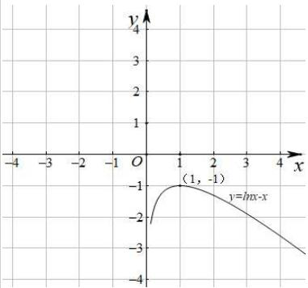
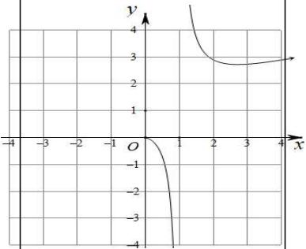
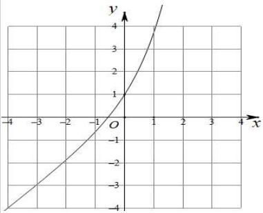
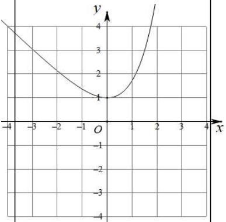
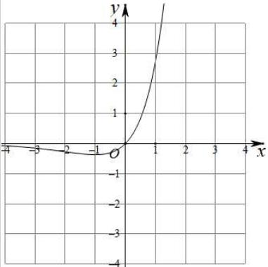
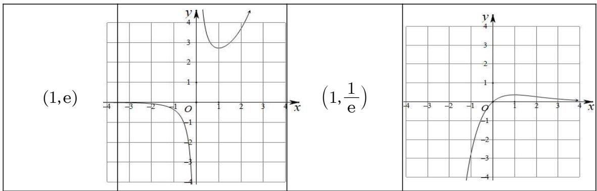

# 第26讲 导数同构

# 知识梳理

方法技巧总结一、常见的同构函数图像

<table><tr><td>函数表达式</td><td>图像</td><td>函数表达式</td><td>图像</td></tr><tr><td> $y = \ln x + x$ </td><td></td><td> $y = \ln x - x$ 函数极值点(1,-1)</td><td></td></tr><tr><td> $y = x \ln x$ 函数极值点 $(\frac{1}{e}, -\frac{1}{e})$ </td><td></td><td> $y = \frac{\ln x}{x}$ 函数极值点 $(e, \frac{1}{e})$ </td><td></td></tr><tr><td> $y = \frac{x}{\ln x}$ 函数极值点(e,e)</td><td></td><td> $y = e^x + x$ 过定点(0,1)</td><td></td></tr><tr><td> $y = e^x - x$ 函数极值点(0,1)</td><td></td><td> $y = xe^x$ 函数极值点 $(-1, -\frac{1}{e})$ </td><td></td></tr><tr><td> $y = \frac{e^x}{x}$ 函数极值点</td><td></td><td> $y = \frac{x}{e^x}$ 函数极值点</td><td></td></tr></table>

line

| x | y (left graph) | y (right graph) |
|---|---|---|
| -4 | 0 | 0 |
| -3 | 0 | 0 |
| -2 | 0 | 0 |
| -1 | 0 | 0 |
| 0 | 0 | 0 |
| 1 | 0 | 0 |
| 2 | 0 | 0 |
| 3 | 0 | 0 |
| 4 | 0 | 0 |

方法技巧总结二: 同构式的基本概念与导数压轴题

1、同构式:是指除了变量不同,其余地方均相同的表达式

2、同构式的应用：

(1) 在方程中的应用: 如果方程 $f(a) = 0$ 和 $f(b) = 0$ 呈现同构特征, 则 $a, b$ 可视为方程 $f(x) = 0$ 的两个根  
(2) 在不等式中的应用: 如果不等式的两侧呈现同构特征, 则可将相同的结构构造为一个函数, 进而和函数的单调性找到联系. 可比较大小或解不等式. <同构小套路>

①指对各一边,参数是关键;②常用“母函数”: $f(x)=x\cdot e^{x}, f(x)=e^{x}\pm x$ ; 寻找“亲戚函数”是关键;   
③信手拈来凑同构，凑常数、x、参数；④复合函数(亲戚函数)比大小，利用单调性求参数范围.  
(3) 在解析几何中的应用: 如果 $\mathrm{A}(x_{1}, y_{1}), \mathrm{B}(x_{2}, y_{2})$ 满足的方程为同构式, 则 A, B 为方程所表示曲线上的两点. 特别的, 若满足的方程是直线方程, 则该方程即为直线 AB 的方程  
(4) 在数列中的应用: 可将递推公式变形为“依序同构”的特征, 即关于 $(a_{n}, n)$ 与 $(a_{n-1}, n-1)$ 的同构式, 从而将同构式设为辅助数列便于求解

3、常见的指数放缩： $\mathrm{e}^x\geqslant x + 1(x = 0);\mathrm{e}^x\geqslant ex(x = 1)$

4、常见的对数放缩： $1 - \frac{1}{x}\leqslant \ln x\leqslant x - 1(x = 1);\ln x\leqslant \frac{x}{\mathrm{e}} (x = \mathrm{e})$   
5、常见三角函数的放缩： $x\in \left(0,\frac{\pi}{2}\right),\sin x <   x <   \tan x$   
6、学习指对数的运算性质时,曾经提到过两个这样的恒等式:

(1) 当 $a > 0$ 且 $a \neq 1, ^{\circ} x > 0$ 时，有 $a^{\log_a x} = x$   
(2) 当 $a > 0$ 且 $a \neq 1$ 时, 有 $\log_a a^x = x$

再结合指数运算和对数运算的法则,可以得到下述结论(其中x>0)

(3) $xe^{x} = \mathrm{e}^{x + \ln x};x + \ln x = \ln (xe^{x})$   
(4) $\frac{\mathrm{e}^x}{x} = \mathrm{e}^{x - \ln x}: x - \ln x = \ln \frac{\mathrm{e}^x}{x}$   
(5) $x^{2}e^{x}=e^{x+2\ln x};x+2\ln x=\ln(x^{2}e^{x})$   
(6) $\frac{\mathrm{e}^x}{x^2} = \mathrm{e}^{x - 2\ln x},\frac{\mathrm{e}^x}{x^2} = \mathrm{e}^{x - 2\ln x}$

再结合常用的切线不等式 $\ln x \leqslant x - 1, \ln x \leqslant \frac{x}{\mathrm{e}}, \mathrm{e}^x \geqslant x + 1, \mathrm{e}^x \geqslant ex$ 等，可以得到更多的结论，这里仅以第(3)条为例进行引申：

(7) $xe^{x} = \mathrm{e}^{x + \ln x}\geqslant x + \ln x + 1;x + \ln x = \ln (xe^{x})\leqslant xe^{x} - 1$   
(8) $xe^{x} = \mathrm{e}^{x + \ln x}\geqslant \mathrm{e}(x + \ln x);x + \ln x = \ln (xe^{x})\leqslant \frac{xe^{x}}{\mathrm{e}} = xe^{x - 1}$

7、同构式问题中通常构造亲戚函数 $xe^x$ 与 $x\ln x$ ，常见模型有：

① $a^x > \log_a x \Rightarrow \mathrm{e}^{x\ln a} > \frac{\ln x}{\ln a} \Rightarrow x\ln a \cdot \mathrm{e}^{x\ln a} > x\ln x = \ln x \cdot \mathrm{e}^{\ln x} \Rightarrow x\ln a > \ln x \Rightarrow a > \mathrm{e}^{\frac{1}{\mathrm{e}}}$ ;   
② $\mathrm{e}^{\lambda x} > \frac{\ln x}{\lambda} \Rightarrow \lambda \mathrm{e}^{\lambda x} > \ln x \Rightarrow \lambda x \cdot \mathrm{e}^{\lambda x} > x \ln x \Rightarrow \lambda x \cdot \mathrm{e}^{\lambda x} > \ln x \cdot \mathrm{e}^{\ln x} \Rightarrow \lambda x > \ln x \Rightarrow \lambda > \frac{1}{\mathrm{e}};$   
③ $\mathrm{e}^{ax} + ax > \ln (x + 1) + x + 1 = \mathrm{e}^{\ln (x + 1)} + \ln (x + 1)\Rightarrow ax > \ln (x + 1)$

8、乘法同构、加法同构

(1) 乘法同构, 即乘 $x$ 同构, 如 $\ln a \cdot e^{x\ln a} > \ln x \Leftrightarrow x\ln a \cdot e^{x\ln a} > \ln x \cdot e^{\ln x}$ ;  
(2) 加法同构, 即加 $x$ 同构, 如 $a^x > \log_a x \Leftrightarrow a^x + x > \log_a x + x = a^{\log_a x} + \log_a x$ ,  
(3) 两种构法的区别：

①乘法同构,对变形要求低,找亲戚函数 $xe^{x}$ 与 $x\ln x$ 易实现,但构造的函数 $xe^{x}$ 与 $x\ln x$ 均不是单调函数;

②加法同构,要求不等式两边互为反函数,构造后的函数为单调函数,可直接由函数不等式求参数范围;

# 必考题型全归纳

# 题型一: 不等式同构

1007 (2024·四川达州·高二校考阶段练习)已知 $a, b, c \in \left( \frac{1}{\mathrm{e}}, +\infty \right)$ ，且 $\frac{\ln 5}{a} = -5 \ln a, \frac{\ln 3}{b} = -3 \ln b, \frac{\ln 2}{c} = -2 \ln c$ ，则 （）

A. $b < c < a$

B. c < b < a

C. a < c < b

D. a < b < c

1008 (2024·湖北黄石·高二校考期中)已知 $a, b, c \in (1, +\infty)$ . 且 $a^2 - 2\ln a - 1 = \frac{\ln 2}{2}, b^2 - 2\ln b - 1 = \frac{1}{\mathrm{e}}, c^2 - 2\ln c - 1 = \frac{\ln \pi}{\pi}$ , 则 （）

A. $b > a > c$

B. $b > c > a$

C. a > b > c

D. c > a > b

1009 (2024·陕西榆林·高二校考期末)已知 $a, b, c \in (0,1)$ ，且 $a - 5 = \ln a - \ln 5, b - 4 = \ln b - \ln 4, c - 3 = \ln c - \ln 3$ ，则 $a, b, c$ 的大小关系是 （）

A. $b < c < a$

B. $a < c < b$

C. a < b < c

D. c < b < a

1010 (2024·河南·高二校联考期中)已知 $a=0.5\ln2$ , $b=0.4(\ln5-\ln2)$ , $c=\frac{8}{9}(\ln3-\ln2)$ ，则 a, b, c 的大小顺序是 ()

A. $a < b < c$

B. b < a < c

C. c < b < a

D. a<c<b

1011 (2024·全国·高三专题练习)已知 $0 < x < y < \pi$ ，且 $e^{y}\sin x = e^{x}\sin y$ ，其中 e 为自然对数的底数，则下列选项中一定成立的是（）

A. $\cos x + \cos y < 0$

B. $\cos x + \cos y > 0$

C. $\cos x > \sin y$

D. $\sin x > \sin y$

1012 (2024·江西赣州·高二江西省信丰中学校考阶段练习)已知函数 $f(x)$ 的导数 $f'(x)$ 满足$f(x)+(x+1)f'(x)>0$ 对 $x\in R$ 恒成立，且实数 x, y 满足 $(x+1)f(x)-(y+1)f(y)>0$ ，
则下列关系式恒成立的是（）

A. $\frac{1}{x^{3}+1}<\frac{1}{y^{3}+1}$

B. $e^{x} < e^{y}$

C. $\frac{x}{e^{x}}<\frac{y}{e^{y}}$

D. $x - y > \sin x - \sin y$

# 2 题型二: 同构变形

1013 (2024·全国·高三专题练习)对下列不等式或方程进行同构变形，并写出相应的同构函数.

(1) $\log_{2}x-k\cdot2^{kx}\geqslant0;$

(2) $e^{2\lambda x}-\frac{1}{\lambda}\ln\sqrt{x}\geqslant0;$

(3) $x^{2}\ln x - me^{\frac{m}{x}} \geqslant 0;$

(4) $a(\mathrm{e}^{ax}+1)\geqslant2\left(x+\frac{1}{x}\right)\ln x;$

(5) $a\ln(x-1)+2(x-1)\geqslant ax+2e^{x};$

(6) $x + a \ln x + e^{-x} \geqslant x^{a}(x > 1);$

(7) $e^{-x}-2x-\ln x=0;$

(8) $x^{2}e^{x}+\ln x=0.$

# 3 题型三:零点同构

1014 (2024·全国·高三专题练习)设  \( x, y \in R \) ，满足  \( \left\{\begin{aligned}(x-1)^{5}+2x+\sin(x-1)=3\\(y-1)^{5}+2y+\sin(y-1)=1\end{aligned}\right. \) ，则  \( x+y= \) 
()

A. 0

B. 2

C. 4

D. 6

1015 (2024·全国·高二专题练习)在数学中,我们把仅有变量不同,而结构、形式相同的两个式子称为同构式,相应的方程称为同构方程,相应的不等式称为同构不等式.若关于a的方程 $ae^{a-2}=e^{4}$ 和关于b的方程 $b(\ln b-2)=e^{3\lambda-1}(a,b\in\mathrm{R}^{+})$ 可化为同构方程,则ab的值为()

A. $e^{8}$

B. e

C. ln6

D. 1

1016 (2024·安徽池州·高三池州市第一中学校考阶段练习)已知函数 $f(x)=\frac{ax}{e^{x}}$ 和 $g(x)=\frac{\ln x}{ax}$ 有相同的最大值 b.

(1) 求 $a, b$ ;   
(2) 证明: 存在直线 y = m, 其与两条曲线 $y = f(x)$ 和 $y = g(x)$ 共有三个不同的交点, 并且从左到右的三个交点的横坐标成等比数列.

1017 (2024·安徽安庆·高三校联考阶段练习)在数学中,我们把仅有变量不同,而结构、形式相同的两个式子称为同构式,相应的方程称为同构方程,相应的不等式称为同构不等式.若关于a的方程 $ae^{a}=e^{6}$ 和关于b的方程 $b(\ln b-2)=e^{3\lambda-1}(a,b\in\mathbb{R})$ 可化为同构方程.

(1) 求 ab 的值;  
(2) 已知函数 $f(x) = x \left( \ln x + \frac{1}{3} \lambda \right)$ . 若斜率为 $k$ 的直线与曲线 $y = f'(x)$ 相交于 $A(x_1, y_1)$ , B

$(x_{2},y_{2})(x_{1} <   x_{2})$ 两点，求证：. $x_{1} <   \frac{1}{k} <  x_{2}$

1018 (2024·上海浦东新·高一上海南汇中学校考期末)设函数 $f(x)$ 的定义域为 D，若函数 $f(x)$ 满足条件：存在 $[a,b] \subseteq D$ ，使 $f(x)$ 在 $[a,b]$ 上的值域为 $[ma,mb]$ （其中 $m \in (0,1]$ ），则称 $f(x)$ 为区间 $[a,b]$ 上的“m 倍缩函数”.

(1) 证明: 函数 $f(x) = x^3$ 为区间 $\left[-\frac{1}{2}, \frac{1}{2}\right]$ 上的“ $\frac{1}{4}$ 倍缩函数”;  
(2) 若存在 $[a,b] \subseteq R$ ，使函数 $f(x) = \log_{2}(2^{x} + t)$ 为 $[a,b]$ 上的“ $\frac{1}{2}$ 倍缩函数”，求实数 t 的取值范围；  
(3) 给定常数 $k > 0$ ，以及关于 $x$ 的函数 $f(x) = \left|1 - \frac{k}{x}\right|$ ，是否存在实数 $a, b (a < b)$ ，使 $f(x)$ 为区间 $[a, b]$ 上的“1倍缩函数”。若存在，请求出 $a, b$ 的值；若不存在，请说明理由。

1019 (2024·全国·高三专题练习)已知函数 $f(x) = \ln (x + 1) - x + 1$ .

(1) 求函数 $f(x)$ 的单调区间；  
(2) 设函数 $g(x) = ae^{x} - x + \ln a$ ，若函数 $F(x) = f(x) - g(x)$ 有两个零点，求实数 $a$ 的取值范围.

1020 (2024·全国·统考高考真题)已知函数 $f(x)=\mathrm{e}^{x}-ax$ 和 $g(x)=ax-\ln x$ 有相同的最小值.

(1) 求 $a$ ;   
(2) 证明: 存在直线 y = b, 其与两条曲线 $y = f(x)$ 和 $y = g(x)$ 共有三个不同的交点, 并且从左到右的三个交点的横坐标成等差数列.

1021 (2024·全国·高三专题练习)已知函数 $f(x) = ax(l - \ln x)$ 和 $g(x) = \frac{b\ln x}{x}$ 有相同的最大值，并且 $ab = e$ .

(1) 求 a, b;   
(2) 证明: 存在直线 y = k, 其与两条曲线 $y = f(x)$ 和 $y = g(x)$ 共有三个不同的交点, 且从左到右的三个交点的横坐标成等比数列.

1022 (2024·江苏常州·高三统考阶段练习)已知函数 $f(x) = \frac{x}{\mathrm{e}^{mx}}$ 和 $g(x) = \frac{\ln(mx)}{x}$ 有相同的最大值.

(1) 求实数 $m$ 的值;  
(2) 证明: 存在直线 y = n, 其与两曲线 $y = f(x)$ 和 $y = g(x)$ 共有三个不同的交点, 并且从左到右的三个交点的横坐标成等比数列.

# 4 题型四:利用同构解决不等式恒成立问题

1023 (2024·全国·高三专题练习)完成下列各问

(1) 已知函数 $f(x)=xe^{x}-a(x+\ln x)$ ，若 $f(x)\geqslant0$ 恒成立，则实数 a 的取值范围是 \_\_\_\_；  
(2) 已知函数 $f(x)=xe^{x}-a(x+\ln x+1)$ ，若 $f(x)\geqslant0$ 恒成立，则正数 a 的取值范围是 \_\_\_\_；  
(3) 已知函数 $f(x)=xe^{x}+e-a(x+\ln x+1)$ ，若 $f(x)\geqslant0$ 恒成立，则正数 a 的取值范围是 \_\_\_\_；  
(4) 已知不等式 $xe^{x}-a(x+1)\geqslant\ln x$ 对任意正数 x 恒成立，则实数 a 的取值范围是 \_\_\_\_；

(5) 已知函数 $f(x)=x^{b}e^{x}-a\ln x-x-1(x>1)$ ，其中 b>0，若 $f(x)\geqslant0$ 恒成立，则实数 a 与 b 的大小关系是 \_\_\_\_；  
(6) 已知函数 $f(x)=ae^{x}-\ln x-1$ ，若 $f(x)\geqslant0$ 恒成立，则实数 a 的取值范围是 \_\_\_\_；  
(7) 已知函数 $f(x)=ae^{2x}-\ln2x-1$ ，若 $f(x)\geqslant0$ 恒成立，则实数 a 的取值范围是 \_\_\_\_；  
(8) 已知不等式 $e^{x}-1 \geqslant kx + \ln x$ ，对 $\forall x \in (0, +\infty)$ 恒成立，则 k 的最大值为 \_\_\_\_；  
(9) 若不等式 $ax + xe^{-ax} - \ln x - 1 \geqslant 0$ 对 x > 0 恒成立，则实数 a 的取值范围是 \_\_\_\_；

1024 (2024·全国·高三专题练习)已知 $f(x)=x^{2023}$ . 设实数 m>0，若对任意的正实数 x，不等式 $f(\mathrm{e}^{mx})\geqslant f\left(\frac{\ln x}{m}\right)$ 恒成立，则 m 的最小值为 \_\_\_\_.

1025 (2024·四川泸州·泸州老窖天府中学校考模拟预测)已知不等式 $x + m \ln x + \frac{1}{e^{x}} \geqslant x^{m}$ 对 $x \in (1, +\infty)$ 恒成立，则实数 m 的最小值为 \_\_\_\_.  
1026 设实数 $\lambda > 0$ ，若对任意的 $x \in (0, +\infty)$ ，不等式 $e^{\lambda x} - \frac{\ln x}{\lambda} \geqslant 0$ 恒成立，则 $\lambda$ 的最小值为（）

A. $\frac{1}{e}$

B. $\frac{1}{2e}$

C. $\frac{2}{e}$

D. $\frac{e}{3}$

1027 设实数 $a > 0$ ，若对任意的 $x \in [\mathrm{e}, +\infty)$ ，不等式 $ae^{\frac{a}{x}} - x^2 \ln x \leqslant 0$ 恒成立，则 $a$ 的最大值为 （）

A. $\frac{1}{e}$

B. $\frac{2}{e}$

C. $\frac{e}{2}$

D. e

1028 (2024·全国·高三专题练习)已知函数 $f(x) = x \ln \frac{a}{x} + ae^x$ , $g(x) = -x^2 + x$ , 当 $x \in (0, +\infty)$ 时, $f(x) \geqslant g(x)$ 恒成立, 则实数 $a$ 的取值范围是 ( )

A. $\left[\frac{1}{\mathrm{e}^{2}},+\infty\right)$

B. $\left[\frac{1}{e},+\infty\right)$

C. $[1, +\infty)$

D. $[\mathrm{e}, + \infty)$

1029 (2024·云南·校联考模拟预测)已知函数 $f(x) = \ln (x + 2) - x + 2$ , $g(x) = ae^x - x + \ln a$ .

(1) 求函数 $f(x)$ 的极值；  
(2) 请在下列①②中选择一个作答 (注意: 若选两个分别作答则按选①给分).

①若 $f(x) \leqslant g(x)$ 恒成立, 求实数 a 的取值范围;  
②若关于 x 的方程 $f(x)=g(x)$ 有两个实根, 求实数 a 的取值范围.

# 5 题型五:利用同构求最值

1030 (2024·全国·高二专题练习)“朗博变形”是借助指数运算或对数运算, 将 x 化成 $x = \ln e^{x}$ , $x = e^{\ln x} (x > 0)$ 的变形技巧. 已知函数 $f(x) = x \cdot e^{x}$ , $g(x) = -\frac{\ln x}{x}$ , 若 $f(x_{1}) = g(x_{2}) = t > 0$ , 则 $\frac{x_{1}}{x_{2}e^{t}}$ 的最大值为 ( )

A. $\frac{1}{e^{2}}$

B. $\frac{1}{e}$

C. 1

D. e

1031 (2024·全国·高二期末)已知函数 $f(x)=x+\ln(x-1), g(x)=x\ln x$ ，若 $f(x_{1})=1+2\ln t,$ $g(x_{2})=t^{2}$ ，则 $(x_{1}x_{2}-x_{2})\ln t^{2}$ 的最小值为（）

A. $-\frac{1}{e}$

B. $-\frac{1}{2e}$

C. $\frac{1}{e^{2}}$

D. $\frac{2}{e}$

1032 (2024·江西·临川一中校联考模拟预测)已知函数 $f(x) = x + \ln (x - 1), g(x) = x\ln x$ ，若 $f(x_{1}) = 1 + 2\ln t, g(x_{2}) = t^{2}$ ，则 $\sqrt{x_{1}x_{2} - x_{2}} \cdot \ln t$ 的最小值为（）

A. $\frac{1}{e^{2}}$

B. $-\frac{1}{e}$

C. $-\frac{1}{2e}$

D. $\frac{2}{e}$

1033 (2024·全国·高三专题练习)已知函数 $f(x) = x + \ln (x - 1), g(x) = x\ln x$ ，若 $f(x_1) = 1 + 2\ln t, g(x_2) = t^2$ ，则 $\frac{\ln t}{x_1x_2 - x_2}$ 的最大值为 （）

A. $\frac{1}{2e}$

B. $\frac{1}{e}$

C. $e^{\frac{1}{2}}$

D. e

1034 (2024·全国·高三专题练习)已知大于1的正数a，b满足 $\frac{\ln^{2}b}{e^{2a}}<\left(\frac{b}{a}\right)^{n}$ ，则正整数n的最大值为()

A. 7

B. 8

C. 5

D. 11

1035 (2024·安徽淮南·统考一模)已知两个实数M、N满足 $M \leqslant xe^{x} - \ln x - x - 1, N \leqslant \frac{e^{x-2}}{x} + \ln x - x$ 在 $x \in (0, +\infty)$ 上均恒成立，记M、N的最大值分别为a、b，那么

A. $a = b + 2$

B. $a = b + 1$

C. a=b

D. $a = b - 1$

# 题型六:利用同构证明不等式

1036 已知函数 $f(x)=ax\ln x-x+1, a\in\mathbb{R}$ .

(1) 讨论 $f(x)$ 的单调区间；  
(2) 当 p > q > 1 时, 证明 $q \ln p + \ln q < p \ln q + \ln p$ .

1037 已知函数 $f(x) = \ln x + \frac{2a}{x + 1} - 2 (a \in \mathbb{R})$ .

(1) 讨论函数 $f(x)$ 的单调性；  
(2) 当 a=2 时, 求证: $f(x)>0$ 在 $(1,+\infty)$ 上恒成立;  
(3) 求证: 当 x > 0 时, $\ln(x + 1) > \frac{x^{2}}{\mathrm{e}^{x} - 1}$ .

1038 已知函数 $f(x)=\mathrm{e}^{2x}-\frac{1}{x}$ .

(1) 讨论函数 $f(x)$ 的零点的个数；  
(2) 证明: $xe^{2x} - \ln x - 2x - \frac{1}{\sqrt{x + 1}} > 0$ .

1039 已知函数 $f(x)=ax-1-\ln x(a\in\mathbb{R})$ .

(1) 当 a=2 时, 求函数 $f(x)$ 的单调区间;  
(2) 若函数 $f(x)$ 在 $x = 1$ 处取得极值，对 $\forall x \in (0, +\infty), f(x) \geqslant bx - 2$ 恒成立，求实数 $b$ 的取值范围；  
(3) 当 $x > y > \mathrm{e} - 1$ 时, 求证: $\mathrm{e}^{x - y} > \frac{\ln(x + 1)}{\ln(y + 1)}$ .

1040 已知函数 $f(x) = 2\ln (x + 1) + \sin x + 1$ ，函数 $g(x) = ax - 1 - b\ln x (a, b \in \mathbb{R}, ab \neq 0)$ .

(1) 讨论 $g(x)$ 的单调性；  
(2) 证明: 当 $x \geqslant 0$ 时, $f(x) \leqslant 3x + 1$ .  
(3) 证明: 当 x > -1 时, $f(x) < (x^{2} + 2x + 2)e^{\sin x}$ .

