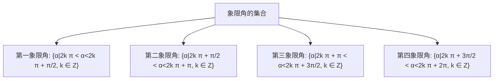
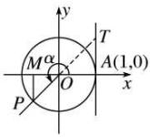
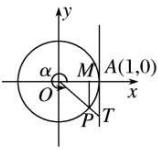
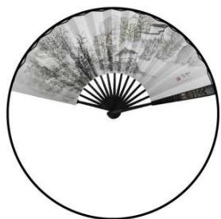
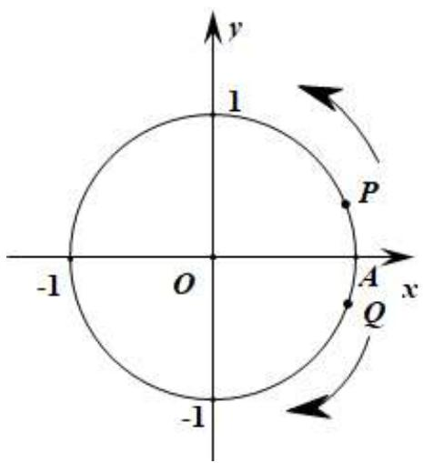

# 第28讲 三角函数概念及诱导公式

# 知识梳理

# 知识点一:三角函数基本概念

# 1、角的概念

(1) 任意角: ①定义: 角可以看成平面内一条射线绕着端点从一个位置旋转到另一个位置所成的图形;  
②分类:角按旋转方向分为正角、负角和零角.  
(2) 所有与角 $\alpha$ 终边相同的角，连同角 $\alpha$ 在内，构成的角的集合是 $S = \{\beta | \beta = k \cdot 360^{\circ} + \alpha, k \in Z\}$ .  
(3) 象限角: 使角的顶点与原点重合, 角的始边与 $x$ 轴的非负半轴重合, 那么, 角的终边在第几象限, 就说这个角是第几象限角; 如果角的终边在坐标轴上, 就认为这个角不属于任何一个象限.  
(4) 象限角的集合表示方法:

flowchart

# 2、弧度制

(1) 定义: 把长度等于半径长的弧所对的圆心角叫做 1 弧度的角, 用符号 rad 表示, 读作弧度. 正角的弧度数是一个正数, 负角的弧度数是一个负数, 零角的弧度数是 0.  
(2) 角度制和弧度制的互化: $180^{\circ} = \pi r a d, 1^{\circ} = \frac{\pi}{180} r a d, 1 r a d = \frac{180^{\circ}}{\pi}$ .  
(3) 扇形的弧长公式: $l = |\alpha| \cdot r$ , 扇形的面积公式: $\mathrm{S} = \frac{1}{2} lr = \frac{1}{2} |\alpha| \cdot r^2$ .

# 3、任意角的三角函数

(1) 定义: 任意角 $\alpha$ 的终边与单位圆交于点 $\mathrm{P}(x, y)$ 时, 则 $\sin \alpha = y$ , $\cos \alpha = x$ , $\tan \alpha = \frac{y}{x}$ ( $x \neq 0$ ).  
(2) 推广: 三角函数坐标法定义中, 若取点 $\mathrm{PP}(x, y)$ 是角 $\alpha$ 终边上异于顶点的任一点, 设点 $\mathbf{P}$ 到原点 $\mathbf{O}$ 的距离为 $r$ , 则 $\sin \alpha = \frac{y}{r}, \cos \alpha = \frac{x}{r}, \tan \alpha = \frac{y}{x} (x \neq 0)$

# 三角函数的性质如下表:

<table><tr><td>三角函数</td><td>定义域</td><td>第一象限符号</td><td>第二象限符号</td><td>第三象限符号</td><td>第四象限符号</td></tr><tr><td> $\sin\alpha$ </td><td>R</td><td>+</td><td>+</td><td>-</td><td>-</td></tr><tr><td> $\cos\alpha$ </td><td>R</td><td>+</td><td>-</td><td>-</td><td>+</td></tr><tr><td>tanα</td><td>{α|α≠kπ+π/2,k∈Z}</td><td>+</td><td>-</td><td>+</td><td>-</td></tr></table>

记忆口诀:三角函数值在各象限的符号规律:一全正、二正弦、三正切、四余弦.

# 4、三角函数线

如下图, 设角 $\alpha$ 的终边与单位圆交于点 P, 过 P 作 $PM \perp x$ 轴, 垂足为 M, 过 A(1, 0) 作单位圆的切线与 $\alpha$ 的终边或终边的反向延长线相交于点 T.

<table><tr><td>三角函数线</td><td>(I)有向线段MP为正弦线;有向线段OM为余弦线;有向线段AT为正切线</td><td>(II)</td><td>(III)</td><td>(IV)</td></tr></table>

# 知识点二: 同角三角函数基本关系

# 1、同角三角函数的基本关系

(1) 平方关系: $\sin^2\alpha + \cos^2\alpha = 1$ .  
(2) 商数关系: $\frac{\sin\alpha}{\cos\alpha} = \tan \alpha \left( \alpha \neq \frac{\pi}{2} + k\pi \right)$ ;

知识点三:三角函数诱导公式

<table><tr><td>公式</td><td>一</td><td>二</td><td>三</td><td>四</td><td>五</td><td>六</td></tr><tr><td>角</td><td> $2k\pi + \alpha (k \in \mathbb{Z})$ </td><td> $\pi + \alpha$ </td><td> $-\alpha$ </td><td> $\pi - \alpha$ </td><td> $\frac{\pi}{2} - \alpha$ </td><td> $\frac{\pi}{2} + \alpha$ </td></tr><tr><td>正弦</td><td> $\sin\alpha$ </td><td> $-\sin\alpha$ </td><td> $-\sin\alpha$ </td><td> $\sin\alpha$ </td><td> $\cos\alpha$ </td><td> $\cos\alpha$ </td></tr><tr><td>余弦</td><td> $\cos\alpha$ </td><td> $-\cos\alpha$ </td><td> $\cos\alpha$ </td><td> $-\cos\alpha$ </td><td> $\sin\alpha$ </td><td> $-\sin\alpha$ </td></tr><tr><td>正切</td><td> $\tan\alpha$ </td><td> $\tan\alpha$ </td><td> $-\tan\alpha$ </td><td> $-\tan\alpha$ </td><td></td><td></td></tr><tr><td>口诀</td><td colspan="4">函数名不变,符号看象限</td><td colspan="2">函数名改变,符号看象限</td></tr></table>

【记忆口诀】奇变偶不变，符号看象限，说明：(1)先将诱导三角函数式中的角统一写作 $n\cdot\frac{\pi}{2}\pm\alpha$ ; (2)无论有多大，一律视为锐角，判断 $n\cdot\frac{\pi}{2}\pm\alpha$ 所处的象限，并判断题设三角函数在该象限的正负；(3)当n为奇数是，“奇变”，正变余，余变正；当n为偶数时，“偶不变”函数名保持不变即可.

# 【解题方法总结】

1、利用 $\sin^2\alpha +\cos^2\alpha = 1$ 可以实现角 $\alpha$ 的正弦、余弦的互化，利用 $\frac{\sin\alpha}{\cos\alpha} = \tan \alpha$ 可以实现角 $\alpha$ 的弦切互化.  
2、“ $\sin \alpha + \cos \alpha, \sin \alpha \cos \alpha, \sin \alpha - \cos \alpha$ ”方程思想知一求二.

$$
\begin{array}{c} {(\sin \alpha + \cos \alpha) ^ {2} = \sin^ {2} \alpha + \cos^ {2} \alpha + 2 \sin \alpha \cos \alpha = 1 + \sin 2 \alpha (\sin \alpha - \cos \alpha) ^ {2} = \sin^ {2} \alpha + \cos^ {2} \alpha -} \\ {2 \sin \alpha \cos \alpha = 1 - \sin 2 \alpha} \end{array}
$$

$$
(\sin \alpha + \cos \alpha) ^ {2} + (\sin \alpha - \cos \alpha) ^ {2} = 2
$$

# 必考题型全归纳

# 1 题型一: 终边相同的角的集合的表示与区别

1080 (2024·辽宁·校联考一模)已知角 $\alpha$ 的终边上一点的坐标为 $\left(\sin\frac{4\pi}{5},\cos\frac{4\pi}{5}\right)$ ，则 $\alpha$ 的最小正值为 （）

A. $\frac{\pi}{5}$

B. $\frac{3\pi}{10}$

C. $\frac{4\pi}{5}$

D. $\frac{17\pi}{10}$

1081 (2024·全国·高三专题练习)下列与角 $\frac{9\pi}{4}$ 的终边相同的角的表达式中正确的是（）

A. $2k\pi + 45^{\circ}(k \in \mathbf{Z})$

B. $k \cdot 360^{\circ} + \frac{9\pi}{4} (k \in \mathbf{Z})$

C. $k \cdot 360^{\circ} - 315^{\circ} (k \in \mathbb{Z})$

D. $k\pi + \frac{5\pi}{4} (k \in \mathbf{Z})$

1082 (2024·广东·高三统考学业考试)下列各角中与 $437^{\circ}$ 角的终边相同的是（）

A. $67^{\circ}$

B. $77^{\circ}$

C. $107^{\circ}$

D. $137^{\circ}$ $^{\circ}$

1083 (2024·北京·高三北大附中校考阶段练习)已知角 $\alpha$ 的终边为射线 $y = x (x \leqslant 0)$ ，则下列正确的是（）

A. $\alpha = \frac{5\pi}{4}$

B. $\cos \alpha = \frac{\sqrt{2}}{2}$

C. $\tan\left(\alpha+\frac{\pi}{2}\right)=-1$

D. $\sin \left( \alpha + \frac{\pi}{4} \right) = 1$

# 2 题型二:等分角的象限问题

1084 (2024·全国·高三专题练习)已知 $\alpha$ 是锐角,那么 $2\alpha$ 是().

A. 第一象限角

B. 第二象限角

C. 小于 $180^{\circ}$ 的正角

D. 第一或第二象限角

1085 (2024·全国·高三专题练习)若角 $\alpha$ 是第二象限角，则角 $2\alpha$ 的终边不可能在（）

A. 第一、二象限

B. 第二、三象限

C. 第三、四象限

D. 第一、四象限

1086 (2024·浙江·高三专题练习)若角 $\alpha$ 满足 $\alpha=\frac{2k\pi}{3}+\frac{\pi}{6}(k\in\mathbb{Z})$ ，则 $\alpha$ 的终边一定在（）

A. 第一象限或第二象限或第三象限

B. 第一象限或第二象限或第四象限

C. 第一象限或第二象限或 x 轴非正半轴上

D. 第一象限或第二象限或 $y$ 轴非正半轴上

1087 (1990·上海·高考真题)设 $\alpha$ 角属于第二象限，且 $\left|\cos \frac{\alpha}{2}\right| = -\cos \frac{\alpha}{2}$ ，则 $\frac{\alpha}{2}$ 角属于（）

A. 第一象限

B. 第二象限

C. 第三象限

D. 第四象限

1088 (2024·全国·高三专题练习)已知角 $\alpha$ 的终边与 $\frac{5\pi}{3}$ 的终边重合，则 $\frac{\alpha}{3}$ 的终边不可能在

( )

A. 第一象限

B. 第二象限

C. 第三象限

D. 第四象限

1089 (2024·全国·高三专题练习)若角 $\alpha$ 是第一象限角，则 $\frac{\alpha}{2}$ 是（）

A. 第一象限角

B. 第二象限角

C. 第一或第三象限角

D. 第二或第四象限角

# 3 题型三:弧长与扇形面积公式的计算

1090 (2024·上海松江·高三上海市松江二中校考阶段练习)已知扇形的圆心角为 $\frac{2}{3}\pi$ ，扇形的面积为 $3\pi$ ，则该扇形的周长为 \_\_\_\_.

1091 (2024·上海徐汇·上海市南洋模范中学校考三模)已知扇形圆心角 $\alpha = 60^{\circ}, \alpha$ 所对的弧长 $l = 6\pi$ ，则该扇形面积为 \_\_\_\_.

1092 (2024·全国·高三专题练习)在东方设计中存在着一个名为“白银比例”的理念,这个比例为 $\sqrt{2}:1$ , 它在东方文化中的重要程度不亚于西方文化中的“黄金分割比例”,传达出一种独特的东方审美观. 如图,假设扇子是从一个圆面剪下的,扇形的面积为 $S_{1}$ , 圆面剩余部分的面积为 $S_{2}$ , 当 $\frac{S_{2}}{S_{1}}=\sqrt{2}$ 时,扇面较为美观. 那么按“白银比例”制作折扇时,扇子圆心角的弧度数为 \_\_\_\_.

natural_image

Circular black-and-white illustration of a traditional Chinese folding fan with ink painting (no text or symbols)

1093 (2024·全国·高三专题练习)《九章算术》是中国古代数学名著,其对扇形田面积给出“以径乘周四而一”的算法与现代的算法一致,根据这一算法解决下列问题:现有一扇形田,下周长(弧长)为20米,径长(两段半径的和)为20米,则该扇形田的面积为\_\_\_\_平方米.

1094 (2024·福建厦门·高三福建省厦门第六中学校考阶段练习)若一个扇形的周长是 4 为定值,则当该扇形面积最大时,其圆心角的弧度数是 \_\_\_\_.

1095 (2024·江西鹰潭·高三鹰潭一中校考阶段练习)已知一扇形的圆心角为 $\alpha$ ，半径为 $r$ ，弧长为 $l$ ，若扇形周长为 20，当这个扇形的面积最大时，则圆心角 $\alpha =$ \_\_\_\_弧度.

# 4 题型四:三角函数定义题

1096 (2024·湖南邵阳·高三统考学业考试)已知 P(3,4) 是角 $\alpha$ 终边上的一点，则 $\sin\alpha=$ ()

A. $\frac{3}{5}$

B. $\frac{4}{5}$

C. $\frac{3}{4}$

D. $\frac{4}{7}$

1097 (2024·全国·高三对口高考)如果点 P 在角 $\frac{2}{3}\pi$ 的终边上, 且 $|OP|=2$ , 则点 P 的坐标是

( )

A. $(1, \sqrt{3})$

B. $(-1,\sqrt{3})$

C. $(- \sqrt{3}, 1)$

D. $(- \sqrt{3}, -1)$

1098 (2024·北京丰台·北京丰台二中校考三模)已知点A的坐标为 $(1,\sqrt{3})$ ，将OA绕坐标原点O逆时针旋转 $\frac{\pi}{2}$ 至OB，则点B的纵坐标为()

A. $-\sqrt{3}$

B.-1

C. $\sqrt{3}$

D. 1

1099 (2024·全国·高三专题练习)设 a<0，角 $\alpha$ 的终边与圆 $x^{2}+y^{2}=1$ 的交点为 P(-3a, 4a)，那么 $\sin\alpha+2\cos\alpha=$ （）

A. $-\frac{2}{5}$

B. $-\frac{1}{5}$

C. $\frac{1}{5}$

D. $\frac{2}{5}$

1100 (2024·全国·高三专题练习)如图所示,在平面直角坐标系 xOy 中,动点 P, Q 从点 A(1, 0) 出发在单位圆上运动,点 P 按逆时针方向每秒钟转 $\frac{\pi}{6}$ 弧度,点 Q 按顺时针方向每秒钟转 $\frac{11\pi}{6}$ 弧度,则 P, Q 两点在第 2019 次相遇时,点 P 的坐标为 \_\_\_\_.

text_image

y
1
P
-1 O A x
Q
-1

# 题型五:象限符号与坐标轴角的三角函数值

1101 (2024·全国·高三对口高考)若 $\alpha = \frac{13\pi}{7}$ ，则 （）

A. $\sin \alpha > 0$ 且 $\cos \alpha > 0$

B. $\sin \alpha > 0$ 且 $\cos \alpha < 0$

C. $\sin \alpha < 0$ 且 $\cos \alpha > 0$

D. $\sin \alpha < 0$ 且 $\cos \alpha < 0$

1102 (2024·全国·高三专题练习)已知点 A( $\sin23^{\circ}, -\cos23^{\circ}$ ) 是角 $\alpha$ 终边上一点, 若 $0^{\circ} < \alpha < 360^{\circ}$ , 则 $\alpha =$ ()

A. $113^{\circ}$

B. $157^{\circ}$

C. $293^{\circ}$

D. $337^{\circ}$

1103 (2024·河南·校联考模拟预测)已知 $\alpha$ 是第二象限角, 则点 $(\cos(\sin\alpha), \sin(\cos\alpha))$ 所在的象限是 ()

A. 第一象限

B. 第二象限

C. 第三象限

D. 第四象限

1104 (2024·河南·校联考模拟预测)已知 $\alpha$ 是第二象限角, 则点 $(\cos(-\alpha), \sin(-\alpha))$ 所在的象限是 ()

A. 第一象限

B. 第二象限

C. 第三象限

D. 第四象限

1105 (2024·河南许昌·高三校考期末)在平面直角坐标系中, 点 P(sin2023°, tan2023°) 位于第 ( ) 象限

A. 一

B. 二

C. 三

D. 四

1106 (2024·全国·高三专题练习)已知点 P(cosθ, tanθ) 是第二象限的点, 则 θ 的终边位于 ( )

A. 第一象限

B. 第二象限

C. 第三象限

D. 第四象限

# 6 题型六: 同角求值 - 条件中出现的角和结论中出现的角是相同的

1107 (2024·重庆渝中·高三重庆巴蜀中学校考阶段练习)已知 $\theta$ 是三角形的一个内角,且满足 $\sin\theta - \cos\theta = \frac{\sqrt{5}}{5}$ , 则 $\tan\theta =$ ()

A. 2

B. 1

C. 3

D. $\frac{1}{2}$

1108 (2024·山西阳泉·统考二模)已知 $\sin\alpha + \cos\alpha = \frac{\sqrt{6}}{3}$ ， $0 < \alpha < \pi$ ，则 $\sin\alpha - \cos\alpha =$ （）

A. $-\frac{2\sqrt{3}}{3}$

B. $\frac{2\sqrt{3}}{3}$

C. $-\frac{\sqrt{3}}{3}$

D. $\frac{\sqrt{3}}{3}$

1109 (2024·全国·高三专题练习)已知 $\sin\alpha + \cos\alpha = \frac{1}{5}$ ，且 $\alpha \in (0, \pi)$ ， $\sin\alpha - \cos\alpha =$ （）

A. $\pm\frac{7}{5}$

B. $-\frac{7}{5}$

C. $\frac{7}{5}$

D. $\frac{49}{25}$

1110 (2024·贵州铜仁·统考模拟预测)已知 $\sin\theta - \sin\left(\frac{\pi}{2} + \theta\right) = \sqrt{2}$ ，则 $\tan\theta =$ （）

A. $-\sqrt{2}$

B.-1

C. 1

D. $\sqrt{2}$

1111 (2024·上海浦东新·华师大二附中校考模拟预测)已知 $\sin\alpha$ 、 $\cos\alpha$ 是关于 x 的方程 $3x^{2}-2x+a=0$ 的两根，则 a= \_\_\_\_.

1112 (2024·湖南衡阳·高三衡阳市一中校考期中)已知 $\sin\alpha - \cos\alpha = -\frac{\sqrt{2}}{3}$ ，则 $\sin2\alpha =$ \_\_\_\_.

1113 (2024·全国·高三专题练习)已知 $\sin\alpha + \cos\alpha = \frac{7}{13}(0 < \alpha < \pi)$ ，则 $\tan\alpha =$ \_\_\_\_ .

1114 (2024·全国·高三专题练习)若 $\theta \in \left(0, \frac{\pi}{2}\right), \tan \theta = \frac{1}{2}$ ，则 $\sin \theta - \cos \theta =$ \_\_\_\_.

1115 (2024·陕西西安·校考模拟预测)已知 $\tan\theta=2$ ，则 $\frac{1}{\sin2\theta+\cos2\theta}$ 的值是 \_\_\_\_.

1116 (2024·浙江温州·乐清市知临中学校考二模)已知 $\tan x = \sqrt{3}$ ，则 $3\sin^{2}x - 2\sin x\cos x =$ \_\_\_\_.

1117 (2024·全国·高三对口高考)若 $\frac{\sin x - \cos x}{\sin x + \cos x} = 2$ ，求 $\sin x \cos x$ 的值为 \_\_\_\_.

# 7 题型七:诱导求值与变形

1118 (2024·山西阳泉·统考三模)已知 $\sin\left(\frac{\pi}{6}+\alpha\right)=\frac{\sqrt{3}}{3}$ ，且 $\alpha\in\left(-\frac{\pi}{4},\frac{\pi}{4}\right)$ ，则 $\sin\left(\frac{\pi}{3}-\alpha\right)=$ \_\_\_\_.

1119 (2024·四川绵阳·统考三模)已知 $\theta\in\left(\frac{\pi}{2},\pi\right)$ ， $\sin(\pi+\theta)=-\frac{\sqrt{3}}{3}$ ，则 $\tan\theta=$ \_\_\_\_.

1120 (2024·陕西西安·高三西北工业大学附属中学校考阶段练习)若 $\sin(\pi+\alpha)=-\frac{1}{2}$ ，则 $\cos\alpha$ 的值为（）

A. $\pm\frac{1}{2}$

B. $\frac{1}{2}$

C. $\frac{\sqrt{3}}{2}$

D. $\pm\frac{\sqrt{3}}{2}$

1121 (2024·陕西西安·高三西北工业大学附属中学校考阶段练习)若 $\sin A = \frac{1}{3}$ ，则 $\sin(6\pi - A)$ 的值为 （）

A. $\frac{1}{3}$

B. $-\frac{1}{3}$

C. $-\frac{2\sqrt{2}}{3}$

D. $\frac{2\sqrt{2}}{3}$

1122 (2024·广东深圳·统考模拟预测)已知 $\sin\left(\frac{\pi}{3}+\alpha\right)=\frac{4}{5}$ ，则 $\cos\left(\frac{5\pi}{6}+\alpha\right)$ 的值为（）

A. $-\frac{3}{5}$

B. $\frac{3}{5}$

C. $-\frac{4}{5}$

D. $\frac{4}{5}$

1123 (2024·陕西西安·长安一中校考二模)已知 $\cos\left(\alpha-\frac{\pi}{5}\right)=\frac{5}{13}$ ，则 $\sin\left(\alpha-\frac{7\pi}{10}\right)=$ （）

A. $-\frac{5}{13}$

B. $\frac{5}{13}$

C. $-\frac{12}{13}$

D. $\frac{12}{13}$

# 8 题型八: 同角三角函数基本关系式和诱导公式的综合应用

1124 (2024·河南驻马店·统考三模)已知 $\tan \theta = 2$ ，则 $\sin \theta \sin \left(\frac{3\pi}{2} +\theta\right) =$ （

A. $\frac{3}{5}$

B. $\frac{1}{2}$

C. $-\frac{1}{2}$

D. $-\frac{2}{5}$

1125 (2024·全国·高三对口高考)若 $\frac{\tan x}{\tan x-1}=-1$ ，求 $\sin\left(\frac{\pi}{2}+x\right)\cos\left(\frac{3\pi}{2}-x\right)$ 的值.

1126 (2024·全国·高三专题练习)已知 $\tan \alpha = 3$ ，求 $\frac{\sin\left(\frac{\pi}{2} + \alpha\right) + 3\sin(\pi + \alpha)}{\cos\left(\frac{3\pi}{2} - \alpha\right) - \cos(5\pi + \alpha)}$ 的值.

1127 (2024·河南周口·高三校考期中)(1)若 $3\sin \alpha +\cos \alpha = 0$ ，求 $\cos^2\alpha +2\sin \alpha \cos \alpha$ 的值；

(2) 设 $f(\alpha) = \frac{2\sin(\pi + \alpha)\cos(\pi - \alpha) - \cos(\pi + \alpha)}{1 + \sin^2\alpha + \cos\left(\frac{3\pi}{2} + \alpha\right) - \sin^2\left(\frac{\pi}{2} + \alpha\right)} (1 + 2\sin \alpha \neq 0)$ ，求 $f\left(-\frac{23\pi}{6}\right)$ 的值.

1128 (2024·江苏扬州·高三校联考期末)在平面直角坐标系 xOy 中，O 是坐标原点，角 $\alpha$ 的终边 OA 与单位圆的交点坐标为 A $\left(m, -\frac{1}{2}\right)$ (m < 0)，射线 OA 绕点 O 按逆时针方向旋转 $\theta$ 弧度后交单位圆于点 B，点 B 的纵坐标 y 关于 $\theta$ 的函数为 $y = f(\theta)$

text_image

y
O
x
A
θ
B

(1) 求函数 $y = f(\theta)$ 的解析式, 并求 $f\left(-\frac{\pi}{2}\right)$ 的值;  
(2) 若 $f(\theta) = \frac{\sqrt{3}}{4}, \theta \in (0, \pi)$ ，求 $\tan\left(\theta + \frac{\pi}{6}\right)$ 的值

1129 (2024·贵州贵阳·高三统考期中)已知角 $\alpha$ 满足 $\sin \alpha -\cos \alpha = -\frac{\sqrt{5}}{5}.$

(1) 若角 $\alpha$ 是第三象限角, 求 $\tan\alpha$ 的值;  
(2) 若 $f(\alpha) = \frac{\sin(\alpha - \pi)\tan(5\pi + \alpha)\cos(\pi + \alpha)}{\tan(2\pi - \alpha)\cos\left(-\frac{3\pi}{2} - \alpha\right)}$ ，求 $f(\alpha)$ 的值.

