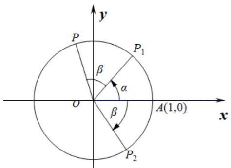
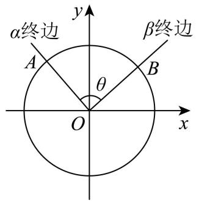
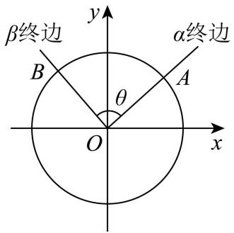
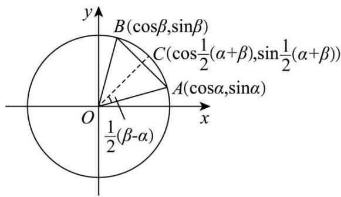

# 第29讲 三角恒等变换

# 知识梳理

知识点一．两角和与差的正余弦与正切

① $\sin(\alpha\pm\beta)=\sin\alpha\cos\beta\pm\cos\alpha\sin\beta;$   
② $\cos (\alpha \pm \beta) = \cos \alpha \cos \beta \mp \sin \alpha \sin \beta ;$   
③ $\tan(\alpha\pm\beta)=\frac{\tan\alpha\pm\tan\beta}{1\mp\tan\alpha\tan\beta};$

知识点二．二倍角公式

① $\sin 2\alpha = 2\sin \alpha \cos \alpha$   
② $\cos 2\alpha = \cos^2\alpha -\sin^2\alpha = 2\cos^2\alpha -1 = 1 - 2\sin^2\alpha ;$   
③ $\tan 2\alpha = \frac{2\tan\alpha}{1 - \tan^2\alpha};$

知识点三:降次(幂)公式

$$
\sin \alpha \cos \alpha = \frac {1}{2} \sin 2 \alpha ; \sin^ {2} \alpha = \frac {1 - \cos 2 \alpha}{2}; \cos^ {2} \alpha = \frac {1 + \cos 2 \alpha}{2};
$$

知识点四: 半角公式

$$
\begin{array}{l} \sin \frac {\alpha}{2} = \pm \sqrt {\frac {1 - \cos \alpha}{2}}; \cos \frac {\alpha}{2} = \pm \sqrt {\frac {1 + \cos \alpha}{2}}; \\ \tan \frac {\alpha}{2} = \frac {\sin \alpha}{1 + \cos \alpha} = \frac {1 - \cos \alpha}{\sin a}. \\ \end{array}
$$

知识点五．辅助角公式

$$
a \sin \alpha + b \cos \alpha = \sqrt {a ^ {2} + b ^ {2}} \sin (\alpha + \phi) (\text {其中} \sin \phi = \frac {b}{\sqrt {a ^ {2} + b ^ {2}}}, \cos \phi = \frac {a}{\sqrt {a ^ {2} + b ^ {2}}}, \tan \phi = \frac {b}{a}).
$$

# 【解题方法总结】

1、两角和与差正切公式变形

$$
\tan \alpha \pm \tan \beta = \tan (\alpha \pm \beta) (1 \mp \tan \alpha \tan \beta);
$$

$$
\tan \alpha \cdot \tan \beta = 1 - \frac {\tan \alpha + \tan \beta}{\tan (\alpha + \beta)} = \frac {\tan \alpha - \tan \beta}{\tan (\alpha - \beta)} - 1.
$$

2、降幂公式与升幂公式

$$
\sin^ {2} \alpha = \frac {1 - \cos 2 \alpha}{2}; \cos^ {2} \alpha = \frac {1 + \cos 2 \alpha}{2}; \sin \alpha \cos \alpha = \frac {1}{2} \sin 2 \alpha ;
$$

$$
1 + \cos 2 \alpha = 2 \cos^ {2} \alpha ; 1 - \cos 2 \alpha = 2 \sin^ {2} \alpha ; 1 + \sin 2 \alpha = (\sin \alpha + \cos \alpha) ^ {2}; 1 - \sin 2 \alpha = (\sin \alpha - \cos \alpha) ^ {2}.
$$

3、其他常用变式

$$
\begin{array}{l} \sin 2 \alpha = \frac {2 \sin \alpha \cos \alpha}{\sin^ {2} \alpha + \cos^ {2} \alpha} = \frac {2 \tan \alpha}{1 + \tan^ {2} \alpha}; \cos 2 \alpha = \frac {\cos^ {2} \alpha - \sin^ {2} \alpha}{\sin^ {2} \alpha + \cos^ {2} \alpha} = \frac {1 - \tan^ {2} \alpha}{1 + \tan^ {2} \alpha}; \tan \frac {\alpha}{2} = \frac {\sin \alpha}{1 + \cos \alpha} = \\ \frac {1 - \cos \alpha}{\sin \alpha}. \end{array}
$$

4、拆分角问题:① $\alpha=2\cdot\frac{\alpha}{2}$ ; $\alpha=(\alpha+\beta)-\beta$ ; ② $\alpha=\beta-(\beta-\alpha)$ ; ③ $\alpha=\frac{1}{2}[(\alpha+\beta)+(\alpha-\beta)]$ ;

$$
④ \beta = \frac {1}{2} [ (\alpha + \beta) - (\alpha - \beta) ]; ⑤ \frac {\pi}{4} + \alpha = \frac {\pi}{2} - \left(\frac {\pi}{4} - \alpha\right).
$$

注意:特殊的角也看成已知角,如 $\alpha=\frac{\pi}{4}-\left(\frac{\pi}{4}-\alpha\right)$ .

# 1 题型一:两角和与差公式的证明

1130 (浙江省绍兴市2024学年高一下学期6月期末数学试题)为了推导两角和与差的三角函数公式,某同学设计了一种证明方法:在直角梯形ABCD中, $\angle B=\angle C=90^{\circ}$ ,AD=1,点E为BC上一点,且AE⊥DE,过点D作DF⊥AB于点F,设 $\angle BAE=\alpha,\angle DAE=\beta$ .

text_image

D
C
1
E
A
F
B

(1) 利用图中边长关系 $\mathrm{DF} = \mathrm{BE} + \mathrm{CE}$ , 证明: $\sin (\alpha + \beta) = \sin \alpha \cos \beta + \cos \alpha \sin \beta$ ;  
(2) 若 $\mathrm{BE} = \mathrm{CE} = \frac{1}{3}$ , 求 $\sin 2\alpha + \cos 2\beta$ .

1131 (2024·辽宁·高一辽宁实验中学校考期中)某数学学习小组研究得到了以下的三倍角公式：

① $\sin 3\theta = 3\sin \theta -4\sin^3\theta ;$ ② $\cos 3\theta = 4\cos^3\theta -3\cos \theta$

根据以上研究结论,回答:

(1) 在①和②中任选一个进行证明：  
(2) 求值: $\sin1098^{\circ}$ .

1132 (2024·全国·高三专题练习)(1)试证明差角的余弦公式 $C_{(\alpha-\beta)}:\cos(\alpha-\beta)=\cos\alpha\cos\beta+\sin\alpha\sin\beta;$

(2) 利用公式 $C_{(\alpha-\beta)}$ 推导:

①和角的余弦公式 $\mathrm{C}_{(\alpha+\beta)}$ ，正弦公式 $\mathrm{S}_{(\alpha+\beta)}$ ，正切公式 $\mathrm{T}_{(\alpha+\beta)}$ ;  
②倍角公式 $S_{(2\alpha)}, C_{(2\alpha)}, T_{(2\alpha)}$ .

1133 (2024·全国·高三专题练习)如图,考虑点 A(1,0), $P_{1}(\cos\alpha,\sin\alpha)$ , $P_{2}(\cos\beta,-\sin\beta)$ , P $(\cos(\alpha+\beta),\sin(\alpha+\beta))$ , 从这个图出发.

text_image

y
P
P₁
β
α
O
A(1,0)
x
β
P₂

(1) 推导公式: $\cos (\alpha + \beta) = \cos \alpha \cos \beta - \sin \alpha \sin \beta$ ;  
(2) 利用 (1) 的结果证明: $\cos \alpha \cos \beta = \frac{1}{2} [\cos (\alpha + \beta) + \cos (\alpha - \beta)]$ , 并计算 $\sin 37.5^{\circ}$ .

cos37.5°的值.

1134 (2024·广东揭阳·高三统考期中)在推导很多三角恒等变换公式时,我们可以利用平面向量的有关知识来研究,在一定程度上可以简化推理过程.如我们就可以利用平面向量来推导两角差的余弦公式: $\cos(\alpha-\beta)=\cos\alpha\cos\beta+\sin\alpha\sin\beta$ .具体过程如下:

如图,在平面直角坐标系 xOy 内作单位圆 O, 以 Ox 为始边作角 $\alpha, \beta$ . 它们的终边与单位圆 O 的交点分别为 A, B.

text_image

α终边
A
θ
O
β终边
B
x
y

(1)

text_image

β终边
B
θ
O
x
y
α终边
A

(2)

则 $\overrightarrow{OA} = (\cos\alpha, \sin\alpha)$ ， $\overrightarrow{OB} = (\cos\beta, \sin\beta)$ ，由向量数量积的坐标表示，有 $\overrightarrow{OA} \cdot \overrightarrow{OB} = \cos\alpha \cos\beta + \sin\alpha \sin\beta$ .

设 $\overrightarrow{OA}$ ， $\overrightarrow{OB}$ 的夹角为 $\theta$ ，则 $\overrightarrow{OA} \cdot \overrightarrow{OB} = |\overrightarrow{OA}| \cdot |\overrightarrow{OB}| \cos \theta = \cos \theta = \cos \alpha \cos \beta + \sin \alpha \sin \beta$ ，另一方面，由图 (1) 可知， $\alpha = 2k\pi + \beta + \theta$ ;

由图(2)可知 $\alpha=2k\pi+\beta-\theta$ ，于是 $\alpha-\beta=2k\pi\pm\theta, k\in Z.$

所以 $\cos(\alpha-\beta)=\cos\theta$ ，也有 $\cos(\alpha-\beta)=\cos\alpha\cos\beta+\sin\alpha\sin\beta$ ;

所以，对于任意角 $\alpha, \beta$ 有： $\cos(\alpha - \beta) = \cos\alpha\cos\beta + \sin\alpha\sin\beta(C_{\alpha - \beta})$ .

此公式给出了任意角 $\alpha, \beta$ 的正弦、余弦值与其差角 $\alpha - \beta$ 的余弦值之间的关系，称为差角的余弦公式，简记作 $C_{\alpha - \beta}$ 。有了公式 $C_{\alpha - \beta}$ 以后，我们只要知道 $\cos\alpha, \cos\beta, \sin\alpha, \sin\beta$ 的值，就可以求得 $\cos(\alpha - \beta)$ 的值了。

阅读以上材料,利用图(3)单位圆及相关数据(图中M是AB的中点),采取类似方法(用其他方法解答正确同等给分)

解决下列问题:

text_image

y
B(cosβ,sinβ)
C(cos1/2(α+β),sin1/2(α+β))
A(cosα,sinα)
O
x
1/2(β-α)

(3)

(1) 判断 $\overrightarrow{OC} = \frac{1}{|\overrightarrow{OM}|} \overrightarrow{OM}$ 是否正确？(回答“正确”，“不正确”，不需要证明)

(2) 证明: $\cos \alpha + \cos \beta = 2 \cos \frac{\alpha + \beta}{2} \cos \frac{\alpha - \beta}{2}$ .

# 2 题型二:两角和与差的三角函数公式

1135 (2024·安徽安庆·安徽省桐城中学校考二模)已知 $\sin \alpha \sin \left(\frac{\pi}{3} -\alpha\right) = 3\cos \alpha \sin \left(\alpha +\frac{\pi}{6}\right),$ 则 $\sin \left(2\alpha +\frac{\pi}{6}\right) =$ （

A.-1

B. $-\frac{\sqrt{3}}{2}$

C. $\frac{1}{2}$

D. $\frac{\sqrt{3}}{2}$

1136 (2024·福建三明·高三统考期末)已知 $\sin\theta + \cos\left(\theta - \frac{\pi}{6}\right) = 1$ ，则 $\cos\left(\theta - \frac{\pi}{3}\right) =$ （）

A. $\frac{\sqrt{3}}{3}$

B. $-\frac{\sqrt{3}}{3}$

C. $\frac{\sqrt{6}}{3}$

D. $-\frac{\sqrt{6}}{3}$

1137 (2024·广东广州·高三华南师大附中校考阶段练习) $\sin\alpha=\frac{\sqrt{3}}{3},\alpha\in\left(0,\frac{\pi}{2}\right),\beta=\frac{\pi}{4}$ ，则 $\tan(\alpha-\beta)=$ ( )

A. $2 \sqrt{2} - 1$

B. $2 \sqrt{2} - 3$

C. $2 \sqrt{2} + 3$

D. $3 - 2\sqrt{2}$

1138 (2024·四川成都·四川省成都市玉林中学校考模拟预测)设 $\tan\left(\alpha-\frac{\pi}{4}\right)=\frac{1}{4}$ ，则 $\tan\left(\alpha+\frac{\pi}{4}\right)$ 等于 ( )

A.-2

B. 2

C.-4

D. 4

1139 (2024·安徽亳州·安徽省亳州市第一中学校考模拟预测)已知 $\sin\alpha=\frac{3}{5},\alpha\in\left(\frac{\pi}{2},\pi\right)$ ，若 $\frac{\sin(\alpha+\beta)}{\cos\beta}=4$ ，则 $\tan(\alpha+\beta)=$ （）

A. $-\frac{16}{7}$

B. $-\frac{7}{8}$

C. $\frac{16}{7}$

D. $\frac{2}{3}$

# 题型三:两角和与差的三角函数公式的逆用与变形

1140 (2024·安徽安庆·安庆一中校考模拟预测)已知 $\alpha - \beta = \frac{\pi}{3}$ , $\tan\alpha - \tan\beta = 3\sqrt{3}$ , 则 $\cos(\alpha + \beta)$ 的值为 ()

A. $\frac{1}{2}$

B. $\frac{1}{3}$

C. $-\frac{1}{4}$

D. $-\frac{1}{6}$

1141 (2024·上海静安·高三校考期中)已知 $\alpha$ 、 $\beta$ 是不同的两个锐角，则下列各式中一定不成立的是 ()

A. $\sin (\alpha +\beta) + 2\cos \alpha \sin \beta +\sin (\alpha -\beta) > 0$   
B. $\cos (\alpha +\beta) + 2\sin \alpha \sin \beta +\cos (\alpha -\beta) <   0$   
C. $\cos (\alpha +\beta) - 2\sin \alpha \sin \beta +\cos (\alpha -\beta) > 0$   
D. $\sin (\alpha +\beta) - 2\cos \alpha \sin \beta +\sin (\alpha -\beta) <   0$

1142 (2024·北京海淀·高三101中学校考阶段练习)已知O为坐标原点，点 $P_{1}(\cos\alpha,\sin\alpha),P_{2}(\cos\beta,-\sin\beta),P_{3}(\cos(\alpha+\beta),\sin(\alpha+\beta)),A(1,0)$ . 给出下列四个结论：① $\left|\overrightarrow{OP_{1}}\right|=\left|\overrightarrow{OP_{2}}\right|$ ；② $\left|\overrightarrow{AP_{1}}\right|=\left|\overrightarrow{AP_{2}}\right|$ ；③ $\overrightarrow{OA}\cdot\overrightarrow{OP_{3}}=\overrightarrow{OP_{1}}\cdot\overrightarrow{OP_{2}}$ ；④ $\overrightarrow{OA}\cdot\overrightarrow{OP_{1}}=\overrightarrow{OP_{2}}\cdot\overrightarrow{OP_{3}}$ . 其中正确结论的序号是()

A. ①②

B.①④

C. ①③

D. ③④

1143 (2024·全国·高三专题练习)已知 $\cos\alpha + \cos\beta = \frac{1}{2}$ , $\sin\alpha - \sin\beta = \frac{1}{3}$ , 则 $\cos(\alpha + \beta)$ 的值为

A. $-\frac{13}{72}$

B. $\frac{13}{72}$

C. $-\frac{59}{72}$

D. $\frac{59}{72}$

1144 (2024·河南平顶山·高三校联考阶段练习)若 $\sin(\alpha+\beta)+\sqrt{3}\cos(\alpha+\beta)=$

$4\sin\left(\alpha+\frac{\pi}{3}\right)\cos\beta$ ，则（）

A. $\tan (\alpha +\beta) = -\sqrt{3}$

B. $\tan (\alpha +\beta) = \sqrt{3}$

C. $\tan (\alpha -\beta) = -\sqrt{3}$

D. $\tan (\alpha -\beta) = \sqrt{3}$

1145 (2024·全国·高三专题练习)已知第二象限角 $\alpha$ 满足 $\sin (\pi +\alpha) = -\frac{2}{3}$ ，则 $\sin 2\beta -$

$2\sin (\alpha +\beta)\cos (\alpha -\beta)$ 的值为 （）

A. $-\frac{1}{9}$

B. $-\frac{4\sqrt{5}}{9}$

C. $\frac{1}{9}$

D. $\frac{4\sqrt{5}}{9}$

# 题型四:角的变换问题

1146 (2024·河南·校联考模拟预测)已知 $\tan \left(\theta +\frac{\pi}{4}\right) = -3$ ，则 $\cos 2\theta =$ （

A. $-\frac{3}{5}$

B. $\frac{3}{5}$

C. 1

D.-1

1147 (2024·宁夏·高三六盘山高级中学校考期中)已知 $\tan \left(\alpha +\frac{\pi}{4}\right) = 3$ ，则

$$
\frac {\sin (\alpha + \pi) + \cos (\pi - \alpha)}{\cos \left(\alpha - \frac {\pi}{2}\right) + \sin \left(\frac {3 \pi}{2} - \alpha\right)} = \tag {（）}
$$

A. $-\frac{1}{3}$

B. $\frac{1}{3}$

C.-3

D. 3

1148 (2024·江西·校联考二模)已知 $\sin\left(x-\frac{\pi}{4}\right)=\frac{\sqrt{5}}{5}$ ，则 $\cos\left(2x-\frac{\pi}{3}\right)=$ （）

A. $\frac{2\sqrt{3}-3}{10}$

B. $\frac{2\sqrt{3}\pm3}{10}$

C. $\frac{3\sqrt{3}+4}{10}$

D. $\frac{3\sqrt{3}\pm4}{10}$

1149 (2024·四川·校联考模拟预测)若 $\alpha$ 为锐角，且 $\cos\left(\alpha+\frac{\pi}{12}\right)=\frac{3}{5}$ ，则 $\sin\left(\alpha+\frac{\pi}{3}\right)=$ （）

A. $-\frac{7\sqrt{2}}{10}$

B. $-\frac{\sqrt{2}}{10}$

C. $\frac{\sqrt{2}}{10}$

D. $\frac{7\sqrt{2}}{10}$

1150 (2024·全国·高三专题练习)已知 $\sin\left(\alpha+\frac{\pi}{3}\right)=\frac{3}{5},\alpha\in\left(-\frac{\pi}{2},\frac{\pi}{6}\right)$ ，则 $\sin\alpha$ 的值为（）

A. $\frac{3-4\sqrt{3}}{10}$

B. $\frac{3+4\sqrt{3}}{10}$

C. $\frac{3-2\sqrt{3}}{10}$

D. $\frac{3+2\sqrt{3}}{10}$

1151 (2024·安徽淮南·统考二模)已知 $0 < \alpha < \frac{\pi}{2}, \frac{\pi}{2} < \beta < \pi, \sin\alpha = \frac{3}{5}, \cos(\alpha + \beta) = -\frac{4}{5}$ ，则 $\sin\beta =$ （）

A. $\frac{24}{25}$

B. $-\frac{24}{25}$

C. $-\frac{24}{25}$ 或 $\frac{24}{25}$

D. 0 或 $\frac{24}{25}$

1152 (2024·山西晋中·统考三模)已知 $\alpha, \beta$ 为锐角，且 $\tan\alpha = 2, \sin(\alpha + \beta) = \frac{\sqrt{2}}{2}$ ，则 $\cos\beta =$ ()

A. $-\frac{3\sqrt{10}}{10}$

B. $\frac{3\sqrt{10}}{10}$

C. $-\frac{\sqrt{10}}{10}$

D. $\frac{\sqrt{10}}{10}$

1153 (2024·山东日照·高三校考阶段练习)已知 $\alpha, \beta \in (0, \pi)$ , $\tan\left(\alpha + \frac{\pi}{3}\right) = \frac{\sqrt{2}}{2}$ , $\cos\left(\beta + \frac{\pi}{6}\right) = \frac{\sqrt{6}}{3}$ , 则 $\cos(2\alpha - \beta) =$ ()

A. $-\frac{5\sqrt{3}}{9}$

B. $-\frac{\sqrt{3}}{3}$

C. $\frac{5\sqrt{3}}{9}$

D. $\frac{\sqrt{3}}{3}$

1154 (2024·吉林四平·高一四平市第一高级中学校考开学考试)已知 $\cos\left(\alpha+\frac{\pi}{6}\right)=\frac{4}{5}$ , $\cos\left(\beta-\frac{\pi}{6}\right)=\frac{12}{13},\alpha,\beta\in\left(0,\frac{\pi}{6}\right)$ ，则 $\cos(\alpha+\beta)=$ （）

A. $\frac{16}{65}$

B. $\frac{33}{65}$

C. $\frac{56}{65}$

D. $\frac{63}{65}$

# 题型五: 给角求值

1155 (2024·重庆·统考模拟预测)式子 $\frac{2\sin18^{\circ}(3\cos^{2}9^{\circ}-\sin^{2}9^{\circ}-1)}{\cos6^{\circ}+\sqrt{3}\sin6^{\circ}}$ 化简的结果为 （）

A. $\frac{1}{2}$

B. 1

C. $2\sin9^{\circ}$

D. 2

1156 (2024·全国·高三专题练习)计算: $\sqrt{2}\cdot\frac{\sin40^{\circ}\cdot\sin80^{\circ}}{\cos40^{\circ}+\cos60^{\circ}}=$ ()

A. $-\frac{\sqrt{2}}{2}$

B. $-\frac{1}{2}$

C. $\frac{\sqrt{2}}{2}$

D. $\frac{1}{2}$

1157 (2024·陕西西安·西安中学校考模拟预测)若 $\lambda\sin160^{\circ}+\tan20^{\circ}=\sqrt{3}$ ，则实数 $\lambda$ 的值为（）

A. 4

B. $4 \sqrt{3}$

C. $2 \sqrt{3}$

D. $\frac{4\sqrt{3}}{3}$

1158 (2024·全国·高三专题练习) $\sin 10^{\circ} + \frac{\sqrt{3}}{4}\tan 10^{\circ} =$ （）

A. $\frac{1}{4}$

B. $\frac{\sqrt{3}}{4}$

C. $\frac{1}{2}$

D. $\frac{\sqrt{3}}{2}$

1159 (2024·全国·高三专题练习)求值： $\frac{1-\sqrt{3}\tan10^{\circ}}{\sqrt{1-\cos20^{\circ}}}$ = ()

A. 1

B. $\sqrt{2}$

C. $\sqrt{3}$

D. $2\sqrt{2}$

# 题型六:给值求值

1160 (2024·山东济宁·嘉祥县第一中学统考三模)已知 $\cos^{2}\left(\frac{\pi}{4}-\alpha\right)=\frac{3}{5}$ ，则 $\sin2\alpha=$ \_\_\_\_.

1161 (2024·江西·校联考模拟预测)已知 $\sin\left(\alpha+\frac{\pi}{6}\right)=\frac{\sqrt{2}}{3}$ ，则 $\cos\left(2\alpha-\frac{2\pi}{3}\right)=$ \_\_\_\_.

1162 (2024·江苏盐城·盐城中学校考模拟预测)若 $\sin\left(2\alpha+\frac{\pi}{6}\right)+\cos2\alpha=-\sqrt{3}$ ，则 $\tan\alpha=$ \_\_\_\_.

1163 (2024·山东泰安·统考二模)已知 $\sin\alpha + \sqrt{3}\cos\alpha = \frac{2\sqrt{3}}{3}$ ，则 $\sin\left(\frac{5\pi}{6} - 2\alpha\right) =$ \_\_\_\_ .

1164 (2024·全国·高三专题练习)已知 $\sin\left(\alpha+\frac{\pi}{5}\right)=\frac{\sqrt{3}}{4}$ ，则 $\sin\left(2\alpha-\frac{\pi}{10}\right)=$ \_\_\_\_

1165 (2024·全国·高三专题练习)已知 $\sqrt{2}\sin\left(\alpha+\beta-\frac{\pi}{4}\right)=2\cos\alpha\cos\beta-\cos(\alpha-\beta)$ ，则 $\tan(\alpha+\beta)=$ \_\_\_\_.

# 题型七: 给值求角

1166 (2024·四川·高三四川外国语大学附属外国语学校校考期中)写出一个使等式 $\frac{\cos\frac{\alpha}{2}}{\cos\left(\frac{\alpha}{2}+\frac{\pi}{6}\right)}+\frac{\sin\frac{\alpha}{2}}{\sin\left(\frac{\alpha}{2}+\frac{\pi}{6}\right)}=2$ 成立的 $\alpha$ 的值为 \_\_\_\_.

1167 (2024·北京·高三专题练习)若实数 $\forall \alpha, \beta$ 满足方程组 $\left\{\begin{aligned}1+2\cos\alpha&=2\cos\beta\\\sqrt{3}&+2\sin\alpha&=2\sin\beta\end{aligned}\right.$ ，则 $\beta$ 的一个值是 \_\_\_\_.

1168 (2024·江西·高三校联考阶段练习)已知 $\cos\alpha=\frac{2\sqrt{5}}{5}$ ， $\sin\beta=\frac{\sqrt{10}}{10}$ ，且 $\alpha\in\left(0,\frac{\pi}{2}\right)$ ， $\beta\in\left(0,\frac{\pi}{2}\right)$ ，则 $\alpha+\beta$ 的值是 \_\_\_\_.

1169 (2024·上海嘉定·高三校考期中)若 $\alpha,\beta$ 为锐角， $\sin\alpha=\frac{4\sqrt{3}}{7},\cos(\alpha+\beta)=-\frac{11}{14}$ ，则角 $\beta=$ \_\_\_\_.

1170 (2024·全国·高三专题练习)已知 $\frac{\pi}{6}<\alpha<\frac{2\pi}{3}$ ， $4\sqrt{3}\sin\frac{\pi}{15}\sin\left(\alpha-\frac{\pi}{3}\right)+4\sin\frac{\pi}{15}\cos\left(\frac{\pi}{3}-\alpha\right)+\tan\frac{\pi}{15}=\sqrt{3}$ ，则 $\alpha=$ \_\_\_\_.

1171 (2024·全国·高三专题练习)已知 $\sin\left(\frac{\pi}{4}-\alpha\right)=-\frac{\sqrt{5}}{5},\sin\left(\frac{3\pi}{4}+\beta\right)=\frac{\sqrt{10}}{10}$ ，且 $\alpha\in\left(\frac{\pi}{4},\frac{3\pi}{4}\right),\beta\in\left(0,\frac{\pi}{4}\right)$ ，求 $\alpha-\beta$ 的值为 \_\_\_\_.

1172 (2024·全国·高三专题练习)已知 $\sin(\alpha+2\beta)=\frac{4\sqrt{3}}{7}$ ， $\cos(2\alpha+\beta)=-\frac{11}{14}$ ， $\alpha\in\left(\frac{\pi}{4},\frac{\pi}{2}\right)$ ， $\beta\in\left(-\frac{\pi}{4},0\right)$ ，则 $\alpha-\beta=$ \_\_\_\_.

# 题型八: 正切恒等式及求非特殊角

1173 (2024·全国·高三对口高考) $\tan15^{\circ}+\tan30^{\circ}+\tan15^{\circ}\cdot\tan30^{\circ}$ 的值是 \_\_\_\_.

1174 (2024·陕西商洛·高三陕西省山阳中学校联考期中)已知 $\alpha, \beta$ 满足 $(1 + \tan\alpha)(1 - \tan\beta) = 2$ ，则 $\beta - \alpha =$ \_\_\_\_ .

1175 (2024·江苏南通·高三校考期中)在 $\triangle ABC$ 中, 若 $\tan A + \tan B + \sqrt{2} = \sqrt{2} \tan A \tan B$ , 则 $\tan 2C =$ \_\_\_\_ .

1176 (2024·全国·高三专题练习) $\tan50^{\circ}-\tan20^{\circ}-\frac{\sqrt{3}}{3}\tan50^{\circ}\tan20^{\circ}=$ \_\_\_\_.

1177 (2024·山东·高三济宁市育才中学校考开学考试)若角 $\alpha$ 的终边经过点 $P(\sin70^{\circ},\cos70^{\circ})$ ，且 $\tan\alpha + \tan2\alpha + m\tan\alpha \cdot \tan2\alpha = \sqrt{3}$ ，则实数 m = \_\_\_\_.

1178 (2024·上海金山·高一华东师范大学第三附属中学校考阶段练习)若 A,B 是 $\Delta ABC$ 的内角,且 $(1 + \tan A)(1 + \tan B) = 2$ ,则 A + B 等于 \_\_\_\_.

1179 (2024·全国·统考模拟预测)若 $\alpha, \beta$ 为锐角，且 $\alpha + \beta = \frac{\pi}{4}$ ，则 $(1 + \tan\alpha)(1 + \tan\beta) =$ \_\_\_\_； $(1 + \tan1^{\circ})(1 + \tan2^{\circ})(1 + \tan3^{\circ}) \cdots (1 + \tan45^{\circ}) =$ \_\_\_\_

1180 (2024·全国·高三专题练习)已知 $x \in \left(0, \frac{\pi}{2}\right)$ , $y \in \left(0, \frac{\pi}{2}\right)$ , $\frac{\cos x + \sin x}{\cos x - \sin x} = \tan y$ , 则 ( )

A. $y - x = \frac{\pi}{4}$

B. $2y - x = \frac{\pi}{4}$

C. $y - x = \frac{\pi}{2}$

D. $2y - x = \frac{\pi}{2}$

# 题型九:三角恒等变换的综合应用

1181 (2024·陕西咸阳·校考二模)已知函数 $f(x) = 2\cos x(\sin x - \cos x) + 1, x \in \mathbb{R}$

(1) 求函数 $f(x)$ 的对称轴和对称中心；  
(2) 当 $x \in \left[\frac{\pi}{8}, \frac{3\pi}{4}\right]$ , 求函数 $f(x)$ 的值域.

1182 (2024·上海松江·高三上海市松江二中校考阶段练习)已知 $f(x) = \cos x(\sqrt{3}\sin x - \cos x) + \frac{3}{2}$ .

(1) 求 $f(x)$ 在 $[0, \pi]$ 上的单调递减区间；  
(2) 若 $f(\alpha) = \frac{2}{5}, \alpha \in \left(\frac{\pi}{3}, \frac{5\pi}{6}\right)$ , 求 $\sin 2\alpha$ 的值.

1183 (2024·河南·洛宁县第一高级中学校联考模拟预测)已知函数 $f(x) = \sin^2 x + \sin x\cos x - 1$ .

(1) 求 $f(x)$ 的最小正周期和单调递增区间；  
(2) 当 $x \in \left[0, \frac{\pi}{2}\right]$ 时，求 $f(x)$ 的最大值，并求当 $f(x)$ 取得最大值时 $x$ 的值.

1184 (2024·全国·高三对口高考)已知函数 $f(x) = 2\sqrt{2}\sin x\cos \left(x + \frac{\pi}{4}\right)$ ;

(1) 若在 $\triangle ABC$ 中, $BC = 2$ , $AB = \sqrt{2}$ , 求使 $f\left(A - \frac{\pi}{4}\right) = 0$ 的角 B.  
(2) 求 $f(x)$ 在区间 $\left[\frac{\pi}{2}, \frac{17\pi}{24}\right]$ 上的取值范围；

1185 (2024·全国·高三对口高考)已知 $f(x) = \sin^2\omega x + \frac{\sqrt{3}}{2}\sin 2\omega x - \frac{1}{2} (x \in \mathbb{R}, \omega > 0)$ . 若 $f(x)$ 的最小正周期为 $2\pi$ .

(1) 求 $f(x)$ 的表达式和 $f(x)$ 的递增区间；  
(2) 求 $f(x)$ 在区间 $\left[-\frac{\pi}{6}, \frac{5\pi}{6}\right]$ 上的最大值和最小值.

