# 第30讲 三角函数的图像与性质

# 知识梳理

知识点一:用五点法作正弦函数和余弦函数的简图

(1) 在正弦函数 $y = \sin x, x \in [0, 2\pi]$ 的图象中，五个关键点是： $(0, 0), (\frac{\pi}{2}, 1), (\pi, 0), (\frac{3\pi}{2}, -1), (2\pi, 0)$ .  
(2) 在余弦函数 $y = \cos x, x \in [0, 2\pi]$ 的图象中，五个关键点是：(0, 1)， $(\frac{\pi}{2}, 0), (\pi, -1), (\frac{3\pi}{2}, 0), (2\pi, 1)$ .

知识点二: 正弦、余弦、正切函数的图象与性质 (下表中 $k \in Z$ )

<table><tr><td>函数</td><td> $y = \sin x$ </td><td> $y = \cos x$ </td><td> $y = \tan x$ </td></tr><tr><td>图象</td><td></td><td>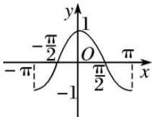</td><td></td></tr><tr><td>定义域</td><td>R</td><td>R</td><td> $\{x|x\in R, x\neq k\pi +\frac{\pi}{2}\}$ </td></tr><tr><td>值域</td><td>[-1,1]</td><td>[-1,1]</td><td>R</td></tr><tr><td>周期性</td><td>2π</td><td>2π</td><td>π</td></tr><tr><td>奇偶性</td><td>奇函数</td><td>偶函数</td><td>奇函数</td></tr><tr><td>递增区间</td><td> $[2k\pi - \frac{\pi}{2}, 2k\pi + \frac{\pi}{2}]$ </td><td> $[-\pi + 2k\pi, 2k\pi]$ </td><td> $(k\pi - \frac{\pi}{2}, k\pi + \frac{\pi}{2})$ </td></tr><tr><td>递减区间</td><td> $[2k\pi + \frac{\pi}{2}, 2k\pi + \frac{3\pi}{2}]$ </td><td> $[2k\pi, \pi + 2k\pi]$ </td><td>无</td></tr><tr><td>对称中心</td><td> $(k\pi, 0)$ </td><td> $(k\pi + \frac{\pi}{2}, 0)$ </td><td> $(\frac{k\pi}{2}, 0)$ </td></tr><tr><td>对称轴方程</td><td> $x = k\pi + \frac{\pi}{2}$ </td><td> $x = k\pi$ </td><td>无</td></tr></table>

注: 正(余)弦曲线相邻两条对称轴之间的距离是 $\frac{T}{2}$ ; 正(余)弦曲线相邻两个对称中心的距离是 $\frac{T}{2}$ ;

正(余)弦曲线相邻两条对称轴与对称中心距离 $\frac{T}{4}$ ;

知识点三： $y = \mathrm{A}\sin (wx + \phi)$ 与 $y = \mathrm{A}\cos (wx + \phi)(\mathrm{A} > 0,w > 0)$ 的图像与性质

(1) 最小正周期: $T=\frac{2\pi}{w}$ .  
(2) 定义域与值域: $y = \operatorname{Asin}(wx + \phi), y = \operatorname{Acos}(wx + \phi)$ 的定义域为 $R$ , 值域为 $[-A, A]$ .

(3) 最值

假设 A>0, w>0.

①对于 $y = \text{Asin}(wx + \phi)$ ,

$\left\{ \begin{array}{l} \text{当} wx + \phi = \frac{\pi}{2} + 2k\pi (k \in \mathbb{Z}) \text{时, 函数取得最大值 A;} \\ \text{当} wx + \phi = -\frac{\pi}{2} + 2k\pi (k \in \mathbb{Z}) \text{时, 函数取得最小值} -\mathbb{A}; \end{array} \right.$

②对于 $y = \mathrm{A}\cos(wx + \phi)$ , $\left\{\begin{aligned}& 当 wx+ \phi=2k\pi(k\in\mathbb{Z}) 时, 函数取得最大值 A;\\& 当 wx+ \phi=2k\pi+\pi(k\in\mathbb{Z}) 时, 函数取得最小值-A;\end{aligned}\right.$

(4) 对称轴与对称中心.

假设 A>0, w>0.

①对于 $y = \operatorname{Asin}(wx + \phi)$ , $\left\{\begin{aligned}&\text{当}wx_{0}+\phi=k\pi+\frac{\pi}{2}(k\in\mathbb{Z}),\text{即}\sin(wx_{0}+\phi)\\&=\pm1\text{时},y=\sin(wx+\phi)\text{的对称轴为}x=x_{0}\end{aligned}\right.$ 当 $wx_{0}+ \phi=k \pi (k \in \mathbb{Z})$ ，即 $\sin(wx_{0}+\phi)=0$ 时， $y=\sin(wx+\phi)$ 的对称中心为 $(x_{0},0)$ .

②对于 $y = \mathrm{A}\cos(wx + \phi)$ ,
当 $wx_{0}+\phi=k\pi(k\in\mathbb{Z})$ ，即 $\cos(wx_{0}+\phi)=\pm1$ 时， $y=\cos(wx+\phi)$ 的对称轴为 $x=x_{0}$ 当 $wx_{0}+\phi=k\pi+\frac{\pi}{2}(k\in\mathbb{Z})$ ，即 $\cos(wx_{0}+\phi)$ =0时， $y=\cos(wx+\phi)$ 的对称中心为 $(x_{0},0)$ .

正、余弦曲线的对称轴是相应函数取最大(小)值的位置．正、余弦的对称中心是相应函数与x轴交点的位置.

(5) 单调性.

假设 A>0, w>0.

①对于 $y = \text{Asin}(wx + \phi)$ , $\left\{\begin{aligned}&wx+\phi\in\left[-\frac{\pi}{2}+2k\pi,\frac{\pi}{2}+2k\pi\right](k\in\mathbb{Z})\Rightarrow\text{增区间};\\&wx+\phi\in\left[\frac{\pi}{2}+2k\pi,\frac{3\pi}{2}+2k\pi\right](k\in\mathbb{Z})\Rightarrow\text{减区间}.\end{aligned}\right.$

②对于 $y = \mathrm{A}\cos(wx + \phi)$ , $\left\{\begin{aligned}&wx+\phi\in[-\pi+2k\pi,2k\pi](k\in\mathbb{Z})\Rightarrow 增区间;\\&wx+\phi\in[2k\pi,2k\pi+\pi](k\in\mathbb{Z})\Rightarrow 减区间.\end{aligned}\right.$

(6) 平移与伸缩

由函数 $y = \sin x$ 的图像变换为函数 $y = 2\sin \left(2x + \frac{\pi}{3}\right) + 3$ 的图像的步骤；

方法一： $\left(x\to x + \frac{\pi}{2}\rightarrow 2x + \frac{\pi}{3}\right)$ .先相位变换，后周期变换，再振幅变换，不妨采用谐音记忆：我们“想欺负”(相一期一幅)三角函数图像，使之变形.

$y = \sin x$ 的图像 $\xrightarrow{\text{向左平移}\frac{\pi}{3}\text{个单位}} y = \sin \left(x + \frac{\pi}{3}\right)$ 的图像 $\xrightarrow[\text{纵坐标不变}]{\text{所有点的横坐标变为原来的}\frac{1}{2}} y = \sin \left(2x + \frac{\pi}{3}\right)$ 的图像 $\xrightarrow[\text{横坐标不变}]{\text{所有点的纵坐标变为原来的}2\text{倍}} y = 2\sin \left(2x + \frac{\pi}{3}\right)$ 的图像 $\xrightarrow[\text{向上平移}3\text{个单位}]{} y = 2\sin \left(2x + \frac{\pi}{3}\right) + 3$

方法二： $\left(x\to x + \frac{\pi}{2}\rightarrow 2x + \frac{\pi}{3}\right)$ 先周期变换，后相位变换，再振幅变换

$y = \sin x$ 的图像 $\xrightarrow[\text{纵坐标不变}]{\text{所有点的横坐标变为原来的}\frac{1}{2}} y = \sin 2x$ 的图像 $\xrightarrow[\text{横坐标不变}]{\text{向左平移}\frac{\pi}{6}\text{个单位}}$ $y = \sin 2\left(x + \frac{\pi}{6}\right) = \sin \left(2x + \frac{\pi}{2}\right)$ 的图像 $\xrightarrow[\text{横坐标不变}]{\text{所有点的纵坐标变为原来的}2\text{倍}}$

$y = 2\sin \left(2x + \frac{\pi}{3}\right)$ 的图像 $\xrightarrow{\text{向上平移}3\text{各单位}} y = 2\sin \left(2x + \frac{\pi}{3}\right) + 3$

注:在进行图像变换时,提倡先平移后伸缩(先相位后周期,即“想欺负”),但先伸缩后平移(先周期后相位)在题目中也经常出现,所以必须熟练掌握,无论哪种变化,切记每一个变换总是对变量x而言的,即图像变换要看“变量x”发生多大变化,而不是“角 $wx+\phi$ ”变化多少.

# 【解题方法总结】

关于三角函数对称的几个重要结论；

(1) 函数 $y = \sin x$ 的对称轴为 $x = k\pi + \frac{\pi}{2} (k \in \mathbb{Z})$ ，对称中心为 $(k\pi.0)(k \in \mathbb{Z})$ ;

(2) 函数 $y = \cos x$ 的对称轴为 $x = k\pi (k \in \mathbb{Z})$ ，对称中心为 $\left(k\pi + \frac{\pi}{2}, 0\right)(k \in \mathbb{Z})$ ;

(3) 函数 $y = \tan x$ 函数无对称轴，对称中心为 $\left(\frac{k\pi}{2}, 0\right) (k \in \mathbb{Z})$ ;

(4) 求函数 $y = \operatorname{Asin}(wx + \phi) + b (w \neq 0)$ 的对称轴的方法；令 $wx + \phi = \frac{\pi}{2} + k\pi (k \in \mathbb{Z})$ ，得 $x = \frac{\frac{\pi}{2} + k\pi - \phi}{w} (k \in \mathbb{Z})$ ；对称中心的求取方法；令 $wx + \phi = k\pi (k \in \mathbb{Z})$ ，得 $x = \frac{k\pi - \phi}{w}$ ，即对称中心为 $\left(\frac{k\pi - \phi}{w}, b\right)$ .

(5) 求函数 $y = \mathrm{A}\cos (wx + \phi) + b (w \neq 0)$ 的对称轴的方法; 令 $wx + \phi = k\pi (k \in \mathbb{Z})$ 得 $x = \frac{\frac{\pi}{2} + k\pi - \phi}{w}$ , 即对称中心为 $\left(\frac{\frac{\pi}{2} + k\pi - \phi}{w}, b\right) (k \in \mathbb{Z})$

# 必考题型全归纳

# 题型一:五点作图法

1186 (2024·湖北·高一荆州中学校联考期中)要得到函数 $f(x)=2\sin\left(2x+\frac{2\pi}{3}\right)$ 的图象, 可以从正弦函数或余弦函数图象出发, 通过图象变换得到, 也可以用“五点法”列表、描点、连线得到.

(1) 由 $y = \sin x$ 图象变换得到函数 $f(x)$ 的图象, 写出变换的步骤和函数;  
(2) 用“五点法”画出函数 $f(x)$ 在区间 $\left[\frac{\pi}{6}, \frac{7\pi}{6}\right]$ 上的简图.

<table><tr><td></td><td></td><td></td><td></td><td></td><td></td></tr><tr><td></td><td></td><td></td><td></td><td></td><td></td></tr><tr><td></td><td></td><td></td><td></td><td></td><td></td></tr></table>

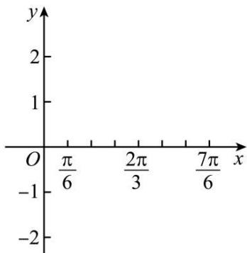

text_image

y
2
1
O π/6 2π/3 7π/6 x
-1
-2

1187

(2024·广东东莞·高一东莞市东华高级中学校联考阶段练习)函数 $f(x)=\sin x+2|\sin x|$ .

(1) 请用五点作图法画出函数 $f(x)$ 在 $[0,2\pi]$ 上的图象；(先列表，再画图)  
(2) 设 $F(x)=f(x)-2^{m}, x\in[0,2\pi]$ ，当 m>0 时，试研究函数 $F(x)$ 的零点的情况.

# 题型二: 函数的奇偶性

1188 (2024·全国·高三专题练习)函数 $f(x) = \cos (x + a) + \sin (x + b)$ ，则（）

A. 若 $a + b = 0$ ，则 $f(x)$ 为奇函数

B. 若 $a + b = \frac{\pi}{2}$ , 则 $f(x)$ 为偶函数

C. 若 $b - a = \frac{\pi}{2}$ , 则 $f(x)$ 为偶函数

D. 若 $a - b = \pi$ ，则 $f(x)$ 为奇函数

1189 (2024·贵州贵阳·校联考模拟预测)使函数 $f(x)=\sqrt{3}\sin(2x+\theta)+\cos(2x+\theta)$ 为偶函数, 则 $\theta$ 的一个值可以是 ()

A. $\frac{\pi}{3}$

B. $\frac{\pi}{6}$

C. $-\frac{\pi}{3}$

D. $\frac{7\pi}{6}$

1190 (2024·湖南常德·常德市一中校考模拟预测)函数 $f(x)=\sin(2x+\varphi)$ 的图像向左平移 $\frac{\pi}{3}$ 个单位得到函数 $g(x)$ 的图像，若函数 $g(x)$ 是偶函数，则 $\tan\varphi=$ （）

A. $-\sqrt{3}$

B. $\sqrt{3}$

C. $-\frac{\sqrt{3}}{3}$

D. $\frac{\sqrt{3}}{3}$

1191 (2024·北京·高三专题练习)已知的 $f(x)=\sin x+\sqrt{3}\cos x$ 图象向左平移 $\varphi$ 个单位长度后,得到函数 $g(x)$ 的图象,且 $g(x)$ 的图象关于y轴对称,则 $|\varphi|$ 的最小值为()

A. $\frac{\pi}{12}$

B. $\frac{\pi}{6}$

C. $\frac{\pi}{3}$

D. $\frac{5\pi}{12}$

1192 (2024·浙江·高三期末)将函数 $f(x)=\cos(2x+\varphi)$ 的图象向右平移 $\frac{\pi}{12}$ 个单位得到一个奇函数的图象, 则 $\varphi$ 的取值可以是 ()

A. $\frac{\pi}{6}$

B. $\frac{\pi}{3}$

C. $\frac{\pi}{2}$

D. $\frac{2\pi}{3}$

1193 (2024·广东·高三统考学业考试)函数 $f(x) = \sin \left(4x + \frac{\pi}{2}\right)$ 是 （）

A. 最小正周期为 $\pi$ 的奇函数

B. 最小正周期为 $\pi$ 的偶函数

C. 最小正周期为 $\frac{\pi}{2}$ 的奇函数

D. 最小正周期为 $\frac{\pi}{2}$ 的偶函数

1194 (2024·全国·高三专题练习)已知函数 $f(x) = \frac{x^4 - \tan x + 2}{x^4 + 2}$ 的最大值为M，最小值为m，则 $M + m$ 的值为 （）

A. 0

B. 2

C. 4

D. 6

1195 (2024·山东·高三专题练习)设函数 $f(x)=ax^{3}+b\cdot\tan x+c\cdot\sqrt[3]{x}+2x^{2}+1$ ，如果 $f(2)=10$ ，则 $f(-2)$ 的值是（）

A.-10

B. 8

C.-8

D.-7

# 题型三:函数的周期性

1196 (2024·湖北襄阳·高三襄阳五中校考开学考试)已知 $x_{1}, x_{2}$ ，是函数 $f(x)=\tan(\omega x-\varphi)(\omega>0,0<\varphi<\pi)$ 的两个零点，且 $|x_{1}-x_{2}|$ 的最小值为 $\frac{\pi}{3}$ ，若将函数 $f(x)$ 的图象向左平移 $\frac{\pi}{12}$ 个单位长度后得到的图象关于原点对称，则 $\varphi$ 的最大值为 （）

A. $\frac{3\pi}{4}$

B. $\frac{\pi}{4}$

C. $\frac{7\pi}{8}$

D. $\frac{\pi}{8}$

1197 (2024·江西·南昌县莲塘第一中学校联考二模)将函数 $f(x)=\cos2x$ 的图象向右平移 $\varphi\left(0<\varphi<\frac{\pi}{2}\right)$ 个单位长度后得到函数 $g(x)$ 的图象，若对满足 $\left|f(x_{1})-g(x_{2})\right|=2$ 的 $x_{1}, x_{2}$ ，
总有 $\left|x_{1}-x_{2}\right|$ 的最小值等于 $\frac{\pi}{6}$ ，则 $\varphi=$ （）

A. $\frac{\pi}{12}$

B. $\frac{\pi}{6}$

C. $\frac{\pi}{3}$

D. $\frac{5\pi}{12}$

1198 (2024·河北·高三校联考阶段练习)函数 $f(x) = |\sin x| + |\cos x|$ 的最小正周期为（）

A. $\pi$

B. $\frac{3\pi}{2}$

C. $\frac{\pi}{2}$

D. $\frac{\pi}{4}$

1199 (2024·高三课时练习)函数 $f(x)=\tan\omega x(\omega>0)$ 的图像的相邻两支截直线 y=2 所得线段长为 $\frac{\pi}{2}$ ，则 $f\left(\frac{\pi}{6}\right)$ 的值是 \_\_\_\_.

1200 (2024·河北衡水·高三河北深州市中学校考阶段练习)下列函数中,最小正周期为π的奇函数是()

A. $y = \sin\left(x + \frac{\pi}{4}\right)$

B. $y = \sin (\pi +x)\cos (\pi -x)$

C. $y = \cos^2 x - \cos^2\left(x + \frac{\pi}{2}\right)$

D. $y = \sin |2x|$

1201 (2024·全国·高三专题练习)函数 $f(x)=2\cos x$ 对于 $\forall x\in R$ ，都有 $f(x_{1})\leqslant f(x)\leqslant f(x_{2})$ ，则 $|x_{1}-x_{2}|$ 的最小值为（）.

A. $\frac{\pi}{4}$

B. $\frac{\pi}{2}$

C. $\pi$

D. $2\pi$

1202 (2024·全国·高三专题练习)已知函数 $f(x)=\cos\omega x(\sin\omega x+\sqrt{3}\cos\omega x)^{\circ}$ ( $\omega>0$ ), 如果存在实数 $x_{0}$ , 使得对任意的实数 x, 都有 $f(x_{0})\leqslant f(x)\leqslant f(x_{0}+2016\pi)$ 成立, 则 $\omega$ 的最小值为

A. $\frac{1}{4032\pi}$

B. $\frac{1}{2016\pi}$

C. $\frac{1}{4032}$

D. $\frac{1}{2016}$

1203 (2024·北京·北京市第一六一中学校考模拟预测)设函数 $f(x)=\cos\left(\omega x+\frac{\pi}{6}\right)$ 在 $[-π,\pi]$ 的图象大致如图所示，则 $f(x)$ 的最小正周期为 ()

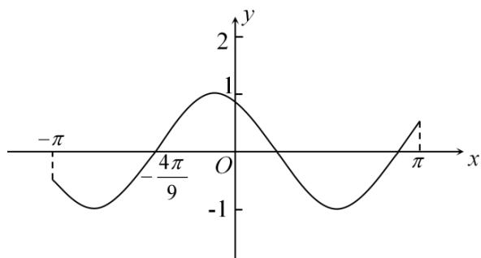

A. $\frac{4\pi}{3}$

B. $\frac{10\pi}{9}$

C. $\frac{4}{3}$

D. $\frac{10}{9}$

1204 (2024·全国·高三对口高考)函数 $f(x) = |\sin x + \cos x|$ 的最小正周期是 \_\_\_\_.

1205 (2024·江西鹰潭·高三贵溪市实验中学校考阶段练习)函数 $f(x)=(\cos x-\sin x)\cos\left(\frac{\pi}{2}-x\right)$ 的最小正周期是 \_\_\_\_.

1206 (2024·全国·高三专题练习)已知函数 $f(x)=\sin\pi x+1$ . 则 $f\left(\frac{1}{2}\right)+f\left(\frac{3}{2}\right)+f\left(\frac{5}{2}\right)+f\left(\frac{7}{2}\right)+\cdots+f\left(\frac{2021}{2}\right)+f\left(\frac{2023}{2}\right)=$ \_\_\_\_.

1207 (2024·四川遂宁·统考三模)已知函数 $f(x) = \sin \left( \omega x + \frac{\pi}{6} \right) + \cos \omega x (\omega > 0)$ , $f(x_1) = 0$ , $f(x_2) = \sqrt{3}$ , 且 $|x_1 - x_2|$ 的最小值为 $\pi$ , 则 $\omega =$ \_\_\_\_

1208 (2024·上海宝山·上海交大附中校考三模)已知函数 $f(x) = \sin 2x + 2\sqrt{3}\cos^2 x$ ，则函数 $f(x)$ 的最小正周期是 \_\_\_\_.

1209 (2024·上海·上海中学校考模拟预测)已知函数 $f(x)=\sin\omega x-\sin\left(\omega x+\frac{\pi}{3}\right)(\omega>0)$ 的最小正周期是 $\frac{\pi}{2}$ ，则 $\omega=$ \_\_\_\_.

1210 (2024·陕西咸阳·武功县普集高级中学统考一模)设函数 $f(x)=$ $\mathrm{Asin}(\omega x+\phi)(\mathrm{A}>0,\omega>0)$ 相邻两条对称轴之间的距离为 $\frac{\pi}{2},\left|f\left(\frac{\pi}{3}\right)\right|=A$ ，则 $|\varphi|$ 的最小值为 \_\_\_\_.

1211 (2024·上海浦东新·高三华师大二附中校考阶段练习)函数 $y = 2 \cos^{2} x + 1 (x \in \mathbb{R})$ 的最小正周期为 \_\_\_\_.

1212 (2024·内蒙古·高三霍林郭勒市第一中学统考阶段练习)设函数 $f(x) = \mathrm{A}\cos (\omega x + \varphi)$ (A, ω, φ 是常数, A > 0, ω > 0). 若 $f(x)$ 在区间 $\left[\frac{\pi}{4}, \frac{\pi}{2}\right]$ 上具有单调性, 且 $f\left(\frac{\pi}{2}\right) = f\left(\frac{2\pi}{3}\right) = -f\left(\frac{\pi}{4}\right)$ , 则 $f(x)$ 的最小正周期为 \_\_\_\_.

1213 (2024·全国·高三专题练习)下列6个函数:① $y = |\sin x|$ , ② $y = \sin |x|$ , ③ $y = |\cos x|$ , ④ $y = \cos |x|$ , ⑤ $y = |\tan x|$ , ⑥ $y = \tan |x|$ , 其中最小正周期为 $\pi$ 的偶函数的编号为 \_\_\_\_.

# 4 题型四: 函数的单调性

1214 (2024·河北石家庄·正定中学校考模拟预测)已知函数 $f(x) = \sin (2023\pi + x) - \sin^2 \frac{x}{2} + \cos^2 \frac{x}{2}$ ，则下列说法错误的是 （）

A. $f(x)$ 的值域为 $[-\sqrt{2}, \sqrt{2}]$   
B. $f(x)$ 的单调递减区间为 $\left[-\frac{\pi}{4}+2k\pi,\frac{3\pi}{4}+2k\pi\right](k\in\mathbf{Z})$   
C. $y=f\left(x+\frac{5\pi}{4}\right)$ 为奇函数，  
D. 不等式 $f(x) \geqslant \frac{\sqrt{2}}{2}$ 的解集为 $\left[-\frac{7\pi}{12} + k\pi, \frac{\pi}{12} + k\pi\right](k \in \mathbf{Z})$

1215 (2024·全国·模拟预测)将函数 $f(x)=3\sin\left(\frac{1}{3}x+\frac{\pi}{12}\right)$ 的图象上各点向右平移 $\frac{\pi}{12}$ 个单位长度得函数 $g(x)$ 的图象，则 $g(x)$ 的单调递增区间为()

A. $\left[2k\pi - \frac{5\pi}{3}, 2k\pi + \frac{22\pi}{3}\right], k \in \mathbf{Z}$

B. $\left[4k\pi - \frac{5\pi}{3}, 4k\pi + \frac{4\pi}{3}\right], k \in \mathbf{Z}$

C. $\left[6k\pi - \frac{5\pi}{3}, 6k\pi + \frac{4\pi}{3}\right], k \in \mathbf{Z}$

D. $[4\pi, 9\pi]$

1216 (2024·全国·模拟预测)已知函数 $f(x)=3\sin(\omega x+\varphi)\left(x\in\mathrm{R},\omega>0,|\varphi|<\frac{\pi}{2}\right)$ 的部分图象如图所示，则下列说法正确的是 ()

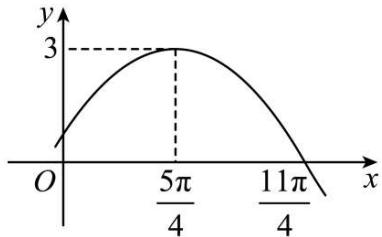

line

| x | y |
|---|---|
| 0 | 0 |
| 5π/4 | 3 |
| 11π/4 | 0 |

A. $f(x)=3\sin\left(\frac{1}{3}x-\frac{\pi}{12}\right)$

B. $f\left(\frac{3\pi}{4}\right) = \frac{\sqrt{3}}{2}$

C. 不等式 $f(x) \geqslant \frac{3}{2}$ 的解集为 $\left[6k\pi + \frac{\pi}{4}, 6k\pi + \frac{9\pi}{4}\right] k \in \mathbf{Z}$

D. 将 $f(x)$ 的图象向右平移 $\frac{\pi}{12}$ 个单位长度后所得函数的图象在 $[6\pi, 8\pi]$ 上单调递增

1217 (2024·四川泸州·统考三模)将函数 $y=\sin\left(2x+\frac{\pi}{3}\right)$ 的图象向左平移 $\frac{\pi}{12}$ 个单位长度, 所得图象的函数 ()

A. 在区间 $\left[\frac{\pi}{2}, \frac{3\pi}{2}\right]$ 上单调递减

B. 在区间 $\left[\pi, \frac{3\pi}{2}\right]$ 上单调递减

C. 在区间 $[\pi, 2\pi]$ 上单调递增

D. 在区间 $\left[\frac{3\pi}{4}, \frac{5\pi}{4}\right]$ 上单调递增

1218 (2024·北京密云·统考三模)已知函数 $f(x) = \cos^2\frac{x}{2} - \sin^2\frac{x}{2}$ ，则 （）

A. $f(x)$ 在 $\left(-\frac{\pi}{2}, -\frac{\pi}{6}\right)$ 上单调递减

B. $f(x)$ 在 $\left(-\frac{\pi}{4}, \frac{\pi}{12}\right)$ 上单调递增

C. $f(x)$ 在 $\left(0, \frac{\pi}{3}\right)$ 上单调递减

D. $f(x)$ 在 $\left(\frac{\pi}{4},\frac{7\pi}{12}\right)$ 上单调递增

1219 (2024·河南·高三校联考阶段练习)已知函数 $f(x)=$ $A\cos(\omega x+\varphi)\left(A>0,\omega>0,|\varphi|<\frac{\pi}{2}\right)$ , 若函数 $f(x)$ 的图象向左平移 $\frac{\pi}{6}$ 个单位长度后得到的函数的部分图象如图所示, 则不等式 $f(x)\geqslant-1$ 的解集为 ( )

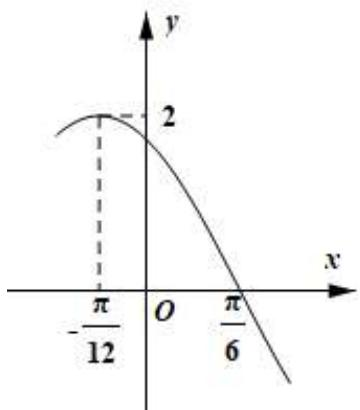

line

| x | y |
|---|---|
| -π/12 | 2 |
| π/6 | |

A. $\left[-\frac{7\pi}{12} + k\pi, \frac{\pi}{4} + k\pi\right](k \in \mathbf{Z})$

B. $\left[-\frac{\pi}{3} + 2k\pi, \frac{7\pi}{12} + 2k\pi\right](k \in \mathbf{Z})$

C. $\left[-\frac{\pi}{4}+k\pi,\frac{5\pi}{12}+k\pi\right](k\in\mathbf{Z})$

D. $\left[-\frac{\pi}{3} + k\pi, \frac{\pi}{12} + k\pi\right](k \in \mathbf{Z})$

1220 (2024·全国·高一专题练习) $y = \cos (\omega x + \varphi)$ 的部分图像如图所示,则其单调递减区间为()

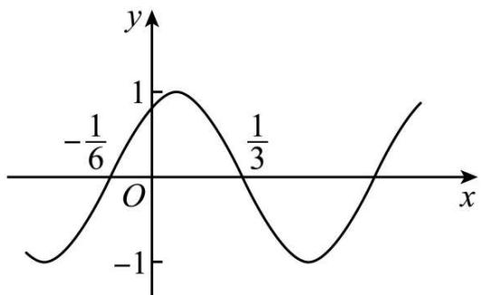

line

| x       | y     |
| ------- | ----- |
| -1/6    | -1    |
| 0       | 1     |
| 1/3     | -1    |

A. $\left(\frac{1}{12} + 2k, \frac{7}{12} + 2k\right), k \in \mathbf{Z}$

B. $\left(\frac{1}{12} + k, \frac{7}{12} + k\right), k \in \mathbf{Z}$

C. $\left(\frac{1}{12}+2k\pi,\frac{7}{12}+2k\pi\right),k\in\mathbb{Z}$

D. $\left(\frac{1}{12}+k\pi,\frac{7}{12}+k\pi\right),k\in\mathbf{Z}$

1221 (2024·四川凉山·高一校联考期中)函数 $y=\frac{1}{3}\tan\left(2x-\frac{\pi}{6}\right)+\frac{1}{2}$ 的单调递增区间为（）

A. $\left(k\pi -\frac{\pi}{6},k\pi +\frac{\pi}{3}\right)(k\in \mathbf{Z})$

B. $\left(k\pi +\frac{\pi}{6},k\pi +\frac{5\pi}{12}\right)(k\in \mathbf{Z})$

C. $\left(\frac{k\pi}{2}-\frac{\pi}{6},\frac{k\pi}{2}+\frac{\pi}{3}\right)(k\in\mathbf{Z})$

D. $\left(\frac{k\pi}{2}+\frac{\pi}{6},\frac{k\pi}{2}+\frac{5\pi}{12}\right)(k\in\mathbf{Z})$

# 题型五: 函数的对称性 (对称轴、对称中心)

1222 (2024·陕西西安·陕西师大附中校考模拟预测)已知函数 $f(x)=\cos\left(\frac{5}{2}x-\frac{\pi}{4}\right)+1$ ，若将 $y=f(x)$ 的图像向右平移 m(m>0) 个单位长度后图象关于 y 轴对称，则实数 m 的最小值为（）

A. $\frac{\pi}{10}$

B. $\frac{3\pi}{10}$

C. $\frac{7\pi}{10}$

D. $\frac{11\pi}{10}$

1223 (2024·上海宝山·高三上海交大附中校考阶段练习)已知 $f(x)=\sin\left(\omega x+\frac{\pi}{4}\right)(\omega>0)$ ，函数 $y=f(x)$ ， $x\in R$ 的最小正周期为 $\pi$ ，将 $y=f(x)$ 的图像向左平移 $\varphi\left(0<\varphi<\frac{\pi}{2}\right)$ 个单位长度，所得图像关于 y 轴对称，则 $\varphi$ 的值是 \_\_\_\_.

1224 (2024·上海松江·校考模拟预测)已知函数 $y=f(x)$ 的对称中心为 $(0,1)$ ，若函数 $y=1+\sin x$ 的图象与函数 $y=f(x)$ 的图象共有 6 个交点，分别为 $(x_{1},y_{1})$ ， $(x_{2},y_{2})$ ， $\cdots$ ， $(x_{6},y_{6})$ ，则 $\sum_{i=1}^{6}(x_{i}+y_{i})=$ \_\_\_\_.

1225 (2024·全国·高三对口高考)设函数 $y=\sin\left(2x+\frac{\pi}{3}\right)$ 的图象关于点 $P(x_{0},0)$ 成中心对称，若 $x_{0}\in\left[-\frac{\pi}{2},0\right]$ ，则 $x_{0}=$ \_\_\_\_.

1226 (2024·新疆喀什·校考模拟预测)函数 $y=2\sin\omega x(\omega>0)$ 向左平移 $\frac{\pi}{3}$ 个单位长度之后关于 $x=\frac{\pi}{6}$ 对称，则 $\omega$ 的最小值为 \_\_\_\_.

1227 (2024·全国·高三专题练习)已知函数 $f(x) = 2\sin (\omega x + \varphi)\left(\omega > 0, |\varphi| < \frac{\pi}{2}\right)$ ，若 $f(0) =$ $-\sqrt{3}$ , 且直线 $x = \frac{\pi}{6}$ 为 $f(x)$ 图象的一条对称轴, 则 $\omega$ 的最小值为 \_\_\_\_.

1228 (2024·河南开封·校考模拟预测)已知函数 $f(x) = 2\cos (3x + \varphi)$ 的图象关于点 $\left(\frac{4\pi}{3}, 0\right)$ 对称, 那么 $|\varphi|$ 的最小值为 \_\_\_\_.  
1229 (2024·全国·模拟预测)将函数 $f(x)=\cos\left(\omega x-\frac{\pi}{6}\right)(\omega>0)$ 的图象向左平移 $\frac{\pi}{9}$ 个单位长度得到函数 $g(x)$ 的图象. 若函数 $g(x)$ 的图象关于点 $\left(\frac{\pi}{3},0\right)$ 对称, 则 $\omega$ 的最小值为 \_\_\_\_.  
1230 (2024·江西吉安·高三统考期末)记函数 $f(x)=\cos\left(\omega x+\frac{\pi}{3}\right)(\omega>0)$ 的最小正周期为 T，且 $y=f(x)$ 的图象关于 $x=\frac{\pi}{6}$ 对称，当 $\omega$ 取最小值时， $f\left(\frac{T}{2}\right)=$ \_\_\_\_.  
1231 (2024·福建宁德·高三校考阶段练习)写出满足条件“函数 $f(x)=\cos\left(\frac{\pi}{3}x-\varphi\right)$ 的图象关于直线 x=2 对称”的 $\varphi$ 的一个值 \_\_\_\_.  
1232 (2024·江西赣州·高三校联考期中)已知函数 $f(x)=2\cos(2x+\varphi)$ 图象的一条对称轴为 $x=\frac{\pi}{8}$ . 若 $0<\varphi<4\pi$ , 则 $\varphi$ 的最大 \_\_\_\_.  
1233 (2024·河北石家庄·统考模拟预测)曲线 $f(x)=\frac{\sin x+\cos x}{\sin x-\cos x}$ 的一个对称中心为\_\_\_\_(答案不唯一).  
1234 (2024·甘肃武威·甘肃省武威第一中学校考模拟预测)函数 $f(x)=3\tan\left(2x+\frac{\pi}{3}\right)$ 图象的一个对称中心的坐标是 \_\_\_\_.

# 6 题型六: 函数的定义域、值域 (最值)

1235 (2024·全国·高三专题练习)实数 x, y 满足 $x^{2} - xy + y^{2} = 1$ ，则 $x + 2y$ 的范围是 \_\_\_\_。  
1236 (2024·河北·校联考一模)函数 $f(x)=\sin^{3}\frac{x}{2}\cos\frac{x}{2}-\sin\frac{x}{2}\cos^{3}\frac{x}{2}$ 的最小值为 \_\_\_\_.  
1237 (2024·湖南长沙·长郡中学校考模拟预测)若函数 $f(x)=\sin x+\cos(x+\varphi)$ 的最小值为 $-\sqrt{3}$ ，则常数 $\varphi$ 的一个取值为 \_\_\_\_.(写出一个即可)  
1238 (2024·全国·高三对口高考) $f(x)=\cos2x-2\sqrt{3}\sin x\cos x$ 的最小值为 \_\_\_\_.  
1239 (2024·上海嘉定·校考三模)若关于 x 的方程 $2\sin^{2}x - \sqrt{3}\sin2x + m - 1 = 0$ 在 $\left[\frac{\pi}{2}, \pi\right]$ 上有实数解，则实数 m 的取值范围是 \_\_\_\_.  
1240 (2024·江西鹰潭·贵溪市实验中学校考模拟预测)函数 $f(x)=|2\sin^{2}x-\cos2x|$ 的值域为 \_\_\_\_.  
1241 (2024·上海·高三专题练习)已知函数 $f(x) = \frac{1}{2}\sin\left(2x - \frac{\pi}{3}\right), x \in \left[-\frac{\pi}{4}, \frac{\pi}{4}\right]$ ，则函数 $f(x)$ 的值域为 \_\_\_\_.  
1242 (2024·全国·高三专题练习)设函数 $f(x) = \sin x, x \in \mathbb{R}$ ，则 $y = \left[f\left(x + \frac{\pi}{12}\right)\right]^2 +$

$\left[f\left(x + \frac{\pi}{4}\right)\right]^2$ 的最小值为 \_\_\_\_.

1243 (2024·全国·高三专题练习)设 a > 0，则 $f(x) = 2a(\sin x + \cos x) - \sin x \cdot \cos x - 2a^{2}$ 的最小值为 \_\_\_\_.  
1244 (2024·全国·高三专题练习)已知函数 $f(x) = \frac{1}{2}\sin 2x\cos x$ ，该函数的最大值为 \_\_\_\_.  
1245 (2024·江苏苏州·高三统考开学考试)设角 $\alpha$ 、 $\beta$ 均为锐角，则 $\sin\alpha + \sin\beta + \cos(\alpha + \beta)$ 的范围是 \_\_\_\_.  
1246 (2024·陕西咸阳·陕西咸阳中学校考模拟预测)函数 $f(x)=\cos2x+|\cos x|$ 的值域是 \_\_\_\_.  
1247 (2024·全国·高三专题练习)设 $x, y \in R$ 且 $3x^{2} + 2y^{2} = 6x$ ，求 $x^{2} + y^{2}$ 的取值范围是 \_\_\_\_.  
1248 (2024·全国·高三专题练习)函数 $f(x)=\frac{\sin x\cos x}{1+\sin x+\cos x}$ 的值域为 \_\_\_\_.  
1249 (2024·全国·高三专题练习)函数 $f(x) = -\sin x + 2\cos x (x \in [0, \pi])$ 的最大值为 \_\_\_\_.  
1250 (2024·全国·高三专题练习)函数 $y=\tan\left(x+\frac{\pi}{6}\right)$ 的定义域为 \_\_\_\_.  
1251 (2024·全国·高三专题练习)函数 $y = \tan\left(x + \frac{\pi}{6}\right), x \in \left(-\frac{\pi}{6}, \frac{\pi}{3}\right)$ 的值域为 \_\_\_\_.  
1252 (2024·江西·校联考模拟预测)函数 $f(x)=\frac{2\tan x}{1+2\tan^{2}x}, x \in\left(0, \frac{\pi}{3}\right)$ 的最大值为 \_\_\_\_.

# 题型七:三角函数性质的综合

1253 (多选题)(2024·海南海口·海南华侨中学校考模拟预测)已知函数 $f(x)=2\cos(2x+\varphi)\left(|\phi|<\frac{\pi}{2}\right)$ 的图象与函数 $g(x)=\sin\left(\omega x+\frac{\pi}{6}\right)$ 的图象的对称中心完全相同，且在 $\left(0,\frac{\pi}{2}\right)$ 上， $f(x)$ 有极小值，则()

A. $f(\varphi) = -2$

B. $g(\varphi) = 1$

C. 函数 $f\left(x-\frac{\pi}{3}\right)$ 是偶函数

D. $g(x)$ 在 $\left(-\frac{\pi}{2}, - \frac{\pi}{3}\right)$ 上单调递增

1254 (多选题)(2024·广东潮州·统考模拟预测)设函数 $f(x)=\sin(\omega x+\varphi)+\cos(\omega x+\varphi)$ $\left(\omega>0,|\varphi|\leqslant\frac{\pi}{2}\right)$ 的最小正周期为 $\pi$ ，且过点 $(0,\sqrt{2})$ ，则下列正确的有（）

A. $f(x)$ 在 $\left(0, \frac{\pi}{2}\right)$ 单调递减  
B. $f(x)$ 的一条对称轴为 $x = \frac{\pi}{2}$   
C. $f(|x|)$ 的周期为 $\frac{\pi}{2}$   
D. 把函数 $f(x)$ 的图象向左平移 $\frac{\pi}{6}$ 个长度单位得到函数 $g(x)$ 的解析式为 $g(x) =$

$$
\sqrt {2} \cos \left(2 x + \frac {\pi}{6}\right)
$$

1255 (多选题)(2024·广东佛山·统考模拟预测)已知函数 $f(x)=a\sin x-\cos x(x\in\mathbb{R})$ 的图象关于 $x=\frac{\pi}{3}$ 对称,则()

A. $f(x)$ 的最大值为 2  
B. $f\left(x + \frac{\pi}{3}\right)$ 是偶函数  
C. $f(x)$ 在 $\left[-\frac{2\pi}{3}, \frac{\pi}{3}\right]$ 上单调递增  
D. 把 $f(x)$ 的图象向左平移 $\frac{\pi}{6}$ 个单位长度, 得到的图象关于点 $\left(\frac{3\pi}{4},0\right)$ 对称

1256 (多选题)(2024·安徽合肥·合肥一六八中学校考模拟预测)已知函数 $f(x)=\sin\left(x+\frac{\pi}{4}\right)$ ，则下列说法正确的有()

A. 若 $\left|f(x_{1})-f(x_{2})\right|=2$ ，则 $\left|x_{1}-x_{2}\right|_{\min}=\pi$   
B. 将 $f(x)$ 的图象向左平移 $\frac{\pi}{4}$ 个单位长度后得到的图象关于 $y$ 轴对称  
C. 函数 $y = \sin^{2}\left(x + \frac{\pi}{4}\right)$ 的最小正周期为 $2\pi$   
D. 若 $f(\omega x)(\omega > 0)$ 在 $[0, \pi]$ 上有且仅有3个零点，则 $\omega$ 的取值范围为 $\left[\frac{11}{4}, \frac{15}{4}\right)$

1257 (多选题)(2024·海南·高三校联考期末)已知函数 $f(x)=\cos(\omega x+\varphi)(\omega>0,-\pi<\varphi<\pi),f\left(\frac{\pi}{6}\right)=0,f(x)\geqslant f\left(-\frac{\pi}{12}\right)$ 恒成立， $f(x)$ 在 $\left[\frac{13\pi}{12},\frac{17\pi}{12}\right]$ 上单调，则()

A. $\varphi = -\frac{5\pi}{6}$   
B. 将 $f(x)$ 的图象向左平移 $\frac{\pi}{6}$ 个单位长度后得到函数 $g(x)=\sin2x$ 的图象  
C. $f\left(\frac{\pi}{6}+x\right)+f\left(\frac{\pi}{6}-x\right)=1$   
D. 若函数 $y = f(x) - m$ 在 $\left[-\frac{\pi}{2}, \frac{11\pi}{6}\right]$ 上有 5 个零点，则 $-\frac{\sqrt{2}}{2} \leqslant m \leqslant \frac{\sqrt{2}}{2}$

1258 (多选题)(2024·全国·高三专题练习)声音是由物体振动产生的声波,纯音的数学模型是函数 $y = A \sin \omega t$ , 我们听到的声音是由纯音合成的, 称之为复合音. 若一个复合音的数学模型是函数 $f(x) = |\cos x| + \sqrt{3} |\sin x|$ , 则下列结论不正确的是 ()

A. $f(x)$ 是偶函数  
B. $f(x)$ 的最小正周期为 $2\pi$   
C. $f(x)$ 在区间 $\left[0, \frac{\pi}{2}\right]$ 上单调递增  
D. $f(x)$ 的最小值为1

1259 (多选题)(2024·全国·高三专题练习)已知函数 $f(x)=\sin|x|+|\cos x|$ ，下列叙述正确的有()

A. $f(x)$ 的周期为 $2\pi$ ;  
B. $f(x)$ 是偶函数；  
C. $f(x)$ 在区间 $\left[\frac{3\pi}{4}, \frac{5\pi}{4}\right]$ 上单调递减；  
D. $\forall x_{1},x_{2}\in \mathrm{R},|f(x_{1}) - f(x_{2})|\leqslant \sqrt{2}$

1260 (多选题)(2024·重庆·统考模拟预测)声音是由于物体的振动产生的能引起听觉的波, 我们听到的声音多为复合音. 若一个复合音的数学模型是函数 $f(x)=\sin x+\frac{1}{2}\sin 2x(x\in \mathbb{R})$ , 则下列结论正确的是 ( )

A. $f(x)$ 的一个周期为 $2\pi$   
B. $f(x)$ 的最小值为 $-\frac{3}{2}$   
C. $f(x)$ 的图象关于点 $(\pi,0)$ 对称  
D. $f(x)$ 在区间 $[0,2\pi]$ 上有3个零点

1261 (2024·全国·高三专题练习)设函数 $f(x) = \sin \omega x\cos \varphi +\cos \omega x\sin \varphi (\omega >0,|\varphi | <   \frac{\pi}{2}).$

(1) 若 $f(0) = -\frac{\sqrt{3}}{2}$ ，求 $\varphi$ 的值.  
(2) 已知 $f(x)$ 在区间 $\left[-\frac{\pi}{3}, \frac{2\pi}{3}\right]$ 上单调递增， $f\left(\frac{2\pi}{3}\right) = 1$ ，再从条件①、条件②、条件③这三

个条件中选择一个作为已知,使函数 $f(x)$ 存在,求 $\omega,\varphi$ 的值.

条件①: $f\left(\frac{\pi}{3}\right)=\sqrt{2}$ ;

条件②: $f\left(-\frac{\pi}{3}\right)=-1$ ;

条件③: $f(x)$ 在区间 $\left[-\frac{\pi}{2}, -\frac{\pi}{3}\right]$ 上单调递减.

注:如果选择的条件不符合要求,第(2)问得0分;如果选择多个符合要求的条件分别解答,按第一个解答计分.

1262 (2024·江西赣州·高三校联考阶段练习)已知函数 $f(x)=$

$\mathrm{Asin}(\omega x + \varphi)\left(\mathrm{A} > 0, \omega > 0, |\varphi| < \frac{\pi}{2}\right)$ 的部分图象如图所示.

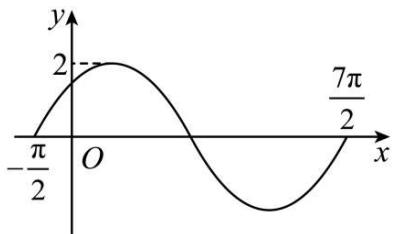

line

| x | y |
|---|---|
| -π/2 | 0 |
| 0 | 2 |
| π/2 | 0 |
| 7π/2 | 2 |

(1) 求 $f(x)$ 的解析式；
(2) 将 $f(x)$ 的图象上所有点的横坐标缩短为原来的 $\frac{1}{2}$ (纵坐标不变)，再将所得图象向左平移 $\frac{\pi}{12}$ 个单位长度，得到函数 $g(x)$ 的图象，求函数 $y = g(x) \sin x$ 在 $\left[-\frac{\pi}{2}, \frac{\pi}{2}\right]$ 内的零点.

1263 (2024·黑龙江齐齐哈尔·齐齐哈尔市实验中学校考三模)已知函数 $f(x)=\cos(\omega x+\varphi)$ 在区间 $\left(-\frac{\pi}{6},\frac{\pi}{3}\right)$ 上单调，其中 $\omega>0,0<\varphi<\pi$ ，且 $f\left(-\frac{\pi}{6}\right)=-f\left(\frac{\pi}{3}\right)$ .

(1) 求 $y = f(x)$ 的图象的一个对称中心的坐标；
(2) 若点 $\mathrm{P}\left(-\frac{\pi}{12},\frac{\sqrt{3}}{2}\right)$ 在函数 $f(x)$ 的图象上，求函数 $f(x)$ 的表达式.

1264 (2024·安徽黄山·屯溪一中校考模拟预测) $\vec{a} = (\sqrt{3}\sin \omega x, \sin \omega x + \cos \omega x)$ , $\vec{b} =$

$$
(2 \cos \omega x, \sin \omega x - \cos \omega x), f (x) = \vec {a} \cdot \vec {b},
$$

(1) 若 $\omega = 1$ ，求 $f\left(\frac{\pi}{6}\right)$ 的值；  
(2) 若函数 $f(x)$ 的最小正周期为 $\pi$ ① 求 $\omega$ 的值；  
② 当 $x \in \left[\frac{5\pi}{24}, \frac{5\pi}{12}\right]$ 时，对任意 $t \in \mathbb{R}$ ，不等式 $mt^2 + mt + 3 \geqslant f(x)$ 恒成立，求 $m$ 的取值范围

1265 (2024·安徽安庆·安庆一中校考模拟预测)某港口在一天之内的水深变化曲线近似满足函数 $h(t)=\mathrm{Asin}(\omega t+\varphi)+\mathrm{B}\left(\mathrm{A}>0,\omega>0,|\varphi|<\frac{\pi}{2},0\leqslant t<24\right)$ ，其中 h 为水深（单位：米），t 为时间（单位：小时），该函数图像如图所示.

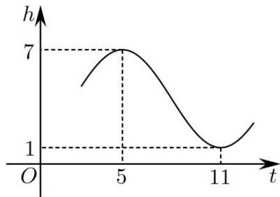

line

| t  | h |
|----|---|
| 0  | 0 |
| 5  | 7 |
| 11 | 1 |

(1) 求函数 $h(t)$ 的解析式；
(2) 若一艘货船的吃水深度 (船底与水面的距离) 为 4 米, 安全条例规定至少要有 1.5 米的安全间隙 (船底与水底的距离), 则该船一天之内至多能在港口停留多久?

1266 (2024·辽宁锦州·渤海大学附属高级中学校考模拟预测)已知函数 $f(x)=\sin(\omega x+\varphi)(\omega>0,0<\varphi<\pi)$ 的图像相邻对称轴之间的距离是 $\frac{\pi}{2}$ ，\_\_\_\_；

①若将 $f(x)$ 的图像向右平移 $\frac{\pi}{6}$ 个单位,所得函数 $g(x)$ 为奇函数.  
②若将 $f(x)$ 的图像向左平移 $\frac{\pi}{12}$ 个单位,所得函数 $g(x)$ 为偶函数,

在①,②两个条件中选择一个补充在 \_\_\_\_ 并作答

(1) 若 $x \in \left[0, \frac{\pi}{3}\right]$ , 求 $y = 2f^2(x) - f(x)$ 的取值范围;  
(2) 设函数 $h(x)=f(x)-\frac{3}{5}$ 的零点为 $x_{0}$ ，求 $\cos\left(\frac{\pi}{3}-4x_{0}\right)$ 的值.

1267 (2024·安徽亳州·安徽省亳州市第一中学校考模拟预测)已知函数 $f(x)=\mathrm{Asin}(\omega x+\varphi)\left(\mathrm{A}>0,\omega>0,|\varphi|<\frac{\pi}{2}\right)$ 的部分图象如图所示.

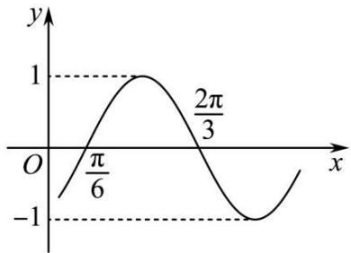

line

| x       | y     |
| ------- | ----- |
| 0       | -1    |
| π/6     | 1     |
| π/3     | 0     |
| 2π/6    | -1    |

(1) 求函数 $f(x)$ 的解析式;  
(2) 将函数 $f(x)$ 的图象向左平移 $\frac{\pi}{6}$ 个单位, 得到函数 $g(x)$ 的图象, 若方程 $g(x) + k(\sin x + \cos x) + 2 = 0$ 在 $x \in \left[0, \frac{\pi}{2}\right]$ 上有解, 求实数 k 的取值范围.

# 8 题型八:根据条件确定解析式

# 方向一：“知图求式”，即已知三角形函数的部分图像，求函数解析式.

1268 (2024·甘肃金昌·高三统考阶段练习)已知函数 $f(x)=$

$\mathrm{A}\cos(\omega x+\varphi)\left(\mathrm{A}>0,\omega>0,|\varphi|<\frac{\pi}{2}\right)$ 的部分图象如图所示，设使 $f(x)=-f(2a-x)$ 成立的 a 的最小正值为 m， $f(0)=n$ ，则 $m+n=$ （）

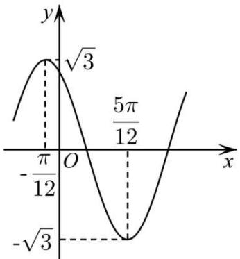

line

| x | y |
|---|---|
| -π/12 | √3 |
| 0 | 0 |
| π/12 | -√3 |
| ∞ | 0 |

A. $\frac{\pi}{6}+1$

B. $\frac{\pi}{6}+\frac{3}{2}$

C. $\frac{\pi}{3} + 1$

D. $\frac{\pi}{3}+\frac{3}{2}$

1269 (2024·四川南充·高三四川省南充市高坪中学校考开学考试)已知函数 $f(x)=\mathrm{Asin}(\omega x+\varphi)(\mathrm{A},\omega,\varphi$ 为常数， $\omega>0,\mathrm{A}>0)$ 的部分图像如图所示，若将 $f(x)$ 的图像向左平移 $\frac{\pi}{6}$ 个单位长度，得到函数 $g(x)$ 的图像，则 $g(x)$ 的解析式可以为（）

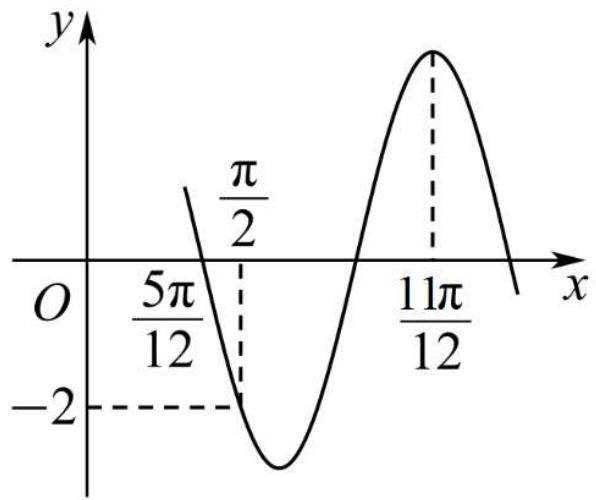

line

| x         | y     |
| --------- | ----- |
| 0         | -2    |
| 5π/12     | π/2   |
| 11π/12    | π/2   |

A. $g(x) = 2\sqrt{2}\sin \left(3x + \frac{\pi}{4}\right)$

B. $g(x) = 2\sqrt{2}\cos \left(3x + \frac{\pi}{4}\right)$

C. $g(x) = 2\sqrt{2}\sin \left(3x - \frac{\pi}{4}\right)$

D. $g(x) = -2\sqrt{2}\cos \left(3x - \frac{\pi}{4}\right)$

1270 (2024·全国·高三校联考阶段练习)已知函数 $f(x) = \mathrm{A}\sin (\omega x + \varphi)$

$\left(x \in \mathrm{R}, A > 0, \omega > 0, |\varphi| < \frac{\pi}{2}\right)$ 的部分图象如图所示，把 $f(x)$ 的图象上所有的点向左平移 $\frac{\pi}{12}$ 个单位长度，再把所得图象上所有点的横坐标缩短到原来的 $\frac{1}{2}$ 倍(纵坐标不变)，得到的函数图象的解析式是 （）

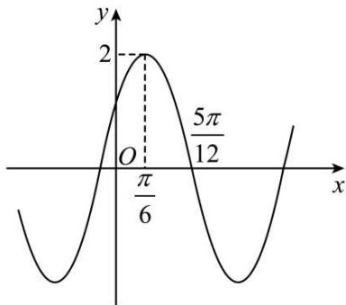

line

| x | y |
|---|---|
| 0 | -3.25 |
| π/6 | 2 |
| 5π/12 | 2 |

A. $y = 2\sin \left(x + \frac{\pi}{6}\right), x \in \mathbb{R}$

B. $y = 2\sin \left(x + \frac{\pi}{3}\right), x \in \mathbb{R}$

C. $y = 2 \sin \left(4x + \frac{\pi}{6}\right)$ , $x \in R$

D. $y = 2\sin \left(4x + \frac{\pi}{3}\right), x \in \mathbb{R}$

1271 (2024·全国·高三专题练习)函数 $f(x) = \mathrm{Asin}(\omega x + \varphi)(\mathrm{A} > 0, \omega > 0, 0 < \varphi < \pi)$ 的部分图象如图所示，则函数 $f(x)$ 的解析式为（）

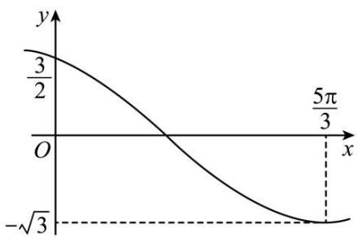

line

| x | y |
|---|---|
| 0 | 3/2 |
| ∞ | -√3 |
| 5π/3 | (value at x=5π/3) |

A. $f(x) = \sqrt{3}\sin \left(2x + \frac{2\pi}{3}\right)$

B. $f(x) = \sqrt{3}\sin \left(2x + \frac{\pi}{3}\right)$

C. $f(x) = \sqrt{3}\sin \left(\frac{x}{2} +\frac{\pi}{3}\right)$

D. $f(x)=\sqrt{3}\sin\left(\frac{x}{2}+\frac{2\pi}{3}\right)$

1272 (2024·北京通州·统考模拟预测)已知函数 $f(x) = 2\sin (\omega x + \varphi)\left(\omega > 0, |\phi| < \frac{\pi}{2}\right)$ 的部分图象如图所示，则 $f(x)$ 的解析式为 （）

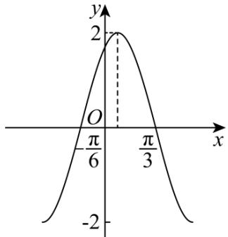

A. $f(x) = 2\sin \left(x + \frac{\pi}{6}\right)$

B. $f(x) = 2\sin \left(x - \frac{\pi}{6}\right)$

C. $f(x)=2\sin\left(2x+\frac{\pi}{3}\right)$

D. $f(x)=2\sin\left(2x-\frac{\pi}{3}\right)$

1273 (2024·宁夏·高三银川一中校考阶段练习)已知函数 $f(x) = \mathrm{Asin}(\omega x + \varphi)$ , $A > 0$ , $\omega > 0$ , $|\varphi| < \frac{\pi}{2}$ 的部分图象如图所示, 则函数的解析式为 \_\_\_\_.

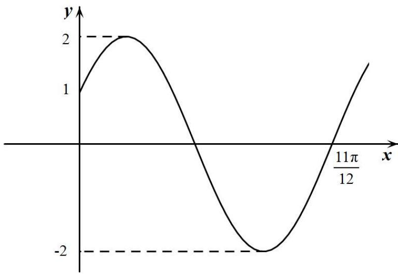

line

| x           | y   |
|-------------|-----|
| 0           | 1   |
| 11π/12      | 2   |
| ∞           | -2  |

1274 (2024·江苏南京·高三统考期中)设函数 $f(x) = 2\sin (\omega x + \varphi)$ ，(其中 $\omega > 0, |\varphi| < \pi$ ) 的部分图象如图，则函数 $f(x)$ 的解析式为 $f(x) =$ \_\_\_\_.

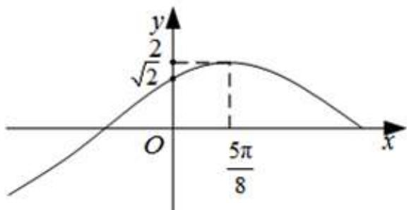

line

| x       | y     |
| ------- | ----- |
| 0       | √2    |
| 5π/8    | 0     |

1275 (2024·全国·模拟预测)已知函数 $f(x) = 2\cos (\omega x + \varphi)\left(\omega > 0, |\varphi| < \frac{\pi}{3}\right)$ ，当 $f(x_1)f(x_2) = -4$ 时， $|x_1 - x_2|$ 的最小值为 $\frac{\pi}{4}$ ，则 $\omega =$ \_\_\_\_；若将函数 $f(x)$ 的图象向左平移 $\frac{\pi}{6}$ 个单位长度后，所得图象在 $y$ 轴上的截距为 $-\sqrt{3}$ ，则 $f(x)$ 在 $\left[\frac{\pi}{6}, \frac{\pi}{3}\right]$ 上的值域为 \_\_\_\_.

1276 (2024·吉林通化·梅河口市第五中学校考模拟预测)某函数 $f(x)$ 满足以下三个条件：① $g(x)=f(x)-1$ 是偶函数；② $g(2-x)+g(x)=0$ ；③ $f(x)$ 的最大值为4.请写出一个满足上述条件的函数 $f(x)$ 的解析式 \_\_\_\_.

1277 (2024·全国·高三专题练习)已知函数 $f(x) = \sin (\omega x + \varphi) (\omega > 0)$ , $\left|f\left(-\frac{\pi}{8}\right)\right| = 1$ , 且 $f\left(\frac{5\pi}{8}\right) = 0$ , 写出一个满足条件的函数 $f(x)$ 的解析式: \_\_\_\_.

1278 (2024·河北·校联考模拟预测)已知函数 $f(x)=\sin(\omega x+\varphi)(\omega>0,0<\varphi<\pi)$ 的图象过点 $\left(\frac{\pi}{3},0\right)$ ，且相邻两个零点的距离为 $\pi$ 。若将函数 $f(x)$ 的图象向左平移 $\frac{\pi}{3}$ 个单位长度得到 $g(x)$ 的图象，则函数 $g(x)$ 的解析式为 \_\_\_\_.

1279 (2024·全国·高三专题练习)已知 $f(x)=\sin(\omega x+\varphi)(\omega>0,0<\varphi<\pi)$ ，满足 $f\left(x-\frac{\pi}{3}\right)+f(-x)=0,f\left(\frac{2\pi}{3}+x\right)=f(-x)$ ，且 $f(x)$ 在 $(0,\pi)$ 上有且仅有5个零点，则此函数解析式为 $f(x)=$ \_\_\_\_.

1280 (2024·湖北·高三校联考阶段练习)已知函数 $f(x)=\sin(\omega x+\varphi)$ ( $\omega>0,0\leqslant\varphi<2\pi$ ) 满足 $f(2+x)=f(2-x)$ ，其图象与 x 轴在原点右侧的第一个交点的坐标为 $(6,0)$ ，则函数 $y=f(x)$ 的解析式为 \_\_\_\_.

1281 (2024·全国·高三专题练习)函数 $f(x)=\sqrt{3}\sin(\omega x+\phi)-\cos(\omega x+\phi)$ ( $\omega>0,0<\phi<\pi$ ) 为偶函数，且函数 $y=f(x)$ 的图像的两条对称轴之间的最小距离为 $\frac{\pi}{2}$ ，则 $f(x)$ 的解析式为 \_\_\_\_.

1282 (2024·上海虹口·统考一模)设函数 $f(x)=\cos(\omega x+\varphi)$ (其中 $\omega>0,|\phi|<\frac{\pi}{2}$ ), 若函数 $y=f(x)$ 图象的对称轴 $x=\frac{\pi}{6}$ 与其对称中心的最小距离为 $\frac{\pi}{8}$ , 则 $f(x)=$ \_\_\_\_.

# 9 题型九:三角函数图像变换

1283 (2024·河南郑州·高三郑州外国语学校校考阶段练习)如图,函数 $f(x)=2\sin(\omega x+\varphi)\left(\omega>0,|\varphi|<\frac{\pi}{2}\right)$ 的图像过 $\left(\frac{\pi}{2},0\right),(2\pi,2)$ 两点,为得到函数 $g(x)=$

$2\cos (\omega x - \varphi)$ 的图像，应将 $f(x)$ 的图像 （）

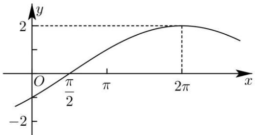

A. 向右平移 $\frac{7\pi}{6}$ 个单位长度

B. 向左平移 $\frac{7\pi}{6}$ 个单位长度

C. 向右平移 $\frac{5\pi}{2}$ 个单位长度

D. 向左平移 $\frac{5\pi}{2}$ 个单位长度

1284 (2024·河北衡水·高三河北衡水中学校考阶段练习)将函数 $y=\sin2x$ 的图象向右平移 $\varphi$ 个单位长度后, 得到函数 $y=\cos\left(2x+\frac{\pi}{6}\right)$ 的图象, 则 $\varphi$ 的值可以是 ()

A. $\frac{\pi}{12}$

B. $\frac{\pi}{6}$

C. $\frac{\pi}{3}$

D. $\frac{2\pi}{3}$

1285 (2024·河南洛阳·高三新安县第一高级中学校考开学考试)已知把函数 $f(x)=\sin\left(x+\frac{\pi}{3}\right)\cos x$ 的图象向右平移 $\varphi$ 个单位长度, 可得函数 $y=\frac{1}{2}\cos\left(2x+\frac{\pi}{6}\right)+\frac{\sqrt{3}}{4}$ 的图象, 则 $\varphi$ 的最小正值为 ()

A. $\frac{\pi}{4}$

B. $\frac{\pi}{6}$

C. $\frac{5}{6}\pi$

D. $\frac{\pi}{3}$

1286 (2024·全国·高三专题练习)为了得到函数 $y=\sin\left(2x+\frac{4\pi}{3}\right)$ 的图象, 只需将函数 $y=\sin\left(2x+\frac{\pi}{6}\right)$ 的图象 ()

A. 向左平移 $\frac{7\pi}{12}$ 个单位长度

B. 向左平移 $\frac{7\pi}{6}$ 个单位长度

C. 向右平移 $\frac{7\pi}{12}$ 个单位长度

D. 向右平移 $\frac{7\pi}{6}$ 个单位长度

1287 (2024·青海西宁·统考二模)为了得到函数 $y=\sin\left(4x+\frac{\pi}{6}\right)$ 图象, 只要将 $y=\sin x$ 的图象 ( )

A. 向左平移 $\frac{\pi}{6}$ 个单位长度, 再把所得图象上各点的横坐标缩短到原来的 $\frac{1}{4}$ , 纵坐标不变

B. 向左平移 $\frac{\pi}{3}$ 个单位长度, 再把所得图象上各点的横坐标伸长到原来的 4 倍, 纵坐标不变

C. 向左平移 $\frac{\pi}{3}$ 个单位长度, 再把所得图象上各点的横坐标缩短到原来的 $\frac{1}{4}$ , 纵坐标不变

D. 向左平移 $\frac{\pi}{6}$ 个单位长度, 再把所得图象上各点横坐标伸长到原来的 4 倍, 纵坐标不变

1288 (2024·全国·高三专题练习)若要得到函数 $f(x)=\sin\left(2x+\frac{\pi}{6}\right)$ 的图象, 只需将函数 $g(x)=\cos\left(2x+\frac{\pi}{3}\right)$ 的图象 ()

A. 向左平移 $\frac{\pi}{6}$ 个单位长度

B. 向右平移 $\frac{\pi}{6}$ 个单位长度

C. 向左平移 $\frac{\pi}{3}$ 个单位长度

D. 向右平移 $\frac{\pi}{3}$ 个单位长度

1289 (2024·陕西·统考模拟预测)已知函数 $f(x)=\mathrm{Asin}(\omega x+\varphi)(A>0,\omega>0,-\pi<\varphi<0)$ 的部分图象如图所示,则下列说法正确的是 ()

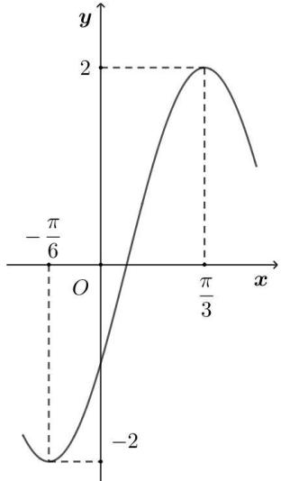

A. 将函数 $y = f(x)$ 的图象向左平移 $\frac{\pi}{3}$ 个单位长度得到函数 $g(x) = A\cos \omega x$ 的图象  
B. 将函数 $y = f(x)$ 的图象向右平移 $\frac{\pi}{3}$ 个单位长度得到函数 $g(x) = A\cos \omega x$ 的图象  
C. 将函数 $y = f(x)$ 的图象向左平移 $\frac{\pi}{6}$ 个单位长度得到函数 $g(x) = A \cos \omega x$ 的图象  
D. 将函数 $y = f(x)$ 的图象向右平移 $\frac{\pi}{6}$ 个单位长度得到函数 $g(x) = A\cos \omega x$ 的图象

1290 (2024·安徽合肥·合肥一中校考模拟预测)已知曲线 $C_{1}:y=\sin\left(\frac{\pi}{2}+2x\right)$ , $C_{2}:y=-\cos\left(\frac{5\pi}{6}-3x\right)$ ，则下面结论正确的是 ()

A. 把 $C_{1}$ 上各点的横坐标伸长到原来的 $\frac{3}{2}$ 倍, 纵坐标不变, 再把得到的曲线向右平移 $\frac{\pi}{6}$ 个单位长度, 得到曲线 $C_{2}$   
B. 把 $C_{1}$ 上各点的横坐标伸长到原来的 $\frac{3}{2}$ 倍, 纵坐标不变, 再把得到的曲线向左平移 $\frac{\pi}{18}$ 个单位长度, 得到曲线 $C_{2}$   
C. 把 $C_{1}$ 上各点的横坐标缩短到原来的 $\frac{2}{3}$ ，纵坐标不变，再把得到的曲线向左平移 $\frac{\pi}{18}$ 个单位长度 $C_{2}$   
D. 把 $C_{1}$ 上各点的横坐标缩短到原来的 $\frac{2}{3}$ ，纵坐标不变，再把得到的曲线向右平移 $\frac{\pi}{6}$ 个单位长度，得到曲线 $C_{2}$

1291 (2024·全国·高三专题练习)已知函数 $f(x)=\cos\left(2x-\frac{\pi}{3}\right)$ ， $g(x)=\sin 2x$ ，将函数 $f(x)$ 的图象经过下列哪种可以与 $g(x)$ 的图象重合（）

A. 向左平移 $\frac{\pi}{12}$ 个单位

B. 向左平移 $\frac{\pi}{6}$ 个单位

C. 向右平移 $\frac{\pi}{12}$ 个单位

D. 向右平移 $\frac{\pi}{6}$ 个单位

# 10 题型十:三角函数模型

1292 (2024·江西赣州·高三校联考阶段练习)如图,摩天轮的半径为50m,其中心O点距离地面的高度为 60m，摩天轮按逆时针方向匀速转动，且 20min 转一圈，若摩天轮上点 P 的起始位置在最高点处，则摩天轮转动过程中下列说法正确的是（）

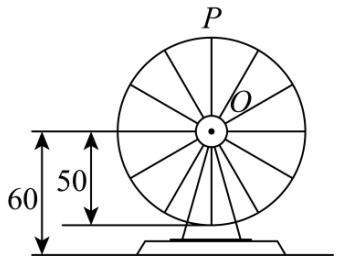

text_image

P
O
60 50

A. 转动 10min 后点 P 距离地面 8m  
B. 若摩天轮转速减半, 则转动一圈所需的时间变为原来的 $\frac{1}{2}$   
C. 第 17min 和第 42min 点 P 距离地面的高度相同  
D. 摩天轮转动一圈, 点 P 距离地面的高度不低于 85m 的时间长为 $\frac{20}{3}$ min

1293 (2024·全国·高三专题练习) 2019 年长春市新地标——“长春眼”在摩天活力城 Mall 购物中心落成, 其楼顶平台上的空中摩天轮的半径约为 40m, 圆心 O 距地面的高度约为 60m, 摩天轮逆时针匀速转动, 每 15min 转一圈, 摩天轮上的点 P 的起始位置在最低点处, 已知在时刻 t(min) 时 P 距离地面的高度 $f(t) = \text{Asin}(\omega t + \varphi) + h (\omega > 0, |\varphi| < \pi)$ , 当距离地面的高度在 $(60 + 20\sqrt{3})m$ 以上时可以看到长春的全貌, 则在转一圈的过程中可以看到整个城市全貌的时间约为 ( )

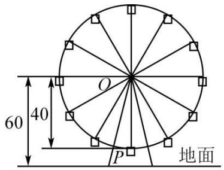

text_image

60
40
O
P
地面

A. 2.0min

B. 2.5min

C. 2.8min

D. 3.0min

1294 (2024·重庆·高三统考阶段练习)某钟表的秒针端点A到表盘中心O的距离为5cm,秒针绕点O匀速旋转,当时间t=0时,点A与表盘上标“12”处的点B重合.在秒针正常旋转过程中,A,B两点的距离d(单位:cm)关于时间t(单位:s)的函数解析式为()

A. $d = 10\sin \frac{\pi}{60} t(t\geqslant 0)$   
B. $d=10\cos\frac{\pi}{60}t(t\geqslant0)$   
C. $d=\begin{cases}10\sin\frac{\pi}{60}t,120k\leqslant t\leqslant60+120k,k\in\mathbb{N}\\-10\sin\frac{\pi}{60}t,60+120k<t<120(k+1),k\in\mathbb{N}\end{cases}$   
D. $d = \left\{ \begin{array}{ll}10\cos \frac{\pi}{60} t,120k\leqslant t\leqslant 30 + 120k,k\in \mathbb{N}\\ -10\cos \frac{\pi}{60} t,30 + 120k <   t <   90 + 120k,k\in \mathbb{N} \end{array} \right.$

1295 (2024·全国·高三专题练习)水车在古代是进行灌溉引水的工具, 是人类一项古老的发明, 也是人类利用自然和改造自然的象征. 如图是一个半径为 R 的水车, 一个水斗从点 A(1, -√3) 出发, 沿圆周按逆时针方向匀速旋转, 且旋转一周用时 8 秒. 经过 t 秒后, 水斗旋转到 P 点, 设点 P 的坐标为 (x, y), 其纵坐标满足 y = f(t) =

$\operatorname{Rsin}(\omega t + \varphi) \left( t \geqslant 0, \omega > 0, |\varphi| < \frac{\pi}{2} \right)$ , 则 $f(t)$ 的表达式为 ( )

natural_image

Large wooden waterwheel sculpture in a park setting under clear blue sky (no text or symbols visible)

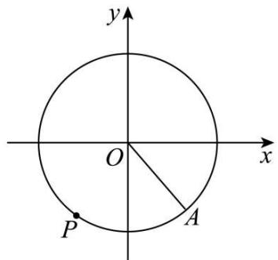

text_image

y
O
x
P
A

A. $y=\sin\left(\frac{\pi}{4}t+\frac{\pi}{3}\right)$

B. $y=\sin\left(\frac{\pi}{4}t-\frac{\pi}{3}\right)$

C. $y=2\sin\left(\frac{\pi}{4}t+\frac{\pi}{3}\right)$

D. $y=2\sin\left(\frac{\pi}{4}t-\frac{\pi}{3}\right)$

1296 (2024·全国·高三专题练习)一个大风车的半径为8m,匀速旋转的速度是每12min旋转一周.它的最低点 $P_{0}$ 离地面2m,风车翼片的一个端点P从 $P_{0}$ 开始按逆时针方向旋转,点P离地面距离 $h(m)$ 与时间 $t(\text{min})$ 之间的函数关系式是()

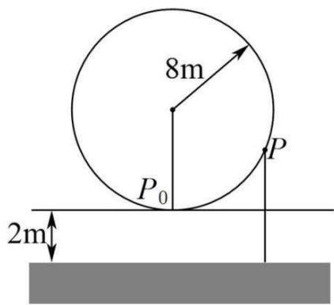

text_image

8m
P₀
P
2m

A. $h(t) = -8\sin \frac{\pi}{6} t + 10$

B. $h(t) = 8\sin \frac{\pi}{6} t + 2$

C. $h(t) = -8\cos \frac{\pi}{6} t + 10$

D. $h(t) = 8\cos \frac{\pi}{6} t + 10$

