# 第32讲 解三角形

# 知识梳理

# 知识点一:基本定理公式

(1) 正余弦定理: 在 $\triangle ABC$ 中, 角 A, B, C 所对的边分别是 a, b, c, R 为 $\triangle ABC$ 外接圆半径, 则

<table><tr><td>定理</td><td>正弦定理</td><td>余弦定理</td></tr><tr><td>公式</td><td> $\frac{a}{\sin A} = \frac{b}{\sin B} = \frac{c}{\sin C} = 2R$ </td><td> $a^{2} = b^{2} + c^{2} - 2bc\cos A$ ; $b^{2} = c^{2} + a^{2} - 2ac\cos B$ ; $c^{2} = a^{2} + b^{2} - 2ab\cos C$ .</td></tr><tr><td>常见变形</td><td>(1) $a = 2R\sin A$ ,  $b = 2R\sin B$ ,  $c = 2R\sin C$ ;(2) $\sin A = \frac{a}{2R}$ ,  $\sin B = \frac{b}{2R}$ ,  $\sin C = \frac{c}{2R}$ ;</td><td> $\cos A = \frac{b^{2} + c^{2} - a^{2}}{2bc}$ ; $\cos B = \frac{c^{2} + a^{2} - b^{2}}{2ac}$ ; $\cos C = \frac{a^{2} + b^{2} - c^{2}}{2ab}$ .</td></tr></table>

(2) 面积公式:

$$
\mathrm{S} _ {\Delta} \mathrm{ABC} = \frac {1}{2} a b \sin \mathrm{C} = \frac {1}{2} b c \sin \mathrm{A} = \frac {1}{2} a c \sin \mathrm{B}
$$

$\mathrm{S}_{\Delta}\mathrm{ABC} = \frac{abc}{4\mathrm{R}} = \frac{1}{2} (a + b + c)\cdot r(r$ 是三角形内切圆的半径，并可由此计算R， $r.$

知识点二: 相关应用

(1) 正弦定理的应用

①边化角,角化边 $\Leftrightarrow a:b:c = \sin A:\sin B:\sin C$

②大边对大角 大角对大边

$$
a > b \Leftrightarrow A > B \Leftrightarrow \sin A > \sin B \Leftrightarrow \cos A <   \cos B
$$

③合分比： $\frac{a + b + c}{\sin A + \sin B + \sin C} = \frac{a + b}{\sin A + \sin B} = \frac{b + c}{\sin B + \sin C} = \frac{a + c}{\sin A + \sin C} = \frac{a}{\sin A}$ $= \frac{b}{\sin B} = \frac{c}{\sin C} = 2R$

(2) $\triangle ABC$ 内角和定理: $A+B+C=\pi$

① $\sin C = \sin(A + B) = \sin A \cos B + \cos A \sin B \Leftrightarrow c = a \cos B + b \cos A$

同理有： $a = b\cos \mathrm{C} + c\cos \mathrm{B},b = c\cos \mathrm{A} + a\cos \mathrm{C}.$

② $-\cos C = \cos(A + B) = \cos A \cos B - \sin A \sin B;$

③斜三角形中， $-\tan C=\tan(A+B)=\frac{\tan A+\tan B}{1-\tan A\cdot\tan B}\Leftrightarrow\tan A+\tan B+\tan C=\tan A\cdot\tan B\cdot\tan C$

④ $\sin\left(\frac{A+B}{2}\right)=\cos\frac{C}{2};\cos\left(\frac{A+B}{2}\right)=\sin\frac{C}{2}$

⑤在 $\Delta ABC$ 中，内角A，B，C成等差数列 $\Leftrightarrow B = \frac{\pi}{3}, A + C = \frac{2\pi}{3}$ .

知识点三: 实际应用

(1) 仰角和俯角

在视线和水平线所成的角中,视线在水平线上方的角叫仰角,在水平线下方的角叫俯角

(如图①).

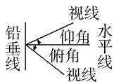  
图①

  
图②

  
图③

  
图④

(2) 方位角

从指北方向顺时针转到目标方向线的水平角,如 B 点的方位角为 $\alpha$ (如图②).

(3) 方向角: 相对于某一正方向的水平角.

(1) 北偏东 $\alpha$ ，即由指北方向顺时针旋转 $\alpha$ 到达目标方向 (如图③).  
(2) 北偏西 $\alpha$ ，即由指北方向逆时针旋转 $\alpha$ 到达目标方向。  
(3) 南偏西等其他方向角类似.  
(4) 坡角与坡度

(1) 坡角: 坡面与水平面所成的二面角的度数 (如图④, 角 $\theta$ 为坡角).  
(2) 坡度: 坡面的铅直高度与水平长度之比 (如图④, i 为坡度). 坡度又称为坡比.

# 【解题方法总结】

# 1、方法技巧: 解三角形多解情况

在 $\triangle ABC$ 中，已知 $a, b$ 和 $\mathbf{A}$ 时，解的情况如下：

<table><tr><td></td><td colspan="3">A为锐角</td><td colspan="2">A为钝角或直角</td></tr><tr><td>图形</td><td>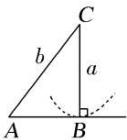</td><td></td><td>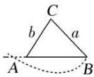</td><td colspan="2"></td></tr><tr><td>关系式</td><td>a=bsinA</td><td>bsinAaa≥ba&gt;ba≤b</td><td>a≥ba&gt;b</td><td>a&gt;b</td><td>a≤b</td></tr><tr><td>解的个数</td><td>一解</td><td>两解</td><td>一解</td><td>一解</td><td>无解</td></tr></table>

2、在解三角形题目中，若已知条件同时含有边和角，但不能直接使用正弦定理或余弦定理得到答案，要选择“边化角”或“角化边”，变换原则常用：

(1) 若式子含有 $\sin x$ 的齐次式, 优先考虑正弦定理, “角化边”;  
(2) 若式子含有 a, b, c 的齐次式, 优先考虑正弦定理, “边化角”;  
(3) 若式子含有 $\cos x$ 的齐次式, 优先考虑余弦定理, “角化边”;  
(4) 代数变形或者三角恒等变换前置；  
(5) 含有面积公式的问题, 要考虑结合余弦定理使用;  
(6) 同时出现两个自由角 (或三个自由角) 时, 要用到 $\mathrm{A} + \mathrm{B} + \mathrm{C} = \pi$ .

# 3、三角形中的射影定理

在 $\triangle ABC$ 中， $a = b\cos C + c\cos B; b = a\cos C + c\cos A; c = b\cos A + a\cos B.$

# 必考题型全归纳

# 1 题型一: 正弦定理的应用

1335 (2024·福建龙岩·高三校联考期中)在 $\triangle ABC$ 中，角A,B,C所对的边分别为 $a,b,c$ ，若 $a$

$= 4, \mathrm{A} = \frac{\pi}{4}, \mathrm{C} = \frac{5\pi}{12}$ , 则 $b =$ （）

A. $2 \sqrt{3}$

B. $2\sqrt{5}$

C. $2 \sqrt{6}$

D. 6

1336 (2024·全国·高三专题练习)在 $\triangle ABC$ 中, 设命题 $p: \frac{a}{\sin C} = \frac{b}{\sin A} = \frac{c}{\sin B}$ , 命题 q: $\triangle ABC$ 是等边三角形, 那么命题 p 是命题 q 的 ()

A. 充分不必要条件

B. 必要不充分条件

C. 充要条件

D. 既不充分也不必要条件

1337 (2024·河南·襄城高中校联考三模)在 $\triangle ABC$ 中, 角 A, B, C 的对边分别为 $a, b, c$ , 若 $\sin A = \sin B \cos C$ 且 $c = 2\sqrt{3}$ , $A = \frac{\pi}{6}$ , 则 $\frac{c + a}{\sin C + \sin A} =$ ()

A. $8 \sqrt{3}$

B. $4 \sqrt{3}$

C. 8

D. 4

1338 (2024·全国·高三专题练习)在 $\triangle ABC$ 中, 内角 A,B,C 的对边分别是 a,b,c, 若 $a\cos B - b\cos A = c$ , 且 $C = \frac{\pi}{5}$ , 则 $\angle B =$ ()

A. $\frac{\pi}{10}$

B. $\frac{\pi}{5}$

C. $\frac{3\pi}{10}$

D. $\frac{2\pi}{5}$

1339 (2024·河南郑州·高三郑州外国语中学校考阶段练习) a, b, c 分别为 $\triangle ABC$ 内角 A, B, C 的对边．已知 a = 4, $ab\sin A\sin C = c\sin B$ ，则 $\triangle ABC$ 外接圆的面积为（）

A. $16\pi$

B. $64\pi$

C. $128\pi$

D. $256\pi$

1340 (2024·甘肃兰州·高三兰州五十一中校考期中)△ABC的三个内角A，B，C所对的边分别为a，b，c，若 $a\sin A\sin B+b\cos^{2}A=\sqrt{3}a$ ，则 $\frac{b}{a}=$ （）

A. $\sqrt{2}$

B. $\sqrt{3}$

C. $2 \sqrt{2}$

D. $2 \sqrt{3}$

1341 (2024·宁夏·高三六盘山高级中学校考期中)在 $\triangle ABC$ 中, 内角 A, B, C 所对的边分别是 $a, b, c$ . 若 $a = 2b$ , 则 $\frac{2\sin^2B - \sin^2A}{\sin^2A}$ 的值为 ( )

A. $-\frac{1}{2}$

B. $\frac{1}{4}$

C. 1

D. $\frac{1}{2}$

1342 (2024·河南·洛宁县第一高级中学校联考模拟预测)△ABC的内角A，B，C的对边分别为a，b，c，已知 $b\cos A=a(\sqrt{3}-\cos B)$ ，a=2，则c=()

A. 4

B. 6

C. $2 \sqrt{2}$

D. $2 \sqrt{3}$

# 2 题型二:余弦定理的应用

1343 (2024·全国·高三专题练习)已知△ABC的内角A,B,C所对的边分别为a,b,c满足 $b^{2}+c^{2}-a^{2}=bc$ 且 $a=\sqrt{3}$ ，则 $\frac{b}{\sin B}=$ （）

A. 2

B. 3

C. 4

D. $2 \sqrt{3}$

1344 (2024·河南·高三统考阶段练习)在 $\Delta ABC$ 中, 角 A, B, C 的对边分别为 a, b, c, 若 $\tan A = \frac{\sin B \sin C}{\sin^{2} B + \sin^{2} C - \sin^{2} A}$ , 则 A = ()

A. $\frac{\pi}{3}$

B. $\frac{\pi}{4}$

C. $\frac{\pi}{6}$ 或 $\frac{5\pi}{6}$

D. $\frac{\pi}{3}$ 或 $\frac{2\pi}{3}$

1345 (2024·全国·高三专题练习)设△ABC中,角A,B,C所对的边分别为a,b,c,若 $\sin A=\sin B$ ,且 $c^{2}=2a^{2}(1+\sin C)$ ,则C=()

A. $\frac{\pi}{6}$

B. $\frac{\pi}{4}$

C. $\frac{\pi}{3}$

D. $\frac{3\pi}{4}$

1346 (2024·重庆渝中·高三重庆巴蜀中学校考阶段练习)在 $\triangle ABC$ 中, 角 A, B, C 的对边分别为 a, b, c, $a^{2} + b^{2} = 3c^{2}$ , 则 $\frac{1}{\tan A} + \frac{1}{\tan B} - \frac{1}{\tan C} =$ ()

A. 0

B. 1

C. 2

D. $\frac{1}{2}$

1347 (2024·全国·高三专题练习)在 $\triangle ABC$ 中, 角 A, B, C 的对边分别为 a, b, c, 且 $\frac{\cos B}{b} + \frac{\cos C}{c} = \frac{\sin A}{\sin C}$ , 则 b 的值为 ()

A. 1

B. $\sqrt{3}$

C. $\frac{\sqrt{3}}{2}$

D. 2

# 3

# 题型三: 判断三角形的形状

1348 (2024·甘肃酒泉·统考三模)在 $\triangle ABC$ 中内角 $A, B, C$ 的对边分别为 $a, b, c$ , 若 $\frac{a^2}{b^2} = \frac{\sin A \cos B}{\sin B \cos A}$ , 则 $\triangle ABC$ 的形状为 ( )

A. 等腰三角形

B. 直角三角形

C. 等腰直角三角形

D. 等腰三角形或直角三角形

1349 (2024·全国·高三专题练习)在 $\triangle ABC$ 中, 角 A, B, C 的对边分别为 a, b, c, 且 c - bcosA < 0, 则 $\triangle ABC$ 形状为 ()

A. 锐角三角形

B. 直角三角形

C. 钝角三角形

D. 等腰直角三角形

1350 (2024·全国·高三专题练习)在 $\triangle ABC$ 中, 若 $\frac{b \cdot \cos C}{c \cdot \cos B} = \frac{1 - \cos 2B}{1 - \cos 2C}$ , 则 $\triangle ABC$ 的形状为 ( )

A. 等腰三角形

B. 直角三角形

C. 等腰直角三角形

D. 等腰三角形或直角三角形

1351 (2024·全国·高三专题练习)设△ABC的内角A，B，C的对边分别为a，b，c，若 $b^{2}=c^{2}+a^{2}-ca$ ，且 $\sin A=2\sin C$ ，则△ABC的形状为()

A. 锐角三角形

B. 直角三角形

C. 钝角三角形

D. 等腰三角形

1352 (2024·河南周口·高三校考阶段练习)已知 $\triangle ABC$ 的三个内角 A, B, C 所对的边分别为 a, b, c. 若 $\sin^{2}A + c\sin A = \sin A\sin B + b\sin C$ ，则该三角形的形状一定是（）

A. 钝角三角形

B. 直角三角形

C. 等腰三角形

D. 锐角三角形

1353 (2024·全国·高三专题练习)设 $\triangle ABC$ 的内角 A, B, C 所对的边分别为 a, b, c, 若 $a^{2}\cos A\sin B = b^{2}\sin A\cos B$ , 则 $\triangle ABC$ 的形状为 ( )

A. 等腰三角形

B. 等腰三角形或直角三角形

C. 直角三角形

D. 锐角三角形

1354 (2024·北京·高三 101 中学校考阶段练习) 设 $\triangle ABC$ 的内角 A, B, C 所对的边分别为 $a$ , $b$ , $c$ , 若 $a^2\cos A\sin B = b^2\sin A\cos B$ , 则 $\triangle ABC$ 的形状为 ( )

A. 等腰直角三角形

B. 直角三角形

C. 等腰三角形或直角三角形

D. 等边三角形

# 4 题型四: 正、余弦定理与的综合

1355 (2024·河南南阳·统考二模)锐角 $\triangle ABC$ 是单位圆的内接三角形, 角 A, B, C 的对边分别为 a, b, c, 且 $a^{2} + b^{2} - c^{2} = 4a^{2}\cos A - 2ac\cos B$ , 则 a 等于 ( )

A. 2

B. $2 \sqrt{2}$

C. $\sqrt{3}$

D. 1

1356 (2024·河北唐山·高三开滦第二中学校考阶段练习)在 $\triangle ABC$ 中, 角 A, B, C 所对的边分别为 a, b, c, $\frac{ab\sin A}{2\sin B} + \frac{ab\sin B}{2\sin A} = a^{2} + b^{2} - c^{2}$ .

(1) 求证: $0 < \mathrm{C} \leqslant \frac{\pi}{3}$ ;   
(2) 若 $\frac{1}{\tan B} = \frac{1}{\tan A} + \frac{1}{\tan C}$ ，求 $\cos A.$

1357 (2024·重庆·统考三模)已知 $\triangle ABC$ 的内角A、B、C的对边分别为 $a, b, c$ , $\sin(A - B)$ $\tan C = \sin A \sin B$ .

(1) 求 $\frac{a^{2}+c^{2}}{b^{2}}$ ;   
(2) 若 $\cos B = \frac{2}{3}$ , 求 $\sin A$ .

1358 (2024·山东滨州·统考二模)已知 $\triangle ABC$ 的三个角 $A, B, C$ 的对边分别为 $a, b, c$ , 且 $2\cos(B - C)\cos A + \cos 2A = 1 + 2\cos A\cos(B + C)$ .

(1) 若 B=C, 求 A;   
(2) 求 $\frac{b^{2}+c^{2}}{a^{2}}$ 的值.

1359 (2024·全国·高三专题练习)在 $\triangle ABC$ 中， $(a+c)(\sin A-\sin C)=b(\sin A-\sin B)$ ，则 $\angle C=$ （）

A. $\frac{\pi}{6}$

B. $\frac{\pi}{3}$

C. $\frac{2\pi}{3}$

D. $\frac{5\pi}{6}$

1360 (2024·青海·校联考模拟预测)在 $\triangle ABC$ 中, 内角 A, B, C 所对应的边分别是 a, b, c, 若 $\triangle ABC$ 的面积是 $\frac{\sqrt{3}(b^{2}+c^{2}-a^{2})}{4}$ , 则 A= ()

A. $\frac{\pi}{3}$

B. $\frac{2\pi}{3}$

C. $\frac{\pi}{6}$

D. $\frac{5\pi}{6}$

1361 (2024·全国·校联考三模)已知 a, b, c 分别为 $\triangle ABC$ 的内角 A, B, C 的对边, $a^{2} + c^{2} = ac\left(3\cos^{2}\frac{B}{2} - \sin^{2}\frac{B}{2}\right)$ .

(1) 求证: a, b, c 成等比数列;  
(2) 若 $\frac{\sin^{2}B}{\sin^{2}A+\sin^{2}C}=\frac{3}{4}$ ，求 $\cos B$ 的值.

1362 (2024·天津武清·天津市武清区杨村第一中学校考模拟预测)在 $\triangle ABC$ 中，角A，B，C所对的边分别为 $a, b, c$ ，已知 $c \sin \frac{B + C}{2} = a \sin C$

(1) 求角 A 的大小;  
(2) 若 $b = 1$ , $\sin B = \frac{\sqrt{21}}{7}$ , 求边 $c$ 及 $\cos (2B + A)$ 的值.

# 5 题型五: 解三角形的实际应用

# 方向1: 距离问题

1363 (2024·全国·高三专题练习)山东省科技馆新馆目前成为济南科教新地标(如图1),其主体建筑采用与地形吻合的矩形设计,将数学符号“∞”完美嵌入其中,寓意无限未知、无限发展、无限可能和无限的科技创新.如图2,为了测量科技馆最高点A与其附近一建筑物楼顶B之间的距离,无人机在点C测得点A和点B的俯角分别为75°,30°,随后无人机沿水平方向飞行600米到点D,此时测得点A和点B的俯角分别为45°和60°(A,B,C,D在同一铅垂面内),则A,B两点之间的距离为\_\_\_\_米.

natural_image

Exterior view of a modern architectural building with green landscaping and road network (no visible text or signage)

(图1)

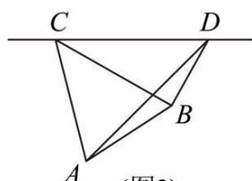

text_image

C
D
B
A
(图2)

(图2)

1364 (2024·安徽阜阳·高三安徽省临泉第一中学校考期中)一游客在 A 处望见在正北方向有一塔 B, 在北偏西 $45^{\circ}$ 方向的 C 处有一寺庙, 此游客骑车向西行 1km 后到达 D 处, 这时塔和寺庙分别在北偏东 $30^{\circ}$ 和北偏西 $15^{\circ}$ , 则塔 B 与寺庙 C 的距离为 \_\_\_\_ km.

1365 (2024·河南郑州·高三统考期末)如图,为了测量A,C两点间的距离,选取同一平面上的B,D两点,测出四边形ABCD各边的长度(单位:km):AB=5,BC=8,CD=3,DA=5,且A,B,C,D四点共圆,则AC的长为\_\_\_\_km.

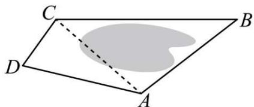

text_image

C
D
A
B

1366 (2024·山东东营·高三广饶一中校考阶段练习)如图,一条巡逻船由南向北行驶,在A处测得灯塔底部C在北偏东15°方向上,匀速向北航行20分钟到达B处,此时测得灯塔底部C在北偏东60°方向上,测得塔顶P的仰角为60°,已知灯塔高为 $2\sqrt{3}$ km. 则巡逻船的航行速度为 \_\_\_\_ km/h.

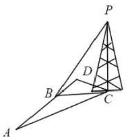

text_image

Geometric diagram with labeled points A, B, C, D, and P, showing triangles and intersecting lines

1367 (2024·重庆·统考模拟预测)如图,某中学某班级课外学习兴趣小组为了测量某座山峰的高度, 先在山脚 A 处测得山顶 C 处的仰角为 $60^{\circ}$ , 又利用无人机在离地面高 300m 的 M 处 (即 MD = 300m), 观测到山顶 C 处的仰角为 $15^{\circ}$ , 山脚 A 处的俯角为 $45^{\circ}$ , 则山高 BC = \_\_\_\_ m.

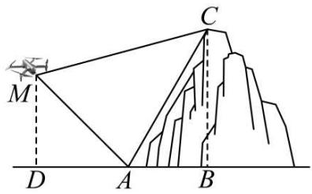

text_image

Geometric diagram showing a pyramid with labeled points A, B, C, D, M and dashed lines indicating height and base.

1368 (2024·河南·校联考模拟预测)中国古代数学名著《海岛算经》记录了一个计算山高的问题(如图1):今有望海岛,立两表齐,高三丈,前后相去千步,令后表与前表相直.从前表却行一百二十三步,人目着地取望岛峰,与表末参合.从后表却行百二十七步,人目着地取望岛峰,亦与表末参合.问岛高及去表各几何?假设古代有类似的一个问题,如图2,要测量海岛上一座山峰的高度AH,立两根高48丈的标杆BC和DE,两竿相距BD=800步,D,B,H三点共线且在同一水平面上,从点B退行100步到点F,此时A,C,F三点共线,从点D退行120步到点G,此时A,E,G三点也共线,则山峰的高度AH=\_\_\_\_步.(古制单位:180丈=300步)

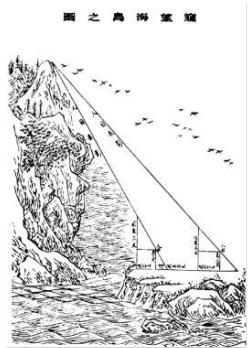

text_image

西之岛得室窟

图1

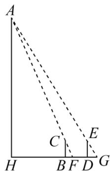

text_image

A
H B F D G
C E

图2

1369 (2024·全国·高三专题练习)为了培养学生的数学建模和应用能力,某校数学兴趣小组对学校雕像“月亮上的读书女孩”进行测量,在正北方向一点测得雕塑最高点仰角为 $30^{\circ}$ ,在正东方向一点测得雕塑最高点仰角为 $45^{\circ}$ ,两个测量点之间距离约为 $4 \sqrt{3}$ 米,则雕塑高为

1370 (2024·全国·模拟预测)山西应县木塔(如图1)是世界上现存最古老、最高大的木塔,是中国古建筑中的瑰宝,是世界木结构建筑的典范. 如图2,某校数学兴趣小组为测量木塔的高度,在木塔的附近找到一建筑物AB,高为 $7\sqrt{3}$ 米,塔顶P在地面上的射影为D,在地面上再确定一点C(B,C,D三点共线),测得BC约为57米,在点A,C处测得塔顶P的仰角分别为 $30^{\circ}$ 和 $60^{\circ}$ ,则该小组估算的木塔的高度为\_\_\_\_米.

natural_image

Aerial view of a multi-tiered traditional Chinese pagoda surrounded by trees and open land under a cloudy sky (no visible text or symbols)

图1

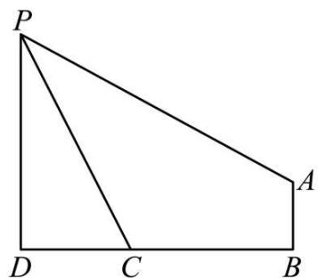

text_image

P
D C B
A

图2

1371 (2024·福建厦门·高三厦门一中校考期中)足球是一项很受欢迎的体育运动。如图,某标准足球场的B底线宽AB=72码,球门宽EF=8码,球门位于底线的正中位置。在比赛过程中,攻方球员带球运动时,往往需要找到一点P,使得∠EPF最大,这时候点P就是最佳射门位置。当攻方球员甲位于边线上的点O处(OA=AB,OA⊥AB)时,根据场上形势判断,有OA、OB两条进攻线路可供选择。若选择线路OB,则甲带球\_\_\_\_码时,到达最佳射门位置。

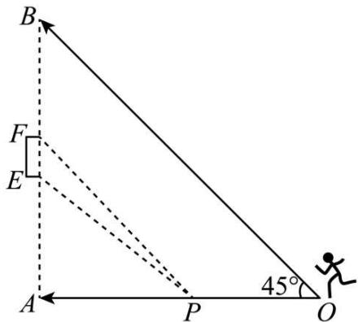

text_image

B
F
E
A
P
O
45°

1372 (2024·全国·高三专题练习)当太阳光线与水平面的倾斜角为 $60^{\circ}$ 时,一根长为 $2m$ 的竹竿,要使它的影子最长,则竹竿与地面所成的角 $\alpha =$ \_\_\_\_.

1373 (2024·全国·高三专题练习)游客从某旅游景区的景点A处至景点C处有两条线路．线路1是从A沿直线步行到C,线路2是先从A沿直线步行到景点B处,然后从B沿直线步行到C．现有甲、乙两位游客从A处同时出发匀速步行,甲的速度是乙的速度的 $\frac{11}{9}$ 倍,甲走线路2,乙走线路1,最后他们同时到达C处．经测量,AB=1040m,BC=500m,则 $\sin\angle BAC$ 等于\_\_\_\_.

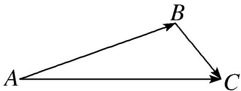

flowchart

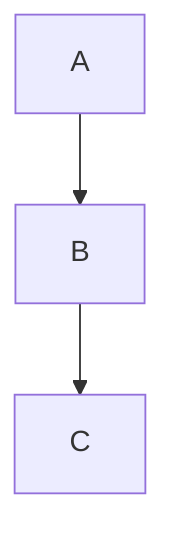

1374 (2024·全国·高三专题练习)最大视角问题是1471年德国数学家米勒提出的几何极值问题,故最大视角问题一般称为“米勒问题”.如图,树顶A离地面a米,树上另一点B离地面b米,在离地面c(c<b)米的C处看此树,离此树的水平距离为\_\_\_\_米时看A,B的视角最大.

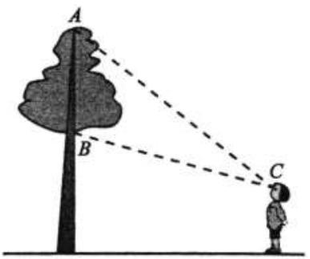

text_image

A
B
C

# 6 题型六:倍角关系

1375 (2024·全国·高三专题练习)记 $\triangle ABC$ 的内角 A, B, C 的对边分别为 a, b, c，已知 $a\cos B = b(1 + \cos A)$ .

(1) 证明: A = 2B;   
(2) 若 $c = 2b, a = \sqrt{3}$ , 求 $\triangle ABC$ 的面积.

1376 (2024·全国·模拟预测)在 $\triangle ABC$ 中, 角 A, B, C 的对边分别为 $a, b, c (a, b, c$ 互不相等), 且满足 $b\cos C = (2b - c)\cos B$ .

(1) 求证: A = 2B;   
(2) 若 $c = \sqrt{2} a$ ，求 $\cos B$ .

1377 (2024·江苏·高三江苏省前黄高级中学校联考阶段练习)在 $\triangle ABC$ 中, 角 A、B、C 的对边分别为 $a 、 b 、 c$ , 若 $A = 2B$ .

(1) 求证: $a^2 - b^2 = bc$ ;   
(2) 若 $\cos B = \frac{2}{3}$ ，点 D 为边 AB 上一点， $AD = \frac{3}{4}DB, CD = 2\sqrt{6}$ ，求边长 b.

1378 (2024·陕西咸阳·武功县普集高级中学校考模拟预测)已知 a, b, c 分别是 $\triangle ABC$ 的角 A, B, C 的对边, $b\sin B - a\sin A = \sin C(2b\cos 2B - c)$ .

(1) 求证: A = 2B;   
(2) 求 $\frac{c}{a}$ 的取值范围.

1379 (2024·四川·成都市锦江区嘉祥外国语高级中学校考三模)已知 a, b, c 分别为锐角 $\triangle ABC$ 内角 A, B, C 的对边， $b - 2a\cos C = a$ .

(1) 证明: C = 2A;   
(2) 求 $\frac{\sin A}{\cos C}$ 的取值范围.

1380 (2024·福建三明·高三统考期末)非等腰 $\triangle ABC$ 的内角 A、B、C 的对应边分别为 a、b、c，且 $\frac{a-\cos B}{a-\cos C}=\frac{\sin B}{\sin C}$ .

(1) 证明: $a^2 = b + c$ ;   
(2) 若 B = 2C, 证明: $b > \frac{2}{3}$ .

# 7 题型七:三角形解的个数

1381 (2024·贵州·统考模拟预测)△ABC中,角A,B,C的对边分别是a,b,c, $A=60^{\circ}$ , $a=\sqrt{3}$ .若这个三角形有两解,则b的取值范围是()

A. $\sqrt{3} < b \leqslant 2$

B. $\sqrt{3} < b < 2$

C. $1 < b < 2\sqrt{3}$

D. $1 < b \leqslant 2$

1382 (2024·全国·高三专题练习)在 $\triangle ABC$ 中，a=18, b=24, $\angle A=45^{\circ}$ ，此三角形解的情况为

A. 一个解

B. 二个解

C. 无解

D. 无法确定

1383 (2024·河南南阳·高三统考期中)在 $\triangle ABC$ 中， $C = 30^{\circ}$ ， $b = \sqrt{2}$ ，c = x。若满足条件的 $\triangle ABC$ 有且只有一个，则 x 的可能取值是（）

A. $\frac{1}{2}$

B. $\frac{\sqrt{3}}{2}$

C. 1

D. $\sqrt{3}$

1384 (2024·全国·高三专题练习)在 $\triangle ABC$ 中, 内角 A, B, C 所对的边分别为 a, b, c, 则下列条件能确定三角形有两解的是 ()

A. $a = 5, b = 4, \mathrm{A} = \frac{\pi}{6}$

B. $a = 4, b = 5, \mathrm{A} = \frac{\pi}{4}$

C. $a=5, b=4, A=\frac{5\pi}{6}$

D. $a = 4, b = 5, \mathrm{A} = \frac{\pi}{3}$

1385 (2024·北京朝阳·高三专题练习)在下列关于 $\triangle ABC$ 的四个条件中选择一个,能够使角A被唯一确定的是: ()

① $\sin A = \frac{1}{2}$   
② $\cos A = -\frac{1}{3};$   
③ $\cos B = -\frac{1}{4}, b = 3a;$   
④ $\angle C=45^{\circ},b=2,c=\sqrt{3}.$

A. ①②

B. ②③

C. ②④

D. ②③④

1386 (2024·全国·高三专题练习)设在 $\triangle ABC$ 中, 角 A、B、C 所对的边分别为 a, b, c, 若满足 $a = \sqrt{3}$ , $b = m$ , $B = \frac{\pi}{6}$ 的 $\triangle ABC$ 不唯一, 则 m 的取值范围为 ()

A. $\left(\frac{\sqrt{3}}{2},\sqrt{3}\right)$

B. $(0,\sqrt{3})$

C. $\left(\frac{1}{2},\frac{\sqrt{3}}{2}\right)$

D. $\left(\frac{1}{2},1\right)$

1387 (2024·全国·高三专题练习)在 $\triangle ABC$ 中， $a=2, B=\frac{\pi}{6}$ ，若该三角形有两个解，则 b 边范围是 ()

A. $(2,4)$

B. $(\sqrt{3},4)$

C. $(\sqrt{3},2)$

D. $(1,2)$

1388 (2024·全国·高三专题练习)若满足 $\angle ABC = \frac{\pi}{4}$ , AC = 6, BC = k 的 $\triangle ABC$ 恰有一个, 则实数 k 的取值范围是 ()

A. $(0,6]$

B. $(0,6]\cup \{6\sqrt{2}\}$

C. $\{6,6\sqrt{2}\}$

D. $(6,6\sqrt{2})$

# 8 题型八:三角形中的面积与周长问题

1389 (2024·全国·高三对口高考)在 $\triangle ABC$ 中, 若 $\overrightarrow{AB} \cdot \overrightarrow{BC} = -2$ , 且 $\angle B = 60^{\circ}$ , 则 $\triangle ABC$ 的面积为 ()

A. $2 \sqrt{3}$

B. $\sqrt{3}$

C. $\frac{\sqrt{3}}{2}$

D. $\sqrt{6}$

1390 (2024·河南·襄城高中校联考三模)在 $\triangle ABC$ 中, 内角 A, B, C 所对的边分别为 $a, b, c$ ,

$\angle BAC = \frac{\pi}{3}$ , D 为 BC 上一点, BD = 2DC, AD = BD = $\frac{\sqrt{3}}{2}$ , 则 $\triangle ABC$ 的面积为 ( )

A. $\frac{3\sqrt{3}}{32}$

B. $\frac{9\sqrt{3}}{8}$

C. $\frac{9\sqrt{3}}{16}$

D. $\frac{9\sqrt{3}}{32}$

1391 (2024·四川成都·校考模拟预测)在 $\triangle ABC$ 中，a, b, c 分别为角 A, B, C 的对边，已知 $\frac{\cos B}{\cos C} = \frac{b}{2a - c}$ ， $S_{\triangle ABC} = \frac{3\sqrt{3}}{4}$ ，且 $b = \sqrt{3}$ ，则（）

A. $\sin C = \frac{1}{2}$

B. $\cos B = \frac{\sqrt{3}}{2}$

C. $a + c = 2\sqrt{3}$

D. $a + c = 3\sqrt{2}$

1392 (2024·河北石家庄·统考三模)已知 $\triangle ABC$ 中, 角 A, B, C 的对边长分别是 a, b, c, $\sin A = 4\sin C\cos B$ , 且 c = 2.

(1) 证明: $\tan B = 3 \tan C$ ;   
(2) 若 $b = 2\sqrt{3}$ , 求 $\triangle ABC$ 外接圆的面积

1393 (2024·全国·高三专题练习)已知△ABC的内角A，B，C的对边分别为a，b，c，且 $a(1-\cos C)=c\cos A$ .

(1) 证明: $\triangle ABC$ 是等腰三角形;  
(2) 若 $\triangle ABC$ 的面积为 $\frac{2\sqrt{2}}{3}$ , 且 $\cos C = \frac{1}{3}$ , 求 $\triangle ABC$ 的周长.

1394 (2024·全国·高三专题练习)在① $2a\cos A = c\cos B + b\cos C$ ; ② $a\sin B = b\sin\left(A + \frac{\pi}{3}\right)$ .

这两个条件中任选一个,补充在下面问题中,并解答.

已知 $\triangle ABC$ 的内角 $A, B, C$ 的对边分别为 $a, b, c$ . 若 $\triangle ABC$ 的面积 $S = \frac{3 + \sqrt{3}}{2}, c = 2$ , 求 $a$ .

注:如果选择多个条件分别解答,按第一个解答计分.

1395 (2024·湖南长沙·周南中学校考二模)已知向量 $\vec{a} = (\sin x, 1 + \cos 2x)$ , $\vec{b} = (\cos x, \frac{1}{2})$ , $f(x)=\vec{a}\cdot\vec{b}-\frac{1}{2}.$

(1) 求函数 $y = f(x)$ 的最大值及相应 $x$ 的值；  
(2) 在 $\triangle ABC$ 中, 角 A 为锐角且 $A + B = \frac{7\pi}{12}$ , $f(A) = \frac{1}{2}$ , BC = 2, 求 $\triangle ABC$ 的面积.

1396 (2024·海南海口·海南华侨中学校考模拟预测)已知 $\triangle ABC$ 的内角A，B，C的对边分别为 $a, b, c, a = 6, b\sin 2A = 4\sqrt{5}\sin B.$

(1) 若 $b = 1$ , 证明: $\mathrm{C} = \mathrm{A} + \frac{\pi}{2}$ ;   
(2) 若 BC 边上的高为 $\frac{8\sqrt{5}}{3}$ ，求 $\triangle ABC$ 的周长.

1397 (2024·安徽·合肥一中校联考模拟预测)记 $\triangle ABC$ 的内角 A, B, C 的对边分别为 a, b, c, 已知 $\cos B = \frac{1}{3}$ .

(1) 求 $\cos^{2}\frac{B}{2} + \tan^{2}\frac{A+C}{2}$ 的值；  
(2) 若 $b = 4$ , $\mathrm{S}_{\triangle \mathrm{ABC}} = 2\sqrt{2}$ , 求 $c$ 的值.

1398 (2024·吉林长春·东北师大附中校考模拟预测)已知 $\triangle ABC$ 中角 A, B, C 的对边分别为 a, b, c, $a\cos C + \sqrt{3}a\sin C - b - c = 0$ .

(1) 求 A;

(2) 若 $a = \sqrt{13}$ , 且 $\triangle ABC$ 的面积为 $3\sqrt{3}$ , 求 $\triangle ABC$ 周长.

