# 第33讲 解三角形图形问题

# 知识梳理

解决三角形图形类问题的方法：

方法一:两次应用余弦定理是一种典型的方法,充分利用了三角形的性质和正余弦定理的性质解题;

方法二:等面积法是一种常用的方法,很多数学问题利用等面积法使得问题转化为更为简单的问题,相似是三角形中的常用思路;

方法三: 正弦定理和余弦定理相结合是解三角形问题的常用思路;

方法四:构造辅助线作出相似三角形,结合余弦定理和相似三角形是一种确定边长比例关系的不错选择;

方法五:平面向量是解决几何问题的一种重要方法,充分利用平面向量基本定理和向量的运算法则可以将其与余弦定理充分结合到一起;

方法六:建立平面直角坐标系是解析几何的思路,利用此方法数形结合充分挖掘几何性质使得问题更加直观化.

# 必考题型全归纳

# 1 题型一:妙用两次正弦定理

1399 (2024·全国·高三专题练习)如图, 四边形 ABCD 中 $\angle BAC = 90^{\circ}$ , $\angle ABC = 30^{\circ}$ , AD ⊥ CD, 设 $\angle ACD = \theta$ .

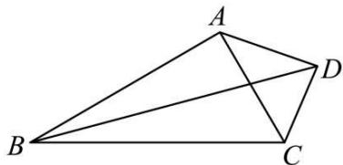

natural_image

Geometric diagram of a quadrilateral ABCD with diagonals AC and BD intersecting (no labels or text)

(1) 若 $\Delta ABC$ 面积是 $\Delta ACD$ 面积的 4 倍, 求 $\sin2\theta$ ;  
(2) 若 $\angle ADB = \frac{\pi}{6}$ , 求 $\tan \theta$ .

1400 (2024·湖北黄冈·高一统考期末)如图, 四边形° ABCD 中 $\angle BAC = 90^{\circ}$ , $\angle ABC = 60^{\circ}$ , AD ⊥ CD, 设° $\angle ACD = \theta$ .

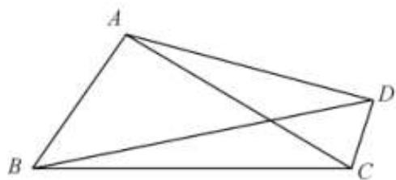

natural_image

Geometric diagram of a quadrilateral ABCD with diagonals AC and BD intersecting (no labels or measurements)

(1) 若 $\triangle ABC$ 面积是 $\triangle ACD$ 面积的 4 倍, 求 $\circ \sin2\theta$ ;  
(2) 若 $\circ \tan \angle ADB = \frac{1}{2}$ , 求 $\circ \tan \theta$ .

1401 (2024·全国·高三专题练习)在① AB = 2AD, ② $\sin\angle ACB = 2\sin\angle ACD$ , ③ $S_{\triangle ABC} = 2S_{\triangle ACD}$ 这三个条件中任选一个, 补充在下面问题中, 并解答.

已知在四边形ABCD中， $\angle ABC + \angle ADC = \pi, BC = CD = 2$ ，且

(1) 证明: $\tan \angle ABC = 3 \tan \angle BAC$ ;   
(2) 若 AC = 3, 求四边形 ABCD 的面积.

1402 (2024·甘肃金昌·高一永昌县第一高级中学校考期中)如图,在平面四边形ABCD中, $\angle BCD=\frac{\pi}{2},AB=1,\angle ABC=\frac{3\pi}{4}.$

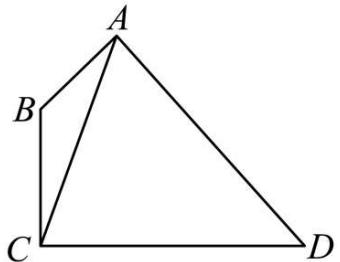

natural_image

Geometric diagram of a quadrilateral ABCD with diagonal AC, no text or labels present

(1) 当 $BC = \sqrt{2}$ , CD = $\sqrt{7}$ 时, 求 $\triangle ACD$ 的面积.  
(2) 当 $\angle ADC = \frac{\pi}{6}, AD = 2$ 时, 求 $\tan \angle ACB$ .

1403 (2024·广东广州·高一统考期末)如图,在平面四边形ABCD中, $\angle BCD=\frac{\pi}{2},AB=1,\angle ABC=\frac{2\pi}{3}.$

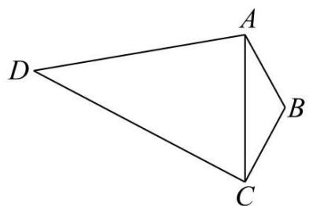

natural_image

Geometric diagram of a quadrilateral ABCD with diagonal AC, no text or labels present

(1) 若 BC = 2, CD = $\sqrt{7}$ , 求 $\triangle ACD$ 的面积;  
(2) 若 $\angle ADC = \frac{\pi}{6}, AD = 2$ , 求 $\cos \angle ACD$ .

1404 (2024·广东·统考模拟预测)在平面四边形ABCD中， $\angle ABD = \angle BCD = 90^{\circ}$ ， $\angle DAB = 45^{\circ}$ .

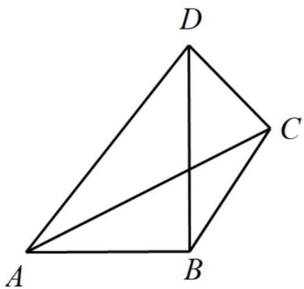

text_image

D
C
A
B

(1) 若 AB = 2, $\angle DBC = 30^{\circ}$ , 求 AC 的长;  
(2) 若 $\tan\angle BAC=\frac{3}{4}$ ，求 $\tan\angle DBC$ 的值.

1405 (2024·江苏徐州·高一统考期末)在① $\frac{\sin A}{\cos B\cos C} = \frac{2a^{2}}{a^{2} + c^{2} - b^{2}}$ ，② $\sin B - \cos B = \frac{\sqrt{2}b - a}{c}$ ，③ $\triangle ABC$ 的面积

$S=\frac{\sqrt{2}}{4}b(b\sin C+\ctan C\cos B)$ 这三个条件中任选一个，补充在下面问题中，并完成解答.
在 $\triangle ABC$ 中，角A、B、C的对边分别为a、b、c，已知\_\_\_\_.

(1) 求角 C;  
(2) 若点 D 在边 AB 上, 且 BD = 2AD, $\cos B = \frac{5}{13}$ , 求 $\tan \angle BCD$ .  
注:如果选择多个条件分别解答,按第一个解答计分

1406 (2024·广东深圳·深圳市高级中学校考模拟预测)记 $\triangle ABC$ 的内角A、B、C的对边分别为 $a, b, c$ , 已知 $b\cos A - a\cos B = b - c$ .

(1) 求 A;   
(2) 若点 D 在 BC 边上, 且 CD = 2BD, $\cos B = \frac{\sqrt{3}}{3}$ , 求 $\tan \angle BAD$ .

1407 (2024·广东揭阳·高三校考阶段练习)在 $\triangle ABC$ 中, 内角 A, B, C 所对的边分别为 a, b, c, 且 $2\cos A(c\cos B + b\cos C) = a$ .

(1) 求角 A;  
(2) 若 O 是 $\triangle ABC$ 内一点， $\angle AOB = 120^{\circ}$ ， $\angle AOC = 150^{\circ}$ ，b = 1, c = 3，求 $\tan \angle ABO$ .

# 2 题型二:两角使用余弦定理

1408 (2024·全国·高一专题练习)如图,四边形ABCD中, $\cos\angle BAD=\frac{1}{3}$ ,AC=AB=3AD.

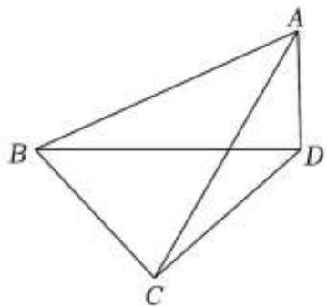

natural_image

Geometric diagram of a tetrahedron with vertices labeled A, B, C, D (no text or symbols beyond labels)

(1) 求 $\sin\angle ABD;$   
(2) 若 $\angle BCD = 90^{\circ}$ , 求 $\tan \angle CBD$ .

1409 (2024·全国·高一专题练习)如图,在梯形ABCD中, $AB \parallel CD$ , $AD = \sqrt{3}BC = \sqrt{3}$ .

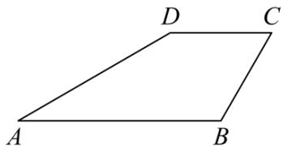

text_image

D
C
A
B

(1) 求证: $\sin C = \sqrt{3} \sin A$ ;   
(2) 若 C = 2A, AB = 2CD, 求梯形 ABCD 的面积.

1410 (2024·河北·校联考一模)在 $\triangle ABC$ 中, $AB = 4$ , $AC = 2\sqrt{2}$ , 点 D 为 BC 的中点, 连接 AD 并延长到点 E, 使 AE = 3DE.

(1) 若 DE = 1，求 $\angle BAC$ 的余弦值；

(2) 若 $\angle ABC = \frac{\pi}{4}$ , 求线段 BE 的长.

1411 (2024·全国·模拟预测)在锐角 $\triangle ABC$ 中, 内角 A, B, C 的对边分别为 a, b, c, $2\cos^{2}2C = 3 - 5\cos2\left(\frac{23\pi}{2} - C\right)$ .

(1) 求角 C;  
(2) 若点 D 在 AB 上, BD = 2AD, BD = CD, 求 $\frac{AC}{BC}$ 的值.

1412 (2024·浙江舟山·高一舟山中学校考阶段练习)如图,在梯形ABCD中, AB // CD, AD · sinD = 2CD · sinB.

text_image

D
C
A
B

(1) 求证: BC = 2CD;   
(2) 若 $\mathrm{AD} = \mathrm{BC} = 2, \angle \mathrm{ADC} = 120^{\circ}$ , 求 AB 的长度.

# 3 题型三: 张角定理与等面积法

1413 (2024·全国·高三专题练习)已知 $\triangle ABC$ 中，a, b, c 分别为内角 A, B, C 的对边，且 $2a\sin A = (2b + c)\sin B + (2c + b)\sin C.$

(1) 求角 A 的大小;  
(2) 设点 D 为 BC 上一点, AD 是 $\triangle ABC$ 的角平分线, 且 $AD = 2$ , $b = 3$ , 求 $\triangle ABC$ 的面积.

1414 (2024·贵州黔东南·凯里一中校考三模)已知△ABC的内角A，B，C的对边分别为a，b，c，且 $2a\sin A=(2b+c)\sin B+(2c+b)\sin C$ .

(1) 求 A 的大小;  
(2) 设点 D 为 BC 上一点, AD 是 $\triangle ABC$ 的角平分线, 且 $AD = 4$ , $AC = 6$ , 求 $\triangle ABC$ 的面积.

1415 (2024·山东潍坊·统考模拟预测)在 $\triangle ABC$ 中, 设角 A, B, C 所对的边长分别为 a, b, c, 且 $(c - b)\sin C = (a - b)(\sin A + \sin B)$ .

(1) 求 A;   
(2) 若 D 为 BC 上点, AD 平分角 A, 且 $b = 3$ , $\mathrm{AD} = \sqrt{3}$ , 求 $\frac{\mathrm{BD}}{\mathrm{DC}}$ .

1416 (2024·安徽淮南·统考二模)如图,在 $\triangle ABC$ 中, $AB=2,3\sin^{2}B-2\cos B-2=0$ ,且点D在线段BC上.

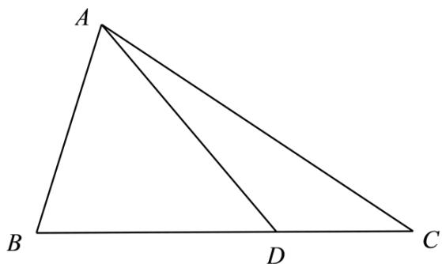

text_image

A
B
D
C

(1) 若 $\angle ADC = \frac{3\pi}{4}$ , 求 AD 的长;  
(2) 若 $\mathrm{BD} = 2\mathrm{DC}$ , $\frac{\sin\angle BAD}{\sin\angle CAD} = 4\sqrt{2}$ , 求 $\triangle ABD$ 的面积.

1417 (2024·江西抚州·江西省临川第二中学校考二模)如图,在△ABC中, AB=4, cosB= $\frac{1}{3}$ , 点D在线段BC上.

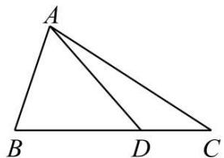

text_image

A
B D C

(1) 若 $\angle ADC = \frac{3\pi}{4}$ , 求 AD 的长;  
(2) 若 BD = 2DC, $\triangle ACD$ 的面积为 $\frac{16\sqrt{2}}{3}$ , 求 $\frac{\sin\angle BAD}{\sin\angle CAD}$ 的值.

1418 (2024·全国·高一专题练习)已知函数 $f(x) = \sqrt{3}\sin \omega x\cos \omega x - \cos^2\omega x + \frac{1}{2} (\omega > 0)$ ，其图像上相邻的最高点和最低点间的距离为 $\sqrt{4 + \frac{\pi^2}{4}}$ .

(1) 求函数 $f(x)$ 的解析式;  
(2) 记 $\triangle ABC$ 的内角 A, B, C 的对边分别为 $a, b, c, a = 4, bc = 12, f(A) = 1$ . 若角 A 的平分线 AD 交 BC 于 D, 求 AD 的长.

1419 (2024·吉林通化·梅河口市第五中学校考模拟预测)已知锐角 $\triangle ABC$ 的内角 A,B,C 的对边分别为 a,b,c，且 $\frac{a}{b+c} = \frac{\sin B - \sin C}{\sin A - \sin C}$ .

(1) 求 B;   
(2) 若 $b = \sqrt{6}$ ，角 B 的平分线交 AC 于点 D，BD = 1，求 $\triangle ABC$ 的面积.

# 4 题型四:角平分线问题

1420 (2024·黑龙江哈尔滨·哈尔滨市第一二二中学校校考模拟预测)在 $\triangle ABC$ 中, 已知 AB = 5, $\angle BAC$ 的平分线与边 BC 交于点 D, $\angle DAC$ 的平分线与边 BC 交于点 E, $\cos\angle EAC = \frac{3\sqrt{10}}{10}$ .

(1) 若 $BC = \frac{6}{5} AC$ ，求 $\triangle ABC$ 的面积；  
(2) 若 $\cos\angle ADB=\frac{\sqrt{2}}{10}$ ，求 BC.

1421 (2024·河北衡水·河北衡水中学校考模拟预测)锐角 $\triangle ABC$ 的内角 A, B, C 的对边分别为 $a, b, c$ , 已知 $\sqrt{3} (b \sin C + c \sin B) = 4a \sin B \sin C, b^2 + c^2 - a^2 = 8$ ,

(1) 求 $\cos A$ 的值及 $\triangle ABC$ 的面积;  
(2) $\angle A$ 的平分线与BC交于D, DC=2BD, 求a的值.

1422 (2024·山东泰安·统考模拟预测)在 $\triangle ABC$ 中, 角 A、B、C 的对边分别是 a、b、c, 且 $2\cos C \cdot \sin\left(B + \frac{\pi}{6}\right) + \cos A = 0.$

(1) 求角 C 的大小;  
(2) 若 $\angle ACB$ 的平分线交 $AB$ 于点 $D$ , 且 $CD = 2$ , $BD = 2AD$ , 求 $\triangle ABC$ 的面积.

1423 (2024·河北唐山·唐山市第十中学校考模拟预测)如图,在△ABC中,角A,B,C所对的边分别为 $a, b, c, a + 2b = 2c\cos \left(\mathrm{B} - \frac{\pi}{3}\right)$ , 角 C 的平分线交 AB 于点 D, 且 $\mathrm{BD} = 2\sqrt{7}$ , $\mathrm{AD} = \sqrt{7}$ .

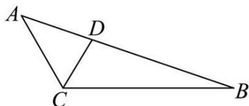

text_image

A
D
C
B

(1) 求 $\angle ACB$ 的大小;  
(2) 求 CD.

1424 (2024·广东深圳·校考二模)记 $\triangle ABC$ 的内角 A、B、C 的对边分别为 $a, b, c$ , 已知 $\sin B \sin C \cos^{2} \frac{A}{2} = 2 \sin^{2} A$ .

(1) 证明: $b + c = 3a$ ;   
(2) 若角 B 的平分线交 AC 于点 D，且 BD = $\frac{4\sqrt{6}}{5}$ ， $\frac{\mathrm{AD}}{\mathrm{DC}} = \frac{3}{2}$ ，求 $\triangle ABC$ 的面积.

1425 (2024·海南·校联考模拟预测)在 $\triangle ABC$ 中, 角 A, B, C 的对边分别为 a, b, c, 点 M 在边 BC 上, AM 是角 A 的平分线, $asinB = -\sqrt{3}b\cos A$ , CM = 2MB.

(1) 求 A;   
(2) 若 $\mathrm{AM} = 2\sqrt{3}$ , 求 BC 的长.

1426 (2024·四川·校联考模拟预测)在① $a=b\cos C+\frac{\sqrt{3}}{3}c\sin B$ ;②c=3这两个条件中任选一个作为已知条件,补充在下面的横线上,并给出解答.

注:若选择多个条件分别解答,按第一个解答计分.

已知 $\triangle ABC$ 中, 角 A, B, C 的对边分别为 $a, b, c$ , 点 D 为 BC 边的中点, $b = AD = \sqrt{7}$ , 且 \_\_\_\_.

(1) 求 a 的值;  
(2) 若 $\angle ABC$ 的平分线交 AC 于点 E, 求 $\triangle BCE$ 的周长.

# 题型五:中线问题

1427 (2024·浙江杭州·统考一模)已知 $\triangle ABC$ 中角 A、B、C 所对的边分别为 $a, b, c$ , 且满足 $2c\sin A\cos B + 2b\sin A\cos C = \sqrt{3} a, c > a$ .

(1) 求角 A;  
(2) 若 $b = 2$ ，BC 边上中线 $\mathrm{AD} = \sqrt{7}$ ，求 $\triangle ABC$ 的面积.

1428 (2024·四川内江·校考模拟预测)在 $\triangle ABC$ 中，D是边BC上的点， $\angle BAC = 120^{\circ}$ ， $|AD| = 1$ ，AD平分 $\angle BAC$ ， $\triangle ABD$ 的面积是 $\triangle ACD$ 的面积的两倍.

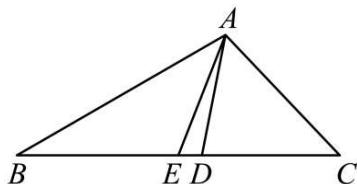

text_image

A
B E D C

(1) 求 $\triangle ACD$ 的面积;  
(2) 求 $\triangle ABC$ 的边 BC 上的中线 AE 的长.

1429 (2024·四川绵阳·统考二模)在 $\triangle ABC$ 中, 角 A,B,C 所对的边分别为 $a, b, c, a^2 \sin C + 3a \cos C = 3b$ , $A = 60^\circ$ .

(1) 求 $a$ 的值;  
(2) 若 $\overrightarrow{\mathrm{BA}}\cdot \overrightarrow{\mathrm{AC}} = -\frac{1}{2}$ , 求 BC 边上中线 AT 的长.

1430 (2024·广东广州·统考一模)在 $\triangle ABC$ 中, 内角 A, B, C 的对边分别为 $a, b, c, c = 2b$ , $2\sin A = 3\sin 2C$ .

(1) 求 $\sin C;$   
(2) 若 $\triangle ABC$ 的面积为 $\frac{3\sqrt{7}}{2}$ ，求 AB 边上的中线 CD 的长.

1431 (2024·安徽宣城·安徽省宣城中学校考模拟预测) $\triangle ABC$ 中, 已知 $\sqrt{3}\cos\left(\frac{\pi}{3}-B\right)+\cos\left(\frac{\pi}{6}+B\right)=0$ . AC 边上的中线为 BD.

(1) 求 $\angle B;$   
(2)从以下三个条件中选择两个,使 $\triangle ABC$ 存在且唯一确定,并求AC和BD的长度.条件①: $a^{2}-b^{2}+c^{2}-3c=0$ ;条件②a=6;条件③ $S_{\triangle ABC}=15\sqrt{3}$ .

1432 (2024·辽宁沈阳·东北育才双语学校校考一模)如图, 设 $\triangle ABC$ 中角 A, B, C 所对的边分别为 a, b, c, AD 为 BC 边上的中线, 已知 c = 1 且 $2c\sin A\cos B = a\sin A - b\sin B + \frac{1}{4}b\sin C$ , $\cos\angle BAD = \frac{\sqrt{21}}{7}$ .

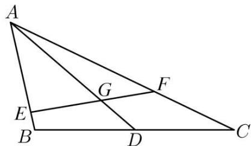

text_image

A
E
G
F
B
D
C

(1) 求 b 边的长度;  
(2) 求 $\triangle ABC$ 的面积;  
(3) 设点 E, F 分别为边 AB, AC 上的动点 (含端点), 线段 EF 交 AD 于 G, 且 $\triangle AEF$ 的面积为 $\triangle ABC$ 面积的 $\frac{1}{6}$ , 求 $\overrightarrow{AG} \cdot \overrightarrow{EF}$ 的取值范围.

1433 (2024·广东广州·统考三模)在① $b\sin\frac{\pi-A}{2}=a\sin B$ ; ② $\sqrt{3}a\sin B=b(2-\cos A)$ 这两个条件中任选一个, 补充在下面的问题中, 并作答.

问题: 已知 $\triangle ABC$ 中, a, b, c 分别为角 A, B, C 所对的边, \_\_\_\_.

(1) 求角 A 的大小;  
(2) 已知 AB = 2, AC = 8, 若 BC, AC 边上的两条中线 AM, BN 相交于点 P, 求 $\angle MPN$ 的余弦值.

注:如果选择多个条件分别解答,按第一个解答计分.

# 6 题型六:高问题

1434 (2024·海南海口·海南华侨中学校考模拟预测)已知 $\triangle ABC$ 的内角A，B，C的对边分别为 $a, b, c, a = 6, b\sin 2A = 4\sqrt{5}\sin B.$

(1) 若 $b = 1$ , 证明: $\mathrm{C} = \mathrm{A} + \frac{\pi}{2}$ ;   
(2) 若 BC 边上的高为 $\frac{8\sqrt{5}}{3}$ ，求 $\triangle ABC$ 的周长.

1435 (2024·重庆·统考模拟预测)在 $\triangle ABC$ 中, 角 A, B, C 的对边分别为 a, b, c, $\vec{m} =$

$$
(\sin B, \sin C + \cos C), \vec {n} = (\cos C - \sin C, \cos B), \vec {m} \cdot \vec {n} = \frac {1}{2}.
$$

(1) 求 $\sin2A$ ;   
(2) 若 $a = 3$ , BC 边上的高线长 $\sqrt{7} - 1$ , 求 $\sin B \sin C$ .

1436 (2024·四川自贡·统考三模)△ABC的内角A，B，C所对的边分别为a，b，c，若 $b^{2}+c^{2}=a^{2}+bc$ .

(1) 求 A;   
(2) 若 BC 上的高 AD = $\frac{\sqrt{3}}{4}a$ ，求 cosBcosC.

1437 (2024·黑龙江齐齐哈尔·统考一模)已知 $\triangle ABC$ 的内角 A, B, C 的对边分别为 a, b, c，且 $c - \sqrt{3}b\sin A = \frac{a^{2} + c^{2} - b^{2}}{2c} - b$ .

(1) 求 A;   
(2) 若 $b = \frac{1}{4} c$ ，且 BC 边上的高为 $2\sqrt{3}$ ，求 $a$ .

1438 (2024·辽宁抚顺·统考模拟预测)已知 $\triangle ABC$ 中, 点 D 在边 AB 上, 满足 $\overrightarrow{CD}=$ $\lambda\left(\frac{\overrightarrow{CA}}{|\overrightarrow{CA}|}+\frac{\overrightarrow{CB}}{|\overrightarrow{CB}|}\right)(\lambda>0)$ , 且 $\cos\frac{B}{2}=\frac{\sqrt{6}}{3}$ , $\triangle CAD$ 的面积与 $\triangle CBD$ 面积的比为 $2\sqrt{6}:3$ .

(1) 求 $\sin A$ 的值;  
(2) 若 AB = 5，求边 AB 上的高 CE 的值.

# 7 题型七: 重心性质及其应用

1439 (2024·全国·高三专题练习)已知△ABC的内角A，B，C的对边分别为a，b，c，且 $3c^{2}=a^{2}+8b^{2}$ .

(1) 求 $\cos B$ 的最小值;  
(2) 若 M 为 $\triangle ABC$ 的重心, $\angle AMC = 90^{\circ}$ , 求 $\frac{\sin\angle AMB}{\sin\angle CMB}$ .

1440 (2024·河南开封·开封高中校考模拟预测)记 $\triangle ABC$ 的内角 A, B, C 的对边分别为 $a, b, c$ , 已知 $\sqrt{3} a \sin B - a \cos C = c \cos A, b = \sqrt{6}, G$ 为 $\triangle ABC$ 的重心.

(1) 若 $a = 2$ , 求 $c$ 的长;  
(2) 若 $AG = \frac{\sqrt{3}}{3}$ ，求 $\triangle ABC$ 的面积.

1441 (2024·广西钦州·高三校考阶段练习)在 $\triangle ABC$ 中, 内角 A, B, C 的对边分别为 $a, b, c$ , 且 $a\cos B + \sqrt{3} a\sin B = c + b$ .

(1) 求角 A 的大小;  
(2) 若 b=3，点 G 是 $\triangle ABC$ 的重心，且 $AG=\sqrt{21}$ ，求 $\triangle ABC$ 内切圆的半径.

1442 (2024·全国·高三专题练习)设 a, b, c 分别为 $\triangle ABC$ 的内角 A, B, C 的对边, AD 为 BC 边上的中线, c = 1, $\angle BAC = \frac{2\pi}{3}$ , $2c\sin A\cos B = a\sin A - b\sin B + \frac{1}{2}b\sin C$ .

(1) 求 AD 的长度;  
(2) 若 E 为 AB 上靠近 B 的四等分点, G 为 $\triangle ABC$ 的重心, 连接 EG 并延长与 AC 交于点 F, 求 AF 的长度.

1443 (2024·四川内江·高三威远中学校校考期中)△ABC的内角A，B，C所对的边分别为a，

$$
b, c, a = 6, b \sin \frac {\mathrm{B} + \mathrm{C}}{2} = a \sin \mathrm{B}.
$$

(1) 求 A 的大小;  
(2)M为△ABC内一点, AM的延长线交BC于点D, \_\_\_\_, 求△ABC的面积.

请在下面三个条件中选择一个作为已知条件补充在横线上,使 $\triangle ABC$ 存在,并解决问题.

①M为 $\triangle ABC$ 的重心, $AM=2\sqrt{3}$ ;  
②M为△ABC的内心， $AD=3\sqrt{3}$ ;  
③M为 $\triangle ABC$ 的外心, AM=4.

1444 (2024·全国·高三专题练习)在① $2a\cos A = b\cos C + c\cos B$ ; ② $\tan B + \tan C + \sqrt{3} = \sqrt{3}\tan B\tan C$ 这两个条件中任选一个, 补充在下面的问题中, 并加以解答.

在 $\triangle ABC$ 中，a, b, c 分别是角 A, B, C 的对边，已知 \_\_\_\_.

(1) 求角 A 的大小;  
(2) 若 $\triangle ABC$ 为锐角三角形, 且其面积为 $\frac{\sqrt{3}}{2}$ , 点 G 为 $\triangle ABC$ 重心, 点 M 为线段 AC 的中点, 点 N 在线段 AB 上, 且 AN = 2NB, 线段 BM 与线段 CN 相交于点 P, 求 $\left|\overrightarrow{GP}\right|$ 的取值范围.

注:如果选择多个方案分别解答,按第一个方案解答计分.

# 题型八: 外心及外接圆问题

1445 (2024·湖南长沙·长沙市实验中学校考二模)在 $\triangle ABC$ 中, 内角 A, B, C 的对边分别为 $a, b, c$ , 且 $a, b, c$ 是公差为 2 的等差数列.

(1) 若 $2\sin C = 3\sin A$ ，求 $\triangle ABC$ 的面积.  
(2) 是否存在正整数 b，使得 $\triangle ABC$ 的外心在 $\triangle ABC$ 的外部？若存在，求 b 的取值集合；若不存在，请说明理由.

1446 (2024·全国·高三专题练习)在 $\triangle ABC$ 中, 三内角 A, B, C 对应的边分别为 a, b, c, a = 6.

(1) 求 $b \cos C + c \cos B$ 的值；  
(2) 若 O 是 $\triangle ABC$ 的外心，且 $\sqrt{3} \cdot \overrightarrow{OA} + \overrightarrow{OB} + \sqrt{2} \cdot \overrightarrow{OC} = \vec{0}$ ，求 $\triangle ABC$ 外接圆的半径.

1447 (2024·全国·高三专题练习)在 $\triangle ABC$ 中, 角 A, B, C 的对边分别为 $a, b, c; 3b = 4c$ , $\cos C = \frac{4}{5}$ .

(1) 求 $\cos A$ 的值;  
(2) 若 $\triangle ABC$ 的外心在其外部, a = 7, 求 $\triangle ABC$ 外接圆的面积.

1448 (2024·高三统考阶段练习)在 $\triangle ABC$ 中, 角 A, B, C 对应的三边分别为 a, b, c, $(\tan A + 1)(\tan B + 1) = 2$ , $c = 2\sqrt{2}$ , a = 2, O 为 $\triangle ABC$ 的外心, 连接 OA, OB, OC.

(1) 求 $\triangle OAB$ 的面积;  
(2) 过 B 作 AC 边的垂线交于 D 点, 连接 OD, 试求 $\cos\angle OBD$ 的值.

# 题型九:两边夹问题

1449 (2024·全国·高三专题练习)在 $\Delta ABC$ 中, 角 A, B, C 所对的边分别为 a, b, c, 若 $\cos A + \sin A - \frac{2}{\sin B + \cos B} = 0$ , 则 $\frac{a + b}{c}$ 的值是 ()

A. 2

B. $\sqrt{3}$

C. $\sqrt{2}$

D. 1

1450 (2024·河北唐山·高三校考阶段练习)在 $\Delta ABC$ 中，a、b、c 分别是 $\angle A$ 、 $\angle B$ 、 $\angle C$ 所对边的边长. 若 $\cos A + \sin A - \frac{2}{\cos B + \sin B} = 0$ ，则 $\frac{a + b}{c}$ 的值是（）.

A. 1

B. $\sqrt{2}$

C. $\sqrt{3}$

D. 2

1451 (2024·全国·高三专题练习)在 $\Delta ABC$ 中, 已知边 a, b, c 所对的角分别为 A, B, C, 若 $2\sin^{2}B + 3\sin^{2}C = 2\sin A\sin B\sin C + \sin^{2}A$ , 则 $\tan A =$ \_\_\_\_

1452 (2024·江苏苏州·吴江中学模拟预测)在 $\Delta ABC$ 中, 已知边 a, b, c 所对的角分别为 A, B, C, 若 $5 - 2\cos^{2}B - 3\cos^{2}C = 2\sin A\sin B\sin C + \sin^{2}A$ , 则 $\tan A =$ \_\_\_\_ .

1453 (2024·湖南长沙·高二长沙一中校考开学考试)在 $\Delta ABC$ 中, 已知边 a、b、c 所对的角分别为 A、B、C, 若 $a = \sqrt{5}$ , $2\sin^{2}B + 3\sin^{2}C = 2\sin A\sin B\sin C + \sin^{2}A$ , 则 $\Delta ABC$ 的面积 S = \_\_\_\_.

1454 (2024·全国·高三专题练习)在 $\triangle ABC$ 中, 若 $(\cos A + \sin A)(\cos B + \sin B) = 2$ , 则角 C = \_\_\_\_.

1455 (2024·全国·高三专题练习)在 $\triangle ABC$ 中, 角 A, B, C 的对边分别为 a, b, c, 设 S 是 $\triangle ABC$ 的面积, 若 $b^{2} + c^{2} - \frac{1}{3}a^{2} = \frac{4\sqrt{3}}{3}S$ , 则角 A 的值为 \_\_\_\_.

# 10 题型十:内心及内切圆问题

1456 (2024·福建泉州·高三福建省泉州第一中学校考期中)在△ABC中,角A,B,C的对边分别为a,b,c,I为△ABC的内心,延长线段AI交BC于点D,此时 $\overrightarrow{CB}=3\overrightarrow{CD}$

(1) 求 $\frac{\sin B}{\sin C}$ ;   
(2) 若 $\angle ADB = \frac{2\pi}{3}$ ，求 $\frac{b + c}{a}$ .

1457 (2024·山西·高三校联考阶段练习)已知△ABC中,角A,B,C所对的边分别为a,b,c,a=7,2c $\cos B=(3a-2b)\cos C$ .

(1) 求 $\cos C;$   
(2) 若 B = 2C, M 为 $\triangle ABC$ 的内心, 求 $\triangle AMC$ 的面积.

1458 (2024·广东佛山·华南师大附中南海实验高中校考模拟预测)在 $\triangle ABC$ 中, 角 A, B, C 所对的边分别为 $a, b, c$ . 已知 $2\sin B = \sin A + \cos A \cdot \tan C$ .

(1) 求 C 的值;  
(2) 若 $\triangle ABC$ 的内切圆半径为 $\frac{\sqrt{3}}{2}, b = 4$ , 求 $a - c$ .

1459 (2024·辽宁鞍山·统考模拟预测)在 $\triangle ABC$ 中, 角 A、B、C 所对的边分别为 a、b、c, 已知 $\sqrt{3}b = a(\sqrt{3}\cos C - \sin C)$ .

(1) 求 A;   
(2) 若 $a = 8$ , $\triangle ABC$ 的内切圆半径为 $\sqrt{3}$ , 求 $\triangle ABC$ 的周长.

1460 (2024·全国·高三专题练习)已知在 $\triangle ABC$ 中, 其角 A、B、C 所对边分别为 a、b、c, 且满足 $b\cos C + \sqrt{3}b\sin C = a + c$ .

(1) 若 $b = \sqrt{3}$ ，求 $\triangle ABC$ 的外接圆半径；  
(2) 若 $a + c = 4\sqrt{3}$ , 且 $\overrightarrow{\mathrm{BA}} \cdot \overrightarrow{\mathrm{BC}} = 6$ , 求 $\triangle ABC$ 的内切圆半径

1461 (2024·全国·高三专题练习)已知△ABC的内角A, B, C的对边分别为a, b, c, a=7, b+c=13, 内切圆半径 $r=\sqrt{3}$ ，则tanA= \_\_\_\_.

