# 第34讲 三角形中最值与范围

# 知识梳理

1、在解三角形专题中，求其“范围与最值”的问题，一直都是这部分内容的重点、难点。解决这类问题，通常有下列五种解题技巧：

(1) 利用基本不等式求范围或最值；  
(2) 利用三角函数求范围或最值；  
(3) 利用三角形中的不等关系求范围或最值；  
(4) 根据三角形解的个数求范围或最值；  
(5) 利用二次函数求范围或最值.

要建立所求量(式子)与已知角或边的关系,然后把角或边作为自变量,所求量(式子)的值作为函数值,转化为函数关系,将原问题转化为求函数的值域问题.这里要利用条件中的范围限制,以及三角形自身范围限制,要尽量把角或边的范围(也就是函数的定义域)找完善,避免结果的范围过大.

2、解三角形中的范围与最值问题常见题型：

(1) 求角的最值;   
(2) 求边和周长的最值及范围；  
(3) 求面积的最值和范围.

# 必考题型全归纳

# 1 题型一: 周长问题

1462 (2024·贵州贵阳·校联考模拟预测)记△ABC内角A，B，C的对边分别为a，b，c，且

$$
\left(a ^ {2} + b ^ {2} - c ^ {2}\right) \left(a \cos B + b \cos A\right) = a b c.
$$

(1) 求 C;   
(2) 若 $\triangle ABC$ 为锐角三角形, c = 2, 求 $\triangle ABC$ 周长范围.

1463 (2024·甘肃武威·高三武威第六中学校考阶段练习)在锐角 $\triangle ABC$ 中， $a = 2\sqrt{3}$ ， $(2b - c)$

$$
\cos A = a \cos C,
$$

(1) 求角 A;  
(2) 求 $\triangle ABC$ 的周长 l 的范围.

1464 (2024·全国·高三专题练习)在① $2S=\sqrt{3}\overrightarrow{AB}\cdot\overrightarrow{AC}$ ;② $2\cos^{2}\frac{B+C}{2}=1+\cos2A$ ;③c= $\sqrt{3}a\sin C-c\cos A$ ;在这三个条件中任选一个,补充在下面问题中,并作答.

在锐角 $\triangle ABC$ 中, 内角 A、B、C, 的对边分别是 a、b、c, 且 \_\_\_\_

(1) 求角 A 的大小;  
(2) 若 $a = \sqrt{3}$ , 求 $\triangle ABC$ 周长的范围.

1465 (2024·全国·模拟预测)在锐角 $\triangle ABC$ 中，三个内角A，B，C所对的边分别为 $a,b,c$ ，且

$$
c - b = a \cos B - b \cos A.
$$

(1) 求角 A 的大小;  
(2) 若 a=1，求 $\triangle ABC$ 周长的范围.

1466 (2024·陕西西安·高三西安中学校考阶段练习)△ABC的内角A，B，C的对边分别为a，b，c且满足a=2， $a\cos B=(2c-b)\cos A$ .

(1) 求角 A 的大小;  
(2) 求 $\triangle ABC$ 周长的范围.

# 题型二: 面积问题

1467 (2024·全国·模拟预测)已知在锐角 $\triangle ABC$ 中, 内角 A, B, C 所对的边分别为 a, b, c, 且 $\vec{m} = (2\sin x, \sqrt{3}), \vec{n} = (\cos x, \cos 2x), f(x) = \vec{m} \cdot \vec{n}, f(B + C) = 0.$

(1) 求角 A 的值;  
(2) 若 b=1，求 $\triangle ABC$ 面积的范围.

1468 (2024·江苏南通·统考模拟预测)如图,某植物园内有一块圆形区域,在其内接四边形ABCD内种植了两种花卉,其中 $\triangle ABD$ 区域内种植兰花, $\triangle BCD$ 区域内种植丁香花,对角线BD是一条观赏小道.测量可知边界AB=60m,BC=20m,AD=CD=40m.

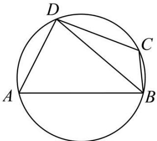

text_image

D
C
A
B

(1) 求观赏小道 BD 的长及种植区域 ABCD 的面积;  
(2) 因地理条件限制, 种植丁香花的边界 BC, CD 不能变更, 而边界 AB, AD 可以调整, 使得种植兰花的面积有所增加, 请在 BAD 上设计一点 P, 使得种植区域改造后的新区域 (四边形 PBCD) 的面积最大, 并求出这个面积的最大值.

1469 (2024·山东青岛·高三青岛三十九中校考期中)在① a=2, ② a=b=2, ③ b=c=2这三个条件中任选一个, 补充在下面问题中, 求△ABC的面积的值(或最大值). 已知△ABC的内角A, B, C所对的边分别为a, b, c, 三边a, b, c与面积S满足关系式: $4S=b^{2}+c^{2}-a^{2}$ , 且\_\_\_\_, 求△ABC的面积的值(或最大值).

1470 (2024·江苏苏州·高三常熟中学校考阶段练习)如图所示,某住宅小区一侧有一块三角形空地 ABO,其中 OA = 3km, OB = 3 $\sqrt{3}$ km, $\angle AOB = 90^{\circ}$ . 物业管理部门拟在中间开挖一个三角形人工湖 OMN,其中 M,N 都在边 AB 上 (M,N 均不与 AB 重合,M 在 A,N 之间),且 $\angle MON = 30^{\circ}$ .

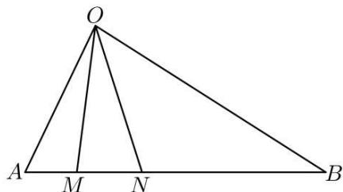

text_image

O
A M N B

(1) 若 M 在距离 A 点 1km 处, 求点 M, N 之间的距离;  
(2) 设 $\angle BON = \theta$ ,

①求出 $\triangle OMN$ 的面积 S 关于 $\theta$ 的表达式；

②为节省投入资金,三角形人工湖 OMN 的面积要尽可能小,试确定 $\theta$ 的值,使 $\triangle OMN$ 得面积最小,并求出这个最小面积.

1471 (2024·全国·高三专题练习)在 $\triangle ABC$ 中， $S_{\triangle ABC} = \frac{\sqrt{3}}{2} \overrightarrow{BA} \cdot \overrightarrow{BC}, BC = 3.$

(1)D 为线段 BC 上一点, 且 CD = 2BD, AD = 1, 求 AC 长度;  
(2) 若 $\triangle ABC$ 为锐角三角形, 求 $\triangle ABC$ 面积的范围.

1472 (2024·河北·高三校联考阶段练习)已知在 $\triangle ABC$ 中, 内角 A, B, C 的对边分别为 a, b, c, 且 $\frac{a\sin B}{b\cos A} = \sqrt{3}$ .

(1) 若 $a = 2\sqrt{5}, b = 2$ ，求 $c$ 的大小；  
(2) 若 b=2，且 C 是钝角，求 $\triangle ABC$ 面积的大小范围.

# 3 题型三:长度问题

1473 (2024·浙江丽水·高三浙江省丽水中学校联考期末)已知锐角 $\triangle ABC$ 内角 A, B, C 的对边分别为 a, b, c. 若 $b\sin B - c\sin C = (b - a)\sin A$ .

(1) 求 C;   
(2) 若 $c = \sqrt{3}$ , 求 $a - b$ 的范围.

1474 (2024·福建莆田·高三校考期中)在 $\triangle ABC$ 中，a, b, c 分别为角 A, B, C 所对的边， $b = 2\sqrt{3}$ ， $(2c - a)\sin C = (b^{2} + c^{2} - a^{2})\frac{\sin B}{b}$

(1) 求角 B ;   
(2) 求 $2a - c$ 的范围.

1475 (2024·重庆江北·高三校考阶段练习)在△ABC中,内角A,B,C所对的边分别a,b,c,
且 $\left(a\cos^{2}\frac{C}{2}+c\cos^{2}\frac{A}{2}\right)(a+c-b)=\frac{3}{2}ac.$

(1) 求角 B 的大小;  
(2) 若 $b = 2\sqrt{3}$ , $c = x (x > 0)$ , 当 $\triangle ABC$ 仅有一解时, 写出 $x$ 的范围, 并求 $a - c$ 的取值范围.

1476 (2024·全国·高三专题练习)已知△ABC的内角A，B，C的对边分别为a，b，c，且满足条件； $a=4,\sin^{2}A+\sin B\sin C=\sin^{2}B+\sin^{2}C.$

(I) 求角 A 的值;  
(II) 求 2b - c 的范围.

1477 (2024·全国·高三专题练习)在 $\Delta ABC$ 中，a,b,c 分别是角 A,B,C 的对边 $(a+b+c)(a+b-c)=3ab$ .

(1) 求角 C 的值;  
(2) 若 c=2，且 $\Delta ABC$ 为锐角三角形，求 2a-b 的范围.

1478 (2024·山西运城·统考模拟预测)△ABC的内角A，B，C的对边分别为a，b，c.

(1) 求证: $\frac{\sin(A-B)}{\sin A+\sin B}=\frac{a-b}{c};$   
(2) 若 $\triangle ABC$ 是锐角三角形, $A - B = \frac{\pi}{3}, a - b = 2$ , 求 c 的范围.

1479 (2024·安徽亳州·高三统考期末)在锐角 $\Delta ABC$ 中, 角 A, B, C 的对边分别为 a, b, c, 已知 $a\sin C = c\cos\left(A - \frac{\pi}{6}\right)$ .

(1) 求角 A 的大小;  
(2) 设 H 为 $\Delta ABC$ 的垂心, 且 AH = 1, 求 BH + CH 的范围.

# 4 题型四:转化为角范围问题

1480 (2024·全国·高三专题练习)在锐角 $\Delta ABC$ 中, 内角 A, B, C 的对边分别为 a, b, c, 且 $(a + b)(\sin A - \sin B) = (c - b)\sin C$ .

(1) 求 A;   
(2) 求 $\cos B - \cos C$ 的取值范围.

1481 (2024·全国·高三专题练习)已知△ABC的内角A、B、C的对边分别为a、b、c，且a-b=c(cosB-cosA).

(1) 判断 $\triangle ABC$ 的形状并给出证明；  
(2) 若 $a \neq b$ , 求 $\sin A + \sin B + \sin C$ 的取值范围.

1482 (2024·河北保定·高一定州一中校考阶段练习)设 $\triangle ABC$ 的内角 A, B, C 的对边分别为 a, b, c，已知 $\frac{1-\sin A}{\cos A} = \frac{1-\cos 2B}{\sin 2B}$ .

(1) 判断 $\triangle ABC$ 的形状 (锐角、直角、钝角三角形), 并给出证明;   
(2) 求 $\frac{4a^{2}+5b^{2}}{c^{2}}$ 的最小值.

1483 (2024·广东佛山·高一大沥高中校考阶段练习)已知△ABC的三个内角A, B, C的对边分别为a, b, c, 且 $\overrightarrow{AB} \cdot \overrightarrow{AC} + \overrightarrow{BA} \cdot \overrightarrow{BC} = 2\overrightarrow{CA} \cdot \overrightarrow{CB}$ ;

(1) 若 $\frac{\cos A}{b} = \frac{\cos B}{a}$ ，判断 $\triangle ABC$ 的形状并说明理由；  
(2) 若 $\triangle ABC$ 是锐角三角形, 求 $\cos C$ 的取值范围.

1484 (2024·全国·高三专题练习)在 $\triangle ABC$ 中, 角 A, B, C 所对的边分别是 $a, b, c$ . 已知 $a = 1, b = \sqrt{2}$ .

(1) 若 $\angle B = \frac{\pi}{4}$ , 求角 $A$ 的大小;  
(2) 求 $\cos A\cos\left(A+\frac{\pi}{6}\right)$ 的取值范围.

1485 (2024·江西吉安·高二江西省峡江中学校考开学考试)在锐角 $\triangle ABC$ 中, 角 A, B, C 所对的边分别是 a, b, c, $b^{2} + c^{2} - a^{2} = 2bc\sin\left(A + \frac{\pi}{6}\right)$ .

(1) 求角 A 的大小;  
(2) 求 $\sin B \cdot \sin C$ 的取值范围.

1486 (2024·全国·高三专题练习)在锐角 $\triangle ABC$ 中, 角 A, B, C 所对的边分别为 a, b, c. 若 $c^{2} + bc - a^{2} = 0$ , 则 $4(\sin C + \cos C)^{2} + \frac{1}{\tan C} - \frac{1}{\tan A}$ 的取值范围为 ()

A. $(4\sqrt{2},9)$

B. $(8,9)$

C. $\left(\frac{8\sqrt{3}}{3}+4,9\right)$

D. $(2\sqrt{3}+4,9)$

# 5 题型五：倍角问题

1487 (2024·浙江绍兴·高一诸暨中学校考期中)在锐角 $\triangle ABC$ 中, 内角 A, B, C 所对的边分别为 $a, b, c$ , 已知 $b + c = 2a\cos B$ .

(1) 证明: A = 2B;   
(2) 若 b=1，求 a 的取值范围；

(3) 若 $\triangle ABC$ 的三边边长为连续的正整数, 求 $\triangle ABC$ 的面积.

1488 (2024·全国·高三专题练习)已知 $\Delta ABC$ 的内角 A, B, C 的对边分别为 a, b, c. 若 A = 2B，且 A 为锐角，则 $\frac{c}{b} + \frac{1}{\cos A}$ 的最小值为（）

A. $2 \sqrt{2} + 1$

B. 3

C. $2 \sqrt{2} + 2$

D. 4

1489 (2024·全国·高三专题练习)锐角 $\triangle ABC$ 的角 A, B, C 所对的边为 $a, b, c$ , A = 2B, 则 $\frac{a}{b}$ 的范围是 \_\_\_\_.

1490 (2024·全国·高三专题练习)在锐角 $\triangle ABC$ 中, 角 A, B, C 的对边分别为 a, b, c, $\triangle ABC$ 的面积为 5, 若 $\sin(A+C)=\frac{2S}{b^{2}-a^{2}}$ , 则 $\tan A$ 的取值范围为 \_\_\_\_.

1491 (2024·全国·高三专题练习)已知△ABC的内角A、B、C的对边分别为a、b、c,若A=2B,则 $\frac{ac+2b^{2}}{ab}$ 的取值范围为\_\_\_\_.

1492 (2024·全国·高三专题练习)在锐角 $\triangle ABC$ 中 A = 2B, B, C 的对边长分别是 b, c，则 $\frac{b}{b+c}$ 的取值范围是 ()

A. $\left(\frac{1}{4},\frac{1}{3}\right)$

B. $\left(\frac{1}{3},\frac{1}{2}\right)$

C. $\left(\frac{1}{2},\frac{2}{3}\right)$

D. $\left(\frac{2}{3},\frac{3}{4}\right)$

1493 (2024·福建三明·高一三明市第二中学校考阶段练习)在锐角 $\triangle ABC$ 中， $\angle A = 2\angle B$ ， $\angle B$ ， $\angle C$ 的对边分别是 b, c，则 $\frac{b+c}{2b}$ 的范围是（）

A. $\left(1,\frac{3}{2}\right)$

B. $\left(1,\frac{4}{3}\right)$

C. $\left(\frac{4}{3},\frac{3}{2}\right)$

D. $\left(\frac{1}{2},2\right)$

1494 (2024·江苏南京·高一金陵中学校考期中)已知 $\triangle ABC$ 的内角 A, B, C 的对边分别为 a, b, C, 若 A = 2B, 则 $\frac{c}{b} + \left(\frac{2b}{a}\right)^{2}$ 的最小值为 ( )

A.-1

B. $\frac{7}{3}$

C. 3

D. $\frac{10}{3}$

# 6 题型六: 角平分线问题

1495 (2024·江苏盐城·高一江苏省射阳中学校考阶段练习)已知△ABC的内角A,B,C的对边分别为a,b,c, $\frac{a}{b}=\frac{\sin B+\sqrt{3}\cos B}{\sin A+\sqrt{3}\cos A}$ 且 $A\neq B$ .

(1) 求角 C 的大小;  
(2) 若角 C 的平分线交 AB 于点 D, 且 $CD = 2\sqrt{3}$ , 求 $a + 2b$ 的最小值.

1496 (2024·江苏淮安·高一统考期中)如图, $\triangle ABC$ 中, $AB = 2AC$ , $\angle BAC$ 的平分线 AD 交 BC 于 D.

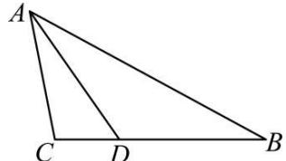

text_image

A
C D B

(1) 若 AD = BC，求 $\angle BAC$ 的余弦值；  
(2) 若 AC = 3，求 AD 的取值范围.

1497 (2024·浙江杭州·高一校联考期中)在① $a + a\cos C = \sqrt{3}c\sin A$ ，② $(a + b + c)(a + b - c) = 3ab$ ，③ $(a - b)\sin(B + C) + b\sin B = c\sin C$ 。这三个条件中任选一个，补充在下面问题中，并解答。

已知在 $\triangle ABC$ 中, 角 A, B, C 的对边分别是 $a, b, c$ , \_\_\_\_.

(1) 求角 C 的值;  
(2) 若角 C 的平分线交 AB 于点 D，且 $CD = 2\sqrt{3}$ ，求 $2a + b$ 的最小值.

1498 (2024·河北沧州·校考模拟预测)已知 $\triangle ABC$ 的内角 A, B, C 所对的边分别为 $a, b, c$ , 且 $a \cos C + (2b + c) \cos A = 0$ , 角 A 的平分线与边 BC 交于点 D.

(1) 求角 A;  
(2) 若 AD = 2，求 $b + 4c$ 的最小值.

1499 (2024·山东泰安·校考模拟预测)在锐角 $\triangle ABC$ 中, 内角 A, B, C 所对的边分别为 a, b, c,

满足 $\frac{\sin A}{\sin C}-1=\frac{\sin^{2}A-\sin^{2}C}{\sin^{2}B}$ , 且 $A\neq C$ .

(1) 求证: B = 2C;   
(2) 已知 BD 是 $\angle ABC$ 的平分线, 若 a=6, 求线段 BD 长度的取值范围.

1500 (2024·全国·高一专题练习)在 $\triangle ABC$ 中, 角 A, B, C 所对的边分别为 a, b, c, 且满足 $2a\sin A\cos B + b\sin 2A = 2\sqrt{3}a\cos C$ .

(1) 求角 C 的大小;  
(2) 若 $c = 2\sqrt{3}$ , $\angle ABC$ 与 $\angle BAC$ 的平分线交于点 I, 求 $\triangle ABI$ 周长的最大值.

1501 (2024·四川成都·石室中学校考模拟预测)在 $\triangle ABC$ 中, 角 A, B, C 所对的边分别为 a, b, c, 且 $\sqrt{3}b\sin\frac{B+C}{2}=a\sin B$ , 边 BC 上有一动点 D.

(1) 当 D 为边 BC 中点时, 若 AD = $\sqrt{3}$ , b = 2, 求 c 的长度;  
(2) 当 AD 为 $\angle BAC$ 的平分线时, 若 a = 4, 求 AD 的最大值.

# 7 题型七: 中线问题

1502 (2024·湖南长沙·高一雅礼中学校考期中)在锐角 $\triangle ABC$ 中, 角 A, B, C 的对边分别是 a, b, c, 若 $\frac{2c-b}{a} = \frac{\cos B}{\cos A}$

(1) 求角 A 的大小;  
(2) 若 a=2，求中线 AD 长的范围 (点 D 是边 BC 中点).

1503 (2024·安徽·合肥一中校联考模拟预测)记 $\triangle ABC$ 的内角 A, B, C 的对边分别是 a, b, c, 已知 $\sin\left(\frac{\pi}{2}+B\right)=\frac{2c-b}{2a}$ .

(1) 求 A;   
(2) 若 $b + c = 3$ ，求 BC 边中线 AM 的取值范围.

1504 (2024·全国·高一专题练习)在锐角三角形ABC中,角A,B,C所对的边分别为a,b,c,已知 $a\sin A+b\sin B=c\sin C+\sqrt{2}b\sin A$ .

(1) 求角 C 的大小;  
(2) 若 c=2，边 AB 的中点为 D，求中线 CD 长的取值范围.

1505 (2024·辽宁沈阳·沈阳二中校考模拟预测)在 $\triangle ABC$ 中, 角 A, B, C 的对边分别是 $a, b$ ,

c, 若 $\frac{2c-b}{a}=\frac{\cos B}{\cos A}$

(1) 求角 A 的大小;  
(2) 若 a=2，求中线 AD 长的最大值 (点 D 是边 BC 中点).

1506 (2024·广东广州·高二广州六中校考期中)在 $\triangle ABC$ 中, 角 A, B, C 所对的边分别为 $a$ , $b$ , $c$ , 已知 $\sqrt{3} a \cos C - a \sin C = \sqrt{3} b$ .

(1) 求角 A 的大小;  
(2) 若 $a = 2$ , 求 BC 边上的中线 AD 长度的最小值.

# 题型八：四心问题

1507 (2024·四川凉山·校联考一模)设△ABO(O是坐标原点)的重心、内心分别是G,I,且 $\overrightarrow{BO} // \overrightarrow{GI}$ ,若B(0,4),则cos∠OAB的最小值是\_\_\_\_.

1508 (2024·全国·高三专题练习)在 $\triangle ABC$ 中，a,b,c 分别为内角 A,B,C 的对边，且 $(a\cos C + c\cos A)\tan A = \sqrt{3}b.$

(1) 求角 A 的大小;  
(2) 若 $a=\sqrt{3}$ ，O 为 $\triangle ABC$ 的内心，求 OB+OC 的最大值.

1509 (2024·全国·模拟预测)已知锐角三角形ABC的内角A,B,C的对边分别为a,b,c,且 $(c-b)\sin C=(a\cos C-b)\sin B+a\cos B\sin C.$

(1) 求角 A;  
(2) 若 H 为 $\triangle ABC$ 的垂心, a = 2, 求 $\triangle HBC$ 面积的最大值.

1510 (2024·江苏无锡·高一锡东高中校考期中)在 $\triangle ABC$ 中，a, b, c 分别是角 A, B, C 的对边， $2a\cos A = b\cos C + c\cos B$ .

(1) 求角 A 的大小;  
(2) 若 $\triangle ABC$ 为锐角三角形, 且其面积为 $\frac{\sqrt{3}}{2}$ , 点 $G$ 为 $\triangle ABC$ 重心, 点 $M$ 为线段 $AC$ 的中点, 点 $N$ 在线段 $AB$ 上, 且 $AN = 2NB$ , 线段 $BM$ 与线段 $CN$ 相交于点 $P$ , 求 $|\overrightarrow{GP}|$ 的取值范围.

1511 (2024·河北邢台·高一统考期末)记 $\triangle ABC$ 的内角 $A, B, C$ 的对边分别为 $a, b, c$ , 已知 $2\sqrt{3} (\cos^2 C - \cos^2 A) = (a - b)\sin B$ , 且 $\triangle ABC$ 外接圆的半径为 $\sqrt{3}$ .

(1) 求 C 的大小;  
(2) 若 G 是 $\triangle ABC$ 的重心, 求 $\triangle ACG$ 面积的最大值.

1512 (2024·辽宁抚顺·高一抚顺一中校考阶段练习)如图,记锐角 $\triangle ABC$ 的内角 A, B, C 的对边分别为 a, b, c, c=2b=4, A 的角平分线交 BC 于点 D, O 为 $\triangle ABC$ 的重心,过 O 作 OP // BC, 交 AD 于点 P, 过 P 作 PE ⊥ AB 于点 E.

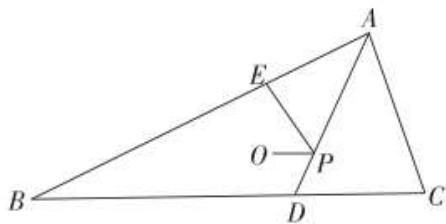

text_image

Geometric diagram of triangle ABC with internal points D, E, O, P and connecting segments

(1) 求 $a$ 的取值范围；  
(2) 若四边形 BDPE 与 $\triangle ABC$ 的面积之比为 $\lambda$ ，求 $\lambda$ 的取值范围.

1513 (2024·浙江·高一路桥中学校联考期中)若 O 是 $\triangle ABC$ 的外心，且 $\frac{\overrightarrow{AC}^{2}}{\overrightarrow{AB}^{2}} \cdot (\overrightarrow{AB} \cdot \overrightarrow{AO}) + \frac{\overrightarrow{AB}^{2}}{\overrightarrow{AC}^{2}} \cdot (\overrightarrow{AC} \cdot \overrightarrow{AO}) = \frac{5}{2} \overrightarrow{AO}^{2}$ ，则 $\sin B + 2\sin C$ 的最大值是（）

A. $\sqrt{3} + \frac{\sqrt{2}}{2}$

B. $\frac{\sqrt{3}}{2} +\sqrt{2}$

C. $\frac{5}{2}$

D. $2 \sqrt{2}$

1514 (2024·全国·高三专题练习)已知O是三角形ABC的外心，若 $\frac{\mathrm{AC}}{\mathrm{AB}}\overrightarrow{\mathrm{AB}}\cdot \overrightarrow{\mathrm{AO}} +\frac{\mathrm{AB}}{\mathrm{AC}}\overrightarrow{\mathrm{AC}}\cdot$ $\overrightarrow{\mathrm{AO}} = m(\overrightarrow{\mathrm{AO}})^2$ ，且 $\sin B + \sin C = \sqrt{3}$ ，则实数 $m$ 的最大值为 （）

A. 6

B. $\frac{6}{5}$

C. $\frac{14}{5}$

D. 3

# 9 题型九：坐标法

1515 (2024·全国·高三专题练习)在 Rt△ABC 中，∠BAC = $\frac{\pi}{2}$ ，AB = AC = 2，点 M 在 △ABC 内部，cos∠AMC = - $\frac{3}{5}$ ，则 MB² - MA² 的最小值为 \_\_\_\_.  
1516 (2024·全国·高一专题练习)在 $\triangle ABC$ 中, AB = 2, AC = 3√2, $\angle BAC = 135^{\circ}$ , M 是 $\triangle ABC$ 所在平面上的动点, 则 $w = \overrightarrow{MA} \cdot \overrightarrow{MB} + \overrightarrow{MB} \cdot \overrightarrow{MC} + \overrightarrow{MC} \cdot \overrightarrow{MA}$ 的最小值为 \_\_\_\_.  
1517 (2024·湖北武汉·高二武汉市第三中学校考阶段练习)在平面直角坐标系 xOy 中, 已知 B, C 为圆 $x^{2} + y^{2} = 9$ 上两点, 点 A(1,1), 且 AB ⊥ AC, 则线段 BC 的长的取值范围是 \_\_\_\_.  
1518 (2024·全国·高三专题练习)在 $\Delta ABC$ 中, $AB = AC = \sqrt{3}$ , 且 $\Delta ABC$ 所在平面内存在一点 P 使得 $PB^{2} + PC^{2} = 3PA^{2} = 3$ , 则 $\Delta ABC$ 面积的最大值为 ( )

A. $\frac{2\sqrt{23}}{3}$

B. $\frac{5\sqrt{23}}{16}$

C. $\frac{\sqrt{35}}{4}$

D. $\frac{3\sqrt{35}}{16}$

1519 (2024·全国·高三专题练习)在等边 $\triangle ABC$ 中，M 为 $\triangle ABC$ 内一动点， $\angle BMC = 120^{\circ}$ ，则 $\frac{MA}{MC}$ 的最小值是（）

A. 1

B. $\frac{3}{4}$

C. $\frac{\sqrt{3}}{2}$

D. $\frac{\sqrt{3}}{3}$

1520 (2024·江西·高三校联考开学考试)费马点是指三角形内到三角形三个顶点距离之和最小的点. 当三角形三个内角均小于 $120^{\circ}$ 时, 费马点与三个顶点连线正好三等分费马点所在的周角, 即该点所对的三角形三边的张角相等且均为 $120^{\circ}$ . 根据以上性质, . 则 $\mathrm{F}(x,y)=\sqrt{(x-2\sqrt{3})^{2}+y^{2}}+\sqrt{(x+1-\sqrt{3})^{2}+(y-1+\sqrt{3})^{2}}+\sqrt{x^{2}+(y-2)^{2}}$ 的最小值为 ( )

A. 4

B. $2 + 2\sqrt{3}$

C. $3 + 2\sqrt{3}$

D. $4 + 2\sqrt{3}$

# 10 题型十：隐圆问题

1521 (2024·全国·高三专题练习)在平面四边形ABCD中,连接对角线BD,已知CD=9,BD=16, $\angle BDC=90^{\circ}$ , $\sin A=\frac{4}{5}$ ,则对角线AC的最大值为()

A. 27

B. 16

C. 10

D. 25

1522 (2024·江苏泰州·高三阶段练习)已知△ABC中, BC = 2, G为△ABC的重心,且满足AG⊥BG,则△ABC的面积的最大值为\_\_\_\_.   
1523 (2024·湖北武汉·高二武汉市洪山高级中学校考开学考试)已知等边△ABC的边长为2，点G是△ABC内的一点，且 $\overrightarrow{AG}+\overrightarrow{BG}+\overrightarrow{CG}=\overrightarrow{0}$ ，点P在△ABC所在的平面内且满足 $|\overrightarrow{PG}|=1$ ，则 $|\overrightarrow{PA}|$ 的最大值为\_\_\_\_.  
1524 (2024·全国·高三专题练习)在平面四边形ABCD中， $\angle BAD=90^{\circ}$ ， $AB=2$ ， $AD=1$ 。若 $\overrightarrow{AB} \cdot \overrightarrow{AC} + \overrightarrow{BA} \cdot \overrightarrow{BC} = \frac{4}{3}\overrightarrow{CA} \cdot \overrightarrow{CB}$ ，则 $CB + \frac{1}{2}CD$ 的最小值为\_\_\_\_。  
1525 (2024·全国·高三专题练习)若 $\triangle ABC$ 满足条件 AB = 4, AC = $\sqrt{2}BC$ , 则 $\triangle ABC$ 面积的最大值为 \_\_\_\_.   
1526 (2024·江苏·高三专题练习)在 $\triangle ABC$ 中, BC 为定长, $\left|\overrightarrow{AB} + 2\overrightarrow{AC}\right| = 3\left|\overrightarrow{BC}\right|$ , 若 $\triangle ABC$ 的面积的最大值为 2, 则边 BC 的长为 \_\_\_\_.  
1527 (2024·全国·高三专题练习)△ABC中 AB = AC = 2, △ABC 所在平面内存在点 P 使得 PB² + PC² = 4, PA² = 1, 则 △ABC 的面积最大值为 \_\_\_\_.  
1528 (2024·全国·高三专题练习)已知 $\Delta ABC$ 中, $AB = AC = \sqrt{3}$ , $\Delta ABC$ 所在平面内存在点 P 使得 $PB^{2} + PC^{2} = 3PA^{2} = 3$ , 则 $\Delta ABC$ 面积的最大值为 \_\_\_\_.

# 11 题型十一:两边夹问题

1529 (2024·全国·高三专题练习)在 $\triangle ABC$ 中, 若 $\frac{\cos A}{\sin B} + \frac{\cos B}{\sin A} = 2, A, B \in \left(0, \frac{\pi}{2}\right)$ , 且 $\triangle ABC$ 的周长为 12.

(1) 求证: $\triangle ABC$ 为直角三角形;  
(2) 求 $\triangle ABC$ 面积的最大值.

1530 (2024·全国·高三专题练习)设 $\Delta ABC$ 的内角 A, B, C 的对边长 a, b, c 成等比数列， $\cos(A-C)-\cos B=\frac{1}{2}$ ，延长 BC 至 D，若 BD=2，则 $\Delta ACD$ 面积的最大值为 \_\_\_\_.

1531 (2024·全国·高三专题练习)设 $\Delta ABC$ 的内角 A, B, C 的对边为 a, b, c. 已知 a, b, c 依次成等比数列，且 $\cos(A-C)-\cos B=\frac{1}{2}$ ，延长边 BC 到 D，若 BD=4，则 $\Delta ACD$ 面积的最大值为 \_\_\_\_.

# 12 题型十二:与正切有关的最值问题

1532 (2024·全国·高一专题练习)在锐角三角形ABC中,角A、B、C的对边分别为a、b、c,且满足 $b^{2}-a^{2}=ac$ ,则 $\frac{1}{\tan A}-\frac{1}{\tan B}$ 的取值范围为\_\_\_\_.  
1533 (2024·全国·高一阶段练习)在 $\triangle ABC$ 中, 内角 A, B, C 所对的边分别为 a, b, c, 且 $b\sin\frac{B+C}{2}=a\sin B.$

(1) 求 A 角的值;

(2) 若 $\triangle ABC$ 为锐角三角形, 利用 (1) 所求的 A 角值求 $\frac{a - c}{b}$ 的取值范围.

1534 (2024·全国·高三专题练习)在 $\triangle ABC$ 中, 内角 A, B, C 所对的边分别为 $a, b, c$ , 且

$b\sin\frac{B+C}{2}=a\sin B.$ 求:

(1)A;   
(2) $\frac{a-c}{b}$ 的取值范围.

1535 (2024·全国·高三专题练习)锐角 $\triangle ABC$ 是单位圆的内接三角形, 角 A, B, C 的对边分别为 a, b, c, 且 $a^{2} + b^{2} - c^{2} = 4a^{2}\cos A - 2ac\cos B$ , 则 $\frac{ac}{b}$ 的取值范围是 ( )

A. $(2\sqrt{3}, 3\sqrt{3})$

B. $(\sqrt{3}, 3\sqrt{3})$

C. $\left(\frac{\sqrt{3}}{2},2\sqrt{3}\right)$

D. $\left(\frac{\sqrt{3}}{2},\sqrt{3}\right)$

1536 (2024·安徽合肥·高一合肥市第七中学校考期中)在锐角 $\triangle ABC$ 中, 角 A, B, C 的对边分别为 a, b, c, S 为 $\triangle ABC$ 的面积, 且 $2S = a^{2} - (b - c)^{2}$ , 则 $\frac{b}{c}$ 的取值范围为 ( )

A. $\left(\frac{1}{2},2\right)$

B. $\left(\frac{2}{3},\frac{3}{2}\right)$

C. $\left(\frac{3}{4},\frac{4}{3}\right)$

D. $\left(\frac{3}{5},\frac{5}{3}\right)$

1537 (2024·全国·高三专题练习)在锐角 $\triangle ABC$ 中, 角 A、B、C 所对的边分别为 a, b, c, 若 $a^{2} - c^{2} = bc$ , 则 $\frac{1}{\tan C} - \frac{1}{\tan A} + 3 \sin A$ 的取值范围为 ()

A. $(2\sqrt{3}, + \infty)$

B. $(2\sqrt{3},4)$

C. $\left(\frac{13\sqrt{3}}{6},4\right)$

D. $\left(2\sqrt{3},\frac{13\sqrt{3}}{6}\right)$

# 13 题型十三:最大角问题

1538 (2024·全国·高三专题练习)几何学史上有一个著名的米勒问题:“设点M, N是锐角∠AQB的一边QA上的两点,试在QB边上找一点P,使得∠MPN最大.”如图,其结论是:点P为过M,N两点且和射线QB相切的圆与射线QB的切点.根据以上结论解决以下问题:在平面直角坐标系xOy中,给定两点M(-1,2),N(1,4),点P在x轴上移动,当∠MPN取最大值时,点P的横坐标是()

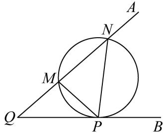

text_image

A
N
M
Q
P
B

A. 1

B.-7

C. 1 或 -7

D. 2 或 -7

1539 (2024·全国·高三专题练习)设 $\triangle ABC$ 中, 内角 A, B, C 所对的边分别为 a, b, c, 且 $a\cos B - b\cos A = \frac{3}{5}c$ , 则 $\tan(A - B)$ 的最大值为 ()

A. $\frac{3}{5}$

B. $\frac{1}{3}$

C. $\frac{3}{8}$

D. $\frac{3}{4}$

1540 (2024·江西上饶·高三上饶中学校考期中)在 $\triangle ABC$ 中, 内角 A, B, C 所对的边分别为 $a, b, c$ , 且 $a\cos B - b\cos A = \frac{1}{2} c$ , 当 $\tan(A - B)$ 取最大值时, 角 C 的值为

A. $\frac{\pi}{2}$

B. $\frac{\pi}{6}$

C. $\frac{\pi}{3}$

D. $\frac{\pi}{4}$

1541 (2024·河南信阳·高一信阳高中校考阶段练习)最大视角问题是1471年德国数学家米勒提出的几何极值问题,故最大视角问题一般称为“米勒问题”. 如图,树顶 A 离地面 12 米,树上另一点 B 离地面 8 米,若在离地面 2 米的 C 处看此树,则 $\tan \angle ACB$ 的最大值为 ( )

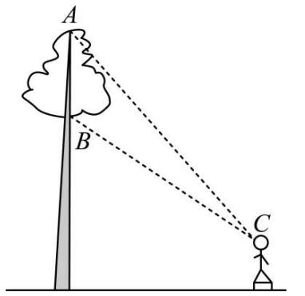

text_image

A
B
C

A. $\frac{\sqrt{5}}{5}$

B. $\frac{\sqrt{10}}{10}$

C. $\frac{\sqrt{15}}{15}$

D. $\frac{\sqrt{20}}{20}$

1542 (2024·江苏扬州·高一统考期中)如图: 已知树顶 A 离地面 $\frac{21}{2}$ 米, 树上另一点 B 离地面 $\frac{11}{2}$ 米, 某人在离地面 $\frac{3}{2}$ 米的 C 处看此树, 则该人离此树()米时, 看 A、B 的视角最大.

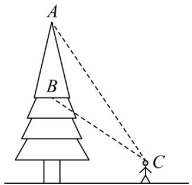

text_image

A
B
C

A. 4

B. 5

C. 6

D. 7

# 14 题型十四: 费马点、布洛卡点、拿破仑三角形问题

1543 (2024·重庆沙坪坝·高一重庆南开中学校考阶段练习) $\triangle ABC$ 内一点 $O$ , 满足 $\angle OAC = \angle OBA = \angle OCB$ , 则点 $O$ 称为三角形的布洛卡点。王聪同学对布洛卡点产生兴趣, 对其进行探索得到许多正确结论, 比如 $\angle BOC = \pi - \angle ABC = \angle BAC + \angle ACB$ , 请你和他一起解决如下问题:

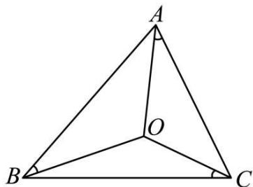

text_image

A
O
B
C

(1) 若 $a, b, c$ 分别是 A, B, C 的对边, $\angle \mathrm{CAO} = \angle \mathrm{BAO} = \angle \mathrm{OBA} = \angle \mathrm{OCB}$ , 证明: $a^2 = bc$ ;  
(2) 在 (1) 的条件下, 若 $\triangle ABC$ 的周长为 4 , 试把 $\overrightarrow{AB} \cdot \overrightarrow{AC}$ 表示为 $a$ 的函数 $f(a)$ , 并求 $\overrightarrow{AB} \cdot \overrightarrow{AC}$ 的取值范围.

1544 (2024·浙江宁波·高一慈溪中学校联考期末)十七世纪法国数学家皮埃尔·德·费马提出的一个著名的几何问题:“已知一个三角形,求作一点,使其与这个三角形的三个顶点的距离之和最小”.它的答案是:当三角形的三个角均小于 $120^{\circ}$ 时,所求的点为三角形的正等角中心,即该点与三角形的三个顶点的连线两两成角 $120^{\circ}$ ;当三角形有一内角大于或等于 $120^{\circ}$ 时,所求点为三角形最大内角的顶点.在费马问题中所求的点称为费马点,已知在△ABC中,已知 $C=\frac{2}{3}\pi$ ,AC=1,BC=2,且点M在AB线段上,且满足CM=BM,若点P为△AMC的费马点,则 $\overrightarrow{PA}\cdot\overrightarrow{PM}+\overrightarrow{PM}\cdot\overrightarrow{PC}+\overrightarrow{PA}\cdot\overrightarrow{PC}=$

A.-1

B. $-\frac{4}{5}$

C. $-\frac{3}{5}$

D. $-\frac{2}{5}$

1545 (2024·全国·高三专题练习)点 P 在 $\triangle ABC$ 所在平面内一点, 当 PA + PB + PC 取到最小值时, 则称该点为 $\triangle ABC$ 的“费马点”. 当 $\triangle ABC$ 的三个内角均小于 $120^{\circ}$ 时, 费马点满足如下特征: $\angle APB = \angle BPC = \angle CPA = 120^{\circ}$ . 如图, 在 $\triangle ABC$ 中, AB = AC = $\sqrt{7}$ , BC = $\sqrt{3}$ , 则其费马点到 A, B, C 三点的距离之和为 ( )

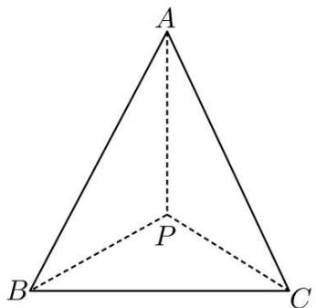

text_image

A
P
B
C

A. 4

B. 2

C. $2 - 2\sqrt{3}$

D. $2 + \sqrt{3}$

1546 (2024·湖南邵阳·统考三模)拿破仑·波拿巴最早提出了一个几何定理:“以任意三角形的三条边为边,向外构造三个等边三角形,则这三个等边三角形的外接圆圆心恰为另一个等边三角形(此等边三角形称为拿破仑三角形)的顶点”.在 $\triangle ABC$ 中,已知 $\angle ACB=30^{\circ}$ ,且 $AC=\sqrt{3}$ ,BC=3,现以BC,AC,AB为边向外作三个等边三角形,其外接圆圆心依次记为A',B',C',则 $\triangle A'B'C'$ 的边长为()

A. 3

B. 2

C. $\sqrt{3}$

D. $\sqrt{2}$

1547 (2024·河南·高一校联考期末)几何定理:以任意三角形的三条边为边,向外构造三个等边三角形,则这三个等边三角形的外接圆圆心恰为另一个等边三角形(称为拿破仑三角形)的顶点.在 $\triangle ABC$ 中,已知 $C=\frac{\pi}{6}$ , $AC=\sqrt{3}$ ,外接圆的半径为 $\sqrt{3}$ ,现以其三边向外作三个等边三角形,其外接圆圆心依次记为 $A',B',C'$ ,则 $\triangle A'B'C'$ 的面积为()

A. 3

B. 2

C. $\sqrt{3}$

D. $\sqrt{2}$

# 15 题型十五:托勒密定理及旋转相似

1548 (2024·江苏淮安·高一校联考期中)托勒密是古希腊天文学家、地理学家、数学家,托勒密定理就是由其名字命名,该定理原文:圆的内接四边形中,两对角线所包矩形的面积等于一组对边所包矩形的面积与另一组对边所包矩形的面积之和.其意思为:圆的内接凸四边形两对对边乘积的和等于两条对角线的乘积.从这个定理可以推出正弦、余弦的和差公式及一系列的三角恒等式,托勒密定理实质上是关于共圆性的基本性质.已知四边形

ABCD 的四个顶点在同一个圆的圆周上，AC、BD 是其两条对角线， $BD = 4\sqrt{3}$ ，且 $\triangle ACD$ 为正三角形，则四边形 ABCD 的面积为（）

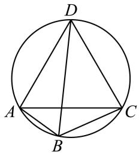

text_image

D
A
B
C

A. $16 \sqrt{3}$

B. 16

C. $12 \sqrt{3}$

D. 12

1549 (2024·全国·高三专题练习)托勒密是古希腊天文学家、地理学家、数学家,托勒密定理就是由其名字命名,该定理原文:圆的内接四边形中,两对角线所包矩形的面积等于一组对边所包矩形的面积与另一组对边所包矩形的面积之和.其意思为:圆的内接凸四边形两对对边乘积的和等于两条对角线的乘积.从这个定理可以推出正弦、余弦的和差公式及一系列的三角恒等式,托勒密定理实质上是关于共圆性的基本性质.已知四边形ABCD的四个顶点在同一个圆的圆周上,AC、BD是其两条对角线,BD=4√2,且△ACD为正三角形,则四边形ABCD的面积为()

A. 8

B. 16

C. $8 \sqrt{3}$

D. $16 \sqrt{3}$

1550 (2024·全国·高三专题练习)克罗狄斯·托勒密是古希腊著名数学家、天文学家和地理学家,他在所著的《天文集》中讲述了制作弦表的原理,其中涉及如下定理:任意凸四边形中,两条对角线的乘积小于或等于两组对边乘积之和,当且仅当凸四边形的对角互补时取等号,后人称之为托勒密定理的推论.如图,四边形ABCD内接于半径为 $2\sqrt{3}$ 的圆, $\angle A=120^{\circ},\angle B=45^{\circ},AB=AD$ ,则四边形ABCD的周长为()

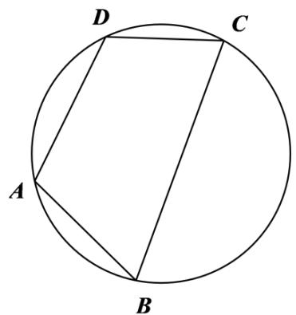

text_image

D
C
A
B

A. $4 \sqrt{3} + 6 \sqrt{2}$

B. $10 \sqrt{3}$

C. $4\sqrt{3} + 4\sqrt{2}$

D. $4 \sqrt{3} + 5 \sqrt{2}$

1551 (2024·江苏·高一专题练习)凸四边形就是没有角度数大于 $180^{\circ}$ 的四边形, 把四边形任何一边向两方延长, 其他各边都在延长所得直线的同一旁, 这样的四边形叫做凸四边形, 如图, 在凸四边形ABCD中, $\mathrm{AB} = 1$ , $\mathrm{BC} = \sqrt{3}$ , $\mathrm{AC} \perp \mathrm{CD}$ , $\mathrm{AD} = 2\mathrm{AC}$ , 当 $\angle ABC$ 变化时, 对角线BD的最大值为

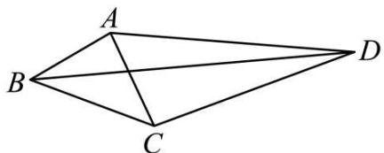

natural_image

Geometric diagram of a quadrilateral ABCD with diagonals AC and BD, no text or labels present

A. 4

B. $\sqrt{13}$

C. $3 \sqrt{3}$

D. $\sqrt{7+2\sqrt{3}}$

1552 (2024·江苏无锡·高一江苏省江阴市第一中学校考阶段练习)在 $\triangle ABC$ 中， $BC = \sqrt{2}$ ，AC = 1，以 AB 为边作等腰直角三角形 ABD(B 为直角顶点，C, D 两点在直线 AB 的两侧). 当角 C 变化时，线段 CD 长度的最大值是（）

A. 3

B. 4

C. 5

D. 9

1553 (2024·全国·高一专题练习)在 $\triangle ABC$ 中, $BC = \sqrt{2}$ , AC = 1, 以 AB 为边作等腰直角三角形 ABD(B 为直角顶点, C、D 两点在直线 AB 的两侧). 当 $\angle C$ 变化时, 线段 CD 长的最大值为 ()

A. 1

B. 2

C. 3

D. 4

1554 (2024·全国·高三专题练习)如图所示,在平面四边形ABCD中, AB=1, BC=2, △ACD为正三角形,则△BCD面积的最大值为()

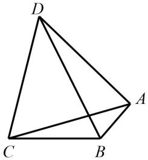

natural_image

Geometric diagram of a tetrahedron with vertices labeled A, B, C, D (no text or symbols beyond labels)

A. $2 \sqrt{3} + 2$

B. $\frac{\sqrt{3}+1}{2}$

C. $\frac{\sqrt{3}}{2}+2$

D. $\sqrt{3} + 1$

# 16 题型十六:三角形中的平方问题

1555 (2024·全国·高三专题练习)已知 $\triangle ABC$ 的三边分别为 a, b, c，若满足 $a^{2} + b^{2} + 2c^{2} = 8$ ，则 $\triangle ABC$ 面积的最大值为（）

A. $\frac{\sqrt{5}}{5}$

B. $\frac{2\sqrt{5}}{5}$

C. $\frac{3\sqrt{5}}{5}$

D. $\frac{\sqrt{5}}{3}$

1556 (2024·全国·高三专题练习)在 $\triangle ABC$ 中, 角 A, B, C 所对的边分别为 a, b, c, 且满足 $5a^{2} + 3b^{2} = 3c^{2}$ , 则 $\sin A$ 的取值范围是 \_\_\_\_.

1557 (2024·湖南常德·常德市一中校考模拟预测)秦九韶是我国南宋著名数学家,在他的著作《数书九章》中有已知三边求三角形面积的方法:“以小斜幂并大斜幂减中斜幂,余半之,自乘于上以小斜幂乘大斜幂减上,余四约之,为实一为从阳,开平方得积.”如果把以上这段文字写成公式就是 $S=\sqrt{\frac{1}{4}\left[a^{2}c^{2}-\left(\frac{a^{2}+c^{2}-b^{2}}{2}\right)^{2}\right]}$ ,其中a,b,c是△ABC的内角A,B,C的对边,若 $\sin C=2\sin A\cos B$ ,且 $b^{2}+c^{2}=4$ ,则△ABC面积S的最大值为()

A. $\frac{\sqrt{5}}{5}$

B. $\frac{2\sqrt{5}}{5}$

C. $\frac{3\sqrt{5}}{5}$

D. $\frac{4\sqrt{5}}{5}$

1558 (2024·河南洛阳·高三校考阶段练习)△ABC的内角A，B，C的对边分别为a，b，c，若 $a^{2}+b^{2}+c^{2}=12$ ， $A=\frac{2\pi}{3}$ ，则△ABC面积的最大值为()

A. $\frac{2\sqrt{3}}{5}$

B. $\frac{3\sqrt{3}}{5}$

C. $\frac{4\sqrt{3}}{5}$

D. $\sqrt{3}$

1559 (2024·云南·统考一模)已知 $\triangle ABC$ 的三个内角分别为 A、B、C. 若 $\sin^{2}C = 2\sin^{2}A - 3\sin^{2}B$ ，则 tanB 的最大值为 ()

A. $\frac{\sqrt{5}}{3}$

B. $\frac{\sqrt{5}}{2}$

C. $\frac{11\sqrt{5}}{20}$

D. $\frac{3\sqrt{5}}{5}$

1560 (2024·四川遂宁·高一射洪中学校考阶段练习)设 $\triangle ABC$ 的内角 A, B, C 所对的边 a, b, c 满足 $b^{2}=ac$ , 则 $\frac{\sin A+\cos A\tan C}{\sin B+\cos B\tan C}$ 的取值范围 ()

A. $\left(\frac{\sqrt{5}-1}{2},\frac{\sqrt{5}+1}{2}\right)$

B. $\left(\frac{3-\sqrt{5}}{2},\frac{3+\sqrt{5}}{2}\right)$

C. $\left(\frac{\sqrt{5}-1}{2},\frac{\sqrt{5}+3}{2}\right)$

D. $\left(\frac{3-\sqrt{5}}{2},\frac{1+\sqrt{5}}{2}\right)$

1561 (2024·全国·高三专题练习)在锐角三角形 ABC 中, 已知 $2\sin^{2}A + \sin^{2}B = 2\sin^{2}C$ , 则 $\frac{1}{\tan A} + \frac{1}{\tan B} + \frac{1}{\tan C}$ 的最小值为 ()

A. $2 \sqrt{13}$

B. $\sqrt{13}$

C. $\frac{\sqrt{13}}{2}$

D. $\frac{\sqrt{13}}{4}$

# 17 题型十七:等面积法、张角定理

1562 (2024·全国·高三专题练习)已知△ABC的内角A,B,C对应的边分别是a,b,c，内角A的角平分线交边BC于D点，且AD=4．若 $(2b+c)\cos A+a\cos C=0$ ，则△ABC面积的最小值是()

A. 16

B. $16 \sqrt{3}$

C. 64

D. $64 \sqrt{3}$

1563 (2024·湖北武汉·高一校联考期中)已知 $\triangle ABC$ 的面积为 S, $\angle BAC = 2\alpha$ , AD 是 $\triangle ABC$ 的角平分线, 则 AD 长度的最大值为 ()

A. $\sqrt{\mathrm{S}\cdot\sin\alpha}$

B. $\sqrt{\frac{S}{\sin\alpha}}$

C. $\sqrt{\mathrm{S}\cdot\tan\alpha}$

D. $\sqrt{\frac{S}{\tan\alpha}}$

1564 (2024·上海宝山·高三上海市吴淞中学校考期中)给定平面上四点 O,A,B,C 满足 OA = 4, OB = 3, OC = 2, $\overrightarrow{OB} \cdot \overrightarrow{OC} = 3$ , 则 $\Delta ABC$ 面积的最大值为 \_\_\_\_.

1565 (2024·安徽·高一安徽省太和中学校联考阶段练习)在 $\triangle ABC$ 中, $\angle BAC = \frac{\pi}{3}$ , AM 是 $\angle BAC$ 的角平分线, 且交 BC 于点 M. 若 $\triangle ABC$ 的面积为 $\sqrt{3}$ , 则 AM 的最大值为 \_\_\_\_.

1566 (2024·江西新余·高一新余市第一中学校考阶段练习)已知△ABC的内角A,B,C对应的边分别是a,b,c,内角A的角平分线交边BC于D点,且AD=4.若 $(2b+c)\cos A+a\cos C=0$ ,则△ABC面积的最小值是\_\_\_\_.

1567 (2024·江西九江·高一德安县第一中学校考期中)△ABC中, ∠ABC的角平分线BD交AC于D点, 若BD=1且∠ABC= $\frac{2\pi}{3}$ , 则S△ABC面积的最小值为 \_\_\_\_.

1568 (2024·湖北武汉·高一华中科技大学附属中学校联考期中)已知△ABC中,角A、B、C所对的边分别为a、b、c,∠ABC= $\frac{\pi}{3}$ ,∠ABC的角平分线交AC于点D,且BD= $\sqrt{3}$ ,则a+c的最小值为\_\_\_\_.

1569 (2024·全国·高一专题练习)已知△ABC,内角A,B,C所对的边分别是a,b,c,c=1,∠C

的角平分线交 AB 于点 D．若 $\sin A + \sin B = 2\sin\angle ACB$ ，则 CD 的取值范围是 \_\_\_\_.

1570 (2024·贵州贵阳·高三贵阳一中校考阶段练习)已知 $\triangle ABC, \angle BAC = 120^{\circ}, D$ 为 BC 上一点，且 AD 为 $\angle BAC$ 的角平分线，则 $\frac{AB + 9AC}{AD}$ 的最小值为 \_\_\_\_.

