# 第35讲 平面向量的概念与坐标运算

# 知识梳理

# 知识点一．向量的有关概念

(1) 定义: 既有大小又有方向的量叫做向量, 向量的大小叫做向量的长度 (或模).  
(2) 向量的模: 向量 $\overrightarrow{AB}$ 的大小, 也就是向量 $\overrightarrow{AB}$ 的长度, 记作 $|\overrightarrow{AB}|$ .

(3) 特殊向量:

①零向量:长度为0的向量,其方向是任意的.  
②单位向量:长度等于1个单位的向量.

③平行向量:方向相同或相反的非零向量. 平行向量又叫共线向量. 规定: $\vec{0}$ 与任一向量平行.

④相等向量:长度相等且方向相同的向量.

⑤相反向量:长度相等且方向相反的向量.

# 知识点二．向量的线性运算和向量共线定理

# (1) 向量的线性运算

<table><tr><td>运算</td><td>定义</td><td>法则(或几何意义)</td><td>运算律</td></tr><tr><td>加法</td><td>求两个向量和的运算</td><td>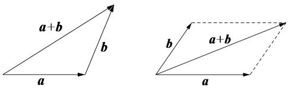三角形法则平行四边形法则</td><td>1交换律 $\vec{a} + \vec{b} = \vec{b} + \vec{a}$ 2结合律 $(\vec{a} + \vec{b}) + \vec{c} = \vec{a} + (\vec{b} + \vec{c})$ </td></tr><tr><td>减法</td><td>求 $\vec{a}$ 与 $\vec{b}$ 的相反向量 $-\vec{b}$ 的和的运算叫做 $\vec{a}$ 与 $\vec{b}$ 的差</td><td>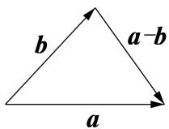三角形法则</td><td> $\vec{a} - \vec{b} = \vec{a} + (-\vec{b})$ </td></tr><tr><td>数乘</td><td>求实数 $\lambda$ 与向量 $\vec{a}$ 的积的运算</td><td>(1) $|\lambda\vec{a}| = |\lambda||\vec{a}|$ (2)当 $\lambda >0$ 时, $\lambda\vec{a}$ 与 $\vec{a}$ 的方向相同;当 $\lambda < 0$ 时, $\lambda\vec{a}$ 与 $\vec{a}$ 的方向相同;当 $\lambda = 0$ 时, $\lambda\vec{a} = 0$ </td><td> $\lambda(\mu\vec{a}) = (\lambda\mu)\vec{a}$  $(\lambda + \mu)\vec{a} = \lambda\vec{a} + \mu\vec{a}$  $\lambda(\vec{a} + \vec{b}) = \lambda\vec{a} + \lambda\vec{b}$ </td></tr></table>

# 【注意】

(1) 向量表达式中的零向量写成 $\vec{0}$ ，而不能写成 0.  
(2) 两个向量共线要区别与两条直线共线, 两个向量共线满足的条件是: 两个向量所在直线平行或重合, 而在直线中, 两条直线重合与平行是两种不同的关系.  
(3) 要注意三角形法则和平行四边形法则适用的条件, 运用平行四边形法则时两个向量的起点必须重合, 和向量与差向量分别是平行四边形的两条对角线所对应的向量; 运用三角

形法则时两个向量必须首尾相接,否则就要把向量进行平移,使之符合条件.

(4) 向量加法和减法几何运算应该更广泛、灵活如： $\overrightarrow{OA}-\overrightarrow{OB}=\overrightarrow{BA},\overrightarrow{AM}-\overrightarrow{AN}=\overrightarrow{NM},\overrightarrow{OA}=O B+\overrightarrow{CA}\Leftrightarrow\overrightarrow{OA}-\overrightarrow{OB}=\overrightarrow{CA}\Leftrightarrow\overrightarrow{BA}-\overrightarrow{CA}=\overrightarrow{BA}+\overrightarrow{AC}=\overrightarrow{BC}.$

# 知识点三．平面向量基本定理和性质

# 1、共线向量基本定理

如果 $\vec{a} = \lambda \vec{b} (\lambda \in \mathbb{R})$ ，则 $\vec{a} // \vec{b}$ ；反之，如果 $\vec{a} // \vec{b}$ 且 $\vec{b} \neq \vec{0}$ ，则一定存在唯一的实数 $\lambda$ ，使 $\vec{a} = \lambda \vec{b}$ （口诀：数乘即得平行，平行必有数乘）.

# 2、平面向量基本定理

如果 $\vec{\mathbf{e}}_1$ 和 $\vec{\mathbf{e}}_2$ 是同一个平面内的两个不共线向量，那么对于该平面内的任一向量 $\vec{a}$ ，都存在唯一的一对实数 $\lambda_1, \lambda_2$ ，使得 $\vec{a} = \lambda_1\vec{\mathbf{e}}_1 + \lambda_2\vec{\mathbf{e}}_2$ ，我们把不共线向量 $\vec{\mathbf{e}}_1, \vec{\mathbf{e}}_2$ 叫做表示这一平面内所有向量的一组基底，记为 $\{\vec{\mathbf{e}}_1, \vec{\mathbf{e}}_2\}, \lambda_1\vec{\mathbf{e}}_1 + \lambda_2\vec{\mathbf{e}}_2$ 叫做向量 $\vec{a}$ 关于基底 $\{\vec{\mathbf{e}}_1, \vec{\mathbf{e}}_2\}$ 的分解式。

注意:由平面向量基本定理可知:只要向量 $\vec{e}_{1}$ 与 $\vec{e}_{2}$ 不共线,平面内的任一向量 $\vec{a}$ 都可以分解成形如 $\vec{a}=\lambda_{1}\vec{e}_{1}+\lambda_{2}\vec{e}_{2}$ 的形式,并且这样的分解是唯一的. $\lambda_{1}\vec{e}_{1}+\lambda_{2}\vec{e}_{2}$ 叫做 $\vec{e}_{1},\vec{e}_{2}$ 的一个线性组合.平面向量基本定理又叫平面向量分解定理,是平面向量正交分解的理论依据,也是向量的坐标表示的基础.

推论1: 若 $\vec{a} = \lambda_{1}\vec{e}_{1} + \lambda_{2}\vec{e}_{2} = \lambda_{3}\vec{e}_{1} + \lambda_{4}\vec{e}_{2}$ ，则 $\lambda_{1} = \lambda_{3}, \lambda_{2} = \lambda_{4}$ .

推论2:若 $\vec{a}=\lambda_{1}\vec{e}_{1}+\lambda_{2}\vec{e}_{2}=\vec{0}$ ，则 $\lambda_{1}=\lambda_{2}=0$ .

# 3、线段定比分点的向量表达式

如图所示，在 $\triangle ABC$ 中，若点 $D$ 是边 $BC$ 上的点，且 $\overrightarrow{BD} = \lambda \overrightarrow{DC} (\lambda \neq -1)$ ，则向量 $\overrightarrow{AD} = \frac{\overrightarrow{AB} + \lambda\overrightarrow{AC}}{1 + \lambda}$ 。在向量线性表示(运算)有关的问题中，若能熟练利用此结论，往往能有“化腐朽为神奇”之功效，建议熟练掌握。

# 4、三点共线定理

平面内三点 A, B, C 共线的充要条件是: 存在实数 $\lambda, \mu$ , 使 $\overrightarrow{OC} = \lambda \overrightarrow{OA} + \mu \overrightarrow{OB}$ , 其中 $\lambda + \mu = 1$ , O 为平面内一点. 此定理在向量问题中经常用到, 应熟练掌握.

A、B、C三点共线

$\Leftrightarrow$ 存在唯一的实数 $\lambda$ ，使得 $\overrightarrow{AC} = \lambda \overrightarrow{AB}$ ;  
$\Leftrightarrow$ 存在唯一的实数 $\lambda$ ，使得 $\overrightarrow{\mathrm{OC}} = \overrightarrow{\mathrm{OA}} +\lambda \overrightarrow{\mathrm{AB}};$   
$\Leftrightarrow$ 存在唯一的实数 $\lambda$ ，使得 $\overrightarrow{\mathrm{OC}} = (1 - \lambda)\overrightarrow{\mathrm{OA}} +\lambda \overrightarrow{\mathrm{OB}};$   
$\Leftrightarrow$ 存在 $\lambda +\mu = 1$ ，使得 $\overrightarrow{\mathrm{OC}} = \lambda \overrightarrow{\mathrm{OA}} +\mu \overrightarrow{\mathrm{OB}}.$

# 5、中线向量定理

如图所示, 在 $\triangle ABC$ 中, 若点 D 是边 BC 的中点, 则中线向量 $\overrightarrow{AD} = \frac{1}{2} (\overrightarrow{AB} + \overrightarrow{AC})$ , 反之亦正确.

# 知识点四．平面向量的坐标表示及坐标运算

# (1) 平面向量的坐标表示.

在平面直角坐标中，分别取与 $x$ 轴， $y$ 轴正半轴方向相同的两个单位向量 $\vec{i}, \vec{j}$ 作为基底，那么由平面向量基本定理可知，对于平面内的一个向量 $\vec{a}$ ，有且只有一对实数 $x, y$ 使 $\vec{a} = x\vec{i} + y\vec{j}$ ，我们把有序实数对 $(x, y)$ 叫做向量 $\vec{a}$ 的坐标，记作 $\vec{a} = (x, y)$ .

(2) 向量的坐标表示和以坐标原点为起点的向量是一一对应的, 即有

向量 $(x,y)\xlongequal{\text{一一对应}}$ 向量 $\overrightarrow{OA}\xlongequal{\text{一一对应}}$ 点 $A(x,y)$ .

(3) 设 $\vec{a} = (x_{1}, y_{1})$ , $\vec{b} = (x_{2}, y_{2})$ , 则 $\vec{a} + \vec{b} = (x_{1} + x_{2}, y_{1} + y_{2})$ , $\vec{a} - \vec{b} = (x_{1} - x_{2}, y_{1} - y_{2})$ , 即两个向量的和与差的坐标分别等于这两个向量相应坐标的和与差.

若 $\vec{a} = (x,y)$ , $\lambda$ 为实数, 则 $\lambda \vec{a} = (\lambda x, \lambda y)$ , 即实数与向量的积的坐标, 等于用该实数乘原来向量的相应坐标.

(4) 设 $\mathrm{A}(x_1, y_1)$ , $\mathrm{B}(x_2, y_2)$ , 则 $\overrightarrow{\mathrm{AB}} = \overrightarrow{\mathrm{OB}} - \overrightarrow{\mathrm{OA}} = (x_1 - x_2, y_1 - y_2)$ , 即一个向量的坐标等于该向量的有向线段的终点的坐标减去始点坐标.

知识点五．平面向量的直角坐标运算

①已知点 $\mathrm{A}(x_1,y_1),\mathrm{B}(x_2,y_2)$ ，则 $\overrightarrow{\mathrm{AB}} = (x_2 - x_1,y_2 - y_1),|\overrightarrow{\mathrm{AB}} | = \sqrt{(x_2 - x_1)^2 + (y_2 - y_1)^2}$   
②已知 $\vec{a} = (x_1,y_1),\vec{b} = (x_2,y_2)$ ，则 $\vec{a}\pm \vec{b} = (x_1\pm x_2,y_1\pm y_2),\lambda \vec{a} = (\lambda x_1,\lambda y_1),$

$$
\vec {a} \cdot \vec {b} = x _ {1} x _ {2} + y _ {1} y _ {2}, | \vec {a} | = \sqrt {x _ {1} ^ {2} + y _ {1} ^ {2}}.
$$

$$
\vec {a} / / \vec {b} \Leftrightarrow x _ {1} y _ {2} - x _ {2} y _ {1} = 0, \vec {a} \perp \vec {b} \Leftrightarrow x _ {1} x _ {2} + y _ {1} y _ {2} = 0
$$

# 【解题方法总结】

(1) 向量的三角形法则适用于任意两个向量的加法，并且可以推广到两个以上的非零向量相加，称为多边形法则。一般地，首尾顺次相接的多个向量的和等于从第一个向量起点指向最后一个向量终点的向量。

即 $\overrightarrow{A_{1}A_{2}} + \overrightarrow{A_{2}A_{3}} + \cdots + \overrightarrow{A_{n-1}A_{n}} = \overrightarrow{A_{1}A_{n}}.$

(2) $||\vec{a} | - |\vec{b} || \leqslant |\vec{a} \pm \vec{b}| \leqslant |\vec{a}| + |\vec{b}|$ , 当且仅当 $\vec{a}, \vec{b}$ 至少有一个为 $\vec{0}$ 时, 向量不等式的等号成立.  
(3) 特别地: $||\vec{a}|-|\vec{b}|| \leqslant |\vec{a} \pm \vec{b}|$ 或 $|\vec{a} \pm \vec{b}| \leqslant |\vec{a}| + |\vec{b}|$ 当且仅当 $\vec{a}, \vec{b}$ 至少有一个为 0 时或者两向量共线时, 向量不等式的等号成立.  
(4) 减法公式: $\overrightarrow{AB} - \overrightarrow{AC} = \overrightarrow{CB}$ , 常用于向量式的化简.   
(5)A、P、B三点共线 $\Leftrightarrow \overrightarrow{\mathrm{OP}} = (1 - t)\overrightarrow{\mathrm{OA}} +t\overrightarrow{\mathrm{OB}} (t\in \mathbb{R})$ ，这是直线的向量式方程.

# 必考题型全归纳

# 1 题型一:平面向量的基本概念

1571 (2024·全国·高三专题练习)下列说法中正确的是 （）

A. 单位向量都相等  
B. 平行向量不一定是共线向量  
C. 对于任意向量 $\vec{a},\vec{b}$ , 必有 $|\vec{a} +\vec{b}| \leqslant |\vec{a}| + |\vec{b}|$   
D. 若 $\vec{a},\vec{b}$ 满足 $|\vec{a}| > |\vec{b} |$ 且 $\vec{a}$ 与 $\vec{b}$ 同向，则 $\vec{a} >\vec{b}$

1572 (2024·全国·高三专题练习)给出如下命题：

①向量 $\overrightarrow{AB}$ 的长度与向量 $\overrightarrow{BA}$ 的长度相等；  
②向量 $\vec{a}$ 与 $\vec{b}$ 平行，则 $\vec{a}$ 与 $\vec{b}$ 的方向相同或相反；  
③两个有共同起点而且相等的向量,其终点必相同;  
④两个公共终点的向量,一定是共线向量;   
⑤向量 $\overrightarrow{AB}$ 与向量 $\overrightarrow{CD}$ 是共线向量，则点 A, B, C, D 必在同一条直线上.

其中正确的命题个数是 （）

A. 1

B. 2

C. 3

D. 4

1573 (2024·全国·高三专题练习)下列命题中正确的是 （）

A. 若 $\vec{a} = \vec{b}$ ，则 $3\vec{a} > 2\vec{b}$   
B. $\overrightarrow{BC}-\overrightarrow{BA}-\overrightarrow{DC}=\overrightarrow{AD}$   
C. $\left|\vec{a}\right|+\left|\vec{b}\right|=\left|\vec{a}+\vec{b}\right|\Leftrightarrow\vec{a}$ 与 $\vec{b}$ 的方向相反  
D. 若 $|\vec{a}| = |\vec{b}| = |\vec{c}|$ , 则 $\vec{a} = \vec{b} = \vec{c}$

1574 (2024·全国·高三专题练习)下列说法正确的是 （）

A. 若 $\left|\vec{a}\right| > \left|\vec{b}\right|$ ，则 $\vec{a} > \vec{b}$

B. 若 $|\vec{a}| = |\vec{b}|$ ，则 $\vec{a} = \vec{b}$

C. 若 $\vec{a} = \vec{b}$ ，则 $\vec{a} \parallel \vec{b}$

D. 若 $\vec{a} \neq \vec{b}$ , 则 $\vec{a}, \vec{b}$ 不是共线向量

1575 (2024·全国·高三对口高考)给出下列四个命题：

①若 $\left|\vec{a}\right|=\left|\vec{b}\right|$ ，则 $\vec{a}=\vec{b},\vec{a}=-\vec{b};$   
②若 $\overrightarrow{AB}=\overrightarrow{DC}$ ，则 A, B, C, D 是一个平行四边形的四个顶点；  
③若 $\vec{a}=\vec{b},\vec{b}=\vec{c}$ ，则 $\vec{a}=\vec{c}$ ;  
④若 $\vec{a} \parallel \vec{b}, \vec{b} \parallel \vec{c}$ ，则 $\vec{a} \parallel \vec{c}$ ;

其中正确的命题的个数为 （）

A. 4

B. 3

C. 2

D. 1

1576 (2024·全国·高三对口高考)若 $\vec{a} + \vec{b} + \vec{c} = \vec{0}$ ，则 $\vec{a}, \vec{b}, \vec{c}$ （）

A. 都是非零向量时也可能无法构成一个三角形  
B. 一定不可能构成三角形  
C. 都是非零向量时能构成三角形  
D. 一定可构成三角形

# 2 题型二: 平面向量的线性表示

1577 (2024·山东泰安·统考模拟预测)在 $\triangle ABC$ 中，点 D 为 AC 中点，点 E 在 BC 上且 BE = 2EC. 记 $\overrightarrow{AB} = \vec{a}, \overrightarrow{AC} = \vec{b}$ ，则 $\overrightarrow{ED} =$ （）

A. $-\frac{1}{3}\vec{a}+\frac{1}{6}\vec{b}$

B. $-\frac{1}{3}\vec{a}-\frac{1}{6}\vec{b}$

C. $-\frac{1}{6}\vec{a}-\frac{1}{3}\vec{b}$

D. $\frac{1}{3}\vec{a}-\frac{1}{6}\vec{b}$

1578 (2024·河北邯郸·统考三模)已知等腰梯形 ABCD 满足 AB // CD, AC 与 BD 交于点 P, 且 AB = 2CD = 2BC, 则下列结论错误的是 ()

A. $\overrightarrow{AP}=2\overrightarrow{PC}$

B. $|\overrightarrow{\mathrm{AP}}| = 2|\overrightarrow{\mathrm{PD}}|$

C. $\overrightarrow{AP}=\frac{2}{3}\overrightarrow{AD}+\frac{1}{3}\overrightarrow{AB}$

D. $\overrightarrow{\mathrm{AC}} = \frac{1}{3}\overrightarrow{\mathrm{AD}} +\frac{2}{3}\overrightarrow{\mathrm{AB}}$

1579 (2024·河北·统考模拟预测)已知D为△ABC所在平面内一点，且满足 $\overrightarrow{CD}=\frac{1}{3}\overrightarrow{DB}$ ，则()

A. $\overrightarrow{\mathrm{AD}} = \frac{3}{2}\overrightarrow{\mathrm{AB}} -\frac{1}{2}\overrightarrow{\mathrm{AC}}$

B. $\overrightarrow{AD} = \frac{2}{3}\overrightarrow{AB} +\frac{1}{3}\overrightarrow{AC}$

C. $\overrightarrow{AB}=4\overrightarrow{AD}-3\overrightarrow{AC}$

D. $\overrightarrow{AB}=3\overrightarrow{AD}-4\overrightarrow{AC}$

1580 (2024·河北·高三学业考试)化简 $\overrightarrow{\mathrm{PA}} -\overrightarrow{\mathrm{PB}} +\overrightarrow{\mathrm{AB}}$ 所得的结果是 （）

A. $2\overrightarrow{AB}$

B. $2\overrightarrow{BA}$

C. $\vec{0}$

D. $\overrightarrow{PA}$

1581 (2024·贵州贵阳·校联考模拟预测)在 $\triangle ABC$ 中, AD 为 BC 边上的中线, E 为 AD 的中点, 则 $\overrightarrow{EC}=$ ()

A. $\frac{3}{4}\overrightarrow{\mathrm{AB}} -\frac{1}{4}\overrightarrow{\mathrm{AC}}$   
C. $\frac{3}{4}\overrightarrow{\mathrm{AB}} +\frac{1}{4}\overrightarrow{\mathrm{AC}}$

B. $-\frac{1}{4}\overrightarrow{AB}-\frac{3}{4}\overrightarrow{AC}$   
D. $-\frac{1}{4}\overrightarrow{AB}+\frac{3}{4}\overrightarrow{AC}$

1582 (2024·贵州黔东南·高三校考阶段练习)已知在平行四边形ABCD中，E，F分别是边CD，BC的中点，则 $\overrightarrow{\mathrm{EF}} =$ （ ）

A. $\frac{1}{2}\overrightarrow{AB}-\overrightarrow{AD}$

B. $\frac{1}{2}\overrightarrow{\mathrm{AB}} -\overrightarrow{\mathrm{BC}}$

C. $\frac{1}{2}\overrightarrow{\mathrm{AB}} +\frac{1}{2}\overrightarrow{\mathrm{AD}}$

D. $\frac{1}{2}\overrightarrow{\mathrm{AB}} -\frac{1}{2}\overrightarrow{\mathrm{BC}}$

1583 (2024·山东滨州·校考模拟预测)如图所示,点 E 为 $\triangle ABC$ 的边 AC 的中点,F 为线段 BE 上靠近点 B 的四等分点,则 $\overrightarrow{AF}=$ ()

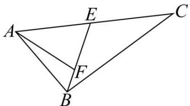

text_image

Geometric diagram of triangle ABC with internal points E, F and connecting lines

A. $\frac{3}{8}\overrightarrow{\mathrm{BA}} +\frac{5}{8}\overrightarrow{\mathrm{BC}}$   
C. $-\frac{7}{8}\overrightarrow{BA}+\frac{1}{8}\overrightarrow{BC}$

B. $\frac{5}{4}\overrightarrow{\mathrm{BA}} +\frac{3}{4}\overrightarrow{\mathrm{BC}}$   
D. $-\frac{3}{4}\overrightarrow{BA}+\frac{1}{4}\overrightarrow{BC}$

1584 (2024·全国·高三专题练习)在平行四边形ABCD中,对角线AC与BD交于点O,若 $\overrightarrow{AB}+\overrightarrow{AD}=\lambda\overrightarrow{AO}$ ,则 $\lambda=$ ( )

A. $\frac{1}{2}$

B. 2

C. $\frac{1}{3}$

D. $\frac{3}{2}$

1585 (2024·河南·襄城高中校联考三模)已知等腰梯形 ABCD 中, AB // DC, AB = 2DC = 2AD = 2, BC 的中点为 E, 则 $\overrightarrow{AE} =$ ()

A. $\frac{1}{3}\overrightarrow{DB}+\frac{5}{3}\overrightarrow{AC}$

B. $\frac{1}{3}\overrightarrow{\mathrm{DB}} +\frac{5}{6}\overrightarrow{\mathrm{AC}}$

C. $\frac{1}{3}\overrightarrow{\mathrm{DB}} +\frac{1}{2}\overrightarrow{\mathrm{AC}}$

D. $\frac{2}{3}\overrightarrow{\mathrm{DB}} +\frac{5}{6}\overrightarrow{\mathrm{AC}}$

# 3 题型三: 向量共线的运用

1586 (2024·广东广州·统考模拟预测)在 $\triangle ABC$ 中，M 是 AC 边上一点，且 $\overrightarrow{AM} = \frac{1}{2}\overrightarrow{MC}, N$ 是 BM 上一点，若 $\overrightarrow{AN} = \frac{1}{9}\overrightarrow{AC} + m\overrightarrow{BC}$ ，则实数 m 的值为（）

A. $-\frac{1}{3}$

B. $-\frac{1}{6}$

C. $\frac{1}{6}$

D. $\frac{1}{3}$

1587 (2024·湖南长沙·长沙市实验中学校考三模)如图,在△ABC中,M为线段BC的中点,G为线段AM上一点, $\overrightarrow{AG}=2\overrightarrow{GM}$ ,过点G的直线分别交直线AB,AC于P,Q两点, $\overrightarrow{AB}=x\overrightarrow{AP}(x>0)$ , $\overrightarrow{AC}=y\overrightarrow{AQ}(y>0)$ ,则 $\frac{4}{x}+\frac{1}{y+1}$ 的最小值为( ).

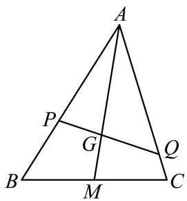

text_image

A
P
G
Q
B
M
C

A. $\frac{3}{4}$

B. $\frac{9}{4}$

C. 3

D. 9

1588 (2024·山西·高三校联考阶段练习)如图,在△ABC中,D是BC边中点 $\overrightarrow{AP}=\frac{1}{3}\overrightarrow{AD}$ ,
CP的延长线与AB交于AN,则()

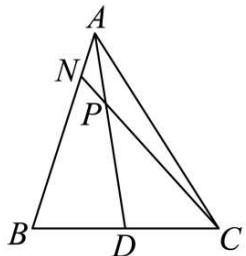

text_image

A
N
P
B
D
C

A. $\overrightarrow{\mathrm{AN}} = \frac{1}{4}\overrightarrow{\mathrm{AB}}$

B. $\overrightarrow{\mathrm{AN}} = \frac{1}{5}\overrightarrow{\mathrm{AB}}$

C. $\overrightarrow{\mathrm{AN}} = \frac{1}{6}\overrightarrow{\mathrm{AB}}$

D. $\overrightarrow{\mathrm{AN}} = \frac{1}{7}\overrightarrow{\mathrm{AB}}$

1589 (2024·全国·高三专题练习)如图所示,已知点G是△ABC的重心,过点G作直线分别与AB,AC两边交于M,N两点,设 $x\overrightarrow{AB}=\overrightarrow{AM},y\overrightarrow{AC}=\overrightarrow{AN}$ ,则 $\frac{1}{x}+\frac{1}{y}$ 的值为()

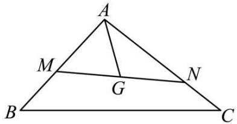

text_image

A
M
G
N
B
C

A. 3

B. 4

C. 5

D. 6

1590 (2024·重庆沙坪坝·高三重庆一中校考阶段练习)在 $\triangle ABC$ 中，E 为 AC 上一点， $\overrightarrow{AC}=3\overrightarrow{AE}$ ，P 为线段 BE 上任一点（不含端点），若 $\overrightarrow{AP}=x\overrightarrow{AB}+y\overrightarrow{AC}$ ，则 $\frac{1}{x}+\frac{3}{y}$ 的最小值是（）

A. 8

B. 10

C. 13

D. 16

1591 (2024·全国·高三专题练习)已知向量 $\vec{a}$ 、 $\vec{b}$ 不共线，且 $\vec{c}=x\vec{a}+\vec{b},\vec{d}=\vec{a}+(2x-1)\vec{b}$ ，若 $\vec{c}$ 与 $\vec{d}$ 共线，则实数 x 的值为（）

A. 1

B. $-\frac{1}{2}$

C. 1 或 $-\frac{1}{2}$

D.-1或 $-\frac{1}{2}$

1592 (2024·全国·高三专题练习)已知直线 l 上有三点 A, B, C, O 为 l 外一点, 又等差数列 $\{a_{n}\}$ 的前 n 项和为 $S_{n}$ , 若 $\overrightarrow{OA} = (a_{1} + a_{3})\overrightarrow{OB} + 2a_{10}\overrightarrow{OC}$ , 则 $S_{11} =$ ()

A. $\frac{11}{4}$

B. 3

C. $\frac{11}{2}$

D. $\frac{13}{2}$

1593 (2024·全国·高三对口高考)设两个非零向量 $\vec{a}$ 与 $\vec{b}$ 不共线.

(1) 若 $\overrightarrow{AB} = \vec{a} + \vec{b}, \overrightarrow{BC} = 2\vec{a} + 8\vec{b}, \overrightarrow{CD} = 3(\vec{a} - \vec{b})$ ，求证 A, B, D 三点共线.  
(2) 试确定实数 k，使 $k\vec{a} + \vec{b}$ 和 $\vec{a} + k\vec{b}$ 共线.

1594 (2024·全国·高三对口高考)如图所示,在 $\triangle ABC$ 中,D,F 分别是 BC,AC 的中点, $\overrightarrow{AE}=\frac{2}{3}\overrightarrow{AD},\overrightarrow{AB}=\vec{a},\overrightarrow{AC}=\vec{b}.$

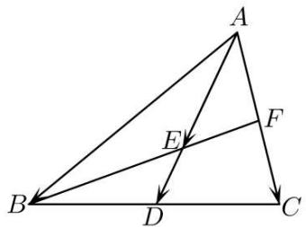

text_image

Geometric diagram of triangle ABC with internal points D, E, F and directional arrows

(1) 用 $\vec{a}, \vec{b}$ 表示 $\overrightarrow{\mathrm{AD}}, \overrightarrow{\mathrm{AE}}, \overrightarrow{\mathrm{AF}}, \overrightarrow{\mathrm{BE}}, \overrightarrow{\mathrm{BF}}$ ;  
(2) 求证: B, E, F 三点共线.

# 4 题型四:平面向量基本定理及应用

1595 (2024·上海·高三专题练习)设 $\vec{e}_{1}$ 、 $\vec{e}_{2}$ 是两个不平行的向量，则下列四组向量中，不能组成平面向量的一个基底的是（）

A. $\vec{\mathrm{e}}_1 + \vec{\mathrm{e}}_2$ 和 $\vec{\mathrm{e}}_1 - \vec{\mathrm{e}}_2$

B. $\vec{\mathrm{e}}_1 + 2\vec{\mathrm{e}}_2$ 和 $\vec{\mathrm{e}}_2 + 2\vec{\mathrm{e}}_1$

C. $3\vec{\mathrm{e}}_1 - 2\vec{\mathrm{e}}_2$ 和 $4\vec{\mathrm{e}}_2 - 6\vec{\mathrm{e}}_1$

D. $\vec{\mathbf{e}}_2$ 和 $\vec{\mathbf{e}}_2 + \vec{\mathbf{e}}_1$

1596 (2024·四川成都·四川省成都市玉林中学校考模拟预测)已知向量 $\vec{e}_{1},\vec{e}_{2}$ 是平面内所有向量的一组基底,则下面的四组向量中,不能作为基底的是()

A. $\{\vec{\mathrm{e}}_1,\overrightarrow{\mathrm{e}^{\circ}}_{1}-\vec{\mathrm{e}}_{2}\}$

B. $\{\vec{\mathrm{e}}_1 + \vec{\mathrm{e}}_2, \overrightarrow{\mathrm{e}^{\circ}}_1 - 3\vec{\mathrm{e}}_2\}$

C. $\{\vec{e}_{1}-2\vec{e}_{2},-3\overrightarrow{e^{\circ}}_{1}+6\vec{e}_{2}\}$

D. $\{2\vec{\mathrm{e}}_1 + 3\vec{\mathrm{e}}_2, 2\overrightarrow{\mathrm{e}^{\sigma}}_1 - 3\vec{\mathrm{e}}_2\}$

1597 (2024·河北沧州·校考模拟预测)在 $\triangle ABC$ 中 $\overrightarrow{BE} = \frac{1}{2}\overrightarrow{EC}, \overrightarrow{BF} = \frac{1}{2}\left(\overrightarrow{BA} + \overrightarrow{BC}\right)$ ，点 P 为 AE 与 BF 的交点， $\overrightarrow{AP} = \lambda\overrightarrow{AB} + \mu\overrightarrow{AC}$ ，则 $\lambda - \mu =$ （）

A. 0

B. $\frac{1}{4}$

C. $\frac{1}{2}$

D. $\frac{3}{4}$

1598 (2024·全国·模拟预测)如图,在 $\triangle ABC$ 中, $\overrightarrow{CM} = \lambda \overrightarrow{CB}$ , $\overrightarrow{NC} = \mu \overrightarrow{AC}$ , 其中 $0 < \lambda < 1, 0 < \mu < 1$ , 若 AM 与 BN 相交于点 Q, 且 $\overrightarrow{BQ} = \frac{3}{5} \overrightarrow{BN}$ , 则 ()

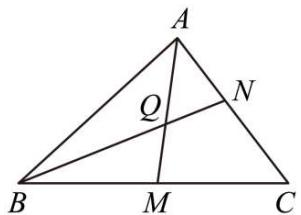

text_image

A
Q
N
B
M
C

A. $\lambda \mu = \lambda +\mu$

B. $2\lambda \mu = \lambda +\mu$

C. $5\lambda = 2 + 3\lambda\mu$

D. $3\lambda = 2 + 5\lambda \mu$

1599 (2024·广东汕头·统考三模)如图, 点 D、E 分别 AC、BC 的中点, 设 $\overrightarrow{AB} = \overrightarrow{a}, \overrightarrow{AC} = \overrightarrow{b}, F$ 是 DE 的中点, 则 $\overrightarrow{AF} =$ ()

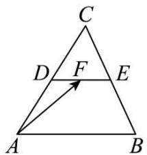

text_image

C
D F E
A B

A. $\frac{1}{2}\vec{a}+\frac{1}{2}\vec{b}$

B. $-\frac{1}{2}\vec{a}+\frac{1}{2}\vec{b}$

C. $\frac{1}{4}\vec{a} +\frac{1}{2}\vec{b}$

D. $-\frac{1}{4}\vec{a}+\frac{1}{2}\vec{b}$

1600 (2024·山西大同·统考模拟预测)在 $\triangle ABC$ 中，D 为 BC 中点，M 为 AD 中点， $\overrightarrow{BM}=m\overrightarrow{AB}+n\overrightarrow{AC}$ ，则 $m+n=$ （）

A. $-\frac{1}{2}$

B. $\frac{1}{2}$

C. 1

D.-1

1601 (2024·广东·统考模拟预测)古希腊数学家帕波斯在其著作《数学汇编》的第五卷序言中, 提到了蜂巢,称蜜蜂将它们的蜂巢结构设计为相同并且拼接在一起的正六棱柱结构,从而储存更多的蜂蜜,提升了空间利用率,体现了动物的智慧,得到世人的认可.已知蜂巢结构的平面图形如图所示,则 $\overrightarrow{AB}=$ ()

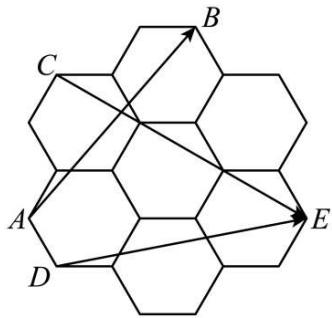

text_image

C
B
A
D
E

A. $-\frac{3}{2}\overrightarrow{\mathrm{CE}} +\frac{5}{6}\overrightarrow{\mathrm{DE}}$ C. $-\frac{2}{3}\overrightarrow{\mathrm{CE}} +\frac{5}{6}\overrightarrow{\mathrm{DE}}$

B. $-\frac{5}{6}\overrightarrow{\mathrm{CE}} +\frac{3}{2}\overrightarrow{\mathrm{DE}}$ D. $-\frac{5}{6}\overrightarrow{\mathrm{CE}} +\frac{2}{3}\overrightarrow{\mathrm{DE}}$

1602 (2024·吉林长春·统考模拟预测)如图,在平行四边形ABCD中,M,N分别为BC,CD上的点,且 $\overrightarrow{BM}=\overrightarrow{MC},\overrightarrow{CN}=\frac{2}{3}\overrightarrow{CD}$ ,连接AM,BN交于P点,若 $\overrightarrow{AP}=\lambda\overrightarrow{PM},\overrightarrow{BP}=\mu\overrightarrow{PN}$ ,则 $\lambda+\mu=$ ( )

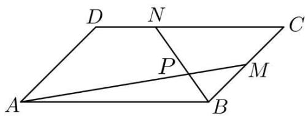

text_image

D N C
P M
A B

A. $\frac{13}{5}$

B. $\frac{25}{7}$

C. $\frac{18}{5}$

D. $\frac{19}{5}$

1603 (2024·湖北黄冈·浠水县第一中学校考模拟预测)如图,在四边形ABCD中, AB // CD, AB = 4CD, 点E在线段CB上, 且CE = 2EB, 设 $\overrightarrow{AB} = \vec{a}$ , $\overrightarrow{AD} = \vec{b}$ , 则 $\overrightarrow{AE} =$ ()

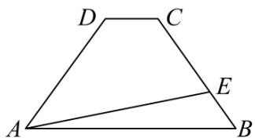

text_image

D
C
A
E
B

A. $\frac{5}{8}\vec{a} +\frac{1}{2}\vec{b}$

B. $\frac{1}{2}\vec{a} +\frac{5}{8}\vec{b}$

C. $\frac{1}{3}\vec{a} +\frac{3}{4}\vec{b}$

D. $\frac{3}{4}\vec{a} +\frac{1}{3}\vec{b}$

1604 (2024·安徽·校联考二模)如图,在△ABC中,点D为线段BC的中点,点E,F分别是线段AD上靠近D,A的三等分点,则 $\overrightarrow{AD}=$ ()

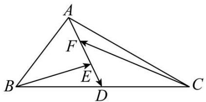

text_image

A
F
B
E
D
C

A. $-\overrightarrow{BE}-\frac{1}{3}\overrightarrow{CF}$

B. $-\frac{1}{3}\overrightarrow{BE}-\overrightarrow{CF}$

C. $-\overrightarrow{BE}-\overrightarrow{CF}$

D. $-\frac{4}{9}\overrightarrow{BE}-\overrightarrow{CF}$

1605 (2024·全国·模拟预测)如图,平行四边形ABCD中,AC与BD相交于点O, $\overrightarrow{EB}=3\overrightarrow{DE}$ ,若 $\overrightarrow{AO}=\lambda\overrightarrow{AE}+\mu\overrightarrow{BC}(\lambda,\mu\in\mathrm{R})$ ,则 $\frac{\lambda}{\mu}=$ ( )

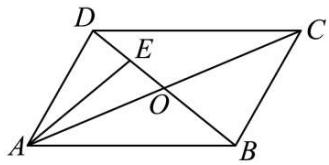

text_image

D
E
C
O
A
B

A. $-\frac{1}{2}$

B.-2

C. $\frac{1}{2}$

D. 2

# 题型五:平面向量的直角坐标运算

1606 (2024·全国·高三对口高考) AC 为平行四边形 ABCD 的对角线, $\overrightarrow{AB} = (2,4), \overrightarrow{AC} = (1,3)$ , 则 $\overrightarrow{AD} =$ \_\_\_\_.  
1607 (2024·全国·高三专题练习)已知向量 $\vec{a}=(-2,1)$ , $\vec{b}=(3,2)$ , $\vec{c}=(5,8)$ , 且 $\vec{c}=\lambda\vec{a}+\mu\vec{b}$ , 则 $\frac{\lambda}{\mu}=$ \_\_\_\_.  
1608 (2024·四川绵阳·模拟预测)已知 A(-2,4), C(-3,-4), 且 $\overrightarrow{CM}=3\overrightarrow{CA}$ , 则点 M 的坐标为 \_\_\_\_.  
1609 (2024·全国·高三专题练习)如图,已知平面内有三个向量 $\overrightarrow{OA}$ , $\overrightarrow{OB}$ , $\overrightarrow{OC}$ , 其中 $\overrightarrow{OC}$ 与 $\overrightarrow{OA}$ 和 $\overrightarrow{OB}$ 的夹角分别为 $30^{\circ}$ 和 $90^{\circ}$ , 且 $|\overrightarrow{OA}| = |\overrightarrow{OB}| = 1$ , $|\overrightarrow{OC}| = 2\sqrt{3}$ , 若 $\overrightarrow{OC} = \lambda \overrightarrow{OA} + \mu \overrightarrow{OB} (\lambda, \mu \in \mathbb{R})$ , 则 $\lambda + 2\mu =$ \_\_\_\_ .

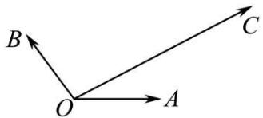

text_image

B
O
A
C

1610 (2024·河南·郑州一中校联考模拟预测)已知向量 $\vec{a} = (x, 2)$ , $\vec{b} = (-x, 1)$ , 且 $\left|2\vec{a} + \vec{b}\right| = \sqrt{26}$ , 则实数 x = \_\_\_\_.  
1611 (2024·全国·高三对口高考)已知向量 $\vec{a} = (\sqrt{3}, 1), \vec{b} = (0, -2)$ . 若实数 k 与向量 $\vec{c}$ 满足 $\vec{a} + 2\vec{b} = k\vec{c}$ ，则 $\vec{c}$ 可以是 ()

A. $(\sqrt{3},-1)$

B. $(-1,-\sqrt{3})$

C. $(- \sqrt{3}, -1)$

D. $(-1,\sqrt{3})$

1612 (2024·河北·统考模拟预测)在正六边形 ABCDEF 中, 直线 ED 上的点 M 满足 $\overrightarrow{AM} = \overrightarrow{AC} + m\overrightarrow{AD}$ , 则 m = ()

A. 1

B. $\frac{1}{2}$

C. $\frac{1}{3}$

D. $\frac{1}{4}$

1613 (2024·内蒙古赤峰·校联考三模)如图,在四边形ABCD中, $\angle DAB=120^{\circ},\angle DAC=30^{\circ},AB=1,AC=3,AD=2,\overrightarrow{AC}=x\overrightarrow{AB}+y\overrightarrow{AD}$ ,则 $x+y=$ ()

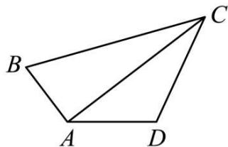

natural_image

Geometric diagram of a quadrilateral ABCD with diagonal AC, no text or labels present

A. $2 \sqrt{3}$

B. 2

C. 3

D. 6

1614 (2024·全国·高三专题练习)已知 O 为坐标原点， $\overrightarrow{P_{1}P}=-2\overrightarrow{PP_{2}}$ ，若 $P_{1}(1,2)$ 、 $P_{2}(2,-1)$ ，则与 $\overrightarrow{OP}$ 共线的单位向量为（）

A. $(3,-4)$

B. $(3,-4)$ 或 $(-3,4)$

C. $\left(\frac{3}{5},-\frac{4}{5}\right)$ 或 $\left(-\frac{3}{5},\frac{4}{5}\right)$

D. $\left(\frac{3}{5},-\frac{4}{5}\right)$

# 题型六:向量共线的坐标表示

1615 (2024·黑龙江哈尔滨·哈尔滨三中校考模拟预测)在平面直角坐标系中,向量 $\overrightarrow{PA} = (1, 4)$ , $\overrightarrow{PB} = (2, 3)$ , $\overrightarrow{PC} = (x, 1)$ , 若 A, B, C 三点共线, 则 x 的值为 ()

A. 2

B. 3

C. 4

D. 5

1616 (2024·全国·高三专题练习)已知 A(m,0), B(0,1), C(3,-1)，且 A,B,C 三点共线，则 m= ()

A. $\frac{3}{2}$

B. $\frac{2}{3}$

C. $-\frac{3}{2}$

D. $-\frac{2}{3}$

1617 (2024·甘肃定西·统考模拟预测)已知向量 $\vec{a} = (1,3)$ ， $\vec{b} = (4,-1)$ ，若向量 $\vec{m} // \vec{a}$ ，且 $\vec{m}$ 与 $\vec{b}$ 的夹角为钝角，写出一个满足条件的 $\vec{m}$ 的坐标为 \_\_\_\_.

1618 (2024·全国·高三专题练习)已知向量 $\vec{a}=(-1,2)$ ， $\vec{b}=(1,2022)$ ，向量 $\vec{m}=\vec{a}+2\vec{b}$ ， $\vec{n}=2\vec{a}-k\vec{b}$ ，若 $\vec{m}\parallel\vec{n}$ ，则实数 k= \_\_\_\_.

1619 (2024·北京·北京四中校考模拟预测)已知向量 $\vec{a} = (t, 4)$ , $\vec{b} = (1, t)$ , 若 $\vec{a} // \vec{b}$ , 则实数 t = \_\_\_\_.

1620 (2024·上海普陀·上海市宜川中学校考模拟预测)已知 $\vec{a} = (k,1)$ ， $\vec{b} = (-2,3)$ ，若 $\vec{a}$ 与 $\vec{b}$ 互相平行，则实数 k 的值是 \_\_\_\_.

1621 (2024·全国·高三对口高考)已知向量 $\vec{a}=(1,2),\vec{b}=(1,\lambda),\vec{c}=(3,4)$ . 若 $\vec{a}+\vec{b}$ 与 $\vec{c}$ 共线，则实数 $\lambda=$ \_\_\_\_.

1622 (2024·重庆沙坪坝·重庆南开中学校考模拟预测)已知 $\vec{a}=(1,2),\vec{b}=(-3,2)$ ，若 $k\vec{a}+\vec{b}$ 与 $\vec{a}-2\vec{b}$ 平行，则实数 k= \_\_\_\_.

1623 (2024·全国·高三专题练习)已知点 A(4, 0), B(4, 4), C(2, 6), O 为坐标原点, 则 AC 与 OB 的交点 P 的坐标为 \_\_\_\_.

