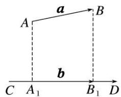
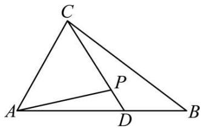
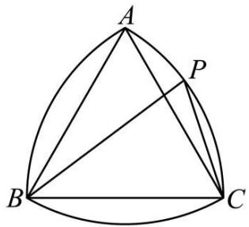
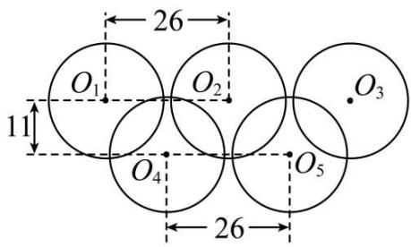
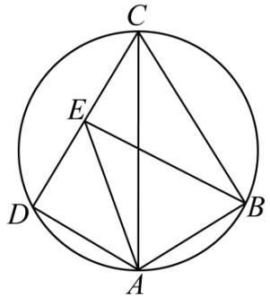
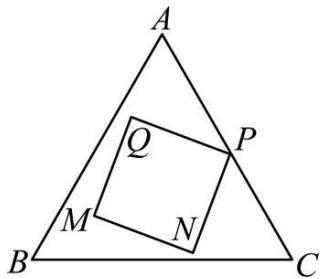
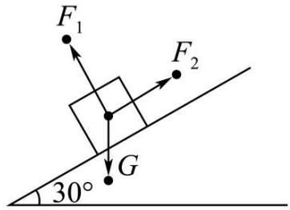
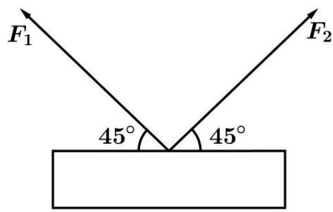
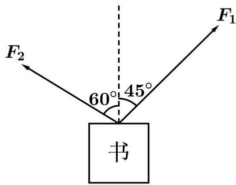

# 第36讲 平面向量的数量积及运算

# 知识梳理

# 知识点一．平面向量的数量积 a

# (1) 平面向量数量积的定义

已知两个非零向量 $\vec{a}$ 与 $\vec{b}$ ，我们把数量 $|\vec{a}||\vec{b}|\cos \theta$ 叫做 $\vec{a}$ 与 $\vec{b}$ 的数量积（或内积），记作 $\vec{a} \cdot \vec{b}$ ，即 $\vec{a} \cdot \vec{b} = |\vec{a}||\vec{b}|\cos \theta$ ，规定：零向量与任一向量的数量积为0.

# (2) 平面向量数量积的几何意义

①向量的投影： $|a|\cos\theta$ 叫做向量a在b方向上的投影数量，当 $\theta$ 为锐角时，它是正数；当 $\theta$ 为钝角时，它是负数；当 $\theta$ 为直角时，它是0.  
② $a \cdot b$ 的几何意义: 数量积 $a \cdot b$ 等于 $a$ 的长度 $|a|$ 与 $b$ 在 $a$ 方向上射影 $|b|\cos\theta$ 的乘积.

③设 $\vec{a},\vec{b}$ 是两个非零向量，它们的夹角是 $\theta ,\vec{e}$ 与 $\vec{b}$ 是方向相同的单位向量， $\overrightarrow{\mathrm{AB}} = \vec{a},\overrightarrow{\mathrm{CD}}$ $= \vec{b}$ ，过 $\overrightarrow{\mathrm{AB}}$ 的起点A和终点B，分别作 $\overrightarrow{\mathrm{CD}}$ 所在直线的垂线，垂足分别为 $\mathbf{A}_1,\mathbf{B}_1$ ，得到 $\overrightarrow{\mathrm{A_1B_1}}$ 我们称上述变换为向量 $\vec{a}$ 向向量 $\vec{b}$ 投影， $\overrightarrow{\mathrm{A_1B_1}}$ 叫做向量 $\vec{a}$ 在向量 $\vec{b}$ 上的投影向量．记为 $|\vec{a} |\cos \theta \vec{e}$

text_image

a
A
B
b
C A₁ B₁ D

# 知识点二．数量积的运算律

已知向量 $a, b, c$ 和实数 $\lambda$ , 则:

① $a \cdot b = b \cdot a;$   
② $(\lambda a)\cdot b = \lambda (a\cdot b) = a\cdot (\lambda b);$   
③ $(a + b) \cdot c = a \cdot c + b \cdot c$ .

# 知识点三．数量积的性质

设 $a, b$ 都是非零向量， $\mathbf{e}$ 是与 $b$ 方向相同的单位向量， $\theta$ 是 $a$ 与 $\mathbf{e}$ 的夹角，则

① $\mathbf{e} \cdot a = a \cdot \mathbf{e} = |a| \cos \theta$ . ② $a \perp b \Leftrightarrow a \cdot b = 0$ .   
③当 $a$ 与 $b$ 同向时， $a \cdot b = |a||b|$ ；当 $a$ 与 $b$ 反向时， $a \cdot b = -|a||b|$ .

特别地， $a\cdot a = |a|^2$ 或 $|a| = \sqrt{a\cdot a}$

④ $\cos \theta = \frac{a\cdot b}{|a||b|} (|a||b|\neq 0)$ . ⑤ $|a\cdot b|\leqslant |a||b|$ .

# 知识点四．数量积的坐标运算

已知非零向量 $a = (x_{1},y_{1}),b = (x_{2},y_{2}),\theta$ 为向量 $a,b$ 的夹角.

<table><tr><td>结论</td><td>几何表示</td><td>坐标表示</td></tr><tr><td>模</td><td> $|a| = \sqrt{a \cdot a}$ </td><td> $|a| = \sqrt{x^{2} + y^{2}}$ </td></tr><tr><td>数量积</td><td> $a \cdot b = |a||b|\cos\theta$ </td><td> $a \cdot b = x_{1}x_{2} + y_{1}y_{2}$ </td></tr><tr><td>夹角</td><td> $\cos\theta = \frac{a \cdot b}{|a||b|}$ </td><td> $\cos\theta = \frac{x_1x_2 + y_1y_2}{\sqrt{x_1^2 + y_1^2} \cdot \sqrt{x_2^2 + y_2^2}}$ </td></tr><tr><td>a⊥b的充要条件</td><td>a·b=0</td><td> $x_1x_2 + y_1y_2 = 0$ </td></tr><tr><td>a//b的充要条件</td><td>a=λb(b≠0)</td><td> $x_1y_2 - x_2y_1 = 0$ </td></tr><tr><td>|a·b|与|a||b|的关系</td><td>|a·b|≤|a||b|(当且仅当a//b时等号成立)</td><td> $|x_1x_2 + y_1y_2| \leqslant \sqrt{x_1^2 + y_1^2} \cdot \sqrt{x_2^2 + y_2^2}$ </td></tr></table>

知识点五、向量中的易错点

(1) 平面向量的数量积是一个实数, 可正、可负、可为零, 且 $|\vec{a} \cdot \vec{b}| \leqslant |\vec{a}||\vec{b}|$ .  
(2) 当 $\vec{a} \neq \vec{0}$ 时, 由 $\vec{a} \cdot \vec{b} = 0$ 不能推出 $\vec{b}$ 一定是零向量, 这是因为任一与 $\vec{a}$ 垂直的非零向量 $\vec{b}$ 都有 $\vec{a} \cdot \vec{b} = 0$ .

当 $\vec{a} \neq \vec{0}$ 时，且 $\vec{a} \cdot \vec{b} = \vec{a} \cdot \vec{c}$ 时，也不能推出一定有 $\vec{b} = \vec{c}$ ，当 $\vec{b}$ 是与 $\vec{a}$ 垂直的非零向量， $\vec{c}$ 是另一与 $\vec{a}$ 垂直的非零向量时，有 $\vec{a} \cdot \vec{b} = \vec{a} \cdot \vec{c} = 0$ ，但 $\vec{b} \neq \vec{c}$ .

(3) 数量积不满足结合律, 即 $(\vec{a} \cdot \vec{b}) \vec{c} \neq (\vec{b} \cdot \vec{c}) \vec{a}$ , 这是因为 $(\vec{a} \cdot \vec{b}) \vec{c}$ 是一个与 $\vec{c}$ 共线的向量, 而 $(\vec{b} \cdot \vec{c}) \vec{a}$ 是一个与 $\vec{a}$ 共线的向量, 而 $\vec{a}$ 与 $\vec{c}$ 不一定共线, 所以 $(\vec{a} \cdot \vec{b}) \vec{c}$ 不一定等于 $(\vec{b} \cdot \vec{c}) \vec{a}$ , 即凡有数量积的结合律形式的选项, 一般都是错误选项.  
(4) 非零向量夹角为锐角 (或钝角). 当且仅当 $\vec{a} \cdot \vec{b} > 0$ 且 $\vec{a} \neq \lambda \vec{b} (\lambda > 0)$ (或 $\vec{a} \cdot \vec{b} < 0$ , 且 $\vec{a} \neq \lambda \vec{b} (\lambda < 0)$ )

【解题方法总结】

(1) $\vec{b}$ 在 $\vec{a}$ 上的投影是一个数量，它可以为正，可以为负，也可以等于0.  
(2) 数量积的运算要注意 $\vec{a} = \vec{0}$ 时， $\vec{a} \cdot \vec{b} = 0$ ，但 $\vec{a} \cdot \vec{b} = 0$ 时不能得到 $\vec{a} = \vec{0}$ 或 $\vec{b} = \vec{0}$ ，因为 $\vec{a} \perp \vec{b}$ 时，也有 $\vec{a} \cdot \vec{b} = 0$ 。  
(3) 根据平面向量数量积的性质: $|\vec{a}| = \sqrt{\vec{a} \cdot \vec{a}}$ , $\cos \theta = \frac{\vec{a} \cdot \vec{b}}{|\vec{a}| |\vec{b}|}$ , $\vec{a} \perp \vec{b} \Leftrightarrow \vec{a} \cdot \vec{b} = 0$ 等, 所以平面向量数量积可以用来解决有关长度、角度、垂直的问题.  
(4) 若 $a, b, c$ 是实数，则 $ab = ac \Rightarrow b = c (a \neq 0)$ ; 但对于向量，就没有这样的性质，即若向量 $\vec{a}, \vec{b}, \vec{c}$ 满足 $\vec{a} \cdot \vec{b} = \vec{a} \cdot \vec{c} (\vec{a} \neq 0)$ ，则不一定有 $\vec{b} = \vec{c}$ ，即等式两边不能同时约去一个向量，但可以同时乘以一个向量.  
(5) 数量积运算不适合结合律, 即 $(\vec{a} \cdot \vec{b}) \cdot \vec{c} \neq \vec{a} \cdot (\vec{b} \cdot \vec{c})$ , 这是由于 $(\vec{a} \cdot \vec{b}) \cdot \vec{c}$ 表示一个与 $\vec{c}$ 共线的向量, $\vec{a} \cdot (\vec{b} \cdot \vec{c})$ 表示一个与 $\vec{a}$ 共线的向量, 而 $\vec{a}$ 与 $\vec{c}$ 不一定共线, 因此 $(\vec{a} \cdot \vec{b}) \cdot \vec{c}$ 与 $\vec{a} \cdot (\vec{b} \cdot \vec{c})$ 不一定相等.

# 必考题型全归纳

# 1 题型一:平面向量的数量积运算

1624 (2024·吉林四平·高三四平市第一高级中学校考期末)已知向量 $\vec{a}$ , $\vec{b}$ 满足 $|\vec{a}| = 2, |\vec{b}| =$ $\sqrt{3}$ ，且 $\vec{a}$ 与 $\vec{b}$ 的夹角为 $\frac{\pi}{6}$ ，则 $(\vec{a} +\vec{b})\cdot (2\vec{a} -\vec{b}) =$ （

A. 6

B. 8

C. 10

D. 14

1625 (2024·全国·高三专题练习)已知 $\left|\vec{a}\right|=6,\left|\vec{b}\right|=3$ ，向量 $\vec{a}$ 在 $\vec{b}$ 方向上投影向量是 $4\vec{e}$ ，则 $\vec{a}\cdot\vec{b}$ 为 （）

A. 12

B. 8

C.-8

D. 2

1626 (2024·湖南长沙·周南中学校考二模)已知菱形ABCD的边长为1, $\overrightarrow{AB} \cdot \overrightarrow{AD} = -\frac{1}{2}$ , G是菱形ABCD内一点, 若 $\overrightarrow{GA} + \overrightarrow{GB} + \overrightarrow{GC} = \overrightarrow{0}$ , 则 $\overrightarrow{AG} \cdot \overrightarrow{AB} =$ ()

A. $\frac{1}{2}$

B. 1

C. $\frac{3}{2}$

D. 2

1627 (2024·云南昆明·高三昆明一中校考阶段练习)已知单位向量 $\vec{a}, \vec{b}$ ，且 $\langle\vec{a}, \vec{b}\rangle = \frac{\pi}{3}$ ，若 $(\vec{a} + \vec{b}) \perp \vec{c}, |\vec{c}| = 2$ ，则 $\vec{a} \cdot \vec{c} =$ （）

A. 1

B. 12

C.-2或2

D.-1或1

1628 (2024·广东·校联考模拟预测)将向量 $\overrightarrow{OP} = (\sqrt{2}, \sqrt{2})$ 绕坐标原点 O 顺时针旋转 $75^{\circ}$ 得到 $\overrightarrow{OP}_{1}$ ，则 $\overrightarrow{OP} \cdot \overrightarrow{OP}_{1} =$ （）

A. $\frac{\sqrt{6}-\sqrt{2}}{2}$

B. $\sqrt{6} -\sqrt{2}$

C. $\sqrt{6} +\sqrt{2}$

D. $\frac{\sqrt{6} + \sqrt{2}}{2}$

1629 (2024·全国·高三专题练习)正方形 ABCD 的边长是 2, E 是 AB 的中点, 则 $\overrightarrow{EC} \cdot \overrightarrow{ED} =$ ()

A. $\sqrt{5}$

B. 3

C. $2\sqrt{5}$

D. 5

1630 (2024·天津和平·高三耀华中学校考阶段练习)如图,在 $\triangle ABC$ 中, $\angle BAC=\frac{\pi}{3}$ , $\overrightarrow{AD}=2\overrightarrow{DB}$ ,P为CD上一点,且满足 $\overrightarrow{AP}=m\overrightarrow{AC}+\frac{1}{2}\overrightarrow{AB}(m\in R)$ ,若 $AC=3$ ,AB=4,则 $\overrightarrow{AP}\cdot\overrightarrow{CD}$ 的值为( ).

text_image

C
A
P
D
B

A.-3

B. $-\frac{13}{12}$

C. $\frac{13}{12}$

D. $-\frac{1}{12}$

1631 (2024·陕西西安·西北工业大学附属中学校考模拟预测)已知向量 $\vec{a}$ ， $\vec{b}$ 满足同向共线，且 $\left|\vec{b}\right|=2,\left|\vec{a}-\vec{b}\right|=1$ ，则 $(\vec{a}+\vec{b})\cdot\vec{a}=$ （）

A. 3

B. 15

C.-3或15

D. 3 或 15

1632 (2024·吉林长春·东北师大附中校考模拟预测)在矩形ABCD中， $AB=1,AD=2,AC$ 与BD相交于点O，过点A作AE⊥BD于E，则 $\overrightarrow{AE}\cdot\overrightarrow{AO}=$ （）

A. $\frac{12}{25}$

B. $\frac{24}{25}$

C. $\frac{12}{5}$

D. $\frac{4}{5}$

# 2 题型二:平面向量的夹角

1633 (2024·河南驻马店·统考二模)若单位向量 $\vec{a}, \vec{b}$ 满足 $\left|2\vec{a}-\vec{b}\right|=\sqrt{6}$ ，则向量 $\vec{a}, \vec{b}$ 夹角的余弦值为 \_\_\_\_.

1634 (2024·四川·校联考模拟预测)若 $\vec{e}_{1},\vec{e}_{2}$ 是夹角为 $60^{\circ}$ 的两个单位向量，则 $\vec{a}=2\vec{e}_{1}+\vec{e}_{2}$ 与 $\vec{b}=-3\vec{e}_{1}+2\vec{e}_{2}$ 的夹角大小为 \_\_\_\_.

1635 (2024·重庆·高三重庆一中校考阶段练习)已知向量 $\vec{a}$ 和 $\vec{b}$ 满足： $\left|\vec{a}\right|=1,\left|\vec{b}\right|=2,\left|2\vec{a}-\vec{b}\right|$ $-2\vec{a}\cdot\vec{b}=0$ ，则 $\vec{a}$ 与 $\vec{b}$ 的夹角为 \_\_\_\_.

1636 (2024·上海杨浦·复旦附中校考模拟预测)若向量 $\vec{a}$ 与 $\vec{b}$ 不共线也不垂直，且 $\vec{c} = \vec{a} - \left( \frac{\vec{a} \cdot \vec{a}}{\vec{a} \cdot \vec{b}} \right) \vec{b}$ ，则向量夹角 $\langle \vec{a}, \vec{c} \rangle =$ \_\_\_\_ .

1637 (2024·上海长宁·上海市延安中学校考三模)已知 $\vec{a}$ 、 $\vec{b}$ 、 $\vec{c}$ 是同一个平面上的向量，若 $\left|\vec{a}\right|=\left|\vec{c}\right|=\left|\vec{b}\right|$ ，且 $\vec{a}\cdot\vec{b}=0,\vec{c}\cdot\vec{a}=2,\vec{c}\cdot\vec{b}=1$ ，则 $\left\langle\vec{c},\vec{a}\right\rangle=$ \_\_\_\_.

1638 (2024·重庆渝中·高三重庆巴蜀中学校考阶段练习)已知向量 $\vec{a}, \vec{b}$ 满足 $\vec{a} = (1, -1), |\vec{b}| = 1, \vec{a} \cdot \vec{b} = 1$ ，则向量 $\vec{a}$ 与 $\vec{b}$ 的夹角大小为 \_\_\_\_.

1639 (2024·四川·校联考模拟预测)已知向量 $\vec{a} = (x + 1, \sqrt{3})$ , $\vec{b} = (1, 0)$ , $\vec{a} \cdot \vec{b} = -2$ , 则向量 $\vec{a} + \vec{b}$ 与 $\vec{b}$ 的夹角为 \_\_\_\_.

1640 (2024·湖南长沙·雅礼中学校考模拟预测)已知向量 $\vec{a} = (1, 2)$ , $\vec{b} = (4, 2)$ , 若非零向量 $\vec{c}$ 与 $\vec{a}$ , $\vec{b}$ 的夹角均相等, 则 $\vec{c}$ 的坐标为 \_\_\_\_ (写出一个符合要求的答案即可)

# 3 题型三: 平面向量的模长

1641 (2024·湖北·荆门市龙泉中学校联考模拟预测)已知平面向量 $\vec{a}, \vec{b}, \vec{c}$ 满足 $\vec{a} = (2,1), \vec{b} = (1,2)$ ，且 $\vec{a} \perp \vec{c}$ . 若 $\vec{b} \cdot \vec{c} = 3\sqrt{2}$ ，则 $|\vec{c}| =$ （）

A. $\sqrt{10}$

B. $2 \sqrt{5}$

C. $5 \sqrt{2}$

D. $3 \sqrt{5}$

1642 (2024·陕西咸阳·武功县普集高级中学校考模拟预测)已知 $\vec{a}$ ， $\vec{b}$ 是非零向量， $|\vec{a}|=1$ ， $(\vec{a}+2\vec{b})\perp\vec{a}$ ，向量 $\vec{a}$ 在向量 $\vec{b}$ 方向上的投影为 $-\frac{\sqrt{2}}{4}$ ，则 $|\vec{a}-\vec{b}|=$ \_\_\_\_。

1643 (2024·海南·高三校联考期末)已知向量 $\vec{a}$ ， $\vec{b}$ 满足 $\vec{a}=(1,1)$ ， $\left|\vec{b}\right|=4$ ， $\vec{a}\cdot(\vec{a}-\vec{b})=-2$ ，则 $\left|3\vec{a}-\vec{b}\right|=\underline{\hspace{2cm}}$ .

1644 (2024·四川南充·阆中中学校考二模)已知 $\vec{a},\vec{b}$ 为单位向量，且满足 $\left|\vec{a}-\sqrt{5}\vec{b}\right|=\sqrt{6}$ ，则 $\left|2\vec{a}+\vec{b}\right|=$ \_\_\_\_.

1645 (2024·河南驻马店·统考三模)已知平面向量 $\vec{a},\vec{b}$ 满足 $\left|\vec{a}\right|=\sqrt{10},\left|\vec{b}\right|=2,$ 且 $\left(2\vec{a}+\vec{b}\right)\cdot\left(\vec{a}-\vec{b}\right)=14,$ 则 $\left|\vec{a}+\vec{b}\right|=$ \_\_\_\_.

1646 (2024·全国·高三专题练习)已知向量 $\vec{a},\vec{b}$ 满足 $\left|\vec{a}-\vec{b}\right|=\sqrt{3}$ ， $\left|\vec{a}+\vec{b}\right|=\left|2\vec{a}-\vec{b}\right|$ ，则 $\left|\vec{b}\right|=$ \_\_\_\_.  
1647 (2024·河南郑州·模拟预测)已知点 O 为坐标原点， $\overrightarrow{OA}=(1,1)$ ， $\overrightarrow{OB}=(-3,4)$ ，点 P 在线段 AB 上，且 $\left|\overrightarrow{AP}\right|=1$ ，则点 P 的坐标为 \_\_\_\_.  
1648 (2024·广西·高三校联考阶段练习)已知 $\vec{a}=(-2,1)$ ， $\vec{b}=(4,t)$ ，若 $\vec{a}\cdot\vec{b}=2$ ，则 $\left|2\vec{a}-\vec{b}\right|=$ \_\_\_\_.

# 4 题型四:平面向量的投影、投影向量

1649 (2024·上海宝山·高三上海交大附中校考期中)已知向量 $\vec{a} = (3, 6)$ , $\vec{b} = (3, -4)$ , 则 $\vec{a}$ 在 $\vec{b}$ 方向上的数量投影为 \_\_\_\_.  
1650 (2024·上海虹口·华东师范大学第一附属中学校考三模)已知 $\vec{a}=(-2,-1),\vec{b}=(-4,m)$ ，若向量 $\vec{b}$ 在向量 $\vec{a}$ 方向上的数量投影为 $\sqrt{5}$ ，则实数 m= \_\_\_\_.  
1651 (2024·全国·高三专题练习)已知向量 $\left|\vec{a}\right|=6,\vec{e}$ 为单位向量，当向量 $\vec{a}$ 、 $\vec{e}$ 的夹角等于 $45^{\circ}$ 时，则向量 $\vec{a}$ 在向量 $\vec{e}$ 上的投影向量是 \_\_\_\_.  
1652 (2024·云南昆明·高三昆明一中校考阶段练习)已知向量 $\vec{a}=(-1,2)$ ，向量 $\vec{b}=(1,1)$ ，则向量 $\vec{a}$ 在向量 $\vec{b}$ 方向上的投影为 \_\_\_\_.  
1653 (2024·新疆喀什·统考模拟预测)已知向量 $\vec{a}, \vec{b}$ 满足 $\left|\vec{a} + \vec{b}\right| = 3, \left|\vec{a}\right| = 2, \vec{b} = (0,1)$ ，则向量 $\vec{a}$ 在向量 $\vec{b}$ 方向上的投影为 \_\_\_\_.  
1654 (2024·全国·高三专题练习)已知非零向量 $\vec{a},\vec{b}$ 满足 $(\vec{a}+2\vec{b})\perp(\vec{a}-2\vec{b})$ ，且向量 $\vec{b}$ 在向量 $\vec{a}$ 方向的投影向量是 $\frac{1}{4}\vec{a}$ ，则向量 $\vec{a}$ 与 $\vec{b}$ 的夹角是 \_\_\_\_.  
1655 (2024·全国·模拟预测)已知向量 $\vec{a} = (1,0), \vec{b} = (0,1), \vec{a} \cdot \vec{c} = \vec{b} \cdot \vec{c} = 1$ ，则向量 $\vec{a}$ 在向量 $\vec{c}$ 上的投影向量为 \_\_\_\_.

# 5 题型五:平面向量的垂直问题

1656 (2024·四川巴中·南江中学校考模拟预测)已知向量 $\vec{a} = (1, 2)$ , $\vec{b} = (-2, 3)$ , 若 $(k\vec{a} + \vec{b}) \perp (\vec{a} - \vec{b})$ , 则 k = \_\_\_\_.  
1657 (2024·全国·高三专题练习)已知向量 $\vec{a}, \vec{b}, \vec{c}$ ，其中 $\vec{a}, \vec{b}$ 为单位向量，且 $\vec{a} \perp \vec{b}$ ，若 $|\vec{c}| =$ \_\_\_\_，则 $(\vec{a} - \vec{c}) \perp (\vec{b} - 2\vec{c})$ .

注:填上你认为正确的一种条件即可,不必考虑所有可能的情形.

1658 (2024·江西宜春·高三校联考期末)设非零向量 $\vec{a}, \vec{b}$ 的夹角为 $\theta$ 。若 $\left|\vec{b}\right|=2\left|\vec{a}\right|$ ，且 $(\vec{a}+2\vec{b})\perp(3\vec{a}-\vec{b})$ ，则 $\theta=$ \_\_\_\_.  
1659 (2024·江西南昌·高三统考开学考试)已知两单位向量 $\vec{e}_{1}, \vec{e}_{2}$ 的夹角为 $\frac{\pi}{3}$ ，若 $\vec{a} = \vec{e}_{1} + 2\vec{e}_{2}$ ,

$\vec{b} = \vec{\mathrm{e}}_1 + m\vec{\mathrm{e}}_2$ ，且 $\vec{a}\perp \vec{b}$ ，则实数 $m = \underline{\quad}$

1660 (2024·海南·校考模拟预测)已知 $\vec{a}$ 为单位向量, 向量 $\vec{b}$ 在向量 $\vec{a}$ 上的投影向量是 $2\vec{a}$ , 且 $(3\vec{a} + \lambda\vec{b}) \perp \vec{a}$ , 则实数 $\lambda$ 的值为 \_\_\_\_.  
1661 (2024·全国·模拟预测)向量 $\vec{m} = (1, x)$ , $\vec{n} = (2, 1)$ ，且 $\vec{n} \perp (\vec{m} + \vec{n})$ ，则实数 x = \_\_\_\_.  
1662 (2024·全国·高三专题练习)非零向量 $\vec{a} = (\cos(\alpha - \beta), \sin\beta)$ ， $\vec{b} = (1, \sin\alpha)$ ，若 $\vec{a} \perp \vec{b}$ ，则 $\tan\alpha \tan\beta =$ \_\_\_\_ .  
1663 (2024·河南开封·校考模拟预测)已知向量 $\vec{a}=(-2,3),\vec{b}=(4,-5)$ ，若 $(\lambda\vec{a}-\vec{b})\perp\vec{b}$ ，则 $\lambda=$ \_\_\_\_.  
1664 (2024·海南海口·海南华侨中学校考模拟预测)已知向量 $\vec{a}$ , $\vec{b}$ 不共线, $\vec{a} = (2,1)$ , $\vec{a} \perp (\vec{b} - \vec{a})$ , 写出一个符合条件的向量 $\vec{b}$ 的坐标: \_\_\_\_.  
1665 (2024·河南开封·统考三模)已知向量 $\vec{a} = (m, -1)$ , $\vec{b} = (1, 3)$ , 若 $(\vec{a} - \vec{b}) \perp \vec{b}$ , 则 m = \_\_\_\_.

# 6 题型六:建立坐标系解决向量问题

1666 (2024·全国·高三专题练习)已知 $\left|\vec{a}\right|=\left|\vec{b}\right|=\left|\vec{c}\right|=1,\vec{a}\cdot\vec{b}=-\frac{1}{2},\vec{c}=x\vec{a}+y\vec{b}(x,y\in\mathrm{R})$ ，则 x-y 的最小值为 ()

A.-2

B. $-\frac{2\sqrt{3}}{3}$

C. $-\sqrt{3}$

D.-1

1667 (2024·安徽合肥·合肥市第七中学校考三模)以边长为2的等边三角形ABC每个顶点为圆心,以边长为半径,在另两个顶点间作一段圆弧,三段圆弧围成曲边三角形,已知P为弧AC上的一点,且 $\angle PBC=\frac{\pi}{6}$ ,则 $\overrightarrow{BP}\cdot\overrightarrow{CP}$ 的值为()

text_image

A
P
B
C

A. $4 - \sqrt{2}$

B. $4 + \sqrt{2}$

C. $4 - 2\sqrt{3}$

D. $4 + 2\sqrt{3}$

1668 (2024·黑龙江哈尔滨·哈师大附中校考模拟预测)下图是北京2022年冬奥会会徽的图案,奥运五环的大小和间距如图所示. 若圆半径均为12,相邻圆圆心水平路离为26,两排圆圆心垂直距离为11. 设五个圆的圆心分别为 $O_{1}$ 、 $O_{2}$ 、 $O_{3}$ 、 $O_{4}$ 、 $O_{5}$ ,则 $\overrightarrow{O_{4}O_{1}}$ .

$\left(\overrightarrow{\mathrm{O}_{4}\mathrm{O}_{5}}+\overrightarrow{\mathrm{O}_{4}\mathrm{O}_{2}}\right)$ 的值为 （）

text_image

BEIJING
Candidate City 2022

A.-507

text_image

26
O₁ O₂ O₃
11
O₄ O₅
26

B.-386

C. -338

D. -242

1669 (2024·陕西安康·陕西省安康中学校考模拟预测)如图,在圆内接四边形ABCD中, $\angle BAD=120^{\circ},AB=AD=1,AC=2.$ 若E为CD的中点,则 $\overrightarrow{EA}\cdot\overrightarrow{EB}$ 的值为()

text_image

C
E
D
A
B

A.-3

B. $-\frac{1}{3}$

C. $\frac{3}{2}$

D. 3

1670 (2024·安徽合肥·合肥市第八中学校考模拟预测)如图,已知△ABC是面积为 $3\sqrt{3}$ 的等边三角形,四边形MNPQ是面积为2的正方形,其各顶点均位于△ABC的内部及三边上,且恰好可在△ABC内任意旋转,则当 $\overrightarrow{BQ}\cdot\overrightarrow{CP}=0$ 时, $|\overrightarrow{BQ}+\overrightarrow{CP}|^{2}=$

text_image

A
Q
P
M
N
B
C

A. $2 + 4\sqrt{3}$

B. $4 + 2\sqrt{3}$

C. $3 + 2\sqrt{6}$

D. $2 + 3\sqrt{6}$

1671 (2024·河南安阳·统考三模)已知正方形ABCD的边长为1,O为正方形的中心,E是AB的中点,则 $\overrightarrow{DE}\cdot\overrightarrow{DO}=$ ()

A. $-\frac{1}{4}$

B. $\frac{1}{2}$

C. $\frac{3}{4}$

D. 1

# 题型七:平面向量的实际应用

1672 (2024·江西宜春·高三校考阶段练习)一质点受到同一平面上的三个力 $F_{1}$ , $F_{2}$ , $F_{3}$ (单位: 牛顿)的作用而处于平衡状态,已知 $F_{1}$ , $F_{2}$ 成 $120^{\circ}$ 角,且 $F_{1}$ , $F_{2}$ 的大小都为6牛顿,则 $F_{3}$ 的大小为 \_\_\_\_ 牛顿.

1673 (2024·内蒙古赤峰·统考三模)如图所示,把一个物体放在倾斜角为 $30^{\circ}$ 的斜面上,物体处于平衡状态,且受到三个力的作用,即重力 $\vec{G}$ ,垂直斜面向上的弹力 $\vec{F}_{1}$ ,沿着斜面向上的摩擦力 $\vec{\mathrm{F}}_2$ .已知： $\left|\vec{\mathrm{F}}_1\right| = 80\sqrt{3}\mathrm{N},\left|\vec{\mathrm{G}}\right| = 160\mathrm{N}$ ，则 $\vec{\mathrm{F}}_2$ 的大小为

text_image

F₁
F₂
G
30°

1674 (2024·全国·高三专题练习)如图所示,一个物体被两根轻质细绳拉住,且处于平衡状态.已知两条绳上的拉力分别是 $\vec{F}_{1}, \vec{F}_{2}$ , 且 $\vec{F}_{1}, \vec{F}_{2}$ 与水平夹角均为 $45^{\circ}, |\vec{F}_{1}| = |\vec{F}_{2}| = 4\sqrt{2}N$ , 则物体的重力大小为 \_\_\_\_ N.

text_image

F₁
45°
45°
F₂

1675 (2024·全国·高三专题练习)两同学合提一捆书,提起后书保持静止,如图所示,则 $F_{1}$ 与 $F_{2}$ 大小之比为 \_\_\_\_.

text_image

F₂
60°
45°
书
F₁

1676 (2024·浙江·高三专题练习)一条渔船距对岸 4km, 以 2km/h 的速度向垂直于对岸的方向划去, 到达对岸时, 船的实际行程为 8km, 则河水的流速是 \_\_\_\_ km/h.

