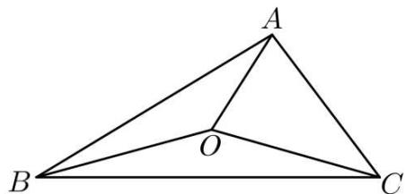
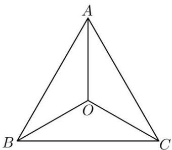
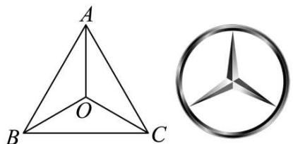
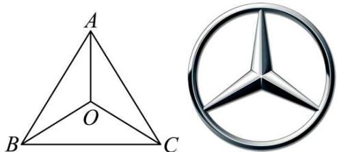

# 第37讲 三角形四心及奔驰定理

# 知识梳理

技巧一．四心的概念介绍：

(1) 重心: 中线的交点, 重心将中线长度分成 2:1.  
(2) 内心: 角平分线的交点 (内切圆的圆心), 角平分线上的任意点到角两边的距离相等.  
(3) 外心: 中垂线的交点 (外接圆的圆心), 外心到三角形各顶点的距离相等.  
(4) 垂心: 高线的交点, 高线与对应边垂直.

技巧二．奔驰定理——解决面积比例问题

重心定理:三角形三条中线的交点.

已知 $\triangle ABC$ 的顶点 $\mathrm{A}(x_1, y_1), \mathrm{B}(x_2, y_2), \mathrm{C}(x_3, y_3)$ ，则 $\triangle ABC$ 的重心坐标为 $\mathbf{G}\left(\frac{x_1 + x_2 + x_3}{3}, \frac{y_1 + y_2 + y_3}{3}\right)$ .

注意：(1) 在 $\triangle ABC$ 中，若 O 为重心，则 $\overrightarrow{OA} + \overrightarrow{OB} + \overrightarrow{OC} = \vec{0}$ .

(2)三角形的重心分中线两段线段长度比为2:1,且分的三个三角形面积相等.

重心的向量表示： $\overrightarrow{AG}=\frac{1}{3}\overrightarrow{AB}+\frac{1}{3}\overrightarrow{AC}.$

奔驰定理： $S_{A}\cdot\overrightarrow{OA}+S_{B}\cdot\overrightarrow{OB}+S_{C}\cdot\overrightarrow{OC}=\vec{0}$ ，则 $\triangle AOB$ 、 $\triangle AOC$ 、 $\triangle BOC$ 的面积之比等于 $\lambda_{3}:\lambda_{2}:\lambda_{1}$

奔驰定理证明:如图,令 $\lambda_{1}\overrightarrow{OA}=\overrightarrow{OA_{1}}$ , $\lambda_{2}\overrightarrow{OB}=\overrightarrow{OB_{1}}$ , $\lambda_{3}\overrightarrow{OC}=\overrightarrow{OC_{1}}$ , 即满足 $\overrightarrow{OA_{1}}+\overrightarrow{OB_{1}}+\overrightarrow{OC_{1}}=0$

$$
\frac {\mathrm{S} _ {\triangle \mathrm{AOB}}}{\mathrm{S} _ {\triangle \mathrm{A} _ {1} \mathrm{OB} _ {1}}} = \frac {1}{\lambda_ {1} \lambda_ {2}}, \frac {\mathrm{S} _ {\triangle \mathrm{AOC}}}{\mathrm{S} _ {\triangle \mathrm{A} _ {1} \mathrm{OC} _ {1}}} = \frac {1}{\lambda_ {1} \lambda_ {3}}, \frac {\mathrm{S} _ {\triangle \mathrm{BOC}}}{\mathrm{S} _ {\triangle \mathrm{B} _ {1} \mathrm{OC} _ {1}}} = \frac {1}{\lambda_ {2} \lambda_ {3}}, \text {故} \mathrm{S} _ {\triangle \mathrm{AOB}}: \mathrm{S} _ {\triangle \mathrm{AOC}}: \mathrm{S} _ {\triangle \mathrm{BOC}} = \lambda_ {3}: \lambda_ {2}: \lambda_ {1}.
$$

text_image

A'
A
O
B
C
B'
C'

技巧三．三角形四心与推论：

(1)O是 $\triangle ABC$ 的重心： $\mathrm{S}_{\triangle \mathrm{BOC}}:\mathrm{S}_{\triangle \mathrm{COA}}:\mathrm{S}_{\triangle \mathrm{AOB}} = 1:1:1\Leftrightarrow \overrightarrow{\mathrm{OA}} +\overrightarrow{\mathrm{OB}} +\overrightarrow{\mathrm{OC}} = \vec{0}.$   
(2)O是△ABC的内心： $\mathrm{S}_{\triangle \mathrm{B0C}}:\mathrm{S}_{\triangle \mathrm{COA}}:\mathrm{S}_{\triangle \mathrm{AOB}} = a:b:c\Leftrightarrow a\overrightarrow{\mathrm{OA}} +b\overrightarrow{\mathrm{OB}} +c\overrightarrow{\mathrm{OC}} = \vec{0}.$   
(3)O 是 $\triangle ABC$ 的外心:

$$
\mathrm{S} _ {\triangle \mathrm{B0C}}: \mathrm{S} _ {\triangle \mathrm{COA}}: \mathrm{S} _ {\triangle \mathrm{AOB}} = \sin 2 \mathrm{A}: \sin 2 \mathrm{B}: \sin 2 \mathrm{C} \Leftrightarrow \sin 2 \mathrm{AOA} + \sin 2 \mathrm{BOB} + \sin 2 \mathrm{COC} = \vec {0}.
$$

(4)O 是 $\triangle ABC$ 的垂心:

$$
\mathrm{S} _ {\triangle \mathrm{B0C}}: \mathrm{S} _ {\triangle \mathrm{COA}}: \mathrm{S} _ {\triangle \mathrm{AOB}} = \tan \mathrm{A}: \tan \mathrm{B}: \tan \mathrm{C} \Leftrightarrow \tan \mathrm{AOA} + \tan \mathrm{BOB} + \tan \mathrm{COC} = \vec {0}.
$$

技巧四．常见结论

(1) 内心: 三角形的内心在向量 $\frac{\overrightarrow{AB}}{|\overrightarrow{AB}|} + \frac{\overrightarrow{AC}}{|\overrightarrow{AC}|}$ 所在的直线上.

$\left|\overrightarrow{\mathrm{AB}}\right| \cdot \overrightarrow{\mathrm{PC}} + \left|\overrightarrow{\mathrm{BC}}\right| \cdot \overrightarrow{\mathrm{PC}} + \left|\overrightarrow{\mathrm{CA}}\right| \cdot \overrightarrow{\mathrm{PB}} = \vec{0} \Leftrightarrow \mathrm{P}$ 为 $\triangle ABC$ 的内心.

(2) 外心: $|\overrightarrow{\mathrm{PA}}| = |\overrightarrow{\mathrm{PB}}| = |\overrightarrow{\mathrm{PC}}| \Leftrightarrow \mathrm{P}$ 为 $\triangle ABC$ 的外心.

(3) 垂心: $\overrightarrow{\mathrm{PA}} \cdot \overrightarrow{\mathrm{PB}} = \overrightarrow{\mathrm{PB}} \cdot \overrightarrow{\mathrm{PC}} = \overrightarrow{\mathrm{PC}} \cdot \overrightarrow{\mathrm{PA}} \Leftrightarrow \mathrm{P}$ 为 $\triangle ABC$ 的垂心.

(4) 重心: $\overrightarrow{\mathrm{PA}} + \overrightarrow{\mathrm{PB}} + \overrightarrow{\mathrm{PC}} = \overrightarrow{0} \Leftrightarrow \mathrm{P}$ 为 $\triangle ABC$ 的重心.

# 必考题型全归纳

# 题型一:奔驰定理

1677 (2024·全国·高一专题练习)已知 O 是 $\triangle ABC$ 内部的一点， $\angle A, \angle B, \angle C$ 所对的边分别为 a = 3, b = 2, c = 4，若 $\sin A \cdot \overrightarrow{OA} + \sin B \cdot \overrightarrow{OB} + \sin C \cdot \overrightarrow{OC} = \vec{0}$ ，则 $\triangle AOB$ 与 $\triangle ABC$ 的面积之比为（）

A. $\frac{4}{9}$

B. $\frac{1}{3}$

C. $\frac{2}{9}$

D. $\frac{5}{9}$

1678 (2024·安徽六安·高一六安一中校考期末)已知 O 是三角形 ABC 内部一点, 且 $\overrightarrow{OA} + 2\overrightarrow{OB} + \overrightarrow{OC} = \overrightarrow{0}$ , 则 $\Delta AOB$ 的面积与 $\Delta ABC$ 的面积之比为 ()

A. $\frac{1}{2}$

B. $\frac{1}{3}$

C. $\frac{1}{4}$

D. $\frac{1}{5}$

1679 (2024·全国·高一专题练习)若点M是△ABC所在平面内的一点,点D是边AC靠近A的三等分点,且满足 $5\overrightarrow{AM}=\overrightarrow{AB}+\overrightarrow{AC}$ ,则△ABM与△ABD的面积比为()

A. $\frac{1}{5}$

B. $\frac{2}{5}$

C. $\frac{3}{5}$

D. $\frac{9}{25}$

1680 (2024·全国·高三专题练习)平面上有△ABC及其内一点O,构成如图所示图形,若将△OAB,△OBC,△OCA的面积分别记作 $S_{c},S_{a},S_{b}$ ,则有关系式 $S_{a}\cdot\overrightarrow{OA}+S_{b}\cdot\overrightarrow{OB}+S_{c}\cdot\overrightarrow{OC}=\vec{0}$ .因图形和奔驰车的logo很相似,常把上述结论称为“奔驰定理”.已知△ABC的内角A,B,C的对边分别为a,b,c,若满足 $a\cdot\overrightarrow{OA}+b\cdot\overrightarrow{OB}+c\cdot\overrightarrow{OC}=\vec{0}$ ,则O为△ABC的()

text_image

A
O
B
C

A. 外心

B. 内心

C. 重心

D. 垂心

1681 (2024·上海奉贤·高一上海市奉贤中学校考阶段练习)“奔驰定理”是平面向量中一个非常优美的结论,因为这个定理对应的图形与“奔驰”轿车的三叉车标很相似,故形象地称其为“奔驰定理”. 奔驰定理:已知 O 是 $\triangle ABC$ 内的一点, $\triangle BOC$ , $\triangle AOC$ , $\triangle AOB$ 的面积分别为 $S_{A}$ 、 $S_{B}$ 、 $S_{C}$ , 则有 $S_{A}\overrightarrow{OA} + S_{B}\overrightarrow{OB} + S_{C}\overrightarrow{OC} = \overrightarrow{0}$ , 设 O 是锐角 $\triangle ABC$ 内的一点, $\angle BAC$ , $\angle ABC$ , $\angle ACB$ 分别是 $\triangle ABC$ 的三个内角, 以下命题错误的是 ()

text_image

A
O
B
C

A. 若 $\overrightarrow{OA} + \overrightarrow{OB} + \overrightarrow{OC} = \overrightarrow{0}$ ，则 O 为 $\triangle ABC$ 的重心  
B. 若 $\overrightarrow{OA} + 2\overrightarrow{OB} + 3\overrightarrow{OC} = \overrightarrow{0}$ ，则 $S_{A}:S_{B}:S_{C} = 1:2:3$   
C. 则 O 为 $\triangle ABC$ (不为直角三角形) 的垂心, 则 $\tan\angle BAC \cdot \overrightarrow{OA} + \tan\angle ABC \cdot \overrightarrow{OB} + \tan\angle ACB \cdot \overrightarrow{OC} = \vec{0}$   
D. 若 $\left|\overrightarrow{OA}\right|=\left|\overrightarrow{OB}\right|=2,\angle AOB=\frac{5\pi}{6},2\overrightarrow{OA}+3\overrightarrow{OB}+4\overrightarrow{OC}=\overrightarrow{0}$ ，则 $S_{\triangle ABC}=\frac{9}{2}$

1682 (多选题)(2024·江苏盐城·高一江苏省射阳中学校考阶段练习)“奔驰定理”是平面向量中一个非常优美的结论,因为这个定理对应的图形与“奔驰”轿车(Mercedesbenz)的logo很相似,故形象地称其为“奔驰定理”.奔驰定理:已知O是△ABC内一点,△BOC,△AOC,△AOB的面积分别为 $S_{A},S_{B},S_{C}$ ,则 $S_{A}\cdot\overrightarrow{OA}+S_{B}\cdot\overrightarrow{OB}+S_{C}\cdot\overrightarrow{OC}=\vec{0}$ ,O是△ABC内的一点,∠BAC,∠ABC,∠ACB分别是△ABC的三个内角,以下命题正确的有()

text_image

A
O
B C
B
C

A. 若 $2\overrightarrow{OA} + 3\overrightarrow{OB} + 4\overrightarrow{OC} = \vec{0}$ , 则 $\mathrm{S}_{\mathrm{A}}: \mathrm{S}_{\mathrm{B}}: \mathrm{S}_{\mathrm{C}} = 4:3:2$   
B. 若 $\left|\overrightarrow{OA}\right|=\left|\overrightarrow{OB}\right|=2,\angle AOB=\frac{2\pi}{3}$ ，且 $2\overrightarrow{OA}+3\overrightarrow{OB}+4\overrightarrow{OC}=\vec{0}$ ，则 $S_{\triangle ABC}=\frac{9\sqrt{3}}{4}$   
C. 若 $\overrightarrow{OA} \cdot \overrightarrow{OB} = \overrightarrow{OB} \cdot \overrightarrow{OC} = \overrightarrow{OC} \cdot \overrightarrow{OA}$ ，则 O 为 $\triangle ABC$ 的垂心  
D. 若 O 为 $\triangle ABC$ 的内心，且 $5\overrightarrow{OA} + 12\overrightarrow{OB} + 13\overrightarrow{OC} = \overrightarrow{0}$ ，则 $\angle ACB = \frac{\pi}{2}$

1683 (多选题)(2024·全国·高一专题练习)“奔驰定理”是平面向量中一个非常优美的结论,因为这个定理对应的图形与“奔驰”轿车(Mercedesbenz)的logo很相似,故形象地称其为“奔驰定理”.奔驰定理:已知O是△ABC内一点,△BOC、△AOC、△AOB的面积分别为 $S_{A}$ 、 $S_{B}$ 、 $S_{C}$ ,则 $S_{A}\cdot\overrightarrow{OA}+S_{B}\cdot\overrightarrow{OB}+S_{C}\cdot\overrightarrow{OC}=\overrightarrow{0}$ .设O是锐角△ABC内的一点,∠BAC、∠ABC、∠ACB分别是△ABC的三个内角,以下命题正确的有()

natural_image

Two geometric diagrams: a triangle ABC with internal lines and a circle with a star-like shape (no text or labels)

A. 若 $\overrightarrow{OA} + 2\overrightarrow{OB} + 3\overrightarrow{OC} = \overrightarrow{0}$ ，则 $S_{A}:S_{B}:S_{C} = 1:2:3$   
B. $|\overrightarrow{\mathrm{OA}}| = |\overrightarrow{\mathrm{OB}}| = 2, \angle \mathrm{AOB} = \frac{5\pi}{6}, 2\overrightarrow{\mathrm{OA}} + 3\overrightarrow{\mathrm{OB}} + 4\overrightarrow{\mathrm{OC}} = \vec{0}$ , 则 $\mathrm{S}_{\triangle \mathrm{ABC}} = \frac{9}{2}$   
C. 若 O 为 $\triangle ABC$ 的内心， $3\overrightarrow{OA} + 4\overrightarrow{OB} + 5\overrightarrow{OC} = \overrightarrow{0}$ ，则 $\angle C = \frac{\pi}{2}$

D. 若 O 为 $\triangle ABC$ 的重心, 则 $\overrightarrow{OA} + \overrightarrow{OB} + \overrightarrow{OC} = \overrightarrow{0}$

# 题型二:重心定理

1684 (2024·福建泉州·高一校考期中)著名数学家欧拉提出了如下定理:三角形的外心、重心、垂心依次位于同一直线上,且重心到外心的距离是重心到垂心距离的一半,此直线被称为三角形的欧拉线,该定理被称为欧拉线定理.已知△ABC的外心为O,重心为G,垂心为H,M为BC中点,且AB=5,AC=4,则下列各式正确的有\_\_\_\_.

① $\overrightarrow{AG} \cdot \overrightarrow{BC} = -3$ ② $\overrightarrow{AO} \cdot \overrightarrow{BC} = -6$   
③ $\overrightarrow{OH} = \overrightarrow{OA} + \overrightarrow{OB} + \overrightarrow{OC}$ ④ $\overrightarrow{AB} + \overrightarrow{AC} = 4\overrightarrow{OM} + 2\overrightarrow{HM}$

1685 (2024·全国·高一专题练习)点 O 是平面上一定点, A、B、C 是平面上 $\triangle ABC$ 的三个顶点, $\angle B$ 、 $\angle C$ 分别是边 AC、AB 的对角, 以下命题正确的是 \_\_\_\_ (把你认为正确的序号全部写上).

①动点 P 满足 $\overrightarrow{OP} = \overrightarrow{OA} + \overrightarrow{PB} + \overrightarrow{PC}$ ，则 $\triangle ABC$ 的重心一定在满足条件的 P 点集合中；  
②动点 P 满足 $\overrightarrow{OP} = \overrightarrow{OA} + \lambda \left( \frac{\overrightarrow{AB}}{|\overrightarrow{AB}|} + \frac{\overrightarrow{AC}}{|\overrightarrow{AC}|} \right) (\lambda > 0)$ ，则 $\triangle ABC$ 的内心一定在满足条件的 P 点集合中；  
③动点 P 满足 $\overrightarrow{OP} = \overrightarrow{OA} + \lambda \left( \frac{\overrightarrow{AB}}{|\overrightarrow{AB}| \sin B} + \frac{\overrightarrow{AC}}{|\overrightarrow{AC}| \sin C} \right) (\lambda > 0)$ ，则 $\triangle ABC$ 的重心一定在满足条件的 P 点集合中；  
④动点 P 满足 $\overrightarrow{OP} = \overrightarrow{OA} + \lambda \left( \frac{\overrightarrow{AB}}{|\overrightarrow{AB}| \cos B} + \frac{\overrightarrow{AC}}{|\overrightarrow{AC}| \cos C} \right) (\lambda > 0)$ ，则 $\triangle ABC$ 的垂心一定在满足条件的 P 点集合中；  
⑤动点 P 满足 $\overrightarrow{OP} = \frac{\overrightarrow{OB} + \overrightarrow{OC}}{2} + \lambda \left( \frac{\overrightarrow{AB}}{|\overrightarrow{AB}| \cos B} + \frac{\overrightarrow{AC}}{|\overrightarrow{AC}| \cos C} \right) (\lambda > 0)$ ，则 $\triangle ABC$ 的外心一定在满足条件的 P 点集合中.

1686 (2024·河南·高一河南省实验中学校考期中)若 O 为△ABC 的重心 (重心为三条中线交点), 且 $\overrightarrow{OA} + \overrightarrow{OB} + \lambda \overrightarrow{OC} = \overrightarrow{0}$ , 则 $\lambda =$ \_\_\_\_ .

1687 (2024·全国·高一专题练习)(1)已知△ABC的外心为O,且AB=5,AC=3,则 $\overrightarrow{AO}\cdot\overrightarrow{BC}=$ \_\_\_\_.

(2) 已知 $\triangle ABC$ 的重心为 O，且 AB = 5，AC = 3，则 $\overrightarrow{AO} \cdot \overrightarrow{BC} =$ \_\_\_\_.  
(3) 已知 $\triangle ABC$ 的重心为 O，且 AB = 5，AC = 3， $A = \frac{\pi}{3}$ ，D 为 BC 中点，则 $\overrightarrow{AO} \cdot \overrightarrow{OD} =$ \_\_\_\_.

1688 (2024·江苏无锡·高一江苏省太湖高级中学校考阶段练习)在 $\triangle ABC$ 中, AB = 2, $\angle ABC = 60^{\circ}, \overrightarrow{AC} \cdot \overrightarrow{AB} = -1$ , 若 O 是 $\triangle ABC$ 的重心, 则 $\overrightarrow{BO} \cdot \overrightarrow{AC} = \_\_\_\_.$

1689 (2024·江西南昌·高三校联考期中)锐角 $\triangle ABC$ 中, $a, b, c$ 为角 A, B, C 所对的边, 点 G 为 $\triangle ABC$ 的重心, 若 AG ⊥ BG, 则 cosC 的取值范围为 \_\_\_\_.

1690 (2024·全国·高三专题练习)过△ABC重心O的直线PQ交AC于点P,交BC于点Q, $\overrightarrow{PC}=\frac{3}{4}\overrightarrow{AC},\overrightarrow{QC}=n\overrightarrow{BC}$ ,则n的值为\_\_\_\_.

1691 (2024·上海虹口·高三上海市复兴高级中学校考期中)在 $\triangle ABC$ 中, 过重心 G 的直线交边 AB 于点 P, 交边 AC 于点 Q, 设 $\triangle APQ$ 的面积为 $S_{1}$ , $\triangle ABC$ 的面积为 $S_{2}$ , 且 $\overrightarrow{AP}=$ $\lambda\overrightarrow{AB},\overrightarrow{AQ}=\mu\overrightarrow{AC}$ ，则 $\frac{S_{1}}{S_{2}}$ 的取值范围为 \_\_\_\_.

# 3 题型三:内心定理

1692 (2024·湖北·模拟预测)在 $\triangle ABC$ 中， $\overrightarrow{AB} \cdot \overrightarrow{AC} = 16, S_{\triangle ABC} = 6, BC = 3$ ，且 AB > AC，
若 O 为 $\triangle ABC$ 的内心，则 $\overrightarrow{AO} \cdot \overrightarrow{BC} =$ \_\_\_\_ .  
1693 (2024·全国·高三专题练习)已知 Rt△ABC 中, AB = 3, AC = 4, BC = 5, I 是 △ABC 的内心, P 是 △IBC 内部 (不含边界) 的动点. 若 $\overrightarrow{AP} = \lambda \overrightarrow{AB} + \mu \overrightarrow{AC} (\lambda, \mu \in R)$ , 则 $\lambda + \mu$ 的取值范围是 \_\_\_\_.  
1694 (2024·黑龙江黑河·高三嫩江市高级中学校考阶段练习)设I为△ABC的内心，AB=AC=5，BC=6， $\overrightarrow{AI}=m\overrightarrow{AB}+n\overrightarrow{BC}$ ，则 $m+n$ 为\_\_\_\_.  
1695 (2024·福建福州·高三福建省福州第一中学校考阶段练习)已知点 O 是 $\Delta ABC$ 的内心，若 $\overrightarrow{AO} = \frac{3}{7}\overrightarrow{AB} + \frac{1}{7}\overrightarrow{AC}$ ，则 $\cos\angle BAC =$ \_\_\_\_ .  
1696 (2024·甘肃兰州·高一兰州市第二中学校考期末)在面上有△ABC及内一点O满足关系式： $S_{\triangle OBC}\cdot\overrightarrow{OA}+S_{\triangle OAC}\cdot\overrightarrow{OB}+S_{\triangle OAB}\cdot\overrightarrow{OC}=\vec{0}$ 即称为经典的“奔驰定理”，若△ABC的三边为a,b,c，现有 $a\cdot\overrightarrow{OA}+b\cdot\overrightarrow{OB}+c\cdot\overrightarrow{OC}=\vec{0}$ ，则O为△ABC的\_\_\_\_心.  
1697 (2024·贵州安顺·统考模拟预测)已知 O 是平面上的一个定点, A、B、C 是平面上不共线的三点, 动点 P 满足 $\overrightarrow{OP} = \overrightarrow{OA} + \lambda \left( \frac{\overrightarrow{AB}}{|\overrightarrow{AB}|} + \frac{\overrightarrow{AC}}{|\overrightarrow{AC}|} \right) (\lambda \in \mathbb{R})$ , 则点 P 的轨迹一定经过 $\triangle ABC$ 的 ( )

A. 重心

B. 外心

C. 内心

D. 垂心

1698 (2024·江西·校联考模拟预测)已知椭圆 $\frac{x^{2}}{16} + \frac{y^{2}}{12} = 1$ 的左右焦点分别为 $F_{1}, F_{2}, P$ 为椭圆上异于长轴端点的动点，G, I 分别为 $\triangle PF_{1}F_{2}$ 的重心和内心，则 $\overrightarrow{PI} \cdot \overrightarrow{PG} =$ （）

A. $\frac{4}{3}$

B. $\sqrt{3}$

C. 2

D. $\frac{16}{3}$

1699 (2024·全国·高三专题练习)已知 $\triangle ABC$ , I 是其内心, 内角 A, B, C 所对的边分别 a, b, c, 则 ( )

A. $\overrightarrow{\mathrm{AI}} = \frac{1}{3} (\overrightarrow{\mathrm{AB}} +\overrightarrow{\mathrm{AC}})$

B. $\overrightarrow{\mathrm{AI}} = \frac{c\overrightarrow{\mathrm{AB}}}{a} +\frac{b\overrightarrow{\mathrm{AC}}}{a}$

C. $\overrightarrow{AI}=\frac{b\overrightarrow{AB}}{a+b+c}+\frac{c\overrightarrow{AC}}{a+b+c}$

D. $\overrightarrow{AI}=\frac{c\overrightarrow{AB}}{a+b}+\frac{b\overrightarrow{AC}}{a+c}$

1700 (2024·全国·高三专题练习)在 $\triangle ABC$ 中， $\cos A = \frac{3}{4}$ ，O 为 $\triangle ABC$ 的内心，若 $\overrightarrow{AO} = x\overrightarrow{AB} + y\overrightarrow{AC}(x, y \in \mathbb{R})$ ，则 $x + y$ 的最大值为（）

A. $\frac{2}{3}$

B. $\frac{6-\sqrt{6}}{5}$

C. $\frac{7-\sqrt{7}}{6}$

D. $\frac{8-2\sqrt{2}}{7}$

1701 (2024·全国·高三专题练习)点 O 在 $\Delta ABC$ 所在平面内, 给出下列关系式:

(1) $\overrightarrow{\mathrm{OA}} +\overrightarrow{\mathrm{OB}} +\overrightarrow{\mathrm{OC}} = \overrightarrow{0};$   
(2) $\overrightarrow{\mathrm{OA}}\cdot \overrightarrow{\mathrm{OB}} = \overrightarrow{\mathrm{OB}}\cdot \overrightarrow{\mathrm{OC}} = \overrightarrow{\mathrm{OC}}\cdot \overrightarrow{\mathrm{OA}};$

(3) $\overrightarrow{\mathrm{OA}}\cdot \left(\frac{\overrightarrow{\mathrm{AC}}}{|\overrightarrow{\mathrm{AC}}|} -\frac{\overrightarrow{\mathrm{AB}}}{|\overrightarrow{\mathrm{AB}}|}\right) = \overrightarrow{\mathrm{OB}}\cdot \left(\frac{\overrightarrow{\mathrm{BC}}}{|\overrightarrow{\mathrm{BC}}|} -\frac{\overrightarrow{\mathrm{BA}}}{|\overrightarrow{\mathrm{BA}}|}\right) = 0;$   
(4) $(\overrightarrow{OA}+\overrightarrow{OB})\cdot\overrightarrow{AB}=(\overrightarrow{OB}+\overrightarrow{OC})\cdot\overrightarrow{BC}=0.$

则点 O 依次为 $\Delta ABC$ 的

( )

A. 内心、外心、重心、垂心；

B. 重心、外心、内心、垂心；

C. 重心、垂心、内心、外心；

D. 外心、内心、垂心、重心

1702 (2024·全国·高三专题练习)已知 $\Delta ABC$ 的内角 A、B、C 的对边分别为 a、b、c，O 为 $\Delta ABC$ 内一点，若分别满足下列四个条件：

① $a\overrightarrow{OA} + b\overrightarrow{OB} + c\overrightarrow{OC} = \overrightarrow{0};$   
② $\tan A \cdot \overrightarrow{OA} + \tan B \cdot \overrightarrow{OB} + \tan C \cdot \overrightarrow{OC} = \vec{0};$   
③ $\sin2A\cdot\overrightarrow{OA}+\sin2B\cdot\overrightarrow{OB}+\sin2C\cdot\overrightarrow{OC}=\vec{0};$   
④ $\overrightarrow{OA}+\overrightarrow{OB}+\overrightarrow{OC}=\overrightarrow{0};$

则点 O 分别为 $\Delta ABC$ 的

( )

A. 外心、内心、垂心、重心

B. 内心、外心、垂心、重心

C. 垂心、内心、重心、外心

D. 内心、垂心、外心、重心

# 题型四:外心定理

1703 (2024·山西吕梁·高三统考阶段练习)设 O 为 $\triangle ABC$ 的外心,且满足 $2\overrightarrow{OA} + 3\overrightarrow{OB} + 4\overrightarrow{OC} = \vec{0}, |\overrightarrow{OA}| = 1$ ,下列结论中正确的序号为 \_\_\_\_.

① $\overrightarrow{OB} \cdot \overrightarrow{OC} = -\frac{7}{8}$ ; ② $\left|\overrightarrow{AB}\right| = 2$ ; ③ $\angle A = 2\angle C$ .

1704 (2024·河北·模拟预测)已知 O 为△ABC 的外心, AC = 3, BC = 4, 则 $\overrightarrow{OC} \cdot \overrightarrow{AB} =$ \_\_\_\_.

1705 (2024·黑龙江哈尔滨·高三哈尔滨市第六中学校校考阶段练习)已知 O 是 $\triangle ABC$ 的外心, 若 $\frac{|\overrightarrow{AC}|}{|\overrightarrow{AB}|}\overrightarrow{AB} \cdot \overrightarrow{AO} + \frac{|\overrightarrow{AB}|}{|\overrightarrow{AC}|}\overrightarrow{AC} \cdot \overrightarrow{AO} = 2m\overrightarrow{AO}^{2}$ , 且 $\sin B + \sin C = \sqrt{3}$ , 则实数 m 的最大值为 \_\_\_\_.

1706 (2024·全国·高三专题练习)设 O 为 $\triangle ABC$ 的外心, 若 AB = 4, BC = $2\sqrt{3}$ , 则 $\overrightarrow{BO} \cdot \overrightarrow{AC} =$ \_\_\_\_.

1707 (2024·湖南长沙·高三湖南师大附中校考阶段练习)已知点 O 是 $\triangle ABC$ 的外心, a, b, c 分别为内角 A, B, C 的对边, $A = \frac{\pi}{3}$ , 且 $\frac{\cos B}{\sin C} \cdot \overrightarrow{AB} + \frac{\cos C}{\sin B} \cdot \overrightarrow{AC} = 2\lambda \overrightarrow{OA}$ , 则 $\lambda$ 的值为 \_\_\_\_.

1708 (2024·全国·高三专题练习)在 $\triangle ABC$ 中, $AB = 6$ , $AC = 3\sqrt{5}$ . 点 M 满足 $\overrightarrow{AM} = \frac{1}{5}\overrightarrow{AB} + \frac{1}{4}\overrightarrow{AC}$ . 过点 M 的直线 $l$ 分别与边 AB, AC 交于点 D, E 且 $\overrightarrow{AD} = \frac{1}{\lambda}\overrightarrow{AB}, \overrightarrow{AE} = \frac{1}{\mu}\overrightarrow{AC}$ . 已知点 G 为 $\triangle ABC$ 的外心, $\overrightarrow{AG} = \lambda \overrightarrow{AB} + \mu \overrightarrow{AC}$ , 则 $|\overrightarrow{AG}|$ 为 \_\_\_\_.

1709 (2024·全国·高三专题练习)已知△ABC中，AB=AC=1，BC= $\sqrt{2}$ ，点O是△ABC的外心，则 $\overrightarrow{CO}\cdot\overrightarrow{AB}=$ \_\_\_\_.

1710 (2024·重庆渝中·高三重庆巴蜀中学校考阶段练习)已知点 P 是 $\triangle ABC$ 的内心、外心、重心、垂心之一，且满足 $2\overrightarrow{AP} \cdot \overrightarrow{BC} = \overrightarrow{AC}^{2} - \overrightarrow{AB}^{2}$ ，则点 P 一定是 $\triangle ABC$ 的（）

A. 内心

B. 外心

C. 重心

D. 垂心

# 5 题型五:垂心定理

1711 (2024·全国·高三专题练习)设 O 为 $\Delta ABC$ 的外心, 若 $\overrightarrow{OA} + \overrightarrow{OB} + \overrightarrow{OC} = \overrightarrow{OM}$ , 则 M 是 $\Delta ABC$ 的 ()

A. 重心 (三条中线交点)

B. 内心 (三条角平分线交点)

C. 垂心 (三条高线交点)

D. 外心 (三边中垂线交点)

1712 (2024·全国·高三专题练习)已知 H 为 $\triangle ABC$ 的垂心 (三角形的三条高线的交点), 若 $\overrightarrow{AH} = \frac{1}{3}\overrightarrow{AB} + \frac{2}{5}\overrightarrow{AC}$ , 则 $\sin\angle BAC =$ \_\_\_\_.

1713 (2024·北京·高三强基计划)已知 H 是 $\triangle ABC$ 的垂心， $2\overrightarrow{HA} + 3\overrightarrow{HB} + 4\overrightarrow{HC} = \overrightarrow{0}$ ，则 $\triangle ABC$ 的最大内角的正弦值是 \_\_\_\_.

1714 (2024·全国·高三专题练习)设 H 是 $\triangle ABC$ 的垂心, 且 $4\overrightarrow{HA} + 5\overrightarrow{HB} + 6\overrightarrow{HC} = \overrightarrow{0}$ , 则 $\cos\angle AHB =$ \_\_\_\_.

1715 (2024·全国·高三专题练习)在 $\triangle ABC$ 中, 点 O、点 H 分别为 $\triangle ABC$ 的外心和垂心, $|AB| = 5, |AC| = 3$ , 则 $\overrightarrow{OH} \cdot \overrightarrow{BC} =$ \_\_\_\_.

1716 (2024·全国·高三专题练习)在 $\triangle ABC$ 中, $AB = AC$ , $\tan C = \frac{4}{3}$ , H 为 $\triangle ABC$ 的垂心, 且满足 $\overrightarrow{AH} = m\overrightarrow{AB} + n\overrightarrow{BC}$ , 则 $m + n = \_$ .

