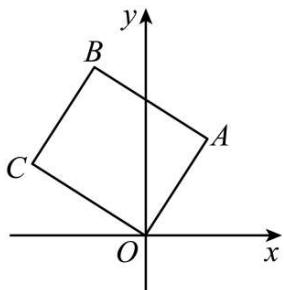

# 第39讲 复数

# 知识梳理

# 知识点一、复数的概念

(1)i 叫虚数单位，满足 $i^{2}=-1$ ，当 $k\in Z$ 时， $i^{4k}=1,i^{4k+1}=i,i^{4k+2}=-1,i^{4k+3}=-i.$   
(2) 形如 $a + bi (a, b \in \mathbb{R})$ 的数叫复数，记作 $a + bi \in \mathbb{C}$ .

①复数 $z = a + bi(a, b \in \mathbb{R})$ 与复平面上的点 $\mathbf{Z}(a, b)$ 一一对应， $a$ 叫 $z$ 的实部， $b$ 叫 $z$ 的虚部； $b = 0 \Leftrightarrow z \in \mathbb{R}, \mathbf{Z}$ 点组成实轴； $b \neq 0, z$ 叫虚数； $b \neq 0$ 且 $a = 0, z$ 叫纯虚数，纯虚数对应点组成虚轴（不包括原点）。两个实部相等，虚部互为相反数的复数互为共轭复数。

②两个复数 $a + bi, c + di(a, b, c, d \in \mathbb{R})$ 相等 $\Leftrightarrow \begin{cases} a = c \\ b = d \end{cases}$ (两复数对应同一点)  
③复数的模: 复数 $a + bi (a, b \in \mathbb{R})$ 的模, 也就是向量 $\overrightarrow{OZ}$ 的模, 即有向线段 $\overrightarrow{OZ}$ 的长度, 其计算公式为 $|z| = |a + bi| = \sqrt{a^{2} + b^{2}}$ , 显然, $|\bar{z}| = |a - bi| = \sqrt{a^{2} + b^{2}}, z \cdot \bar{z} = a^{2} + b^{2}$ .

# 知识点二、复数的加、减、乘、除的运算法则

# 1、复数运算

(1) $(a + bi)\pm (c + di) = (a\pm c) + (b\pm d)\mathrm{i}$   
(2) $(a + bi) \cdot (c + di) = (ac - bd) + (ad + bc)\mathrm{i}$

$$
\left\{ \begin{array}{l} (a + b i) \cdot (a - b i) = z \cdot \bar {z} = a ^ {2} + b ^ {2} = | z | ^ {2} \\ (\text {注意} z ^ {2} = | z | ^ {2}) \\ z + \bar {z} = 2 a \end{array} \right.
$$

其中 $|z|^{\circ} \circ = \sqrt{a^{2} + b^{2}}$ ，叫 $z$ 的模； $\bar{z} = a - bi$ 是 $z = a + bi$ 的共轭复数 $(a, b \in \mathbb{R})$ .

(3) $\frac{a + bi}{c + di} = \frac{(a + bi) \cdot (c - di)}{(c + di) \cdot (c - di)} = \frac{(ac + bd) + (bc - ad)i}{c^2 + d^2} (c^2 + d^2 \neq 0)$ .

实数的全部运算律 (加法和乘法的交换律、结合律、分配律及整数指数幂运算法则) 都适用于复数.

注意: 复数加、减法的几何意义

以复数 $z_{1}, z_{2}$ 分别对应的向量 $\overrightarrow{\mathrm{OZ}}_{1}, \overrightarrow{\mathrm{OZ}}_{2}$ 为邻边作平行四边形 $\mathrm{OZ}_{1} \mathrm{ZZ}_{2}$ , 对角线 $\mathrm{OZ}$ 表示的向量 $\overrightarrow{\mathrm{OZ}}$ 就是复数 $z_{1} + z_{2}$ 所对应的向量. $z_{1} - z_{2}$ 对应的向量是 $\overrightarrow{\mathrm{Z}}_{2} \overrightarrow{\mathrm{Z}}_{1}$ .

# 2、复数的几何意义

(1) 复数 $z = a + bi(a, b \in \mathbb{R})$ 对应平面内的点 $z(a, b)$ ;  
(2) 复数 $z = a + bi (a, b \in \mathbb{R})$ 对应平面向量 $\overrightarrow{\mathrm{OZ}}$ ;  
(3) 复平面内实轴上的点表示实数, 除原点外虚轴上的点表示虚数, 各象限内的点都表示复数.  
(4) 复数 $z = a + bi(a, b \in \mathbb{R})$ 的模 $|z|$ 表示复平面内的点 $z(a, b)$ 到原点的距离.

# 3、复数的三角形式

# (1) 复数的三角表示式

一般地，任何一个复数 $z = a + bi$ 都可以表示成 $r(\cos \theta + i\sin \theta)$ 形式，其中 $r$ 是复数 $z$ 的模； $\theta$ 是以 $x$ 轴的非负半轴为始边，向量 $\overrightarrow{\mathrm{OZ}}$ 所在射线(射线 $\mathrm{OZ}$ ) 为终边的角，叫做复数 $z = a + bi$ 的辐角。 $r(\cos \theta + i\sin \theta)$ 叫做复数 $z = a + bi$ 的三角表示式，简称三角形式。

# (2) 辐角的主值

任何一个不为零的复数的辐角有无限多个值，且这些值相差 $2\pi$ 的整数倍。规定在 $0 \leqslant \theta < 2\pi$ 范围内的辐角 $\theta$ 的值为辐角的主值。通常记作 $\arg z$ ，即 $0 \leqslant \arg z < 2\pi$ 。复数的代数形式可以转化为三角形式，三角形式也可以转化为代数形式。

# (3)三角形式下的两个复数相等

两个非零复数相等当且仅当它们的模与辐角的主值分别相等.

# (4) 复数三角形式的乘法运算

①两个复数相乘，积的模等于各复数的模的积，积的辐角等于各复数的辐角的和，即

$$
r _ {1} (\cos \theta_ {1} + i \sin \theta_ {1}) \cdot r _ {2} (\cos \theta_ {2} + i \sin \theta_ {2}) = r _ {1} r _ {2} [ \cos (\theta_ {1} + \theta_ {2}) + i \sin (\theta_ {1} + \theta_ {2}) ].
$$

②复数乘法运算的三角表示的几何意义

复数 $z_{1}, z_{2}$ 对应的向量为 $\overrightarrow{\mathrm{OZ}}_1, \overrightarrow{\mathrm{OZ}}_2$ ，把向量 $\overrightarrow{\mathrm{OZ}}_1$ 绕点 O 按逆时针方向旋转角 $\theta_{2}$ （如果 $\theta_{2} < 0$ ，就要把 $\overrightarrow{\mathrm{OZ}}_1$ 绕点 O 按顺时针方向旋转角 $|\theta_{2}|$ ），再把它的模变为原来的 $r_{2}$ 倍，得到向量 $\overrightarrow{\mathrm{OZ}}, \overrightarrow{\mathrm{OZ}}$ 表示的复数就是积 $z_{1}z_{2}$ .

# (5) 复数三角形式的除法运算

两个复数相除，商的模等于被除数的模除以除数的模所得的商，商的辐角等于被除数的辐角减去除数的辐角所得的差，即 $\frac{r_1(\cos\theta_1 + i\sin\theta_1)}{r_2(\cos\theta_2 + i\sin\theta_2)} = \frac{r_1}{r_2} [\cos (\theta_1 - \theta_2) + i\sin (\theta_1 - \theta_2)].$

# 必考题型全归纳

# 题型一: 复数的概念

1749 (2024·河南安阳·统考三模)已知 $(1+2\mathrm{i})(a+\mathrm{i})$ 的实部与虚部互为相反数，则实数 a= ()

A. $\frac{1}{3}$

B. $-\frac{1}{3}$

C. $\frac{1}{2}$

D. $-\frac{1}{2}$

1750 (2024·浙江绍兴·统考二模)已知复数 z 满足 $z(\sqrt{3}-\mathrm{i})=2\mathrm{i}$ ，其中 i 为虚数单位，则 z 的虚部为 ()

A. $\frac{\sqrt{3}}{2}$

B. $\frac{\sqrt{3}}{2}i$

C. $-\frac{1}{2}$

D. $-\frac{\sqrt{3}}{2}$

1751 (2024·海南海口·校联考一模)若复数 $z = a^{2} - 4 + (a - 2)i$ 为纯虚数，则实数 a 的值为（）

A. 2

B. 2 或 -2

C.-2

D.-4

1752 (多选题)(2024·河南安阳·安阳一中校考模拟预测)若复数 $z=\frac{3-5i}{1-i}$ ，则()

A. $|z| = \sqrt{17}$

B. $z$ 的实部与虚部之差为3

C. $\bar{z}=4+i$

D. $z$ 在复平面内对应的点位于第四象限

1753 (2024·辽宁·校联考一模)若 z 是纯虚数， $|z|=1$ ，则 $\frac{2}{1-z}$ 的实部为 \_\_\_\_.

# 题型二:复数的运算

1754 (2024·黑龙江哈尔滨·哈师大附中统考三模)已知复数 $z=\frac{1+i}{1-i}$ ，则 $|z|-\bar{z}=$ （）

A. $1 + i$

B. 1

C. $1 - i$

D. i

1755 (2024·河北衡水·模拟预测)若 $(\mathrm{i} - 1)(z - 2\mathrm{i}) = 2 + \mathrm{i}$ ，则 $\bar{z} =$ （）

A. $-\frac{1}{2}+\frac{1}{2}i$

B. $-\frac{1}{2}-\frac{1}{2}i$

C. $\frac{1}{2}+\frac{1}{2}i$

D. $-\frac{3}{2}-\frac{1}{2}i$

1756 (2024·陕西榆林·高三绥德中学校考阶段练习)已知复数 z 满足 $(z - 2\mathrm{i})\mathrm{i} = 3 + \mathrm{i}$ ，则 z = ()

A. $1 - i$

B. 3 - i

C. $1 - 5i$

D. $-1+3i$

1757 (2024·全国·模拟预测)已知复数 z 满足 $3z + i = 1 - 4iz$ ，则 $|z| =$ （）

A. 2

B. $\frac{4\sqrt{2}}{25}$

C. $\frac{\sqrt{2}}{5}$

D. $\frac{2}{5}$

# 题型三:复数的几何意义

1758 (2024·河南郑州·三模)复平面内, 复数 $\frac{3-i}{1+i^{2023}}$ 对应的点位于 ()

A. 第一象限

B. 第二象限

C. 第三象限

D. 第四象限

1759 (2024·全国·高三专题练习)已知复数 $z_{1}$ 与 $z=3+i$ 在复平面内对应的点关于实轴对称，则 $\frac{z_{1}}{2+i}=$ （）

A. $1 + i$

B. $1 - i$

C. $-1 + i$

D. -1 - i

1760 (2024·湖北·校联考三模)如图,正方形OABC中,点A对应的复数是3+5i,则顶点B对应的复数是()

text_image

y
B
C
A
O
x

A. $-2+8i$

B. 2 - 8i

C. $-1+7i$

D. $-2+7i$

1761 (2024·全国·校联考模拟预测)在复平面内，设复数， $z_{1}, z_{2}$ 对应的点分别为 $Z_{1}(0,2)$ ， $Z_{2}(1,-1)$ ，则 $\left|\frac{z_{1}}{z_{2}}\right| =$ （）

A. 2

B. $\sqrt{3}$

C. $\sqrt{2}$

D. 1

# 题型四:复数的相等与共轭复数

1762 (2024·湖北·黄冈中学校联考模拟预测)已知 $2 - \mathrm{i}(\mathrm{i}$ 是虚数单位) 是关于 x 的方程 $x^{2} + bx + c = 0 (b, c \in \mathbb{R})$ 的一个根，则 $b + c =$ （）

A. 9

B. 1

C.-7

D. 2i - 5

1763 (2024·贵州贵阳·统考模拟预测)已知 $z_{1} = a + 2\mathrm{i}, z_{2} = 2 + bi, (a,b\in \mathbb{R})$ ，若 $(z_{1} + \overline{z}_{1}) +$

$\left(z_{2}\bar{z}_{2}\right)\mathrm{i} = 4 + 13\mathrm{i}$ ，则 （）

A. $a = 2, b = 3$

B. $a = -2, b = -3$

C. $a = 2, b = \pm 3$

D. $a = -2, b = \pm 3$

1764 (2024·四川宜宾·统考三模)已知复数 $z = 3 + 4i$ ，且 $z + a\bar{z} = 9 - 4i$ ，其中 a 是实数，则（）

A. $a = -2$

B. a = 2

C. a = 1

D. a = 3

1765 (2024·湖北·模拟预测)已知复数 z 满足 $z + |z| = 2 + 4i$ ，则 z 的共轭复数的虚部为（）

A. 2

B.-4

C. 4

D.-2

1766 (2024·四川宜宾·统考三模)已知复数 $z = 3 + 4i$ ，且 $z + a\bar{z} + bi = 9$ ，其中 a, b 是实数，则（）

A. $a = -2, b = 3$

B. $a = 2, b = 4$

C. a=1, b=2

D. a=2, b=-4

# 5 题型五:复数的模

1767 (2024·河南·统考二模)若 $(i+1)(z-1)=2$ ，则 $|\bar{z}+1|=$ \_\_\_\_.

1768 (2024·上海浦东新·统考三模)已知复数 z 满足 $|z-2|=|z|=2$ ，则 $z^{3}=$ \_\_\_\_.

1769 (2024·辽宁铁岭·校联考模拟预测)设复数 $z_{1}, z_{2}$ 满足 $|z_{1}| = |z_{2}| = 2, z_{1} + z_{2} = \sqrt{3} + \mathrm{i}$ , 则 $|z_{1} - z_{2}| = \underline{\quad}$ .

# 6 题型六:复数的三角形式

1770 (2024·四川成都·成都七中统考模拟预测) 1748 年, 瑞士数学家欧拉发现了复指数函数和三角函数的关系, 并写出以下公式 $e^{ix} = \cos x + i \sin x (x \in \mathbf{R}, i \text{为虚数单位})$ , 这个公式在复变论中占有非常重要的地位, 被誉为“数学中的天桥”。根据此公式, 下面四个结果中不成立的是 ( )

A. $\mathrm{e}^{i\pi} + 1 = 0$

B. $\left(\frac{1}{2} +\frac{\sqrt{3}}{2}\mathrm{i}\right)^{2022} = 1$

C. $|\mathrm{e}^{ix} + \mathrm{e}^{-ix}| \leqslant 2$

D. $-2\leqslant \mathrm{e}^{ix} - \mathrm{e}^{-ix}\leqslant 2$

1771 (2024·全国·高三专题练习)任何一个复数 $z = a + bi (a, b \in \mathbb{R})$ 都可以表示成 $z = r(\cos\theta + i\sin\theta) (r \geqslant 0, \theta \in \mathbb{R})$ 的形式，通常称之为复数的三角形式．法国数学家棣莫弗发现： $[r(\cos\theta + i\sin\theta)]^{n} = r^{n} (\cos n\theta + i\sin n\theta) (n \in \mathbb{Z})$ ，我们称这个结论为棣莫弗定理．则 $(1 - \sqrt{3}\mathrm{i})^{2022} =$ （）

A. 1

B. $2^{2022}$

C. $-2^{2022}$

D. i

1772 (2024·河南·统考模拟预测)欧拉公式 $e^{i\theta} = \cos\theta + i\sin\theta$ 把自然对数的底数 e、虚数单位 i、三角函数联系在一起, 充分体现了数学的和谐美. 若复数 z 满足 $(\mathrm{e}^{i\pi} + \mathrm{i}) \cdot z = 1$ , 则 z 的虚部为 ()

A. $\frac{1}{2}$

B. $-\frac{1}{2}$

C. 1

D.-1

1773 (2024·全国·高三专题练习)棣莫弗公式 $(\cos x + i\sin x)^n = \cos nx + i\sin nx$ (其中i为虚数单位)是由法国数学家棣莫弗(1667-1754年)发现的，根据棣莫弗公式可知，复数

$\left(\cos \frac{\pi}{6} + i \sin \frac{\pi}{6}\right)^{2023}$ 在复平面内所对应的点位于 （）

A. 第一象限

B. 第二象限

C. 第三象限

D. 第四象限

# 题型七:与复数有关的最值问题

1774 (2024·上海闵行·上海市七宝中学校考模拟预测)若 $|z+1-i|=1$ ，则 $|z|$ 的最大值与最小值的和为 \_\_\_\_.

1775 (2024·陕西西安·西安中学校考模拟预测)在复平面内,已知复数 z 满足 $|z|=1$ , i 为虚数单位,则 $|z-3-4i|$ 的最大值为 \_\_\_\_.

1776 (2024·全国·模拟预测)设 z 是复数且 $\left|z-1+2i\right|=1$ ，则 $\left|z\right|$ 的最小值为（）

A. 1

B. $\sqrt{3} - 1$

C. $\sqrt{5} - 1$

D. $\sqrt{5}$

1777 (2024·重庆·统考二模)复平面内复数 z 满足 $|z-2|-|z+2|=2$ ，则 $|z-i|$ 的最小值为（）

A. $\frac{\sqrt{3}}{2}$

B. $\frac{\sqrt{5}}{2}$

C. $\sqrt{3}$

D. $\sqrt{5}$

1778 (2024·全国·校联考三模)已知复数 $z, z_{0}$ 满足 $|z - z_{0}| = \sqrt{2}, |z_{0}| = \sqrt{2}$ ，则 $|z|$ 的最大值为（）

A. $\sqrt{2}$

B. $2 \sqrt{2}$

C. 4

D. $3 \sqrt{2}$

