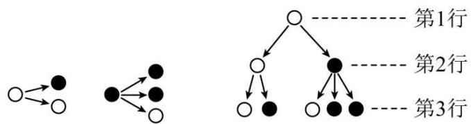
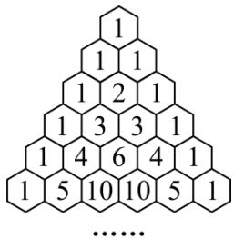
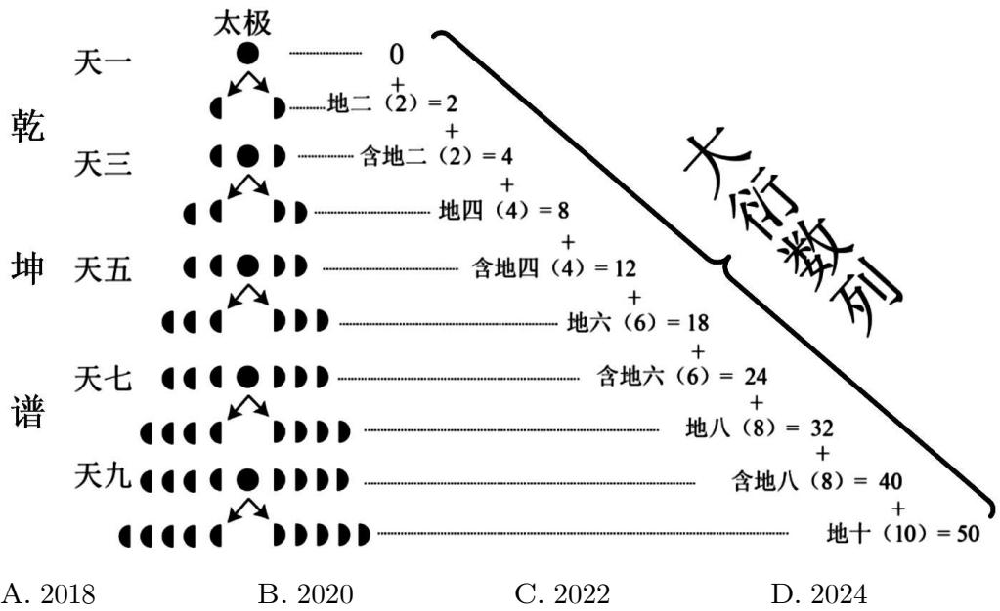

# 第 40 讲 数列的基本知识与概念

# 知识梳理

# 知识点一、数列的概念

(1) 数列的定义: 按照一定顺序排列的一列数称为数列, 数列中的每一个数叫做这个数列的项.  
(2) 数列与函数的关系: 从函数观点看, 数列可以看成以正整数集 $\mathbf{N}^{*}$ (或它的有限子集 ${ }^{o}$ $\{1, 2, \cdots, n\}$ ) 为定义域的函数 $a_{n} = f(n)$ 当自变量按照从小到大的顺序依次取值时所对应的一列函数值.  
(3) 数列有三种表示法, 它们分别是列表法、图象法和通项公式法.

# 知识点二、数列的分类

(1) 按照项数有限和无限分:   
(2) 按单调性来分: $\left\{ \begin{array}{l} \text{递增数列: } a_{n+1} \geqslant a_n \\ \text{递减数列: } a_{n+1} \geqslant a_n \\ \text{常数列: } a_{n+1} = a_n = \mathrm{C}(\text{常数}) \\ \text{摆动数列} \end{array} \right.$ ,

# 知识点三、数列的两种常用的表示方法

(1) 通项公式: 如果数列 $\{a_{n}\}$ 的第 $n$ 项与序号 $n$ 之间的关系可以用一个式子来表示, 那么这个公式叫做这个数列的通项公式.  
(2) 递推公式: 如果已知数列 $\{a_{n}\}$ 的第1项 (或前几项), 且从第二项 (或某一项) 开始的任一

项与它的前一项(或前几项)间的关系可以用一个公式来表示,那么这个公式就叫做这个数

列的递推公式.

# 【解题方法总结】

(1) 若数列 $\{a_{n}\}$ 的前 $n$ 项和为 $\mathrm{S}_n$ , 通项公式为 $a_{n}$ , 则 $a_{n} = \begin{cases} \mathrm{S}_{1}, & n = 1 \\ \mathrm{S}_{n} - \mathrm{S}_{n-1}, & n \geqslant 2, n \in \mathbb{N}^{*} \end{cases}$ . 注意: 根据 $\mathrm{S}_n$ 求 $a_{n}$ 时, 不要忽视对 $n = 1$ 的验证.  
(2) 在数列 $\{a_{n}\}$ 中, 若 $a_{n}$ 最大, 则 $\left\{ \begin{array}{l} a_{n} \geqslant a_{n-1} \\ a_{n} \geqslant a_{n+1} \end{array} \right.$ , 若 $a_{n}$ 最小, 则 $\left\{ \begin{array}{l} a_{n} \leqslant a_{n-1} \\ a_{n} \leqslant a_{n+1} \end{array} \right.$ .

# 1 题型一:数列的周期性

1779 (2024·全国·高三专题练习)在数列 $\{a_{n}\}$ 中, 已知 $a_{n}>0, a_{1}=1, a_{n+2}=\frac{1}{a_{n}+1}$ , 且 $a_{100}=a_{96}$ , 则 $a_{2022}+a_{3}=$ ()

A. $\frac{5}{2}$

B. $\frac{1+\sqrt{5}}{2}$

C. $\frac{\sqrt{5}}{2}$

D. $\frac{-1+\sqrt{5}}{2}$

1780 (2024·全国·高三专题练习)在数列 $\{a_{n}\}$ 中， $a_{1}=7, a_{2}=24$ ，对所有的正整数 n 都有 $a_{n+1}=a_{n}+a_{n+2}$ ，则 $a_{2024}=$ （）

A.-7

B. 24

C. -13

D. 25

1781 (2024·江西赣州·高三校联考阶段练习)斐波那契数列 $\{a_{n}\}$ 可以用如下方法定义: $a_{n+2}=a_{n+1}+a_{n}$ ，且 $a_{1}=a_{2}=1$ ，若此数列各项除以 4 的余数依次构成一个新数列 $\{b_{n}\}$ ，则数列 $\{b_{n}\}$ 的第 100 项为（）

A. 0

B. 1

C. 2

D. 3

1782 (2024·全国·高三对口高考)已知数列 $\{a_{n}\}$ 中， $a_{1}=\frac{1}{2},a_{n+1}=1-\frac{1}{a_{n}}(n\geqslant2)$ ，则 $a_{2014}=$ ()

A. $\frac{1}{2}$

B.-1

C. 2

D. 1

1783 (2024·全国·高三对口高考)设函数f定义如下,数列 $\{x_{n}\}$ 满足 $x_{0}=5$ ,且对任意自然数均有 $x_{n+1}=f(x_{n})$ ,则 $x_{2005}$ 的值为()

<table><tr><td>x</td><td>1</td><td>2</td><td>3</td><td>4</td><td>5</td></tr><tr><td>f(x)</td><td>4</td><td>1</td><td>3</td><td>5</td><td>2</td></tr></table>

A. 1

B. 2

C. 4

D. 5

1784 (2024·安徽合肥·合肥一六八中学校考模拟预测)在数列 $\{a_{n}\}$ 中, 已知 $a_{1}=2, a_{2}=3$ , 当 n $\geqslant2$ 时, $a_{n+1}$ 是 $a_{n} \cdot a_{n-1}$ 的个位数, 则 $a_{2023}=$ ()

A. 4

B. 3

C. 2

D. 1

1785 (2024·北京通州·统考三模)数列 $\{a_{n}\}$ 中， $a_{1}=2, a_{2}=4, a_{n-1}a_{n+1}=a_{n}(n\geqslant2)$ ，则 $a_{2023}=$ （）

A. $\frac{1}{4}$

B. $\frac{1}{2}$

C. 2

D. 4

# 2 题型二:数列的单调性

1786 (2024·北京密云·统考三模)设数列 $\{a_{n}\}$ 的前 n 项和为 $S_{n}$ ，则“对任意 $n \in N^{*}, a_{n} > 0$ ”是“数列 $\{S_{n}\}$ 为递增数列”的（）

A. 充分不必要条件

B. 必要不充分条件

C. 充分必要条件

D. 既不是充分也不是必要条件

1787 (2024·全国·高三专题练习)已知数列 $\{a_{n}\}$ 满足 $a_{1}=a>0, a_{n+1}=-a_{n}^{2}+ta_{n}(n\in\mathbb{N}^{*})$ ，若存在实数 t，使 $\{a_{n}\}$ 单调递增，则 a 的取值范围是（）

A. $(0,1)$

B. $(1,2)$

C. $(2,3)$

D. $(3,4)$

1788 (2024·全国·高三专题练习)已知数列 $\{a_{n}\}$ 满足 $\frac{a_{1}}{2} + \frac{a_{2}}{2^{2}} + \cdots + \frac{a_{n}}{2^{n}} = n (n \in \mathbb{N}^{*})$ , $b_{n} = \lambda (a_{n} - 1) - n^{2} + 4n$ ，若数列 $\{b_{n}\}$ 为单调递增数列，则 $\lambda$ 的取值范围是（）

A. $\left(\frac{3}{8},+\infty\right)$

B. $\left(\frac{1}{2},+\infty\right)$

C. $\left[\frac{3}{8},+\infty\right)$

D. $\left[\frac{1}{2},+\infty\right)$

1789 (2024·天津武清·高三天津市武清区杨村第一中学校考开学考试)数列 $\{a_{n}\}$ 的通项公式为 $a_{n}=kn^{2}+n+1$ ，则“ $k>-\frac{1}{3}$ ”是“ $\{a_{n}\}$ 为递增数列”的（）

A. 充分不必要条件

B. 必要不充分条件

C. 既不充分也不必要条件

D. 充要条件

1790 (2024·全国·高三专题练习)已知数列 $\{a_{n}\}$ 的通项公式为 $a_{n}=n^{2}-3\lambda n$ ，则“ $\lambda<1$ ”是“数列 $\{a_{n}\}$ 为递增数列”的（）

A. 充分不必要条件

B. 必要不充分条件

C. 充要条件

D. 既不充分也不必要条件

1791 (2024·江苏南通·高三期末)已知数列 $\{a_{n}\}$ 是递增数列，且 $a_{n}=\left\{\begin{aligned}(3-t)n-8, & n\leqslant6\\ t^{n-6}, & n>6\end{aligned}\right.$ ，则实数 t 的取值范围是（）

A. (2,3)

B. $[2,3)$

C. $\left(\frac{10}{7},3\right)$

D. $(1,3)$

1792 (2024·全国·高三专题练习)已知数列 $\{a_{n}\}$ 满足 $a_{n+1}=\log_{2}(a_{n}+1)$ ，若 $\{a_{n}\}$ 是递增数列，则 $a_{1}$ 的取值范围是（）

A. $(0,1)$

B. $(0,\sqrt{2})$

C. $(-1,0)$

D. $(1,+\infty)$

1793 (2024·甘肃张掖·高台县第一中学校考模拟预测)已知数列 $\{a_{n}\}$ 为递减数列, 其前 n 项和 $S_{n} = -n^{2} + 2n + m$ , 则实数 m 的取值范围是().

A. $(-2, +\infty)$

B. $(-∞,-2)$

C. $(2,+\infty)$

D. $(-∞,2)$

# 3 题型三:数列的最大(小)项

1794 (2024·湖南邵阳·邵阳市第二中学校考模拟预测)数列 $\{2n-1\}$ 和数列 $\{3n-2\}$ 的公共项从小到大构成一个新数列 $\{a_{n}\}$ ，数列 $\{b_{n}\}$ 满足： $b_{n}=\frac{a_{n}}{2^{n}}$ ，则数列 $\{b_{n}\}$ 的最大项等于 \_\_\_\_.

1795 (2024·全国·高三专题练习)记 $S_{n}$ 为数列 $\{a_{n}\}$ 的前 n 项和, 若 $a_{n}=2^{n-1}$ , 则 $(n^{2}-3n)\cdot\log_{2}(S_{n}+1)$ 的最小值为 \_\_\_\_.

1796 (2024·全国·高三专题练习)已知数列 $\{a_{n}\}$ 满足 $a_{1}=18, a_{n+1}-a_{n}=3n$ ，则 $\frac{a_{n}}{n}$ 的最小值为 \_\_\_\_

1797 (2024·全国·高三专题练习)已知正项数列 $\{a_{n}\}$ 满足 $a_{1}=1, a_{2}=64, a_{n}a_{n+2}=ka_{n+1}^{2}$ ，若 $a_{5}$ 是 $\{a_{n}\}$ 唯一的最大项，则 k 的取值范围为 \_\_\_\_.

1798 (2024·高三课时练习)数列 $\{a_{n}\}$ 的通项公式为 $a_{n}=\left\{\begin{aligned}&2^{n}-1,n\leqslant4,\\&-n^{2}+(a-1)n,n\geqslant5,\end{aligned}\right.$ 若 $a_{5}$ 是 $\{a_{n}\}$ 中的最大项，则 a 的取值范围是 \_\_\_\_.

1799 (2024·北京·高三北京八中校考阶段练习)数列 $\{a_{n}\}$ 中， $a_{n}=-n^{2}+11n(n\in\mathbb{N}^{*})$ ，则此数列最大项的值是 \_\_\_\_。

1800 (2024·全国·高三专题练习)已知 $a_{n}=n^{2}-tn+2022(n\in N_{+},t\in R)$ ，若数列 $\{a_{n}\}$ 中最小项为第3项，则 $t\in$ \_\_\_\_.

1801 (2024·全国·高三专题练习)已知数列 $\{a_{n}\}$ 的通项公式为 $a_{n}=n-\sqrt{n^{2}+2}$ ，则 $a_{n}$ 的最小值为 \_\_\_\_.

# 题型四:数列中的规律问题

1802 (2024·全国·高三专题练习)分形几何学是一门以不规则几何形态为研究对象的几何学, 它的研究对象普遍存在于自然界中, 因此又被称为“大自然的几何学”。按照如图1所示的分形规律, 可得如图2所示的一个树形图。若记图2中第n行黑圈的个数为 $a_{n}$ , 则 $a_{7}=$ ( )

```mermaid
graph TD
    A["○"] --> B["●"]
    A --> C["○"]
    D["●"] --> E["●"]
    D --> F["●"]
    D --> G["○"]
    H["●"] --> I["●"]
    H --> J["●"]
    H --> K["○"]
    L["○"] --> M["●"]
    L --> N["●"]
    L --> O["○"]
    P["●"] --> Q["●"]
    P --> R["●"]
    P --> S["○"]
    T["●"] --> U["●"]
    T --> V["●"]
    T --> W["○"]
    X["●"] --> Y["●"]
    X --> Z["●"]
    X --> AA["○"]
    AB["○"] --> AC["●"]
    AB --> AD["●"]
    AB --> AE["○"]
    AF["●"] --> AG["●"]
    AF --> AH["●"]
    AF --> AI["○"]
    AJ["●"] --> AK["●"]
    AJ --> AL["●"]
    AJ --> AM["○"]
    AN["●"] --> AO["●"]
    AN --> AP["●"]
    AN --> AQ["○"]
    AR["●"] --> AS["●"]
    AR --> AT["●"]
    AR --> AU["○"]
    AV["●"] --> AW["●"]
    AV --> AX["●"]
    AV --> AY["○"]
```

flowchart

图1

A. 110

B. 128

C. 144

D. 89

1803 (2024·云南保山·统考二模)我国南宋数学家杨辉126l年所著的《详解九章算法》一书里出现了如图所示的表,即杨辉三角,这是数学史上的一个伟大成就.杨辉三角也可以看做是二项式系数在三角形中的一种几何排列,若去除所有为1的项,其余各项依次构成数列2,3,3,4,6,4,5,10,10,5,…,则此数列的第56项为()

text_image

1
1 1
1 2 1
1 3 3 1
1 4 6 4 1
1 5 10 10 5 1
......

A. 11

B. 12

C. 13

D. 14

1804 (2024·全国·高三专题练习)古希腊毕达哥拉斯学派的数学家研究过各种多边形数. 如三角形数 1, 3, 6, 10, 第 n 个三角形数为 $\frac{n(n+1)}{2} = \frac{1}{2}n^2 + \frac{1}{2}n$ . 记第 n 个 k 边形数为 N(n,k)(k≥3), 以下列出了部分 k 边形数中第 n 个数的表达式: 三角形数: N(n,3)= $\frac{1}{2}n^2 + \frac{1}{2}n$ ; 正方形数: N(n,4)= $n^2$ ; 五边形数: N(n,5)= $\frac{3}{2}n^2 - \frac{1}{2}n$ ; 六边形数: N(n,6)= $2n^2 - n$ , 可以推测 N(n,k) 的表达式, 由此计算 N(20,23)=

A. 4020

B. 4010

C. 4210

D. 4120

1805 (2024·全国·高三专题练习)古希腊科学家毕达哥拉斯对“形数”进行了深入的研究,若一定数目的点或圆在等距离的排列下可以形成一个等边三角形,则这样的数称为三角形数,如1,3,6,10,15,21,…这些数量的点都可以排成等边三角形,∴都是三角形数,把三角形数按照由小到大的顺序排成的数列叫做三角数列 $\{a_{n}\}$ 类似地,数1,4,9,16,…叫做正方形数,则在三角数列 $\{a_{n}\}$ 中,第二个正方形数是()

A. 28

B. 36

C. 45

D. 55

1806 (2024·全国·高三专题练习)早在3000年前,中华民族的祖先就已经开始用数字来表达这个世界. 在《乾坤谱》中,作者对易传“大衍之数五十”进行了一系列推论,用来解释中国传统文化中的太极衍生原理,如图. 该数列从第一项起依次是0,2,4,8,12,18,24,32,40,50,60,72,…,若记该数列为 $\{a_{n}\}$ ,则 $a_{2021}-a_{2020}=$

line

| A. 2018 | B. 2020 | C. 2022 | D. 2024 |
| ------- | ------- | ------- | ------- |
| 太极    | 0       | -       | -       |
| 地二    | +       | -       | -       |
| 含地二   | +       | -       | -       |
| 地四    | +       | -       | -       |
| 含地四   | +       | -       | -       |
| 地六    | +       | -       | -       |
| 含地六   | +       | -       | -       |
| 地八    | +       | -       | -       |
| 含地八   | +       | -       | -       |
| 地十    | +       | -       | -       |
| 地十    | +       | -       | -       |
| 地十    | +       | -       | -       |
| 地十    | +       | -       | -       |
| 地十    | +       | -       | -       |
| 地十    | +       | -       | -       |
| 地十    | +       | -       | -       |

1807 (2024·全国·高三专题练习)观察下列各式：

$$
a + b = 1;
$$

$$
a ^ {2} + b ^ {2} = 3;
$$

$$
a ^ {3} + b ^ {3} = 4;
$$

$$
a ^ {4} + b ^ {4} = 7;
$$

$$
a ^ {5} + b ^ {5} = 1 1;
$$

...

则 $a^{10} + b^{10} =$ （

A. 28

B. 76

C. 123

D. 10

1808 (2024·全国·高三专题练习)古希腊科学家毕达哥拉斯对“形数”进行了深入的研究,若一定数目的点或圆在等距离的排列下可以形成一个等边三角形,则这样的数称为三角形数,如1,3,6,10,15,21,…这些数量的点都可以排成等边三角形,∴都是三角形数,把三角形数按照由小到大的顺序排成的数列叫做三角数列 $\{a_{n}\}$ . 类似地,数1,4,9,16,…叫做正方形数,则在三角数列 $\{a_{n}\}$ 中,第二个正方形数是()

A. 36

B. 25

C. 49

D. 64

# 5 题型五:数列的恒成立问题

1809 (2024·全国·高三专题练习)已知数列 $\{a_{n}\}$ 的通项公式 $a_{n}=10n-2^{n}$ ，前 n 项和是 $S_{n}$ ，对于 $\forall n\in N^{*}$ ，都有 $S_{n}\leqslant S_{k}$ ，则 k= \_\_\_\_.  
1810 (2024·全国·高三专题练习)已知数列 $\{a_{n}\}$ 满足 $a_{n}=\frac{1}{n}+\frac{1}{n+1}+\cdots+\frac{1}{2n}$ ，若 $k\geqslant a_{n}$ 恒成立，则实数 k 的最小值为 \_\_\_\_.  
1811 (2024·河南郑州·高三校联考阶段练习)数列 $\{a_{n}\}$ 满足 $a_{n}-a_{n-1}=\frac{1}{n(n+1)}(n\geqslant2,$ 且 $n\in N^{*})$ , $a_{1}=2$ , 对于任意 $n\in N^{*}$ 有 $\lambda>a_{n}$ 恒成立, 则 $\lambda$ 的取值范围是 \_\_\_\_.  
1812 (2024·全国·高三专题练习)数列 $\{a_{n}\}$ 满足 $a_{n}=n^{2}+kn+2$ ，若不等式 $a_{n}\geqslant a_{4}$ 恒成立，则实数 k 的取值范围是（）

A. $[-9, - 8]$

B. $[-9,-7]$

C. $(-9,-8)$

D. $(-9,-7)$

1813 (2024·河北唐山·高三唐山一中校考阶段练习)数列 $\{a_{n}\}$ 满足 $a_{1}=\frac{1}{4}$ , $a_{n+1}=\frac{1}{4-4a_{n}}$ , 若不等式 $\frac{a_{2}}{a_{1}}+\frac{a_{3}}{a_{2}}+\cdots+\frac{a_{n+2}}{a_{n+1}}<n+\lambda$ , 对任何正整数 n 恒成立, 则实数 $\lambda$ 的最小值为

A. $\frac{7}{4}$

B. $\frac{3}{4}$

C. $\frac{7}{8}$

D. $\frac{3}{8}$

# 6 题型六:递推数列问题

1814 (2024·全国·高三专题练习)设数列 $\{a_{n}\}$ 满足 $a_{2009}=\sqrt{2}$ ，且 $a_{n+1}a_{n}=2a_{n+1}-2(n\in\mathbb{N}^{*})$ ，则数列的前 2009 项之和为 \_\_\_\_.  
1815 (2024·全国·高三专题练习)正项数列 $\{a_{n}\}$ 中， $a_{n+1}=\frac{a_{n}}{1+3a_{n}}$ ， $a_{1}=1$ ，猜想通项公式为 $a_{n}=$ \_\_\_\_.  
1816 (2024·广东佛山·统考模拟预测)数列 $\{a_{n}\}$ 满足 $a_{n+1} > a_{n}$ ， $a_{2n} = 2a_{n} + 1$ ，写出一个符合上述条件的数列 $\{a_{n}\}$ 的通项公式 \_\_\_\_.  
1817 (2024·全国·模拟预测)斐波那契数列由意大利数学家斐波那契以兔子繁殖为例引入,故又称为“兔子数列”,即1,1,2,3,5,8,13,21,34,55,89,144,233,…. 在实际生活中,很多花朵(如梅花、飞燕草、万寿菊等)的瓣数恰是斐波那契数列中的数,斐波那契数列在现代物理及化学等领域也有着广泛的应用．斐波那契数列 $\{a_{n}\}$ 满足: $a_{1}=a_{2}=1,a_{n+2}=a_{n+1}+a_{n}(n\in\mathbb{N}^{*})$ ,则 $1+a_{3}+a_{5}+a_{7}+a_{9}+\cdots+a_{2022}$ 是斐波那契数列 $\{a_{n}\}$ 中的第\_\_\_\_项.  
1818 (2024·全国·高三专题练习)将一个2021边形的每个顶点染为红、蓝、绿三种颜色之一，使

得相邻顶点的颜色互不相同．问:有多少种满足条件的染色方法?

1819 (2024·全国·高三专题练习)已知平面上有 n 条直线, 其中任意两条不平行, 任何三条不共线. 问: 这些直线把平面分成多少个部分? 其中有多少个部分是无界的?

1820 (2024·全国·高三专题练习)(1)学生甲手里有一枚质地均匀的硬币,他投掷10次,不连续出现正面的可能情形有多少种?

(2) 用 1, 2, 3, 4 四个数字组成一个 6 位数, 要求不允许两个 1 紧挨在一起, 那么可以组成多少个不同的 6 位数?

