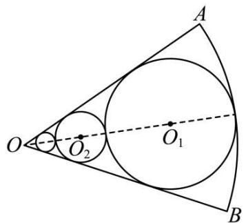
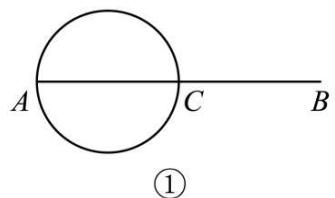
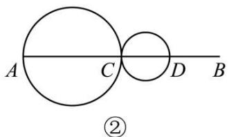
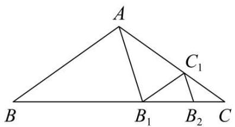

# 第42讲 等比数列及其前 $n$ 项和

# 知识梳理

# 知识点一．等比数列的有关概念

(1) 定义: 如果一个数列从第 2 项起, 每一项与它的前一项的比等于同一常数 (不为零), 那么这个数列就叫做等比数列. 这个常数叫做等比数列的公比, 通常用字母 $q$ 表示, 定义的表达式为 $\frac{a_{n+1}}{a_n} = q$ .

(2) 等比中项: 如果 $a, \mathbf{G}, b$ 成等比数列, 那么 $\mathbf{G}$ 叫做 $a$ 与 $b$ 的等比中项.

即 $\mathbf{G}$ 是 $a$ 与 $b$ 的等比中项 $\Leftrightarrow a, \mathbf{G}, b$ 成等比数列 $\Rightarrow \mathbf{G}^2 = ab$ .

# 知识点二．等比数列的有关公式

(1) 等比数列的通项公式

设等比数列 $\{a_{n}\}$ 的首项为 $a_1$ ，公比为 $q(q \neq 0)$ ，则它的通项公式 $a_{n} = a_{1}q^{n-1} = c \cdot q^{n}\left(c = \frac{a_{1}}{q}\right)(a_{1}, q \neq 0)$ .

推广形式: $a_{n} = a_{m} \cdot q^{n - m}$

(2) 等比数列的前 $n$ 项和公式

等比数列 $\{a_{n}\}$ 的公比为 $q(q\neq 0)$ ，其前 $n$ 项和为 $\mathrm{S}_n = \left\{ \begin{array}{ll}na_1(q = 1)\\ \frac{a_1(1 - q^n)}{1 - q} = \frac{a_1 - a_nq}{1 - q} (q\neq 1) \end{array} \right.$

注①等比数列的前 $n$ 项和公式有两种形式，在求等比数列的前 $n$ 项和时，首先要判断公比 $q$ 是否为1，再由 $q$ 的情况选择相应的求和公式，当不能判断公比 $q$ 是否为1时，要分 $q = 1$ 与 $q \neq 1$ 两种情况讨论求解.

②已知 $a_1, q (q \neq 1), n$ (项数)，则利用 $\mathrm{S}_n = \frac{a_1(1 - q^n)}{1 - q}$ 求解；已知 $a_1, a_n, q (q \neq 1)$ ，则利用 $\mathrm{S}_n = \frac{a_1 - a_nq}{1 - q}$ 求解.

③ $\mathrm{S}_n = \frac{a_1(1 - q^n)}{1 - q} = \frac{-a_1}{1 - q}\cdot q^n +\frac{a_1}{1 - q} = kq^n -k(k\neq 0,q\neq 1),\mathrm{S}_n$ 为关于 $q^n$ 的指数型函数，且系数与常数互为相反数.

# 知识点三．等比数列的性质

(1) 等比中项的推广.

若 $m + n = p + q$ 时，则 $a_{m}a_{n} = a_{p}a_{q}$ ，特别地，当 $m + n = 2p$ 时， $a_{m}a_{n} = a_{p}^{2}$

(2) ① 设 $\{a_{n}\}$ 为等比数列，则 $\{\lambda a_{n}\}$ ( $\lambda$ 为非零常数), $\{|a_{n}|\}$ , $\{a_{n}^{m}\}$ 仍为等比数列.

②设 $\{a_{n}\}$ 与 $\{b_{n}\}$ 为等比数列，则 $\{a_{n}b_{n}\}$ 也为等比数列.

(3) 等比数列 $\{a_{n}\}$ 的单调性 (等比数列的单调性由首项 $a_{1}$ 与公比 $q$ 决定).

当 $\left\{ \begin{array}{l}a_{1} > 0\\ q > 1 \end{array} \right.$ 或 $\left\{ \begin{array}{ll}a_1 <   0\\ 0 <   q <   1 \end{array} \right.$ 时， $\{a_n\}$ 为递增数列；

当 $\left\{ \begin{array}{l}a_{1} > 0\\ 0 <   q <   1 \end{array} \right.$ 或 $\left\{ \begin{array}{l}a_1 <   0\\ q > 1 \end{array} \right.$ 时， $\{a_n\}$ 为递减数列.

(4) 其他衍生等比数列.

若已知等比数列 $\{a_{n}\}$ ，公比为 $q$ ，前 $n$ 项和为 $\mathbf{S}_n$ ，则：

①等间距抽取

$a_{p}, a_{p + t}, a_{p + 2t}, \cdots, a_{p + (n - 1)t}, \cdots$ 为等比数列，公比为 $q^{t}$ .

②等长度截取

$S_{m},S_{2m}-S_{m},S_{3m}-S_{2m},\cdots$ 为等比数列，公比为 $q^{m}$ （当q=-1时，m不为偶数）.

# 【解题方法总结】

(1) 若 $m + n = p + q = 2k(m, n, p, q, k \in \mathbb{N}^*)$ ，则 $a_m \cdot a_n = a_p \cdot a_q = a_k^2$ .  
(2) 若 $\{a_{n}\}, \{b_{n}\}$ (项数相同) 是等比数列, 则 $\{\lambda a_{n}\} (\lambda \neq 0), \left\{\frac{1}{a_{n}}\right\}, \{a_{n}^{2}\}, \{a_{n} \cdot b_{n}\}, \left\{\frac{a_{n}}{b_{n}}\right\}$ 仍是等比数列.  
(3) 在等比数列 $\{a_{n}\}$ 中, 等距离取出若干项也构成一个等比数列, 即 $a_{n}, a_{n+k}, a_{n+2k}, a_{n+3k} \cdots$ 为

等比数列,公比为 $q^{k}$ .

(4) 公比不为 -1 的等比数列 $\{a_{n}\}$ 的前 n 项和为 $S_{n}$ ，则 $S_{n}, S_{2n}-S_{n}, S_{3n}-S_{2n}$ 仍成等比数列，其公比为 $q^{n}$ .  
(5) $\{a_{n}\}$ 为等比数列，若 $a_1 \cdot a_2 \cdots a_n = \mathrm{T}_n$ ，则 $\mathrm{T}_n, \frac{\mathrm{T}_{2n}}{\mathrm{T}_n}, \frac{\mathrm{T}_{3n}}{\mathrm{T}_{2n}}, \cdots$ 成等比数列.  
(6) 当 $q \neq 0, q \neq 1$ 时， $\mathrm{S}_n = k - k \cdot q^n (k \neq 0)$ 是 $\{a_n\}$ 成等比数列的充要条件，此时 $k = \frac{a_1}{1 - q}$ .  
(7)有穷等比数列中,与首末两项等距离的两项的积相等. 特别地,若项数为奇数时,还等于中间

项的平方.

(8) 若 $\{a_{n}\}$ 为正项等比数列，则 $\{\log_c a_n\} (c > 0, c \neq 1)$ 为等差数列.  
(9) 若 $\{a_{n}\}$ 为等差数列, 则 $\{c^{a_n}\} (c > 0, c \neq 1)$ 为等比数列.  
(10) 若 $\{a_{n}\}$ 既是等差数列又是等比数列 $\Leftrightarrow \{a_{n}\}$ 是非零常数列.

# 必考题型全归纳

# 1 题型一:等比数列的基本运算

1890 (2024·北京·高三汇文中学校考阶段练习)在等比数列 $\{a_{n}\}$ 中， $a_{1}=3, a_{1}+a_{2}+a_{3}=9$ ，则 $a_{4}+a_{5}+a_{6}$ 等于 ()

A. 9

B. 72

C. 9 或 70

D. 9 或 -72

1891 (2024·全国·高三专题练习)已知递增的等比数列 $\{a_{n}\}$ 中, 前3项的和为7, 前3项的积为8, 则 $a_{4}$ 的值为 ()

A. 2

B. 4

C. 6

D. 8

1892 (2024·浙江温州·乐清市知临中学校考模拟预测)已知等比数列 $\{a_{n}\}$ 的前 n 项和为 $S_{n}$ ，公比为 q，且 $S_{n}=a_{n+1}-1$ ，则（）

A. $a_{1} = 2$

B. $S_{2} = 2$

C. q=1

D. q=2

1893 (2024·四川遂宁·射洪中学校考模拟预测)在等比数列 $\{a_{n}\}$ 中, 若 $a_{2}=4, a_{5}=-32$ , 则公比 q 应为 ()

A. $\pm\frac{1}{2}$

B. $\pm 2$

C. $\frac{1}{2}$

D.-2

1894 (2024·全国·高三专题练习)设等比数列 $\{a_{n}\}$ 的各项均为正数, 前 n 项和 $S_{n}$ , 若 $a_{1}=1$ , $S_{5}=5S_{3}-4$ , 则 $S_{4}=$ ()

A. $\frac{15}{8}$

B. $\frac{65}{8}$

C. 15

D. 40

1895 (2024·全国·高三对口高考)已知数列 $\{a_{n}\}$ 是等比数列， $a_{1} + a_{2} = 2, a_{7} + a_{8} = 128$ ，则该数列的 $S_{10}$ 以及 $a_{1}$ 依次为（）

A. $682, \frac{2}{3}$

B.-682,-2

C. $682, \frac{2}{3}$ 或 -2

D. -682, $\frac{2}{3}$ 或 -2

1896 (2024·江西抚州·统考模拟预测)已知正项等比数列 $\{a_{n}\}$ 的前 n 项和为 $S_{n}$ ，若 $a_{4}a_{5}=3a_{8}$ ， $S_{3}=39$ ，则 $a_{4}=$ （）

A. 64

B. 81

C. 128

D. 192

1897 (2024·江西·校联考模拟预测)已知等比数列 $\{a_{n}\}$ 的前 4 项和为 30, $a_{1}-a_{5}=15$ , 则 $a_{7}=$ ()

A. $\frac{1}{4}$

B. $\frac{1}{2}$

C. 1

D. 2

# 2 题型二:等比数列的判定与证明

1898 (2024·全国·高三专题练习)甲、乙两个容器中分别盛有浓度为 $10\%$ ， $20\%$ 的某种溶液 $500ml$ ，同时从甲、乙两个容器中取出 $100ml$ 溶液，将其倒入对方的容器并搅匀，这称为一次调和．记 $a_1 = 10\%$ ， $b_1 = 20\%$ ，经 $(n - 1)$ 次调和后，甲、乙两个容器的溶液浓度分别为 $a_n$ ， $b_n$

(1) 试用 $a_{n-1}, b_{n-1}$ 表示 $a_n, b_n$ .  
(2) 证明: 数列 $\left\{a_{n}-b_{n}\right\}$ 是等比数列, 并求出 $a_{n}, b_{n}$ 的通项.

1899 (2024·全国·高三专题练习)已知数列 $\{a_{n}\}$ 满足 $4S_{n}-2a_{n}=2^{n}, n\in N^{*}$ ，其中 $S_{n}$ 为 $\{a_{n}\}$ 的前 n 项和．证明：

(1) $\left\{\frac{a_{n}}{2^{n}}-\frac{1}{6}\right\}$ 是等比数列.   
(2) $\frac{1}{6a_{1}-3}+\frac{1}{6a_{2}+3}+\frac{1}{6a_{3}-3}+\cdots+\frac{1}{6a_{n}+3\times(-1)^{n}}<1.$

1900 (2024·安徽亳州·蒙城第一中学校联考模拟预测)甲、乙、丙三个小学生相互抛沙包,第一次由甲抛出,每次抛出时,抛沙包者等可能的将沙包抛给另外两个人中的任何一个,设第 $n(n \in \mathbf{N}^{*})$ 次抛沙包后沙包在甲手中的方法数为 $a_{n}$ ,在丙手中的方法数为 $b_{n}$ .

(1) 求证: 数列 $\left\{a_{n+1} + a_{n}\right\}$ 为等比数列, 并求出 $\left\{a_{n}\right\}$ 的通项;  
(2) 求证: 当 n 为偶数时, $a_{n} > b_{n}$ .

1901 (2024·广东东莞·校考三模)已知数列 $\{a_{n}\}$ 和 $\{b_n\}$ , $a_1 = 2$ , $\frac{1}{b_n} - \frac{1}{a_n} = 1$ , $a_{n+1} = 2b_n$ .

(1) 求证数列 $\left\{\frac{1}{a_{n}}-1\right\}$ 是等比数列；  
(2) 求数列 $\left\{\frac{n}{b_{n}}\right\}$ 的前 n 项和 $T_{n}$ .

1902 (2024·全国·高三专题练习)设数列 $\{a_{n}\}$ 的首项 $a_{1}=a$ ，且 $a_{n+1}=\left\{\begin{aligned}&\frac{1}{2}a_{n},n\text{为偶数}\\&a_{n}+\frac{1}{4},n\text{为奇数}\end{aligned}\right.$ 记 $b_{n}=a_{2n-1}-\frac{1}{4},n=1,2,3\ldots$

(1) 求 $a_{2}, a_{3}$ ;   
(2) 判断数列 $\{b_{n}\}$ 是否为等比数列, 并证明你的结论;  
(3) 求 $b_{1} + b_{2} + \cdots + b_{n}$ .

1903 (2024·全国·高三专题练习)已知数列 $\{a_{n}\}$ 、 $\{b_{n}\}$ 满足 $4a_{n+1}=3a_{n}-b_{n}+t,4b_{n+1}=3b_{n}-a_{n}-t,t\in R,n\in N_{+}$ ，且 $a_{1}=1,b_{1}=0$ .

(1) 求证: $\{a_{n} + b_{n}\}$ 是等比数列;  
(2) 若 $\{a_{n}\}$ 是递增数列, 求实数 t 的取值范围.

1904 (2024·全国·高三专题练习)数列 $\{a_{n}\}$ 的前 n 和 $S_{n}$ 满足 $S_{n}=2a_{n}-n(n\in\mathbb{N}^{*})$ ,

(1) 求 $a_{1}$ 的值及 $a_{n}$ 与 $a_{n-1}$ 的关系；  
(2) 求证: $\{a_{n} + 1\}$ 是等比数列, 并求出 $\{a_{n}\}$ 的通项公式.

1905 (2024·云南·校联考三模)已知数列 $\{a_{n}\}$ 有递推关系 $a_{n+1}=\frac{7a_{n}-8}{3a_{n}-4}(n\in\mathrm{N}^{*},a_{n}\neq\frac{4}{3})$ , $a_{1}=\frac{69}{29}$ ，记 $a_{n}=b_{n}-k(k\in\mathbb{Z})$ ，若数列 $\{b_{n}\}$ 的递推式形如 $b_{n+1}=\frac{rb_{n}}{pb_{n}+q}(p,q,r\in\mathbb{R}$ 且 $p,r\neq0)$ ，也即分子中不再含有常数项.

(1) 求实数 k 的值;  
(2) 证明: $\left\{\frac{1}{b_n} - \frac{3}{5}\right\}$ 为等比数列, 并求其首项和公比.

1906 (2024·福建厦门·统考模拟预测)已知数列 $\{a_{n}\}$ 满足 $a_1 = 1, a_{n+1} = \frac{a_n + 2}{a_n}, n \in \mathbb{N}^*$ .

(1) 证明 $\left\{\frac{a_n - 2}{a_n + 1}\right\}$ 是等比数列；  
(2) 若 $b_{n}=\frac{3}{a_{n}+1}$ ，求 $\{b_{n}\}$ 的前 n 项和 $S_{n}$ .

1907 (2024·山东潍坊·三模)已知数列 $\{a_{n}\}$ 和 $\{b_{n}\}$ 满足 $a_{1}=3, b_{1}=2, a_{n+1}=a_{n}+2b_{n}, b_{n+1}=2a_{n}+b_{n}$ .

(1) 证明: $\{a_{n} + b_{n}\}$ 和 $\{a_{n} - b_{n}\}$ 都是等比数列;  
(2) 求 $\{a_{n}b_{n}\}$ 的前 n 项和 $S_{n}$ .

# 3 题型三:等比数列项的性质应用

1908 (2024·全国·高三对口高考)已知等比数列 $\{a_{n}\}$ 的前 n 项和为 $S_{n}=3^{n-1}-c$ ，则 c= \_\_\_\_.

1909 (2024·山东泰安·统考二模)若 m, n 是函数 $f(x)=x^{2}-px+q(p>0,q>0)$ 的两个不同零点，且 m, n, -2 这三个数可适当排序后成等差数列，也可适当排序后成等比数列，则 pq= \_\_\_\_.

1910 (2024·全国·高三专题练习)已知数列 $\{a_{n}\}$ 中， $a_{1} \neq 0, a_{m+n} = a_{m}a_{n}(m, n \in \mathbb{N}^{*})$ ，且 $a_{3}, a_{11}$ 是函数 $f(x) = 2x^{2} + 19x + 20$ 的两个零点，则 $a_{7} =$ \_\_\_\_ .

1911 (2024·高三课时练习)已知等比数列 $\{a_{n}\}$ 的公比 $q = -\frac{1}{2}$ ，该数列前9项的乘积为1，则

$$
a _ {1} = \underline {{\quad}}.
$$

1912 (2024·江西·校联考二模)在正项等比数列 $\{a_{n}\}$ 中， $a_{3}$ 与 $a_{8}$ 是方程 $x^{2}-30x+10=0$ 的两个根，则 $\lg a_{1}+\lg a_{2}+\cdots+\lg a_{10}=$ \_\_\_\_.  
1913 (2024·全国·高三专题练习)等比数列 $\{a_{n}\}$ 中， $a_{1}a_{9}=256, a_{4}+a_{6}=40$ ，则公比 q 的值为 \_\_\_\_.  
1914 (2024·全国·高三专题练习)在 1 和 9 之间插入三个数,使这五个数组成正项等比数列,则中间三个数的积等于 \_\_\_\_.  
1915 (2024·四川成都·高三四川省成都市玉林中学校考阶段练习)若数列 $\{a_{n}\}$ 是等比数列，且 $a_{1}a_{7}a_{13}=8$ ，则 $a_{3}a_{11}=$ \_\_\_\_.  
1916 (2024·全国·高三专题练习)已知正项数列 $\{a_{n}\}$ 是公比不等于 1 的等比数列，且 $\lg a_{1} + \lg a_{2023} = 0$ ，若 $f(x) = \frac{2}{1 + x^{2}}$ ，则 $f(a_{1}) + f(a_{2}) + \cdots + f(a_{2023}) =$ \_\_\_\_.  
1917 (2024·四川成都·统考二模)已知等比数列 $\{a_{n}\}$ 的首项为 1，且 $a_{6} + a_{4} = 2(a_{3} + a_{1})$ ，则 $a_{1}a_{2}a_{3}\cdots a_{7} =$ \_\_\_\_ .  
1918 (2024·重庆·高三阶段练习)在等比数列 $\left\{a_{n}\right\}$ 中， $a_{1}+a_{2}=30, a_{3}+a_{4}=60$ ，则 $a_{7}+a_{8}=$ \_\_\_\_.

# 4 题型四:等比数列前 n 项和的性质

1919 (2024·全国·高三对口高考)已知数列 $\{a_{n}\}$ 为等比数列， $S_{n}$ 为其前 n 项和. 若 $S_{30}=13S_{10}$ ， $S_{10}+S_{30}=140$ ，则 $S_{20}$ 的值为 \_\_\_\_.  
1920 (2024·河北沧州·统考模拟预测)已知等比数列 $\{a_{n}\}$ 的前 n 项和为 $S_{n}$ ，若 $S_{3}=2, S_{6}=6$ ，则 $S_{24}=$ \_\_\_\_.  
1921 (2024·高三课时练习)已知 $S_{n}$ 是正项等比数列 $\{a_{n}\}$ 的前 n 项和， $S_{10}=20$ ，则 $S_{30}-2S_{20}+S_{10}$ 的最小值为 \_\_\_\_.  
1922 (2024·全国·高三专题练习)已知数列 $\{a_{n}\}$ 是等比数列， $S_{n}$ 是其前 n 项和，且 $S_{6}=15$ ， $S_{18}=195$ ，则 $S_{24}=$ \_\_\_\_.  
1923 (2024·全国·高三专题练习)设正项等比数列 $\{a_{n}\}$ 的前 n 项和为 $S_{n}$ ，若 $S_{4}=10S_{2}$ ，则 $\frac{S_{6}}{S_{2}}$ 的值为 \_\_\_\_.  
1924 (2024·全国·高三专题练习)设正项等比数列 $\{a_{n}\}$ 的前 n 项和为 $S_{n}$ ，且 $2^{10}S_{30}-(2^{10}+1)S_{20}+S_{10}=0$ ，则公比 q= \_\_\_\_.  
1925 (2024·重庆·高三统考阶段练习)已知等比数列 $\{a_{n}\}$ 的前 n 项和为 $S_{n}, S_{6}=7, a_{2}+a_{5}=-3$ ，则 $\frac{a_{1}+a_{3}}{a_{2}}=$ \_\_\_\_.  
1926 (2024·全国·高三专题练习)已知正项等比数列 $\{a_{n}\}$ 的前 n 项和为 $S_{n}$ ，若 $S_{3}=4, S_{9}=19$ ，则 $S_{6}, S_{9}$ 的等差中项为 \_\_\_\_.  
1927 (2024·江西南昌·南昌十中校考模拟预测)已知等比数列 $\{a_{n}\}$ 的前 $n$ 项和为 $\mathrm{S}_n$ ，若 $\mathrm{S}_4 =$

3, $S_{8}=9$ , 则 $S_{16}$ 的值为 \_\_\_\_

# 5 题型五:求数列的通项 $a_{n}$

1928 (2024·广西玉林·统考三模)记数列 $\{a_{n}\}$ 的前 n 项和为 $S_{n}$ ，已知向量 $\vec{m} = (a_{n+1}, S_{n})$ ， $\vec{n} = (1, 2)$ ，若 $a_{1} = 2$ ，且 $\vec{m} \parallel \vec{n}$ ，则 $\{a_{n}\}$ 通项为 \_\_\_\_.  
1929 (2024·内蒙古包头·高三统考期末)已知数列 $\{a_{n}\}$ 和 $\{b_{n}\}$ 满足 $a_{1}=1, b_{1}=2, a_{n+1}=3a_{n}-b_{n}+4, b_{n+1}=3b_{n}-a_{n}-4.$ 则数列 $\{a_{n}+b_{n}\}$ 的通项 $a_{n}+b_{n}=$ \_\_\_\_.  
1930 (2024·上海浦东新·高三校考开学考试)设幂函数 $f(x) = x^3$ ，数列 $\{a_n\}$ 满足： $a_1 = 2021$ ，且 $a_{n+1} = f(a_n)(n \in \mathbb{N}^*)$ ，则数列 $\{a_n\}$ 的通项 $a_n =$ \_\_\_\_.  
1931 (2024·江苏·高三专题练习)写出一个满足前5项的和为31,且递减的等比数列的通项 $a_{n}$ = \_\_\_\_.   
1932 (2024·山西太原·统考模拟预测)已知数列 $\{a_{n}\}$ 的前 n 项和为 $S_{n}$ 且满足 $S_{n} + a_{n} = -2$ ，则数列 $\{a_{n}\}$ 的通项 $a_{n} =$ \_\_\_\_ .  
1933 (2024·上海·高三专题练习)数列 $\{a_{n}\}$ 的前 n 项和为 $S_{n}, a_{1}=1, a_{n+1}=2S_{n}$ ，则数列的通项 $a_{n}=$ \_\_\_\_.  
1934 (2024·内蒙古包头·高三统考期中)已知数列 $\{a_{n}\}$ 的通项 $a_{n}$ 与前 n 项和 $S_{n}$ 之间满足关系 $S_{n}=2-3a_{n}$ ，则 $a_{n}=$ \_\_\_\_  
1935 (2024·上海·高三专题练习)数列 $\{a_{n}\}$ 的通项 $a_{n}=3n-1,\{b_{n}\}$ 的通项 $b_{n}=2^{n}$ ，由 $a_{n}$ 与 $b_{n}$ 中公共项，并按原顺序组成一个新的数列 $\{c_{n}\}$ ，求 $\{c_{n}\}$ 的前 n 项和.

# 6 题型六:奇偶项求和问题的讨论

1936 (2024·湖南长沙·长郡中学校联考模拟预测)已知数列 $\{a_{n}\}$ 满足 $a_{1}=3$ ，且 $a_{n+1}=\left\{\begin{aligned}&2a_{n},n\text{是偶数},\\&a_{n}-1,n\text{是奇数}.\end{aligned}\right.$

(1) 设 $b_{n} = a_{2n} + a_{2n-1}$ ，求数列 $\{b_{n}\}$ 的通项公式；  
(2) 设数列 $\{a_{n}\}$ 的前 n 项和为 $S_{n}$ ，求使得不等式 $S_{n} > 2023$ 成立的 n 的最小值.

1937 (2024·河北·模拟预测)已知数列 $\{a_{n}\}$ 满足 $a_{1}=2, a_{n+1}=\left\{\begin{aligned}&\frac{1}{2}a_{n}, n\text{为奇数},\\&a_{n}+\frac{1}{2}, n\text{为偶数}.\end{aligned}\right.$

(1) 记 $b_{n}=a_{2n+1}-a_{2n-1}$ ，证明：数列 $\{b_{n}\}$ 为等比数列；  
(2) 记 $c_{n}=a_{2n}-\frac{1}{2}$ ，求数列 $\{nc_{n}\}$ 的前 n 项和 $T_{n}$ .

1938 (2024·山东济宁·统考二模)已知数列 $\{a_{n}\}$ 的前 n 项和为 $S_{n}, a_{n-1} + a_{n+1} = 2a_{n} (n \geqslant 2, n \in \mathbb{N}^{*})$ ，且 $a_{1} = 1, S_{5} = 15$ .

(1) 求数列 $\{a_{n}\}$ 的通项公式;  
(2) 若 $b_n = \begin{cases} a_n, & n \text{为奇数} \\ 2^{a_{n-1}}, & n \text{为偶数} \end{cases}$ , 求数列 $\{b_n\}$ 的前 $2n$ 项和 $T_{2n}$ .

1939 (2024·天津南开·统考二模)设 $\{a_{n}\}$ 为等比数列， $\{b_{n}\}$ 为公差不为零的等差数列，且 $a_{1}=b_{3}=3, a_{2}=b_{9}, a_{3}=b_{27}$ .

(1) 求 $\{a_{n}\}$ 和 $\{b_{n}\}$ 的通项公式；  
(2) 记 $\{a_{n}\}$ 的前 $n$ 项和为 $\mathrm{S}_n$ , $\{b_n\}$ 的前 $n$ 项和为 $\mathrm{T}_n$ , 证明: $\frac{\mathrm{T}_n}{\mathrm{S}_n} \leqslant \frac{1}{3}$ ;

(3) 记 $c_{n}=\left\{\begin{aligned}&\frac{a_{\frac{n+1}{2}}}{b_{n}+2},n\text{为奇数}\\ &-\frac{a_{\frac{n}{2}}}{(b_{n}-1)(b_{n}+1)},n\text{为偶数}\end{aligned}\right.$ ，求 $\sum_{i=1}^{2n}c_{i}.$

1940 (2024·湖南邵阳·统考三模)记 $S_{n}$ 为等差数列 $\{a_{n}\}$ 的前 n 项和，已知 $a_{3}=5, S_{9}=81$ ，数列 $\{b_{n}\}$ 满足 $a_{1}b_{1}+a_{2}b_{2}+a_{3}b_{3}+\cdots+a_{n}b_{n}=(n-1)\cdot3^{n+1}+3.$

(1) 求数列 $\{a_{n}\}$ 与数列 $\{b_{n}\}$ 的通项公式；  
(2) 数列 $\{c_{n}\}$ 满足 $c_{n}=\left\{\begin{aligned}&b_{n},n\text{为奇数}\\&\frac{1}{a_{n}a_{n+2}},n\text{为偶数},n\text{为偶数},\text{求}\{c_{n}\}\text{前}2n\text{项和}\mathrm{T}_{2n}.\end{aligned}\right.$

1941 (2024·全国·高三专题练习)已知各项为正数的等比数列 $\{a_{n}\}$ 满足 $a_{n} \cdot a_{n+1} = 16^{n}, n \in \mathbb{N}^{*}$ .

(1) 求数列 $\{a_{n}\}$ 的通项公式;  
(2) 设 $b_{1}=1, b_{n+1}=\left\{\begin{aligned}a_{n},&n\text{为奇数}\\ -b_{n}+n, &n\text{为偶数}\end{aligned}\right.$ ，求数列 $\left\{b_{n}\right\}$ 的前 2n 项和 $S_{2n}$ .

1942 (2024·湖南长沙·长沙市实验中学校考三模)已知数列 $\{a_{n}\}$ 满足: $a_{1}=2$ , 且对任意的 $n\in N^{*}$ , $a_{n+1}=\left\{\begin{aligned}&\frac{a_{n}}{2^{n}},n\text{是奇数},\\&2^{n+1}a_{n}+2,n\text{是偶数}.\end{aligned}\right.$

(1) 求 $a_{2}, a_{3}$ 的值，并证明数列 $\left\{a_{2n-1} + \frac{2}{3}\right\}$ 是等比数列；  
(2) 设 $b_{n}=a_{2n-1}(n\in\mathbf{N}^{*})$ ，求数列 $\{b_{n}\}$ 的前 n 项和 $T_{n}$ .

1943 (2024·全国·高三专题练习)已知数列 $\{a_{n}\}$ 满足 $a_{1}=1, a_{n+1}=\left\{\begin{aligned}&\frac{1}{2}a_{n}+n-1,n为奇数\\&a_{n}-2n,n为偶数\end{aligned}\right.$ ，记 $b_{n}=a_{2n}$ ，求数列 $\{a_{n}\}$ 的通项公式.

# 题型七:等差数列与等比数列的综合应用

1944 (2024·全国·高三专题练习)已知数列 $\{a_{n}\}$ 为等差数列， $a_{1}=1, a_{3}=4\sqrt{2}+1$ ，前 n 项和为 $S_{n}$ ，数列 $\{b_{n}\}$ 满足 $b_{n}=\frac{S_{n}}{n}$ ，求证：

(1) 数列 $\{b_{n}\}$ 为等差数列；  
(2) 数列 $\{a_{n}\}$ 中任意三项均不能构成等比数列.

1945 (2024·辽宁锦州·高三渤海大学附属高级中学校考期末)在等差数列 $\{a_{n}\}$ 中， $a_{1} + a_{6} = 12, a_{2} + a_{7} = 16$ .

(1) 求等差数列 $\{a_{n}\}$ 的通项公式;  
(2) 设数列 $\{2a_{n} + b_{n}\}$ 是首项为 1，公比为 2 的等比数列，求数列 $\{b_{n}\}$ 的前 $n$ 项和 $S_{n}$ .

1946 (2024·全国·高三专题练习)已知 $S_{n}$ 为等差数列 $\{a_{n}\}$ 的前 n 项和，且 $a_{1}=1$ ，\_\_\_\_. 在
① $a_{2}, S_{3}, a_{14}$ 成等比数列，② $S_{2n}-2S_{n}=2n^{2}$ ，③ 数列 $\{\sqrt{S_{n}}\}$ 为等差数列，这三个条件中任选一个填入横线，使得条件完整，并解答：

(1) 求 $a_{n}$ ;

(2) 若 $b_n = \begin{cases} a_n, & n \text{为奇数} \\ \frac{1}{a_n a_{n+2}}, & n \text{为偶数} \end{cases}$ , 求数列 $\{b_n\}$ 的前 $2n + 1$ 项和 $T_{2n+1}$ .

注:如果选择多个条件分别解答,则按第一个解答计分.

1947 (2024·四川资阳·统考一模)已知等比数列 $\{a_{n}\}$ 的前 n 项和为 $S_{n}$ ，且 $S_{3m}, S_{9m}, S_{6m}$ （其中 $m \in N^{*}$ ）成等差数列．问： $a_{2m}, a_{8m}, a_{5m}$ 是否成等差数列？并说明理由.

1948 (2024·江苏·高考真题)已知 $\{a_{n}\}$ 是等差数列， $\{b_{n}\}$ 是公比为 q 的等比数列， $a_{1}=b_{1}, a_{2}=b_{2}\neq a_{1}$ ，记 $S_{n}$ 为数列 $\{b_{n}\}$ 的前 n 项和.

(1) 若 $b_{k}=a_{m}(m,k$ 是大于 2 正整数), 求证: $S_{k-1}=(m-1)a_{1}$ ;  
(2) 若 $b_{3} = a_{i}$ (i 是某一正整数), 求证: $q$ 是整数, 且数列 $\{b_{n}\}$ 中每一项都是数列 $\{a_{n}\}$ 中的项;  
(3) 是否存在这样的正数 $q$ , 使等比数列 $\{b_n\}$ 中有三项成等差数列? 若存在, 写出一个 $q$ 的值, 并加以说明; 若不存在, 请说明理由.

1949 (2024·河南开封·高三校考阶段练习)公差不为0的等差数列 $\{a_{n}\}$ 中， $a_{7}+a_{9}=2$ ，且 $a_{8}$ ， $a_{9},a_{12}$ 成等比数列.

(1) 求数列 $\{a_{n}\}$ 的通项公式;  
(2) 若 $S_{n}$ 为等差数列 $\{a_{n}\}$ 的前 n 项和，求使 $S_{n}<0$ 成立的 n 的最大值.

1950 (2024·全国·高三专题练习)已知 $\{a_{n}\}$ 是递增的等比数列，且 $a_{3}=2, a_{2}+a_{4}=\frac{20}{3}$ .

(1) 求数列 $\{a_{n}\}$ 的通项公式;  
(2) 在 $a_{n}$ 与 $a_{n+1}$ 之间插入 $n$ 个数, 使这 $n+2$ 个数组成一个公差为 $d_{n}$ 的等差数列, 在数列 $\{d_{n}\}$ 中是否存在 3 项 $d_{m}, d_{k}, d_{p}$ (其中 $m, k, p$ 成等差数列) 成等比数列. 若存在, 求出这样的 3 项; 若不存在, 请说明理由.

1951 (2024·全国·高三专题练习)设数列 $\{a_{n}\}$ 的前 n 项和为 $S_{n}, a_{1}=0, a_{2}=1, nS_{n+1}-(2n+1)S_{n}+(n+1)S_{n-1}-1=0(n\geqslant2)$ .

(1) 证明: $\{a_{n}\}$ 为等差数列;   
(2) 设 $b_{n} = 2^{a_{n}}$ ，在 $b_{n}$ 和 $b_{n+1}$ 之间插入 $n$ 个数，使这 $n + 2$ 个数构成公差为 $d_{n}$ 的等差数列，求 $\left\{\frac{1}{d_n}\right\}$ 的前 $n$ 项和.

# 8 题型八:等比数列的范围与最值问题

1952 (2024·上海闵行·上海市七宝中学校考二模)已知数列 $\{a_{n}\}$ 为等比数列, 首项 $a_{1}>0$ , 公比 $q\in(-1,0)$ , 则下列叙述不正确的是 ()

A. 数列 $\{a_{n}\}$ 的最大项为 $a_{1}$   
B. 数列 $\{a_{n}\}$ 的最小项为 $a_{2}$   
C. 数列 $\{a_{n}a_{n+1}\}$ 为严格递增数列  
D. 数列 $\{a_{2n-1} + a_{2n}\}$ 为严格递增数列

1953 (2024·全国·高三专题练习)设 $\{a_{n}\}$ 是公比为 q 的等比数列, 其前 n 项的积为 $T_{n}$ , 并且满足条件: $a_{1}>1, a_{99}a_{100}-1>0, \frac{a_{99}-1}{a_{100}-1}<0$ . 给出下列结论: ① 0<q<1; ② $T_{198}<1$ ; ③ $a_{99}a_{101}<1$ ; ④ 使 $T_{n}<1$ 成立的最小的自然数 n 等于 199. 其中正确结论的编号是（）

A. ①②③

B.①④

C. ②③④

D. ①③④

1954 (2024·广西·统考模拟预测)已知正项等比数列 $\{a_{n}\}$ 满足 $a_8 = 8, a_{11} + 4a_{12} = \frac{1}{4}$ , 则 $a_1a_2$

… $a_{n}$ 取最大值时 n 的值为 （）

A. 8

B. 9

C. 10

D. 11

1955 (2024·陕西西安·统考三模)已知数列 $\{a_{n}\}$ 是无穷等比数列，若 $a_{1}<a_{2}<0$ ，则数列 $\{a_{n}\}$ 的前 n 项和 $S_{n}()$ .

A. 无最大值,有最小值

B. 有最大值, 有最小值

C. 有最大值,无最小值

D. 无最大值, 无最小值

1956 (2024·全国·高三专题练习)已知数列 $\{a_{n}\}$ 满足 $a_{1}<0, a_{n+1}=\frac{1}{2}a_{n}$ ，则数列 $\{a_{n}\}$ 是（）

A. 递增数列

B. 递减数列

C. 常数列

D. 不能确定

1957 (2024·全国·高三专题练习)已知 $\{a_{n}\}$ 是递增的等比数列，且 $a_{2}<0$ ，则其公比 q 满足（）

A. $q < -1$

B. $-1 < q < 0$

C. q > 1

D. $0 < q < 1$

1958 (2024·贵州铜仁·高三统考期末)已知等比数列 $\{a_{n}\}$ 的各项均为正数且公比大于 1，前 n 项积为 $T_{n}$ ，且 $a_{3}a_{5}=a_{4}$ ，则使得 $T_{n}>1$ 的 n 的最小值为（）

A. 5

B. 6

C. 7

D. 8

1959 (2024·全国·高三专题练习)设无穷等比数列 $\{a_{n}\}$ 的前 n 项和为 $S_{n}$ ，若 $-a_{1}<a_{2}<a_{1}$ ，则（）

A. $\{\mathrm{S}_n\}$ 为递减数列

B. $\{\mathrm{S}_n\}$ 为递增数列

C. 数列 $\{\mathrm{S}_n\}$ 有最大项

D. 数列 $\{\mathrm{S}_n\}$ 有最小项

1960 (2024·全国·高三专题练习)设等比数列 $\{a_{n}\}$ 的公比为 q，其前 n 项和为 $S_{n}$ ，并且满足条件 $a_{1}>1, a_{7}a_{8}>1, (a_{7}-1)(a_{8}-1)<0$ ，则下列结论正确的是（）

A. $a_{7}a_{9} > 1$

B. $0 < q < 1$

C. $a_{6} + a_{8} < a_{7} + a_{9}$

D. $\mathrm{S}_n$ 的最大值为 $\mathrm{S}_8$

1961 (2024·全国·高三专题练习)设等比数列 $\{a_{n}\}$ 的公比为 q，其前 n 项和为 $S_{n}$ ，前 n 项积为 $T_{n}$ ，并满足条件 $a_{1}>1, a_{2019}a_{2020}>1, \frac{a_{2019}-1}{a_{2020}-1}<0$ ，则下列结论正确的是（）

A. $S_{2019} > S_{2020}$

B. $\mathrm{T}_{2020}$ 是数列 $\{\mathrm{T}_n\}$ 中的最大值

C. $a_{2019}a_{2021}-1<0$

D. 数列 $\{\mathrm{T}_n\}$ 无最大值

1962 (2024·江西赣州·高三校联考阶段练习)设公比为 q 的等比数列 $\{a_{n}\}$ 的前 n 项和为 $S_{n}$ ，前 n 项积为 $T_{n}$ ，且 $a_{1}>1, a_{2021}a_{2022}>1, \frac{a_{2021}-1}{a_{2022}-1}<0$ ，则下列结论正确的是（）

A. q > 1

B. $S_{2021}S_{2022}-1>0$

C. $\mathrm{T}_{2022}$ 是数列 $\{\mathrm{T}_n\}$ 中的最大值

D. 数列 $\{\mathrm{T}_n\}$ 无最大值

1963 (2024·黑龙江哈尔滨·高三尚志市尚志中学校考期中)设等比数列 $\{a_{n}\}$ 的公比为 q，其前 n 项和为 $S_{n}$ ，前 n 项积为 $T_{n}$ ，且满足条件 $a_{1}>1, a_{2020}a_{2021}>1, (a_{2020}-1)(a_{2021}-1)<0$ ，则下列选项错误的是（）

A. $0 < q < 1$

B. $S_{2020} + 1 > S_{2021}$

C. $\mathrm{T}_{2020}$ 是数列 $\{\mathrm{T}_n\}$ 中的最大项

D. $T_{4041} > 1$

1964 (2024·全国·高三专题练习)设等比数列 $\{a_{n}\}$ 的公比为 q，其前 n 项之积为 $T_{n}$ ，并且满足条件： $a_{1}>1, a_{2019}a_{2020}>1, \frac{a_{2019}-1}{a_{2020}-1}<0$ ，给出下列结论：① 0<q<1；② $a_{2019}a_{2021}-1>0$ ；③ $T_{2019}$ 是数列 $\{T_{n}\}$ 中的最大项；④ 使 $T_{n}>1$ 成立的最大自然数等于 4039；其中正确结论的序号为（）

A. ①②

B. ①③

C. ①③④

D. ①②③④

1965 (2024·全国·高三专题练习)已知数列 $\{a_{n}\}$ 的前 n 项和为 $S_{n}, a_{1}=2, a_{n}\neq0, a_{n}a_{n+1}=4S_{n}$

(1) 求 $a_{n}$ ;   
(2) 设 $b_n = (-1)^n \cdot (3^n - 1)$ ，数列 $\{b_n\}$ 的前 $n$ 项和为 $T_n$ ，若 $\forall k \in N^*$ ，都有 $T_{2k-1} < \lambda < T_{2k}$ 成立，求实数 $\lambda$ 的范围.

1966 (2024·上海·高三专题练习)已知数列 $\{a_{n}\}$ 是首项与公比都为 a 的等比数列, 其中 a > 0, 且 $a \neq 1, b_{n} = a_{n} \lg a_{n} (n \in \mathbb{N}^{*})$ , 且 $\{b_{n}\}$ 是递增数列, 求 a 的范围.

1967 (2024·上海宝山·高一上海交大附中校考阶段练习)已知正数数列 $\{a_{n}\}$ 满足 $a_{n+1} \geqslant 3a_{n} + 2$ ，且 $a_{n} < 3^{n+1}$ 对 $n \in N^{*}$ 恒成立，则 $a_{1}$ 的范围为 \_\_\_\_.

1968 (2024·湖北武汉·统考模拟预测)已知等比数列 $\{a_{n}\}$ 的各项均为正数, 公比为 q, 前 n 项和 $S_{n}$ , 若对于任意正整数 n 有 $S_{2n} \leqslant 2S_{n}$ , 则 q 的范围为 \_\_\_\_.

1969 (2024·北京东城·北京市第五中学校考模拟预测)若三角形三边成等比数列,则公比 q 的范围是 \_\_\_\_.

# 9 题型九:等比数列的实际应用

1970 (2024·广东广州·广州市培正中学校考模拟预测)某牧场今年初牛的存栏数为1200,预计以后每年存栏数的增长率为5%,且在每年年底卖出100头牛.设牧场从今年起每年年初的计划存栏数依次为数列 $c_{1},c_{2},c_{3},\cdots$ ,且满足递推公式: $c_{n+1}-k=r(c_{n}-k),\{S_{n}\}$ 为数列 $\{c_{n}\}$ 的前n项和,则 $S_{10}=$ \_\_\_\_ ( $1.05^{10}\approx1.63$ 答案精确到1).

1971 (2024·湖南长沙·长沙市明德中学校考三模)中国古代数学著作《增减算法统宗》中有这样一段记载:“三百七十八里关,初行健步不为难,次日脚痛减一半,如此六日过其关.”则此人在第六天行走的路程是 \_\_\_\_ 里(用数字作答).

1972 (2024·辽宁大连·育明高中校考一模)某高中图书馆为毕业生提供网上阅读服务,其中电子阅览系统的登录码由学生的届别+班级+学号+特别码构成.这个特别码与如图数表有关,数表构成规律是:第一行数由正整数从小到大排列得到,下一行数由前一行每两个相邻数的和写在这两个数正中间下方得到.以此类推特别码是学生届别数对应表中相应行的自左向右第一个数的个位数字,如:1997届3班21号学生的登陆码为1997321\*.\*(\*为表中第1997行第一个数的个位数字).若已知某毕业生的登录码为201\*2138,则可以推断该毕业生是\_\_\_\_届2班13号学生.

1 2 3 4 5 6 7 8 ...
3 5 7 9 11 13 15 ...
8 12 16 20 24 28 ...
20 28 36 44 52 ...
......

1973 (2024·陕西西安·陕西师大附中校考模拟预测)如图,已知在扇形OAB中,半径OA=OB=3, $\angle AOB=\frac{\pi}{3}$ ,圆 $O_{1}$ 内切于扇形OAB(圆 $O_{1}$ 和OA,OB,弧AB均相切),作圆 $O_{2}$ 与圆 $O_{1}$ ,OA,OB相切,再作圆 $O_{3}$ 与圆 $O_{2}$ ,OA,OB相切,以此类推.设圆 $O_{1}$ ,圆 $O_{2}$ …的面积依次为 $S_{1},S_{2}\cdots$ ,那么 $S_{1}+S_{2}+\cdots+S_{n}=$ \_\_\_\_.

text_image

O
O₂
O₁
A
B

1974 (2024·陕西宝鸡·高三宝鸡中学校考阶段练习)“一尺之棰,日取其半,万世不竭”出自《庄子·天下》,其中蕴含着数列的相关知识,已知长度为4的线段AB,取AB的中点C,以AC为直径作圆(如图①),该圆的面积为 $S_{1}$ ,在图①中取CB的中点D,以CD为直径作圆(如图②),图②中所有圆的面积之和为 $S_{2}$ ,以此类推,则 $S_{n}=$ \_\_\_\_.

text_image

A
C
B
①

text_image

A
C
D
B
②

1975 (2024·全国·高三专题练习) 0.618 是无理数 $\frac{\sqrt{5} - 1}{2}$ 的近似值, 被称为黄金比值. 我们把腰与底的长度比为黄金比值的等腰三角形称为黄金三角形. 如图, $\triangle ABC$ 是顶角为 A, 底 BC = 2 的第一个黄金三角形, $\triangle B_{1}CA$ 是顶角为 $B_{1}$ 的第二个黄金三角形, $\triangle C_{1}B_{1}C$ 是顶角为 $C_{1}$ 的第三个黄金三角形, $\triangle B_{2}CC_{1}$ 是顶角为 $B_{2}$ 的第四个黄金三角形, 则第 4 个黄金三角形的腰长为 \_\_\_\_ (写出关于 $\frac{\sqrt{5} - 1}{2}$ 表达式即可).

text_image

A
B
C₁
B₁
B₂
C

1976 (2024·全国·校联考三模) 88 键钢琴从左到右各键的音的频率组成一个递增的等比数列．若中音 A(左起第 49 个键) 的频率为 440Hz，钢琴上最低音的频率为 27.5Hz，则左起第 61 个键的音的频率为 \_\_\_\_ Hz.

