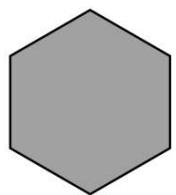
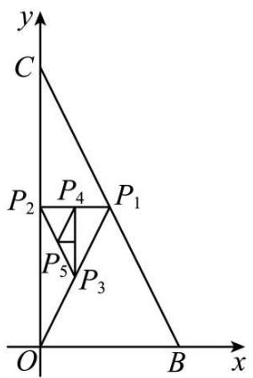
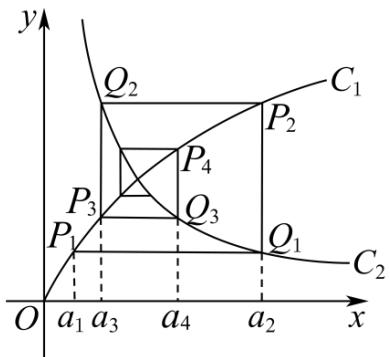

# 第43讲 数列的通项公式

# 知识梳理

类型 I 观察法:

已知数列前若干项,求该数列的通项时,一般对所给的项观察分析,寻找规律,从而根据规律写出此数列的一个通项.

类型Ⅱ 公式法：

若已知数列的前 $n$ 项和 $S_{n}$ 与 $a_{n}$ 的关系，求数列 $\{a_n\}$ 的通项 $a_{n}$ 可用公式

$a_{n} = \left\{ \begin{array}{l}\mathrm{S}_{1},(n = 1)\\ \mathrm{S}_{n} - \mathrm{S}_{n - 1},(n\geqslant 2) \end{array} \right.$ 构造两式作差求解.

用此公式时要注意结论有两种可能,一种是“一分为二”,即分段式;另一种是“合二为一”,即 $a_{1}$ 和 $a_{n}$ 合为一个表达,(要先分n=1和 $n\geqslant2$ 两种情况分别进行运算,然后验证能否统一).

类型Ⅲ 累加法：

形如 $a_{n + 1} = a_n + f(n)$ 型的递推数列（其中 $f(n)$ 是关于 $n$ 的函数）可构造：

$$
\left\{ \begin{array}{l} a _ {n} - a _ {n - 1} = f (n - 1) \\ a _ {n - 1} - a _ {n - 2} = f (n - 2) \\ \dots \\ a _ {2} - a _ {1} = f (1) \end{array} \right.
$$

将上述 $m_{2}$ 个式子两边分别相加，可得： $a_{n} = f(n - 1) + f(n - 2) + \ldots f(2) + f(1) + a_{1}, (n \geqslant 2)$

①若 $f(n)$ 是关于 $n$ 的一次函数，累加后可转化为等差数列求和；  
② 若 $f(n)$ 是关于 n 的指数函数, 累加后可转化为等比数列求和;  
③若 $f(n)$ 是关于 $n$ 的二次函数，累加后可分组求和；  
④若 $f(n)$ 是关于 n 的分式函数, 累加后可裂项求和.

类型IV 累乘法:

形如 $a_{n + 1} = a_n\cdot f(n)\left(\frac{a_{n + 1}}{a_n} = f(n)\right)$ 型的递推数列(其中 $f(n)$ 是关于 $n$ 的函数)可构造：

$$
\left\{ \begin{array}{l} \frac {a _ {n}}{a _ {n - 1}} = f (n - 1) \\ \frac {a _ {n - 1}}{a _ {n - 2}} = f (n - 2) \\ \dots \\ \frac {a _ {2}}{a _ {1}} = f (1) \end{array} \right.
$$

将上述 $m_2$ 个式子两边分别相乘，可得： $a_{n} = f(n - 1)\cdot f(n - 2)\cdot \ldots \cdot f(2)f(1)a_{1},(n\geqslant 2)$

有时若不能直接用,可变形成这种形式,然后用这种方法求解.

类型 V 构造数列法:

(一)形如 $a_{n + 1} = pa_n + q$ （其中 $p,q$ 均为常数且 $p\neq 0$ )型的递推式：

(1) 若 $p = 1$ 时, 数列 $\{a_{n}\}$ 为等差数列;  
(2) 若 $q = 0$ 时, 数列 $\{a_{n}\}$ 为等比数列;  
(3) 若 $p \neq 1$ 且 $q \neq 0$ 时，数列 $\{a_n\}$ 为线性递推数列，其通项可通过待定系数法构造等比

数列来求．方法有如下两种：

法一: 设 $a_{n+1} + \lambda = p(a_n + \lambda)$ ，展开移项整理得 $a_{n+1} = pa_n + (p-1)\lambda$ ，与题设 $a_{n+1} = pa_n + q$ 比较系数（待定系数法）得 $\lambda = \frac{q}{p-1}, (p \neq 0) \Rightarrow a_{n+1} + \frac{q}{p-1} = p\left(a_n + \frac{q}{p-1}\right) \Rightarrow a_n + \frac{q}{p-1} = p\left(a_{n-1} + \frac{q}{p-1}\right)$ ，即 $\left\{a_n + \frac{q}{p-1}\right\}$ 构成以 $a_1 + \frac{q}{p-1}$ 为首项，以 p 为公比的等比数列．再利用等比数列的通项公式求出 $\left\{a_n + \frac{q}{p-1}\right\}$ 的通项整理可得 $a_n$ .

法二：由 $a_{n + 1} = pa_n + q$ 得 $a_{n} = pa_{n - 1} + q(n\geqslant 2)$ 两式相减并整理得 $\frac{a_{n + 1} - a_n}{a_n - a_{n - 1}} = p,$ 即 $\{a_{n + 1} - a_n\}$ 构成以 $a_2 - a_1$ 为首项，以 $p$ 为公比的等比数列．求出 $\{a_{n + 1} - a_n\}$ 的通项再转化为类型III(累加法)便可求出 $a_{n}$

# (二) 形如 $a_{n+1} = pa_n + f(n) (p \neq 1)$ 型的递推式:

# (1) 当 $f(n)$ 为一次函数类型 (即等差数列) 时:

法一: 设 $a_{n} + An + B = p[a_{n-1} + A(n-1) + B]$ ，通过待定系数法确定 A、° B 的值，转化成以 $a_{1} + A + B$ 为首项，以 $A_{n}^{m} = \frac{n!}{(n-m)!}$ 为公比的等比数列 $\{a_{n} + An + B\}$ ，再利用等比数列的通项公式求出 $\{a_{n} + An + B\}$ 的通项整理可得 $a_{n}$ .

法二: 当 $f(n)$ 的公差为 d 时, 由递推式得: $a_{n+1}=pa_{n}+f(n)$ , $a_{n}=pa_{n-1}+f(n-1)$ 两式相减得: $a_{n+1}-a_{n}=p(a_{n}-a_{n-1})+d$ , 令 $b_{n}=a_{n+1}-a_{n}$ 得: $b_{n}=pb_{n-1}+d$ 转化为类型 V(-) 求出 $b_{n}$ , 再用类型 III (累加法) 便可求出 $a_{n}$ .

# (2) 当 $f(n)$ 为指数函数类型 (即等比数列) 时:

法一：设 $a_{n} + \lambda f(n) = p[a_{n - 1} + \lambda f(n - 1)]$ ，通过待定系数法确定 $\lambda$ 的值，转化成以 $a_1 + \lambda f(1)$ 为首项，以 $\mathrm{A}_n^m = \frac{n!}{(n - m)!}$ 为公比的等比数列 $\{a_n + \lambda f(n)\}$ ，再利用等比数列的通项公式求出 $\{a_n + \lambda f(n)\}$ 的通项整理可得 $a_{n}$

法二: 当 $f(n)$ 的公比为 q 时, 由递推式得: $a_{n+1}=pa_{n}+f(n)--①$ , $a_{n}=pa_{n-1}+f(n-1)$ , 两边同时乘以 q 得 $a_{n}q=pqa_{n-1}+qf(n-1)--②$ , 由①②两式相减得 $a_{n+1}-a_{n}q=p(a_{n}-qa_{n-1})$ , 即 $\frac{a_{n+1}-qa_{n}}{a_{n}-qa_{n-1}}=p$ , 在转化为类型 V(-)便可求出 $a_{n}$ .

法三:递推公式为 $a_{n+1}=pa_n+q^n$ (其中p,q均为常数)或 $a_{n+1}=pa_n+rq^n$ (其中p,q,r均为常数)时,要先在原递推公式两边同时除以 $q^{n+1}$ ,得: $\frac{a_{n+1}}{q^{n+1}}=\frac{p}{q}\cdot\frac{a_n}{q^n}+\frac{1}{q}$ ,引入辅助数列 $\{b_n\}$ (其中 $b_n=\frac{a_n}{q^n}$ ),得: $b_{n+1}=\frac{p}{q}b_n+\frac{1}{q}$ 再应用类型V(→)的方法解决.

# (3) 当 $f(n)$ 为任意数列时, 可用通法:

在 $a_{n + 1} = pa_n + f(n)$ 两边同时除以 $p^{n + 1}$ 可得到 $\frac{a_{n + 1}}{p^{n + 1}} = \frac{a_n}{p^n} +\frac{f(n)}{p^{n + 1}}$ ，令 $\frac{a_n}{p^n} = b_n$ ，则 $b_{n + 1} =$ $b_{n} + \frac{f(n)}{p^{n + 1}}$ ，在转化为类型III(累加法)，求出 $b_{n}$ 之后得 $a_{n} = p^{n}b_{n}$

类型VI 对数变换法:

形如 $a_{n + 1} = pa^q (p > 0, a_n > 0)$ 型的递推式：

在原递推式 $a_{n + 1} = pa^q$ 两边取对数得 $\lg a_{n + 1} = q\lg a_n + \lg p$ ，令 $b_{n} = \lg a_{n}$ 得： $b_{n + 1} = qb_{n}+$ $\lg p$ ，化归为 $a_{n + 1} = pa_n + q$ 型，求出 $b_{n}$ 之后得 $a_{n} = 10^{b_{n}}$ .（注意：底数不一定要取10，可根据题意

选择).

类型VII 倒数变换法:

形如 $a_{n-1} - a_n = pa_{n-1}a_n$ ( $p$ 为常数且 $p \neq 0$ ) 的递推式: 两边同除于 $a_{n-1}a_n$ , 转化为 $\frac{1}{a_n} = \frac{1}{a_{n-1}} + p$ 形式, 化归为 $a_{n+1} = pa_n + q$ 型求出 $\frac{1}{a_n}$ 的表达式, 再求 $a_n$ ;

还有形如 $a_{n + 1} = \frac{ma_n}{pa_n + q}$ 的递推式，也可采用取倒数方法转化成 $\frac{1}{a_{n + 1}} = \frac{m}{q}\frac{1}{a_n} +\frac{m}{p}$ 形式，化归为 $a_{n + 1} = pa_n + q$ 型求出 $\frac{1}{a_n}$ 的表达式，再求 $a_{n}$

类型VIII 形如 $a_{n + 2} = pa_{n + 1} + qa_n$ 型的递推式：

用待定系数法, 化为特殊数列 $\{a_{n} - a_{n-1}\}$ 的形式求解. 方法为: 设 $a_{n+2} - ka_{n+1} = h(a_{n+1} - ka_{n})$ , 比较系数得 $h + k = p, -hk = q$ , 可解得 $h, \circ k$ , 于是 $\{a_{n+1} - ka_{n}\}$ 是公比为 $h$ 的等比数列, 这样就化归为 $a_{n+1} = pa_{n} + q$ 型.

总之,求数列通项公式可根据数列特点采用以上不同方法求解,对不能转化为以上方法求解的数列,可用归纳、猜想、证明方法求出数列通项公式 $a_{n}$ .

# 必考题型全归纳

# 1 题型一: 观察法

1977 (2024·湖南长沙·长沙市实验中学校考二模)南宋数学家杨辉所著的《详解九章算法·商功》中出现了如图所示的形状,后人称为“三角垛”,“三角垛”的最上层有1个球,第二层有3个球,第三层有6个球,……,则第十层有( )个球.

natural_image

Pyramid-shaped arrangement of gray spheres, no text or symbols present

A. 12

B. 20

C. 55

D. 110

1978 (2024·全国·高三专题练习)“中国剩余定理”又称“孙子定理”，1852年英国来华传教伟烈亚力将《孙子算经》中“物不知数”问题的解法传至欧洲。1874年，英国数学家马西森指出此法符合1801年由高斯得出的关于同余式解法的一般性定理，因而西方称之为“中国剩余定理”。 “中国剩余定理”讲的是一个关于整除的问题，现有这样一个整除问题：将正整数中能被3除余2且被7除余2的数按由小到大的顺序排成一列，构成数列 $\{a_{n}\}$ ，则 $a_{6}=$ （）

A. 17

B. 37

C. 107

D. 128

1979 (2024·全国·高三专题练习)线性分形又称为自相似分形, 其图形的结构在几何变换下具有不变性, 通过不断迭代生成无限精细的结构. 一个正六边形的线性分形图如下图所示, 若图1中正六边形的边长为1, 图n中正六边形的个数记为 $a_{n}$ , 所有正六边形的周长之和、面积之和分别记为 $C_{n}, S_{n}$ , 其中图n中每个正六边形的边长是图n-1中每个正六边形边长的 $\frac{1}{3}$ , 则下列说法正确的是()

  
图1

  
图2

  
图3

A. $a_4 = 294$

B. $C_{3}=\frac{100}{3}$

C. 存在正数 $m$ , 使得 $\mathrm{C}_n \leqslant m$ 恒成立

D. $S_{n}=\frac{3\sqrt{3}}{2}\times\left(\frac{7}{9}\right)^{n-1}$

1980 (2024·海南·海口市琼山华侨中学校联考模拟预测)大衍数列,来源于《乾坤谱》中对易传“大衍之数五十”的推论,主要用于解释中国传统文化中的太极衍生原理,数列中的每一项都代表太极衍生过程,是中华传统文化中隐藏着的世界数学史上第一道数列题,其各项规律如下:0,2,4,8,12,18,24,32,40,50,...,记此数列为 $\{a_{n}\}$ ,则 $(a_{2}-a_{1})+(a_{4}-a_{3})+\cdots+(a_{50}-a_{49})=$ ()

A. 650

B. 1050

C. 2550

D. 5050

1981 (2024·吉林·统考三模)大衍数列,来源于《乾坤谱》中对易传“大衍之数五十”的推论,主要用于解释中国传统文化中的太极衍生原理,数列中的每一项,都代表太极衍生过程中,曾经经历过的两仪数量总和,是中华传统文化中隐藏着的世界数学史上第一道数列题.其前10项依次是0,2,4,8,12,18,24,32,40,50,则此数列的第25项与第24项的差为()

A. 22

B. 24

C. 25

D. 26

1982 (2024·全国·高三专题练习)若数列 $\{a_{n}\}$ 的前 4 项分别是 $\frac{1}{2}$ , $-\frac{1}{3}$ , $\frac{1}{4}$ , $-\frac{1}{5}$ , 则该数列的一个通项公式为 ()

A. $a_{n} = \frac{(-1)^{n - 1}}{n}$

B. $a_{n} = \frac{(-1)^{n}}{n + 1}$

C. $a_{n} = \frac{(-1)^{n}}{n}$

D. $a_{n} = \frac{(-1)^{n + 1}}{n + 1}$

1983 (2024·全国·高三专题练习)“杨辉三角”是中国古代重要的数学成就,如图是由“杨辉三角”拓展而成的三角形数阵,从第三行起,每一行的第三个数 $1,\frac{1}{3},\frac{1}{6},\frac{1}{10},\cdots$ 构成数列 $\{a_{n}\}$ ,其前n项和为 $S_{n}$ ,则 $S_{20}=$

1
1 1
1 $\frac{1}{2}$ 1
1 $\frac{1}{3}$ $\frac{1}{3}$ 1
1 $\frac{1}{4}$ $\frac{1}{6}$ $\frac{1}{4}$ 1
1 $\frac{1}{5}$ $\frac{1}{10}$ $\frac{1}{10}$ $\frac{1}{5}$ 1
...

A. $\frac{39}{20}$

B. $\frac{40}{21}$

C. $\frac{41}{21}$

D. $\frac{419}{210}$

1984 (2024·新疆喀什·高三统考期末)若数列 $\{a_{n}\}$ 的前6项为 $1, -\frac{2}{3}, \frac{3}{5}, -\frac{4}{7}, \frac{5}{9}, -\frac{6}{11}$ , 则数

列 $\{a_{n}\}$ 的通项公式可以为 $a_{n} =$ （ ）

A. $\frac{n}{n+1}$

B. $\frac{n}{2n-1}$

C. $(-1)^{n}\cdot\frac{n}{2n-1}$

D. $(-1)^{n+1}\cdot\frac{n}{2n-1}$

# 题型二:叠加法

1985 (2024·全国·高三对口高考)数列 1, 3, 7, 15, …… 的一个通项公式是 （）

A. $a_{n} = 2^{n}$

B. $a_{n} = 2^{n} + 1$

C. $a_{n} = 2^{n} - 1$

D. $a_{n} = 2^{n - 1}$

1986 (2024·新疆喀什·校考模拟预测)若 $a_{n} = a_{n - 1} + n - 1, a_{1} = 1$ 则 $a_{10} =$ （）

A. 55

B. 56

C. 45

D. 46

1987 (2024·陕西安康·陕西省安康中学校考模拟预测)在数列 $\left\{a_{n}\right\}$ 中， $a_{1}=1, a_{n+1}=a_{n}+n+1$ ，则 $\frac{1}{a_{1}}+\frac{1}{a_{2}}+\cdots+\frac{1}{a_{2022}}=$ （）

A. $\frac{2021}{1011}$

B. $\frac{4044}{2023}$

C. $\frac{2021}{2022}$

D. $\frac{2022}{2023}$

1988 (2024·全国·高三专题练习)已知数列 $\{a_{n}\}$ 满足 $a_{1}=\frac{1}{2}$ ， $a_{n+1}=a_{n}+\frac{1}{n^{2}+n}$ ，则 $\{a_{n}\}$ 的通项为

A. $-\frac{1}{n}, n \geqslant 1, n \in \mathbf{N}^{*}$

B. $\frac{3}{2} +\frac{1}{n},n\geqslant 1,n\in \mathbf{N}^{*}$

C. $-\frac{3}{2} - \frac{1}{n}, n \geqslant 1, n \in \mathbf{N}^{*}$

D. $\frac{3}{2} -\frac{1}{n},n\geqslant 1,n\in \mathbf{N}^{*}$

1989 (2024·全国·高三专题练习)已知 $S_{n}$ 是数列 $\{a_{n}\}$ 的前 n 项和，且对任意的正整数 n，都满足： $\frac{1}{a_{n+1}} - \frac{1}{a_{n}} = 2n + 2$ ，若 $a_{1} = \frac{1}{2}$ ，则 $S_{2023} =$ （）

A. $\frac{2023}{2024}$

B. $\frac{2022}{2023}$

C. $\frac{2021}{2024}$

D. $\frac{1010}{2023}$

1990 (2024·四川南充·四川省南充高级中学校考模拟预测)已知数列 $\{a_{n}\}$ 满足： $a_{1}=\frac{3}{8}$ ， $a_{n+2}-a_{n}\leqslant3^{n}$ ， $a_{n+6}-a_{n}\geqslant91\cdot3^{n}$ ，则 $a_{2023}=$ （）

A. $\frac{3^{2023}}{2}+\frac{3}{2}$

B. $\frac{3^{2023}}{8}+\frac{3}{2}$

C. $\frac{3^{2023}}{8}$

D. $\frac{3^{2023}}{2}$

# 题型三:叠乘法

1991 (2024·河南·模拟预测)已知数列 $\{a_{n}\}$ 满足 $\frac{a_{n + 1} + a_n}{a_{n + 1} - a_n} = 2n, a_1 = 1$ ，则 $a_{2023} =$ （）

A. 2024

B. 2024

C. 4045

D. 4047

1992 (2024·全国·高三专题练习)数列 $\{a_{n}\}$ 中， $a_{1}=1,\frac{a_{n+1}}{a_{n}}=\frac{n}{n+1}(n$ 为正整数)，则 $a_{2022}$ 的值为 （）

A. $\frac{1}{2022}$

B. $\frac{1}{2021}$

C. $\frac{2021}{2022}$

D. $\frac{2022}{2021}$

1993 (2024·天津滨海新·高三校考期中)已知 $a_{1}=2, a_{n+1}=\frac{n+1}{n}a_{n}$ ，则 $a_{2022}=$ （）

A. 506

B. 1011

C. 2022

D. 4044

1994 (2024·全国·高三专题练习)已知 $a_{1}=1$ , $a_{n}=n(a_{n+1}-a_{n})(n\in\mathbb{N}_{+})$ ，则数列 $\{a_{n}\}$ 的通项公式是 $a_{n}=$ （）

A. $2n - 1$

B. $\left(\frac{n+1}{n}\right)^{n+1}$

C. $n^{2}$

D. n

1995 (2024·全国·高三专题练习)已知数列 $\{a_{n}\}$ 中， $a_{1}=1, na_{n+1}=$ $2(a_{1}+a_{2}+\cdots+a_{n})(n\in\mathbb{N}^{*})$ ，则数列 $\{a_{n}\}$ 的通项公式为（）

A. $a_{n} = n$

B. $a_{n} = 2n - 1$

C. $a_{n}=\frac{n+1}{2n}$

D. $a_{n} = \left\{ \begin{array}{ll}1, & (n = 1)\\ n + 1, & (n\geqslant 2) \end{array} \right.$

1996 (2024·全国·高三专题练习)已知数列 $\{a_{n}\}$ 满足 $(n+2)a_{n+1}=(n+1)a_{n}$ ，且 $a_{2}=\frac{1}{3}$ ，则 $a_{n}=$ =

A. $\frac{n-1}{n+1}$

B. $\frac{1}{2n-1}$

C. $\frac{n-1}{2n-1}$

D. $\frac{1}{n+1}$

1997 (2024·全国·高三专题练习)已知数列 $\{a_{n}\}$ 满足 $a_{1}=\frac{1}{3}$ ， $a_{n}=\frac{2n-3}{2n+1}a_{n-1}(n\geqslant2,n\in\mathbb{N}^{*})$ ，则数列 $\{a_{n}\}$ 的通项 $a_{n}=$ （）

A. $\frac{1}{4n^{2}-1}$

B. $\frac{1}{2n^{2}+1}$

C. $\frac{1}{(2n-1)(2n+3)}$

D. $\frac{1}{(n+1)(n+3)}$

1998 (2024·全国·高三专题练习)在数列 $\{a_{n}\}$ 中， $a_{1}=\frac{1}{2}$ 且 $(n+2)a_{n+1}=na_{n}$ ，则它的前30项和 $S_{30}=$ （）

A. $\frac{30}{31}$

B. $\frac{29}{30}$

C. $\frac{28}{29}$

D. $\frac{19}{29}$

# 4 题型四:待定系数法

1999 (2024·全国·高三专题练习)已知： $a_{1}=1, n \geqslant 2$ 时， $a_{n}=\frac{1}{2}a_{n-1}+2n-1$ ，求 $\{a_{n}\}$ 的通项公式.

2000 (2024·全国·高三专题练习)已知数列 $\{a_{n}\}$ ， $a_{1}=2$ ，且对于 n>1 时恒有 $a_{n}=\frac{1}{2}a_{n-1}+1$ ，求数列 $\{a_{n}\}$ 的通项公式.

2001 (2024·全国·高三专题练习)已知数列 $\{a_{n}\}$ 满足： $a_{n+1} = -\frac{1}{3} a_{n} - 2, n \in \mathbb{N}^{*}, a_{1} = 4$ ，求 $a_{n}$ .

2002 (2024·全国·高三专题练习)已知数列 $\{a_{n}\}$ 是首项为 $a_{1}=2, a_{n+1}=\frac{1}{3}a_{n}+2n+\frac{5}{3}$ .

(1) 求 $\{a_{n}\}$ 通项公式;  
(2) 求数列 $\{a_{n}\}$ 的前 n 项和 $S_{n}$ .

2003 (2024·全国·高三专题练习)已知数列 $\{a_{n}\}$ 中， $a_{1}=2, a_{n+1}=\frac{2a_{n}+1}{3}$ ，求 $\{a_{n}\}$ 的通项.

2004 (2024·江苏南通·高三江苏省通州高级中学校考阶段练习)已知数列 $\{a_{n}\}$ 中， $a_{1}=1$ ，满足 $a_{n+1}=2a_{n}+2n-1(n\in\mathbb{N}^{*})$ ，设 $S_{n}$ 为数列 $\{a_{n}\}$ 的前 n 项和.

(1) 证明: 数列 $\left\{a_{n}+2n+1\right\}$ 是等比数列;

(2) 若不等式 $\lambda \cdot 2^n + S_n + 4 > 0$ 对任意正整数 $n$ 恒成立，求实数 $\lambda$ 的取值范围.

2005 (2024·四川乐山·统考三模)已知数列 $\{a_{n}\}$ 满足 $a_{n+1}=2a_{n}+2, a_{1}=1$ ，则 $a_{n}=$ \_\_\_\_.  
2006 (2024·全国·高三专题练习)已知数列 $\{a_{n}\}$ 中， $a_{1}=1, a_{n+1}=3a_{n}+4$ ，则数列 $\{a_{n}\}$ 的通项公式为 \_\_\_\_.  
2007 (2024·全国·高三对口高考)已知数列 $\{a_{n}\}$ 中， $a_{1}=1$ ，且 $a_{n}=2a_{n-1}+3(n\geqslant2$ ，且 $n\in N^{*}$ ，则数列 $\{a_{n}\}$ 的通项公式为 \_\_\_\_.

# 5 题型五:同除以指数

2008 (2024·全国·高三专题练习)已知数列 $\{a_{n}\}$ 满足 $a_{n+1}=2a_{n}+3\cdot2^{n}, a_{1}=2$ ，求数列 $\{a_{n}\}$ 的通项公式.  
2009 (2024·全国·高三专题练习)在数列 $\{a_{n}\}$ 中， $a_{1}=-1, a_{n+1}=2a_{n}+4\cdot3^{n-1}$ ，求通项公式 $a_{n}$ .  
2010 (2024·全国·高三专题练习)已知数列 $\{a_{n}\}$ 满足 $a_{n+1}=2a_{n}+3\cdot5^{n},a_{1}=6$ ，求数列 $\{a_{n}\}$ 的通项公式.  
2011 (2024·全国·高三专题练习)已知数列 $\{a_{n}\}$ 满足 $a_{n+1}=2a_{n}+4\times3^{n-1}, a_{1}=1$ ，求数列 $\{a_{n}\}$ 的通项公式.  
2012 (2024·全国·高三专题练习)已知数列 $\{a_{n}\}$ 满足 $a_{n+1}=2a_{n}+4\cdot3^{n-1}, a_{1}=-1$ ，则数列 $\{a_{n}\}$ 的通项公式为 \_\_\_\_.  
2013 (2024·全国·高三专题练习)已知数列 $\{a_{n}\}$ 满足 $a_{n+1}=3a_{n}+2\cdot3^{n}+1, a_{1}=3$ ，求数列 $\{a_{n}\}$ 的通项公式.

# 6 题型六:取倒数法

2014 (2024·全国·高三专题练习)已知数列 $\{a_{n}\}$ 满足： $a_1 = 2, a_n = \frac{a_{n-1}}{2a_{n-1} + 1} (n \geqslant 2)$ ，求通项 $a_{n}$ .   
2015 (2024·全国·高三专题练习)在数列 $\{a_{n}\}$ 中， $a_{1} = 1, a_{n+1} = \frac{a_{n}}{a_{n} + 3}$ ，求 $a_{n}$ .  
2016 (2024·全国·高三专题练习)设 b > 0，数列 $\{a_{n}\}$ 满足 $a_{1} = b, a_{n} = \frac{nba_{n-1}}{a_{n-1} + n - 1} (n \geqslant 2)$ ，求数列 $\{a_{n}\}$ 的通项公式.  
2017 (2024·全国·高三专题练习)已知 $a_{n+1} = \frac{a_n}{a_n + 2}, a_1 = 1$ ，求 $\{a_n\}$ 的通项公式.  
2018 (2024·全国·高三专题练习)已知数列 $\{a_{n}\}$ 满足 $a_{n+1}=\frac{2a_{n}}{a_{n}+2},a_{1}=1$ ，求数列 $\{a_{n}\}$ 的通项公式.  
2019 (2024·全国·高三对口高考)数列 $\{a_{n}\}$ 中， $a_{n+1}=\frac{a_{n}}{1+3a_{n}}$ ， $a_{1}=2$ ，则 $a_{4}=$ \_\_\_\_.  
2020 (2024·江苏南通·统考模拟预测)已知数列 $\{a_{n}\}$ 中， $a_{1}=\frac{1}{3}$ ， $a_{n+1}=\frac{a_{n}}{2-a_{n}}$ .

(1) 求数列 $\{a_{n}\}$ 的通项公式；  
(2) 求证: 数列 $\{a_{n}\}$ 的前 n 项和 $S_{n}<1$ .

# 题型七: 取对数法

2021 (2024·全国·高三专题练习)已知数列 $\{a_{n}\}$ 满足 $a_1 = 3, a_{n+1} = a_n^2 - 2a_n + 2$ .

(1) 证明数列 $\{\ln (a_n - 1)\}$ 是等比数列，并求数列 $\{a_n\}$ 的通项公式；  
(2) 若 $b_n = \frac{1}{a_n} + \frac{1}{a_n - 2}$ ，数列 $\{b_n\}$ 的前 $n$ 项和 $S_n$ ，求证： $S_n < 2$ .

2022 (2024·全国·高三专题练习)设正项数列 $\{a_{n}\}$ 满足 $a_{1}=1, a_{n}=2a_{n-1}^{2}(n\geqslant2)$ ，求数列 $\{a_{n}\}$ 的通项公式.

2023 (2024·全国·高三专题练习)设数列 $\{a_{n}\}$ 满足 $a_{1}=a(a>0)$ ， $a_{n+1}=2\sqrt{a_{n}}$ ，证明：存在常数 M，使得对于任意的 $n\in N^{*}$ ，都有 $a_{n}\leqslant M$ .

# 题型八: 已知通项公式 $a_{n}$ 与前 $n$ 项的和 $\mathrm{S}_{n}$ 关系求通项问题

2024 (2024·全国·高三专题练习)数列 $\{a_{n}\}$ 的前 n 项和为 $S_{n}$ ，满足 $S_{n+1}-2S_{n}=1-n$ ，且 $S_{1}=3$ ，则 $\{a_{n}\}$ 的通项公式是 \_\_\_\_.  
2025 (2024·陕西渭南·统考二模)已知数列 $\left\{a_{n}\right\}$ 中， $a_{1}=1, a_{n}>0$ ，前 n 项和为 $S_{n}$ . 若 $a_{n}=\sqrt{S_{n}}+\sqrt{S_{n-1}}(n\in\mathbb{N}^{*},n\geqslant2)$ ，则数列 $\left\{\frac{1}{a_{n}a_{n+1}}\right\}$ 的前 2024 项和为 \_\_\_\_.  
2026 (2024·河南南阳·高二统考期末)已知数列 $\{a_{n}\}$ 的前 n 项和为 $S_{n}$ ，且 $S_{n}=2a_{n}-1(n\in N^{*})$ ，

(1) 求数列 $\{a_{n}\}$ 的通项公式;  
(2) 设 $b_n = a_n \log_2 a_n$ ，求数列 $\{b_n\}$ 的前 $n$ 项和 $T_n$ .

2027 (2024·全国·高三专题练习)已知数列 $\{a_{n}\}$ 的前 $n$ 项和 $\mathrm{S}_n$ 满足 $\mathrm{S}_n = 2a_n + 2n$ .

(1) 写出数列的前 3 项 $a_{1}, a_{2}, a_{3}$ ;   
(2) 求数列 $\{a_{n}\}$ 的通项公式.

2028 (2024·河北衡水·衡水市第二中学校考三模)已知数列 $\{a_{n}\}$ 的前 n 项和为 $S_{n}, \frac{1}{2}S_{n}=a_{n}-2^{n-1}$ .

(1) 证明: $\left\{\frac{a_n}{2^{n-1}}\right\}$ 是等差数列;   
(2) 求数列 $\left\{\frac{a_{n+1}}{a_{n}}\right\}$ 的前 n 项积.

2029 (2024·海南海口·海南华侨中学校考一模)已知各项均为正数的数列 $\{a_{n}\}$ 满足 $2\sqrt{S_{n}} = a_{n} + 1$ ，其中 $S_{n}$ 是数列 $\{a_{n}\}$ 的前 n 项和.

(1) 求数列 $\{a_{n}\}$ 的通项公式；  
(2) 若对任意 $n \in N_{+}$ ，且当 $n \geqslant 2$ 时，总有 $\frac{1}{4S_{1}} + \frac{1}{S_{2}-1} + \frac{1}{S_{3}-1} + \cdots + \frac{1}{S_{n}-1} < \lambda$ 恒成立，求实数 $\lambda$ 的取值范围.

2030 (2024·河北保定·高三校联考阶段练习)已知数列 $\{a_{n}\}$ 满足 $a_{1}+3a_{2}+\cdots+(2n-1)a_{n}=n.$

(1) 求 $\{a_{n}\}$ 的通项公式;  
(2) 已知 $c_{n} = \begin{cases} \frac{1}{19a_{n}}, & n = 2k - 1 \\ a_{n} \cdot a_{n+2}, & n = 2k \end{cases}$ , $k \in \mathbb{N}^{*}$ , 求数列 $\{c_{n}\}$ 的前 20 项和.

2031 (2024·全国·高三专题练习)已知数列 $\{a_{n}\}$ 的前 $n$ 项和为 $\mathrm{S}_n$ ，且 $\mathrm{S}_n = n - 5a_n - 85, n \in$

$N^{*}$ . 证明: $\{a_{n}-1\}$ 是等比数列.

2032 (2024·全国·高三专题练习)已知 $\{a_{n}\}$ 是各项都为正数的数列， $S_{n}$ 为其前 n 项和，且 $a_{1}=1, S_{n}=\frac{1}{2}\left(a_{n}+\frac{1}{a_{n}}\right)$ ,

(1) 求数列 $\{a_{n}\}$ 的通项 $a_{n}$ ;  
(2) 证明: $\frac{1}{2\mathrm{S}_{1}} + \frac{1}{3\mathrm{S}_{2}} + \cdots + \frac{1}{(n+1)\mathrm{S}_{n}} < 2\left(1 - \frac{1}{\mathrm{S}_{n+1}}\right)$ .

2033 (2024·河北石家庄·高三石家庄二中校考阶段练习)数列 $\{a_{n}\}$ 的前 n 项和为 $S_{n}, a_{1} = 2, a_{2} = 4$ 且当 $n \geqslant 2$ 时， $3S_{n-1}, 2S_{n}, S_{n+1} + 2^{n}$ 成等差数列.

(1) 求数列 $\{a_{n}\}$ 的通项公式;  
(2) 在 $a_{n}$ 和 $a_{n+1}$ 之间插入 $n$ 个数, 使这 $n+2$ 个数组成一个公差为 $d_{n}$ 的等差数列, 在数列 $\{d_{n}\}$ 中是否存在 3 项 $d_{m}, d_{k}, d_{p}$ (其中 $m, k, p$ 成等差数列) 成等比数列? 若存在, 求出这样的 3 项; 若不存在, 请说明理由.

2034 (2024·陕西咸阳·武功县普集高级中学校考模拟预测)已知 $S_{n}$ 是数列 $\{a_{n}\}$ 的前 n 项和， $a_{1}=2, S_{n}=a_{n+1}+1.$

(1) 求数列 $\{a_{n}\}$ 的通项公式;  
(2) 已知 $b_{n} = \frac{n + 3}{a_{n}}$ ，求数列 $\{b_{n}\}$ 的前 $n$ 项和 $T_{n}$ .

2035 (2024·全国·高三专题练习)已知数列 $\{a_{n}\}$ ， $S_{n}$ 为数列 $\{a_{n}\}$ 的前 n 项和，且满足 $a_{1}=1$ ， $3S_{n}=(n+2)a_{n}$ .

(1) 求 $\{a_{n}\}$ 的通项公式;  
(2) 证明: $\frac{1}{a_{2}} + \frac{1}{a_{4}} + \frac{1}{a_{8}} + \cdots + \frac{1}{a_{2^{n}}} < \frac{1}{2}$ .

2036 (2024·河北沧州·校考模拟预测)已知正项数列 $\{a_{n}\}$ 的前 n 项和为 $S_{n}$ ，满足 $a_{n}=2\sqrt{S_{n}}-1$ .

(1) 求数列 $\{a_{n}\}$ 的通项公式;  
(2) 若 $b_n = a_n \cos \frac{2n\pi}{3}$ ，求数列 $\{b_n\}$ 的前 $3n + 1$ 项和 $T_{3n+1}$ .

2037 (2024·全国·高三专题练习)已知各项为正数的数列 $\{a_{n}\}$ 的前 n 项和为 $S_{n}$ ，满足 $S_{n+1} + S_{n} = \frac{1}{2} a_{n+1}^{2}, a_{1} = 2$ .

(1) 求数列 $\{a_{n}\}$ 的通项公式;  
(2) 设 $b_n = \frac{a_n}{3^n}$ ，求数列 $\{b_n\}$ 的前 $n$ 项的和 $T_n$ .

2038 (2024·全国·高三专题练习)记 $S_{n}$ 为数列 $\{a_{n}\}$ 的前 n 项和．已知 $\frac{2S_{n}}{n} + n = 2a_{n} + 1$ ．证明： $\{a_{n}\}$ 是等差数列；

# 题型九:周期数列

2039 (2024·陕西咸阳·武功县普集高级中学校考模拟预测)已知数列 $\{a_{n}\}$ 满足 $a_{1}=3, a_{n+1}=1-\frac{1}{a_{n}}$ ，记数列 $\{a_{n}\}$ 的前 n 项和为 $S_{n}$ ，则 ()

A. $a_{2}=\frac{3}{2}$   
B. $S_{3n + 1} - S_{3n} = -\frac{1}{2}$   
C. $a_{n}a_{n + 1}a_{n + 2} = -1$   
D. $S_{19} = 20$

2040 (2024·广西防城港·高三统考阶段练习)已知数列 $\{a_{n}\}$ 满足 $a_{n+1}=\frac{1}{1-a_{n}}$ ，若 $a_{1}=\frac{1}{2}$ ，则 $a_{2021}=$ （）

A.-2

B.-1

C. $\frac{1}{2}$

D. 2

2041 (2024·四川成都·四川省成都市玉林中学校考模拟预测)已知数列 $\{a_{n}\}$ 满足： $a_{1}=1, a_{2}=2, a_{n+2}=a_{n+1}-a_{n}, n\in N^{*}$ ，则 $a_{2023}=()$ .

A.-2

B.-1

C. 1

D. 2

2042 (2024·天津南开·高三南开中学校考阶段练习)已知数列 $\{a_{n}\}$ 满足 $a_{1}=-3, a_{n+1}=$ $\frac{a_{n}-1}{a_{n}+1}$ ，则 $a_{2022}=$ （）

A. $\frac{1}{3}$

B. 2

C. $-\frac{1}{2}$

D.-3

2043 (2024·江苏淮安·高三校考阶段练习)天干地支纪年法源于中国,中国自古便有十天干与十二地支. 十天干即:甲、乙、丙、丁、戊、己、庚、辛、壬、癸;十二地支即:子、丑、寅、卯、辰、巳、午、未、申、酉、戌、亥. 天干地支纪年法是按顺序以一个天干和一个地支相配,排列起来,天干在前,地支在后,天干由“甲”起,地支由“子”起,比如第一年为“甲子”,第二年为“乙丑”,第三年为“丙寅”,...,以此类推,排列到“癸酉”后,天干回到“甲”重新开始,即“甲戌”,“乙亥”,之后地支回到“子”重新开始,即“丙子”,...,以此类推,2022年是壬寅年,请问:在100年后的2122年为()

A. 壬午年

B. 辛丑年

C. 己亥年

D. 戊戌年

2044 (2024·云南昆明·昆明一中模拟预测)已知数列 $\{a_{n}\}$ 满足 $a_{1}=1, a_{2}=3, a_{n}=a_{n-1}+$ $a_{n+1}(n\in\mathrm{N}^{*},n\geqslant2)$ ，则 $a_{2022}=$

A.-2

B. 1

C. 4043

D. 4044

2045 (2024·全国·高三专题练习)已知数列 $\{a_{n}\}$ 满足 $a_{n}+\frac{1}{a_{n+1}}=1$ ，若 $a_{50}=2$ ，则 $a_{1}=$ （）

A.-1

B. $\frac{1}{2}$

C. $\frac{3}{2}$

D. 2

# 10 题型十:前n项积型

2046 (2024·全国·高三专题练习)已知数列 $\{a_{n}\}$ 的前 n 项和为 $S_{n}$ ，且满足 $a_{n}>0, S_{n}=\frac{(a_{n}+2)a_{n}}{4}$ ，数列 $\{b_{n}\}$ 的前 n 项积 $T_{n}=2^{n^{2}}$ .

(1) 求数列 $\{a_{n}\}$ 和 $\{b_{n}\}$ 的通项公式;  
(2) 求数列 $\{a_{n}b_{n}\}$ 的前 n 项和.

2047 (2024·全国·高三专题练习)设 $\mathrm{T}_n$ 为数列 $\{a_n\}$ 的前 $n$ 项积．已知 $\frac{a_{n + 1}}{\mathrm{T}_{n + 1}} -\frac{a_n}{\mathrm{T}_n} = 2.$

(1) 求 $\{a_{n}\}$ 的通项公式;  
(2) 求数列 $\left\{\frac{T_{n}}{2n+3}\right\}$ 的前 n 项和.

2048 (2024·全国·高三专题练习)设 $S_{n}$ 为数列 $\{a_{n}\}$ 的前 n 项和， $T_{n}$ 为数列 $\{S_{n}\}$ 的前 n 项积，已知 $\frac{1}{T_{n}} = \frac{S_{n} - 1}{S_{n}}$ .

(1) 求 $S_{1}, S_{2}$ ;   
(2) 求证: 数列 $\left\{\frac{1}{S_{n}-1}\right\}$ 为等差数列;  
(3) 求数列 $\{a_{n}\}$ 的通项公式.

2049 (2024·福建厦门·高三厦门外国语学校校考期末) $\mathrm{T}_n$ 为数列 $\{a_n\}$ 的前 $n$ 项积，且 $\frac{2}{a_n} + \frac{1}{\mathrm{T}_n} = 1.$

(1) 证明: 数列 $\{T_{n}+1\}$ 是等比数列;  
(2) 求 $\{a_{n}\}$ 的通项公式.

2050 (2024·江苏无锡·高三无锡市第一中学校考阶段练习)已知数列 $\{a_{n}\}$ 的前 n 项之积为 $b_{n}$ ，且 $\frac{a_{1}}{b_{1}} + \frac{a_{2}}{b_{2}} + \cdots + \frac{a_{n}}{b_{n}} = \frac{n^{2} + n}{2}(n \in \mathbb{N}^{*})$ .

(1) 求数列 $\left\{\frac{a_{n}}{b_{n}}\right\}$ 和 $\{a_{n}\}$ 的通项公式；  
(2) 求 $f(n)=b_{n}+b_{n+1}+b_{n+2}+\cdots+b_{2n-1}+b_{2n}$ 的最大值.

2051 (2024·全国·高三专题练习)已知数列 $\{a_{n}\}$ 的前 $n$ 项积 $\mathrm{T}_n = 2^{n^2 - 12n}$ .

(1) 求数列 $\{a_{n}\}$ 的通项公式；  
(2) 记 $b_n = \log_2 a_n$ ，数列 $\{b_n\}$ 的前 $n$ 项为 $S_n$ ，求 $S_n$ 的最小值.

2052 (2024·全国·高三专题练习)已知 $T_{n}$ 为数列 $\{a_{n}\}$ 的前 n 项的积，且 $a_{1}=\frac{1}{2}$ ， $S_{n}$ 为数列 $\{T_{n}\}$ 的前 n 项的和，若 $T_{n}+2S_{n}S_{n-1}=0(n\in\mathbb{N}^{*},n\geqslant2)$ .

(1) 求证: 数列 $\left\{\frac{1}{S_{n}}\right\}$ 是等差数列;  
(2) 求 $\{a_{n}\}$ 的通项公式.

2053 (2024·全国·高三专题练习)记 $S_{n}$ 为数列 $\{a_{n}\}$ 的前 n 项和， $b_{n}$ 为数列 $\{S_{n}\}$ 的前 n 项积，已知 $\frac{2}{S_{n}} + \frac{1}{b_{n}} = 2$ .

(1) 求数列 $\{b_{n}\}$ 的通项公式;  
(2) 求 $\{a_{n}\}$ 的通项公式.

11 题型十一：“和”型求通项

2054 (2024·河南月考)若数列 $\{a_{n}\}$ 满足 $\frac{a_{n+2}}{a_{n+1}} + \frac{a_{n+1}}{a_{n}} = k$ (k 为常数), 则称数列 $\{a_{n}\}$ 为等比和数列, k 称为公比和, 已知数列 $\{a_{n}\}$ 是以 3 为公比和的等比和数列, 其中 $a_{1} = 1, a_{2} = 2$ , 则 $a_{2108} =$ \_\_\_\_ .

2055 (2024·南明区校级月考)若数列 $\{a_{n}\}$ 满足 $a_{n} + a_{n+1} = \frac{2}{\sqrt{n+2} + \sqrt{n}}$ ，则 $S_{2n} =$ \_\_\_\_ .

2056 (2024·青海西宁·二模(理))已知 $S_{n}$ 为数列 $\{a_{n}\}$ 的前 n 项和， $a_{1}=1, a_{n+1}+2S_{n}=2n+1$ ，则 $S_{2022}=$ （）

A. 2020

B. 2021

C. 2022

D. 2024

2057 (2024·全国·高三专题练习)数列 $\{a_{n}\}$ 满足 $a_{1} \in Z, a_{n+1} + a_{n} = 2n + 3$ ，且其前 n 项和为 $S_{n}$ 。若 $S_{13} = a_{m}$ ，则正整数 m = ()

A. 99

B. 103

C. 107

D. 198

2058 (2024·黑龙江·哈师大附中高三阶段练习(理))已知数列 $\{a_{n}\}$ 的前 n 项和为 $S_{n}$ ，若 $S_{n+1} + S_{n} = 2n^{2}(n \in \mathbb{N}^{*})$ ，且 $a_{1} \neq 0, a_{10} = 28$ ，则 $a_{1}$ 的值为

A.-8

B. 6

C.-5

D. 4

2059 (2024·全国·高三专题练习)数列 $\{a_{n}\}$ 满足： $a_{1}=0, a_{n+1}+a_{n}=2n$ ，求通项 $a_{n}$ .

2060 (2024·全国·高三专题练习)数列 $\{a_{n}\}$ 满足： $a_{1}=0, a_{n+1}+a_{n}=2$ ，求通项 $a_{n}$ .

# 12 题型十二: 正负相间讨论、奇偶讨论型

2061 数列 $\{a_{n}\}$ 满足 $a_{n+2} + (-1)^{n+1}a_{n} = 3n - 1$ ，前 16 项和为 540，则 $a_{2} =$ \_\_\_\_ .

2062 (2024·夏津县校级开学)数列 $\{a_{n}\}$ 满足 $a_{n+2} + (-1)^{n}a_{n} = 3n - 1$ ，前 16 项和为 508，则 $a_{1} =$ \_\_\_\_ .

2063 (2024·全国·高三专题练习)已知数列 $\{a_{n}\}$ 满足: $a_{1}=3, a_{n} \cdot a_{n+1} = \left(\frac{1}{2}\right)^{n} (n \in \mathbb{N}^{*})$ ，求此数列的通项公式.

2064 (2024·山东·校联考模拟预测)已知数列 $\{a_{n}\}$ 满足 $a_{1}=-2, a_{n+1}=\begin{cases}a_{n}+2, n\text{为奇数}\\2a_{n}+2, n\text{为偶数}\end{cases}$ .

(1) 求 $\{a_{2n}\}$ 的通项公式;  
(2) 设数列 $\{a_{n}\}$ 的前 n 项和为 $S_{n}$ ，且 $S_{n}>2^{50}$ ，求 n 的最小值.

2065 (2024·湖南长沙·长郡中学校联考模拟预测)已知数列 $\{a_{n}\}$ 满足 $a_{1}=3$ ，且 $a_{n+1}=\left\{\begin{aligned}&2a_{n},n\text{是偶数},\\&a_{n}-1,n\text{是奇数}.\end{aligned}\right.$

(1) 设 $b_{n}=a_{2n}+a_{2n-1}$ ，求数列 $\{b_{n}\}$ 的通项公式；  
(2) 设数列 $\{a_{n}\}$ 的前 n 项和为 $S_{n}$ ，求使得不等式 $S_{n}>2023$ 成立的 n 的最小值.

2066 (2024·全国·高三专题练习)在数列 $\{a_{n}\}$ 中， $a_{1}=2, a_{2}=8$ ，且对任意的 $n\in N^{*}$ ，都有 $a_{n+2}=4a_{n+1}-4a_{n}$ .

(1) 证明: $\{a_{n+1} - 2a_n\}$ 是等比数列, 并求出 $\{a_n\}$ 的通项公式;  
(2) 若 $b_{n}=\left\{\begin{aligned}&\frac{a_{n}}{n},&n=2k-1\\&\log_{2}^{\frac{a_{n}}{n\cdot2^{n+1}}},&n=2k\end{aligned}\right.$ ， $(k\in\mathbb{N}^{*})$ ，且数列 $\{b_{n}\}$ 的前 n 项积为 $T_{n}$ ，求 $T_{15}$ 和 $T_{20}$ .

# 13 题型十三:因式分解型求通项

2067 (2024·安徽月考)已知正项数列 $\{a_{n}\}$ 满足： $a_{1} = a, a_{n+1}^{2} - 4a_{n}^{2} + a_{n+1} - 2a_{n} = 0, n \in \mathbb{N}^{*}$ .

(I) 判断数列 $\{a_{n}\}$ 是否是等比数列, 并说明理由;  
(II) 若 $a = 2$ ，设 $a_{n} = b_{n} - n$ 。 $n \in \mathbb{N}^{*}$ ，求数列 $\{b_{n}\}$ 的前 $n$ 项和 $\mathrm{S}_{n}$ .

2068 (2024·怀化模拟)已知正项数列 $\{a_{n}\}$ 满足 $a_{1}=1,2a_{n}^{2}-a_{n-1}a_{n}-6a_{n-1}^{2}=0(n\geqslant2,n\in\mathbb{N}^{*})$ 设 $b_{n}=\log_{2}a_{n}$ .

(1) 求 $b_{1}, b_{2}b_{3};$   
(2) 判断数列 $\{b_{n}\}$ 是否为等差数列, 并说明理由;  
(3) $\{b_{n}\}$ 的通项公式, 并求其前 $n$ 项和为 $\mathrm{S}_n$ .

2069 (2024·仓山区校级月考)已知正项数列 $\{a_{n}\}$ 满足 $a_{1}=2$ 且 $(n+1)a_{n}^{2}+a_{n}a_{n+1}-na_{n+1}^{2}=0(n\in\mathbf{N}^{*})$

(I) 证明数列 $\{a_{n}\}$ 为等差数列；  
(II) 若记 $b_{n}=\frac{4}{a_{n}a_{n+1}}$ ，求数列 $\{b_{n}\}$ 的前 n 项和 $S_{n}$ .

2070 已知正项数列 $\{a_{n}\}$ 的前 n 项和 $S_{n}$ 满足: $\mathrm{S}_{n}^{2}-(n^{2}+n-1)\mathrm{S}_{n}-n(n+1)=0(n\in\mathbb{N}^{*})$ , 数列 $\{b_{n}\}$ 满足 $b_{1}=\frac{a_{1}}{2}$ , 且 $b_{n+1}+b_{n}=0(n\in\mathbb{N}^{*})$ .

(1) 求 $a_{1}$ 的值及数列 $\{a_{n}\}$ 的通项公式；  
(2) 设 $c_{n} = \frac{(2n + 1)b_{n}}{\mathrm{S}_{n}}$ ，数列 $\{c_{n}\}$ 的前 $n$ 项和为 $\mathrm{T}_n$ ，求 $\mathrm{T}_n$ .

2071 (2024·四川模拟)已知数列 $\{a_{n}\}$ 的各项均为正数，且满足 $a_{n}^{2} - (n + 1)a_{n} - 2n^{2} - n = 0$

(1) 求 $a_{1}, a_{2}$ 及 $\{a_{n}\}$ 的通项公式；  
(2) 求数列 $\{2^{a_{n}}\}$ 的前 n 项和 $S_{n}$ .

# 题型十四:其他几类特殊数列求通项

2072 (2024·全国·高三专题练习)已知 $a_{1}=3$ , $a_{n+1}=\frac{3a_{n}-4}{a_{n}-2}$ ，则 $\{a_{n}\}$ 的通项公式为 \_\_\_\_.

2073 (2024·全国·高三专题练习)已知数列 $\{a_{n}\}$ 满足 $a_{1}=2, a_{n+1}=\frac{2a_{n}-1}{a_{n}+4}$ ，则 $a_{n}=$ \_\_\_\_.

2074 (2024·全国·高三专题练习)已知数列 $\{a_{n}\}$ 满足 $a_{1}=2, a_{n+1}=-\frac{1}{a_{n}+2}$ ，则 $a_{n}=$ \_\_\_\_.

2075 (2024·全国·高三专题练习)已知数列 $\{a_{n}\}$ 中， $a_{1} = 1, a_{n+1} = c - \frac{1}{a_{n}}$ . 设 $c = \frac{5}{2}, b_{n} = \frac{1}{a_{n}-2}$ ，求数列 $\{b_{n}\}$ 的通项公式.

2076 (2024·全国·高三专题练习)在数列 $\{a_{n}\}$ 中， $a_{1} = 2$ ，且 $a_{n+1} = \frac{2a_{n} - 4}{a_{n} + 6}$ ，求其通项公式 $a_{n}$ .

2077 (2024·全国·高三专题练习)已知数列的递推公式 $a_{n+1} = \frac{3a_n - 4}{a_n - 1}$ , 且首项 $a_1 = 5$ , 求数列 $\{a_n\}$ 的通项公式.

2078 (2024·全国·高三专题练习)已知数列 $\{a_{n}\}$ 中， $a_{1}=1, a_{2}=2, a_{n+2}=\frac{2}{3}a_{n+1}+\frac{1}{3}a_{n}$ ，求 $\{a_{n}\}$ 的通项公式.

2079 (2024·全国·高三专题练习)已知数列 $\{a_{n}\}$ 满足递推关系: $a_{n}=5a_{n-1}-6a_{n-2}+2^{n}$ ，且 $a_{0}=1, a_{1}=-2$ ，求数列 $\{a_{n}\}$ 的通项公式.

2080 (2024·全国·高三专题练习)已知数列 $\{a_{n}\}$ 满足 $a_1 = 3, a_2 = 6, a_{n+2} = 2a_{n+1} + 3a_n$ ，求 $a_{n}$

2081 (2024·全国·高三专题练习)已知数列 $\{a_{n}\}$ 满足 $a_1 = 1, a_2 = 5, a_{n+2} = 5a_{n+1} - 6a_n$ .

(1) 证明: $\{a_{n+1} - 2a_n\}$ 是等比数列;  
(2) 证明: 存在两个等比数列 $\{b_{n}\}$ , $\{c_{n}\}$ , 使得 $a_{n}=b_{n}+c_{n}$ 成立.

2082 (2024·全国·高三专题练习)已知 $a_{n+1}=\frac{a_{n}-8}{a_{n}-5}$ ， $a_{1}=1$ ，求 $a_{n}$ 的通项公式.

2083 (2024·全国·高三专题练习)已知数列 $\{a_{n}\}$ 满足 $a_{1}=2, a_{n}=\frac{a_{n-1}+2}{2a_{n-1}+1}(n\geqslant2)$ ，求数列 $\{a_{n}\}$ 的通项公式.

# 15 题型十五:双数列问题

2084 (2024·河北秦皇岛·三模)已知数列 $\{a_{n}\}$ 和 $\{b_{n}\}$ 满足 $a_{1}=-\frac{1}{2}, b_{1}=\frac{3}{2}, 4a_{n+1}=3a_{n}-b_{n}+4, 4b_{n+1}=3b_{n}-a_{n}-4.$

(1) 证明: $\{a_{n} + b_{n}\}$ 是等比数列, $\{a_{n} - b_{n}\}$ 是等差数列;  
(2) 求 $\{a_{n}\}$ 的通项公式以及 $\{a_{n}\}$ 的前 $n$ 项和 $\mathrm{S}_n$ .

2085 (2024·全国·高三专题练习)两个数列 $\{a_{n}\}$ 、 $\{b_{n}\}$ 满足 $a_{1}=2, b_{1}=1, a_{n+1}=5a_{n}+3b_{n}+7, b_{n+1}=3a_{n}+5b_{n}$ (其中 $n\in N^{*}$ ), 则 $\{a_{n}\}$ 的通项公式为 $a_{n}=$ \_\_\_\_.  
2086 (2024·全国·高三专题练习)已知数列 $\{a_{n}\}$ 和 $\{b_{n}\}$ 满足 $a_{1}=2, b_{1}=1, a_{n}+b_{n}=b_{n+1}, a_{n+1}+b_{n+1}=4a_{n}$ . 则 $\frac{b_{2021}}{a_{1008}}=$ \_\_\_\_.   
2087 (2024·全国·高三专题练习)数列 $\{a_{n}\},\{b_{n}\}$ 满足 $\left\{\begin{aligned}a_{n+1}&=-a_{n}-2b_{n}\\ b_{n+1}&=6a_{n}+6b_{n}\end{aligned}\right.$ ，且 $a_{1}=2,b_{1}=4.$

(1) 证明: $\{a_{n+1} - 2a_n\}$ 为等比数列;   
(2) 求 $\{a_{n}\},\{b_{n}\}$ 的通项.

2088 (2024·吉林长春·模拟预测)已知数列 $\{a_{n}\}$ 和 $\{b_{n}\}$ 满足 $a_{1}=2, b_{1}=0, 2a_{n}+b_{n+1}=3n+1, a_{n+1}+2b_{n}=3n+1$ ，则 $a_{n}-b_{n}=$ \_\_\_\_， $a_{n}+b_{n}=$ \_\_\_\_.

# 16 题型十六:通过递推关系求通项

2089 (2024·全国·高三专题练习)某电视频道在一天内有 x 次插播广告的时段,一共播放了 y 条广告,第一次播放了 1 条以及余下的 y-1 条的 $\frac{1}{8}$ ,第 2 次播放了 2 条以及余下的 $\frac{1}{8}$ ,第 3 次播放了 3 条以及余下的 $\frac{1}{8}$ ,以后每次按此规律插播广告,在第 $x(x>1)$ 次播放了余下的 x 条.

(1) 设第 k 次播放后余下 $a_{k}$ 条, 这里 $a_{0}=y, a_{x}=0$ , 求 $a_{k}$ 与 $a_{k-1}$ 的递推关系式.  
(2) 求这家电视台这一天播放广告的时段 x 与广告的条数 y.

2090 (2024·全国·高三专题练习)甲、乙两个容器中分别盛有浓度为10%，20%的某种溶液500ml，同时从甲、乙两个容器中取出100ml溶液，将其倒入对方的容器并搅匀，这称为一次调和．记 $a_{1}=10\%$ , $b_{1}=20\%$ , 经 $(n-1)$ 次调和后，甲、乙两个容器的溶液浓度分别为 $a_{n}$ , $b_{n}$ .

(1) 试用 $a_{n-1}, b_{n-1}$ 表示 $a_n, b_n$ .  
(2) 证明: 数列 $\{a_{n}-b_{n}\}$ 是等比数列, 并求出 $a_{n}, b_{n}$ 的通项.

2091 (2024·安徽亳州·蒙城第一中学校联考模拟预测)甲、乙、丙三个小学生相互抛沙包,第一次由甲抛出,每次抛出时,抛沙包者等可能的将沙包抛给另外两个人中的任何一个,设第 $n(n \in \mathbf{N}^{*})$ 次抛沙包后沙包在甲手中的方法数为 $a_{n}$ ,在丙手中的方法数为 $b_{n}$ .

(1) 求证: 数列 $\left\{a_{n+1} + a_{n}\right\}$ 为等比数列, 并求出 $\left\{a_{n}\right\}$ 的通项;  
(2) 求证: 当 n 为偶数时, $a_{n} > b_{n}$ .

2092 (2024·全国·高三专题练习)如图, $\triangle OBC$ 的在个顶点坐标分别为 $(0,0)$ , $(1,0)$ , $(0,2)$ , 设 $P_{1}$ 为线段 BC 的中点, $P_{2}$ 为线段 CO 的中点, $P_{3}$ 为线段 $OP_{1}$ 的中点, 对于每一个正整数 n, $P_{n+3}$ 为线段 $P_{n}P_{n+1}$ 的中点, 令 $P_{n}$ 的坐标为 $(x_{n}, y_{n})$ , $a_{n} = \frac{1}{2}y_{n} + y_{n+1} + y_{n+2}$ .

text_image

y
C
P2 P4 P1
P5 P3
O B x

(1) 求 $a_1, a_2, a_3$ 及 $a_n$ ;   
(2) 证明 $y_{n+4} = 1 - \frac{y_n}{4}, n \in \mathbb{N}^*$ ;  
(3) 若记 $b_{n} = y_{4n + 4} - y_{4n}, n \in \mathbb{N}^{*}$ ，证明 $\{b_{n}\}$ 是等比数列.

2093 (2024·辽宁沈阳·东北育才学校校考一模)如图,已知曲线 $C_{1}:y=\frac{2x}{x+1}(x>0)$ 及曲线 $C_{2}:y=\frac{1}{3x}(x>0)$ . 从 $C_{1}$ 上的点 $P_{n}(n\in\mathbb{N}^{*})$ 作直线平行于 x 轴,交曲线 $C_{2}$ 于点 $Q_{n}$ ,再从点 $Q_{n}$ 作直线平行于 y 轴,交曲线 $C_{1}$ 于点 $P_{n+1}$ ,点 $P_{n}$ 的横坐标构成数列 $\{a_{n}\}(0<a_{1}<\frac{1}{2})$ .

text_image

y
Q₂
C₁
P₂
P₄
P₃
Q₃
P₁
Q₁
C₂
O
a₁ a₃ a₄ a₂ x

(1) 试求 $a_{n+1}$ 与 $a_n$ 之间的关系，并证明： $a_{2n-1} < \frac{1}{2} < a_{2n}(n \in \mathbb{N}^*)$ ;  
(2) 若 $a_1 = \frac{1}{3}$ , 求 $a_n$ 的通项公式.

2094 (2024·江西·校联考二模)小刚在闲暇之时设计了如下一个“数列” $\{a_{n}\}$ 满足： $a_{1}=1$ ，当 $a_{n}$ 为偶数时， $a_{n+1}=1$ ，当 $a_{n}$ 为奇数时， $a_{n+1}$ 有 $\frac{1}{2}$ 的几率为 $a_{n}+1$ ，有 $\frac{1}{2}$ 的几率为 $a_{n}+2$ .

(1) 求 $a_{5}$ 的分布列和数学期望.  
(2) 求 $a_{n}$ 的前 n 项和 $S_{n}$ 的数学期望.

2095 (2024·安徽黄山·统考二模)数学的发展推动着科技的进步,正是基于线性代数、群论等数学知识的极化码原理的应用,华为的5G技术领先世界.目前某区域市场中5G智能终端产品的制造由A公司及B公司提供技术支持.据市场调研预测,5G商用初期,该区域市场中采用A公司与B公司技术的智能终端产品分别占比 $a_{0}=55\%$ 及 $b_{0}=45\%$ ,假设两家公司的技术更新周期一致,且随着技术优势的体现每次技术更新后,上一周期采用B公司技术的产品中有20%转而采用A公司技术,采用A公司技术的仅有5%转而采用B公司技术,设第n次技术更新后,该区域市场中采用A公司与B公司技术的智能终端产品占比分别为 $a_{n}$ 及 $b_{n}$ ,不考虑其它因素的影响.

(1) 用 $b_{n}$ 表示 $b_{n+1}$ , 并求实数 $\lambda$ , 使 $\{b_{n}-\lambda\}$ 是等比数列;

(2) 经过若干次技术更新后, 该区域市场采用 A 公司技术的智能终端产品占比能否达到 75% 以上? 若能, 至少需要经过几次技术更新; 若不能, 说明理由? (参考数据: $\lg 2 \approx 0.301, \lg 3 \approx 0.477$ )

