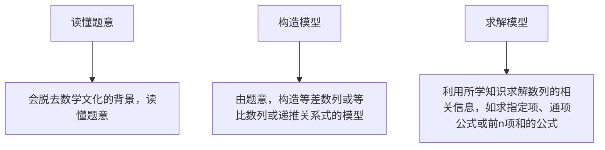
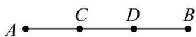
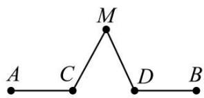
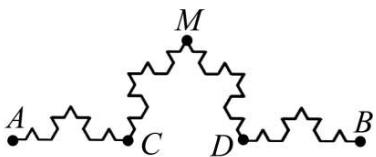
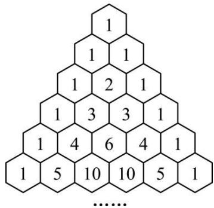
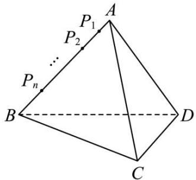

# 第 45 讲 数列的综合应用

# 知识梳理

# 1、解决数列与数学文化相交汇问题的关键

flowchart

# 2、新定义问题的解题思路

遇到新定义问题,应耐心读题,分析新定义的特点,弄清新定义的性质,按新定义的要求,“照章办事”,逐条分析、运算、验证,使问题得以解决.

# 3、数列与函数综合问题的主要类型及求解策略

①已知函数条件,解决数列问题,此类问题一般利用函数的性质、图象研究数列问题.  
②已知数列条件,解决函数问题,解决此类问题一般要利用数列的通项公式、前 n 项和公式、求和方法等对式子化简变形.

注意数列与函数的不同,数列只能看作是自变量为正整数的一类函数,在解决问题时要注意这一特殊性.

# 4、数列与不等式综合问题的求解策略

解决数列与不等式的综合问题时,若是证明题,则要灵活选择不等式的证明方法,如比较法、综合法、分析法、放缩法等;若是含参数的不等式恒成立问题,则可分离参数,转化为研究最值问题来解决.

利用等价转化思想将其转化为最值问题.

$$
a > \mathrm{F} (n) \text {恒成立} \Leftrightarrow a > \mathrm{F} (n) _ {\max};
$$

$$
a <   \mathrm{F} (n) \text {恒成立} \Leftrightarrow a <   \mathrm{F} (n) _ {\min}.
$$

5、现实生活中涉及银行利率、企业股金、产品利润、人口增长、产品产量等问题，常常考虑用数列的知识去解决。

(1) 数列实际应用中的常见模型

①等差模型:如果增加(或减少)的量是一个固定的数,则该模型是等差模型,这个固定的数就是公差;  
②等比模型:如果后一个量与前一个量的比是一个固定的数,则该模型是等比模型,这个固定的数就是公比;  
③递推数列模型:如果题目中给出的前后两项之间的关系不固定,随项的变化而变化,则应考虑是第n项 $a_{n}$ 与第 $n+1$ 项 $a_{n+1}$ 的递推关系还是前n项和 $S_{n}$ 与前 $n+1$ 项和 $S_{n+1}$ 之间的递推关系.

在实际问题中建立数列模型时,一般有两种途径:一是从特例入手,归纳猜想,再推广到一般结论;二是从一般入手,找到递推关系,再进行求解.一般地,涉及递增率或递减率要用等比数列,涉及依次增加或减少要用等差数列,有的问题需通过转化得到等差或等比数列,在

解决问题时要往这些方面联系.

(2) 解决数列实际应用题的 3 个关键点

①根据题意,正确确定数列模型;   
②利用数列知识准确求解模型；  
③问题作答,不要忽视问题的实际意义.

6、在证明不等式时，有时把不等式的一边适当放大或缩小，利用不等式的传递性来证明，我们称这种方法为放缩法.

放缩时常采用的方法有:舍去一些正项或负项、在和或积中放大或缩小某些项、扩大(或缩小)分式的分子(或分母).

放缩法证不等式的理论依据是：A>B,B>C⇒A>C；A<B,B<C⇒A<C.

放缩法是一种重要的证题技巧,要想用好它,必须有目标,目标可从要证的结论中去查找.

# 必考题型全归纳

# 1 题型一: 数列在数学文化与实际问题中的应用

2158 (2024·河南·河南省内乡县高级中学校考模拟预测)“角谷猜想”首先流传于美国, 不久便传到欧洲, 后来一位名叫角谷静夫的日本人又把它带到亚洲, 因而人们就顺势把它叫作 “角谷猜想”. “角谷猜想”是指一个正整数, 如果是奇数就乘以 3 再加 1 , 如果是偶数就除以 2 , 这样经过若干次运算, 最终回到 1 . 对任意正整数 $a_0$ , 按照上述规则实施第 $n$ 次运算的结果为 $a_n(n \in \mathbb{N})$ , 若 $a_5 = 1$ , 且 $a_i(i = 1,2,3,4)$ 均不为 1 , 则 $a_0 =$ ( )

A. 5 或 16

B. 5 或 32

C. 5或16或4

D. 5 或 32 或 4

2159 (2024·河南郑州·统考模拟预测)北宋大科学家沈括在《梦溪笔谈》中首创的“隙积术”, 就是关于高阶等差数列求和的问题. 现有一货物堆, 从上向下查, 第一层有 1 个货物, 第二层比第一层多 2 个, 第三层比第二层多 3 个, 以此类推, 记第 $n$ 层货物的个数为 $a_{n}$ , 则使得 $a_{n} > 2n + 2$ 成立的 $n$ 的最小值是 ( )

A. 3

B. 4

C. 5

D. 6

2160 (2024·四川成都·石室中学校考模拟预测)南宋数学家杨辉所著的《详解九章算法》中有如下俯视图所示的几何体,后人称之为“三角垛”. 其最上层有1个球,第二层有3个球,第三层有6个球,第四层10个…,则第三十六层球的个数为 ( )

A. 561

B. 595

C. 630

D. 666

2161 (2024·全国·高三专题练习)科赫曲线因形似雪花,又被称为雪花曲线.其构成方式如下:如图1将线段AB等分为线段AC,CD,DB,如图2.以CD为底向外作等边三角形CMD,并去掉线段CD,将以上的操作称为第一次操作;继续在图2的各条线段上重复上述操作,当进行三次操作后形成如图3的曲线.设线段AB的长度为1,则图3中曲线的长度为()

  
图1

text_image

M
A C D B

图2

text_image

A
C
D
B
M

图3

A. 2

B. $\frac{16}{9}$

C. $\frac{64}{27}$

D. 3

2162 (2024·全国·高三专题练习)我国南宋数学家杨辉 1261 年所著的《详解九章算法》一书里出现了如图所示的表, 即杨辉三角, 这是数学史上的一个伟大成就在“杨辉三角”中, 第 n 行的所有数字之和为 $2^{n-1}$ , 若去除所有为 1 的项, 依次构成数列 2, 3, 3, 4, 6, 4, 5, 10, 10, 5, ..., 则此数列的前 34 项和为 ( )

text_image

1
1 1
1 2 1
1 3 3 1
1 4 6 4 1
1 5 10 10 5 1
......

A. 959

B. 964

C. 1003

D. 1004

2163 (2024·全国·高三专题练习)南宋数学家杨辉在《详解九章算术》中提出了高阶等差数列的问题,即一个数列 $\{a_{n}\}$ 本身不是等差数列,但从 $\{a_{n}\}$ 数列中的第二项开始,每一项与前一项的差构成等差数列 $\{b_{n}\}$ (则称数列 $\{a_{n}\}$ 为一阶等差数列),或者 $\{b_{n}\}$ 仍旧不是等差数列,但从 $\{b_{n}\}$ 数列中的第二项开始,每一项与前一项的差构成等差数列 $\{c_{n}\}$ (则称数列 $\{a_{n}\}$ 为二阶等差数列),依次类推,可以得到高阶等差数列.类比高阶等差数列的定义,我们亦可定义高阶等比数列,设数列1,1,2,8,64…是一阶等比数列,则该数列的第8项是().

A. $2^{8}$

B. $2^{15}$

C. $2^{21}$

D. $2^{28}$

# 2 题型二:数列中的新定义问题

2164 (2024·江西·江西师大附中校考三模)已知数列 $\{a_{n}\}$ 的通项 $a_{n}=2n-1(n\in\mathbb{N}^{*})$ ，如果把数列 $\{a_{n}\}$ 的奇数项都去掉，余下的项依次排列构成新数列为 $\{b_{n}\}$ ，再把数列 $\{b_{n}\}$ 的奇数项又去掉，余下的项依次排列构成新数列为 $\{c_{n}\}$ ，如此继续下去，……，那么得到的数列（含原已知数列）的第一项按先后顺序排列，构成的数列记为 $\{P_{n}\}$ ，则数列 $\{P_{n}\}$ 前 10 项的和为（）

A. 1013

B. 1023

C. 2036

D. 2050

2165 (2024·人大附中校考三模)已知数列 $\{a_{n}\}$ 满足: 对任意的 $n \in N^{*}$ ，总存在 $m \in N^{*}$ ，使得 $S_{n} = a_{m}$ ，则称 $\{a_{n}\}$ 为“回旋数列”。以下结论中正确的个数是（）

①若 $a_{n}=2023n$ ，则 $\{a_{n}\}$ 为“回旋数列”；  
②设 $\{a_{n}\}$ 为等比数列，且公比 q 为有理数，则 $\{a_{n}\}$ 为“回旋数列”；

③设 $\{a_{n}\}$ 为等差数列，当 $a_{1}=1, d<0$ 时，若 $\{a_{n}\}$ 为“回旋数列”，则 d=-1；  
④若 $\{a_{n}\}$ 为“回旋数列”，则对任意 $n \in N^{*}$ ，总存在 $m \in N^{*}$ ，使得 $a_{n} = S_{m}$ .

A. 1

B. 2

C. 3

D. 4

2166 (2024·湖北武汉·统考三模)将 $1,2,\cdots,n$ 按照某种顺序排成一列得到数列 $\{a_{n}\}$ ，对任意 $1\leqslant i<j\leqslant n$ ，如果 $a_{i}>a_{j}$ ，那么称数对 $(a_{i},a_{j})$ 构成数列 $\{a_{n}\}$ 的一个逆序对。若 n=4，则恰有 2 个逆序对的数列 $\{a_{n}\}$ 的个数为（）

A. 4

B. 5

C. 6

D. 7

2167 (2024·全国·高三专题练习)记数列 $\{a_{n}\}$ 的前 n 项和为 $S_{n}$ ，若存在实数 M > 0，使得对任意的 $n \in N^{*}$ ，都有 $|S_{n}| < M$ ，则称数列 $\{a_{n}\}$ 为“和有界数列”。下列命题正确的是（）

A. 若 $\{a_{n}\}$ 是等差数列，且首项 $a_{1}=0$ ，则 $\{a_{n}\}$ 是“和有界数列”  
B. 若 $\{a_{n}\}$ 是等差数列，且公差 d=0，则 $\{a_{n}\}$ 是“和有界数列”  
C. 若 $\{a_{n}\}$ 是等比数列，且公比 $|q|<1$ ，则 $\{a_{n}\}$ 是“和有界数列”  
D. 若 $\{a_{n}\}$ 是等比数列，且 $\{a_{n}\}$ 是“和有界数列”，则 $\{a_{n}\}$ 的公比 $|q|<1$

2168 (2024·全国·高三专题练习)斐波那契数列又称黄金分割数列,因数学家列昂纳多·斐波那契以兔子繁殖为例子而引入,故又称为“兔子数列”.斐波那契数列用递推的方式可如下定义:用 $a_{n}$ 表示斐波那契数列的第n项,则数列 $\{a_{n}\}$ 满足: $a_{1}=a_{2}=1,a_{n+2}=a_{n+1}+a_{n}$ ,记 $\sum_{i=1}^{n}a_{i}=a_{1}+a_{2}+\cdots+a_{n}$ ,则下列结论不正确的是()

A. $a_{10} = 55$

B. $3a_{n} = a_{n - 2} + a_{n + 2}(n\geqslant 3)$

C. $\sum_{i=1}^{2019}a_{i}=a_{2021}$

D. $\sum_{i=1}^{2021} a_i^2 = a_{2021} \cdot a_{2022}$

2169 (2024·河北·统考模拟预测)数学家杨辉在其专著《详解九章算术法》和《算法通变本末》中,提出了一些新的高阶等差数列. 其中二阶等差数列是一个常见的高阶等差数列、如数列 2, 4, 7, 11, 16, 从第二项起,每一项与前一项的差组成新数列 2, 3, 4, 5, 新数列 2, 3, 4, 5 为等差数列,则称数列 2, 4, 7, 11, 16 为二阶等差数列,现有二阶等差数列 $\{a_{n}\}$ ,其前七项分别为 2, 2, 3, 5, 8, 12, 17. 则该数列的第 20 项为 ( )

A. 173

B. 171

C. 155

D. 151

# 3 题型三: 数列与函数、不等式的综合问题

2170 (2024·重庆巴南·统考一模)已知等比数列 $\{a_{n}\}$ 满足： $a_{1} + a_{2} = 20, a_{2} + a_{3} = 80$ . 数列 $\{b_{n}\}$ 满足 $b_{n} = \log_{2} a_{n} (n \in \mathbb{N}^{*})$ ，其前 n 项和为 $S_{n}$ ，若 $\frac{b_{n}}{S_{n} + 8} \leqslant \lambda$ 恒成立，则 $\lambda$ 的最小值为 \_\_\_\_.

2171 (2024·四川泸州·四川省泸县第四中学校考模拟预测)设数列 $\{a_{n}\}$ 的前 n 项和为 $S_{n}, a_{3}=4$ ，且 $a_{n+1}=\left(1+\frac{1}{n+1}\right)a_{n}$ ，若 $2S_{n}+12\geqslant ka_{n}$ 恒成立，则 k 的最大值是 \_\_\_\_.

2172 (2024·河南新乡·统考三模)已知数列 $\{a_{n}\}$ 满足 $a_{1}=8, a_{n+1}-a_{n}=4n$ ，则 $\frac{a_{n}}{n}$ 的最小值为 \_\_\_\_.

2173 (2024·上海杨浦·高三复旦附中校考阶段练习)已知数列 $\{a_{n}\}$ 满足 $a_{1}=\frac{2023}{2020}$ ，且对于任意的正整数 n，都有 $a_{n}=\frac{a_{n+1}-1}{a_{n}-1}$ 。若正整数 k 使得 $k>\sum_{i=1}^{n}\frac{1}{a_{i}}$ 对任意的正整数成立，则整数 k 的最小值为 \_\_\_\_。

# 4 题型四: 数列在实际问题中的应用

2174 (2024·全国·高三专题练习)根据市场调查结果,预测某种家用商品从年初开始的 n 个月内累积的需求量 $S_{n}$ (万件) 近似地满足关系式 $S_{n}=\frac{n}{90}(21n-n^{2}-5)(n=1,2,\cdots,12)$ , 按此预测, 在本年度内, 需求量超过 1.5 万件的月份是 \_\_\_\_.

2175 (2024·高三课时练习)某研究所计划改建十个实验室,每个实验室的改建费用分为装修费和设备费,且每个实验室的装修费都一样,设备费从第一到第十实验室依次构成等比数列.已知第五实验室比第二实验室的改建费用高42万元,第七实验室比第四实验室的改建费用高168万元,并要求每个实验室改建费用不能超过1700万元,则该研究所改建这十个实验室投入的总费用最多需要\_\_\_\_万元.

2176 (2024·全国·高三专题练习)冰墩墩作为北京冬奥会的吉祥物特别受欢迎,官方旗舰店售卖冰墩墩运动造型多功能徽章,若每天售出件数成递增的等差数列,其中第1天售出10000件,第21天售出15000件;价格每天成递减的等差数列,第1天每件100元,第21天每件60元,则该店第\_\_\_\_天收入达到最高.

2177 (2024·全国·高三专题练习)沈阳京东MALL于2022年国庆节盛大开业,商场为了满足广大数码狂热爱好者的需求,开展商品分期付款活动.现计划某商品一次性付款的金额为a元,以分期付款的形式等额分成n次付清,每期期末所付款是x元,每期利率为r,则爱好者每期需要付款x= \_\_\_\_.

2178 (2024·辽宁锦州·渤海大学附属高级中学校考模拟预测)一件家用电器, 现价 2000 元, 实行分期付款, 一年后还清, 购买后一个月第一次付款, 以后每月付款一次, 每次付款数相同, 共付 12 次, 月利率为 0.8%, 并按复利计息, 那么每期应付款 \_\_\_\_ 元. (参考数据: $1.008^{11} \approx 1.092$ , $1.008^{12} \approx 1.100$ , $1.08^{11} \approx 2.332$ , $1.08^{12} \approx 2.518$ )

2179 (2024·全国·高三专题练习)在第七十五届联合国大会一般性辩论上,习近平主席表示,中国将提高国家自主贡献力度,采取更加有力的政策和措施,二氧化碳排放力争于2030年前达到峰值,努力争取2060年前实现碳中和.某地2020年共发放汽车牌照12万张,其中燃油型汽车牌照10万张,电动型汽车2万张,从2021年起,每年发放的电动型汽车牌照按前一年的50%增长,燃油型汽车牌照比前一年减少0.5万张,同时规定,若某年发放的汽车牌照超过15万张,以后每年发放的电动车牌照的数量维持在这一年的水平不变.那么从2021年至2030年这十年累计发放的汽车牌照数为\_\_\_\_万张.

# 5 题型五: 数列不等式的证明

2180 (2024·河北张家口·统考三模)已知数列 $\{a_{n}\}$ 满足 $3 + \frac{a_{1}}{2} + \frac{a_{2}}{2^{2}} + \frac{a_{3}}{2^{3}} + \cdots + \frac{a_{n}}{2^{n}} = \frac{2n + 3}{2^{n}}$ .

(1) 求数列 $\{a_{n}\}$ 的通项公式;  
(2) 记数列 $\left\{\frac{1}{a_{n}\cdot a_{n+1}}\right\}$ 的前 n 项和为 $S_{n}$ ，证明： $S_{n}<\frac{1}{2}$ .

2181 (2024·全国·高三专题练习)证明不等式 $\frac{1}{2^{2}} + \frac{1}{3^{2}} + \cdots + \frac{1}{(n+1)^{2}} < \frac{2}{3}$ .

2182 (2024·全国·高三专题练习)已知 $a_{n} = \left(\frac{1}{3}\right)^{n}, c_{n} = \frac{1}{1 + a_{n}} + \frac{1}{1 - a_{n + 1}}, \{c_{n}\}$ 的前 $n$ 项和为 $\mathrm{T}_n$ ，证明： $\mathrm{T}_n > 2n - \frac{1}{3}$

2183 (2024·全国·高三专题练习)已知每一项都是正数的数列 $\{a_{n}\}$ 满足 $a_{1}=1, a_{n+1}=\frac{a_{n}+1}{12a_{n}}(n\in\mathbb{N}^{*})$ .

(1) 证明: $a_{2n+1} < a_{2n-1}$ .   
(2) 证明: $\frac{1}{6} \leqslant a_n \leqslant 1$ .   
(3) 记 $S_{n}$ 为数列 $\left\{|a_{n+1}-a_{n}|\right\}$ 的前 n 项和, 证明: $S_{n}<6$ .

2184 (2024·全国·高三专题练习)证明： $\sum_{k=1}^{n}\frac{1}{2^{k}-(-1)^{k}}<\frac{11}{12}$ . (注： $\sum_{k=1}^{n}a_{k}=a_{1}+a_{2}+\cdots+a_{n}$ .)

2185 (2024·全国·高三专题练习)已知数列 $\{a_{n}\}$ ， $S_{n}$ 为数列 $\{a_{n}\}$ 的前 n 项和，且满足 $a_{1}=1$ ， $3S_{n}=(n+2)a_{n}$ .

(1) 求 $\{a_{n}\}$ 的通项公式;  
(2) 证明: $\frac{1}{a_{2}} + \frac{1}{a_{4}} + \frac{1}{a_{8}} + \cdots + \frac{1}{a_{2^{n}}} < \frac{1}{2}$ .

2186 (2024·全国·高三专题练习)已知各项为正的数列 $\{a_{n}\}$ 满足 $a_{1}=\frac{1}{2}$ ， $a_{n+1}^{2}=\frac{1}{3}a_{n}^{2}+\frac{2}{3}a_{n}$ ， $n\in N^{*}$ . 证明：

(1) $a_{n}<a_{n+1}<1;$   
(2) $a_{1}+a_{2}+\cdots+a_{n}>n-\frac{9}{4}.$

2187 (2024·全国·高三专题练习)设数列 $\{a_{n}\}$ 满足 $a_{1}=a, a_{n+1}a_{n}-a_{n}^{2}=1(n\in N^{*})$ .

(1) 若 $a_{3}=\frac{5}{2}$ ，求实数 a 的值；  
(2) 设 $b_{n} = \frac{a_{n}}{\sqrt{n}}$ ，若 $a = 1$ ，证明： $\sqrt{2} \leqslant b_{n} < \frac{3}{2} (n \geqslant 2)$ .

2188 (2024·全国·高三专题练习)已知函数 $\{a_{n}\}$ 满足 $a_1 = \frac{1}{2}, a_{n+1} = \sin\left(\frac{\pi}{2}a_n\right), n \in \mathbb{N}^*$ .

(1) 证明: $\frac{1}{2} \leqslant a_n < a_{n+1} < 1$ .   
(2) 设 $S_{n}$ 是数列 $\{a_{n}\}$ 的前 n 项和, 证明: $S_{n} > n - \frac{3}{2}$ .

# 6 题型六:公共项问题

2189 (2024·上海嘉定·上海市嘉定区第一中学校考三模)已知 $n \in N, n \geqslant 1$ ，将数列 $\{2n-1\}$ 与数列 $\{n^{2}-1\}$ 的公共项从小到大排列得到新数列 $\{a_{n}\}$ ，则 $\sum_{n=1}^{100} \frac{1}{a_{n}} =$ \_\_\_\_ .

2190 (2024·湖南邵阳·邵阳市第二中学校考模拟预测)数列 $\{2n-1\}$ 和数列 $\{3n-2\}$ 的公共项从小到大构成一个新数列 $\{a_{n}\}$ ，数列 $\{b_{n}\}$ 满足： $b_{n}=\frac{a_{n}}{2^{n}}$ ，则数列 $\{b_{n}\}$ 的最大项等于 \_\_\_\_.

2191 (2024·全国·高三专题练习)已知 $n \in \mathbb{N}^*$ , 将数列 $\{2n - 1\}$ 与数列 $\{n^2 - 1\}$ 的公共项从小

到大排列得到新数列 $\{a_{n}\}$ ，则 $\frac{1}{a_{1}} + \frac{1}{a_{2}} + \cdots + \frac{1}{a_{10}} =$ \_\_\_\_ .

2192 (2024·重庆沙坪坝·高三重庆八中校考阶段练习)将数列 $\left\{2^{n}\right\}$ 与 $\left\{3n-2\right\}$ 的公共项由小到大排列得到数列 $\left\{a_{n}\right\}$ ，则数列 $\left\{a_{n}\right\}$ 的前 n 项的和为 \_\_\_\_.  
2193 (2024·全国·高三专题练习)数列 $\{2n\}$ 与 $\{3n-1\}$ 的所有公共项由小到大构成一个新的数列 $\{a_{n}\}$ ，则 $a_{10}=$ \_\_\_\_.  
2194 (2024·安徽蚌埠·统考一模)有两个等差数列 2, 6, 10, …, 190 及 2, 8, 14, …, 200, 由这两个等差数列的公共项按从小到大的顺序组成一个新数列, 则这个新数列的各项之和为 \_\_\_\_.

# 题型七:插项问题

2195 (2024·全国·高三对口高考)在数1和100之间插入n个实数,使得这 $n+2$ 个数构成递增的等比数列,将这 $n+2$ 个数的乘积记作 $T_{n}$ ,再令 $a_{n}=\lg T_{n},n\geqslant1$ .则数列 $\{a_{n}\}$ 的通项公式为\_\_\_\_.  
2196 (2024·湖北襄阳·襄阳四中校考模拟预测)已知等差数列 $\{a_{n}\}$ 中， $a_{2}=4, a_{6}=16$ ，若在数列 $\{a_{n}\}$ 每相邻两项之间插入三个数，使得新数列也是一个等差数列，则新数列的第 43 项为 \_\_\_\_.  
2197 (2024·福建福州·福建省福州第一中学校考模拟预测)已知数列 $\{a_{n}\}$ 的首项 $a_{1}=\frac{4}{5}$ , $a_{n+1}=\frac{4a_{n}}{3a_{n}+1},\quad n\in N^{*}.$

(1) 设 $b_{n}=\frac{a_{n}}{1-a_{n}}$ ，求数列 $\{b_{n}\}$ 的通项公式；  
(2) 在 $b_{k}$ 与 $b_{k+1}$ (其中 $k \in \mathbb{N}^{*}$ ) 之间插入 $2^{k}$ 个 3，使它们和原数列的项构成一个新的数列 $\{c_{n}\}$ . 记 $\mathrm{S}_{n}$ 为数列 $\{c_{n}\}$ 的前 $n$ 项和，求 $\mathrm{S}_{36}$ .

2198 (2024·广东佛山·统考模拟预测)已知数列 $\{a_{n}\}$ 满足 $\frac{a_{1}}{3} + \frac{a_{2}}{3^{2}} + \cdots + \frac{a_{n}}{3^{n}} = \frac{n}{3}(n \in \mathbb{N}^{*})$ .

(1) 求 $\{a_{n}\}$ 的通项公式;  
(2) 在 $\{a_{n}\}$ 相邻两项中间插入这两项的等差中项，求所得新数列 $\{b_{n}\}$ 的前 $2n$ 项和 $\mathrm{T}_{2n}$ .

2199 (2024·吉林通化·梅河口市第五中学校考模拟预测) $S_{n}$ 为数列 $\{a_{n}\}$ 的前n项和，已知 $6S_{n}=a_{n}^{2}+3a_{n}-4$ ，且 $a_{n}>0$ .

(1) 求数列 $\{a_{n}\}$ 的通项公式 $a_{n}$ ;  
(2) 数列 $\{b_{n}\}$ 依次为: $a_{1},3,a_{2},3^{2},3^{3},a_{3},3^{4},3^{5},3^{6},a_{4},3^{7},3^{8},3^{9},3^{10}\cdots$ , 规律是在 $a_{k}$ 和 $a_{k+1}$ 中间插入 $k(k\in\mathbb{N}^{*})$ 项, 所有插入的项构成以 3 为首项, 3 为公比的等比数列, 求数列 $\{b_{n}\}$ 的前 100 项的和.

2200 (2024·全国·高三专题练习)设等比数列 $\{a_{n}\}$ 的首项为 $a_{1}=2$ ，公比为 $q(q$ 为正整数），且满足 $3a_{3}$ 是 $8a_{1}$ 与 $a_{5}$ 的等差中项；数列 $\{b_{n}\}$ 满足 $2n^{2}-(t+b_{n})n+\frac{3}{2}b_{n}=0(t\in\mathbb{R}, n\in\mathbb{N}^{*})$ .

(1) 求数列 $\{a_{n}\}$ 的通项公式;  
(2) 试确定 t 的值, 使得数列 $\{b_{n}\}$ 为等差数列;  
(3) 当 $\{b_{n}\}$ 为等差数列时，对每个正整数 k，在 $a_{k}$ 与 $a_{k+1}$ 之间插入 $b_{k}$ 个 2，得到一个新数列 $\{c_{n}\}$ . 设 $T_{n}$ 是数列 $\{c_{n}\}$ 的前 n 项和，试求 $T_{100}$ .

2201 (2024·安徽滁州·校考模拟预测)已知等比数列 $\{a_{n}\}$ 的前 n 项和为 $S_{n}$ ，且 $S_{n}=a_{n+1}-2(n\in N^{*})$ .

(1) 求数列 $\{a_{n}\}$ 的通项公式；  
(2) 在 $a_{n}$ 与 $a_{n+1}$ 之间插入 $n$ 个数, 使这 $n+2$ 个数组成一个公差为 $d_{n}$ 的等差数列, 求数列 $\left\{\frac{1}{d_n}\right\}$ 的前 $n$ 项和 $\mathrm{T}_n$ .

# 题型八:蛛网图问题

2202 (2024·全国·高三专题练习)已知数列 $\{b_{n}\}$ 若 $b_{1}=2, b_{n}=\frac{t}{4}b_{n-1}+\frac{3}{4}(n\in\mathbb{N}^{*}$ 且 $n\geqslant2, t\in\mathbb{R})$ ，若 $|b_{n}|\leqslant2$ 对任意 $n\in\mathbb{N}^{*}$ 恒成立，则实数 t 的取值范围是 \_\_\_\_.

2203 (2024·虹口区校级期中)已知数列 $\{a_{n}\}$ 满足: $a_{1}=0$ , $a_{n+1}=\ln(\mathrm{e}^{a_{n}}+1)-a_{n}(n\in\mathbb{N}^{*})$ , 前 n 项和为 $S_{n}$ , 则下列选项错误的是() (参考数据: $\ln2\approx0.693$ , $\ln3\approx1.099$ )

A. $\{a_{2n - 1}\}$ 是单调递增数列， $\{a_{2n}\}$ 是单调递减数列

B. $a_{n} + a_{n + 1}\leqslant \ln 3$

C. $S_{2020} < 670$

D. $a_{2n - 1}\leqslant a_{2n}$

2204 (2024·浙江模拟)数列 $\{a_{n}\}$ 满足 $a_{1}>0, a_{n+1}=a_{n}^{3}-a_{n}+1, n\in N^{*}, S_{n}$ 表示数列 $\left\{\frac{1}{a_{n}}\right\}$ 前 n 项和，则下列选项中错误的是 ()

A. 若 $0 < a_{1} < \frac{2}{3}$ , 则 $a_{n} < 1$

B. 若 $\frac{2}{3} < a_1 < 1$ ，则 $\{a_n\}$ 递减

C. 若 $a_{1}=\frac{1}{2}$ ，则 $S_{n}>4\left(\frac{1}{a_{n+1}}-2\right)$

D. 若 $a_1 = 2$ ，则 $\mathrm{S}_{2000} > \frac{2}{3}$

2205 (2024·浙江模拟)已知数列 $\{a_{n}\}$ 满足： $a_{1}=0,\ a_{n+1}=\ln(\mathrm{e}^{a_{n}}+1)-a_{n}(n\in\mathbb{N}^{*})$ ，前 n 项和为 $S_{n}$ (参考数据： $\ln2\approx0.693,\ \ln3\approx1.099$ )，则下列选项中错误的是（）

A. $\{a_{2n - 1}\}$ 是单调递增数列， $\{a_{2n}\}$ 是单调递减数列

B. $a_{n} + a_{n + 1}\leqslant \ln 3$

C. $S_{2020} < 666$

D. $a_{2n - 1} < a_{2n}$

2206 (2024·下城区校级模拟)已知数列 $\{a_{n}\}$ 满足: $a_{n}>0$ , 且 $a_{n}^{2}=3a_{n+1}^{2}-2a_{n+1}(n\in\mathbb{N}^{*})$ , 下列说法正确的是 ()

A. 若 $a_1 = \frac{1}{2}$ , 则 $a_n > a_{n+1}$

B. 若 $a_1 = 2$ ，则 $a_n \geqslant 1 + \left(\frac{3}{7}\right)^{n-1}$

C. $a_1 + a_5 \leqslant 2a_3$

D. $|a_{n + 2} - a_{n + 1}|\geqslant \frac{\sqrt{3}}{3} |a_{n + 1} - a_n|$

# 题型九:整数的存在性问题(不定方程)

2207 (2024·全国·高三专题练习)已知数列 $\{a_{n}\}$ 的前 $n$ 项和是 $\mathrm{S}_n$ ，且 $\mathrm{S}_n = 2a_n - n$

(1) 证明: $\{a_{n} + 1\}$ 为等比数列;

(2) 证明: $\frac{1}{a_{2}-a_{1}}+\frac{1}{a_{3}-a_{2}}+\cdots+\frac{1}{a_{n+1}-a_{n}}<1$

(3) $T_{n}$ 为数列 $\{b_{n}\}$ 的前n项和，设 $b_{n}=\log_{2}(a_{n}+1)$ ，是否存在正整数m，k，使 $b_{k+1}^{2}=2T_{m}+19$ 成立，若存在，求出m，k；若不存在，说明理由.

2208 (2024·全国·高三专题练习)设 $a_1, a_2, a_3, a_4$ 是各项为正数且公差为 $d(d \neq 0)$ 的等差数列

(1) 证明: $2^{a_1}, 2^{a_2}, 2^{a_3}, 2^{a_4}$ 依次成等比数列;

(2) 是否存在 $a_{1}, d$ ，使得 $a_{1}, a_{2}^{2}, a_{3}^{3}, a_{4}^{4}$ 依次成等比数列，并说明理由；

(3) 是否存在 $a_{1}, d$ 及正整数 n, k，使得 $a_{1}^{n}, a_{2}^{n+k}, a_{3}^{n+2k}, a_{4}^{n+3k}$ 依次成等比数列，并说明理由.

2209 (2024·河北石家庄·高三石家庄二中校考阶段练习)数列 $\{a_{n}\}$ 的前 n 项和为 $S_{n}, a_{1} = 2, a_{2} = 4$ 且当 $n \geqslant 2$ 时， $3S_{n-1}, 2S_{n}, S_{n+1} + 2^{n}$ 成等差数列.

(1) 求数列 $\{a_{n}\}$ 的通项公式;  
(2) 在 $a_{n}$ 和 $a_{n+1}$ 之间插入 $n$ 个数, 使这 $n+2$ 个数组成一个公差为 $d_{n}$ 的等差数列, 在数列 $\{d_{n}\}$ 中是否存在 3 项 $d_{m}, d_{k}, d_{p}$ (其中 $m, k, p$ 成等差数列) 成等比数列? 若存在, 求出这样的 3 项; 若不存在, 请说明理由.

2210 (2024·全国·高三专题练习)已知数列 $\{a_{n}\}$ 的前 n 项和为 $S_{n}, a_{1}=2$ ，对任意的正整数 n，点 $(a_{n+1}, S_{n})$ 均在函数 $f(x)=x$ 图象上.

(1) 证明: 数列 $\{S_{n}\}$ 是等比数列;  
(2) 问 $\{a_{n}\}$ 中是否存在不同的三项能构成等差数列？说明理由.

2211 (2024·全国·高三专题练习)已知数列 $\{a_{n}\}$ 的前 n 项和为 $S_{n}$ ，且 $a_{1}=1, a_{n+1}=3S_{n}+1(n\in N^{*})$ .

(1) 求 $\{a_{n}\}$ 通项公式;  
(2) 设 $b_n = \frac{a_n}{n+1}$ ，在数列 $\{b_n\}$ 中是否存在三项 $b_m, b_k, b_p$ (其中 $2k = m + p$ ) 成等比数列？若存在，求出这三项；若不存在，说明理由.

2212 (2024·全国·高三专题练习)在① $a_{1}=2$ , $a_{n+1}^{2}-a_{n}^{2}=3(a_{n}>0, n\in\mathbb{N}^{*})$ , ② $S_{n}=n^{2}-2n+3(n\in\mathbb{N}^{*})$ , $S_{n}$ 为 $\{a_{n}\}$ 的前n项和, 这两个条件中任选一个, 补充在下面问题中, 并解答下列问题.

已知数列 $\{a_{n}\}$ 满足 \_\_\_\_.

(1) 求数列 $\{a_{n}\}$ 的通项公式；  
(2) 对大于 1 的正整数 $n$ , 是否存在正整数 $m$ , 使得 $a_1, a_n, a_m$ 成等比数列? 若存在, 求 $m$ 的最小值; 若不存在, 请说明理由.

注:如果选择多个条件分别解答,按第一个解答计分.

2213 (2024·安徽六安·六安一中校考模拟预测)设正项等比数列 $\{a_{n}\}$ 的前 n 项和为 $S_{n}$ ，若 $S_{3}=7$ ， $a_{3}=4$ .

(1) 求数列 $\{a_{n}\}$ 的通项公式;  
(2) 在数列 $\{S_{n}\}$ 中是否存在不同的三项构成等差数列？请说明理由.

# 10 题型十:数列与函数的交汇问题

2214 (2022·龙泉驿区校级一模)已知定义在R上的函数 $f(x)$ 是奇函数且满足 $f\left(\frac{3}{2}-x\right)=f(x), f(-2)=-3$ ，数列 $\{a_{n}\}$ 是等差数列，若 $a_{2}=3, a_{7}=13$ ，则 $f(a_{1})+f(a_{2})+f(a_{3})+\cdots+f(a_{2015})=$

A.-2

B.-3

C. 2

D. 3

2215 (2022·日照模拟)已知数列 $\{a_{n}\}$ 的通项公式 $a_{n}=n+\frac{100}{n}$ ，则 $|a_{1}-a_{2}|+|a_{2}-a_{3}|+\cdots+|a_{99}-a_{100}|=$ （）

A. 150

B. 162

C. 180

D. 210

2216 (2022 秋·仁寿县月考) 设等差数列 $\{a_{n}\}$ 的前 n 项和为 $S_{n}$ ，已知 $(a_{4}-1)^{3}+2012(a_{4}-1)=1,(a_{2009}-1)^{3}+2012(a_{2009}-1)=-1$ ，则下列结论中正确的是（）

A. $S_{2012}=2012, a_{2009}<a_{4}$

B. $S_{2012}=2012, a_{2009}>a_{4}$

C. $S_{2012}=2011, a_{2009}<a_{4}$

D. $S_{2012}=2011, a_{2009}>a_{4}$

# 题型十一: 数列与导数的交汇问题

2217 (2022·全国模拟)函数 $f(x)=\frac{a+x}{1+x}(x>0)$ ，曲线 $y=f(x)$ 在点 $(1,f(1))$ 处的切线在 y 轴上的截距为 $\frac{11}{2}$ .

(1) 求 $a$ ;   
(2) 讨论 $g(x)=x(f(x))^{2}$ 的单调性；  
(3) 设 $a_1 = 1, a_{n+1} = f(a_n)$ , 证明: $2^{n-2}|2\ln a_n - \ln 7| < 1$ .

2218 (2022·枣庄期末)已知函数 $f(x) = \ln(2x + a)$ ( $x > 0, a > 0$ ), 曲线 $y = f(x)$ 在点 $(1, f(1))$ 处的切线在 $y$ 轴上的截距为 $\ln 3 - \frac{2}{3}$ .

(1) 求 $a$ ;   
(2) 讨论函数 $g(x) = f(x) - 2x (x > 0)$ 和 $h(x) = f(x) - \frac{2x}{2x + 1} (x > 0)$ 的单调性；  
(3) 设 $a_1 = \frac{2}{5}, a_{n+1} = f(a_n)$ , 求证: $\frac{5 - 2^{n+1}}{2^n} < \frac{1}{a_n} - 2 < 0 (n \geqslant 2)$ .

# 题型十二:数列与概率的交汇问题

2219 (2024·湖南长沙·长沙市明德中学校考三模)甲、乙两选手进行一场体育竞技比赛,采用2n-1局n胜制 $(n\in\mathbb{N}^{*})$ 的比赛规则,即先赢下n局比赛者最终获胜.已知每局比赛甲获胜的概率为p,乙获胜的概率为1-p,比赛结束时,甲最终获胜的概率为 $P_{n}(n\in\mathbb{N}^{*})$ .

(1) 若 $p = \frac{1}{2}, n = 2$ ，结束比赛时，比赛的局数为X，求X的分布列与数学期望；  
(2) 若采用 5 局 3 胜制比采用 3 局 2 胜制对甲更有利, 即 $P_{3} > P_{2}$ .  
(i) 求 $p$ 的取值范围；  
(ii) 证明数列 $\{\mathrm{P}_n\}$ 单调递增，并根据你的理解说明该结论的实际含义.

2220 (2024·全国·高三专题练习)马尔可夫链是因俄国数学家安德烈·马尔可夫得名,其过程具备“无记忆”的性质,即第 $n+1$ 次状态的概率分布只跟第n次的状态有关,与第 $n-1,n-2,n-3,\cdots$ 次状态是“没有任何关系的”.现有甲、乙两个盒子,盒子中都有大小、形状、质地相同的2个红球和1个黑球.从两个盒子中各任取一个球交换,重复进行 $n(n\in\mathbb{N}^{*})$ 次操作后,记甲盒子中黑球个数为 $X_{n}$ ,甲盒中恰有1个黑球的概率为 $a_{n}$ ,恰有2个黑球的概率为 $b_{n}$ .

(1) 求 $X_{1}$ 的分布列；  
(2) 求数列 $\{a_{n}\}$ 的通项公式；  
(3) 求 $X_{n}$ 的期望.

2221 (2024·全国·高三专题练习)雅礼中学是三湘名校,学校每年一届的社团节是雅礼很有特色的学生活动,几十个社团在一个月内先后开展丰富多彩的社团活动,充分体现了雅礼中学为学生终身发展奠基的育人理念.2022年雅礼文学社举办了诗词大会,在选拔赛阶段,共设两轮比赛. 第一轮是诗词接龙,第二轮是飞花令. 第一轮给每位选手提供5个诗词接龙的题目,选手从中抽取2个题目,主持人说出诗词的上句,若选手正确回答出下句可得10分,若不能正确回答出下可得0分.

(1) 已知某位选手会 5 个诗词接龙题目中的 3 个, 求该选手在第一轮得分的数学期望;

(2) 已知恰有甲、乙、丙、丁四个团队参加飞花令环节的比赛, 每一次由四个团队中的一个回答问题, 无论答题对错, 该团队回答后由其他团队抢答下一问题, 且其他团体有相同的机会抢答下一问题. 记第 n 次回答的是甲的概率是 $P_{n}$ , 若 $P_{1}=1$ .

①求 $P_{3}$ 和 $P_{4}$ ;

②证明:数列 $\left\{P_{n}-\frac{1}{4}\right\}$ 为等比数列,并比较第7次回答的是甲和第8次回答的是甲的可能性的大小.

2222 (2024·山西朔州·高三怀仁市第一中学校校考阶段练习)一对夫妻计划进行为期60天的自驾游。已知两人均能驾驶车辆,且约定:①在任意一天的旅途中,全天只由其中一人驾车,另一人休息;②若前一天由丈夫驾车,则下一天继续由丈夫驾车的概率为 $\frac{1}{4}$ ,由妻子驾车的概率为 $\frac{3}{4}$ ;③妻子不能连续两天驾车。已知第一天夫妻双方驾车的概率均为 $\frac{1}{2}$ 。

(1) 在刚开始的三天中, 妻子驾车天数的概率分布列和数学期望;

(2) 设在第 n 天时, 由丈夫驾车的概率为 $p_{n}$ , 求数列 $\{p_{n}\}$ 的通项公式.

2223 (2024·全国·高三专题练习)某中学举办了诗词大会选拔赛,共有两轮比赛,第一轮是诗词接龙,第二轮是飞花令. 第一轮给每位选手提供5个诗词接龙的题目,选手从中抽取2个题目,主持人说出诗词的上句,若选手在10秒内正确回答出下句可得10分,若不能在10秒内正确回答出下句得0分.

(1) 已知某位选手会 5 个诗词接龙题目中的 3 个, 求该选手在第一轮得分的数学期望;

(2) 已知恰有甲、乙、丙、丁四个团队参加飞花令环节的比赛, 每一次由四个团队中的一个回答问题, 无论答题对错, 该团队回答后由其他团队抢答下一问题, 且其他团队有相同的机会抢答下一问题. 记第 $n$ 次回答的是甲的概率为 $\mathrm{P}_n$ , 若 $\mathrm{P}_1 = 1$ .

①求 $P_{2}, P_{3}$ ;

②证明:数列 $\left\{P_{n}-\frac{1}{4}\right\}$ 为等比数列,并比较第7次回答的是甲和第8次回答的是甲的可能性的大小.

2224 (2024·江苏南通·江苏省如皋中学校考模拟预测)某校为减轻暑假家长的负担,开展暑期托管,每天下午开设一节投篮趣味比赛. 比赛规则如下:在A,B两个不同的地点投篮. 先在A处投篮一次,投中得2分,没投中得0分;再在B处投篮两次,如果连续两次投中得3分,仅投中一次得1分,两次均没有投中得0分. 小明同学准备参赛,他目前的水平是在A处投篮投中的概率为p,在B处投篮投中的概率为 $\frac{3}{5}$ . 假设小明同学每次投篮的结果相互独立.

(1) 若小明同学完成一次比赛, 恰好投中 2 次的概率为 $\frac{9}{20}$ , 求 p;

(2) 若 $p = \frac{3}{4}$ ，记小明同学一次比赛结束时的得分为X，求X的分布列及数列期望.

2225 (2024·全国·高三专题练习)现有甲、乙、丙三个人相互传接球,第一次从甲开始传球,甲随机地把球传给乙、丙中的一人,接球后视为完成第一次传接球;接球者进行第二次传球,随机地传给另外两人中的一人,接球后视为完成第二次传接球;依次类推,假设传接球无失误.

(1) 设乙接到球的次数为 X, 通过三次传球, 求 X 的分布列与期望;

(2) 设第 n 次传球后, 甲接到球的概率为 $a_{n}$ ,

(i) 试证明数列 $\left\{a_{n} - \frac{1}{3}\right\}$ 为等比数列；

(ii) 解释随着传球次数的增多, 甲接到球的概率趋近于一个常数.

# 13 题型十三:数列与几何的交汇问题

2226 (多选题)(2024·全国·高三专题练习)已知正四面体ABCD中， $AB=2, P_{1}, P_{2}, \cdots, P_{n}$ 在线段AB上，且 $|AP_{1}|=|P_{1}P_{2}|=\cdots=|P_{n-1}P_{n}|=|P_{n}B|$ ，过点 $P_{1}$ 作平行于直线AC，BD的平面，截面面积为 $a_{n}$ ，则下列说法正确的是()

text_image

P₁
P₂
...
Pₙ
A
B
D
C

A. $a_{1} = 1$   
B. $\{a_{n}\}$ 为递减数列  
C. 存在常数 $m$ ，使 $\left\{\frac{1}{a_n} + m\right\}$ 为等差数列  
D. 设 $S_{n}$ 为数列 $\left\{\frac{n+1}{n^{2}}a_{n}\right\}$ 的前 n 项和，则 $S_{n}=\frac{2023}{506}$ 时，n=2023

2227 (多选题)(2024·全国·高三专题练习)已知三棱锥A-BCD的棱长均为3,其内有n个小球,球 $O_{1}$ 与三棱锥A-BCD的四个面都相切,球 $O_{2}$ 与三棱锥A-BCD的三个面和球 $O_{1}$ 都相切,如此类推, $\cdots$ ,球 $O_{n}$ 与三棱锥A-BCD的三个面和球 $O_{n-1}$ 都相切( $n\geqslant2$ ,且 $n\in N^{*}$ ),球 $O_{n}$ 的表面积为 $S_{n}$ ,体积为 $V_{n}$ ,则()

A. $V_{1}=\frac{\sqrt{6}}{8}\pi$

B. $S_{3}=\frac{3\pi}{16}$

C. 数列 $\{\mathrm{S}_n\}$ 为等差数列

D. 数列 $\{V_{n}\}$ 为等比数列

2228 (多选题)(2024·全国·高三专题练习)已知数列 $\{a_{n}\}$ 是等差数列，p, q, s, t 是互不相同的正整数，且 $p + q = s + t$ ，若在平面直角坐标系中有点 A $(s, a_{s})$ ，B $(p, a_{p})$ ，C $(q, a_{q})$ ，D $(t, a_{t})$ ，则下列选项成立的有（）

A. $\frac{a_t - a_p}{t - p} = \frac{2a_t - a_q - a_s}{2t - q - s}$

B. $|\mathrm{AB}| = |\mathrm{CD}|$

C. 直线 AB 与直线 CD 的斜率相等

D. 直线 AC 与直线 BD 的斜率不相等

2229 (多选题)(2024·重庆·高三统考阶段练习)在平面直角坐标系xOy中，A为坐标原点，B(2,0)，点列P在圆 $\left(x+\frac{2}{3}\right)^{2}+y^{2}=\frac{16}{9}$ 上，若对于 $\forall n\in N^{*}$ ，存在数列 $\{a_{n}\}$ ， $a_{1}=6$ ，使得 $\frac{PB\cdot a_{n}}{2PA\cdot a_{n-1}}=\frac{4n+2}{2n-1}$ ，则下列说法正确的是()

A. $\{a_{n}\}$ 为公差为2的等差数列

B. $\{a_{n}\}$ 为公比为2的等比数列

C. $a_{2023}=4047\cdot2^{2023}$

D. $\{a_{n}\}$ 前 $n$ 项和 $\mathrm{S}_n = 2 + (2n - 1)\cdot 2^{n + 1}$

2230 (多选题)(2024·广东·高三校联考阶段练习)若直线 $l:3x+4y+n=0(n\in\mathbb{N}^{*})$ 与圆 $\mathrm{C:(x-2)^{2}+y^{2}=a_{n}^{2}(a_{n}>0)}$ 相切，则下列说法正确的是()

A. $a_{1}=\frac{7}{5}$

B. 数列 $\{a_{n}\}$ 为等比数列

C. 数列 $\{a_{n}\}$ 的前 10 项和为 23

D. 圆 C 不可能经过坐标原点

2231 (多选题)(2024·全国·高三专题练习)在平面直角坐标系中，O是坐标原点， $M_{n},N_{n}$ 是圆O: $x^{2}+y^{2}=n^{2}$ 上两个不同的动点， $P_{n}$ 是 $M_{n}N_{n}$ 的中点，且满足 $\overrightarrow{OM_{n}}\cdot\overrightarrow{ON_{n}}+2\overrightarrow{OP_{n}}^{2}=0(n\in N^{*})$ . 设 $M_{n},N_{n}$ 到直线 $l:\sqrt{3}x+y+n^{2}+n=0$ 的距离之和的最大值为 $a_{n}$ ，则下列说法中正确的是()

A. 向量 $\overrightarrow{OM}_{n}$ 与向量 $\overrightarrow{ON}_{n}$ 所成角为 $120^{\circ}$   
B. $|\overrightarrow{\mathrm{OP}}_n| = n$   
C. $a_{n}=n^{2}+2n$   
D. 若 $b_{n} = \frac{a_{n}}{n + 2}$ ，则数列 $\left\{\frac{2^{b_n}}{(2^{b_n} - 1)(2^{b_n + 1} - 1)}\right\}$ 的前 $n$ 项和为 $1 - \frac{1}{2^{n + 1} - 1}$

