# 第 47 讲 空间点、直线、平面之间的位置关系

# 知识梳理

# 知识点一．四个公理

公理1:如果一条直线上的两点在一个平面内,那么这条直线在此平面内.

注意: (1) 此公理是判定直线在平面内的依据; (2) 此公理是判定点在面内的方法

公理 2: 过不在一条直线上的三点, 有且只有一个平面.

注意: (1) 此公理是确定一个平面的依据; (2) 此公理是判定若干点共面的依据

推论①:经过一条直线和这条直线外一点,有且只有一个平面;

注意:(1)此推论是判定若干条直线共面的依据

(2) 此推论是判定若干平面重合的依据

(3) 此推论是判定几何图形是平面图形的依据

推论②:经过两条相交直线,有且只有一个平面;

推论③:经过两条平行直线,有且只有一个平面;

公理 3: 如果两个不重合的平面有一个公共点, 那么它们有且只有一条过该点的公共直线.

注意:(1)此公理是判定两个平面相交的依据

(2) 此公理是判定若干点在两个相交平面的交线上的依据 (比如证明三点共线、三线共点)

(3) 此推论是判定几何图形是平面图形的依据

公理 4: 平行于同一条直线的两条直线互相平行.

知识点二．直线与直线的位置关系

<table><tr><td>位置关系</td><td>相交(共面)</td><td>平行(共面)</td><td>异面</td></tr><tr><td>图形</td><td>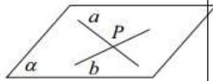</td><td>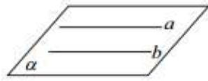</td><td>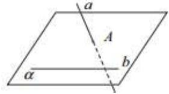</td></tr><tr><td>符号</td><td>a∩b=P</td><td>a//b</td><td>a∩α=A,b⊂α,A∉b</td></tr><tr><td>公共点个数</td><td>1</td><td>0</td><td>0</td></tr><tr><td>特征</td><td>两条相交直线确定一个平面</td><td>两条平行直线确定一个平面</td><td>两条异面直线不同在如何一个平面内</td></tr></table>

知识点三．直线与平面的位置关系:有直线在平面内、直线与平面相交、直线与平面平行三种情况. 

<table><tr><td>位置关系</td><td>包含(面内线)</td><td>相交(面外线)</td><td>平行(面外线)</td></tr><tr><td>图形</td><td></td><td></td><td></td></tr><tr><td></td><td>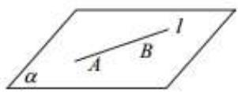</td><td>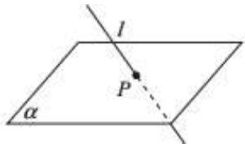</td><td>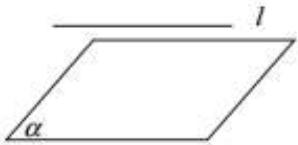</td></tr><tr><td>符号</td><td> $l \subset \alpha$ </td><td> $l \cap \alpha = P$ </td><td> $l // \alpha$ </td></tr><tr><td>公共点个数</td><td>无数个</td><td>1</td><td>0</td></tr></table>

知识点四．平面与平面的位置关系:有平行、相交两种情况.

<table><tr><td>位置关系</td><td>平行</td><td>相交(但不垂直)</td><td>垂直</td></tr><tr><td>图形</td><td>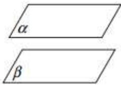</td><td>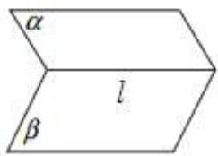</td><td>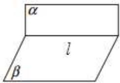</td></tr><tr><td>符号</td><td>α//β</td><td>α∩β=l</td><td>α⊥β,α∩β=l</td></tr><tr><td>公共点个数</td><td>0</td><td>无数个公共点且都在唯一的一条直线上</td><td>无数个公共点且都在唯一的一条直线上</td></tr></table>

知识点五．等角定理:空间中如果两个角的两边分别对应平行,那么这两个角相等或互补.

# 必考题型全归纳

# 题型一:证明“点共面”、“线共面”或“点共线”及“线共点”

2276 (2024·山西大同·高一校考期中)如图所示,在空间四边形ABCD中,E,F分别为AB,AD的中点,G,H分别在BC,CD上,且BG:GC=DH:HC=1:2,求证:

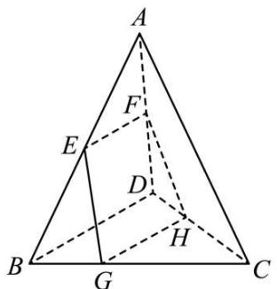

text_image

A
F
E
D
B
G
H
C

(1)E, F, G, H 四点共面;  
(2)EG 与 HF 的交点在直线 AC 上.

2277 (2024·陕西西安·高一校考期中)(1)已知直线 $a / / b$ ，直线 $l$ 与 $a,b$ 都相交，求证：过 $a,b,$ $l$ 有且只有一个平面；

(2)如图,在空间四边形ABCD中,H,G分别是AD,CD的中点,E,F分别是边AB,BC上的点,且 $\frac{CF}{FB}=\frac{AE}{EB}=\frac{1}{3}$ .求证:直线EH,BD,FG相交于一点.

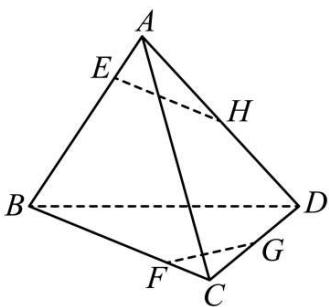

text_image

A
E
H
B
D
G
F
C

2278 (2024·河南信阳·高一校联考期中)如图,在正方体 $ABCD-A_{1}B_{1}C_{1}D_{1}$ 中,E,F 分别是 AB, $AA_{1}$ 上的点,且 $A_{1}F=2FA, BE=2AE$ .

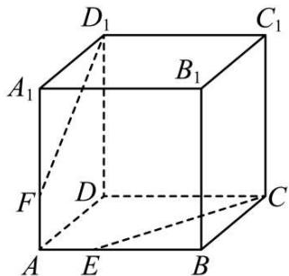

text_image

D₁
C₁
A₁
B₁
F
D
C
A
E
B

(1) 证明: E, C, D₁, F 四点共面;  
(2) 设 $\mathrm{D}_1\mathrm{F} \cap \mathrm{CE} = \mathrm{O}$ , 证明: A, O, D 三点共线.

2279 (2024·全国·高一专题练习)如图所示,在空间四边形ABCD中,E,F分别为AB,AD的中点,G,H分别在BC,CD上,且BG:GC=DH:HC=1:2.求证:

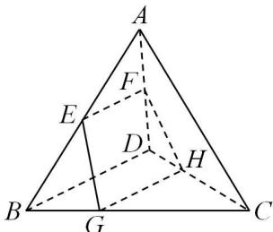

text_image

A
F
E
D
H
B
G
C

(1)E、F、G、H四点共面；  
(2)EG与HF的交点在直线AC上.

2280 (2024·云南楚雄·高一统考期中)如图,在正四棱台 $ABCD-A_{1}B_{1}C_{1}D_{1}$ 中,E,F,G,H分别为棱 $A_{1}B_{1},B_{1}C_{1},AB,BC$ 的中点.

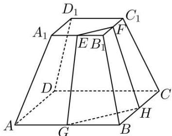

text_image

D₁
A₁
E B₁
F
C₁
D
A
G
B
H
C

(1) 证明 E, F, G, H 四点共面;  
(2) 证明 GE, FH, BB $_{1}$ 相交于一点.

2281 (2024·全国·高三专题练习)如图所示,在正方体 $ABCD-A_{1}B_{1}C_{1}D_{1}$ 中,E,F 分别是 AB, $AA_{1}$ 的中点.

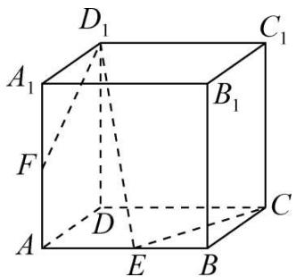

text_image

D₁
A₁
B₁
F
D
C
A
E
B
C₁

(1) 求证: CE, D₁F, DA 三线交于点 P;

(2) 在 (1) 的结论中, G 是 $\mathrm{D}_{1} \mathrm{~E}$ 上一点, 若 FG 交平面 ABCD 于点 H, 求证: P, E, H 三点共线.

# 题型二:截面问题

2282 (2024·全国·高三对口高考)如图,正方体 $ABCD-A_{1}B_{1}C_{1}D_{1}$ 的棱长为 $2\sqrt{3}$ ,动点 P 在对角线 $BD_{1}$ 上,过点 P 作垂直于 $BD_{1}$ 的平面 $\alpha$ ,记这样得到的截面多边形(含三角形)的周长为 y,设 BP = x,则当 $x \in [1,5]$ 时,函数 $y = f(x)$ 的值域为()

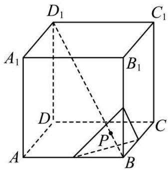

text_image

D₁
C₁
A₁
B₁
D
P
C
A
B

A. $[3\sqrt{6}, 6\sqrt{6}]$

B. $[\sqrt{6}, 2\sqrt{6}]$

C. $(0,\sqrt{6} ]$

D. $(0,3\sqrt{6} ]$

2283 (2024·北京东城·高三北京市第十一中学校考阶段练习)如图,正方体 ABCD-A₁B₁C₁D₁ 的棱长为 1, E, F, G 分别为线段 BC, CC₁, BB₁ 上的动点 (不含端点),

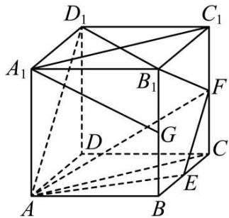

text_image

D₁
C₁
A₁
B₁
F
D
G
C
E
A
B

①异面直线 $D_{1}D$ 与 AF 所成角可以为 $\frac{\pi}{4}$ ②当 G 为中点时，存在点 E, F 使直线 $A_{1}G$ 与平面 AEF 平行
③当E,F为中点时,平面AEF截正方体所得的截面面积为 $\frac{9}{8}$

④存在点 G, 使点 C 与点 G 到平面 AEF 的距离相等
则上述结论正确的是 ( )

A. ①③

B. ②④

C. ②③

D. ①④

2284 (2024·河南·模拟预测)在正方体 $ABCD-A_{1}B_{1}C_{1}D_{1}$ 中，M, N 分别为 AD, $C_{1}D_{1}$ 的中点，过 M, N, $B_{1}$ 三点的平面截正方体 $ABCD-A_{1}B_{1}C_{1}D_{1}$ 所得的截面形状为（）

A. 六边形

B. 五边形

C. 四边形

D. 三角形

2285 (2024·河南·模拟预测)在正方体 $ABCD-A_{1}B_{1}C_{1}D_{1}$ 中，M,N 分别为 AD， $C_{1}D_{1}$ 的中点，则下列结论正确的个数为（）

①MN // 平面 $AA_{1}C_{1}C$ ; ②MN ⊥ $B_{1}C$ ; ③直线 MN 与 $AC_{1}$ 所成角的余弦值为 $\frac{2\sqrt{2}}{3}$   
④过 M,N,B $_{1}$ 三点的平面截正方体 ABCD-A $_{1}$ B $_{1}$ C $_{1}$ D $_{1}$ 所得的截面为梯形

A. 1

B. 2

C. 3

D. 4

2286 (2024·上海闵行·高三上海市七宝中学校考阶段练习)在棱长为2的正方体ABCD-A $_{1}$ B $_{1}$ C $_{1}$ D $_{1}$ 中，E，F分别为AB，BC的中点，对于如下命题：①异面直线DD $_{1}$ 与B $_{1}$ F所成角的余弦值为 $\frac{\sqrt{5}}{5}$ ；②点P为正方形A $_{1}$ B $_{1}$ C $_{1}$ D $_{1}$ 内一点，当DP//平面B $_{1}$ EF时，DP的最小值为 $\frac{3\sqrt{2}}{2}$ ；③过点D $_{1}$ ，E，F的平面截正方体ABCD-A $_{1}$ B $_{1}$ C $_{1}$ D $_{1}$ 所得的截面周长为 $2\sqrt{13}+\sqrt{2}$ ；④当三棱锥B $_{1}$ -BEF的所有顶点都在球O的表面上时，球O的体积为 $\sqrt{6}\pi$ ．则正确的命题个数为（）

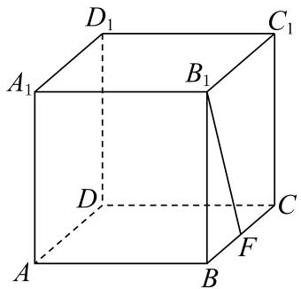

text_image

D₁
C₁
A₁
B₁
D
C
A
B
F

A. 1

B. 2

C. 3

D. 4

2287 (2024·河南新乡·统考三模)如图,在棱长为2的正方体 $ABCD-A_{1}B_{1}C_{1}D_{1}$ 中,E是棱 $CC_{1}$ 的中点,过A,D1,E三点的截面把正方体 $ABCD-A_{1}B_{1}C_{1}D_{1}$ 分成两部分,则这两部分中大的体积与小的体积的比值为()

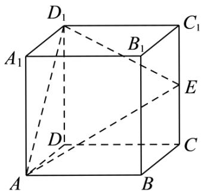

text_image

D₁
A₁
B₁
C₁
E
D
C
A
B

A. $\frac{17}{7}$

B. $\frac{13}{7}$

C. $\frac{7}{3}$

D. $\frac{7}{4}$

2288 (2024·新疆·校联考二模)已知在直三棱柱 $ABC-A_{1}B_{1}C_{1}$ 中，E, F 分别为 $BB_{1}$ ， $A_{1}C_{1}$ 的中点， $AA_{1}=2$ ，AB=2， $BC=3\sqrt{2}$ ，AC=4，如图所示，若过 A、E、F 三点的平面作该直三棱柱 $ABC-A_{1}B_{1}C_{1}$ 的截面，则所得截面的面积为（）

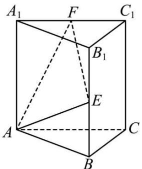

text_image

A₁ F C₁
B₁
E
A B C

A. $\sqrt{10}$

B. $\sqrt{15}$

C. $2 \sqrt{5}$

D. $\sqrt{30}$

2289 (2024·新疆阿克苏·校考一模)已知M, N, P是正方体ABCD-A₁B₁C₁D₁的棱AB, AA₁, CC₁的中点, 则平面MNP截正方体ABCD-A₁B₁C₁D₁所得的截面是()

A. 三角形

B. 四边形

C. 五边形

D. 六边形

2290 (2024·重庆沙坪坝·高三重庆一中校考期中)在棱长为3的正方体 $ABCD-A_{1}B_{1}C_{1}D_{1}$ 中,点P是侧面 $ADD_{1}A_{1}$ 上的点,且点P到棱 $AA_{1}$ 与到棱AD的距离均为1,用过点P且与 $BD_{1}$ 垂直的平面去截该正方体,则截面在正方体底面ABCD的投影多边形的面积是()

A. $\frac{9}{2}$

B. 5

C. $\frac{13}{2}$

D. 8

# 题型三:异面直线的判定

2291 (2024·全国·高三对口高考)两条直线 a, b 分别和异面直线 c, d 都相交, 则直线 a, b 的位置关系是 ()

A. 一定是异面直线

B. 一定是相交直线

C. 可能是平行直线

D. 可能是异面直线,也可能是相交直线

2292 (2024·全国·高三专题练习)如图,已知正方体 $ABCD-A_{1}B_{1}C_{1}D_{1}$ , 点 P 在直线 $AD_{1}$ 上, Q 为线段 BD 的中点, 则下列命题中假命题为 ()

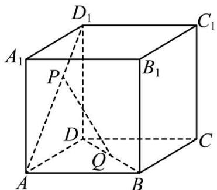

text_image

D₁
A₁
P
B₁
C₁
D
Q
A
B

A. 存在点 P, 使得 PQ ⊥ A₁C₁

B. 存在点 P, 使得 PQ // A₁B

C. 直线 PQ 始终与直线 $CC_{1}$ 异面

D. 直线 PQ 始终与直线 BC₁ 异面

2293 (2024·四川绵阳·高三绵阳南山中学实验学校校考阶段练习)在底面半径为1的圆柱 $OO_{1}$ 中, 过旋转轴 $OO_{1}$ 作圆柱的轴截面 ABCD, 其中母线 AB = 2, E 是弧 BC 的中点, F 是 AB 的中点, 则 ( )

A. AE = CF, AC 与 EF 是共面直线

B. AE≠CF, AC与EF是共面直线

C. AE = CF, AC 与 EF 是异面直线

D. AE≠CF, AC与EF是异面直线

2294 (2024·上海浦东新·高三华师大二附中校考阶段练习)已知正方体 $ABCD-A_{1}B_{1}C_{1}D_{1}$ 中，M, N, P 分别是棱 $A_{1}D_{1}, D_{1}C_{1}, AB$ 的中点，Q 是线段 MN 上的动点，则下列直线中，始终与直线 PQ 异面的是 ()

A. AB $_{1}$

B. BC $_{1}$

C. $CA_{1}$

D. DD $_{1}$

2295 (2024·上海·高三校联考阶段练习)如图所示,正三棱柱 $ABC-A_{1}B_{1}C_{1}$ 的所有棱长均为1,点P、M、N分别为棱 $AA_{1}$ 、AB、 $A_{1}B_{1}$ 的中点,点Q为线段MN上的动点.当点Q由点N出发向点M运动的过程中,以下结论中正确的是()

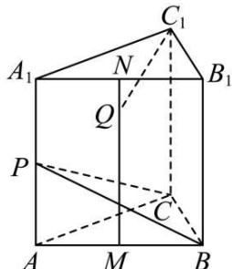

text_image

A₁
N
C₁
B₁
Q
P
C
A
M
B

A. 直线 $\mathrm{C}_{1} \mathrm{~Q}$ 与直线 CP 可能相交  
C. 直线 $\mathrm{C}_{1} \mathrm{~Q}$ 与直线 CP 可能垂直

B. 直线 $\mathrm{C_1Q}$ 与直线CP始终异面  
D. 直线 $\mathrm{C_1Q}$ 与直线BP不可能垂直

2296 (2024·吉林长春·高三长春市第六中学校考期末)如图,在底面为正方形的棱台 ABCD - A₁B₁C₁D₁ 中, E、F、G、H 分别为棱 CC₁, BB₁, CF, AF 的中点,对空间任意两点 M、N,若线段 MN 与线段 AE、BD₁ 都不相交,则称点 M 与点 N 可视,下列选项中与点 D 可视的为 ()

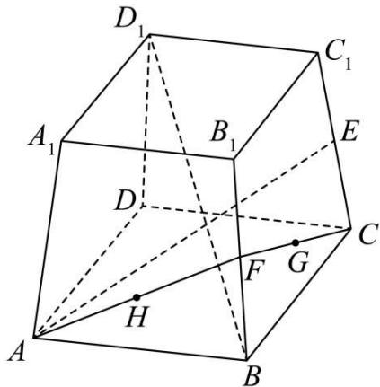

text_image

D₁
C₁
A₁
B₁
E
D
C
F
G
H
A
B

A. $B_{1}$

B. F

C. H

D. G

# 题型四: 异面直线所成的角

2297 (2024·全国·高三专题练习)如图, 在正方体 $ABCD-A_{1}B_{1}C_{1}D_{1}$ 中, 点 E, F 分别是棱 AD, $CC_{1}$ 的中点, 则异面直线 $A_{1}E$ 与 BF 所成角的大小为 \_\_\_\_.

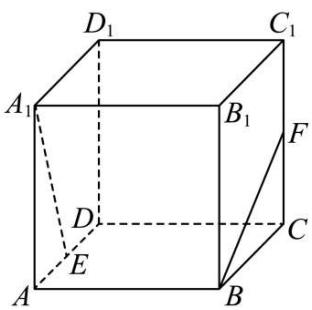

text_image

D₁
C₁
A₁
B₁
F
D
E
C
A
B

2298 (2024·高三课时练习)已知正四面体 ABCD 中,E 是 AB 的中点, 则异面直线 CE 与 BD 所成角的大小为 \_\_\_\_.

2299 (2024·新疆喀什·高三统考期中)如图是一个正方体的平面展开图,在这个正方体中,下列说法中,正确的序号是 \_\_\_\_.

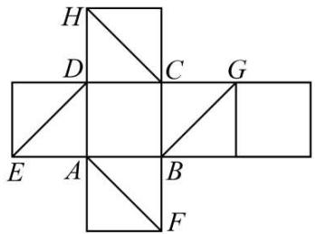

text_image

H
D C G
E A B
F

(1) 直线 AF 与直线 DE 相交;  
(2) 直线 CH 与直线 DE 平行;  
(3) 直线 BG 与直线 DE 是异面直线；  
(4) 直线 CH 与直线 BG 成 $60^{\circ}$ 角.

2300 (2024·全国·高三专题练习)如图,将正方体沿交于一顶点的三条棱的中点截去一小块,八个顶点共截去八小块,得到八个面为正三角形、六个面为正方形的“阿基米德多面体”,则异面直线 AB 与 CD 所成角的大小是 \_\_\_\_

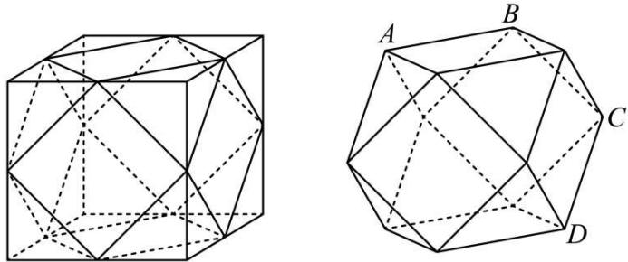

natural_image

Two geometric polyhedra diagrams labeled A, B, C, D with solid and dashed lines indicating visible and hidden edges (no text or symbols beyond labels)

2301 (2024·全国·高三对口高考)线段 AB 的两端分别在直二面角 $\alpha - CD - \beta$ 的两个面 $\alpha$ 、 $\beta$ 内，且与这两个面都成 $30^{\circ}$ 角，则直线 AB 与 CD 所成的角等于 \_\_\_\_.

2302 (2024·全国·高三专题练习)如图,等腰梯形 ABCD 沿对角线 AC 翻折,得到空间四边形 $D_{1}ABC$ , 若 $BC = CD = DA = \frac{1}{2}AB = 1$ , 则直线 $AD_{1}$ 与 BC 所成角的大小可能为 \_\_\_\_. (写出一个值即可)

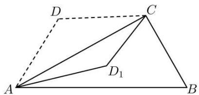

text_image

D
C
A
D₁
B

# 5 题型五: 平面的基本性质

2303 (多选题)(2024·湖北荆门·荆门市龙泉中学校考模拟预测)已知 $\alpha, \beta$ 是两个不同的平面, 则下列命题正确的是 ( )

A. 若 $\alpha \cap \beta = l, A \in \alpha$ 且 $A \in \beta$ , 则 $A \in l$   
B. 若 A, B, C 是平面 $\alpha$ 内不共线三点, $A \in \beta$ , $B \in \beta$ , 则 $C \notin \beta$   
C. 若 $\mathrm{A} \in \alpha$ 且 $\mathrm{B} \in \alpha$ , 则直线 $\mathrm{AB} \subset \alpha$   
D. 若直线 $a \subset \alpha$ ，直线 $b \subset \beta$ ，则 a 与 b 为异面直线

2304 (多选题)(2024·全国·高三专题练习)有下列命题：

①经过三点确定一个平面；  
②梯形可以确定一个平面；  
③两两相交的三条直线最多可以确定三个平面；  
④如果两个平面有三个公共点,则这两个平面重合.

其中正确命题是 （）

A. ①

B. ②

C. ③

D. ④

2305 (多选题)(2024·全国·高三专题练习)我们知道,平面几何中有些正确的结论在空间中不一定成立.下面给出的平面几何中的四个真命题,在空间中仍然成立的有()

A. 平行于同一条直线的两条直线必平行  
B. 垂直于同一条直线的两条直线必平行  
C. 一个角的两边分别平行于另一个角的两边,那么这两个角相等或互补  
D. 一个角的两边分别垂直于另一个角的两边,那么这两个角相等或互补

2306 (多选题)(2024·重庆沙坪坝·高三重庆市第七中学校校考阶段练习)下列命题中错误的是()

A. 空间三点可以确定一个平面  
B. 三角形一定是平面图形  
C. 若 A, B, C, D 既在平面 $\alpha$ 内, 又在平面 $\beta$ 内, 则平面 $\alpha$ 和平面 $\beta$ 重合  
D. 四条边都相等的四边形是平面图形

2307 (多选题)(2024·全国·模拟预测)如图,点E,F,G,H分别是正方体ABCD-A₁B₁C₁D₁中棱AA₁,AB,BC,C₁D₁的中点,则()

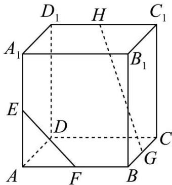

text_image

D₁ H C₁
A₁ B₁
E D C
A F B G

A. GH = 2EF

B. GH≠2EF

C. 直线 EF, GH 是异面直线

D. 直线 EF, GH 是相交直线

2308 (多选题)(2024·全国·高三专题练习)如图,正方体ABCD-A₁B₁C₁D₁的棱长为1,线段 $\mathrm{B_1D_1}$ 上有两个动点E、F，且 $\mathrm{EF} = \frac{1}{2}$ ，则下列结论中正确的是 （）

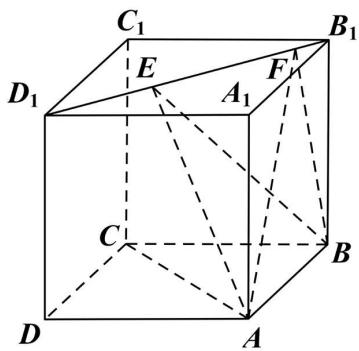

text_image

C₁
D₁ E A₁ F B₁
C
D A B

A. 线段 $B_{1}D_{1}$ 上存在点 E、F 使得 AE // BF  
B. EF // 平面 ABCD  
C. $\triangle$ AEF 的面积与 $\triangle$ BEF 的面积相等  
D. 三棱锥 A-BEF 的体积为定值

# 题型六:等角定理

2309 (2024·河南新乡·新乡市第一中学校考模拟预测)在棱长均相等的四面体ABCD中，P为棱AD(不含端点)上的动点，过点A的平面 $\alpha$ 与平面PBC平行.若平面 $\alpha$ 与平面ABD,平面ACD的交线分别为 $m,n$ ，则 $m,n$ 所成角的正弦值的最大值为  
2310 (2024·全国·高三专题练习)过正方体 $ABCD-A_{1}B_{1}C_{1}D_{1}$ 的顶点 $A_{1}$ 在空间作直线 l，使 l 与平面 $BB_{1}D_{1}D$ 和直线 $BC_{1}$ 所成的角都等于 $45^{\circ}$ ，则这样的直线 l 共有 \_\_\_\_ 条.  
2311 (2024·高三课时练习)若空间两个角 $\alpha$ 与 $\beta$ 的两边对应平行, 当 $\alpha = 60^{\circ}$ 时, 则 $\beta =$ \_\_\_\_.  
2312 (2024·全国·高三专题练习)设∠A和∠B的两边分别平行,若∠A=45°,则∠B的大小为\_\_\_\_.  
2313 (2024·全国·高三专题练习)空间四边形的对角线互相垂直且相等,顺次连接这个四边形各边中点,所组成的四边形是 \_\_\_\_.  
2314 (2024·江西吉安·高一校联考期末)已知空间中两个角 $\angle AOB, \angle A_{1}O_{1}B_{1}$ ，且 $OA \parallel O_{1}A_{1}, OB \parallel O_{1}B_{1}$ ，若 $\angle AOB = 60^{\circ}$ ，则 $\angle A_{1}O_{1}B_{1} =$ \_\_\_\_ .  
2315 (2024·黑龙江齐齐哈尔·高一校联考期末)已知空间中两个角 $\alpha, \beta$ ，且角 $\alpha$ 与角 $\beta$ 的两边分别平行，若 $\alpha = 70^{\circ}$ ，则 $\beta =$ \_\_\_\_ .

