# 第48讲 直线、平面平行的判定与性质

# 知识梳理

# 知识点一: 直线和平面平行

# 1、定义

直线与平面没有公共点，则称此直线 $l$ 与平面 $\alpha$ 平行，记作 $l / / \alpha$

# 2、判定方法(文字语言、图形语言、符号语言)

<table><tr><td></td><td>文字语言</td><td>图形语言</td><td>符号语言</td></tr><tr><td>线//线⇒线//面</td><td>如果平面外的一条直线和这个平面内的一条直线平行,那么这条直线和这个平面平行(简记为“线线平行⇒线面平行</td><td>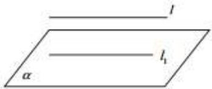</td><td> $\left.\begin{matrix}l//l_1 \\ l_1\subset\alpha \\ l\notin\alpha\end{matrix}\right\} \Rightarrow l//α$ </td></tr><tr><td>面//面⇒线//面</td><td>如果两个平面平行,那么在一个平面内的所有直线都平行于另一个平面</td><td>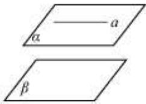</td><td> $\left.\begin{matrix}\alpha//\beta \\ a\subset\alpha\end{matrix}\right\} \Rightarrow a//β$ </td></tr></table>

# 3、性质定理(文字语言、图形语言、符号语言)

<table><tr><td></td><td>文字语言</td><td>图形语言</td><td>符号语言</td></tr><tr><td>线//面⇒线//线</td><td>如果一条直线和一个平面平行,经过这条直线的平面和这个平面相交,那么这条直线就和交线平行</td><td>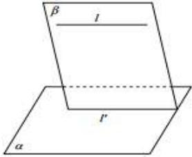</td><td> $\left.\begin{array}{l} l // \alpha \\ l \subset \beta \\ \alpha \cap \beta = l' \end{array}\right\} \Rightarrow l$  //  $l'$ </td></tr></table>

# 知识点二:两个平面平行

# 1、定义

没有公共点的两个平面叫作平行平面,用符号表示为:对于平面 $\alpha$ 和 $\beta$ , 若 $\alpha \cap \beta = \phi$ , 则 $\alpha \parallel \beta$

# 2、判定方法(文字语言、图形语言、符号语言)

<table><tr><td></td><td>文字语言</td><td>图形语言</td><td>符号语言</td></tr><tr><td>判定定理线 // 面 ⇒面 // 面</td><td>如果一个平面内有两条相交的直线都平行于另一个平面,那么这两个平面平行(简记为“线面平行 ⇒ 面面平行</td><td>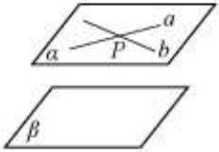</td><td> $a \subset \alpha, b \subset \alpha, a \cap b = P$  $a // \beta, b // \beta \Rightarrow \alpha // \beta$ </td></tr><tr><td>线 ⊥ 面 ⇒面 // 面</td><td>如果两个平面同垂直于一条直线,那么这两个平面平行</td><td>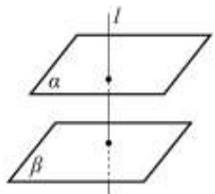</td><td> $\left. \begin{array}{l} l \perp \alpha \\ l \perp \beta \end{array} \right\} \Rightarrow \alpha // \beta$ </td></tr></table>

# 3、性质定理(文字语言、图形语言、符号语言)

<table><tr><td></td><td>文字语言</td><td>图形语言</td><td>符号语言</td></tr><tr><td>面//面⇒线//面</td><td>如果两个平面平行,那么在一个平面中的所有直线都平行于另外一个平面</td><td>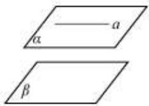</td><td> $\left.\begin{matrix}\alpha //\beta \\a⊂\alpha\end{matrix}\right\} \Rightarrow a//\beta$ </td></tr><tr><td>性质定理</td><td>如果两个平行平面同时和第三个平面相交,那么他们的交线平行(简记为“面面平行⇒线面平行”)</td><td>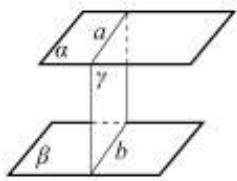</td><td> $\left.\begin{matrix}\alpha //\beta \\ \alpha∩\gamma=a \\ \beta∩\gamma=b\end{matrix}\right\} \Rightarrow a//b.$ </td></tr><tr><td>面//面⇒线⊥面</td><td>如果两个平面中有一个垂直于一条直线,那么另一个平面也垂直于这条直线</td><td>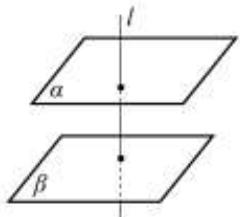</td><td> $\left.\begin{matrix}\alpha //\beta \\l⊥\alpha\end{matrix}\right\} \Rightarrow l⊥\beta$ </td></tr></table>

# 【解题方法总结】

线线平行、线面平行、面面平行的转换如图所示.

(1) 证明直线与平面平行的常用方法:

①利用定义,证明直线a与平面 $\alpha$ 没有公共点,一般结合反证法证明;  
②利用线面平行的判定定理,即线线平行 $\Rightarrow$ 线面平行.辅助线的作法为:平面外直线的端点进平面,同向进面,得平行四边形的对边,不同向进面,延长交于一点得平行于第三边的线段;  
③利用面面平行的性质定理,把面面平行转化成线面平行;

(2) 证明面面平行的常用方法:

①利用面面平行的定义,此法一般与反证法结合;  
②利用面面平行的判定定理；  
③利用两个平面垂直于同一条直线；  
④证明两个平面同时平行于第三个平面.

(3) 证明线线平行的常用方法: ① 利用直线和平面平行的判定定理; ② 利用平行公理;

# 必考题型全归纳

# 1 题型一: 平行的判定

2316 (2024·湖南岳阳·高三湖南省岳阳县第一中学校考开学考试)若 $\alpha$ 、 $\beta$ 是两个不重合的平面，

①若 $\alpha$ 内的两条相交直线分别平行于 $\beta$ 内的两条直线，则 $\alpha \parallel \beta$ ;  
②设 $\alpha$ 、 $\beta$ 相交于直线 l，若 $\alpha$ 内有一条直线垂直于 l，则 $\alpha \perp \beta$ ;  
③若 $\alpha$ 外一条直线 l 与 $\alpha$ 内的一条直线平行，则 $l \parallel \alpha$ ;

以上说法中成立的有( )个.

A. 0

B. 1

C. 2

D. 3

2317 (2024·全国·高三对口高考)过直线 l 外两点作与 l 平行的平面,那么这样的平面（）

A. 不存在

B. 只有一个

C. 有无数个

D. 不能确定

2318 (2024·福建泉州·校联考模拟预测)如图,点 A, B, C, M, N 为正方体的顶点或所在棱的中点,则下列各图中,不满足直线 MN // 平面 ABC 的是 ()

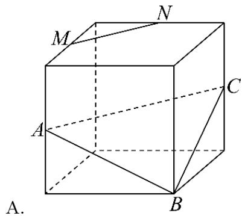

text_image

A.
B
C
M
N

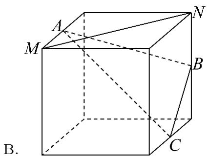

text_image

A
M
N
B
C
B.

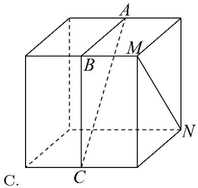

text_image

A
M
B
N
C.
C.

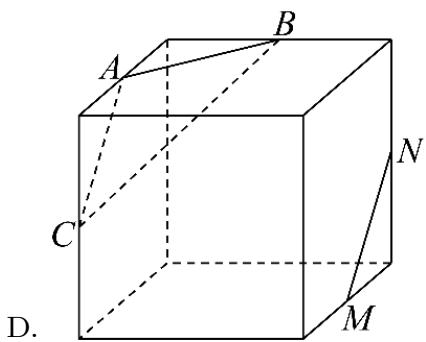

text_image

A
B
C
D.
M
N

2319 (2024·湖南岳阳·高三湖南省岳阳县第一中学校考开学考试) $a, b, c$ 为三条不重合的直线， $\alpha, \beta, \gamma$ 为三个不重合的平面，现给出下面六个命题：

① $a \parallel c, b \parallel c$ ，则 $a \parallel b$ ；②若 $a \parallel \gamma, b \parallel \gamma$ ，则 $a \parallel b$   
③ $\alpha \parallel c, \beta \parallel c$ ，则 $\alpha \parallel \beta$ ; ④ 若 $\alpha \parallel \gamma, \beta \parallel \gamma$ ，则 $\alpha \parallel \beta$ ;  
⑤若 $\alpha \parallel c, a \parallel c$ ，则 $a \parallel \alpha;$ ⑥若 $a \parallel \gamma, \alpha \parallel \gamma$ ，则 $a \parallel \alpha.$

其中真命题的个数是 （）

A. 4

B. 3

C. 2

D. 1

2320 (2024·全国·高三专题练习)设 $\alpha,\beta$ 为两个不同的平面，则 $\alpha\parallel\beta$ 的一个充分条件是

( )

A. $\alpha$ 内有无数条直线与 $\beta$ 平行

B. $\alpha, \beta$ 垂直于同一个平面

C. $\alpha, \beta$ 平行于同一条直线

D. $\alpha, \beta$ 垂直于同一条直线

# 2 题型二:线面平行构造之三角形中位线法

2321 (2024·广东河源·高三校联考开学考试)如图,在四棱锥 P-ABCD 中,E,F 分别为 PD,PB 的中点,连接 EF.

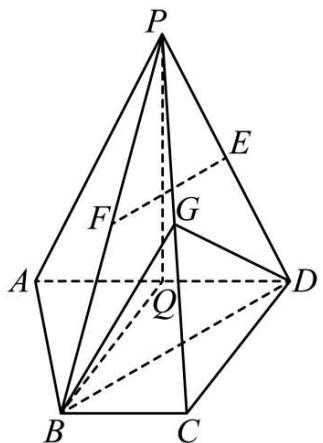

text_image

P
E
F
G
A
Q
D
B
C

(1) 当 G 为 PC 上不与点 P, C 重合的一点时, 证明: EF // 平面 BDG;

2322 (2024·贵州毕节·校考模拟预测)如图,在三棱柱 $ABC-A_{1}B_{1}C_{1}$ 中,侧面 $ACC_{1}A_{1}$ 是矩形,AC⊥AB, $AB=AA_{1}=2,AC=t(t>2),\angle A_{1}AB=120^{\circ}E,F$ 分别为棱 $A_{1}B_{1},BC$ 的中点,G为线段CF的中点.

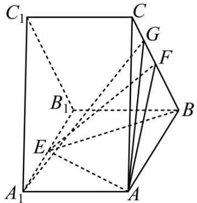

text_image

C₁
C
G
F
B₁
E
A₁
A

(1) 证明: $A_{1}G \parallel$ 平面 AEF.

(2) 若三棱锥 A-GEF 的体积为 1, 求 t.

2323 (2024·黑龙江大庆·统考二模)如图所示,在正四棱锥 P-ABCD 中,底面 ABCD 的中心为 O, PD 边上的垂线 BE 交线段 PO 于点 F, PF = 2FO.

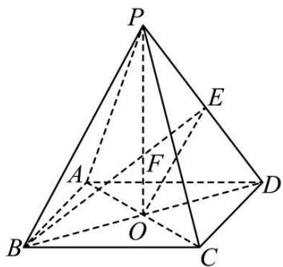

text_image

P
E
A
F
D
B
O
C

(1) 证明: EO // 平面 PBC;

2324 (2024·全国·高三专题练习)如图,四棱锥 P-ABCD 中,四边形 ABCD 为梯形,

AB // CD, AD ⊥ AB, AB = AP = 2DC = 4, PB = 2AD = 4 $\sqrt{2}$ , PD = 2 $\sqrt{6}$ , M, N 分别是 PD, PB 的中点.

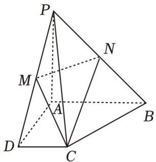

text_image

Geometric diagram of a pyramid with labeled vertices and internal points, used for spatial geometry problems.

(1) 求证: 直线 MN // 平面 ABCD;

2325 (2024·陕西汉中·高三统考期末)如图,在三棱柱 $ABC-A_{1}B_{1}C_{1}$ 中, $AA_{1}\perp$ 平面 ABC, 且 $AA_{1}=AB=BC=AC=2$ , 点 E 是棱 AB 的中点.

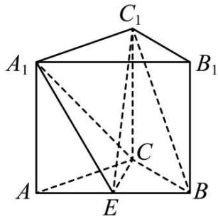

text_image

C₁
A₁ B₁
C
A E B

(1) 求证: $BC_{1} \parallel$ 平面 $A_{1}CE$ ;

(2) 求三棱锥 $E-A_{1}CC_{1}$ 的体积.

2326 (2024·全国·高三专题练习)如图,在四棱锥 P-ABCD 中,四边形 ABCD 是正方形, PD = AD = 1, PD ⊥ 平面 ABCD,点 E 是棱 PC 的中点,点 F 是棱 PB 上的一点,且 EF ⊥ PB.

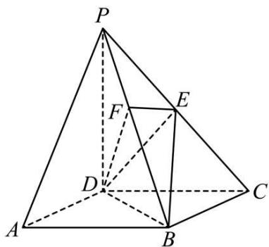

text_image

P
F
E
D
A
B
C

(1) 求证: PA // 平面 EDB;

(2) 求点 F 到平面 EDB 的距离.

2327 (2024·新疆昌吉·高三校考学业考试)如图,在正方体 $ABCD-A_{1}B_{1}C_{1}D_{1}$ 中,E是棱 $DD_{1}$ 的中点.

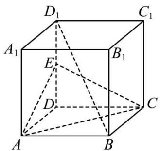

text_image

D₁
C₁
A₁
E
B₁
D
C
A
B

(1) 证明: $\mathrm{BD}_{1} \parallel$ 平面 AEC;

(2) 若正方体棱长为 2, 求三棱锥 D-AEC 的体积.

# 题型三:线面平行构造之平行四边形法

2328 (2024·天津滨海新·高三校考期中)如图, 四棱锥 P-ABCD 的底面是菱形, 平面 PAD ⊥ 底面 ABCD, E, F 分别是 AB, PC 的中点, AB = 6, DP = AP = 5, ∠BAD = 60°.

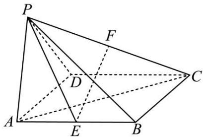

text_image

Geometric diagram of a pyramid with labeled vertices and internal points, showing solid and dashed edges for 3D perspective.

(1) 求证: EF // 平面 PAD;

2329 (2024·全国·高三专题练习)如图,四棱台 ABCD-EFGH 的底面是菱形,且 $\angle BAD=\frac{\pi}{3}$ , DH ⊥ 平面 ABCD, EH=2, DH=3, AD=4.

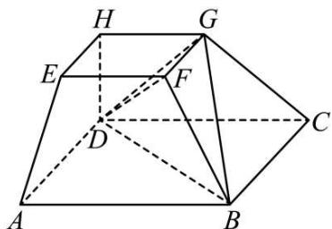

text_image

Geometric diagram of a polyhedron with labeled vertices and internal points, used for spatial geometry problems.

(1) 求证: AE // 平面 BDG;

(2) 求三棱锥 F-BDG 的体积.

2330 (2024·全国·高三专题练习)如图,在正三棱柱 $ABC-A_{1}B_{1}C_{1}$ 中,D, $D_{1}$ ,F分别是BC, $B_{1}C_{1},A_{1}B_{1}$ 的中点, $\overrightarrow{BC}=4\overrightarrow{BE},\triangle ABC$ 的边长为2.

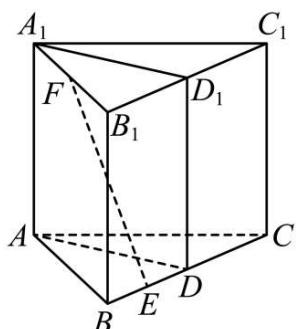

text_image

A₁
C₁
F
B₁
D₁
A
C
B
E
D

(1) 求证::EF // 平面 $ADD_{1}A_{1}$ ;

2331 (2024·重庆沙坪坝·高三重庆南开中学校考阶段练习)如图,在三棱柱 $ABC-A_{1}B_{1}C_{1}$ 中, $AA_{1}\perp$ 底面 ABC, $AB=AC=\sqrt{5}$ , BC=2, $AA_{1}=\sqrt{2}$ , D、E 分别为棱 BC、 $A_{1}B_{1}$ 的中点, $\overrightarrow{A_{1}P}=2\overrightarrow{PB},\overrightarrow{C_{1}Q}=2\overrightarrow{QE}$ .

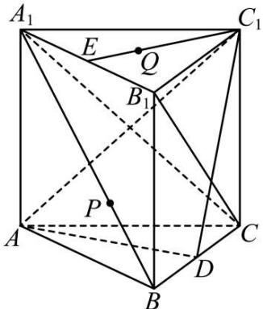

text_image

A₁
E
Q
B₁
C₁
P
A
D
B
C

(1) 求证: PQ // 平面 $C_{1}AD$ ;

2332 (2024·天津红桥·高三天津市复兴中学校考阶段练习)如图所示,在四棱锥 P-ABCD 中, BC // 平面 PAD, BC = $\frac{1}{2}$ AD, E 是 PD 的中点.

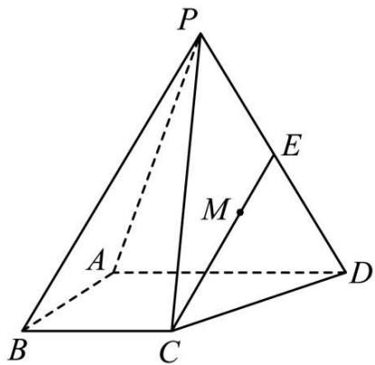

text_image

P
E
M
A
B
C
D

(1) 求证: BC // AD;

(2) 求证: CE // 平面 PAB;

(3) 若 M 是线段 CE 上一动点, 则线段 AD 上是否存在点 N, 使 MN // 平面 PAB? 说明理由.

# 4 题型四:线面平行转化为面面平行

2333 (2024·全国·高三专题练习)如图,在四棱锥 P-ABCD 中,PD⊥平面 ABCD,且四边形 ABCD 是正方形,E,F,G 分别是棱 BC,AD,PA 的中点.

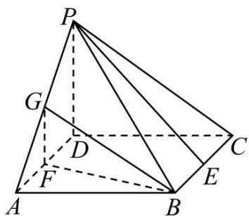

text_image

Geometric diagram of a triangular pyramid with labeled vertices and internal points, used for spatial geometry problems.

(1) 求证: PE // 平面 BFG;

(2) 若 AB = 2，求点 C 到平面 BFG 的距离.

2334 (2024·全国·模拟预测)如图,在多面体ABCDMP中,四边形ABCD是菱形,且有 $\angle DAB=60^{\circ}$ , $AB=DM=1$ , $PB=2$ , $PB \perp$ 平面ABCD, $PB//DM$ .

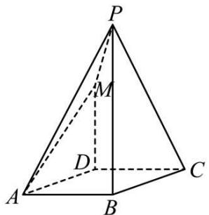

text_image

P
M
D
A
B
C

(1) 求证: AM // 平面 PBC;

2335 (2024·江西赣州·统考模拟预测)如图,在三棱柱 ABC-A₁B₁C₁ 中,侧面 AA₁C₁C 是矩形,侧面 BB₁C₁C 是菱形,∠B₁BC=60°,D、E 分别为棱 AB、B₁C₁ 的中点,F 为线段 C₁E 的中点.

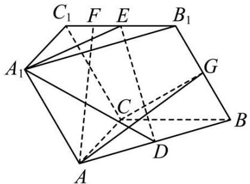

text_image

C₁ F E B₁
A₁ G
C
D
A B

(1) 证明: AF // 平面 A $_{1}$ DE;

2336 (2024·上海·模拟预测)直四棱柱 $ABCD-A_{1}B_{1}C_{1}D_{1}$ ，AB // DC，AB ⊥ AD，AB = 2，
AD = 3, DC = 4

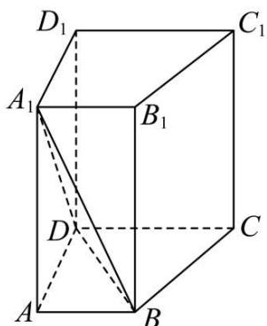

text_image

D₁
A₁
B₁
C₁
D
C
A
B

(1) 求证: $A_{1}B \parallel$ 面 $DCC_{1}D$ ;

2337 (2024·广东深圳·高三深圳外国语学校校考开学考试)如图,多面体 ABCDEF 中,四边形 ABCD 为矩形,二面角 A-CD-F 的大小为 $45^{\circ}$ , DE // CF, CD ⊥ DE, AD = 2, DC = 3.

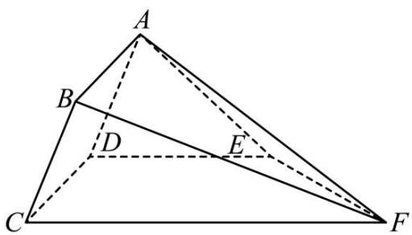

text_image

A
B
D
E
C
F

(1) 求证: BF // 平面 ADE;

2338 (2024·全国·高三对口高考)已知正方形 ABCD 和正方形 ABEF, 如图所示, N、M 分别是对角线 AE、BD 上的点, 且 $\frac{\mathrm{EN}}{\mathrm{AN}} = \frac{\mathrm{BM}}{\mathrm{MD}}$ . 求证: MN // 平面 EBC.

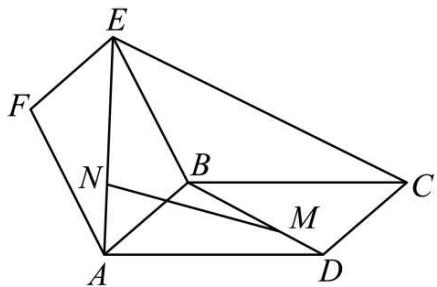

text_image

Geometric diagram with labeled points A, B, C, D, E, F, M, N forming interconnected polygons and triangles

# 题型五:利用线面平行的性质证明线线平行

2339 (2024·河南·高三校联考阶段练习)已知四棱锥 P-ABCD, 底面为菱形 ABCD, PD⊥平面 ABCD, PD=AD=CD=2, $\angle BAD=\frac{\pi}{3}$ , E 为 PC 上一点.

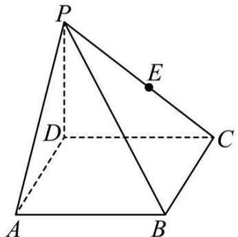

text_image

P
E
D
C
A
B

(1) 平面 PAD ∩ 平面 PBC = l, 证明: BC // l;

2340 (2024·河南·高三校联考阶段练习)已知四棱锥 P-ABCD, 底面 ABCD 为菱形, PD⊥平面 ABCD, PD=AD=CD=2, ∠BAD= $\frac{\pi}{3}$ , E 为 PC 上一点.

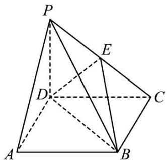

text_image

Geometric diagram of a pyramid with labeled vertices and internal points, used for spatial geometry problems.

(1) 平面 PAD ∩ 平面 PBC = l, 证明: BC // l.

(2) 当直线 BE 与平面 BCD 的夹角为 $\frac{\pi}{6}$ 时, 求三棱锥 P-BDE 的体积.

2341 (2024·重庆万州·统考模拟预测)如图1所示,在四边形ABCD中,BC⊥CD,E为BC上一点,AE=BE=AD=2CD=2,CE= $\sqrt{3}$ ,将四边形AECD沿AE折起,使得BC= $\sqrt{3}$ ,得到如图2所示的四棱锥.

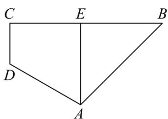

text_image

C E B
D
A

图1

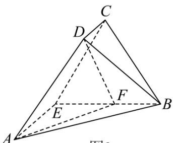

text_image

C
D
E
F
A
B
图2

图2

(1) 若平面 BCD ∩ 平面 ABE = l, 证明: CD // l;

2342 (2024·北京东城·高三北京市第十一中学校考阶段练习)如图所示,在直三棱柱 ABC-A₁B₁C₁ 中, AC ⊥ BC, AC = BC = CC₁ = 2, 点 D、E 分别为棱 A₁C₁、B₁C₁ 的中点, 点 F 是线段 BB₁ 上的点 (不包括两个端点).

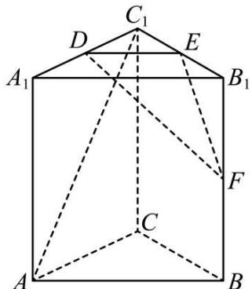

text_image

C₁
D
E
A₁
B₁
F
C
A
B

(1) 设平面 DEF 与平面 ABC 相交于直线 m，求证： $A_{1}B_{1} \parallel m$ ;

2343 (2024·全国·高三专题练习)如图, 四棱锥 P-ABCD 的底面边长为 8 的正方形, 四条侧棱长均为 $2\sqrt{17}$ . 点 G,E,F,H 分别是棱 PB,AB,CD,PC 上共面的四点, 平面 GEFH ⊥ 平面 ABCD, BC // 平面 GEFH. 证明: GH // EF.

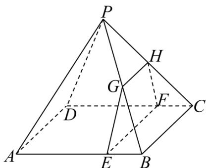

text_image

P
H
G
F
C
D
A
E
B

2344 (2024·江苏扬州·江苏省高邮中学校考模拟预测)如图,三棱台 ABC-DEF 中, AB=2DE, M 是 EF 的中点, 点 N 在线段 AB 上, AB=4AN, 平面 DMN∩平面 ADFC=l.

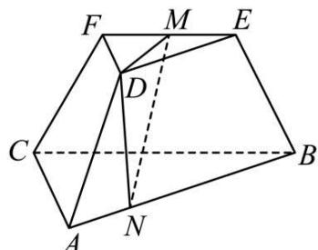

text_image

Geometric diagram of a 3D prism with labeled vertices and internal points, used for spatial geometry problems.

(1) 证明: MN // l;

# 6 题型六: 面面平行的证明

2345 (2024·河南郑州·高三郑州外国语学校校考阶段练习)如图,在四棱锥 P-ABCD 中,平面 PAD⊥平面 ABCD, PA=PD, AB=AD, PA⊥PD, AD⊥CD, ∠BAD=60°, M,N 分别为 AD, PA 的中点.

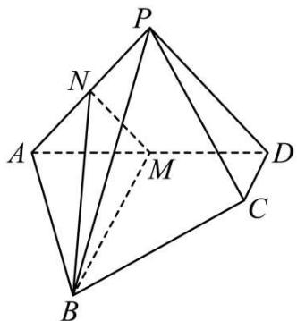

text_image

P
N
A
M
D
C
B

(1) 证明: 平面 BMN // 平面 PCD;

2346 (2024·山东临沂·高三校考阶段练习)如图,在多面体 ABCDEF 中,ABCD 是正方形, AB = 2, DE = BF, BF // DE, M 为棱 AE 的中点.

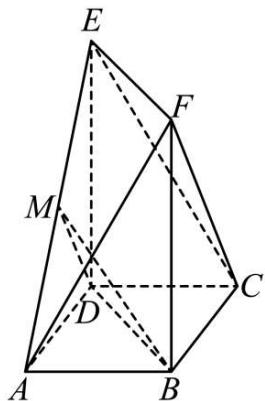

text_image

Geometric diagram of a polyhedron with labeled vertices A, B, C, D, E, F, M and solid/dashed edges indicating 3D spatial relationships.

(1) 求证: 平面 BMD // 平面 EFC;

2347 (2024·甘肃定西·统考模拟预测)如图,在四棱锥 P-ABCD 中,底面 ABCD 是边长为 2 的菱形, $\angle BAD=60^{\circ}$ , AC 与 BD 交于点 O, OP ⊥ 底面 ABCD, OP= $\sqrt{3}$ , 点 E, F 分别是棱 PA, PB 的中点,连接 OE, OF, EF.

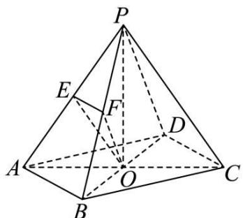

text_image

Geometric diagram of a pyramid with labeled vertices and internal points, used for spatial geometry problems.

(1) 求证: 平面 OEF // 平面 PCD;

(2) 求三棱锥 O-PEF 的体积.

2348 (2024·四川南充·统考三模)如图所示,已知 AC,BD 是圆锥 SO 底面的两条直径,M 为劣弧 BC 的中点.

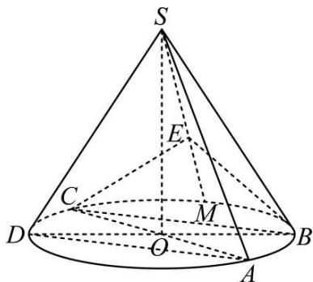

text_image

S
E
C
M
D
O
A
B

(1) 证明: SM ⊥ AD;
(2) 若 $\angle BOC = \frac{2\pi}{3}$ ，E 为线段 SM 上的一点，且 SE = 2EM，求证：平面 BCE // 平面 SAD.

# 题型七: 面面平行的性质

2349 (2024·全国·高三专题练习)如图,在四棱柱 $ABCD-A_{1}B_{1}C_{1}D_{1}$ 中,底面ABCD为梯形,AD//BC,平面 $A_{1}DCE$ 与 $BB_{1}$ 交于点E.求证:EC// $A_{1}D$ .

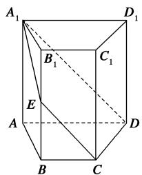

text_image

A₁
B₁
C₁
D₁
E
A
B
C
D

2350 (2024·辽宁·朝阳市第一高级中学校联考三模)如图,直四棱柱 $ABCD-A_{1}B_{1}C_{1}D_{1}$ 被平面 $\alpha$ 所截,截面为 CDEF,且 EF=DC,DC=2AD=4A $_{1}$ E=2, $\angle ADC=\frac{\pi}{3}$ ,平面 EFCD 与平面 ABCD 所成角的正切值为 $\frac{4}{3}\sqrt{3}$ .

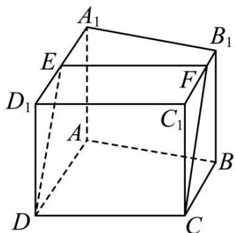

text_image

A₁
B₁
E
F
D₁
C₁
A
B
D
C

(1) 证明: AD // BC;

2351 (2024·安徽滁州·安徽省定远中学校考二模)如图,在三棱柱 $ABC-A_{1}B_{1}C_{1}$ 中,四边形 $AA_{1}C_{1}C$ 是边长为4的菱形. $AB=BC=\sqrt{13}$ ,点D为棱AC上动点(不与A,C重合),平面 $B_{1}BD$ 与棱 $A_{1}C_{1}$ 交于点E.

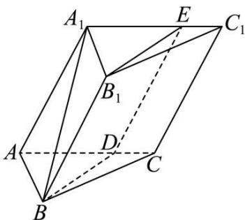

text_image

A₁
E
C₁
B₁
D
A
B
C

(1) 求证: $BB_{1} \parallel DE;$

2352 (2024·北京·高三专题练习)如图,在多面体 ABCDEF 中,面 ABCD 是正方形,DE ⊥ 平面 ABCD,平面 ABF // 平面 CDE,A,D,E,F 四点共面,AB=DE=2,AF=1.

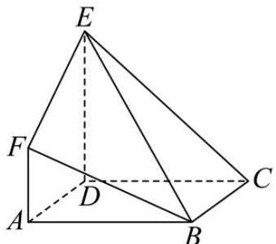

text_image

Geometric diagram of a triangular pyramid with labeled vertices and internal points

(1) 求证: AF // DE;

2353 (2024·全国·高三专题练习)在如图所示的圆柱中, AB, CD 分别是下底面圆 O, 上底面圆 $O_{1}$ 的直径, AD, BC 是圆柱的母线, E 为圆 O 上一点, P 为 DE 上一点, 且 OP // 平面 BCE.

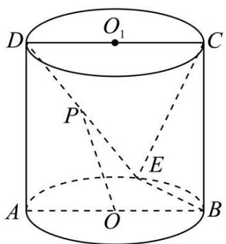

text_image

O₁
D	C
P
E
A	O	B

(1) 求证: DP = PE;

# 8 题型八:平行关系的综合应用

2354 (2024·全国·高三专题练习)已知正方体 $ABCD-A_{1}B_{1}C_{1}D_{1}$ 中，P、Q 分别为对角线 BD、 $CD_{1}$ 上的点，且 $\frac{CQ}{QD_{1}}=\frac{BP}{PD}=\frac{2}{3}$ .

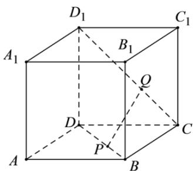

text_image

D₁
C₁
A₁
B₁
Q
D
P
C
A
B

(1) 求证: PQ // 平面 $A_{1}D_{1}DA$ ;  
(2) 若 R 是 AB 上的点, $\frac{AR}{AB}$ 的值为多少时, 能使平面 PQR // 平面 $A_{1}D_{1}DA$ ? 请给出证明.

2355 (2024·全国·高三专题练习)如图、三棱柱 $ABC-A_{1}B_{1}C_{1}$ 的侧棱 $AA_{1}$ 垂直于底面 ABC，△ABC 是边长为 2 的正三角形， $AA_{1}=3$ ，点 D 在线段 $A_{1}B$ 上且 $A_{1}D=2DB$ ，点 E 是线段 $B_{1}C_{1}$ 上的动点。当 $\frac{B_{1}E}{EC_{1}}$ 为多少时，直线 DE // 平面 $ACC_{1}A_{1}$ ?

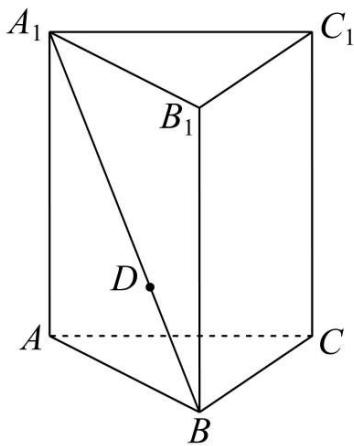

text_image

A₁
B₁
D
A
C
B
C₁

2356 (2024·福建福州·福州四中校考模拟预测)如图,在直三棱柱 $ABC-A_{1}B_{1}C_{1}$ 中,AC⊥BC,AC=2,且 $BC=CC_{1}=1$ ,点 D 在线段 $BC_{1}$ (含端点)上运动,设 $\lambda=\frac{BD}{BC_{1}}$ .

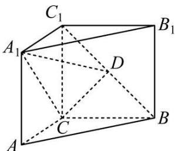

text_image

C₁
A₁
B₁
D
C
A
B

(1) 当 AB // 平面 A₁CD 时, 求实数 λ 的值;

2357 (2024·湖南长沙·高一长沙市实验中学校考期中)如图所示,四边形 EFGH 为空间四边形 ABCD 的一个截面,若截面为平行四边形.

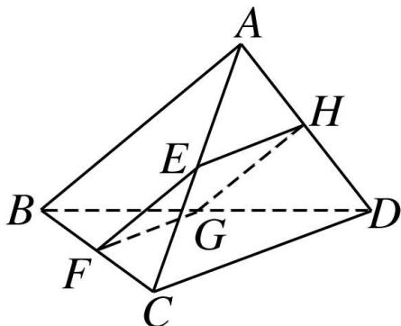

text_image

A
H
E
B
G
D
F
C

(1) 求证: AB // 平面 EFGH;  
(2) 若 AB = 4, CD = 6, 求四边形 EFGH 周长的取值范围.

2358 (2024·全国·高三专题练习)如图,在四棱锥 P-ABCD 中, AD // BC,∠ADC=∠PAB

$= 90^{\circ},\mathrm{BC} = \mathrm{CD} = \frac{1}{2}\mathrm{AD} = 1,\mathrm{E}$ 为边AD的中点，异面直线PA与CD所成的角为 $90^{\circ}$

text_image

Geometric diagram of a pyramid with labeled vertices and internal points, showing solid and dashed edges for 3D perspective.

(1) 在直线 PA 上找一点 M, 使得直线 MC // 平面 PBE, 并求 $\frac{AM}{AP}$ 的值;

2359 (2024·重庆渝中·高三重庆巴蜀中学校考阶段练习)如图所求,四棱锥 P-ABCD,底面 ABCD 为平行四边形,F 为 PA 的中点,E 为 PB 中点.

text_image

Geometric diagram of a pyramid with labeled vertices and internal points, showing solid and dashed edges for spatial relationships.

(1) 求证: PC // 平面 BFD;

(2) 已知 M 点在 PD 上满足 EC // 平面 BFM, 求 $\frac{PM}{MD}$ 的值.

