# 第49讲 直线、平面垂直的判定与性质

# 知识梳理

知识点1: 直线与平面垂直的定义

如果一条直线和这个平面内的任意一条直线都垂直,那称这条直线和这个平面相互垂直.

知识点2: 判定定理 (文字语言、图形语言、符号语言)

<table><tr><td></td><td>文字语言</td><td>图形语言</td><td>符号语言</td></tr><tr><td>判断定理</td><td>一条直线与一个平面内的两条相交直线都垂直,则该直线与此平面垂直</td><td>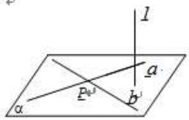</td><td> $\left.\begin{matrix}a,b\subset\alpha \\a\perp l \\b\perp l \\a\cap b=P\end{matrix}\right\}\Rightarrow l\perp\alpha$ </td></tr><tr><td>面⊥面⇒线⊥面</td><td>两个平面垂直,则在一个平面内垂直于交线的直线与另一个平面垂直</td><td></td><td> $\left.\begin{matrix}\alpha\perp\beta \\ \alpha\cap\beta=a \\b\subset\beta \\b\perp a\end{matrix}\right\}\Rightarrow b\perp\alpha$ </td></tr><tr><td>平行与垂直的关系</td><td>一条直线与两平行平面中的一个平面垂直,则该直线与另一个平面也垂直</td><td></td><td> $\left.\begin{matrix}\alpha//\beta \\a\perp\alpha\end{matrix}\right\}\Rightarrow a\perp\beta$ </td></tr><tr><td>平行与垂直的关系</td><td>两平行直线中有一条与平面垂直,则另一条直线与该平面也垂直</td><td></td><td> $\left.\begin{matrix}a//b \\a\perp\alpha\end{matrix}\right\}\Rightarrow b\perp\alpha$ </td></tr></table>

知识点4: 平面与平面垂直的定义

如果两个相交平面的交线与第三个平面垂直, 又这两个平面与第三个平面相交所得的两条交线互相垂直. (如图所示, 若 $\alpha \cap \beta = \mathrm{CD}, \mathrm{CD} \perp \gamma$ , 且 $\alpha \cap \gamma = \mathrm{AB}, \beta \cap \gamma = \mathrm{BE}, \mathrm{AB} \perp \mathrm{BE}$ , 则 $\alpha \perp \beta$ )

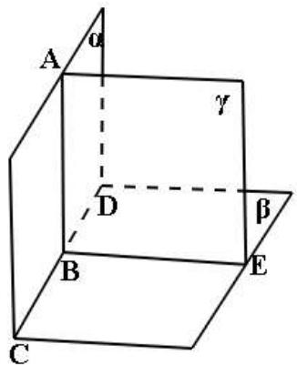

text_image

A
α
γ
D
β
B
E
C

一般地，两个平面相交，如果它们所成的二面角是直二面角，就说这两个平面互相垂直.

知识点 5: 判定定理 (文字语言、图形语言、符号语言)

<table><tr><td></td><td>文字语言</td><td>图形语言</td><td>符号语言</td></tr><tr><td>判定定理</td><td>一个平面过另一个平面的垂线,则这两个平面垂直</td><td></td><td> $\left. \begin{array}{l} b \perp \alpha \\ b \subset \beta \end{array} \right\} \Rightarrow \alpha \perp \beta$ </td></tr></table>

知识点6: 性质定理 (文字语言、图形语言、符号语言)

<table><tr><td></td><td>文字语言</td><td>图形语言</td><td>符号语言</td></tr><tr><td>性质定理</td><td>两个平面垂直,则一个平面内垂直于交线的直线与另一个平面垂直</td><td></td><td> $\left.\begin{matrix}\alpha\perp\beta \\ \alpha\cap\beta=a \\ b\subset\beta \\ b\perp a\end{matrix}\right\} \Rightarrow b\perp\alpha$ </td></tr></table>

【解题方法总结】

线⊥线 $\xleftarrow{判定定理}$ 线⊥面 $\xleftarrow{判定定理}$ 面⊥面
性质定理
性质定理

(1) 证明线线垂直的方法

①等腰三角形底边上的中线是高；  
②勾股定理逆定理；  
③菱形对角线互相垂直；

④直径所对的圆周角是直角；  
⑤向量的数量积为零；  
⑥线面垂直的性质 $(a \perp \alpha, b \subset \alpha \Rightarrow a \perp b)$ ;   
⑦平行线垂直直线的传递性 $(a \perp c, a \parallel b \Rightarrow b \perp c)$ .

(2) 证明线面垂直的方法

①线面垂直的定义；  
②线面垂直的判定 $(a\perp b,a\perp c,c\subset \alpha ,b\subset \alpha ,b\cap c = \mathbf{P}\Rightarrow a\perp \alpha)$   
③面面垂直的性质 $(\alpha \perp \beta, \alpha \cap \beta = b, a \perp b, a \subset \alpha \Rightarrow a \perp \beta)$ ;

平行线垂直平面的传递性 $(a\perp \alpha ,b / / a\Rightarrow b\perp \alpha)$

⑤面面垂直的性质 $(\alpha \perp \gamma, \beta \perp \gamma, \alpha \cap \beta = l \Rightarrow l \perp \gamma)$ .

(3) 证明面面垂直的方法

①面面垂直的定义；  
②面面垂直的判定定理 $(a\perp \beta ,a\subset \alpha \Rightarrow \alpha \perp \beta)$

空间中的线面平行、垂直的位置关系结构图如图所示,由图可知,线面垂直在所有关系中处于核心位置.

# 必考题型全归纳

# 题型一:垂直性质的简单判定

2360 (2024·甘肃兰州·校考模拟预测)设 m, n 是两条不同的直线， $\alpha, \beta$ 是两个不同的平面，则下列说法正确的是（）

A. 若 $m \perp n, n \parallel \alpha$ , 则 $m \perp \alpha$

B. 若 $m \parallel \beta, \beta \perp \alpha$ , 则 $m \perp \alpha$

C. 若 $m \perp n, n \perp \beta, \beta \perp \alpha$ , 则 $m \perp \alpha$

D. 若 $m \perp \beta, n \perp \beta, n \perp \alpha$ , 则 $m \perp \alpha$

2361 (2024·重庆·统考模拟预测)已知 l, m, n 表示不同的直线, $\alpha$ , $\beta$ , $\gamma$ 表示不同的平面, 则下列四个命题正确的是 ()

A. 若 $l \parallel \alpha$ , 且 $m \parallel \alpha$ , 则 $l \perp m$

B. 若 $\alpha \perp \beta, m \parallel \alpha, n \perp \beta$ , 则 $m \parallel n$

C. 若 $m \parallel l$ , 且 $m \perp \alpha$ , 则 $l \perp \alpha$

D. 若 $m \perp n, m \perp \alpha, n \parallel \beta$ , 则 $\alpha \perp \beta$

2362 (2024·陕西咸阳·统考二模)已知 m, n 是两条不同的直线, $\alpha$ , $\beta$ 是两个不同的平面, 有以下四个命题:

①若 $m \parallel n, n \subset \alpha$ ，则 $m \parallel \alpha$ ，②若 $m \subset \alpha, m \perp \beta$ ，则 $\alpha \perp \beta$ ，  
③若 $m \perp \alpha, m \perp \beta$ ，则 $\alpha // \beta$ ，④若 $\alpha \perp \beta, m \subset \alpha, n \subset \alpha$ ，则 $m \perp n$

其中正确的命题是 （）

A. ②③

B. ②④

C. ①③

D. ①②

2363 (2024·河南·校联考模拟预测)已知 $\alpha, \beta$ 是两个不同的平面，m, n 是两条不同的直线，则下列命题中正确的是（）

A. 若 $\alpha \perp \beta, m \perp \alpha, m \perp n$ , 则 $n \perp \beta$

B. 若 $\alpha // \beta, m \subset \alpha, n \subset \beta$ , 则 $m // n$

C. 若 $m \perp n, m \subset \alpha, n \subset \beta$ ，则 $\alpha \perp \beta$

D. 若 $m \perp \alpha, m \parallel n, n \parallel \beta$ , 则 $\alpha \perp \beta$

2364 (2024·陕西咸阳·统考模拟预测)如图所示的菱形ABCD中， $AB=2,\angle BAD=60^{\circ}$ ，对角线 AC,BD 交于点 O, 将 $\triangle ABD$ 沿 BD 折到 $\triangle A'BD$ 位置, 使平面 $A'BD \perp$ 平面 BCD. 以下命题:

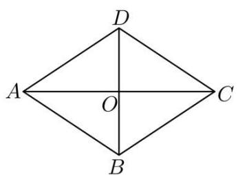

text_image

D
A	O	C
B

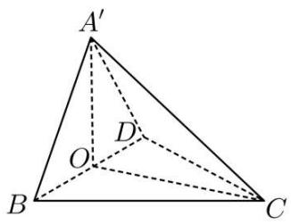

text_image

A'
O
D
B
C

①BD ⊥ A'C;   
②平面 A'OC ⊥ 平面 BCD;  
③平面 A'BC ⊥ 平面 A'CD;  
④三棱锥 A' - BCD 体积为 1.

其中正确命题序号为 （）

A. ①②③

B. ②③

C. ③④

D. ①②④

2365 (2024·广西南宁·武鸣县武鸣中学校考三模)已知 l, m, n 是三条不同的直线， $\alpha$ , $\beta$ 是不同的平面，则下列条件中能推出 $\alpha \perp \beta$ 的是 ()

A. $l \subset \alpha, m \subset \beta$ , 且 $l \perp m$

B. $l \subset \alpha, m \subset \beta, n \subset \beta$ ，且 $l \perp m, l \perp n$

C. $m \subset \alpha, n \subset \beta, m \parallel n$ ，且 $l \perp m$

D. $l \subset \alpha, l \parallel m$ , 且 $m \perp \beta$

# 题型二:证明线线垂直

2366 (2024·贵州黔东南·凯里一中校考模拟预测)如图,在三棱柱 $ABC-A_{1}B_{1}C_{1}$ 中,AB=BC, $AB_{1}=B_{1}C$ .

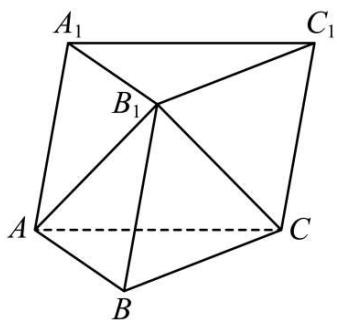

text_image

A₁
B₁
C₁
A
B
C

(1) 证明: AC ⊥ B₁B;

2367 (2024·广东深圳·统考二模)如图,在四棱锥 P-ABCD 中,底面 ABCD 为矩形,PA⊥平面 ABCD,PA=AD= $\sqrt{2}$ AB,点 M 是 PD 的中点.

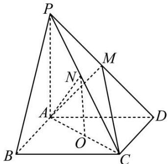

text_image

Geometric diagram of a pyramid with labeled vertices and internal points, used for spatial geometry problems.

(1) 证明: AM ⊥ PC;

2368 (2024·河南·校联考模拟预测)已知三棱柱 $\mathrm{ABC - A_1B_1C_1}$ 中， $\mathrm{AB} = \mathrm{AC} = 2,\mathrm{A}_1\mathrm{A} = \mathrm{A}_1\mathrm{B}$ $= \mathrm{A}_1\mathrm{C} = 2,\angle \mathrm{BAC} = 90^{\circ},\mathrm{E}$ 是BC的中点，F是线段 $\mathrm{A}_1\mathrm{C}_1$ 上一点.

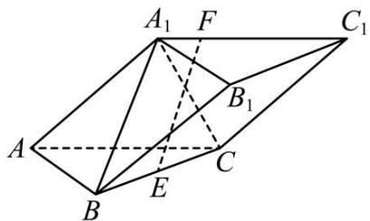

text_image

A₁ F C₁
B₁
A B C
E

(1) 求证: AB ⊥ EF;

2369 (2024·福建宁德·校考模拟预测)图1是由直角梯形ABCD和以CD为直径的半圆组成的平面图形，AD//BC，AD⊥AB，AD=AB= $\frac{1}{2}$ BC=1。E是半圆上的一个动点，当 $\triangle CDE$ 周长最大时，将半圆沿着CD折起，使平面PCD⊥平面ABCD，此时的点E到达点P的位置，如图2。

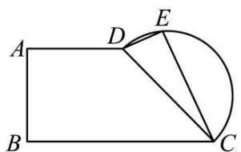

text_image

A
B
D
E
C

图1

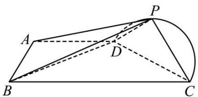

text_image

Geometric diagram of a quadrilateral with labeled vertices A, B, C, P and internal points D, showing solid and dashed lines for edges and diagonals.

图2

(1) 求证: BD ⊥ PD;

2370 (2024·河南·校联考模拟预测)如图, 已知三棱柱 $\mathrm{ABC} - \mathrm{A}_{1}\mathrm{B}_{1}\mathrm{C}_{1}$ 中, $\mathrm{AB} = \mathrm{AC} = 2$ , $\mathrm{A}_{1}\mathrm{A} = \mathrm{A}_{1}\mathrm{B} = \mathrm{A}_{1}\mathrm{C} = 2\sqrt{2}$ , $\angle \mathrm{BAC} = 90^{\circ}$ , $\mathrm{E}$ 是 BC 的中点, $\mathrm{F}$ 是线段 $\mathrm{A}_{1}\mathrm{C}_{1}$ 上一点.

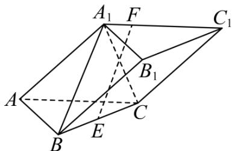

text_image

A₁ F C₁
B₁
A B C
E

(1) 求证: AB ⊥ EF;
(2) 设 P 是棱 AA₁ 上的动点 (不包括边界), 当 $\triangle PBC$ 的面积最小时, 求棱锥 P-ABC 的体积.

2371 (2024·贵州毕节·校考模拟预测)在梯形ABCD中，AB//DC， $\angle DAB = 90^{\circ}$ ， $\mathrm{CD} = 2$ ， $\mathrm{AC} = \mathrm{AB} = 4$ ，如图1.沿对角线AC将△DAC折起，使点D到达点P的位置，E为BC的中点，如图2.

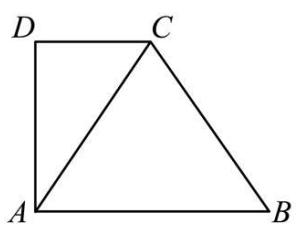

natural_image

Geometric diagram of a quadrilateral ABCD with diagonal AC, no text or labels present

图1

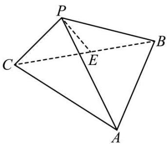

text_image

P
C
E
B
A

图2

(1) 证明: PE ⊥ AC.

# 3 题型三:证明线面垂直

13. (2024·陕西榆林·陕西省神木中学校考三模) 如图, 在四棱柱 $\mathrm{ABCD} - \mathrm{A}_1\mathrm{B}_1\mathrm{C}_1\mathrm{D}_1$ 中, $\mathrm{AA}_1 \perp$ 底面 ABCD, 底面 ABCD 满足 AD // BC, 且 AB = AD = AA₁ = 2, BD = DC = 2√2.

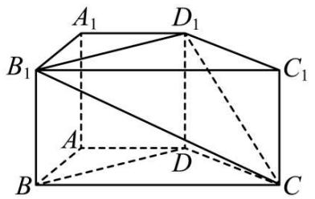

text_image

A₁ D₁
B₁ C₁
A
D
B C

(1) 求证: AB ⊥ 平面 ADD₁A₁;  
(2) 求四棱锥 $\mathrm{C} - \mathrm{BDD}_1\mathrm{B}_1$ 的体积.

【解析】(1)由 $\mathrm{AA}_1\perp$ 底面ABCD， $\mathrm{AB}\subset$ 平面ABCD，

所以 $\mathbf{AB} \perp \mathbf{AA}_1$

又因为 $\mathbf{AB} = \mathbf{AD} = 2, \mathbf{BD} = 2\sqrt{2}$ .

满足 $\mathbf{AB}^2 +\mathbf{AD}^2 = \mathbf{BD}^2$ ，可得 $\mathbf{AB}\bot \mathbf{AD}$

又 $\mathbf{AA}_1\cap \mathbf{AD} = \mathbf{A},\mathbf{AA}_1,\mathbf{AD}\subset$ 平面 $\mathrm{ADD}_1\mathrm{A}_1$

所以 AB ⊥ 平面 ADD₁A₁.

(2) 由 (1) 中 AB ⊥ AD，且 AD // BC，BD = DC = $2\sqrt{2}$ ，可得 BC = 4，

因此 $\mathrm{BD}^2 +\mathrm{DC}^2 = \mathrm{BC}^2$ ，即 $\mathrm{BD}\bot \mathrm{DC},$

又 $\mathbf{AA}_1\perp$ 平面ABCD， $\mathbf{AA}_1 / /\mathbf{DD}_1$

可得 $\mathrm{DD}_1\perp$ 平面ABCD，DC⊂平面ABCD，

即 $\mathbf{DD}_1\perp \mathbf{DC}$

又 $\mathrm{DD}_1\cap \mathrm{BD} = \mathrm{D},\mathrm{DD}_1,\mathrm{BD}\subset$ 平面 $\mathrm{BDD}_1\mathrm{B}_1$

所以 $\mathrm{DC} \perp$ 平面 $\mathrm{BDD}_1\mathrm{B}_1$ ，即 $\mathrm{DC}$ 为四棱锥 $\mathrm{C} - \mathrm{BDD}_1\mathrm{B}_1$ 的高，

即四棱锥 $\mathrm{C - BDD_1B_1}$ 的体积. $\mathrm{V_{C - BDD_1B_1}} = \frac{1}{3}\mathrm{BB}_1\cdot \mathrm{BD}\cdot \mathrm{DC} = \frac{1}{3}\times 2\times 2\sqrt{2}\times 2\sqrt{2} = \frac{16}{3}.$

2372 (2024·云南·校联考模拟预测)如图,在四棱锥 P-OABC 中,已知 OA=OP=1,CP=2,AB=4, $\angle CPO=\frac{\pi}{3},\angle ABC=\frac{\pi}{6},\angle AOC=\frac{\pi}{2}$ .

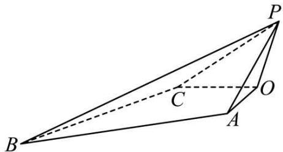

text_image

Geometric diagram of a triangular pyramid with labeled vertices and internal points

(1) 证明: CO ⊥ 平面 AOP;

2373 (2024·云南昭通·校联考模拟预测)如图,在三棱锥 C-ABD 中, CD⊥平面 ABD,E 为 AB 的中点, AB=BC=AC=2, CG=2EG.

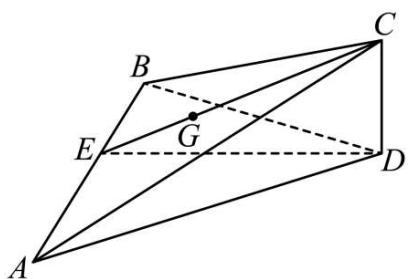

text_image

Geometric diagram of a tetrahedron with labeled vertices A, B, C, D, E, and G, showing solid and dashed edges.

(1) 证明: AB ⊥ 平面 CED;

2374 (2024·内蒙古赤峰·赤峰二中校联考模拟预测)如图1,在五边形ABCDE中,四边形ABCE为正方形,CD⊥DE,CD=DE,如图2,将△ABE沿BE折起,使得A至A₁处,且A₁B⊥A₁D.

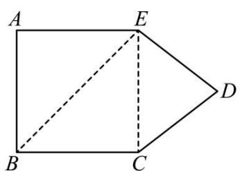

text_image

A
E
B
C
D

图1

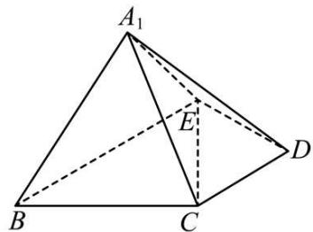

text_image

A₁
E
B
C
D

图2

(1) 证明: DE ⊥ 平面 A₁BE;

2375 (2024·重庆巴南·统考一模)如图所示,在三棱锥 P-ABC 中,已知 PA⊥平面 ABC,平面 PAB⊥平面 PBC.

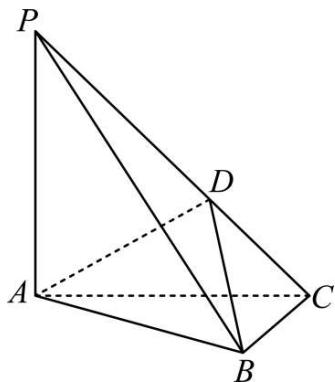

natural_image

Geometric diagram of a triangular pyramid with labeled vertices P, A, B, C, D (no text or symbols present)

(1) 证明: BC ⊥ 平面 PAB;

2376 (2024·广东广州·统考三模)如图,在几何体 ABCDEF 中,矩形 BDEF 所在平面与平面 ABCD 互相垂直,且 AB = BC = BF = 1, AD = CD = $\sqrt{3}$ , EF = 2.

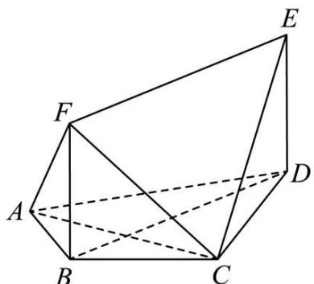

natural_image

Geometric diagram of a polyhedron with labeled vertices A, B, C, D, E, F (no text or symbols present)

(1) 求证: BC ⊥ 平面 CDE;

2377 (2024·天津津南·天津市咸水沽第一中学校考模拟预测)如图,在三棱柱 $ABC-A_{1}B_{1}C_{1}$ 中,平面 $ACC_{1}A_{1}\perp$ 平面 ABC, $AC=BC=CC_{1}=2,D$ 是 $AA_{1}$ 的中点,且 $\angle ACB=90^{\circ},\angle DAC=60^{\circ}.$

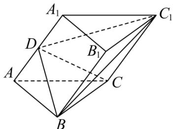

text_image

A₁
D
B₁
C₁
A
B
C

(1) 证明: $\mathrm{AA}_{1} \perp$ 平面CBD;

# 题型四:证明面面垂直

2378 (2024·山西运城·山西省运城中学校校考二模)如图，在三棱柱 $ABC-A_{1}B_{1}C_{1}$ 中，侧面 $BB_{1}C_{1}C$ 为菱形， $\angle CBB_{1}=60^{\circ}$ ，AB=BC=2， $AC=AB_{1}=\sqrt{2}$ .

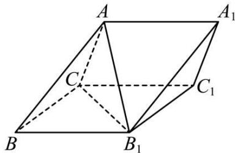

text_image

A
A₁
C
C₁
B
B₁

(1) 证明: 平面 $ACB_{1} \perp$ 平面 $BB_{1}C_{1}C$ ;

2379 (2024·贵州贵阳·校联考三模)如图所示,在四棱锥 E-ABCD 中,底面 ABCD 为直角梯形, AB // CD, AB = $\frac{1}{2}$ CD, CD ⊥ CE, ∠ADC = ∠EDC = 45°, AD = $\sqrt{2}$ , BE = $\sqrt{3}$ .

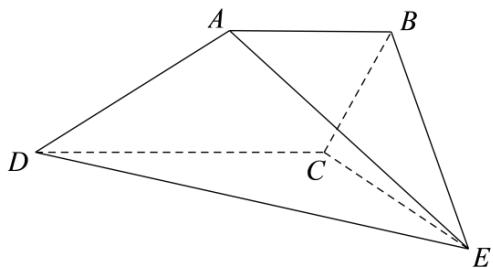

text_image

A
B
D
C
E

(1) 求证: 平面 ABE ⊥ 平面 ABCD;

2380 (2024·西藏日喀则·统考一模)如图,已知直角梯形 ABCD 与 ADEF, 2DE = 2BC = AD = AB = AF = 2, AD ⊥ AF, ED // AF, AD ⊥ AB, BC // AD, G 是线段 BF 上一点.

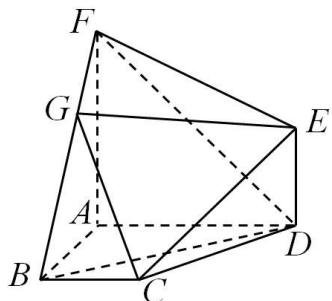

text_image

Geometric diagram of a polyhedron with labeled vertices A, B, C, D, E, F, G and dashed/solid edges indicating hidden edges.

(1) 平面 ABCD ⊥ 平面 ABF

2381 (2024·广东梅州·统考三模)如图所示,在几何体PABCD中,AD⊥平面PAB,点C在平面PAB的投影在线段PB上(BC<PC),BP=6,AB=AP= $2\sqrt{3}$ ,DC=2,CD//平面PAB.

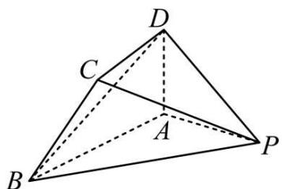

text_image

Geometric diagram of a tetrahedron with labeled vertices A, B, C, D and internal point P, showing solid and dashed edges.

(1) 证明: 平面 PCD ⊥ 平面 PAD.

2382 (2024·河北张家口·统考三模)如图，在三棱柱 $ABC-A_{1}B_{1}C_{1}$ 中，侧面 $BB_{1}C_{1}C$ 为菱形， $\angle CBB_{1}=60^{\circ}, AB=BC=2, AC=AB_{1}=\sqrt{2}$ .

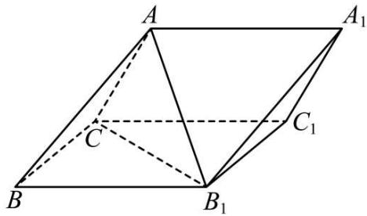

text_image

A
A₁
C₁
B
B₁

(1) 证明: 平面 $ACB_{1} \perp$ 平面 $BB_{1}C_{1}C$ ;

2383 (2024·陕西西安·西安市大明宫中学校考模拟预测)如图,在长方体 $ABCD-A_{1}B_{1}C_{1}D_{1}$ 中, AB=2BC=2, $AA_{1}=4$ , P 为棱 AB 的中点.

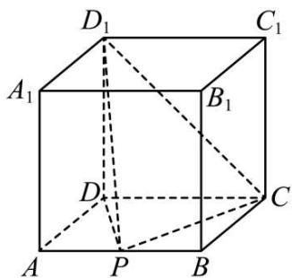

text_image

D₁
C₁
A₁
B₁
D
C
A
P
B

(1) 证明: 平面 $PCD_{1} \perp$ 平面 $PDD_{1}$ ;

(2)画出平面 $\mathrm{D}_1\mathrm{PC}$ 与平面 $\mathrm{A}_1\mathrm{ADD}_1$ 的交线，并说明理由；

(3) 求过 $D_{1}, P, C$ 三点的平面 $\alpha$ 将四棱柱分成的上、下两部分的体积之比.

2384 (2024·云南·云南师大附中校考模拟预测)如图, P 为圆锥的顶点, A, B 为底面圆 O 上两点, $\angle AOB = \frac{2\pi}{3}$ , E 为 PB 中点, 点 F 在线段 AB 上, 且 AF = 2FB.

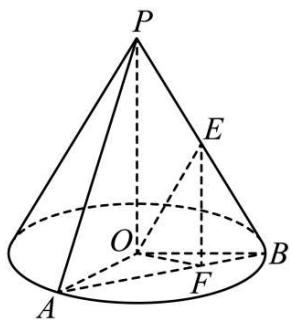

text_image

P
E
O
A
F
B

(1) 证明: 平面 AOP ⊥ 平面 OEF;

2385 (2024·江苏南京·南京市第一中学校考模拟预测)在如图所示的空间几何体中， $\triangle ACD$ 与 $\triangle ACB$ 均是等边三角形，直线 $ED \perp$ 平面 $ACD$ ，直线 $EB \perp$ 平面 $ABC$ ， $DE \perp BE$

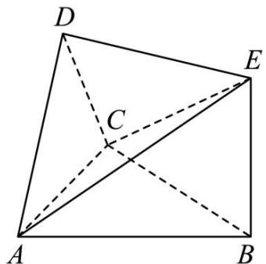

text_image

D
C
A
B
E

(1) 求证: 平面 ABC ⊥ 平面 ADC;

# 5 题型五:垂直关系的综合应用

2386 (2024·贵州铜仁·统考二模)如图,在直三棱柱 $ABC-A_{1}B_{1}C_{1}$ 中, $\angle BAC=90^{\circ},AB=AC=1$ .

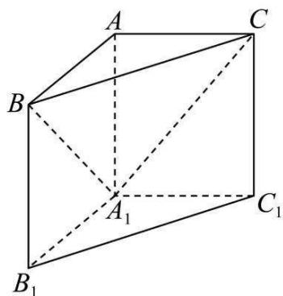

text_image

A
C
B
A₁
C₁
B₁

(1) 试在平面 $\mathrm{A}_{1} \mathrm{BC}$ 内确定一点 $\mathrm{H}$ , 使得 $\mathrm{AH} \perp$ 平面 $\mathrm{A}_{1} \mathrm{BC}$ , 并写出证明过程;

2387 (2024·全国·校联考模拟预测)如图,在正三棱柱 $ABC-A_{1}B_{1}C_{1}$ (侧棱垂直于底面,且底面三角形 ABC 是等边三角形)中, $BC=CC_{1}$ , M、N、P 分别是 $CC_{1}$ , AB, $BB_{1}$ 的中点.

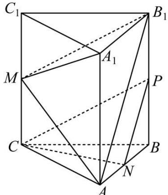

text_image

C₁
M
A₁
B₁
P
C
B
N
A

(1) 求证: 平面 NPC // 平面 AB $_{1}$ M;

(2) 在线段 $BB_{1}$ 上是否存在一点 Q 使 $AB_{1} \perp$ 平面 $A_{1}MQ$ ？若存在，确定点 Q 的位置；若不存在，也请说明理由.

2388 (2024·天津·耀华中学校考二模)如图,在三棱锥 A-BCD 中,顶点 A 在底面 BCD 上的射影 O 在棱 BD 上, $AB=AD=\sqrt{2}$ , BC=BD=2, $\angle CBD=90^{\circ}$ , E 为 CD 的中点.

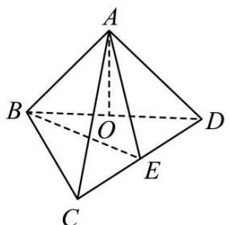

text_image

A
B
O
D
C
E

(1) 求证: AD ⊥ 平面 ABC;  
(2) 求二面角 B-AE-C 的余弦值;  
(3) 已知 P 是平面 ABD 内一点, 点 Q 为 AE 中点, 且 PQ ⊥ 平面 ABE, 求线段 PQ 的长.

2389 (2024·全国·校联考模拟预测)如图,在正方体 $ABCD-A_{1}B_{1}C_{1}D_{1}$ 中, $AD_{1}\cap A_{1}D=E$ , $CD_{1}\cap C_{1}D=F$ .

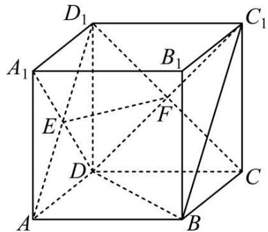

text_image

D₁
A₁
B₁
C₁
E
F
D
C
A
B

(1) 求证: EF ⊥ BD;   
(2) 在线段 $\mathrm{BC}_{1}$ 上, 是否存在点 $\mathrm{H}$ , 使得 $\mathrm{BC}_{1} \perp$ 平面 DEH? 并说明理由.

2390 (2024·江西赣州·统考模拟预测)如图,在三棱柱 $ABC-A_{1}B_{1}C_{1}$ 中,侧面 $AA_{1}C_{1}C$ 是矩形,侧面 $BB_{1}C_{1}C$ 是菱形, $\angle B_{1}BC=60^{\circ}$ ,D、E分别为棱AB、 $B_{1}C_{1}$ 的中点,F为线段 $C_{1}E$ 的中点.

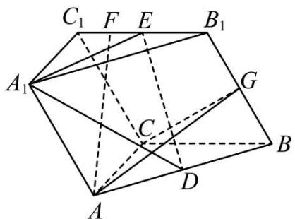

text_image

C₁ F E B₁
A₁ G
C
D
A B

(1) 证明: AF // 平面 A $_{1}$ DE;  
(2) 在棱 $BB_{1}$ 上是否存在一点 G，使平面 $ACG \perp$ 平面 $BB_{1}C_{1}C$ ？若存在，请指出点 G 的位置，并证明你的结论；若不存在，请说明理由.

2391 (2024·安徽淮北·统考一模)如图, 已知四棱锥 P-ABCD 的底面是平行四边形, 侧面 PAB 是等边三角形, BC = 2AB, $\angle ABC = 60^{\circ}$ , PB ⊥ AC.

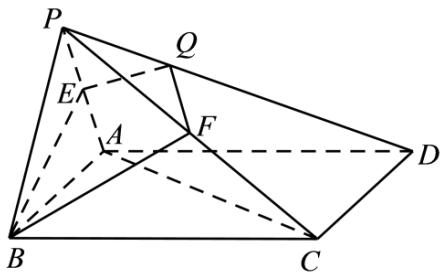

text_image

P
Q
E
A
F
D
B
C

(1) 求证: 面 PAB ⊥ 面 ABCD;

(2) 设 Q 为侧棱 PD 上一点, 四边形 BEQF 是过 B, Q 两点的截面, 且 AC // 平面 BEQF, 是否存在点 Q, 使得平面 BEQF ⊥ 平面 PAD? 若存在, 确定点 Q 的位置; 若不存在, 说明理由.

2392 (2024·河北邯郸·统考二模)如图,直三棱柱 ABC- $A_{1}B_{1}C_{1}$ 中,D,E 分别是棱 BC,AB 的中点,点 F 在棱 $CC_{1}$ 上,已知 AB = AC, $AA_{1} = 3$ ,BC = CF = 2.

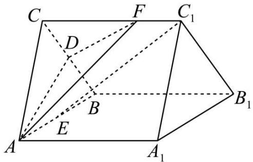

text_image

C
F
C₁
D
B
E
A
A₁
B₁

(1) 求证: $C_{1}E \parallel$ 平面 ADF;

(2) 设点 M 在棱 $BB_{1}$ 上, 当 BM 为何值时, 平面 CAM ⊥ 平面 ADF.

