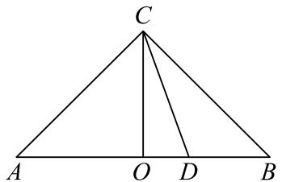
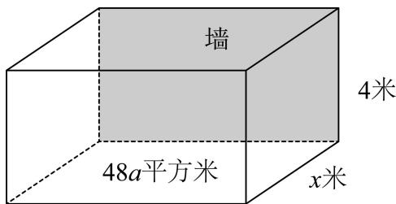

# 第4讲 基本不等式及其应用

# 知识梳理

# 1、基本不等式

如果 $a > 0, b > 0$ ，那么 $\sqrt{ab} \leqslant \frac{a + b}{2}$ ，当且仅当 $a = b$ 时，等号成立。其中， $\frac{a + b}{2}$ 叫作 $a, b$ 的算术平均数， $\sqrt{ab}$ 叫作 $a, b$ 的几何平均数。即正数 $a, b$ 的算术平均数不小于它们的几何平均数。

基本不等式1: 若 $a, b \in R$ ，则 $a^{2} + b^{2} \geqslant 2ab$ ，当且仅当 a = b 时取等号；

基本不等式2: 若 $a, b \in R^{+}$ ，则 $\frac{a+b}{2} \geqslant \sqrt{ab}$ （或 $a + b \geqslant 2\sqrt{ab}$ ），当且仅当 a = b 时取等号.

注意(1)基本不等式的前提是“一正”“二定”“三相等”;其中“一正”指正数,“二定”指求最值时和或积为定值,“三相等”指满足等号成立的条件. (2)连续使用不等式要注意取得一致.

# 【解题方法总结】

1、几个重要的不等式

(1) $a^{2}\geqslant0(a\in\mathbb{R}),\sqrt{a}\geqslant0(a\geqslant0),|a|\geqslant0(a\in\mathbb{R}).$   
(2) 基本不等式: 如果 $a, b \in \mathbb{R}^{+}$ , 则 $\frac{a + b}{2} \geqslant \sqrt{ab}$ (当且仅当“ $a = b$ ”时取“=”).

特例： $a > 0, a + \frac{1}{a} \geqslant 2; \frac{a}{b} + \frac{b}{a} \geqslant 2(a, b$ 同号）.

(3) 其他变形:

① $a^2 + b^2 \geqslant \frac{(a + b)^2}{2}$ (沟通两和 $a + b$ 与两平方和 $a^2 + b^2$ 的不等关系式)  
② $ab \leqslant \frac{a^2 + b^2}{2}$ (沟通两积 $ab$ 与两平方和 $a^2 + b^2$ 的不等关系式)  
③ $ab \leqslant \left(\frac{a + b}{2}\right)^2$ (沟通两积 $ab$ 与两和 $a + b$ 的不等关系式)  
④重要不等式串： $\frac{2}{\frac{1}{a} + \frac{1}{b}}\leqslant \sqrt{ab}\leqslant \frac{a + b}{2}\leqslant \sqrt{\frac{a^2 + b^2}{2}} (a,b\in \mathbb{R}^{+})$ 即

调和平均值 $\leqslant$ 几何平均值 $\leqslant$ 算数平均值 $\leqslant$ 平方平均值(注意等号成立的条件).

2、均值定理

已知 $x, y \in \mathbb{R}^{+}$ .

(1) 如果 $x + y = \mathrm{S}$ (定值), 则 $xy \leqslant \left(\frac{x + y}{2}\right)^2 = \frac{\mathrm{S}^2}{4}$ (当且仅当“ $x = y$ ”时取“=”). 即“和为定值, 积有最大值”.  
(2) 如果 $xy = \mathrm{P}$ (定值), 则 $x + y \geqslant 2\sqrt{xy} = 2\sqrt{\mathrm{P}}$ (当且仅当“ $x = y$ ”时取“=”). 即积为定值, 和有最小值".

3、常见求最值模型

模型一： $mx + \frac{n}{x} \geqslant 2\sqrt{mn} (m > 0, n > 0)$ ，当且仅当 $x = \sqrt{\frac{n}{m}}$ 时等号成立；

模型二： $mx + \frac{n}{x - a} = m(x - a) + \frac{n}{x - a} + ma \geqslant 2\sqrt{mn} + ma (m > 0, n > 0)$ ，当且仅当 $x -$

$a = \sqrt{\frac{n}{m}}$ 时等号成立；

模型三： $\frac{x}{ax^{2}+bx+c}=\frac{1}{ax+b+\frac{c}{x}}\leqslant\frac{1}{2\sqrt{ac}+b}(a>0,c>0)$ ，当且仅当 $x=\sqrt{\frac{c}{a}}$ 时等号成立；

模型四： $x(n - mx) = \frac{mx(n - mx)}{m} \leqslant \frac{1}{m} \cdot \left(\frac{mx + n - mx}{2}\right)^2 = \frac{n^2}{4m} (m > 0, n > 0, 0 < x < \frac{n}{m})$ ，当且仅当 $x = \frac{n}{2m}$ 时等号成立.

# 必考题型全归纳

# 1 题型一:基本不等式及其应用

# 【解题方法总结】

熟记基本不等式成立的条件,合理选择基本不等式的形式解题,要注意对不等式等号是否成立进行验证.

59 (2024·辽宁·校联考二模)数学命题的证明方式有很多种．利用图形证明就是一种方式. 现有如图所示图形,在等腰直角三角形 $\triangle ABC$ 中,点 O 为斜边 AB 的中点,点 D 为斜边 AB 上异于顶点的一个动点,设 AD = a, BD = b,用该图形能证明的不等式为().

text_image

C
A O D B

A. $\frac{a + b}{2} \geqslant \sqrt{ab} (a > 0, b > 0)$

B. $\frac{2ab}{a + b} \leqslant \sqrt{ab} (a > 0, b > 0)$

C. $\frac{a + b}{2} \leqslant \sqrt{\frac{a^2 + b^2}{2}} (a > 0, b > 0)$

D. $a^2 + b^2 \geqslant 2\sqrt{ab} (a > 0, b > 0)$

60 (2024·全国·高三专题练习)已知 x, y 都是正数, 且 $x \neq y$ , 则下列选项不恒成立的是 ()

A. $\frac{x + y}{2} >\sqrt{xy}$

B. $\frac{x}{y} +\frac{y}{x} >2$

C. $\frac{2xy}{x + y} < \sqrt{xy}$

D. $xy + \frac{1}{xy} > 2$

61 (2024·江苏·高三专题练习)下列运用基本不等式求最值,使用正确的个数是 ( )

①已知 $ab \neq 0$ ，求 $\frac{a}{b} + \frac{b}{a}$ 的最小值；解答过程： $\frac{a}{b} + \frac{b}{a} \geqslant 2\sqrt{\frac{a}{b} \times \frac{b}{a}} = 2$ ;  
②求函数 $y=\frac{x^{2}+5}{\sqrt{x^{2}+4}}$ 的最小值；解答过程：可化得 $y=\sqrt{x^{2}+4}+\frac{1}{\sqrt{x^{2}+4}}\geqslant2;$   
③设 x > 1，求 $y = x + \frac{2}{x - 1}$ 的最小值；解答过程： $y = x + \frac{2}{x - 1} \geqslant 2\sqrt{\frac{2x}{x - 1}}$ ，当且仅当 $x = \frac{2}{x - 1}$ 即 x = 2 时等号成立，把 x = 2 代入 $2\sqrt{\frac{2x}{x - 1}}$ 得最小值为 4.

A. 0 个

B. 1 个

C. 2 个

D. 3 个

# 2 题型二: 直接法求最值

# 【解题方法总结】

直接利用基本不等式求解,注意取等条件.

62 (2024·河北·高三学业考试)若 $x, y \in R_{+}$ ，且 $x + 2y = 3$ ，则 xy 的最大值为 \_\_\_\_.  
63 (2024·重庆沙坪坝·高三重庆南开中学校考阶段练习)若 a, b > 0，且 $ab = a + b + 3$ ，则 ab 的最小值是 \_\_\_\_。  
64 (2024·天津南开·统考一模)已知实数 $a > 0, b > 0, a + b = 1$ ，则 $2^{a} + 2^{b}$ 的最小值为 \_\_\_\_.

# 3 题型三:常规凑配法求最值

# 【解题方法总结】

1、通过添项、拆项、变系数等方法凑成和为定值或积为定值的形式.  
2、注意验证取得条件.

65 (2024·全国·高三专题练习)若 x > -2，则 $f(x) = x + \frac{1}{x + 2}$ 的最小值为 \_\_\_\_.  
66 (2024·全国·高三专题练习)已知 x > 0，则 $2x + \frac{4}{2x + 1}$ 的最小值为 \_\_\_\_.  
67 (2024·全国·高三专题练习)若 x > 1，则 $\frac{x^{2} + 2x + 2}{x - 1}$ 的最小值为 \_\_\_\_  
68 (2024·上海浦东新·高三华师大二附中校考阶段练习)若关于 x 的不等式 $x^{2} + bx + c \geqslant 0 (b > 1)$ 的解集为 R，则 $\frac{1 + 2b + 4c}{b - 1}$ 的最小值为 \_\_\_\_.

# 4 题型四:消参法求最值

# 【解题方法总结】

消参法就是对应不等式中的两元问题,用一个参数表示另一个参数,再利用基本不等式进行求解. 解题过程中要注意“一正,二定,三相等”这三个条件缺一不可!

69 (2024·全国·高三专题练习)已知正实数 a, b 满足 $ab + 2a - 2 = 0$ ，则 $4a + b$ 的最小值是（）

A. 2

B. $4 \sqrt{2} - 2$

C. $4 \sqrt{3} - 2$

D. 6

70 (2024·全国·高三专题练习)若 $x, y \in R^{+}, (x - y)^{2} = (xy)^{3}$ ，则 $\frac{1}{x} + \frac{1}{y}$ 的最小值为 \_\_\_\_.

(2024·全国·高三专题练习)已知 x > 0, y > 0, 满足 $x^{2} + 2xy - 2 = 0$ , 则 $2x + y$ 的最小值是 \_\_\_\_.

# 5 题型五:双换元求最值

# 【解题方法总结】

若题目中含是求两个分式的最值问题,对于这类问题最常用的方法就是双换元,分布运用两个分式的分母为两个参数,转化为这两个参数的不等关系.

1、代换变量，统一变量再处理.  
2、注意验证取得条件.

72 (2024·浙江省江山中学高三期中)设 a > 0, b > 0, 若 $a^{2} + b^{2} - \sqrt{3}ab = 1$ , 则 $\sqrt{3}a^{2} - ab$ 的最大值为 ( )

A. $3 + \sqrt{3}$

B. $2 \sqrt{3}$

C. $1 + \sqrt{3}$

D. $2 + \sqrt{3}$

(2024·天津南开·一模)若 a > 0, b > 0, c > 0, $a + b + c = 2$ ，则 $\frac{4}{a + b} + \frac{a + b}{c}$ 的最小值为 \_\_\_\_.

74 (2024·全国·高三专题练习)已知 a > 0, b > 0, $a + 2b = 1$ ，则 $\frac{1}{3a + 4b} + \frac{1}{a + 3b}$ 取到最小值为 \_\_\_\_.

# 6 题型六：“1”的代换求最值

# 【解题方法总结】

1 的代换就是指凑出 1, 使不等式通过变形出来后达到运用基本不等式的条件, 即积为定值, 凑的过程中要特别注意等价变形.

1、根据条件,凑出“1”,利用乘“1”法.

2、注意验证取得条件.

75 (2024·安徽蚌埠·统考二模)若直线 $\frac{x}{a} + \frac{y}{b} = 1 (a > 0, b > 0)$ 过点 (2, 3)，则 $2a + b$ 的最小值为 \_\_\_\_.

76 (2024·河北·高三校联考阶段练习)已知 a > 0, b > 0, $a + 2b = 3$ ，则 $\frac{4 - 2b}{a} + \frac{1}{2b}$ 的最小值为 \_\_\_\_.

(2024·湖南衡阳·高三校考期中)已知 $x > \frac{1}{3}$ , y > 2，且 $3x + y = 7$ ，则 $\frac{1}{3x - 1} + \frac{1}{y - 2}$ 的最小值为 \_\_\_\_.

78 (2024·山东青岛·高三山东省青岛第五十八中学校考阶段练习)已知正实数 a, b 满足 $\frac{4}{a+b} + \frac{1}{b+1} = 1$ ，则 $a + 2b$ 的最小值为 \_\_\_\_.

# 7 题型七:齐次化求最值

# 【解题方法总结】

齐次化就是含有多元的问题,通过分子、分母同时除以得到一个整体,然后转化为运用基本不等式进行求解.

79 (2024·全国·高三专题练习)已知正实数 $a, b, c, a + b = 3$ ，则 $\frac{ac}{b} + \frac{3c}{ab} + \frac{3}{c + 1}$ 的最小值为 \_\_\_\_.

80 (2024·全国·高三专题练习)已知 a, b 为正实数, 且 $2a + b = 1$ , 则 $\frac{2}{a} + \frac{a}{2b}$ 的最小值为 \_\_\_\_.

81 (2024·天津红桥·高三天津市复兴中学校考阶段练习)已知 x > 0, y > 0，则 $\frac{2xy}{x^{2} + 4y^{2}} + \frac{xy}{x^{2} + y^{2}}$ 的最大值是 \_\_\_\_.

# 8 题型八:利用基本不等式证明不等式

# 【解题方法总结】

类似于基本不等式的结构的不等式的证明可以利用基本不等式去组合、分解、运算获得证明.

82 (2024·全国·高三专题练习)利用基本不等式证明:已知a,b,c都是正数,求证:

$$
(a + b) (b + c) (c + a) \geqslant 8 a b c
$$

83 (2024·河南·高三校联考阶段练习)已知 x, y, z 为正数, 证明:

(1) 若 $xyz = 2$ ，则 $\frac{1}{x} + \frac{1}{y} + \frac{1}{z} \leqslant \frac{x^2 + y^2 + z^2}{2}$ ;  
(2) 若 $2x + y + 2z = 9$ ，则 $x^{2} + y^{2} + z^{2} \geqslant 9$ .

84 (2024·四川广安·高三校考开学考试)已知函数 $f(x) = |2x + 1| + |x + m|$ ，若 $f(x) \leqslant 3$ 的解集为 $[n,1]$ .

(1) 求实数 $m, n$ 的值；  
(2) 已知 $a, b$ 均为正数，且满足 $\frac{1}{2a} + \frac{2}{b} + 2m = 0$ ，求证： $16a^2 + b^2 \geqslant 8$ .

# 9 题型九:利用基本不等式解决实际问题

# 【解题方法总结】

1、理解题意，设出变量，建立函数模型，把实际问题抽象为函数的最值问题.  
2、注意定义域,验证取得条件.  
3、注意实际问题隐藏的条件,比如整数,单位换算等.

85 (2024·全国·高三专题练习)首届世界低碳经济大会在南昌召开,本届大会以“节能减排,绿色生态”为主题.某单位在国家科研部门的支持下进行技术攻关,采取了新工艺,把二氧化碳转化为一种可利用的化工产品.已知该单位每月的处理量最少为400吨,最多为600吨,月处理成本y(元)与月处理量x(吨)之间的函数关系可近似的表示为 $y=\frac{1}{2}x^{2}-200x+80000$ ,且处理每吨二氧化碳得到可利用的化工产品价值为100元.

(1)该单位每月处理量为多少吨时,才能使每吨的平均处理成本最低?  
(2)该单位每月能否获利？如果获利，求出最大利润；如果不获利，则需要国家至少补贴多少元才能使单位不亏损？

86 (2024·贵州安顺·高一统考期末)某企业采用新工艺,把企业生产中排放的二氧化碳转化为一种可利用的化工产品. 已知该单位每月的处理量最少为100吨,最多为600吨,月处理成本 $f(x)$ (元)与月处理量x(吨)之间的函数关系可近似地表示为 $f(x)=\frac{1}{2}x^{2}-200x+80000$ .

(1)该单位每月处理量为多少吨时,才能使月处理成本最低?月处理成本最低是多少元?  
(2)该单位每月处理量为多少吨时,才能使每吨的平均处理成本最低?每吨的平均处理成本最低是多少元?

87 (2024·湖北孝感·高一统考开学考试)截至2022年12月12日,全国新型冠状病毒的感染人数突破44200000人.疫情严峻,请同学们利用数学模型解决生活中的实际问题.

text_image

墙
4米
48a平方米
x米

(1) 我国某科研机构新研制了一种治疗新冠肺炎的注射性新药，并已进入二期临床试验阶段。已知这种新药在注射停止后的血药含量 $c(t)$ (单位: mg/L) 随着时间 $t$ (单位: h)。的变化用指数模型 $c(t) = c_0 e^{-kt}$ 描述，假定某药物的消除速率常数 $k = 0.1$ (单位: $h^{-1}$ )，刚注射这种新药后的初始血药含量 $c_0 = 2000 \text{mg/L}$ ，且这种新药在病人体内的血药含量不低于 $1000 \text{mg/L}$ 时才会对新冠肺炎起疗效，现给某新冠病人注射了这种新药，求该新药对病人有疗效的时长大约为多少小时？（精确到 0.01，参考数据： $\ln 2 \approx 0.693, \ln 3 \approx 1.099$ ）(2) 为了抗击新冠，需要建造隔离房间。如图，每个房间是长方体，且有一面靠墙，底面积为 $48a$ 平方米 ( $a > 0$ )，侧面长为 $x$ 米，且 $x$ 不超过 8，房高为 4 米。房屋正面造价 400 元/平方米，侧面造价 150 元/平方米。如果不计房屋背面、屋顶和地面费用，则侧面长为多少时，总价最低？

# 10 题型十:与 $a + b$ 、平方和、 $ab$ 有关问题的最值

# 【解题方法总结】

# 利用基本不等式变形求解

88 (多选题)(2024·重庆·统考模拟预测)若实数 a, b 满足 $a^{2} + b^{2} = ab + 1$ ，则（）

A. $a - b\geqslant -1$

B. $a - b \leqslant \frac{2\sqrt{3}}{3}$

C. $ab \geqslant -\frac{1}{3}$

D. $ab \leqslant \frac{1}{3}$

89 (多选题)(2024·全国·高三专题练习)已知 $a > 0, b > 0$ ，且 $a + \frac{1}{b} = 1$ ，则 （）

A. $\frac{1}{a} + b$ 的最小值为4

B. $a^2 + \frac{1}{b^2}$ 的最小值为 $\frac{1}{4}$

C. $\frac{a}{b}$ 的最大值为 $\frac{1}{4}$

D. $\frac{1}{2} b - a$ 的最小值为 $\sqrt{2} - 1$

90 (多选题)(2024·全国·高三专题练习)已知 x > 0, y > 0, 且 $x + y - xy + 3 = 0$ , 则下列说法正确的是 ()

A. $3 < xy \leqslant 12$

B. $x + y \geqslant 6$

C. $x^{2} + y^{2}\geqslant 18$

D. $0 < \frac{1}{x} + \frac{1}{y} \leqslant \frac{1}{3}$

91 (多选题)(2024·全国·高三专题练习)设 a > 0, b > 0, $a + b = 1$ ，则下列结论正确的是（）

A. $ab$ 的最大值为 $\frac{1}{4}$

B. $a^2 + b^2$ 的最小值为 $\frac{1}{2}$

C. $\frac{4}{a} + \frac{1}{b}$ 的最小值为9

D. $\sqrt{a} +\sqrt{b}$ 的最小值为 $\sqrt{3}$

