# 第50讲 外接球、内切球、棱切球

# 知识梳理

# 知识点一: 正方体、长方体外接球

1、正方体的外接球的球心为其体对角线的中点，半径为体对角线长的一半.  
2、长方体的外接球的球心为其体对角线的中点，半径为体对角线长的一半.

# 3、补成长方体

(1) 若三棱锥的三条侧棱两两互相垂直, 则可将其放入某个长方体内, 如图 1 所示.  
(2) 若三棱锥的四个面均是直角三角形, 则此时可构造长方体, 如图 2 所示.  
(3) 正四面体 $\mathrm{P} - \mathrm{ABC}$ 可以补形为正方体且正方体的棱长 $a = \frac{\mathrm{PA}}{\sqrt{2}}$ ，如图3所示.  
(4) 若三棱锥的对棱两两相等, 则可将其放入某个长方体内, 如图 4 所示

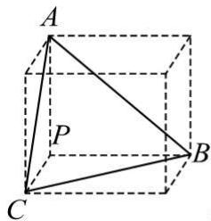

text_image

A
P
C
B

图1

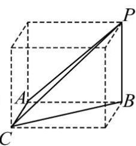

text_image

Geometric diagram of a cube with labeled vertices and internal diagonals, used for spatial geometry problems.

图2

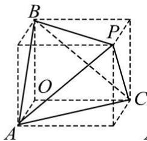

text_image

Geometric diagram of a cube with labeled vertices and internal diagonals, used for spatial geometry problems.

图3

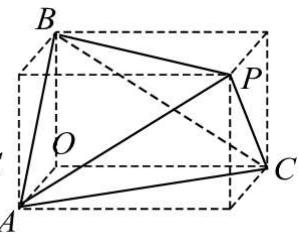

text_image

B
O
A
P
C

图4

# 知识点二: 正四面体外接球

如图, 设正四面体 ABCD 的的棱长为 a, 将其放入正方体中, 则正方体的棱长为 $\frac{\sqrt{2}}{2}a$ , 显然正四面体和正方体有相同的外接球. 正方体外接球半径为 $R = \frac{\sqrt{2}}{2}a \cdot \frac{\sqrt{3}}{2} = \frac{\sqrt{6}}{4}a$ , 即正四面体外接球半径为 $R = \frac{\sqrt{6}}{4}a$ .

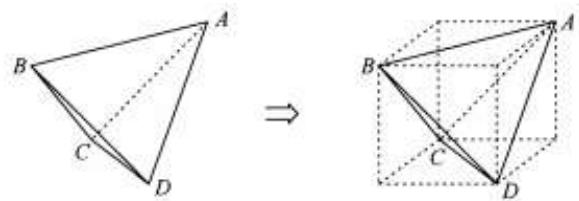

text_image

Geometric diagram showing a triangle ABCD transformed into a 3D cube with labeled vertices A, B, C, D and an arrow indicating transformation.

# 知识点三:对棱相等的三棱锥外接球

四面体 ABCD 中，AB = CD = m，AC = BD = n，AD = BC = t，这种四面体叫做对棱相等四面体，可以通过构造长方体来解决这类问题。

如图，设长方体的长、宽、高分别为 $a, b, c$ ，则 $\left\{ \begin{array}{l} b^2 + c^2 = m^2 \\ a^2 + c^2 = n^2 \\ a^2 + b^2 = t^2 \end{array} \right.$ ，三式相加可得 $a^2 + b^2 + c^2 = \frac{m^2 + n^2 + t^2}{2}$ ，而显然四面体和长方体有相同的外接球，设外接球半径为 $\mathbb{R}$ ，则 $a^2 + b^2 + c^2 = 4\mathbb{R}^2$ ，所以 $\mathbb{R} = \sqrt{\frac{m^2 + n^2 + t^2}{8}}$ 。

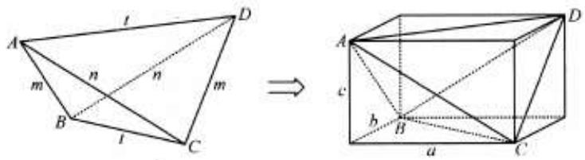

text_image

A
t
D
m
n
n
m
B
l
C
⇒
A
c
b
B
a
C
D

知识点四: 直棱柱外接球

如图1, 图2, 图3, 直三棱柱内接于球 (同时直棱柱也内接于圆柱, 棱柱的上下底面可以是任意三角形)

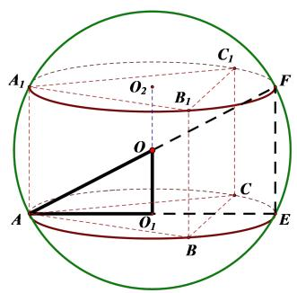

text_image

A₁
O₂
B₁
C₁
F
O
A
O₁
B
C
E

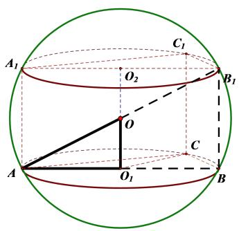

text_image

A₁
O₂
C₁
B₁
O
A
O₁
C
B

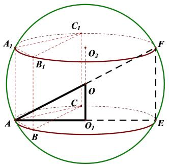

text_image

A₁
B₁
C₁
O₂
F
O
C
A
B
O₁
E

图1  
图2  
图3

第一步:确定球心 O 的位置, $O_{1}$ 是 $\Delta ABC$ 的外心, 则 $OO_{1} \perp$ 平面 ABC;

第二步:算出小圆 $O_{1}$ 的半径 $AO_{1}=r, OO_{1}=\frac{1}{2}AA_{1}=\frac{1}{2}h(AA_{1}=h$ 也是圆柱的高);

第三步: 勾股定理: $OA^{2}=O_{1}A^{2}+O_{1}O^{2}\Rightarrow R^{2}=\left(\frac{h}{2}\right)^{2}+r^{2}\Rightarrow R=\sqrt{r^{2}+\left(\frac{h}{2}\right)^{2}}$ , 解出 R

知识点五: 直棱锥外接球

如图, PA ⊥ 平面 ABC, 求外接球半径.

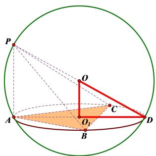

text_image

P
O
A
O₁
C
B
D

解题步骤:

第一步: 将 $\Delta ABC$ 画在小圆面上, A 为小圆直径的一个端点, 作小圆的直径 AD, 连接 PD, 则 PD 必过球心 O;

第二步： $O_{1}$ 为 $\Delta ABC$ 的外心，所以 $OO_{1} \perp$ 平面 ABC，算出小圆 $O_{1}$ 的半径 $O_{1}D = r$ （三

角形的外接圆直径算法: 利用正弦定理, 得 $\frac{a}{\sin A} = \frac{b}{\sin B} = \frac{c}{\sin C} = 2r)$ , $OO_{1} = \frac{1}{2} PA$ ;

第三步: 利用勾股定理求三棱锥的外接球半径: ① $(2R)^{2} = \mathrm{PA}^{2} + (2r)^{2} \Leftrightarrow 2\mathrm{R} = \sqrt{\mathrm{PA}^{2} + (2r)^{2}}$ ;

$$
② \mathrm{R} ^ {2} = r ^ {2} + \mathrm{OO} _ {1} ^ {2} \Leftrightarrow \mathrm{R} = \sqrt {r ^ {2} + \mathrm{OO} _ {1} ^ {2}}.
$$

知识点六: 正棱锥与侧棱相等模型

1、正棱锥外接球半径： $R=\frac{r^{2}+h^{2}}{2h}$

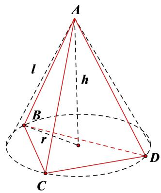

text_image

A
l
h
B
r
C
D

# 2、侧棱相等模型：

如图，P的射影是 $\Delta ABC$ 的外心

$\Leftrightarrow$ 三棱锥 $\mathrm{P - ABC}$ 的三条侧棱相等

$\Leftrightarrow$ 三棱锥 $\mathrm{P - ABC}$ 的底面 $\Delta ABC$ 在圆锥的底上，顶点 $\mathbf{P}$ 点也是圆锥的顶点.

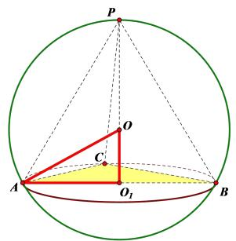

text_image

P
O
C
A
O₁
B

解题步骤：

第一步:确定球心O的位置,取 $\Delta ABC$ 的外心 $O_{1}$ ,则P,O, $O_{1}$ 三点共线;

第二步:先算出小圆 $O_{1}$ 的半径 $AO_{1}=r$ ，再算出棱锥的高 $PO_{1}=h$ （也是圆锥的高）；

第三步: 勾股定理: $OA^{2}=O_{1}A^{2}+O_{1}O^{2}\Rightarrow R^{2}=(h-R)^{2}+r^{2}$ ，解出 $R=\frac{r^{2}+h^{2}}{2h}$ .

知识点七:侧棱为外接球直径模型

方法:找球心,然后作底面的垂线,构造直角三角形.

知识点八:共斜边拼接模型

如图, 在四面体 ABCD 中, AB ⊥ AD, CB ⊥ CD, 此四面体可以看成是由两个共斜边的直角三角形拼接而形成的, BD 为公共的斜边, 故以“共斜边拼接模型”命名之. 设点 O 为公共斜边 BD 的中点, 根据直角三角形斜边中线等于斜边的一半的结论可知, OA = OC = OB = OD, 即点 O 到 A, B, C, D 四点的距离相等, 故点 O 就是四面体 ABCD 外接球的球心, 公共

的斜边 BD 就是外接球的一条直径.

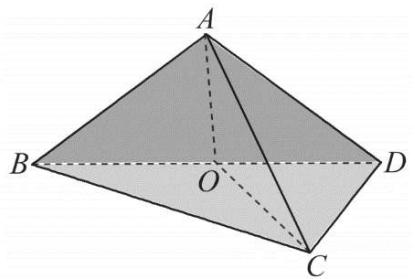

text_image

A
B
O
C
D

知识点九:垂面模型

如图1所示为四面体P-ABC，已知平面PAB⊥平面ABC，其外接球问题的步骤如下：

(1) 找出 $\triangle PAB$ 和 $\triangle ABC$ 的外接圆圆心, 分别记为 $O_{1}$ 和 $O_{2}$ .  
(2) 分别过 $\mathrm{O}_{1}$ 和 $\mathrm{O}_{2}$ 作平面PAB和平面ABC的垂线，其交点为球心，记为O.  
(3) 过 $O_{1}$ 作 AB 的垂线, 垂足记为 D, 连接 $O_{2}D$ , 则 $O_{2}D \perp AB$ .  
(4) 在四棱锥 $\mathrm{A} - \mathrm{DO}_1\mathrm{OO}_2$ 中, AD 垂直于平面 $\mathrm{DO}_1\mathrm{OO}_2$ , 如图 2 所示, 底面四边形 $\mathrm{DO}_1\mathrm{OO}_2$ 的四个顶点共圆且 OD 为该圆的直径.

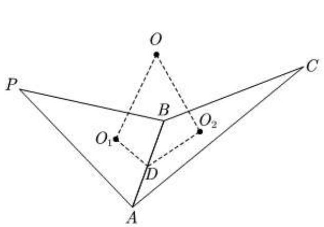

text_image

O
P
B
O₁
O₂
C
D
A

图1

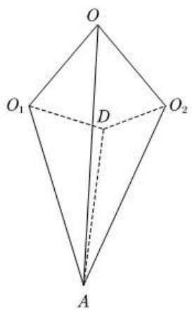

text_image

O
O₁ D O₂
A

图2

知识点十:最值模型

这类问题是综合性问题,方法较多,常见方法有:导数法,基本不等式法,观察法等知识点十一:二面角模型

如图1所示为四面体P-ABC,已知二面角 $\mathrm{P - AB - C}$ 大小为 $\alpha$ ，其外接球问题的步骤如下：

(1) 找出 $\triangle PAB$ 和 $\triangle ABC$ 的外接圆圆心, 分别记为 $O_{1}$ 和 $O_{2}$ .  
(2) 分别过 $\mathrm{O}_{1}$ 和 $\mathrm{O}_{2}$ 作平面 PAB 和平面 ABC 的垂线, 其交点为球心, 记为 O.  
(3) 过 $O_{1}$ 作 AB 的垂线, 垂足记为 D, 连接 $O_{2}D$ , 则 $O_{2}D \perp AB$ .  
(4) 在四棱锥 $\mathrm{A} - \mathrm{DO}_1\mathrm{OO}_2$ 中, AD 垂直于平面 $\mathrm{DO}_1\mathrm{OO}_2$ , 如图 2 所示, 底面四边形 $\mathrm{DO}_1\mathrm{OO}_2$ 的四个顶点共圆且 OD 为该圆的直径.

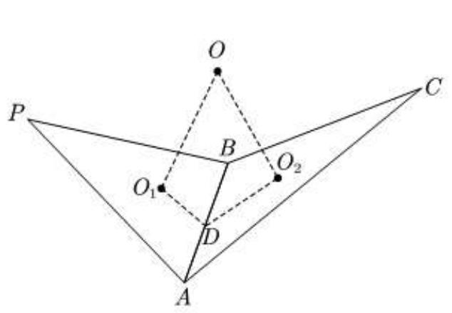

text_image

O
P
B
O₁
O₂
D
A
C

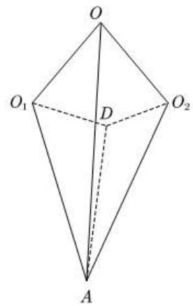

text_image

O
O₁ D O₂
A

知识点十二:坐标法

对于一般多面体的外接球, 可以建立空间直角坐标系, 设球心坐标为 $O(x, y, z)$ , 利用球心到各顶点的距离相等建立方程组, 解出球心坐标, 从而得到球的半径长. 坐标的引入, 使外接球问题的求解从繁琐的定理推论中解脱出来, 转化为向量的计算, 大大降低了解题的难度.

知识点十三: 圆锥圆柱圆台模型

# 1、球内接圆锥

如图1, 设圆锥的高为 $h$ , 底面圆半径为 $r$ , 球的半径为 $\mathbf{R}$ . 通常在 $\triangle \mathrm{OCB}$ 中, 由勾股定理建立方程来计算 $\mathbf{R}$ . 如图2, 当 $\mathrm{PC} > \mathrm{CB}$ 时, 球心在圆锥内部; 如图3, 当 $\mathrm{PC} < \mathrm{CB}$ 时, 球心在圆锥外部. 和本专题前面的内接正四棱锥问题情形相同, 图2和图3两种情况建立的方程是一样的, 故无需提前判断.

由图2、图3可知， $\mathrm{OC} = h - \mathrm{R}$ 或 $\mathbf{R} - h$ ，故 $(h - \mathrm{R})^2 +r^2 = \mathrm{R}^2$ ，所以 $\mathrm{R} = \frac{h^2 + r^2}{2h}$

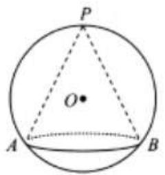

text_image

P
O
A
B

图1

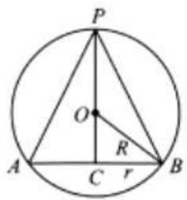

text_image

P
O
R
A
C
r
B

图2

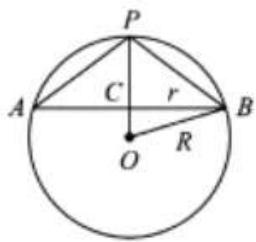

text_image

P
A	C	r	B
O	R

图3

# 2、球内接圆柱

如图, 圆柱的底面圆半径为 r, 高为 h, 其外接球的半径为 R, 三者之间满足 $\left(\frac{h}{2}\right) + r^{2} = R^{2}$ .

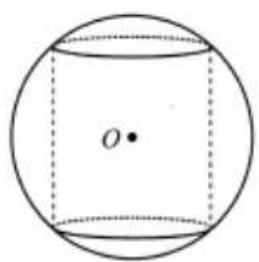

text_image

O•

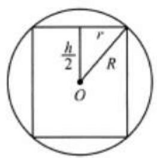

text_image

h/2
r
R
O

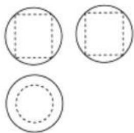

natural_image

Three geometric shapes: a square with dashed outline, a circle with dashed outline, and a dashed circle (no text or symbols)

# 3、球内接圆台

$\mathrm{R}^2 = r_2^2 +\left(\frac{r_2^2 - r_1^2 - h^2}{2h}\right)^2$ ，其中 $r_1,r_2,h$ 分别为圆台的上底面、下底面、高.

知识点十四: 锥体内切球

方法:等体积法,即 $R=\frac{3V_{体积}}{S_{表面积}}$

知识点十五:棱切球

方法: 找切点, 找球心, 构造直角三角形

# 必考题型全归纳

# 1 题型一: 外接球之正方体、长方体模型

2393 (2024·云南昆明·高一校考期末)正方体的表面积为 96, 则正方体外接球的表面积为  
2394 (2024·吉林·高一校联考期末)已知正方体的顶点都在球面上,若正方体棱长为 $\sqrt{3}$ , 则球的表面积为 \_\_\_\_.  
2395 (2024·全国·高一专题练习)已知长方体的顶点都在球 O 表面上,长方体中从一个顶点出发的三条棱长分别为 2, 3, 4 则球 O 的表面积是 \_\_\_\_  
2396 (2024·湖南长沙·高一长郡中学校考期中)长方体 $ABCD-A_{1}B_{1}C_{1}D_{1}$ 的外接球的表面积为 $25\pi, AB=\sqrt{3}, AD=\sqrt{6}$ ，则长方体 $ABCD-A_{1}B_{1}C_{1}D_{1}$ 的体积为 \_\_\_\_.  
2397 (2024·天津静海·高一校考期中)在长方体 $ABCD-A_{1}B_{1}C_{1}D_{1}$ 中，AB=6， $BC=2\sqrt{3}$ ， $BB_{1}=4$ ，则长方体外接球的表面积为 \_\_\_\_。

# 2 题型二:外接球之正四面体模型

2398 (2024·湖北宜昌·宜昌市夷陵中学校考模拟预测)已知正四面体ABCD的表面积为 $2\sqrt{3}$ ，且A，B，C，D四点都在球O的球面上，则球O的体积为\_\_\_\_。

2399 (2024·浙江·高二校联考期中)正四面体的所有顶点都在同一个表面积是 $36\pi$ 的球面上, 则该正四面体的棱长是 \_\_\_\_.

2400 (2024·全国·高三专题练习)棱长为 $\sqrt{2}$ 的正四面体的外接球体积为 \_\_\_\_.

2401 (2024·全国·高一假期作业)正四面体 P-BDE 和边长为 1 的正方体 ABCD-A₁B₁C₁D₁ 有公共顶点 B, D, 则该正四面体 P-BDE 的外接球的体积为 \_\_\_\_.

2402 (2024·安徽池州·高二池州市第一中学校考期中)正四面体 P-ABC 中, 其侧面积与底面积之差为 $2 \sqrt{3}$ , 则该正四面体外接球的体积为 \_\_\_\_.

# 3 题型三: 外接球之对棱相等的三棱锥模型

2403 (2024·高一单元测试)在四面体 ABCD 中, 若 AB = CD = $\sqrt{3}$ , AC = BD = 2, AD = BC = $\sqrt{5}$ , 则四面体 ABCD 的外接球的表面积为 ()

A. $2 \pi$

B. $4\pi$

C. $6\pi$

D. $8\pi$

2404 (2024·河南·开封高中校考模拟预测)已知四面体 ABCD 中, AB = CD = $2\sqrt{5}$ , AC = BD = $\sqrt{29}$ , AD = BC = $\sqrt{41}$ , 则四面体 ABCD 外接球的体积为 ()

A. $45\pi$

B. $\frac{15\sqrt{5}\pi}{2}$

C. $\frac{45\sqrt{5}\pi}{2}$

D. $24 \sqrt{5} \pi$

2405 (2024·广东揭阳·高二校联考期中)在三棱锥 S-ABC 中, SA=BC=5, SB=AC= $\sqrt{41}$ , SC=AB= $\sqrt{34}$ , 则该三棱锥的外接球表面积是 ()

A. $50\pi$

B. $100\pi$

C. $150\pi$

D. $200\pi$

2406 (2024·全国·高三专题练习)如图,在三棱锥 P-ABC 中, $PA=BC=\sqrt{3}$ , $PB=AC=2$ , $PC=AB=\sqrt{5}$ ,则三棱锥 P-ABC 外接球的体积为()

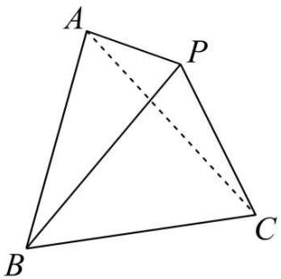

text_image

A
P
B
C

A. $\sqrt{2}\pi$

B. $\sqrt{3}\pi$

C. $\sqrt{6}\pi$

D. $6\pi$

# 题型四:外接球之直棱柱模型

2407 (2024·陕西安康·统考三模)已知矩形ABCD的周长为36,把它沿图中的虚线折成正六棱柱,当这个正六棱柱的体积最大时,它的外接球的表面积为\_\_\_\_.

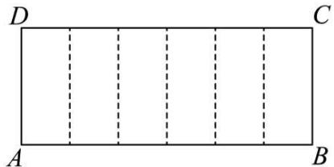

text_image

D
C
A
B

2408 (2024·黑龙江齐齐哈尔·高一齐齐哈尔市第八中学校校考阶段练习)设直三棱柱 ABC - A₁B₁C₁ 的所有顶点都在一个表面积是 $40\pi$ 的球面上，且 AB = AC = AA₁, $\angle BAC = 120^{\circ}$ ，则此直三棱柱的表面积是（）

A. $16 + 8\sqrt{3}$

B. $8 + 12\sqrt{3}$

C. $8 + 16\sqrt{3}$

D. $16 + 12\sqrt{3}$

2409 (2024·全国·高三专题练习)在直三棱柱 ABC-A₁B₁C₁ 中, △ABC 为等腰直角三角形, 若三棱柱 ABC-A₁B₁C₁ 的体积为 32, 则该三棱柱外接球表面积的最小值为 ( )

A. $12\pi$

B. $24\pi$

C. $48\pi$

D. $96\pi$

2410 (2024·湖北咸宁·高二鄂南高中校考阶段练习)已知正三棱柱 ABC-A $_{1}$ B $_{1}$ C $_{1}$ 的体积为 3 $\sqrt{3}$ , 则其外接球表面积的最小值为 ( )

A. $12\pi$

B. $6\pi$

C. $16\pi$

D. $8\pi$

2411 (2024·全国·高三专题练习)在三棱柱 ABC-A₁B₁C₁ 中, 已知 BC=AB=1, ∠BCC₁=90°, AB⊥侧面 BB₁C₁C, 且直线 C₁B 与底面 ABC 所成角的正弦值为 $\frac{2\sqrt{5}}{5}$ , 则此三棱柱的外接球的表面积为 ( )

A. $3\pi$

B. $4\pi$

C. $5\pi$

D. 6π

2412 (2024·新疆昌吉·高三校考期末)已知正三棱柱 ABC - A₁B₁C₁ 所有棱长都为 6, 则此三棱柱外接球的表面积为 ( )

A. $48\pi$

B. $60\pi$

C. $64\pi$

D. $84\pi$

# 题型五:外接球之直棱锥模型

2413 (2024·安徽宣城·高一统考期末)在三棱锥 P-ABC 中, $\triangle ABC$ 是边长为 3 的等边三角形, 侧棱 PA⊥平面 ABC, 且 PA=4, 则三棱锥 P-ABC 的外接球表面积为 \_\_\_\_.

2414 (2024·江苏南京·高二统考期末)在三棱锥 P-ABC 中, PA⊥面 ABC, △ABC 为等边三角形, 且 PA=AB= $\sqrt{3}$ , 则三棱锥 P-ABC 的外接球的表面积为 \_\_\_\_.

2415 (2024·四川成都·高一成都七中校考阶段练习)已知三棱锥 P-ABC, 其中 PA⊥平面 ABC, $\angle BAC = 120^{\circ}$ , PA = AB = AC = 2, 则三棱锥 P-ABC 外接球的表面积为 \_\_\_\_.

2416 (2024·陕西商洛·镇安中学校考模拟预测)在三棱锥 D-ABC 中, $\triangle ABC$ 为等边三角形, DC ⊥ 平面 ABC, 若 AC + CD = 6, 则三棱锥 D-ABC 外接球的表面积的最小值为 \_\_\_\_.

2417 (2024·陕西榆林·高二校考阶段练习)已知三棱锥 S-ABC 中, SA ⊥ 平面 ABC, AB = BC = CA = 2, 异面直线 SC 与 AB 所成角的余弦值为 $\frac{\sqrt{2}}{4}$ , 则三棱锥 S-ABC 的外接球的表面积为 \_\_\_\_.

2418 (2024·江苏镇江·高三江苏省镇江中学校考阶段练习)如图,在四棱锥 P-ABCD 中,底面 ABCD 为菱形, PD ⊥ 底面 ABCD, O 为对角线 AC 与 BD 的交点,若 PD = 3, $\angle APD = \angle BAD = \frac{\pi}{3}$ , 则三棱锥 P-AOD 的外接球的体积为 \_\_\_\_.

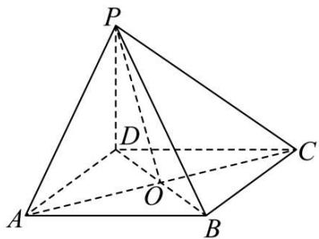

text_image

P
D
C
A
O
B

2419 (2024·四川绵阳·绵阳中学校考二模)在四棱锥 A-BCDE 中, AB⊥平面 BCDE, BC⊥CD, BE⊥DE, ∠CBE = 120°, 且 AB = BC = BE = 2, 则该四棱锥的外接球的表面积为 \_\_\_\_.

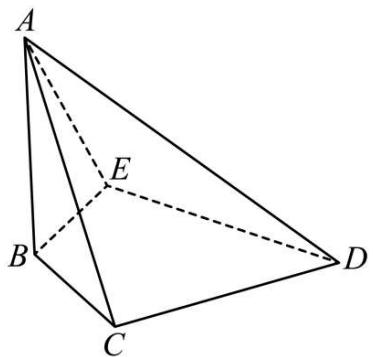

natural_image

Geometric diagram of a tetrahedron with vertices labeled A, B, C, D and point E on edge AD (no text or symbols beyond labels)

2420 (2024·广东韶关·高二统考期末)三棱锥 P-ABC 中, PA ⊥ 平面 ABC, PA = 4, ∠BAC = $\frac{\pi}{3}$ , BC = $\sqrt{3}$ , 则三棱锥 P-ABC 外接球的体积是 \_\_\_\_.

# 6 题型六:外接球之正棱锥、正棱台模型

2421 (2024·山东滨州·高一校考期中)已知正四棱锥 P-ABCD 的底面边长为 $3 \sqrt{2}$ , 侧棱长为 6, 则该四棱锥的外接球的体积为 \_\_\_\_.

2422 (2024·福建福州·高一福建省福州屏东中学校考期末)已知正三棱锥 P-ABC 的顶点都在球 O 的球面上, 其侧棱与底面所成角为 $\frac{\pi}{3}$ , 且 PA = $2\sqrt{3}$ , 则球 O 的表面积为 \_\_\_\_

2423 (2024·河南商丘·高一商丘市第一高级中学校联考期末)在正三棱锥 P-ABC 中, 点 D 在棱 PA 上, 且满足 PD = 2DA, CD ⊥ PB, 若 AB = 3√2 , 则三棱锥 P-BCD 外接球的表面积为 \_\_\_\_.

2424 (2024·云南保山·高一统考期末)已知正三棱锥 P-ABC 的侧棱与底面所成的角为 $60^{\circ}$ , 高为 $4 \sqrt{3}$ , 则该三棱锥外接球的表面积为 \_\_\_\_.

2425 (2024·广东佛山·高一佛山市南海区第一中学校考阶段练习)已知正三棱锥 P-ABC 中, PA=1, AB= $\sqrt{2}$ , 该三棱锥的外接球体积为 \_\_\_\_.

2426 (2024·陕西咸阳·武功县普集高级中学校考模拟预测)如图,在正三棱台 ABC-A₁B₁C₁ 中, AB=2√3, A₁B₁=6, AA₁=4√2, 则正三棱台 ABC-A₁B₁C₁ 的外接球表面积为 ( )

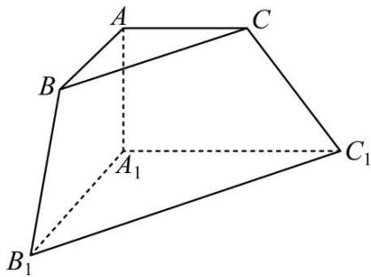

text_image

A
C
B
A₁
C₁
B₁

A. 64

B. $64\pi$

C. $\frac{256\pi}{3}$

D. $\frac{64\pi}{3}$

2427 (2024·辽宁·高三校联考期末)正四棱台高为 2, 上下底边长分别为 2 和 4, 所有顶点在同一球面上, 则球的表面积为 ( )

A. $32\pi$

B. $33\pi$

C. $34\pi$

D. $35\pi$

2428 (2024·贵州六盘水·高一校考阶段练习)已知正四棱锥 P-ABCD 的底面边长为 6,侧棱长为 $6 \sqrt{2}$ ,则该四棱锥外接球的表面积为 \_\_\_\_.

2429 (2024·山西晋中·高三祁县中学校考阶段练习)在正四棱锥 P-ABCD 中, $\sqrt{2}$ PA = $\sqrt{5}$ AB, 若四棱锥 P-ABCD 的体积为 $\frac{256}{3}$ , 则该四棱锥外接球的体积为 \_\_\_\_.

2430 (2024·湖北·高三统考阶段练习)在正四棱台 ABCD-A₁B₁C₁D₁ 中，AB=2A₁B₁，AA₁ =√3．当该正四棱台的体积最大时，其外接球的表面积为 （）

A. $\frac{33\pi}{2}$

B. $33\pi$

C. $\frac{57\pi}{2}$

D. 57π

# 题型七: 外接球之侧棱相等的棱锥模型

2431 (2024·安徽安庆·校联考模拟预测)三棱锥 P-ABC 中, PA=PB=PC=2√3, AB=2AC=6, ∠BAC= $\frac{\pi}{3}$ , 则该三棱锥外接球的表面积为 \_\_\_\_.

2432 (2024·江苏常州·高三华罗庚中学校考阶段练习)在三棱锥 S-ABC 中, SA=SB=CA =CB=AB=2, 二面角 S-AB-C 的大小为 $60^{\circ}$ , 则三棱锥 S-ABC 的外接球的表面积为 \_\_\_\_.

2433 (2024·河北承德·高一校联考阶段练习)已知三棱锥 P-ABC 的各侧棱长均为 $2\sqrt{3}$ ，且 AB = 3, BC = $\sqrt{3}$ , AC = $2\sqrt{3}$ ，则三棱锥 P-ABC 的外接球的表面积为 \_\_\_\_.

2434 (2024·吉林长春·高一长春市解放大路学校校考期末)已知三棱锥 P-ABC 的四个顶点在球 O 的球面上, PA = PB = PC, $\triangle ABC$ 是边长为 $\sqrt{2}$ 的正三角形, E, F 分别是 PA, AB 的中点, $\angle CEF = 90^{\circ}$ , 则球 O 的体积为 \_\_\_\_.

2435 (2024·全国·高三专题练习)已知在三棱锥 S-ABC 中, SA=SB=SC=AB=2, AC⊥BC, 则该三棱锥外接球的体积为

A. $\frac{32\sqrt{3}\pi}{27}$

B. $\frac{4\sqrt{3}\pi}{9}$

C. $\frac{32\pi}{3}$

D. $\frac{16\pi}{3}$

2436 (2024·全国·高一专题练习)如图,在三棱锥 A-BCD 中, AB=BC=AC=CD=2, $\angle BCD=120^{\circ}$ , 二面角 A-BC-D 的大小为 $120^{\circ}$ , 则三棱锥 A-BCD 的外接球的表面积为 ()

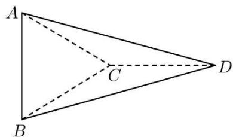

text_image

A
C
B
D

A. $\frac{82\pi}{3}$

B. $\frac{80\pi}{3}$

C. $27\pi$

D. $\frac{244\pi}{9}$

2437 (2024·全国·高三专题练习)在四面体ABCD中， $\mathrm{AB} = \mathrm{AC} = \mathrm{BC} = \mathrm{BD} = \mathrm{CD} = 2$ ，AD $= \sqrt{6}$ ，则四面体ABCD的外接球的表面积为 （）

A. $\frac{16\pi}{3}$

B. $5 \pi$

C. $20\pi s$

D. $\frac{20\pi}{3}$

# 题型八: 外接球之圆锥、圆柱、圆台模型

2438 (2024·浙江台州·高二校联考期末)已知圆锥的底面半径为1,母线长为2,则该圆锥的外接球的体积为\_\_\_\_.

2439 (2024·黑龙江哈尔滨·哈尔滨三中校考模拟预测)已知某圆锥的轴截面为正三角形,侧面积为8π,该圆锥内接于球O,则球O的表面积为\_\_\_\_.

2440 (2024·河北石家庄·高二校考阶段练习)一个圆柱的底面直径与高都等于一个球的直径,则圆柱的表面积与球的表面积之比为 \_\_\_\_.

2441 (2024·重庆·统考模拟预测)如图所示,已知一个球内接圆台,圆台上、下底面的半径分别

为3和4,球的体积为 $\frac{500\pi}{3}$ ，则该圆台的侧面积为()

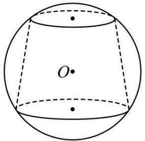

text_image

O

A. $60\pi$

B. $75 \pi$

C. $35\pi$

D. $35 \sqrt{2} \pi$

2442 (2024·云南·高三校联考开学考试)已知圆台的上下底面圆的半径分别为3, 4, 母线长为 $5\sqrt{2}$ ，若该圆台的上下底面圆的圆周均在球O的球面上，则球O的体积为（）

A. $\frac{250}{3}\pi$

B. $\frac{500}{3}\pi$

C. $\frac{100}{3}\pi$

D. $\frac{125}{3}\pi$

2443 (2024·陕西西安·高一校考期中)如图所示,一个球内接圆台,已知圆台上、下底面的半径分别为3和4,球的表面积为100π,则该圆台的体积为()

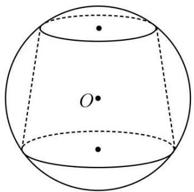

natural_image

Geometric diagram of a sphere with center O and two dashed lines indicating hidden edges (no text or symbols)

A. $\frac{175\pi}{3}$

B. $75\pi$

C. $\frac{238\pi}{3}$

D. $\frac{259\pi}{3}$

# 9 题型九: 外接球之垂面模型

2444 (2024·江西九江·高一校考期末)如图,三棱锥 A-BCD 中,平面 ACD ⊥ 平面 BCD, $\triangle$ ACD 是边长为 2 的等边三角形,BD=CD, $\angle$ BDC=120°.若 A,B,C,D 四点在某个球面上,则该球体的表面积为 \_\_\_\_.

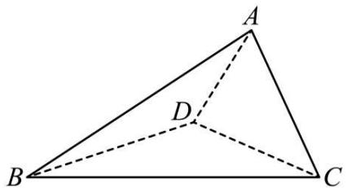

text_image

A
D
B
C

2445 (2024·四川乐山·高二期末)已知正 $\triangle ABC$ 边长为 1, 将 $\triangle ABC$ 绕 BC 旋转至 $\triangle DBC$ , 使得平面 $ABC \perp$ 平面 BCD, 则三棱锥 D-ABC 的外接球表面积为 \_\_\_\_.

2446 (2024·河南平顶山·高一统考期末)在三棱锥 P-ABC 中, 平面 ABC⊥平面 PAB, AC⊥BC, 点 D 是 AB 的中点, PD⊥PB, PB = PD = 2, 则三棱锥 P-ABC 的外接球的表面积为 \_\_\_\_.

2447 (2024·江苏·高一专题练习)如图,在直三棱柱 $ABC-A_{1}B_{1}C_{1}$ 中, $AA_{1}=AB=BC$ . 设

D 为 $A_{1}C$ 的中点, 三棱锥 D-ABC 的体积为 $\frac{9}{4}$ , 平面 $A_{1}BC \perp$ 平面 $ABB_{1}A_{1}$ , 则三棱柱 $ABC-A_{1}B_{1}C_{1}$ 外接球的表面积为 \_\_\_\_.

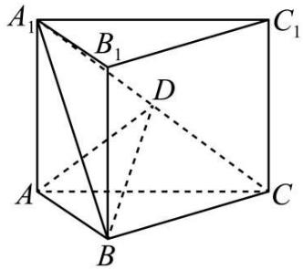

text_image

A₁
B₁
C₁
D
A
B
C

2448 (2024·河南开封·开封高中校考模拟预测)如图, 在三棱锥 P-ABC 中, 平面 PAB ⊥ 平面 ABC, AB = 6, BC = 4, AB ⊥ BC, △PAB 为等边三角形, 则三棱锥 P-ABC 外接球的表面积为 \_\_\_\_.

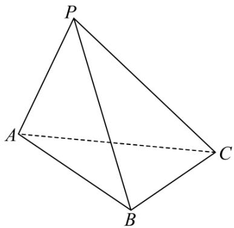

natural_image

Geometric diagram of a tetrahedron with vertices labeled P, A, B, C (no text or symbols beyond labels)

2449 (2024·湖北十堰·高一统考期末)如图,在平面四边形ABCD中, $\angle ADB=\angle ABC=\frac{\pi}{2}$ , BD=BC=4,沿对角线BD将 $\triangle ABD$ 折起,使平面ADB⊥平面BDC,连接AC,得到三棱锥A-BCD,则三棱锥A-BCD外接球表面积的最小值为\_\_\_\_.

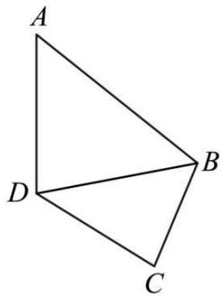

natural_image

Geometric diagram of a quadrilateral ABCD with diagonal BD, no text or symbols present

2450 (2024·河南安阳·高一统考期末)在三棱锥 P-ABC 中, 平面 PAB ⊥ 平面 ABC, PA ⊥ PB, 且 PA = PB = 3√2, △ABC 是等边三角形, 则该三棱锥外接球的表面积为 \_\_\_\_.

2451 (2024·云南临沧·高二校考期中)如图, 已知矩形 ABCD 中, $AB = \frac{4}{3}BC = 8$ , 现沿 AC 折起, 使得平面 ABC ⊥ 平面 ADC, 连接 BD, 得到三棱锥 B-ACD, 则其外接球的体积为 \_\_\_\_.

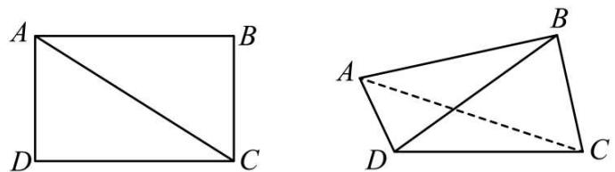

2452 (2024·全国·高三校联考开学考试)在三棱锥 P-ABC 中, 平面 PAB ⊥ 平面 ABC, 底面 $\triangle ABC$ 是边长为 3 的正三角形, 若该三棱锥外接球的表面积为 $15\pi$ , 则该三棱锥体积的最大值为 \_\_\_\_.  
2453 (2024·四川乐山·统考三模)在三棱锥 P-ABC 中, PA=PC=BA=BC=2, 平面 PAC⊥平面 ABC, 则三棱锥 P-ABC 的外接球表面积的最小值为 \_\_\_\_.  
2454 (2024·湖南衡阳·校联考模拟预测)在平面四边形ABCD中, $\angle ADB = 90^{\circ}, \angle ABC = 90^{\circ}$ , $BD = BC = 2$ , 沿对角线BD将△ABD折起, 使平面ADB⊥平面BDC, 得到三棱锥A-BCD, 则三棱锥A-BCD外接球表面积的最小值为 \_\_\_\_.

# 10 题型十:外接球之二面角模型

2455 (2024·广东阳江·高三统考开学考试)在三棱锥 D-ABC 中, AB=BC=2, $\angle ADC=90^{\circ}$ , 二面角 D-AC-B 的平面角为 $30^{\circ}$ , 则三棱锥 D-ABC 外接球表面积的最小值为 ( )

A. $16(2\sqrt{3} - 1)\pi$

B. $16(2\sqrt{3} - 3)\pi$

C. $16(2\sqrt{3} + 1)\pi$

D. $16(2\sqrt{3} + 3)\pi$

2456 (2024·浙江丽水·高二统考期末)在四面体PABC中, PA⊥PB, △ABC是边长为2的等边三角形, 若二面角P-AB-C的大小为120°, 则四面体PABC的外接球的表面积为()

A. $\frac{13\pi}{9}$

B. $\frac{26\pi}{9}$

C. $\frac{52\pi}{9}$

D. $\frac{104\pi}{9}$

2457 (2024·广东·校联考模拟预测)已知四棱锥 S-ABCD, SA⊥平面 ABCD, AD⊥DC, SA=3√3, BC=4, 二面角 S-BC-A 的大小为 $\frac{\pi}{3}$ . 若点 S, A, B, C, D 均在球 O 的表面上, 则该球 O 的表面积为 ( )

A. $\frac{152\pi}{3}$

B. $52\pi$

C. $\frac{160\pi}{3}$

D. 54π

2458 (2024·福建·高一福建师大附中校考期末)在四面体 ABCD 中, $\triangle ABC$ 与 $\triangle BCD$ 都是边长为 6 的等边三角形, 且二面角 A-BC-D 的大小为 $60^{\circ}$ , 则四面体 ABCD 外接球的表面积是 ()

A. $52\pi$

B. $54\pi$

C. $56\pi$

D. $60\pi$

2459 (2024·甘肃张掖·高台县第一中学校考模拟预测)图1为两块大小不同的等腰直角三角形纸板组成的平面四边形ABCD,其中小三角形纸板的斜边AC与大三角形纸板的一条直角边长度相等,小三角形纸板的直角边长为a,现将小三角形纸板ACD沿着AC边折起,使得点D到达点M的位置,得到三棱锥M-ABC,如图2. 若二面角M-AC-B的大小为 $\frac{2\pi}{3}$ ,则所得三棱锥M-ABC的外接球的表面积为()

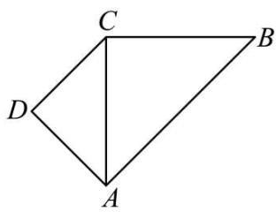

text_image

C
B
D
A

图1

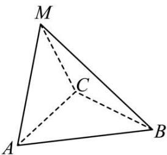

text_image

M
C
A
B

图2

A. $\frac{7\pi}{3}a^{2}$

B. $4\pi a^{2}$

C. $\frac{14\pi}{3}a^{2}$

D. $\frac{7\sqrt{42}\pi}{27} a^2$

2460 (2024·全国·高三专题练习)如图1, 在△PBC中, PA⊥BC, AM⊥PB, BC=6, PA=4, 沿PA将△PAB折起, 使得二面角B-PA-C为 $60^{\circ}$ , 得到三棱锥P-ABC, 如图2, 若AM⊥PC, 则三棱锥P-ABC的外接球的表面积为()

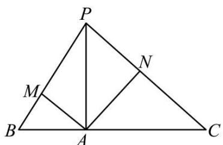

text_image

P
M
N
B
A
C

图1

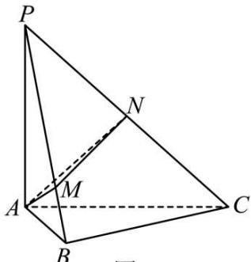

text_image

P
N
A
M
B
C
图2

图2

A. $32 \pi$

B. $36\pi$

C. 64π

D. $80\pi$

2461 (2024·湖南岳阳·统考三模)已知三棱锥 D-ABC 的所有顶点都在球 O 的球面上, AD ⊥ BD, AC ⊥ BC, ∠DAB = ∠CBA = 30°, 二面角 D-AB-C 的大小为 60°, 若球 O 的表面积等于 36π, 则三棱锥 D-ABC 的体积等于 ( )

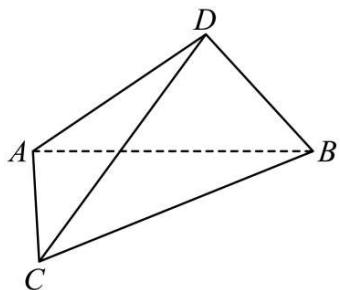

natural_image

Geometric diagram of a tetrahedron with vertices labeled A, B, C, D (no text or symbols beyond labels)

A. $\sqrt{3}$

B. $\frac{27\sqrt{3}}{8}$

C. $\sqrt{7}$

D. $\frac{2\sqrt{7}}{3}$

2462 (2024·全国·高一专题练习)在三棱锥 A-BCD 中, AB⊥BC, BC⊥CD, CD=2AB=2BC=4, 二面角 A-BC-D 为 $60^{\circ}$ , 则三棱锥 A-BCD 外接球的表面积为 ( )

A. $16\pi$

B. $24\pi$

C. $18\pi$

D. $20\pi$

# 11 题型十一: 外接球之侧棱为球的直径模型

2463 (2024·贵州黔东南·高二凯里一中校考期中)已知三棱锥 S-ABC 的所有顶点都在球 O 的球面上, SC 是球 O 的直径. 若平面 SCA ⊥ 平面 SCB, SA = AC, SB = BC, 三棱锥 S-ABC 的体积为 $\frac{8}{3}$ , 则球 O 的体积为 ( )

A. $4 \pi$

B. $\frac{20\pi}{3}$

C. $6\pi$

D. $\frac{32\pi}{3}$

2464 (2024·四川巴中·高三统考期末)已知三棱锥 S-ABC 的体积为 $\frac{1}{2}$ ，AC=BC=1， $\angle ACB=120^{\circ}$ ，若 SC 是其外接球的直径，则球的表面积为（）

A. $4\pi$

B. $6\pi$

C. $8\pi$

D. $16\pi$

2465 (2024·重庆九龙坡·高二重庆市育才中学校考期中)已知三棱锥 S-ABC 的所有顶点都在球 O 的球面上,SA 为球的直径, $\Delta ABC$ 是边长为 2 的等边三角形,三棱锥 S-ABC 的体积为 $\frac{2\sqrt{2}}{3}$ ,则球的表面积为()

A. $8\pi$

B. $\frac{8\sqrt{2}\pi}{3}$

C. $16\pi$

D. $\frac{128\pi}{3}$

2466 (2024·重庆·校联考一模)已知三棱锥 S-ABC 各顶点均在球 O 上, SB 为球 O 的直径, 若 AB=BC=2, $\angle ABC=\frac{2\pi}{3}$ , 三棱锥 S-ABC 的体积为 4, 则球 O 的表面积为

A. $120\pi$

B. $64\pi$

C. $32\pi$

D. $16\pi$

2467 (2024·河北唐山·统考三模)三棱锥 S-ABC 的四个顶点都在球面上, SA 是球的直径, AC ⊥ AB, BC = SB = SC = 2, 则该球的表面积为 ( )

A. $4 \pi$

B. $6\pi$

C. $9\pi$

D. $12\pi$

2468 (2024·河南南阳·统考模拟预测)已知三棱锥 P-ABC 的所有顶点都在球 O 的球面上，PC 是球 O 的直径. 若平面 PCA ⊥ 平面 PCB, PA = AC, PB = BC, 三棱锥 P-ABC 的体积为 a，则球 O 的体积为

A. $2 \pi a$

B. $4\pi a$

C. $\frac{2}{3}\pi a$

D. $\frac{4}{3}\pi a$

2469 (2024·福建莆田·高三统考期中)三棱锥 S-ABC 的各顶点均在球 O 上, SC 为该球的直径, AC=BC=1, $\angle ACB=120^{\circ}$ , 三棱锥 S-ABC 的体积为 $\frac{1}{2}$ , 则球的表面积为

A. $4\pi$

B. $6\pi$

C. $8\pi$

D. $16\pi$

2470 (2024·全国·高三专题练习)已知三棱锥 P-ABC 的四个顶点均在某球面上, PC 为该球的直径, $\triangle ABC$ 是边长为 4 的等边三角形, 三棱锥 P-ABC 的体积为 $\frac{16}{3}$ , 则该三棱锥的外接球的表面积为 ( )

A. $\frac{16}{3}\pi$

B. $\frac{40}{3}\pi$

C. $\frac{64}{3}\pi$

D. $\frac{80}{3}\pi$

2471 (2024·湖南长沙·高三长郡中学校考阶段练习)已知 SC 是球 O 的直径, A,B 是球 O 球面上的两点, 且 CA = CB = 1, AB = $\sqrt{3}$ , 若三棱锥 S - ABC 的体积为 1, 则球 O 的表面积为

A. $4\pi$

B. $13\pi$

C. $16\pi$

D. 52π

# 12 题型十二: 外接球之共斜边拼接模型

2472 (2022·江西·高二阶段练习(理))如图,在四棱锥 P-ABCD 中,底面是菱形,PB⊥底面 ABCD,O 是对角线 AC 与 BD 的交点,若 PB=1, $\angle APB=\frac{\pi}{3}$ ,则三棱锥 P-BOC 的外

接球的体积为

( )

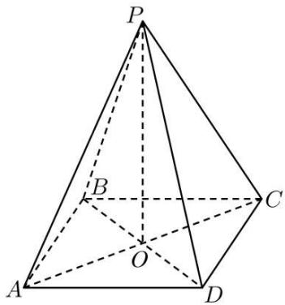

text_image

P
B
C
A
O
D

A. $\frac{2\pi}{3}$

B. $\frac{4\pi}{3}$

C. $\frac{5\pi}{3}$

D. $2 \pi$

2473 (2022·安徽·芜湖一中高二期中)已知三棱锥 P-ABC 中, PA=1, PB=3, PC= $\sqrt{5}$ , AB=2 $\sqrt{2}$ , CA=CB=2, 则此三棱锥的外接球的表面积为 ()

A. $\frac{14\pi}{3}$

B. $\frac{28\pi}{3}$

C. $9\pi$

D. $12\pi$

2474 (2022·江西赣州·高二期中(理))在三棱锥 A-SBC 中, $AB=\sqrt{10}$ , $\angle ASC=\angle BSC=\frac{\pi}{4}$ , AC=AS, BC=BS 若该三棱锥的体积为 $\frac{\sqrt{15}}{3}$ , 则三棱锥 A-SBC 外球的体积为 ( )

A. $\pi$

B. $\frac{\pi}{3}$

C. $\sqrt{5}\pi$

D. $4 \sqrt{3} \pi$

2475 在矩形 ABCD 中, AB = 4, BC = 3, 沿 AC 将矩形 ABCD 折成一个直二面角 B - AC - D, 则四面体 ABCD 的外接球的体积为 ( )

A. $\frac{125}{12}\pi$

B. $\frac{125}{9}\pi$

C. $\frac{125}{6}\pi$

D. $\frac{125}{3}\pi$

2476 三棱锥 P-ABC 中, 平面 PAC⊥平面 ABC, AC=2, PA⊥PC, AB⊥BC, 则三棱锥 P-ABC 的外接球的半径为 \_\_\_\_

# 题型十三:外接球之坐标法模型

2477 (2024·浙江·高二校联考阶段练习)空间直角坐标系 O-xyz 中, A( $\sqrt{2}$ , 0, 0), B(0, 3, 0), C(0, 0, 5), D( $\sqrt{2}$ , 3, 5), 则四面体 ABCD 外接球体积是 ()

A. $25\pi$

B. $36\pi$

C. $\frac{108}{3}\pi$

D. 288π

2478 (2024·贵州·统考模拟预测)如图,某环保组织设计一款苗木培植箱,其外形由棱长为2(单位:m)的正方体截去四个相同的三棱锥(截面为等腰三角形)后得到.若将该培植箱置于一球形环境中,则该球表面积的最小值为\_\_\_\_m²

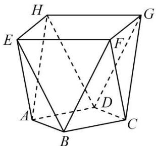

text_image

Geometric diagram of a polyhedron with labeled vertices and internal diagonals

2479 (2024·河南开封·开封高中校考一模)如图,在三棱锥 A-BCD 中, AD⊥AB, AB=AD=2,△ACD 为等边三角形,三棱锥 A-BCD 的体积为 $\frac{2}{3}$ , 则三棱锥 A-BCD 外接球的表面积为 \_\_\_\_.

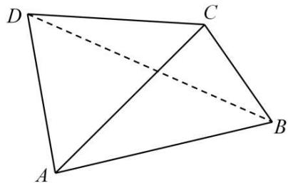

natural_image

Geometric diagram of a quadrilateral ABCD with diagonals AC and BD, no text or labels present

2480 (2024·全国·高三专题练习)如图①, 在 Rt△ABC 中, C = $\frac{\pi}{2}$ , AC = BC = 2, D, E 分别为 AC, AB 的中点, 将 △ADE 沿 DE 折起到 △A₁DE 的位置, 使 A₁D ⊥ CD, 如图②. 若 F 是 A₁B 的中点, 则四面体 FCDE 的外接球体积是 ( )

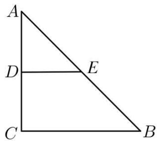

text_image

A
D
E
C
B

①

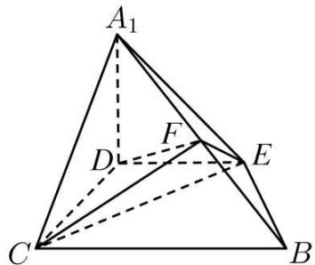

text_image

A₁
D
F
E
C
B

②

A. $2 \pi$

B. $\frac{\sqrt{2}}{3}\pi$

C. $\frac{\sqrt{2}}{6}\pi$

D. $\frac{\sqrt{2}}{12}\pi$

2481 (2024·湖北武汉·高一武汉外国语学校(武汉实验外国语学校)期末)如图,已知四棱锥E-ABCD,底面ABCD是边长为3的正方形,AE⊥面ABCD, $\overrightarrow{EQ}=2\overrightarrow{QD}$ , $\overrightarrow{EP}=2\overrightarrow{PB}$ , $\overrightarrow{ER}=\frac{1}{2}\overrightarrow{RC}$ ,若 $RP=RQ=\sqrt{6}$ ,则四棱锥E-ABCD外接球表面积为()

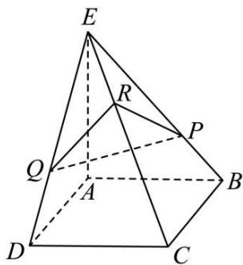

text_image

E
R
P
Q
A
B
D
C

A. $44\pi$

B. $54\pi$

C. $176\pi$

D. $216\pi$

2482 (2024·河南郑州·模拟预测)在长方体中 $ABCD-A_{1}B_{1}C_{1}D_{1}$ 中， $AB=AA_{1}=1, AD=2, M$ 是棱 $B_{1}C_{1}$ 的中点，过点 B, M, $D_{1}$ 的平面 $\alpha$ 交棱 AD 于点 N，点 P 为线段 $D_{1}N$ 上一动点，则三棱锥 $P-BB_{1}M$ 外接球表面积的最小值为 \_\_\_\_.

2483 (2024·湖南郴州·高二统考期末)如图,棱长为2的正方体 $ABCD-A_{1}B_{1}C_{1}D_{1}$ 中,E,F分别为棱 $A_{1}D_{1}$ 、 $AA_{1}$ 的中点,G为面对角线 $B_{1}C$ 上一个动点,则三棱锥 $A_{1}-EFG$ 的外接球表面积的最小值为\_\_\_\_.

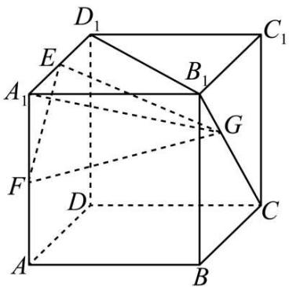

text_image

D₁
E
A₁
B₁
C₁
G
F
D
C
A
B

2484 (2024·广东阳江·高三阳春市第一中学阶段练习)已知正方体 $ABCD-A_{1}B_{1}C_{1}D_{1}$ 的棱长为 2，点 P 是线段 $B_{1}D_{1}$ 上的动点，则三棱锥 P-ABC 的外接球半径的取值范围为 \_\_\_\_.

# 14 题型十四: 外接球之空间多面体

2485 (2024·全国·高三专题练习)自2015年以来,贵阳市着力建设“千园之城”,构建贴近生活、服务群众的生态公园体系,着力将“城市中的公园”升级为“公园中的城市”。截至目前,贵阳市公园数量累计达到1025个。下图为贵阳市某公园供游人休息的石凳,它可以看做是一个正方体截去八个一样的四面体得到的,如果被截正方体的的棱长为 $20\sqrt{2}$ cm,则石凳所对应几何体的外接球的表面积为\_\_\_\_cm²。

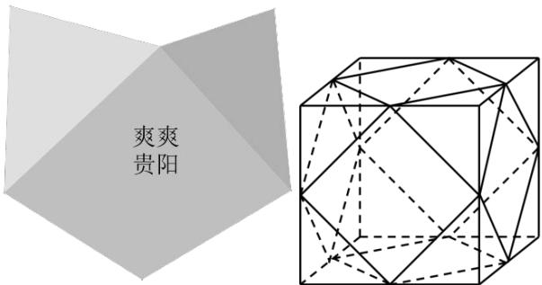

text_image

爽爽
贵阳

2486 (2024·山东青岛·高一山东省青岛第五十八中学校考阶段练习)截角四面体是一种半正八面体,可由四面体经过适当的截角,即截去四面体的四个顶点所产生的多面体.如图所示,将棱长为3的正四面体沿棱的三等分点作平行于底面的截面得到所有棱长均为1的截角四面体,则该截角四面体的外接球表面积为\_\_\_\_.

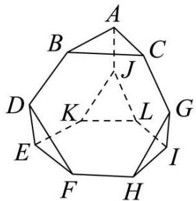

text_image

A
B
C
J
D
K
L
G
E
F
H
I

2487 (2024·宁夏银川·银川二中校考一模)把一个棱长都是6的正四棱锥(底面是正方形,顶点在底面的射影是正方形的中心)每条棱三等分,沿与正四棱锥顶点相邻的三等分点做截面,将正四棱锥截去四个小正四面体和一个小正四棱锥(如图所示),则剩下的几何体的外接球的表面积等于\_\_\_\_.

natural_image

Geometric diagram of a polyhedron with shaded triangular faces (no text or labels)

2488 (2024·山东济南·高一山东省济南市莱芜第一中学校考阶段练习)取两个相互平行且全等的正 n 边形, 将其中一个旋转一定角度, 连接这两个多边形的顶点, 使得侧面均为等边三角形, 我们把这种多面体称作“n 角反棱柱”. 当 n=4 时, 得到如图所示棱长均为 2 的 “四角反棱柱”, 则该“四角反棱柱”外接球的表面积等于 ( )

text_image

A. 11π
B. (8+2√2)π
C. (8+2√3)π
D. 11√11/6π

# 15 题型十五:与球有关的最值问题

2489 (2024·江西抚州·统考模拟预测)如图,直三棱柱 ABC-A'B'C' 中,AC⊥BC,AC=2√5,BC=4,棱柱的侧棱足够长,点 P 在棱 BB' 上,点 C₁ 在 CC' 上,且 PA⊥PC₁,则当 △APC₁ 的面积取最小值时,三棱锥 P-ABC 的外接球的体积为 \_\_\_\_.

text_image

C'
A'
B'
C₁
P
C
B
A

2490 (2024·全国·学军中学校联考二模)如图,直三棱柱 $ABC-A_{1}B_{1}C_{1}$ 中, $\angle BCA=\frac{3}{4}\pi,AC=\sqrt{2},BC=2$ , 点 P 在棱 $BB_{1}$ 上, 且 $PA\perp PC_{1}$ , 当 $\triangle APC_{1}$ 的面积取最小值时, 三棱锥 P-ABC 的外接球的表面积为 \_\_\_\_.

text_image

C₁
B₁
A₁
C
P
B
A

2491 (2024·湖南长沙·高三长沙一中校考阶段练习)正方体 ABCD-A $_{1}$ B $_{1}$ C $_{1}$ D $_{1}$ 的棱长为 2，点 E ∈ 平面 AA $_{1}$ B $_{1}$ B，点 F 是线段 AA $_{1}$ 的中点，若 D $_{1}$ E ⊥ CF，则当 △EBC 的面积取得最小值时，三棱锥 E-BCC $_{1}$ 外接球的体积为 \_\_\_\_.

2492 (2024·广东深圳·高三深圳中学校考开学考试)如图, 直三棱柱 $\mathrm{ABC} - \mathrm{A}_{1}\mathrm{B}_{1}\mathrm{C}_{1}$ 中, $\mathrm{AC} \perp \mathrm{BC}, \mathrm{AC} = \sqrt{7}, \mathrm{BC} = 3$ , 点 $\mathrm{P}$ 在棱 $\mathrm{BB}_{1}$ 上, 且 $\mathrm{PA} \perp \mathrm{PC}_{1}$ , 当 $\triangle \mathrm{APC}_{1}$ 的面积取最小值时, 三棱锥 $\mathrm{P} - \mathrm{ABC}$ 的外接球的表面积为 \_\_\_\_.

text_image

C₁
B₁
A₁
P
C
B
A

2493 (2024·黑龙江齐齐哈尔·高一校联考期末)已知三棱锥 P-ABC 的四个顶点均在同一个球面上,底面 $\triangle ABC$ 为等腰直角三角形且 BA=BC=4,若该三棱锥体积的最大值为 $\frac{32}{3}$ ,则其外接球的表面积为 \_\_\_\_.

2494 (2024·四川泸州·高三四川省泸县第一中学校考阶段练习)已知四棱锥 S-ABCD 中,底面 ABCD 为正方形,侧面 SAB 为等边三角形, AB=3 ,则当四棱锥的体积取得最大值时,其外接球的表面积为 \_\_\_\_.

2495 (2024·湖南长沙·高三宁乡一中校考阶段练习)在三棱锥 P-ABC 中, PA ⊥ 底面 ABC, PA = 2, AB = AC = BC = 2m, M 为 AC 的中点, 若三棱锥 P-ABM 的顶点均在球 O 的球面上, D 是球 O 上一点, 且三棱锥 D-PAC 体积的最大值是 $\frac{7\sqrt{3}}{3}$ , 则球 O 的体积为 \_\_\_\_.

2496 (2024·江西南昌·南昌十中校考模拟预测)点 A, B, C, D 在同一个球的球面上, AB = BC = AC = $\sqrt{3}$ , 若四面体 ABCD 体积的最大值为 $\sqrt{3}$ , 则这个球的表面积为 \_\_\_\_.

# 16 题型十六:内切球之正方体、正棱柱模型

2497 (2024·广东肇庆·高一校考阶段练习)棱长为 2 的正方体 ABCD - A₁B₁C₁D₁ 的内切球的球心为 O, 则球 O 的体积为 ( )

A. $\frac{2}{3}\pi$

B. $\frac{4}{3}\pi$

C. $2\pi$

D. $\frac{8}{3}\pi$

2498 (2024·河北邯郸·高一大名县第一中学校考阶段练习)已知直三棱柱 $ABC-A_{1}B_{1}C_{1}$ 存在内切球, 若 AB=3, BC=4, AB⊥BC, 则该三棱柱外接球的表面积为 ( )

A. $26\pi$

B. $27\pi$

C. $28\pi$

D. $29\pi$

2499 (2024·山西太原·高一校考阶段练习)已知正方体的内切球(球与正方体的六个面都相切)的体积是 $\frac{32}{3}\pi$ ，则该正方体的体积为()

A. 4

B. 16

C. 8

D. 64

2500 (2024·全国·高一专题练习)若一个正三棱柱存在外接球与内切球,则它的外接球与内切球体积之比为 ( )

A. $3 \sqrt{3}: 1$

B. 5:1

C. $5\sqrt{5}:1$

D. 6:1

2501 (2024·辽宁·高二沈阳二中校联考开学考试)在正三棱柱 ABC-A'B'C' 中, D 是侧棱 BB' 上一点, E 是侧棱 CC' 上一点, 若线段 AD+DE+EA' 的最小值是 $2\sqrt{7}$ , 且其内部存在一个内切球 (与该棱柱的所有面均相切), 则该棱柱的外接球表面积为 ( )

A. $4\pi$

B. $5\pi$

C. $6\pi$

D. $8\pi$

2502 (2024·全国·高一专题练习)若一个正六棱柱既有外接球又有内切球,则该正六棱柱的外接球和内切球的表面积的比值为()

A. 2:1

B. 3:2

C. 7:3

D. 7:4

2503 (2024·全国·高三专题练习)已知点 O 到直三棱柱 ABC-A₁B₁C₁ 各面的距离都相等, 球 O 是直三棱柱 ABC-A₁B₁C₁ 的内切球, 若球 O 的表面积为 16π, △ABC 的周长为 4, 则三棱锥 A₁-ABC 的体积为 ( )

A. $\frac{4}{3}$

B. $\frac{16}{3}$

C. $\frac{8\sqrt{3}}{3}$

D. $\frac{16\sqrt{3}}{3}$

# 题型十七:内切球之正四面体模型

2504 (2024·高一课时练习)边长为1的正四面体内切球的体积为 （）

A. $\frac{\sqrt{6}\pi}{8}$

B. $\frac{\sqrt{2}}{12}$

C. $\frac{\pi}{6}$

D. $\frac{\sqrt{6}\pi}{216}$

2505 (2024·全国·高三专题练习)已知正四面体的棱长为12，则其内切球的表面积为（）

A. $12 \pi$

B. $16\pi$

C. $20\pi$

D. $24\pi$

2506 (2024·江苏·高一专题练习)正四面体 A-BCD 的棱长为 $2\sqrt{2}$ , 则它的内切球与外接球的表面积之比为 ( )

A. $\frac{3}{4}$

B. $\frac{1}{4}$

C. $\frac{1}{8}$

D. $\frac{1}{9}$

# 题型十八:内切球之棱锥模型

2507 (2024·安徽·高二马鞍山二中校联考阶段练习)已知矩形ABCD中, AB=2, AD=1, 沿着对角线AC将△ACD折起, 使得点D不在平面ABC内, 当AD⊥BC时, 求该四面体ABCD的内切球和外接球的表面积比值为()

A. $\frac{18-9\sqrt{3}}{5}$

B. $\frac{19-9\sqrt{3}}{5}$

C. $\frac{21-12\sqrt{3}}{5}$

D. $\frac{24-12\sqrt{3}}{5}$

2508 (2024·广西·高二校联考期中)已知四棱锥 P-ABCD 的各棱长均为 2, 则其内切球表面积为
()

text_image

P
D
A
B
C

A. $(8 - 2\sqrt{3})\pi$

B. $(8 - 4\sqrt{3})\pi$

C. $(8 - 6\sqrt{3})\pi$

D. $(8 - 3\sqrt{3})\pi$

2509 (2024·湖北武汉·高二校联考阶段练习)如图,在三棱锥 V-ABC 中, $\angle AVB = \angle BVC = \angle CVA = 60^{\circ}$ , VA = VB = VC,若三棱锥 V-ABC 的内切球 O 的表面积为 $6\pi$ ,则此三棱锥的体积为()

text_image

V
O
A
C
B

A. $6 \sqrt{3}$

B. $18 \sqrt{3}$

C. $6 \sqrt{2}$

D. $18 \sqrt{2}$

2510 (2024·河南濮阳·高一濮阳一高校考阶段练习)在三棱锥 S-ABC 中, SA ⊥ 平面 ABC, $\angle ABC = 90^{\circ}$ , 且 SA = 3, AB = 4, AC = 5, 若球 O 在三棱锥 S-ABC 的内部且与四个面都相切 (称球 O 为三棱锥 S-ABC 的内切球), 则球 O 的表面积为 ( )

A. $\frac{16\pi}{9}$

B. $\frac{4\pi}{9}$

C. $\frac{32\pi}{27}$

D. $\frac{16\pi}{81}$

2511 (2024·福建龙岩·统考模拟预测)如图,已知正方体的棱长为2,以其所有面的中心为顶点的多面体为正八面体,则该正八面体的内切球表面积为()

natural_image

Geometric diagram of a cube with internal dashed lines forming a 3D polyhedron (no text or symbols)

A. $\frac{\pi}{6}$

B. $\pi$

C. $\frac{4\pi}{3}$

D. $4\pi$

2512 (2024·浙江宁波·高一慈溪中学校联考期末)在《九章算术》中,将四个面都是直角三角形的四面体称为鳖臑. 在鳖臑 A-BCD 中, AB⊥平面 BCD, BC⊥CD, 且 AB=BC=CD=1, 则其内切球表面积为 ()

A. $3\pi$

B. $\sqrt{3}\pi$

C. $(3 - 2\sqrt{2})\pi$

D. $(\sqrt{2} - 1)\pi$

# 19 题型十九:内切球之圆锥、圆台模型

2513 (2024·全国·高三专题练习)在 Rt△ABC 中, CA = 1, CB = 2. 以斜边 AB 为旋转轴旋转一周得到一个几何体, 则该几何体的内切球的体积为 ( )

A. $\frac{\sqrt{2}\pi}{3}$

B. $\frac{8\sqrt{2}\pi}{3}$

C. $\frac{32\pi}{81}$

D. $\frac{4\pi}{81}$

2514 (2024·天津·统考二模)已知一个圆锥的高为4,底面直径为6,其内有一球与该圆锥的侧面和底面都相切,则此球的体积为()

A. $12\pi$

B. $9\pi$

C. $\frac{9}{2}\pi$

D. $3\pi$

2515 (2024·全国·高一专题练习)已知某圆锥的母线长为2,其轴截面为直角三角形,则下列关于该圆锥的说法中错误的是()

A. 圆锥的体积为 $\frac{2\sqrt{2}}{3}\pi$   
B. 圆锥的表面积为 $2 \sqrt{2} \pi$   
C. 圆锥的侧面展开图是圆心角为 $\sqrt{2}\pi$ 的扇形  
D. 圆锥的内切球表面积为 $(24 - 16\sqrt{2})\pi$

2516 (2024·贵州贵阳·高二校考阶段练习)已知圆锥内切球(与圆锥侧面、底面均相切的球)的半径为2,当该圆锥的表面积最小时,其外接球的表面积为()

A. $81\pi$

B. $96\pi$

C. $108\pi$

D. $126\pi$

2517 (2024·全国·高一专题练习)已知圆锥的底面半径为2,高为 $4\sqrt{2}$ ,则该圆锥的内切球表面积为()

A. $4\pi$

B. $4 \sqrt{2} \pi$

C. $8\sqrt{2}\pi$

D. 8π

2518 (2024·安徽宣城·高二校联考开学考试)如图,正四棱台 $ABCD-A_{1}B_{1}C_{1}D_{1}$ 的上、下底面边长分别为 $2\sqrt{2},4,E,F,G,H$ 分别为 $AB,BC,CD,DA$ 的中点,8个顶点 $E,F,G,H,A_{1},B_{1},C_{1},D_{1}$ 构成的十面体恰有内切球,则该内切球的表面积为()

text_image

D₁
C₁
A₁
B₁
D
G
H
F
C
A
E
B

A. $8 \sqrt{2} \pi$

B. $6\sqrt{2}\pi$

C. $4\sqrt{2}\pi$

D. $2 \sqrt{2} \pi$

2519 (2024·湖北咸宁·高二统考期末)已知球 O 内切于圆台 (即球与该圆台的上、下底面以及侧面均相切), 且圆台的上、下底面半径 $r_1: r_2 = 2:3$ , 则圆台的体积与球的体积之比为 ( )

text_image

O₁ r₁
O
O₂ r₂

A. $\frac{3}{2}$

B. $\frac{19}{12}$

C. 2

D. $\frac{19}{6}$

# 20 题型二十:棱切球之正方体、正棱柱模型

2520 (2024·山东菏泽·高一山东省鄄城县第一中学校考阶段练习)已知球 $O_{1}$ 与一正方体的各条棱相切,同时该正方体内接于球 $O_{2}$ ,则球 $O_{1}$ 与球 $O_{2}$ 的表面积之比为()

A. 2:3

B. 3:2

C. $\sqrt{2}:\sqrt{3}$

D. $\sqrt{3}:\sqrt{2}$

2521 (2024·全国·高三专题练习)已知正三棱柱 ABC-A₁B₁C₁ 的体积为 18, 若存在球 O 与三棱柱 ABC-A₁B₁C₁ 的各棱均相切, 则球 O 的表面积为 ( )

A. $8\pi$

B. $12\pi$

C. $16\pi$

D. $18\pi$

2522 (2024·全国·高三专题练习)已知球与棱长为2的正方体的各条棱都相切,则球内接圆柱的侧面积的最大值为()

A. $2 \pi$

B. $4 \pi$

C. $6\pi$

D. $20\pi$

2523 (吉林省吉林市 2024 届高三第四次数学(理)调研试题)已知正三棱柱 $\mathrm{ABC}-\mathrm{A}_{1}\mathrm{B}_{1}\mathrm{C}_{1}$ (底面为正三角形且侧棱与底面垂直), 它的底面边长为 2, 若存在一个球与此正三棱柱的所有棱都相切, 则此正三棱柱的侧棱长为 \_\_\_\_.

2524 (福建省三明市 2024 届高三上学期期末质量检测数学试题)已知直三棱柱 ABC - A₁B₁C₁ 的侧棱长为 $2\sqrt{3}$ , 底面为等边三角形. 若球 O 与该三棱柱的各条棱都相切, 则球 O 的体积为 \_\_\_\_.

2525 已知正三棱柱 ABC - A₁B₁C₁, 若有一半径为 4 的球与正三棱柱的各条棱均相切, 则正三棱柱的侧棱长为 \_\_\_\_.

2526 (广东省茂名市五校联盟 2024 届高三上学期第二次联考数学试题)已知正三棱柱的高等于 1. 一个球与该正三棱柱的所有棱都相切, 则该球的体积为 ( )

A. $\frac{\pi}{6}$

B. $\frac{4\sqrt{3}\pi}{27}$

C. $\frac{4\pi}{3}$

D. $\frac{4\sqrt{3}\pi}{3}$

# 21 题型二十一:棱切球之正四面体模型

2527 (2024·全国·高一期中)已知某棱长为 $2\sqrt{2}$ 的正四面体的各条棱都与同一球面相切,则该球与此正四面体的体积之比为()

A. $\frac{\pi}{2}$

B. $\frac{\pi}{3}$

C. $\frac{\sqrt{3}\pi}{3}$

D. $\frac{\sqrt{2}\pi}{2}$

2528 (2024·陕西西安·高一校联考期中)所有棱长均相等的三棱锥构成一个正四面体,则该正

四面体的内切球与外接球的体积之比为 （）

A. $\frac{1}{27}$

B. $\frac{1}{3\sqrt{3}}$

C. $\frac{1}{2\sqrt{2}}$

D. $\frac{1}{8}$

2529 (2024·江西南昌·高二进贤县第一中学校考期中)球与棱长为 $3\sqrt{2}$ 的正四面体各条棱都相切，则该球的表面积为（）

A. $6\pi$

B. $18\pi$

C. $9\pi$

D. $10\pi$

2530 (2024·贵州贵阳·校联考模拟预测)已知球 O 的表面积为 $9\pi$ ，若球 O 与正四面体 S-ABC 的六条棱均相切，则此四面体的体积为（）

A. 9

B. $3 \sqrt{2}$

C. $\frac{9\sqrt{2}}{2}$

D. $\frac{9\sqrt{2}}{8}$

2531 (2024·全国·高三专题练习)正四面体 P-ABC 的棱长为 4, 若球 O 与正四面体的每一条棱都相切, 则球 O 的表面积为 ( )

A. $2 \pi$

B. $8\pi$

C. $\frac{8\sqrt{2}}{3}\pi$

D. $12\pi$

# 22

# 题型二十二:棱切球之正棱锥模型

2532 (河南省名校2022-2024学年高二下学期5月联考数学试题)已知棱长均为 $2\sqrt{3}$ 的多面体ABC-A $_{1}$ B $_{1}$ C $_{1}$ 由上、下全等的正四棱锥A $_{1}$ -ABB $_{1}$ C $_{1}$ 和C-ABB $_{1}$ C $_{1}$ 拼接而成,其中四边形ABB $_{1}$ C $_{1}$ 为正方形,如图所示,记该多面体的外接球半径为R,该多面体的棱切球(与该多面体的所有棱均相切的球)的半径为r,则 $\frac{R}{r}=$ \_\_\_\_.

text_image

A₁
A
C₁
B
B₁
C

2533 (河南省多所名校 2022-2024 学年高三下学期 3 月月考文科数学试题) 在正三棱锥 P-ABC 中, AB = 6, PA = 4√3, 若球 O 与三棱锥 P-ABC 的六条棱均相切, 则球 O 的表面积为 \_\_\_\_.

2534 (安徽省马鞍山市 2024 届高三下学期第二次教学质量监测理科数学试题)球被平面截下的一部分叫做球缺, 截面叫做球缺的底面, 垂直于截面的直径被截下的线段长叫做球缺的高, 球缺的体积公式 $V = \frac{\pi}{3}(3R - h)h^2$ , 其中 R 为球的半径, $h$ 为球缺的高. 若一球与一所有棱长为 6 的正四棱锥的各棱均相切, 则该球与该正四棱锥的公共部分的体积为 \_\_\_\_.

2535 (2024·全国·高三专题练习)正三棱锥 P-ABC 的底面边长为 $2\sqrt{3}$ ，侧棱长为 $2\sqrt{2}$ ，若球 H 与正三棱锥所有的棱都相切，则这个球的表面积为（）

A. $\frac{17}{4}\pi$

B. $(44 - 16\sqrt{6})\pi$

C. $\frac{9}{2}\pi$

D. $32\pi$

2536 (2024·全国·高三专题练习)在三棱锥 A-BCD 中, AB, AC, AD 两两垂直, AB=AC =AD=2, 若球与三棱锥各棱均相切, 则该球的表面积为 ( )

A. $4\pi$

B. $8\pi$

C. $(24 - 16\sqrt{2})\pi$

D. $(48 - 32\sqrt{2})\pi$

2537 (2024·湖北武汉·高一武汉市第一中学校考阶段练习)与正三棱锥6条棱都相切的球称为正三棱锥的棱切球.若正三棱锥的底面边长为 $2\sqrt{6}$ ，侧棱长为3，则此正三棱锥的棱切球半径为()

A. $\sqrt{6} - 2$

B. $\sqrt{6} + 2$

C. $6 \sqrt{2} - 4 \sqrt{3}$

D. $6 \sqrt{2} + 4 \sqrt{3}$

2538 (2024·江苏·高一专题练习)在正三棱锥 P-ABC 中, AB=6, PA=4√3, 若球 O 与三棱锥 P-ABC 的六条棱均相切, 则球 O 的表面积为 ( )

A. $(16 - 8\sqrt{3})\pi$

B. $(19 - 8\sqrt{3})\pi$

C. $(76 - 32\sqrt{3})\pi$

D. $(19 + 8\sqrt{3})\pi$

# 题型二十三:多球相切问题

2539 (2024·浙江温州·乐清市知临中学校考二模)如今中国被誉为基建狂魔,可谓是逢山开路,遇水架桥.公路里程、高铁里程双双都是世界第一.建设过程中研制出用于基建的大型龙门吊、平衡盾构机等国之重器更是世界领先.如图是某重器上一零件结构模型,中间最大球为正四面体ABCD的内切球,中等球与最大球和正四面体三个面均相切,最小球与中等球和正四面体三个面均相切,已知正四面体ABCD棱长为 $2\sqrt{6}$ ,则模型中九个球的表面积和为()

chemical

Molecular structure diagram showing a central atom surrounded by surrounding atoms labeled A, B, C, D

A. $6\pi$

B. $9\pi$

C. $\frac{31\pi}{4}$

D. $21\pi$

2540 (2024·江西赣州·高一江西省龙南中学校考期末)已知正四面体的棱长为12,先在正四面体内放入一个内切球 $\mathrm{O}_{1}$ ,然后再放入一个球 $\mathrm{O}_{2}$ ,使得球 $\mathrm{O}_{2}$ 与球 $\mathrm{O}_{1}$ 及正四面体的三个侧面都相切,则球 $\mathrm{O}_{2}$ 的体积为()

A. $\sqrt{6}\pi$

B. $2 \sqrt{3} \pi$

C. $2 \sqrt{2} \pi$

D. $\sqrt{3}\pi$

2541 (2024·山东德州·高一德州市第一中学校考期末)如图是某零件结构模型,中间大球为正四面体的内切球,小球与大球和正四面体三个面均相切,若 AB = 12,则该模型中一个小球的体积为()

chemical

Molecular geometry diagram showing a central atom surrounded by four surrounding atoms in a tetrahedral arrangement

A. $3\pi$

B. $\frac{3\pi}{2}$

C. $\sqrt{6}\pi$

D. $\frac{9\sqrt{6}\pi}{16}$

2542 (2024·全国·高三专题练习)如图,在一个底面边长为2,侧棱长为 $\sqrt{10}$ 的正四棱锥P-ABCD中,大球 $O_{1}$ 内切于该四棱锥,小球 $O_{2}$ 与大球 $O_{1}$ 及四棱锥的四个侧面相切,则小球 $O_{2}$ 的表面积为\_\_\_\_.

text_image

P
O₂
O₁
D
C
A
B

2543 (2024·全国·高一专题练习)棱长为 $2\sqrt{3}$ 的正四面体内切一球,然后在正四面体和该球形成的空隙处各放入一个小球,则这样一个小球的表面积最大为()

A. $\frac{\pi}{2}$

B. $\pi$

C. $\sqrt{2}\pi$

D. $\sqrt{3}\pi$

2544 (2024·全国·高三专题练习)已知球 O 是棱长为 24 的正四面体 ABCD 的内切球, 球 $O_{1}$ 与球 O 外切且与正四面体的三个侧面都相切, 则球 $O_{1}$ 的表面积为 ( )

A. $24 \pi$

B. $12\pi$

C. $8\pi$

D. $6\pi$

2545 (2024·全国·高一专题练习)四个半径为2的球刚好装进一个正四面体容器内,此时正四面体各面与球相切,则这个正四面体外接球的表面积为()

A. $(168+48\sqrt{6})\pi$

B. $(168 + 42\sqrt{6})\pi$

C. $(188 + 48\sqrt{6})\pi$

D. $(168 + 32\sqrt{6})\pi$

