# 第51讲 立体几何中的截面问题

# 知识梳理

解决立体几何截面问题的解题策略.

# 1、坐标法

所谓坐标法就是通过建立空间直角坐标系,将几何问题转化为坐标运算问题,为解决立体几何问题增添了一种代数计算方法.

# 2、基底法

所谓基底法是不需要建立空间直角坐标系,而是利用平面向量及空间向量基本定理作为依托,其理论依据是:若四点 E、F、G、H 共面,P 为空间任意点,则有:

结论1: 若 $\overrightarrow{EG}$ 与 $\overrightarrow{EH}$ 不共线, 那么 $\overrightarrow{EF} = \lambda \overrightarrow{EG} + \mu \overrightarrow{EH};$

结论2: $\overrightarrow{PE}=\lambda\overrightarrow{PF}+\mu\overrightarrow{PG}+\eta\overrightarrow{PH}(\lambda+\mu+\eta=1)$ .

# 3、几何法

从几何视角人手,借助立体几何中的线线平行、线面平行、面面平行的性质与判定定理以及平面几何相关定理、结论,通过论证,精准找到该截面与相关线、面的交点位置、依次连接这些点,从而得到过三点的完整截面,再依据题意完成所求解答或证明.

# 必考题型全归纳

# 1 题型一:截面作图

2546 (2024·全国·高一专题练习)如图, 正方体 $ABCD-A_{1}B_{1}C_{1}D_{1}$ 的棱长为 6, M 是 $A_{1}B_{1}$ 的中点, 点 N 在棱 $CC_{1}$ 上, 且 $CN=2NC_{1}$ . 作出过点 D, M, N 的平面截正方体 $ABCD-A_{1}B_{1}C_{1}D_{1}$ 所得的截面, 写出作法;

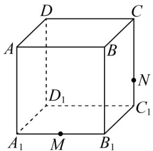

text_image

D
C
A
B
D₁
N
C₁
A₁
M
B₁

2547 (2024·江苏·高一专题练习)如图,棱长为2的正方体 $ABCD-A_{1}B_{1}C_{1}D_{1}$ 中,E,F分别是棱 $AA_{1},CC_{1}$ 的中点,过E作平面 $\alpha$ ,使得 $\alpha\parallel$ 平面BDF.

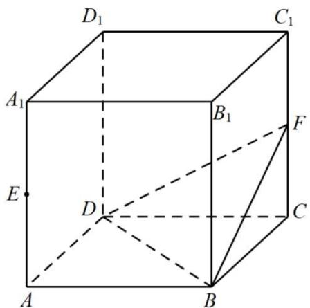

text_image

D₁
C₁
A₁
B₁
F
E
D
C
A
B

(1) 作出 $\alpha$ 截正方体 $\mathrm{ABCD} - \mathrm{A}_1\mathrm{B}_1\mathrm{C}_1\mathrm{D}_1$ 所得的截面, 写出作图过程并说明理由; (2) 求平面 $\alpha$ 与平面 BDF 的距离.

2548 (2024·全国·高一专题练习)(1)如图,棱长为2的正方体 $ABCD-A_{1}B_{1}C_{1}D_{1}$ 中,M,N是棱 $A_{1}B_{1},A_{1}D_{1}$ 的中点,在图中画出过底面ABCD中的心O且与平面AMN平行的平面在正方体中的截面,并求出截面多边形的周长为:\_\_\_\_;

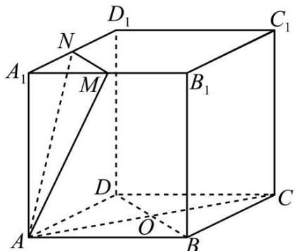

text_image

D₁
N
A₁
M
B₁
C₁
D
O
A
B
C

(2) 作出平面 PQR 与四棱锥 ABCDE 的截面, 截面多边形的边数为 \_\_\_\_.

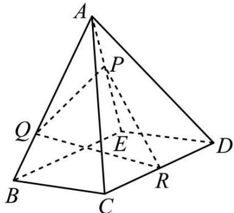

text_image

A
P
Q
E
D
B
C
R

2549 (2024·全国·高一专题练习)如图①, 正方体 $ABCD-A_{1}B_{1}C_{1}D_{1}$ 的棱长为 2, P 为线段 BC 的中点, Q 为线段 $CC_{1}$ 上的动点, 过点 A、P、Q 的平面截该正方体所得的截面记为 S.

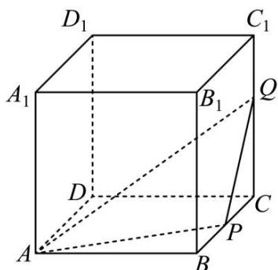

text_image

D₁
C₁
A₁
B₁
Q
D
C
A
P
B

图①

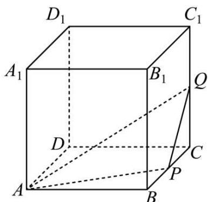

text_image

D₁
C₁
A₁
B₁
Q
D
C
A
P
B

图②

(1) 若 $1 < CQ < 2$ ，请在图①中作出截面 S(保留尺规作图痕迹)；
(2) 若 CQ = 1 (如图②)，试求截面 S 将正方体分割所成的上半部分的体积 $V_{1}$ 与下半部分的体积 $V_{2}$ 之比.

2550 (2024·全国·高一专题练习)如图,已知正方体 $ABCD-A_{1}B_{1}C_{1}D_{1}$ , 点 E 为棱 $CC_{1}$ 的中点.

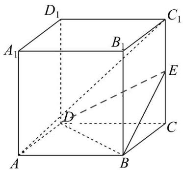

text_image

D₁
A₁
B₁
C₁
E
D
C
A
B

(1) 证明: $AC_{1} \parallel$ 平面 BDE.
(2) 证明: $AC_{1} \perp BD$ .
(3) 在图中作出平面 $BED_{1}$ 截正方体所得的截面图形 (如需用到其它点, 需用字母标记并说明位置), 并说明理由.

2551 (2024·江苏·高一专题练习)已知正方体 $ABCD-A_{1}B_{1}C_{1}D_{1}$ 是棱长为 1 的正方体，M 是棱 $AA_{1}$ 的中点，过 C、 $D_{1}$ 、M 三点作正方体的截面，作出这个截面图并求出截面的面积.

# 题型二:截面图形的形状、面积及周长问题

2552 (2024·全国·高三专题练习)如图,正方体 $ABCD-A_{1}B_{1}C_{1}D_{1}$ 的棱长为 1, P 为 BC 的中点, Q 为线段 $CC_{1}$ 上的动点, 过点 A, P, Q 的平面截该正方体所得的截面记为 S. 则下列命题中正确命题的个数为（）

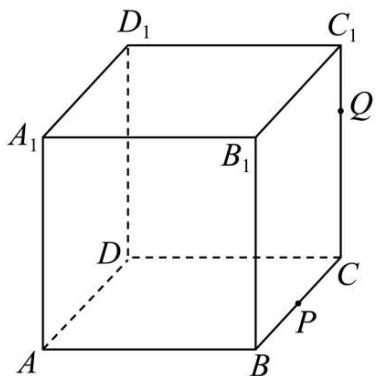

text_image

D₁
C₁
A₁
B₁
Q
D
C
P
A
B

①当 $0 < \mathrm{CQ} < \frac{1}{2}$ 时，S为四边形；  
②当 $CQ=\frac{1}{2}$ 时，S 为等腰梯形；  
③当 $CQ=\frac{3}{4}$ 时，S 与 $C_{1}D_{1}$ 的交点 $R_{1}$ 满足 $C_{1}R_{1}=\frac{1}{3}$ ;  
④当 $\frac{3}{4}<CQ<1$ 时，S 为六边形；

A. 1

B. 2

C. 3

D. 4

2553 (2024·四川成都·高二双流中学校考期中)已知正方体 $ABCD-A_{1}B_{1}C_{1}D_{1}$ 的棱长为 1, M,N 为线段 BC, $CC_{1}$ 上的动点, 过点 $A_{1}, M, N$ 的平面截该正方体的截面记为 S, 则下列命题正确的个数是 ()

①当 BM=0 且 0<CN<1 时，S 为等腰梯形；  
②当 M, N 分别为 BC, CC $_{1}$ 的中点时, 几何体 A $_{1}$ -D $_{1}$ MN 的体积为 $\frac{1}{12}$ ;  
③当 M 为 BC 中点且 CN = $\frac{3}{4}$ 时，S 与 C₁D₁ 的交点为 R，满足 C₁R = $\frac{1}{6}$ ;  
④当M为BC中点且 $0 \leqslant CN \leqslant 1$ 时，S为五边形.

A. 1

B. 2

C. 3

D. 4

2554 (2024·全国·高一专题练习)如图正方体 $ABCD-A_{1}B_{1}C_{1}D_{1}$ ，棱长为 1，P 为 BC 中点，Q 为线段 $CC_{1}$ 上的动点，过 A、P、Q 的平面截该正方体所得的截面记为 $\Omega$ 。若 $\overrightarrow{CQ} = \lambda \overrightarrow{CC_{1}}$ ，则下列结论错误的是（）

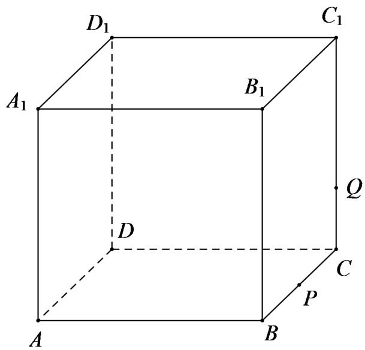

text_image

D₁
C₁
A₁
B₁
Q
D
C
P
A
B

A. 当 $\lambda \in \left(0, \frac{1}{2}\right)$ 时, $\Omega$ 为四边形

B. 当 $\lambda = \frac{1}{2}$ 时, $\Omega$ 为等腰梯形

C. 当 $\lambda \in \left(\frac{3}{4}, 1\right)$ 时, $\Omega$ 为六边形

D. 当 $\lambda = 1$ 时, $\Omega$ 的面积为 $\frac{\sqrt{6}}{2}$

2555 (2024·江苏镇江·高二扬中市第二高级中学校考开学考试)如图,在棱长为 $\sqrt{2}$ 的正方体ABCD-A'B'C'D'中,点E、F、G分别是棱A'B'、B'C'、CD的中点,则由点E、F、G确定的平面截正方体所得的截面多边形的面积等于\_\_\_\_.

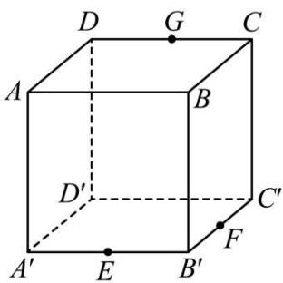

text_image

D G C
A B
D' C'
A' E B' F

2556 (2024·河南信阳·高二信阳高中校考阶段练习)在一次通用技术实践课上,木工小组需要将正方体木块截去一角,要求截面经过面对角线AC上的点P(如图),且与平面 $B_{1}CD_{1}$ 平行,已知 $AA_{1}=10cm$ ,AP=6cm,则截面面积等于\_\_\_\_cm $^{2}$ .

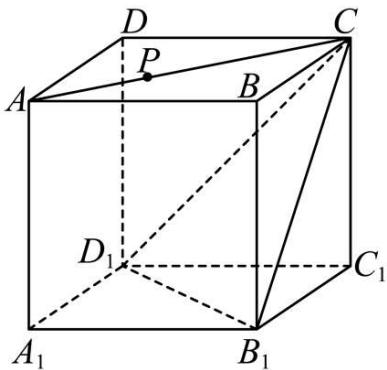

text_image

D
P
A
B
C
D₁
C₁
A₁
B₁

2557 (2024·江苏泰州·高一泰州中学校考阶段练习)正方体 $\mathrm{ABCD - A_1B_1C_1D_1}$ 的棱长是 $a$ 其中E是CD中点，F是 $\mathrm{AA}_1$ 中点，则过点E,F,B的截面面积是.

2558 (2024·全国·高三专题练习)已知直三棱柱 $ABC-A_{1}B_{1}C_{1}$ 的侧棱长为 2，AB ⊥ BC，AB = BC = 2，过 AB，BB₁ 的中点 E，F 作平面 $\alpha$ 与平面 AA₁C₁C 垂直，则所得截面周长为 \_\_\_\_.

2559 (2024·全国·高三专题练习)棱长为1的正方体 $ABCD-A_{1}B_{1}C_{1}D_{1}$ 中,点E为棱BC的中点,则过 $B_{1},E,D$ 三点的平面截正方体的截面周长为\_\_\_\_.

2560 (2024·四川泸州·四川省泸县第二中学校联考模拟预测)如图,在棱长为2的正方体 $ABCD-A_{1}B_{1}C_{1}D_{1}$ ，中，点E为CD的中点，则过点C且与 $B_{1}E$ 垂直的平面 $\alpha$ 被正方体 $ABCD-A_{1}B_{1}C_{1}D_{1}$ 截得的截面周长为\_\_\_\_.

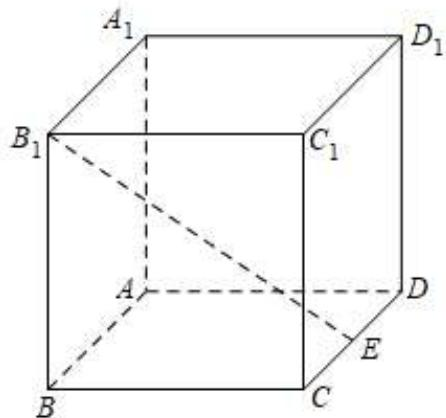

text_image

A₁
B₁
C₁
D₁
A
D
E
B
C

# 3 题型三:截面切割几何体的体积问题

2561 (2024·广东广州·高一统考期末)在棱长为 a 的正方体 $ABCD-A_{1}B_{1}C_{1}D_{1}$ 中, E, F 分别为棱 BC, $CC_{1}$ 的中点, 过点 A, E, F 作一个截面, 该截面将正方体分成两个多面体, 则体积较小的多面体的体积为 \_\_\_\_.

2562 (2024·辽宁锦州·校考一模)在正四棱锥 S-ABCD 中, M 为 SC 的中点, 过 AM 作截面将该四棱锥分成上、下两部分, 记上、下两部分的体积分别为 $\mathrm{V}_{1}, \mathrm{V}_{2}$ , 则 $\frac{\mathrm{V}_{2}}{\mathrm{V}_{1}}$ 的最大值是 \_\_\_\_.

2563 (2024·浙江·高二竞赛)在正四棱锥 S-ABCD 中, M 在棱 SC 上且满足 SM=2MC. 过 AM 作截面将此四棱锥分成上, 下两部分, 记上, 下两部分的体积分别为 $V_{1}, V_{2}$ , 则 $\frac{V_{2}}{V_{1}}$ 的最大值为 \_\_\_\_.

2564 (2024·上海·高二专题练习)如图,正方体 $ABCD-A_{1}B_{1}C_{1}D_{1}$ ,中,E、F分别是棱AB、BC的中点,过点 $D_{1}$ 、E、F的截面将正方体分割成两个部分,记这两个部分的体积分别为 $V_{1},V_{2}$ ,记 $V_{1}<V_{2}$ ,则 $V_{1}:V_{2}=$ \_\_\_\_.

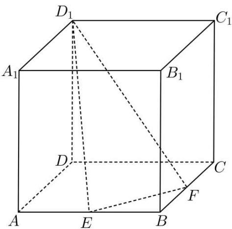

text_image

D₁
A₁
B₁
C₁
D
C
F
A
E
B

2565 (2024·全国·高一专题练习)如图所示,在长方体 ABCD-A'B'C'D' 中,用截面截下一个三棱锥 C-A'D'D,则三棱锥 C-A'D'D 的体积与剩余部分的体积之比为 \_\_\_\_.

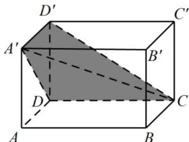

text_image

D'
C'
A'
B'
D
C
A
B

2566 (2024·贵州贵阳·贵阳六中校考一模)在三棱柱 $ABC-A_{1}B_{1}C_{1}$ 中， $AA_{1}\perp$ 底面 ABC， $AB=BC=CA=\frac{1}{2}AA_{1}$ ，点 P 是棱 $AA_{1}$ 上的点， $AP=2PA_{1}$ ，若截面 $BPC_{1}$ 分这个棱柱为两部分，则这两部分的体积比为 \_\_\_\_.

2567 (2024·广东揭阳·高一普宁市华侨中学校考阶段练习)如图,正方体 $ABCD-A_{1}B_{1}C_{1}D_{1}$ 中,E、F分别是棱 $A_{1}B_{1}$ 、 $C_{1}D_{1}$ 的中点,则正方体被截面BEFC分成两部分的体积之比

$$
\mathrm{V} _ {1}: \mathrm{V} _ {2} = \underline {{\quad}}.
$$

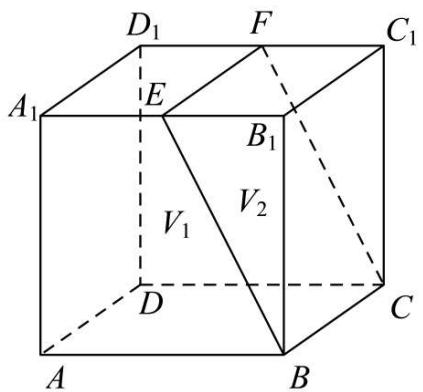

text_image

D₁
F
C₁
A₁
E
B₁
V₁
V₂
D
C
A
B

# 题型四:球与截面问题

2568 (2024·湖南长沙·高三长沙一中校考阶段练习)如图,在棱长为1的正方体ABCD-A₁B₁C₁D₁中,M,N分别为棱A₁D₁,DD₁的中点,过MN作该正方体外接球的截面,所得截面的面积的最小值为()

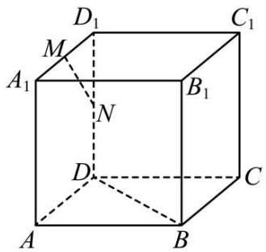

text_image

D₁
M
A₁
N
B₁
D
C
A
B

A. $\frac{\pi}{6}$

B. $\frac{\pi}{4}$

C. $\frac{3\pi}{8}$

D. $\frac{\pi}{2}$

2569 (2024·福建福州·福建省福州第一中学校考模拟预测)在矩形 ABCD 中, AB = 3, AD = 4, 将 $\triangle ABD$ 沿对角线 BD 翻折至 $\triangle A'BD$ 的位置, 使得平面 $A'BD \perp$ 平面 BCD, 则在三棱锥 $A' - BCD$ 的外接球中, 以 $A'C$ 为直径的截面到球心的距离为 ( )

A. $\frac{\sqrt{435}}{10}$

B. $\frac{6\sqrt{2}}{5}$

C. $\frac{\sqrt{239}}{10}$

D. $\frac{\sqrt{113}}{10}$

2570 (2024·海南·高三校联考期末)已知某球的体积为 $\frac{32\pi}{3}$ ，该球的某截面圆的面积为 $3\pi$ ，则球面上的点到该截面圆圆心的最大距离为（）

A. 1

B. 3

C. $2 + \sqrt{3}$

D. $\frac{5}{2}$

2571 (2024·江西南昌·江西师大附中校考三模)已知正方体 $ABCD-A_{1}B_{1}C_{1}D_{1}$ 的棱长为 2，E 为棱 $CC_{1}$ 上的一点，且满足平面 BDE ⊥ 平面 $A_{1}BD$ ，则平面 $A_{1}BD$ 截四面体 ABCE 的外接球所得截面的面积为（）

A. $\frac{13}{6}\pi$

B. $\frac{25}{12}\pi$

C. $\frac{8}{3}\pi$

D. $\frac{2}{3}\pi$

2572 (2024·四川内江·四川省内江市第六中学校考模拟预测)已知球 O 是正三棱锥 A-BCD (底面是正三角形,顶点在底面的射影为底面中心)的外接球, $\mathrm{BC}=\sqrt{3},\mathrm{AB}=\sqrt{2}$ ,点 E 是线段 BC 的中点,过点 E 作球 O 的截面,则所得截面面积的最小值是()

A. $\frac{3\pi}{4}$

B. $\frac{2\pi}{3}$

C. $\frac{\pi}{2}$

D. $\frac{\pi}{4}$

2573 (2024·福建厦门·厦门外国语学校校考模拟预测)已知半径为4的球O,被两个平面截得圆 $O_{1}$ 、 $O_{2}$ ，记两圆的公共弦为AB，且 $O_{1}O_{2}=2$ ，若二面角 $O_{1}-AB-O_{2}$ 的大小为 $\frac{2}{3}\pi$ ，则四面体 $ABO_{1}O_{2}$ 的体积的最大值为()

A. $8 \sqrt{3}$

B. $\frac{4}{9}\sqrt{2}$

C. $\frac{8}{9}\sqrt{2}$

D. $\frac{4}{9}\sqrt{3}$

2574 (2024·全国·高三专题练习)已知球 O 和正四面体 A-BCD, 点 B、C、D 在球面上, 底面 BCD 过球心 O, 棱 AB、AC、AD 分别交球面于 $\mathrm{B}_{1} 、 \mathrm{C}_{1} 、 \mathrm{D}_{1}$ , 若球的半径 $R = \sqrt{3}$ , 则所得多面体 $\mathrm{B}_{1} \mathrm{C}_{1} \mathrm{D}_{1}-\mathrm{BCD}$ 的体积为 ( )

A. $\frac{9\sqrt{2}}{8}$

B. $\frac{9\sqrt{2}}{4}$

C. $\frac{23\sqrt{2}}{12}$

D. $\frac{13\sqrt{2}}{6}$

2575 (2024·天津红桥·统考二模)用与球心距离为1的平面去截球,所得的截面面积为 $\pi$ ,则球的体积为()

A. $\frac{4\sqrt{3}}{3}\pi$

B. $\frac{4\sqrt{2}}{3}\pi$

C. $\frac{8\sqrt{3}}{3}\pi$

D. $\frac{8\sqrt{2}}{3}\pi$

# 5 题型五:截面图形的个数问题

2576 (2024·全国·高三专题练习)过正四面体 P-ABC 的顶点 P 作平面 $\alpha$ ，若 $\alpha$ 与直线 PA，PB，PC 所成角都相等，则这样的平面的个数为（）个

A. 3

B. 4

C. 5

D. 6

2577 (2024·陕西榆林·陕西省榆林中学校考三模)过正方体 $ABCD-A_{1}B_{1}C_{1}D_{1}$ 的顶点 A 作平面 $\alpha$ ，使得正方体的各棱与平面 $\alpha$ 所成的角都相等，则满足条件的平面 $\alpha$ 的个数为（）

A. 1

B. 3

C. 4

D. 6

2578 (2024·全国·高三专题练习)设四棱锥 P-ABCD 的底面不是平行四边形, 用平面 $\alpha$ 去截此四棱锥, 使得截面四边形是平行四边形, 则这样的平面 $\alpha$

A. 有无数多个

B. 恰有 4 个

C. 只有 1 个

D. 不存在

2579 (2024·浙江·模拟预测)过正四面体 ABCD 的顶点 A 作一个形状为等腰三角形的截面，且使截面与底面 BCD 所成的角为 $75^{\circ}$ ，这样的截面有（）

A. 6 个

B. 12 个

C. 16 个

D. 18 个

2580 (2024·上海杨浦·高二上海市控江中学校考期中)空间给定不共面的 A, B, C, D 四个点, 其中任意两点间的距离都不相同, 考虑具有如下性质的平面 $\alpha$ : A, B, C, D 中有三个点到的距离相同, 另一个点到 $\alpha$ 的距离是前三个点到 $\alpha$ 的距离的 2 倍, 这样的平面 $\alpha$ 的个数是 \_\_\_\_ 个

# 6 题型六: 平面截圆锥问题

2581 (多选题)(2024·广东·高二统考期末)圆锥曲线为什么被冠以圆锥之名？因为它可以从圆锥中截取获得.我们知道,用一个垂直于圆锥的轴的平面去截圆锥,截口曲线(截而与圆锥侧面的交线)是一个圆,用一个不垂直于轴的平面截圆锥,当截面与圆锥的轴的夹角 $\theta$ 不同时,可以得到不同的截口曲线,它们分别是椭圆、抛物线、双曲线.因此,我们将圆、椭圆、抛物线、双曲线统称为圆锥曲线.截口曲线形状与 $\theta$ 和圆锥轴截面半顶角 $\alpha$ 有如下关系 $\left(\theta,\alpha\in\left(0,\frac{\pi}{2}\right)\right)$ ;当 $\theta>\alpha$ 时,截口曲线为椭圆;当 $\theta=\alpha$ 时,截口曲线为抛物线:当 $0<\alpha$ 时,截口曲线为双曲线.(如左图)

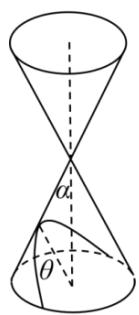

text_image

α
θ

抛物线

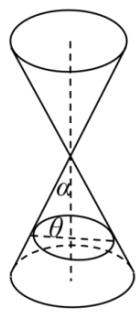

text_image

α₄
θ

椭圆

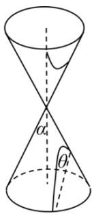

text_image

α
θ

双曲线  
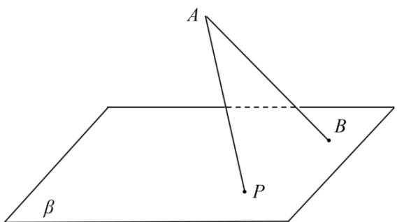

text_image

A
B
P
β

现有一定线段 AB 与平面 $\beta$ 夹角 $\varphi$ (如上右图), B 为斜足, $\beta$ 上一动点 P 满足 $\angle BAP = \gamma$ , 设 P 点在 $\beta$ 的运动轨迹是 $\Gamma$ , 则 ( )

A. 当 $\varphi = \frac{\pi}{4}, \gamma = \frac{\pi}{6}$ 时, $\Gamma$ 是椭圆

B. 当 $\varphi = \frac{\pi}{3}, \gamma = \frac{\pi}{6}$ 时， $\Gamma$ 是双曲线

C. 当 $\varphi = \frac{\pi}{4}, \gamma = \frac{\pi}{4}$ 时, $\Gamma$ 是抛物线

D. 当 $\varphi = \frac{\pi}{3}, \gamma = \frac{\pi}{4}$ 时， $\Gamma$ 是椭圆

2582 (2024·辽宁阜新·校考模拟预测)比利时数学家丹德林(GerminalDandelin)发现:在圆锥内放两个大小不同且不相切的球使得它们与圆锥的侧面相切,用与两球都相切的平面截圆锥的侧面得到的截线是椭圆.这个结论在圆柱中也适用,如图所示,在一个高为20,底面半径为4的圆柱体内放两个球,球与圆柱底面及侧面均相切.若一个平面与两个球均相切,则此平面截圆柱侧面所得的截线为一个椭圆,则该椭圆的短轴长为()

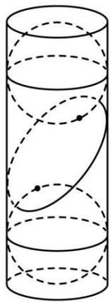

natural_image

Diagram of a cylinder with internal curved lines and marked points (no text or labels)

A. 12   
B. 4   
C. $2 \sqrt{5}$   
D. 8

2583 (2024·安徽安庆·安徽省桐城中学校考一模). 如图是数学家 GerminalDandelin 用来证明一个平面截圆锥得到的截口曲线是椭圆的模型 (称为“Dandelin 双球”); 在圆锥内放两个大小不同的小球, 使得它们分别与圆锥的侧面、截面相切, 设图中球 $\mathrm{O}_{1}$ , 球 $\mathrm{O}_{2}$ 的半径分别为 4 和 1, 球心距 $|\mathrm{O}_{1} \mathrm{O}_{2}| = 6$ , 截面分别与球 $\mathrm{O}_{1}$ , 球 $\mathrm{O}_{2}$ 切于点 E, F, (E, F 是截口椭圆的焦点), 则此椭圆的离心率等于 ( )

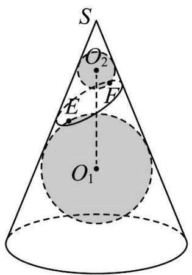

text_image

S
O₂
E
F
O₁

A. $\frac{\sqrt{33}}{9}$

B. $\frac{\sqrt{6}}{3}$

C. $\frac{\sqrt{2}}{2}$

D. $\frac{1}{6}$

2584 (2024·上海·高二专题练习)如图①,用一个平面去截圆锥得到的截口曲线是椭圆.许多人从纯几何的角度出发对这个问题进行过研究,其中比利时数学家

Germinaldandelin(1794-1847)的方法非常巧妙, 极具创造性. 在圆锥内放两个大小不同的球, 使得它们分别与圆锥的侧面、截面相切, 两个球分别与截面相切于 E,F, 在截口曲线上任取一点 A, 过 A 作圆锥的母线, 分别与两个球相切于 C,B, 由球和圆的几何性质, 可以知道, AE = AC, AF = AB, 于是 AE + AF = AB + AC = BC. 由 B,C 的产生方法可知, 它们之间的距离 BC 是定值, 由椭圆定义可知, 截口曲线是以 E,F 为焦点的椭圆.

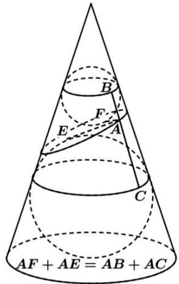

text_image

AF + AE = AB + AC
E
A
B
F

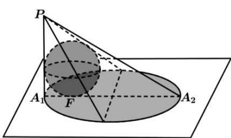

text_image

P
A₁ F A₂

如图②,一个半径为2的球放在桌面上,桌面上方有一个点光源P,则球在桌面上的投影是椭圆,已知 $A_{1}A_{2}$ 是椭圆的长轴, $PA_{1}$ 垂直于桌面且与球相切, $PA_{1}=5$ ,则椭圆的焦距为()

A. 4

B. 6

C. 8

D. 12

2585 (2024·全国·高三对口高考)如图, 定点 A 和 B 都在平面 $\alpha$ 内, 定点 $P \notin \alpha, PB \perp \alpha$ , C 是 $\alpha$ 内异于 A 和 B 的动点, 且 PC ⊥ AC. 那么, 动点 C 在平面 $\alpha$ 内的轨迹是 ( )

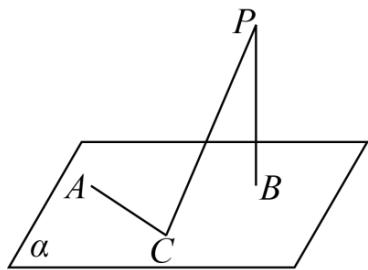

text_image

P
A
B
C
α

A. 一条线段,但要去掉两个点

B. 一个圆,但要去掉两个点

C. 一个椭圆,但要去掉两个点

D. 半圆,但要去掉两个点

2586 (2024·全国·学军中学校联考模拟预测)已知空间中两条直线 $l_{1}, l_{2}$ 异面且垂直，平面 $\alpha // l_{1}$ 且 $l_{2} \subset \alpha$ ，若点P到 $l_{1}, l_{2}$ 距离相等，则点P在平面 $\alpha$ 内的轨迹为 （）

A. 直线

B. 椭圆

C. 双曲线

D. 抛物线

2587 (2024·宁夏银川·校联考二模)已知线段AB垂直于定圆所在的平面，B,C是圆上的两点，H是点B在AC上的射影，当C运动，点H运动的轨迹 （）

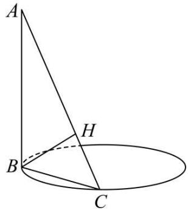

text_image

A
H
B
C

A. 是圆

B. 是椭圆

C. 是抛物线

D. 不是平面图形

2588 (2024·四川广安·高二广安二中校考期中)美学四大构件是:史诗、音乐、造型(绘画、建筑等)和数学.素描是学习绘画的必要一步,它包括明暗素描和结构素描,而学习几何体结构素描是学习索描的重要一步.某同学在画切面圆柱体(用与圆柱底面不平行的平面去截圆柱,底面与截面之间的部分叫做切面圆柱体,原圆柱的母线被截面所截剩余的部分称为切面圆柱体的母线)的过程中,发现“切面”是一个椭圆,若切面圆柱体的最长母线与最短母线所确定的平面截切面圆柱体得到的截面图形是一个底角为 $60^{\circ}$ 的直角梯形,设圆柱半径r=1,则该椭圆的焦距为()

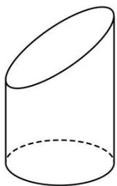

natural_image

Simple line drawing of a cylinder with no text or symbols

A. $\frac{2\sqrt{3}}{3}$

B. $\frac{\sqrt{3}}{3}$

C. $\frac{\sqrt{3}}{2}$

D. $\frac{1}{3}$

2589 (2024·全国·高三专题练习)如图,正方体 $AC_{1}$ , P 为平面 $B_{1}BD_{1}$ 内一动点,设二面角 $A_{1}-BD_{1}-P$ 的大小为 $\alpha$ , 直线 $A_{1}P$ 与平面 $A_{1}BD_{1}$ 所成角的大小为 $\beta$ . 若 $\cos\beta=\sin\alpha$ , 则点 P 的轨迹是 ()

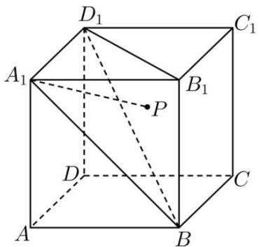

text_image

D₁
C₁
A₁
B₁
P
D
C
A
B

A. 圆

B. 抛物线

C. 椭圆

D. 双曲线

2590 (2024·四川广安·高二统考期末)已知四棱锥 P-ABCD, AD⊥平面 PAB, BC⊥平面 PAB, 底面 ABCD 是梯形, AB=AD=2, BC=4, ∠APD=∠CPB, 满足上述条件的四棱锥的顶点 P 的轨迹是 ( )

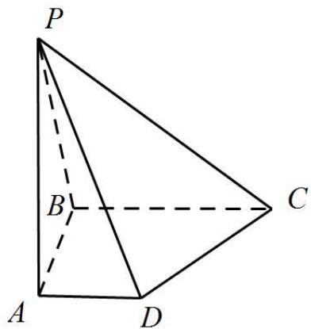

text_image

P
B
C
A
D

A. 椭圆

B. 椭圆的一部分

C. 圆

D. 不完整的圆

2591 (2024·全国·校联考模拟预测)用一个不垂直于圆锥的轴的平面截圆锥,当截面与圆锥的轴夹角不同时,可以得到不同的截口曲线,它们分别是椭圆、抛物线、双曲线.我们通常把圆、椭圆、抛物线、双曲线统称为圆锥曲线.已知某圆锥的轴截面是正三角形,平面α与该圆锥的底而所成的锐二面角为 $\frac{\pi}{6}$ ,则平面α截该圆锥所得椭圆的离心率为\_\_\_\_.

# 题型七:截面图形有关面积、长度及周长范围与最值问题

2592 (2024·西藏林芝·统考二模)在三棱锥 A-BCD 中, AB=AC=BD=CD=BC=4, 平面 $\alpha$ 经过 AC 的中点 E, 并且与 BC 垂直, 当 $\alpha$ 截此三棱锥所得的截面面积最大时, 此时三棱锥 A-BCD 的外接球的表面积为 ( )

A. $\frac{80\sqrt{3}}{3}\pi$

B. $\frac{70}{3}\pi$

C. $20\pi$

D. $\frac{80}{3}\pi$

2593 (2024·贵州·高二校联考阶段练习)已知圆锥的母线长为2,其侧面展开图的中心角为 $\sqrt{3}\pi$ ,则过圆锥顶点的截面面积最大值为()

A. 1

B. $\sqrt{3}$

C. 2

D. $2 \sqrt{3}$

2594 (2024·全国·高一专题练习)若球 O 是正三棱锥 A-BCD 的外接球, BC=3, AB=2√3, 点 E 在线段 BA 上, BA=3BE, 过点 E 作球 O 的截面, 则所得的截面中面积最小的

截面的面积为 （）

A. $\frac{8\pi}{3}$

B. $2\pi$

C. $\frac{4\pi}{3}$

D. $\pi$

2595 (2024·高一课时练习)在三棱锥 A-BCD 中, AB=BC=CD=DA=2√2, ∠ADC=∠ABC=90°, 平面 ABC⊥平面 ACD, 三棱锥 A-BCD 的所有顶点都在球 O 的球面上, E,F 分别在线段 OB, CD 上运动 (端点除外), BE=√2CF. 当三棱锥 E-ACF 的体积最大时, 过点 F 作球 O 的截面, 则截面面积的最小值为 ( )

A. $\pi$

B. $\sqrt{3}\pi$

C. $\frac{3}{2}\pi$

D. $2\pi$

2596 (2024·江西·高一宁冈中学校考期末)棱长为1的正方体 $ABCD-A_{1}B_{1}C_{1}D_{1}$ 的8个顶点都在球O的表面上，E，F分别为棱AB， $A_{1}D_{1}$ 的中点，则经过E，F球的截面面积的最小值为()

A. $\frac{3}{8}\pi$

B. $\frac{\pi}{2}$

C. $\frac{5}{8}\pi$

D. $\frac{7}{8}\pi$

2597 (2024·全国·高三对口高考)如图, 正方体 $ABCD-A_{1}B_{1}C_{1}D_{1}$ 的棱长为 $2\sqrt{3}$ , 动点 P 在对角线 $BD_{1}$ 上, 过点 P 作垂直于 $BD_{1}$ 的平面 $\alpha$ , 记这样得到的截面多边形 (含三角形) 的周长为 y, 设 BP = x, 则当 $x \in [1,5]$ 时, 函数 $y = f(x)$ 的值域为 ( )

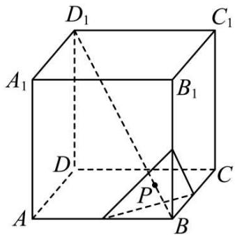

text_image

D₁
C₁
A₁
B₁
D
P
C
A
B

A. $[3\sqrt{6}, 6\sqrt{6}]$

B. $[\sqrt{6}, 2\sqrt{6}]$

C. $(0,\sqrt{6} ]$

D. $(0,3\sqrt{6} ]$

2598 (2024·全国·高一专题练习)如图所示,在长方体 $ABCD-A_{1}B_{1}C_{1}D_{1}$ 中,点 E 是棱 $CC_{1}$ 上的一个动点,若平面 $BED_{1}$ 与棱 $AA_{1}$ 交于点 F,给出下列命题:

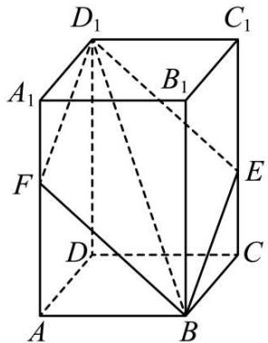

text_image

D₁
C₁
A₁
B₁
F
E
D
C
A
B

①四棱锥 $\mathrm{B}_{1} - \mathrm{BED}_{1}\mathrm{F}$ 的体积恒为定值；  
②四边形 $\mathrm{BED}_{1}\mathrm{F}$ 是平行四边形；  
③当截面四边形 $\mathrm{BED}_{1}\mathrm{F}$ 的周长取得最小值时，满足条件的点E至少有两个；  
④直线 $\mathrm{D}_1\mathrm{E}$ 与直线DC交于点P，直线 $\mathrm{D}_1\mathrm{F}$ 与直线DA交于点Q，则P、B、Q三点共线.其中真命题是 （）

A. ①②③

B.②③④

C. ①②④

D.①③④

2599 (2024·高一课时练习)正方体 $ABCD-A_{1}B_{1}C_{1}D_{1}$ 中作一截面与 $AC_{1}$ 垂直,且和正方体所有面相交,如图所示. 记截面多边形面积为 S,周长为 C,则()

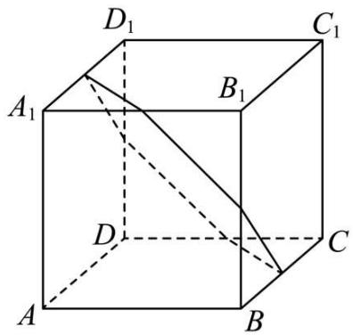

text_image

D₁
C₁
A₁
B₁
D
C
A
B

A. S 为定值, C 不为定值

B. S 不为定值, C 为定值

C. S 和 C 均为定值

D. S 和 C 均不为定值

2600 (2024·四川内江·高二统考期末)如图所示,在长方体 $ABCD-A_{1}B_{1}C_{1}D_{1}$ 中, $BB_{1}=B_{1}D_{1}$ , 点 E 是棱 $CC_{1}$ 上的一个动点, 平面 $BED_{1}$ 交棱 $AA_{1}$ 于点 F, 下列命题错误的是 ()

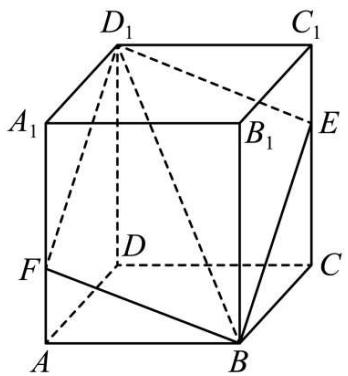

text_image

D₁
C₁
A₁
B₁
E
F
D
C
A
B

A. 四棱锥 $\mathrm{B}_{1} - \mathrm{BED}_{1}\mathrm{F}$ 的体积恒为定值

B. 存在点 E, 使得 $B_{1}D \perp$ 平面 $BD_{1}E$

C. 存在唯一的点 E, 使得截面四边形 BED₁F 的周长取得最小值

D. 对于棱 $\mathrm{CC}_{1}$ 上任意一点E, 在棱AD上均有相应的点G, 使得CG//平面EBD

# 题型八:截面有关的空间角问题

2601 (2024·黑龙江哈尔滨·哈尔滨三中校考模拟预测)在正方体 $ABCD-A_{1}B_{1}C_{1}D_{1}$ 中，E 为 $B_{1}C_{1}$ 中点，过 A, $D_{1}$ , E 的截面 $\alpha$ 与平面 $AA_{1}B_{1}B$ 的交线为 l，则异面直线 l 与 $B_{1}C$ 所成角的余弦值为（）

A. $\frac{\sqrt{10}}{10}$

B. $\frac{\sqrt{5}}{5}$

C. $\frac{\sqrt{10}}{5}$

D. $\frac{\sqrt{15}}{5}$

2602 (2024·高一课时练习)在棱长为1的正方体 $ABCD-A_{1}B_{1}C_{1}D_{1}$ 中，E为 $A_{1}D_{1}$ 的中点，过点A．C．E的截面与平面 $BDD_{1}B_{1}$ 的交线为m，则异面直线m与 $CC_{1}$ 所成角的正切值为()

A. $\sqrt{2}$

B. $\frac{3\sqrt{2}}{4}$

C. $\frac{\sqrt{2}}{2}$

D. $\frac{\sqrt{2}}{4}$

2603 (2024·全国·高一专题练习)平面 $\alpha$ 过正方体ABCD-A $_1$ B $_1$ C $_1$ D $_1$ 的顶点A, $\alpha$ // 平面

$\mathrm{CB}_{1}\mathrm{D}_{1}, \alpha \cap$ 平面ABCD $= m, \alpha \cap$ 平面 $\mathrm{ABB}_{1}\mathrm{A}_{1} = n$ ，则 $m, n$ 所成角的正弦值为（）

A. $\frac{\sqrt{3}}{2}$

B. $\frac{\sqrt{2}}{2}$

C. $\frac{\sqrt{3}}{3}$

D. $\frac{1}{3}$

2604 (2024·四川成都·高三校联考期末)在正方体 $\mathrm{ABCD - A_1B_1C_1D_1}$ 中，E为线段AD的中点，设平面 $\mathrm{A}_1\mathrm{BC}_1$ 与平面 $\mathrm{CC}_1\mathrm{E}$ 的交线为 $m$ ，则直线 $m$ 与AC所成角的余弦值为（）

A. $\frac{1}{2}$

B. $\frac{\sqrt{3}}{2}$

C. $\frac{\sqrt{10}}{5}$

D. $\frac{2\sqrt{5}}{5}$

2605 (2024·陕西安康·高二统考期中)在正方体 $ABCD-A_{1}B_{1}C_{1}D_{1}$ 中，E 为线段 AD 的中点，设平面 $A_{1}BC_{1}$ 与平面 $CC_{1}E$ 的交线为 l，则直线 l 与 BE 所成角的余弦值为（）

A. $\frac{\sqrt{5}}{5}$

B. $\frac{\sqrt{10}}{10}$

C. $\frac{\sqrt{15}}{10}$

D. $\frac{\sqrt{30}}{10}$

