# 第52讲 立体几何中的轨迹问题

# 知识梳理

立体几何中的轨迹问题常用的五种方法总结：

1、定义法  
2、交轨法  
3、几何法  
4、坐标法  
5、向量法

# 必考题型全归纳

# 1 题型一:由动点保持平行求轨迹

2606 (2024·贵州铜仁·高二贵州省铜仁第一中学校考开学考试)设正方体 ABCD-A $_{1}$ B $_{1}$ C $_{1}$ D $_{1}$ 的棱长为 1, 点 E 是棱 A $_{1}$ B $_{1}$ 的中点, 点 M 在正方体的表面上运动, 则下列命题:

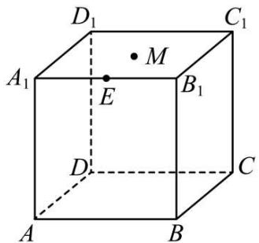

text_image

D₁
C₁
A₁
E
M
B₁
D
C
A
B

①如果 $\mathrm{AM} \perp \mathrm{BD}_1$ ，则点 $\mathbf{M}$ 的轨迹所围成图形的面积为 $\frac{\sqrt{3}}{2}$ ;  
②如果 $B_{1}M \parallel$ 平面 $AEC_{1}$ ，则点 M 的轨迹所围成图形的周长为 $\frac{3\sqrt{5}}{2}$ ;  
③如果 EM // 平面 $D_{1}B_{1}BD$ ，则点 M 的轨迹所围成图形的周长为 $2 + \sqrt{2}$ ;  
④如果 $EM \perp BD_{1}$ ，则点 M 的轨迹所围成图形的面积为 $\frac{3\sqrt{3}}{4}$ .  
其中正确的命题个数为 （）

A. 1

B. 2

C. 3

D. 4

2607 (2024·辽宁沈阳·高一沈阳二十中校联考期末)在棱长为1的正方体 $ABCD-A_{1}B_{1}C_{1}D_{1}$ 中，E在棱 $DD_{1}$ 上且满足 $D_{1}E=ED$ ，点F是侧面 $ABB_{1}A_{1}$ 上的动点，且 $D_{1}F\parallel$ 面AEC，则动点F在侧面 $ABB_{1}A_{1}$ 上的轨迹长度为\_\_\_\_.

2608 (2024·福建福州·高一福建省福州屏东中学校考期末)如图所示,在棱长为2的正方体 $ABCD-A_{1}B_{1}C_{1}D_{1}$ 中,E,F,G分别为所在棱的中点,P为平面 $BCC_{1}B_{1}$ 内(包括边界)一动点,且 $D_{1}P \parallel$ 平面EFG,则P点的轨迹长度为\_\_\_\_

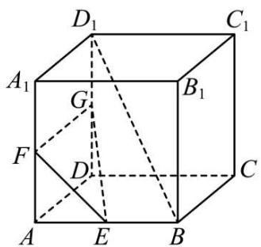

text_image

D₁
C₁
A₁
G
B₁
F
D
C
A
E
B

2609 (2024·四川成都·高一成都市锦江区嘉祥外国语高级中学校考期末)如图,在正三棱柱 $\mathrm{ABC}-\mathrm{A}_{1}\mathrm{B}_{1}\mathrm{C}_{1}$ 中, $\mathrm{AB}=\mathrm{AA}_{1},\mathrm{D},\mathrm{E}$ 分别为 $\mathrm{AA}_{1},\mathrm{AC}$ 的中点. 若侧面 $\mathrm{BB}_{1}\mathrm{C}_{1}\mathrm{C}$ 的中心为O,M为侧面 $\mathrm{AA}_{1}\mathrm{C}_{1}\mathrm{C}$ 内的一个动点,OM//平面BDE,且M的轨迹长度为 $3\sqrt{2}$ ,则三棱柱 $\mathrm{ABC}-\mathrm{A}_{1}\mathrm{B}_{1}\mathrm{C}_{1}$ 的表面积为\_\_\_\_.

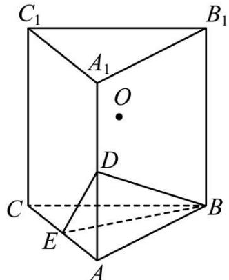

text_image

C₁
A₁
O
D
C
E
A
B₁
B

2610 (2024·江苏扬州·高二统考期中)如图, 正方体 $ABCD-A_{1}B_{1}C_{1}D_{1}$ 的棱长为 2 , 点 E 是线段 $DD_{1}$ 的中点, 点 M 是正方形 $B_{1}BCC_{1}$ 所在平面内一动点, 若 $D_{1}M \parallel$ 平面 $A_{1}BE$ , 则 M 点轨迹在正方形 $B_{1}BCC_{1}$ 内的长度为 \_\_\_\_.

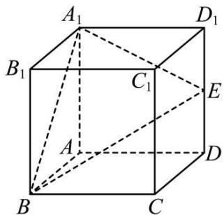

text_image

A₁
B₁
C₁
A
D
E
B
C
D₁

2611 (2024·江苏泰州·高二泰州中学校考阶段练习)正方体 $ABCD - A_{1}B_{1}C_{1}D_{1}$ 的棱长为3，点E，F分别在线段 $\mathrm{DD}_{1}$ 和线段 $\mathrm{AA}_{1}$ 上，且 $\mathrm{D}_{1}\mathrm{E} = 2\mathrm{ED}$ ， $\mathrm{AF} = 2\mathrm{FA}_{1}$ ，点M是正方形 $\mathrm{B}_{1}\mathrm{BCC}_{1}$ 所在平面内一动点，若 $\mathrm{D}_{1}\mathrm{M} //$ 平面FBE，则M点的轨迹在正方形 $\mathrm{B}_{1}\mathrm{BCC}_{1}$ 内的长度为 \_\_\_\_.

2612 (2024·全国·高三专题练习)在边长为2的正方体 $ABCD-A_{1}B_{1}C_{1}D_{1}$ 中,点M是该正方体表面及其内部的一动点,且BM//平面 $AD_{1}C$ ,则动点M的轨迹所形成区域的面积是\_\_\_\_.

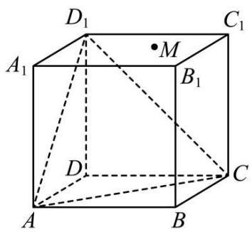

text_image

D₁
A₁
M
B₁
D
C
A
B

2613 (2024·全国·高三专题练习)如图,已知正方体 $ABCD-A_{1}B_{1}C_{1}D_{1}$ 的棱长为 2,E、F 分别是棱 $AA_{1},A_{1}D_{1}$ 的中点,点 P 为底面四边形 ABCD 内 (包括边界) 的一动点,若直线 $D_{1}P$ 与平面 BEF 无公共点,则点 P 在四边形 ABCD 内运动所形成轨迹的长度为 \_\_\_\_.

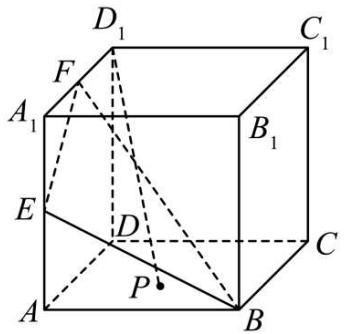

text_image

D₁
C₁
F
A₁
B₁
E
D
C
P
A
B

2614 (2024·全国·高三专题练习)如图所示,正方体 $ABCD-A_{1}B_{1}C_{1}D_{1}$ 的棱长为 2,E、F 分别为 $AA_{1}$ , AB 的中点,点 P 是正方体表面上的动点,若 $C_{1}P$ // 平面 $CD_{1}EF$ ,则点 P 在正方体表面上运动所形成的轨迹长度为 \_\_\_\_.

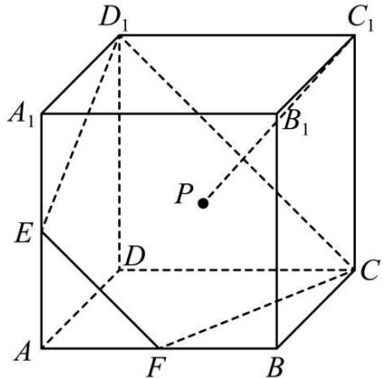

text_image

D₁
C₁
A₁
B₁
P
E
D
C
A
F
B

2615 (2024·全国·高三专题练习)已知棱长为3的正四面体ABCD，E为AD的中点，动点P满足PA=2PD，平面α经过点D，且平面α//平面BCE，则平面α截点P的轨迹所形成的图形的周长为\_\_\_\_.

# 2 题型二:由动点保持垂直求轨迹

2616 (2024·湖南株洲·高三株洲二中校考阶段练习)在棱长为4的正方体 $ABCD-A_{1}B_{1}C_{1}D_{1}$ 中,点P、Q分别是 $BD_{1},B_{1}C_{1}$ 的中点,点M为正方体表面上一动点,若MP与CQ垂直,则点M所构成的轨迹的周长为\_\_\_\_.

2617 (2024·湖南长沙·长郡中学校考二模)在正四棱柱 $ABCD-A_{1}B_{1}C_{1}D_{1}$ 中，AB=1， $AA_{1}=4$ ，E为 $DD_{1}$ 中点，P为正四棱柱表面上一点，且 $C_{1}P\perp B_{1}E$ ，则点 P 的轨迹的长为

2618 (2024·全国·唐山市第十一中学校考模拟预测)已知N为正方体 $ABCD-A_{1}B_{1}C_{1}D_{1}$ 的内切球球面上的动点，M为 $B_{1}C_{1}$ 的中点，DN⊥MB，若动点N的轨迹长度为 $\frac{8\sqrt{5}\pi}{5}$ ，则正方体的体积是\_\_\_\_.

2619 (2024·全国·高三专题练习)已知直三棱柱 ABC-A₁B₁C₁ 的所有棱长均为 4, 空间内的点 H 满足 HA ⊥ HA₁, 且 HB ⊥ HC₁, 则满足条件的 H 所形成曲线的轨迹的长度为 \_\_\_\_.

2620 (2024·四川成都·三模)如图, AB 为圆柱下底面圆 O 的直径, C 是下底面圆周上一点, 已知 $\angle AOC = \frac{\pi}{3}$ , OA = 2, 圆柱的高为 5. 若点 D 在圆柱表面上运动, 且满足 $\overrightarrow{BC} \cdot \overrightarrow{CD} = 0$ , 则点 D 的轨迹所围成图形的面积为 \_\_\_\_.

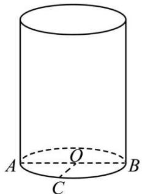

text_image

A
O
C
B

2621 (2024·全国·高三专题练习)如图, AB 为圆柱下底面圆 O 的直径, C 是下底面圆周上一点, 已知 $\angle AOC = \frac{\pi}{3}, OA = 2$ , 圆柱的高为 5. 若点 D 在圆柱表面上运动, 且满足 BC ⊥ AD, 则点 D 的轨迹所围成图形的面积为 \_\_\_\_.

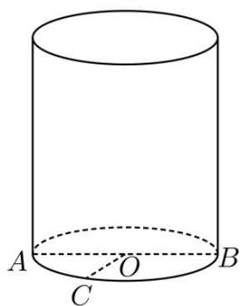

text_image

A
O
C
B

2622 (2024·浙江宁波·高一慈溪中学校联考期末)如图,在直三棱柱 $ABC-A_{1}B_{1}C_{1}$ 中, $BC=CC_{1}=3$ , AC=4, AC⊥BC,动点P在 $\triangle A_{1}B_{1}C_{1}$ 内(包括边界上),且始终满足BP⊥AB₁,则动点P的轨迹长度是\_\_\_\_.

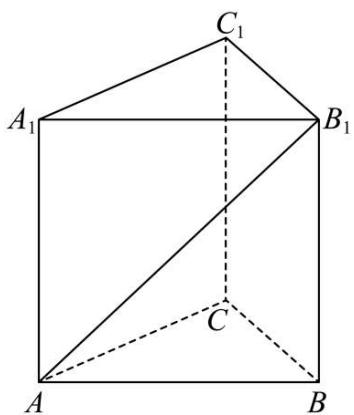

text_image

C₁
A₁ B₁
C
A B

2623 (2024·山东枣庄·高一统考期末) M, N 分别是棱长为 1 的正方体 ABCD - A₁B₁C₁D₁ 的棱 CC₁, A₁B₁ 的中点, 点 P 在正方体的表面上运动, 总有 MP ⊥ BN, 则点 P 的轨迹所围成图形的面积为 \_\_\_\_.

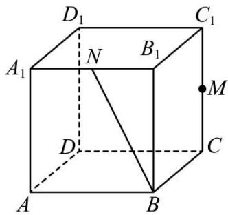

text_image

D₁
C₁
A₁
N
B₁
M
D
C
A
B

2624 (2024·四川广元·高二广元中学校考期中)如图, AB 为圆柱下底面圆 O 的直径, C 是下底面圆周上一点, 已知 $\angle AOC = \frac{\pi}{2}$ , OA = 2, 圆柱的高为 5. 若点 D 在圆柱表面上运动, 且满足 BC ⊥ AD, 则点 D 的轨迹所围成图形的面积为 \_\_\_\_.

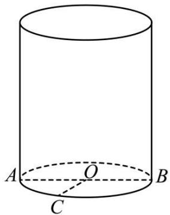

text_image

A
O
B
C

2625 (2024·陕西榆林·高二校考阶段练习)如图,正方体 $ABCD - A_1B_1C_1D_1$ 的棱长为 2 ,点 M 是棱 $B_1C_1$ 的中点,点 P 是正方体表面上的动点. 若 $DM \perp C_1P$ ,则 P 点在正方体表面上运动所形成的轨迹的长度为

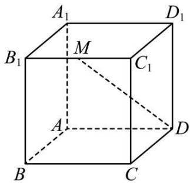

text_image

A₁
B₁
M
C₁
A
D
B
C
D₁

A. $\sqrt{2} +\sqrt{5}$

B. $2 \sqrt{2} + \sqrt{5}$

C. $\sqrt{2} + 2\sqrt{5}$

D. $2 \sqrt{2} + 2 \sqrt{5}$

# 题型三:由动点保持等距(或定长)求轨迹

2626 (2024·贵州贵阳·高三贵阳一中校考期末)在棱长为1的正方体 $ABCD-A_{1}B_{1}C_{1}D_{1}$ 中，点Q为侧面 $BB_{1}C_{1}C$ 内一动点(含边界)，若 $D_{1}Q=\frac{\sqrt{5}}{2}$ ，则点Q的轨迹长度为\_\_\_\_.

2627 (2024·湖北武汉·高一湖北省水果湖高级中学校联考期末)已知正方体 ABCD-A₁B₁C₁D₁ 的棱长为 3，动点 P 在 △AB₁C 内，满足 D₁P = √14，则点 P 的轨迹长度为 \_\_\_\_.

2628 (2024·河北邯郸·高一大名县第一中学校考阶段练习)已知正方体 ABCD - A'B'C'D' 的棱长为 1, 点 P 在该正方体的表面 A'B'C'D' 上运动, 且 PA = $\sqrt{2}$ 则点 P 的轨迹长度是 \_\_\_\_.

2629 (2024·贵州铜仁·统考模拟预测)已知正方体 $ABCD-A_{1}B_{1}C_{1}D_{1}$ 的棱长为 4，点 P 在该正方体的表面上运动，且 $PA=4\sqrt{2}$ ，则点 P 的轨迹长度是 \_\_\_\_.

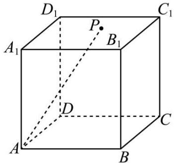

text_image

D₁
P
A₁
B₁
C₁
D
A
B
C

2630 (2024·黑龙江齐齐哈尔·统考二模)表面积为 $36 \pi$ 的球M表面上有A, B两点, 且 $\triangle \mathrm{AMB}$ 为等边三角形, 空间中的动点P满足 $| \mathrm{PA} | = 2 | \mathrm{PB}|$ , 当点P在 $\triangle \mathrm{AMB}$ 所在的平面内运动时, 点P的轨迹是\_\_\_\_; 当P在该球的球面上运动时, 点P的轨迹长度为\_\_\_\_.

2631 (2024·全国·高三专题练习)已知正四棱柱 $ABCD-A_{1}B_{1}C_{1}D_{1}$ 的体积为 16, E 是棱 BC 的中点, P 是侧棱 $AA_{1}$ 上的动点, 直线 $C_{1}P$ 交平面 $EB_{1}D_{1}$ 于点 $P'$ , 则动点 $P'$ 的轨迹长度的最小值为 \_\_\_\_.

2632 (2024·全国·高三专题练习)已知棱长为8的正方体 $ABCD-A_{1}B_{1}C_{1}D$ 中,平面ABCD内一点E满足 $\overrightarrow{BE}=\frac{1}{4}\overrightarrow{CB}$ ,点P为正方体表面一动点,且满足 $|PE|=2\sqrt{2}$ ,则动点P运动的轨迹周长为\_\_\_\_.

2633 (2024·全国·高三专题练习)如图, 已知棱长为 2 的正方体 A'B'C'D' -ABCD, M 是正方形 BB'C'C 的中心, P 是 $\triangle$ A'C'D 内 (包括边界) 的动点, 满足 PM = PD, 则点 P 的轨迹长度为 \_\_\_\_.

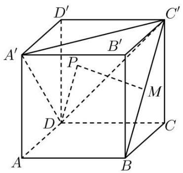

text_image

D'
A'
P
B'
C'
M
D
C
A
B

2634 (2024·河南许昌·高三统考阶段练习)三棱锥 P-ABC 的体积为 $4 \sqrt{3}$ , 底面三角形 ABC 是边长为 $2 \sqrt{3}$ 的正三角形且其中心为 $\mathrm{O}_{1}$ , 三棱锥 P-ABC 的外接球球心 O 到底面 ABC 的距离为 2, 则点 P 的轨迹长度为 \_\_\_\_.

2635 (2024·全国·高三专题练习)在三棱锥 P-ABC 中, PA ⊥ AB, PA = 4, PC = 2, AB = 3, 二面角 P-AB-C 的大小为 $30^{\circ}$ , 在侧面 $\triangle$ PAB 内 (含边界)有一动点 M, 满足到 PA 的距离与到平面 ABC 的距离相等, 则动点 M 的轨迹的长度为 \_\_\_\_.

# 4 题型四:由动点保持等角(或定角)求轨迹

2636 (2024·山东·高三专题练习)如图所示,在平行四边形ABCD中,E为AB中点,DE⊥AB,DC=8,DE=6.沿着DE将△ADE折起,使A到达点A'的位置,且平面A'DE⊥平面ADE.设P为△ADE内的动点,若∠EPB=∠DPC,则P的轨迹的长度为\_\_\_\_.

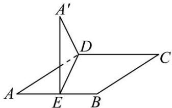

text_image

A'
D
C
A
E
B

2637 (2024·全国·高三专题练习)在棱长为6的正方体 $ABCD-A_{1}B_{1}C_{1}D_{1}$ 中,点M是线段BC的中点,P是正方形 $DCC_{1}D_{1}$ (包括边界)上运动,且满足 $\angle APD=\angle MPC$ ,则P点的轨迹周长为\_\_\_\_.

2638 (2024·湖北省直辖县级单位·统考模拟预测)已知正方体 $ABCD-A_{1}B_{1}C_{1}D_{1}$ 的棱长为2，M为棱 $B_{1}C_{1}$ 的中点，N为底面正方形ABCD上一动点，且直线MN与底面ABCD所成的角为 $\frac{\pi}{3}$ ，则动点N的轨迹的长度为\_\_\_\_.

2639 (2024·陕西·高三陕西省榆林中学校联考阶段练习)已知正方体 $ABCD-A_{1}B_{1}C_{1}D_{1}$ 的棱长为 2，点 E 为平面 $A_{1}BD$ 内的动点，设直线 AE 与平面 $A_{1}BD$ 所成的角为 $\alpha$ ，若 $\sin\alpha=\frac{3\sqrt{10}}{10}$ ，则点 E 的轨迹所围成的周长为 \_\_\_\_.

2640 (2024·全国·高三专题练习)已知点P是棱长为2的正方体 $ABCD-A_{1}B_{1}C_{1}D_{1}$ 的表面上一个动点,若使AP=2的点P的轨迹长度为a;使直线AP//平面BDC的点P的轨迹长度为b;使直线AP与平面ABCD所成的角为 $45^{\circ}$ 的点P的轨迹长度为c.则a,b,c的大小关系为\_\_\_\_.(用“<”符号连接)

2641 (2024·全国·高三专题练习)已知正方体 ABCD-A₁B₁C₁D₁ 中，AB=2√3，点 E 为平面

$A_{1}BD$ 内的动点, 设直线 AE 与平面 $A_{1}BD$ 所成的角为 $\alpha$ , 若 $\sin\alpha=\frac{2\sqrt{5}}{5}$ , 则点 E 的轨迹所围成的面积为 \_\_\_\_.

2642 (2024·山西大同·高一统考期中)已知 A,B,C,P 是半径为 2 的球面上的四点,且 AB = AC = 2,AB ⊥ AC. 二面角 P - BC - A 的大小为 $\frac{\pi}{4}$ , 则点 P 形成的轨迹长度为 \_\_\_\_.

2643 (2024·贵州铜仁·高二统考期末)粽子是端午节期间不可缺少的传统美食,铜仁的粽子不仅馅料丰富多样,形状也是五花八门,有竹筒形、长方体形、圆锥形等,但最常见的还是“四角粽子”,其外形近似于正三棱锥. 因为将粽子包成这样形状,既可以节约原料,又不失饱满,而且十分美观. 如图,假设一个粽子的外形是正三棱锥 P-ABC,其侧棱和底面边长分别是 8cm 和 6cm,O 是顶点 P 在底面 ABC 上的射影. 若 D 是底面 ABC 内的动点,且直线 PD 与底面 ABC 所成角的正切值为 $\frac{2\sqrt{39}}{3}$ ,则动点 D 的轨迹长为 \_\_\_\_.

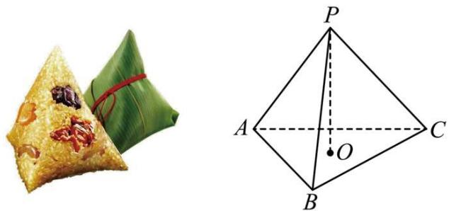

natural_image

Two geometric shapes: a rice dumpling with green leaf and a pyramid of triangle ABC, both without any text or symbols.

2644 (2024·广东佛山·高二校联考期中)如图, 正方体 $ABCD-A_{1}B_{1}C_{1}D_{1}$ 的棱长为 1 , 点 P 为正方形 $A_{1}B_{1}C_{1}D_{1}$ 内的动点, 满足直线 BP 与下底面 ABCD 所成角为 $60^{\circ}$ 的点 P 的轨迹长度为

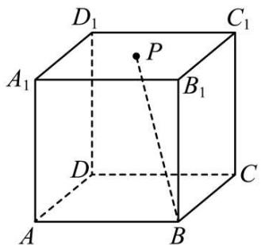

text_image

D₁
C₁
A₁
P
B₁
D
C
A
B

A. $\frac{\sqrt{3}}{3}$

B. $\frac{\sqrt{3}}{6}\pi$

C. $\sqrt{3}$

D. $\frac{\sqrt{3}}{2}\pi$

2645 在正方体 $ABCD-A_{1}B_{1}C_{1}D_{1}$ 中，动点 M 在底面 ABCD 内运动且满足 $\angle DD_{1}A = \angle DD_{1}M$ ，则动点 M 在底面 ABCD 内的轨迹为（）

A. 圆的一部分

B. 椭圆的一部分

C. 双曲线一支的一部分

D. 前三个答案都不对

# 5 题型五:投影求轨迹

2646 (2024·安徽滁州·高三校考阶段练习)如图,在 $\triangle ABC$ 中, $\angle ABC=90^{\circ}$ ,AB=1,BC=2,D为线段BC(端点除外)上一动点.现将 $\triangle ABD$ 沿线段AD折起至 $\triangle AB'D$ ,使二面角B′-AD-C的大小为 $120^{\circ}$ ,则在点D的移动过程中,下列说法错误的是()

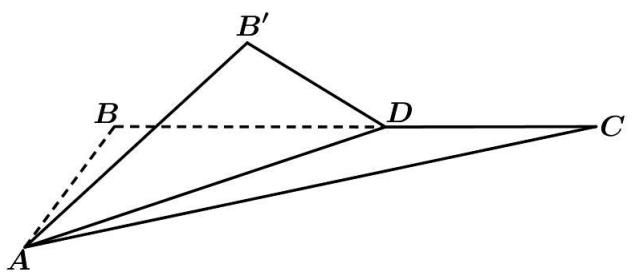

text_image

Geometric diagram showing triangle ABC with points D and B' connected by dashed lines, likely illustrating a geometry problem or proof.

A. 不存在点 D, 使得 CB' ⊥ AB  
B. 点 B' 在平面 ABC 上的投影轨迹是一段圆弧  
C. B'A 与平面 ABC 所成角的余弦值的取值范围是 $\left(\frac{\sqrt{10}}{5},1\right)$   
D. 线段 $\mathrm{CB}'$ 的最小值是 $\sqrt{3}$

2647 (2024·江苏徐州·高二徐州市第一中学校考阶段练习)如图,在等腰RtΔABC中,AB⊥AC,BC=2,M为BC的中点,N为AC的中点,D为线段BM上一个动点(异于两端点),ΔABD沿AD翻折至B₁D⊥DC,点A在平面B₁CD上的投影为点O,当点D在线段BM上运动时,以下说法不正确的是().

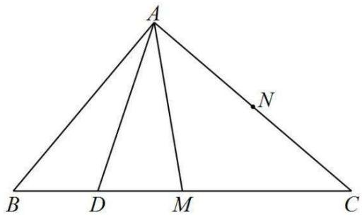

text_image

A
B D M C
N

A. 线段 NO 为定长

B. $\angle \mathrm{AMO} + \angle \mathrm{B}_{1}\mathrm{DA} > 180^{\circ}$

C. $\mathrm{CO}\in (1,\sqrt{2})$

D. 点 O 的轨迹是圆弧

2648 (2024·江西赣州·高二南康中学校考阶段练习)在等腰直角 $\triangle ABC$ 中, $AB \perp AC$ , $BC = 2$ , $M$ 为 $BC$ 中点, $N$ 为 $AC$ 中点, $D$ 为 $BC$ 边上一个动点, $\triangle ABD$ 沿 $AD$ 翻折使 $BD \perp DC$ , 点 $A$ 在平面 $BCD$ 上的投影为点 $O$ , 当点 $D$ 在 $BC$ 上运动时, 以下说法错误的是 ( )

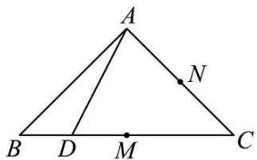

text_image

A
B D M C
N

A. 线段 NO 为定长

B. $\angle AMO + \angle ADB > 180^{\circ}$

C. 线段 CO 的长 $\left|CO\right| \in [1, \sqrt{2})$

D. 点 O 的轨迹是圆弧

2649 (2024·全国·高三专题练习)如图,已知水平地面上有一半径为4的球,球心为O',在平行光线的照射下,其投影的边缘轨迹为椭圆O. 如图,椭圆中心为O,球与地面的接触点为E,OE=3. 若光线与地面所成角为θ,椭圆的离心率e=.

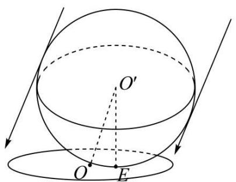

text_image

Geometric diagram showing a sphere intersecting a plane with labeled points O, O', and E, including directional arrows.

2650 (2024·浙江嘉兴·高三嘉兴一中校考期中)如图,在 $\triangle ABC$ 中, $AB = \sqrt{7}$ , $AC = \sqrt{10}$ , $BC = 3$ . 过 $AC$ 的中点 $M$ 的动直线 $l$ 与线段 $AB$ 交于点 $N$ . 将 $\triangle AMN$ 沿直线 $l$ 向上翻折至 $\triangle A'MN$ , 使得点 $A'$ 在平面 $BCMN$ 内的投影 $H$ 落在线段 $BC$ 上. 则点 $A'$ 的轨迹长度为 \_\_\_\_.

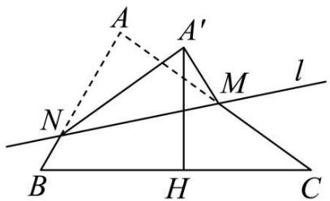

text_image

A
A'
M
l
N
B
H
C

2651 (2024·北京·高三专题练习)如图,在矩形ABCD中, $AB=1$ , $BC=\sqrt{3}$ ,E为线段BC上一动点,现将 $\Delta ABE$ 沿AE折起得到 $\Delta AB'E$ ,当二面角 $B'-AE-D$ 的平面角为 $120^{\circ}$ ,点 $B'$ 在平面ABC上的投影为K,当E从B运动到C,则点K所形成轨迹的长度为\_\_\_\_.

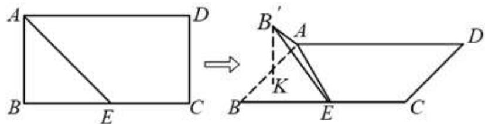

text_image

Geometric diagram showing a rectangle ABCD transformed into a parallelogram with labeled points and lines

# 6 题型六:翻折与动点求轨迹

2652 (2024·全国·高三专题练习)在矩形 ABCD 中, E 是 AB 的中点, AD = 1, AB = 2, 将 $\triangle ADE$ 沿 DE 折起得到 $\triangle A'DE$ , 设 $A'C$ 的中点为 M, 若将 $\triangle A'DE$ 绕 DE 旋转 $90^\circ$ , 则在此过程中动点 M 形成的轨迹长度为 \_\_\_\_.

2653 (2024·全国·高三专题练习)矩形 ABCD 中, AB = 2, AD = $\sqrt{3}$ , E 为 AB 中点, 将 $\triangle ADE$ 沿 DE 折起至 $\triangle A'DE$ , 记二面角 $A' - DE - C = \theta$ , 当 $\theta$ 在 $[0, \pi]$ 范围内变化时, 点 $A'$ 的轨迹长度为 \_\_\_\_

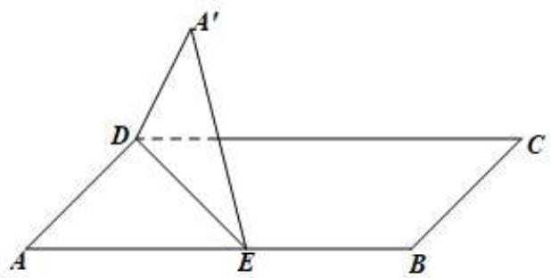

text_image

A'
D
C
A
E
B

2654 (2024·全国·高三专题练习)如图所示,在平行四边形ABCD中,E为AB中点,DE⊥AB,DC=8,DE=6.沿着DE将△ADE折起,使A到达点A'的位置,且平面A'DE⊥平面BCDE.若点P为△ADE内的动点,且满足∠EPB=∠DPC,则点P的轨迹的长度为\_\_\_\_.

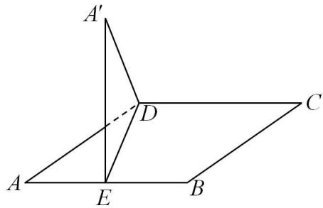

text_image

A'
D
C
A
E
B

2655 (2024·全国·高三专题练习)已知菱形ABCD的边长为2, $\angle ABC = 60^{\circ}$ . 将菱形沿对角线AC折叠成大小为 $60^{\circ}$ 的二面角B' - AC - D. 设E为B'C的中点，F为三棱锥B' - ACD表面上动点，且总满足AC⊥EF，则点F轨迹的长度为 \_\_\_\_.

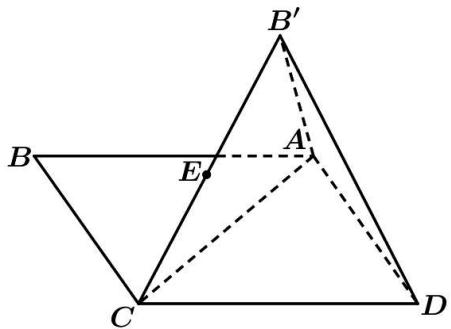

text_image

B'
A
E
C
D

2656 (2024·江苏连云港·高二校考阶段练习)在矩形ABCD中， $AB=\sqrt{3}$ ，AD=1，点E在CD上，现将 $\triangle AED$ 沿AE折起，使面AED⊥面ABC，当E从D运动到C，求点D在面ABC上的射影K的轨迹长度为()

A. $\frac{\sqrt{2}}{2}$

B. $\frac{2\sqrt{2}}{3}$

C. $\frac{\pi}{2}$

D. $\frac{\pi}{3}$

2657 (2024·全国·高三专题练习)已知菱形 ABCD 的各边长为 $2, \angle D = 60^{\circ}$ . 如图所示, 将 $\triangle ACD$ 沿 AC 折起, 使得点 D 到达点 S 的位置, 连接 SB, 得到三棱锥 S-ABC, 此时 SB = 3. E 是线段 SA 的中点, 点 F 在三棱锥 S-ABC 的外接球上运动, 且始终保持 EF⊥AC, 则点 F 的轨迹的周长为 ( )

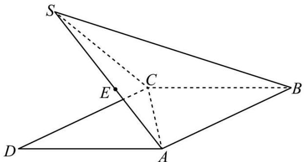

text_image

Geometric diagram of a tetrahedron with labeled vertices and internal points, including dashed lines indicating hidden edges.

A. $\frac{2\sqrt{3}}{3}\pi$

B. $\frac{4\sqrt{3}}{3}\pi$

C. $\frac{5\sqrt{3}}{3}\pi$

D. $\frac{2\sqrt{21}}{3}\pi$

2658 (2024·全国·高三专题练习)已知 $\triangle ABC$ 的边长都为 2, 在边 AB 上任取一点 D, 沿 CD 将 $\triangle BCD$ 折起, 使平面 $BCD \perp$ 平面 ACD. 在平面 BCD 内过点 B 作 BP $\perp$ 平面 ACD,

垂足为P,那么随着点D的变化,点P的轨迹长度为()

A. $\frac{\pi}{6}$

B. $\frac{\pi}{3}$

C. $\frac{2\pi}{3}$

D. $\pi$

2659 (2024·广东中山·高三华南师范大学中山附属中学校考期中)如图,在长方形ABCD中, $AB=\sqrt{3}$ , BC=1,点E为线段DC上一动点,现将 $\Delta$ ADE沿AE折起,使点D在面ABC内的射影K在直线AE上,当点E从D运动到C,则点K所形成轨迹的长度为

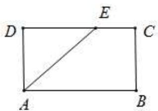

text_image

D
E
C
A
B

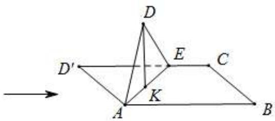

text_image

D
D'
E
C
K
A
B

A. $\frac{\sqrt{3}}{2}$

B. $\frac{2\sqrt{3}}{3}$

C. $\frac{\pi}{3}$

D. $\frac{\pi}{2}$

2660 (2024·全国·高三专题练习)如图,在等腰梯形ABCD中, $CD=2AB=2EF=2a$ ,E,F分别是底边AB,CD的中点,把四边形BEFC沿直线EF折起使得平面BEFC⊥平面ADFE.若动点 $P\in$ 平面ADFE,设PB,PC与平面ADFE所成的角分别为 $\theta_{1},\theta_{2}(\theta_{1},\theta_{2}$ 均不为0).若 $\theta_{1}=\theta_{2}$ ,则动点P的轨迹围成的图形的面积为()

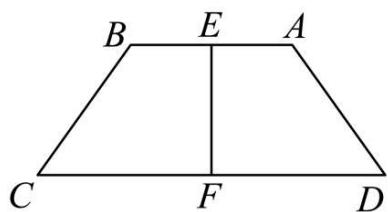

text_image

B E A
C F D

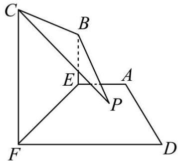

text_image

Geometric diagram with labeled points and lines, showing triangle ABC and quadrilateral DEF with auxiliary point E

A. $\frac{1}{4}a^{2}$

B. $\frac{4}{9}a^{2}$

C. $\frac{1}{4}\pi a^{2}$

D. $\frac{4}{9}\pi a^{2}$

