# 第53讲 传统方法求角度与距离

# 知识梳理

知识点1:线与线的夹角

(1) 位置关系的分类: $\left\{\begin{aligned}& 共面直线 \left\{\begin{aligned}& 平行直线 \\ & 相交直线 \end{aligned}\right.\\& 异面直线: 不同在任何一个平面内, 没有公共点\end{aligned}\right.$   
(2) 异面直线所成的角

①定义: 设 a, b 是两条异面直线, 经过空间任一点 O 作直线 $a' \parallel a$ , $b' \parallel b$ , 把 $a'$ 与 $b'$ 所成的锐角 (或直角) 叫做异面直线 a 与 b 所成的角 (或夹角).  
②范围： $(0,\frac{\pi}{2} ]$   
③求法:平移法:将异面直线 a, b 平移到同一平面内,放在同一三角形内解三角形.知识点2:线与面的夹角

①定义:平面上的一条斜线与它在平面的射影所成的锐角即为斜线与平面的线面角.

②范围： $[0, \frac{\pi}{2}]$

③求法：

常规法: 过平面外一点 B 做 $BB' \perp$ 平面 $\alpha$ ，交平面 $\alpha$ 于点 $B'$ ；连接 $AB'$ ，则 $\angle BAB'$ 即为线 AB 与平面 $\alpha$ 的夹角。接下来在 $Rt\triangle ABB'$ 中解三角形。即 $\sin\angle BAB' = \frac{BB'}{AB} = \frac{h}{\text{线长}}$ （其中 h 即点 B 到面 $\alpha$ 的距离，可以采用等体积法求 h，斜线长即为线段 AB 的长度）；

点 3: 二面角

(1)二面角定义:从一条直线出发的两个半平面所组成的图形称为二面角,这条直线称为二面角的棱,这两个平面称为二面角的面. (二面角 $\alpha-l-\beta$ 或者是二面角 A-CD-B)

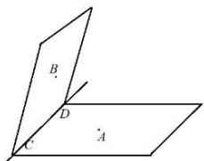

text_image

B
D
C
A

(2) 二面角的平面角的概念: 平面角是指以二面角的棱上一点为端点, 在两个半平面内分别做垂直于棱的两条射线, 这两条射线所成的角就叫做该二面角的平面角; 范围 $[0, \pi]$ .  
(3)二面角的求法

法一:定义法

在棱上取点,分别在两面内引两条射线与棱垂直,这两条垂线所成的角的大小就是二面角的平面角,如图在二面角 $\alpha-l-\beta$ 的棱上任取一点 O,以 O 为垂足,分别在半平面 $\alpha$ 和 $\beta$ 内作垂直于棱的射线 OA 和 OB,则射线 OA 和 OB 所成的角称为二面角的平面角(当然两条垂线的垂足点可以不相同,那求二面角就相当于求两条异面直线的夹角即可).

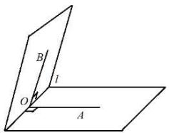

text_image

B
l
O
A

# 法二:三垂线法

在面 $\alpha$ 或面 $\beta$ 内找一合适的点A，作 $\mathrm{AO} \perp \beta$ 于O，过A作AB⊥c于B，则BO为斜线AB在面 $\beta$ 内的射影，∠ABO为二面角 $\alpha - c - \beta$ 的平面角．如图1，具体步骤：

①找点做面的垂线；即过点A，作AO⊥β于O；  
②过点(与①中是同一个点)做交线的垂线;即过A作AB⊥c于B,连接BO;  
③计算：∠ABO为二面角 $\alpha-c-\beta$ 的平面角，在Rt△ABO中解三角形.

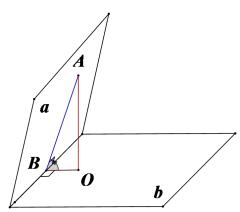

text_image

A
a
B
O
b

图1

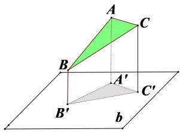

text_image

A
C
B
A'
B'
C'
b

图2

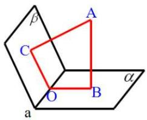

text_image

β
A
C
O
B
α
a

图3

# 法三: 射影面积法

凡二面角的图形中含有可求原图形面积和该图形在另一个半平面上的射影图形面积的都可利用射影面积公式 $(\cos \theta = \frac{S_{\text{射}}}{S_{\text{斜}}} = \frac{S_{\triangle A'B'C'}}{S_{\triangle ABC}}$ ，如图2)求出二面角的大小；

法四:补棱法

当构成二面角的两个半平面没有明确交线时,要将两平面的图形补充完整,使之有明确的交线(称为补棱),然后借助前述的定义法与三垂线法解题. 当二平面没有明确的交线时,也可直接用法三的摄影面积法解题.

法五:垂面法

由二面角的平面角的定义可知两个面的公垂面与棱垂直,因此公垂面与两个面的交线所成的角,就是二面角的平面角.

例如: 过二面角内一点 A 作 AB ⊥ α 于 B, 作 AC ⊥ β 于 C, 面 ABC 交棱 a 于点 O, 则 ∠BOC 就是二面角的平面角. 如图 3. 此法实际应用中的比较少, 此处就不一一举例分析了.

知识点4: 空间中的距离

求点到面的距离转化为三棱锥等体积法求解.

# 必考题型全归纳

# 1 题型一: 异面直线所成角

2661 (2024·四川绵阳·绵阳中学校考二模)如图, 圆柱的轴截面为矩形 ABCD, 点 M, N 分别在上、下底面圆上, $\widehat{NB} = 2\widehat{AN}$ , $\widehat{CM} = 2\widehat{DM}$ , AB = 2, BC = 3, 则异面直线 AM 与 CN 所成角的余弦值为 ()

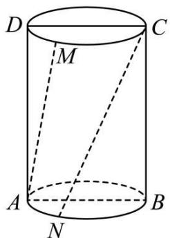

text_image

D
M
C
A
N
B

A. $\frac{3\sqrt{30}}{10}$

B. $\frac{3\sqrt{30}}{20}$

C. $\frac{\sqrt{3}}{5}$

D. $\frac{\sqrt{3}}{4}$

2662 (2024·全国·高三校联考开学考试)如图,在直三棱柱 $ABC-A_{1}B_{1}C_{1}$ 中, AB=BC=AC=AA $_{1}$ , 则异面直线 $AB_{1}$ 与 $BC_{1}$ 所成角的余弦值等于 ()

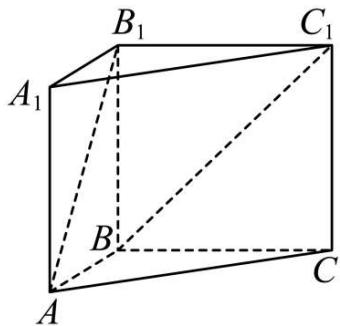

text_image

B₁
C₁
A₁
B
C
A

A. $\frac{\sqrt{3}}{2}$

B. $\frac{1}{2}$

C. $\frac{1}{3}$

D. $\frac{1}{4}$

2663 (2024·江西·高三统考阶段练习)如图,二面角 $\alpha - l - \beta$ 的大小为 $\frac{5\pi}{6}, a \subset \alpha, b \subset \beta$ , 且 a 与交线 l 所成的角为 $\frac{\pi}{3}$ , 则直线 a, b 所成的角的正切值的最小值为 ()

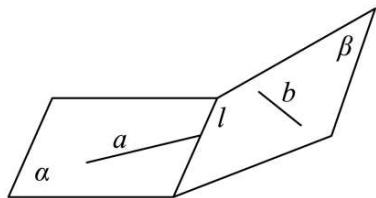

text_image

α
a
l
b
β

A. $\sqrt{3}$

B. $\frac{\sqrt{39}}{13}$

C. $\frac{\sqrt{3}}{3}$

D. $\frac{3\sqrt{13}}{13}$

2664 (2024·河南·洛宁县第一高级中学校联考模拟预测)在正三棱柱 $ABC-A_{1}B_{1}C_{1}$ 中，AB = $AA_{1}$ ，D 为 $A_{1}B_{1}$ 的中点，E 为 $A_{1}C_{1}$ 的中点，则异面直线 AD 与 BE 所成角的余弦值为（）

A. $\frac{\sqrt{6}}{6}$

B. $\frac{\sqrt{35}}{10}$

C. $\frac{\sqrt{35}}{14}$

D. $\frac{\sqrt{35}}{7}$

2665 (2024·全国·高三对口高考)两条异面直线 a、b 所成角为 $\frac{\pi}{3}$ ，一条直线 l 与 a、b 成角都等于 $\alpha$ ，那么 $\alpha$ 的取值范围是（）

A. $\left[\frac{\pi}{3},\frac{\pi}{2}\right]$

B. $\left[\frac{\pi}{6},\frac{\pi}{2}\right]$

C. $\left[\frac{\pi}{6},\frac{5\pi}{6}\right]$

D. $\left[\frac{\pi}{3},\frac{2\pi}{3}\right]$

2666 (2024·四川·校联考模拟预测)在正四棱台 ABCD-A₁B₁C₁D₁ 中，AB=2A₁B₁=4，其体积为 $\frac{28\sqrt{2}}{3}$ , E 为 B₁D₁ 的中点, 则异面直线 AD₁ 与 BE 所成角的余弦值为 ( )

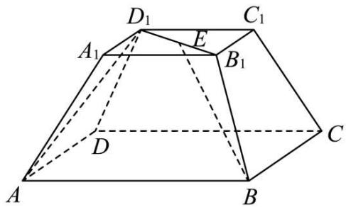

text_image

D₁
C₁
A₁
E
B₁
D
C
A
B

A. $\frac{\sqrt{3}}{10}$

B. $\frac{\sqrt{3}}{5}$

C. $\frac{3\sqrt{3}}{10}$

D. $\frac{\sqrt{30}}{10}$

2667 (2024·黑龙江哈尔滨·哈尔滨市第六中学校校考三模)正三棱柱 ABC - A₁B₁C₁ 的棱长均相等, E 是 B₁C₁ 的中点, 则异面直线 AB₁ 与 BE 所成角的余弦值为 ( )

A. $\frac{\sqrt{2}}{4}$

B. $\frac{\sqrt{2}}{3}$

C. $\frac{\sqrt{10}}{20}$

D. $\frac{3\sqrt{10}}{20}$

# 题型二:线面角

2668 (2024·贵州贵阳·校联考三模)如图,在直三棱柱 $ABC-A_{1}B_{1}C_{1}$ 中, $AB=AC=AA_{1}$ , $\angle BAC=60^{\circ}$ , 则 $AB_{1}$ 与平面 $AA_{1}C_{1}C$ 所成角的正弦值等于 ()

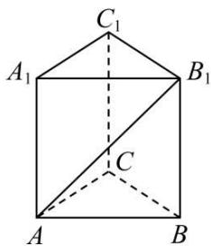

text_image

C₁
A₁ B₁
C
A B

A. $\frac{\sqrt{2}}{2}$

B. $\frac{\sqrt{3}}{2}$

C. $\frac{\sqrt{6}}{4}$

D. $\frac{\sqrt{10}}{4}$

2669 (2024·全国·高三专题练习)如图,在四棱锥 P-ABCD 中, AB // CD, $\angle ABC = 90^{\circ}$ , $\triangle ADP$ 是等边三角形, AB = AP = 2, BP = 3, AD ⊥ BP.

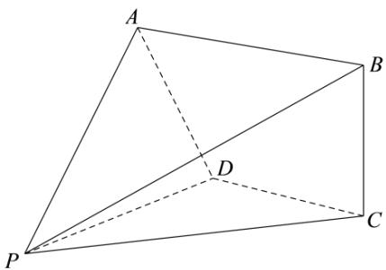

natural_image

Geometric diagram of a tetrahedron with vertices labeled A, B, C, D, and P (no text or symbols present)

(1) 求 BC 的长度;  
(2) 求直线 BC 与平面 ADP 所成的角的正弦值.

2670 (2024·广东阳江·高三统考开学考试)在正三棱台 $\mathrm{ABC - A_1B_1C_1}$ 中， $\mathrm{AB} = 6$ ， $\mathrm{A_1B_1} =$ $\mathrm{AA}_1 = 3$ ，D为 $\mathrm{A_1C_1}$ 中点，E在 $\mathrm{BB}_1$ 上， $\overrightarrow{\mathrm{EB}} = 2\overrightarrow{\mathrm{B_1E}}.$

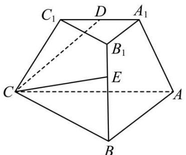

text_image

C₁ D A₁
B₁
E
C A
B

(1) 请作出 $\mathrm{A}_{1} \mathrm{~B}_{1}$ 与平面 CDE 的交点 M, 并写出 $\mathrm{A}_{1} \mathrm{M}$ 与 $\mathrm{MB}_{1}$ 的比值 (在图中保留作图痕迹, 不必写出画法和理由):

(2) 求直线BM与平面ABC所成角的正弦值.

2671 (2024·海南海口·海南华侨中学校考二模)如图,在多面体 ABC-DEFG 中,平面 ABC // 平面 DEFG,底面 ABC 是等腰直角三角形, $AB=BC=\sqrt{2}$ ,侧面 ACGD 是正方形,DA ⊥ 平面 ABC,且 FB // GC,GE ⊥ DE.

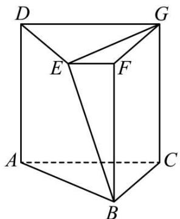

text_image

D
G
E
F
A
C
B

(1) 证明: AE | GE.

(2) 若 O 是 DG 的中点，OE // 平面 BCGF，求直线 OF 与平面 BDG 所成角的正弦值.

2672 (2024·全国·高三专题练习)在三棱锥 O-ABC 中, AB=BC=OB=2, $\angle ABC=120^{\circ}$ , 平面 BCO⊥平面 ABC, 且 OB⊥AB.

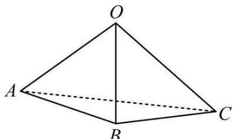

natural_image

Geometric diagram of a tetrahedron with vertices labeled O, A, B, C (no text or symbols present)

(1) 证明: OB | AC:

(2)若F是直线OC上的一个动点,求直线AF与平面ABC所成的角的正切值最大值.

2673 (2024·湖南邵阳·高三统考学业考试)如图,在四棱锥 P-ABCD 中,四边形 ABCD 是边长为 2 的正方形, AC 与 BD 交于点 O, PA ⊥ 面 ABCD,且 PA = 2.

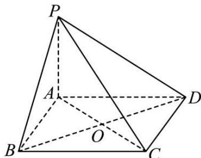

text_image

P
A
D
B
O
C

(1) 求证 BD ⊥ 平面 PAC.;

(2) 求 PD 与平面 PAC 所成角的大小.

2674 (2024·全国·高三专题练习)如图,在三棱柱 $ABC-A_{1}B_{1}C_{1}$ 中, $A_{1}C \perp$ 底面 ABC, $\angle ACB = 90^{\circ}, AA_{1} = 2, A_{1}$ 到平面 $BCC_{1}B_{1}$ 的距离为 1.

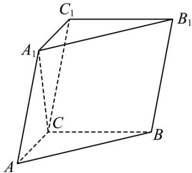

text_image

C₁
A₁
B₁
C
A
B

(1) 证明: $A_{1}C = AC$ ;

(2) 已知 $AA_{1}$ 与 $BB_{1}$ 的距离为 2，求 $AB_{1}$ 与平面 $BCC_{1}B_{1}$ 所成角的正弦值.

2675 (2024·全国·模拟预测)如图,在多面体 ABCDE 中,平面 ACD ⊥ 平面 ABC,BE ⊥ 平面 ABC,△ACD 是边长为 2 的正三角形,AB=BC= $\frac{2\sqrt{3}}{3}$ ,BE= $\sqrt{3}$ .

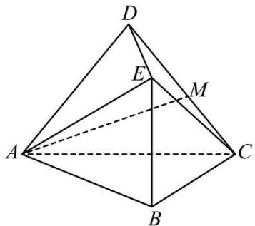

text_image

Geometric diagram of a tetrahedron with labeled vertices A, B, C, D and internal points E, M, showing solid and dashed edges.

(1) 点 M 为线段 CD 上一点, 求证: DE ⊥ AM;

(2) 求 AE 与平面 BCE 所成角的正弦值.

2676 (2024·海南海口·统考模拟预测)如图, 四棱锥 P-ABCD 中, AB // CD, AB ⊥ AD, 平面 PAD ⊥ 平面 PCD.

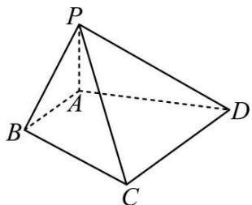

text_image

P
A
B
C
D

(1) 证明: 平面 PAD ⊥ 平面 ABCD;

(2) 若 AD = 2AB = 2, PB = $\sqrt{2}$ , PD = $\sqrt{5}$ , BC 与平面 PCD 所成的角为 $\theta$ , 求 $\sin\theta$ 的最大值.

2677 (2024·全国·模拟预测)如图,在四棱锥 P-ABCD 中,底面为直角梯形,AD // BC, $\angle BAD=90^{\circ}$ , PA ⊥ 底面 ABCD,且 PA=AD=AB=2BC,M,N 分别为 PC,PB 的中点.

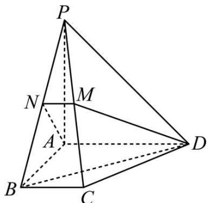

text_image

P
N
M
A
B
C
D

(1) 证明: PB ⊥ DM.
(2) 求 BD 与平面 ADMN 所成角的正弦值.

2678 (2024·全国·高三专题练习)如图所示,在四棱锥 E-ABCD 中,底面 ABCD 为直角梯形, AB // CD, AB = $\frac{1}{2}$ CD, CD ⊥ CE, ∠ADC = ∠EDC = 45°, AD = $\sqrt{2}$ , BE = $\sqrt{3}$ .

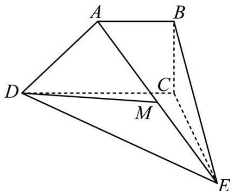

text_image

Geometric diagram of a tetrahedron with labeled vertices A, B, C, D, E, and M, showing solid and dashed edges.

(1) 求证: 平面 ABE ⊥ 平面 ABCD;
(2) 设 M 为 AE 的中点, 求直线 DM 与平面 ABCD 所成角的正弦值.

# 3 题型三:二面角

2679 (2024·全国·高三专题练习)如图,在三棱柱 ABC-A'B'C' 中,已知 CB⊥平面 ABB'A', AB=2,且 AB⊥BB',A'C⊥AB'.

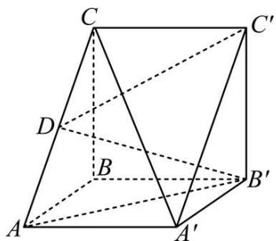

text_image

Geometric diagram of a triangular prism with labeled vertices and internal points, used for spatial geometry problems.

(1) 求 AA' 的长;
(2) 若 D 为线段 AC 的中点, 求二面角 A - B'C' - D 的余弦值.

2680 (2024·全国·高三专题练习)如图,在三棱柱 $ABC-A_{1}B_{1}C_{1}$ 中,侧面 $BB_{1}C_{1}C$ 为菱形, $\angle CBB_{1}=60^{\circ},AB=BC=2,AC=AB_{1}=\sqrt{2}.$

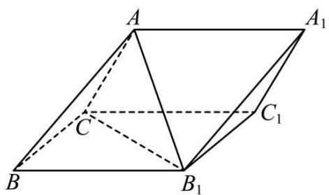

text_image

A
A₁
C
C₁
B
B₁

(1) 证明: 平面 $ACB_{1} \perp$ 平面 $BB_{1}C_{1}C$ ;

(2) 求二面角 A-A₁C₁-B₁ 的余弦值.

2681 (2024·广东深圳·高三校联考开学考试)在四棱锥 P-ABCD 中,底面 ABCD 为正方形, AB⊥PD.

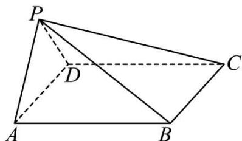

text_image

P
D
A
B
C

(1) 证明: 平面 PAD ⊥ 平面 ABCD;

(2) 若 PA = PD, ∠PDA = 60°, 求平面 PAD 与平面 PBC 夹角的余弦值.

2682 (2024·四川成都·高三川大附中校考阶段练习)如图, AB 是圆 O 的直径, 点 P 在圆 O 所在平面上的射影恰是圆 O 上的点 C, 且 AC = 2BC, 点 D 是 PA 的中点, PO 与 BD 交于点 E, 点 F 是 PC 上的一个动点.

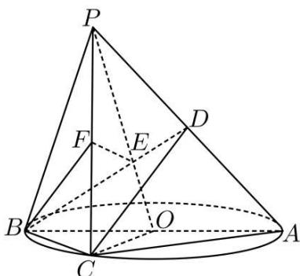

text_image

Geometric diagram of a cone with labeled points and dashed lines indicating hidden edges or projections

(1) 求证: BC | PA;

(2) 求二面角 B-PC-O 平面角的余弦值.

2683 (2024·云南·高三云南师大附中校考阶段练习)已知在四棱锥 P-ABCD 中, AB=4, BC=3, AD=5, $\angle DAB=\angle ABC=\angle CBP=90^{\circ}$ , PA⊥CD, E为CD的中点.

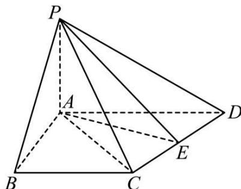

text_image

P
A
B
C
D
E

(1) 证明: 平面 PCD | 平面 PAE:

(2) 若直线 PB 与平面 PAE 所成的角和 PB 与平面 ABCD 所成的角相等, 求二面角 P-

CD-A 的正弦值.

2684 (2024·广东广州·高三广州市第六十五中学校考阶段练习)如图,在五面体 ABCDE 中,
AD ⊥ 平面 ABC, AD // BE, AD = 2BE, AB = BC.

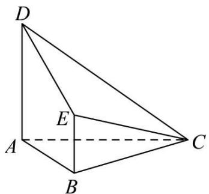

text_image

D
E
A
B
C

(1) 问: 在线段 CD 上是否存在点 P, 使得 PE ⊥ 平面 ACD? 若存在, 请指出点 P 的位置, 并证明; 若不存在, 请说明理由.

(2) 若 $AB = \sqrt{3}$ , AC = 2, AD = 2, 求平面 ECD 与平面 ABC 夹角的余弦值.

2685 (2024·安徽黄山·屯溪一中校考模拟预测)如图,在梯形ABCD中, $AB \parallel CD$ ,AD=DC=CB=1, $\angle ABC=60^{\circ}$ ,四边形ACFE为矩形,平面ACFE⊥平面ABCD,CF=1.

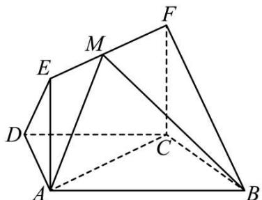

text_image

Geometric diagram of a polyhedron with labeled vertices A, B, C, D, E, F, M and solid/dashed edges indicating 3D perspective.

(1) 求证: BC ⊥ 平面 ACFE;
(2) 求二面角 A - BF - C 的平面角的余弦值;
(3) 若点 M 在线段 EF 上运动, 设平面 MAB 与平面 FCB 所成二面角的平面角为 $\theta (\theta \leqslant 90^{\circ})$ , 试求 $\cos\theta$ 的范围.

2686 (2024·吉林·长春吉大附中实验学校校考模拟预测)如图, AB 是圆 O 的直径, 点 C 是圆 O 上异于 A, B 的点, 直线 PC ⊥ 平面 ABC, E, F 分别是 PA, PC 的中点.

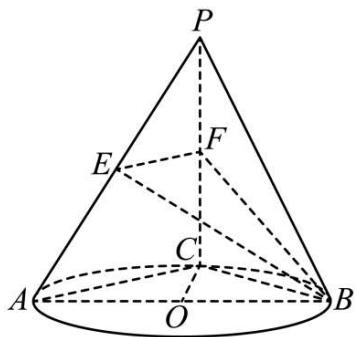

text_image

P
E
F
C
A
O
B

(1) 记平面 BEF 与平面 ABC 的交线为 l，证明： $l \perp$ 平面 PCB；
(2) 设 (1) 中的直线 l 与圆 O 的另一个交点为 D，且点 Q 满足 $\overrightarrow{DQ} = \frac{1}{2} \overrightarrow{CP}$ . 记直线 PQ 与平面 ABC 所成的角为 $\theta$ ，异面直线 PQ 与 EF 所成的角为 $\alpha$ ，二面角 E - l - C 的大小为 $\beta$ ，求证： $\sin\theta = \sin\alpha\sin\beta$ .

2687 (2024·全国·高三专题练习)如图,在三棱锥 P-ABC 中, AB⊥BC, AB=2, BC=

$2\sqrt{2}, \mathrm{PB} = \mathrm{PC} = \sqrt{6}, \mathrm{BP}, \mathrm{AP}, \mathrm{BC}$ 的中点分别为D，E，O，AD $= \sqrt{5}\mathrm{DO}$ ，点F在AC上，BF⊥AO.

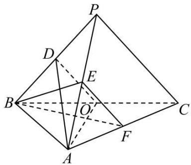

text_image

Geometric diagram of a pyramid with labeled vertices and internal points, used for spatial geometry problems.

(1) 证明: EF // 平面 ADO;  
(2) 证明: 平面 ADO ⊥ 平面 BEF;  
(3) 求二面角 D-AO-C 的正弦值.

2688 (2024·广东广州·统考三模)如图,在几何体 ABCDEF 中,矩形 BDEF 所在平面与平面 ABCD 互相垂直,且 AB = BC = BF = 1, AD = CD = $\sqrt{3}$ , EF = 2.

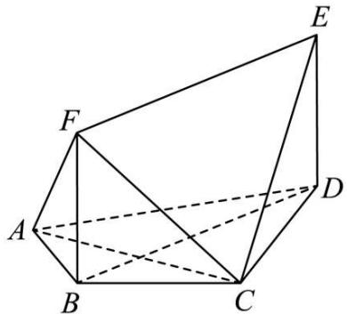

natural_image

Geometric diagram of a polyhedron with labeled vertices A, B, C, D, E, F (no text or symbols present)

(1) 求证: BC ⊥ 平面 CDE;  
(2) 求二面角 E - AC - D 的平面角的余弦值.

2689 (2024·浙江·校联考模拟预测)已知四棱锥 P-ABCD 中, 底面 ABCD 为平行四边形, AB ⊥ AP, 平面 PCD ⊥ 平面 ABCD, PD = AD.

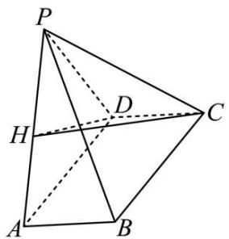

text_image

P
H
D
C
A
B

(1) 若 H 为 AP 的中点, 证明: AP ⊥ 平面 HCD;  
(2) 若 $AB = 1, AD = \sqrt{5}, PA = 2\sqrt{2}$ ，求平面PAB与平面PCD所夹角的余弦值.

2690 (2024·河南·洛宁县第一高级中学校联考模拟预测)在图1中， $\triangle ABC$ 为等腰直角三角形， $\angle B = 90^{\circ}$ ， $AB = 2\sqrt{2}$ ， $\triangle ACD$ 为等边三角形，O为AC边的中点，E在BC边上，且EC=2BE，沿AC将 $\triangle ACD$ 进行折叠，使点D运动到点F的位置，如图2，连接FO，FB，FE，使得FB=4.

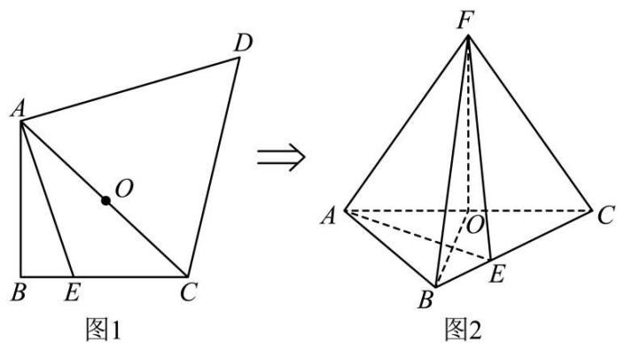

(1) 证明: FO ⊥ 平面 ABC.  
(2) 求二面角 E-FA-C 的余弦值.

2691 (2024·江苏苏州·校联考三模)如图,在三棱锥 P-ABC 中, $\triangle ABC$ 是边长为 $6\sqrt{2}$ 的等边三角形,且 PA=PB=PC=6,PD⊥平面 ABC,垂足为 D,DE⊥平面 PAB,垂足为 E,连接 PE 并延长交 AB 于点 G.

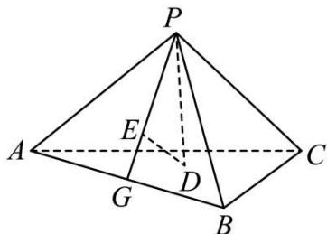

text_image

P
A	E	C
G	D
B

(1) 求二面角 P - AB - C 的余弦值;  
(2) 在平面 PAC 内找一点 F, 使得 EF ⊥ 平面 PAC, 说明作法及理由, 并求四面体 PDEF 的体积.

2692 (2024·全国·高三专题练习)已知四棱锥 P-ABCD 的底面为梯形 ABCD, 且

AB // CD, 又 PA ⊥ AD, AB = AD = 1, CD = 2, 平面 PAD ⊥ 平面 ABCD, 平面 PAD ∩ 平面 PBC = l.

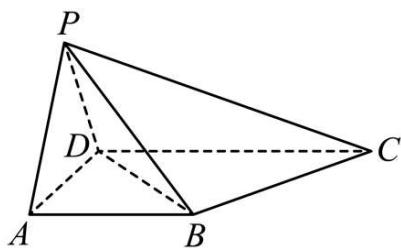

text_image

P
D
A
B
C

(1) 判断直线 l 和 BC 的位置关系, 并说明理由;  
(2) 若点 D 到平面 PBC 的距离为 $\frac{2}{3}$ ，请从下列①②中选出一个作为已知条件，求二面角 B - l - D 余弦值大小.

①CD ⊥ AD;   
② $\angle PAB$ 为二面角 P-AD-B 的平面角.

# 题型四: 距离问题

2693 (2024·山东滨州·高三山东省北镇中学校考阶段练习)如图所示的斜三棱柱 ABC-A₁B₁C₁ 中, AA₁B₁B 是正方形, 且点 C₁ 在平面 AA₁B₁B 上的射影恰是 AB 的中点 H, M 是 C₁B₁ 的中点.

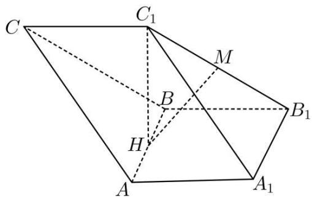

text_image

C
C₁
M
B
B₁
H
A
A₁

(1) 判断 HM 与面 $\mathrm{CAA}_{1} \mathrm{C}_{1}$ 的关系, 并证明你的结论:

(2) 若 $C_{1}H = \sqrt{3}$ , $AB = 2$ , 求斜三棱柱两底面间的距离.

2694 (2024·北京海淀·高三海淀实验中学校考期末)如图,在三棱柱 $ABC-A_{1}B_{1}C_{1}$ 中,平面 $A_{1}C_{1}CA \perp$ 平面 $BCC_{1}B_{1}$ ,侧面 $A_{1}C_{1}CA$ 是边长为 2 的正方形, $C_{1}B=C_{1}C=2,E,F$ 分别为 BC, $A_{1}B_{1}$ 的中点.

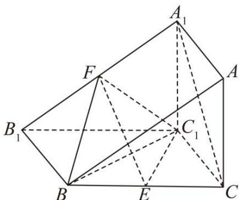

text_image

Geometric diagram of a polyhedron with labeled vertices and internal points, showing solid and dashed edges.

(1) 证明: EF // 面 A₁C₁CA

(2)请再从下列三个条件中选择一个补充在题干中,完成题目所给的问题

①直线 AB 与平面 $BCC_{1}B_{1}$ 所成角的大小为 $\frac{\pi}{4}$ ; ②三棱锥 $F - BC_{1}E$ 的体积为 $\frac{1}{3}$ ; ③ $BC_{1} \perp A_{1}C$ . 若选择条件

求(i)求二面角 $F-BC_{1}-E$ 的余弦值:

(ii) 求直线 EF 与平面 A₁C₁CA 的距离

2695 (2024·全国·高三专题练习)如图,三棱锥 P-ABC 中,△PAB,△ABC 均为等边三角形,PA=4,O 为 AB 中点,点 D 在 AC 上,满足 AD=1,且面 PAB ⊥ 面 ABC.

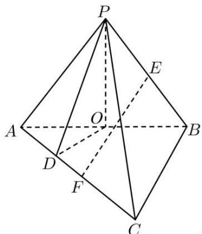

text_image

Geometric diagram of a pyramid with labeled vertices and internal points, used in spatial geometry problems.

(1) 证明: DC | 面 POD:

(2) 若点 E 为 PB 中点, 问: 直线 AC 上是否存在点 F, 使得 EF // 面 POD, 若存在, 求出 FC 的长及 EF 到面 POD 的距离; 若不存在, 说明理由.

2696 (2024·广东河源·高三校联考开学考试)在长方体ABCD-A₁B₁C₁D₁中，AB=BC=

3, $\mathrm{AA}_{1} = 2$ , P, Q 为 $\mathrm{A}_{1}\mathrm{D}_{1}$ , $\mathrm{D}_{1}\mathrm{C}_{1}$ 的中点, S 在 BC 上, 且 BS = 1. 过 P, Q, S 三点的平面与长方体的六个面相交得到六边形 PQRSMN, 则点 M 到直线 QR 的距离为 \_\_\_\_.

2697 (2024·黑龙江·黑龙江实验中学校考二模)在圆台 $O_{1}O_{2}$ 中, ABCD 是其轴截面, AD = DC = BC = $\frac{1}{2}$ AB, 过 $O_{1}C$ 与轴截面 ABCD 垂直的平面交下底面于 EF, 若点 A 到平面 CEF 的距离是 $\sqrt{3}$ , 则圆台的体积等于 \_\_\_\_.

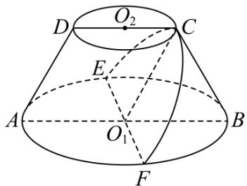

text_image

O₂
D
C
E
A
O₁
B
F

2698 (2024·全国·高三专题练习)如图, 已知 AB, CM 分别为圆柱上、下底面的直径, 且 AB = 2, 圆柱的高为 $\sqrt{3}$ , AB ⊥ CM, 则点 M 到平面 ABC 的距离为 \_\_\_\_.

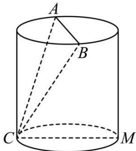

text_image

A
B
C
M

2699 (2024·湖北武汉·高三武汉市黄陂区第一中学校考阶段练习)在四面体 ABCD 中, AB = 1, CD = 2, AB 与 CD 所在的直线间的距离为 3, 且 AB 与 CD 所成的角为 $60^{\circ}$ , 则四面体 ABCD 的体积为 \_\_\_\_.

2700 (2024·浙江绍兴·高三统考开学考试)在正三棱锥 P-ABC 中, $PA=\sqrt{3}$ , 设 M,N 分别是棱 PA, AB 的中点, O 是三棱锥 P-ABC 的外接球的球心, 若 MN ⊥ MC, 则 O 到平面 ABC 的距离为 \_\_\_\_.

2701 (2024·全国·高三对口高考)已知线段AD//α,且AD与平面α的距离为4,点B是平面α上的动点,且满足AB=5,若AD=10,则线段BD长度的取值范围是\_\_\_\_.

2702 (2024·全国·高三专题练习)已知 $\angle ACB = 90^{\circ}$ , P 为平面 ABC 外一点, PC = 4, 点 P 到 $\angle ACB$ 两边 AC, BC 的距离均为 $2\sqrt{3}$ , 那么点 P 到平面 ABC 的距离为 \_\_\_\_.

2703 (2024·安徽滁州·校联考二模)已知两平行平面 $\alpha$ 、 $\beta$ 间的距离为 $2\sqrt{3}$ ，点 A、B $\in \alpha$ ，点 C、D $\in \beta$ ，且 AB = 4, CD = 3，若异面直线 AB 与 CD 所成角为 $60^{\circ}$ ，则四面体 ABCD 的体积为 \_\_\_\_.

