# 第54讲 空间向量及其应用

# 知识梳理

知识点一:空间向量及其加减运算

(1) 空间向量

在空间,我们把具有大小和方向的量叫做空间向量,向量的大小叫做向量的长度或模. 空间向量也可用有向线段表示,有向线段的长度表示向量的模,若向量 $\vec{a}$ 的起点是 A,终点是 B,则向量 $\vec{a}$ 也可以记作 $\overrightarrow{AB}$ , 其模记为 $\left|\vec{a}\right|$ 或 $\left|\overrightarrow{AB}\right|$ .

(2) 零向量与单位向量

规定长度为0的向量叫做零向量,记作 $\vec{0}$ . 当有向线段的起点A与终点B重合时, $\overrightarrow{AB}=\vec{0}$ . 模为1的向量称为单位向量.

(3) 相等向量与相反向量

方向相同且模相等的向量称为相等向量。在空间，同向且等长的有向线段表示同一向量或相等向量。空间任意两个向量都可以平移到同一个平面，成为同一平面内的两个向量。

与向量 $\vec{a}$ 长度相等而方向相反的向量，称为 $\vec{a}$ 的相反向量，记为 $-\vec{a}$ .

(4) 空间向量的加法和减法运算

① $\overrightarrow{\mathrm{OC}} = \overrightarrow{\mathrm{OA}} +\overrightarrow{\mathrm{OB}} = \vec{a} +\vec{b},\overrightarrow{\mathrm{BA}} = \overrightarrow{\mathrm{OA}} -\overrightarrow{\mathrm{OB}} = \vec{a} -\vec{b}.$ 如图所示.

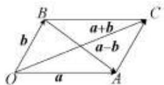

②空间向量的加法运算满足交换律及结合律

$$
\vec {a} + \vec {b} = \vec {b} + \vec {a}, (\vec {a} + \vec {b}) + \vec {c} = \vec {a} + (\vec {b} + \vec {c})
$$

知识点二: 空间向量的数乘运算

(1) 数乘运算

实数 $\lambda$ 与空间向量 $\vec{a}$ 的乘积 $\lambda \vec{a}$ 称为向量的数乘运算。当 $\lambda > 0$ 时， $\lambda \vec{a}$ 与向量 $\vec{a}$ 方向相同；当 $\lambda < 0$ 时，向量 $\lambda \vec{a}$ 与向量 $\vec{a}$ 方向相反。 $\lambda \vec{a}$ 的长度是 $\vec{a}$ 的长度的 $|\lambda|$ 倍。

(2) 空间向量的数乘运算满足分配律及结合律

$$
\lambda (\vec {a} + \vec {b}) = \lambda \vec {a} + \lambda \vec {b}, \lambda (\mu \vec {a}) = (\lambda \mu) \vec {a}.
$$

(3) 共线向量与平行向量

如果表示空间向量的有向线段所在的直线互相平行或重合，则这些向量叫做共线向量或平行向量， $\vec{a}$ 平行于 $\vec{b}$ ，记作 $\vec{a} // \vec{b}$ .

(4) 共线向量定理

对空间中任意两个向量 $\vec{a},\vec{b} (\vec{b}\neq \vec{0}),\vec{a} / / \vec{b}$ 的充要条件是存在实数 $\lambda$ ，使 $\vec{a} = \lambda \vec{b}$

(5) 直线的方向向量

如图8-153所示， $l$ 为经过已知点A且平行于已知非零向量 $\vec{a}$ 的直线．对空间任意一点O，点P在直线 $l$ 上的充要条件是存在实数 $t$ ，使 $\overrightarrow{\mathrm{OP}} = \overrightarrow{\mathrm{OA}} + t\vec{a}$ ①，其中向量 $\vec{a}$ 叫做直线 $l$ 的方向向量，在 $l$ 上取 $\overrightarrow{\mathrm{AB}} = \vec{a}$ ，则式①可化为 $\overrightarrow{\mathrm{OP}} = \overrightarrow{\mathrm{OA}} + t\overrightarrow{\mathrm{AB}} = \overrightarrow{\mathrm{OA}} + t(\overrightarrow{\mathrm{OB}} -\overrightarrow{\mathrm{OA}}) = (1 - t)\overrightarrow{\mathrm{OA}} +$ $t\overrightarrow{\mathrm{OB}}$ ②

①和②都称为空间直线的向量表达式，当 $t=\frac{1}{2}$ ，即点P是线段AB的中点时， $\overrightarrow{OP}=\frac{1}{2}\left(\overrightarrow{OA}+\overrightarrow{OB}\right)$ ，此式叫做线段AB的中点公式.

(6) 共面向量

如图8-154所示，已知平面 $\alpha$ 与向量 $\vec{a}$ ，作 $\overrightarrow{\mathrm{OA}} = \vec{a}$ ，如果直线OA平行于平面 $\alpha$ 或在平面 $\alpha$ 内，则说明向量 $\vec{a}$ 平行于平面 $\alpha$ 。平行于同一平面的向量，叫做共面向量。

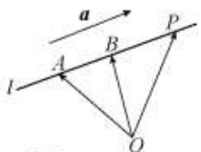

text_image

a
l
A
B
P
O

(7) 共面向量定理

如果两个向量 $\vec{a},\vec{b}$ 不共线，那么向量 $\vec{p}$ 与向量 $\vec{a},\vec{b}$ 共面的充要条件是存在唯一的有序实数对 $(x,y)$ ，使 $\vec{p} = x\vec{a} + y\vec{b}$ .

推论:①空间一点P位于平面ABC内的充要条件是存在有序实数对 $(x,y)$ ，使 $\overrightarrow{AP}=x\overrightarrow{AB}+y\overrightarrow{AC}$ ;或对空间任意一点O，有 $\overrightarrow{OP}-\overrightarrow{OA}=x\overrightarrow{AB}+y\overrightarrow{AC}$ ，该式称为空间平面ABC的向量表达式.

②已知空间任意一点O和不共线的三点A，B，C，满足向量关系式 $\overrightarrow{\mathrm{OP}} = x\overrightarrow{\mathrm{OA}} +y\overrightarrow{\mathrm{OB}} +$ $z\overrightarrow{\mathrm{OC}}$ （其中 $x + y + z = 1)$ 的点P与点A，B，C共面；反之也成立.

知识点三: 空间向量的数量积运算

(1)两向量夹角

已知两个非零向量 $\vec{a},\vec{b}$ ，在空间任取一点O，作 $\overrightarrow{\mathrm{OA}} = \vec{a},\overrightarrow{\mathrm{OB}} = \vec{b}$ ，则∠AOB叫做向量 $\vec{a},\vec{b}$ 的夹角，记作 $\left\langle \vec{a},\vec{b}\right\rangle$ ，通常规定 $0\leqslant \left\langle \vec{a},\vec{b}\right\rangle \leqslant \pi$ ，如果 $\left\langle \vec{a},\vec{b}\right\rangle = \frac{\pi}{2}$ ，那么向量 $\vec{a},\vec{b}$ 互相垂直，记作 $\vec{a}\perp \vec{b}$

(2) 数量积定义

已知两个非零向量 $\vec{a},\vec{b}$ ，则 $\left|\vec{a}\right|\left|\vec{b}\right|\cos \langle \vec{a},\vec{b}\rangle$ 叫做 $\vec{a},\vec{b}$ 的数量积，记作 $\vec{a}\cdot \vec{b}$ ，即 $\vec{a}\cdot \vec{b} =$ $\left|\vec{a}\right|\left|\vec{b}\right|\cos \langle \vec{a},\vec{b}\rangle$ ．零向量与任何向量的数量积为0，特别地， $\vec{a}\cdot \vec{a} = \left|\vec{a}\right|^{2}$

(3) 空间向量的数量积满足的运算律:

$\left(\lambda \vec{a}\right) \cdot \vec{b} = \lambda (\vec{a} \cdot \vec{b}), \vec{a} \cdot \vec{b} = \vec{b} \cdot \vec{a}$ (交换律);

$\vec{a} \cdot (\vec{b} + \vec{c}) = \vec{a} \cdot \vec{b} + \vec{a} \cdot \vec{c}$ (分配律).

知识点四: 空间向量的坐标运算及应用

(1) 设 $\vec{a} = (a_{1}, a_{2}, a_{3})$ , $\vec{b} = (b_{1}, b_{2}, b_{3})$ , 则 $\vec{a} + \vec{b} = (a_{1} + b_{1}, a_{2} + b_{2}, a_{3} + b_{3})$ ;

$$
\vec {a} - \vec {b} = (a _ {1} - b _ {1}, a _ {2} - b _ {2}, a _ {3} - b _ {3});
$$

$$
\lambda \vec {a} = (\lambda a _ {1}, \lambda a _ {2}, \lambda a _ {3});
$$

$$
\vec {a} \cdot \vec {b} = a _ {1} b _ {1} + a _ {2} b _ {2} + a _ {3} b _ {3};
$$

$$
\vec {a} / / \vec {b} (\vec {b} \neq \vec {0}) \Rightarrow a _ {1} = \lambda b _ {1}, a _ {2} = \lambda b _ {2}, a _ {3} = \lambda b _ {3};
$$

$$
\vec {a} \perp \vec {b} \Rightarrow a _ {1} b _ {1} + a _ {2} b _ {2} + a _ {3} b _ {3} = 0.
$$

(2) 设 $\mathrm{A}(x_1, y_1, z_1)$ , $\mathrm{B}(x_2, y_2, z_2)$ , 则 $\overrightarrow{\mathrm{AB}} = \overrightarrow{\mathrm{OB}} - \overrightarrow{\mathrm{OA}} = (x_2 - x_1, y_2 - y_1, z_2 - z_1)$ .

这就是说,一个向量在直角坐标系中的坐标等于表示该向量的有向线段的终点的坐标减起点的坐标.

(3) 两个向量的夹角及两点间的距离公式.

①已知 $\vec{a} = (a_{1}, a_{2}, a_{3})$ ， $\vec{b} = (b_{1}, b_{2}, b_{3})$ ，则 $\left|\vec{a}\right| = \sqrt{\vec{a}^2} = \sqrt{a_1^2 + a_2^2 + a_3^2}$ ；

$$
\left| \vec {b} \right| = \sqrt {\vec {b} ^ {2}} = \sqrt {b _ {1} ^ {2} + b _ {2} ^ {2} + b _ {3} ^ {2}};
$$

$$
\vec {a} \cdot \vec {b} = a _ {1} b _ {1} + a _ {2} b _ {2} + a _ {3} b _ {3};
$$

$$
\cos \left\langle \vec {a}, \vec {b} \right\rangle = \frac {a _ {1} b _ {1} + a _ {2} b _ {2} + a _ {3} b _ {3}}{\sqrt {a _ {1} ^ {2} + a _ {2} ^ {2} + a _ {3} ^ {2}} \sqrt {b _ {1} ^ {2} + b _ {2} ^ {2} + b _ {3} ^ {2}}};
$$

②已知 $\mathrm{A}(x_1,y_1,z_1),\mathrm{B}(x_2,y_2,z_2)$ ，则 $\left|\overrightarrow{\mathrm{AB}}\right| = \sqrt{(x_1 - x_2)^2 + (y_1 - y_2)^2 + (z_1 - z_2)^2},$

或者 $d(\mathbf{A},\mathbf{B}) = |\overrightarrow{\mathbf{AB}}|$ 。其中 $d(\mathbf{A},\mathbf{B})$ 表示 $\mathbf{A}$ 与 $\mathbf{B}$ 两点间的距离，这就是空间两点的距离公式。

(4) 向量 $\vec{a}$ 在向量 $\vec{b}$ 上的投影为 $|\vec{a}| \cos \langle \vec{a}, \vec{b} \rangle = \frac{\vec{a} \cdot \vec{b}}{|\vec{b}|}$ .

知识点五: 法向量的求解与简单应用

(1) 平面的法向量:

如果表示向量 $\vec{n}$ 的有向线段所在直线垂直于平面 $\alpha$ ，则称这个向量垂直于平面 $\alpha$ ，记作 $\vec{n} \perp \alpha$ ，如果 $\vec{n} \perp \alpha$ ，那么向量 $\vec{n}$ 叫做平面 $\alpha$ 的法向量。

几点注意：

①法向量一定是非零向量；②一个平面的所有法向量都互相平行；③向量 $\vec{n}$ 是平面的法向量，向量 $\vec{m}$ 是与平面平行或在平面内，则有 $\vec{m} \cdot \vec{n} = 0$ .

第一步:写出平面内两个不平行的向 $\vec{a}=(x_{1},y_{1},z_{1}),\vec{b}=(x_{2},y_{2},z_{2})$ ;

第二步:那么平面法向量 $\vec{n}=(x,y,z)$ ，满足 $\left\{\begin{aligned}\vec{n}\cdot\vec{a}&=0\\ \vec{n}\cdot\vec{b}&=0\end{aligned}\right.\Rightarrow\left\{\begin{aligned}xx_{1}+yy_{1}+zz_{1}&=0\\ xx_{2}+yy_{2}+zz_{2}&=0\end{aligned}\right.$

(2) 判定直线、平面间的位置关系

①直线与直线的位置关系:不重合的两条直线a,b的方向向量分别为 $\vec{a},\vec{b}$ .

若 $\vec{a} // \vec{b}$ , 即 $\vec{a} = \lambda \vec{b}$ , 则 $a // b$ ;

若 $\vec{a} \perp \vec{b}$ , 即 $\vec{a} \cdot \vec{b} = 0$ , 则 $a \perp b$ .

②直线与平面的位置关系: 直线 l 的方向向量为 $\vec{a}$ ，平面 $\alpha$ 的法向量为 $\vec{n}$ ，且 $l \perp \alpha$ .

若 $\vec{a} // \vec{n}$ , 即 $\vec{a} = \lambda \vec{n}$ , 则 $l \perp \alpha$ ;

若 $\vec{a} \perp \vec{n}$ , 即 $\vec{a} \cdot \vec{n} = 0$ , 则 $\vec{a} // \alpha$ .

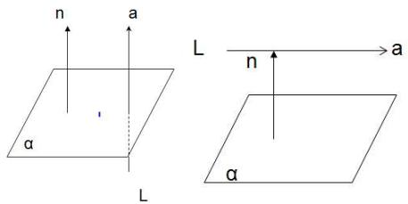

text_image

n
a
L
n
a
α
α
L

(3) 平面与平面的位置关系

平面 $\alpha$ 的法向量为 $\vec{n}_{1}$ ，平面 $\beta$ 的法向量为 $\vec{n}_{2}$ .

若 $\vec{n}_1 / / \vec{n}_2$ ，即 $\vec{n}_1 = \lambda \vec{n}_2$ ，则 $\alpha / / \beta$ ；若 $\vec{n}_1 \perp \vec{n}_2$ ，即 $\vec{n}_1 \cdot \vec{n}_2 = 0$ ，则 $\alpha \perp \beta$

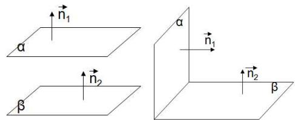

text_image

n₁
α
n₂
β
α
n₁
n₂
β

知识点六:空间角公式.

(1) 异面直线所成角公式: 设 $\vec{a}, \vec{b}$ 分别为异面直线 $l_1, l_2$ 上的方向向量, $\theta$ 为异面直线所成角的大小, 则 $\cos \theta = |\cos \langle \vec{a}, \vec{b} \rangle| = \frac{|\vec{a} \cdot \vec{b}|}{|\vec{a}| |\vec{b}|}$ .

(2) 线面角公式: 设 $l$ 为平面 $\alpha$ 的斜线, $\vec{a}$ 为 $l$ 的方向向量, $\vec{n}$ 为平面 $\alpha$ 的法向量, $\theta$ 为 $l$ 与 $\alpha$ 所成角的大小, 则 $\sin \theta = \left|\cos \langle \vec{a}, \vec{n} \rangle\right| = \frac{\left|\vec{a} \cdot \vec{n}\right|}{\left|\vec{a}\right| \left|\vec{n}\right|}$ .

(3)二面角公式:

设 $n_1, n_2$ 分别为平面 $\alpha, \beta$ 的法向量，二面角的大小为 $\theta$ ，则 $\theta = \left\langle \vec{n}_1, \vec{n}_2 \right\rangle$ 或 $\pi - \left\langle \vec{n}_1, \vec{n}_2 \right\rangle$ （需要根据具体情况判断相等或互补），其中 $|\cos \theta| = \frac{|\vec{n}_1 \cdot \vec{n}_2|}{|\vec{n}_1||\vec{n}_2|}$ .

知识点七:空间中的距离

求解空间中的距离

(1) 异面直线间的距离: 两条异面直线间的距离也不必寻找公垂线段, 只需利用向量的正射影性质直接计算.

如图，设两条异面直线 $a, b$ 的公垂线的方向向量为 $\vec{n}$ ，这时分别在 $a, b$ 上任取A，B两点，则向量在 $\vec{n}$ 上的正射影长就是两条异面直线 $a, b$ 的距离。则 $d = \left|\overrightarrow{\mathrm{AB}} \cdot \frac{\vec{n}}{|\vec{n}|}\right| = \frac{|\overrightarrow{\mathrm{AB}} \cdot \vec{n}|}{|\vec{n}|}$ 即两异面直线间的距离，等于两异面直线上分别任取两点的向量和公垂线方向向量的数量积的绝对值与公垂线的方向向量模的比值。

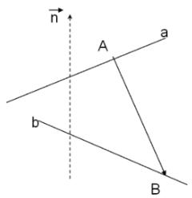

text_image

n
A
a
b
B

(2) 点到平面的距离

A 为平面 $\alpha$ 外一点 (如图), $\vec{n}$ 为平面 $\alpha$ 的法向量, 过 A 作平面 $\alpha$ 的斜线 AB 及垂线 AH.

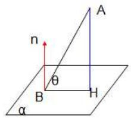

text_image

n
θ
B
H
α
A

$$
| \overrightarrow {\mathrm{AH}} | = | \overrightarrow {\mathrm{AB}} | \cdot \sin \theta = | \overrightarrow {\mathrm{AB}} | \cdot | \cos <   \overrightarrow {\mathrm{AB}}, n > | = | \overrightarrow {\mathrm{AB}} | \frac {| \overrightarrow {\mathrm{AB}} \cdot \vec {n} |}{| \overrightarrow {\mathrm{AB}} | \cdot | \vec {n} |} = \frac {| \overrightarrow {\mathrm{AB}} \cdot \vec {n} |}{| \vec {n} |}
$$

$$
d = \frac {| \overrightarrow {\mathrm{AB}} \cdot \vec {n} |}{| \vec {n} |}
$$

【解题方法总结】

用向量法可以证点共线、线共点、线(或点)共面、两直线(或线与面、面与面)垂直的问题,也可以求空间角和距离.因此,凡涉及上述类型的问题,都可以考虑利用向量法求解,且其解法一般都比较简单.

用向量法解题的途径有两种:一种是坐标法,即通过建立空间直角坐标系,确定出一些点的坐标,进而求出向量的坐标,再进行坐标运算;另一种是基底法,即先选择基向量(除要求不共面外,还要能够便于表示所求的目标向量,并优先选择相互夹角已知的向量作为基底,如常选择几何体上共点而不共面的三条棱所在的向量为基底),然后将有关向量用基底向量表示,并进行向量运算.

# 必考题型全归纳

# 1 题型一: 空间向量的加法、减法、数乘运算

2704 (2024·全国·高三专题练习)下列命题中是假命题的是 （）

A. 任意向量与它的相反向量不相等   
B. 和平面向量类似,任意两个空间向量都不能比较大小  
C. 如果 $\left|\vec{a}\right|=0$ ，则 $\vec{a}=\vec{0}$   
D. 两个相等的向量, 若起点相同, 则终点也相同

2705 (2024·全国·高三对口高考)如图所示,在平行六面体 $ABCD-A_{1}B_{1}C_{1}D_{1}$ 中,M 为 $A_{1}C_{1}$ 与 $B_{1}D_{1}$ 的交点,若 $\overrightarrow{AB}=\overrightarrow{a},\overrightarrow{AD}=\overrightarrow{b},\overrightarrow{AA_{1}}=\overrightarrow{c}$ ,则 $\overrightarrow{BM}=$ ()

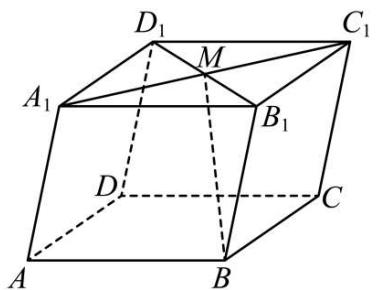

text_image

D₁
M
C₁
A₁
B₁
D
C
A
B

A. $\frac{1}{2}\vec{a} -\frac{1}{2}\vec{b} +\vec{c}$   
C. $-\frac{1}{2}\vec{a}-\frac{1}{2}\vec{b}+\vec{c}$

B. $\frac{1}{2}\vec{a} +\frac{1}{2}\vec{b} +\vec{c}$   
D. $-\frac{1}{2}\vec{a}+\frac{1}{2}\vec{b}+\vec{c}$

2706 (2024·福建福州·福建省福州第一中学校考三模)在三棱锥 P-ABC 中, 点 O 为 △ABC的重心, 点 D, E, F 分别为侧棱 PA, PB, PC 的中点, 若 $\vec{a} = \overrightarrow{AF}, \vec{b} = \overrightarrow{CE}, \vec{c} = \overrightarrow{BD}$ , 则 $\overrightarrow{OP} =$ ( )

A. $\frac{1}{3}\vec{a} +\frac{1}{3}\vec{b} +\frac{1}{3}\vec{c}$

B. $-\frac{1}{3}\vec{a}-\frac{1}{3}\vec{b}-\frac{1}{3}\vec{c}$

C. $-\frac{2}{3}\vec{a}-\frac{1}{3}\vec{b}-\frac{2}{3}\vec{c}$

D. $\frac{2}{3}\vec{a}+\frac{2}{3}\vec{b}+\frac{2}{3}\vec{c}$

2707 (2024·高三课时练习)如图. 空间四边形 OABC 中, $\overrightarrow{OA} = \vec{a}, \overrightarrow{OB} = \vec{b}, \overrightarrow{OC} = \vec{c}$ , 点 M 在 OA 上, 且满足 $\overrightarrow{OM} = 2\overrightarrow{MA}$ , 点 N 为 BC 的中点, 则 $\overrightarrow{MN} =$ ()

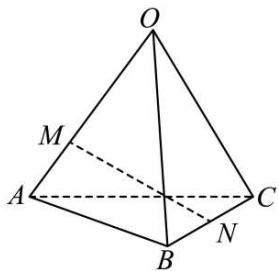

text_image

O
M
A
C
B
N

A. $\frac{1}{2}\vec{a} -\frac{2}{3}\vec{b} +\frac{1}{2}\vec{c}$

B. $\frac{2}{3}\vec{a} +\frac{2}{3}\vec{b} -\frac{1}{2}\vec{c}$

C. $\frac{1}{2}\vec{a}+\frac{1}{2}\vec{b}-\frac{1}{2}\vec{c}$

D. $-\frac{2}{3}\vec{a}+\frac{1}{2}\vec{b}+\frac{1}{2}\vec{c}$

2708 (2024·湖南长沙·高三校联考期中)如图, M 在四面体 OABC 的棱 BC 的中点, 点 N 在线段 OM 上, 且 $MN = \frac{1}{3}OM$ , 设 $\overrightarrow{OA} = \vec{a}, \overrightarrow{OB} = \vec{b}, \overrightarrow{OC} = \vec{c}$ , 则下列向量与 $\overrightarrow{AN}$ 相等的向量是 ()

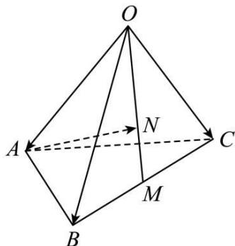

text_image

O
A
N
C
B
M

A. $-\vec{a} + \frac{1}{3}\vec{b} + \frac{1}{3}\vec{c}$

B. $\vec{a} + \frac{1}{3}\vec{b} + \frac{1}{3}\vec{c}$

C. $-\vec{a}+\frac{1}{6}\vec{b}+\frac{1}{6}\vec{c}$

D. $\vec{a}+\frac{1}{6}\vec{b}+\frac{1}{6}\vec{c}$

2709 (2024·全国·高三专题练习)如图,在四面体 O-ABC 中, $G_{1}$ 是 $\triangle ABC$ 的重心,G 是 $OG_{1}$ 上的一点,且 $OG=2GG_{1}$ ,若 $\overrightarrow{OG}=x\overrightarrow{OA}+y\overrightarrow{OB}+z\overrightarrow{OC}$ ,则 $(x,y,z)$ 为()

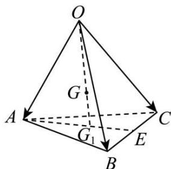

text_image

O
G
A
G₁
B
E
C

A. $\left(\frac{1}{2},\frac{1}{2},\frac{1}{2}\right)$

B. $\left(\frac{2}{3},\frac{2}{3},\frac{2}{3}\right)$

C. $\left(\frac{1}{3},\frac{1}{3},\frac{1}{3}\right)$

D. $\left(\frac{2}{9},\frac{2}{9},\frac{2}{9}\right)$

2710 (2024·全国·高三专题练习)已知在空间单位正交基底下， $\left\{\vec{a},\vec{b},\vec{c}\right\}$ 是空间的一组单位正交基底， $\left\{\vec{a}+\vec{b},\vec{a}-\vec{b},\vec{c}\right\}$ 是空间的另一组基底.若向量 $\vec{p}$ 在基底 $\left\{\vec{a},\vec{b},\vec{c}\right\}$ 下的坐标为(4,2,3)，则向量 $\vec{p}$ 在基底 $\left\{\vec{a}+\vec{b},\vec{a}-\vec{b},\vec{c}\right\}$ 下的坐标为()

A. $(4,0,3)$

B. $(1,2,3)$

C. $(3,1,3)$

D. $(2,1,3)$

# 题型二: 空间共线向量定理的应用

2711 (2024·全国·高三专题练习)若空间中任意四点 O, A, B, P 满足 $\overrightarrow{OP}=m\overrightarrow{OA}+n\overrightarrow{OB}$ ，其中 $m+n=1$ ，则 ()

A. $\mathrm{P} \in \mathrm{AB}$

B. P ∉ AB

C. 点 P 可能在直线 AB 上

D. 以上都不对

2712 (2024·全国·高三专题练习)已知 $\vec{a} = (2, -3, 1)$ ，则下列向量中与 $\vec{a}$ 平行的是（）

A. $(1,1,1)$

B. $(-4,6,-2)$

C. $(2,-3,-1)$

D. $(-2,-3,1)$

2713 (2024·全国·高三专题练习)向量 $\vec{a}$ , $\vec{b}$ 分别是直线 $l_{1}$ , $l_{2}$ 的方向向量, 且 $\vec{a} = (1,3,5)$ , $\vec{b} = (x,y,2)$ , 若 $l_{1} // l_{2}$ , 则 ()

A. $x=\frac{1}{5}$ , $y=\frac{3}{5}$

B. $x = 3, y = 15$

C. $x = \frac{2}{5}, y = \frac{6}{5}$

D. $x = \frac{3}{2}, y = \frac{15}{2}$

2714 (2024·全国·高三专题练习)若点 A(2, -5, -1), B(-1, -4, -2), C(m + 3, -3, n) 在同一条直线上, 则 m - n = ()

A. 21

B. 4

C.-4

D. 10

2715 (2024·全国·高三专题练习)已知 $\vec{a}=(2x,1,3)$ ， $\vec{b}=(1,3,9)$ ，如果 $\vec{a}$ 与 $\vec{b}$ 为共线向量，则 x = ()

A. 1

B. $\frac{1}{2}$

C. $\frac{1}{3}$

D. $\frac{1}{6}$

2716 (2024·浙江·高三专题练习)若 A(m+1, n-1, 3)、B(2m, n, m-2n)、C(m+3, n-3, 9)三点共线，则 $m+n=()$ .

A. 0

B. 1

C. 2

D. 3

# 题型三:空间向量的数量积运算

2717 (多选题)(2024·全国·高三专题练习)已知向量 $\vec{a}=(1,1,1)$ ， $\vec{b}=(-1,0,2)$ ，则下列正确的是()

A. $\vec{a} +\vec{b} = (0,1,3)$

B. $|\vec{a}| = \sqrt{3}$

C. $\vec{a} \cdot \vec{b} = 2$

D. $\langle\vec{a},\vec{b}\rangle=\frac{\pi}{4}$

2718 (多选题)(2024·黑龙江哈尔滨·高三哈尔滨七十三中校考期中)如图,在平行六面体 $ABCD-A_{1}B_{1}C_{1}D_{1}$ 中,其中以顶点A为端点的三条棱长均为6,且彼此夹角都是 $60^{\circ}$ ,下列说法中不正确的是()

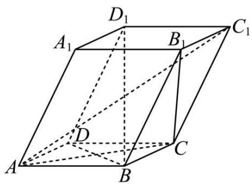

text_image

D₁
A₁ B₁ C₁
D
A B C

A. $AC_{1}=6\sqrt{6}$

B. $AC_{1} \perp BD$

C. 向量 $\overrightarrow{\mathrm{B}_{1}\mathrm{C}}$ 与 $\overrightarrow{\mathrm{AA}_{1}}$ 夹角是 $60^{\circ}$

D. 向量 $\overrightarrow{\mathrm{BD}}_1$ 与 $\overrightarrow{\mathrm{AC}}$ 所成角的余弦值为 $\frac{\sqrt{6}}{3}$

2719 (多选题)(2024·全国·高三专题练习)四面体ABCD中，AB⊥BD，CD⊥BD，AB=3，BD=2，CD=4，平面ABD与平面BCD的夹角为 $\frac{\pi}{3}$ ，则AC的值可能为（）

A. $\sqrt{17}$

B. $\sqrt{23}$

C. $\sqrt{35}$

D. $\sqrt{41}$

2720 (多选题)(2024·校考模拟预测)在平行六面体ABCD-A₁B₁C₁D₁中,已知AB=AD=AA₁=1,∠A₁AB=∠A₁AD=∠BAD=60°,则()

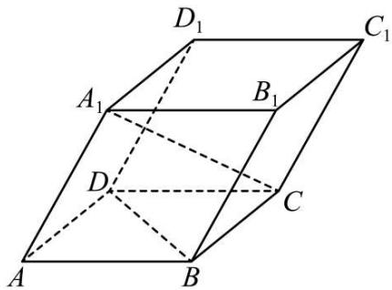

text_image

D₁
A₁
B₁
C₁
D
C
A
B

A. 直线 $\mathrm{A}_{1} \mathrm{C}$ 与 BD 所成的角为 $90^{\circ}$   
B. 线段 $A_{1}C$ 的长度为 $\sqrt{3}$   
C. 直线 $A_{1}C$ 与 $BB_{1}$ 所成的角为 $90^{\circ}$   
D. 直线 $\mathrm{A}_{1} \mathrm{C}$ 与平面ABCD所成角的正弦值为 $\frac{\sqrt{6}}{3}$

2721 (多选题)(2024·全国·高三专题练习)空间直角坐标系中,已知O(0,0,0), $\overrightarrow{OA}=(-1,2,1)$ , $\overrightarrow{OB}=(-1,2,-1)$ , $\overrightarrow{OC}=(2,3,-1)$ ,则()

A. $|\overrightarrow{AB}| = 2$   
B. $\triangle ABC$ 是等腰直角三角形  
C. 与 $\overrightarrow{\mathrm{OA}}$ 平行的单位向量的坐标为 $\left(\frac{\sqrt{6}}{6}, -\frac{\sqrt{6}}{3}, -\frac{\sqrt{6}}{6}\right)$ 或 $\left(-\frac{\sqrt{6}}{6}, \frac{\sqrt{6}}{3}, \frac{\sqrt{6}}{6}\right)$   
D. $\overrightarrow{OA}$ 在 $\overrightarrow{OB}$ 方向上的投影向量的坐标为 $\left(-\frac{2}{3}, \frac{4}{3}, \frac{2}{3}\right)$

2722 (多选题)(2024·全国·高三专题练习)已知空间向量 $\vec{a}=(2,-1,3)$ ， $\vec{b}=(-4,2,x)$ ，下列说法正确的是()

A. 若 $\vec{a} \perp \vec{b}$ ，则 $x = \frac{10}{3}$   
B. 若 $3\vec{a} + \vec{b} = (2, -1, 10)$ ，则 x = 1  
C. 若 $\vec{a}$ 在 $\vec{b}$ 上的投影向量为 $\frac{1}{3}\vec{b}$ ，则 x=4  
D. 若 $\vec{a}$ 与 $\vec{b}$ 夹角为锐角，则 $x \in \left(\frac{10}{3}, +\infty\right)$

2723 (2024·黑龙江哈尔滨·哈尔滨三中校考模拟预测)如图,平行六面体 $ABCD-A_{1}B_{1}C_{1}D_{1}$ 中, $AD=BD=AA_{1}=1$ , $AD\perp BD$ , $\angle A_{1}AB=45^{\circ}$ , $\angle A_{1}AD=60^{\circ}$ , 则线段 $BD_{1}$ 的长为 \_\_\_\_.

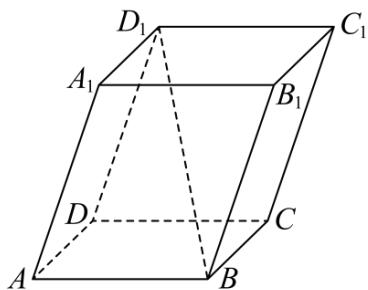

text_image

D₁
A₁
B₁
C₁
D
C
A
B

2724 (2024·全国·高三专题练习)已知空间向量 $\vec{a} = (1,1,0)$ ， $\vec{b} = (-1,0,2)$ ，则 $\vec{a}$ 在 $\vec{b}$ 方向上的投影向量为 \_\_\_\_.

2725 (2024·全国·高三专题练习)已知 MN 是棱长为 2 的正方体 ABCD - A₁B₁C₁D₁ 内切球的一条直径, 则 $\overrightarrow{AM} \cdot \overrightarrow{AN} =$ \_\_\_\_.

2726 (2024·全国·高三对口高考)已知向量 $\vec{a} = (1, 2, 3)$ , $\vec{b} = (-2, -4, -6)$ , $|\vec{c}| = \sqrt{14}$ , 若 $(\vec{a} + \vec{b}) \cdot \vec{c} = 7$ , 则 $\langle \vec{a}, \vec{c} \rangle =$ \_\_\_\_ .

2727 (2024·上海·高三专题练习)已知空间向量 $\vec{a}=(1,2,3)$ , $\vec{b}=(2,-2,0)$ , $\vec{c}=(1,1,\lambda)$ , 若 $\vec{c} \perp (2\vec{a}+b)$ , 则 $\lambda=$ \_\_\_\_.

2728 (2024·上海·高三专题练习)已知向量 $\vec{a} = (0,1,0)$ ，向量 $\vec{b} = (1,1,0)$ ，则 $\vec{a}$ 与 $\vec{b}$ 的夹角的大小为 \_\_\_\_.

# 4 题型四:证明三点共线

2729 (2024·全国·高三专题练习)在四面体 OABC 中, 点 M, N 分别为 OA、BC 的中点, 若 $\overrightarrow{OG} = \frac{1}{3}\overrightarrow{OA} + x\overrightarrow{OB} + y\overrightarrow{OC}$ , 且 G、M、N 三点共线, 则 $x + y =$ \_\_\_\_.

2730 (2024·全国·高三专题练习)已知点 A(1, 2, 3), B(0, 1, 2), C(-1, 0, λ), 若 A, B, C 三点共线, 则 λ = \_\_\_\_.

2731 (2024·全国·高三专题练习)如图,在平行六面体 $ABCD-A_{1}B_{1}C_{1}D_{1}$ 中, $\overrightarrow{C_{1}C}=2\overrightarrow{EC}$ , $\overrightarrow{A_{1}C}=3\overrightarrow{FC}$ .

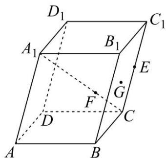

text_image

D₁
A₁
B₁
C₁
E
G
F
D
C
A
B

(1) 求证: A、F、E 三点共线;  
(2) 若点 G 是平行四边形 $B_{1}BCC_{1}$ 的中心, 求证: D、F、G 三点共线.

2732 (2024·全国·高三专题练习)在长方体 $\mathrm{ABCD - A_1B_1C_1D_1}$ 中，M为 $\mathrm{DD}_1$ 的中点，N在AC上，且AN:NC=2:1，E为BM的中点.求证： $\mathrm{A}_1,\mathrm{E},\mathrm{N}$ 三点共线

# 5 题型五:证明多点共面的方法

2733 (2024·全国·高三专题练习)下面关于空间向量的说法正确的是 （）

A. 若向量 $\vec{a}, \vec{b}$ 平行，则 $\vec{a}, \vec{b}$ 所在直线平行  
B. 若向量 $\vec{a}, \vec{b}$ 所在直线是异面直线，则 $\vec{a}, \vec{b}$ 不共面  
C. 若 A, B, C, D 四点不共面，则向量 $\overrightarrow{AB}$ , $\overrightarrow{CD}$ 不共面  
D. 若 A, B, C, D 四点不共面，则向量 $\overrightarrow{AB}$ , $\overrightarrow{AC}$ , $\overrightarrow{AD}$ 不共面

2734 (2024·江苏常州·高三校考阶段练习)以下四组向量在同一平面的是 （）

A. $(1,1,0)$ 、 $(0,1,1)$ 、 $(1,0,1)$   
C. $(1,2,3)$ 、 $(1,3,2)$ 、 $(2,3,1)$

B. $(3,0,0)$ 、 $(1,1,2)$ 、 $(2,2,4)$

D. $(1,0,0)$ 、 $(0,0,2)$ 、 $(0,3,0)$

2735 (2024·全国·高三对口高考)已知 $\vec{a}=(2,-1,3),\vec{b}=(-1,4,-2),\vec{c}=(7,5,\lambda)$ ，若 $\vec{a},\vec{b},\vec{c}$ 三向量共面，则 $\lambda$ 等于（）

A. $\frac{62}{7}$

B. 9

C. $\frac{64}{7}$

D. $\frac{65}{7}$

2736 (2024·江西·校联考二模)在四棱锥 P-ABCD 中,棱长为 2 的侧棱 PD 垂直底面边长为 2 的正方形 ABCD, M 为棱 PD 的中点,过直线 BM 的平面 $\alpha$ 分别与侧棱 PA、PC 相交于点 E、F,当 PE=PF 时,截面 MEBF 的面积为 ( )

A. $2 \sqrt{2}$

B. 2

C. $3 \sqrt{3}$

D. 3

2737 (2024·全国·高三专题练习) O 为空间任意一点, 若 $\overrightarrow{\mathrm{OP}} = \frac{3}{4}\overrightarrow{\mathrm{OA}} + \frac{1}{8}\overrightarrow{\mathrm{OB}} + t\overrightarrow{\mathrm{OC}}$ , 若 A, B, C, P 四点共面, 则 $t =$ ()

A. 1

B. $\frac{1}{2}$

C. $\frac{1}{8}$

D. $\frac{1}{4}$

2738 (2024·全国·高三专题练习)已知空间 A、B、C、D 四点共面,且其中任意三点均不共线,设 P 为空间中任意一点,若 $\overrightarrow{BD}=5\overrightarrow{PA}-4\overrightarrow{PB}+\lambda\overrightarrow{PC}$ ,则 $\lambda=$ ()

A. 2

B.-2

C. 1

D.-1

2739 (2024·广东广州·高三执信中学校考阶段练习)如图所示的木质正四棱锥模型 P-ABCD, 过点 A 作一个平面分别交 PB, PC, PD 于点 E, F, G, 若 $\frac{\mathrm{PE}}{\mathrm{PB}} = \frac{3}{5}, \frac{\mathrm{PF}}{\mathrm{PC}} = \frac{1}{2}$ , 则 $\frac{\mathrm{PG}}{\mathrm{PD}}$ 的值为 ( )

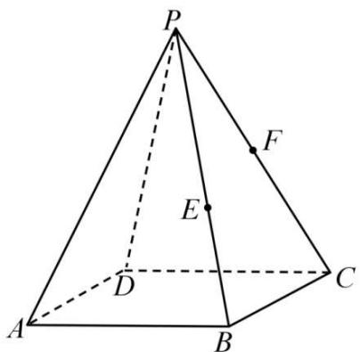

text_image

P
F
E
D
A
B
C

A. $\frac{1}{4}$

B. $\frac{2}{3}$

C. $\frac{3}{4}$

D. $\frac{3}{5}$

2740 (2024·甘肃平凉·高三统考期中)对于空间任意一点O和不共线的三点A,B,C,有如下关系: $\overrightarrow{OP} = \frac{1}{6}\overrightarrow{OA} + \frac{1}{3}\overrightarrow{OB} + \frac{1}{2}\overrightarrow{OC}$ , 则()

A. O, A, B, C 四点必共面

B. P, A, B, C 四点必共面

C. O, P, B, C 四点必共面

D. O, P, A, B, C 五点必共面

2741 (2024·全国·高三专题练习)已知 A、B、C 三点不共线, 对平面 ABC 外的任一点 O, 下列条件中能确定点 M 与点 A、B、C 一定共面的是 ()

A. $\overrightarrow{\mathrm{OM}} = \overrightarrow{\mathrm{OA}} +\overrightarrow{\mathrm{OB}} +\overrightarrow{\mathrm{OC}}$

B. $\overrightarrow{\mathrm{OM}} = \frac{1}{3}\overrightarrow{\mathrm{OA}} +\frac{1}{3}\overrightarrow{\mathrm{OB}} +\frac{1}{3}\overrightarrow{\mathrm{OC}}$

C. $\overrightarrow{OM}=\overrightarrow{OA}+\frac{1}{2}\overrightarrow{OB}+\frac{1}{3}\overrightarrow{OC}$

D. $\overrightarrow{\mathrm{OM}} = 2\overrightarrow{\mathrm{OA}} -\overrightarrow{\mathrm{OB}} -\overrightarrow{\mathrm{OC}}$

2742 (2024·全国·高三专题练习)如图,正四棱锥 P-ABCD 的底面边长和高均为 2,E,F 分别为 PD,PB 的中点.

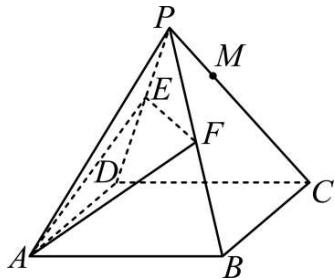

text_image

Geometric diagram of a triangular pyramid with labeled vertices and internal points, used for spatial geometry problems.

(1) 若点 M 是线段 PC 上的点, 且 $PM = \frac{1}{3}PC$ , 判断点 M 是否在平面 AEF 内, 并证明你的结论;  
(2) 求直线 PB 与平面 AEF 所成角的正弦值.

2743 (2024·全国·高三专题练习)如图,在几何体 ABCDE 中, $\triangle ABC$ , $\triangle BCD$ , $\triangle CDE$ 均为边长为 2 的等边三角形,平面 ABC⊥平面 BCD,平面 DCE⊥平面 BCD. 求证: A, B, D, E 四点共面;

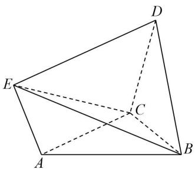

text_image

Geometric diagram of a tetrahedron with labeled vertices A, B, C, D, E and solid/dashed edges indicating 3D perspective.

2744 (2024·全国·高三专题练习)如图,四边形ABEF为正方形,若平面ABCD⊥平面ABEF,AD//BC,AD⊥DC,AD=2DC=2BC.

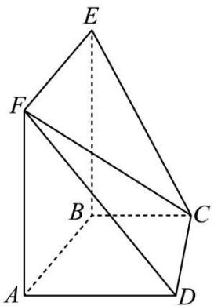

text_image

Geometric diagram of a polyhedron with labeled vertices A, B, C, D, E, F and internal diagonals

(1) 求二面角 A-CF-D 的余弦值;

(2) 判断点 D 与平面 CEF 的位置关系, 并说明理由.

2745 (2024·全国·高三专题练习)如图,在边长为3的正方体 $ABCD-A_{1}B_{1}C_{1}D_{1}$ 中,点P,Q,R分别在棱AB, $B_{1}C_{1}$ , $D_{1}D$ 上,且AP= $B_{1}Q=D_{1}R=1$ .

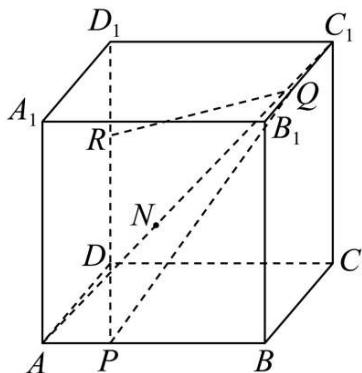

text_image

D₁
C₁
A₁
R
Q
B₁
N
D
C
A
P
B

(1) 求点 D 到平面 PQR 的距离;

(2) 若平面 PQR 与线段 $AC_{1}$ 的交点为 N, 求 $\frac{AN}{AC_{1}}$ 的值.

2746 (2024·四川成都·石室中学校考模拟预测)如图四棱锥 P-ABCD, $\angle ABC = 90^{\circ}$ , AD // BC, 且 $AD = AB = \frac{1}{2}BC = 2$ , 平面 PCD ⊥ 平面 ABCD, 且 $\triangle PDC$ 是以 $\angle DPC$ 为直角的等腰直角三角形, 其中 E 为棱 PC 的中点, 点 F 在棱 PD 上, 且 PF = 2FD.

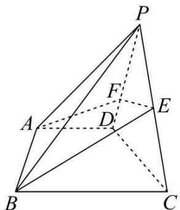

text_image

Geometric diagram of a tetrahedron with labeled vertices and internal points, used for spatial geometry problems.

(1) 求证: A, B, E, F 四点共面;

# 6 题型六:证明直线和直线平行

2747 (2024·高二课时练习)如图所示,在四棱锥 P-ABCD 中,底面 ABCD 为矩形,PD⊥平面 ABCD,E 为 CP 的中点,N 为 DE 的中点, $DM=\frac{1}{4}DB,DA=DP=1,CD=2$ ,求证:MN//AP.

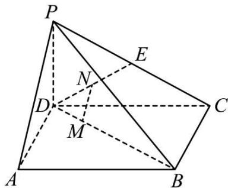

text_image

P
E
N
D
M
A
B
C

2748 (2024·高二课时练习)已知棱长为1的正方体OABC- $-\mathrm{O}_{1}\mathrm{A}_{1}\mathrm{B}_{1}\mathrm{C}_{1}$ 在空间直角坐标系中的位置如图所示，D,E,F,G分别为棱 $\mathrm{O}_1\mathrm{A}_1,\mathrm{A}_1\mathrm{B}_1,\mathrm{BC},\mathrm{OC}$ 的中点，求证：DE//GF.

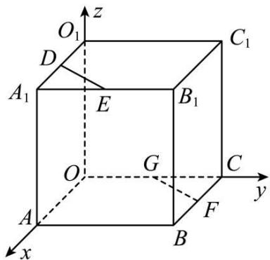

text_image

O₁
z
C₁
D
A₁
E
B₁
O
G
C
y
A
F
B
x

2749 (2024·高二课时练习)如图, 四边形 ABCD 和 ABEF 都是平行四边形, 且不共面, M, N 分别是 AC, BF 的中点, 求证: CE // MN.

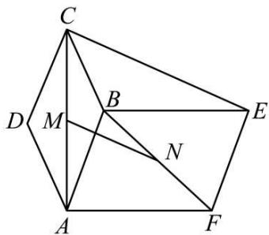

text_image

Geometric diagram of a polyhedron with labeled vertices and internal points, showing edges and diagonals.

2750 (2024·全国·高三专题练习)在四棱锥 P-ABCD 中, 平面 ABCD ⊥ 平面 PCD, 底面 ABCD 为梯形. AB // CD, AD ⊥ DC, 且 AB = 1, AD = DC = DP = 2, ∠PDC = 120°. 若 M 是棱 PA 的中点, 则对于棱 BC 上是否存在一点 F, 使得 MF 与 PC 平行.

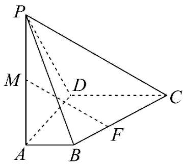

text_image

P
M
D
C
A
B
F

# 题型七:证明直线和平面平行

2751 (2024·全国·高三专题练习)在苏州博物馆有一类典型建筑八角亭,既美观又利于采光,其中一角如图所示,为多面体 $ABCDE-A_{1}B_{1}C_{1}D_{1}E_{1}$ , $AB\perp AE$ , $AE\parallel BC$ , $AB\parallel ED$ , $AA_{1}\perp$ 底面 ABCDE, 四边形 $A_{1}B_{1}C_{1}D_{1}$ 是边长为2的正方形且平行于底面, $AB\parallel A_{1}B_{1}$ , $D_{1}E$ , $B_{1}B$ 的中点分别为F, G, AB = AE = 2DE = 2BC = 4, $AA_{1} = 1$ .

natural_image

Architectural rendering of a modern building with geometric facade and water reflection (no text or symbols visible)

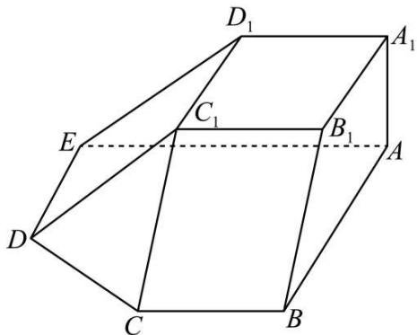

text_image

D₁
A₁
C₁
E
B₁
A
D
C
B

(1) 证明: FG // 平面 C₁CD;

2752 (2024·广东潮州·高三校考阶段练习)如图,四棱锥 P-ABCD 中,底面 ABCD 为矩形, PA⊥平面 ABCD,E 为 PD 的中点.

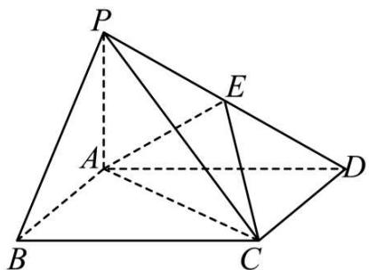

text_image

Geometric diagram of a tetrahedron with labeled vertices P, A, B, C, D, E and solid/dashed edges indicating 3D perspective.

(1) 证明: PB // 平面 AEC

2753 (2024·天津滨海新·高三校考期中)如图, AD // BC 且 AD = 2BC, AD ⊥ CD,
EG // AD 且 EG = AD, CD // FG 且 CD = 2FG, DG ⊥ 平面 ABCD, DA = DC = DG
= 2.

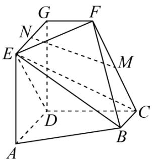

text_image

G
F
N
E
M
D
C
A
B

(1) 若 M 为 CF 的中点, N 为 EG 的中点, 求证: MN // 平面 CDE;

2754 (2024·全国·高三专题练习)如图,在四棱锥 P-ABCD 中,底面 ABCD 为矩形,平面 PAD ⊥ 平面 ABCD, AD ⊥ MN, AB = 2, AD = AP = 4, M, N 分别是 BC, PD 的中点.

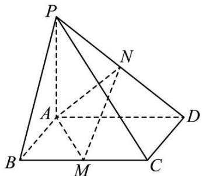

text_image

Geometric diagram of a pyramid with labeled vertices and internal points, including dashed lines for hidden edges.

(1) 求证: MN // 平面 PAB;

2755 (2024·陕西汉中·校联考模拟预测)如图,在四棱锥 P-ABCD 中,底面 ABCD 为正方形,PA ⊥ 平面 ABCD,E 为 PD 的中点,PA = AB = 2.

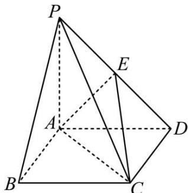

text_image

Geometric diagram of a pyramid with labeled vertices P, A, B, C, D, E and solid/dashed edges indicating 3D perspective.

(1) 求证: PB // 平面 AEC;

2756 (2024·全国·高三对口高考)如图所示的几何体中,四边形ABCD是等腰梯形,AB//CD, $\angle DAB=60^{\circ}$ ,FC⊥平面ABCD,AE⊥BD,CB=CD=CF.

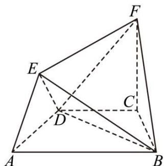

text_image

Geometric diagram of a tetrahedron with labeled vertices A, B, C, D, E, F and internal diagonals

(1) 求二面角 D-BF-C 的余弦值;

(2) 在线段 AB(含端点) 上, 是否存在一点 P, 使得 FP // 平面 AED. 若存在, 求出 $\frac{AP}{AB}$ 的

值;若不存在,请说明理由.

# 8 题型八:证明平面与平面平行

2757 (2024·全国·高一专题练习)如图所示,正四棱 $ABCD-A_{1}B_{1}C_{1}D_{1}$ 的底面边长1,侧棱长4, $AA_{1}$ 中点为E, $CC_{1}$ 中点为F. 求证:平面BDE//平面 $B_{1}D_{1}F$ .

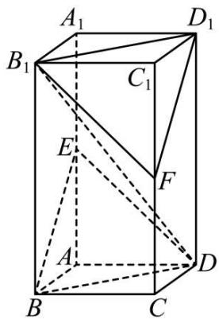

text_image

A₁
B₁
C₁
D₁
E
F
A
B
C
D

2758 (2024·高二课时练习)如图,在直四棱柱 $ABCD-A_{1}B_{1}C_{1}D_{1}$ 中,底面 ABCD 为等腰梯形, AB // CD, AB=4, BC=CD=2, $AA_{1}=2$ , F 是棱 AB 的中点. 求证:平面 $AA_{1}D_{1}D$ // 平面 $FCC_{1}$ .

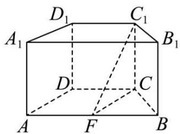

text_image

D₁ C₁
A₁ B₁
D C
A F B

2759 (2024·高二课时练习)如图所示,平面 PAD ⊥ 平面 ABCD,四边形 ABCD 为正方形, $\triangle PAD$ 是直角三角形,且 PA = AD = 2,E,F,G 分别是线段 PA,PD,CD 的中点,求证:平面 EFG // 平面 PBC.

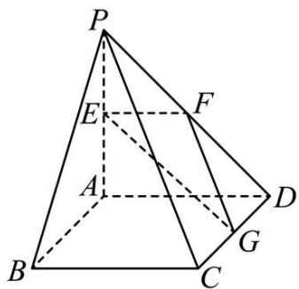

text_image

Geometric diagram of a pyramid with labeled vertices and internal points, used for spatial geometry problems.

2760 (2024·高二课时练习)在正方体 $\mathrm{ABCD - A_1B_1C_1D_1}$ 中，M,N,P分别是 $\mathrm{CC}_1,\mathrm{B}_1\mathrm{C}_1,\mathrm{C}_1\mathrm{D}_1$ 的中点，试建立适当的空间直角坐标系，求证：平面MNP//平面 $\mathrm{A}_1\mathrm{BD}$

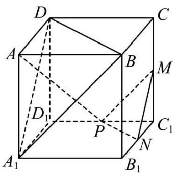

text_image

D
A
B
C
M
D
P
C₁
N
A₁
B₁

# 题型九:证明直线与直线垂直

2761 (2024·山西太原·高二统考期中)如图,在平行六面体 $ABCD-A_{1}B_{1}C_{1}D_{1}$ 中, AB=AD = 4, $AA_{1}=5$ , $\angle DAB=\angle DAA_{1}=\angle BAA_{1}=60^{\circ}$ .

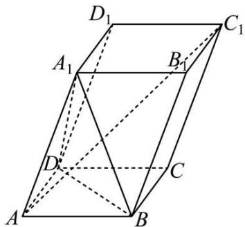

text_image

D₁
A₁
B₁
C₁
D
C
A
B

(1) 求 $AC_{1}$ 的长;  
(2) 求证: $AC_{1} \perp BD.$

2762 (2024·北京海淀·高二校考期中)已知三棱锥 P-ABC(如图1)的平面展开图(如图2)中,四边形ABCD为边长为 $\sqrt{2}$ 的正方形, $\triangle ABE$ 和 $\triangle BCF$ 均为正三角形.在三棱锥P-ABC中:

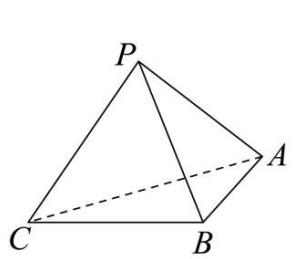

text_image

P
A
C
B

(图1)

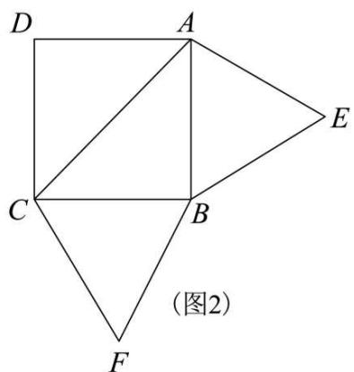

text_image

D
A
E
C
B
(图2)
F

(1) 求点 A 到平面 BCP 的距离；
(2) 若点 M 在棱 PC 上，满足 $\frac{CM}{CP} = \lambda, \lambda \in \left[\frac{1}{3}, \frac{2}{3}\right]$ ，点 N 在棱 BP 上，且 $BM \perp AN$ ，求 $\frac{BN}{BP}$ 的取值范围.

2763 (2024·全国·高三专题练习)如图,平行六面体 $ABCD-A_{1}B_{1}C_{1}D_{1}$ 的所有棱长均为 $\sqrt{2}$ ，底面 ABCD 为正方形， $\angle A_{1}AB=\angle A_{1}AD=\frac{\pi}{3}$ ，点 E 为 $BB_{1}$ 的中点，点 F 为 $CC_{1}$ 的中点，动点 P 在平面 ABCD 内.

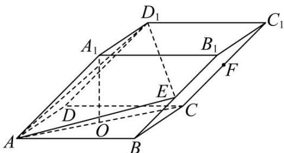

text_image

D₁
A₁
B₁
C₁
F
E
D
O
C
A
B

(1) 若 O 为 AC 中点, 求证: $A_{1}O \perp AO$ ;  
(2) 若 FP // 平面 D₁AE, 求线段 CP 长度的最小值.

2764 (2024·湖南长沙·雅礼中学校考一模)斜三棱柱 ABC - A₁B₁C₁ 的各棱长都为 2, ∠A₁AB = 60°, 点 A₁ 在下底面 ABC 的投影为 AB 的中点 O.

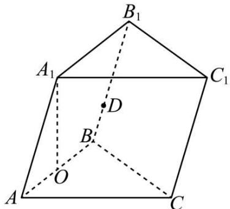

text_image

B₁
A₁ C₁
D
B
O
A C

(1) 在棱 $BB_{1}$ (含端点) 上是否存在一点 D 使 $A_{1}D \perp AC_{1}$ ? 若存在, 求出 BD 的长; 若不存在, 请说明理由;

2765 (2024·贵州遵义·统考三模)如图,棱台 ABCD - A'B'C'D' 中, AA' = BB' = CC' = DD' = $\sqrt{5}$ ,底面 ABCD 是边长为 4 的正方形,底面 A'B'C'D' 是边长为 2 的正方形,连接 AC', BD, DC'.

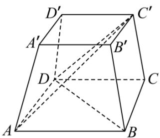

text_image

D'
A'
B'
C'
D
C
A
B

(1) 证明: AC' ⊥ BD;

2766 (2024·江西鹰潭·高三贵溪市实验中学校考阶段练习)如图,在三棱柱 ABC-A₁B₁C 中,CC₁⊥平面 ABC,AC⊥BC,BC=AC=CC₁=4,D 为 AB₁ 的中点,CB₁交 BC₁ 于点 E.

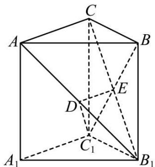

text_image

Geometric diagram of a cube with labeled vertices and internal points, showing solid and dashed edges for spatial relationships.

(1) 证明: $\mathrm{CB}_{1} \perp \mathrm{C}_{1} \mathrm{~D}$ ;

2767 (2024·黑龙江哈尔滨·哈尔滨市第六中学校校考三模)已知直三棱柱 $ABC-A_{1}B_{1}C_{1}$ 中，侧面 $AA_{1}B_{1}B$ 为正方形，AB=BC，E，F 分别为 AC 和 $CC_{1}$ 的中点，D 为棱 $A_{1}B_{1}$ 上的动点. $BF \perp A_{1}B_{1}$ .

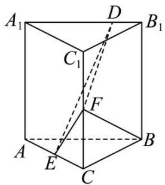

text_image

A₁
D
B₁
C₁
F
A
E
C
B

(1) 证明: BF ⊥ DE;

# 题型十:证明直线与平面垂直

2768 (2024·内蒙古乌兰察布·校考三模)如图,在四棱锥 P-ABCD 中, PD⊥底面 ABCD, 底面 ABCD 是边长为 2 的正方形, PD=DC, F, G 分别是 PB, AD 的中点.

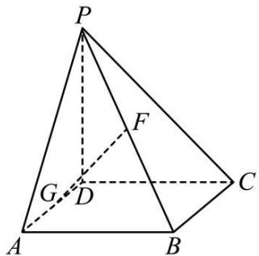

text_image

P
F
G
D
A
B
C

(1) 求证: GF ⊥ 平面 PCB;

2769 (2024·吉林通化·梅河口市第五中学校考模拟预测)如图,已知直三棱柱 ABC-FGE, AC=BC=4,AC⊥BC,O 为 BC 的中点,D 为侧棱 BG 上一点,且 BD= $\frac{1}{4}$ BG,三棱柱 ABC-FGE 的体积为 32.

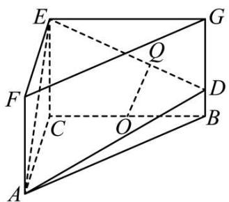

text_image

Geometric diagram of a 3D polyhedron with labeled vertices and internal diagonals

(1) 过点 O 作 $OQ \perp DE$ ，垂足为点 Q，求证： $BQ \perp$ 平面 ACQ；

2770 (2024·上海黄浦·上海市大同中学校考三模)如图,直三棱柱 $ABC-A_{1}B_{1}C_{1}$ 中, $\angle BAC=90^{\circ}$ , $|AB|=|AC|=2$ , $|AA_{1}|=4$ , D 为 BC 的中点, E 为 $CC_{1}$ 上的点, 且 $|CE|=\frac{1}{4}|CC_{1}|$ .

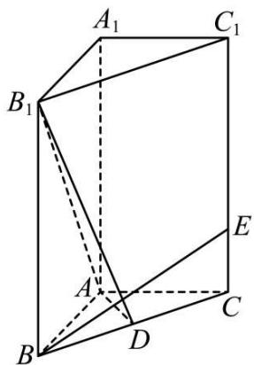

text_image

A₁
C₁
B₁
E
A
C
B
D

(1) 求证: BE ⊥ 平面 ADB $_{1}$ ;

2771 (2024·全国·高三专题练习)如图,直三棱柱 $ABC-A_{1}B_{1}C_{1}$ 的侧面 $BCC_{1}B_{1}$ 为正方形, $2AB=BC=2,E,F$ 分别为 AC, $CC_{1}$ 的中点, $BF\perp A_{1}B_{1}$ .

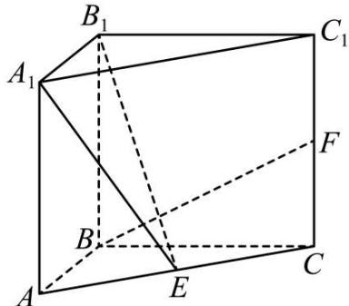

text_image

B₁
A₁
C₁
F
B
A
E
C

(1) 证明: BF ⊥ 平面 A₁B₁E;

# 11 题型十一:证明平面和平面垂直

2772 (2024·广东深圳·统考模拟预测)在正方体 $\mathrm{ABCD - A_1B_1C_1D_1}$ 中，如图E、F分别是 $\mathrm{BB}_1$ ，CD的中点.

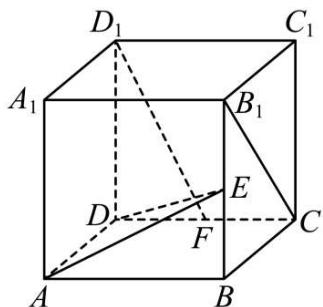

text_image

D₁
C₁
A₁
B₁
D
E
F
C
A
B

(1) 求证: 平面 $AD_{1}F \perp$ 平面 ADE;

2773 (2024·全国·高三专题练习)已知在直三棱柱 $ABC-A_{1}B_{1}C_{1}$ 中, 其中 $AA_{1}=2AC=4$ , AB=BC, F 为 $BB_{1}$ 的中点, 点 E 是 $CC_{1}$ 上靠近 $C_{1}$ 的四等分点, $A_{1}F$ 与底面 ABC 所成角的余弦值为 $\frac{\sqrt{2}}{2}$ .

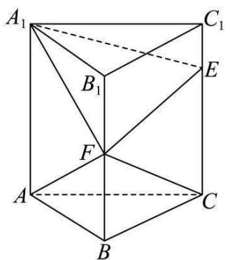

text_image

A₁
B₁
F
A
C
B
C₁
E

(1) 求证: 平面 AFC ⊥ 平面 A₁EF;

2774 (2024·北京丰台·北京丰台二中校考三模)如图,在四棱锥 P-ABCD 中,PA⊥平面 ABCD,AD⊥CD,AD∥BC,PA=AD=CD=2,BC=3.E 为 PD 的中点,点 F 在 PC 上,且 $\frac{PF}{FC}=\frac{1}{2}$ .

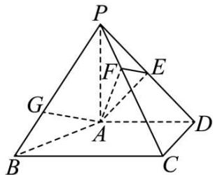

text_image

Geometric diagram of a pyramid with labeled vertices and internal points, used for spatial geometry problems.

(1) 求证: 平面 AEF ⊥ 平面 PCD;

2775 (2024·北京·北京四中校考模拟预测)如图,正三棱柱 $ABC-A_{1}B_{1}C_{1}$ 中,E,F 分别是棱 $AA_{1},BB_{1}$ 上的点, $A_{1}E=BF=\frac{1}{3}AA_{1}$ .

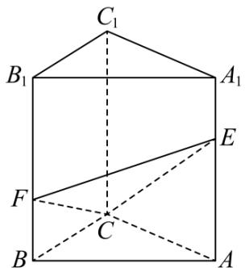

text_image

C₁
B₁ A₁
E
F C
B A

(1) 证明: 平面 CEF ⊥ 平面 ACC $_{1}$ A $_{1}$ ;

2776 (2024·江西新余·高三江西省分宜中学校考阶段练习)如图,在四棱锥 P-ABCD 中,底面 ABCD 是菱形, $\angle ABC=60^{\circ}$ , AB=2, AC∩BD=O, PO⊥底面 ABCD, PO=2,点 E 在棱 PD 上,且 CE⊥PD.

text_image

Geometric diagram of a pyramid with labeled vertices and internal points, used for spatial geometry problems.

(1) 证明: 平面 PBD ⊥ 平面 ACE;

2777 (2024·全国·高三专题练习)如图,在底面是矩形的四棱锥 P-ABCD 中,PA⊥平面 ABCD,PA=AB=2,BC=4,E 是 PD 的中点.

text_image

P
E
A
D
B
C

(1) 求证: 平面 PCD ⊥ 平面 PAD;

2778 (2024·全国·高三专题练习)如图,已知四棱锥 P-ABCD 的底面是平行四边形,侧面 PAB 是等边三角形, BC=2AB, AC= $\sqrt{3}$ AB, PB⊥AC.

text_image

Geometric diagram of a pyramid with labeled vertices and internal points, used for spatial geometry problems.

(1) 求证: 平面 PAB ⊥ 平面 ABCD;

(2) 设 Q 为侧棱 PD 上一点, 四边形 BEQF 是过 B, Q 两点的截面, 且 AC // 平面 BEQF, 是否存在点 Q, 使得平面 BEQF ⊥ 平面 PAD? 若存在, 求 $\frac{PQ}{QD}$ 的值; 若不存在, 说明理由.

2779 (2024·江苏·统考三模)如图,三棱锥 P-ABC 的底面为等腰直角三角形, $\angle ABC=90^{\circ}$ , AB=2. D,E 分别为 AC,BC 的中点,PD⊥平面 ABC,点 M 在线段 PE 上.

text_image

Geometric diagram of a pyramid with labeled vertices and internal points, used in spatial geometry problems.

(1) 再从条件①、②、③、④四个条件中选择两个作为已知, 使得平面 MBD ⊥ 平面 PBC, 并给予证明;

(2) 在 (1) 的条件下, 求直线 BP 与平面 MBD 所成的角的正弦值.

条件①: $PD = \sqrt{2}$ ;

条件②: $\angle PED = 60^{\circ}$ ;

条件③: PM = 3ME:

条件④: PE = 3ME.

# 12 题型十二: 求两异面直线所成角

2780 (2024·宁夏银川·银川一中校考模拟预测)在正四棱柱 ABCD-A $_{1}$ B $_{1}$ C $_{1}$ D $_{1}$ 中,底面边长

为1,高为3,则异面直线 $BD_{1}$ 与AD所成角的余弦值是\_\_\_\_.

2781 (2024·江西鹰潭·贵溪市实验中学校考模拟预测)已知正方体 $ABCD-A_{1}B_{1}C_{1}D_{1}$ 的棱长为 1, E 是棱 $A_{1}D_{1}$ 的中点, G 为棱 BC 上的动点 (不含端点), 记异面直线 AB 与 EG 所成的角为 $\alpha$ , 则 $\sin\alpha$ 的取值范围是 \_\_\_\_.

2782 (2024·全国·高三专题练习)在三棱锥 P-ABC 中, PA ⊥ 底面 ABC, 底面 ABC 为正三角形, PA = AB, 则异面直线 PB 与 AC 所成角的余弦值为 \_\_\_\_

2783 (2024·四川成都·石室中学校考模拟预测)如图,在三棱锥 P-ABC 中, PA ⊥ 底面 ABC, $\angle BAC = 90^{\circ}$ . 点 D、E、N 分别为棱 PA、PC、BC 的中点, M 是线段 AD 的中点, PA = AC = 4, AB = 2.

text_image

P
D
E
M
A
B
N
C

(1) 求证: MN // 平面 BDE;

(2) 已知点 H 在棱 PA 上, 且直线 NH 与直线 BE 所成角的余弦值为 $\frac{\sqrt{7}}{21}$ , 求线段 AH 的长.

2784 (2024·湖北·高三校联考阶段练习)在四棱锥 P-ABCD 中, 底面 ABCD 为正方形, 平面 PAD⊥平面 PAB, ∠PAD = 45°, AB = 2.

text_image

P
E
D
C
A
B

(1) 证明: 平面 PAD ⊥ 平面 ABCD;

(2) 若 E 为 PC 的中点, 异面直线 BE 与 PA 所成角为 $30^{\circ}$ , 求四棱锥 P-ABCD 的体积.

2785 (2024·全国·高三对口高考)如图, 图1, 四棱锥 P-ABCD 中, PD⊥底面 ABCD, 面 ABCD 是直角梯形, M 为侧棱 PD 上一点. 该四棱锥的俯视图和侧(左)视图如图2所示.

text_image

P
M
D
A B C

图1

text_image

4
2
2√3

俯视图

  
侧(左)视图  
图2

(1) 证明: BC | 平面 PBD:  
(2) 证明: AM // 平面 PBC;  
(3) 线段 CD 上是否存在点 N, 使 AM 与 BN 所成角的余弦值为 $\frac{\sqrt{3}}{4}$ ? 若存在, 找到所有符合要求的点 N, 并求 CN 的长; 若不存在, 说明理由.

# 13 题型十三:求直线与平面所成角

2786 (2024·湖南长沙·高三长郡中学校考假期作业)如图所示,直三棱柱 $ABC-A_{1}B_{1}C_{1}$ 中, $AB \perp AC, AB = AC = AA_{1} = 3, AD = \frac{1}{3}AC, CE = \frac{1}{3}CC_{1}.$

text_image

A₁
B₁ C₁
A D E
B C

(1) 求证: $A_{1}D \perp BE$ ;   
(2) 求直线 $A_{1}D$ 与平面 BDE 所成角的正弦值.

2787 (2024·广东河源·高三校联考开学考试)如图,在四棱锥 P-ABCD 中,E,F 分别为 PD,PB 的中点,连接 EF.

text_image

Geometric diagram of a pyramid with labeled vertices and internal points, used in spatial geometry problems.

(1) 当 G 为 PC 上不与点 P、C 重合的一点时, 证明: EF // 平面 BDG;  
(2) 已知 G, Q 分别为 PC, AD 的中点, $\triangle PAD$ 是边长为 2 的正三角形, 四边形 BCDQ 是面积为 2 的矩形, 当 CD ⊥ PQ 时, 求 PC 与平面 BGD 所成角的正弦值.

2788 (2024·山西运城·高三校考阶段练习)在如图所示的多面体中,四边形ABCD为正方形,A,E,B,F四点共面,且 $\triangle ABE$ 和 $\triangle ABF$ 均为等腰直角三角形, $\angle BAE=\angle AFB=90^{\circ}$ ,平面ABCD⊥平面AEBF,AB=2.

text_image

Geometric diagram of a tetrahedron with labeled vertices and internal points, used for spatial geometry problems.

(1) 求证: 直线 BE // 平面 ADF;  
(2) 求平面 CBF 与平面 BFD 夹角的余弦值;  
(3) 若点 P 在直线 DE 上, 求直线 AP 与平面 BCF 所成角的最大值.

2789 (2024·河南·校联考模拟预测)已知三棱柱 $ABC-A_{1}B_{1}C_{1}$ 中， $AB=AC=2,A_{1}A=A_{1}B=A_{1}C=2,\angle BAC=90^{\circ},E$ 是 BC 的中点，F 是线段 $A_{1}C_{1}$ 上一点.

text_image

A₁ F C₁
B₁
A B C
E

(1) 求证: AB ⊥ EF;   
(2) 设 P 是棱 $AA_{1}$ 上的动点 (不包括边界), 当 $\triangle PBC$ 的面积最小时, 求直线 $PC_{1}$ 与平面 $AA_{1}B_{1}B$ 所成角的正弦值.

2790 (2024·全国·高三专题练习)如图, 四棱锥 P-ABCD 的底面为正方形, AB=AP=2, PA⊥平面 ABCD, E,F 分别是线段 PB,PD 的中点, G 是线段 PC 上的一点.

text_image

Geometric diagram of a triangular pyramid with labeled vertices and internal points, used for spatial geometry problems.

(1) 求证: 平面 EFG ⊥ 平面 PAC;  
(2) 若直线 AG 与平面 AEF 所成角的正弦值为 $\frac{1}{3}$ , 且 G 点不是线段 PC 的中点, 求三棱锥 E-ABG 体积.

2791 (2024·福建漳州·统考模拟预测)如图, AB 是圆 O 的直径, 点 C 是圆 O 上异于 A, B 的点, PC ⊥ 平面 ABC, AC = $\sqrt{3}$ , PC = 2BC = 2, E, F 分别为 PA, PC 的中点, 平面 BEF 与平面 ABC 的交线为 BD, D 在圆 O 上.

text_image

P
E
F
A
C
O
B

(1) 在图中作出交线 BD(说明画法, 不必证明), 并求三棱锥 D-ACE 的体积;
(2) 若点 M 满足 $\overrightarrow{BM} = \frac{1}{2}\overrightarrow{BD} + \lambda\overrightarrow{BP} (\lambda \in \mathbb{R})$ ，且 CM 与平面 PBD 所成角的正弦值为 $\frac{\sqrt{10}}{5}$ ，求 $\lambda$ 的值.

# 题型十四:求平面与平面所成角

2792 (2024·全国·高三专题练习)如图1,在等腰梯形ABCD中,AD//BC,AD=4,BC=2, $\angle DAB=60^{\circ}$ ,点E,F在以AD为直径的半圆上,且 $\widehat{AE}=\widehat{EF}=\widehat{FD}$ ,将半圆沿AD翻折如图2.

text_image

E
F
A
D
B
C

图1

text_image

E
F
A
D
B
C

图2

(1) 求证: EF // 平面 ABCD;
(2) 当多面体 ABE - DCF 的体积为 4 时, 求平面 ABE 与平面 CDF 夹角的余弦值.

2793 (2024·黑龙江大庆·高三大庆中学校考开学考试)如图,在四棱锥 P-ABCD 中,底面 ABCD 是菱形, $\angle ABC=60^{\circ}$ , AB=2, AC∩BD=O, PO⊥底面 ABCD, PO=2,点 E 在棱 PD 上,且 CE⊥PD

text_image

Geometric diagram of a pyramid with labeled vertices and internal points, including dashed lines indicating hidden edges.

(1) 证明: 平面 PBD ⊥ 平面 ACE;
(2) 求平面 PAC 与平面 ACE 所成角的余弦值.

2794 (2024·山西运城·山西省运城中学校校考二模)如图，在三棱柱 $ABC-A_{1}B_{1}C_{1}$ 中，侧面 $BB_{1}C_{1}C$ 为菱形， $\angle CBB_{1}=60^{\circ}$ ，AB=BC=2， $AC=AB_{1}=\sqrt{2}$ .

text_image

A
A₁
C
C₁
B
B₁

(1) 证明: 平面 $ACB_{1} \perp$ 平面 $BB_{1}C_{1}C$ ;  
(2) 求平面 $ACC_{1}A_{1}$ 与平面 $A_{1}B_{1}C_{1}$ 夹角的余弦值.

2795 (2024·宁夏石嘴山·统考一模)如图,在四棱锥 A-BCDE 中,侧面 ADE ⊥ 底面 BCDE,底面 BCDE 为菱形, $\angle BCD=120^{\circ},AE\perp AD,\angle ADE=30^{\circ}$ .

text_image

A
E
B
C
D

(1) 若四棱锥 A-BCDE 的体积为 1, 求 DE 的长;  
(2) 求平面 ABE 与平面 ACD 所成二面角的正弦值.

2796 (2024·全国·高三专题练习)在三棱台 ABC-DEF 中，G 为 AC 中点，AC = 2DF，AB ⊥ BC，BC ⊥ CF.

text_image

Geometric diagram of a polyhedron with labeled vertices A, B, C, D, E, F, G and dashed internal lines indicating hidden edges.

(1) 求证: BC ⊥ 平面 DEG;  
(2) 若 AB = BC = 2, CF ⊥ AB, 平面 EFG 与平面 ACFD 所成二面角大小为 $\frac{\pi}{3}$ , 求三棱锥 E - DFG 的体积.

2797 (2024·四川成都·高三四川省成都市第四十九中学校校考阶段练习)如图,四棱锥P-ABCD中,底面ABCD是矩形,AB=2,AD=4,且侧面PAB⊥底面ABCD,侧面PAD⊥底面ABCD,点F是PB的中点,动点E在边BC上移动,且PA=2.

text_image

Geometric diagram of a pyramid with labeled vertices and internal points, used in spatial geometry problems.

(1) 证明: PA ⊥ 底面 ABCD;  
(2) 当点 E 在 BC 边上移动, 使二面角 E-AF-B 为 $60^{\circ}$ 时, 求二面角 F-AE-P 的余弦

值.

# 15 题型十五:求点面距、线面距、面面距

2798 (2024·山东青岛·高三统考期中)如图, 四棱锥 P-ABCD 中, 底面 ABCD 为正方形, $\triangle$ PAB 为等边三角形, 面 PAB ⊥ 底面 ABCD, E 为 AD 的中点.

text_image

P
A
E
D
B
F
C

(1) 求证: AC ⊥ PE;   
(2) 在线段 BD 上存在一点 F，使直线 AP 与平面 PEF 所成角的正弦值为 $\frac{\sqrt{5}}{5}$ .  
①确定点 F 的位置；  
②求点 C 到平面 PEF 的距离.

2799 (2024·全国·高三专题练习)如图, 已知菱形 ABCD 和矩形 ACEF 所在的平面互相垂直, AB = AF = 2, ∠ADC = 60°

text_image

Geometric diagram of a pyramid with labeled vertices and internal points, used in spatial geometry problems.

(1) 求直线 BF 与平面 ABCD 的夹角；  
(2) 求点 A 到平面 FBD 的距离.

2800 (2024·广东东莞·高三校联考阶段练习)如图所示,在四棱锥 P-ABCD 中,侧面 $\triangle PAD$ 是正三角形,且与底面 ABCD 垂直,BC // 平面 PAD,BC= $\frac{1}{2}AD=1$ ,E 是棱 PD 上的动点.

text_image

P
A
B
C
D
E

(1) 当 E 是棱 PD 的中点时, 求证: CE // 平面 PAB;  
(2) 若 AB = 1, AB ⊥ AD, 求点 B 到平面 ACE 距离的范围.

2801 (2024·浙江·校联考模拟预测)如图,在四棱锥 P-ABCD 中,底面 ABCD 为平行四边形,侧面 PAD 是边长为 2 的正三角形,平面 PAD ⊥ 平面 ABCD, AB ⊥ PD.

text_image

Geometric diagram of a tetrahedron with labeled vertices P, A, B, C, D, E and internal diagonals

(1) 求证: 平行四边形 ABCD 为矩形;

(2) 若 E 为侧棱 PD 的中点, 且平面 ACE 与平面 ABP 所成角的余弦值为 $\frac{\sqrt{6}}{4}$ , 求点 B 到平面 ACE 的距离.

2802 (2024·湖北·模拟预测)如图所示的多面体是由底面为ABCD的长方体被截面 $AEC_{1}F$ 所截得到的,其中AB=4,BC=2, $CC_{1}=3$ ,BE=1,则点C到平面 $AEC_{1}F$ 的距离为()

text_image

F
C₁
D
C
E
A
B

A. $\frac{\sqrt{2}}{2}$

B. $\frac{3\sqrt{2}}{2}$

C. $\frac{4\sqrt{33}}{11}$

D. $\frac{\sqrt{33}}{11}$

2803 (2024·云南昆明·昆明市第三中学校考模拟预测)如图, 已知 $ABC - A_{1}B_{1}C_{1}$ 是侧棱长和底面边长均等于 a 的直三棱柱, D 是侧棱 $CC_{1}$ 的中点. 则点 C 到平面 $AB_{1}D$ 的距离为 ( )

text_image

A₁
B₁
C₁
E
D
A
B
C

A. $\frac{\sqrt{2}}{4}a$

B. $\frac{\sqrt{2}}{8}a$

C. $\frac{3\sqrt{2}}{4}a$

D. $\frac{\sqrt{2}}{2}a$

2804 (2024·全国·高三专题练习)两平行平面 $\alpha, \beta$ 分别经过坐标原点 O 和点 A(1,2,3)，且两平面的一个法向量 $\vec{n}=(-1,0,1)$ ，则两平面间的距离是（）

A. $\sqrt{2}$

B. $\frac{\sqrt{2}}{2}$

C. $\sqrt{3}$

D. $3 \sqrt{2}$

2805 (2024·全国·高三专题练习)空间直角坐标系中 A(0,0,0)、B(1,1,1)、C(1,0,0))、D(-1,2,1)，其中 A ∈ α，B ∈ α，C ∈ β，D ∈ β，已知平面 α // 平面 β，则平面 α 与平面 β 间的距离为 （）

A. $\frac{\sqrt{26}}{26}$

B. $\frac{\sqrt{13}}{13}$

C. $\frac{\sqrt{3}}{3}$

D. $\frac{\sqrt{5}}{5}$

2806 (2024·全国·高三专题练习)在棱长为1的正方体 $\mathrm{ABCD - A_1B_1C_1D_1}$ 中，则平面 $\mathrm{AB}_1\mathrm{C}$ 与平面 $\mathrm{A}_1\mathrm{C}_1\mathrm{D}$ 之间的距离为

A. $\frac{\sqrt{3}}{6}$

B. $\frac{\sqrt{3}}{3}$

C. $\frac{2\sqrt{3}}{3}$

D. $\frac{\sqrt{3}}{2}$

2807 (2024·高二课时练习)如图所示,在长方体 $ABCD-A_{1}B_{1}C_{1}D_{1}$ 中, $A_{1}A=5, AB=12$ , 则直线 $B_{1}C_{1}$ 到平面 $A_{1}BCD_{1}$ 的距离是 ()

text_image

D₁
A₁
B₁
C₁
D
C
A
B

A. 5

B. 8

C. $\frac{60}{13}$

D. $\frac{13}{2}$

2808 (2024·全国·高三专题练习)已知 $ABCD - A_{1}B_{1}C_{1}D_{1}$ 是棱长为 1 的正方体, 则平面 $AB_{1}D_{1}$ 与平面 $C_{1}BD$ 的距离为 \_\_\_\_.

2809 (2024·高二单元测试)在直三棱柱 $ABC-A_{1}B_{1}C_{1}$ 中， $AA_{1}=AB=BC=3, AC=2, D$ 是 AC 的中点，则直线 $B_{1}C$ 到平面 $A_{1}BD$ 的距离为 \_\_\_\_.

2810 (2024·全国·高三专题练习)如图,在长方体 $ABCD - A_1B_1C_1D_1$ 中, $AA_1 = AB = 2$ , $BC = 1$ , E、F、H分别是AB、CD、 $A_1B_1$ 的中点,则直线EC到平面AFH的距离为 \_\_\_\_.

text_image

D₁
H
A₁
B₁
C₁
D
F
C
A
E
B

2811 (2024·浙江温州·统考模拟预测)在棱长为1的正方体 $ABCD-A_{1}B_{1}C_{1}D_{1}$ 中，E为线段 $A_{1}B_{1}$ 的中点，F为线段AB的中点，则直线FC到平面 $AEC_{1}$ 的距离为\_\_\_\_.

2812 (2024·高二课时练习)如图,在棱长为1的正方体 $ABCD-A_{1}B_{1}C_{1}D_{1}$ 中,E为线段 $DD_{1}$ 的中点,F为线段 $BB_{1}$ 的中点.

text_image

D₁
C₁
A₁
B₁
E
F
D
C
A
B

(1) 求直线 $FC_{1}$ 到直线 AE 的距离;  
(2) 求直线 $FC_{1}$ 到平面 $AB_{1}E$ 的距离.

# 题型十六: 点到直线距离、异面直线的距离

2813 (2024·全国·高三专题练习)如图,在三棱柱 $ABC-A_{1}B_{1}C_{1}$ 中,底面 $\triangle ABC$ 是边长为 $2\sqrt{3}$ 的正三角形, $AA_{1}=\sqrt{7}$ , 顶点 $A_{1}$ 在底面的射影为底面正三角形的中心, P, Q 分别是异面直线 $AC_{1}, A_{1}B$ 上的动点, 则 P, Q 两点间距离的最小值是 ( )

text_image

C₁
A₁
Q
P
C
A
B₁
B

A. $\frac{\sqrt{7}}{2}$

B. 2

C. $\sqrt{6}$

D. $\frac{\sqrt{6}}{2}$

2814 (2024·全国·高三专题练习)在长方体 $ABCD-A_{1}B_{1}C_{1}D_{1}$ 中，AB=1，BC=2， $AA_{1}=3$ ，则异面直线 AC 与 $BC_{1}$ 之间的距离是（）

A. $\frac{\sqrt{5}}{5}$

B. $\frac{\sqrt{7}}{7}$

C. $\frac{\sqrt{6}}{6}$

D. $\frac{6}{7}$

2815 (2024·全国·高三专题练习)如图,在四棱锥 P-ABCD 中,PA⊥平面 ABCD,底面 ABCD 为正方形,且 PA=AB=2,F 为棱 PD 的中点,点 M 在 PA 上,且 PM=2MA,则 CD 的中点 E 到直线 MF 的距离是 \_\_\_\_.

text_image

P
F
M
A
D
B
C
E

2816 (2024·全国·高三专题练习)已知空间中三点 A(1,1, $\sqrt{3}$ ), B(1,-1,2), C(0,0,0), 则点 A 到直线 BC 的距离为 \_\_\_\_.

2817 (2024·福建莆田·高三莆田一中校考期中)已知空间中三点 A(2,0,0), B(0,2,0), C(2,2,2), 则点 C 到直线 AB 的距离为 \_\_\_\_.

2818 (2024·全国·高三专题练习)如图,在长方体 $ABCD-A_{1}B_{1}C_{1}D_{1}$ 中, $AA_{1}=AB=2$ , AD =1, 点 F, G 分别是 AB, $CC_{1}$ 的中点, 则点 $D_{1}$ 到直线 GF 的距离为 \_\_\_\_.

text_image

D₁
C₁
A₁
B₁
G
D
C
A
F
B

2819 (2024·全国·高三专题练习)如图, 多面体 $ABC - A_{1}B_{1}C_{1}$ 是由长方体一分为二得到的, $AA_{1} = 2$ , AB = BC = 1, $\angle ABC = 90^{\circ}$ , 点 D 是 $BB_{1}$ 中点, 则异面直线 $DA_{1}$ 与 $B_{1}C_{1}$ 的距离是 \_\_\_\_.

text_image

A₁
B₁
D
A
C
B
C₁

2820 (2024·全国·高三专题练习)如图,在正方体 $ABCD-A_{1}B_{1}C_{1}D_{1}$ 中, AB=1,M,N 分别是棱 AB, $CC_{1}$ 的中点,E 是 BD 的中点,则异面直线 $D_{1}M$ , EN 间的距离为 \_\_\_\_.

text_image

D₁
A₁
B₁
C₁
N
D
C
E
A
M
B

2821 (2024·全国·高三专题练习)如图,正四棱锥 P-ABCD 的棱长均为 2 ,点 E 为侧棱 PD 的中点. 若点 M,N 分别为直线 AB,CE 上的动点,则 MN 的最小值为 \_\_\_\_.

text_image

P
A
B
C
D
E

2822 (2024·湖南邵阳·高三湖南省邵东市第一中学校考阶段练习)在棱长为 a 的正方体 $ABCD-A_{1}B_{1}C_{1}D_{1}$ 中，点 M 是线段 $DC_{1}$ 上的动点，则 M 点到直线 $AD_{1}$ 距离的最小值为 \_\_\_\_

2823 (2024·全国·高三专题练习)在如图所示实验装置中,正方形框架的边长都是1,且平面ABCD⊥平面ABEF,活动弹子M,N分别在正方形对角线AC,BF上移动,则MN长度的最小值是\_\_\_\_.

text_image

Geometric diagram with labeled points A, B, C, D, E, F, M, N forming intersecting planes and triangles

2824 (2024·全国·高三专题练习)已知直三棱柱 $ABC-A_{1}B_{1}C_{1}$ 中, 侧面 $AA_{1}B_{1}B$ 为正方形.
AB = BC = 2, E, F 分别为 AC 和 $CC_{1}$ 的中点， $BF \perp A_{1}B_{1}$ .

text_image

A₁
D
B₁
C₁
F
A
B
E
C

(1) 求四棱锥 $E - BB_{1}C_{1}F$ 的体积；
(2) 是否存在点 D 在直线 $A_{1}B_{1}$ 上，使得异面直线 BF，DE 的距离为 1? 若存在，求出此时线段 DE 的长；若不存在，请说明理由.

