# 第55讲 立体几何中的压轴小题

# 必考题型全归纳

# 1 题型一:球与截面面积问题

2825 (2024·湖南长沙·高二长郡中学校考开学考试)已知三棱锥 P-ABC 的四个顶点在球 O 的球面上，PA = PB = PC，△ABC 是边长为 $6\sqrt{2}$ 的正三角形， $\overrightarrow{PA} = 3\overrightarrow{PE}, \overrightarrow{BA} = 3\overrightarrow{BF}$ ， $\angle CEF = 90^{\circ}$ ，过点 E 作球 O 的截面，截面面积最小值为（）

A. $8\pi$

B. $16\pi$

C. $27\pi$

D. $40\pi$

2826 (2024·四川绵阳·高三绵阳南山中学实验学校校考阶段练习)四面体ABCD的四个顶点都在球O的球面上， $AB=BC=CD=DA=4$ ， $AC=BD=2\sqrt{2}$ ，点E，F，G分别为棱BC，CD，AD的中点，现有如下结论：①过点E，F，G作四面体ABCD的截面，则该截面的面积为2；②四面体ABCD的体积为 $\frac{16\sqrt{3}}{3}$ ；③过E作球O的截面，则截面面积的最大值与最小值的比为5:4.则上述说法正确的个数是()

A. 0

B. 1

C. 2

D. 3

2827 (2024·四川内江·四川省内江市第六中学校考模拟预测)已知球 O 是正三棱锥 A-BCD (底面是正三角形,顶点在底面的射影为底面中心)的外接球, $\mathrm{BC}=\sqrt{3},\mathrm{AB}=\sqrt{2}$ ,点 E 是线段 AB 的中点,过点 E 作球 O 的截面,则所得截面面积的最小值是 ( )

A. $\frac{\pi}{2}$

B. $\frac{\pi}{3}$

C. $\frac{\pi}{4}$

D. $\frac{\pi}{6}$

2828 (2024·宁夏银川·校联考二模) 2022年第三十二届足球世界杯在卡塔尔举行,第一届世界杯是1930年举办的,而早在战国中期,中国就有过类似的体育运动项目:蹴鞠,又名蹴球,蹴圆,筑球,踢圆等,蹴有用脚蹴、踢、蹋的含义,鞠最早系外包皮革、内实米糠的球.因而蹴鞠就是指古人以脚蹴、蹋、踢皮球的活动,类似于今日的足球.2006年5月20日,蹴鞠作为非物质文化遗产经国务院批准已列入第一批国家非物质文化遗产名录.已知半径为3的某鞠(球)的表面上有四个点A,B,C,P,AC⊥BC,AC=BC=4,PC=6,则该鞠(球)被平面PAB所截的截面圆面积为()

A. $7\pi$

B. $\frac{23}{3}\pi$

C. $8\pi$

D. $\frac{25}{3}\pi$

2829 (2024·全国·高三专题练习)在正方体 $ABCD-A_{1}B_{1}C_{1}D_{1}$ 中, AB=2,M,N 分别为 AD, BC 的中点,该正方体的外接球为球 O,则平面 $A_{1}MN$ 截球 O 得到的截面圆的面积为 ( )

A. $\frac{6\pi}{5}$

B. $\frac{7\pi}{5}$

C. $\frac{12\pi}{5}$

D. $\frac{14\pi}{5}$

2830 (2024·四川遂宁·射洪中学校考模拟预测)已知球 O 内切于正方体 ABCD - A $_{1}$ B $_{1}$ C $_{1}$ D $_{1}$ , P, Q, M, N 分别是 B $_{1}$ C $_{1}$ , C $_{1}$ D $_{1}$ , CD, BC 的中点, 则该正方体及其内切球被平面 MNPQ 所截得的截面面积之比为 ( )

A. $4\sqrt{2}:\pi$

B. $2\sqrt{2}:\pi$

C. $3\sqrt{2}:\pi$

D. $4:\pi$

2831 (2024·河南洛阳·高三校联考阶段练习)已知三棱锥P-ABC的棱长均为6，且四个顶点均在球心为O的球面上，点E在AB上， $\overrightarrow{AE}=\frac{1}{3}\overrightarrow{AB}$ ，过点E作球O的截面，则截面面积的最小值为()

A. $8\pi$

B. $10\pi$

C. $16\pi$

D. $24\pi$

# 题型二:体积、面积、周长、角度、距离定值问题

2832 (2024·福建三明·高一校考阶段练习)如图,在正方体 $ABCD-A_{1}B_{1}C_{1}D_{1}$ 中, AB=2, M,N 分别为 $A_{1}D_{1}, B_{1}C_{1}$ 的中点, E,F 分别为棱 AB, CD 上的动点,则三棱锥 M-NEF 的体积 ()

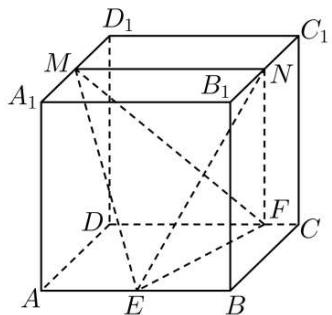

text_image

D₁
M
A₁
B₁
N
C₁
D
F
C
A
E
B

A. 存在最大值, 最大值为 $\frac{8}{3}$

B. 存在最小值, 最小值为 $\frac{2}{3}$

C. 为定值 $\frac{4}{3}$

D. 不确定,与 E, F 的位置有关

2833 (2024·四川成都·校考模拟预测)如图,在四棱柱 $ABCD-A_{1}B_{1}C_{1}D_{1}$ 中,底面ABCD为正方形, $AA_{1}\perp$ 底面ABCD, $AA_{1}=2AB,M,N$ 分别是棱 $BB_{1},DD_{1}$ 上的动点,且DN= $B_{1}M$ ,则下列结论中正确的是()

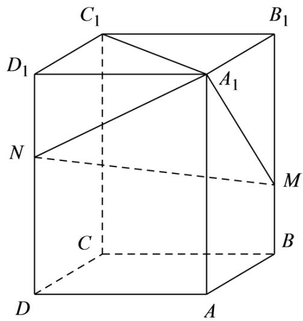

text_image

C₁
B₁
D₁
A₁
N
M
C
B
D
A

A. 直线 $\mathrm{A}_{1} \mathrm{C}$ 与直线 MN 可能异面

B. 三棱锥 $\mathrm{A}_{1} - \mathrm{C}_{1}\mathrm{MN}$ 的体积保持不变

C. 直线 AC 与直线 MN 所成角的大小与点 M 的位置有关

D. 直线 AD 与直线 MN 所成角的最大值为 $\frac{\pi}{3}$

2834 (多选题)(2024·福建三明·统考三模)如图,正方体 $ABCD-A_{1}B_{1}C_{1}D_{1}$ 的棱长为 2 ,点 E 是 $AA_{1}$ 的中点,点 F 是侧面 $ABB_{1}A_{1}$ 内一动点,则下列结论正确的为 ( )

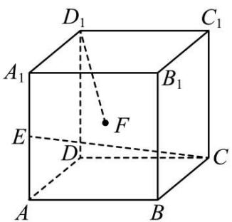

text_image

D₁
C₁
A₁
B₁
E
F
D
C
A
B

A. 当 F 在 $A_{1}B$ 上时, 三棱锥 $F - CD_{1}E$ 的体积为定值

B. CE 与 BF 所成角正弦的最小值为 $\frac{2}{3}$

C. 过 $D_{1}$ 作垂直于 CE 的平面 $\alpha$ 截正方体 ABCD - $A_{1}B_{1}C_{1}D_{1}$ 所得截面图形的周长为 $6\sqrt{2}$

D. 当 $D_{1}F \perp CE$ 时， $\triangle BCF$ 面积的最小值为 $\frac{2\sqrt{5}}{5}$

2835 (多选题)(2024·广东梅州·统考三模)已知正方体 $ABCD-A_{1}B_{1}C_{1}D_{1}$ 的棱长为2, $O_{1}$ 为四边形 $A_{1}B_{1}C_{1}D_{1}$ 的中心,P为线段 $AO_{1}$ 上的一个动点,Q为线段 $CD_{1}$ 上一点,若三棱锥Q-PBD的体积为定值,则()

A. $DQ = 2QC_{1}$

B. $\mathrm{DQ} = \mathrm{QC}_1$

C. $\mathrm{O_1Q} = \sqrt{2}$

D. $\mathrm{O_1Q} = \sqrt{3}$

2836 (多选题)(2024·山西大同·高三统考阶段练习)如图,正方体ABCD- $A_{1}B_{1}C_{1}D_{1}$ 的棱长为2,线段 $B_{1}D_{1}$ 上有两个动点E,F,且EF= $\sqrt{2}$ ,以下结论正确的有()

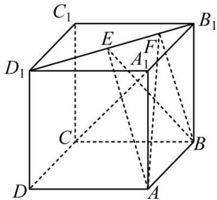

text_image

C₁
E
F
B₁
D₁
A₁
C
B
D
A

A. $\overrightarrow{\mathrm{EF}}\cdot \overrightarrow{\mathrm{AB}} = 2$

B. $A_{1}C \perp AE$

C. 正方体 $\mathrm{ABCD} - \mathrm{A}_{1} \mathrm{~B}_{1} \mathrm{C}_{1} \mathrm{~D}_{1}$ 的体积是三棱锥 $\mathrm{A} - \mathrm{BEF}$ 的体积的 12 倍

D. 异面直线 AE, BF 所成的角为定值

2837 (多选题)(2024·广东深圳·高三红岭中学校考期末)已知正三棱柱 $\mathrm{ABC - A_1B_1C_1}$ 的底面边长为 $1, \mathrm{AA}_1 = 1$ ，点P满足 $\overrightarrow{\mathrm{BP}} = \lambda \overrightarrow{\mathrm{BC}} + \mu \overrightarrow{\mathrm{BB}_1}$ ，其中 $\lambda \in [0,1], \mu \in [0,1]$ ，下列选项正确的是 （）

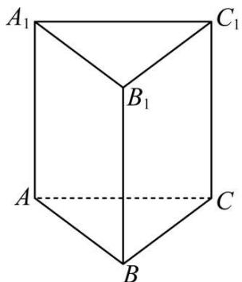

text_image

A₁
B₁
C₁
A
B
C

A. 当 $\lambda=1$ 时， $\triangle AB_{1}P$ 的周长为定值  
B. 当 $\mu=1$ 时, 三棱锥 P-A $_{1}$ BC 的体积为定值  
C. 当 $\lambda=\frac{1}{2}$ 时, 有且仅有两个点 P, 使得 $A_{1}P \perp BP$   
D. 当 $\mu=\frac{1}{2}$ 时, 有且仅有一个点 P, 使得 $A_{1}B \perp$ 平面 $AB_{1}P$

2838 (多选题)(2024·福建厦门·统考模拟预测)如图,在棱长为1的正方体ABCD-A₁B₁C₁D₁中,点P满足 $\overrightarrow{BP}=\lambda\overrightarrow{BC}+\mu\overrightarrow{BB_{1}}$ ,其中 $\lambda\in[0,1],\mu\in[0,1]$ ,则()

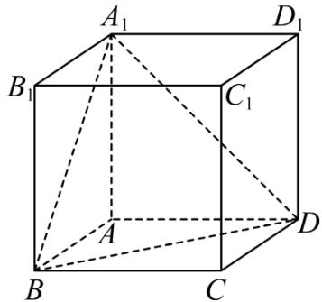

text_image

A₁
D₁
B₁
C₁
A
D
B
C

A. $|\mathrm{AP}| \leqslant \sqrt{3}$   
B. 当 $\lambda=\frac{1}{2}$ 时, 有且仅有一个点 P, 使得 AP ⊥ 平面 A₁BD  
C. 当 $\mu=\frac{1}{2}$ 时, 有且仅有一个点 P, 使得 $A_{1}P \parallel AB$   
D. 当 $\lambda + \mu = \frac{1}{2}$ 时，三棱锥 P - A₁BD 的体积为定值

2839 (多选题)(2024·湖南·校联考模拟预测)如图, ABCD - A'B'C'D' 为正方体. 任作平面 $\alpha$ 与对角线 AC' 垂直, 使得 $\alpha$ 与正方体的每个面都有公共点, 记这样得到的截面多边形的面积为 S, 周长为 l. 则 ( )

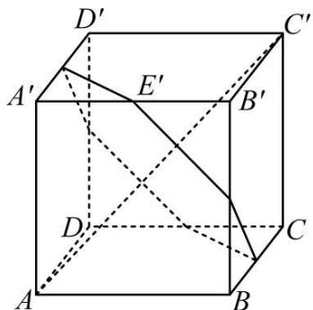

text_image

D'
A'
E'
B'
C'
D
C
A
B

A. S 为定值

B. S 不为定值

C. l 为定值

D. $l$ 不为定值

2840 (多选题)(2024·重庆沙坪坝·重庆南开中学校考模拟预测)已知三棱锥P-ABC, PA = B° C=2,PB=AC=PC=AB=3,D为棱PC上一点,且PD=λDC,过点D作平行于直线PA和BC的平面α,分别交棱PB,AB,AC于E,F,G. 下列说法正确的是()

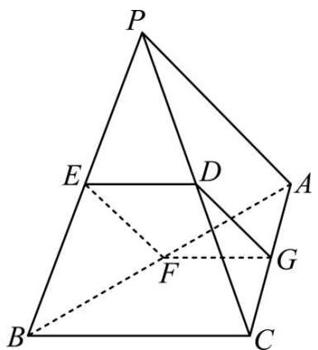

text_image

P
E
D
A
F
G
B
C

A. 四边形 DEFG 为矩形  
B. 四边形 DEFG 的周长为定值  
C. 四边形的 DEFG 面积为定值  
D. 当 $\lambda=1$ 时, 平面 $\alpha$ 分三棱锥 P-ABC 所得的两部分体积相等

2841 (多选题)(2024·重庆·统考模拟预测)在正方体 $\mathrm{ABCD - A_1B_1C_1D_1}$ 中，点P满足 $\overrightarrow{\mathrm{BP}} = \lambda \overrightarrow{\mathrm{BC}} +\mu \overrightarrow{\mathrm{BB}_1}$ ，其中 $\lambda \in [0,1],\mu \in [0,1]$ ，则下列说法正确的是 （）

A. 当 $\lambda = \mu$ 时, $A_{1}P \parallel$ 平面 $ACD_{1}$   
B. 当 $\mu=1$ 时, 三棱锥 P-A $_{1}$ BC 的体积为定值  
C. 当 $\lambda=1$ 时, $\triangle PBD$ 的面积为定值  
D. 当 $\lambda + \mu = 1$ 时，直线 $\mathrm{A}_{1}\mathrm{D}$ 与 $\mathrm{D}_{1}\mathrm{P}$ 所成角的取值范围为 $\left[\frac{\pi}{3}, \frac{\pi}{2}\right]$

# 题型三: 体积、面积、周长、距离最值与范围问题

2842 (2024·福建福州·福州四中校考模拟预测)在如图所示的试验装置中,两个正方形框架ABCD,ABEF的边长均为2,活动弹子N在线段AB上移动(包含端点),弹子M,O分别固定在线段EF,AC的中点处,且MO⊥平面ABCD,则当∠MNO取最大值时,多面体M-BCON的体积为()

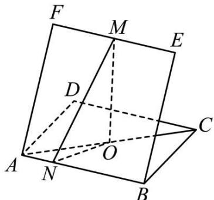

text_image

F
M
E
D
O
A
N
B
C

A. $\frac{\sqrt{3}}{2}$

B. $\frac{3\sqrt{3}}{2}$

C. $\frac{\sqrt{3}}{3}$

D. $\frac{2\sqrt{3}}{3}$

2843 (2024·山东青岛·高三统考期中)已知正四棱锥的各顶点都在同一个球面上,球的体积为 $36\pi$ ,则该正四棱锥的体积最大值为()

A. 18

B. $\frac{64}{3}$

C. $\frac{81}{4}$

D. 27

2844 (2024·陕西西安·西安市大明宫中学校考模拟预测)已知正方体 $ABCD-A_{1}B_{1}C_{1}D_{1}$ 的棱长为 $2\sqrt{2}$ ，P 是正方形 $BB_{1}C_{1}C$ （含边界）内的动点，点 P 到平面 $A_{1}BD$ 的距离等于 $\frac{2\sqrt{6}}{3}$ ，

则D,P两点间距离的最大值为 （）

A. $2 \sqrt{3}$

B. 3

C. $3\sqrt{2}$

D. $2 \sqrt{6}$

2845 (2024·河南·校联考模拟预测)点 P 是圆柱上底面圆周上一动点, $\triangle ABC$ 是圆柱下底面圆的内接三角形, 已知在 $\triangle ABC$ 中, 内角 A、B、C 的对边分别为 a、b、c, 若 c = 2, C = 60°, 三棱锥 P - ABC 的体积最大值为 $\frac{2}{3}\sqrt{3}$ , 则该三棱锥外接球的表面积为 ( )

A. $\frac{19}{3}\pi$

B. $\frac{28}{3}\pi$

C. $\frac{53}{9}\pi$

D. $\frac{43}{3}\pi$

2846 (2024·贵州毕节·校考模拟预测)如图, AB 是半球的直径, O 为球心, AB = 2, P 为此半球大圆弧上的任意一点 (异于 A, B), P 在水平大圆面 AOB 内的射影为 Q, 过 Q 作 QR ⊥ AB 于 R, 连接 PR, OP, 若二面角 P - AB - Q 的大小为 $\frac{\pi}{3}$ , 则三棱锥 P - OQR 的体积的最大值为 ( )

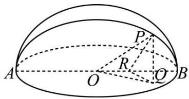

text_image

Geometric diagram of a hemisphere with labeled points and radii, used for spatial geometry problems.

A. $\frac{1}{36}$

B. $\frac{1}{24}$

C. $\frac{\sqrt{3}}{42}$

D. $\frac{\sqrt{3}}{48}$

2847 (2024·宁夏石嘴山·统考一模)圆锥 $OO_{1}$ 的底面半径为 1, 母线长为 2, $\triangle OAB$ 是圆锥 $OO_{1}$ 的轴截面, F 是 OA 的中点, E 为底面圆周上的一个动点 (异于 A、B 两点), 则下列说法正确的是 ()

A. 存在点 E, 使得 EF ⊥ EB

B. 存在点 E, 使得 EF // OB

C. 三棱锥 F-ABE 体积最大值为 $\frac{\sqrt{3}}{6}$

D. 三棱锥 $\mathrm{F - AO_1E}$ 体积最大值为 $\frac{\sqrt{3}}{6}$

2848 (2024·全国·高三专题练习)已知圆锥 SO(O 是底面圆的圆心, S 是圆锥的顶点) 的母线长为 $\sqrt{5}$ , 高为 1, P、Q 为底面圆周上任意两点. 有以下三个结论:

①三角形 SPQ 面积的最大值为 2;  
②三棱锥 O-SPQ 体积的最大值为 $\frac{2}{3}$ ;  
③四面体SOPQ外接球表面积的最小值为 $9\pi$

以上所有正确结论的个数为 （）

A. 0

B. 1

C. 2

D. 3

2849 (2024·河北·统考模拟预测)在正四面体P-ABC中，O为PB的中点，点D在以O为球心的球上运动， $\mathrm{PB} = 2\mathrm{OD}$ ，且恒有 $\mathrm{PD} = \mathrm{BD}$ ，已知三棱锥D-ABC的体积的最大值为 $18\sqrt{2} + 36$ ，则正四面体P-ABC外接球的体积为 （）

A. $108 \sqrt{3} \pi$

B. $124 \sqrt{2} \pi$

C. $132 \sqrt{2} \pi$

D. $144\sqrt{3}\pi$

2850 (2024·湖北恩施·校考模拟预测)如图,矩形ABCD中,E、F分别为BC、AD的中点,且BC=2AB=2,现将△ABE沿AE向上翻折,使B点移到P点,则在翻折过程中,下列结论不正确的是()

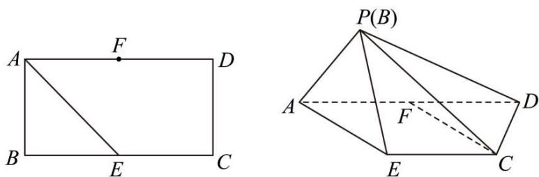

text_image

A
F
D
B
E
C
P(B)
A
F
D
E
C

A. 存在点 P, 使得 PE // CF  
B. 存在点 P, 使得 PE ⊥ ED  
C. 三棱锥 P-AED 的体积最大值为 $\frac{\sqrt{2}}{6}$   
D. 当三棱锥 P-AED 的体积达到最大值时, 三棱锥 P-AED 外接球表面积为 $4 \pi$

2851 (2024·四川成都·四川省成都市玉林中学校考模拟预测)如图,圆台 $\mathrm{O}_{1} \mathrm{O}_{2}$ 的上、下底面圆半径分别为 1、2,高 $\mathrm{O}_{1} \mathrm{O}_{2}=2 \sqrt{2}$ ,点 S、A 分别为其上、下底面圆周上一点,则下列说法中错误的是 ()

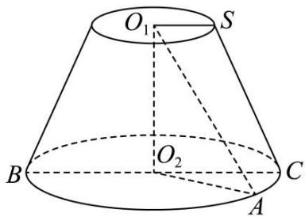

text_image

O₁
S
B
O₂
C
A

A. 该圆台的体积为 $\frac{14\sqrt{2}\pi}{3}$   
B. 直线 SA 与直线 $O_{1}O_{2}$ 所成角最大值为 $\frac{\pi}{3}$   
C. 该圆台有内切球,且半径为 $\sqrt{2}$   
D. 直线 $\mathrm{AO}_1$ 与平面 $\mathrm{SO}_1\mathrm{O}_2$ 所成角正切值的最大值为 $\frac{\sqrt{2}}{2}$

2852 (2024·山东·山东省实验中学校考二模)正四棱柱 $ABCD-A_{1}B_{1}C_{1}D_{1}$ 中，AB=2，P 为底面 $A_{1}B_{1}C_{1}D_{1}$ 的中心，M 是棱 AB 的中点，正四棱柱的高 $h\in[\sqrt{2},2\sqrt{2}]$ ，点 M 到平面 PCD 的距离的最大值为（）

A. $\frac{2\sqrt{6}}{3}$

B. $\frac{8}{3}$

C. $\frac{4\sqrt{2}}{3}$

D. $\frac{32}{9}$

2853 (2024·湖南长沙·长沙一中校考模拟预测)已知 A, B, C, D 是体积为 $\frac{20\sqrt{5}}{3}\pi$ 的球体表面上四点, 若 AB = 4, AC = 2, BC = $2\sqrt{3}$ , 且三棱锥 A - BCD 的体积为 $2\sqrt{3}$ , 则线段 CD 长度的最大值为 ()

A. $2\sqrt{3}$

B. $3 \sqrt{2}$

C. $\sqrt{13}$

D. $2 \sqrt{5}$

2854 (2024·全国·高三专题练习)如图,正方形 EFGH 的中心为正方形 ABCD 的中心, AB = $2\sqrt{2}$ , 截去如图所示的阴影部分后, 翻折得到正四棱锥 P - EFGH(A, B, C, D 四点重合于点 P), 则此四棱锥的体积的最大值为 ( )

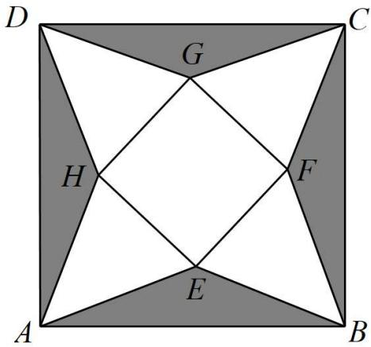

text_image

D
G
C
H
F
E
A
B

A. $\frac{128\sqrt{6}}{375}$

B. $\frac{128\sqrt{5}}{375}$

C. $\frac{4}{3}$

D. $\frac{\sqrt{15}}{3}$

2855 (2024·安徽黄山·统考二模)如图1,将一块边长为20的正方形纸片ABCD剪去四个全等的等腰三角形 $\triangle PEE_{1}$ , $\triangle PFF_{1}$ , $\triangle PGG_{1}$ , $\triangle PHH_{1}$ ,再将剩下的部分沿虚线折成一个正四棱锥P-EFGH,使E与 $E_{1}$ 重合,F与 $F_{1}$ 重合,G与 $G_{1}$ 重合,H与 $H_{1}$ 重合,点A,B,C,D重合于点O,如图2.则正四棱锥P-EFGH体积的最大值为()

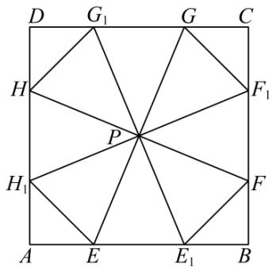

text_image

D G₁ G C
H F₁
P
H₁ F
A E E₁ B

图1

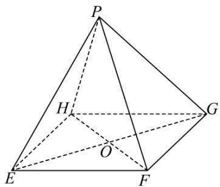

text_image

P
H
G
O
E
F

图2

A. $\frac{32\sqrt{10}}{3}$

B. $\frac{64\sqrt{10}}{3}$

C. $\frac{128\sqrt{10}}{3}$

D. $\frac{256\sqrt{10}}{3}$

2856 (2024·全国·高三专题练习)如图所示,圆形纸片的圆心为O,半径为5,该纸片上的正方形ABCD的中心为O. E, F, G, H为圆O上的点,△ABE, △BCF, △DCG, △ADH分别是以AB, BC, CD, DA为底边的等腰三角形. 沿虚线剪开后,分别以AB, BC, CD, DA为折痕折起,使得E, F, G, H重合于一点,记为O',得到四棱锥O' - ABCD. 当底面ABCD的边长变化时,四棱锥O' - ABCD的体积的最大值为()

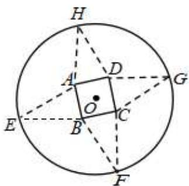

text_image

Geometric diagram showing a circle with inscribed square ABCD and auxiliary points E, F, G, H, O, including dashed lines and a dot.

A. $3 \sqrt{3}$

B. $\frac{8\sqrt{5}}{3}$

C. $3 \sqrt{5}$

D. $\frac{16\sqrt{5}}{3}$

# 题型四:立体几何中的交线问题

2857 (2024·全国·高三校联考阶段练习)已知正方体 $ABCD-A_{1}B_{1}C_{1}D_{1}$ 是半径为 $\sqrt{3}$ 的球 O 的内接正方体(八个顶点全部在球面上),则正方体六个面所在的平面与球面的交线总长度是()

A. $6\pi$

B. $6 \sqrt{2} \pi$

C. $12\pi$

D. $12\sqrt{2}\pi$

2858 (2024·上海·高三专题练习)直三棱柱 $ABC-A_{1}B_{1}C_{1}$ 中， $AA_{1}=1, AB=4, BC=3, \angle ABC=90^{\circ}$ ，设平面 $A_{1}BC_{1}$ 与平面 ABC 的交线为 l，则 $A_{1}C_{1}$ 与 l 的距离为（）.

A. 1

B. $\sqrt{10}$

C. 17

D. 2.6

2859 (2024·浙江·校联考三模)正四面体 ABCD, E 为棱 AD 的中点, 过点 A 作平面 BCE 的平行平面, 该平面与平面 ABC、平面 ACD 的交线分别为 $l_{1}, l_{2}$ , 则 $l_{1}, l_{2}$ 所成角的正弦值为 ( )

A. $\frac{\sqrt{6}}{3}$

B. $\frac{\sqrt{3}}{3}$

C. $\frac{1}{3}$

D. $\frac{\sqrt{2}}{2}$

2860 (2024·全国·高三专题练习)如图,在棱长为1的正方体 $ABCD-A_{1}B_{1}C_{1}D_{1}$ 中,M,P,Q分别是棱 $A_{1}D_{1}$ ,AB,BC的中点若经过点M,P,Q的平面与平面 $CDD_{1}C_{1}$ 的交线为l,则l与直线 $QB_{1}$ 所成角的余弦值为()

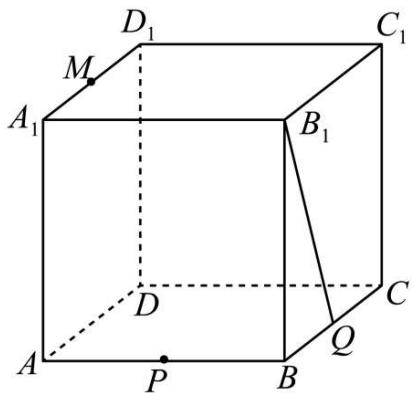

text_image

D₁
M
A₁
B₁
C₁
D
C
Q
P
A
B

A. $\frac{\sqrt{3}}{3}$

B. $\frac{\sqrt{10}}{5}$

C. $\frac{\sqrt{5}}{4}$

D. $\frac{\sqrt{3}}{2}$

2861 (2024·全国·高三专题练习)在棱长为2的正方体 $ABCD-A_{1}B_{1}C_{1}D_{1}$ 中，P，Q，R分别是AB，AD， $B_{1}C_{1}$ 的中点，设过P，Q，R的截面与面 $ADD_{1}A_{1}$ ，以及面 $ABB_{1}A_{1}$ 的交线分别为l，m，则l，m所成的角为()

A. $90^{\circ}$

B. $30^{\circ}$

C. $45^{\circ}$

D. $60^{\circ}$

2862 (2024·黑龙江哈尔滨·哈尔滨三中校考模拟预测)在正方体 $ABCD-A_{1}B_{1}C_{1}D_{1}$ 中，E 为 $B_{1}C_{1}$ 中点，过 A, $D_{1}$ , E 的截面 $\alpha$ 与平面 $AA_{1}B_{1}B$ 的交线为 l，则异面直线 l 与 $B_{1}C$ 所成角的余弦值为（）

A. $\frac{\sqrt{10}}{10}$

B. $\frac{\sqrt{5}}{5}$

C. $\frac{\sqrt{10}}{5}$

D. $\frac{\sqrt{15}}{5}$

2863 (2024·全国·高三专题练习)如图,在圆台 $OO_{1}$ 中, $OO_{1}=\sqrt{3}$ , 点 C 是底面圆周上异于 A、B 的一点, AC=2, 点 D 是 BC 的中点, l 为平面 $O_{1}AC$ 与平面 $O_{1}OD$ 的交线, 则交线 l 与平面 $O_{1}BC$ 所成角的大小为 ()

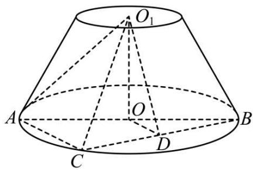

text_image

O₁
A
O
B
C
D

A. $\frac{\pi}{2}$

B. $\frac{\pi}{3}$

C. $\frac{\pi}{6}$

D. $\frac{\pi}{4}$

2864 (2024·河南·高三校联考阶段练习)在正三棱锥 P-ABC 中, $PA=6\sqrt{3}$ , BC=6, M, N, Q, D 分别是 AP, BC, AC, PC 的中点, 平面 MQN 与平面 PBC 的交线为 l, 则直线 QD 与直线 l 所成角的正弦值为 ( )

A. $\frac{\sqrt{2}}{2}$

B. $\frac{5}{6}$

C. $\frac{\sqrt{11}}{6}$

D. $\frac{\sqrt{3}}{2}$

2865 (2024·四川成都·高三校联考期末)在正方体 $ABCD-A_{1}B_{1}C_{1}D_{1}$ 中，E 为线段 AD 的中点，设平面 $A_{1}BC_{1}$ 与平面 $CC_{1}E$ 的交线为 m，则直线 m 与 AC 所成角的余弦值为（）

A. $\frac{1}{2}$

B. $\frac{\sqrt{3}}{2}$

C. $\frac{\sqrt{10}}{5}$

D. $\frac{2\sqrt{5}}{5}$

2866 (2024·全国·高三专题练习)如图,在直四棱柱 $ABCD-A_{1}B_{1}C_{1}D_{1}$ 中, BC ⊥ CD, AB // CD, BC = $\sqrt{3}$ , $AA_{1} = AB = AD = 2$ , 点 P、Q 分别为棱 $BB_{1}$ 、 $CC_{1}$ 的中点, 则平面 APQ 与直四棱柱各侧面矩形的交线所围成的图形的面积为 ( )

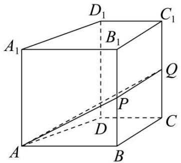

text_image

D₁
C₁
A₁
B₁
Q
P
C
D
A
B

A. $\frac{\sqrt{15}+\sqrt{6}}{2}$

B. $\frac{3\sqrt{15}}{4}$

C. $\frac{3\sqrt{15}}{2}$

D. $\frac{3\sqrt{5}+2\sqrt{3}+\sqrt{17}}{2}$

# 5 题型五:空间线段以及线段之和最值问题

2867 (2024·全国·高三专题练习)已知正三棱锥 S-ABC 的底面边长为 $\sqrt{2}$ , 外接球表面积为 $3\pi$ , SA< $\sqrt{2}$ , 点 M, N 分别是线段 AB, AC 的中点, 点 P, Q 分别是线段 SN 和平面 SCM 上的动点, 则 AP+PQ 的最小值为 ( )

A. $\frac{2\sqrt{6}-\sqrt{2}}{4}$

B. $\frac{\sqrt{6}+\sqrt{2}}{4}$

C. $\frac{3\sqrt{2}}{4}$

D. $\frac{\sqrt{2}}{2}$

2868 (2024·全国·高三专题练习)已知,如图正三棱锥 P-ABC 中,侧棱长为 $\sqrt{2}$ ,底面边长为 2,D 为 AC 中点,E 为 AB 中点,M 是 PD 上的动点,N 是平面 PCE 上的动点,则 AM+MN 最小值是()

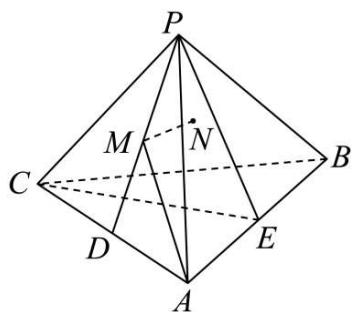

text_image

P
M
N
C
B
D
E
A

A. $\frac{\sqrt{2} + \sqrt{6}}{4}$

B. $\frac{1+\sqrt{3}}{2}$

C. $\frac{\sqrt{6}}{4}$

D. $\frac{\sqrt{3}}{2}$

2869 (2024·全国·高三专题练习)如图,在棱长为1的正方体ABCD-A'B'C'D'中,点P是线段AD'上的动点,E是A'C'上的动点,F是BD上的动点,则PE+PF长度的最小值为()

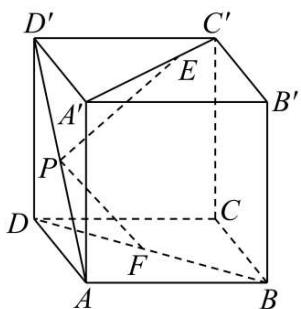

text_image

D'
C'
E
A'
B'
P
C
D
F
A
B

A. 1

B. $\sqrt{2}$

C. $\frac{\sqrt{6}}{2}$

D. $1 + \frac{\sqrt{3}}{3}$

2870 (2024·辽宁·高一辽宁实验中学校联考期末)如图所示,在直三棱柱 $ABC-A_{1}B_{1}C_{1}$ 中,棱柱的侧面均为矩形, $AA_{1}=1$ , $AB=BC=\sqrt{3}$ , $\cos\angle ABC=\frac{1}{3}$ , P 是线段 $A_{1}B$ 上的一动点,则 $AP+PC_{1}$ 最小值为 ()

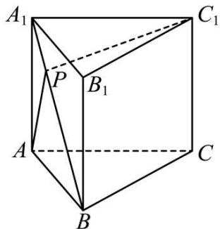

text_image

A₁
P
B₁
A
C
B
C₁

A. $\sqrt{6}$

B. $\sqrt{7}$

C. $1 + \sqrt{3}$

D. $2 + \sqrt{5}$

2871 (2024·四川内江·四川省内江市第六中学校考模拟预测)在三棱锥 P-ABC 中, AB⊥BC, P 在底面 ABC 上的投影为 AC 的中点 D, DP=DC=1. 有下列结论:

①三棱锥 P-ABC 的三条侧棱长均相等；  
② $\angle PAB$ 的取值范围是 $\left(\frac{\pi}{4},\frac{\pi}{2}\right)$ ;  
③若三棱锥的四个顶点都在球O的表面上,则球O的体积为 $\frac{2\pi}{3}$ ;  
④若 AB=BC, E 是线段 PC 上一动点, 则 DE+BE 的最小值为 $\frac{\sqrt{6}+\sqrt{2}}{2}$ .

其中所有正确结论的编号是

A. ①②

B. ②③

C. ①②④

D.①③④

2872 (2024·全国·高一专题练习)在四棱锥 P-ABCD 中, PA⊥底面 ABCD, 底面 ABCD 为正方形, PA=AB=1. 点 E,F,G 分别为平面 PAB, 平面 PAD 和平面 ABCD 内的动点, 点 Q 为棱 PC 上的动点, 则 QE²+QF²+QG² 的最小值为 ( )

A. $\frac{1}{2}$

B. $\frac{2}{3}$

C. $\frac{3}{4}$

D. 1

2873 (2024·全国·高三专题练习)在直三棱柱 $ABC-A_{1}B_{1}C_{1}$ 中， $\angle BAC=\frac{\pi}{2}, AB=AC=\sqrt{2}, CC_{1}=2$ ，且 E,M 分别为 $CC_{1}$ 和 BC 的中点，P 为线段 $A_{1}M$ （包括端点）上一动点，F 为侧面 $AA_{1}B_{1}B$ 上一动点，则 $|PE|+|PF|$ 的最小值为（）

A. $\frac{6\sqrt{2} + 3\sqrt{3}}{10}$

B. $\frac{3\sqrt{2} + 6\sqrt{3}}{10}$

C. $\frac{6\sqrt{2}+3\sqrt{3}}{5}$

D. $\frac{3\sqrt{2}+6\sqrt{3}}{5}$

# 题型六:空间角问题

2874 (2024·全国·高三专题练习)如图, 斜三棱柱 ABC - A₁B₁C₁ 中, 底面 △ABC 是正三角形, E, F, G 分别是侧棱 AA₁, BB₁, CC₁ 上的点, 且 AE > CG > BF, 设直线 CA, CB 与平面 EFG 所成的角分别为 α, β, 平面 EFG 与底面 ABC 所成的锐二面角为 θ, 则 ( )

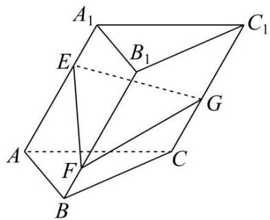

text_image

A₁
E
B₁
C₁
G
A
F
C
B

A. $\sin\theta<\sin\alpha+\sin\beta,\cos\theta\leqslant\cos\alpha+\cos\beta$   
B. $\sin\theta\geqslant\sin\alpha+\sin\beta,\cos\theta<\cos\alpha+\cos\beta$   
C. $\sin\theta<\sin\alpha+\sin\beta,\cos\theta>\cos\alpha+\cos\beta$   
D. $\sin \theta \geqslant \sin \alpha +\sin \beta ,\cos \theta \geqslant \cos \alpha +\cos \beta$

2875 (2024·浙江·高考真题)设三棱锥 V-ABC 的底面是正三角形,侧棱长均相等,P 是棱 VA 上的点(不含端点),记直线 PB 与直线 AC 所成角为 $\alpha$ , 直线 PB 与平面 ABC 所成角为 $\beta$ ,二面角 P-AC-B 的平面角为 $\gamma$ ,则

A. $\beta < \gamma, \alpha < \gamma$

B. $\beta <  \alpha ,\beta <  \gamma$

C. $\beta <  \alpha ,\gamma <  \alpha$

D. $\alpha <  \beta ,\gamma <  \beta$

2876 (2024·浙江·统考高考真题)如图,已知正三棱柱 $ABC-A_{1}B_{1}C_{1}, AC=AA_{1}, E, F$ 分别是棱 BC, $A_{1}C_{1}$ 上的点. 记 EF 与 $AA_{1}$ 所成的角为 $\alpha$ , EF 与平面 ABC 所成的角为 $\beta$ , 二面角 F-BC-A 的平面角为 $\gamma$ , 则 ( )

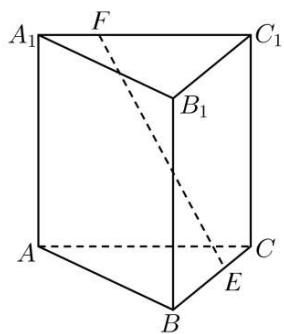

text_image

A₁
F
C₁
B₁
A
C
E
B

A. $\alpha \leqslant \beta \leqslant \gamma$

B. $\beta \leqslant \alpha \leqslant \gamma$

C. $\beta \leqslant \gamma \leqslant \alpha$

D. $\alpha \leqslant \gamma \leqslant \beta$

2877 (2024·浙江温州·高二温州中学校考期末)斜三棱柱 ABC-A₁B₁C₁ 中, 底面 ABC 是正三角形, 侧面 ABB₁A₁ 是矩形, M 是线段 AB 上的动点, 记直线 A₁M 与直线 AC 所成的角为 α, 直线 A₁M 与平面 ABC 所成的角为 β, 二面角 A₁-AC-B 的平面角为 γ, 则（）

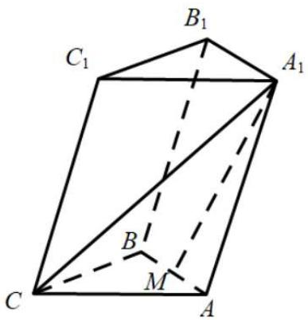

text_image

C₁
B₁
A₁
B
M
C
A

A. $\alpha \leqslant \beta, \beta \leqslant \gamma$

B. $\beta \leqslant \alpha, \beta \leqslant \gamma$

C. $\alpha \leqslant \beta, \beta \geqslant \gamma$

D. $\beta \leqslant \alpha, \beta \geqslant \gamma$

2878 (2024·浙江绍兴·高三统考期末)斜三棱柱 ABC - A₁B₁C₁ 中, 底面 ABC 是正三角形, 侧面 ABB₁A₁ 是矩形, 且 2AA₁ = √3AB, M 是 AB 的中点, 记直线 A₁M 与直线 BC 所成的角为 α, 直线 A₁M 与平面 ABC 所成的角为 β, 二面角 A₁ - AC - B 的平面角为 γ, 则 ( )

A. $\beta < \gamma, \alpha < \gamma$

B. $\beta <  \alpha ,\beta <  \gamma$

C. $\beta <  \alpha ,\gamma <  \alpha$

D. $\alpha <  \beta ,\gamma <  \beta$

2879 (2024·全国·高三专题练习)已知等边 $\triangle ABC$ , 点 E, F 分别是边 AB, AC 上的动点, 且满足 EF // BC, 将 $\triangle AEF$ 沿着 EF 翻折至 P 点处, 如图所示, 记二面角 P - EF - B 的平面角为 $\alpha$ , 二面角 P - FC - B 的平面角为 $\beta$ , 直线 PF 与平面 EFCB 所成角为 $\gamma$ , 则 ( )

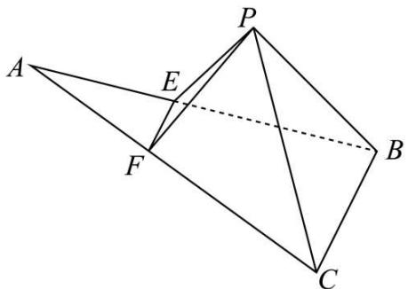

text_image

Geometric diagram with labeled points A, B, C, E, F and a dashed line segment PB

A. $\alpha \geqslant \beta \geqslant \gamma$

B. $\alpha \geqslant \gamma \geqslant \beta$

C. $\beta \geqslant \alpha \geqslant \gamma$

D. $\beta \geqslant \gamma \geqslant \alpha$

2880 (2024·江苏·高一专题练习)正四面体 S-ABC 中, M 是侧棱 SA 上 (端点除外) 的一点, 若异面直线 MB 与直线 AC 所成的角为 $\alpha$ , 直线 MB 与平面 ABC 所成的角为 $\beta$ , 二面角 M-BC-A 的平面角为 $\gamma$ , 则 ( )

A. $\alpha <  \beta <  \gamma$

B. $\beta <  \alpha <  \gamma$

C. $\beta < \gamma < \alpha$

D. $\gamma <  \alpha <  \beta$

2881 (2024·全国·高三专题练习)在三棱锥 P-ABC 中, 顶点 P 在底面的射影为 $\triangle ABC$ 的垂心 O(O 在 $\triangle ABC$ 内部), 且 PO 中点为 M, 过 AM 作平行于 BC 的截面 $\alpha$ , 过 BM 作平行于 AC 的截面 $\beta$ , 记 $\alpha, \beta$ 与底面 ABC 所成的锐二面角分别为 $\theta_1, \theta_2$ , 若 $\angle PAM = \angle PBM = \theta$ , 则下列说法错误的是 ( )

A. 若 $\theta_{1} = \theta_{2}$ , 则 $\mathrm{AC} = \mathrm{BC}$

B. 若 $\theta_{1} \neq \theta_{2}$ , 则 $\tan \theta_{1} \cdot \tan \theta_{2} = \frac{1}{2}$

C. $\theta$ 可能值为 $\frac{\pi}{6}$

D. 当 $\theta$ 取值最大时, $\theta_{1} = \theta_{2}$

2882 (2024·全国·高三专题练习)已知点 P 是正方体 ABCD-A'B'C'D' 上底面 A'B'C'D' 上的一个动点, 记面 ADP 与面 BCP 所成的锐二面角为 $\alpha$ , 面 ABP 与面 CDP 所成的锐二面角为 $\beta$ , 若 $\alpha > \beta$ , 则下列叙述正确的是 ( )

A. $\angle APC > \angle BPD$

B. $\angle APC < \angle BPD$

C. $\max \{\angle APD, \angle BPC\} > \max \{\angle APB, \angle CPD\}$

D. $\min\{\angle APD, \angle BPC\} > \min\{\angle APB, \angle CPD\}$

2883 (2024·浙江金华·统考模拟预测)已知四面体ABCD中,棱AD,BC所在直线所成角为 $60^{\circ}$ ,且AD=1,BC=2, $\angle ACD=60^{\circ}$ ,面BAD和面ACD所成的锐二面角为 $\alpha$ ,面BAC和面ACD所成的锐二面角为 $\beta$ ,当四面体ABCD的体积取得最大值时().

A. $\alpha = \beta$

B. $\alpha <  \beta$

C. $\alpha >\beta$

D. 不能确定

2884 (2024·浙江·校联考二模)已知三棱柱 $\mathrm{ABC - A_1B_1C_1}$ 的所有棱长均相等，侧棱 $\mathrm{AA}_1\perp$ 平面ABC，过 $\mathrm{AB}_1$ 作平面 $\alpha$ 与 $\mathrm{BC}_1$ 平行，设平面 $\alpha$ 与平面 $\mathrm{ACC_1A_1}$ 的交线为 $l$ ，记直线 $l$ 与直线AB,BC,CA所成锐角分别为 $\alpha ,\beta ,\gamma$ ，则这三个角的大小关系为

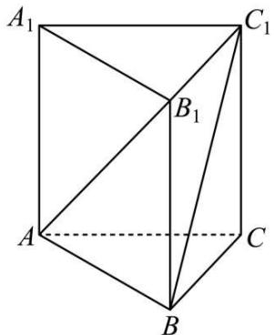

text_image

A₁
C₁
B₁
A
C
B

A. $\alpha > \gamma > \beta$

B. $\alpha = \beta >\gamma$

C. $\gamma >\beta >\alpha$

D. $\alpha > \beta = \gamma$

# 题型七:立体几何装液体问题

2885 (2024·全国·高三专题练习)已知一个放置在水平桌面上的密闭直三棱柱 ABC-A₁B₁C₁ 容器, 如图 1, ΔABC 为正三角形, AB = 2, AA₁ = 3, 里面装有体积为 $2\sqrt{3}$ 的液体, 现将该棱柱绕 BC 旋转至图 2. 在旋转过程中, 以下命题中正确的个数是 ( )

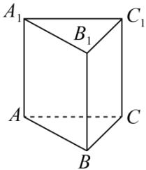

text_image

A₁
B₁
C₁
A
C
B

图1

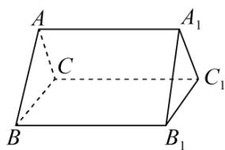

text_image

A
C
B
B₁
A₁
C₁

图2

①液面刚好同时经过A, $B_{1}$ , $C_{1}$ 三点;  
②当平面 ABC 与液面成直二面角时, 液面与水平桌面的距离为 $\sqrt{3}-1$ ;

③当液面与水平桌面的距离为 $\frac{3}{2}$ 时，AB与液面所成角的正弦值为 $\frac{3}{4}$ .

A. 0

B. 1

C. 2

D. 3

2886 (2024·全国·高三专题练习)一个密闭且透明的正方体容器中装有部分液体,已知该正方体的棱长为1,如果任意转动该正方体,液面的形状都不可能是三角形,那么液体体积的取值范围为()

A. $\left[\frac{1}{6},\frac{5}{6}\right]$

B. $\left(\frac{1}{6},\frac{5}{6}\right)$

C. $\left[\frac{1}{6},\frac{2}{3}\right]$

D. $\left(\frac{1}{6},\frac{2}{3}\right)$

2887 (2024·全国·高三专题练习)一个密闭且透明的正方体容器中装有部分液体,已知该正方体的棱长为2,如果任意转动该正方体,液面的形状都不可能是三角形,那么液体的体积的取值范围为()

A. $\left(2,\frac{20}{3}\right)$

B. $\left(\frac{4}{3},\frac{17}{3}\right)$

C. $\left(2,\frac{17}{3}\right)$

D. $\left(\frac{4}{3},\frac{20}{3}\right)$

2888 (2024·全国·高三专题练习)已知某圆柱形容器的轴截面是边长为2的正方形,容器中装满液体,现向此容器中放入一个实心小球,使得小球完全被液体淹没,则此时容器中所余液体的最小容量为()

A. $\frac{\pi}{3}$

B. $\frac{2\pi}{3}$

C. $\pi$

D. $\frac{4\pi}{3}$

2889 (多选题)(2024·辽宁丹东·统考二模)如图,玻璃制成的长方体容器ABCD- $A_{1}B_{1}C_{1}D_{1}$ 内部灌进一多半水后封闭,仅让底面棱BC位于水平地面上,将容器以BC为轴进行旋转,水面形成四边形EFGH,忽略容器壁厚,则()

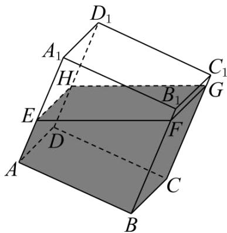

text_image

D₁
A₁
H
C₁
E
B₁
G
F
D
A
C
B

A. $A_{1}D_{1}$ 始终与水面 EFGH 平行  
B. 四边形 EFGH 面积不变  
C. 有水部分组成的几何体不可能是三棱柱  
D. AE + BF 为定值

2890 (多选题)(2024·全国·高三专题练习)透明塑料制成的正方体密闭容器 ABCD - A₁B₁C₁D₁ 的体积为 64,注入体积为 x(0 < x < 64) 的液体.如图,将容器下底面的顶点 A 置于地面上,再将容器倾斜.随着倾斜度的不同,则下列说法正确的是()

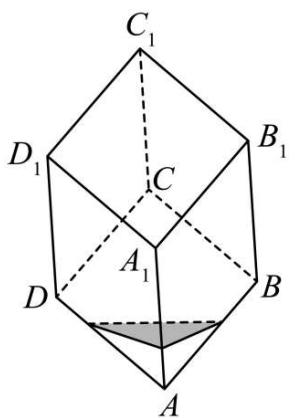

text_image

C₁
D₁ C B₁
A₁
D B
A

A. 液面始终与地面平行  
B. x=32 时, 液面始终呈平行四边形  
C. 当 $x \in (0,8)$ 时，有液体的部分可呈正三棱锥  
D. 当液面与正方体的对角线 $\mathrm{AC}_{1}$ 垂直时，液面面积最大值为 $12\sqrt{3}$

2891 (多选题)(2024·广东广州·高三执信中学校考阶段练习)透明塑料制成的正方体密闭容器 ABCD - A₁B₁C₁D₁ 的体积为 8, 注入体积为 x(0 < x < 8) 的液体. 如图, 将容器下底面的顶点 A 置于地面上, 再将容器倾斜. 随着倾斜度的不同, 则下列说法正确的是 ( )

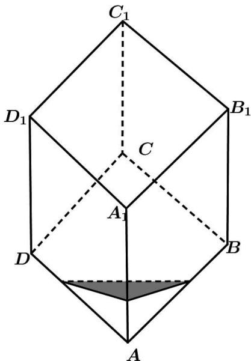

text_image

C₁
D₁
C
B₁
A₁
D
B
A

A. 液面始终与地面平行  
B. x=4 时, 液面始终是平行四边形  
C. 当 $x \in (0,1)$ 时，有液体的部分可呈正三棱锥  
D. 当液面与正方体的对角线 AC 垂直时, 液面面积最大值为 $3\sqrt{3}$

2892 (多选题)(2024·全国·高三专题练习)向体积为1的正方体密闭容器内注入体积为 $x(0<x<1)$ 的液体,旋转容器,下列说法正确的是()

A. 当 $x=\frac{1}{2}$ 时, 容器被液面分割而成的两个几何体完全相同  
B. 不管注入多少液体,液面都可以成正三角形形状  
C. 液面可以是正六边形, 其面积为 $\frac{3\sqrt{3}}{4}$   
D. 当液面恰好经过正方体的某条体对角线时，液面边界周长的最小值为 $\sqrt{5}$

2893 (2024·全国·高三专题练习)在一个密闭的容积为1的透明正方体容器内装有部分液体,如果任意转动该正方体,液面的形状都不可能是三角形,那么液体体积的取值范围是\_\_\_\_.

2894 (2024·四川泸州·四川省泸州高级中学校校考一模)一个长、宽、高分别为1、2、3密封且透明的长方体容器中装有部分液体,如果任意转动该长方体,液面的形状都不可能是三角形,那么液体体积的取值范围是 \_\_\_\_.

