# 第56讲 立体几何解答题

# 必考题型全归纳

# 1 题型一:非常规空间几何体为载体

2895 (2024·全国·高三专题练习)已知正四棱台 $ABCD-A_{1}B_{1}C_{1}D_{1}$ 的体积为 $\frac{28\sqrt{2}}{3}$ ，其中 $AB=2A_{1}B_{1}=4$ .

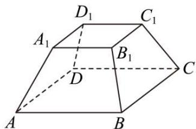

text_image

D₁
C₁
A₁
B₁
D
C
A
B

(1) 求侧棱 $\mathrm{AA}_{1}$ 与底面ABCD所成的角；  
(2) 在线段 $\mathrm{CC}_{1}$ 上是否存在一点P，使得BP⊥A $_1$ D？若存在请确定点P的位置；若不存在，请说明理由.

2896 (2024·全国·高三专题练习)在三棱台 ABC-DEF 中，G 为 AC 中点，AC=2DF，AB ⊥ BC，BC ⊥ CF.

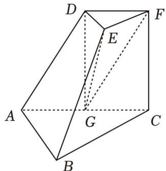

text_image

Geometric diagram of a polyhedron with labeled vertices A, B, C, D, E, F, G and solid/dashed edges indicating 3D perspective.

(1) 求证: BC ⊥ 平面 DEG;
(2) 若 AB = BC = 2, CF ⊥ AB, 平面 EFG 与平面 ACFD 所成二面角大小为 $\frac{\pi}{3}$ , 求三棱锥 E - DFG 的体积.

2897 (2024·重庆万州·高三重庆市万州第二高级中学校考阶段练习)如图,在正四棱台 $ABCD-A_{1}B_{1}C_{1}D_{1}$ 中, $AB=2A_{1}B_{1},AA_{1}=\sqrt{3},M,N$ 为棱 $B_{1}C_{1},C_{1}D_{1}$ 的中点,棱AB上存在一点E,使得 $A_{1}E//$ 平面BMND.

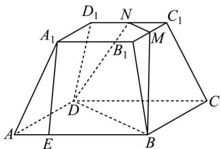

text_image

D₁ N C₁
A₁ M
B₁
D
A E B C

(1) 求 $\frac{AE}{AB}$ ;
(2) 当正四棱台 ABCD - A₁B₁C₁D₁ 的体积最大时，求 BB₁ 与平面 BMND 所成角的正弦值.

2898 (2024·湖北黄冈·浠水县第一中学校考模拟预测)如图,在三棱台 $A_{1}B_{1}C_{1}-ABC$ 中, $A_{1}B_{1}=2, AB=AC=4, AA_{1}=CC_{1}=\sqrt{5}, BB_{1}=3, \angle BAC=\frac{\pi}{2}.$

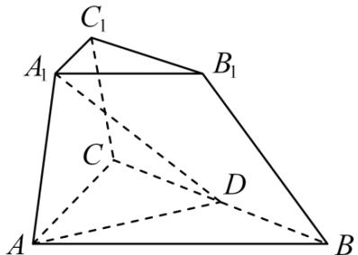

text_image

C₁
A₁ B₁
C
D
A B

(1) 证明: 平面 $A_{1}ACC_{1} \perp$ 平面 ABC;  
(2) 设 D 是 BC 的中点, 求平面 $A_{1}ACC_{1}$ 与平面 $A_{1}AD$ 夹角的余弦值.

2899 (2024·安徽·高三安徽省定远中学校考阶段练习)如图,圆锥PO的高为3,AB是底面圆O的直径,四边形ABCD是底面圆O的内接等腰梯形,且AB=2CD=2,点E是母线PB上一动点.

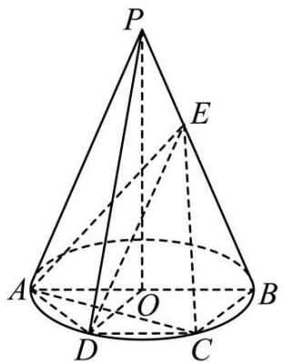

text_image

P
E
A
O
B
D
C

(1) 证明: 平面 ACE ⊥ 平面 POD;  
(2) 若二面角 A - EC - B 的余弦值为 $\frac{\sqrt{130}}{130}$ ，求三棱锥 A - ECD 的体积.

2900 (2024·云南·云南师大附中校考模拟预测)如图, P 为圆锥的顶点, A, B 为底面圆 O 上两点, $\angle AOB = \frac{2\pi}{3}$ , E 为 PB 中点, 点 F 在线段 AB 上, 且 AF = 2FB.

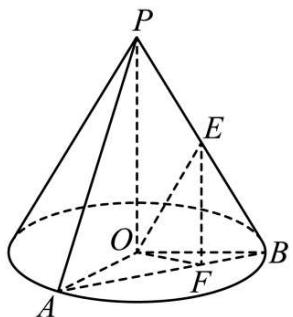

text_image

P
E
O
F
A
B

(1) 证明: 平面 AOP ⊥ 平面 OEF;  
(2) 若 OP = AB, 求直线 AP 与平面 OEF 所成角的正弦值.

2901 (2024·内蒙古赤峰·校联考三模)如图，P为圆锥的顶点，O是圆锥底面的圆心，四边形ABCD是圆O的内接四边形，BD为底面圆的直径，M在母线PB上，且 $AB=BC=BM=2, BD=4, MD=2\sqrt{3}$ .

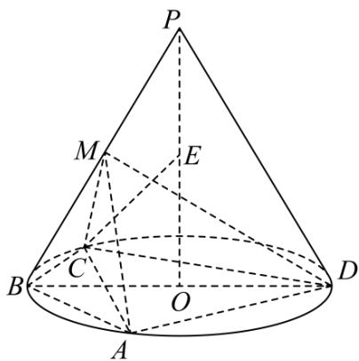

text_image

P
M
E
B
C
O
A
D

(1) 求证: 平面 AMC ⊥ 平面 ABCD;  
(2) 设点 E 为线段 PO 上动点, 求直线 CE 与平面 ADM 所成角的正弦值的最大值.

2902 (2024·山东潍坊·统考模拟预测)如图,线段 $AA_{1}$ 是圆柱 $OO_{1}$ 的母线, $\triangle ABC$ 是圆柱下底面 $\odot O$ 的内接正三角形, $AA_{1}=AB=3$ .

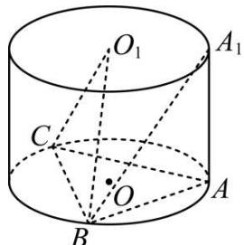

text_image

O₁
A₁
C
O
A
B

(1)劣弧 $\widehat{\mathrm{BC}}$ 上是否存在点D，使得 $\mathrm{O_1D} / /$ 平面 $\mathrm{A}_1\mathrm{AB}$ ？若存在，求出劣弧 $\widehat{\mathrm{BD}}$ 的长度；若不存在，请说明理由.  
(2) 求平面 $\mathrm{CBO}_{1}$ 和平面 $\mathrm{BAA}_{1}$ 所成角的正弦值.

# 2 题型二:立体几何存在性问题

2903 (2024·全国·高三对口高考)如图,如图1,在直角梯形ABCD中, $\angle ABC=\angle DAB=90^{\circ}$ , $\angle CAB=30^{\circ}, BC=2, AD=4$ . 把 $\triangle DAC$ 沿对角线AC折起到 $\triangle PAC$ 的位置,如图2所示,使得点P在平面ABC上的正投影H恰好落在线段AC上,连接PB,点E,F分别为线段PA,AB的中点.

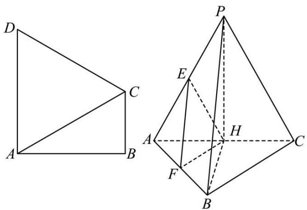

text_image

Geometric diagram showing two triangles ABCD and a tetrahedron with labeled vertices and internal points.

图1

(1) 求证: 平面 EFH // 平面 PBC;  
(2) 求直线 HE 与平面 PHB 所成角的正弦值；  
(3) 在棱 PA 上是否存在一点 M, 使得 M 到点 P, H, A, F 四点的距离相等? 请说明理由.

2904 (2024·上海长宁·上海市延安中学校考三模)已知 $\triangle ABC$ 和 $\triangle ADE$ 所在的平面互相垂直，AD⊥AE，AB=2，AC=4， $\angle BAC=120^{\circ}$ ，D是线段BC的中点，AD= $\sqrt{3}$ .

(1) 求证: AD ⊥ BE;   
(2) 设 AE = 2，在线段 AE 上是否存在点 F(异于点 A)，使得二面角 A - BF - C 的大小为 $45^{\circ}$ .

2905 (2024·湖南邵阳·邵阳市第二中学校考模拟预测)如图,在 $\triangle ABC$ 中, $\angle B = 90^{\circ}$ , P 为 AB 边上一动点, PD // BC 交 AC 于点 D, 现将 $\triangle PDA$ 沿 PD 翻折至 $\triangle PDA'$ .

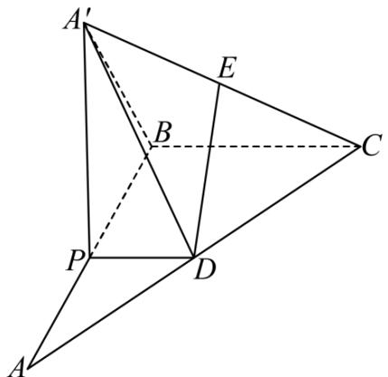

text_image

Geometric diagram with labeled points A, B, C, D, E, P, showing solid and dashed lines for spatial relationships.

(1) 证明: 平面 CBA' ⊥ 平面 PBA';  
(2) 若 PB = CB = 2PD = 4，且 A'P ⊥ AP，线段 A'C 上是否存在一点 E（不包括端点），使得锐二面角 E - BD - C 的余弦值为 $\frac{3\sqrt{14}}{14}$ ，若存在求出 $\frac{A'E}{EC}$ 的值，若不存在请说明理由.

2906 (2024·福建厦门·统考模拟预测)等形是指有一条对角线所在直线为对称轴的四边形. 如图, 四边形 ABCD 为等形, 其对角线交点为 O, AB = $\sqrt{2}$ , BD = BC = 2, 将 $\triangle ABD$ 沿 BD 折到 $\triangle A'BD$ 的位置, 形成三棱锥 A' - BCD.

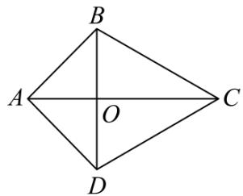

text_image

B
A	O	C
D

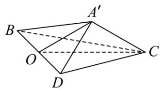

text_image

A'
B
O
C
D

(1) 求 B 到平面 A'OC 的距离;  
(2) 当 $A'C = 1$ 时，在棱 A'D 上是否存在点 P，使得直线 BA' 与平面 POC 所成角的正弦值为 $\frac{1}{4}$ ？若存在，求 $\frac{A'P}{A'D}$ 的值；若不存在，请说明理由.

2907 (2024·湖北襄阳·襄阳四中校考模拟预测)斜三棱柱 ABC - A₁B₁C₁ 的各棱长都为 4, ∠A₁AB = 60°, 点 A₁ 在下底面 ABC 的投影为 AB 的中点 O.

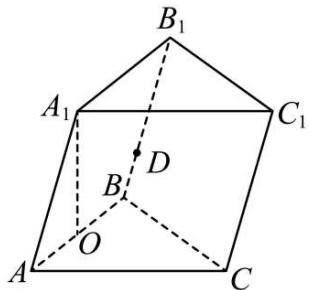

text_image

B₁
A₁
C₁
D
B
O
A
C

(1) 在棱 $\mathrm{BB}_{1}$ (含端点) 上是否存在一点 D 使 $\mathrm{A}_{1} \mathrm{~D} \perp \mathrm{AC}_{1}$ ? 若存在, 求出 BD 的长; 若不存

在,请说明理由;

(2) 求点 $A_{1}$ 到平面 $BCC_{1}B_{1}$ 的距离.

2908 (2024·全国·高三专题练习)如图,在四棱锥 P-ABCD 中, CD⊥平面 PAD, △PAD 为等边三角形, AD // BC, AD=CD=2BC=2, 平面 PBC 交平面 PAD 直线 l, E、F 分别为棱 PD, PB 的中点.

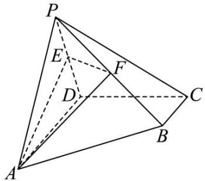

text_image

Geometric diagram of a triangular pyramid with labeled vertices and internal points, used for spatial geometry problems.

(1) 求证: BC // l;

(2) 求平面 AEF 与平面 PAD 所成锐二面角的余弦值;

(3) 在棱 PC 上是否存在点 G, 使得 DG // 平面 AEF? 若存在, 求 $\frac{\mathrm{PG}}{\mathrm{PC}}$ 的值, 若不存在, 说明理由.

2909 (2024·湖北襄阳·襄阳四中校考模拟预测)在三棱锥 P-ABC 中, 若已知 PA⊥BC, PB⊥AC, 点 P 在底面 ABC 的射影为点 H, 则

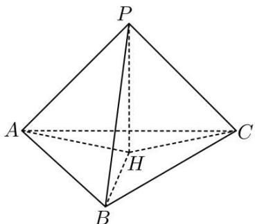

text_image

P
A
H
B
C

(1) 证明: PC ⊥ AB

(2) 设 $\mathrm{PH} = \mathrm{HA} = \mathrm{HB} = \mathrm{HC} = 2$ ，则在线段 PC 上是否存在一点 M，使得 BM 与平面 PAB 所成角的余弦值为 $\frac{4}{5}$ ，若存在，设 $\frac{\mathrm{CM}}{\mathrm{CP}} = \lambda$ ，求出 $\lambda$ 的值，若不存在，请说明理由.

2910 (2024·浙江·校联考模拟预测)在四棱锥 E-ABCD 中, 底面 ABCD 为矩形, AD=2AB =2, $\triangle EAD$ 为等腰直角三角形, 平面 EAD ⊥ 平面 ABCD, G 为 BC 中点.

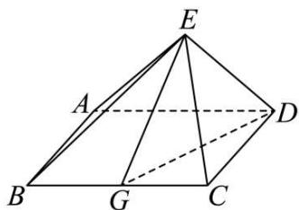

text_image

Geometric diagram of a pyramid with labeled vertices and internal points, used in spatial geometry problems.

(1) 在线段 AD 上是否存在点 Q, 使得点 Q 到平面 EGD 的距离为 $\frac{\sqrt{3}}{2}$ . 若存在, 求出 DQ 的值; 若不存在, 说明理由;

(2) 求二面角 D - EC - B 的正弦值.

2911 (2024·全国·高三专题练习)如图,在三棱锥 P-ABC 中,侧面 PAC 是边长为 2 的正三角形, BC=4, AB=2√5, E,F 分别为 PC,PB 的中点,平面 AEF 与底面 ABC 的交线为 l.

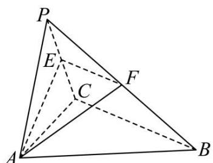

text_image

P
E
C
F
A
B

(1) 证明: $l \parallel$ 平面 PBC.

(2) 若三棱锥 P-ABC 的体积为 $\frac{4\sqrt{3}}{3}$ , 试问在直线 $l$ 上是否存在点 Q, 使得直线 PQ 与平面 AEF 所成角为 $\alpha$ , 异面直线 PQ, EF 所成角为 $\beta$ , 且满足 $\alpha + \beta = \frac{\pi}{2}$ ? 若存在, 求出线段 AQ 的长度; 若不存在, 请说明理由.

2912 (2024·安徽淮北·统考二模)如图所示,四棱锥 P-ABCD 中,底面 ABCD 为菱形, $\angle ABC=60^{\circ},PC\perp BD,PA=AB=\frac{\sqrt{2}}{2}PB.$

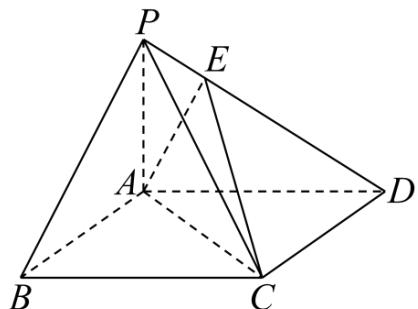

text_image

P
E
A
D
B
C

(1) 证明: PA ⊥ 面 ABCD;

(2) 线段 PD 上是否存在点 E, 使平面 ACE 与平面 PAB 夹角的余弦值为 $\frac{\sqrt{39}}{13}$ ? 若存在, 指出点 E 位置: 若不存在, 请说明理由.

# 题型三:立体几何折叠问题

2913 (2024·河南·洛宁县第一高级中学校联考模拟预测)在图1中, $\triangle ABC$ 为等腰直角三角形, $\angle B = 90^{\circ}$ , $AB = 2\sqrt{2}$ , $\triangle ACD$ 为等边三角形, $O$ 为AC边的中点, $E$ 在BC边上,且 $EC = 2BE$ ,沿AC将 $\triangle ACD$ 进行折叠,使点D运动到点F的位置,如图2,连接FO,FB,FE,使得 $FB = 4$ .

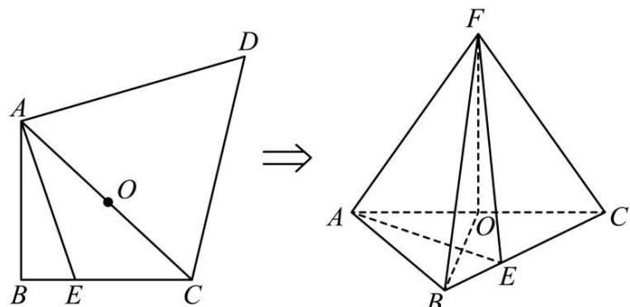

text_image

Geometric diagram showing a triangle ABCD transformed into a 3D polyhedron with labeled vertices and internal points.

图1

(1) 证明: FO ⊥ 平面 ABC.

(2) 求二面角 E-FA-C 的余弦值.

2914 (2024·广东深圳·校考二模)如图1所示,等边△ABC的边长为2a,CD是AB边上的

高，E，F分别是AC，BC边的中点．现将△ABC沿CD折叠，如图2所示.

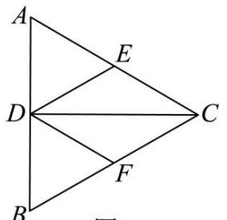

text_image

A
E
D
C
F
B

图1

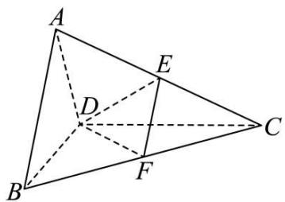

text_image

Geometric diagram of a tetrahedron with labeled vertices A, B, C, D, E, F and internal dashed lines indicating hidden edges.

图2

(1) 证明: CD ⊥ EF;   
(2) 折叠后若 AB = a，求二面角 A - BD - E 的余弦值.

2915 (2024·四川南充·高三阆中中学校考阶段练习)如图甲所示的正方形 $AA'A_{1}'A_{1}$ 中， $AA_{1}=12, AB=A_{1}B_{1}=3, BC=B_{1}C_{1}=4$ ，对角线 $AA'_{1}$ 分别交 $BB_{1}, CC_{1}$ 于点 P,Q，将正方形 $AA'A_{1}'A_{1}$ 沿 $BB_{1}, CC_{1}$ 折叠使得 $AA_{1}$ 与 $A'A_{1}'$ 重合，构成如图乙所示的三棱柱 ABC- $A_{1}B_{1}C_{1}$ .

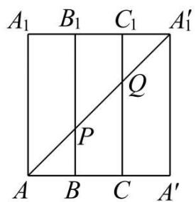

text_image

A₁ B₁ C₁ A₁′
Q
P
A B C A′

甲

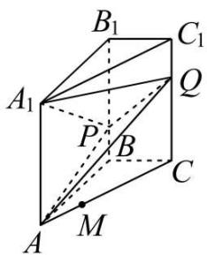

text_image

B₁
C₁
A₁
Q
P
B
C
A
M

乙

(1) 若点 M 在棱 AC 上, 且 AM = $\frac{15}{7}$ , 证明: BM // 平面 APQ;  
(2) 求二面角 $A_{1}-PQ-A$ 的余弦值.

2916 (2024·重庆渝中·高三重庆巴蜀中学校考阶段练习)已知如图甲所示,直角三角形SAB中, $\angle ABS=90^{\circ}$ , AB=BS=6,C,D分别为SB,SA的中点,现在将 $\triangle SCD$ 沿着CD进行翻折,使得翻折后S点在底面ABCD的投影H在线段BC上,且SC与平面ABCD所成角为 $\frac{\pi}{3}$ ,M为折叠后SA的中点,如图乙所示.

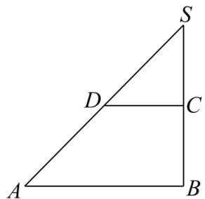

text_image

S
D
C
A
B

甲

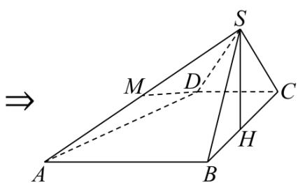

text_image

⇒
A
B
C
D
M
S
H

乙

(1) 证明: DM // 平面 SBC;  
(2) 求平面 ADS 与平面 SBC 所成锐二面角的余弦值.

2917 (2024·全国·高三专题练习)如图1,在直角梯形BCDE中,BC//DE,BC⊥CD,A为DE的中点,且 $DE=2BC=4$ , $BE=2\sqrt{2}$ ,将△ABE沿AB折起,使得点E到达P处(P与D不重合),记PD的中点为M,如图2.

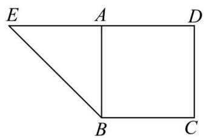

text_image

E
A
D
B
C

图1

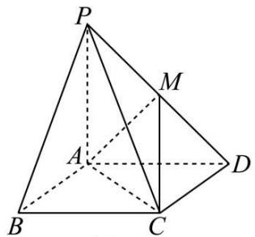

text_image

P
M
A
B
C
D

图2

(1) 在折叠过程中, PB 是否始终与平面 ACM 平行? 请说明理由;  
(2) 当四棱锥 P-ABCD 的体积最大时, 求 CD 与平面 ACM 所成角的正弦值.

2918 (2024·全国·高三专题练习)如图, 四边形 ABCD 中, AB ⊥ AD, AD // BC, AD = 6, BC = 2AB = 4, E, F 分别在 BC, AD 上, EF // AB, 现将四边形 ABCD 沿 EF 折起, 使 BE ⊥ EC.

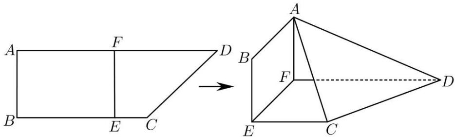

text_image

A
F
D
B
E
C
→
A
B
F
D
E
C

(1) 若 BE = 3，在折叠后的线段 AD 上是否存在一点 P，使得 CP // 平面 ABEF？若存在，求出 $\frac{AP}{PD}$ 的值；若不存在，说明理由.  
(2) 求三棱锥 A-CDF 的体积的最大值, 并求出此时点 F 到平面 ACD 的距离.

2919 (2024·全国·高三专题练习)如图,四边形 MABC 中, $\triangle ABC$ 是等腰直角三角形, $\angle ACB = 90^{\circ}$ , $\triangle MAC$ 是边长为 2 的正三角形,以 AC 为折痕,将 $\triangle MAC$ 向一方折叠到 $\triangle DAC$ 的位置,使 D 点在平面 ABC 内的射影在 AB 上,再将 $\triangle MAC$ 向另一方折叠到 $\triangle EAC$ 的位置,使平面 EAC ⊥ 平面 ABC,形成几何体 DABCE.

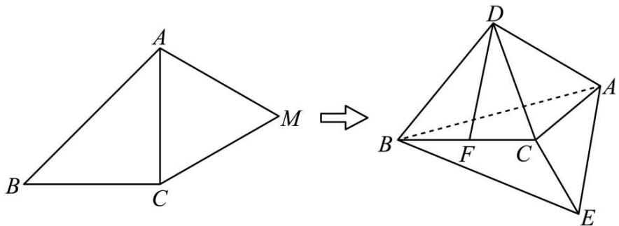

text_image

A
B C M
D
B F C A
E

(1) 若点 F 为 BC 的中点, 求证: DF // 平面 EAC;  
(2) 求平面 ACD 与平面 BCE 所成角的正弦值.

2920 (2024·四川泸州·泸县五中校考三模)如图1,在梯形ABCD中,AB//CD,且AB=2CD=4,△ABC是等腰直角三角形,其中BC为斜边.若把△ACD沿AC边折叠到△ACP的位置,使平面PAC⊥平面ABC,如图2.

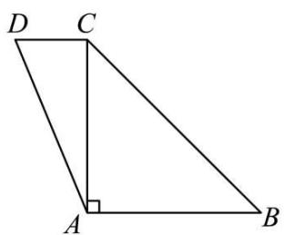

text_image

D C
A B

图1

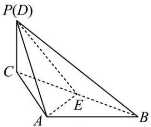

text_image

P(D)
C
E
A
B

图2

(1) 证明: AB ⊥ PA;   
(2) 若 E 为棱 BC 的中点, 求点 B 到平面 PAE 的距离.

2921 (2024·湖南长沙·长沙一中校考一模)如图1,四边形ABCD为直角梯形,AD//BC,AD⊥AB,∠BCD=60°,AB=2√3,BC=3,E为线段CD上一点,满足BC=CE,F为BE的中点,现将梯形沿BE折叠(如图2),使平面BCE⊥平面ABED.

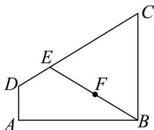

text_image

Geometric diagram of triangle ABC with points D, E, F and line segments DE, BF, EF labeled

图1

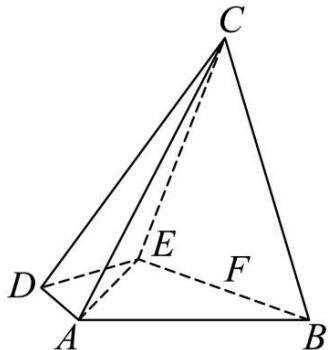

text_image

C
D
E
F
A
B

图2

(1) 求证: 平面 ACE ⊥ 平面 BCE;  
(2) 能否在线段 AB 上找到一点 P(端点除外) 使得直线 AC 与平面 PCF 所成角的正弦值为 $\frac{\sqrt{3}}{4}$ ? 若存在, 试确定点 P 的位置; 若不存在, 请说明理由.

# 4 题型四:立体几何作图问题

2922 (2024·云南昆明·高三校考阶段练习)已知正四棱锥 P-ABCD 中, O 为底面 ABCD 的中心, 如图所示.

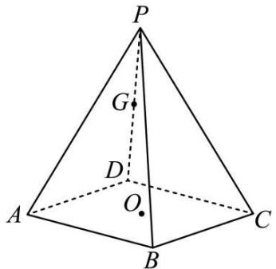

text_image

P
G
D
O
A
B
C

(1) 作出过点 O 与平面 PAD 平行的截面, 在答题卡上作出该截面与四棱锥表面的交线, 写出简要作图过程及理由;  
(2) 设 PD 的中点为 G, PA = AB, 求 AG 与平面 PAB 所成角的正弦值.

2923 (2024·贵州·校联考模拟预测)如图, 已知平行六面体 $ABCD - A_{1}B_{1}C_{1}D_{1}$ 的底面 ABCD 是菱形, $CD = CC_{1} = AC_{1} = 2$ , $\angle DCB = \frac{\pi}{3}$ , 且 $\cos\angle C_{1}CD = \cos\angle C_{1}CB = \frac{3}{4}$ .

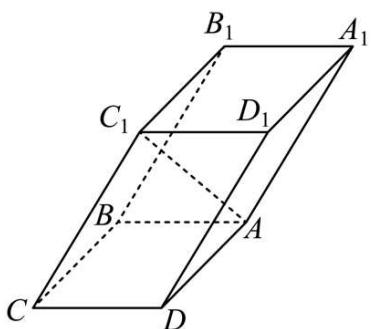

text_image

B₁
A₁
C₁
D₁
B
A
C
D

(1) 试在平面 ABCD 内过点 C 作直线 l，使得直线 $l \parallel$ 平面 $C_{1}BD$ ，说明作图方法，并证明：直线 $l \parallel B_{1}D_{1}$ ;
(2) 求平面 $BC_{1}D$ 与平面 $A_{1}B_{1}D$ 所成锐二面角的余弦值.

2924 (2024·全国·高三专题练习)如图,已知平行六面体 $ABCD-A_{1}B_{1}C_{1}D_{1}$ 的底面 ABCD 是菱形, $CD=CC_{1}=AC_{1}=2$ , $\angle DCB=\frac{\pi}{3}$ 且 $\cos\angle C_{1}CD=\cos\angle C_{1}CB=\frac{3}{4}$ .

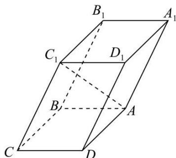

text_image

B₁
A₁
C₁
D₁
B
A
C
D

(1) 试在平面 ABCD 内过点 C 作直线 l，使得直线 $l \parallel$ 平面 $C_{1}BD$ ，说明作图方法，并证明：直线 $l \parallel B_{1}D_{1}$ ;
(2) 求点 C 到平面 $A_{1}BD$ 的距离.

2925 (2024·全国·高三专题练习)如图多面体 ABCDEF 中, 面 FAB ⊥ 面 ABCD, $\triangle FAB$ 为等边三角形, 四边形 ABCD 为正方形, EF // BC, 且 $EF = \frac{3}{2}BC = 3$ , H, G 分别为 CE, CD 的中点.

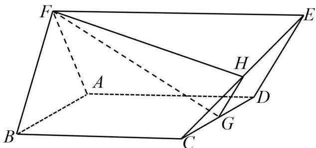

text_image

Geometric diagram of a parallelepiped with labeled vertices and internal points, used for spatial geometry problems.

(1) 求二面角 C-FH-G 的余弦值;
(2) 作平面 FHG 与平面 ABCD 的交线, 记该交线与直线 AB 交点为 P, 写出 $\frac{AP}{AB}$ 的值 (不需要说明理由, 保留作图痕迹).

2926 (2024·全国·高三专题练习)四棱锥 P-ABCD 中, 底面 ABCD 是边长为 2 的菱形, $\angle DAB = \frac{2\pi}{3}.$ AC ∩ BD = O, 且 PO ⊥ 平面 ABCD, PO = $\sqrt{3}$ , 点 F, G 分别是线段 PB. PD 上的中点, E 在 PA 上. 且 PA = 3PE.

(Ⅰ) 求证: BD // 平面 EFG;
(Ⅱ) 求直线 AB 与平面 EFG 的成角的正弦值;

(III) 请画出平面 EFG 与四棱锥的表面的交线, 并写出作图的步骤.

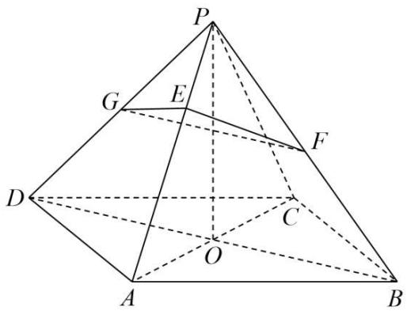

text_image

Geometric diagram of a pyramid with labeled vertices and internal points, used in spatial geometry problems.

2927 (2024·安徽六安·安徽省舒城中学校考模拟预测)如图,已知多面体EABCDF的底面ABCD是边长为2的正方形,EA⊥底面ABCD,FD//EA,且 $FD=\frac{1}{2}EA=1$ .

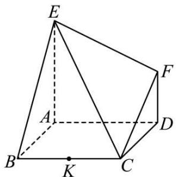

text_image

E
A
B
K
C
D
F

(1) 记线段 BC 的中点为 K，在平面 ABCD 内过点 K 作一条直线与平面 ECF 平行，要求保留作图痕迹，但不要求证明；
(2) 求直线 EB 与平面 ECF 所成角的正弦值.

2928 (2024·广西·高三统考阶段练习)如图,三棱柱 ABC-A₁B₁C₁ 中,侧面 BB₁C₁C 为菱形.

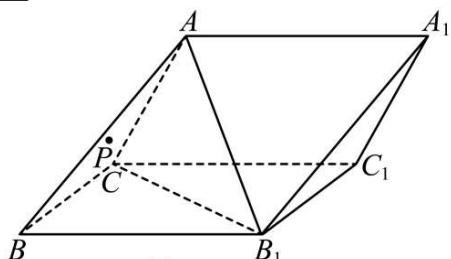

text_image

A
A₁
P
C
B
B₁
C₁

图1

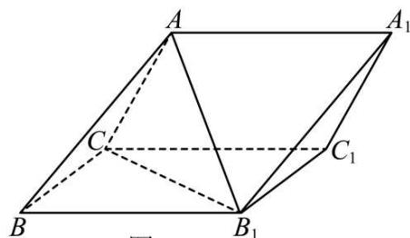

text_image

A
A₁
C
C₁
B
B₁

图2

(1) (如图1) 若点 P 为 $\triangle ABC$ 内任一点, 作出 $C_{1}P$ 与面 $ACB_{1}$ 的交点 M (作出图象并写出简单的作图过程, 不需证明);

(2) (如图 2) 若面 $ACB_{1} \perp$ 面 $BB_{1}C_{1}C, AC \perp AB_{1}, AC = AB_{1}, \angle CBB_{1} = 60^{\circ}$ ，求二面角 $A - A_{1}B_{1} - C_{1}$ 的余弦值.

2929 (2024·四川成都·成都七中校考模拟预测) $\triangle ABC$ 是边长为 2 的正三角形, P 在平面上满足 CP = CA, 将 $\triangle ACP$ 沿 AC 翻折, 使点 P 到达 P' 的位置, 若平面 P'BC ⊥ 平面 ABC, 且 BC ⊥ P'A.

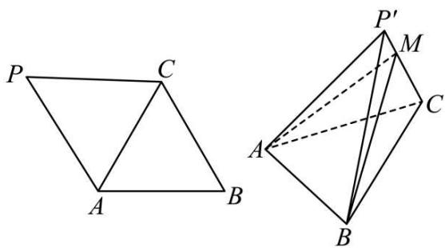

text_image

Geometric diagram showing two 3D polyhedra with labeled vertices and internal lines, likely illustrating a spatial geometry problem.

(1) 作平面 $\alpha$ , 使得 $\mathrm{AP}' \subset \alpha$ , 且 $\mathrm{BC} \perp \alpha$ , 说明作图方法并证明;

(2) 点 M 满足 $\overrightarrow{MC}=2\overrightarrow{P'M}$ ，求二面角 $P'-AB-M$ 的余弦值.

2930 (2024·四川绵阳·高三绵阳南山中学实验学校校考阶段练习)已知四棱锥 P-ABCD 的底面 ABCD 是平行四边形,侧棱 PA⊥平面 ABCD,点 M 在棱 DP 上,且 DM=2MP,点 N 是在棱 PC 上的动点(不为端点).(如图所示)

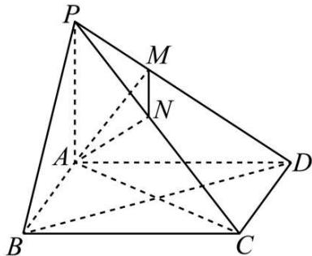

text_image

P
M
N
A
D
B
C

(1) 若 N 是棱 PC 中点，  
(i) 画出 $\triangle PBD$ 的重心 G(保留作图痕迹), 指出点 G 与线段 AN 的关系, 并说明理由;  
(ii) 求证: PB // 平面 AMN;  
(2) 若四边形 ABCD 是正方形, 且 AP = AD = 3, 当点 N 在何处时, 直线 PA 与平面 AMN 所成角的正弦值取最大值.

# 5 题型五:立体几何建系繁琐问题

2931 (2024·福建福州·福建省福州格致中学校考模拟预测)如图,在四棱台 ABCD - A₁B₁C₁D₁ 中,底面 ABCD 是菱形, $\angle ABC=\frac{\pi}{3}$ , $\angle B_{1}BD=\frac{\pi}{6}$ , $\angle B_{1}BA=\angle B_{1}BC$ ,AB=2A₁B₁=2,B₁B=3

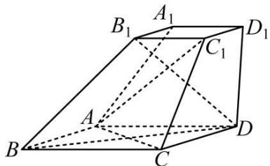

text_image

B₁ A₁ D₁
C₁
A
B C D

(1) 求证: 直线 AC ⊥ 平面 BDB $_{1}$ ;  
(2) 求直线 $A_{1}B_{1}$ 与平面 $ACC_{1}$ 所成角的正弦值.

2932 (2024·全国·模拟预测)如图,在直三棱柱 $ABC-A_{1}B_{1}C_{1}$ 中,侧面 $BCC_{1}B_{1}$ 为正方形,M,N分别为BC, $A_{1}C_{1}$ 的中点,AC⊥ $B_{1}M$ .

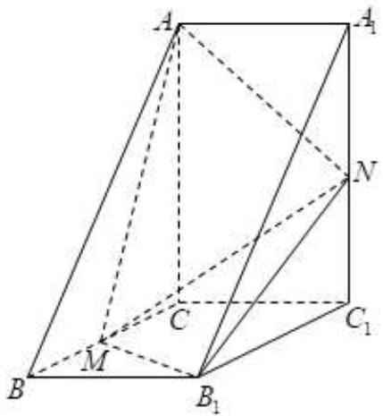

text_image

Geometric diagram of a triangular prism with labeled vertices and internal points, used for spatial geometry problems.

(1) 证明: MN // 平面 ABB $_{1}$ A $_{1}$ ;  
(2) 若 BC=2，三棱锥 A-B₁MN 的体积为 2，求二面角 A-B₁M-N 的余弦值.

2933 (2024·江西抚州·高三校联考阶段练习)如图,在几何体 ABCDE 中, AB = BC, AB ⊥ BC, 已知平面 ABC ⊥ 平面 ACD, 平面 ABC ⊥ 平面 BCE, DE // 平面 ABC, AD ⊥ DE.

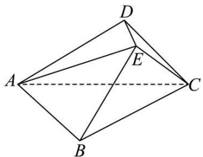

natural_image

Geometric diagram of a tetrahedron with vertices labeled A, B, C, D and point E on edge AC (no text or symbols beyond labels)

(1) 证明: DE ⊥ 平面 ACD;  
(2) 若 AC = 2CD = 2，设 M 为棱 BE 上的点，且满足 2BM = ME，求当几何体 ABCDE 的体积取最大值时，AM 与 CD 所成角的余弦值.

2934 (2024·黑龙江佳木斯·高一建三江分局第一中学校考期末)如图,已知三棱柱 ABC-A₁B₁C₁ 的底面是正三角形,侧面 BB₁C₁C 是矩形,M,N 分别为 BC,B₁C₁ 的中点,P 为 AM 上一点,过 B₁C₁ 和 P 的平面交 AB 于 E,交 AC 于 F.

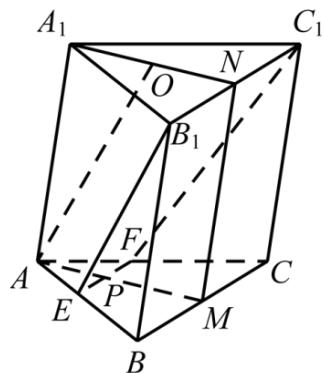

text_image

A₁
O
N
B₁
F
A
E
P
M
B
C₁

(1) 证明: 平面 $A_{1}AMN \perp EB_{1}C_{1}F$ ;  
(2) 设 O 为 $\triangle A_{1}B_{1}C_{1}$ 的中心, 若 AO // 平面 $EB_{1}C_{1}F$ , 且 AO = AB, 求直线 $B_{1}E$ 与平面 $A_{1}AMN$ 所成角的正弦值.

2935 (2024·黑龙江哈尔滨·哈九中校考三模)如图,已知三棱柱 ABC- $A_{1}B_{1}C_{1}$ 的底面是正三角形,侧面 $BB_{1}C_{1}C$ 是矩形,M,N 分别为 BC, $B_{1}C_{1}$ 的中点,P 为 AM 上一点,过 $B_{1}C_{1}$ 和

P 的平面交 AB 于 E, 交 AC 于 F.

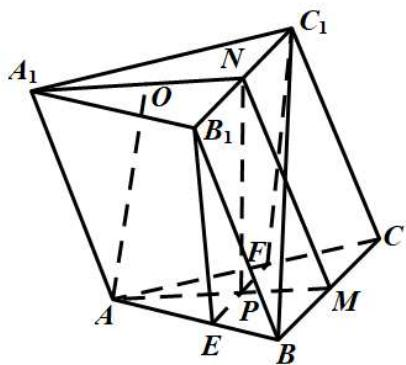

text_image

A₁
O
N
B₁
C₁
F
P
E
B
M
A
C

(1) 证明: $\mathrm{AA}_{1} // \mathrm{MN}$ , 且平面 $\mathrm{A}_{1} \mathrm{AMN} \perp$ 平面 $\mathrm{EB}_{1} \mathrm{C}_{1} \mathrm{F}$ ;  
(2) 设 $\mathrm{O}$ 为 $\triangle \mathrm{A}_{1} \mathrm{B}_{1} \mathrm{C}_{1}$ 的中心, 若 $\mathrm{AO} = \mathrm{AB} = 12$ , $\mathrm{AO} //$ 平面 $\mathrm{EB}_{1} \mathrm{C}_{1} \mathrm{F}$ , 且 $\angle \mathrm{MPN} = \frac{\pi}{3}$ , 求四棱锥 $\mathrm{B} - \mathrm{EB}_{1} \mathrm{C}_{1} \mathrm{F}$ 的体积.

2936 (2024·重庆沙坪坝·高三重庆一中校考期中)如图,在平行六面体 $ABCD-A_{1}B_{1}C_{1}D_{1}$ 中,每一个面均为边长为2的菱形,平面 $ABB_{1}A_{1}\perp$ 底面 ABCD, $\angle DAB=60^{\circ}$ , M, N 分别是 $AA_{1}$ , $BB_{1}$ 的中点, P 是 $B_{1}M$ 的中点.

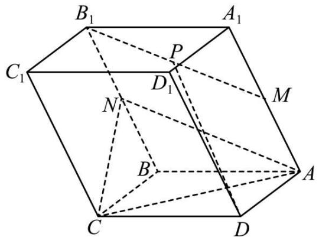

text_image

B₁
A₁
C₁
P
D₁
M
N
B
A
C
D

(1) 证明: DP // 平面 ACN;
(2) 若侧棱 $AA_{1}$ 与底面 ABCD 所成的角为 $60^{\circ}$ ，求平面 $DPB_{1}$ 与平面 $ADD_{1}A_{1}$ 所成锐二面角的余弦值.

2937 (2024·全国·高三专题练习)已知四棱锥 P-ABCD 中, PA⊥平面 ABCD, AD // BC, BC⊥AB, AB=AD= $\frac{1}{2}$ BC, BD= $\sqrt{2}$ , PD= $\sqrt{5}$ .

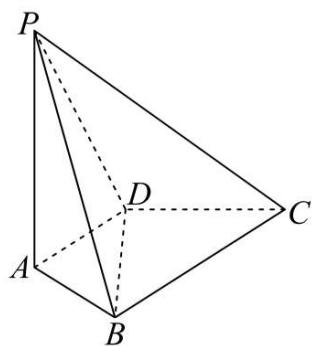

natural_image

Geometric diagram of a tetrahedron with labeled vertices P, A, B, C, D (no text or symbols present)

(1) 求直线 PC 与平面 PBD 所成角的正弦值；
(2) 线段 PB 上是否存在一点 M，使得 CM ⊥ 平面 PBD？若存在，请指出点 M 的位置；若不存在，请说明理由.

2938 (2024·全国·模拟预测)如图,三棱柱 $ABC-A_{1}B_{1}C_{1}$ 的底面为等边三角形, $AA_{1}=AC$ , 点 D, E 分别为 AC, $CC_{1}$ 的中点, $\angle CED=30^{\circ}, A_{1}B=\sqrt{2}BD=\sqrt{6}$ .

text_image

A₁
C₁
B₁
E
A
D
C
B

(1) 求点 $A_{1}$ 到平面 BDE 的距离;  
(2) 求二面角 $A_{1}-BE-D$ 的余弦值.

2939 (2024·全国·高三专题练习)已知两个四棱锥 $P_{1}-ABCD$ 与 $P_{2}-ABCD$ 的公共底面是边长为 4 的正方形,顶点 $P_{1}, P_{2}$ 在底面的同侧,棱锥的高 $P_{1}O_{1}=P_{2}O_{2}=2, O_{1}, O_{2}$ 分别为 AB, CD 的中点, $P_{1}D$ 与 $P_{2}A$ 交于点 E, $P_{1}C$ 与 $P_{2}B$ 交于点 F.

text_image

P₂
F
P₁
C
E
O₂
B
O₁
D
A

(1) 求证: 点 E 为线段 $P_{2}A$ 的中点;  
(2) 求这两个棱锥的公共部分的体积.

2940 (2024·全国·高一专题练习)《九章算术》是中国古代的一部数学专著,是《算经十书》中最重要的一部,成于公元一世纪左右.它是一本综合性的历史著作,是当时世界上最简练有效的应用数学,它的出现标志着中国古代数学形成了完整的体系.《九章算术》中将由四个直角三角形组成的四面体称为“鳖臑”,已知在三棱锥 P-ABC 中,PA ⊥ 平面 ABC.

text_image

Geometric diagram of a tetrahedron with labeled vertices P, A, B, C, D, E and internal points connected by solid and dashed lines.

(1) 从三棱锥 P-ABC 中选择合适的两条棱填空: \_\_\_\_ ⊥ \_\_\_\_, 则三棱锥 P-ABC 为“鳖臑”:  
(2)如图,已知AD⊥PB,垂足为D,AE⊥PC,垂足为E,∠ABC=90°.   
(i) 证明: 平面 ADE + 平面 PAC:  
(ii) 设平面 ADE 与平面 ABC 交线为 l，若 PA = 2√3，AC = 2，求二面角 E - l - C 的大小.

2941 (2024·浙江金华·高一浙江金华第一中学校考期末)如图, 四面体 ABCD 中, $\triangle ABC$ 等边三角形, AB ⊥ AD, 且 AB = AD = 2.

natural_image

Geometric diagram of a tetrahedron with vertices labeled A, B, C, D (no text or symbols present)

(1) 记 AC 中点为 M, 若面 ABC ⊥ 面 ABD, 求证: BM ⊥ 面 ADC;  
(2) 当二面角 D-AB-C 的大小为 $\frac{5\pi}{6}$ 时, 求直线 AD 与平面 BCD 所成角的正弦值.

2942 (2024·河北衡水·高二校考开学考试)已知四面体 ABCD, AD = CD, $\angle ADB = \angle CDB = 120^{\circ}$ , 且平面 ABD ⊥ 平面 BCD.

text_image

A
B
D
C

(1) 求证: BD ⊥ AC;   
(2) 求直线 CA 与平面 ABD 所成角的大小.

# 6 题型六:两角相等 (构造全等) 的立体几何问题

2943 (2024·全国·高三专题练习)如图,在三棱锥 A-BCD 中, $\triangle ABC$ 是等边三角形, $\angle BAD=\angle BCD=90^{\circ}$ ,点 P 是 AC 的中点,连接 BP,DP

text_image

A
P
B
D
C

(1) 证明: 平面 ACD ⊥ 平面 BDP;  
(2) 若 $\mathrm{BD} = \sqrt{6}$ , $\cos \angle \mathrm{BPD} = -\frac{\sqrt{3}}{3}$ , 求三棱锥 A - BCD 的体积.

2944 (2024·高二校考单元测试)如图, 在三棱锥 A-BCD 中, $\triangle ABC$ 是等边三角形, $\angle BAD = \angle BCD = 90^{\circ}$ , 点 P 是 AC 的中点, 连接 BP, DP.

text_image

A
P
B
C
D

(1) 证明: 平面 ACD ⊥ 平面 BDP;

(2) 若 $BD = \sqrt{6}$ ，且二面角 A - BD - C 为 $120^{\circ}$ ，求直线 AD 与平面 BCD 所成角的正弦值.

2945 (2024·全国·高三专题练习)如图, 四棱锥 F-ABCD 中, 底面 ABCD 为边长是 2 的正方形, E, G 分别是 CD, AF 的中点, AF=4, $\angle FAE=\angle BAE$ , 且二面角 F-AE-B 的大小为 $90^{\circ}$ .

text_image

Geometric diagram of a triangular pyramid with labeled vertices and internal points, used for spatial geometry problems.

(1) 求证: AE ⊥ BG;

(2) 求二面角 B-AF-E 的余弦值.

2946 (2024·全国·高三专题练习)如图, 四棱锥 E-ABCD 中, 四边形 ABCD 是边长为 2 的菱形, $\angle\mathrm{DAE}=\angle\mathrm{BAE}=45^{\circ}$ , $\angle\mathrm{DAB}=60^{\circ}$ .

text_image

D
C
A
B
E

(1) 证明: 平面 ADE ⊥ 平面 ABE;

(2) 当直线 DE 与平面 ABE 所成的角为 $30^{\circ}$ 时, 求平面 DCE 与平面 ABE 所成锐二面角的余弦值.

2947 (2024·广东阳江·高二统考期中)如图,在四面体ABCD中, $\triangle ABC$ 是正三角形, $\triangle ACD$ 是直角三角形, $\angle ABD = \angle CBD$ , AB = BD.

text_image

D
C
E
A
B

(1) 求证: 平面 ACD ⊥ 平面 ABC;
(2) 若 $\overrightarrow{DE}=m\overrightarrow{DB}$ ，二面角 D-AE-C 的余弦值为 $\frac{1}{7}$ ，求 m.

2948 (2024·全国·高三专题练习)如图,在四面体ABCD中,已知 $\angle ABD=\angle CBD=60^{\circ}$ , AB =BC=2,

natural_image

Geometric diagram of a tetrahedron with vertices labeled A, B, C, D (no text or symbols beyond labels)

(1) 求证: AC ⊥ BD;
(2) 若平面 ABD ⊥ 平面 CBD, 且 $BD = \frac{5}{2}$ , 求二面角 C - AD - B 的余弦值.

# 7 题型七:利用传统方法找几何关系建系

2949 (2024·河北·高三河北衡水中学校考阶段练习)如图,在长方体 ABCD-FGHE,平面 ABCD 与平面 BCEF 所成角为 $\theta\left(0<\theta<\frac{\pi}{2}\right)$ .

text_image

Geometric diagram of a cube with labeled vertices and internal points, used for spatial geometry problems.

(1) 若 AB = BC，求直线 AH 与平面 BCEF 所成角的余弦值 (用 $\cos\theta$ 表示);
(2) 将矩形 BCEF 沿 BF 旋转 $\theta$ 度角得到矩形 BFPQ，设平面 ABCD 与平面 BFPQ 所成角为 $\alpha\left(0<\alpha<\frac{\pi}{2}\right)$ ，请证明： $\cos\alpha=\cos^{2}\theta.$

2950 (2024·全国·唐山市第十一中学校考模拟预测)在四棱锥 S-ABCD 中, BC⊥CD, AB // CD, SA=SD=1, AB=2BC=2CD=2, 平面 SAD⊥平面 ABCD.

text_image

S
E
D
C
A
B

(1) 证明: SA ⊥ BD;
(2) 若 E 是棱 SB 上一点, 且二面角 S - AD - E 的余弦值为 $\frac{1}{2}$ , 求 $\frac{SE}{SB}$ 的大小.

2951 (2024·安徽·高三校联考期末)如图,在四棱锥 P-ABCD 中, AB // CD, AP ⊥ PD, AB ⊥ BC, PA = PD = DC = BC = 1, AB = 2, E 是 PB 的中点.

text_image

P
E
C
D
A
B

(1) 求 CE 的长;
(2) 设二面角 P - AD - B 平面角的补角大小为 $\theta$ ，若 $\theta \in \left(0, \frac{\pi}{2}\right]$ ，求平面 PAD 和平面 PBC 夹角余弦值的最小值.

2952 (2024·全国·高三专题练习)如图, 四棱锥 P-ABCD 的底面为正方形, PD⊥底面 ABCD, M 是线段 PD 的中点, 设平面 PAD 与平面 PBC 的交线为 l.

text_image

P
D
A
B
C

(1) 证明 $l \parallel$ 平面BCM  
(2) 已知 $\mathrm{PD} = \mathrm{AD} = 1, \mathrm{Q}$ 为 $l$ 上的点，若PB与平面QCD所成角的正弦值为是 $\frac{\sqrt{6}}{3}$ ，求线段QC的长.  
(3) 在(2)的条件下，求二面角 $\mathrm{D} - \mathrm{CQ} - \mathrm{M}$ 的正弦值.

2953 (2024·江西抚州·高二临川一中校考期中)如图, 直线 AQ ⊥ 平面 α, 直线 AQ ⊥ 平行四边形 ABCD, 四棱锥 P-ABCD 的顶点 P 在平面 α 上, AB = √7, AD = √3, AD ⊥ DB, AC ∩ BD = O, OP // AQ, AQ = 2, M, N 分别是 AQ 与 CD 的中点.

text_image

D
N
C
O
A
B
M
P
Q
α

(1) 求证: MN // 平面 QBC;  
(2) 求二面角 M-CB-Q 的余弦值.

2954 (2024·陕西安康·陕西省安康中学校考模拟预测)如图,在四棱锥 S-ABCD 中,底面 ABCD 为正方形,侧面 SAD 为等边三角形, $AB=2$ , $SC=2\sqrt{2}$ .

text_image

Geometric diagram of a pyramid with labeled vertices and internal points, used in spatial geometry problems.

(1) 证明: 平面 SAD ⊥ 平面 ABCD;  
(2)侧棱 SC 上是否存在一点 P(P 不在端点处), 使得直线 BP 与平面 SAC 所成角的正弦值等于 $\frac{\sqrt{21}}{7}$ ? 若存在, 求出点 P 的位置; 若不存在, 请说明理由.

2955 (2024·吉林长春·高二校考期末)如图, 四棱锥 S-ABCD 中, 底面 ABCD 为矩形, SD ⊥ 底面 ABCD, AD= $\sqrt{2}$ , DC=SD=2. 点 M 在侧棱 SC 上, $\angle ABM=60^{\circ}$ .

text_image

S
M
D
C
A
B

(1) 证明: M 是侧棱 SC 的中点;  
(2) 求二面角 S-AM-B 的余弦值.

2956 (2024·四川绵阳·高三绵阳南山中学实验学校校考阶段练习)三棱柱 ABC - A₁B₁C₁ 的底面 ABC 是等边三角形, BC 的中点为 O, A₁O ⊥ 底面 ABC, AA₁ 与底面 ABC 所成的角为 $\frac{\pi}{3}$ , 点 D 在棱 AA₁ 上, 且 AD = $\frac{\sqrt{3}}{2}$ , AB = 2.

text_image

A1
B1
C1
D
A
O
B
C

(1) 求证: OD ⊥ 平面 BB₁C₁C;  
(2) 求二面角 $\mathrm{B} - \mathrm{B}_{1} \mathrm{C} - \mathrm{A}_{1}$ 的平面角的余弦值.

2957 (2024·黑龙江齐齐哈尔·高三齐齐哈尔市实验中学校联考阶段练习)如图,三棱锥P-ABC所有棱长都等,PO⊥平面ABC,垂足为O. 点B₁,C₁分别在平面PAC,平面PAB内,线段BB₁,CC₁都经过线段PO的中点D.

text_image

P
C₁
B₁
D
A
O
C
B

(1) 证明: $B_{1}C_{1} \parallel$ 平面 ABC;  
(2) 求直线 AP 与平面 $AB_{1}C_{1}$ 所成角的正弦值.

2958 (2024·全国·高三专题练习)如图, 已知四棱锥 P-ABCE 中, PA⊥平面 ABCE, 平面 PAB⊥平面 PBC, 且 AB=1, BC=2, BE=2√2, 点 A 在平面 PCE 内的射影恰为 ΔPCE 的重心 G.

text_image

P
A
G
B
C
E

(1) 证明: BC ⊥ AB;

(2) 求直线 CG 与平面 PBC 所成角的正弦值.

2959 (2024·全国·高三专题练习)如图, 平面 $\alpha \parallel$ 平面 $\beta$ , 菱形 ABCD ⊂ 平面 $\alpha$ , AC = 2, E 为平面 $\beta$ 内一动点.

text_image

E.
β

text_image

A
B
D
C
α

(1) 若平面 $\alpha, \beta$ 间的距离为3，设直线AE，CE与平面 $\alpha$ 所成的角分别为 $\theta, \varphi, \frac{1}{\tan\theta} + \frac{1}{\tan\varphi} = 2$ ，求动点E在平面 $\alpha$ 内的射影F的一个轨迹方程；

(2) 若点 E 在平面 $\alpha$ 内的射影为 A, 证明: 直线 CE 与平面 BDE 所成的角与 $\angle BAD$ 的大小无关.

# 8 题型八:空间中的点不好求

2960 (2024·全国·校联考模拟预测)已知三棱锥 ABCD, D 在面 ABC 上的投影为 O, O 恰好为 $\triangle ABC$ 的外心. AC = AB = 4, BC = 2.

text_image

Geometric diagram of a tetrahedron with labeled vertices A, B, C, D and internal points E, O

(1) 证明: BC ⊥ AD;

(2)E为AD上靠近A的四等分点,若三棱锥A-BCD的体积为1,求二面角E-CO-B的余弦值.

2961 (2024·河南·校联考模拟预测)如图,在四棱锥 P-ABCD 中, $AB=BC=\frac{\sqrt{21}}{2}$ ,AD=CD=AC= $2\sqrt{3}$ ,E,F 分别为 AC,CD 的中点,点 G 在 PF 上,且 G 为三角形 PCD 的重心.

text_image

Geometric diagram of a pyramid with labeled vertices and internal points, used for spatial geometry problems.

(1) 证明: GE // 平面 PBC;

(2) 若 PA = PC, PA ⊥ CD, 四棱锥 P - ABCD 的体积为 $3\sqrt{3}$ , 求直线 GE 与平面 PCD 所成角的正弦值.

2962 (2024·湖北武汉·华中师大一附中校考模拟预测)如图,平行六面体 $ABCD - A_{1}B_{1}C_{1}D_{1}$ 中,点P在对角线 $BD_{1}$ 上, $AC \cap BD = O$ ,平面ACP//平面 $A_{1}C_{1}D$ .

text_image

D₁
A₁
B₁
C₁
P
D
O
C
A
B

(1) 求证: O, P, $B_{1}$ 三点共线;   
(2) 若四边形 ABCD 是边长为 2 的菱形, $\angle BAD = \angle BAA_{1} = \angle DAA_{1} = \frac{\pi}{3}$ , $AA_{1} = 3$ , 求二面角 P - AB - C 大小的余弦值.

2963 (2024·江西·校联考二模)正四棱锥 P-ABCD 中, PA=AB=2, E 为 PB 中点, $\overrightarrow{AF}=\lambda\overrightarrow{AP},\overrightarrow{CG}=\mu\overrightarrow{CP}$ , 平面 EFG∩平面 ABCD=l, 平面 EFG∩AD=K.

text_image

Geometric diagram of a pyramid with labeled vertices and internal points, used for spatial geometry problems.

(1) 证明: 当平面 EFG ⊥ 平面 PBD 时, l ⊥ 平面 PBD  
(2) 当 $\lambda = \mu = \frac{1}{3}$ 时，T 为 P-ABCD 表面上一动点 (包括顶点)，是否存在正数 m，使得有且仅有 5 个点 T 满足 $2\sqrt{2}|TP|^{2} + |TA|^{2} + |TB|^{2} + |TC|^{2} + |TK|^{2} = m$ ，若存在，求 m 的值，若不存在，请说明理由.

2964 (2024·全国·高三专题练习)如图,在棱长为2的正方体ABCD-EFGH中,点M是正方体的中心,将四棱锥M-BCGF绕直线CG逆时针旋转 $\alpha(0<\alpha<\pi)$ 后,得到四棱锥M'-B'CGF'.

text_image

Geometric diagram of a cube with labeled vertices and internal points, used for spatial geometry problems.

(1) 若 $\alpha=\frac{\pi}{2}$ ，求证：平面 MCG // 平面 M'B'F';  
(2) 是否存在 $\alpha$ , 使得直线 $\mathrm{M}^{\prime}\mathrm{F}^{\prime} \perp$ 平面 MBC? 若存在, 求出 $\alpha$ 的值; 若不存在, 请说明理由.

2965 (2024·全国·模拟预测)已知菱形ABCD中， $AB=BD=1$ ，四边形BDEF为正方形，满

足 $\angle ABF = \frac{2\pi}{3}$ , 连接 AE, AF, CE, CF.

text_image

Geometric diagram of a polyhedron with labeled vertices A, B, C, D, E, F and solid/dashed edges indicating 3D perspective.

(1) 证明: CF ⊥ AE;   
(2) 求直线 AE 与平面 BDEF 所成角的正弦值.

# 题型九:创新定义

2966 (2024·重庆沙坪坝·高三重庆一中校考阶段练习)魏晋时期数学家刘徽(图a)为研究球体的体积公式,创造了一个独特的立体图形“牟合方盖”,它由完全相同的四个曲面构成,相对的两个曲面在同一圆柱的侧面上.如图,将两个底面半径为1的圆柱分别从纵横两个方向嵌入棱长为2的正方体时(如图b),两圆柱公共部分形成的几何体(如图c)即得一个“牟合方盖”,图d是该“牟合方盖”的直观图(图中标出的各点A,B,C,D,P,Q均在原正方体的表面上).

  
刘徽
a

  
b

  
c

text_image

P
D
A
B
C

Q   
d

text_image

Geometric diagram of a sphere with labeled points A, B, C, D, M and connecting lines, likely illustrating a theorem or construction.

Q   
d

(1) 由“牟合方盖”产生的过程可知, 图 d 中的曲线 PBQD 为一个椭圆, 求此椭圆的离心率;  
(2) 如图 c，点 M 在椭圆弧 PB 上，且三棱锥 A-DMC 的体积为 $\frac{1}{3}$ ，求二面角 P-AM-C 的正弦值.

2967 (2024·辽宁沈阳·东北育才学校校考一模)蜂房是自然界最神奇的“建筑”之一,如图1所示.蜂房结构是由正六棱柱截去三个相等的三棱锥H-ABC,J-CDE,K-EFA,再分别以AC,CE,EA为轴将△ACH,△CEJ,△EAK分别向上翻转180°,使H,J,K三点重合为点S所围成的曲顶多面体(下底面开口),如图2所示.蜂房曲顶空间的弯曲度可用曲率来刻画,定义其度量值等于蜂房顶端三个菱形的各个顶点的曲率之和,而每一顶点的曲率规定等于2π减去蜂房多面体在该点的各个面角之和(多面体的面角是多面体的面的内角,用弧度制表示).例如:正四面体在每个顶点有3个面角,每个面角是 $\frac{\pi}{3}$ ,所以正四面体在各顶点的曲率为 $2\pi-3\times\frac{\pi}{3}=\pi$ .

natural_image

Close-up of a honeycomb structure with visible honeycomb and surrounding cells (no text or symbols)

图1

text_image

Geometric diagram of a polyhedron with labeled vertices and internal points, used in spatial geometry problems.

图2  

text_image

E
S
K
A
H
J
C
F₁
E₁
D₁
C₁
A₁
B₁

(1) 求蜂房曲顶空间的弯曲度;   
(2) 若正六棱柱底面边长为 1, 侧棱长为 2, 设 BH = x  
(i) 用 x 表示蜂房 (图 2 右侧多面体) 的表面积 S(x);  
(ii) 当蜂房表面积最小时, 求其顶点 S 的曲率的余弦值.

2968 (2024·全国·高三专题练习)北京大兴国际机场的显著特点之一是各种弯曲空间的运用.刻画空间的弯曲性是几何研究的重要内容.用曲率刻画空间弯曲性,规定:多面体顶点的曲率等于 $2\pi$ 与多面体在该点的面角之和的差(多面体的面的内角叫做多面体的面角,角度用弧度制),多面体面上非顶点的曲率均为零,多面体的总曲率等于该多面体各顶点的曲率之和.例如:正四面体在每个顶点有3个面角,每个面角是 $\frac{\pi}{3}$ ,所以正四面体在各顶点的曲率为 $2\pi-3\times\frac{\pi}{3}=\pi$ ,故其总曲率为 $4\pi$ .

natural_image

Aerial view of a large modern airport terminal with multiple runways and runways under a clear blue sky (no visible text or signage)

(1) 求四棱锥的总曲率;   
(2) 若多面体满足: 顶点数 - 棱数 + 面数 = 2, 证明: 这类多面体的总曲率是常数.

2969 (2024·河北·高三校联考阶段练习)已知 $\vec{a}=(x_{1},y_{1},z_{1})$ , $\vec{b}=(x_{2},y_{2},z_{2})$ , $\vec{c}=(x_{3},y_{3},z_{3})$ , 定义一种运算: $(\vec{a}\times\vec{b})\cdot\vec{c}=x_{1}y_{2}z_{3}+x_{2}y_{3}z_{1}+x_{3}y_{1}z_{2}-x_{1}y_{3}z_{2}-x_{2}y_{1}z_{3}-x_{3}y_{2}z_{1}$ , 在平行六面体 ABCD-A₁B₁C₁D₁ 中, $\overrightarrow{AB}=(1,1,0)$ , $\overrightarrow{AD}=(0,2,2)$ , $\overrightarrow{AA}_{1}=(1,-1,1)$ .

(1) 证明: 平行六面体 ABCD-A₁B₁C₁D₁ 是直四棱柱;  
(2) 计算 $\left|\left(\overrightarrow{AB} \times \overrightarrow{AD}\right) \cdot \overrightarrow{AA_{1}}\right|$ ，并求该平行六面体的体积，说明 $\left|\left(\overrightarrow{AB} \times \overrightarrow{AD}\right) \cdot \overrightarrow{AA_{1}}\right|$ 的值与平行六面体 ABCD - A₁B₁C₁D₁ 体积的关系.

2970 (2024·全国·高三专题练习)(1)如图,对于任一给定的四面体 $A_{1}A_{2}A_{3}A_{4}$ , 找出依次排列的四个相互平行的平面 $\alpha_{1}, \alpha_{2}, \alpha_{3}, \alpha_{4}$ , 使得 $A_{i} \in \alpha_{i} (i = 1, 2, 3, 4)$ , 且其中每相邻两个平面间的距离都相等;

text_image

A₁
A₂
A₃
A₄

(2)给定依次排列的四个相互平行的平面 $\alpha_{1},\alpha_{2},\alpha_{3},\alpha_{4}$ ，其中每相邻两个平面间的距离为1，若一个正四面体 $\mathrm{A_1A_2A_3A_4}$ 的四个顶点满足： $\mathrm{A}_i\in \alpha_i(\mathrm{i} = 1,2,3,4)$ ，求该正四面体 $\mathrm{A_1A_2A_3A_4}$ 的体积.

2971 (2024·全国·高三专题练习)已知顶点为S的圆锥面(以下简称圆锥S)与不经过顶点S的平面 $\alpha$ 相交，记交线为C，圆锥S的轴线 $l$ 与平面 $\alpha$ 所成角 $\theta$ 是圆锥S顶角(圆S轴截面上两条母线所成角 $\theta$ 的一半，为探究曲线C的形状，我们构建球T，使球T与圆锥S和平面 $\alpha$ 都相切，记球T与平面 $\alpha$ 的切点为F，直线 $l$ 与平面 $\alpha$ 交点为A，直线AF与圆锥S交点为O，圆锥S的母线OS与球T的切点为M， $|\mathrm{OM}| = a, |\mathrm{MS}| = b.$

text_image

S
b
M
T
C
a
A
F
O
α

(1) 求证: 平面 SOA ⊥ 平面 $\alpha$ , 并指出 a, b, $\theta$ 关系式;

(2) 求证: 曲线 C 是抛物线.

2972 (2024·湖南·校联考模拟预测)类比于二维平面中的余弦定理,有三维空间中的三面角余弦定理;如图1,由射线PA,PB,PC构成的三面角P-ABC, $\angle APC=\alpha,\angle BPC=\beta,\angle APB=\gamma$ ,二面角A-PC-B的大小为 $\theta$ ,则 $\cos\gamma=\cos\alpha\cos\beta+\sin\alpha\sin\beta\cos\theta$ .

text_image

A
P
C
B

图1

text_image

D₁
A₁
B₁
C₁
D
A
B
C
图2

(1) 当 $\alpha, \beta \in \left(0, \frac{\pi}{2}\right)$ 时，证明以上三面角余弦定理；

(2) 如图 2, 四棱柱 $\mathrm{ABCD} - \mathrm{A}_{1} \mathrm{~B}_{1} \mathrm{C}_{1} \mathrm{D}_{1}$ 中, 平面 $\mathrm{AA}_{1} \mathrm{C}_{1} \mathrm{C} \perp$ 平面 $\mathrm{ABCD}, \angle \mathrm{A}_{1} \mathrm{AC} = 60^{\circ}, \angle \mathrm{BAC} = 45^{\circ}$ ,

①求 $\angle A_{1}AB$ 的余弦值；  
②在直线 $CC_{1}$ 上是否存在点 P，使 BP // 平面 $DA_{1}C_{1}$ ？若存在，求出点 P 的位置；若不存在，说明理由.

