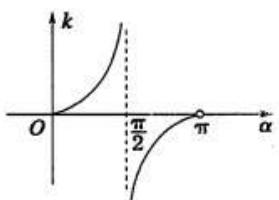
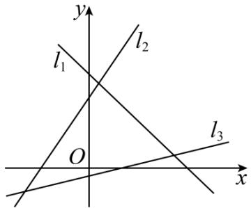
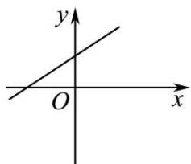
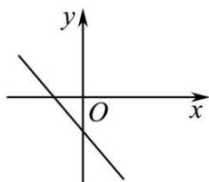
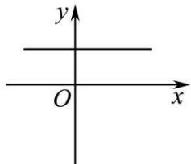
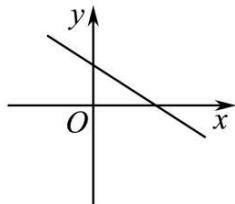
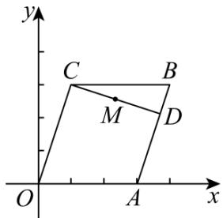
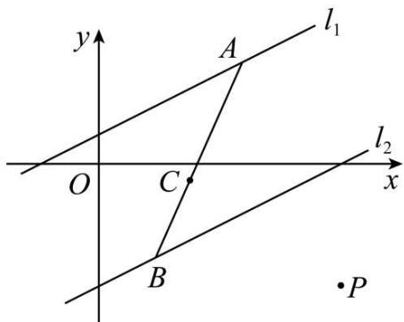

# 第57讲 直线的方程

# 知识梳理

# 知识点一: 直线的倾斜角和斜率

# 1、直线的倾斜角

若直线 l 与 x 轴相交，则以 x 轴正方向为始边，绕交点逆时针旋转直至与 l 重合所成的角称为直线 l 的倾斜角，通常用 $\alpha, \beta, \gamma, \cdots$ 表示

(1) 若直线与 $x$ 轴平行 (或重合), 则倾斜角为 0  
(2) 倾斜角的取值范围 $\alpha \in [0, \pi)$

# 2、直线的斜率

设直线的倾斜角为 $\alpha$ ，则 $\alpha$ 的正切值称为直线的斜率，记为 $k = \tan \alpha$

(1) 当 $\alpha = \frac{\pi}{2}$ 时, 斜率不存在; 所以竖直线是不存在斜率的  
(2) 所有的直线均有倾斜角, 但是不是所有的直线均有斜率  
(3) 斜率与倾斜角都是刻画直线的倾斜程度,但就其应用范围,斜率适用的范围更广(与直线方程相联系)  
(4) $|k|$ 越大,直线越陡峭  
(5) 倾斜角 $\alpha$ 与斜率 $k$ 的关系

text_image

k
O
π/2
π
α

当 $k = 0$ 时，直线平行于轴或与轴重合；

当 k > 0 时，直线的倾斜角为锐角，倾斜角随 k 的增大而增大；

当 $k < 0$ 时，直线的倾斜角为钝角，倾斜角 $k$ 随的增大而减小；

# 3、过两点的直线斜率公式

已知直线上任意两点， $\mathrm{A}(x_1,y_1),\mathrm{B}(x_2,y_2)$ 则 $k = \frac{y_2 - y_1}{x_2 - x_1}$

(1) 直线的斜率是确定的,与所取的点无关.   
(2) 若 $x_{1} = x_{2}$ , 则直线AB的斜率不存在, 此时直线的倾斜角为 $90^{\circ}$

# 4、三点共线.

两直线 AB, AC 的斜率相等 → A、B、C 三点共线；反过来，A、B、C 三点共线，则直线 AB, AC 的斜率相等 (斜率存在时) 或斜率都不存在.

# 知识点二: 直线的方程

# 1、直线的截距

若直线 $l$ 与坐标轴分别交于 $(a,0),(0,b)$ ，则称 $a,b$ 分别为直线 $l$ 的横截距，纵截距

(1) 截距: 可视为直线与坐标轴交点的简记形式, 其取值可正, 可负, 可为 0 (不要顾名思义误认为与“距离”相关)

# (2) 横纵截距均为 0 的直线为过原点的非水平非竖直直线

# 2、直线方程的五种形式

<table><tr><td>名称</td><td>方程</td><td>适用范围</td></tr><tr><td>点斜式</td><td> $y - y_1 = k(x - x_1)$ </td><td>不含垂直于x轴的直线</td></tr><tr><td>斜截式</td><td> $y = kx + b$ </td><td>不含垂直于x轴的直线</td></tr><tr><td>两点式</td><td> $\frac{y - y_1}{y_2 - y_1} = \frac{x - x_1}{x_2 - x_1}$ </td><td>不含直线 $x = x_1(x_1 \neq x_2)$ 和直线 $y = y_1(y_1 \neq y_2)$ </td></tr><tr><td>截距式</td><td> $\frac{x}{a} + \frac{y}{b} = 1$ </td><td>不含垂直于坐标轴和过原点的直线</td></tr><tr><td>一般式</td><td> $Ax + By + C = 0$  $(A^2 + B^2 \neq 0)$ </td><td>平面直角坐标系内的直线都适用</td></tr></table>

# 3、求曲线(或直线)方程的方法：

在已知曲线类型的前提下,求曲线(或直线)方程的思路通常有两种:

(1) 直接法: 寻找决定曲线方程的要素, 然后直接写出方程, 例如在直线中, 若用直接法则需找到两个点, 或者一点一斜率  
(2) 间接法: 若题目条件与所求要素联系不紧密, 则考虑先利用待定系数法设出曲线方程, 然后再利用条件解出参数的值 (通常条件的个数与所求参数的个数一致)

# 4、线段中点坐标公式

若点 $\mathrm{P}_1, \mathrm{P}_2$ 的坐标分别为 $(x_1, y_1), (x_2, y_2)$ 且线段 $\mathrm{P}_1\mathrm{P}_2$ 的中点 $\mathbf{M}$ 的坐标为 $(x, y)$ ，则 $\left\{ \begin{array}{l} x = \frac{x_1 + x_2}{2} \\ y = \frac{y_1 + y_2}{2} \end{array} \right.$ ，此公式为线段 $\mathrm{P}_1\mathrm{P}_2$ 的中点坐标公式。

# 5、两直线的夹角公式

若直线 $y = k_{1}x + b_{1}$ 与直线 $y = k_{2}x + b_{2}$ 的夹角为 $\alpha$ ，则 $\tan \alpha = \left|\frac{k_2 - k_1}{1 + k_1k_2}\right|$

# 必考题型全归纳

# 题型一:倾斜角与斜率的计算

2973 (2024·四川眉山·仁寿一中校考模拟预测)已知 $\alpha$ 是直线 $x - 2y + 3 = 0$ 的倾斜角，则 $\frac{\sqrt{2}\sin\left(\alpha + \frac{\pi}{4}\right) + \sin\alpha}{\cos2\alpha}$ 的值为 （）

A. $\frac{4}{3}$

B. $\frac{4\sqrt{5}}{3}$

C. $\frac{4\sqrt{5}}{15}$

D. $\frac{3\sqrt{5}}{20}$

2974 (2024·重庆·重庆南开中学校考模拟预测)已知直线 l 的一个方向向量为 $\vec{p} = \left( \sin \frac{\pi}{3}, \cos \frac{\pi}{3} \right)$ ，则直线 l 的倾斜角为 （）

A. $\frac{\pi}{6}$

B. $\frac{\pi}{3}$

C. $\frac{2\pi}{3}$

D. $\frac{4\pi}{3}$

2975 (2024·江苏宿迁·高二泗阳县实验高级中学校考阶段练习)经过 A(-1°,3)°,B( $\sqrt{3}$ , - $\sqrt{3}$ )两点的直线的倾斜角是()

A. $45^{\circ}$

B. $60^{\circ}$

C. $90^{\circ}$

D. $120^{\circ}$

2976 (2024·全国·高二专题练习)如图,若直线 $l_{1}, l_{2}, l_{3}$ 的斜率分别为 $k_{1}, k_{2}, k_{3}$ , 则 ( )

text_image

y
l₁
l₂
O
x
l₃

A. $k_{1} < k_{3} < k_{2}$

B. $k_{3} < k_{1} < k_{2}$

C. $k_{1} < k_{2} < k_{3}$

D. $k_{3} < k_{2} < k_{1}$

2977 (2024·全国·高二专题练习)直线 $y=-\sqrt{3}x+3$ 的倾斜角为 （）

A. $30^{\circ}$

B. $60^{\circ}$

C. $120^{\circ}$

D. $150^{\circ}$

2978 (2024·全国·高二课堂例题)过两点 A(4,y), B(2,-3) 的直线的倾斜角是 $135^{\circ}$ ，则 y 等于（）

A. 1

B. 5

C.-1

D. -5

2979 (2024·高二课时练习)直线 l 经过 A(2,1), B(1,m²)(m∈R) 两点, 那么直线 l 的斜率的取值范围为().

A. $(0,1]$

B. $(-∞,1]$

C. $(-2,1]$

D. $[1, +\infty)$

2980 (2024·全国·高三专题练习)函数 $f(x)=\frac{1}{3}x^{3}-x^{2}$ 的图像上有一动点，则在此动点处切线的倾斜角的取值范围为（）

A. $\left[0,\frac{3\pi}{4}\right]$

B. $\left[0,\frac{\pi}{2}\right)\cup\left[\frac{3\pi}{4},\pi\right)$

C. $\left[\frac{3\pi}{4},\pi\right)$

D. $\left[\frac{\pi}{2},\frac{3\pi}{4}\right]$

# 题型二:三点共线问题

2981 (2024·全国·高二专题练习)已知三点 $(2,-3),(4,3),\left(5,\frac{k}{2}\right)$ 在同一条直线上，则实数k的值为()

A. 2

B. 4

C. 8

D. 12

2982 (2024·辽宁营口·高二校考阶段练习)若三点 A(0,8), B(-4,0), C(m,-4) 共线, 则实数 m 的值是 ( )

A. 6

B.-2

C.-6

D. 2

2983 (2024·重庆渝中·高二重庆复旦中学校考阶段练习)若三点 M(2, 2), N(a, 0), Q(0, b), (ab ≠ 0) 共线, 则 $\frac{1}{a} + \frac{1}{b}$ 的值为 ()

A. 1

B.-1

C. $\frac{1}{2}$

D. $-\frac{1}{2}$

2984 (2024·全国·高三专题练习)若平面内三点 A(1, -a), B(2, $a^{2}$ ), C(3, $a^{3}$ ) 共线, 则 a = ()

A. $1 \pm \sqrt{2}$ 或 0

B. $\frac{2 - \sqrt{5}}{2}$ 或0

C. $\frac{2\pm\sqrt{5}}{2}$

D. $\frac{2 + \sqrt{5}}{2}$ 或0

# 3 题型三:过定点的直线与线段相交问题

2985 (2024·吉林·高三校考期末)已知点 A(1,3), B(-2,-1). 若直线 $l:y=k(x-2)+1$ 与线段 AB 相交, 则 k 的取值范围是 ()

A. $k \geqslant \frac{1}{2}$

B. $k \leqslant -2$

C. $k \geqslant \frac{1}{2}$ 或 $k \leqslant -2$

D. $-2 \leqslant k \leqslant \frac{1}{2}$

2986 (2024·高三课时练习)已知点 M(2, -3) 和 N(-3, -2)，直线 l: y = ax - a + 1 与线段 MN 相交，则实数 a 的取值范围是 （）

A. $a \geqslant \frac{3}{4}$ 或 $a \leqslant -4$

B. $-4 \leqslant a \leqslant \frac{3}{4}$

C. $\frac{3}{4}\leqslant a\leqslant4$

D. $-\frac{3}{4}\leqslant a\leqslant4$

2987 (2024·全国·高三专题练习)已知 A(2,0), B(0,2), 若直线 $y = k(x + 2)$ 与线段 AB 有公共点, 则 k 的取值范围是 ()

A. $[-1,1]$

B. $[1, +\infty)$

C. $[0,1]$

D. $(-∞,-1]∪[1,+∞)$

2988 (2024·全国·高三专题练习)已知点 A(-2,3), B(3,2)，若直线 $ax + y + 2 = 0$ 与线段 AB 没有交点，则 a 的取值范围是 ()

A. $\left(-\infty, -\frac{5}{2}\right] \cup \left[\frac{4}{3}, +\infty\right)$

B. $\left(-\frac{4}{3},\frac{5}{2}\right)$

C. $\left[-\frac{5}{2},\frac{4}{3}\right]$

D. $\left(-\infty,-\frac{4}{3}\right]\cup\left[\frac{5}{2},+\infty\right)$

2989 (2024·全国·高三专题练习)已知直线 $x - ay + 2a = 0$ 和以 M(3,5), N(4,-2) 为端点的线段相交, 则实数 a 的取值范围是 ()

A. $a \leqslant 1$

B. $-1 \leqslant a \leqslant 1$

C. $a \leqslant -1$ 或 $a \geqslant 1$

D. $a \leqslant -1$ 或 $a \geqslant 1$ 或 $a = 0$

2990 (2024·全国·高三专题练习)已知 A(2, -3), B(-3, -2), 直线 l 过点 P(1,1) 且与线段 AB 相交, 则直线 l 的斜率 k 的取值范围是 ( )

A. $k \leqslant -4$ 或 $k \geqslant \frac{3}{4}$

B. $-4\leqslant k\leqslant \frac{3}{4}$

C. $k \leqslant -\frac{1}{4}$ 或 $k \geqslant \frac{4}{3}$

D. $-\frac{3}{4}\leqslant k\leqslant4$

2991 (2024·全国·高三对口高考)已知点 P(-1,1), Q(2,2), 若直线 l: x + my + m = 0 与 PQ 的延长线 (有方向) 相交, 则 m 的取值范围为 \_\_\_\_.

2992 (2024·全国·高三专题练习)已知 A(-1,2), B(2,4), 点 P(x,y) 是线段 AB 上的动点, 则 $\frac{y}{x}$ 的取值范围是 \_\_\_\_.

2993 (2024·全国·高三专题练习) P(x, y) 在线段 AB 上运动, 已知 A(2, 4), B(5, -2), 则 $\frac{y+1}{x+1}$ 的取值范围是 \_\_\_\_.

# 题型四:直线的方程

2994 (2024·全国·高三专题练习)过点(1,2)且方向向量为(-1,2)的直线的方程为（）

A. $2x + y - 4 = 0$

B. $x + y - 3 = 0$

C. $x - 2y + 3 = 0$

D. $x - 2y + 3 = 0$

2995 (2024·全国·高三专题练习)过点 A(1,4) 的直线在两坐标轴上的截距之和为零, 则该直线方程为 ()

A. $x - y + 3 = 0$

B. $x + y - 5 = 0$

C. 4x - y = 0 或 $x + y - 5 = 0$

D. $4x - y = 0$ 或 $x - y + 3 = 0$

2996 (2024·吉林白山·抚松县第一中学校考模拟预测)对方程 $\frac{y-6}{x+3}=2$ 表示的图形, 下列叙述中正确的是 ()

A. 斜率为2的一条直线  
B. 斜率为 $-\frac{1}{2}$ 的一条直线  
C. 斜率为2的一条直线,且除去点 $(-3,6)$   
D. 斜率为 $-\frac{1}{2}$ 的一条直线, 且除去点 $(-3,6)$

2997 (2024·全国·高三专题练习)经过点P(-1,0)且倾斜角为60°的直线的方程是（）

A. $\sqrt{3} x - y - 1 = 0$

B. $\sqrt{3} x - y + \sqrt{3} = 0$

C. $\sqrt{3} x - y - \sqrt{3} = 0$

D. $x - \sqrt{3} y + 1 = 0$

2998 (2024·全国·高三专题练习)方程 $y = ax + \frac{1}{a} (a > 0)$ 表示的直线可能是 （）

A.

text_image

y
O
x

B.

text_image

y
O
x

text_image

y
O
x

D.

text_image

y
O
x

2999 (2024·全国·高三专题练习)已知过定点直线 $kx - y + 4 - k = 0$ 在两坐标轴上的截距都是正值,且截距之和最小,则直线的方程为 ( )

A. $x - 2y - 7 = 0$

B. $x - 2y + 7 = 0$

C. $2x + y - 6 = 0$

D. $x + 2y - 6 = 0$

3000 (2024·全国·高三专题练习)若直线 l 的方程 $y = -\frac{a}{b}x - \frac{c}{b}$ 中，ab > 0, ac < 0，则此直线必不经过 ()

A. 第一象限

B. 第二象限

C. 第三象限

D. 第四象限

3001 (2024·全国·高三专题练习)已知直线 l 的倾斜角为 $60^{\circ}$ ，且 l 在 y 轴上的截距为 -1，则直线 l 的方程为（）

A. $y = -\frac{\sqrt{3}}{3} x - 1$

B. $y = -\frac{\sqrt{3}}{3} x + 1$

C. $y = \sqrt{3} x - 1$

D. $y = \sqrt{3} x + 1$

# 5 题型五: 直线与坐标轴围成的三角形问题

3002 (2024·全国·高三专题练习)若一条直线经过点 A(-2,2)，并且与两坐标轴围成的三角形面积为 1，则此直线的方程为 \_\_\_\_.

3003 (2024·全国·高三专题练习)已知直线 l 过点 M(2,1)，且分别与 x 轴的正半轴、y 轴的正半轴交于 A，B 两点，O 为原点，当 $\triangle AOB$ 面积最小时，直线 l 的方程为 \_\_\_\_.

3004 (2024·全国·高三专题练习)已知直线 l 的方程为: $(2+m)x + (1-2m)y + (4-3m) = 0$ .

(1) 求证: 不论 m 为何值, 直线必过定点 M;  
(2) 过点 M 引直线 $l_{1}$ ，使它与两坐标轴的负半轴所围成的三角形面积最小，求 $l_{1}$ 的方程.

3005 (2024·全国·高三专题练习)直线 l 过点 M(1,2)，且分别与 x,y 轴正半轴交于 A、B 两点，O 为原点.

(1) 当 $\triangle AOB$ 面积最小时, 求直线 l 的方程;  
(2) 求 $\left|OA\right| + 2\left|OB\right|$ 的最小值及此时直线 l 的方程.

3006 (2024·全国·高三专题练习)在平面直角坐标系 xOy 中, 直线 l 过定点 P(3,2), 且与 x 轴的正半轴交于点 M, 与 y 轴的正半轴交于点 N.

(1) 当 $PM \cdot PN$ 取得最小值时, 求直线 l 的方程;  
(2) 求 $\triangle MON$ 面积的最小值.

3007 (2024·北京怀柔·高二北京市怀柔区第一中学校考期中)已知直线 l 经过点 P(2,2)，O 为坐标原点.

(1) 若直线 l 过点 Q(-2,0)，求直线 l 的方程，并求直线 l 与两坐标轴围成的三角形面积；  
(2) 如果直线 l 在两坐标轴上的截距之和为 8, 求直线 l 的方程.

3008 (2024·高二单元测试)已知直线 l 过点 P(4,3)，与 x 轴正半轴交于点 A、与 y 轴正半轴交于点 B.

(1) 求 $\triangle OAB$ 面积最小时直线 l 的方程 (其中 O 为坐标原点);  
(2) 求 $\left|PA\right|\cdot\left|PB\right|$ 的最小值及取得最小值时 l 的直线方程.

3009 (2024·江西吉安·高二吉安一中校考阶段练习)过点 M(4,3) 的动直线 l 交 x 轴的正半轴于 A 点, 交 y 轴正半轴于 B 点.

(I) 求 $\Delta OAB(O$ 为坐标原点 $)$ 的面积 S 最小值, 并求取得最小值时直线 l 的方程.  
(II) 设 P 是 $\Delta OAB$ 的面积 S 取得最小值时 $\Delta OAB$ 的内切圆上的动点，求 $u = |PO|^{2} + |PA|^{2} + |PB|^{2}$ 的取值范围.

3010 (2024·河南洛阳·高二洛宁县第一高级中学校考阶段练习)已知直线 $l: kx - y + 1 + 2k = 0$ .

(1) 求 l 经过的定点坐标 P;   
(2) 若直线 l 交 x 轴负半轴于点 A, 交 y 轴正半轴于点 B.

① $\triangle AOB$ 的面积为S,求S的最小值和此时直线l的方程;  
②当 $PA + \frac{1}{2}PB$ 取最小值时, 求直线 l 的方程.

3011 (2024·河南郑州·高二宜阳县第一高级中学校联考阶段练习)已知直线 $l: kx - y + 2 + 3k$

=0 经过定点 P.

(1) 证明: 无论 k 取何值, 直线 l 始终过第二象限;  
(2) 若直线 l 交 x 轴负半轴于点 A, 交 y 轴正半轴于点 B, 当 $\frac{1}{2}|PA| + \frac{1}{3}|PB|$ 取最小值时, 求直线 l 的方程.

3012 (2024·江苏宿迁·高二泗阳县实验高级中学校考阶段练习)已知直线 l 过定点 P(-2,1)，且交 x 轴负半轴于点 A、交 y 轴正半轴于点 B．点 O 为坐标原点.

(1) 若 $\triangle AOB$ 的面积为 4, 求直线 l 的方程;  
(2) 求 $\left|OA\right| + \left|OB\right|$ 的最小值, 并求此时直线 l 的方程;  
(3) 求 $\left|PA\right|\cdot\left|PB\right|$ 的最小值, 并求此时直线 l 的方程.

# 6 题型六:两直线的夹角问题

3013 (2024·上海浦东新·高三上海市川沙中学校考期末)直线 $x - \sqrt{3}y + 2 = 0$ 与直线 $\sqrt{3}x + 2y = 1$ 所成夹角的余弦值等于 \_\_\_\_  
3014 (2024·高三课时练习)直线 $x + 2y + 2 = 0$ 与直线 3x - y - 2 = 0 相交, 则这两条直线的夹角大小为 \_\_\_\_.  
3015 (2024·上海宝山·高三统考阶段练习)已知直线 $l_{1}:2x-y=0, l_{2}:3x+y-1=0$ ，则 $l_{1}$ 与 $l_{2}$ 的夹角大小是 \_\_\_\_.  
3016 (2024·重庆·高考真题)曲线 $y=2-\frac{1}{2}x^{2}$ 与 $y=\frac{1}{4}x^{3}-2$ 在交点处切线的夹角是 \_\_\_\_.（用弧度数作答）  
3017 (2024·全国·模拟预测)等腰三角形两腰所在直线的方程分别为 $x + y - 2 = 0$ 与 x - 7y - 4 = 0，原点在等腰三角形的底边上，则底边所在直线的斜率为 \_\_\_\_.  
3018 (2024·全国·高三专题练习)两条直线 $l_{1}:\sqrt{3}x-y-\sqrt{3}=0$ , $l_{2}:x-\sqrt{3}y-1=0$ 的夹角平分线所在直线的方程是 \_\_\_\_.

# 7 题型七: 直线过定点问题

3019 (2024·四川绵阳·绵阳南山中学实验学校校考模拟预测)已知直线 $l_{1}: x - my + 1 = 0$ 过定点 A，直线 $l_{2}: mx + y - m + 3 = 0$ 过定点 B， $l_{1}$ 与 $l_{2}$ 相交于点 P，则 $|PA|^{2} + |PB|^{2} =$ \_\_\_\_.  
3020 (2024·全国·高三专题练习)已知实数 a, b 满足 $a + 2b = 1$ ，则直线 $ax + 3y + b = 0$ 过定点 \_\_\_\_.  
3021 (2024·陕西咸阳·统考二模)直线 $y = kx - k + e$ 恒过定点 A，则 A 点的坐标为 \_\_\_\_.  
3022 (2024·辽宁营口·高二校考阶段练习)直 l 的方程为 $kx - y + 2k + 1 = 0 (k \in \mathbb{R})$ ，则该直线过定点 \_\_\_\_.  
3023 (2024·上海宝山·高二统考期末)若实数 a、b、c 成等差数列, 则直线 $ax + by + c = 0$ 必经过一个定点, 则该定点坐标为 \_\_\_\_.

# 8 题型八:轨迹方程

3024 (2024·全国·高三对口高考)在平面直角坐标系中,已知△ABC的顶点坐标分别为A(2,3)、B(1,-1)、C(5,1),点P在直线BC上运动,动点Q满足 $\overrightarrow{PQ}=\overrightarrow{PA}+\overrightarrow{PB}+\overrightarrow{PC}$ ,求点Q的轨迹方程.

3025 (2024·安徽蚌埠·统考三模)如图,在平行四边形OABC中,点O是原点,点A和点C的坐标分别是(3,0)、(1,3),点D是线段AB上的动点.

text_image

y
C
B
M
D
O
A
x

(1) 求 AB 所在直线的一般式方程;  
(2) 当 D 在线段 AB 上运动时, 求线段 CD 的中点 M 的轨迹方程.

3026 (2024·湖北咸宁·高二鄂南高中校考阶段练习)如图,已知点A是直线 $l_{1}:x-2y+1=0$ 上任意一点,点B是直线 $l_{2}:x-2y-4=0$ 上任意一点,连接AB,在线段AB上取点C使得 $2\overrightarrow{CA}=3\overrightarrow{BC}$ .

text_image

y
A
l₁
O
C
x
l₂
B
P

(1) 求动点 C 的轨迹方程;  
(2) 已知点 P(4, -2)，是否存在点 C，使得 $|PC| = 3$ ？若存在，求出点 C 的坐标；若不存在，说明理由.

3027 (2024·全国·高三专题练习)已知 A(-1,1), B(2,1), 动点 M 与 A, B 两点连线的斜率分别为 $k_{MA}$ 、 $k_{MB}$ , 若 $k_{MA} = 2k_{MB}$ , 求动点 M 的轨迹方程  
3028 (2024·高二课时练习)在 $\triangle ABC$ 中，A(3,3)，B(2,-2)，C(-7,1)，求 $\angle A$ 的平分线AD所在直线的方程.  
3029 (2024·江苏·高二假期作业)已知动点 C 到两个定点 $C_{1}(-1,0)$ ， $C_{2}(3,4)$ 的距离相等，求点 C 的轨迹方程.  
3030 (2024·全国·高三专题练习)已知 O 是坐标原点，A(3,1)，B(-1,3). 若点 C 满足 $\overrightarrow{OC} = \alpha \overrightarrow{OA} + \beta \overrightarrow{OB}$ ，其中 $\alpha, \beta \in R$ ，且 $\alpha + \beta = 1$ ，求点 C 的轨迹方程.

# 9 题型九:中点公式

3031 (2024·河南郑州·高二郑州市第九中学校考阶段练习)已知点A，B分别是直线 $x+2y+4=0$ 和直线 $x+2y-10=0$ 上的点，点P为AB的中点，设点P的轨迹为曲线C.

(1) 求曲线 C 的方程;  
(2) 过点 D(-2,1) 的直线 l 与曲线 C, x 轴分别交于点 M, N, 若点 D 为 MN 的中点, 求直线 l 的方程.

3032 (2024·全国·高三专题练习)已知直线 $l: kx - y + 1 + 2k = 0 (k \in \mathbb{R})$ 过定点 T，若直线 l 被直线 $x - y + 6 = 0$ 和 x 轴截得的线段恰好被定点 T 平分，求 k 的值.

3033 (2024·江苏泰州·高三泰州中学校考阶段练习)已知直线 $(1-a)x + (1+a)y + 3a - 3 = 0(a \in \mathbb{R})$ .

(1) 求证: 直线经过定点, 并求出定点 P;  
(2) 经过点 P 有一条直线 l，它夹在两条直线 $l_{1}: 2x - y - 2 = 0$ 与 $l_{2}: x + y + 3 = 0$ 之间的线段恰被 P 平分，求直线 l 的方程.

3034 (2024·全国·高三专题练习)过点 P(0,1) 作直线 l，使它被直线 $l_{1}: 2x + y - 8 = 0$ 和 $l_{2}: x - 3y + 10 = 0$ 截得的线段恰好被点 P 平分，求直线 l 的方程.

3035 (2024·全国·高三专题练习)已知直线 $l: (2 + m)x + (1 + 2m)y + 4 - 3m = 0$ .

(1) 求证: 不论 m 为何实数, 直线 l 恒过一定点 M;  
(2) 过定点 M 作一条直线 $l_{1}$ ，使夹在两坐标轴之间的线段被 M 点平分，求直线 $l_{1}$ 的方程.

3036 (2024·全国·高三专题练习)过点 M(0,1) 作直线,使它被两直线 $l_{1}:x-3y+10=0$ 和 $l_{2}:2x+y-8=0$ 所截得的线段恰好被 M 所平分,求此直线的方程.

