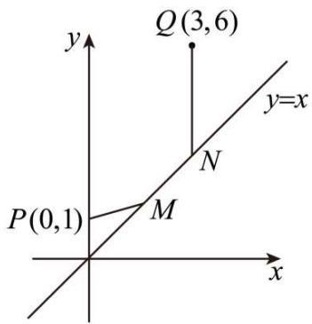
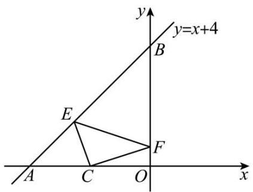
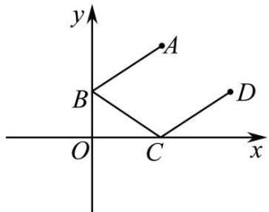
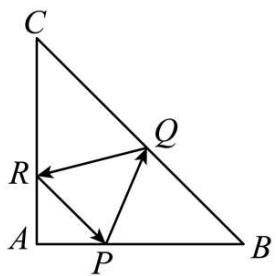

# 第58讲 两条直线的位置关系

# 知识梳理

知识点一:两直线平行与垂直的判定

两条直线平行与垂直的判定以表格形式出现,如表所示.

<table><tr><td>两直线方程</td><td>平行</td><td>垂直</td></tr><tr><td> $l_1:A_1x+B_1y+C_1=0$  $l_2:A_2x+B_2y+C_2=0$ </td><td> $A_1B_2-A_2B_1=0$ 且 $B_1C_2-B_2C_1\neq 0$ </td><td> $A_1A_2+B_1B_2=0$ </td></tr><tr><td> $l_1:y=k_1x+b_1$ (斜率存在) $l_2:y=k_2x+b_2$  $l_1:x=x_1,$ (斜率不存在) $l_2:x=x_2$ </td><td> $k_1=k_2,b_1\neq b_2$ 或 $x=x_1,x=x_2,x_1\neq x_2$ </td><td> $k_1\cdot k_2=-1$ 或 $k_1$ 与 $k_2$ 中有一个为0,另一个不存在.</td></tr></table>

知识点二:三种距离

# 1、两点间的距离

平面上两点 $\mathrm{P}_1(x_1,y_1),\mathrm{P}_2(x_2,y_2)$ 的距离公式为 $|\mathrm{P}_1\mathrm{P}_2| = \sqrt{(x_1 - x_2)^2 + (y_1 - y_2)^2}.$

特别地，原点 $\mathrm{O}(0,0)$ 与任一点 $\mathrm{P}(x,y)$ 的距离 $|\mathrm{OP}| = \sqrt{x^2 + y^2}$ .

# 2、点到直线的距离

点 $\mathrm{P}_0(x_0,y_0)$ 到直线 $l:\mathrm{Ax} + \mathrm{By} + \mathrm{C} = 0$ 的距离 $d = \frac{|Ax_0 + By_0 + C|}{\sqrt{A^2 + B^2}}$

特别地，若直线为 $l: x = m$ ，则点 $\mathrm{P}_0(x_0, y_0)$ 到 $l$ 的距离 $d = |m - x_0|$ ；若直线为 $l: y = n$ ，则点 $\mathrm{P}_0(x_0, y_0)$ 到 $l$ 的距离 $d = |n - y_0|$

# 3、两条平行线间的距离

已知 $l_{1}, l_{2}$ 是两条平行线，求 $l_{1}, l_{2}$ 间距离的方法：

(1) 转化为其中一条直线上的特殊点到另一条直线的距离.  
(2) 设 $l_{1}: \mathrm{A}x + \mathrm{B}y + \mathrm{C}_{1} = 0, l_{2}: \mathrm{A}x + \mathrm{B}y + \mathrm{C}_{2} = 0$ ，则 $l_{1}$ 与 $l_{2}$ 之间的距离 $d = \frac{|C_1 - C_2|}{\sqrt{A^2 + B^2}}$

注：两平行直线方程中，x, y 前面对应系数要相等.

# 4、双根式

双根式 $f(x) = \sqrt{a_1x^2 + b_1x + c_1} \pm \sqrt{a_2x^2 + b_2x + c_2}$ 型函数求解，首先想到两点间的距离，或者利用单调性求解.

# 【解题方法总结】

# 1、点关于点对称

点关于点对称的本质是中点坐标公式:设点 $\mathrm{P}(x_{1},y_{1})$ 关于点 $\mathrm{Q}(x_{0},y_{0})$ 的对称点为 $P'$ $(x_{2},y_{2})$ ，则根据中点坐标公式，有 $\left\{ \begin{array}{l}x_0 = \frac{x_1 + x_2}{2}\\ y_0 = \frac{y_1 + y_2}{2} \end{array} \right.$

可得对称点 $\mathrm{P}'(x_2, y_2)$ 的坐标为 $(2x_0 - x_1, 2y_0 - y_1)$

# 2、点关于直线对称

点 $\mathrm{P}(x_1, y_1)$ 关于直线 $l: Ax + By + C = 0$ 对称的点为 $\mathrm{P}'(x_2, y_2)$ ，连接 $\mathrm{PP}'$ ，交 $l$ 于M点，则 $l$ 垂直平分 $\mathrm{PP}'$ ，所以 $\mathrm{PP}' \perp l$ ，且M为 $\mathrm{PP}'$ 中点，又因为M在直线 $l$ 上，故可得

$$
\left\{ \begin{array}{l} {k _ {i} \cdot k _ {\mathrm{PP} ^ {\prime}} = - 1} \\ {\mathrm{A} \frac {x _ {1} + x _ {2}}{2} + \mathrm{B} \frac {y _ {1} + y _ {2}}{2} + \mathrm{C} = 0} \end{array} , \text {解出} (x _ {2}, y _ {2}) \text {即可}. \right.
$$

# 3、直线关于点对称

法一:在已知直线上取两点,利用中点坐标公式求出它们关于已知点对称的两点坐标,再由两点式求出直线方程;

法二:求出一个对称点,再利用两对称直线平行,由点斜式得到所求直线方程.

# 4、直线关于直线对称

求直线 $l_{1}:ax + by + c = 0$ ，关于直线 $l_{2}:\mathrm{d}x + ey + f = 0$ （两直线不平行）的对称直线 $l_{3}$

第一步:联立 $l_{1}$ , $l_{2}$ 算出交点 $\mathrm{P}(x_{0}, y_{0})$

第二步: 在 $l_{1}$ 上任找一点 (非交点) $Q(x_{1}, y_{1})$ ，利用点关于直线对称的秒杀公式算出对称点 $Q'(x_{2}, y_{2})$

第三步: 利用两点式写出 $l_{3}$ 方程

# 5、常见的一些特殊的对称

点 $(x,y)$ 关于x轴的对称点为 $(x,-y)$ ，关于y轴的对称点为 $(-x,y)$ .

点 $(x,y)$ 关于直线y=x的对称点为 $(y,x)$ ，关于直线y=-x的对称点为 $(-y,-x)$ .

点 $(x, y)$ 关于直线 $x = a$ 的对称点为 $(2a - x, y)$ ，关于直线 $y = b$ 的对称点为 $(x, 2b - y)$ .

点 $(x,y)$ 关于点 $(a,b)$ 的对称点为 $(2a-x,2b-y)$ .

点 $(x, y)$ 关于直线 $x + y = k$ 的对称点为 $(k - y, k - x)$ ，关于直线 $x - y = k$ 的对称点为 $(k + y, x - k)$ .

# 6、过定点直线系

过已知点 $\mathrm{P}(x_{0}, y_{0})$ 的直线系方程 $y - y_{0} = k(x - x_{0})$ (k 为参数).

# 7、斜率为定值直线系

斜率为 $k$ 的直线系方程 $y = kx + b$ ( $b$ 是参数).

# 8、平行直线系

与已知直线 $Ax + By + C = 0$ 平行的直线系方程 $Ax + By + \lambda = 0$ （ $\lambda$ 为参数）.

# 9、垂直直线系

与已知直线 $\mathrm{Ax} + \mathrm{By} + \mathrm{C} = 0$ 垂直的直线系方程 $\mathrm{Bx} - \mathrm{Ay} + \lambda = 0$ （ $\lambda$ 为参数）.

# 10、过两直线交点的直线系

过直线 $l_{1}:A_{1}x+B_{1}y+C_{1}=0$ 与 $l_{2}:A_{2}x+B_{2}y+C_{2}=0$ 的交点的直线系方程： $A_{1}x+B_{1}y+C_{1}+\lambda(A_{2}x+B_{2}y+C_{2})=0(\lambda$ 为参数).

# 必考题型全归纳

# 1 题型一:两直线位置关系的判定

3037 (2024·高二课时练习)直线 $2x + y + 2 = 0$ 与 $ax + 4y - 2 = 0$ 互相垂直, 则这两条直线的交点坐标为 ()

A. $(1, -4)$

B. $(0,-2)$

C. $(-1,0)$

D. $\left(0,\frac{1}{2}\right)$

3038 (2024·江苏南通·高二江苏省如皋中学校考开学考试)已知过点 A(-2, m) 和点 B(m, 4) 的直线为 $l_{1}, l_{2}: y = -2x + 1, l_{3}: y = -\frac{1}{n}x - \frac{1}{n}$ . 若 $l_{1} \parallel l_{2}, l_{2} \perp l_{3}$ ，则 $m + n$ 的值为（）

A.-10

B.-2

C. 0

D. 8

3039 (2024·浙江温州·高二乐清市知临中学校考开学考试)设直线 $l_{1}: x + 2ay - 5 = 0$ , $l_{2}$ : $(3a - 1)x - ay - 2 = 0$ , 则 a = 1 是 $l_{1} \perp l_{2}$ 的 ()

A. 充要条件

B. 必要不充分条件

C. 充分不必要条件

D. 既不充分也不必要条件

3040 (2024·广东东莞·高三校考阶段练习)直线 $l_{1}: mx + 2y + 2 = 0$ 与直线 $l_{2}: x + (m - 1)y = 0$ 平行，则 m = ()

A.-1或2

B. 2

C.-1

D.-2

3041 (2024·全国·高三专题练习)已知直线 $l^{\circ}$ $_{1}$ : $ax + 2y + 1 = 0$ , $l^{\circ}$ $_{2}$ : $(3 - a)x - y + a = 0$ ,
则条件“a=1”是“ $l_{1}\perp l_{2}$ ”的()

A. 充分必要条件

B. 充分不必要条件

C. 必要不充分条件

D. 既不必要也不充分条件

3042 (2024·黑龙江牡丹江·牡丹江一中校考三模)已知直线 $l_{1}:x+y=0, l_{2}:ax+by+1=0$ ，若 $l_{1} \perp l_{2}$ ，则 $a+b=$ （）

A.-1

B. 0

C. 1

D. 2

3043 (2024·全国·高三专题练习)已知 A(-1, 2), B(1, 3), C(0, -2), 点 D 使 AD ⊥ BC, AB // CD, 则点 D 的坐标为 ()

A. $\left(-\frac{9}{7},\frac{4}{7}\right)$

B. $\left(\frac{54}{7},\frac{13}{7}\right)$

C. $\left(\frac{38}{3},\frac{13}{3}\right)$

D. $\left(\frac{38}{7},\frac{5}{7}\right)$

3044 (2024·甘肃陇南·高三统考期中)已知 $\Delta ABC$ 的顶点 B(2,1), C(-6,3), 其垂心为 H(-3,2), 则其顶点 A 的坐标为

A. $(-19,-62)$

B. $(19,-62)$

C. $(-19,62)$

D. (19,62)

3045 (2024·全国·高三专题练习)直线 $l_{1}:x+(1+a)y=1-a(a\in\mathbb{R})$ ，直线 $l_{2}:y=-\frac{1}{2}x$ ，下列说法正确的是（）

A. $\exists a \in R$ , 使得 $l_{1} \parallel l_{2}$

B. $\exists a\in \mathbb{R}$ ，使得 $l_{1}\bot l_{2}$

C. $\forall a \in R, l_{1}$ 与 $l_{2}$ 都相交

D. $\exists a\in \mathbb{R}$ ，使得原点到 $l_{1}$ 的距离为3

3046 (2024·全国·高三对口高考)设 a, b, c 分别为 $\triangle ABC$ 中 $\angle A, \angle B, \angle C$ 所对边的边长，则直线 $\sin A \cdot x + ay + c = 0$ 与直线 $bx - \sin B \cdot y + \sin C = 0$ 的位置关系是（）

A. 相交但不垂直

B. 垂直

C. 平行

D. 重合

# 2 题型二:两直线的交点与距离问题

3047 (2024·全国·高三专题练习)若直线 $l: y = kx - \sqrt{3}$ 与直线 $2x + 3y - 6 = 0$ 的交点位于第一象限，则直线 l 的倾斜角的取值范围是（）

A. $\left[\frac{\pi}{6},\frac{\pi}{3}\right)$

B. $\left[\frac{\pi}{6},\frac{\pi}{2}\right]$

C. $\left(\frac{\pi}{3},\frac{\pi}{2}\right)$

D. $\left(\frac{\pi}{6},\frac{\pi}{2}\right)$

3048 (2024·上海浦东新·华师大二附中校考三模)已知三条直线 $l_{1}:x-2y+2=0$ , $l_{2}:x-2=0$ , $l_{3}:x+ky=0$ 将平面分为六个部分, 则满足条件的 k 的值共有 ()

A. 1 个

B. 2 个

C. 3 个

D. 无数个

3049 (2024·全国·高三专题练习)若三条直线 $l_{1}:4x+y=3, l_{2}:mx+y=0, l_{3}:x-my=2$ 不能围成三角形，则实数 m 的取值最多有（）

A. 2 个

B. 3 个

C. 4 个

D. 6 个

3050 (2024·江苏宿迁·高二泗阳县实验高级中学校考阶段练习)若点 P(x,y) 在直线 $2x + y - 5 = 0$ 上，O 是原点，则 OP 的最小值为（）

A. $2 \sqrt{2}$

B. 2

C. $\sqrt{5}$

D. 4

3051 (2024·吉林长春·高二东北师大附中校考期中)已知点 $\mathrm{P}(x_{0},y_{0})$ 在直线 3x - 4y - 10 = 0 上，则 $\sqrt{x_{0}^{2} + y_{0}^{2}}$ 的最小值为 ()

A. 1

B. 2

C. 3

D. 4

3052 (2024·高二课时练习)已知点 P(a,2)、A(-2,-3)、B(1,1)，且 |PA| = |PB|，则 a = \_\_\_\_.

3053 (2024·全国·高二专题练习)已知点 M(x, -4) 与点 N(2,3) 间的距离为 $7\sqrt{2}$ ，则 x = \_\_\_\_.

3054 (2024·全国·高二课堂例题)已知点 A(2,1), B(3,4), C(-2,-1), 则 $\triangle ABC$ 的面积为 \_\_\_\_.

3055 (2024·江苏淮安·高二统考期中)已知平面上点 P(3,3) 和直线 l:2y+3=0，点 P 到直线 l 的距离为 d，则 d= \_\_\_\_.

3056 (2024·黑龙江哈尔滨·高三哈尔滨七十三中校考期中)点 $(0,-1)$ 到直线 $y=k(x+2)$ 的距离的最大值是 \_\_\_\_.

3057 (2024·高二课时练习)过直线 $l_{1}: x - 2y + 3 = 0$ 与直线 $l_{2}: 2x + 3y - 8 = 0$ 的交点，且到点 P(0,4) 的距离为 1 的直线 l 的方程为 \_\_\_\_.

3058 (2024·江西新余·高二校考开学考试)若点 P(3,1) 到直线 $l:3x + 4y + a = 0 (a > 0)$ 的距离为 3，则 a = \_\_\_\_.

3059 (2024·全国·高三专题练习)点 $(0,0)$ ， $(3,4)$ 到直线 l 的距离分别为 1 和 4，写出一个满足条件的直线 l 的方程：\_\_\_\_.

3060 (2024·浙江温州·高二乐清市知临中学校考开学考试)若两条直线 $l_{1}: x + 2y - 6 = 0$ 与 $l_{2}: x + ay - 5 = 0$ 平行，则 $l_{1}$ 与 $l_{2}$ 间的距离是 \_\_\_\_.

3061 (2024·江苏宿迁·高二泗阳县实验高级中学校考阶段练习)平行直线 $l_{1}:3x-4y+6=0$ 与 $l_{2}:6x-8y+9=0$ 之间的距离为 \_\_\_\_.

3062 (2024·新疆·高二校联考期末)已知不过原点的直线 $l_{1}$ 与直线 $l_{2}: x - y + \sqrt{2} = 0$ 平行，且直线 $l_{1}$ 与 $l_{2}$ 的距离为 1，则直线 $l_{1}$ 的一般式方程为 \_\_\_\_.

# 3 题型三:有关距离的最值问题

3063 (2024·北京·高三强基计划) $\sqrt{(x-9)^{2}+4}+\sqrt{x^{2}+y^{2}}+\sqrt{(y-3)^{2}+9}$ 的最小值所属区间为()

A. $[10,11]$

B. $(11,12]$

C. $(12,13]$

D. 前三个答案都不对

3064 (2024·全国·高三专题练习)已知实数 $x_{1}, x_{2}, y_{1}, y_{2}$ , 满足 $x_{1}^{2} + y_{1}^{2} = 4, x_{2}^{2} + y_{2}^{2} = 9, x_{1}x_{2} + y_{1}y_{2} = 0$ , 则 $|x_{1} + y_{1} - 9| + |x_{2} + y_{2} - 9|$ 的最小值是 \_\_\_\_.

3065 (2024·全国·高三专题练习)如图,平面上两点P(0,1),Q(3,6),在直线y=x上取两点M,N使 $|MN|=\sqrt{2}$ ，且使 $|PM|+|MN|+|NQ|$ 的值取最小，则N的坐标为\_\_\_\_.

text_image

y
Q(3,6)
y=x
N
P(0,1)
M
x

3066 (2024·全国·高二专题练习)已知点P,Q分别在直线 $l_{1}:x+y+2=0$ 与直线 $l_{2}:x+y-1=0$ 上，且PQ⊥ $l_{1}$ ，点A(-3,-3)，B(3,0)，则 $|AP|+|PQ|+|QB|$ 的最小值为\_\_\_\_.

3067 (2024·全国·高二课堂例题)已知直线 $l: kx + y + 2 - k = 0$ 过定点 M，点 P(x, y) 在直线 $2x - y + 1 = 0$ 上，则 |MP| 的最小值是（）

A. 5

B. $\sqrt{5}$

C. $\frac{3\sqrt{5}}{5}$

D. $\frac{\sqrt{5}}{5}$

3068 (2024·全国·高三专题练习)著名数学家华罗庚曾说过:“数形结合百般好,割裂分家万事休.”事实上,有很多代数问题可以转化为几何问题加以解决,如: $\sqrt{(x-a)^{2}+(y-b)^{2}}$ 可以转化为点 $(x,y)$ 到点 $(a,b)$ 的距离,则 $\sqrt{x^{2}+1}+\sqrt{x^{2}-4x+8}$ 的最小值为().

A. 3

B. $2 \sqrt{2} + 1$

C. $2 \sqrt{3}$

D. $\sqrt{13}$

3069 (2024·贵州·校联考模拟预测)已知 $x, y \in R^{+}$ ，满足 $2x + y = 2$ ，则 $x + \sqrt{x^{2} + y^{2}}$ 的最小值为（）

A. $\frac{4}{5}$

B. $\frac{8}{5}$

C. 1

D. $\frac{1+\sqrt{2}}{3}$

3070 (2024·江西·高三校联考阶段练习)在平面直角坐标系 xOy 中, 已知点 A(0, -2), 点 B(1, 0), P 为直线 $2x - 4y + 3 = 0$ 上一动点, 则 $|PA| + |PB|$ 的最小值是 ( )

A. $\sqrt{5}$

B. 4

C. 5

D. 6

3071 (2024·高二课时练习)已知点 A(1,3), B(5,-2)，点 P 在 x 轴上使 $|AP| - |BP|$ 最大，求点 P 的坐标.

3072 (2024·天津和平·高二天津市汇文中学校考阶段练习)在直线 l:3x - y - 1 = 0 上求一点 P, 使得:

(1)P 到 A(4,1) 和 B(0,4) 的距离之差最大;

(2)P 到 A(4,1) 和 C(3,4) 的距离之和最小.

3073 (2024·全国·高三专题练习)已知函数 $f(x)=a\ln(x+1)+1(a\in\mathbb{R})$ 的图象恒过定点 A，圆 $O:x^{2}+y^{2}=4$ 上的两点 $P(x_{1},y_{1})$ ， $Q(x_{2},y_{2})$ 满足 $\overrightarrow{\mathrm{PA}}=\lambda\overrightarrow{\mathrm{AQ}}(\lambda\in\mathbb{R})$ ，则 $|2x_{1}+y_{1}+7|+|2x_{2}+y_{2}+7|$ 的最小值为（）

A. $2 \sqrt{5}$

B. $7 + \sqrt{5}$

C. $15 - \sqrt{5}$

D. $30 - 2\sqrt{5}$

3074 (2024·江西·高三校联考开学考试)费马点是指三角形内到三角形三个顶点距离之和最小的点. 当三角形三个内角均小于 $120^{\circ}$ 时, 费马点与三个顶点连线正好三等分费马点所在的周角, 即该点所对的三角形三边的张角相等且均为 $120^{\circ}$ . 根据以上性质, . 则 $\mathrm{F}(x,y)=\sqrt{(x-2\sqrt{3})^{2}+y^{2}}+\sqrt{(x+1-\sqrt{3})^{2}+(y-1+\sqrt{3})^{2}}+\sqrt{x^{2}+(y-2)^{2}}$ 的最小值为 ( )

A. 4

B. $2 + 2\sqrt{3}$

C. $3 + 2\sqrt{3}$

D. $4 + 2\sqrt{3}$

3075 (2024·全国·高三专题练习)已知 $x + y = 0$ ，则 $\sqrt{x^{2} + y^{2} - 2x - 2y + 2} + \sqrt{(x - 2)^{2} + y^{2}}$ 的最小值为 （）

A. $\sqrt{5}$

B. $2 \sqrt{2}$

C. $\sqrt{10}$

D. $2 \sqrt{5}$

3076 (2024·陕西西安·高二西安市铁一中学校考期末)设 $m \in R$ ，过定点 A 的动直线 $x + my = 0$ 和过定点 B 的动直线 $mx - y - m + 3 = 0$ 交于点 $P(x, y)$ ，则 $|PA| \cdot |PB|$ 的最大值是（）

A. $\sqrt{5}$

B. $\sqrt{10}$

C. 5

D. 10

3077 (2024·全国·高二专题练习)过定点A的动直线 $x + ky = 0$ 和过定点B的动直线 $kx - y - 2k + 1 = 0$ 交于点M，则 $\left|\mathrm{MA}\right| + \left|\mathrm{MB}\right|$ 的最大值是 （）

A. $2\sqrt{2}$

B. 3

C. $\sqrt{10}$

D. $\sqrt{15}$

# 题型四: 点点对称

3078 (2024·全国·高三专题练习)已知 A(a,6), B(-2,b), 点 P(2,3) 是线段 AB 的中点, 则 a + b = \_\_\_\_.

3079 (2024·江苏南通·高二统考期中)已知点A在x轴上,点B在y轴上,线段AB的中点M的坐标为(2,-1),则线段AB的长度为\_\_\_\_.

3080 (2024·高二课时练习)设点 A 在 x 轴上, 点 B 在 y 轴上, AB 的中点是 P(2, -1), 则 |AB| 等于 \_\_\_\_

3081 (2024·高一课时练习)已知直线 l 与直线 $l_{1}:y=1$ 及直线 $l_{2}:x+y-7=0$ 分别交于点 P，Q．若 PQ 的中点为点 M(1,-1)，则直线 l 的斜率为 \_\_\_\_.

# 题型五: 点线对称

3082 (2024·湖南长沙·高一周南中学校考开学考试)如下图,一次函数 $y=x+4$ 的图象与 x 轴,y 轴分别交于点 A,B,点 C(-2,0) 是 x 轴上一点,点 E,F 分别为直线 $y=x+4$ 和 y 轴上的两个动点,当 $\triangle CEF$ 周长最小时,点 E,F 的坐标分别为()

text_image

y
y=x+4
B
E
F
A C O x

A. $\operatorname{E}\left(-\frac{5}{2}, \frac{3}{2}\right), \operatorname{F}(0, 2)$

B. $\operatorname{E}(-2,2),\operatorname{F}(0,2)$

C. $\mathrm{E}\left(-\frac{\bar{5}}{2},\frac{\bar{3}}{2}\right),\mathrm{F}\left(0,\frac{2}{3}\right)$

D. $\operatorname{E}(-2,2),\operatorname{F}\left(0,\frac{2}{3}\right)$

3083 (2024·全国·高二专题练习)若直线 $l_{1}:y-2=(k-1)x$ 和直线 $l_{2}$ 关于直线 $y=x+1$ 对称，则直线 $l_{2}$ 恒过定点（）

A. $(2,0)$

B. $(1,-1)$

C. $(1,1)$

D. $(-2,0)$

3084 (2024·全国·高二假期作业)抛物线 $y=\frac{1}{4}x^{2}$ 的焦点关于直线 x-y-1=0 的对称点的坐标是
( )

A. $(2, -1)$

B. $(1, - 1)$

C. $\left(\frac{1}{4},-\frac{1}{4}\right)$

D. $\left(\frac{1}{16},-\frac{1}{16}\right)$

3085 (2024·江西·高二校联考开学考试)如图,一束光线从A(3,4)出发,经过坐标轴反射两次经过点D(6,2),则总路径长即 $|AB|+|BC|+|CD|$ 总长为()

text_image

y
A
B
D
O
C
x

A. $3 \sqrt{5}$

B. 6

C. $3 \sqrt{13}$

D. $\sqrt{85}$

3086 (2024·四川遂宁·高二统考期末)已知点A与点B(2,1)关于直线 $x+y+2=0$ 对称，则点A的坐标为()

A. $(-1,4)$

B. $(4,5)$

C. $(-3,-4)$

D. $(-4,-3)$

3087 (2024·湖北·高二校联考阶段练习)在等腰直角三角形 ABC 中, AB = AC = 3, 点 P 是边 AB 上异于 A、B 的一点, 光线从点 P 出发, 经 BC、CA 反射后又回到点 P, 如图, 若光线 QR 经过 $\triangle ABC$ 的重心, 则 AP = ()

text_image

C
R
Q
A
P
B

A. $\frac{3}{2}$

B. $\frac{3}{4}$

C. 1

D. 2

# 6 题型六:线点对称

3088 (2024·高二课时练习)直线 $l:2x-3y+1=0$ 关于点 A(-1,-2) 对称的直线 $l'$ 的方程为 \_\_\_\_.  
3089 (2024·全国·高二专题练习)直线 $2x - y + 3 = 0$ 关于点 A(5,3) 的对称直线方程是 \_\_\_\_.  
3090 (2024·河北廊坊·高三校考阶段练习)与直线 $l:2x-3y+1=0$ 关于点 (4,5) 对称的直线的方程为 \_\_\_\_.  
3091 (2024·全国·高三专题练习)直线 $ax + y + 3a - 1 = 0$ 恒过定点 M，则直线 $2x + 3y - 6 = 0$ 关于 M 点对称的直线方程为 \_\_\_\_.  
3092 (2024·辽宁营口·高三统考期末)若直线 $l_{1}: y = kx + 4$ 与直线 $l_{2}$ 关于点 M(1,2) 对称，则当 $l_{2}$ 经过点 N(0, -1) 时，点 M 到直线 $l_{2}$ 的距离为 \_\_\_\_.  
3093 (2024·全国·高三专题练习)在平面直角坐标系 $xOy$ 中, 将直线 $l$ 沿 $x$ 轴正方向平移 3 个单位长度, 沿 $y$ 轴正方向平移 5 个单位长度, 得到直线 $l_1$ . 再将直线 $l_1$ 沿 $x$ 轴正方向平移 1 个单位长度, 沿 $y$ 轴负方向平移 2 个单位长度, 又与直线 $l$ 重合. 若直线 $l$ 与直线 $l_1$ 关于点 $(2,3)$ 对称, 则直线 $l$ 的方程是 \_\_\_\_.

# 7 题型七: 线线对称

3094 (2024·全国·高三专题练习)已知直线 $l_{1}: x - y + 3 = 0$ ，直线 l: x - y - 1 = 0，若直线 $l_{1}$ 关于直线 l 的对称直线为 $l_{2}$ ，则直线 $l_{2}$ 的方程为 \_\_\_\_.  
3095 (2024·全国·高三专题练习)若动点A，B分别在直线 $l_{1}$ : $x + y - 7 = 0$ 和 $l_{2}$ : $x + y - 5 = 0$ 上移动，则AB的中点M到原点的距离的最小值为()

A. $3 \sqrt{2}$

B. $2 \sqrt{2}$

C. $3 \sqrt{3}$

D. $4\sqrt{2}$

3096 (2024·全国·高三专题练习)直线 x-2y-1=0 关于直线 y-x=0 对称的直线方程是 ( )

A. $2x - y + 1 = 0$

B. $2x + y - 1 = 0$

C. $2x + y + 1 = 0$

D. $x + 2y + 1 = 0$

3097 (2024·全国·高三专题练习)设直线 $l_{1}:x-2y-2=0$ 与 $l_{2}$ 关于直线 l:2x-y-4=0 对称，则直线 $l_{2}$ 的方程是（）

A. $11x + 2y - 22 = 0$

B. $11x + y + 22 = 0$

C. $5x + y - 11 = 0$

D. $10x + y - 22 = 0$

3098 (2024·全国·高三专题练习)直线 $ax + by + c = 0$ 关于直线 x - y = 0 对称的直线为（）

A. $ax - by + c = 0$

B. $bx - ay + c = 0$

C. $bx + ay + c = 0$

D. $bx + ay - c = 0$

3099 (2024·全国·高三专题练习)如果直线 $y = ax + 2$ 与直线 y = 3x - b 关于直线 y = x 对称，那么

A. $a = \frac{1}{3}, b = 6$

B. $a = \frac{1}{3}, b = -6$

C. $a = 3, b = -2$

D. $a = 3, b = 6$

3100 (2024·全国·高三专题练习)求直线 $x + 2y - 1 = 0$ 关于直线 $x + 2y + 1 = 0$ 对称的直线方程 ()

A. $x + 2y - 3 = 0$

B. $x + 2y + 3 = 0$

C. $x + 2y - 2 = 0$

D. $x + 2y + 2 = 0$

3101 (2024·全国·高三专题练习)若两条平行直线 $l_{1}: x - 2y + m = 0 (m > 0)$ 与 $l_{2}: 2x + ny - 6 = 0$ 之间的距离是 $2\sqrt{5}$ ，则直线 $l_{1}$ 关于直线 $l_{2}$ 对称的直线方程为（）

A. x - 2y - 13 = 0

B. $x - 2y + 2 = 0$

C. $x - 2y + 4 = 0$

D. $x - 2y - 6 = 0$

3102 (2024·全国·高三专题练习)两直线方程为 $l_{1}:3x-2y-6=0$ , $l_{2}:x-y-2=0$ , 则 $l_{1}$ 关于 $l_{2}$ 对称的直线方程为 ()

A. 3x - 2y - 4 = 0

B. $2x + 3y - 6 = 0$

C. 2x - 3y - 4 = 0

D. 3x - 2y - 6 = 0

# 题型八: 直线系方程

3103 (2024·全国·高三专题练习)已知两直线 $a_{1}x + b_{1}y - 1 = 0$ 和 $a_{2}x + b_{2}y - 1 = 0$ 的交点为 P (1,2)，则过 $\mathrm{Q}_{1}(a_{1},b_{1}),\mathrm{Q}_{2}(a_{2},b_{2})$ 两点的直线方程为 \_\_\_\_.

3104 (2024·全国·高三专题练习)经过直线 $3x - 2y + 1 = 0$ 和直线 $x + 3y + 4 = 0$ 的交点,且平行于直线 $x - y + 4 = 0$ 的直线方程为 \_\_\_\_.

3105 (2024·全国·高三专题练习)已知坐标原点为O,过点P(2,6)作直线 $2mx-(4m+n)y+2n=0(m,n$ 不同时为零)的垂线,垂足为M,则|OM|的取值范围是\_\_\_\_.

3106 (2024·高二课时练习)经过点 P(1,0) 和两直线 $l_{1}: x + 2y - 2 = 0$ ; $l_{2}: 3x - 2y + 2 = 0$ 交点的直线方程为 \_\_\_\_.

3107 (2024·全国·高二课堂例题)若直线 l 经过两直线 2x - 3y - 3 = 0 和 $x + y + 2 = 0$ 的交点,且斜率为 -3 ,则直线 l 的方程为 \_\_\_\_.

3108 (2024·全国·高一专题练习)设直线 l 经过 $2x - 3y + 2 = 0$ 和 $3x - 4y - 2 = 0$ 的交点，且与两坐标轴围成等腰直角三角形，则直线 l 的方程为 \_\_\_\_.

3109 (2024·高二课时练习)经过直线 $3x + 2y + 6 = 0$ 和 $2x + 5y - 7 = 0$ 的交点,且在两坐标轴上的截距相等的直线方程为 \_\_\_\_.

